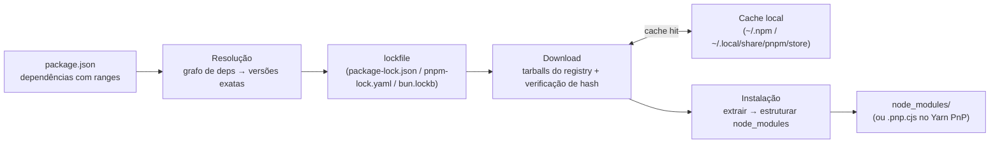
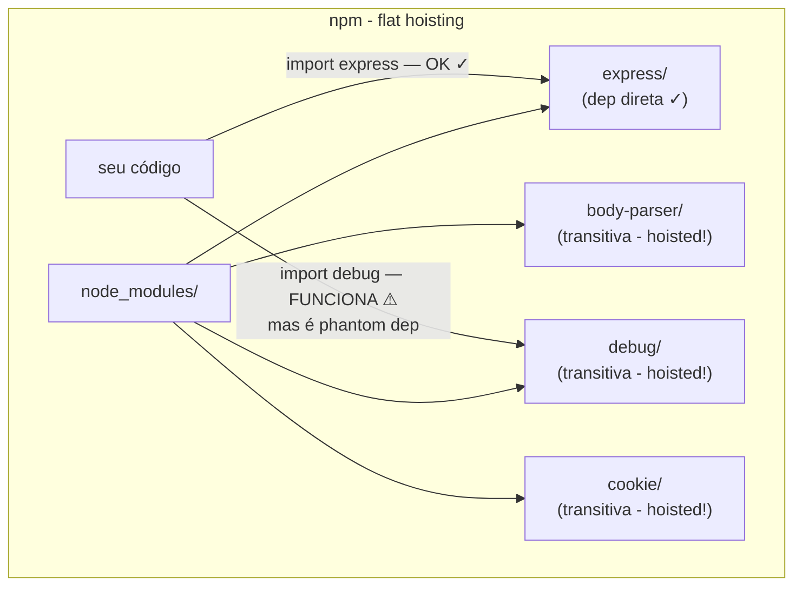
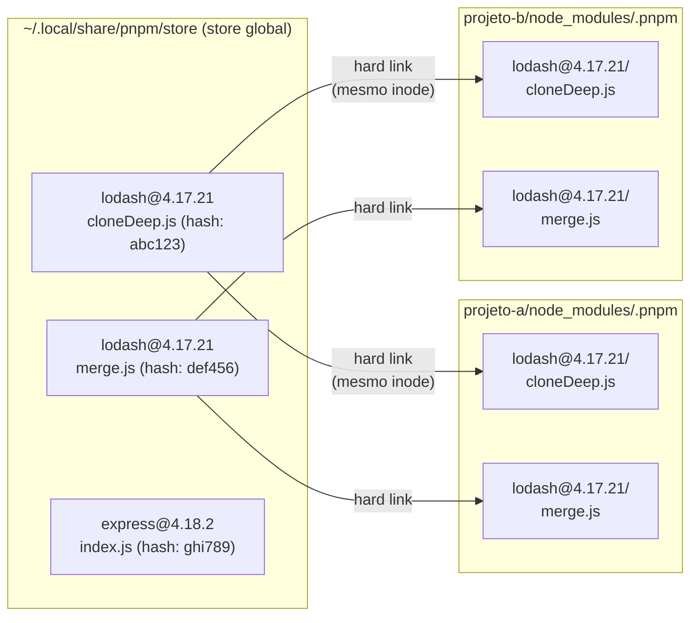
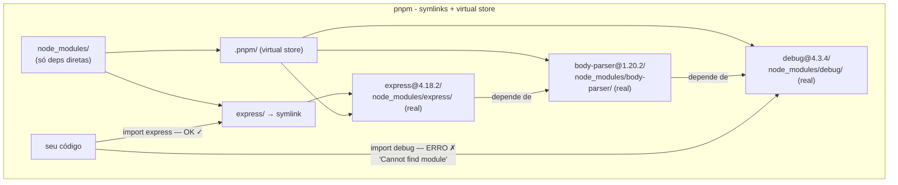
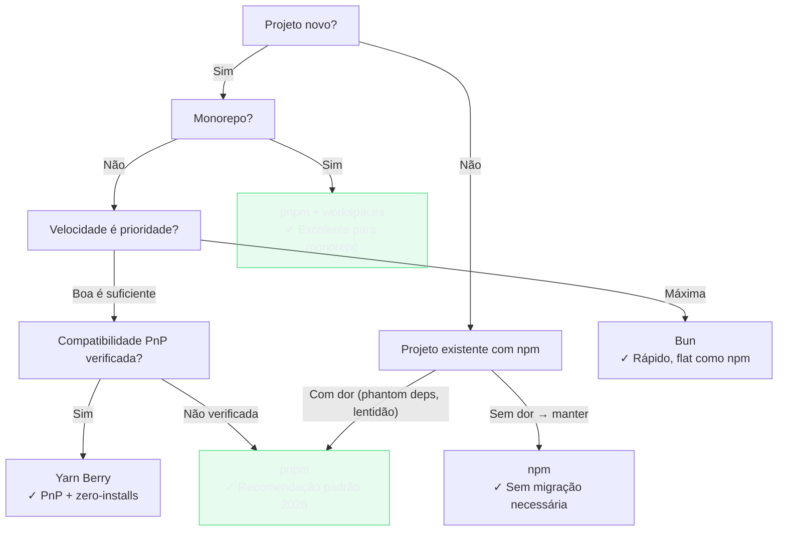

# Package managers: npm, pnpm, yarn e Bun

> [!abstract] TL;DR
> Um package manager resolve três problemas: **descobrir** onde uma dependência está (registry), **baixar** ela com integridade verificada e **instalá-la** de forma que o código possa importá-la. O npm inventou o modelo; o pnpm o tornou eficiente com um content-addressable store e symlinks que eliminam dependências fantasma — e desde o pnpm 10/11 também bloqueia lifecycle scripts e pacotes "zero-day" por padrão (única escolha com security-by-default); o Yarn Berry trocou `node_modules` pelo Plug'n'Play; o Bun faz tudo em Zig, 10–30× mais rápido, e desde a v1.2 usa um lockfile JSONC legível (`bun.lock`) em vez do binário. Em 2026, o pnpm é o padrão de facto em projetos novos sérios, o npm ainda domina em volume (49,6%), e o Bun cresce rápido entre quem quer velocidade máxima. O corepack permite cravar qual pm e qual versão cada projeto usa — mas foi removido do bundle do Node.js 25+ e agora é instalado separadamente.

---

## O que um package manager faz, de fato

Antes de comparar npm com pnpm com Yarn com Bun, vale perguntar: o que exatamente um package manager precisa fazer? A resposta tem três etapas distintas, e entendê-las separadas ajuda a ver por que cada ferramenta faz escolhas diferentes.

**Primeira etapa: resolução.** Dado um `package.json` com `"express": "^4.18.0"`, o package manager precisa determinar qual versão exata instalar — e quais versões exatas de *todas as dependências de express* também. Isso é um problema de resolução de grafo: express depende de body-parser, que depende de iconv-lite, que depende de safer-buffer. O grafo tem dezenas ou centenas de nós, e cada nó tem ranges de versão como restrição. Quem quer o quê, em qual versão compatível?

Na forma geral, esse problema pertence à classe NP-completo — o que, na prática, significa que não existe algoritmo garantidamente rápido para *qualquer* grafo de dependências possível. Dependendo da estrutura do grafo (muitos pacotes com ranges conflitantes e overlapping), o solver pode explodir exponencialmente. Isso explica por que instalações com conflitos severos de versão ficam travadas "calculando" por muito tempo — o solver está tentando todas as combinações. Na maioria dos projetos reais, o grafo é bem-comportado e heurísticas resolvem em milissegundos. Mas saber que o problema tem essa natureza ajuda a entender por que o pnpm e o Yarn Berry investiram em solvers alternativos — e por que lockfiles existem: uma vez resolvido, o resultado é gravado e nunca precisa ser recalculado enquanto o lockfile não mudar. O resultado fica gravado no lockfile (a nota [[05 - Semver e o grafo de dependências]] entra fundo nisso).

**Segunda etapa: download.** Uma vez resolvidas as versões exatas, o pm baixa os tarballs do registry (geralmente `registry.npmjs.org`). Aqui entra integridade: cada tarball tem um hash SHA-512 que é verificado após o download. Se o hash não bater, a instalação falha — é a primeira linha de defesa contra supply-chain attacks. O download pode ser pulado se o pacote já está em cache local.

**Terceira etapa: instalação.** O tarball baixado precisa ser extraído e colocado num lugar onde `require('express')` ou `import express from 'express'` funcione. Esta é a etapa onde os package managers divergem radicalmente — e onde mora boa parte das diferenças de velocidade, uso de disco e segurança.



> [!info] Leitura do diagrama
> O fluxo de instalação tem três fases independentes: resolver o grafo produz o lockfile; o lockfile direciona os downloads (com cache); os tarballs baixados são instalados na estrutura que o runtime vai encontrar. Cada pm faz as três etapas — as diferenças estão em *como* fazem a terceira.
>
> Cada pm gera um lockfile diferente: `package-lock.json` (npm), `pnpm-lock.yaml` (pnpm), `yarn.lock` (Yarn Berry), `bun.lock` (Bun 1.2+, JSONC). Nunca commite mais de um lockfile no mesmo projeto — é sinal de que dois pms foram usados.

O registry padrão é o `registry.npmjs.org`, mantido pela npm Inc. (parte da GitHub, que é parte da Microsoft). Ele serve todos os quatro gerenciadores — npm, pnpm, yarn e Bun todos publicam e consomem o mesmo registry. A diferença entre eles está exclusivamente em como instalam, não em de onde baixam.

---

## npm: o pai de todos, flat e com hoisting

O npm (Node Package Manager) foi criado por Isaac Schlueter em 2010 e chegou junto com o Node.js desde a versão 0.6. É a ferramenta com que o ecossistema cresceu, e seus padrões — `package.json`, `node_modules`, o registry — são a lingua franca de toda a toolchain JS.

**Versão atual:** npm 11.7.x, bundled com Node.js 24.x (LTS). O Node.js 22.x (também LTS, ativo até abril/2027) vem com npm 10.x. Uma pré-release do npm 12 existe desde junho/2026, mas ainda instável.

O npm 11 (lançado em dezembro/2024) trouxe breaking changes importantes:
- Instalação via git URL agora exige opt-in explícito (`allow-git`)
- `npm shrinkwrap` foi removido
- Configs desconhecidas no `.npmrc` agora lançam erro (antes apenas avisavam)
- Suporte apenas a Node.js 22+ e 24+

### A estrutura flat e o problema do phantom dependency

O design fundamental do npm é o **hoisting flat**: todas as dependências (diretas *e* transitivas) são elevadas para a raiz de `node_modules/`. Ao instalar apenas `express`, o npm cria entradas para `body-parser`, `cookie`, `debug`, `etag`, `depd` e dezenas de outros pacotes dos quais você nunca ouviu falar — todos na raiz de `node_modules/`.

Isso tem um efeito colateral que o time do Rush (Microsoft) batizou de **phantom dependency** (dependência fantasma): qualquer pacote transitivo que foi hoisted fica *acessível* para o seu código, mesmo que você nunca o tenha declarado no `package.json`.

```bash
# Você declarou só express
# package.json: { "dependencies": { "express": "^4.18.0" } }

# Mas no node_modules você tem:
node_modules/
  express/
  body-parser/    # dependência de express
  debug/          # dependência de body-parser
  cookie/         # dependência de express
  depd/           # ...
  # ... dezenas de outras
```

Se o seu código fizer `import debug from 'debug'` sem declarar `debug` no `package.json`, isso *funciona* — enquanto `express` for uma dependência e enquanto `express` continuar dependendo de `debug`. No dia que `express` atualizar e remover essa dependência transitiva, o seu `import debug` quebra. Isso é um phantom dependency: funciona por acidente, quebra por acidente.



> [!warning] Por que phantom deps são perigosas em produção
> A empresa Mergify documentou seu processo de migração npm → pnpm e encontrou 3 phantom deps em produção: `date-fns` (importada diretamente, mas só declarada como dep de `react-date-range`), `@tanstack/table-core` e `react-is` (via `recharts`). Todas funcionavam em desenvolvimento — quebraram quando as dependências intermediárias foram atualizadas.
>
> Um caso clássico: seu projeto usa `brace-expansion` sem declarar. `minimatch` (dep transitiva) o inclui. `minimatch` faz um patch release que faz major upgrade do `brace-expansion`. Você roda `npm update` numa sexta-feira e o projeto quebra no sábado em produção — sem nenhuma mudança no seu código.

### Uso básico do npm

```bash
# Instalar todas as dependências do package.json
npm install

# Adicionar uma nova dependência
npm install express
npm install --save-dev typescript  # só em dev (devDependencies)

# Remover
npm uninstall express

# Executar script definido no package.json
npm run build
npm run dev

# Verificar vulnerabilidades
npm audit

# Instalar globalmente (prefira evitar — use npx ou corepack)
npm install -g pnpm
```

O arquivo gerado é o `package-lock.json` — um snapshot exato de todo o grafo resolvido, com hashes de integridade para cada pacote.

### Provenance e trusted publishing (npm 11.5+)

Quando você publica um pacote npm do GitHub Actions, o fluxo tradicional exige um token de API armazenado como secret do repositório — que pode vazar, ser roubado ou ter escopo excessivo. O npm introduziu **trusted publishing** (disponibilidade geral em julho/2025, requer npm CLI 11.5.1+): o GitHub emite um token OIDC efêmero que o npm valida sem que você precise gerenciar nenhum secret.

Junto com trusted publishing, o npm gera automaticamente um **provenance attestation** — um atestado criptográfico assinado pela infraestrutura OIDC do GitHub que vincula o tarball publicado ao commit e ao workflow exatos que o geraram. Usuários do pacote podem verificar: "esse `express@5.0.0` foi gerado pelo workflow `release.yml` no commit `abc123` do repositório `expressjs/express`?"

```bash
# Publicar com provenance manual (em CI com OIDC configurado)
npm publish --provenance

# Com trusted publishing (npm 11.5.1+), provenance é gerado automaticamente
# Sem flag necessária
```

> [!info] O que o provenance não garante
> Provenance prova a cadeia de custódia do build — que o código do repositório virou aquele tarball. Não garante que o código do repositório é seguro. Supply chain attacks que modificam o repositório fonte (como comprometer o token git) ainda são possíveis. Provenance é uma camada, não uma solução completa.

O arquivo gerado é o `package-lock.json` — um snapshot exato de todo o grafo resolvido, com hashes de integridade para cada pacote.

---

## pnpm: content-addressable store + symlinks = eficiência e correção

O pnpm (performant npm) nasceu em 2016 com uma pergunta simples: e se, em vez de copiar os arquivos de cada pacote para cada `node_modules`, usássemos hard links para um store central? A resposta foi uma das evoluções mais elegantes do ecossistema JS.

**Versão atual:** pnpm 11.9.0 (junho/2026). O pnpm 11.0 foi lançado em abril/2026, exige Node.js 22+ e é ESM puro.

### O content-addressable store

O pnpm mantém um store global em `~/.local/share/pnpm/store` (Linux) / `~/Library/pnpm/store` (macOS). Cada arquivo de cada pacote é armazenado uma vez, indexado pelo hash do seu conteúdo — daí "content-addressable". Se `lodash@4.17.21` tem 100 arquivos, eles aparecem no store exatamente uma vez, independente de quantos projetos na sua máquina usem `lodash@4.17.21`.

Quando você instala, o pnpm não *copia* — ele cria **hard links**. Para entender por que isso importa, um passo atrás: no sistema de arquivos, todo arquivo tem dois componentes separados — os **dados** (os bytes em si, gravados em blocos no disco) e o **inode** (uma entrada de metadados que guarda o tamanho, permissões, timestamps e onde estão os blocos). O nome que você vê no terminal (`cloneDeep.js`) é apenas um ponteiro para um inode. Um hard link é um segundo ponteiro para o *mesmo* inode — mesmos blocos, mesmo conteúdo, zero bytes extras no disco. Deletar um dos ponteiros não apaga os dados; o sistema operacional só libera os blocos quando o contador de ponteiros chega a zero.

Isso significa que o pnpm pode ter `lodash@4.17.21` referenciado em 30 projetos diferentes e o arquivo `cloneDeep.js` existe fisicamente *uma única vez* no store. Cada projeto tem seu ponteiro (hard link), mas nenhuma cópia. Zero custo de disco extra, zero tempo de cópia — apenas a criação do ponteiro, que é instantânea.



> [!info] Hard links vs cópias
> Um hard link é um segundo nome para o mesmo arquivo no disco — não uma cópia. Modificar um hard link modifica o arquivo original, porque ambos *são* o mesmo arquivo. O pnpm só usa hard links para arquivos do store (read-only), então não há risco de corrupção. O resultado prático: se você usa 10 projetos que dependem de `lodash@4.17.21`, o pnpm usa ~79% menos espaço em disco que o npm nas mesmas condições.

**Uma limitação técnica importante:** hard links não funcionam entre filesystems diferentes (devices distintos). Se o seu projeto está num SSD externo e o store está no disco interno, o pnpm detecta isso e faz cópias em vez de hard links — você perde o benefício de espaço, mas não o de velocidade de resolução.

O pnpm 11 substituiu o índice do store de JSON para SQLite, reduzindo drasticamente o I/O — antes, milhões de arquivos JSON pequenos; agora, um banco de dados.

### Security by Default: por que o pnpm bloqueou os lifecycle scripts

Você sabia que instalar um pacote npm pode executar código arbitrário na sua máquina sem pedir permissão? Quando o npm (ou Bun) instala um pacote, qualquer script `postinstall` declarado no `package.json` do pacote é executado automaticamente — com as permissões do seu usuário, com acesso ao sistema de arquivos, rede e variáveis de ambiente.

O mecanismo existe por um motivo legítimo: alguns pacotes precisam compilar código nativo para a sua plataforma específica. O `sharp` (processamento de imagens) contém código C++ que precisa ser compilado para o seu sistema operacional, arquitetura (x86, ARM) e versão do Node.js. O `esbuild` distribui binários pré-compilados para cada plataforma — o `postinstall` detecta qual plataforma você está e baixa o binário certo. O `node-gyp` compila módulos nativos (SQLite, bcrypt, certas libs de criptografia) diretamente do código C++ via compilador local. Sem lifecycle scripts, nenhum desses pacotes funcionaria out-of-the-box.

O problema é que o mecanismo não distingue "compilar binário legítimo" de "exfiltrar variáveis de ambiente": qualquer `postinstall` roda com as mesmas permissões e sem sandbox.

Ataques reais exploraram isso. O caso mais famoso: o **evento-stream** (2018), quando um colaborador malicioso adicionou um pacote que rodava um postinstall para roubar carteiras de criptomoedas. O pacote tinha 2 milhões de downloads por semana. O npm não avisava; instalava e executava em silêncio.

O **pnpm 10** (2025) tomou uma decisão estrutural: postinstall e preinstall scripts **não rodam mais por padrão**. Para um pacote legítimo que precisa de script de build (como `esbuild`, `sharp`, `node-gyp`, `sqlite3`), você lista explicitamente em `pnpm-workspace.yaml`:

```yaml
# pnpm-workspace.yaml
onlyBuiltDependencies:
  - esbuild
  - sharp
  - "@parcel/watcher"
```

O **pnpm 11** (abril/2026) foi além. Ativou dois defaults adicionais de supply chain:

- **`minimumReleaseAge: 1440`** — pacotes publicados há menos de 24 horas não são instalados. Isso bloqueia "zero-day poisoning": atacante publica versão maliciosa de um pacote popular e a janela de 24 horas dá tempo para a comunidade detectar e sinalizar.
- **`blockExoticSubdeps: true`** — bloqueia dependências com protocolos não-padrão que poderiam escapar da verificação de integridade.

> [!warning] npm e Bun ainda rodam scripts por padrão
> Se você usa npm ou Bun, postinstall scripts continuam rodando automaticamente em toda instalação. Se supply chain security é preocupação real (projetos com dados sensíveis, ambientes corporativos), o pnpm é o único pm que oferece essa proteção por padrão em 2026.

> [!tip] Como verificar quais pacotes rodam scripts
> `pnpm ls --filter "has:postinstall"` lista pacotes com scripts de lifecycle no seu projeto. Em npm, `npm ls --parseable | xargs -I{} cat {}/package.json 2>/dev/null | jq -r 'select(.scripts.postinstall) | .name'` faz o mesmo (mais verboso).

### A estrutura de symlinks que elimina phantom deps

O pnpm resolve o problema de phantom dependencies com uma estrutura de `node_modules` diferente: apenas as dependências que você declarou no `package.json` aparecem na raiz de `node_modules/`. As transitivas ficam em `node_modules/.pnpm/`, acessíveis apenas para o pacote que as declarou.

```
node_modules/
  express/              → symlink → .pnpm/express@4.18.2/node_modules/express
  .pnpm/
    express@4.18.2/
      node_modules/
        express/        (arquivo real, via hard link do store)
        body-parser/    → .pnpm/body-parser@1.20.2/node_modules/body-parser
        cookie/         → .pnpm/cookie@0.6.0/node_modules/cookie
    body-parser@1.20.2/
      node_modules/
        body-parser/    (arquivo real)
        debug/          → .pnpm/debug@4.3.4/node_modules/debug
    debug@4.3.4/
      node_modules/
        debug/          (arquivo real)
```

Quando seu código faz `import debug from 'debug'`, o Node.js procura `node_modules/debug`. Esse diretório não existe na raiz — só `express/` e `.pnpm/` existem ali. O import falha com `Cannot find module 'debug'`, imediatamente, em desenvolvimento. Você descobre o problema antes de ir a produção.



### Uso básico do pnpm

```bash
# Instalar (drop-in replacement do npm install)
pnpm install

# Adicionar dependência
pnpm add express
pnpm add -D typescript

# Executar scripts
pnpm run build
pnpm dev          # atalho — pnpm tenta pnpm run dev automaticamente

# Limpar node_modules e reinstalar limpo
pnpm install --frozen-lockfile   # CI: falha se lockfile está desatualizado

# Ver o store global e quanto espaço usa
pnpm store status
pnpm store prune   # remove pacotes não usados por nenhum projeto

# Novo no pnpm 11: install limpo (equivalente a rm -rf node_modules && pnpm install)
pnpm ci
```

O lockfile do pnpm é o `pnpm-lock.yaml`.

### O protocolo `catalog:` — versões centralizadas em monorepos

Em monorepos com dezenas de pacotes, manter as versões de dependências sincronizadas é uma fonte de atrito: você declara `"react": "^19.0.0"` em 15 `package.json` diferentes, alguém atualiza em 10 deles e esquece os outros 5, e você começa a ter versões diferentes de React convivendo no mesmo repositório — com bugs difíceis de rastrear.

O pnpm resolveu isso com o **protocolo `catalog:`** (estável desde o pnpm 9, consolidado no 10). A ideia: defina as versões uma única vez em `pnpm-workspace.yaml`, e nos `package.json` dos pacotes individuais referencie com `"react": "catalog:"`.

```yaml
# pnpm-workspace.yaml — definição centralizada
catalog:
  react: "^19.0.0"
  typescript: "^5.4.0"
  vitest: "^3.0.0"

# Catalogs nomeados para casos diferentes
catalogs:
  react18:
    react: "^18.3.0"
  react19:
    react: "^19.0.0"
```

```json
// packages/meu-componente/package.json
{
  "dependencies": {
    "react": "catalog:"        // usa o catalog default
  },
  "devDependencies": {
    "react": "catalog:react18" // usa o catalog nomeado
  }
}
```

Quando você precisa atualizar `react` para `^19.1.0`, muda **uma linha** no `pnpm-workspace.yaml` — todos os pacotes do monorepo são atualizados na próxima instalação, com um único commit, zero merge conflicts de `package.json`.

> [!info] Três modos de catalog
> O campo `catalogMode` no `pnpm-workspace.yaml` controla como o `pnpm add` interage com catalogs: `strict` (só aceita versões do catalog — erro se tentar adicionar fora dele), `prefer` (usa o catalog quando compatível, cai back para dep direta), e `manual` (default — não adiciona ao catalog automaticamente, você gerencia manualmente).

> [!tip] pnpm em CI é especialmente vantajoso
> Em pipelines de CI que rodam muitos jobs em paralelo (monorepos, matrix builds), o store compartilhado do pnpm é especialmente valioso. O primeiro job baixa os pacotes para o store; os jobs seguintes só criam hard links — sem novo download, sem nova cópia. Tempo de install: benchmark de monorepo com 800 deps — npm 134s vs pnpm 18s (~7× mais rápido).

---

## Yarn: da reinvenção ao Plug'n'Play

O Yarn foi criado em 2016 por uma equipe do Facebook (Meta) para resolver os problemas de performance e determinismo do npm da época (npm 2/3). A ironia é que muitos dos problemas que o Yarn resolveu foram depois resolvidos pelo próprio npm — tornando o caso de uso do Yarn menos claro ao longo do tempo.

### Yarn Classic (1.x) — o legado em manutenção

O Yarn Classic (versão 1.x) funciona de forma muito similar ao npm moderno: resolve dependências, faz hoisting flat para `node_modules`, tem as mesmas vulnerabilidades a phantom deps. Seu diferencial original — determinismo via lockfile — o npm absorveu com o `package-lock.json`. Sua performance — hoje o npm também é razoável.

O Yarn Classic 1.x está **em manutenção desde janeiro de 2020**. A última versão foi a 1.22.22, em março de 2024. Não recebe novas features. O time oficial recomenda migrar para o Yarn Berry.

### Yarn Berry (2.x → 4.x) — Plug'n'Play e a aposta ousada

O Yarn Berry (versão 2+) é uma reescrita completa que tomou uma decisão radical: abandonar `node_modules` completamente. No lugar, o Yarn Berry usa **Plug'n'Play** (PnP).

**Versão atual:** Yarn 4.17.0 (lançada em junho/2026). As versões 2 e 3 são EOL (v3 encerrou suporte em dezembro/2024).

#### Como o PnP funciona

Em vez de criar `node_modules/`, o Yarn gera um único arquivo `.pnp.cjs` que contém dois mapas:

1. **nome + versão → localização no disco** (arquivo `.zip` no cache `.yarn/cache/`)
2. **nome + versão → lista de dependências permitidas para aquele pacote**

O Node.js carrega esse loader antes de resolver qualquer import. Quando o código tenta `import express`, o loader consulta o mapa, encontra onde `express` está no cache e o serve. Quando o código tenta `import debug` sem ter declarado `debug` como dependência, o loader consulta o segundo mapa, vê que `debug` não está na lista de permissões e **rejeita com um erro semântico imediato e informativo**:

```
Error: debug isn't allowed to be imported
This package requires access to a peer package named debug,
but that package is not defined in its package.json.
```

```bash
# .pnp.cjs (estrutura simplificada)
const packageLocatorsByLocations = new Map([
  ["express@npm:4.18.2", ...],
  ["body-parser@npm:1.20.2", ...],
]);

const packageDependencies = new Map([
  ["express@npm:4.18.2", [["body-parser", "npm:1.20.2"], ...]],
  // debug não está na lista de seu projeto — import é negado
]);
```

**Zero-Installs** é uma prática que combina PnP com o cache versionado no repositório. Os pacotes ficam como arquivos `.zip` em `.yarn/cache/`, commitados no git junto com o `.pnp.cjs`. Após `git clone`, o projeto funciona sem `yarn install` nenhum — daí "zero installs". No Yarn 4.0, zero-installs vem **desativado por padrão** em projetos novos (o cache zip commitado cresce o repositório substancialmente).

> [!warning] Compatibilidade do PnP
> Nem todo pacote é compatível com o PnP. Ferramentas que assumem a existência de `node_modules/` e fazem `fs.readdir('node_modules')` ou resolvem paths manualmente (em vez de usar `require.resolve`) falham silenciosamente ou com erros difíceis de diagnosticar. Ferramentas comuns problemáticas historicamente: Jest (resolvido com `jest-pnp-resolver`), algumas ferramentas de build que bundlam workers, e editores sem suporte a SDK do Yarn.
>
> O Yarn Berry oferece o modo `nodeLinker: node-modules` para compatibilidade total com o comportamento clássico — mas perde os benefícios do PnP.

```json
// .yarnrc.yml — configuração do Yarn Berry
yarnPath: .yarn/releases/yarn-4.17.0.cjs

# Para compatibilidade máxima (perde os benefícios do PnP):
nodeLinker: node-modules

# Para PnP (padrão):
nodeLinker: pnp
```

```bash
# Instalar (requer Node.js 18+)
yarn install

# Adicionar
yarn add express
yarn add -D typescript

# Executar scripts
yarn build
yarn run dev

# Atualizar para versão mais recente do Yarn no projeto
yarn set version stable
```

O lockfile do Yarn Berry é o `yarn.lock` (formato diferente do Classic, incompatível).

---

## Bun: velocidade como filosofia

O Bun nasceu em 2021 com uma proposta diferente: e se a toolchain JS inteira fosse reescrita em Zig (uma linguagem de sistemas como C/Rust) para ser genuinamente rápida? O resultado é uma ferramenta que faz quatro coisas — runtime, package manager, bundler e test runner — e as faz muito rapidamente.

**Versão atual:** 1.3.x (Bun 1.3 lançado em outubro/2025, última minor conhecida: 1.3.14). Uma v2.0 está prevista para o final de 2026. **Nota histórica:** a Oven (empresa criadora do Bun) foi adquirida pela Anthropic em dezembro/2025.

> [!note] Escopo desta nota
> Aqui cobrimos o Bun **como package manager** — `bun install`, `bun add`, `bun remove`. O Bun como runtime, bundler e test runner é território da [[20 - Bun como runtime e toolkit all-in-one]].

### Por que o Bun é tão rápido como pm

A velocidade não é mágica — é consequência de escolhas técnicas específicas:

1. **Código nativo:** escrito em Zig (compilado para código de máquina), não em JavaScript. O npm roda sobre o Node.js; o Bun não.

2. **Menos syscalls:** uma instalação típica com npm faz mais de 1.000.000 de syscalls. O Bun faz ~165.000. Cada syscall tem overhead — menos syscalls = mais rápido, especialmente com muitas dependências.

3. **Lockfile texto (JSONC):** desde o Bun 1.2 (janeiro/2025), o lockfile padrão mudou do binário `bun.lockb` para o `bun.lock` — um arquivo JSONC (JSON with Comments), legível e que aparece em diffs do GitHub. O formato binário ainda é suportado, mas o texto é o novo padrão. Antes dessa mudança, revisar mudanças de dependência em pull requests era impossível com o Bun.

4. **Paralelismo agressivo:** downloads e I/O acontecem em paralelo com maximização de concorrência.

**Benchmark representativo (dados de múltiplas fontes, 2025–2026):**

| Package manager | 50 deps (cold) | 800 deps monorepo |
|---|---|---|
| npm 11 | ~13s | ~134s |
| pnpm 11 | ~5s | ~18s |
| Yarn Berry 4 (node-modules) | ~8s | ~40s |
| **Bun 1.3** | **~0.8s** | **~4.8s** |

### Compatibilidade como package manager

O `bun install` é um drop-in replacement para `npm install` — cria `node_modules/` com a mesma estrutura flat que o npm usaria. Suporta:

```bash
bun install          # instala do package.json
bun add express      # adiciona dependência
bun add -d typescript # devDependency
bun remove express   # remove

# Lê package.json normal — nenhuma mudança de formato necessária
# Gera bun.lockb (binário) ao lado de package.json
```

> [!info] Estrutura flat: Bun tem as mesmas phantom deps do npm
> O Bun usa hoisting flat como o npm — mesma estrutura de `node_modules`, mesmos phantom deps possíveis. Se você quer eliminar phantom deps, pnpm ou Yarn PnP são as escolhas certas. O Bun otimiza velocidade, não correção de dependências.

O Bun pode ler `package-lock.json` e `yarn.lock` para uma migração sem `install` completo, mas o seu formato nativo é `bun.lockb`. O Bun **não suporta corepack** — tem seu próprio mecanismo de versionamento.

**Compatibilidade com Node.js:** a partir da v1.2 (abril/2025) e v1.3, o Bun passou centenas de testes adicionais da suite oficial do Node.js. Para projetos JS/TS puros, a compatibilidade é praticamente total. Pacotes com addons nativos C++ complexos (N-API) podem ter comportamento variável.

---

## Corepack: cravar o package manager por projeto

O corepack é uma ferramenta que funciona como um shim — um proxy — para `yarn` e `pnpm`. A mecânica é simples: quando você roda `corepack enable`, ele coloca executáveis chamados `pnpm`, `yarn` (e opcionalmente `npm`) num diretório que aparece *antes* de qualquer outra instalação no seu `$PATH`. Esses executáveis são o shim do corepack — não são o pnpm real, são scripts que interceptam a chamada.

Quando você digita `pnpm install`, o shim do corepack é encontrado primeiro no `$PATH`. Ele sobe a árvore de diretórios procurando o `package.json` mais próximo, lê o campo `packageManager`, determina qual versão do pnpm real precisa, baixa essa versão se não estiver em cache local (~/.node/corepack) e executa. Se você tiver o pnpm 10 instalado globalmente "atrás" do shim, ele nunca é chamado — o corepack já encaminhou para a versão correta.

Se o `packageManager` declarar `yarn` mas você digitar `pnpm`, o shim detecta a discrepância e aborta com um erro antes de executar qualquer coisa.

**Por que isso importa:** sem o corepack, um time pode ter desenvolvedores usando pnpm 10 e pnpm 11 ao mesmo tempo, com lockfiles gerados de formas ligeiramente diferentes. O corepack garante que todos usem exatamente a versão declarada no projeto.

### O campo `packageManager` no package.json

```json
{
  "name": "meu-projeto",
  "version": "1.0.0",
  "packageManager": "pnpm@11.9.0"
}
```

Ao chamar `pnpm` com o corepack ativo, ele sobe a árvore de diretórios buscando o `package.json` mais próximo, lê `packageManager` e:
- Se o pm chamado bate com o declarado, usa a versão exata especificada
- Se o pm chamado não bate (e.g., você digitou `npm install` num projeto que declara `pnpm`), aborta com erro

A sintaxe do campo aceita hash de integridade opcional:

```json
// Versão exata com hash (máxima segurança)
{ "packageManager": "yarn@4.17.0+sha224.953c8233f7a92884eee2de69a1b92d1f2ec1655e66d08071ba9a02fa" }

// Versão exata sem hash (suficiente para a maioria dos projetos)
{ "packageManager": "pnpm@11.9.0" }
```

Sintaxe que **não funciona**:

```json
{ "packageManager": "npm@^10" }     // ranges não são aceitos
{ "packageManager": "pnpm@latest" } // "latest" não funciona
{ "packageManager": "yarn" }        // sem versão não funciona
```

### Status atual do corepack

O corepack foi incluído no Node.js pela primeira vez nas versões 14.19.0 e 16.9.0 (2022), mas **sempre desabilitado por padrão**. Nunca virou o padrão automático. Para ativá-lo, sempre foi necessário `corepack enable`.

**Mudança importante:** o Node.js TSC votou para remover o corepack do bundle a partir do Node.js 25.0.0 (outubro/2025). Em Node.js 25+, o corepack precisa ser instalado separadamente:

```bash
npm install -g corepack
```

O corepack continua sendo mantido como pacote npm independente. O Node.js 22.x e 24.x (ambos LTS) ainda vêm com corepack bundled.

```bash
# Node.js 22.x e 24.x — corepack já está disponível
corepack enable           # ativa shims para yarn e pnpm
corepack enable npm       # ativa shim para npm também (não padrão)

# Definir versão no projeto atual
corepack use pnpm@11.9.0  # atualiza para latest da série 11 e grava no package.json
corepack use pnpm@latest  # usa a mais recente disponível

# Instalar versão global
corepack install --global yarn@4.17.0

# Limpar cache
corepack cache clean

# Atualizar para versão mais recente da série definida no package.json
corepack up
```

> [!tip] Corepack em CI
> Em pipelines de CI, prefira instalar a versão específica do pm diretamente (e.g., `npm install -g pnpm@11.9.0`) em vez de depender do corepack. É mais explícito e não exige habilitar o corepack separadamente. O corepack brilha em ambientes de desenvolvimento local, onde a diversidade de projetos com pms e versões diferentes é real.

---

## O package.json: o contrato do projeto

O `package.json` é o arquivo central de qualquer projeto Node.js/JS. Todo package manager o lê, e é importante entender os campos principais — especialmente a distinção entre `dependencies` e `devDependencies`, que confunde muito iniciante.

```json
{
  "name": "meu-app",
  "version": "1.0.0",
  "description": "Exemplo para a nota 03",
  "packageManager": "pnpm@11.9.0",

  "dependencies": {
    "express": "^4.18.0",
    "zod": "^3.22.0"
  },

  "devDependencies": {
    "typescript": "^5.4.0",
    "@types/express": "^4.17.0",
    "vitest": "^1.6.0",
    "eslint": "^9.0.0"
  },

  "scripts": {
    "dev": "node --watch src/index.js",
    "build": "tsc",
    "test": "vitest",
    "lint": "eslint src/"
  },

  "engines": {
    "node": ">=22.0.0",
    "pnpm": ">=11.0.0"
  }
}
```

**`dependencies` vs `devDependencies` — a distinção que importa:**

- **`dependencies`:** pacotes necessários em *runtime* — quando o app está rodando em produção. Express, Zod, banco de dados, clientes HTTP.
- **`devDependencies`:** pacotes necessários apenas para *desenvolvimento* — TypeScript, test runners, linters, bundlers. Quando alguém instala seu pacote como biblioteca, as `devDependencies` são ignoradas.

> [!warning] Confusão comum: bundlers em `devDependencies`
> Se você usa Vite ou webpack para fazer build e o output é um bundle estático, então Vite e webpack são `devDependencies` — eles não vão para produção, só o bundle vai. Mas se você tem um app Node.js que roda scripts de transformação em runtime, essas ferramentas precisam estar em `dependencies`.

**`scripts`** são atalhos para comandos que todos os pms suportam via `npm run <nome>` / `pnpm run <nome>` / `yarn <nome>` / `bun run <nome>`. Os nomes `dev`, `build`, `test`, `lint` e `start` são convenção do ecossistema — qualquer nome funciona, mas esses são os esperados por ferramentas de CI, editores e Dockerfiles.

**`engines`** declara quais versões de Node.js (e de package managers) o projeto suporta. O npm e pnpm podem ser configurados para falhar se a versão atual não satisfaz — importante em times com versões diferentes de Node.

---

## O mesmo projeto nos quatro package managers

Para tornar concreto, veja como as operações fundamentais mapeiam nos quatro pms. Considere um projeto `meu-app` sendo configurado do zero:

```bash
# ── Inicializar o projeto ──────────────────────────────────────────────────

# npm
npm init -y

# pnpm
pnpm init

# yarn (Berry)
yarn init -2          # -2 para iniciar direto no Yarn Berry

# bun
bun init

# ── Instalar dependências ──────────────────────────────────────────────────

# npm
npm install express zod
npm install --save-dev typescript @types/express vitest

# pnpm
pnpm add express zod
pnpm add -D typescript @types/express vitest

# yarn
yarn add express zod
yarn add --dev typescript @types/express vitest

# bun
bun add express zod
bun add -d typescript @types/express vitest

# ── O que cada um gera ────────────────────────────────────────────────────
# npm:     package-lock.json + node_modules/ (flat)
# pnpm:    pnpm-lock.yaml + node_modules/ (symlinks) + .pnpm/
# yarn:    yarn.lock + .pnp.cjs + .yarn/cache/ (sem node_modules com PnP)
# bun:     bun.lock (JSONC, desde v1.2) + node_modules/ (flat)

# ── Instalar de um lockfile existente (CI) ────────────────────────────────

# npm: lê package-lock.json, falha se desatualizado
npm ci

# pnpm: lê pnpm-lock.yaml, falha se desatualizado
pnpm install --frozen-lockfile

# yarn: modo equivalente
yarn install --immutable

# bun: lê bun.lockb ou package-lock.json
bun install --frozen-lockfile

# ── Executar scripts ──────────────────────────────────────────────────────

npm run build     # npm sempre exige "run"
pnpm build        # pnpm omite "run" em scripts com nome livre de conflito
yarn build        # yarn também omite "run"
bun run build     # bun sempre usa "run"

# ── Executar binários sem instalar globalmente ────────────────────────────

npx create-vite my-app        # npm
pnpm dlx create-vite my-app   # pnpm
yarn dlx create-vite my-app   # yarn
bunx create-vite my-app       # bun
```

> [!example] Migrar de npm para pnpm num projeto existente
> ```bash
> # 1. Instalar pnpm
> npm install -g pnpm
>
> # 2. No projeto: deletar o node_modules e o lockfile do npm
> rm -rf node_modules package-lock.json
>
> # 3. Instalar com pnpm (gera pnpm-lock.yaml e node_modules/ com symlinks)
> pnpm install
>
> # 4. (Opcional) Cravar a versão no package.json via corepack
> corepack enable
> corepack use pnpm@11.9.0
>
> # 5. Rodar os testes — se phantom deps existirem, elas quebram aqui
> pnpm test
> ```
> O passo 5 é onde você descobre se o projeto tinha phantom dependencies. Erros de `Cannot find module` com pacotes que você nunca declarou explicitamente são sinais de phantom deps — e o pnpm fez você um favor ao revelar o problema.

---

## Dados de uso em 2024/2026

Qual package manager o mercado está usando? Os dados mais representativos disponíveis:

**Stack Overflow Developer Survey 2024** (~65.000 respondentes):

| Package Manager | 2022 | 2023 | 2024 | Tendência |
|---|---|---|---|---|
| npm | 65,2% | 49,4% | **49,6%** | Estável (queda anterior foi artefato de medição) |
| Yarn | 27,6% | 21,9% | **18,8%** | Declínio consistente |
| pnpm | n/a | 6,3% | **8,9%** | Crescimento |
| Bun | n/a | 0,8% | **3,8%** | Crescimento acelerado (5×) |

**State of JS 2024 — seção Monorepo Tools (retenção entre usuários que já usaram):**

| Ferramenta | Retenção 2024 |
|---|---|
| pnpm | ~93% (S-tier) |
| npm Workspaces | ~70% |
| Yarn Workspaces | ~60% |

**Análise de lockfiles em repositórios GitHub populares (2.040 repos):**

| Package Manager | Todos os repos | Repos recentes (≤1 ano, >1k stars) |
|---|---|---|
| npm | 53% | 63% |
| Yarn Classic | 26% | **14%** (queda de 12pp) |
| pnpm | 6% | **16%** (mais que dobrou) |
| Yarn Berry | 4% | 2% |
| Bun | ~0% | 1% |

> [!info] Como interpretar esses números
> O npm mantém dominância em volume porque é o padrão bundled com o Node.js e tem 15 anos de inércia. Projetos existentes não migram sem motivo. O dado mais revelador é o dos **repositórios recentes com mais de 1k stars** — projetos que foram criados no último ano por pessoas que escolheram ativamente. Ali, o pnpm triplicou sua presença (6% → 16%) e o Yarn Classic está em colapso (26% → 14%). Quem começa projetos novos hoje escolhe pnpm.

---

## Qual escolher e por quê

Não existe resposta única — depende do contexto. Mas existem padrões claros:

**npm** — quando:
- O projeto já usa npm e não há dor visível
- É um script simples / projeto solo de baixa duração
- A equipe tem pouca familiaridade com alternativas
- Você precisa do mínimo de configuração possível

**pnpm** — quando:
- Você quer eliminar phantom dependencies (segurança, correção)
- Trabalha com monorepo (pnpm workspaces é excelente)
- Velocidade e uso de disco importam (CI caro, muitos projetos)
- Projeto novo onde você pode escolher sem migração
- **→ Recomendação padrão para projetos novos em 2026**

**Yarn Berry** — quando:
- O time já usa e conhece bem
- Zero-installs faz sentido para o workflow (cache commitado no git)
- Compatibilidade do PnP com todo o ecossistema foi verificada
- Projetos que precisam do determinismo extremo que o PnP oferece

**Bun (como pm)** — quando:
- Velocidade máxima de install é crítica
- O projeto é JS/TS puro (sem addons nativos C++)
- Você já usa o Bun como runtime (faz sentido consolidar)
- Projetos experimentais ou MVPs onde velocity > robustez



---

## Como explicar em inglês

A **package manager** in the JavaScript ecosystem has three responsibilities: **resolving** which exact versions of all dependencies (direct and transitive) to install, **downloading** those packages from the registry (usually npmjs.com) with integrity verification, and **installing** them in a way the runtime can find via `require()` or `import`.

The key technical differences between package managers come down to how they handle the installation step:

- **npm** uses **flat hoisting**: all packages (direct and transitive dependencies) are placed in the root `node_modules/` directory, creating the "phantom dependency" problem — your code can accidentally `import` a transitive package that was never declared in your `package.json`. If that transitive dep is removed in an upstream update, your code breaks.

- **pnpm** uses a **content-addressable store** with **hard links and symlinks**: packages are stored once globally (indexed by content hash), and projects use hard links — zero extra disk space. Only direct dependencies appear at the root of `node_modules/`; transitives are isolated in `.pnpm/`, preventing phantom dependencies at install time.

- **Yarn Berry** uses **Plug'n'Play** (PnP): instead of `node_modules/`, it generates a single `.pnp.cjs` file mapping each package to its allowed dependencies. Importing an undeclared package fails immediately with a semantic error.

- **Bun** is written in **Zig** (systems language), uses ~165k syscalls vs npm's 1M+, and since v1.2 uses a text-based JSONC lockfile (`bun.lock`) instead of the former binary `bun.lockb` — making it 10–30× faster than npm while now producing human-readable diffs. It uses the same flat hoisting as npm, so phantom dependencies are still possible.

**pnpm 10/11 introduced security-by-default**: lifecycle scripts (`postinstall`/`preinstall`) no longer run automatically — packages must be explicitly allowlisted via `onlyBuiltDependencies`. pnpm 11 also defaults `minimumReleaseAge` to 1440 minutes (24 hours), blocking newly published packages from being resolved until the community has had time to flag malicious releases.

**Corepack** is a tool that pins the package manager version per project via the `packageManager` field in `package.json`. It ships with Node.js 22/24 but was removed from Node.js 25+ bundle and must be installed separately.

### Vocabulário-chave

| Português | Inglês |
|---|---|
| gerenciador de pacotes | package manager |
| registro / repositório de pacotes | registry |
| dependência fantasma | phantom dependency |
| içamento / elevação flat | flat hoisting |
| armazenamento endereçável por conteúdo | content-addressable store |
| link físico / hard link | hard link |
| link simbólico | symlink / symbolic link |
| arquivo de lock | lockfile |
| dependências de desenvolvimento | dev dependencies / devDependencies |
| resolução de dependências | dependency resolution |
| grafo de dependências | dependency graph |
| espaço em disco | disk space |
| instalar | install |
| publicar | publish |
| monorepo / espaços de trabalho | monorepo / workspaces |
| atestado de procedência | provenance attestation |
| script de ciclo de vida | lifecycle script |
| ataque à cadeia de suprimentos | supply chain attack |
| catálogo de versões | version catalog |
| dependência entre pares | peer dependency |

---

## Armadilhas comuns

> [!warning] Armadilha 1: misturar package managers no mesmo projeto
> Usar `npm install` num projeto que usa pnpm gera um `package-lock.json` ao lado do `pnpm-lock.yaml`, levando a inconsistências. Nunca misture. Com corepack ativo, o shim bloqueia isso automaticamente. Sem corepack, discipline a equipe com o campo `engines.packageManager` ou documentação clara.

> [!warning] Armadilha 2: phantom deps que só quebram em produção
> O bug mais clássico: funciona em desenvolvimento (`node_modules` flat tem tudo), quebra quando você muda a versão de uma dependência direta que carregava o pacote fantasma. O pnpm e o Yarn PnP revelam esse problema na instalação. Se você está em npm, faça `npm ls <pacote>` para verificar se um pacote está declarado diretamente antes de importá-lo.

> [!warning] Armadilha 3: instalar globalmente em vez de usar npx/dlx
> `npm install -g create-react-app` instala uma versão que pode ficar desatualizada indefinidamente. Prefira sempre `npx create-react-app` (npm), `pnpm dlx create-vite` (pnpm) ou `bunx create-vite` (bun) — esses comandos baixam a versão mais recente toda vez, sem poluir o ambiente global.

> [!warning] Armadilha 4: esquecer `--frozen-lockfile` em CI
> Rodar `npm install` (sem `npm ci`) em CI permite que o lockfile seja atualizado silenciosamente se houver incompatibilidade. Use `npm ci`, `pnpm install --frozen-lockfile` ou `bun install --frozen-lockfile` em CI para garantir que o build usa exatamente o que o lockfile declara.

> [!warning] Armadilha 5: `peerDependencies` não instaladas automaticamente pelo pnpm
> O pnpm respeita estritamente as `peerDependencies`: se um pacote declara `peerDependencies` e você não as instalou, o pnpm avisa (não instala silenciosamente como o npm faz). Se você ver warnings de `missing peer dependencies` após migrar para pnpm, não ignore — adicione as deps explicitamente. Veja [[05 - Semver e o grafo de dependências]] para o detalhe.

> [!warning] Armadilha 6: Yarn PnP e ferramentas incompatíveis
> O Yarn PnP não funciona com ferramentas que resolvem módulos manualmente (em vez de usar a API de resolução do Node.js). Antes de adotar Yarn Berry com PnP, verifique compatibilidade de todas as ferramentas do seu stack — especialmente bundlers, test runners e plugins mais obscuros. Em caso de dúvida, use o modo `nodeLinker: node-modules` do Yarn Berry, que mantém o comportamento clássico.

> [!tip] Armadilha 7: imports estranhos ou erros inexplicáveis de módulo
> Se algo parece errado com imports mas o código está correto, tente uma reinstalação limpa — é mais rápido do que parece, porque o store/cache está quente. Em npm: `rm -rf node_modules && npm install`. Em pnpm: `pnpm ci` (pnpm 11+, clean install) ou `rm -rf node_modules && pnpm install`. A maioria dos "meus imports estão estranhos" resolve com reinstalação limpa.

---

## Workspaces: monorepos nativos

Todo pm moderno suporta **workspaces** — a capacidade de gerenciar múltiplos pacotes em um único repositório compartilhando um lockfile e (no caso de npm/pnpm/Bun) um único `node_modules`. A alternativa clássica sem workspaces é uma pasta de repos separados, cada um com seu próprio `node_modules` duplicado.

```
meu-monorepo/
├── package.json          # root (com "workspaces": ["packages/*"])
├── pnpm-workspace.yaml   # (pnpm) ou campo workspaces no package.json (npm/yarn/bun)
└── packages/
    ├── frontend/         # um workspace
    ├── backend/          # outro workspace
    └── shared/           # biblioteca compartilhada
```

Diferenças práticas entre os pms em contexto de workspaces:

| Feature | npm | pnpm | Yarn Berry | Bun |
|---|---|---|---|---|
| Store compartilhado entre workspaces | Sim (flat) | Sim (hard links do store) | Sim (.yarn/cache) | Sim (flat) |
| Dependências cruzadas entre workspaces | `workspace:*` | `workspace:*` | `workspace:*` | `workspace:*` |
| Protocolo `catalog:` | Não | **Sim** | Não | Não |
| Filtrar scripts por workspace afetado | Limitado | `--filter` poderoso | `--filter` | `--filter` |
| Base de ferramentas como Turborepo/Nx | Usa npm workspaces | **Preferido** | Suportado | Experimental |

> [!tip] O protocolo `workspace:*`
> Quando um workspace depende de outro no mesmo monorepo (`"shared": "workspace:*"`), o pm cria um link simbólico ao invés de baixar do registry. Isso significa que mudanças em `shared/` são imediatamente visíveis em `frontend/` sem precisar publicar ou reinstalar. Todos os quatro pms suportam esse protocolo.

Para aprofundar workspaces em contexto de monorepo e ferramentas de orquestração como Turborepo e Nx, veja [[21 - Monorepos - workspaces, Turborepo, Nx e changesets]].

---

## peerDependencies: dependências que você precisa fornecer

Uma pergunta que confunde todo iniciante: por que um pacote às vezes instala sem erro mas depois trava na importação com "Cannot find module react"?

A resposta está nas **`peerDependencies`**. São diferentes das `dependencies` normais: em vez de o pacote instalar a dependência para si mesmo, ele *declara* que precisa que o **consumidor** forneça aquela dependência.

O caso canônico: um componente React (`meu-button`) usa `import React from 'react'`. Se `meu-button` declarasse `react` em `dependencies`, cada projeto que instalasse `meu-button` poderia ter duas versões de React — a dele e a do `meu-button` — e React tem estado global (o contexto) que não funciona com duas instâncias. A solução: `meu-button` declara `react` em `peerDependencies`:

```json
{
  "name": "meu-button",
  "peerDependencies": {
    "react": ">=18.0.0"
  }
}
```

Isso diz: "eu uso React, mas espero que quem me instala já tenha React no projeto". A instalação funciona; apenas na hora de importar é que o react do *projeto consumidor* é usado.

**Como cada pm trata peerDeps:**

- **npm:** instala automaticamente (na versão que satisfaz o range), às vezes gerando conflitos silenciosos. Desde npm 7, `--legacy-peer-deps` existe para o comportamento antigo de ignorar peerDeps.
- **pnpm:** avisa quando uma peerDependency está faltante, mas não instala automaticamente. É mais estrito que o npm — você verá warnings claros e deve adicionar as peers explicitamente.
- **Yarn Berry:** comportamento configurável; PnP é especialmente rigoroso (verifica peers em tempo de import).
- **Bun:** similar ao npm — instala peers automaticamente.

> [!warning] O warning de peer dep do pnpm não é opcional
> Quando o pnpm avisa `WARN Issues with peer dependencies`, não ignore. Ao contrário do npm, onde o warning é "algo pode não funcionar", no pnpm o warning significa que o grafo de dependências está incompleto. Adicione as peers explicitamente ao seu `package.json`.

---

## Referências

- **pnpm** — [*pnpm 11.0 — Release Notes*](https://pnpm.io/blog/releases/11.0) (2026). Detalhes do `minimumReleaseAge`, `blockExoticSubdeps`, store SQLite e ESM puro.
- **pnpm** — [*pnpm in 2025*](https://pnpm.io/blog/2025/12/29/pnpm-in-2025) (2025). Balanço de features: JSR, catalogs, runtime management, Security by Default.
- **pnpm** — [*Catalogs*](https://pnpm.io/catalogs) (docs). Protocolo `catalog:`, modos strict/prefer/manual.
- **pnpm** — [*Mitigating supply chain attacks*](https://pnpm.io/supply-chain-security) (docs). `allowBuilds`, lifecycle scripts e defesas de supply chain.
- **npm** — [*Trusted Publishers*](https://docs.npmjs.com/trusted-publishers/) (docs). OIDC, provenance attestations, trusted publishing sem tokens.
- **Bun** — [*Bun's new text-based lockfile*](https://bun.com/blog/bun-lock-text-lockfile) (2025). Migração de `bun.lockb` para `bun.lock` JSONC no Bun 1.2.
- **InfoQ** — [*pnpm 11 RC: ESM Distribution, Supply Chain Defaults and a New Store Format*](https://www.infoq.com/news/2026/04/pnpm-11-rc-release/) (2026).

---

## Veja também

- [[04 - Gerenciando versões de Node]] — nvm, fnm, Volta e asdf: como controlar qual versão do Node.js cada projeto usa; complementa o corepack (que controla o pm)
- [[05 - Semver e o grafo de dependências]] — semver, lockfiles, resolução de versões, peerDependencies, `overrides` — o que esta nota mencionou brevemente, a nota 05 entra a fundo
- [[20 - Bun como runtime e toolkit all-in-one]] — o Bun como runtime (não o pm): event loop, APIs nativas, bundler integrado, quando Bun substitui Node.js
- [[21 - Monorepos - workspaces, Turborepo, Nx e changesets]] — workspaces aprofundados: como Turborepo e Nx orquestram builds em monorepos, changesets para versionamento de pacotes
- [[24 - Supply chain e segurança de dependências]] — integridade de lockfile, `npm audit`, provenance, typosquatting, as implicações de segurança das phantom deps e dos lifecycle scripts

---

> [!abstract] Resumo em uma linha
> O npm inventou o modelo (flat + hoisting) e ganhou provenance attestations; o pnpm o corrigiu (store + symlinks, phantom deps eliminadas, 79% menos disco) e adicionou security-by-default (sem lifecycle scripts, sem pacotes zero-day); o Yarn Berry reinventou com PnP (sem node_modules, constraints engine em JS); o Bun reescreveu em Zig (10–30× mais rápido, flat como npm, lockfile JSONC legível desde v1.2); o corepack pina a versão do pm por projeto via `packageManager` no package.json, mas foi removido do bundle do Node.js 25+.
