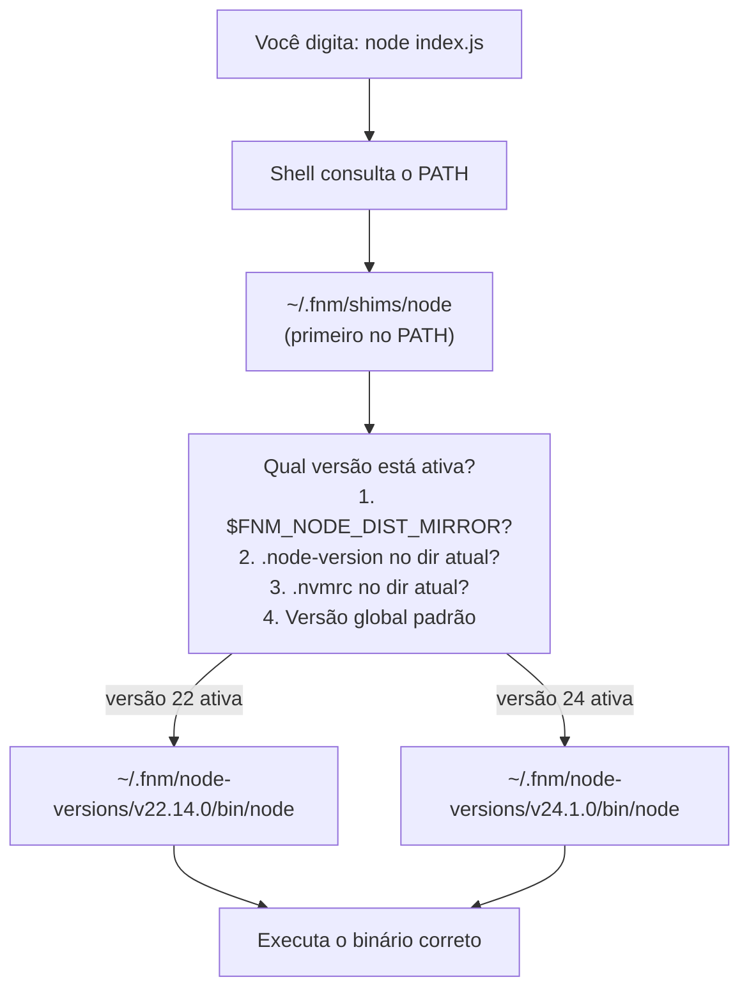
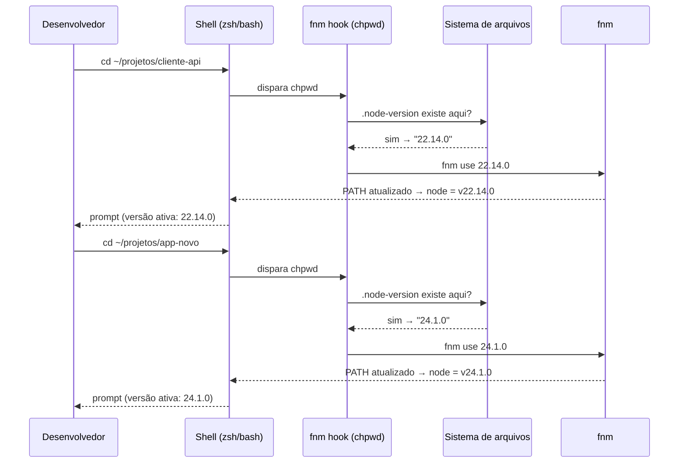
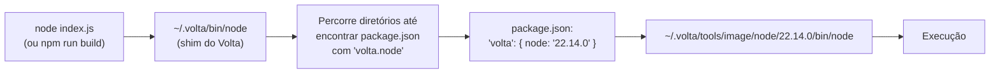
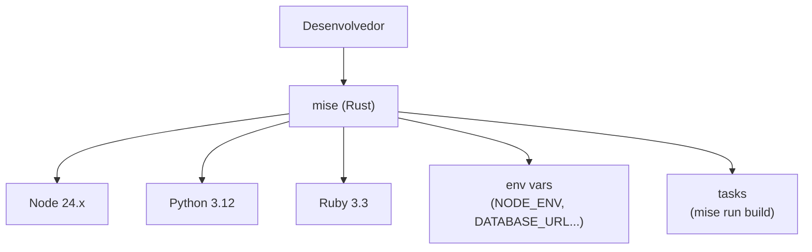
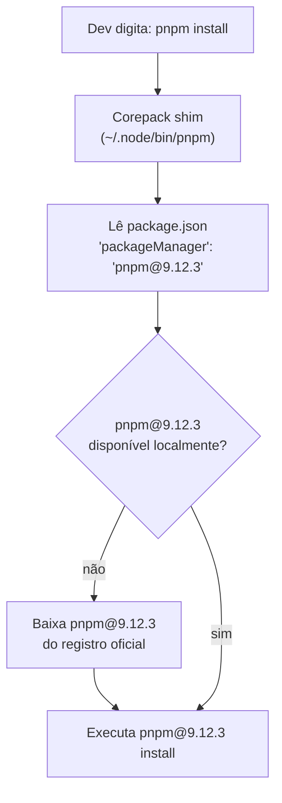
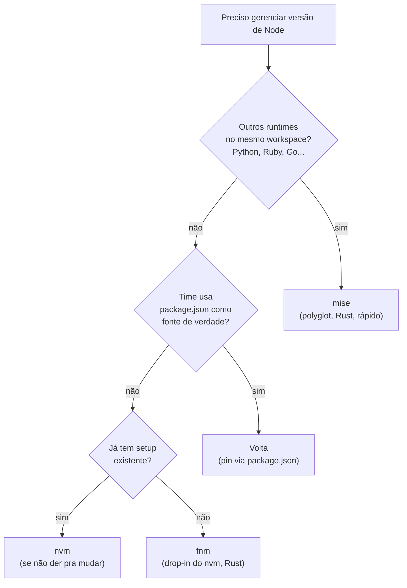

# Gerenciando versões de Node

> [!abstract] TL;DR
> Projetos diferentes exigem versões diferentes de Node — e sem uma estratégia explícita você vai depurar erros que não existem no seu ambiente mas existem na CI, ou vice-versa. A solução é um **version manager**: uma ferramenta que instala e alterna versões de Node de forma transparente, lendo um arquivo de configuração (`.nvmrc` ou `.node-version`) na raiz do projeto. Em 2026 o panorama é claro: **nvm** é o clássico que ainda funciona mas penaliza o startup do shell; **fnm** é o substituto drop-in em Rust, 10-50× mais rápido; **Volta** é a escolha para times que querem pin via `package.json`; **mise** (ex-rtx) é a escolha polyglot para quem também gerencia Python, Ruby e outras linguagens no mesmo workspace. **Corepack** fecha o ciclo gerenciando a versão do package manager (npm/pnpm/yarn) por projeto — mas a partir do Node 25 não vem mais embutido e precisa ser instalado explicitamente.

---

## Por que versão importa (e por que "instalar o LTS" não é suficiente)

Imagine dois projetos no mesmo computador. O projeto A é um legado de 2022 que usa `vm.runInNewContext` com uma API removida no Node 22. O projeto B é a aplicação nova que usa `Array.fromAsync` — disponível apenas a partir do Node 22. Se você tem só uma versão global instalada, um dos dois quebra. E quebra de forma silenciosa: o código roda, mas produz resultados errados ou lança exceções em runtime que não aparecem em desenvolvimento.

O mesmo problema existe em escala de time. Cinco devs, cinco versões de Node diferentes — "funciona na minha máquina" vira o mantra. A CI roda Node 22, o dev mais novo instalou Node 20, e o experiente ainda usa Node 18 porque estava ocupado. O comportamento de `fetch` muda entre versões, o comportamento do REPL muda, módulos nativos precisam de recompilação por versão. Pequenas diferenças acumulam bugs difíceis de rastrear.

Em junho de 2026 o ecossistema tem três linhas de Node relevantes:

| Versão | Codinome | Status |
|--------|----------|--------|
| Node 22 | Jod | Maintenance LTS (até abr/2027) |
| Node 24 | Krypton | **Active LTS** ← use em produção |
| Node 26 | — | Current (LTS em out/2026) |

A linha 20 (Iron) entrou em EOL em abril de 2026. Projetos novos devem apontar para o Node 24.

> [!info] Mudança no schedule a partir de 2027
> A partir de outubro de 2026 o Node muda para **um release por ano** (alinhado ao calendário), todo release vira LTS, e uma linha "Alpha" de acesso antecipado aparece. O Node 26 é o último sob o modelo antigo; o Node 27 (esperado outubro de 2026) é o primeiro sob o novo. Para CI e produção, o ritmo de atualização vai mudar — planeje com antecedência.

---

## Como um version manager funciona: shims e PATH

Antes de escolher entre nvm, fnm ou Volta, vale entender o mecanismo comum. A maioria funciona por manipulação do `PATH`.

Quando você instala um version manager, ele insere um diretório de **shims** no início do `PATH`. Um shim é um executável pequeno que, quando chamado, verifica qual versão de Node está ativa no momento (via variável de ambiente, via arquivo de configuração no diretório atual, ou via configuração global), e delega a execução para o binário correto.



A intercepção é transparente: qualquer ferramenta que chame `node`, `npm`, `npx` vai passar pelo shim. O binário real fica num diretório versionado (geralmente em `~/.local/share/fnm/` ou `~/.volta/`) e o shim apenas aponta para o correto.

O **auto-switch** — trocar de versão automaticamente ao entrar numa pasta — é implementado de duas formas:

1. **Hook de shell**: o version manager registra uma função nos hooks do shell (`chpwd` no zsh, `cd` sobrescrito no bash). A cada mudança de diretório, a função verifica se há `.nvmrc`/`.node-version` e alterna a versão se necessário. É o modelo do nvm e do fnm.
2. **Shim inteligente**: cada chamada ao shim faz a resolução de versão em tempo de execução, percorrendo a árvore de diretórios até encontrar um arquivo de configuração. É mais lento por chamada, mas não requer hook de shell. É o modelo do Volta e do mise.



---

## nvm — o clássico confiável (mas lento)

O **nvm** (Node Version Manager) existe desde 2010 e é a referência que praticamente todo tutorial menciona. É escrito em shell script POSIX puro — o que explica ao mesmo tempo seu sucesso (funciona em qualquer Unix sem dependências) e seu principal problema (shell script é lento).

```bash
# Instalação (ainda via curl em 2026)
curl -o- https://raw.githubusercontent.com/nvm-sh/nvm/v0.40.1/install.sh | bash

# Instalar uma versão
nvm install 24          # instala a última 24.x.x
nvm install --lts       # instala o LTS atual (24 em jun/2026)

# Usar uma versão na sessão atual
nvm use 22

# Definir padrão global
nvm alias default 24

# Listar instaladas
nvm ls

# Listar disponíveis
nvm ls-remote --lts
```

O auto-switch no nvm **não vem habilitado por padrão**. Você precisa adicionar um hook manualmente ao `.zshrc`:

```bash
# ~/.zshrc — auto-switch com nvm
autoload -U add-zsh-hook

load-nvmrc() {
  local nvmrc_path
  nvmrc_path="$(nvm_find_nvmrc)"

  if [ -n "$nvmrc_path" ]; then
    local nvmrc_node_version
    nvmrc_node_version=$(nvm version "$(cat "${nvmrc_path}")")

    if [ "$nvmrc_node_version" = "N/A" ]; then
      nvm install
    elif [ "$nvmrc_node_version" != "$(nvm version)" ]; then
      nvm use
    fi
  elif [ -n "$(PWD=$OLDPWD nvm_find_nvmrc)" ] && \
       [ "$(nvm version)" != "$(nvm version default)" ]; then
    echo "Revertendo para a versão padrão do nvm"
    nvm use default
  fi
}

add-zsh-hook chpwd load-nvmrc
load-nvmrc  # roda ao abrir o shell
```

> [!warning] O custo real do nvm
> O nvm adiciona **50-100ms ao startup do shell** — toda aba nova do terminal, toda sessão de CI. Em benchmarks com fnm no mesmo hardware (MacBook M3), a diferença é de 75ms (nvm) vs 15ms (fnm) só no hook de inicialização. `nvm use` leva ~450ms; `fnm use` leva ~4ms. Em shell scripts e CI que abrem muitos subshells, isso acumula.

O nvm lê `.nvmrc` e `.node-version`. O formato do `.nvmrc` é simples:

```
# .nvmrc
22.14.0
```

---

## fnm — o substituto moderno em Rust

O **fnm** (Fast Node Manager) é a resposta Rust ao problema de performance do nvm. Drop-in replacement: lê os mesmos arquivos `.nvmrc` e `.node-version`, entende os mesmos aliases de versão (`lts/iron`, `22`, `latest`), e funciona no macOS, Linux e **Windows nativamente** — o que o nvm nunca fez bem.

```bash
# Instalação (múltiplas formas em 2026)
# macOS/Linux via script:
curl -fsSL https://fnm.vercel.app/install | bash

# macOS via Homebrew:
brew install fnm

# Windows via winget:
winget install Schniz.fnm
```

A inicialização do shell precisa do hook do fnm — mas o hook já cuida do auto-switch automaticamente:

```bash
# ~/.zshrc
eval "$(fnm env --use-on-cd --shell zsh)"
# --use-on-cd habilita o auto-switch ao entrar na pasta
# sem --use-on-cd você precisa rodar fnm use manualmente
```

Os comandos principais espelham o nvm intencionalmente:

```bash
# Instalar versões
fnm install 24           # última 24.x.x
fnm install --lts        # LTS atual
fnm install 22.14.0      # versão exata

# Listar instaladas
fnm list

# Usar na sessão
fnm use 22

# Definir padrão global
fnm default 24

# Ver versão atual
fnm current
```

O fnm lê `.node-version` com prioridade sobre `.nvmrc` (mas lê os dois). Recomenda-se `.node-version` para projetos novos por ser o formato mais portável (lido por fnm, Volta, mise, asdf):

```
# .node-version
24.1.0
```

> [!tip] fnm em 2026
> fnm é a recomendação padrão para novos setups individuais. Rápido, compatível com nvm, funciona no Windows, auto-switch nativo. Se você usa nvm hoje e o único motivo é inércia, migrar leva 10 minutos e não quebra nada — seus `.nvmrc` continuam funcionando.

---

## Volta — versão pinada via package.json

O **Volta** tem uma filosofia diferente dos outros. Enquanto nvm e fnm gerenciam versão de Node por _sessão_ (ou por diretório via arquivo de texto), o Volta embute a versão diretamente no `package.json` do projeto:

```json
{
  "name": "meu-projeto",
  "volta": {
    "node": "22.14.0",
    "npm": "10.9.2"
  }
}
```

Isso tem uma consequência importante: a versão pinada **viaja com o repositório**. Qualquer dev que clonar o projeto e tiver Volta instalado vai usar exatamente Node 22.14.0, sem precisar criar ou verificar um `.nvmrc` separado.

```bash
# Instalação via script oficial
curl https://get.volta.sh | bash

# Pinando versão no projeto (modifica package.json)
volta pin node@22        # pina a última 22.x.x estável
volta pin node@22.14.0   # pina versão exata
volta pin npm@10         # pina o npm também

# Instalação global de ferramentas (não polui entre projetos)
volta install yarn
volta install pnpm

# Ver o que está pinado
volta list
```

O mecanismo do Volta é diferente: em vez de hooks de shell, ele intercepta as chamadas por meio de binários wrappers no PATH. Cada chamada a `node` verifica o `package.json` mais próximo em tempo de execução. Isso significa que o auto-switch acontece mesmo dentro de scripts que não passam pelo hook de shell — por exemplo, `npm run build` dentro de um Makefile chama o Node correto automaticamente.



> [!note] Quando escolher Volta
> Volta brilha em **times** onde a fonte da verdade é o `package.json` — você não precisa lembrar de criar `.nvmrc` separado. O custo é que o package.json fica com um campo extra `"volta"` que não é padrão do npm. Para projetos solo ou open-source amplamente distribuídos, `.node-version` é mais neutro. Para times fechados com CI controlada, Volta é excelente.

---

## asdf e mise — versão polyglot

Se o seu ambiente de desenvolvimento lida com múltiplas linguagens — Node, Python, Ruby, Go, Java — gerenciar um version manager por linguagem vira confusão. É aí que entram as ferramentas polyglot.

**asdf** foi a primeira resposta séria: um único manager extensível por plugins (`.tool-versions` por projeto). O problema é que é escrito em Bash/Shell e sofre dos mesmos problemas de performance do nvm.

**mise** (pronuncia-se "meez", de *mise en place*) é a evolução em Rust. Começou como `rtx` (Rust Tool eXecutor), virou `mise` em 2023, e em 2026 é a escolha padrão para quem quer polyglot. Lê arquivos `.tool-versions` do asdf sem conversão, adiciona gestão de variáveis de ambiente e tasks, e é 7× mais rápido que asdf em instalações reais.

```bash
# Instalação do mise (macOS/Linux)
curl https://mise.run | sh

# Ou via Homebrew:
brew install mise

# Ativar no shell (adiciona ao .zshrc):
echo 'eval "$(mise activate zsh)"' >> ~/.zshrc

# Instalar Node via mise
mise use node@24          # ativa no projeto atual (.mise.toml)
mise use --global node@24  # define global

# Ler .nvmrc/.node-version também é suportado
# mise respeita .node-version no diretório

# Outras linguagens no mesmo workflow
mise use python@3.12
mise use ruby@3.3
mise use go@1.22
```

O arquivo de configuração local (`.mise.toml`) é mais expressivo que `.tool-versions`:

```toml
# .mise.toml
[tools]
node = "24"
python = "3.12"

[env]
NODE_ENV = "development"
DATABASE_URL = "postgres://localhost/dev"
```



> [!info] asdf ainda vale?
> asdf continua sólido se você já tem uma equipe padronizada nele — a migração para mise é one-way (mise lê `.tool-versions`, asdf não lê `.mise.toml`). Para novos setups polyglot, mise é a escolha de 2026: mesma ideia, Rust, mais features.

---

## .nvmrc, .node-version e engines no package.json

Existe uma sobreposição de formas de declarar a versão de Node de um projeto. É importante entender o papel de cada uma:

| Arquivo/campo | Lido por | Propósito |
|---|---|---|
| `.nvmrc` | nvm, fnm, mise | Switch automático do runtime |
| `.node-version` | fnm, Volta, mise, asdf | Switch automático (mais portável) |
| `package.json "volta"` | Volta | Switch automático + PM |
| `package.json "engines"` | npm/pnpm/yarn (warning/error) | Validação, não switch |
| `.mise.toml / .tool-versions` | mise / asdf | Switch polyglot |

O campo `"engines"` no `package.json` é frequentemente confundido com uma forma de pinagem — mas ele não faz switch. Ele declara compatibilidade e pode fazer o `npm install` emitir warning (ou erro com `engine-strict=true`):

```json
{
  "engines": {
    "node": ">=22.0.0 <25.0.0",
    "npm": ">=10.0.0"
  }
}
```

A prática recomendada é usar **dois mecanismos complementares**:
1. `.node-version` (ou `.nvmrc`) com a versão **exata** — para o switch automático do version manager.
2. `"engines"` no `package.json` com o **range de compatibilidade** — para comunicar ao npm e aos devs o intervalo suportado.

```bash
# .node-version — versão exata que o time usa
24.1.0

# package.json — range de compatibilidade declarada
"engines": {
  "node": ">=22.0.0"
}
```

---

## Corepack — o version manager do package manager

Versão de Node controlada: ótimo. Mas e se dois devs usam npm@10 e npm@11, que têm diferença de comportamento no lockfile? Ou se o projeto usa pnpm mas um dev novo roda `npm install` por hábito?

O **Corepack** é a resposta do Node.js para esse problema. É uma camada de shim que lê o campo `"packageManager"` do `package.json` e garante que a versão correta do gerenciador de pacotes seja usada — e somente ele.

```json
{
  "packageManager": "pnpm@9.12.3+sha224.abc123..."
}
```

Com corepack habilitado:
- Chamar `npm` num projeto com `"packageManager": "pnpm@9"` emite um erro educativo.
- O pnpm correto é baixado automaticamente se não estiver em cache.
- CI e devs ficam sincronizados.

```bash
# Habilitar corepack (Node 16-24, já vem bundled)
corepack enable

# Pinando no projeto atual
corepack use pnpm@9.12.3   # atualiza package.json

# Com auto-pin via variável de ambiente
COREPACK_ENABLE_AUTO_PIN=1 pnpm install
# preenche packageManager automaticamente se estiver vazio
```

> [!warning] Mudança importante: Node 25+
> A partir do **Node.js 25** (lançado em 2025), o Corepack **não vem mais bundled** com o Node. Você precisa instalar explicitamente:
> ```bash
> npm install -g corepack
> ```
> Isso afeta CI, Dockerfiles e scripts de onboarding. Se você usa Node 24 hoje, funciona sem mudar nada. Se migrar para Node 25+, adicione o passo explícito antes de `corepack enable`.



---

## Escolhendo a ferramenta certa em 2026

A tabela abaixo resume o critério de escolha:

| Situação | Recomendação |
|---|---|
| Setup individual, só Node/JS | **fnm** |
| Time com `package.json` como fonte de verdade | **Volta** |
| Workspace polyglot (Node + Python + Ruby...) | **mise** |
| Já usa asdf e time padronizado | **asdf** (ou migre para mise) |
| Legado, já instalado, não dá pra mudar | **nvm** |
| Controlar versão do package manager por projeto | **Corepack** (complementar a qualquer um dos anteriores) |



---

## Exemplo completo: projeto novo com versão pinada + CI

Vamos montar um projeto do zero com tudo no lugar.

**1. Criar o projeto e pinar a versão**

```bash
# Com fnm instalado e hook no .zshrc
mkdir meu-projeto && cd meu-projeto

# Criar .node-version com a versão ativa do LTS
node --version > .node-version
# ou manualmente:
echo "24.1.0" > .node-version

# Iniciar o projeto
npm init -y

# Se usar Volta, pinar via volta pin em vez de .node-version:
# volta pin node@24.1.0  # adiciona bloco "volta" no package.json
```

**2. Adicionar `engines` ao package.json**

```json
{
  "name": "meu-projeto",
  "engines": {
    "node": ">=24.0.0 <25.0.0"
  }
}
```

**3. Habilitar Corepack e pinar o package manager**

```bash
# Certificar que corepack está instalado (Node 24: já vem bundled)
corepack enable

# Pinar o pnpm (ou npm/yarn)
corepack use pnpm@9.12.3
# Isso adiciona ao package.json:
# "packageManager": "pnpm@9.12.3+sha224..."
```

**4. CI (GitHub Actions)**

```yaml
# .github/workflows/ci.yml
name: CI

on: [push, pull_request]

jobs:
  build:
    runs-on: ubuntu-latest
    steps:
      - uses: actions/checkout@v4

      - name: Ler versão do .node-version
        id: node-version
        run: echo "version=$(cat .node-version)" >> $GITHUB_OUTPUT

      - name: Setup Node.js
        uses: actions/setup-node@v4
        with:
          node-version: ${{ steps.node-version.outputs.version }}
          cache: 'pnpm'  # cache automático baseado no lockfile

      - name: Habilitar Corepack
        run: |
          npm install -g corepack  # necessário no Node 25+; no Node 24 basta corepack enable
          corepack enable

      - name: Instalar dependências
        run: pnpm install --frozen-lockfile

      - name: Build
        run: pnpm run build
```

> [!tip] `setup-node@v4` já lê `.node-version`
> A action oficial `actions/setup-node@v4` aceita `node-version-file: '.node-version'` diretamente — sem precisar do passo de `cat` manual. Simplifica o YAML e mantém o CI em sincronia com o projeto automaticamente:
> ```yaml
> - uses: actions/setup-node@v4
>   with:
>     node-version-file: '.node-version'
> ```

---

## Como explicar em inglês

> "Node version management is a solved problem in 2026, but teams still trip over it. The core idea is simple: different projects require different Node versions, and without a version manager you're one `npm install` away from a reproducible bug that only exists in CI.
>
> There are four main tools to know. **nvm** is the classic — shell-script based, works everywhere, but adds 50-100ms to shell startup. **fnm** is the modern drop-in replacement written in Rust: 10-50x faster, works natively on Windows, reads the same `.nvmrc` files, and has auto-switch out of the box. **Volta** takes a different approach — it pins the Node version directly in `package.json`, so the version travels with the repo and every team member gets the right runtime automatically. **mise** (formerly rtx) is the polyglot choice: it manages Node, Python, Ruby and others from a single tool, reads `.tool-versions` and `.nvmrc`, and is built in Rust for speed.
>
> On top of the runtime version, **Corepack** handles the package manager version. It reads the `packageManager` field in `package.json` — something like `pnpm@9.12.3` — and ensures everyone uses exactly that version. Important note for 2026: Corepack is no longer bundled with Node.js 25+, so CI pipelines and Dockerfiles need an explicit install step.
>
> The contract between local development and CI is `.node-version` or `.nvmrc` for the runtime, `packageManager` in `package.json` for the package manager, and `engines` for the declared compatibility range. Three layers, three purposes — they complement rather than replace each other."

### Vocabulário-chave

| Português | English |
|---|---|
| gerenciador de versão | version manager |
| versão pinada | pinned version |
| troca automática de versão | automatic version switching |
| shim / interceptador | shim |
| arquivo de configuração de versão | version file (`.nvmrc`, `.node-version`) |
| versão de suporte de longo prazo | LTS (Long Term Support) |
| versão de manutenção | maintenance release |
| gerenciador de pacotes | package manager |
| campo de compatibilidade | engines field |
| ferramenta polyglot | polyglot version manager |
| cadeia de ferramentas | toolchain |
| hook de shell | shell hook |

---

## Armadilhas comuns

> [!bug] nvm não funciona em scripts não-interativos
> O nvm é inicializado pelo `.bashrc`/`.zshrc`, que **não é carregado** em shells não-interativos (subshells de scripts, alguns CI runners). Se você usa nvm em CI e o `node` sumiu do PATH, é isso. Solução: adicionar o source explícito no script, ou migrar para fnm/Volta que têm shims permanentes no PATH.

> [!bug] .nvmrc com versão imprecisa causa download inesperado
> Se o `.nvmrc` contém `22` (sem patchlevel), o nvm vai instalar a última `22.x.x` disponível — que pode mudar ao longo do tempo. Para builds reprodutíveis, prefira versões exatas (`22.14.0`). fnm e Volta resolvem versões parciais de forma similar, mas a precisão no arquivo evita ambiguidade.

> [!bug] Corepack no Node 25+ quebra CI sem aviso
> Times que migraram para Node 25 sem atualizar os scripts de CI podem se surpreender com `corepack: command not found`. O erro aparece na primeira execução pós-migração. Corrija adicionando `npm install -g corepack` antes de qualquer `corepack enable`.

> [!bug] Volta e espaços no PATH (Windows)
> No Windows, caminhos com espaços (ex.: `C:\Program Files\`) podem causar falhas nos shims do Volta. Instale em caminhos sem espaços ou use fnm no Windows, que tem suporte nativo mais robusto.

> [!bug] mise e asdf: `.tool-versions` vs `.mise.toml` não são bidirecionais
> mise lê `.tool-versions` do asdf. asdf **não** lê `.mise.toml`. Se a equipe tem mistura de asdf e mise, use `.tool-versions` como denominador comum — mise funciona com os dois formatos; asdf só com o seu.

---

## Veja também

- [[03 - Package managers - npm, pnpm, yarn e Bun]] — o que acontece _depois_ de ter a versão certa de Node: modelos de `node_modules`, lockfiles, corepack como orquestrador de PM.
- [[23 - Build em produção, CI e determinismo]] — como garantir builds reprodutíveis em CI: cache de artefatos, env/secrets, source maps em produção — e como a versão do Node entra nessa equação.
- [[03-Dominios/Tecnologia/Node/index|Node]] — runtime, event loop, módulos nativos e o que muda entre versões do Node que torna o gerenciamento de versão necessário.
