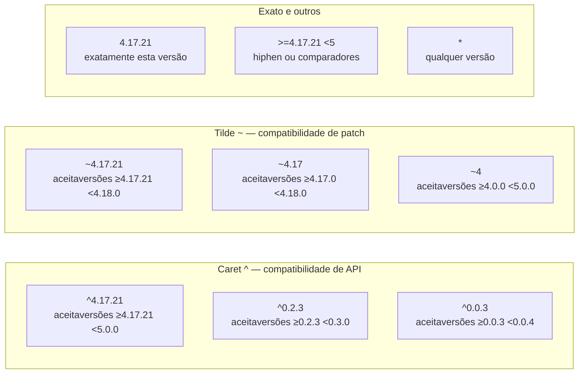
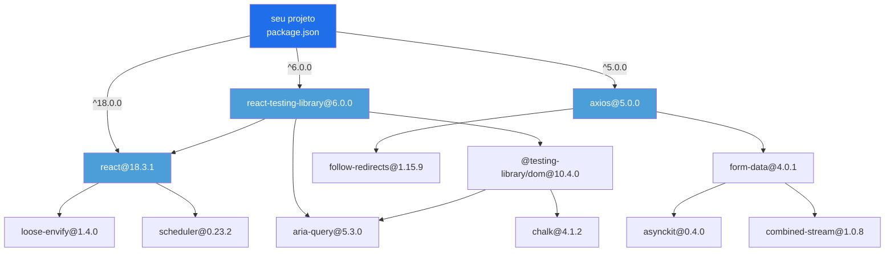
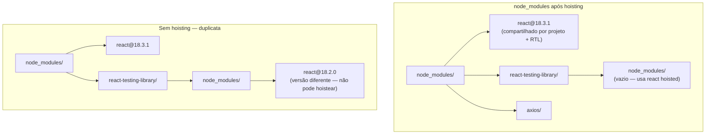
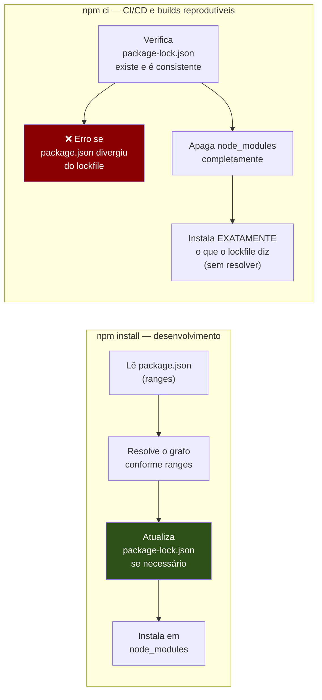
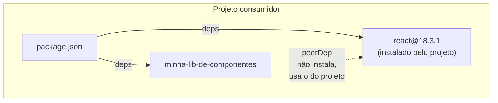
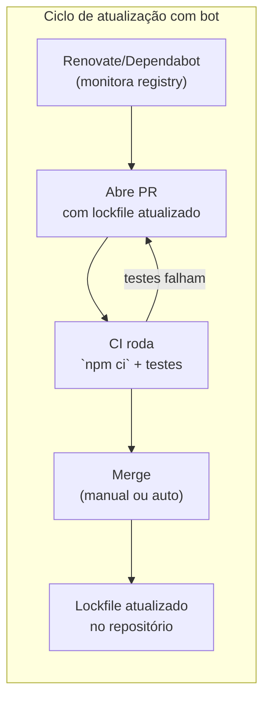

# Semver e o grafo de dependências

> [!abstract] TL;DR
> Semver é o contrato de versionamento que torna a reutilização de código possível em escala: `MAJOR.MINOR.PATCH` comunica se uma atualização quebra a API, adiciona funcionalidade ou corrige bugs. Ranges como `^` e `~` permitem que o seu `package.json` diga "quero compatibilidade, não exatidão" — mas isso cria o **grafo de dependências**: uma árvore que pode ter milhares de nós, cada um potencialmente puxando versões diferentes do mesmo pacote. O **lockfile** (`package-lock.json`, `pnpm-lock.yaml`, `bun.lock`) é o arquivo que congela esse grafo inteiro — registrando não só qual versão foi escolhida, mas de onde veio e com qual checksum de integridade. Sem lockfile, dois `npm install` em momentos diferentes podem resolver o grafo de forma diferente. `npm ci` lê o lockfile de forma estrita e recusa instalar se o `package.json` divergiu — é o comando do CI/CD. `overrides` e `resolutions` são as alavancas de emergência para forçar uma versão específica no grafo inteiro. E `peerDependencies` é o mecanismo pelo qual bibliotecas dizem "eu preciso que o consumidor traga React 18 — não vou trazer eu mesmo".

---

## O contrato do semver

Imagine que você baixou uma biblioteca ontem, seu código funcionou perfeitamente, e hoje, sem alterar uma linha, o build quebrou — porque a biblioteca lançou uma nova versão que mudou a API. Esse cenário de pesadelo existia antes de 2010, quando não havia padrão universal de versionamento. Cada projeto inventava sua própria convenção.

Em 2010, Tom Preston-Werner (cofundador do GitHub) formalizou o **Semantic Versioning**, hoje na versão 2.0.0 em [semver.org](https://semver.org). A ideia central é simples: o número de versão deve comunicar a natureza da mudança, não apenas sua existência.

O formato é `MAJOR.MINOR.PATCH`:

```
   2    .   3   .   7
   │         │       │
   │         │       └─ PATCH — bug fix; comportamento corrigido, API intacta
   │         └───────── MINOR — nova funcionalidade; API existente intocada
   └─────────────────── MAJOR — mudança incompatível; você vai precisar ajustar seu código
```

As regras formais da spec:

- **PATCH** sobe quando você corrige um bug de forma que nada que funcionava antes deixa de funcionar.
- **MINOR** sobe quando você adiciona funcionalidade nova de forma compatível com versões anteriores. O PATCH zera: `1.4.7 → 1.5.0`.
- **MAJOR** sobe quando você introduz mudanças incompatíveis com a API pública. MINOR e PATCH zeram: `1.5.3 → 2.0.0`.

Essa convenção funciona como um **contrato social** entre quem publica e quem consome. Se você usa `lodash@4.17.21` e a lodash lança `4.17.22`, o contrato diz que você pode atualizar com segurança — é apenas um patch. Se lançar `4.18.0`, ainda seguro — adicionou algo, não quebrou. Se lançar `5.0.0`, precisa ler o changelog: algo mudou de forma incompatível.

> [!warning] O semver é um contrato moral, não técnico
> O ecossistema npm depende de autores seguirem o contrato. Na prática, bugs de semver acontecem: patches que quebram, minors com breaking changes silenciosas. O lockfile existe, em parte, para se proteger desse cenário.

### Versão zero: o caso especial de `0.x.y`

Quando o MAJOR é zero (`0.y.z`), o contrato relaxa: a API é considerada instável e qualquer versão pode quebrar compatibilidade. `0.1.0 → 0.2.0` pode ser uma breaking change. É a forma padrão de dizer "ainda não estamos prontos para 1.0".

Isso tem implicações nos ranges: `^0.2.3` não vai até `0.3.0` — fica em `0.2.x`. Mais sobre isso a seguir.

### Pre-releases

Versões `alpha`, `beta`, `rc` (release candidate) seguem o formato:

```
1.0.0-alpha.1
1.0.0-beta.3
1.0.0-rc.2
1.0.0          ← versão estável final
```

O identificador vem após um hífen, separado por pontos. A precedência é: `alpha < beta < rc < estável`. E pre-releases têm precedência menor que a versão estável equivalente:

```
1.0.0-alpha.1 < 1.0.0-alpha.2 < 1.0.0-beta.1 < 1.0.0-rc.1 < 1.0.0
```

> [!duvida] O que "precedência" significa aqui na prática?
> A nota diz que `alpha < rc < estável` em termos de precedência — mas precedência em relação a quê? Quando o npm está escolhendo qual versão instalar, ele prefere a de maior precedência? E se eu tiver `^1.0.0` no package.json e existir uma `1.0.0-rc.1`, o npm escolhe a rc ou a estável `1.0.0`?

Por padrão, ranges não incluem pre-releases — você precisa especificar explicitamente (`^1.0.0-beta.1`) para incluí-las.

Há ainda os **build metadata** (após `+`, ex: `1.0.0+sha.abc123`), que são ignorados na comparação de precedência — servem apenas como informação para sistemas de build.

---

## Ranges: o que você realmente escreve no package.json

Quando você roda `npm install lodash`, o npm registra no `package.json`:

```json
{
  "dependencies": {
    "lodash": "^4.17.21"
  }
}
```

Esse `^4.17.21` não é a versão exata — é um **range**. O npm usa a biblioteca `node-semver` para interpretar ranges e encontrar a versão mais recente que satisfaça o critério. Os ranges mais comuns:



A regra mnemônica: **`^` move pela direita mantendo o primeiro dígito não-zero fixo**. Para `^4.17.21`, o primeiro dígito não-zero é `4` (MAJOR) — então pode mover MINOR e PATCH livremente, até `<5.0.0`. Para `^0.2.3`, o primeiro dígito não-zero é `2` (MINOR) — pode mover só PATCH, até `<0.3.0`.

> [!duvida] "Primeiro dígito não-zero" — por que essa regra estranha?
> A lógica do `^0.2.3` ficar preso em `0.2.x` não ficou clara. Se o caret significa "compatibilidade de API", por que o comportamento muda dependendo de qual dígito é zero? Qual é a conexão com a regra do semver sobre versões `0.x.y` serem instáveis?

O **`~`** é mais conservador: se você especificou MINOR, fica dentro desse MINOR. `~4.17.21` aceita patches em `4.17.x`, mas não `4.18.0`.

> [!info] O caret é o default do npm
> Quando você roda `npm install <pacote>`, o npm salva `^versao` por padrão. Isso significa que seu `package.json` acumula ranges flexíveis ao longo do tempo — o que torna o lockfile ainda mais crítico para garantir reprodutibilidade.

O npm disponibiliza uma calculadora online em [semver.npmjs.com](https://semver.npmjs.com) para verificar quais versões um range específico aceita.

> [!tip] Como verificar ranges na linha de comando
> O `node-semver` pode ser usado diretamente:
> ```bash
> # Instalar uma vez globalmente
> npm install -g semver
>
> # Verificar se uma versão satisfaz um range
> semver -r "^4.17.21" 4.18.0   # → 4.18.0 (satisfaz)
> semver -r "^4.17.21" 5.0.0    # → (sem saída — não satisfaz)
> semver -r "~4.17.21" 4.18.0   # → (sem saída — tilde fica em 4.17.x)
>
> # Listar versões disponíveis de um pacote que satisfazem um range
> npm view lodash versions --json | node -e \
>   "const s=require('semver'); const vs=JSON.parse(require('fs').readFileSync('/dev/stdin','utf8')); console.log(vs.filter(v=>s.satisfies(v,'^4.17.0')))"
> ```
> Menos glamouroso que a calculadora web, mas funciona offline e em scripts.

---

## O grafo de dependências: de uma linha a milhares de pacotes

Você declarou três dependências diretas. Simples. Mas cada uma delas tem suas próprias dependências, que têm as suas, recursivamente. O resultado é um **grafo de dependências** — ou, na prática, uma árvore que pode atingir profundidades inesperadas.



> [!note] Leitura do diagrama
> Seu projeto só declara três deps diretas (em azul escuro). O grafo que o npm precisa resolver tem múltiplas camadas de deps transitivas. `react` aparece como dep de `RTL` também — o resolvedor precisa decidir qual versão instalar (e se pode compartilhar).

Isso explica o fenômeno bem conhecido: um projeto com 10 dependências diretas pode ter 800 pacotes em `node_modules`. Um `create-react-app` (antes de ser descontinuado) chegava a 1400+ pacotes. Esse não é bug — é a natureza do ecossistema npm de módulos pequenos e compostos.

### Deps diretas vs. transitivas

- **Deps diretas** (direct dependencies): o que você listou em `package.json`. Você as conhece, escolheu, atualiza quando quer.
- **Deps transitivas** (transitive dependencies / indirect dependencies): o que as suas deps precisam. Você não as escolheu diretamente, mas elas rodam no seu projeto. São a maioria.

A distinção importa por dois motivos: **manutenção** (vulnerabilidades podem estar em deps transitivas que você nem sabe que tem) e **resolução de versão** (conflitos acontecem quando duas deps diretas precisam de versões incompatíveis da mesma dep transitiva).

---

## Resolução e deduplicação: como o npm escolhe versões

Quando o npm encontra que `react-testing-library` quer `react@^18.0.0` e que seu projeto também quer `react@^18.0.0`, ele precisa decidir: instala uma cópia ou duas?

O algoritmo do npm usa **hoisting** (içamento): ele tenta colocar pacotes no nível mais alto possível do `node_modules`, de forma que múltiplos consumidores compartilhem uma única cópia.

> [!duvida] Por que o Node.js permite duas cópias do mesmo pacote em subpastas diferentes?
> O diagrama mostra `react@18.2.0` aninhado dentro de `react-testing-library/node_modules/` quando as versões conflitam. Mas como isso funciona na prática — não haveria conflito de nomes? O Node.js consegue distinguir qual cópia carregar dependendo de quem está importando?



> [!note] Leitura do diagrama
> No cenário da esquerda, ambos querem `react@^18.0.0` e o resolvedor encontra `18.3.1` como satisfatória — uma cópia, içada ao topo. No cenário da direita, versões incompatíveis forçam a duplicata aninhada.

**`npm dedupe`** é o comando que re-examina o grafo instalado e tenta achatar ainda mais a árvore — útil depois de muitas atualizações incrementais.

O **dependency hell** acontece quando você tem duas deps diretas que exigem versões *mutuamente incompatíveis* da mesma dep transitiva:

```
pkg-a requer: lodash@^3.0.0  (quer 3.x)
pkg-b requer: lodash@^4.0.0  (quer 4.x)
```

Semver garante que `3.x` e `4.x` são breaking changes — o npm não pode satisfazer os dois com uma cópia só. Resultado: duas cópias de `lodash`, em versões diferentes, no mesmo projeto. Código cresce, bundle cresce, e às vezes surgem bugs sutis se instâncias diferentes de um pacote são esperadas ser a *mesma* (ex.: React, que depende de singletons internos).

> [!info] Como o npm diagnóstica conflitos de grafo
> O comando `npm ls <pacote>` mostra o caminho completo no grafo para cada instância de um pacote — essencial para entender de onde vem uma versão específica. `npm why <pacote>` (alias de `npm explain`) descreve por que um pacote está instalado e qual dep direta o puxa. Ambos são ferramentas de diagnóstico, não de instalação.

O algoritmo de resolução do npm (chamado **Arborist** desde o npm v7) usa um modelo de resolução de satisfação de restrições: tenta encontrar o conjunto de versões que satisfaz todas as restrições declaradas no grafo simultaneamente. Quando não consegue (conflito real), ele instala cópias em subpastas aninhadas de `node_modules` — o modelo "nested" que o Node.js suporta por design desde a criação do sistema de módulos CommonJS.

---

## O lockfile: congelando o grafo

Imagine dois cenários:

1. Você roda `npm install` hoje. A lodash tem `4.17.21`.
2. Seu colega clona o repo amanhã e roda `npm install`. A lodash lançou `4.17.22` com um patch.

Tecnicamente, seu `package.json` com `^4.17.21` aceita `4.17.22`. Mas agora vocês têm instalações diferentes. E se `4.17.22` introduziu uma regressão (acontece), o bug aparece no ambiente do colega, não no seu. Pior: o CI também pode divergir.

O lockfile resolve isso: é um **snapshot completo do grafo de dependências resolvido**, com versão exata, URL de origem e hash de integridade de cada pacote. Duas pessoas com o mesmo lockfile, rodando `npm ci`, instalam exatamente o mesmo grafo — bit a bit.

### Anatomia de um package-lock.json (v3)

O formato v3 é usado pelo npm v9+ e é o padrão atual. Ele omite o campo `dependencies` legado (presente no v2 para compatibilidade com npm v6) e usa apenas `packages`:

```json
{
  "name": "meu-projeto",
  "version": "1.0.0",
  "lockfileVersion": 3,       // v1=npm5-6, v2=npm7-8, v3=npm9+
  "requires": true,
  "packages": {
    "": {
      // entrada do projeto raiz — chave vazia
      "name": "meu-projeto",
      "version": "1.0.0",
      "dependencies": {
        "lodash": "^4.17.21"   // o range do package.json
      }
    },
    "node_modules/lodash": {
      "version": "4.17.21",    // versão EXATA que foi resolvida
      "resolved": "https://registry.npmjs.org/lodash/-/lodash-4.17.21.tgz",
      // URL de onde o tarball foi baixado — registry + path
      "integrity": "sha512-v2kDEe57lecTulaDIuNTPy3Ry4gLGJ6Z1O3vE1krgXZNrsQ+LFTGHVxVjcXPs17LhbZa2e/o/suQBXUM9Rrg==",
      // SRI hash (sha512) — verifica que o pacote não foi adulterado
      "license": "MIT"
      // deps transitivas da lodash viriam aqui como "dependencies": {}
    }
  }
}
```

Cada entrada em `packages` tem:

| Campo | O que registra |
|-------|---------------|
| `version` | Versão exata instalada (sem ranges) |
| `resolved` | URL do tarball no registry (ou git URL + sha para git deps) |
| `integrity` | Hash SRI (sha512) para verificação de integridade — proteção básica de supply chain |
| `dev` / `optional` | Flags de classificação (omitidos se false) |
| `dependencies` | Deps que esse pacote específico precisa (transitivas) |

O campo `integrity` é a primeira linha de defesa contra adulteração de pacotes: o npm verifica o hash antes de descompactar. Mais sobre supply chain em [[24 - Supply chain e segurança de dependências]].

### pnpm-lock.yaml

O pnpm usa YAML, atualmente no formato v9.0 (2024+). A principal diferença estrutural: o pnpm registra o **conteúdo do store virtual** (`~/.pnpm-store`) e usa symlinks no `node_modules` — o lockfile reflete essa arquitetura, listando `importers` (os projetos no monorepo) separados dos `packages` (os pacotes no store). O formato v9 unificou `specifiers` e `dependencies` em um único mapa por importer:

```yaml
lockfileVersion: '9.0'

importers:
  .:
    dependencies:
      lodash:
        specifier: ^4.17.21    # o range do package.json
        version: 4.17.21       # a versão resolvida

packages:
  lodash@4.17.21:
    resolution:
      integrity: sha512-v2kDEe57...
    engines:
      node: '>=4'
```

### bun.lock

O Bun v1.2 (início de 2025) mudou o lockfile padrão de binário (`bun.lockb`) para texto (`bun.lock`), tornando-o legível e diffável no git. O Bun migra automaticamente lockfiles de outros package managers ao rodar `bun install`. O formato usa arrays posicionais para compactar dados (o que o torna frágil para parsers externos, mas eficiente).

### yarn.lock (Yarn Classic vs. Berry)

O Yarn tem dois formatos distintos: o Yarn Classic (v1, ainda comum em projetos mais antigos) usa um formato de texto proprietário (não JSON, não YAML); o Yarn Berry (v2+) usa o mesmo formato de texto, mas a estrutura interna mudou e os dois são incompatíveis. O Yarn Berry com PnP (Plug'n'Play) nem usa `node_modules` — armazena pacotes em `.yarn/cache` como ZIPs e usa um resolver de módulos customizado. Isso elimina o hoisting e a duplicação, mas exige compatibilidade dos pacotes com o modo PnP.

> [!info] Commitar o lockfile é regra, não opção
> O lockfile deve sempre ser commitado no repositório. Sem ele, cada `npm install` pode resolver o grafo diferentemente. A única exceção são bibliotecas publicadas no npm: seu lockfile é irrelevante para quem instala a lib (eles têm seu próprio grafo e lockfile).

### npm v10 e v11: o que mudou nos lockfiles recentes

O npm v10 (Node.js 18+, 2023) e o npm v11 (Node.js 20+, 2024) mantiveram o formato `lockfileVersion: 3`, mas introduziram melhorias no Arborist: resolução mais rápida (~30% em grafos grandes), melhor detecção de ciclos, e suporte a `overrides` aninhados (`"pkg-a>lodash": "^4.17.21"` para forçar versão só em deps de `pkg-a`). A partir do npm v10, `npm audit` também verifica as deps listadas em `overrides` — antes elas eram opacas para o auditor.

Fonte: [npm v10 release notes](https://github.com/npm/cli/releases/tag/v10.0.0) e [npm v11 changelog](https://github.com/npm/cli/blob/latest/CHANGELOG.md).

---

## `npm install` vs. `npm ci`: a distinção que importa em CI

Esses dois comandos fazem coisas fundamentalmente diferentes — e confundi-los em CI é um erro clássico.



| Característica | `npm install` | `npm ci` |
|---|---|---|
| Resolve ranges? | Sim — pode atualizar versões | Não — usa o lockfile literal |
| Modifica lockfile? | Sim, se necessário | Nunca |
| Aceita divergência package.json/lockfile? | Sim (reconcilia) | **Não — erro imediato** |
| Apaga node_modules antes? | Não | Sempre |
| Velocidade em CI | Mais lenta | 2–3x mais rápida (sem resolução) |
| Uso correto | Dev local, adicionando deps | CI/CD, builds de produção |

A regra é simples: **`npm ci` em pipelines, `npm install` na máquina do dev**. O `npm ci` falha explicitamente se alguém esqueceu de commitar o lockfile atualizado — o que é exatamente o comportamento desejado em CI.

Para os outros package managers: `pnpm install --frozen-lockfile` e `yarn install --immutable` têm o mesmo efeito de `npm ci`.

---

## `overrides` e `resolutions`: forçando versões no grafo

Às vezes uma dep transitiva tem uma vulnerabilidade crítica, o mantenedor ainda não atualizou, e você não pode esperar. O mecanismo de **overrides** (npm/pnpm) ou **resolutions** (Yarn) permite forçar uma versão específica de um pacote em todo o grafo, independente do que as deps declararam.

```json
// package.json — npm (desde npm v8.3)
{
  "overrides": {
    "lodash": "4.17.21",
    "semver": ">=7.5.2"
  }
}
```

```yaml
# package.json — pnpm (campo "pnpm" > "overrides")
{
  "pnpm": {
    "overrides": {
      "lodash": "4.17.21",
      "semver": ">=7.5.2"
    }
  }
}
```

```json
// package.json — Yarn Classic / Berry (campo "resolutions")
{
  "resolutions": {
    "lodash": "4.17.21",
    "pacote-pai/lodash": "4.17.21"
  }
}
```

O Yarn também suporta overrides com path selector: `"pacote-pai/lodash"` força a versão só quando `lodash` é transitiva de `pacote-pai`, deixando outras instâncias intactas.

> [!warning] Use overrides com critério
> Forçar versões quebra o contrato do semver que o pacote pai espera. Se `pacote-a` foi testado com `lodash@3.x` e você força `4.x` via override, pode introduzir incompatibilidades silenciosas. É uma ferramenta de emergência — patches de segurança, não conveniência.

O caso de uso mais legítimo: você recebe um alerta de CVE crítico numa dep transitiva, o mantenedor do pacote pai não respondeu, você faz override para a versão corrigida e abre issue no repo upstream.

---

## `peerDependencies`: "traga você mesmo"

`peerDependencies` é o mecanismo que diz: *"Para funcionar, preciso que o consumidor tenha este pacote instalado — mas não vou instalá-lo eu mesmo."*

O caso arquetípico é um plugin de framework. `react-dom` não instala o React dentro de si mesmo — espera que o projeto consumidor já tenha React. Se instalasse, você teria duas cópias de React em `node_modules`, e React não funciona com múltiplas instâncias (usa singletons internos):

> [!duvida] O que são "singletons internos" do React e por que duas cópias quebram tudo?
> A nota diz que React "usa singletons internos" e que duas instâncias causam bugs — mas não explica o mecanismo. Se o código importa `react` de dois lugares diferentes, o que exatamente quebra? Por que o React foi projetado assim, em vez de tolerar múltiplas instâncias?

```json
// package.json de um plugin de componente
{
  "name": "minha-lib-de-componentes",
  "peerDependencies": {
    "react": ">=17.0.0",
    "react-dom": ">=17.0.0"
  },
  "devDependencies": {
    "react": "^18.0.0",    // pra desenvolver/testar a lib
    "react-dom": "^18.0.0"
  }
}
```



> [!note] Leitura do diagrama
> A linha pontilhada indica a relação de peer: `minha-lib-de-componentes` declara que precisa de `react`, mas não o instala. Ela usa o `react` que o projeto consumidor instalou — compartilhando a mesma instância.

### O comportamento mudou no npm 7

Antes do npm 7, `peerDependencies` eram apenas declarações informativas — o npm avisava, mas não instalava nem errava. A partir do **npm 7**, o comportamento mudou: peer deps são **instaladas automaticamente** (pelo algoritmo Arborist), e **conflitos de versão geram erro** de instalação.

Isso causou caos em projetos que dependiam do comportamento antigo. A bandeira de escape é:

```bash
npm install --legacy-peer-deps
# Reverte ao comportamento pré-npm7: ignora conflitos de peer, não instala automaticamente
```

O `--legacy-peer-deps` é uma muleta, não uma solução. Ele pode mascarar incompatibilidades reais. A saída correta é atualizar as dependências para versões com peer deps compatíveis — ou usar `overrides` para forçar uma versão que satisfaça todos.

### O inferno das peer dependencies

A situação degrada quando você tem uma cadeia de plugins e libs com peer deps em versões diferentes:

```
seu projeto     → react@^18.0.0
plugin-A        → peerDep: react@^17.0.0
plugin-B        → peerDep: react@^18.0.0
```

O npm 7+ vai reclamar: `plugin-A` espera React 17, mas você instalou React 18. Aqui, as opções são:
1. Atualizar `plugin-A` para suportar React 18 (se existir versão compatível)
2. Usar `--legacy-peer-deps` (temporário, com risco)
3. Usar `overrides` para forçar uma versão que `plugin-A` aceite
4. Substituir `plugin-A` por alternativa compatível

---

## Lendo um lockfile para entender por que uma versão foi escolhida

Cenário real: seu build está quebrando, você suspeita que a versão de `axios` mudou. Como verificar?

```bash
# Ver qual versão está instalada atualmente
npm list axios

# Saída:
# meu-projeto@1.0.0
# └── axios@1.6.8
#     └── follow-redirects@1.15.6   ← dep transitiva de axios

# Ver qual versão estava no último commit
git show HEAD:package-lock.json | grep -A5 '"node_modules/axios"'

# Comparar lockfiles entre branches ou commits
git diff main HEAD -- package-lock.json | grep '"version"'
```

Agora, suponha que você quer entender *por que* `follow-redirects@1.15.6` foi escolhida (e não `1.15.9`). Você olha o lockfile:

```json
"node_modules/axios": {
  "version": "1.6.8",
  "resolved": "https://registry.npmjs.org/axios/-/axios-1.6.8.tgz",
  "integrity": "sha512-...",
  "dependencies": {
    "follow-redirects": "^1.15.6"  // axios pede >=1.15.6 <2.0.0
  }
},
"node_modules/follow-redirects": {
  "version": "1.15.6",             // a versão mais recente no momento da resolução
  "resolved": "https://registry.npmjs.org/follow-redirects/-/follow-redirects-1.15.6.tgz",
  "integrity": "sha512-..."
}
```

A lógica: `axios@1.6.8` pede `follow-redirects@^1.15.6`. No momento em que o lockfile foi gerado, a versão mais recente satisfazendo esse range era `1.15.6`. Se `1.15.9` tivesse sido lançada antes do `npm install`, o lockfile teria capturado `1.15.9`. O lockfile não é "a versão mais recente possível" — é "a versão mais recente possível no momento em que rodou o `install`".

Isso explica por que **atualizar o lockfile conscientemente** é importante: uma dep transitiva pode ter lançado um patch de segurança sem que seu lockfile saiba.

```bash
# Atualizar uma dep específica (e recalcular transitivas)
npm update axios

# Ver o que pode ser atualizado
npm outdated

# Verificar vulnerabilidades nas deps atuais
npm audit
```

> [!tip] Lendo o output do npm audit
> O `npm audit` cruza as versões no lockfile com o banco de vulnerabilidades do Advisory Database. A saída mostra:
> - **severity**: `critical`, `high`, `moderate`, `low` — priorize `critical` e `high`
> - **via**: o caminho no grafo — se a vuln está em uma dep transitiva, mostra qual dep direta a puxa
> - **fix available**: se `npm audit fix` pode resolver automaticamente (via update dentro do range) ou se precisa de `--force` (update que quebra semver)
>
> ```bash
> npm audit fix          # aplica fixes que respeitam os ranges do package.json
> npm audit fix --force  # aplica updates de MAJOR — pode quebrar a API; revisar depois
> npm audit --json       # output em JSON para integrar com CI ou scripts
> ```
>
> Nunca rode `npm audit fix --force` cegamente em produção. Verifique o diff do lockfile e rode os testes antes.

---

## Ferramentas de atualização automática: Renovate e Dependabot

Atualizar deps manualmente não escala. Dois bots automatizam isso:

**Dependabot** (nativo do GitHub): abre PRs automáticos quando dependências têm versões novas ou CVEs. Configuração simples por repositório (`.github/dependabot.yml`). Suporta npm, pnpm, Yarn. Em 2025, adicionou grouped updates — agrupa múltiplas atualizações em um único PR.

**Renovate** (Mend, open source): mais poderoso e configurável. Suporta 30+ package managers (vs. 14 do Dependabot). Funciona em GitHub, GitLab, Bitbucket. Tem presets de configuração compartilháveis entre repos, automerge configurável, e suporte nativo a monorepos (atualiza deps correlatas em um único PR).

Em 2026, o gap entre os dois diminuiu. Para times pequenos no GitHub, o Dependabot é o ponto de partida natural. Para monorepos complexos ou times que precisam de políticas finas de atualização, o Renovate é mais adequado.



> [!tip] Regra de ouro: mantenha deps atualizadas regularmente
> Deixar deps acumular durante meses transforma cada atualização em um risco. Bots de atualização + CI rigoroso tornam as atualizações frequentes e pequenas — menos risco, menos dor.

---

## A perspectiva júnior vs. sênior

Esse é um dos temas em que a diferença de maturidade aparece de forma clara — não no conhecimento dos comandos, mas no julgamento sobre quando e como usá-los.

**O júnior** tende a tratar o lockfile como arquivo de "configuração interna", muitas vezes excluído do `.gitignore` por engano ou por instrução de tutorial desatualizado. Quando o CI quebra por versão de dep, a reação instintiva é rodar `npm install --force` e torcer. `--legacy-peer-deps` vira solução padrão porque "funcionou". O `npm update` é usado livremente, sem entender o que mudou no grafo.

**O sênior** mantém uma relação diferente com o lockfile: ele é um artefato de segurança tanto quanto de reprodutibilidade. Antes de aprovar um PR que "só atualiza deps", o sênior verifica `git diff package-lock.json` para entender *quais* transitivas mudaram — porque foi exatamente assim que uma vulnerabilidade entrou no Polyfill.io em 2024 (mudança de mantenedor + pacote comprometido). Ele reserva `overrides` para emergências, documenta o motivo no código, e planeja a remoção. Quando `--legacy-peer-deps` é necessário, abre uma issue para rastrear a dívida técnica.

A diferença central: o júnior pensa em *pacotes como itens de lista*; o sênior pensa em *grafos como contratos entre equipes*.

> [!tip] O sinal de maturidade em entrevista
> Uma pergunta eficaz de senior screen: *"Você recebeu um alerta de CVE crítico numa dep transitiva às 23h. O mantenedor não responde. O que você faz?"* A resposta esperada articula a cadeia: `npm audit --json` para confirmar o CVE, `npm ls <pacote>` para mapear quem puxa aquela dep, `overrides` para fixar a versão corrigida, commit do lockfile atualizado, CI verde, PR revisado, issue aberta no upstream. O júnior responde "atualizo a versão" sem saber que não é uma dep direta.

---

## Casos práticos

### Cenário 1: o bug que só aparecia na máquina do CI

**Contexto**: Uma startup de fintech com time de 8 devs. O build passava localmente para todos os três desenvolvedores que trabalharam na feature. Ao chegar no CI (GitHub Actions), os testes de integração quebravam com `TypeError: Cannot read properties of undefined (reading 'format')`.

**Diagnóstico**: O lockfile não estava commitado no repositório (excluído do `.gitignore` por um tutorial antigo de 2018). Localmente, os três devs tinham instalado em datas diferentes — e a versão resolvida de `date-fns` variava entre `2.29.3` e `2.30.0`. A `2.30.0` mudou a assinatura de uma função utilitária de forma silenciosa (breaking change em MINOR — violação do semver pelo mantenedor). O CI sempre instalava a mais recente.

**Solução**: commitar o lockfile, usar `npm ci` no pipeline, e adicionar `date-fns` à lista de monitoramento do Renovate. Custo total: ~6h de debugging.

**Lição**: o lockfile não é opcional — é o contrato que garante que o CI testa exatamente o que você desenvolveu.

---

### Cenário 2: a atualização que quebrou o bundle de produção

**Contexto**: Um time de e-commerce rodando React 17. O Dependabot abriu um PR de rotina atualizando `react-scripts` de `5.0.0` para `5.0.1`. O merge foi aprovado sem revisão detalhada do lockfile diff (era "só um patch").

**Diagnóstico**: `react-scripts@5.0.1` atualizou uma dep transitiva interna — `webpack` — de `5.74.0` para `5.75.0`. Essa versão do webpack tinha uma regressão no tree-shaking que aumentou o bundle de produção em 340KB e introduziu um bug de carregamento de chunk no Safari 15.

**Solução**: reverter para o lockfile anterior via `git revert`, adicionar `overrides.webpack` no `package.json` fixando `5.74.0`, abrir issue no webpack. O Renovate (que o time adotou depois) teria capturado isso via `packageRules` com `automergeType: "pr"` e review obrigatório para mudanças de build tools.

**Lição**: patches não são sempre inofensivos. Revisar o diff do lockfile antes de fazer merge — especialmente em ferramentas de build — é hábito de sênior.

---

### Cenário 3: dependency hell em monorepo React + plugin legacy

**Contexto**: Um SaaS B2B migrava de React 17 para React 18. Tinha 47 dependências diretas, incluindo `react-beautiful-dnd` (arraste-e-solte), que declarava `peerDependencies: react@^16.8.0 || ^17.0.0` — sem suporte a React 18.

**Diagnóstico**: `npm install` com React 18 falhava com conflito de peer dep. A opção `--legacy-peer-deps` "funcionava" mas introduzia duas instâncias de React no bundle (a do projeto + a que `react-beautiful-dnd` carregava de forma implícita), causando o erro clássico: `Warning: Invalid hook call. Hooks can only be called inside of the body of a function component`.

**Solução**: migrar para `@hello-pangea/dnd` (fork com suporte React 18 mantido pela comunidade), seguindo o padrão documentado na [migração oficial](https://github.com/hello-pangea/dnd/blob/main/docs/about/react-18.md). Isso eliminou o conflito de peer deps e a instância duplicada de React.

**Lição**: `--legacy-peer-deps` mascara o problema; a solução real é migrar para versão compatível ou fork ativo. `peerDependencies` com ranges desatualizados são dívida técnica visível — o `npm audit` não captura isso, mas o `npm ls` mostra.

---

### Cenário 4: CVE crítico em dep transitiva — resposta de produção

**Contexto**: Julho de 2021. Um time recebe alerta do Dependabot: `CVE-2021-3807` em `ansi-regex@3.0.0` (ReDoS — expressão regular catastrófica). Nenhum dev tinha instalado `ansi-regex` diretamente.

**Diagnóstico**:
```bash
npm ls ansi-regex
# meu-projeto@1.0.0
# └── jest@27.0.6
#     └── jest-worker@27.0.6
#         └── supports-color@8.1.1
#             └── ansi-regex@3.0.0  ← quatro níveis abaixo
```

O pacote estava quatro níveis abaixo no grafo. A versão corrigida era `ansi-regex@5.0.1`.

**Solução**:
```json
// package.json
{
  "overrides": {
    "ansi-regex": ">=5.0.1"
  }
}
```
Rodar `npm install` para regenerar o lockfile com a versão fixada, verificar com `npm ls ansi-regex` que todas as instâncias apontam para `5.0.1`, commitar, abrir PR documentando o CVE e o override. O override foi removido três semanas depois quando `jest` publicou nova versão com a dep atualizada.

**Lição**: overrides são a ferramenta certa para CVEs em deps transitivas. A chave é: (1) usar `npm ls` para confirmar o caminho no grafo, (2) documentar o override com o número do CVE, (3) rastrear a remoção futura.

---

## O que vem a seguir

Você agora entende o contrato do semver, sabe como o npm resolve o grafo de dependências, e tem as ferramentas para diagnosticar e resolver conflitos. Mas há uma camada que vai além do gerenciamento de versões: o que garante que um pacote no registry é o que o mantenedor publicou?

O hash `integrity` no lockfile é a primeira linha de defesa — mas a cadeia de supply chain é mais longa. [[24 - Supply chain e segurança de dependências]] explora o que acontece quando a conta do npm de um mantenedor é comprometida (caso `event-stream`, 2018), quando um pacote popular é "abandonado" e transferido para atores maliciosos (caso `ua-parser-js`, 2021), e como mecanismos como **npm provenance** (2023), **Sigstore** e **Socket.dev** adicionam camadas de verificação além do hash.

O outro caminho natural é entender o que acontece com essas dependências no momento do build. [[23 - Build em produção, CI e determinismo]] conecta o grafo de deps com a reprodutibilidade do artefato de produção: como o cache do CI usa o lockfile como chave de hash, por que `npm ci` é mais rápido que `npm install` em pipelines, e como garantir que dois builds do mesmo commit produzam bytes idênticos.

E para quem trabalha com monorepos — onde o grafo de dependências se multiplica por cada workspace — [[03 - Package managers - npm, pnpm, yarn e Bun]] explora como o store virtual do pnpm elimina duplicatas fisicamente no disco, como o `workspace:` protocol funciona, e por que hoisting em monorepos é uma fonte própria de bugs sutis.

O semver é a gramática. O lockfile é a memória. O grafo é a estrutura. Juntos, eles são o que torna possível que milhares de equipes independentes publiquem código que pode ser combinado de forma confiável — na maior parte do tempo.

---

## Como explicar em inglês

Semver (Semantic Versioning) is a versioning convention where the three-part version number communicates the *nature* of the change: MAJOR for breaking API changes, MINOR for backward-compatible new features, PATCH for backward-compatible bug fixes. It's a social contract between package authors and consumers — the spec is at semver.org.

A **dependency graph** is the tree of all packages your project depends on, including transitive dependencies (dependencies of dependencies). When you run `npm install`, the package manager resolves this graph by finding versions that satisfy all declared ranges simultaneously.

A **lockfile** (`package-lock.json`, `pnpm-lock.yaml`, `bun.lock`) is a snapshot of the fully resolved dependency graph — it records the exact version, download URL, and integrity hash of every package. Without a lockfile, two installs at different times may resolve the graph differently. Always commit the lockfile.

`npm ci` is the CI-safe install command: it reads the lockfile strictly, refuses to run if `package.json` and the lockfile are out of sync, wipes `node_modules`, and reinstalls everything from the lockfile — no resolution, no guessing, just the exact graph.

**Overrides** (npm/pnpm) or **resolutions** (Yarn) let you force a specific version of a transitive dependency across the entire graph — useful for emergency security patches when a maintainer hasn't updated their package.

**Peer dependencies** are the mechanism for saying "I need the consumer to bring this package themselves." React plugins declare `react` as a peer dep to avoid bundling their own copy of React. Since npm 7, peer deps are installed automatically and version conflicts cause install errors — `--legacy-peer-deps` bypasses this but should be avoided.

### Vocabulário-chave

| Português | Inglês |
|---|---|
| versionamento semântico | semantic versioning / semver |
| versão maior/menor/patch | major / minor / patch version |
| mudança incompatível | breaking change |
| intervalo de versão / range | version range |
| acento circunflexo (^) | caret |
| til (~) | tilde |
| pré-lançamento | pre-release |
| grafo de dependências | dependency graph |
| dep direta | direct dependency |
| dep transitiva | transitive / indirect dependency |
| arquivo de bloqueio | lockfile |
| instalação determinística | deterministic install |
| içamento | hoisting |
| deduplicação | deduplication |
| dep de par / dep do consumidor | peer dependency |
| inferno de dependências | dependency hell |
| substituição forçada de versão | dependency override / resolution |
| auditoria de segurança | security audit |
| atualização automática | automated dependency updates |

---

## Armadilhas comuns

> [!warning] Armadilha 1: não commitar o lockfile
> Sem o lockfile no repositório, cada `npm install` pode produzir um grafo diferente. Bugs que aparecem em CI mas não localmente (ou vice-versa) são frequentemente causados por isso. Comite sempre o lockfile — exceto se o projeto for uma biblioteca npm publicada.

> [!warning] Armadilha 2: usar `npm install` em CI em vez de `npm ci`
> `npm install` pode silenciosamente atualizar o lockfile e instalar versões diferentes do que está commitado. Use sempre `npm ci` (ou `pnpm install --frozen-lockfile`, `yarn install --immutable`) em pipelines. O `npm ci` falha explicitamente se o lockfile divergiu — o comportamento exato que você quer.

> [!warning] Armadilha 3: assumir que `^` é sempre seguro
> O caret `^4.17.21` permite updates de MINOR e PATCH. O contrato do semver diz que esses são compatíveis — mas autores podem errar. Versões com breaking changes silenciosas existem. O lockfile te protege disso até o momento em que você decide atualizar; depois disso, os testes são sua proteção.

> [!warning] Armadilha 4: confundir `peerDependencies` com `dependencies`
> Uma lib que lista React em `dependencies` vai instalar seu próprio React — potencialmente conflitando com o React do projeto consumidor. O resultado pode ser erros do tipo "Cannot read properties of null (reading 'useState')" porque há duas instâncias de React em memória. Plugins e componentes de UI devem listar frameworks como `peerDependencies`.

> [!warning] Armadilha 5: `--legacy-peer-deps` como solução permanente
> Quando `npm install` falha por conflito de peer deps, `--legacy-peer-deps` parece uma solução rápida — e é. Mas é uma muleta. Ela mascara incompatibilidades reais que podem causar bugs em runtime. Use enquanto planeja a solução real: atualizar as deps para versões compatíveis.

> [!warning] Armadilha 6: esquecer de atualizar deps transitivas vulneráveis
> Um `npm audit` pode mostrar uma vulnerabilidade em `lodash@3.x` que está enterrada três níveis abaixo no grafo. A fix não é `npm install lodash@4` (você não usa lodash diretamente) — é atualizar a dep direta que puxa lodash, ou usar `overrides` como medida temporária. Veja [[24 - Supply chain e segurança de dependências]].

---

## Veja também

- [[03 - Package managers - npm, pnpm, yarn e Bun]] — os modelos de `node_modules`, o store do pnpm, corepack; o "como instalar" antes do "o que instala". Ver também: como o Corepack gerencia versões do próprio package manager via `packageManager` no `package.json` — um meta-semver.
- [[24 - Supply chain e segurança de dependências]] — integridade de lockfile, `npm audit`, provenance, typosquatting; o que o hash `integrity` do lockfile protege e onde ele falha (o caso Polyfill.io, 2024).
- [[23 - Build em produção, CI e determinismo]] — build reprodutível, cache de CI, artefatos, env/secrets; o `npm ci` em contexto completo de pipeline e como o lockfile é a chave de cache.
- [[21 - Monorepos - workspaces, Turborepo, Nx e changesets]] — como o protocolo `workspace:` do pnpm e as `workspaceProtocol` do Yarn funcionam num monorepo; hoisting de deps em monorepos e por que `shamefully-hoist` existe.

---

> [!info] Lastro
> 1. **semver.org** — *Semantic Versioning 2.0.0* (Tom Preston-Werner, spec oficial). Disponível em: https://semver.org
> 2. **npm Docs** — *package-lock.json* (formato v3, campos `packages`, `resolved`, `integrity`). Disponível em: https://docs.npmjs.com/cli/v11/configuring-npm/package-lock-json/
> 3. **npm/node-semver** — biblioteca que implementa parsing de ranges usada pelo npm. Disponível em: https://github.com/npm/node-semver
> 4. **Bun Blog** — *Bun's new text-based lockfile* (migração de binário para `bun.lock` texto no Bun v1.2, 2025). Disponível em: https://bun.com/blog/bun-lock-text-lockfile
> 5. **Rush Stack / LFX** — *The PNPM Lockfile* (análise do formato pnpm-lock.yaml, diferenças v6 vs v9). Disponível em: https://lfx.rushstack.io/pages/concepts/pnpm_lockfile/
> 6. **Andrew Nesbitt** — *Lockfile Format Design and Tradeoffs* (2026). Disponível em: https://nesbitt.io/2026/01/17/lockfile-format-design-and-tradeoffs.html
> 7. **npm Docs** — *npm-dedupe* (algoritmo de hoisting e deduplicação). Disponível em: https://docs.npmjs.com/cli/v11/commands/npm-dedupe/
> 8. **Mend** — *Renovate vs. Dependabot* comparação de capacidades 2026. Disponível em: https://docs.renovatebot.com/bot-comparison/
> 9. **npm Blog** — *npm v7 is now generally available* (mudanças no comportamento de peerDependencies e introdução do Arborist). Disponível em: https://github.blog/open-source/npm/npm-v7-series-arborist-deep-dive/
> 10. **GitHub Advisory Database** — *CVE-2021-3807: ansi-regex ReDoS* (2021). Disponível em: https://github.com/advisories/GHSA-93q8-gq69-wqmw
> 11. **Socket.dev Blog** — *Polyfill supply chain attack* (compromisso do domínio polyfill.io por novo proprietário chinês, 2024). Disponível em: https://socket.dev/blog/polyfill-io-supply-chain-attack
> 12. **npm Docs** — *npm-overrides* (semântica de overrides aninhados, suporte a path selectors). Disponível em: https://docs.npmjs.com/cli/v11/configuring-npm/package-json#overrides
> 13. **hello-pangea/dnd** — *Migrating from react-beautiful-dnd to @hello-pangea/dnd* (fork com suporte React 18). Disponível em: https://github.com/hello-pangea/dnd/blob/main/docs/about/react-18.md
