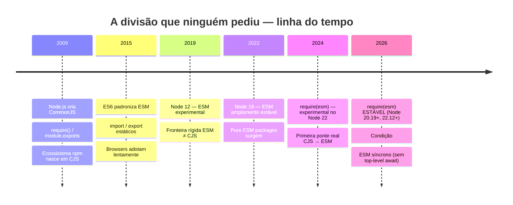
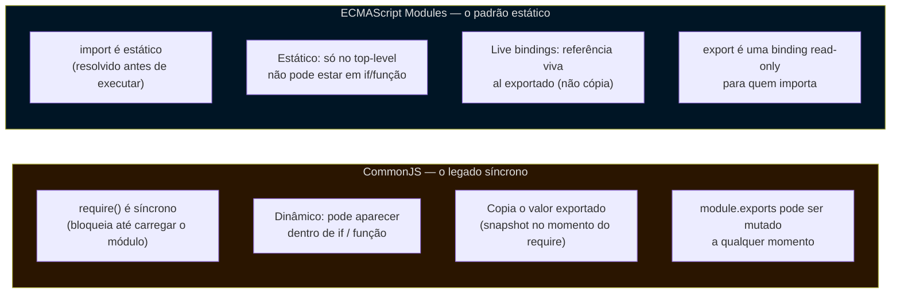
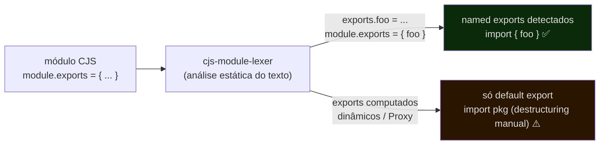
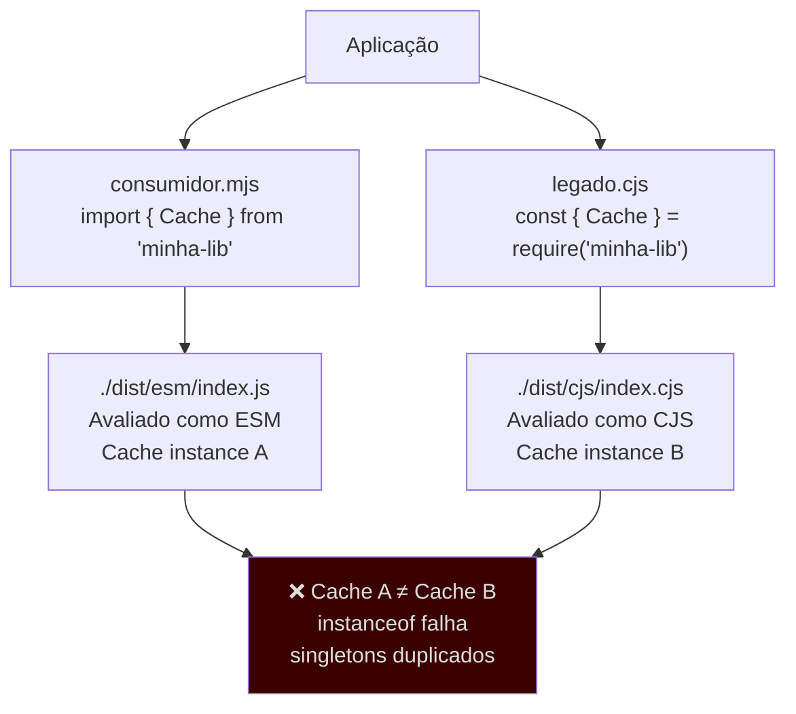
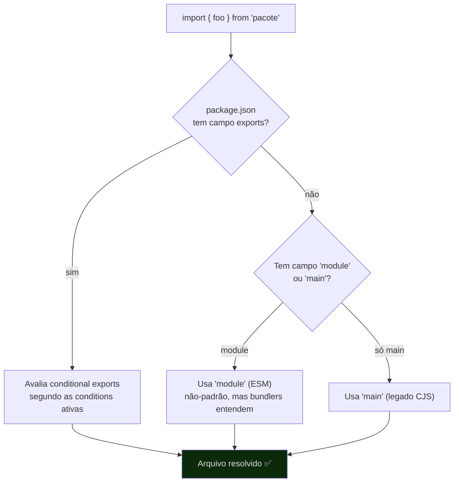
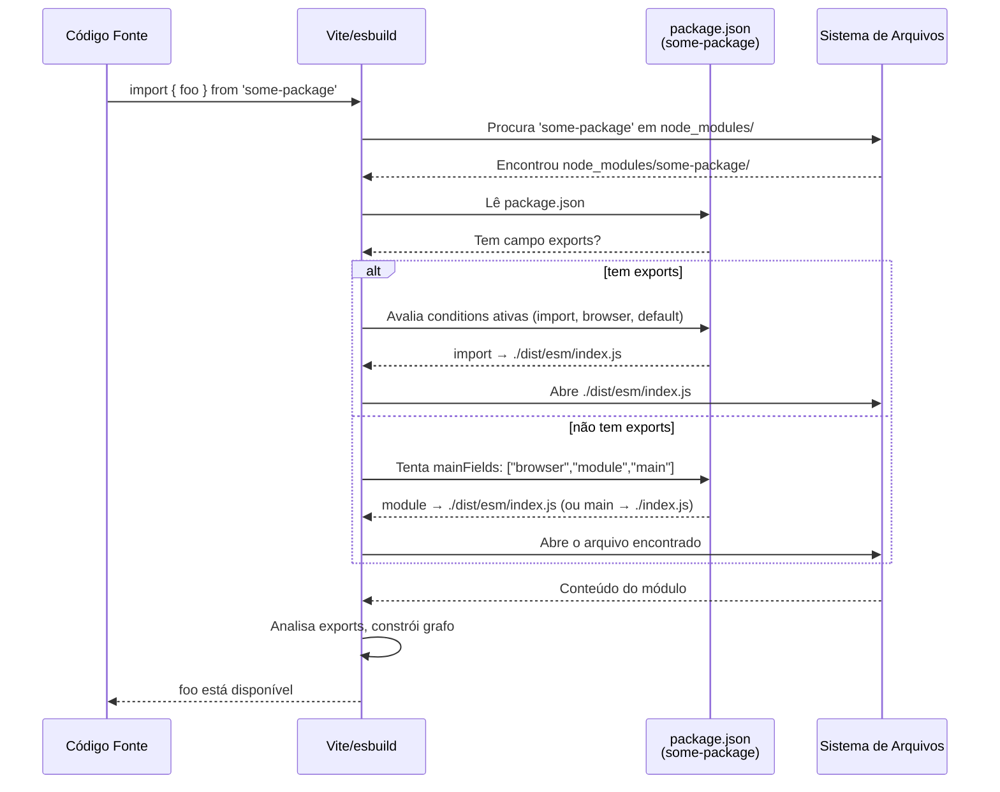

# ESM e CJS e o sistema de módulos

> [!abstract] TL;DR
> JavaScript conviveu sem módulo oficial por décadas. O Node.js preencheu o vácuo em 2009 com **CommonJS** (`require`/`module.exports`, síncrono, dinâmico). Em 2015, o ES6 padronizou **ESM** (`import`/`export`, estático, assíncrono). O problema: quando o Node adotou ESM com suporte estável, criou uma fronteira rígida — os dois sistemas não se misturam livremente. Hoje, em 2026, essa fronteira está quase resolvida: `require(esm)` é estável no Node 20.19+/22.12+, mas ainda exige que o módulo ESM seja **síncrono** (sem top-level await). A chave de tudo é o campo **`exports`** no `package.json`: ele define exatamente quais arquivos o Node e o bundler entregam para cada condição (`import`, `require`, `types`, `default`). Uma lib que publica os dois formatos se chama **dual package** — e carrega um risco real chamado **dual package hazard**. Para o bundler, a resolução de módulos passa por `mainFields` e `conditions`. A semântica da linguagem (`import type`, `verbatimModuleSyntax`) fica na nota de TypeScript; aqui o ângulo é o do ferramental.

---

## O problema que ninguém pediu, mas todo mundo herda

Existe uma tensão no ecossistema JavaScript que persiste há mais de uma década: dois sistemas de módulos incompatíveis, criados para contextos diferentes, que hoje precisam coexistir no mesmo `node_modules`.

Não é culpa de ninguém em particular. O JavaScript rodou anos dentro de `<script>` tags sem precisar de módulos. Quando o Node.js surgiu em 2009, precisava de um sistema de módulos para rodar no servidor — e sem padrão da linguagem disponível, criou o próprio: **CommonJS** (CJS). Funcionava bem. Era síncrono. O ecossistema npm inteiro se construiu sobre essa base.

Em 2015, o ES6 finalmente padronizou **ECMAScript Modules** (ESM) na especificação da linguagem. Sintaxe nova. Semântica diferente. Pensado para browser e servidor. Promessa de ser o sistema definitivo.

O problema: o Node levou até 2019 para suportar ESM de forma experimental, e até ~2022 para ter suporte estável e prático. Nesse intervalo, centenas de milhares de pacotes npm acumularam no formato CJS. E quando o Node finalmente abriu ESM, não permitiu que os dois sistemas se misturassem livremente — ESM e CJS corriam em runtimes de módulo separados, com avaliação separada.

O resultado é o ambiente que você herda em 2026: uma linha divisória técnica que todo projeto precisa navegar, seja escolhendo um lado, seja construindo uma ponte.



---

## CJS e ESM: diferenças que importam para o tooling

Antes de ver como os bundlers e o Node navegam essa divisão, vale entender as diferenças estruturais — porque elas explicam por que a ponte foi tão difícil de construir.



**Live binding vs. cópia:** a diferença é sutil mas importante. Em CJS, quando você faz `require()`, o objeto retornado é uma cópia do valor de `module.exports` naquele instante — como uma foto. Se o módulo depois mudar o valor de um export, quem já fez `require()` não vê a mudança:

```js
// contador-cjs.js
let count = 0;
module.exports.count = count;         // exporta o VALOR de count (0)
module.exports.increment = () => { count++; };  // mas count interno muda

// consumidor CJS
const m = require('./contador-cjs');
console.log(m.count);   // 0
m.increment();
console.log(m.count);   // ainda 0 — a cópia não foi atualizada
console.log(count);     // (count não é acessível aqui)
```

Em ESM, o export é uma **live binding**: é uma referência ao slot de memória da variável original. Se o módulo exportador muda o valor, todos os importadores veem a mudança:

```js
// contador-esm.js
export let count = 0;
export function increment() { count++; }  // count é o mesmo slot

// consumidor ESM
import { count, increment } from './contador-esm.js';
console.log(count);   // 0
increment();
console.log(count);   // 1 — live binding: referência ao slot original
```

Na prática, live bindings raramente causam surpresas em libs bem-desenhadas — porque libs bem-desenhadas não mutam exports depois de inicializadas. Onde importa: módulos que expõem estado mutável (como flags de configuração ou contadores) e precisam que os consumidores vejam as mudanças sem precisar re-importar.

A diferença mais importante para o **bundler** é que ESM é estático: o bundler pode ler todos os `import` de um arquivo sem executá-lo. Isso permite construir o grafo de módulos completo em tempo de build, o que habilita **tree-shaking** — remover exports que ninguém importa. CJS dinâmico torna tree-shaking muito mais difícil ou impossível (um `require(variavel)` não tem grafo analisável).

A diferença mais importante para o **runtime** é que `require()` é síncrono: ele carrega o arquivo, avalia, e retorna o valor antes de continuar. ESM é assíncrono: o runtime precisa resolver o grafo completo de imports antes de começar a avaliar qualquer módulo — o que é incompatível com `require()` síncrono quando o módulo ESM tem `await` no top-level.

Essa incompatibilidade de timing é exatamente por que `require(esm)` demorou tanto para chegar: um `require()` síncrono não pode carregar um módulo ESM que tem `await` no topo, porque não há como esperar de forma síncrona.

### Como o Node decide qual sistema usar

```mermaid
flowchart TD
    FILE["arquivo JavaScript"]

    EXT{Extensão?}
    MJS["`.mjs` → sempre ESM"]
    CJS_EXT["`.cjs` → sempre CJS"]
    JS["`.js` — depende do package.json"]

    PKG{{"package.json mais próximo\ntem `type: module`?"}}
    ESM_FINAL["Tratado como ESM"]
    CJS_FINAL["Tratado como CJS\n(padrão quando ausente)"]

    FILE --> EXT
    EXT -->|.mjs| MJS
    EXT -->|.cjs| CJS_EXT
    EXT -->|.js| JS
    JS --> PKG
    PKG -->|sim| ESM_FINAL
    PKG -->|não / ausente| CJS_FINAL

    style MJS fill:#001525,color:#ddd
    style ESM_FINAL fill:#001525,color:#ddd
    style CJS_FINAL fill:#2a1500,color:#ddd
    style CJS_EXT fill:#2a1500,color:#ddd
```

Regras:
- **`.mjs`** → sempre ESM, independente do `package.json`
- **`.cjs`** → sempre CJS, independente do `package.json`
- **`.js`** → depende do campo `"type"` no `package.json` mais próximo na hierarquia de diretórios
  - `"type": "module"` → `.js` é ESM
  - `"type": "commonjs"` ou ausente → `.js` é CJS

Essa regra das extensões **importa para o tooling**: quando você configura o output de um bundler ou do `tsc`, você escolhe se o output usa `.js`, `.mjs`, ou `.cjs` — e isso determina como o Node vai interpretar os arquivos gerados.

---

## Importar CJS de dentro do ESM: a ponte mais antiga (e suas pegadinhas)

Antes de falar da ponte nova (`require(esm)`), vale entender a que sempre existiu: ESM pode importar módulos CJS. Mas não sem armadilhas.

Quando você escreve `import algo from 'pacote-cjs'`, o Node precisa expor o `module.exports` do CJS como se fosse um módulo ESM. Ele faz isso assim:

- O **`module.exports` inteiro vira o `default` export** do módulo ESM. Isso funciona de forma confiável.
- **Named exports** (como `import { foo } from 'pacote-cjs'`) dependem de uma análise estática do código CJS — e essa análise tem limites.

```js
// pacote-cjs.js
module.exports = {
  somar: (a, b) => a + b,
  subtrair: (a, b) => a - b,
};

// consumidor ESM ✅ confiável
import cjs from 'pacote-cjs';
const { somar } = cjs; // destructuring do default

// consumidor ESM ⚠️ funciona SE a análise estática encontrar "somar" e "subtrair"
import { somar, subtrair } from 'pacote-cjs';
```

### O cjs-module-lexer e seus limites

Por que análise estática em vez de executar? Porque executar tem um custo que o Node não pode pagar nesse momento. Quando o runtime ESM precisa saber os named exports de um módulo CJS para resolver os imports, ele ainda está **construindo o grafo de módulos** — fase anterior à execução de qualquer módulo. Se o Node executasse o CJS para descobrir os exports, quebraria a separação de fases: módulos seriam executados fora de ordem, sem garantia de que suas próprias dependências já foram avaliadas. Isso abre uma classe de bugs difíceis de reproduzir — efeitos colaterais de inicialização disparando antes da hora, dependências circulares quebrando de forma não-determinística.

Além disso, executar arbitrariamente um módulo para inspecionar seus exports tem implicações de segurança: arquivos CJS podem ter efeitos colaterais severos na inicialização (conexões de rede, escrita em disco, variáveis de ambiente). Análise estática do texto é previsível, rápida e segura.

O Node usa internamente o projeto [`cjs-module-lexer`](https://github.com/nodejs/cjs-module-lexer) para tentar detectar os named exports de um módulo CJS sem executá-lo. Ele procura padrões como `exports.foo = ...` e `module.exports = { foo, bar }` no texto do arquivo.

O problema: o análise é **heurística e conservadora**. Se os exports são construídos dinamicamente (via loop, `Object.assign`, `Proxy`, ou qualquer padrão não reconhecido pelo lexer), o Node só enxerga o `default` — e os named exports não aparecem.

```js
// pacote com exports dinâmicos — o lexer NÃO consegue detectar named exports
const keys = ['alpha', 'beta', 'gamma'];
keys.forEach(k => { exports[k] = () => k; });
// ESM só vê: import pkg from 'pacote'; pkg.alpha()
// import { alpha } from 'pacote' → undefined (silencioso ou erro de tipo)
```

> [!warning] Named imports de CJS: não confie sem verificar
> Se você está importando um pacote CJS antigo com `import { algo }` e `algo` aparece como `undefined`, provavelmente o lexer não conseguiu detectar o export. A solução segura é `import pkg from 'pacote'; const { algo } = pkg;`. Ferramentas como esbuild e Rollup têm análise própria mais sofisticada, mas o comportamento nativo do Node é o cjs-module-lexer.



---

## require(esm): a ponte que finalmente chegou

Durante anos, a única ponte entre os dois mundos era unidirecional: ESM podia importar CJS (`import` de um arquivo CJS funciona no Node), mas CJS não podia importar ESM (um `require()` de um arquivo ESM lançava erro).

Isso mudou. Em dezembro de 2025, **`require(esm)` foi marcado como estável**:

- **Node 20.19.0+**: suporte backportado para a linha LTS v20
- **Node 22.12.0+**: disponível sem flag experimental

A condição inegociável: o módulo ESM carregado via `require()` **não pode ter top-level await**. Se tiver, o `require()` lança um erro em runtime — porque não há como fazer um `require()` síncrono esperar por uma Promise.

```js
// modulo-esm.mjs
export const valor = 42;
export function somar(a, b) { return a + b; }

// consumidor-cjs.cjs
const { valor, somar } = require('./modulo-esm.mjs'); // ✅ Node 20.19+/22.12+
console.log(somar(valor, 8)); // 50
```

```js
// modulo-com-await.mjs
const config = await fetch('/config').then(r => r.json()); // top-level await!
export { config };

// consumidor-cjs.cjs
const { config } = require('./modulo-com-await.mjs'); // ❌ ERRO em runtime
// Error [ERR_REQUIRE_ASYNC_MODULE]: ...
```

> [!info] Por que isso importa para libs
> Com `require(esm)` estável, uma lib que publica **apenas ESM** já pode ser consumida por código CJS em Node 20.19+/22.12+. Isso significa que, para bases de código novas ou que controlam seu ambiente Node, publicar ESM-only é uma opção legítima — sem abandonar usuários CJS. A análise dos 5.000 pacotes npm mais populares mostrou que menos de 0,02% têm top-level await indispensável que impediria esse caminho.

Mas há um "mas": se você precisa suportar Node 16, 18, ou 20 antes da v20.19.0, `require(esm)` não está disponível. Para esses casos, o dual package ainda é a resposta.

### Top-level await em profundidade: por que ele quebra o require(esm)

O top-level await (`await` fora de qualquer `async function`, diretamente no corpo do módulo) é uma das features mais transformadoras do ESM — e o motivo exato pelo qual `require(esm)` tem essa condição inegociável de "módulo síncrono".

Quando um módulo ESM tem top-level await, ele vira essencialmente uma Promise que precisa ser resolvida antes do módulo estar disponível. O runtime ESM lida com isso de forma assíncrona: pausa a avaliação do módulo pai enquanto espera, usando a fila de microtasks. Um `require()` síncrono não tem como entrar nessa fila — ele bloqueia a thread de forma síncrona.

```js
// ✅ Top-level await: casos de uso legítimos

// 1. Inicialização condicional por plataforma
const fs = await import(
  process.platform === 'win32' ? 'node:fs/win32' : 'node:fs'
);

// 2. Carregar configuração de banco antes de exportar o cliente
const config = await fetch('https://config.example.com/db').then(r => r.json());
export const db = new DatabaseClient(config);

// 3. Fallback com import() dinâmico
const sharp = await import('sharp').catch(() => null);
export const processImage = sharp
  ? (buf) => sharp(buf).resize(800).toBuffer()
  : (buf) => buf; // fallback sem processamento
```

> [!warning] Top-level await é um "contrato de assincronicidade" com quem importa
> Se o seu módulo tem top-level await, **todo módulo que o importar** também espera — de forma transitiva. É como um vírus assíncrono: um módulo com `await` no topo "contamina" a cadeia de imports. Para libs, isso é um odor de design: você está impondo latência de inicialização para todos os consumidores, mesmo os que não precisam da parte assíncrona.
>
> A alternativa mais limpa: inicialize de forma lazy (na primeira chamada da função, não no corpo do módulo). Assim o consumidor paga o custo só quando precisa.

```js
// ❌ Evitar em libs: top-level await em módulo shared
const config = await loadConfig(); // bloqueia todos os importadores
export const client = createClient(config);

// ✅ Preferir: lazy initialization
let _client;
export async function getClient() {
  if (!_client) _client = createClient(await loadConfig());
  return _client;
}
```

### A condição `module-sync`: o elo perdido

Com `require(esm)` estável, surgiu uma nova condição de export: **`"module-sync"`**. Ela serve como um sinal explícito de que o módulo ESM apontado **não tem top-level await** — e portanto é seguro para `require()`.

```json
{
  "exports": {
    ".": {
      "module-sync": "./dist/index.js",   ← ESM síncrono (safe para require(esm))
      "import":      "./dist/index.js",   ← ESM (qualquer Node com suporte)
      "require":     "./dist/index.cjs",  ← CJS fallback
      "default":     "./dist/index.js"
    }
  }
}
```

A lógica de quem usa cada condição:

| Quem resolve | Condição escolhida | Arquivo recebido |
|---|---|---|
| `import` ou `import()` em Node moderno | `import` | ESM |
| `require()` em Node 20.19+/22.12+ | `module-sync` | ESM (síncrono) |
| `require()` em Node mais antigo | `require` | CJS |

O cache é realmente compartilhado. Quando `require(esm)` carrega um arquivo ESM, o Node registra o módulo no **ESM module cache** — o mesmo cache que `import` usa. A chave do cache é a URL canônica do arquivo (o path absoluto resolvido). Então, se `import` já carregou `./dist/index.js`, um `require('./dist/index.js')` posterior encontra o módulo no cache e retorna a mesma instância — sem avaliar o arquivo de novo.

O que o dual package antigo fazia era pior: apontava `"import"` para `./dist/esm/index.js` e `"require"` para `./dist/cjs/index.cjs` — dois arquivos fisicamente diferentes, cada um com sua própria entrada de cache, cada um avaliado independentemente. Com `module-sync`, ambas as condições apontam para o **mesmo arquivo** (`./dist/index.js`), então a mesma entrada de cache é usada. O Node garante que um módulo ESM (identificado pelo path) só é avaliado uma vez.

Isso resolve o dual package hazard de forma elegante: em vez de dois arquivos (um ESM, um CJS), o estado vive só no ESM. O CJS é um fallback para runtimes antigos, não o caminho principal.

> [!info] `module-sync` é o futuro da transição
> Pacotes como React Router já adotaram `module-sync` no `exports`. O benefício: em Node 22.12+, `import` e `require` do mesmo pacote carregam o **mesmo arquivo ESM** — o cache do módulo é compartilhado, e o dual package hazard desaparece por design. Joyee Cheung (core do Node.js) recomenda `module-sync` como o padrão para qualquer lib que possa garantir ausência de top-level await. [Fonte: blog da autora, 2025-12-30](https://joyeecheung.github.io/blog/2025/12/30/require-esm-in-node-js-from-experiment-to-stability/)

---

## O campo `exports`: a chave de tudo

Antes do campo `exports`, um pacote npm expunha seus internos da forma mais ingênua possível: o campo `main` apontava para um arquivo de entrada, e qualquer consumidor podia fazer `require('meu-pacote/src/internals/util')` diretamente — acessando partes privadas do pacote sem cerimônia.

O campo **`exports`** (introduzido no Node 12) mudou isso completamente. Ele define um mapa explícito de quais caminhos o pacote expõe e o que cada caminho entrega. Qualquer path não listado em `exports` lança `ERR_PACKAGE_PATH_NOT_EXPORTED`.

```json
{
  "name": "minha-lib",
  "exports": {
    ".": "./dist/index.js"
  }
}
```

Isso é o mínimo: apenas o ponto de entrada principal. Tente `require('minha-lib/src/utils')` e vai receber um erro — por design.

### Conditional exports: entregando o arquivo certo para cada contexto

O poder real do campo `exports` está nas **conditional exports**: a capacidade de mapear o mesmo caminho para arquivos diferentes dependendo de como o pacote é carregado.

```json
{
  "name": "minha-lib",
  "exports": {
    ".": {
      "import": "./dist/esm/index.js",
      "require": "./dist/cjs/index.cjs",
      "default": "./dist/esm/index.js"
    }
  }
}
```

Quando alguém escreve `import { foo } from 'minha-lib'`, o Node usa a condição `"import"` e entrega `./dist/esm/index.js`. Quando alguém escreve `const { foo } = require('minha-lib')`, o Node usa `"require"` e entrega `./dist/cjs/index.cjs`.

**Ordem importa**: as condições são avaliadas na ordem em que aparecem no JSON. A primeira que combinar com o contexto vence. Coloque sempre `"default"` por último.

### As condições principais que você vai ver

| Condição | Quem a ativa | Uso |
|---|---|---|
| `"import"` | `import`/`import()` dinâmico | Entry ESM para ES module consumers |
| `"require"` | `require()` | Entry CJS para CommonJS consumers |
| `"module-sync"` | `import`, `import()`, ou `require()` | ESM sem top-level await (seguro para require(esm)) |
| `"types"` | TypeScript type checker | Arquivo `.d.ts` com declarações de tipo |
| `"node"` | Qualquer ambiente Node.js | Específico do Node (vs browser) |
| `"browser"` | Bundlers com target browser | Versão para browser |
| `"default"` | Fallback universal | Deve sempre vir por último |

> [!warning] `"types"` vai antes de tudo
> Quando você inclui `"types"` nas conditional exports para TypeScript, ele **precisa vir antes** das outras condições no objeto. O TypeScript para de checar assim que encontra a primeira condição correspondente — se `"import"` vier antes de `"types"`, o TypeScript pode não encontrar os tipos.
>
> ```json
> "import": {
>   "types": "./dist/index.d.ts",   // ✅ types primeiro
>   "default": "./dist/index.js"
> }
> ```

### Múltiplos entry points

Uma lib pode expor vários caminhos:

```json
{
  "exports": {
    ".": "./dist/index.js",
    "./utils": "./dist/utils.js",
    "./server": {
      "node": "./dist/server.node.js",
      "browser": "./dist/server.browser.js"
    }
  }
}
```

Cada chave que começa com `"."` é um sub-path export. O consumidor pode escrever `import { debounce } from 'minha-lib/utils'` e o Node entrega o arquivo certo — sem acessar nada que não foi explicitamente exposto.

### Subpath patterns: wildcards para libs com muitos entry points

Para libs com dezenas de sub-paths (component libraries, icon packs, utilitários modulares), listar cada caminho individualmente inflaria o `package.json`. O Node suporta **subpath patterns** com o caractere `*`:

```json
{
  "exports": {
    ".": "./dist/index.js",
    "./components/*": "./dist/components/*.js",
    "./icons/*": {
      "import": "./dist/icons/*.js",
      "require": "./dist/icons/*.cjs"
    }
  }
}
```

O consumidor pode escrever `import Button from 'minha-lib/components/Button'` e o Node substitui `*` por `Button`, entregando `./dist/components/Button.js`. O mesmo padrão de `*` aparece nos dois lados da mapping — e o valor à direita recebe o mesmo segmento capturado à esquerda.

> [!warning] Restrições dos wildcards
> O `*` captura tudo, inclusive separadores de path (`/`). Mas o Node bloqueia caminhos que contenham `..`, `.`, ou `node_modules` na parte substituída — é uma proteção contra path traversal. Se você expõe `"./utils/*"`, um atacante não consegue escrever `'minha-lib/utils/../../../etc/passwd'`.

---

## Dual package: publicando os dois formatos

Uma **dual package** é um pacote npm que publica tanto ESM quanto CJS, usando conditional exports para entregar o formato certo. Era a solução canônica para libs que precisavam suportar consumidores dos dois mundos antes de `require(esm)`.

O padrão mais comum em 2025-2026 — "ESM-first, CJS como cortesia":

```
minha-lib/
├── src/              ← source TypeScript (ESM)
├── dist/
│   ├── esm/          ← build ESM (.js ou .mjs)
│   │   └── index.js
│   ├── cjs/          ← build CJS (.cjs ou .js com package.json local)
│   │   ├── index.cjs
│   │   └── package.json   ← { "type": "commonjs" } — hack necessário
│   └── types/        ← declarações .d.ts
│       └── index.d.ts
└── package.json
```

```json
{
  "name": "minha-lib",
  "version": "2.0.0",
  "type": "module",
  "main": "./dist/cjs/index.cjs",
  "module": "./dist/esm/index.js",
  "types": "./dist/types/index.d.ts",
  "exports": {
    ".": {
      "import": {
        "types": "./dist/types/index.d.ts",
        "default": "./dist/esm/index.js"
      },
      "require": {
        "types": "./dist/types/index.d.cts",
        "default": "./dist/cjs/index.cjs"
      }
    }
  },
  "files": ["dist"]
}
```

> [!note] O `package.json` interno na pasta `cjs/`
> Quando `"type": "module"` está no `package.json` raiz, todos os `.js` são ESM — inclusive os da pasta `cjs/`. Para que o Node trate os arquivos CJS como CJS, você coloca um `package.json` mínimo dentro de `dist/cjs/` com apenas `{ "type": "commonjs" }`. Sim, é um hack. Mas é o padrão que o ecossistema converge.
>
> A alternativa limpa: usar extensão `.cjs` para todos os arquivos CommonJS e `.mjs` para ESM — sem precisar do `package.json` interno. Ferramentas como `tsup` e `unbuild` lidam com isso automaticamente.

### O dual package hazard

O dual package hazard é o risco mais sutil do dual package: se um consumidor carrega **as duas versões** do mesmo pacote na mesma aplicação (uma via `import`, outra via `require()`), cada versão executa em seu próprio contexto de módulo — como se fossem dois pacotes diferentes.

O resultado: singletons não são singleton; verificações `instanceof` falham; Maps e Sets compartilhados parecem vazios.



**Quando o hazard é real**: pacotes com estado global (singletons, registries, caches, Maps compartilhados, instâncias de classe sujeitas a `instanceof`).

**Quando o hazard não importa**: pacotes stateless (funções puras, constantes, utilitários sem estado). Para esses, dual package é seguro.

**Como evitar**:
1. **Stateless-first**: desenhe sua lib sem estado global de módulo quando possível.
2. **`module-sync` + ESM-only** (o padrão mais limpo em Node 20.19+/22.12+): publique apenas ESM, exponha a condição `"module-sync"` para sinalizar que é síncrono. `require()` e `import` carregam o mesmo arquivo — mesma instância, sem hazard.
3. **Wrapper CJS sobre ESM**: se o ambiente não garante Node 20.19+, faça o CJS ser um wrapper fino que re-exporta do ESM via `require(esm)`. O estado vive em um lugar só.
4. **ESM-only com `import()` dinâmico**: deixe o consumidor CJS usar `import()` assíncrono se precisar de compatibilidade total — pagando custo de assincronicidade.

---

## Como o bundler resolve um import

Quando você escreve `import { debounce } from 'lodash-es'` num arquivo que passa pelo webpack, pelo Vite ou pelo esbuild, o bundler executa seu próprio algoritmo de resolução — que não é idêntico ao do Node.

O bundler precisa responder: "dado esse specifier de import, qual arquivo físico no disco ele representa?" Ele considera, nessa ordem:



### `mainFields`: o legado de antes do `exports`

Antes do campo `exports`, bundlers definiam uma lista `mainFields` — os campos do `package.json` que eles tentavam, em ordem, para encontrar o entry point. O padrão típico era:

```
["browser", "module", "main"]
```

- `"browser"`: versão para browser (não-padrão, convenção antiga)
- `"module"`: versão ESM (não-padrão, mas amplamente adotado por bundlers como Rollup e webpack)
- `"main"`: CJS legacy, o campo original do Node

O problema: `"module"` nunca foi padronizado no Node — bundlers usam, Node ignora. Isso criou uma divergência: a mesma lib poderia se comportar diferente no bundler e no runtime.

Com o campo `exports`, você não precisa mais de `mainFields` para libs modernas — as condições resolvem isso de forma padrão. Mas `mainFields` ainda importa para pacotes antigos que não usam `exports`.

### Conditions: o que cada bundler ativa por padrão

Cada bundler tem seu conjunto padrão de condições que passa para a resolução de `exports`:

| Bundler | Condições padrão (produção) |
|---|---|
| **Vite (build)** | `import`, `module`, `browser`, `default`, `production` |
| **Vite (dev server)** | `import`, `module`, `browser`, `default`, `development` |
| **webpack 5** | `import`, `module`, `browser`, `default` (sem `module` nos exports condicionais) |
| **esbuild** | `import`, `module`, `browser`, `default` |
| **Node (runtime)** | `import` ou `require`, `node`, `default` |

> [!warning] Divergência webpack vs Rollup/esbuild no campo `module`
> O campo `"module"` no `package.json` (não-padrão, legado) é tratado como ESM entry pelos bundlers baseados em Rollup (incluindo Vite em build) e pelo esbuild — mas o webpack **não** o inclui automaticamente nas condições de `exports`. Isso significa que uma lib antiga que usa `"module"` pode ser resolvida diferente em webpack versus Vite.
>
> A solução: usar `"exports"` com condições explícitas. Com `exports`, o campo `"module"` legacy se torna irrelevante.

### Adicionando condições customizadas no Vite

```js
// vite.config.ts
import { defineConfig } from 'vite';

export default defineConfig({
  resolve: {
    conditions: ['react-server', 'import', 'module', 'browser', 'default'],
    // ↑ adicionar condições customizadas além do padrão
  }
});
```

Isso importa para libs que expõem uma versão diferente para SSR ou React Server Components, por exemplo — condições como `"react-server"` são community-defined mas amplamente usadas.

---

## Exemplo trabalhado: o `exports` de uma lib dual

Vamos construir uma lib real — `date-helpers` — que precisa rodar em Node CJS legado, Node ESM moderno, e em browsers via bundler. O source é TypeScript ESM.

**Estrutura de output após build (com `tsup`):**

```
dist/
├── index.js        ← ESM (import conditions)
├── index.cjs       ← CJS (require condition)
├── index.d.ts      ← tipos TypeScript (ambos)
└── index.d.cts     ← tipos TypeScript para .cjs
```

**`package.json` completo:**

```json
{
  "name": "date-helpers",
  "version": "1.0.0",
  "type": "module",
  "main": "./dist/index.cjs",
  "module": "./dist/index.js",
  "types": "./dist/index.d.ts",
  "exports": {
    ".": {
      "import": {
        "types": "./dist/index.d.ts",
        "default": "./dist/index.js"
      },
      "require": {
        "types": "./dist/index.d.cts",
        "default": "./dist/index.cjs"
      }
    }
  },
  "files": ["dist"],
  "scripts": {
    "build": "tsup src/index.ts --format esm,cjs --dts"
  },
  "devDependencies": {
    "tsup": "^8.0.0",
    "typescript": "^5.5.0"
  }
}
```

**`src/index.ts` (source):**

```ts
// Formatação de datas — funções puras, sem estado global
// (stateless = safe para dual package)

export function formatDate(date: Date): string {
  return date.toISOString().split('T')[0];
}

export function addDays(date: Date, days: number): Date {
  const result = new Date(date);
  result.setDate(result.getDate() + days);
  return result;
}

export function isWeekend(date: Date): boolean {
  const day = date.getDay();
  return day === 0 || day === 6;
}
```

**Como fica o output ESM (`dist/index.js`):**

```js
// dist/index.js — gerado pelo tsup (ESM)
function formatDate(date) {
  return date.toISOString().split('T')[0];
}

function addDays(date, days) {
  const result = new Date(date);
  result.setDate(result.getDate() + days);
  return result;
}

function isWeekend(date) {
  const day = date.getDay();
  return day === 0 || day === 6;
}

export { formatDate, addDays, isWeekend };
```

**Como fica o output CJS (`dist/index.cjs`):**

```js
// dist/index.cjs — gerado pelo tsup (CJS)
"use strict";
Object.defineProperty(exports, "__esModule", { value: true });
exports.isWeekend = exports.addDays = exports.formatDate = void 0;

function formatDate(date) {
  return date.toISOString().split('T')[0];
}
exports.formatDate = formatDate;

function addDays(date, days) {
  const result = new Date(date);
  result.setDate(result.getDate() + days);
  return result;
}
exports.addDays = addDays;

function isWeekend(date) {
  const day = date.getDay();
  return day === 0 || day === 6;
}
exports.isWeekend = isWeekend;
```

**Consumidores:**

```js
// consumidor ESM — recebe dist/index.js via condição "import"
import { formatDate, isWeekend } from 'date-helpers';
console.log(formatDate(new Date())); // '2026-06-24'

// consumidor CJS — recebe dist/index.cjs via condição "require"
const { formatDate, isWeekend } = require('date-helpers');
console.log(isWeekend(new Date())); // false (terça-feira)

// TypeScript — encontra dist/index.d.ts ou dist/index.d.cts conforme o contexto
```

**Como o TypeScript encontra os tipos:**

Quando um consumidor TypeScript escreve `import { formatDate } from 'date-helpers'`, o TS resolve o `exports` e encontra a condição `"import"` → procura `"types"` dentro dela → acha `./dist/index.d.ts`. O IntelliSense funciona. Os erros de tipo funcionam. Sem configuração adicional do consumidor.

> [!example] O `__esModule: true` no output CJS
> O marcador `{ __esModule: true }` em `exports` é uma convenção do Babel/webpack que sinaliza "este módulo CJS foi transpilado de ESM". Sem ele, quando ESM importa CJS via `import { foo } from 'pacote'`, o Node precisa deduzir se tratar o `module.exports` como namespace ESM ou como `default` export. Com `__esModule: true`, ferramentas sabem que os campos de `exports` correspondem a named exports ESM. Você não precisa escrever isso manualmente — `tsup`, `esbuild`, e Rollup adicionam quando necessário.

---

## A resolução de módulo passo a passo

Para solidificar: o que acontece quando você escreve `import { foo } from 'some-package'` dentro de um projeto com Vite?



Esse mesmo fluxo se repete para cada import em cada arquivo do projeto. O bundler mantém o grafo completo na memória, resolve tudo antes de gerar o bundle final.

---

## Como explicar em inglês

The JavaScript module split is one of the most persistent pain points in the ecosystem. **CommonJS** (CJS) is the Node.js legacy system: `require()` is synchronous and dynamic — you can call it anywhere, even inside an `if` block. **ECMAScript Modules** (ESM) is the language standard: `import`/`export` are static and must appear at the top level, which enables ahead-of-time graph analysis and tree-shaking.

The two systems don't freely interoperate: ESM can always import CJS, but CJS importing ESM was blocked until Node 20.19+/22.12+ where **`require(esm)` became stable** — with the constraint that the ESM module must be synchronous (no top-level await).

The **`exports` field** in `package.json` is the modern way to control what a package exposes and which file is delivered for each context. **Conditional exports** map a single path (`"."`) to different files based on how the consumer loads the package: `"import"` for ESM consumers, `"require"` for CJS consumers, `"types"` for TypeScript. Order matters — first match wins.

A **dual package** ships both ESM and CJS builds. The **dual package hazard** occurs when both builds are loaded in the same app (e.g., one file uses `import`, another uses `require()`) — each evaluates in its own module context, so singletons are duplicated and `instanceof` checks break. The solution is stateless packages (no shared module state) or an ESM-canonical approach where CJS is a thin wrapper.

Bundlers use **conditions** — a set of string hints — when resolving `exports`. Vite in development activates `import, module, browser, development`; in production, `import, module, browser, production`. The legacy `mainFields` array (`["browser","module","main"]`) is used only for packages that don't have `exports`.

### Vocabulário-chave

| Português | Inglês |
|---|---|
| sistema de módulos | module system |
| resolução de módulo | module resolution |
| exportações condicionais | conditional exports |
| pacote dual | dual package |
| risco do pacote dual | dual package hazard |
| vinculação ao vivo | live binding |
| análise estática | static analysis |
| remoção de código morto | tree-shaking / dead code elimination |
| campo de exportações | exports field |
| entrada do pacote | package entry point |
| condição de exportação | export condition |
| encapsulamento de pacote | package encapsulation |
| singleton duplicado | duplicated singleton |
| especificador de módulo | module specifier |

---

## Armadilhas comuns

> [!warning] Armadilha 1: `"type": "module"` muda `.js` para todos os arquivos
> Se você adiciona `"type": "module"` no `package.json` raiz, **todo arquivo `.js`** no projeto passa a ser interpretado como ESM — incluindo scripts de configuração, seed files, tudo. Se você tem código CJS, ele precisa ser renomeado para `.cjs`. Essa é a mudança mais comum que quebra projetos na migração para ESM.

> [!warning] Armadilha 2: `require(esm)` exige módulo síncrono
> Mesmo no Node 20.19+/22.12+, tentar `require()` de um módulo ESM com top-level await lança erro em runtime — não em build time, não em type-check. O erro aparece quando o código executa. Se você depende de `require(esm)`, certifique-se de que o módulo alvo não tem top-level await.

> [!warning] Armadilha 3: a ordem das condições no `exports` é crítica
> `"types"` precisa vir antes de `"default"` dentro de cada condição, ou o TypeScript pode não encontrar os tipos. Muitos pacotes ainda têm `"types"` fora das condições (no nível raiz do objeto), o que funciona em alguns casos mas não em todos os cenários de moduleResolution. A forma correta é `"import": { "types": "...", "default": "..." }`.

> [!warning] Armadilha 4: `"main"` e `"exports"` coexistem, mas com semânticas diferentes
> `"main"` é o legacy pre-exports. Se você define `"exports"`, o Node **usa `exports` e ignora `main`** para resolução de subpaths. Mas ferramentas antigas (versões antigas de webpack, Jest sem configuração adequada) ainda usam `"main"`. Defina os dois para máxima compatibilidade, mas saiba que para Node moderno, `"exports"` é o que importa.

> [!warning] Armadilha 5: o dual package hazard em libs com estado
> Se sua lib exporta singletons, registries, instâncias que serão verificadas com `instanceof`, ou qualquer estado compartilhado no escopo do módulo — o dual package hazard pode te queimar. O sintoma: "por que esse `instanceof` retorna `false`?" ou "por que meu cache está vazio?". Diagnóstico: cheque se o consumidor carrega sua lib das duas formas em pontos diferentes da aplicação.

> [!warning] Armadilha 6: `module` e `browser` são campos não-padronizados
> `"module"` no `package.json` (apontando para o build ESM) não é um campo Node padrão — é uma convenção que bundlers adotaram. O Node ignora. O webpack 5 não adiciona `"module"` nas suas conditions de `exports`. Rollup e esbuild adicionam. Para comportamento consistente, use `"exports"` com conditional exports explícitos e não dependa de `"module"`.

> [!warning] Armadilha 7: `module-sync` pode causar hazard com libs que ainda publicam dual
> A condição `module-sync` resolve o hazard quando a lib só publica ESM. Mas se a lib publica dual (ESM + CJS) **e** inclui `module-sync`, o resultado depende de como o consumidor e a lib se encaixam. Em testes com Vitest + React Router, Node 22.12+ carregava o `module-sync` (ESM), enquanto ambientes mais antigos carregavam o CJS — duas instâncias em contextos distintos de um mesmo processo de teste. Diagnóstico: inspecione o módulo cache com `require.cache` ou adicione logs de inicialização.

---

## Junior vs. Sênior: como pensar sobre módulos em entrevista

Esse é um dos tópicos favoritos de entrevistas técnicas para vagas sênior em frontend/Node. A diferença entre uma resposta mediana e uma resposta forte:

| Nível | O que diz |
|---|---|
| **Júnior** | "ESM usa `import/export` e CJS usa `require`. ESM é mais moderno." |
| **Pleno** | "A diferença principal é static vs. dynamic. ESM permite tree-shaking porque o bundler pode analisar o grafo sem executar. CJS não pode." |
| **Sênior** | Explica o **motivo da incompatibilidade de timing** (síncrono vs. assíncrono), sabe o que é dual package hazard e quando ele importa, conhece `require(esm)` e suas condições, entende `module-sync`, e sabe como o campo `exports` funciona para bundler e Node separadamente. |

A pergunta-armadilha mais comum: *"Por que um `require()` não pode importar ESM?"* — a resposta rasa é "porque são sistemas diferentes". A resposta sênior é: **porque `require()` é síncrono e ESM é assíncrono por design** — o runtime ESM precisa resolver o grafo completo de módulos antes de avaliar qualquer um, e isso é fundamentalmente incompatível com um sistema que bloqueia a thread esperando o resultado. A exceção (`require(esm)` no Node 20.19+) só funciona porque o Node detecta módulos ESM sem top-level await e os avalia de forma síncrona internamente.

> [!question] Por que o Node consegue avaliar ESM "de forma síncrona internamente" se ESM é assíncrono?
> Há duas camadas distintas em ESM: o **protocolo de carregamento** (async) e a **execução do código** (potencialmente síncrona). O protocolo de carregamento sempre tem fases assíncronas — o Node precisa localizar arquivos em disco, possivelmente buscar recursos remotos, e construir o grafo de módulos antes de avaliar qualquer coisa. Essa fase **sempre** usa Promises internamente. O que muda sem top-level await é a fase de **avaliação** do módulo: se nenhum módulo no grafo tem `await` no corpo, a execução do código depois que o grafo está resolvido é puramente síncrona — é JavaScript normal sem nenhuma pausa assíncrona. O `require(esm)` aproveita exatamente isso: ele usa a API `loadCJSModule` do loader do Node, que é capaz de executar o protocolo de carregamento de forma síncrona *ao bloquear a thread* (um uso controlado e deliberado de I/O síncrono no loader, não na aplicação). Se o módulo tiver top-level await, o grafo não pode ser avaliado sem entrar na fila de microtasks — e aí o bloqueio síncrono falha. A tensão não é uma contradição: ESM é assíncrono no protocolo; ESM sem `await` é síncrono na avaliação.

Outra pergunta frequente: *"O que é dual package hazard e quando você se preocupa com ele?"* — a resposta correta inclui: (1) condição de ocorrência (mesma lib, dois formatos, dois `require`/`import` no mesmo processo), (2) sintoma (singletons duplicados, `instanceof` falha), (3) quando não importa (libs stateless), (4) solução moderna (`module-sync` + ESM-only em Node 20.19+).

---

## Veja também

- [[07 - O grafo de módulos e o que é bundling]] — como o bundler constrói o grafo de imports e o que acontece depois da resolução; tree-shaking depende diretamente do ESM estático desta nota
- [[03 - Package managers - npm, pnpm, yarn e Bun]] — quem instala os pacotes no `node_modules` e como o lockfile afeta a resolução; hoisting e deduplicação interagem com o dual package hazard
- [[05 - Semver e o grafo de dependências]] — como versões e o grafo de dependências determinam quantas cópias de uma lib chegam no `node_modules` — fator crítico para o hazard
- [[08 - Transpilação e targets]] — quando você transpila ESM → CJS (ou vice-versa) e como isso afeta as extensões e o campo `type`
- [[11 - webpack - o veterano]] — como o webpack 5 resolve `exports`, `mainFields` e condições; divergência do Rollup na condição `"module"`
- [[13 - Vite a fundo]] — condições ativas no Vite (dev vs. build), `resolve.conditions` customizável, como o Vite lida com `"module-sync"`
- [[14 - Rollup, esbuild e Rolldown]] — bundlers que consomem o grafo de módulos e geram os outputs ESM/CJS; análise de CJS para named exports no esbuild
- [[17 - Otimização de bundle]] — tree-shaking profundo depende de módulos ESM estáticos; `sideEffects: false` no `package.json` complementa o campo `exports`
- [[03-Dominios/Tecnologia/TypeScript/21 - Modules - ESM, CJS e type-only imports|Modules no TypeScript]] — a semântica da linguagem: `import type`, `verbatimModuleSyntax`, `moduleResolution`, extensões `.js` em projetos NodeNext; a condição `"types"` no `exports` conecta os dois mundos
- [[03-Dominios/Tecnologia/Node/index|Node]] — runtime de módulos no Node em profundidade: a implementação do algoritmo de resolução, flags, ciclo de vida de módulos; cjs-module-lexer e o namespace ESM

## Referências

- [Joyee Cheung — require(esm) in Node.js: from experiment to stability (2025-12-30)](https://joyeecheung.github.io/blog/2025/12/30/require-esm-in-node-js-from-experiment-to-stability/) — artigo definitivo da autora da feature sobre o histórico, limitações e `module-sync`
- [Node.js 22.12.0 release notes](https://nodejs.org/en/blog/release/v22.12.0) — `require(esm)` unflagged na linha v22 LTS
- [Node.js 20.19.0 release notes](https://nodejs.org/en/blog/release/v20.19.0) — backport de `require(esm)` para v20 LTS
- [Node.js Docs — ECMAScript modules](https://nodejs.org/api/esm.html) — documentação oficial: interop, named exports de CJS, condições, top-level await
- [Node.js Docs — Packages (exports field)](https://nodejs.org/api/packages.html) — referência completa do campo `exports`, subpath patterns, conditional exports
- [nodejs/cjs-module-lexer](https://github.com/nodejs/cjs-module-lexer) — o lexer que o Node usa para detectar named exports de módulos CJS
- [Dual package hazard com `module-sync` — vitest issue #7692](https://github.com/vitest-dev/vitest/issues/7692) — caso real de hazard com React Router em Node 22.12+
- [Socket.dev — Node.js Delivers First LTS with require(esm) Enabled](https://socket.dev/blog/node-js-delivers-first-lts-with-require-esm-enabled) — análise de impacto nos 5.000 pacotes npm mais populares
