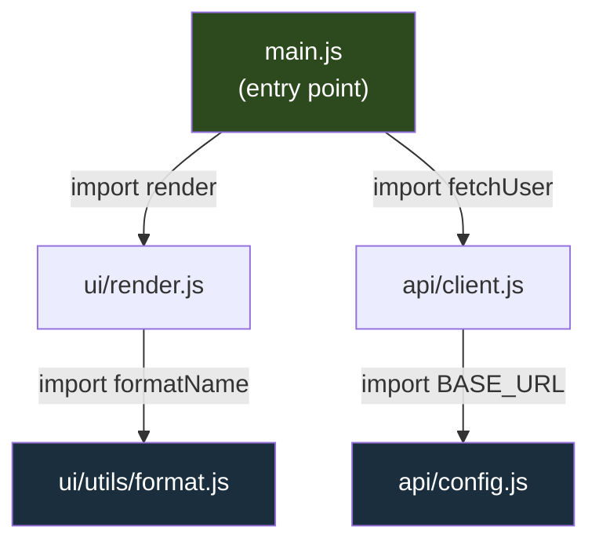
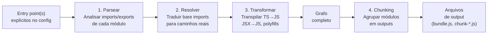
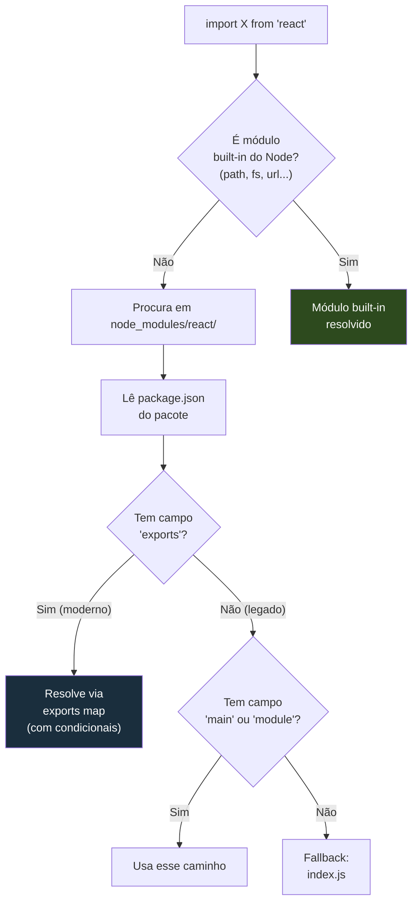
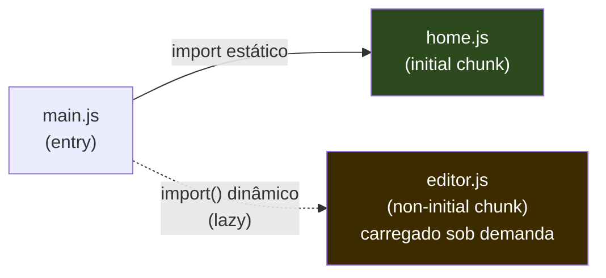
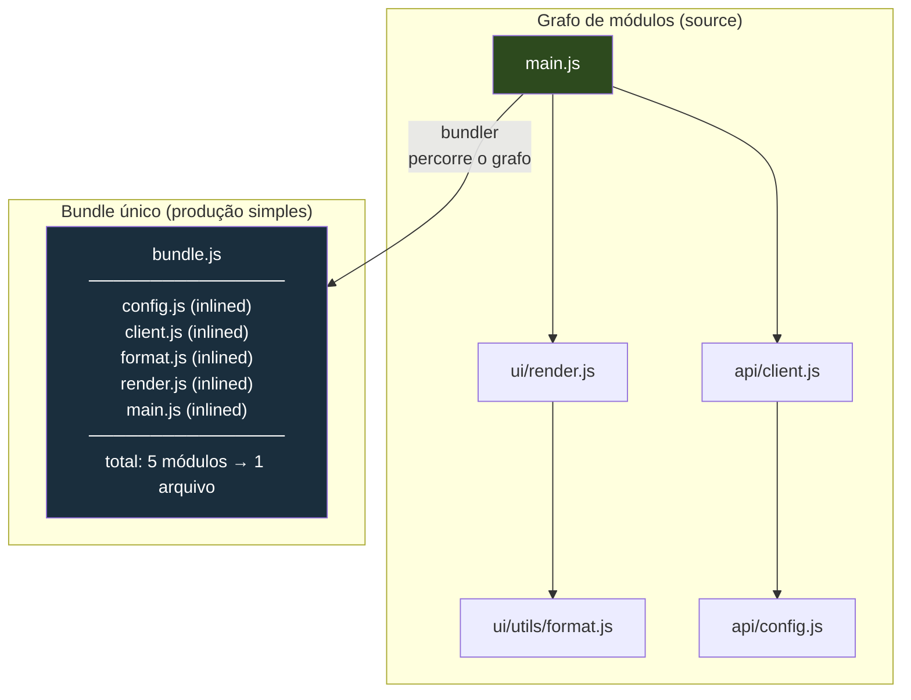
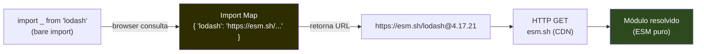
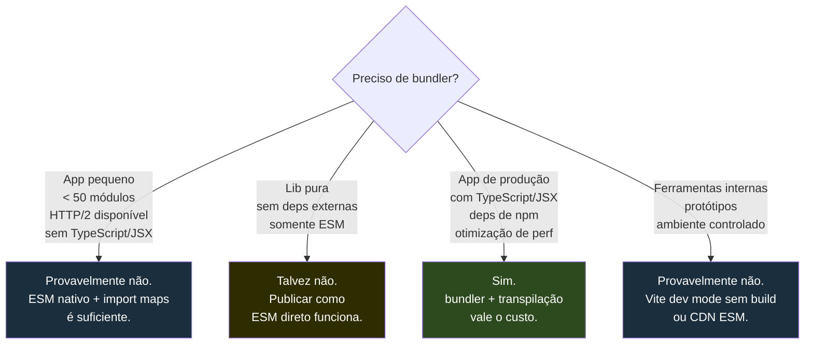
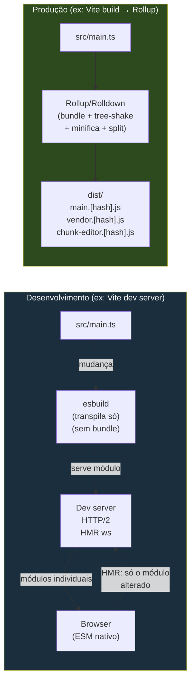

# O grafo de módulos e o que é bundling

> [!abstract] TL;DR
> O grafo de módulos é o mapa que o bundler desenha ao seguir cada `import` do seu código, a partir do entry point, até o último módulo transitivo. Um bundler percorre esse grafo, resolve os caminhos, transforma o código e concatena tudo em um ou mais chunks otimizados para entrega. Bundling surgiu porque o HTTP/1.1 tornava cada arquivo extra um custo de latência proibitivo — com dezenas de módulos, a aplicação travava antes de iniciar. Hoje, HTTP/2, ESM nativo e import maps tornam a questão mais matizada: bundles ainda valem para apps de produção de escala, mas para projetos pequenos ou ferramentas internas, você pode não precisar de bundler nenhum. Saber a diferença é o que separa quem usa tooling da receita de bolo de quem entende o que está fazendo.

---

## O problema que o bundler resolve — ou tentou resolver

Volte para 2012. JavaScript estava crescendo do lado do cliente, e as aplicações começavam a ter dezenas de arquivos. Um projeto de tamanho médio podia ter uma estrutura assim:

```
src/
  main.js
  utils/helpers.js
  utils/formatters.js
  components/header.js
  components/footer.js
  components/modal.js
  api/client.js
  api/auth.js
```

A forma ingênua de carregar isso no browser era uma fila de `<script>` no HTML:

```html
<script src="utils/helpers.js"></script>
<script src="utils/formatters.js"></script>
<script src="api/client.js"></script>
<!-- ... e mais 12 tags depois -->
<script src="main.js"></script>
```

Cada `<script>` era uma requisição HTTP separada. E o problema não era o tamanho dos arquivos — era o custo de estabelecer cada conexão. No protocolo HTTP/1.1, conexões não eram reaproveitadas de forma eficiente: cada recurso exigia uma negociação TCP, handshake, espera pela resposta, mais handshake de encerramento. O browser tinha um limite de conexões paralelas por domínio (geralmente 6), então o restante ficava enfileirado.

Com 20 arquivos JS, você podia estar esperando 4 rodadas de 5 arquivos cada, somando latências de rede em série. Em conexões lentas ou geograficamente distantes, isso era catastrófico. O tempo de carregamento explodia quadraticamente com o número de módulos.

Havia outro problema: ordem. Se `main.js` usava algo definido em `helpers.js`, você precisava garantir que o `<script>` de `helpers.js` viesse antes. Isso era frágil — um refactor esquecia a ordem, e o bug só aparecia em produção.

O bundler nasceu para resolver essas duas dores: eliminar a cachoeira de requisições (o *request waterfall*) e remover a dependência de ordem manual.

> [!info] O nome "request waterfall"
> A metáfora é visual: um recurso espera o anterior terminar antes de iniciar. O DevTools do Chrome mostra isso como uma cascata — barras caindo em paralelo limitado, com novas rodadas começando apenas quando a rodada anterior conclui. Waterfall é o Anti-padrão de performance número um em aplicações web carregadas com HTTP/1.1 e muitos arquivos.

---

## O que é o grafo de módulos

Antes de entender o que um bundler faz, você precisa entender com o que ele trabalha: o **grafo de módulos** (module graph, ou dependency graph).

Todo projeto com imports forma um grafo dirigido: cada módulo é um nó, e cada `import` é uma aresta apontando do importador para o importado.

Considere este app mínimo:

```js
// src/main.js
import { render } from "./ui/render.js";
import { fetchUser } from "./api/client.js";

render(await fetchUser(1));
```

```js
// src/ui/render.js
import { formatName } from "./utils/format.js";

export function render(user) {
  document.body.innerHTML = `<h1>${formatName(user)}</h1>`;
}
```

```js
// src/api/client.js
import { BASE_URL } from "./config.js";

export async function fetchUser(id) {
  return fetch(`${BASE_URL}/users/${id}`).then(r => r.json());
}
```

```js
// src/ui/utils/format.js
export function formatName(user) {
  return `${user.firstName} ${user.lastName}`;
}
```

```js
// src/api/config.js
export const BASE_URL = "https://api.example.com";
```

O grafo resultante fica assim:



> [!note] Leitura do diagrama
> `main.js` é o **entry point** — o nó raiz, o ponto de partida da travessia. As arestas representam imports. Os nós em azul mais escuro são as **folhas** do grafo — módulos sem dependências próprias. O bundler começa em `main.js` e desce recursivamente até visitar todos os nós alcançáveis.

O grafo tem três propriedades que o bundler precisa respeitar:

1. **Dirigido**: o import vai de A para B, não de B para A. O bundler precisa processar B antes de A para que o export de B esteja disponível quando A for executado.
2. **Acíclico (na maioria dos casos)**: módulos que se importam circularmente criam dependências circulares, que bundlers conseguem lidar, mas que frequentemente indicam problemas de design.
3. **Alcançável**: um módulo que nenhum entry point alcança não entra no bundle — é "dead code" e o tree-shaking (nota 17) vai eliminá-lo.

---

## O que um bundler faz: percorrer, resolver, transformar, empacotar

O pipeline de um bundler moderno tem quatro etapas centrais, na ordem em que acontecem:



> [!note] Leitura do diagrama
> As quatro etapas são sequenciais mas iterativas: parsear um módulo revela novos imports que precisam ser resolvidos e parseados, repetindo o ciclo até o grafo estar completo. Somente depois do grafo completo é que o chunking acontece.

**1. Parsear e descobrir.** O bundler lê o arquivo do entry point, analisa o AST (Árvore Sintática Abstrata) em busca de `import` e `require`, e enfileira cada dependência descoberta para processamento. Para cada dependência, repete o processo. É uma travessia em largura (BFS) ou profundidade (DFS) do grafo — o Rolldown usa BFS explicitamente.

**2. Resolver.** Um `import { render } from "./ui/render.js"` é um caminho relativo — fácil. Mas `import React from "react"` é um **bare import** — não tem caminho, é só um nome. O resolver traduz esse nome para o caminho físico real em `node_modules/react/index.js`, seguindo as regras do `package.json` do pacote (campo `main`, `exports`, condicionais de ambiente). Essa resolução é o motivo pelo qual bundlers precisam conhecer `node_modules` — o browser não sabe resolver bare imports sozinho.

**3. Transformar.** Cada módulo pode precisar de transformação antes de entrar no bundle: TypeScript vira JavaScript, JSX vira `React.createElement(...)`, sintaxe ES2024 vira ES5 se o target exigir. Bundlers modernos delegam essa etapa para transpiladores fast (esbuild, SWC) — o assunto da nota [[08 - Transpilação e targets]].

**4. Chunkar e emitir.** Com o grafo completo e todos os módulos transformados, o bundler decide como agrupá-los em arquivos de output — os **chunks**. O caso mais simples é um único arquivo com tudo concatenado. Mas há estratégias mais sofisticadas que veremos a seguir.

---

## Resolução de módulos em profundidade

A etapa de resolução é onde a maioria dos erros misteriosos de bundling nasce. Vale entender o algoritmo com precisão.

Quando o bundler encontra `import { render } from "./ui/render.js"`, a resolução é trivial: caminho relativo, arquivo físico. Mas quando encontra `import React from "react"`, precisa percorrer um algoritmo que o Node.js estabeleceu e os bundlers herdaram:



> [!note] Leitura do diagrama
> O campo `exports` tem precedência sobre `main` e `module` em bundlers modernos e no Node 12+. Pacotes que definem `exports` podem bloquear acesso a qualquer sub-caminho não explicitamente listado — isso é o **encapsulamento de pacote**, e é por isso que `import { something } from "lodash/internal"` pode quebrar mesmo que o arquivo físico exista.

### O campo `exports` e os condicionais

O campo `exports` no `package.json` é o mecanismo mais poderoso (e mais confuso) da resolução moderna. Ele permite que um pacote exponha diferentes versões do mesmo módulo dependendo do contexto:

```json
// package.json de um pacote moderno (ex: React 19)
{
  "name": "react",
  "exports": {
    ".": {
      "react-server": "./react.react-server.js",
      "edge-light": "./react.edge-light.js",
      "worker": "./react.worker.js",
      "browser": "./index.js",
      "node": {
        "development": "./cjs/react.development.js",
        "production": "./cjs/react.production.min.js",
        "default": "./cjs/react.development.js"
      },
      "default": "./index.js"
    },
    "./jsx-runtime": "./jsx-runtime.js",
    "./package.json": "./package.json"
  }
}
```

O bundler avalia as condições na ordem em que aparecem, usando as condições que ele mesmo declara suportar. O Vite, por exemplo, declara a condição `browser` no build de produção. O webpack usa `browser`, `module`, ou `main` dependendo da configuração. Node usa `node`.

> [!warning] Sub-caminhos não exportados são privados
> Se você tentar `import { internal } from "algum-pacote/internal/helper"` e o campo `exports` não listar `"./internal/helper"`, você vai receber `ERR_PACKAGE_PATH_NOT_EXPORTED`. Isso é intencional: o pacote está declarando que `./internal/helper` é API privada. A solução é usar apenas a API pública do pacote ou, se você controla o pacote, adicionar o sub-caminho ao `exports`.

### Por que bare imports não funcionam no browser sem bundler

O browser segue a especificação HTML+ESM, que exige que `import` receba uma URL ou um caminho relativo começando com `./`, `../`, ou `/`. Um bare specifier como `"react"` é um erro de sintaxe em runtime:

```
TypeError: Failed to resolve module specifier "react".
Relative references must start with either "/", "./", or "../".
```

O bundler resolve esse problema em build time, substituindo o bare specifier pelo caminho físico real antes que o código chegue ao browser. Sem bundler, você precisa de import maps (que fazem a resolução em runtime no browser) ou de URLs absolutas.

---

## Dependências circulares: quando o grafo tem ciclos

O grafo de módulos deveria ser acíclico — DAG (Directed Acyclic Graph). Mas na prática, dependências circulares acontecem, e bundlers precisam lidar com elas.

Uma dependência circular acontece quando A importa B, e B importa A (diretamente ou via intermediários):

```js
// a.js
import { b } from "./b.js";
export const a = `A usa: ${b}`;

// b.js
import { a } from "./a.js";
export const b = `B usa: ${a}`;
```


> [!note] Leitura do diagrama
> O grafo tem um ciclo: `a.js → b.js → a.js`. Para o bundler percorrer esse grafo, ele precisa detectar o ciclo e parar de recursar, senão entraria em loop infinito.

**O que acontece em runtime:** quando o bundler (ou o Node com ESM) encontra um ciclo, ele usa o que já processou até aquele ponto. O módulo que está sendo importado no meio da sua própria inicialização retorna um "live binding" ainda não resolvido — tipicamente `undefined` no momento em que o módulo dependente lê o valor.

```js
// Resultado real do exemplo acima (em ESM):
// a.js é carregado primeiro
// a.js importa b.js
// b.js importa a.js — mas a.js ainda não terminou de inicializar
// b.js lê `a` como undefined (live binding não inicializado ainda)
// b = "B usa: undefined"
// a = "A usa: B usa: undefined"
```

> [!bug] Circular dependency warning no bundler
> Quando você vê `"Circular dependency: a.js → b.js → a.js"` no output do Rollup, não é apenas aviso cosmético. Significa que pelo menos um dos módulos no ciclo vai ler um valor `undefined` de outro módulo na primeira execução. O bug pode ser silencioso: o valor pode parecer correto depois que os módulos terminam de inicializar, mas se algum código de inicialização de nível superior usar o valor antes disso, quebra.

**A solução canônica** é quebrar o ciclo extraindo o que é compartilhado para um terceiro módulo:

```js
// shared.js — sem dependências externas
export const SHARED_VALUE = "algo compartilhado";

// a.js — importa só de shared.js
import { SHARED_VALUE } from "./shared.js";
export const a = `A usa: ${SHARED_VALUE}`;

// b.js — importa só de shared.js
import { SHARED_VALUE } from "./shared.js";
export const b = `B usa: ${SHARED_VALUE}`;
```

Dependências circulares em projetos React frequentemente emergem de index files que re-exportam tudo (`export * from "./Button"`; `export * from "./Modal"`) em combinação com componentes que importam uns aos outros indiretamente. A nota [[15 - React e Gerenciamento de Estado]] tem exemplos práticos desse padrão em apps React.

---

## Scope hoisting: uma otimização invisível que muda o comportamento

Bundlers ingênuos simplesmente concatenam os módulos, embrulhando cada um em uma função para criar escopo isolado:

```js
// bundle.js (sem scope hoisting) — cada módulo em sua própria IIFE
var module_format = (function() {
  function formatName(user) {
    return `${user.firstName} ${user.lastName}`;
  }
  return { formatName };
})();

var module_render = (function() {
  var formatName = module_format.formatName;
  function render(user) {
    document.body.innerHTML = `<h1>${formatName(user)}</h1>`;
  }
  return { render };
})();
```

Cada módulo é uma IIFE (Immediately Invoked Function Expression) — executada para criar um objeto com os exports. O problema: cada chamada de função tem overhead, e o bundler não consegue otimizar entre módulos (não pode fazer inlining porque não vê o código de outro módulo diretamente).

**Scope hoisting** (ou *module concatenation*, como o webpack chama) resolve isso elevando o código de todos os módulos para o mesmo escopo léxico, renomeando variáveis para evitar conflitos:

```js
// bundle.js (com scope hoisting) — um único escopo plano
// format.js inlined
function format_formatName(user) {
  return `${user.firstName} ${user.lastName}`;
}

// render.js inlined — usa format_formatName diretamente
function render_render(user) {
  document.body.innerHTML = `<h1>${format_formatName(user)}</h1>`;
}

// main.js — usa render_render diretamente
render_render(await fetchUser(1));
```

O minificador (Terser, esbuild) agora pode ver `format_formatName` sendo chamada em apenas um lugar, e pode fazer inlining da função inteira, eliminando o overhead de chamada:

```js
// Após minificação com scope hoisting
render_render(await fetchUser(1));

function render_render(u) {
  document.body.innerHTML = `<h1>${u.firstName} ${u.lastName}</h1>`;
}
```

> [!tip] Scope hoisting e tree-shaking trabalham juntos
> Scope hoisting é o que torna o tree-shaking eficaz: quando tudo está no mesmo escopo, o bundler consegue rastrear quais funções e variáveis são realmente usadas e quais são dead code. Com módulos isolados em IIFEs, não é possível fazer essa análise inter-módulos. Para scope hoisting funcionar, os módulos precisam ser ESM puro — CommonJS (`require`/`module.exports`) não pode ser hoisted porque tem resolução dinâmica.

Rollup foi pioneiro no scope hoisting (chamava de *tree-shaking-friendly concatenation*). O webpack implementou como `ModuleConcatenationPlugin`, ativado por padrão em produção com `mode: "production"`.

---

## O que diferencia quem entende bundling de verdade

> [!info] Júnior vs. Sênior
> **Júnior** usa bundler porque o tutorial mandou. Sabe que precisa rodar `npm run build` antes de fazer deploy, mas não sabe explicar o que o build está fazendo. Quando o bundle explode de tamanho, abre uma issue no GitHub do framework.
>
> **Pleno** consegue explicar o que um bundler faz, sabe configurar entry points e code splitting básico, consegue ler o output e identificar o que está pesando. Quando o bundle explode, usa o Bundle Analyzer e sabe o que procurar.
>
> **Sênior** entende os trade-offs: sabe quando não usar bundler, sabe o impacto de cada configuração (scope hoisting, granularidade de chunks, condicionais de exports), consegue diagnosticar dependências circulares e sabe por que causam bugs sutis. Entende a dicotomia dev/prod e os bugs que ela cria. Toma decisões de tooling com critério, não por convenção.

A diferença prática aparece em situações como:

- **Diagnóstico de bundle grande**: um pleno procura o pacote mais pesado; um sênior também olha para duplicação (React aparecendo duas vezes por chunks sem shared config), código de desenvolvimento incluído em produção (`process.env.NODE_ENV` não substituído), e módulos não tree-shakeable por usarem `module.exports`.

- **Debug de erro de resolução**: um júnior googla o erro; um pleno sabe verificar o campo `exports` do package.json; um sênior também sabe verificar as condições que o bundler está passando (que podem diferir entre dev e prod).

- **Decisão de code splitting**: um pleno aplica onde o tutorial ensinou (rotas); um sênior decide a granularidade baseado nos padrões de navegação dos usuários, no tamanho dos chunks gerados, e no impacto no tempo de parse de cada chunk.

---

## Entry points, chunks e output

**Entry point** é o módulo raiz a partir do qual o bundler começa a travessia. Você declara explicitamente no config:

```js
// vite.config.js
export default {
  build: {
    rollupOptions: {
      input: "./src/main.js"   // entry point único
    }
  }
}
```

Para apps com múltiplas páginas, você pode ter múltiplos entry points:

```js
// webpack.config.js
module.exports = {
  entry: {
    home: "./src/home.js",
    about: "./src/about.js",
    checkout: "./src/checkout.js"
  }
}
```

**Chunk** é a unidade de output — um arquivo gerado pelo bundler que agrupa módulos relacionados. A hierarquia no webpack deixa isso claro:

```
Entry Point "home"
    └── Chunk Group "home"
            └── Initial Chunk → home.[hash].js
                    ├── home.js
                    ├── ui/header.js
                    ├── ui/footer.js
                    └── utils/format.js
```

Há dois tipos de chunk:

- **Initial chunk**: gerado a partir de um entry point, sempre carregado quando o usuário entra na página.
- **Non-initial chunk** (async chunk): gerado a partir de um `import()` dinâmico, carregado sob demanda quando aquele código é executado. É a base do code splitting.

**Output** é o conjunto de arquivos físicos resultantes do processo:

```js
// webpack.config.js — output config
output: {
  filename: '[name].[contenthash].js',       // initial chunks
  chunkFilename: '[id].[contenthash].js',    // non-initial chunks
  path: path.resolve(__dirname, 'dist')
}
```

O `[contenthash]` é fundamental para cache do browser: se o conteúdo do arquivo não mudou, o hash não muda, e o browser usa a versão em cache. Se mudou, o hash muda, e o browser baixa a versão nova. É cache busting automático.

---

## Code splitting: a ideia central (introdução)

O problema com um bundle único é óbvio: o usuário que abre a home page precisa baixar e parsear o código do checkout, da página de admin, do editor de texto — código que ele talvez nunca use naquela sessão. É desperdício de banda e de CPU.

**Code splitting** é a técnica de dividir o bundle em múltiplos chunks que são carregados sob demanda. A forma nativa em ESM é o `import()` dinâmico:

```js
// main.js — o bundle inicial é pequeno
import { renderHome } from "./home.js";

renderHome();

// O código do editor só é carregado se o usuário clicar "Abrir Editor"
document.getElementById("open-editor").addEventListener("click", async () => {
  const { Editor } = await import("./editor.js"); // non-initial chunk
  new Editor(document.getElementById("editor-container"));
});
```



> [!note] Leitura do diagrama
> Linha sólida = import estático (sempre carregado). Linha tracejada = import dinâmico (carregado quando o código executa). O bundler cria um chunk separado para `editor.js` e o carrega assincronamente quando `import()` é chamado em runtime.

O resultado prático: o bundle inicial fica menor, o browser parseia menos código, a aplicação responde mais rápido no primeiro load. O código do editor só chega quando o usuário demonstra intenção de usá-lo.

Code splitting em profundidade — estratégias, shared chunks, granularidade — é o tema da [[17 - Otimização de bundle]]. Aqui o que importa é entender a noção: o grafo de módulos pode ser dividido em múltiplos grafos menores, cada um virando um chunk carregado no momento certo.

---

## Visualizando o grafo completo até o bundle

Vamos acompanhar o exemplo do app mínimo do início desta nota e ver o que um bundler produz:



> [!note] Leitura do diagrama
> O bundler começa em `main.js`, descobre todos os módulos alcançáveis pelo grafo, e os concatena em ordem topológica num único `bundle.js`. O browser faz uma única requisição HTTP em vez de cinco.

A ordem topológica é crítica: módulos que não dependem de nada vêm primeiro (as folhas), seguidos pelos que dependem deles, e assim por diante até o entry point no topo. Isso garante que quando `main.js` chamar `fetchUser`, a função já estará definida no mesmo arquivo.

---

## Por que bundlar — o argumento histórico e o moderno

O argumento histórico para bundling se apoiava em quatro pilares, todos relacionados com HTTP/1.1:

| Problema (era HTTP/1.1) | Solução via bundler |
|------------------------|---------------------|
| Request waterfall (cada módulo = 1 TCP round-trip) | Bundle único = 1 requisição |
| Sem namespace nativo em JS (tudo global) | Módulos com escopo encapsulado via IIFE |
| Browsers antigos sem suporte a `import`/`export` | Bundle em CommonJS ou IIFE sem syntax ESM |
| Bare imports (`import lodash`) não funcionam no browser | Resolver do bundler substitui pelo caminho real |

Com bundling, o app que antes fazia 30 requisições HTTP passou a fazer 2 ou 3 (bundle JS, bundle CSS, e talvez um vendor bundle separado). A diferença de performance era brutal em redes móveis lentas.

**O argumento moderno ainda se sustenta**, mas por razões diferentes:

1. **Minificação e tree-shaking**: um bundler elimina código morto e comprime o que sobra. Módulos individuais não-minificados somam mais bytes do que um bundle otimizado.
2. **Otimizações intermodulares**: o bundler vê o grafo inteiro e pode fazer inlining de funções pequenas, constant folding entre módulos, e outras otimizações que o browser executando módulos individuais não consegue.
3. **Cache granular via code splitting**: com chunks bem segmentados, você invalida cache só do que mudou — melhor que um bundle monolítico onde qualquer mudança invalida tudo.
4. **Compatibilidade**: transformar para targets de browsers mais antigos ainda é necessário em muitos produtos, e o bundler é o lugar certo para isso.

---

## Quando você NÃO precisa de bundler

Esta seção existe por honestidade intelectual. O ecossistema em 2026 chegou num ponto onde bundler não é mais resposta óbvia para todo projeto.

### ESM nativo no browser

Desde 2018, todos os browsers modernos (Chrome 61+, Safari 10.1+, Firefox 60+, Edge 16+) suportam `<script type="module">` com imports e exports. Você pode escrever módulos ES e carregá-los diretamente:

```html
<!-- index.html -->
<script type="module" src="./src/main.js"></script>
```

```js
// src/main.js — o browser resolve imports relativos nativamente
import { render } from "./ui/render.js";
import { fetchUser } from "./api/client.js";

render(await fetchUser(1));
```

O browser faz as requisições para `render.js` e `client.js` automaticamente, em paralelo quando possível. Nenhum passo de build necessário.

> [!warning] O limite dos imports relativos
> ESM nativo resolve imports por caminho relativo ou URL absoluta. O que ele **não** resolve é bare imports: `import _ from "lodash"` no browser vai lançar um erro porque o browser não sabe onde está `lodash`. Você precisaria escrever `import _ from "https://esm.sh/lodash@4.17.21"` — o que funciona mas cria dependência de URL em cada arquivo.

### Import maps: resolvendo bare imports sem bundler

**Import maps** são um padrão nativo (especificação W3C, disponível em todos os browsers modernos desde 2023) que resolve o problema dos bare imports declarando um mapeamento no HTML:

```html
<script type="importmap">
{
  "imports": {
    "lodash": "https://esm.sh/lodash@4.17.21",
    "react": "https://esm.sh/react@18.3.1",
    "react-dom/client": "https://esm.sh/react-dom@18.3.1/client"
  }
}
</script>

<script type="module">
  import _ from "lodash";           // resolvido para https://esm.sh/lodash@4.17.21
  import React from "react";        // resolvido para https://esm.sh/react@18.3.1
  import { createRoot } from "react-dom/client";

  // seu código aqui — sem bundler, sem passo de build
</script>
```

O import map é essencialmente o `package.json` do browser: um dicionário que mapeia nomes de pacotes para URLs. O browser aplica esse mapeamento quando resolve os imports dos seus módulos.



> [!note] Leitura do diagrama
> Quando o browser encontra `import _ from "lodash"`, consulta o import map, obtém a URL correspondente, e faz a requisição HTTP para aquela URL. Do ponto de vista do código JS, é transparente — continua usando bare imports como no Node.

**Limitações reais dos import maps (honestidade):**

- Não há composição: se `lodash` internamente importar de `lodash/fp` com um bare import, você precisa mapear esse sub-caminho também. Para pacotes com muitas dependências transitivas, o import map pode explodir em tamanho.
- Precisam estar no HTML antes de qualquer `<script type="module">` que os use — o que força dependência de templating.
- CDNs ESM (como `esm.sh`) resolvem deps transitivas automaticamente, mas introduzem dependência de terceiros em runtime.

### HTTP/2 e a morte do request waterfall

O argumento mais forte contra bundling obrigatório é HTTP/2.

Em HTTP/1.1, cada arquivo JS exigia uma conexão TCP separada (ou esperava numa fila de conexões paralelas limitadas). Daí o request waterfall. Em HTTP/2, **a mesma conexão TCP multiplica múltiplos streams simultâneos** — o servidor pode enviar 20 arquivos JS em paralelo na mesma conexão, sem overhead por arquivo.

```mermaid
sequenceDiagram
    participant B as Browser
    participant S as Servidor

    rect rgb(80, 20, 20)
        Note over B,S: HTTP/1.1 — fila de conexões
        B->>S: GET main.js
        S-->>B: main.js
        B->>S: GET render.js
        S-->>B: render.js
        B->>S: GET client.js
        S-->>B: client.js
        Note over B,S: ...e mais 17 arquivos em série ou paralelo limitado
    end

    rect rgb(20, 60, 20)
        Note over B,S: HTTP/2 — multiplexing na mesma conexão
        B->>S: GET main.js + render.js + client.js + ... (20 streams)
        S-->>B: todos os módulos em paralelo, mesma conexão TCP
    end
```



> [!note] Leitura do diagrama
> No HTTP/1.1, cada arquivo cria overhead de conexão e serializa com outros pedidos. No HTTP/2, todos os módulos chegam em paralelo numa única conexão TCP — o overhead por arquivo é virtualmente zero. Isso elimina a razão original do bundling.

Em 2026, HTTP/2 tem suporte em 96% dos browsers e é o padrão em todos os CDNs e servidores de produção relevantes. HTTP/3 (baseado em QUIC, sem head-of-line blocking mesmo no nível de transporte) é suportado por 75%+ dos browsers e está se tornando padrão.

> [!tip] O ponto de inflexão prático
> Com HTTP/2 + ESM nativo + import maps, um projeto de **até ~50-100 módulos** provavelmente não vai perceber diferença mensurável entre bundle e não-bundle. O gargalo deixou de ser número de requisições e passou a ser tamanho total de bytes e tempo de parse do JS.

### Quando não-bundler faz sentido

A decisão não é binária. Alguns cenários onde bundler é questionável ou desnecessário:



> [!note] Leitura do diagrama
> A decisão depende de três fatores: tamanho do projeto, necessidade de transpilação (TS/JSX), e se você está servindo para usuários finais em produção. Para produção em escala, bundler ainda entrega vantagens reais de minificação e tree-shaking que HTTP/2 não resolve.

---

## Dev vs. prod: bundling não é a mesma coisa nos dois contextos

Há uma distinção que iniciantes frequentemente ignoram e que cria confusão: o que um bundler faz em **desenvolvimento** é completamente diferente do que faz em **produção**.

Esta distinção é aprofundada na nota [[09 - Dev server e HMR]], mas vale a introdução aqui porque ela muda como você pensa sobre bundling.

Em **desenvolvimento**, o objetivo é velocidade de feedback: você edita um arquivo e quer ver a mudança no browser em menos de 200ms. Fazer um bundle completo a cada mudança é intolerável. Por isso, ferramentas como o Vite **não fazem bundle em dev** — servem os módulos como ESM nativo, com o browser fazendo as requisições individualmente para o dev server. O "bundler" em dev atua mais como um servidor de módulos com transformação on-demand.

Em **produção**, o objetivo é performance de entrega: você quer o menor número de bytes, o menor número de requisições, o melhor uso de cache, e código compatível com seus browsers-alvo. Aqui o bundle completo (com tree-shaking, minificação, code splitting) faz sentido.



> [!note] Leitura do diagrama
> Em dev, Vite serve os módulos individualmente sem agrupar — o browser recebe ESM puro, e só o módulo que mudou é retransformado e recarregado (HMR). Em prod, Rollup percorre o grafo completo, elimina código morto, e gera chunks otimizados com hashes para cache.

Esta dicotomia é uma das inovações mais inteligentes do Vite: **usar a ausência de bundling em dev para velocidade, e bundling em prod para otimização**. O preço é um comportamento ligeiramente diferente entre os dois ambientes — fonte de bugs sutis que a [[09 - Dev server e HMR]] cobre em detalhe.

---

## Armadilhas comuns

> [!bug] "Meu import não está funcionando — o módulo não é encontrado"
> Verifique se é um bare import (`import lodash`) em ESM sem bundler. O browser precisa de um import map ou de uma URL completa. Bare imports sem bundler ou import map jogam `TypeError: Failed to resolve module specifier`.

> [!bug] "Meu bundle tem tudo duplicado — React aparece duas vezes"
> Isso acontece quando você tem dois entry points e ambos importam React, mas o bundler não foi configurado para extrair módulos comuns num chunk compartilhado. No webpack, `SplitChunksPlugin`; no Rollup/Vite, `manualChunks`. A nota [[17 - Otimização de bundle]] cobre isso.

> [!bug] "Mudei um arquivo e o browser baixou o bundle inteiro de novo"
> Com um bundle único sem code splitting, qualquer mudança invalida o hash e o browser baixa tudo. A solução é separar seu código de app (`main.[hash].js`) do código de vendors/dependências (`vendor.[hash].js`) — dependências mudam raramente, então o vendor bundle fica em cache por semanas.

> [!bug] "Em dev funciona, em prod quebra"
> Clássico da dicotomia dev/prod. Em dev (Vite), módulos são servidos como ESM individual. Em prod (Rollup), são empacotados. Algumas diferenças de comportamento — como ordem de execução de side effects, ou variáveis que existem em escopo de módulo diferente — só aparecem no bundle. Sempre teste o build de produção antes de fazer deploy.

> [!bug] "Import map não funciona no iframe / web worker"
> Import maps são um recurso do contexto de navegação principal (documento HTML). Iframes podem herdar, mas Web Workers não têm acesso ao import map do documento pai — precisam de sua própria configuração.

---

## Como explicar em inglês

The **module graph** is the directed acyclic graph formed by starting at the entry point and recursively following every `import` statement until all reachable modules are visited. A **bundler** traverses this graph, resolves bare module specifiers (like `import lodash`) to real file paths, applies transformations (TypeScript compilation, JSX, polyfills), and concatenates the result into one or more **chunks** — optimized output files served to the browser.

Bundling originated because HTTP/1.1 made each additional file an expensive TCP round-trip, creating a **request waterfall** that made applications with many modules painfully slow to load. The bundle collapsed dozens of HTTP requests into one or a few.

Today, the picture is more nuanced. HTTP/2 multiplexes multiple streams over a single connection, making per-file overhead negligible. Browsers natively support ES modules (`<script type="module">`), so you can load individual files without a build step. **Import maps** (`<script type="importmap">`) let the browser resolve bare imports like `import lodash` to a URL without a bundler.

For small projects, prototypes, or tools, you may genuinely not need a bundler. For production apps with TypeScript, JSX, npm dependencies, and performance requirements, a bundler still pays off through minification, tree-shaking, code splitting, and cache optimization.

### Vocabulário-chave

| Português | English |
|-----------|---------|
| grafo de módulos | module graph / dependency graph |
| ponto de entrada | entry point |
| módulo | module |
| dependência transitiva | transitive dependency |
| empacotador | bundler |
| empacotamento | bundling |
| travessia do grafo | graph traversal |
| resolver imports | resolve module specifiers |
| bare import | bare import / bare specifier |
| fragmento / fatia | chunk |
| chunk inicial | initial chunk |
| chunk assíncrono | async chunk / non-initial chunk |
| divisão de código | code splitting |
| cachoeira de requisições | request waterfall |
| multiplexação | multiplexing |
| mapa de imports | import map |
| módulos ES nativos | native ES modules / native ESM |
| invalidação de cache | cache invalidation |
| hash de conteúdo | content hash |
| ponto de carregamento sob demanda | lazy-loaded entry |

---

## Veja também

- [[06 - ESM e CJS e o sistema de módulos]] — a semântica de `import`/`export`, CommonJS vs ESM, por que o browser só entende ESM
- [[08 - Transpilação e targets]] — o que acontece com TypeScript e JSX antes do bundling; por que o bundler precisa de um transpilador
- [[09 - Dev server e HMR]] — como o bundler se comporta em desenvolvimento vs. produção; ESM nativo + esbuild no modelo Vite
- [[17 - Otimização de bundle]] — tree-shaking, code splitting a fundo, shared chunks, análise de bundle, minificação
- [[03-Dominios/Ciência/Redes e Protocolos/index|Redes e Protocolos]] — HTTP/1.1 vs HTTP/2 (multiplexing, header compression, server push), fundamentos do protocolo que motivaram o bundling
- [[03-Dominios/Tecnologia/Node/06 - Módulos no Node.js — CommonJS vs ESM|Módulos no Node.js]] — como o algoritmo de resolução de módulos funciona no Node: `require`, `exports` field, dual CJS/ESM packages
- [[15 - React e Gerenciamento de Estado]] — padrões de code splitting em apps React com React.lazy e Suspense; como dependências circulares emergem em componentes React

---

> [!info] Lastro
> 1. webpack — "Under The Hood" (documentação oficial). Descreve `ModuleGraph`, `ChunkGraph`, a hierarquia entry → chunk group → chunk → asset, e os tipos initial vs. non-initial. Disponível em: https://webpack.js.org/concepts/under-the-hood/
> 2. Atriiy Dev — "How Rolldown Works: High-Performance Code Splitting with Bitset Logic" (2025). Cobre o algoritmo BFS de travessia de grafo e o rastreamento de alcançabilidade via BitSet usado pelo Rolldown. Disponível em: https://www.atriiy.dev/blog/rolldown-high-performance-code-splitting
> 3. Lea Verou — "Web dependencies are broken. Can we fix them?" (2026). Análise honesta das limitações de import maps, bundlers e do estado atual de gerenciamento de dependências web sem build. Disponível em: https://lea.verou.me/blog/2026/web-deps/
> 4. Steve Coffey — "ES Modules + Importmaps: a modern JS stack" (2025). Demonstração prática de ESM nativo com import maps, HTTP/2, e o stack sem bundler. Disponível em: https://www.stevendcoffey.com/blog/esmodules-importmaps-modern-js-stack/
> 5. Siddharth — "JavaScript Modules in 2025: ESM, Import Maps & Best Practices" (2025). Cobertura do estado atual de ESM, import maps e browser support em 2025/2026. Disponível em: https://siddsr0015.medium.com/javascript-modules-in-2025-esm-import-maps-best-practices-7b6996fa8ea3
> 6. AlternativeTo — "Vite 8.1 brings faster dev mode, chunk import maps, and Wasm ESM support" (2026). Cobertura do experimento de chunk import maps no Vite 8.1 e benchmarks de performance. Disponível em: https://alternativeto.net/news/2026/6/vite-8-1-brings-faster-dev-mode-chunk-import-maps-and-wasm-esm-support/
> 7. Node.js Docs — "Modules: Packages — Subpath exports" (documentação oficial). Especifica como o campo `exports` funciona, a ordem de avaliação de condicionais, e o encapsulamento de sub-caminhos privados. Disponível em: https://nodejs.org/api/packages.html#subpath-exports
> 8. Rollup Docs — "ES Module Syntax — Circular Dependencies" (documentação oficial). Explica como Rollup lida com ciclos no grafo de módulos, live bindings em ESM, e por que ciclos causam valores `undefined` em inicializações de nível de módulo. Disponível em: https://rollupjs.org/faqs/#why-do-additional-imports-of-the-same-module-behave-as-no-ops
> 9. webpack Docs — "Module Concatenation Plugin" (documentação oficial). Cobre scope hoisting no webpack: o que é, quando se aplica (somente ESM, sem CommonJS), e como habilitar/desabilitar. Disponível em: https://webpack.js.org/plugins/module-concatenation-plugin/
