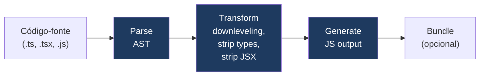
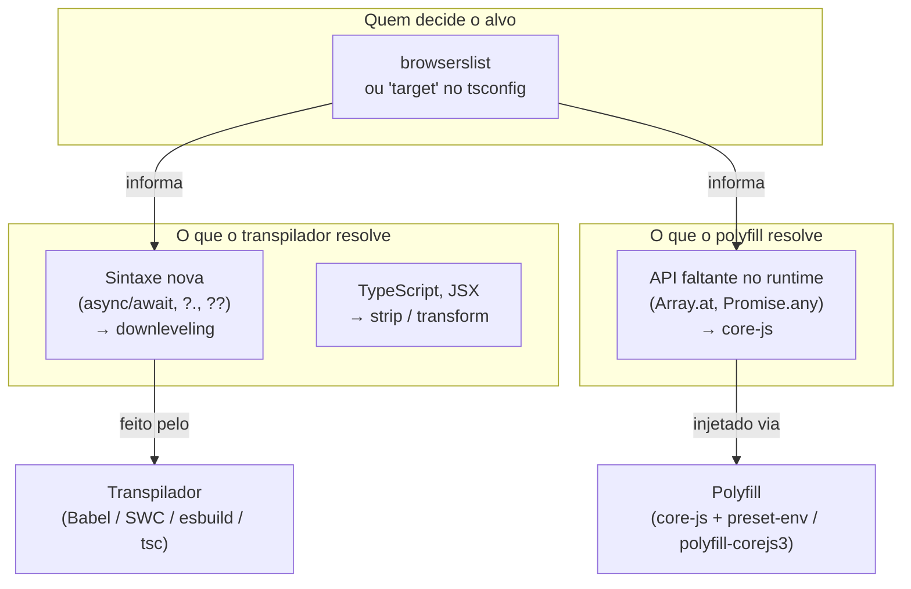
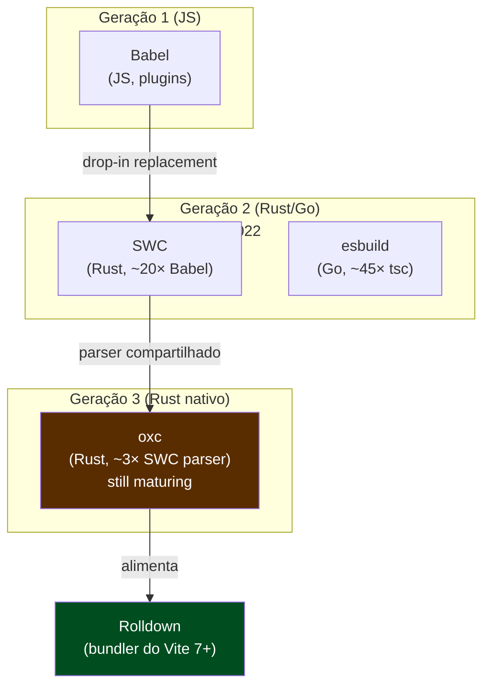
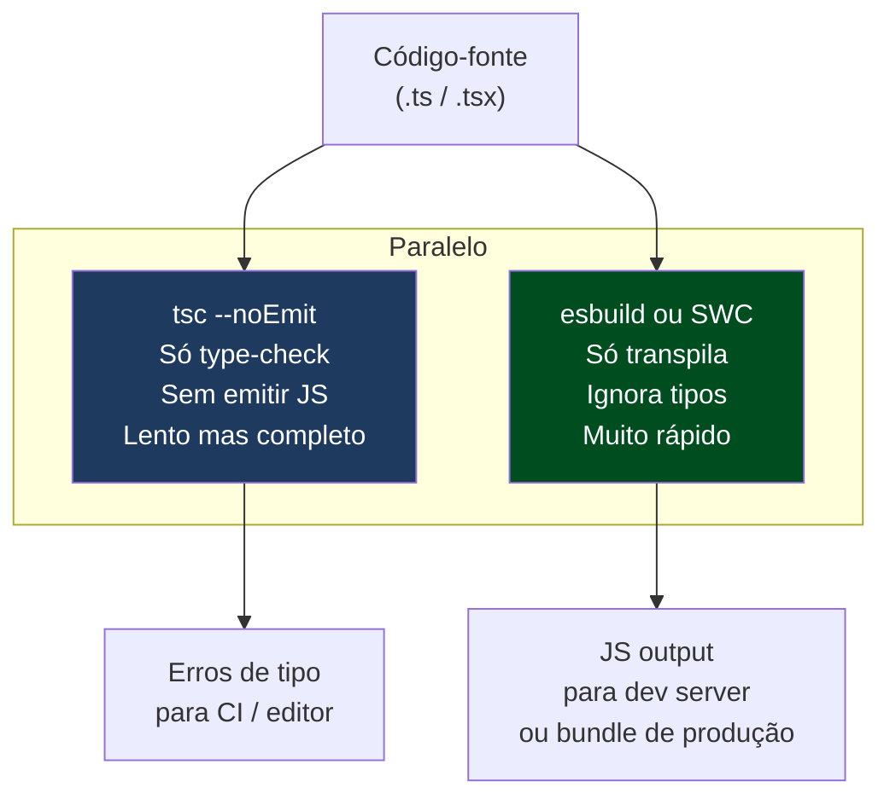
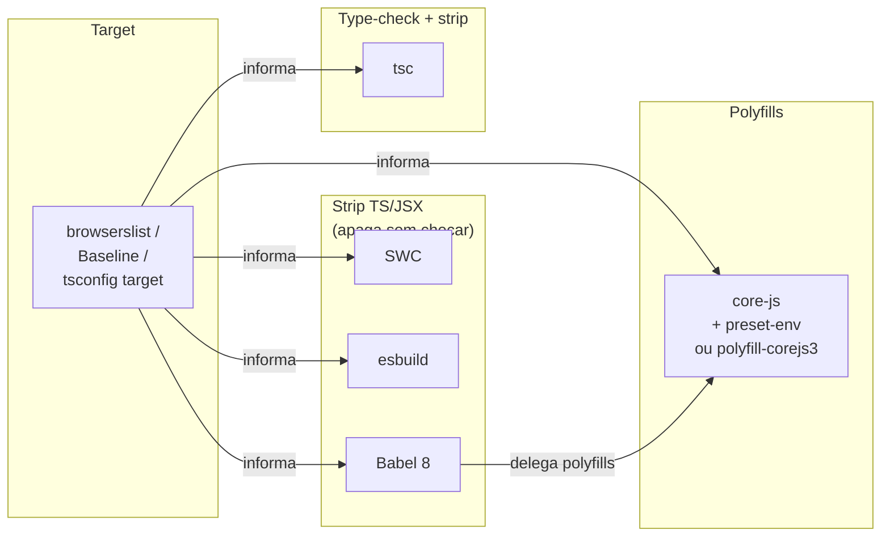
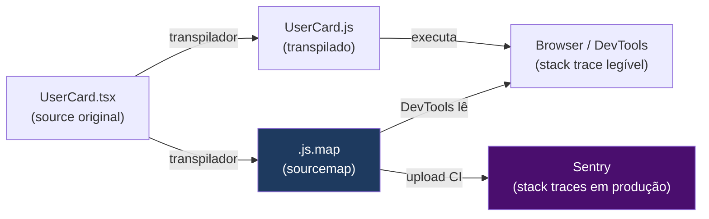

# Transpilação e targets

> [!abstract] TL;DR
> **Transpilar** é converter código-fonte em outro código-fonte equivalente — JS moderno em JS compatível, TypeScript em JS, JSX em chamadas de função. Existe uma distinção que salva horas de debugging: **downleveling** (transformar *sintaxe* nova em equivalente antigo) é diferente de **polyfill** (adicionar APIs faltantes ao runtime). Os quatro players de 2026 são Babel (veterano flexível, recém-liberado na v8), SWC (Rust, 20–70× mais rápido que Babel), esbuild (Go, 45× mais rápido que tsc, bundle + transpile) e tsc (transpila E type-checa). A divisão crucial: **esbuild e SWC apagam tipos sem validá-los** — por isso o padrão moderno é rodar `tsc --noEmit` em paralelo como sentinel, e deixar esbuild/SWC gerar o output. O **browserslist** decide até onde ir; o **Baseline** entrou para simplificar esse target; o **core-js** injeta os polyfills que a transpilação não cobre.

---

## O que é transpilar — e por que não é compilar

Quando você roda `tsc`, `babel` ou `swc`, o que acontece não é compilação no sentido de "converter código em binário". É **transpilação** (ou *source-to-source compilation*): o código-fonte entra, outro código-fonte sai. O input pode ser TypeScript com JSX; o output é JavaScript puro, sem tipos, sem JSX, no dialeto que o ambiente-alvo entende.

A confusão de vocabulário é velha. Na prática, "compilar TypeScript" e "transpilar TypeScript" descrevem a mesma operação — a diferença fica na intenção. Um compilador tradicional C produz binário; um transpilador TypeScript produz JavaScript. O resultado é código-fonte em outra linguagem ou dialeto, não instrução de máquina.

Três transformações diferentes ficam debaixo do guarda-chuva "transpilação" no ecossistema JS/TS:

1. **TypeScript → JavaScript**: remover anotações de tipo, `interface`, `enum`, `as`, e todo vocabulário que não existe em JS.
2. **JSX → JavaScript**: converter `<Button onClick={fn} />` em `React.createElement(Button, { onClick: fn })` (ou `_jsx(Button, ...)` no novo JSX transform).
3. **JS moderno → JS compatível**: converter sintaxe nova (arrow functions, `async/await`, optional chaining `?.`, nullish coalescing `??`, class fields, top-level `await`) em equivalentes que rodam em versões mais antigas do V8 ou de outros engines.

As três podem acontecer no mesmo passe ou em passes separados, dependendo da ferramenta.

---

## Downleveling: quando a sintaxe precisa ser reescrita

**Downleveling** é o nome técnico para "converter sintaxe nova em equivalente antigo". A palavra vem da TypeScript documentation: quando você seta `target: "ES5"` no `tsconfig.json`, o compilador faz *downleveling* de tudo que nasceu depois do ES5.

O exemplo mais dramático é `async/await`, introduzido no ES2017. No ES5 não existe nem `Promise` nativa nem a palavra-chave `async`. Para rodar em browsers antigos, o transpilador precisa reescrever a função inteira usando uma state machine. Veja a transformação real:

```ts
// ANTES: TypeScript moderno, async/await, arrow function, optional chaining
async function buscarUsuario(id: string): Promise<string | null> {
  const resp = await fetch(`/api/users/${id}`);
  const data = await resp.json();
  return data?.nome ?? null;
}
```

```js
// DEPOIS: target ES5 via tsc (sem biblioteca de runtime externa)
"use strict";
var __awaiter = (this && this.__awaiter) || function (thisArg, _arguments, P, generator) {
    function adopt(value) { return value instanceof P ? value : new P(function (resolve) { resolve(value); }); }
    return new (P || (P = Promise))(function (resolve, reject) {
        function fulfilled(value) { try { step(generator.next(value)); } catch (e) { reject(e); } }
        function rejected(value) { try { step(generator["throw"](value)); } catch (e) { reject(e); } }
        function step(result) { result.done ? resolve(result.value) : adopt(result.value).then(fulfilled, rejected); }
        step((generator = generator.apply(thisArg, _arguments || [])).next());
    });
};
function buscarUsuario(id) {
    return __awaiter(this, void 0, void 0, function () {
        var resp, data, _a;
        return __generator(this, function (_b) {
            switch (_b.label) {
                case 0: return [4 /*yield*/, fetch("/api/users/" + id)];
                case 1:
                    resp = _b.sent();
                    return [4 /*yield*/, resp.json()];
                case 2:
                    data = _b.sent();
                    _a = data === null || data === void 0 ? void 0 : data.nome;
                    return [2 /*return*/, _a !== null && _a !== void 0 ? _a : null];
            }
        });
    });
}
```

A função assíncrona virou uma state machine com `__awaiter` e `__generator` — helpers injetados inline (ou importados de `tslib`). O optional chaining `?.` virou a guarda manual `data === null || data === void 0`. O template literal virou concatenação de string. Tudo isso para uma função de três linhas.

Se o target for ES2017 em vez de ES5, a transformação é quase nula: o `async/await` fica como está, só o TypeScript é apagado:

```js
// DEPOIS: target ES2017 (apenas strip de tipos)
"use strict";
async function buscarUsuario(id) {
  const resp = await fetch(`/api/users/${id}`);
  const data = await resp.json();
  return data?.nome ?? null;
}
```

A lição: **o target controla o custo do downleveling**. Quanto mais antigo o target, maior o bundle, mais lento o código gerado, mais helpers injetados. Em 2026, a maioria das aplicações web pode usar ES2020 ou superior sem preocupação — o que é uma mudança enorme em relação a 2015, quando todo projeto mira ES5 por padrão.



> [!note] Parse → Transform → Generate
> Todo transpilador (Babel, SWC, esbuild, tsc) passa pelas mesmas três fases internas: **parse** o código-fonte para uma AST (árvore sintática abstrata), **transform** a AST aplicando as conversões necessárias, **generate** o JavaScript de saída a partir da AST transformada. A diferença entre os players está na linguagem em que implementam esse pipeline (JS, Rust, Go, TypeScript), na profundidade do suporte a plugins, e na presença ou ausência de type-checking entre as fases. Ver [[03-Dominios/Ciência/Compiladores e Linguagens/index|Compiladores e Linguagens]] para a teoria completa desse pipeline.

---

## Polyfills: quando a sintaxe ficou, mas a API não existe

Downleveling resolve o problema de *sintaxe*: `?.` vira `!== null && !== undefined`. Mas há outro problema, diferente e frequentemente confundido com o anterior: **APIs do runtime que simplesmente não existem no ambiente antigo**.

Considere `Array.prototype.at(-1)`, introduzido no ES2022. A sintaxe é JavaScript válido e antigo — é só uma chamada de método. Nenhum transpilador vai reescrever `arr.at(-1)` para `arr[arr.length - 1]` automaticamente, porque a *sintaxe* de chamada de método existia antes de 2022. O que falta é a *implementação* do método no ambiente.

Isso se resolve com **polyfills**: código que implementa a API faltante no runtime, se ela não existir. O padrão da indústria é o **core-js**, mantido por Denis Pushkarev. Em junho de 2026, o core-js cobre polyfills para ECMAScript até ES2026 — promises, symbols, collections, iterators, typed arrays, `Array.prototype.at`, `Object.hasOwn`, `structuredClone`, `Promise.any`, e muito mais.

A integração mais comum é via `@babel/preset-env` com `useBuiltIns`:

```js
// babel.config.js (Babel 7.x — ainda comum em 2026)
module.exports = {
  presets: [
    [
      "@babel/preset-env",
      {
        targets: "> 0.25%, not dead",
        useBuiltIns: "usage",   // injeta só os polyfills usados
        corejs: 3,              // core-js v3
      },
    ],
  ],
};
```

Com `useBuiltIns: "usage"`, o Babel analisa o código e injeta apenas os polyfills realmente usados — se seu código nunca usa `Promise.allSettled`, o polyfill não entra no bundle.

> [!warning] Babel 8 mudou isso
> Em **Babel 8** (lançado em junho de 2026), as opções `useBuiltIns` e `corejs` foram **removidas** do `@babel/preset-env`. A injeção de polyfills agora é feita pelo pacote separado `babel-plugin-polyfill-corejs3`. A migração é mecânica mas necessária — projetos que ainda usam Babel 7 com `useBuiltIns` continuam funcionando, mas quem migrar para Babel 8 precisa ajustar a configuração.



---

## Targets e browserslist: até onde compilar

A pergunta que controla tudo é: **para qual ambiente estou gerando código?** A resposta determina quais transformações de downleveling são necessárias, e quais polyfills injetar.

Em projetos TypeScript, o target é declarado no `tsconfig.json`:

```json
{
  "compilerOptions": {
    "target": "ES2020",
    "lib": ["ES2020", "DOM"]
  }
}
```

Isso diz ao `tsc` (e ao esbuild, que lê `tsconfig`): "pode usar syntax de ES2020 no output; transforme o que for mais novo que isso". Valores comuns em 2026: `ES2017`, `ES2019`, `ES2020`, `ES2022`, `ESNEXT`.

Para projetos com Babel ou SWC, o destino é declarado via **browserslist** — uma linguagem de query que descreve navegadores-alvo em vez de versões de ECMAScript:

```
# .browserslistrc
> 0.5%              # browsers com mais de 0.5% de mercado
last 2 versions     # últimas 2 versões de cada browser
not dead            # browsers ainda com suporte oficial
not IE 11           # excluir IE 11 explicitamente
```

O browserslist é lido por Babel, PostCSS, Autoprefixer, e outros — uma fonte de verdade única sobre o público-alvo do projeto. Os dados de mercado vêm do [Can I Use](https://caniuse.com).

### Baseline: o atalho moderno

Em 2024–2025, o **Web Platform Baseline** entrou no browserslist como query nativa. O Baseline categoriza features da web por nível de suporte:

- **Newly available**: suportado em todos os browsers principais (Chrome, Firefox, Safari, Edge) na mesma janela.
- **Widely available**: suportado há 30+ meses — praticamente nenhum usuário em produção é afetado.

Na prática:

```
# .browserslistrc com Baseline
baseline widely available          # seguro para produção sem polyfills
baseline 2022                       # recursos disponíveis até fim de 2022
baseline newly available            # risco calculado mas sem legado
```

Usar `baseline 2020` com Babel pode reduzir o bundle em 80–90% comparado a `target: ES5` — o artigo da web.dev demonstrou isso com um arquivo indo de 12KB para 1.5KB.

```mermaid
graph LR
    subgraph "Hierarquia de targets"
        ES5["ES5\n(IE 11 legacy)\nBundle pesado"]
        ES2017["ES2017\nasync/await nativo\nBundle médio"]
        ES2020["ES2020\n?., ??, BigInt\nBundle enxuto"]
        ESN["ESNext / Baseline\nMínimas transformações\nBundle fino"]
    end

    ES5 -->|"mais compilação,\nmais polyfills"| ES2017
    ES2017 -->|""| ES2020
    ES2020 -->|""| ESN

    style ES5 fill:#5a0000,color:#fff
    style ESN fill:#004d20,color:#fff
```

---

## Os quatro players: quem transpila o quê

Em 2026, quatro ferramentas dividem o mercado de transpilação. Elas não são intercambiáveis — cada uma resolve um problema diferente, e entender a fronteira entre elas evita configurações erradas.


### Babel — o veterano que conhece tudo

**Babel** (antes Babel.js, nasceu como 6to5 em 2014) é a ferramenta que democratizou o JS moderno. Escrito em JavaScript, funciona via um sistema de plugins: cada transformação é um plugin, e um **preset** é uma coleção de plugins com defaults razoáveis.

O `@babel/preset-env` lê o browserslist e ativa automaticamente os plugins de transformação necessários para os targets configurados. É o mais flexível: há plugins para decorators legados, para Stage 2 proposals, para React, para Vue, para i18n — tudo o que o ecossistema inventou nos últimos 10 anos tem um plugin Babel.

O custo é a velocidade: Babel é escrito em JS e processa cada arquivo serialmente através do grafo de plugins. Benchmarks de 2025 apontam para 20–50× mais lento que SWC e esbuild no mesmo workload.

**Babel 8** (junho de 2026) trouxe quebras necessárias: ESM-only (requer Node 22+), sem downleveling para ES5 por padrão (usa browserslist `defaults`, que equivale a ~ES2023), `useBuiltIns` removido em favor do `babel-plugin-polyfill-corejs3`. Para projetos novos com Node moderno, a migração é limpa. Para projetos com IE 11 no target (cada vez mais raros), o custo de configuração aumentou.

**Quando usar Babel em 2026**: quando você precisa de um plugin que não existe em SWC/esbuild (decorators legados com semântica Babel, macros de tempo de compilação, codemods personalizados). Para projetos Next.js ou Vite, SWC/esbuild já estão configurados — Babel só entra se você adicionar plugin extra.

### SWC — Rust no pipeline do Babel

**SWC** (*Speedy Web Compiler*) é um transpilador escrito em Rust, criado por Donny/강동윤 e adotado pelo ecossistema em ritmo acelerado. É desenhado como **drop-in replacement do Babel**: lê configuração Babel-like, aplica as mesmas transformações, produz o mesmo output — mas 20× mais rápido em thread única e 70× mais rápido em quatro cores.

O Next.js migrou para SWC na versão 12 (2021) e reportou builds 17× mais rápidos. O Vite usa SWC como opção para projetos React via `@vitejs/plugin-react-swc`. Parcel 2 e Rspack também o usam internamente.

O SWC **não faz type-checking**. Ele apaga tipos sem validar se estão corretos — a mesma postura do esbuild. Isso é intencional: type-checking é caro e é responsabilidade do `tsc`.

Em 2026, o SWC tem suporte melhor a decorators (incluindo a semântica legada necessária para NestJS e TypeORM) do que o esbuild, o que o mantém como escolha padrão quando se quer substituir Babel em pipelines webpack existentes.

### esbuild — Go, bundle e transpile juntos

**esbuild** (Evan Wallace, 2020) faz mais que SWC: é bundler e transpilador ao mesmo tempo, escrito em Go. Em benchmarks, é 45× mais rápido que tsc para builds frias e ~100× mais rápido que Webpack com Babel.

O Vite usa esbuild no **dev server** (transpilação de módulos individuais, ultra-rápida) e o Rollup no **build de produção**. O `tsup` (popular para publicar libs TypeScript) usa esbuild internamente. Bun usa esbuild como base de transpilação.

Assim como SWC, **esbuild apaga tipos sem verificar**. Os tipos são tratados como comentários — sintaxe que o parser ignora, sem análise semântica. Isso é o que permite a velocidade: type-checking envolve construir um grafo de inferência de tipos com resolução cross-file; esbuild resolve cada arquivo independentemente.

esbuild tem suporte limitado a decorators Stage 3 (sem a semântica legada do Babel) e não emite arquivos `.d.ts`. Para bibliotecas que precisam expor declarações de tipo, `tsc --emitDeclarationOnly` precisa rodar em paralelo.

### tsc — o único que realmente checa

**tsc** (o compilador TypeScript da Microsoft) é o único dos quatro que faz **type-checking de verdade**: infere tipos, resolve imports, detecta incompatibilidades, valida que `data.nome` existe no tipo `Usuario`. Isso custa tempo — para projetos grandes, segundos ou minutos.

A configuração relevante para este contexto é quando o `tsc` é usado *apenas para checagem*, sem emitir arquivos:

```bash
# Só checar tipos, não gerar output — deixar esbuild/swc gerar o JS
tsc --noEmit
```

O `target` no `tsconfig.json` ainda importa mesmo quando você usa esbuild ou SWC para transpilar: muitas ferramentas leem o `tsconfig` para decidir quais transformações aplicar. Mas a **fonte de verdade para checagem de tipos é sempre o tsc**.

Para detalhes sobre `--incremental`, `composite`, project references e o desempenho do type-checker em escala, veja [[03-Dominios/Tecnologia/TypeScript/25 - TypeScript em escala - performance do compilador e project references|TypeScript em escala]]. Aqui o ponto é de fronteira: usar esbuild/SWC como transpiladores *não elimina* a necessidade do tsc — apenas o move para uma fase paralela separada.

---

## Oxc: o próximo round da corrida por velocidade

> [!info] Estado: projeto em amadurecimento rápido (junho 2026)
> O oxc ainda não é uma ferramenta de produção com a mesma maturidade do SWC ou esbuild, mas já está sendo integrado em toolchains reais (Vite via Rolldown, Biome via oxlint). É importante conhecer porque representa a próxima onda de velocidade no ecossistema.

**Oxc** (*The JavaScript Oxidation Compiler*) é um projeto Rust iniciado por Boshen Chen em 2023, com o objetivo de construir toda a infraestrutura de tooling JS/TS do zero em Rust: parser, linter, formatter, transpilador, resolver, minificador. Não é uma ferramenta única — é uma *coleção de ferramentas* que compartilham o mesmo parser de alto desempenho.

A promessa de velocidade é agressiva. Benchmarks publicados pela equipe oxc em 2025 mostram:

- **Parser**: 3× mais rápido que o parser do SWC no mesmo corpus de código JavaScript.
- **oxlint**: 50–100× mais rápido que ESLint para regras equivalentes — benchmarks que a equipe Biome replicou de forma independente.
- **Transpilador (oxc-transform)**: ainda em desenvolvimento ativo; a meta declarada é superar o SWC.

O Rolldown — o futuro bundler Rust que deve substituir o Rollup no Vite — usa o parser do oxc internamente. Isso significa que quando o Vite migrar para Rolldown (planejado para Vite 7/8), o oxc já estará embaixo do capô. Ver [[14 - Rollup, esbuild e Rolldown]] para esse contexto.



Para 2026, o oxc ainda não é o padrão para transpilação TypeScript em projetos novos — use SWC ou esbuild. Mas é o nome a observar para 2027: se o Rolldown for adotado pelo Vite e o oxc-transform amadurecer, pode deslocar esbuild do papel de transpilador padrão do ecossistema.

**Fonte**: [oxc.rs](https://oxc.rs) — documentação oficial, benchmarks independentes e roadmap público (junho 2026).

---

## A divisão crucial: type-check ≠ transpile

Este é o ponto que mais confunde desenvolvedores migrando de um workflow baseado em `tsc` puro para um baseado em esbuild ou SWC.

Quando você roda `tsc` sem configuração especial, ele faz **duas coisas ao mesmo tempo**: verifica os tipos e emite JavaScript. Em projetos pequenos, isso é conveniente. Em projetos grandes, é lento — e a lentidão toda está no type-checking, não na emissão.

A solução moderna é **separar as duas responsabilidades**:



No dev server (Vite, por exemplo): esbuild transpila cada módulo em milissegundos — você salva o arquivo e o browser atualiza antes de piscar. O tsc roda em watch mode no background e reporta erros de tipo para o editor via LSP, sem bloquear o servidor.

No CI: o build de produção usa esbuild/SWC para gerar o output rápido, e `tsc --noEmit` roda em paralelo como um gate — se falhar, o CI falha. O build não espera o tsc para gerar o output; apenas usa o tsc como validação.

```bash
# package.json: separação type-check / build
{
  "scripts": {
    "typecheck": "tsc --noEmit",
    "build": "vite build",            # usa esbuild internamente
    "build:check": "npm run typecheck && npm run build"
  }
}
```

> [!warning] O risco de confiar só no esbuild/SWC
> Se você remover o `tsc --noEmit` do CI e confiar apenas no esbuild para gerar o output, erros de tipo chegam em produção. Isso acontece: o código roda, mas acessa propriedades que TypeScript saberia que não existem. A velocidade do esbuild só é vantagem se mantida a checagem do tsc em paralelo. Nunca é "um ou outro" — é "os dois, em papéis diferentes".

---

## Matriz: quem faz o quê

| Ferramenta | Transpila TS→JS | Transpila JSX→JS | Type-check | Bundle | Emite `.d.ts` | Velocidade relativa |
|---|---|---|---|---|---|---|
| **tsc** | ✅ | ✅ (com lib) | ✅ | ❌ | ✅ | Lento |
| **Babel 8** | ✅ | ✅ | ❌ | ❌ | ❌ | Médio |
| **SWC** | ✅ | ✅ | ❌ | Parcial¹ | ❌ | Rápido |
| **esbuild** | ✅ | ✅ | ❌ | ✅ | ❌ | Muito rápido |

¹ SWC tem capacidade de bundling via `@swc/core` mas não é seu papel principal — é transpilador.

> [!question] Por que o tsc é tão mais lento?
> O tsc faz algo fundamentalmente diferente dos outros: ele constrói um **grafo de tipos cross-file**. Para saber se `user.nome` é válido, ele precisa encontrar a declaração de `User`, rastrear onde o objeto foi criado, inferir o tipo de retorno das funções que o produziram, e checar compatibilidade. Isso envolve leitura de múltiplos arquivos, resolução de módulos, e manter um cache de tipos em memória. esbuild e SWC pulam tudo isso — tratam tipos como comentários e seguem em frente. A velocidade é consequência de fazer menos, não de ser mais eficiente na mesma tarefa.



---

## Sourcemaps: como debugar código transpilado

Depois da transpilação, o arquivo JS que o browser executa nada tem a ver com o TypeScript que você escreveu. Arrow functions viraram `function`, tipos sumiram, linhas mudaram. Quando um erro acontece em produção e o stack trace aponta para `main.min.js:1:8423`, como você sabe qual linha do código-fonte causou o problema?

A resposta é o **sourcemap** — um arquivo auxiliar (`.js.map`) que mapeia cada posição no output para a posição correspondente no source original. O browser DevTools, o Sentry, e qualquer ferramenta de observabilidade que entenda sourcemaps exibem o stack trace no TypeScript original, não no JavaScript gerado.

```
src/UserCard.tsx (linha 14) ←→ dist/bundle.js (offset 8423)
```

O sourcemap é um JSON estruturado com a chave `mappings` — uma string de Base64 VLQ que codifica a relação entre posições de forma compacta. Você nunca lê isso diretamente; as ferramentas fazem a tradução.

### Configurando sourcemaps no tsc

```json
// tsconfig.json
{
  "compilerOptions": {
    "sourceMap": true,          // gera arquivo .js.map ao lado do .js
    "inlineSources": true,      // embute o source original no .map (útil para libs)
    "declarationMap": true      // gera .d.ts.map (mapeia .d.ts de volta ao .ts — para libs)
  }
}
```

Com `sourceMap: true`, o tsc gera `dist/UserCard.js` e `dist/UserCard.js.map`. O JS gerado termina com um comentário que aponta para o map:

```js
// dist/UserCard.js
// ... código gerado ...
//# sourceMappingURL=UserCard.js.map
```

Com `inlineSources: true`, o arquivo `.map` inclui o conteúdo original do `.ts` — útil para bibliotecas publicadas no npm, onde o consumidor não tem acesso ao source.

### Sourcemaps no esbuild e SWC

esbuild gera sourcemaps por padrão quando o flag está ativo:

```bash
esbuild src/index.ts --bundle --sourcemap --outdir=dist
```

SWC via `.swcrc`:

```json
// .swcrc
{
  "jsc": {
    "target": "es2020",
    "parser": { "syntax": "typescript", "tsx": true }
  },
  "sourceMaps": true
}
```

### Sourcemaps em produção: expor ou não expor?

Há uma tensão real aqui. Sourcemaps com `inlineSources: true` expõem seu código-fonte original a quem baixar o bundle — basta abrir o DevTools. Para aplicações internas ou open source, isso é irrelevante. Para SaaS com propriedade intelectual sensível, a prática comum é:

1. Gerar sourcemaps no CI mas **não publicar** o arquivo `.map` junto com o bundle.
2. Fazer upload dos sourcemaps para o Sentry (ou similar) usando a CLI deles. O Sentry os usa internamente para decodificar stack traces, mas eles não ficam acessíveis publicamente.

```bash
# Exemplo com Sentry CLI
sentry-cli releases files "$RELEASE" upload-sourcemaps ./dist
```



> [!note] Hidden sourcemaps
> Uma alternativa é usar `//# sourceMappingURL=` apontando para uma URL protegida por autenticação. Ferramentas de observabilidade conseguem acessar com credenciais; usuários comuns não. É mais complexo de configurar mas elimina a necessidade de um serviço externo.

---

## `isolatedModules` e `verbatimModuleSyntax`: a ponte entre tsc e transpiladores rápidos

Quando você usa esbuild ou SWC para transpilar arquivo por arquivo, eles processam cada `.ts` de forma **isolada** — sem visibilidade sobre outros arquivos. Isso é o que permite a velocidade, mas cria um problema sutil.

Considere este código TypeScript:

```ts
// types.ts
export interface User { id: string; name: string; }
export type UserId = string;

// main.ts
import { User, UserId } from "./types";   // importa dois tipos
```

Para o tsc com acesso completo ao projeto, `User` e `UserId` são tipos — eles desaparecem no output JS. Mas o esbuild, processando `main.ts` isoladamente, não sabe se `User` é um tipo ou um valor runtime. Ele mantém o import para não correr o risco de quebrar algo.

O resultado: imports de tipos mortos aparecem no bundle, o que pode causar problemas circulares ou imports de módulos que não existem em runtime.

A solução são dois flags do `tsconfig.json`:

```json
{
  "compilerOptions": {
    "isolatedModules": true,
    "verbatimModuleSyntax": true    // recomendado em projetos novos (TypeScript 5.0+)
  }
}
```

**`isolatedModules: true`** faz o tsc emitir um erro se você usar construções que não são seguras para transpilação isolada — como `export { User }` sem `type` quando `User` é um tipo. Ele não muda o output; apenas valida que o código é compatível com transpilação por arquivo.

**`verbatimModuleSyntax: true`** (TypeScript 5.0, 2023) é mais forte: exige que imports de tipo usem `import type`, e garante que o import seja apagado completamente no output. É o padrão recomendado para projetos que usam esbuild ou SWC:

```ts
// Com verbatimModuleSyntax: true — obrigatório usar import type
import type { User, UserId } from "./types";   // será apagado
import { createUser } from "./userFactory";    // será mantido (é um valor)
```

Sem `verbatimModuleSyntax`, o transpilador isolado pode gerar imports zumbis que causam erros em runtime quando o módulo importado só exporta tipos — situação comum em projetos com muitos arquivos de tipos puros.

> [!note] verbatimModuleSyntax substitui isolatedModules
> Em TypeScript 5.0+, `verbatimModuleSyntax: true` torna `isolatedModules` redundante — ele é mais estrito e cobre os mesmos casos. Para projetos novos com esbuild ou SWC, use só `verbatimModuleSyntax`. Para projetos legados que precisam manter `isolatedModules`, os dois podem coexistir sem conflito. Ver [[03-Dominios/Tecnologia/TypeScript/21 - Modules - ESM, CJS e type-only imports|Modules - ESM, CJS e type-only imports]] para a distinção `import` vs `import type` em profundidade.

---

## Configurando o SWC standalone

Quando você usa SWC fora de um bundler (Next.js ou Rspack já configuram automaticamente), a configuração vive em `.swcrc` ou `swc.config.js` na raiz do projeto.

```json
// .swcrc — configuração mínima para projeto TypeScript com React
{
  "jsc": {
    "parser": {
      "syntax": "typescript",
      "tsx": true,
      "decorators": true         // necessário para NestJS, TypeORM
    },
    "transform": {
      "react": {
        "runtime": "automatic"   // JSX automatic transform (React 17+)
      }
    },
    "target": "es2020",
    "externalHelpers": true      // usa @swc/helpers em vez de injetar inline
  },
  "module": {
    "type": "es6"                // output em ESM
  },
  "sourceMaps": true
}
```

A opção `externalHelpers: true` é análoga ao `importHelpers: true` do tsc com `tslib`: em vez de injetar os helpers de downleveling (`__awaiter`, `__generator`, etc.) em cada arquivo transpilado, o SWC importa de `@swc/helpers`. Para projetos com muitos arquivos, isso reduz o tamanho do bundle total porque os helpers são compartilhados.

```bash
# Instalação
npm install --save-dev @swc/core @swc/cli
npm install @swc/helpers   # se usar externalHelpers

# Transpilar um arquivo
npx swc src/index.ts -o dist/index.js

# Watch mode
npx swc src --watch -d dist
```

Para integrar com Jest (um caso de uso comum), o `@swc/jest` substitui `ts-jest` com ganhos de performance expressivos:

```js
// jest.config.js
module.exports = {
  transform: {
    "^.+\\.(t|j)sx?$": "@swc/jest",
  },
};
```

---

## Strip de JSX: o que acontece com `<Button />`

JSX não é HTML e não é JavaScript. É uma extensão de sintaxe que o transpilador precisa converter antes do output chegar no browser. Em 2026, existem dois transforms de JSX:

**Classic transform** (anterior a React 17):

```tsx
// Antes
const el = <Button onClick={fn}>Clique</Button>;

// Depois (classic)
const el = React.createElement(Button, { onClick: fn }, "Clique");
```

Requer `import React from 'react'` em todo arquivo com JSX — mesmo que você nunca use `React` diretamente. Foi a principal fonte de `React is not defined` erros para iniciantes.

**Automatic transform** (React 17+, padrão em 2026):

```tsx
// Antes
const el = <Button onClick={fn}>Clique</Button>;

// Depois (automatic)
import { jsx as _jsx } from "react/jsx-runtime";
const el = _jsx(Button, { onClick: fn, children: "Clique" });
```

O import é injetado automaticamente pelo transpilador. Sem `import React` manual. Configuração no `tsconfig.json`:

```json
{
  "compilerOptions": {
    "jsx": "react-jsx"     // automatic transform
  }
}
```

Todos os quatro transpiladores suportam o automatic transform. A configuração varia por ferramenta, mas o output é equivalente.

---

## Exemplo trabalhado: o mesmo arquivo com targets diferentes

Arquivo de partida — TypeScript com JSX, features modernas:

```tsx
// src/UserCard.tsx
import { useState } from "react";

interface User {
  id: string;
  name: string;
  role?: "admin" | "user";
}

export function UserCard({ user }: { user: User }) {
  const [expanded, setExpanded] = useState(false);
  const label = user.role ?? "user";
  const displayName = user.name.at(0)?.toUpperCase() + user.name.slice(1);

  return (
    <div className={`card ${expanded ? "card--expanded" : ""}`}>
      <h2>{displayName} ({label})</h2>
      <button onClick={() => setExpanded((v) => !v)}>
        {expanded ? "Recolher" : "Expandir"}
      </button>
    </div>
  );
}
```

**Output com `target: ES5`** (via tsc ou Babel com preset-env apontando para IE 11):

```js
"use strict";
var __importDefault = (this && this.__importDefault) || /* helper omitido */;
Object.defineProperty(exports, "__esModule", { value: true });
exports.UserCard = UserCard;
var react_1 = require("react");
var react_2 = __importDefault(require("react"));

function UserCard(_a) {
    var user = _a.user;
    var _b = (0, react_1.useState)(false), expanded = _b[0], setExpanded = _b[1];
    var _c, _d;
    var label = (_c = user.role) !== null && _c !== void 0 ? _c : "user";
    // Array.prototype.at NÃO é transpilado — precisaria de polyfill core-js
    var displayName = ((_d = user.name.at(0)) === null || _d === void 0 ? void 0 : _d.toUpperCase()) + user.name.slice(1);
    return react_2.default.createElement(
        "div",
        { className: "card " + (expanded ? "card--expanded" : "") },
        react_2.default.createElement("h2", null, displayName, " (", label, ")"),
        react_2.default.createElement(
            "button",
            { onClick: function () { return setExpanded(function (v) { return !v; }); } },
            expanded ? "Recolher" : "Expandir"
        )
    );
}
```

Observe: `??` virou guard manual, `?.` virou guard manual, JSX virou `React.createElement` (classic transform), arrow functions viraram `function`, mas `Array.prototype.at` **não foi convertido** — é uma API, não sintaxe. Sem o polyfill de `core-js`, `user.name.at(0)` falharia silenciosamente em browsers antigos.

**Output com `target: ES2020`** (esbuild ou SWC com tsconfig moderno):

```js
// src/UserCard.js
import { jsx as _jsx, jsxs as _jsxs } from "react/jsx-runtime";
import { useState } from "react";

export function UserCard({ user }) {
  const [expanded, setExpanded] = useState(false);
  const label = user.role ?? "user";
  const displayName = user.name.at(0)?.toUpperCase() + user.name.slice(1);

  return _jsxs("div", {
    className: `card ${expanded ? "card--expanded" : ""}`,
    children: [
      _jsxs("h2", { children: [displayName, " (", label, ")"] }),
      _jsx("button", {
        onClick: () => setExpanded((v) => !v),
        children: expanded ? "Recolher" : "Expandir",
      }),
    ],
  });
}
```

A diferença é visível: o output ES2020 é quase idêntico ao fonte original — apenas os tipos e o JSX foram removidos. É legível, debugável, e o bundle é frações do tamanho do ES5.

---

## Como explicar em inglês

**Transpilation** is source-to-source compilation: TypeScript → JavaScript, or modern JS → compatible JS. It's different from compilation to machine code — you're still working with source code on both sides of the process.

**Downleveling** is the specific transformation of newer *syntax* into equivalent older syntax. `async/await` compiled to ES5 becomes a state machine with generator helpers. Optional chaining `?.` becomes a null guard `!== null && !== undefined`. The TypeScript documentation uses this term explicitly.

**Polyfills** solve a different problem: they add *runtime APIs* that don't exist in the target environment. `Array.prototype.at`, `Promise.any`, `Object.hasOwn` — these are implementations, not syntax, and no transpiler rewrites them automatically. You inject polyfills separately via core-js.

**The crucial split**: esbuild and SWC are *type erasers*, not type checkers. They strip the type annotations from TypeScript without validating them. Running `tsc --noEmit` in parallel is the standard pattern to get both: fast builds from esbuild/SWC, and type safety from tsc.

**Browserslist** is the shared configuration format for declaring which browsers you target. It drives both the transpiler (what downleveling is needed) and the polyfill injector (what runtime APIs are missing). The **Baseline** queries (`baseline widely available`, `baseline 2024`) provide a semantic shortcut: instead of listing specific browsers, you target features that are genuinely safe.

### Vocabulário-chave

| Português | Inglês |
|---|---|
| Transpilação / compilação source-to-source | Transpilation / source-to-source compilation |
| Rebaixamento de sintaxe | Downleveling |
| Polyfill (adicionar API faltante) | Polyfill |
| Remoção de tipos | Type stripping / type erasure |
| Remoção de JSX | JSX transform / JSX stripping |
| Alvo de compilação | Compilation target |
| Ambiente-alvo | Target environment |
| Verificação de tipos | Type checking |
| Inferência de tipos | Type inference |
| Bundle de produção | Production bundle |
| Árvore sintática abstrata | Abstract Syntax Tree (AST) |
| Fase de transformação | Transform phase |
| Geração de código | Code generation |
| Navegadores suportados | Target browsers / supported browsers |

---

## Armadilhas comuns

> [!warning] Armadilha 1: achar que esbuild/SWC checkam tipos
> Erros de tipo não aparecem na build do esbuild ou SWC — eles são ignorados. O código gerado roda mesmo com tipos incorretos. Se você remover o `tsc --noEmit` do CI, erros de tipo chegam em produção sem aviso. **Sempre rode `tsc --noEmit` como gate no CI, em paralelo com o build.**

> [!warning] Armadilha 2: confundir downleveling com polyfill
> Configurar `target: "ES5"` transpila a *sintaxe* para ES5, mas não injeta polyfills para `Array.prototype.at`, `Promise.allSettled`, ou `structuredClone`. Se você precisa dessas APIs em browsers antigos, configure `core-js` separadamente. O transpilador não vai avisar — o código vai rodar no seu browser moderno e falhar silenciosamente no antigo.

> [!warning] Armadilha 3: `target` no tsconfig ignorado pelo bundler
> Quando você usa Vite, Next.js ou outro bundler, o `target` do `tsconfig.json` pode ser ignorado ou sobrescrito pelas configurações do bundler. Vite, por exemplo, tem seu próprio `build.target`. Verifique a documentação do bundler — não assuma que `tsconfig.target` controla tudo.

> [!warning] Armadilha 4: Babel 8 não mais ES5 por padrão
> Projetos que migrarem para Babel 8 e esperarem ES5 por default vão ter surpresa: o novo default é `browserslist defaults`, que aponta para ~ES2023. Se você tem IE 11 ou browser legado no target, precisa configurar explicitamente.

> [!warning] Armadilha 5: `Array.prototype.at` não é downleveling
> `user.name.at(-1)` não é convertido pelo transpilador com target ES5 porque não é sintaxe nova — é chamada de método normal. Você não vai receber erro de compilação. O bug só aparece em runtime no browser antigo que não implementa o método. Essa confusão é frequente porque parece "código moderno" mas o transpilador não toca nela.

---

## Veja também

- [[06 - ESM e CJS e o sistema de módulos]] — o sistema de módulos que a transpilação precisa respeitar; `import`/`require`, interop, e por que o output format importa tanto quanto o target de sintaxe
- [[07 - O grafo de módulos e o que é bundling]] — o que acontece *depois* da transpilação: como os módulos transpilados viram um bundle
- [[09 - Dev server e HMR]] — como o dev server usa transpilação a frio (esbuild) para HMR ultra-rápido; a diferença entre transpilação de módulo único e bundle completo
- [[14 - Rollup, esbuild e Rolldown]] — esbuild como bundler completo (não só transpilador); Rolldown como futuro motor do Vite e usuário do parser oxc
- [[16 - Linting, formatting e git hooks]] — a camada de qualidade que roda sobre o mesmo código transpilado; oxlint (motor oxc), Biome, Prettier
- [[20 - Bun como runtime e toolkit all-in-one]] — Bun tem transpilador TypeScript e JSX nativo sem configuração; como o Bun.Transpiler se relaciona com esbuild e SWC
- [[03-Dominios/Tecnologia/TypeScript/20 - tsconfig e strict mode a fundo|tsconfig e strict mode a fundo]] — opções do `tsconfig.json` que controlam transpilação: `target`, `lib`, `module`, `moduleResolution`, `isolatedModules`, `verbatimModuleSyntax`
- [[03-Dominios/Tecnologia/TypeScript/21 - Modules - ESM, CJS e type-only imports|Modules - ESM, CJS e type-only imports]] — `import type` vs `import`; por que `verbatimModuleSyntax` exige distingui-los; interop entre ESM e CJS no tsc
- [[03-Dominios/Tecnologia/TypeScript/25 - TypeScript em escala - performance do compilador e project references|TypeScript em escala]] — `tsc` como type-checker em profundidade: `--incremental`, `.tsbuildinfo`, project references, `--noEmit`; a fronteira entre type-check e transpile explicada do lado do TypeScript
- [[03-Dominios/Ciência/Compiladores e Linguagens/index|Compiladores e Linguagens]] — a teoria do pipeline parse → transform → generate; autômatos, gramáticas, análise semântica

---

## Referências

- **Babel 8 release post** (junho 2026): ESM-only, sem ES5 por default, `useBuiltIns` removido — [babeljs.io/blog/2026/06/16/8.0.0](https://babeljs.io/blog/2026/06/16/8.0.0/)
- **SWC documentation** — benchmarks, configuração de compilation targets, suporte a JSX e decorators: [swc.rs/docs/benchmarks](https://swc.rs/docs/benchmarks)
- **esbuild content types** — como esbuild lida com TypeScript e JSX, limitações de type-checking: [esbuild.github.io/content-types](https://esbuild.github.io/content-types/)
- **web.dev: Use Baseline with Browserslist** — queries `baseline widely available`, impacto no tamanho do bundle: [web.dev/articles/use-baseline-with-browserslist](https://web.dev/articles/use-baseline-with-browserslist)
- **PkgPulse: esbuild vs SWC in 2026** — diferenças de papel (bundler vs transpilador), adoção, downloads semanais: [pkgpulse.com/guides/esbuild-vs-swc-2026](https://www.pkgpulse.com/guides/esbuild-vs-swc-2026)
- **Marius Schulz: Compiling async/await to ES3/ES5 in TypeScript** — análise detalhada do downleveling de funções assíncronas: [mariusschulz.com/blog/compiling-async-await-to-es3-es5-in-typescript](https://mariusschulz.com/blog/compiling-async-await-to-es3-es5-in-typescript)
- **core-js npm** — cobertura de polyfills até ES2026, integração com browserslist via `core-js-compat`: [npmjs.com/package/core-js](https://www.npmjs.com/package/core-js)
- **oxc.rs** — documentação oficial do Oxidation Compiler; benchmarks do parser vs SWC, roadmap do oxc-transform e integração com Rolldown: [oxc.rs](https://oxc.rs)
- **TypeScript 5.0 verbatimModuleSyntax** — anúncio e motivação da flag que substitui `isolatedModules` para transpilação isolada: [devblogs.microsoft.com/typescript/announcing-typescript-5-0/#verbatimmodulesyntax](https://devblogs.microsoft.com/typescript/announcing-typescript-5-0/#verbatimmodulesyntax)
- **Sentry: Upload Source Maps** — workflow de CI para sourcemaps em produção sem expor código-fonte: [docs.sentry.io/platforms/javascript/sourcemaps/uploading](https://docs.sentry.io/platforms/javascript/sourcemaps/uploading/)
- **Source Map v3 spec (TC39)** — especificação do formato `.map`, campo `mappings` em Base64 VLQ, `inlineSources`: [tc39.es/source-map](https://tc39.es/source-map/)
