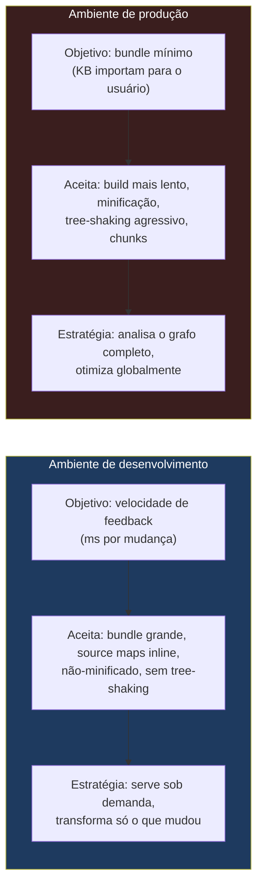
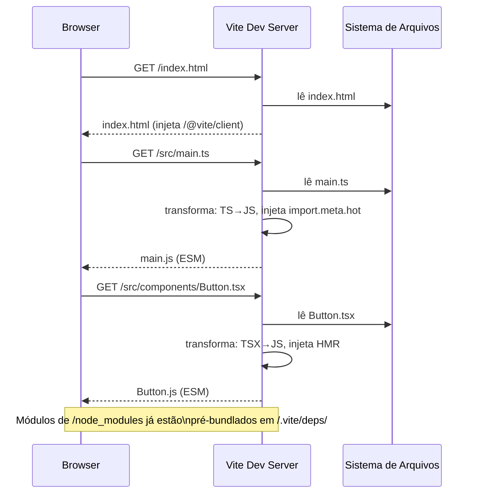
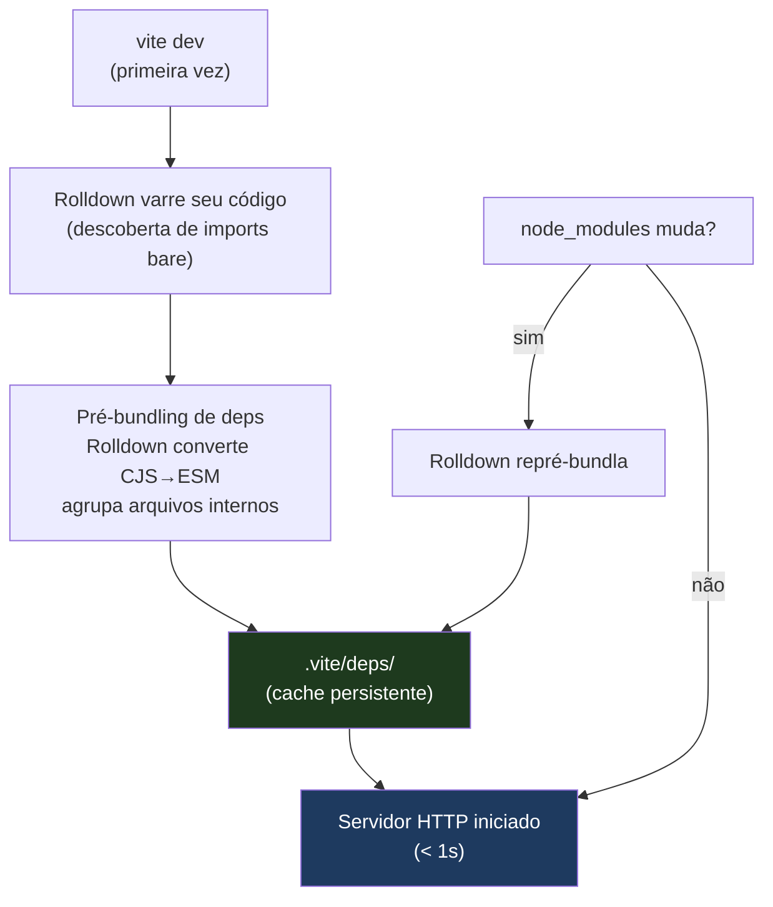
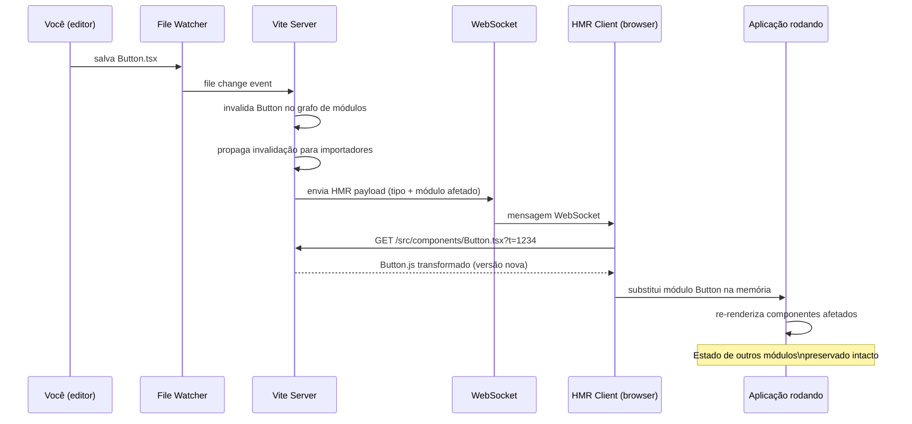
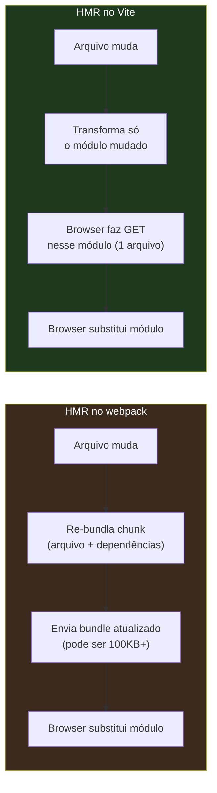
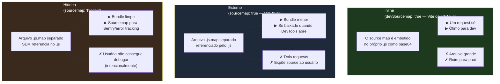
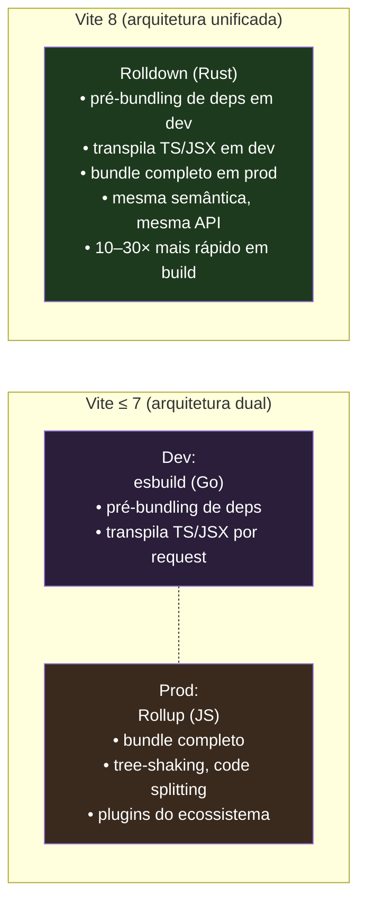
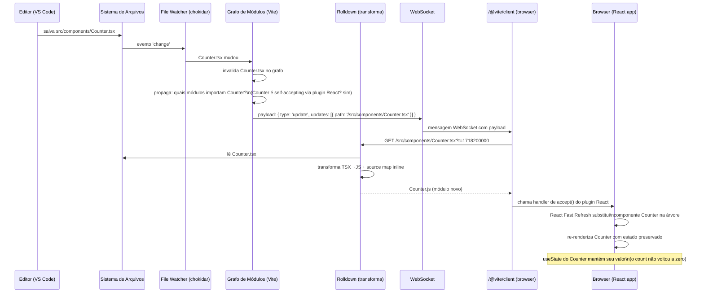

# Dev server e HMR

> [!abstract] TL;DR
> Dev e prod são **ambientes com objetivos opostos**: dev otimiza velocidade de feedback (você quer ver a mudança em milissegundos), prod otimiza tamanho e performance de download (você quer o menor bundle possível para o usuário). O Vite resolve essa tensão usando **motores diferentes para cada ambiente**: em dev, serve ESM nativo diretamente ao browser, convertendo deps CJS com Rolldown sob demanda — sem bundlar nada da sua aplicação; em build, o Rolldown (engine Rust, GA em 2026 com o Vite 8) produz um bundle otimizado. O **HMR (Hot Module Replacement)** é o mecanismo que faz mudanças aparecerem no browser sem reload — preservando estado de componentes — via WebSocket + grafo de módulos. **Source maps** fecham o ciclo: traduzem o JS transformado de volta ao seu código original no debugger. Entender esse modelo é o que diferencia um dev que "usa o Vite" de um que "entende o Vite".

---

## Por que dev e prod são ambientes fundamentalmente diferentes

Quando você escreve código, você está num loop de feedback. Você muda um arquivo, quer ver o resultado, corrige, muda de novo. A cadência é de segundos. Se o tooling demorar dez segundos a cada mudança, você perde o fio do raciocínio, abre outra aba, perde contexto. A latência do tooling afeta diretamente a qualidade do pensamento.

Em produção, o cenário é invertido. Seu usuário vai baixar o bundle uma vez e rodar muitas vezes. Cada kilobyte a mais no bundle é carregado novamente por todos que visitarem o site. O que importa é o tamanho final, a compatibilidade com browsers antigos, a separação de chunks para carregamento lazy. A velocidade de build no CI pode demorar minutos — isso é aceitável porque acontece uma vez, não a cada keypress.

Essa oposição de objetivos significa que **a estratégia certa para dev é ruim para prod, e vice-versa**.



> [!info] Leitura do diagrama
> As duas colunas não são o mesmo processo em velocidades diferentes — são estratégias arquiteturalmente distintas. Dev sacrifica tamanho e compatibilidade para ter velocidade de feedback. Prod sacrifica velocidade de build para ter performance em runtime. Tentar usar a mesma estratégia nos dois ambientes é o motivo pelo qual webpack ficou lento conforme as aplicações cresceram.

O webpack (e antes dele, o Browserify) tomou uma decisão que fazia sentido em 2012: bundlar tudo em um único arquivo. Browsers não entendiam módulos. Cada `require()` precisava ser resolvido estaticamente e embutido no bundle. O servidor de dev era um processo de build completo a cada mudança. Funcionava — mas à medida que os projetos cresceram para centenas de módulos, o cold start passou de segundos para dezenas de segundos.

O Vite foi criado em 2021 por Evan You (criador do Vue) com uma observação simples: **browsers modernos já entendem ESM nativamente**. Se o browser consegue carregar `import { foo } from './utils.js'` diretamente, por que bundlar tudo durante o desenvolvimento? A resposta foi: não precisa.

---

## O modelo do Vite em dev: ESM sob demanda

O dev server do Vite não é um processo de build. É um **servidor HTTP especializado** que transforma arquivos conforme eles são requisitados pelo browser. A diferença é conceitual e tem consequências práticas enormes.



> [!info] Leitura do diagrama
> O browser faz requests HTTP normais para cada módulo da sua aplicação. O Vite intercepta cada request, lê o arquivo, transforma (TS→JS, JSX→JS, etc.) e responde. Não há bundle sendo construído em background — cada arquivo é processado na hora em que o browser pede.

Esse modelo tem uma propriedade fundamental: **o tempo de cold start não cresce com o tamanho da aplicação**. Com webpack, bundlar 500 módulos demora mais que bundlar 100. Com o Vite, o servidor inicia em menos de um segundo independentemente do tamanho — porque não está processando nada até o browser pedir.

### O problema das dependências: pré-bundling com Rolldown

Porém, tem um problema. A maioria das bibliotecas do npm foi publicada como CommonJS (`module.exports = ...`), não como ESM. E mesmo as que são ESM, como o lodash-es, podem ter centenas de arquivos internos — o que significa centenas de requests HTTP separados apenas para carregar uma biblioteca.

O Vite resolve isso com o **pré-bundling de dependências**: antes de iniciar o servidor, ele analisa quais pacotes você usa, converte cada um para um único arquivo ESM, e armazena em `.vite/deps/`. Isso acontece uma vez, na primeira inicialização (ou quando o `package.json` muda).



> [!info] Leitura do diagrama
> O pré-bundling acontece uma vez no cold start e é cacheado. Seu próprio código da aplicação nunca é pré-bundlado — é servido diretamente como ESM. Apenas as dependências do `node_modules` passam por esse processo.

> [!note] Vite 7 vs Vite 8: a troca de motor
> Nas versões do Vite até a 7, o pré-bundling de dependências era feito com **esbuild** (bundler em Go, extremamente rápido). Com o Vite 8 (lançado em março de 2026), o motor mudou para **Rolldown** — um bundler escrito em Rust, desenvolvido pela VoidZero. A troca traz 10–30x de speedup nos builds de produção e uma arquitetura unificada: o mesmo motor serve tanto o pré-bundling em dev quanto o build de produção. A **nota [[07 - O grafo de módulos e o que é bundling]]** entra em mais detalhes sobre o grafo de dependências.

O resultado para o usuário é transparente: você importa `import { useState } from 'react'` e o browser recebe um único arquivo `.vite/deps/react.js` em vez de dezenas de módulos internos do React.

---

## HMR: Hot Module Replacement

Live reload é simples: quando um arquivo muda, o servidor avisa o browser e o browser faz um reload completo. Funciona, mas você perde todo o estado — o formulário que o usuário estava preenchendo, a posição do scroll, o estado de autenticação em memória. Para ciclos de desenvolvimento rápidos, isso é insuportável.

**HMR (Hot Module Replacement)** resolve isso: quando um arquivo muda, **apenas aquele módulo é substituído na memória**, sem recarregar a página. O estado dos módulos não afetados é preservado.

### O ciclo de uma atualização HMR



> [!info] Leitura do diagrama
> O caminho crítico é: mudança no disco → file watcher → invalidação no grafo → WebSocket → browser busca apenas o módulo mudado → substitui na memória. A página não recarrega. O estado dos outros módulos (formulários preenchidos, autenticação, variáveis em memória) sobrevive.

### Por que o Vite é mais rápido que o webpack no HMR

Com o webpack, HMR significa: re-bundlar o chunk que contém o módulo modificado, mais todas as suas dependências internas. Quanto maior o chunk, mais lento. Em apps grandes, um HMR podia demorar 3–10 segundos.

Com o Vite, o browser só precisa buscar **um único arquivo** — o módulo que mudou. Sem re-bundling. Sem re-processamento de dependências. O único trabalho é transformar aquele arquivo e enviar. Isso leva dezenas de milissegundos independentemente do tamanho da aplicação.



### A HMR API: `import.meta.hot`

O HMR automático funciona para a maioria dos casos — frameworks como Vue e React (via plugins do Vite) já sabem como substituir componentes sem perder estado. Mas quando você quer controle explícito, existe a **HMR API** exposta em `import.meta.hot`.

```ts
// Módulo que quer aceitar suas próprias atualizações
if (import.meta.hot) {
  // import.meta.hot só existe em dev — em prod é undefined (tree-shaken)

  // 1. accept(): este módulo sabe se atualizar sozinho
  import.meta.hot.accept((newModule) => {
    // newModule é o módulo recém-carregado
    // aqui você decide o que fazer com a nova versão
    console.log('Módulo atualizado:', newModule)
  })

  // 2. dispose(): limpeza ANTES de ser substituído
  // Essencial para setInterval, event listeners, conexões WebSocket
  import.meta.hot.dispose((data) => {
    clearInterval(myInterval) // evita memory leaks ao re-substituir
    data.count = currentCount  // passa estado para o próximo hot update
  })

  // 3. accept() com dependências: aceita atualizações de outros módulos
  import.meta.hot.accept(['./dep1.ts', './dep2.ts'], ([newDep1, newDep2]) => {
    // chamado quando dep1 ou dep2 mudar
  })

  // 4. invalidate(): sinaliza que este módulo não consegue se atualizar
  // força o Vite a propagar a invalidação para os importadores
  import.meta.hot.invalidate('módulo não sabe se recuperar desse estado')
}
```

> [!tip] O guard `if (import.meta.hot)`
> Sempre envolva o código HMR nesse guard. Em produção, `import.meta.hot` é `undefined` e o Vite remove o bloco inteiro via tree-shaking (dead code elimination). Se você não usar o guard, o código HMR vai parar em produção e quebrar.

A maioria dos desenvolvedores nunca escreve `import.meta.hot` diretamente — frameworks fazem isso nos plugins (o `@vitejs/plugin-react` injeta HMR para componentes React automaticamente). Mas entender a API explica por que o HMR **preserva estado**: é porque os módulos declaram o que sabem fazer durante uma atualização. Se um componente React tiver Fast Refresh habilitado, o plugin sabe re-renderizar sem desmontar — o estado do hook (`useState`) sobrevive.

> [!question] Mas o que acontece quando o HMR não consegue atualizar?
> Se o grafo de invalidação chega até um módulo que não aceitou HMR (não tem `import.meta.hot.accept`), o Vite faz um **full reload** automático. Você vê no terminal: `page reload src/main.ts`. É o fallback seguro. Em projetos bem configurados (com plugins de framework), isso raramente acontece para mudanças em componentes — apenas para mudanças em arquivos de configuração ou de bootstrapping da aplicação.

### HMR events: o que o browser pode ouvir

Além de `import.meta.hot`, a aplicação pode escutar eventos globais de HMR para reagir ao ciclo de atualização:

```ts
// Eventos globais do ciclo HMR — úteis para logging, analytics de dev
if (import.meta.hot) {
  import.meta.hot.on('vite:beforeUpdate', (payload) => {
    console.log('HMR: atualização chegando', payload.type)
  })

  import.meta.hot.on('vite:afterUpdate', () => {
    console.log('HMR: atualização aplicada')
  })

  import.meta.hot.on('vite:beforeFullReload', () => {
    console.log('HMR: não foi possível hot update, recarregando página')
  })

  import.meta.hot.on('vite:error', (payload) => {
    console.error('HMR: erro no servidor', payload.err)
  })
}
```

---

## Source maps: debugando o código que você não escreveu

O browser está rodando JavaScript transformado. Seu TypeScript com JSX virou JavaScript sem tipos, sem JSX, talvez minificado, com nomes de variáveis encurtados. Quando o debugger para numa exceção, a linha que ele aponta é no arquivo transformado — não no seu source.

**Source maps** são arquivos de mapeamento que dizem ao browser: "a linha 12, coluna 4 do arquivo transformado corresponde à linha 45, coluna 8 do arquivo original `src/components/Button.tsx`". Com isso, o DevTools mostra seu código original, com nomes de variáveis originais, breakpoints nas linhas certas.

### A anatomia de um source map

Um source map é um arquivo `.js.map` (JSON) referenciado pelo arquivo transformado:

```js
// Button.js (arquivo transformado pelo Vite)
function Button({ onClick, children }) {
  return React.createElement("button", { onClick }, children);
}
//# sourceMappingURL=Button.js.map
```

```json
// Button.js.map (simplificado — na prática é VLQ-encoded)
{
  "version": 3,
  "sources": ["src/components/Button.tsx"],
  "sourcesContent": ["export function Button({ onClick, children }: ButtonProps) {\n  return <button onClick={onClick}>{children}</button>;\n}"],
  "mappings": "AAAA,SAAS,OAAO,EAAE,OAAO,EAAE,QAAQ..."
}
```

O campo `mappings` usa o formato **VLQ Base64** (Variable Length Quantity) — uma codificação compacta que mapeia cada posição no output para uma posição no source. O DevTools lê isso e executa o mapeamento transparentemente.

### Os três tipos de source maps



> [!info] Leitura do diagrama
> Três estratégias, três trade-offs. Em dev, inline é o padrão — sem deploy de arquivos extras, sem segundo request. Em prod, hidden é o padrão para times sérios: o `.js.map` é gerado mas não referenciado, enviado só para o sistema de error tracking (Sentry, Datadog) — o usuário nunca vê seu source.

### Source maps no Vite

O Vite usa source maps inline em dev por padrão. Quando você transforma um `.tsx`, o arquivo servido ao browser já contém o mapeamento embutido. O DevTools detecta automaticamente e você debugga seu TypeScript original.

```ts
// vite.config.ts — controle de source maps
export default defineConfig({
  // Em dev, o padrão já é inline. Para desabilitar (raro):
  // server: { sourcemapIgnoreList: () => false },

  build: {
    sourcemap: true,    // gera arquivo .map externo (referenciado)
    // sourcemap: 'hidden', // gera .map sem referenciar — para Sentry
    // sourcemap: 'inline', // embutido no bundle — grande demais para prod
    // sourcemap: false,    // sem source map em prod (padrão)
  }
})
```

> [!warning] O custo real dos source maps em produção
> Source maps completos podem ser maiores que o próprio bundle — um bundle de 200KB pode ter um `.map` de 800KB. Isso aumenta o tempo de build e o espaço em disco/CDN. Em produção com `hidden`, esse custo não afeta usuários (o `.map` nunca é servido). Mas gerar source maps sempre adiciona latência ao pipeline de CI. Times de alta performance usam `sourcemap: 'hidden'` + upload automático para error tracking, sem servir o `.map` via CDN.

---

## O trade-off dev↔prod no Vite 8: motores unificados

A tensão dev/prod que descrevemos tem uma história de ferramentas no Vite. Durante anos (Vite 1–7), a situação era:

- **Dev**: esbuild transforma arquivos individualmente (Go, rápido, mas não otimiza globalmente), serviço ESM sob demanda
- **Prod**: Rollup bundla (JS, mais lento, mas com tree-shaking e output formats completos)

O problema era **inconsistência**: features que funcionavam em dev podiam se comportar diferente em prod porque os dois motores tinham semânticas ligeiramente diferentes. E o esbuild não suportava todos os plugins do ecossistema Rollup.

Com o **Vite 8** (março de 2026), a VoidZero lançou o **Rolldown** como motor único:



> [!info] Leitura do diagrama
> O Vite 7 usava dois motores com semânticas diferentes — esbuild em dev, Rollup em prod. O Vite 8 usa Rolldown para ambos: mesmo motor, mesma semântica, mesma API de plugins. A inconsistência dev/prod desapareceu como classe de bug.

> [!note] O que o Vite 8 preservou do modelo ESM
> A troca de motor **não mudou o modelo de servir ESM sob demanda**. O Vite 8 ainda não bundla sua aplicação em dev. O Rolldown substituiu o esbuild no pré-bundling de dependências e na transformação individual de arquivos, mas o princípio de "serve sob demanda, browser faz os requests" permanece. A nota [[13 - Vite a fundo]] cobre a configuração e o ecossistema de plugins em detalhes.

### Linha do tempo do Vite/Rolldown (2021–2026)

| Ano | Marco |
|-----|-------|
| 2021 | Vite 1 lançado — ESM nativo + esbuild para dev |
| 2022 | Vite 3 — ecossistema de plugins explode; padrão de facto para SPA |
| 2024 | VoidZero fundada por Evan You; Rolldown anunciado |
| mai/2025 | `rolldown-vite` preview técnico disponível |
| dez/2025 | Vite 8 beta com Rolldown como padrão |
| mar/2026 | **Vite 8 estável** — Rolldown GA, motor único |
| mai/2026 | Rolldown 1.0 estável lançado |

---

## O que acontece quando você salva um arquivo com HMR ligado

Vamos percorrer o cenário completo para concretizar todos os conceitos:



> [!info] Leitura do diagrama
> Doze passos da tecla Save até o componente atualizado no browser — sem reload de página, sem perda de estado. O `?t=1718200000` no request é um timestamp (cache-busting) para forçar o browser a buscar a versão nova em vez de usar o cache HTTP.

O detalhe crítico é a linha "Counter é self-accepting via plugin React?". O `@vitejs/plugin-react` (que usa React Fast Refresh) injeta automaticamente `import.meta.hot.accept()` em cada componente. Quando o grafo de invalidação chega num módulo self-accepting, a propagação para. Se o grafo chegasse num módulo sem `accept()`, o Vite faria um full reload.

---

## Como explicar em inglês

The Vite dev server works by serving your application source code as native ES Modules directly to the browser, without bundling. The browser requests modules on demand via HTTP, and Vite transforms each file in-place — stripping TypeScript types, compiling JSX, and injecting HMR hooks — then responds with a plain JavaScript module. Dependencies from `node_modules` are pre-bundled by Rolldown into single ESM files in `.vite/deps/`, handling the CJS-to-ESM conversion and collapsing hundreds of internal sub-modules into a single request.

HMR — Hot Module Replacement — works through a WebSocket connection between the Vite server and a small client script injected into the browser. When you save a file, Vite walks the module import graph to find which modules are affected, then notifies the browser over WebSocket. The browser fetches only the changed module, and the HMR client replaces it in memory without a full page reload, preserving the application state. Frameworks like React integrate via the `import.meta.hot.accept()` API, which lets each module declare how it handles being replaced at runtime.

Source maps are JSON files that map positions in the transformed JavaScript back to their original source locations. Vite embeds them inline during development so DevTools can show your TypeScript/JSX source when debugging. In production, teams typically generate hidden source maps — separate `.map` files not referenced in the bundle — and upload them to error-tracking services.

Vite 8 (stable March 2026) unified the dev and build engines under Rolldown, a Rust-based bundler that replaces both esbuild (previously used for pre-bundling) and Rollup (previously used for production builds), delivering 10–30x faster builds with a single consistent plugin API.

### Vocabulário-chave

| Português | English |
|-----------|---------|
| servidor de desenvolvimento | dev server |
| módulos nativos do browser | native ES Modules / browser-native ESM |
| pré-bundling de dependências | dependency pre-bundling |
| substituição a quente de módulos | Hot Module Replacement (HMR) |
| módulo self-accepting | self-accepting module |
| grafo de módulos | module import graph |
| conexão em tempo real | WebSocket connection |
| mapa de origem | source map |
| source map inline | inline source map |
| source map oculto | hidden source map |
| cache-busting por timestamp | timestamp-based cache-busting |
| motor unificado | unified engine / single bundler |
| estado preservado | preserved state |
| recarregamento completo | full page reload |
| propagação de invalidação | invalidation propagation |

---

## Armadilhas comuns

**Confundir HMR com live reload.** Live reload recarrega a página inteira — você perde todo o estado. HMR substitui módulos em memória — o estado sobrevive. São mecanismos completamente diferentes. Vite usa HMR; só faz live reload como fallback quando não consegue fazer HMR.

**Esquecer o guard `if (import.meta.hot)`.**  Em produção, `import.meta.hot` é `undefined`. Se você chamar `.accept()` sem o guard, o código quebra em produção. Sempre envolva código HMR no guard — o Vite remove o bloco inteiro via tree-shaking quando o guard está presente.

**Assumir que source maps em produção são gratuitos.** Gerar source maps adiciona tempo de build e pode dobrar o tamanho dos artefatos. Em pipelines de CI grandes, isso importa. Use `sourcemap: 'hidden'` e suba os `.map` para seu error tracker — não os sirva via CDN.

**Editar arquivos em `node_modules` e esperar HMR.** O Vite monitora seu código-fonte, não `node_modules`. Mudanças em dependências exigem reiniciar o servidor (ou deletar `.vite/deps/` e reiniciar).

**Migrar para Vite 8 sem testar plugins.** A troca esbuild→Rolldown é transparente para a maioria dos casos, mas alguns plugins usavam APIs internas do esbuild. Verifique a lista de plugins do seu projeto antes de atualizar.

**Assumir que o modelo ESM do Vite funciona em produção sem bundler.** O Vite serve ESM sob demanda em dev porque o browser faz dezenas de requests individuais — aceitável em localhost. Em produção, você precisa do `vite build` para gerar um bundle otimizado; sem ele, o usuário faria centenas de requests HTTP.

---

## Veja também

- [[07 - O grafo de módulos e o que é bundling]] — o grafo de imports que o HMR percorre ao propagar invalidações; o conceito de bundling que o dev server deliberadamente evita
- [[08 - Transpilação e targets]] — o que acontece na transformação individual de cada arquivo (TS→JS, JSX→JS) que o Vite executa por request
- [[13 - Vite a fundo]] — configuração detalhada, sistema de plugins, diferenças entre `vite.config.ts` e o comportamento do dev server; este aqui cobre o modelo conceitual
