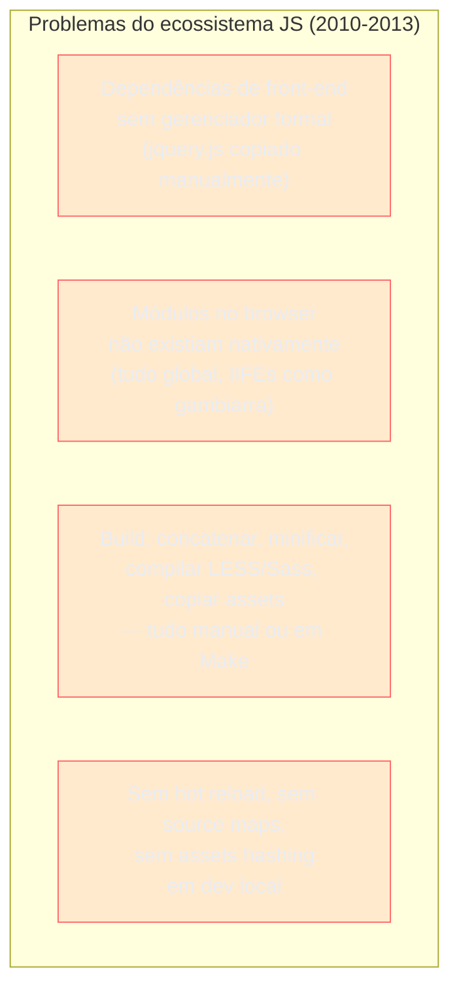
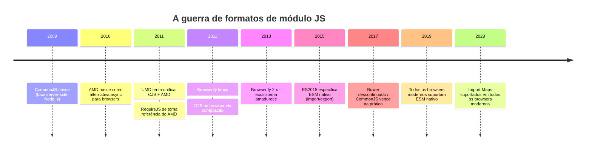
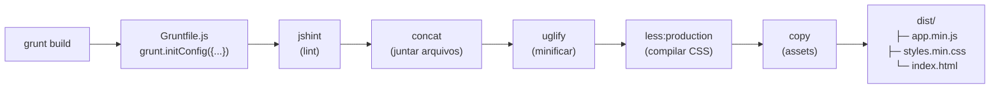
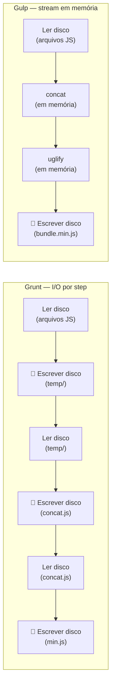
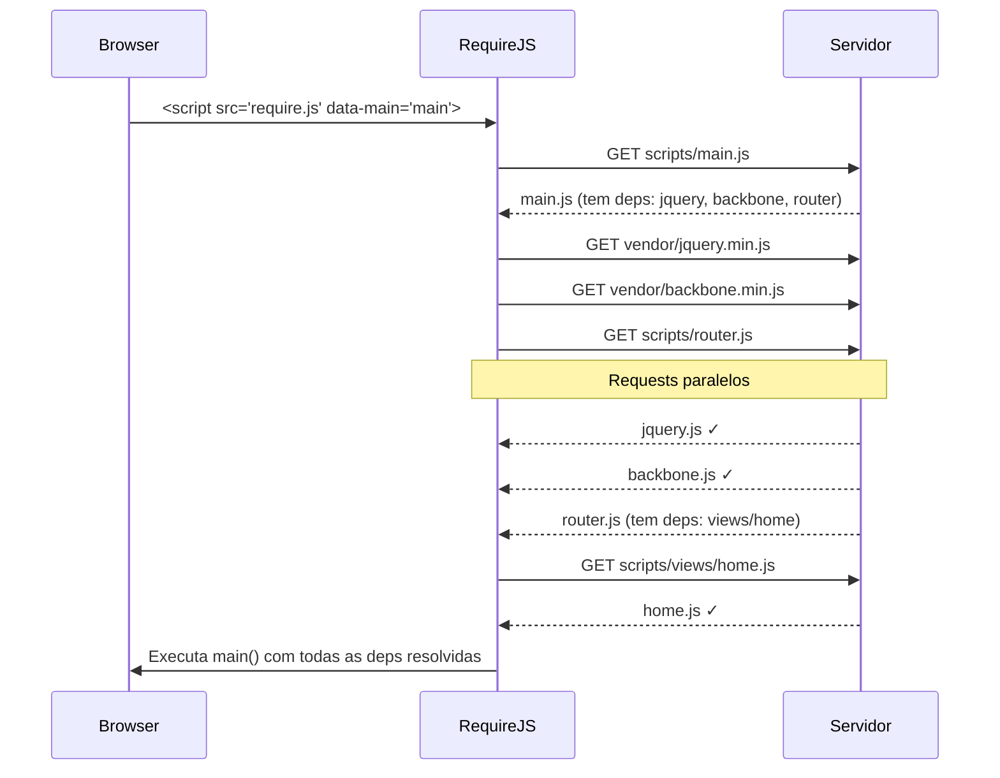
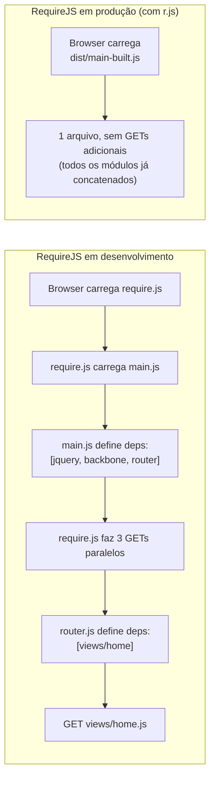
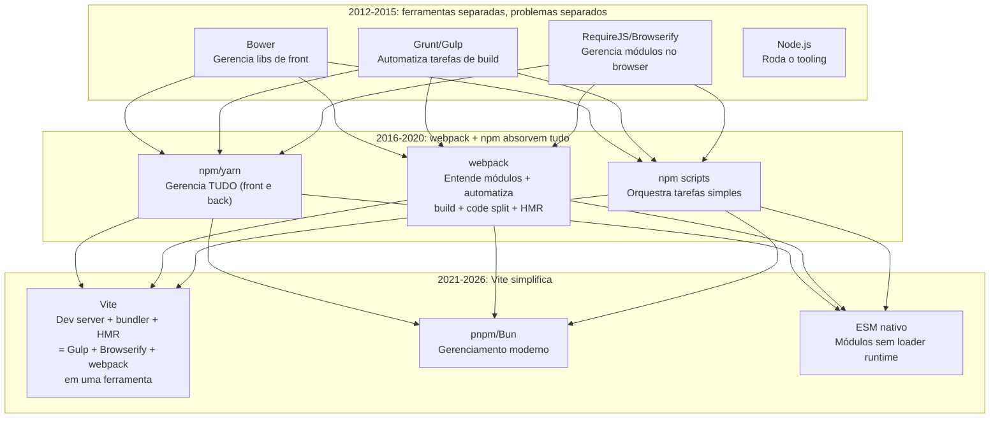
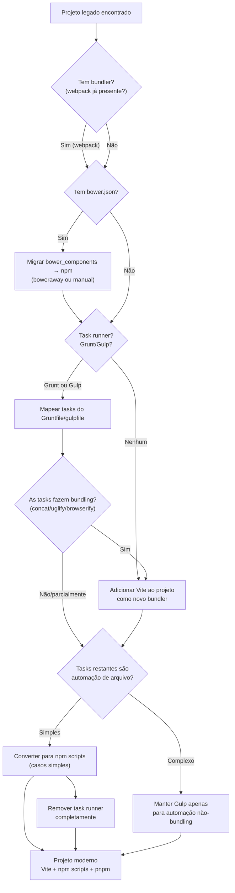

# Ferramentas legadas: Grunt, Gulp, Bower, Browserify e RequireJS

> [!abstract] TL;DR
> Antes de Vite, webpack e ESM nativo, o ecossistema JS sobreviveu com um conjunto de ferramentas que hoje parecem arqueologia: Grunt automatizou tarefas por config JSON; Gulp fez o mesmo com streams; Bower gerenciou pacotes de front-end antes do npm dominar tudo; Browserify trouxe `require()` do Node para o browser; RequireJS/AMD resolveu módulos antes do ESM. Todas caíram — e foi por razões parecidas: o ecossistema cresceu e cada peça encontrou uma solução integrada melhor. Em 2026, o Grunt tem ~1,2M de downloads semanais (inércia de pipelines CI), o Gulp ainda passa de 2M (legado e nicho de automação não-bundling), o Bower tem ~340k (projetos .NET legados), o Browserify ~1,8M (dependência transitiva), e o RequireJS ~4M (inércia de SPAs legadas). Nenhum deles é uma escolha para projeto novo. Você vai encontrá-los em codebases existentes — e esta nota é o mapa para entendê-los e modernizá-los.

---

## Por que estudar ferramentas mortas

Existe uma tendência tentadora em engenharia: ignorar o passado e só aprender o que é novo. É eficiente até o momento em que você entra numa base de código legada de uma empresa que tem dez anos — e encontra um `Gruntfile.js` de 800 linhas que roda o build de produção.

Esse momento acontece com mais frequência do que qualquer entrevistador admite. Segundo o Stack Overflow Developer Survey 2024, quase metade das organizações tem sistemas em produção com mais de 10 anos. No ecossistema JS, onde projetos vivos raramente são migrados enquanto funcionam, é razoável estimar que milhares de aplicações ainda dependem de Grunt, Gulp, Browserify ou RequireJS.

Estudar essas ferramentas cumpre três funções práticas:

1. **Você consegue ler e modificar código legado** sem ficar perdido em uma sintaxe que parece alienígena.
2. **Você entende por que foram descontinuadas**, o que te dá critério para avaliar as ferramentas atuais — os mesmos antipadrões aparecem de formas diferentes.
3. **Você consegue criar um plano de migração** argumentado: não "vamos jogar fora", mas "aqui está o mapeamento do que cada parte faz hoje e como o equivalente moderno resolve".

A nota [[02 - A evolução do tooling JS - de script ao bundler moderno]] conta a narrativa cronológica. Esta nota é o mergulho técnico em cada ferramenta: como funcionava, o que resolvia, por que caiu e onde está hoje.

---

## O contexto que criou essas ferramentas

Para entender as ferramentas legadas, é preciso revisitar o contexto que as criou. Em 2010–2013, o ecossistema JS tinha problemas que hoje parecem básicos mas eram genuinamente difíceis:



Cada ferramenta nasceu para resolver um desses quadrantes. Nenhuma resolveu o problema inteiro — e foi exatamente isso que abriu espaço para as ferramentas modernas que engoliram todas de uma vez.

---

## A guerra de módulos: AMD vs CommonJS vs UMD

Antes de entrar nas ferramentas, vale entender o campo de batalha conceitual que dividiu o ecossistema por quase cinco anos (2009–2015). A nota [[06 - ESM e CJS e o sistema de módulos]] conta a história do ponto de vista do JavaScript moderno; aqui o foco é no conflito que criou RequireJS e Browserify.

### CommonJS: o lado server-first

A especificação CommonJS surgiu em 2009 com foco em JavaScript fora do browser — Node.js a adotou como seu sistema de módulos nativo. O modelo é **síncrono**: `require('modulo')` bloqueia a thread até carregar o arquivo do disco. Isso é aceitável em servidor (disco é rápido), mas problemático no browser (carregar um arquivo significa um roundtrip de rede que pode levar centenas de milissegundos).

```javascript
// CommonJS — funciona em Node, não funciona no browser sem build step
const _ = require('lodash');       // síncrono: bloqueia até lodash ser carregado
module.exports = { processa };
```

### AMD: o lado browser-first

Um grupo de desenvolvedores insatisfeitos com a direção server-centric do CommonJS separou-se e criou a especificação AMD em 2010. O requisito central era: **o browser precisa carregar módulos de forma assíncrona** — você não pode bloquear o thread principal esperando um arquivo de rede.

AMD resolveu isso com a sintaxe `define()`: você declara dependências antes da execução e recebe um callback que só é chamado quando todas estão disponíveis.

```javascript
// AMD — funciona no browser sem build step, mas verboso
define(['lodash', './utils'], function(_, utils) {
  // Só executa após lodash e utils carregados pela rede
  return { processa: utils.processar };
});
```

### Por que o CommonJS "ganhou" na prática

A ironia é que o CommonJS — o formato server-first — se tornou dominante no front-end também, por uma razão pragmática: **o npm**. Quando o npm se tornou o repositório universal de JavaScript, e quando o Browserify (e depois o webpack) resolveram o "problema de browser" em build time (ao invés de runtime), o custo de adotar CommonJS caiu para zero. Você escrevia `require()` como no Node, e o bundler resolveu o resto.

"Resolver em build time" significa: antes de servir o código ao browser, uma ferramenta (o Browserify) lê todos os `require()`, segue as dependências e gera um único arquivo JavaScript que inclui todos os módulos — o browser recebe esse arquivo pronto e nunca precisa executar `require()` nativamente. O Browserify é o protagonista dessa abordagem e é detalhado na seção específica mais abaixo.

AMD sobreviveu principalmente em ambientes onde "sem build step" era um requisito — projetos empresariais que não tinham pipeline de CI sofisticado, ou que precisavam de carregamento dinâmico granular de módulos em runtime.

### UMD: a tentativa de paz

Com dois sistemas incompatíveis — AMD para browser e CommonJS para Node — surgiu em 2011 o **UMD (Universal Module Definition)**: um padrão de código boilerplate que tentava fazer um módulo funcionar em ambos os contextos.

```javascript
// UMD — o "padrão" que ninguém queria escrever manualmente
(function (root, factory) {
  if (typeof define === 'function' && define.amd) {
    // Contexto AMD (RequireJS): registra como módulo AMD
    define(['lodash'], factory);
  } else if (typeof module === 'object' && module.exports) {
    // Contexto CommonJS (Node / Browserify): exporta como CJS
    module.exports = factory(require('lodash'));
  } else {
    // Browser global (sem loader): expõe como variável global
    root.MinhaLib = factory(root._);
  }
}(typeof self !== 'undefined' ? self : this, function (_) {
  // Implementação real aqui
  return { processa: function(data) { return _.sortBy(data); } };
}));
```

UMD foi amplamente adotado por autores de bibliotecas — Lodash, Underscore.js, Backbone.js e Moment.js publicavam builds UMD. A sintaxe é verbosa e difícil de ler, mas funcionava. O ESM nativo do ES2015 finalmente tornou o UMD desnecessário ao oferecer um formato que ferramentas de build podiam converter automaticamente.

> [!info] O legado do UMD em 2026
> Você ainda encontra builds UMD em CDNs antigas e em bibliotecas que mantêm compatibilidade retroativa. Quando você baixa Bootstrap 4 ou Lodash via CDN no formato "non-module", o que recebe é provavelmente um bundle UMD. A nota [[06 - ESM e CJS e o sistema de módulos]] detalha como os bundlers modernos lidam com o legado UMD via campo `main` vs `module` no `package.json`.
>
> Em síntese: o campo `main` aponta para o arquivo CJS do pacote (para Node e Browserify); o campo `module` aponta para o arquivo ESM (para bundlers modernos como webpack e Rollup que entendem ESM). Se o bundler encontra o campo `module`, ele usa o arquivo ESM — que permite tree-shaking; se só existe `main`, ele usa o CJS. O UMD geralmente ficava no `main` porque precedia a convenção `module`.



---

## Grunt — o task runner da configuração

### O que era e como funcionava

O Grunt foi criado por Ben Alman e lançado em 2012. A proposta era simples: em vez de escrever scripts Make ou bash para automatizar tarefas de build (minificar JS, compilar LESS, rodar testes, copiar arquivos), você escrevia uma configuração JavaScript que definia as tarefas declarativamente.

O modelo do Grunt é **configuração-sobre-código** — config-over-code. Você descreve *o que* deve acontecer, e o Grunt executa. A ferramenta tem uma CLI (`grunt`) que lê o `Gruntfile.js`, inicializa plugins e executa tarefas na ordem declarada.

Aqui está um `Gruntfile.js` representativo de um projeto de 2013–2016:

```javascript
// Gruntfile.js — exemplo comentado de projeto real típico

module.exports = function (grunt) {

  // grunt.initConfig recebe UM objeto gigante com toda a configuração.
  // Cada chave de primeiro nível é o nome de um plugin/task.
  grunt.initConfig({

    // Lê o package.json para usar campos como version, name
    pkg: grunt.file.readJSON('package.json'),

    // grunt-contrib-uglify: minifica JavaScript
    // Cada task tem um target (aqui: "build") com sua config específica
    uglify: {
      options: {
        // Banner comentado no topo do bundle de produção
        banner: '/*! <%= pkg.name %> v<%= pkg.version %> */\n'
      },
      build: {
        // src: glob de arquivos de entrada
        // dest: arquivo de saída
        src: 'src/**/*.js',
        dest: 'dist/<%= pkg.name %>.min.js'
      }
    },

    // grunt-contrib-less: compila LESS → CSS
    less: {
      development: {
        options: {
          compress: false,   // sem minificação em dev
          yuicompress: false,
          optimization: 2
        },
        files: {
          // destino: origem
          'dist/styles.css': 'src/styles/main.less'
        }
      },
      production: {
        options: { compress: true },
        files: { 'dist/styles.min.css': 'src/styles/main.less' }
      }
    },

    // grunt-contrib-concat: concatena múltiplos arquivos em um
    // (antes do webpack, você concatenava manualmente)
    concat: {
      options: { separator: ';' },
      dist: {
        src: [
          'vendor/jquery/jquery.js',       // primeiro jquery
          'vendor/underscore/underscore.js',
          'src/modules/utils.js',           // depois os módulos
          'src/modules/api.js',
          'src/app.js'                      // entry point por último
        ],
        dest: 'dist/app.js'
      }
    },

    // grunt-contrib-watch: observa mudanças de arquivo
    // e re-executa tasks automaticamente
    watch: {
      scripts: {
        files: ['src/**/*.js'],
        tasks: ['jshint', 'concat', 'uglify'],
        options: {
          spawn: false // mais rápido — reutiliza o processo grunt
        }
      },
      styles: {
        files: ['src/**/*.less'],
        tasks: ['less:development']
      }
    },

    // grunt-contrib-jshint: lint de JavaScript (pré-ESLint)
    jshint: {
      options: {
        curly: true,
        eqeqeq: true,
        eqnull: true,
        browser: true,
        globals: { jQuery: true }
      },
      all: ['Gruntfile.js', 'src/**/*.js']
    },

    // grunt-contrib-copy: copia assets estáticos
    copy: {
      main: {
        files: [
          { expand: true, cwd: 'src/images/', src: ['**'], dest: 'dist/images/' },
          { src: 'src/index.html', dest: 'dist/index.html' }
        ]
      }
    }
  });

  // Carregar cada plugin explicitamente
  grunt.loadNpmTasks('grunt-contrib-uglify');
  grunt.loadNpmTasks('grunt-contrib-less');
  grunt.loadNpmTasks('grunt-contrib-concat');
  grunt.loadNpmTasks('grunt-contrib-watch');
  grunt.loadNpmTasks('grunt-contrib-jshint');
  grunt.loadNpmTasks('grunt-contrib-copy');

  // Registrar tasks compostas (aliases)
  // 'grunt' sem argumento executa 'default'
  grunt.registerTask('default', ['jshint', 'concat', 'uglify', 'less:production', 'copy']);
  grunt.registerTask('dev',     ['jshint', 'concat', 'less:development', 'watch']);
  grunt.registerTask('build',   ['jshint', 'concat', 'uglify', 'less:production', 'copy']);
};
```

O fluxo de execução do Grunt é linear e sequencial:



### Por que o Grunt dominou (brevemente)

Em 2012–2014, o Grunt resolveu um problema real: **a automação de build em JS era zero**. Antes do Grunt, você ou escrevia Makefile (com sintaxe de 1977), ou rodava scripts bash frágeis, ou executava cada passo manualmente. O Grunt trouxe:

- Uma abstração consistente em JavaScript (sem precisar aprender Make)
- Um ecossistema de plugins (`grunt-contrib-*`) que cresceu rapidamente
- Uma interface declarativa — você especificava entradas e saídas, não o processo

No pico do Grunt (2013–2015), havia mais de 6.000 plugins disponíveis. Era o padrão de fato para build de front-end.

### Por que caiu

Três problemas mataram o Grunt:

**1. A config era verbosa e se tornava ilegível rapidamente.** Um `Gruntfile.js` de projeto médio tinha 300–500 linhas de JSON aninhado. Mudar a ordem de uma task exigia entender toda a estrutura. Adicionar uma pipeline nova significava entrar num labirinto de `options`, `targets` e `files`.

**2. Sem fluxo de dados entre tasks.** Cada plugin lia do disco e escrevia no disco. Se você queria transpilar TypeScript, depois concatenar, depois minificar, isso significava três ciclos de I/O de disco. Em projetos grandes com centenas de arquivos, o build ficava lento — não pela CPU, mas pelo I/O. O Gulp atacou exatamente esse problema com streams.

**3. npm scripts tornaram o Grunt redundante para casos simples.** Com o `scripts` do `package.json`, você conseguia chamar `tsc && node esbuild.js && cp -r assets dist/` diretamente, sem camada de abstração. Para os casos que ficaram complexos demais para npm scripts, a resposta foi o webpack — que não era um task runner, mas um bundler que resolvia o problema na raiz.

**4. O modelo de plugin criou fragmentação de manutenção.** O Grunt dependia de plugins de terceiros para cada transformação. Com 6.000+ plugins no pico, a qualidade variava imensamente — e quando um plugin deixava de ser mantido (ex: `grunt-contrib-handlebars`, `grunt-contrib-coffee`), você ficava preso. O ecossistema do Grunt era mais largo que fundo. Isso contrasta com o webpack, onde o core resolvia os casos principais e plugins eram adendos opcionais, não pré-requisitos.

> [!question] Mas por que o Grunt não simplesmente adotou streams como o Gulp?
> A resposta é arquitetural: o modelo de configuração JSON-first do Grunt tornava impossível introduzir streams de forma natural. Adicionar streams ao Grunt exigiria reescrever o core e quebrar todo o ecossistema de plugins existentes. O Gulp foi criado do zero com streams como princípio fundante — não era uma feature, era a arquitetura. Este é um caso clássico de **path dependency** — quando decisões de design tomadas cedo criam custos altos demais para reverter: o Grunt estava tão comprometido com o modelo de config JSON que mudar a arquitetura de I/O significaria destruir a compatibilidade com 6.000 plugins. Às vezes é mais barato criar do zero do que reformar o que já existe.

### Estado em 2026

O Grunt continua tendo uma vida mais longa do que qualquer um esperaria. Na semana de 17–23 de junho de 2026, o Grunt teve **1.228.474 downloads**. Esses downloads não são pessoas escolhendo Grunt — são pipelines de CI, projetos legados e, principalmente, dependências transitivas (outros pacotes que dependem de grunt para seus próprios testes internos).

**Versão atual:** 1.6.2, mantida pela OpenJS Foundation. O Grunt está sob o OpenJS Ecosystem Sustainability Program com suporte da HeroDevs para versões mais antigas. Tecnicamente "mantido", mas sem features novas — só patches de segurança.

**O diagnóstico correto:** o Grunt não está morto da forma que o Bower está. Ele está em modo de manutenção de suporte — como um paciente estável, não crítico. Você não escolheria Grunt para projeto novo mesmo que pagassem, mas ele não vai "apagar" de repente.

> [!tip] Equivalente moderno
> Para cada coisa que o Grunt fazia, existe um substituto direto:
> - Concatenar JS → bundler (Vite/esbuild): não precisar mais
> - Minificar → automático no `vite build` / `esbuild --minify`
> - Compilar LESS/Sass → PostCSS plugin ou Vite plugin
> - Copiar assets → `vite build` cuida disso; ou `cp` num npm script
> - Watch + reload → `vite dev` com HMR nativo
>
> Um Gruntfile de 400 linhas vira um `vite.config.ts` de 30 e um `package.json` com 5 scripts.

---

## Gulp — o task runner que pensou em streams

### O que era e como funcionava

O Gulp foi criado por Eric Schoffstall (Fractal Innovations) em 2013 com uma crítica direta ao Grunt: a configuração JSON era verbosa e o I/O de disco entre tasks era ineficiente. A solução do Gulp: **código ao invés de configuração**, e **streams Node.js** para passar dados entre transformações sem tocar o disco.

O modelo do Gulp é **code-over-config**. Você escreve funções JavaScript que definem tasks, e essas funções passam os arquivos como streams — objetos Vinyl (a abstração de arquivo virtual do Gulp) que fluem de plugin para plugin sem gravar em disco intermediariamente.

```javascript
// gulpfile.js — Gulp 4 (API de 2018+), exemplo real comentado

const { src, dest, watch, series, parallel } = require('gulp');
const uglify   = require('gulp-uglify');
const sass      = require('gulp-sass')(require('sass'));
const sourcemaps = require('gulp-sourcemaps');
const concat    = require('gulp-concat');
const autoprefixer = require('gulp-autoprefixer');
const browsersync  = require('browser-sync').create();

// Task de JavaScript:
// src() cria um stream de arquivos Vinyl
// .pipe() passa o stream de plugin em plugin — sem I/O de disco intermediário
// dest() grava o resultado final no disco
function scripts() {
  return src('src/js/**/*.js', { sourcemaps: true }) // lê do disco UMA vez
    .pipe(concat('bundle.js'))      // concatena em memória
    .pipe(uglify())                 // minifica em memória
    .pipe(dest('dist/js', { sourcemaps: '.' })); // grava no disco UMA vez
}

// Task de CSS com Sass:
function styles() {
  return src('src/scss/main.scss', { sourcemaps: true })
    .pipe(sourcemaps.init())
    .pipe(sass({ outputStyle: 'compressed' }).on('error', sass.logError))
    .pipe(autoprefixer({ cascade: false }))
    .pipe(sourcemaps.write('.'))
    .pipe(dest('dist/css'));
}

// BrowserSync: injeta mudanças no browser sem reload
function browserSyncServe(cb) {
  browsersync.init({
    server: { baseDir: 'dist' }
  });
  cb();
}

function browserSyncReload(cb) {
  browsersync.reload();
  cb();
}

// Watch: observa arquivos e re-executa tasks
function watchTask() {
  watch('src/scss/**/*.scss', series(styles, browserSyncReload));
  watch('src/js/**/*.js',    series(scripts, browserSyncReload));
  watch('dist/*.html',        browserSyncReload);
}

// series() = sequencial; parallel() = concorrente
// 'gulp build' faz o build completo
// 'gulp' (default) inicia o servidor de dev com watch
exports.build   = series(parallel(styles, scripts));
exports.default = series(parallel(styles, scripts), browserSyncServe, watchTask);
```

O diferencial técnico do Gulp era o pipeline de streams:



### O modelo Vinyl: por que os streams do Gulp eram elegantes

O Gulp introduziu um conceito central que não aparece nos tutoriais básicos: o **objeto Vinyl**. Em vez de passar paths de arquivo entre plugins (como o Grunt fazia — cada plugin resolvia caminhos de disco), o Gulp passava objetos Vinyl — representações em memória de um arquivo, com `path`, `contents` (o buffer do arquivo), `stat` e `base`.

Isso tinha uma consequência importante: você podia manipular o conteúdo e o destino do arquivo *em memória* antes de gravar. Um plugin podia renomear o arquivo (`gulp-rename`), adicionar prefixos ao path, ou modificar o conteúdo sem tocar o disco. O resultado final era gravado uma única vez com `dest()`.

```javascript
// O objeto Vinyl fluindo entre plugins — sem I/O intermediário
src('src/**/*.scss')           // cria Vinyl objects com contents = bytes do arquivo
  .pipe(sourcemaps.init())     // lê contents, não toca o disco
  .pipe(sass())                // transforma contents: SCSS → CSS bytes (em memória)
  .pipe(autoprefixer())        // modifica contents: adiciona vendor prefixes (em memória)
  .pipe(rename({ suffix: '.min' }))  // altera o path do Vinyl object (sem criar arquivo)
  .pipe(sourcemaps.write('.'))       // ainda em memória para o CSS, escreve .map como Vinyl separado
  .pipe(dest('dist/css'));     // AGORA grava tudo no disco
```

Essa abstração influenciou ferramentas posteriores — o conceito de "transformar arquivos como stream" aparece no `rollup-plugin-*` API e nos `vite-plugin-*` com hooks `transform()`.

### Por que o Gulp foi relevante

O Gulp resolveu o problema de I/O do Grunt e simplificou a API. Em vez de um objeto de configuração de 500 linhas, você tinha funções JavaScript reutilizáveis. `series()` e `parallel()` eram legíveis. Os streams eram elegantes. Em 2014–2018, o Gulp foi a ferramenta preferida para projetos que precisavam de build customizado.

**Gulp 3 → Gulp 4: uma migração quebrada que ainda assombra projetos**

O Gulp 4 (lançado em dezembro de 2017 após quatro anos de desenvolvimento paralelo) trouxe uma API completamente reformulada. A mudança central:

```javascript
// Gulp 3: dependências declaradas como array de strings — opaco e frágil
gulp.task('build', ['css', 'js', 'lint'], function() {
  // executa após css, js, lint — mas qual é a ordem exata? Paralelo ou serial?
});

// Gulp 4: composição explícita com series() e parallel()
exports.build = series(
  lint,               // primeiro: lint (falha rápido)
  parallel(css, js),  // depois: css e js em paralelo (ambos independentes)
  bundle             // por último: bundle (depende do output de css e js)
);
```

A migração de Gulp 3 para Gulp 4 **não era automática** — todo `Gruntfile.js` com API antiga quebrava. Muitos projetos ficaram presos no Gulp 3 porque a migration cost era alta. E Gulp 3 + Node.js 18+ não funciona — o Node 18 removeu APIs internas que o Gulp 3 usava (especialmente relacionadas a streams legados). Se você herda um projeto com `"gulp": "^3"` no `package.json`, prepare-se para problemas no Node moderno antes de qualquer outra coisa.

### Por que caiu — e onde ainda existe

O Gulp perdeu espaço pelos mesmos motivos estruturais do Grunt, com uma agravante específica:

**O webpack (e depois o Vite) absorveram o papel central do Gulp.** O motivo é simples: o Gulp era um orquestrador de transformações, mas não entendia o grafo de módulos. Você tinha que manualmente definir a ordem, os inputs, os outputs. O webpack e o Vite *entendiam* as dependências — a partir de um entry point, eles seguiam os imports e sabiam exatamente o que precisava ser transformado.

Com Vite, você não precisa de Gulp para:
- Compilar SCSS → automaticamente via `vite-plugin-sass`
- Concatenar e minificar JS → é o que o bundler faz por natureza
- BrowserSync → o dev server do Vite tem HMR nativo
- Watch → `vite dev` já faz isso

**O que o Gulp ainda faz em 2026:** existe um nicho legítimo — automação que não é bundling. Copiar arquivos para diretórios de release, gerar manifests, transformar assets que não são JS/CSS (SVG sprites, fontes, ícones), ou integrar com pipelines de build de CMSs como WordPress ou Drupal que têm seu próprio pipeline de assets. Nesse nicho, o Gulp é usado porque npm scripts ficam muito verbosos para pipelines com lógica condicional de arquivo.

**Estado em 2026:** O Gulp 5.0.0 foi lançado em março de 2024. Downloads na semana de 17–23 de junho de 2026: **2.133.602**. São consistentemente mais que o Grunt — indicativo de que o Gulp tem um nicho real que o Grunt perdeu. A situação de manutenção é ambígua: o mozilla/pdf.js abriu uma issue em 2024 notando que "gulp has been officially discontinued upstream", e um dos problemas do Gulp 5 é que plugins-chave como `merge-stream` (último commit há 5 anos) não foram atualizados. O ecossistema de plugins está mais fraco que a ferramenta principal.

> [!warning] Compatibilidade do Gulp 4 → Gulp 5
> Se você encontrar um projeto em Gulp 3, ele não roda no Node.js 18+. Gulp 3 usa uma API diferente (`gulp.task('nome', ['deps'], fn)`) e o Node 18 quebrou comportamentos que Gulp 3 usava. A migração para Gulp 4 não é automática — requer reescrever a API de tasks. Gulp 5 tem mudanças menores sobre Gulp 4.

> [!tip] Equivalente moderno (quando você quer orquestrar, não bundlar)
> Para automação de arquivo fora do bundler, a resposta em 2026 é npm scripts com utilitários Node puros (`fs`, `glob`, `cp -r`), ou `tsx` para scripts TypeScript. Para fluxos mais complexos, `execa` (execução de processos) e `fast-glob` já resolvem o que `gulp.src()` fazia, sem adicionar uma dependência de task runner.

---

## Bower — o gerenciador de pacotes de front-end

### O que era e o problema que resolvia

O Bower foi criado pelo Twitter em 2012 para resolver um problema que hoje parece absurdo de existir: como instalar jQuery, Bootstrap, e outras bibliotecas de front-end de forma reproduzível?

Em 2012, o npm só gerenciava pacotes Node.js. A convenção era: você baixava o `jquery.min.js` do site oficial, adicionava ao repositório em `vendor/jquery/` ou `lib/`, e commitava o binário no git. Cada atualização era manual. Não havia lockfile, não havia versionamento formal de dependências de front-end.

O Bower resolveu isso com um modelo de gerenciamento de pacotes dedicado ao browser:

```bash
# Instalando dependências de front-end com Bower
bower install jquery
bower install bootstrap
bower install lodash#3.10.1    # versão específica

# bower.json — equivalente ao package.json para front-end
# {
#   "name": "meu-app",
#   "dependencies": {
#     "jquery":    "~2.1.4",
#     "bootstrap": "~3.3.5",
#     "lodash":    "~3.10.1"
#   }
# }

# Estrutura gerada:
# bower_components/
#   jquery/
#     dist/
#       jquery.js        ← arquivo que você referenciava no HTML
#       jquery.min.js
#   bootstrap/
#     dist/
#       css/bootstrap.css
#       js/bootstrap.js
#   lodash/
#     lodash.js
```

O diferencial do Bower vs npm era o modelo de deduplicação: onde o npm instalava a mesma biblioteca em versões múltiplas (cada pacote com seu próprio `node_modules`), o Bower forçava **uma única versão** por biblioteca. Isso era importante para o browser, onde ter jQuery 2.x e jQuery 3.x carregados ao mesmo tempo causaria conflitos.

O HTML final referenciava os arquivos diretamente:

```html
<!-- A workflow "completa" de 2013-2015 -->
<link rel="stylesheet" href="bower_components/bootstrap/dist/css/bootstrap.min.css">
<script src="bower_components/jquery/dist/jquery.min.js"></script>
<script src="bower_components/bootstrap/dist/js/bootstrap.min.js"></script>
<script src="bower_components/lodash/lodash.min.js"></script>
<!-- Depois seu código: -->
<script src="dist/app.js"></script>
```

### Por que caiu — e o veredicto de 2017

O Bower foi oficialmente descontinuado em 2017, e os próprios mantenedores escreveram no README um aviso explícito recomendando migrar para npm ou Yarn. O motivo da descontinuação foi uma convergência de fatores:

**O npm se tornou universal.** A partir do npm 3 (2015) e especialmente com o npm 5 (2017, que trouxe `package-lock.json`), o npm resolveu a maioria dos problemas de gerenciamento de dependências. Os autores de bibliotecas de front-end passaram a publicar no npm registry — e com webpack e Browserify, você `import`ava do `node_modules` como código Node.js. A distinção "pacotes de servidor" vs "pacotes de browser" deixou de fazer sentido.

**O modelo de "uma versão única" virou antipadrão.** Com bundlers, cada dependência pode ter sua própria versão de outra dependência isolada no bundle — sem conflito de runtime. O problema que o Bower tentou resolver (conflito de versões no browser) foi resolvido no nível do bundler, não do gerenciador de pacotes.

**O Bower não entendia módulos.** Ele gerenciava arquivos, não o grafo de dependências. Caber na `<script>` tag era a "integração" — sem import, sem resolução automática de o que depende de quê.

### Estado em 2026

Downloads na semana de 17–23 de junho de 2026: **343.214**. São os menores entre todos os legados desta nota — e representam essencialmente projetos .NET (ASP.NET MVC historicamente usou Bower como gestor de assets de front) e projetos PHP/WordPress antigos que nunca foram atualizados.

O registro do Bower parou de crescer. O pacote continua no npm mas está essencialmente morto. Projetos novos: zero. Projetos existentes: nunca foram migrados porque funcionam.

> [!warning] Se você herdar um projeto com Bower
> A migração para npm é a única saída. O processo é:
> 1. Identifique cada dependência no `bower.json`
> 2. Encontre o equivalente no npm (a maioria das libs Bower existe no npm com o mesmo nome)
> 3. Instale via npm e substitua as referências de `bower_components/` por imports ou por caminhos em `node_modules/`
> 4. Se o projeto não tiver bundler, considere adicionar Vite ao mesmo tempo
>
> O `bower-away` é um utilitário que semi-automatiza a migração Bower → npm.

---

## Browserify — CommonJS chegou ao browser

### O que era e o problema fundamental que resolveu

O Browserify foi criado por James Halliday (substack) em 2011 e formalmente lançado como ferramenta madura em 2013. Ele resolveu um problema que o RequireJS também tentou resolver, mas de uma forma diferente: **como usar módulos no browser**.

O contexto: em 2011, CommonJS já existia para Node.js. Você escrevia `const express = require('express')` e funcionava. Mas o browser não tinha sistema de módulos nativo — `require()` era uma função do Node, não do browser.

A solução do Browserify era cirúrgica: **pegar código que usa `require()` do Node e compilar para algo que roda no browser**. Não era um sistema de módulos runtime — era um compilador que seguia as dependências a partir de um entry point e construía um bundle estático.

```javascript
// Código que você ESCREVIA (com require do Node)
// src/main.js
const _ = require('lodash');
const utils = require('./utils');

const numbers = [3, 1, 4, 1, 5, 9, 2, 6];
const sorted = _.sortBy(numbers);
console.log(utils.formatList(sorted));
```

```bash
# Browserify seguia os requires e criava um bundle
browserify src/main.js -o dist/bundle.js

# Com source maps:
browserify src/main.js -d -o dist/bundle.js

# Com transforms (como Babelify para ES6):
browserify src/main.js -t babelify -o dist/bundle.js

# Com watchify para rebuild automático:
watchify src/main.js -o dist/bundle.js
```

O que o Browserify gerava era um bundle JavaScript que incluía:

1. Uma implementação mínima de `require()` (o "module system shim")
2. Todos os módulos concatenados e envoltos em closures com IDs numéricos
3. Um mapa de IDs → módulos para a resolução funcionar

```javascript
// O que o bundle gerado parecia (simplificado)
(function(modules) {
  var cache = {};
  function require(id) {
    if (cache[id]) return cache[id].exports;
    var module = cache[id] = { exports: {} };
    modules[id].call(module.exports, module, module.exports, require);
    return module.exports;
  }
  require(1); // entry point
})({
  1: function(module, exports, require) {
    // seu src/main.js aqui, com requires mapeados para IDs
    const _ = require(2);    // lodash
    const utils = require(3); // ./utils
    // ...
  },
  2: function(module, exports, require) {
    // lodash aqui
  },
  3: function(module, exports, require) {
    // utils.js aqui
  }
});
```

### O que o Browserify mudou

O impacto cultural do Browserify foi imenso. Ele popularizou a ideia de que **código de front-end é código Node.js**. Antes do Browserify, as convenções de front-end e back-end eram mundos separados — você não usava `require()` no browser, não instalava dependências de front via npm, não reutilizava módulos Node no browser. O Browserify quebrou essa fronteira.

Isso é o que o webpack herdou e expandiu massivamente.

### Diferenciais técnicos que a nota omite: shims e watchify

**Node builtins no browser — o truque dos shims:**

Um aspecto pouco discutido do Browserify é que ele não apenas compilava `require()` — ele também incluía **shims** (polyfills) de módulos internos do Node para o browser. Se um módulo que você importava usava `Buffer`, `process`, `stream` ou `path` internamente, o Browserify detectava isso e injetava implementações browser-compatíveis automaticamente.

```javascript
// Código que usa Buffer do Node — você não precisava pensar nisso
const myModule = require('./processador');
// Se processador.js usa: const buf = Buffer.from('data')
// O Browserify injeta automaticamente o shim de Buffer para o browser
// (via pacote 'buffer' — typed arrays com fallbacks)
```

Isso significava que bibliotecas escritas para Node.js podiam "só funcionar" no browser via Browserify — um salto conceitual que a web-platform pura não conseguia. Bibliotecas de crypto, parsing, encoding que eram Node-only viraram front-end code. O webpack herdou e expandiu esse comportamento com o campo `browser` no `package.json` para overrides mais granulares.

O campo `browser` no `package.json` permite que um pacote declare substituições explícitas para o ambiente browser: `"browser": { "./lib/node-fs.js": "./lib/browser-fs.js" }` diz ao bundler "quando for compilar para browser, substitua esse módulo por aquele". Isso é diferente do shim automático do Browserify (que injetava polyfills genéricos de `Buffer`, `stream` etc.): o campo `browser` dá ao autor da biblioteca controle preciso sobre o que muda — é uma substituição declarada, não inferida.

**watchify — rebuild incremental:**

O `watchify` era o equivalente do `grunt-contrib-watch` para Browserify — mas com uma diferença arquitetural importante: ele mantinha o **grafo de módulos em memória** entre builds. Mudou apenas um arquivo? Só o bundle que dependia daquele arquivo era recalculado.

```bash
# Sem watchify: cada mudança = rebuild completo (pode ser 30s em projeto grande)
browserify src/main.js -o dist/bundle.js

# Com watchify: primeiro build é lento, rebuilds subsequentes em ~100ms
watchify src/main.js -o dist/bundle.js

# Com output verbose para ver o que mudou:
watchify src/main.js -o dist/bundle.js --verbose
# 731ms bytes written to dist/bundle.js  (primeira vez)
# 86ms bytes written to dist/bundle.js   (rebuild após mudança em 1 arquivo)
```

A ideia de "manter o grafo em memória e recomputar só o delta" é exatamente o que o Vite generalizou com HMR no nível de módulo — mas o watchify foi o precursor prático dessa intuição no ecossistema Browserify.

**factor-bundle — a tentativa de code splitting:**

O Browserify não tinha code splitting nativo (um dos motivos da migração para webpack). O `factor-bundle` era o plugin que tentava endereçar isso: você podia fatorar múltiplos entry points em um bundle compartilhado de código comum + bundles específicos por página.

```bash
# factor-bundle: multi-entry com bundle de código comum
browserify x.js y.js \
  -p [ factor-bundle -o dist/x.js -o dist/y.js ] \
  -o dist/common.js
# Gera: common.js (deps compartilhadas) + x.js (específico) + y.js (específico)
```

Era frágil comparado ao `splitChunks` do webpack 4+ ou ao `build.rollupOptions.output.manualChunks` do Vite — mas mostrava que a comunidade Browserify reconhecia a limitação e tentava compensar. A nota [[07 - O grafo de módulos e o que é bundling]] detalha por que code splitting eficiente requer entender o grafo de módulos — algo que o Browserify fazia de forma mais limitada.

### Por que perdeu para o webpack

O Browserify era focado e simples. Isso era uma virtude e um limite.

**O que o webpack fez que o Browserify não fazia:**
- Carregar não apenas JS, mas CSS, imagens, fontes, como módulos (`import style from './style.css'`)
- Code splitting (dividir o bundle em chunks carregados sob demanda)
- Hot Module Replacement (HMR) — trocar um módulo sem reload completo
- Loaders configuráveis para qualquer tipo de transformação
- Plugins para otimização de output (tree-shaking, scope hoisting)
- Um grafo de dependências generalizado que entendia assets, não só módulos

O Browserify resolvia um problema. O webpack resolvia o problema *e* dez outros que você ia ter em seguida. Em projetos médios a grandes, a migração era inevitável.

### Estado em 2026

Downloads na semana de 17–23 de junho de 2026: **1.792.904**. São altos — mas a natureza desses downloads é sobretudo **dependência transitiva e indireta**. O Browserify é usado internamente por ferramentas de teste mais antigas (especialmente versões antigas de Jest antes da era ESM), por `tap` e `tape` (test runners alternativos populares em projetos Node utilitários), e por pipelines de build de projetos open-source criados no período 2014–2018 que nunca foram atualizados.

A última versão publicada é a 17.0.1. O repositório GitHub principal teve zero commits novos no último ano (dado de abril 2024) e as issues acumulam sem resposta dos mantenedores. É uma ferramenta funcionalmente abandonada, mas amplamente presente como dependência transitiva.

> [!info] Browserify vs webpack: a transição no mercado
> O domínio do webpack sobre o Browserify foi rápido: entre 2015 e 2017, o webpack ultrapassou o Browserify em downloads semanais e nunca mais olhou para trás. A [[11 - webpack - o veterano]] conta essa história do lado do webpack. A nota [[02 - A evolução do tooling JS - de script ao bundler moderno]] mostra a transição na narrativa cronológica.

---

## RequireJS e AMD — módulos antes do ESM

### O problema que criou o AMD

O RequireJS e a especificação AMD (Asynchronous Module Definition) representam uma solução para um problema que o Browserify também resolveu, mas de uma forma radicalmente diferente. Entender essa diferença é entender por que o ESM — quando finalmente chegou — foi uma convergência, não uma revolução.

O contexto de 2009–2011: o browser não tinha módulos. As opções eram:
- **Script tags em ordem** (escopo global, frágil)
- **IIFEs** (escopo local, mas sem sistema de resolução de dependências)
- **CommonJS** (Node.js, mas não funciona no browser nativamente sem build step)

O AMD surgiu como uma especificação para módulos que **funcionavam nativamente no browser, sem build step**. A ideia central era que módulos podiam ser carregados de forma assíncrona — você declarava dependências, o loader as buscava pela rede, e só depois executava seu callback.

### Como o RequireJS funcionava

RequireJS era a implementação de referência do AMD. Você incluía um único `<script>` no HTML que carregava o RequireJS, e ele fazia o resto:

```html
<!-- HTML de 2012-2015 com RequireJS -->
<!-- data-main: o entry point da aplicação -->
<script data-main="scripts/main" src="scripts/require.js"></script>
```

```javascript
// scripts/main.js — entry point
// requirejs.config configura os caminhos dos módulos
requirejs.config({
  baseUrl: 'scripts',
  paths: {
    // aliases para libs de terceiros (no bower_components ou manualmente baixadas)
    'jquery':     'vendor/jquery-2.1.4.min',
    'underscore': 'vendor/underscore-1.8.3',
    'backbone':   'vendor/backbone-1.3.3'
  },
  shim: {
    // Para libs que NÃO são AMD-compatíveis (globals puros):
    'backbone': {
      deps: ['underscore', 'jquery'], // backbone precisa destes carregados antes
      exports: 'Backbone'             // a variável global que backbone expõe
    }
  }
});

// O entry point usa define() ou require()
require(['jquery', 'backbone', 'router'], function($, Backbone, Router) {
  // Só executa DEPOIS que jquery, backbone e router foram carregados pela rede
  $(document).ready(function() {
    new Router();
    Backbone.history.start();
  });
});
```

```javascript
// scripts/router.js — definindo um módulo AMD
define([
  'jquery',           // dependências declaradas no primeiro argumento
  'backbone',
  'views/home'
], function($, Backbone, HomeView) {
  // O callback só executa após as dependências serem carregadas

  var Router = Backbone.Router.extend({
    routes: {
      '':       'home',
      'about':  'about'
    },

    home: function() {
      var view = new HomeView({ el: $('#main-content') });
      view.render();
    }
  });

  // Exportar o módulo — o return value vira o que require() retorna
  return Router;
});
```

O modelo de execução do RequireJS era intrinsecamente assíncrono:



### r.js — o otimizador que fez o RequireJS escalar para produção

O RequireJS tinha um problema inerente para produção: o modelo de carregamento assíncrono de módulos individuais significava dezenas ou centenas de requests de rede separados. A latência se acumulava — cada módulo precisava ser descoberto, solicitado e avaliado em sequência (ou em paralelo limitado pelo HTTP/1.1).

A solução era o **r.js** — o otimizador do RequireJS. Em desenvolvimento, você usava o carregamento AMD normal (arquivo por arquivo). Em produção, o r.js concatenava tudo em um único bundle (ou em alguns bundles), muito como o que o Browserify fazia.

```javascript
// build.js — configuração do r.js (equivalente ao Gruntfile para RequireJS)
({
  // Entry point da aplicação
  name: 'main',

  // Diretório de saída
  out: 'dist/main-built.js',

  // Paths de módulos (mesmo da configuração requirejs.config)
  paths: {
    jquery:     'vendor/jquery-2.1.4.min',
    backbone:   'vendor/backbone-1.3.3'
  },

  // Minificar com UglifyJS
  optimize: 'uglify',

  // Incluir baseUrl para resolução de caminhos
  baseUrl: 'scripts'
})
```

```bash
# Rodar o otimizador em Node.js
node r.js -o build.js

# Resultado: dist/main-built.js
# Contém: todos os módulos AMD concatenados + minificados
# O HTML de produção referenciava APENAS esse arquivo, não o require.js dinâmico
```

O r.js também tinha uma feature sofisticada chamada "multi-page optimization" — você podia otimizar vários entry points e ele calculava automaticamente qual código era comum (equivalente rudimentar ao code splitting). Era poderoso para a época, mas exigia configuração de build separada do código de aplicação — exatamente o problema que os bundlers modernos resolveram ao tornar build e dev uma mesma ferramenta coesa.



A separação dev/produção do RequireJS (loader dinâmico em dev, r.js bundle em produção) prefigurou o que o Vite formalizou: dev server baseado em módulos nativos, build otimizado para produção. A diferença é que o Vite mantém um modelo mental unificado — você não precisa de uma ferramenta de build separada (r.js) nem de um arquivo de configuração separado.

### Por que o AMD existiu e por que ESM o substituiu

O AMD tinha duas virtudes que nenhuma alternativa da época combinava:
1. **Funciona no browser sem build step** — você pode abrir o arquivo HTML direto e funciona
2. **Carregamento assíncrono** — módulos são buscados em paralelo, não bloqueiam o parse do HTML

A ironia é que essas virtudes se tornaram limitações quando o ecossistema evoluiu:

**O modelo assíncrono causava waterfall de requests.** Como visto no diagrama, para descobrir as dependências de `router.js` o RequireJS precisava primeiro baixar `router.js`. Se `home.js` dependia de `item.js` que dependia de `api.js`, você tinha 3 roundtrips sequenciais para descobrir a cadeia. Em HTTP/1.1, com latência de rede, isso era perceptível.

**A sintaxe `define()` é verbosa e assimétrica.** O array de strings de dependências e o callback com parâmetros que precisavam estar na mesma ordem eram difíceis de manter em módulos com 10+ dependências. CommonJS e depois ESM com `import` eram muito mais ergonômicos.

**O ESM nativo resolveu o problema de raiz.** Quando o ECMAScript 2015 introduziu módulos nativos, eles tinham a semântica certa (declarações estáticas que podem ser analisadas antes da execução, carregamento assíncrono garantido pela spec) sem precisar de sintaxe especial ou loader runtime.

```javascript
// ESM — o que o mundo passou a escrever (e ainda escreve em 2026)
import $ from 'jquery';           // estático, analisável em tempo de parse
import Backbone from 'backbone';
import HomeView from './views/home.js';

// Sem callbacks, sem IDs de dependência, sem config de paths
// O bundler (Vite/webpack) resolve os imports em build time
// O browser nativo resolve em runtime (com HTTP/2 e import maps)
```

### Estado em 2026

Downloads na semana de 17–23 de junho de 2026: **3.959.716** — os maiores desta nota, o que é contraintuitivo até você entender o motivo: RequireJS é uma **dependência transitiva pesada de projetos grandes**.

Frameworks de front-end corporativos de 2012–2018 — Dojo, ExtJS, OpenUI5 (SAP), muitas instalações de Oracle ADF — são construídos sobre AMD e ainda têm suporte comercial ativo. OpenUI5 da SAP, por exemplo, tem uma base de instalação enorme no mundo enterprise e usa AMD internamente. Esses projetos não serão migrados em ciclos curtos.

**Última versão:** 2.3.8, publicada aproximadamente 6 meses antes desta nota. Existe manutenção mínima (patches de segurança), mas sem desenvolvimento ativo. O repositório `requirejs/requirejs` no GitHub tem histórico de inatividade, exceto por atualizações pontuais.

> [!info] Import Maps — o elo perdido para ESM nativo no browser
> Uma das razões pelas quais o RequireJS (e Bower) existiram foi que o ESM nativo do browser não tinha como mapear `import 'lodash'` para uma URL. O browser nativo não tinha conceito de `node_modules`. Os **Import Maps** (spec finalizada e suportada em todos os browsers modernos desde 2023) resolvem exatamente isso:
>
> ```html
> <script type="importmap">
> {
>   "imports": {
>     "lodash": "https://cdn.jsdelivr.net/npm/lodash@4.17.21/+esm"
>   }
> }
> </script>
> <script type="module">
>   import _ from 'lodash'; // funciona sem bundler!
> </script>
> ```
>
> Para projetos simples, Import Maps + CDN é uma alternativa legítima a bundler, e é o que RequireJS tentou ser — sem o overhead de um loader customizado.

---

## O fio que liga tudo: por que "task runner" deixou de fazer sentido

Grunt, Gulp, Bower, Browserify e RequireJS surgiram de dores reais. Eles não foram substituídos porque eram ruins — foram substituídos porque cada camada que construíram foi integrada de forma mais coesa na próxima geração.



A razão mais profunda pela qual task runners perderam sentido:

**Grunt e Gulp orquestravam transformações, mas não entendiam o grafo de módulos.** Você definia manualmente "pega esses arquivos, transforme assim, coloque ali". O bundler *entende* — ele sabe que se você mudou `utils.js`, só precisa recomputar os módulos que importam `utils.js`, não rodar o pipeline inteiro. Essa inteligência estrutural é o que torna o Vite ordens de magnitude mais rápido em rebuild que qualquer pipeline de Grunt ou Gulp.

**npm scripts resolveram os casos simples.** Se você precisa "rodar o TypeScript compiler e depois copiar assets", isso é um script de uma linha no `package.json`. Não precisa de camada de abstração.

**O dev server do Vite com HMR resolveu o watch/reload.** O `browsersync` do Gulp, o `grunt-contrib-watch` — eram soluções parciais. HMR a nível de módulo, sem reload de página, é incomparavelmente melhor.

---

## Diagnóstico de status (resumo visual)


| Ferramenta | Downloads/semana (jun/2026) | Última versão | Status real |
|---|---|---|---|
| **RequireJS** | ~3.960.000 | 2.3.8 | Obsoleto — downloads de projetos enterprise legados (SAP/Dojo) |
| **Browserify** | ~1.793.000 | 17.0.1 | Abandonado — downloads como dep transitiva de test runners |
| **Gulp** | ~2.134.000 | 5.0.0 (mar/2024) | Legado com nicho real — automação não-bundling |
| **Grunt** | ~1.228.000 | 1.6.2 | Manutenção mínima (OpenJS/HeroDevs) — inércia de CI |
| **Bower** | ~343.000 | 1.8.14 (2018) | Morto — projetos .NET legados |

> [!warning] O número de downloads não indica saúde
> Os altos downloads do RequireJS e do Browserify não significam que são usados diretamente — são quase inteiramente dependências transitivas indiretas de outros pacotes. Se você quisesse medir uso direto, precisaria analisar os `package.json` de primeiro nível dos projetos, não as instalações transitivas. A interpretação correta: muitos projetos do passado ainda rodam em produção e suas dependências acumulam downloads.

---

## Migração prática: de um projeto legado para o ecossistema moderno

O cenário mais comum: você herda um projeto com `Gruntfile.js` ou `gulpfile.js`, `bower.json`, e módulos AMD. Aqui está o mapa de migração, de alto nível, que você pode usar para planejar:



**O que o Vite substitui de uma vez:**

| Antes (Grunt/Gulp) | Depois (Vite + npm scripts) |
|---|---|
| `grunt-contrib-concat` + `uglify` | `vite build` |
| `grunt-contrib-watch` + `browsersync` | `vite dev` (HMR nativo) |
| `gulp-sass` / `grunt-contrib-less` | `vite-plugin-sass` ou `@vitejs/plugin-vue` |
| `babelify` / `grunt-babel` | Vite usa esbuild internamente; plugins pra TS/JSX |
| `browserify` entry point | `vite.config.ts` com `build.lib` ou `rollupOptions.input` |
| RequireJS data-main | `<script type="module" src="./src/main.js">` |
| Bower `bower_components/` no HTML | npm + import no JS + Vite resolve |

---

## Como explicar em inglês

This cluster of tools — Grunt, Gulp, Bower, Browserify, and RequireJS — represents the **pre-bundler era** of JavaScript tooling (roughly 2011–2016). Understanding why they existed and why they were replaced is a common senior-level question, because it reveals whether you understand the *structural* problems that shaped the ecosystem.

**Grunt** was a **task runner** built around *configuration over code*. You declared tasks in a large JSON-like config object, and Grunt executed them sequentially. It solved the problem of automating repetitive build steps (minify, lint, compile Sass), but each plugin read from disk and wrote to disk independently — creating I/O bottlenecks on large projects.

**Gulp** answered Grunt's I/O problem with **Node.js streams**: files flowed from plugin to plugin in memory, only hitting disk at the end. It also favored *code over configuration*, making it more composable. Gulp's limitation was the same as Grunt's: it understood files, not the module graph.

**Bower** was a **front-end package manager** created by Twitter to manage client-side dependencies (jQuery, Bootstrap) before npm became universal. Its key design decision — enforcing a single version of each library — made sense in a world without bundlers. Once webpack and Browserify arrived, `node_modules` became universal and Bower's raison d'être disappeared. It was **officially deprecated in 2017**.

**Browserify** solved the **module problem** by compiling Node.js-style `require()` calls into a single browser-executable bundle. It popularized the idea that front-end code is just Node.js code, and that npm is the universal registry for all JavaScript. Webpack extended this insight massively — adding CSS modules, code splitting, HMR, and a generalized asset graph — and Browserify couldn't keep up.

**RequireJS** implemented the **AMD spec** (Asynchronous Module Definition) — a way to have browser-native asynchronous module loading without a build step. Its `define()` syntax is verbose; its waterfall-of-requests model was slow; and ES2015's native `import/export` finally gave the browser a proper module system. AMD lost the standards battle and was made obsolete by ESM.

The pattern: each tool solved one problem. The modern bundler (Vite, webpack) solved *all of them* in an integrated way that understands the dependency graph, optimizes globally, and doesn't require orchestration.

### Vocabulário-chave

| Português | Inglês |
|---|---|
| executor de tarefas | task runner |
| configuração-sobre-código | config-over-code |
| código-sobre-configuração | code-over-config |
| streams em memória | in-memory streams |
| gerenciador de pacotes de front-end | front-end package manager |
| módulos assíncronos | asynchronous modules |
| empacotador / bundler | bundler / module bundler |
| grafo de módulos | module graph |
| pré-era de módulos | pre-module era |
| descontinuado / depreciado | deprecated / discontinued |
| legado | legacy |
| dependência transitiva | transitive dependency |
| inércia | inertia |
| loader de módulos | module loader |
| polyfill de módulos | module system shim |

---

## Armadilhas ao herdar projetos com essas ferramentas

> [!warning] Armadilha 1: Node.js moderno quebra Grunt/Gulp antigos
> Gruntfile.js escritos para Grunt 0.4 ou 1.x antigo + Node 8/10 **não rodam** no Node.js 18+. O Node.js 18 encerrou suporte a APIs internas que muitos plugins `grunt-contrib-*` e plugins Gulp 3 usavam. Se você herda um projeto com Gulp 3 (`gulp.task('nome', ['deps'], fn)`), o primeiro passo é verificar a versão do Node exigida antes de tentar qualquer outra coisa.

> [!warning] Armadilha 2: Gruntfile com `grunt.loadNpmTasks` para plugin que não existe mais
> Plugins como `grunt-contrib-handlebars`, `grunt-contrib-coffee` (CoffeeScript) foram para manutenção mínima ou abandonados. Se o `npm install` no projeto legado falha porque um plugin não existe mais no npm, você precisará ou encontrar um fork mantido ou eliminar a dependência e fazer a transformação de outro modo.

> [!warning] Armadilha 3: RequireJS e o waterfall em dev
> Se você for trabalhar num projeto RequireJS em desenvolvimento (sem build de otimização), o carregamento em cascata pode ser extremamente lento na primeira abertura — dezenas ou centenas de requests sequenciais. O `r.js` (optimizer do RequireJS) gerava um bundle de produção. Sem ele, cada `define()` é um request de rede.

> [!warning] Armadilha 4: bower_components commitados no git
> É comum projetos Bower antigos terem `bower_components/` commitado no repositório. Isso significa centenas de MB de bibliotecas minificadas no histórico do git. A migração para npm + `.gitignore` correto não apenas moderniza — libera o repositório.

> [!warning] Armadilha 5: Browserify e require() dinâmico
> O Browserify não consegue analisar `require()` com expressões dinâmicas: `require('./modules/' + name + '.js')` não funciona — o Browserify só consegue seguir strings literais. Se o projeto usa esse padrão, a migração para webpack (`require.context`) ou Vite (`import.meta.glob`) requer refatoração adicional.

---

## Veja também

- [[02 - A evolução do tooling JS - de script ao bundler moderno]] — a narrativa cronológica que contextualiza estas ferramentas na história do ecossistema
- [[06 - ESM e CJS e o sistema de módulos]] — detalha os três formatos (CJS, AMD, ESM) e como o campo `module` no `package.json` resolveu o legado UMD
- [[07 - O grafo de módulos e o que é bundling]] — explica por que entender o grafo de dependências é o que diferencia bundlers (webpack/Vite) de task runners (Grunt/Gulp)
- [[11 - webpack - o veterano]] — o bundler que herdou o papel do Browserify e expandiu a ideia de grafo de módulos
- [[13 - Vite a fundo]] — a ferramenta que unificou o que Grunt/Gulp/Browserify faziam separadamente

---

---

## Referências

- [JavaScript Module Systems Showdown: CommonJS vs AMD vs ES2015 — Auth0 Blog](https://auth0.com/blog/javascript-module-systems-showdown/) — análise técnica das diferenças entre CJS, AMD e ESM; explica por que AMD surgiu como alternativa browser-first ao CommonJS
- [What the heck are CJS, AMD, UMD, and ESM in Javascript? — DEV Community](https://dev.to/iggredible/what-the-heck-are-cjs-amd-umd-and-esm-ikm) — referência prática sobre os quatro formatos de módulo, com exemplos de código UMD
- [GitHub — umdjs/umd](https://github.com/umdjs/umd) — repositório original da especificação UMD, com padrões e exemplos canônicos
- [RequireJS Optimizer Documentation](https://requirejs.org/docs/optimization.html) — documentação oficial do r.js, descrevendo como o otimizador concatena e minifica módulos AMD para produção
- [GitHub — browserify/watchify](https://github.com/browserify/watchify) — repositório do watchify, com documentação sobre rebuild incremental (mantém grafo em memória)
- [GitHub — browserify/factor-bundle](https://github.com/browserify/factor-bundle) — plugin de code splitting para Browserify; mostra as limitações de arquitetura que o webpack resolveu nativamente
- [Browserify Handbook](https://github.com/browserify/browserify-handbook) — guia canônico do ecossistema Browserify, incluindo shims de builtins Node e transforms
- [npm trends: grunt vs gulp vs webpack](https://npmtrends.com/grunt-vs-gulp-vs-webpack) — série histórica de downloads comparando os três; mostra a ascensão do webpack sobre Grunt/Gulp a partir de 2016
- [AMD is better for the web than CommonJS modules — Miller Medeiros Blog](https://blog.millermedeiros.com/amd-is-better-for-the-web-than-commonjs-modules/) — post histórico de 2011 que articula os argumentos originais pró-AMD; contexto para entender por que a "module war" aconteceu
- [A brief history of ES modules — DEV Community](https://dev.to/dodson/a-brief-history-of-es-modules-2fld) — narrativa da evolução de CJS→AMD→UMD→ESM e como cada formato respondeu às limitações do anterior

---

> [!abstract] Resumo em uma linha
> Grunt, Gulp, Bower, Browserify e RequireJS cada um resolveu um pedaço do quebra-cabeça do tooling JS pré-2016; foram extintos ou relegados a manutenção quando o webpack (e depois o Vite) integraram todas essas peças num bundler que entendia o grafo de módulos — e quando o npm se tornou universal e o ESM nativo chegou aos browsers.
