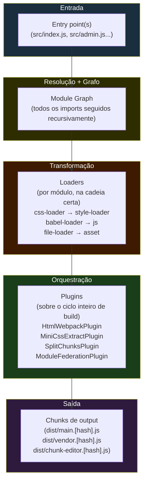
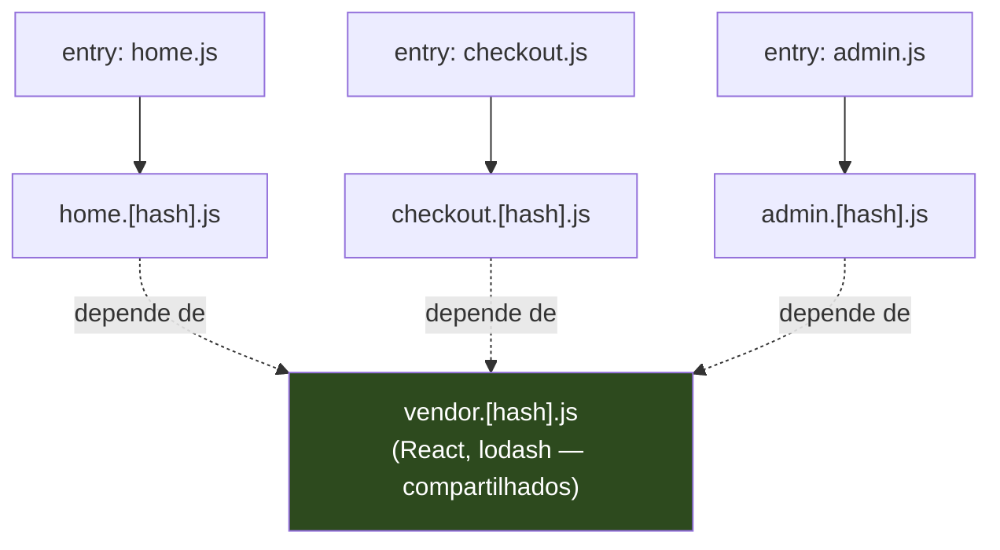
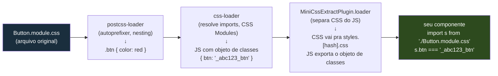
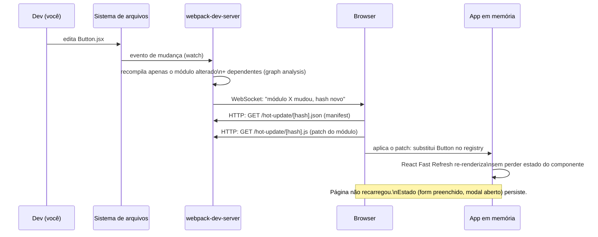
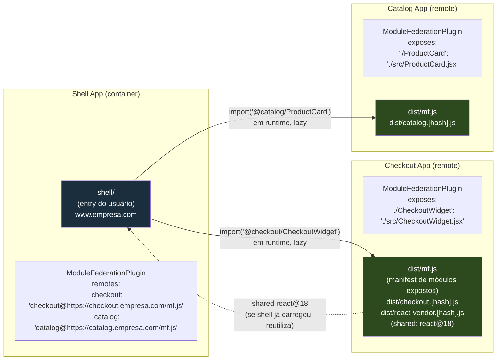
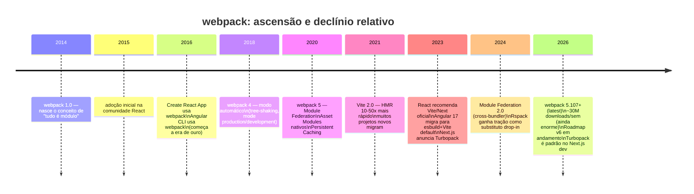
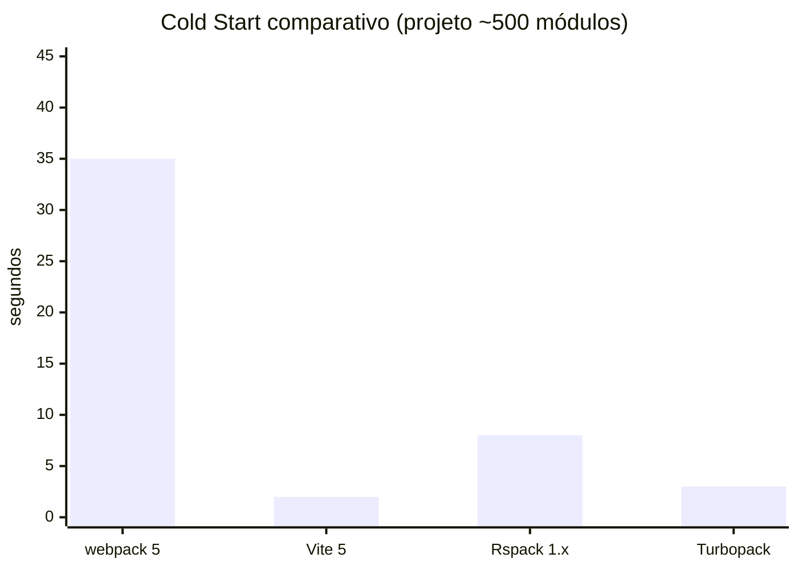

# webpack — o veterano

> [!abstract] TL;DR
> webpack é o bundler que definiu o que significa "configurar build de frontend": entry point, loaders que transformam qualquer coisa em módulo, plugins que orquestram o output, e SplitChunksPlugin que divide o bundle de forma inteligente. Dominou a era 2015–2021 por ser o primeiro a fazer tudo isso junto num único sistema coerente. Em 2026, ainda roda com ~30M+ downloads semanais e é irreplaceable em dois nichos — Apps legados grandes que custam demais pra migrar, e Module Federation (micro-frontends em runtime). Mas para projetos novos, quase ninguém escolhe webpack: o dev server é lento, a config é verbosa, e Vite entrega DX comparável com zero atrito. Saber webpack hoje significa entender o padrão que todos os bundlers modernos replicam ou reagem contra.

---

## O que era o problema em 2014

Para entender o webpack, você precisa se lembrar do que existia antes dele.

Em 2014, o ecosistema frontend tinha dois mundos que não se falavam. No mundo dos task runners (Grunt, Gulp), você escrevia pipelines de transformação de arquivos: concatenar JS, minificar CSS, copiar imagens, rodar sass. Funcionava, mas era frágil — você geria dependências entre tarefas manualmente, e a ordem importava de forma não-óbvia.

No mundo dos module bundlers, havia Browserify: ele resolvia o problema de rodar código CommonJS no browser, mas era rígido. CSS? Você precisava de plugins. Imagens? Outro pipeline. O Browserify resolvia módulos JS e parava por aí.

O que nenhum dos dois resolvia de forma integrada era isso: **tratar absolutamente tudo como módulo**. Em uma aplicação React em 2014, você tinha:

```js
// O que o dev queria escrever
import styles from './Button.module.css';
import logo from './logo.svg';
import Button from './Button.jsx';
```

Três tipos de asset, três ferramentas diferentes, três pipelines separados que você precisava sincronizar. Se o CSS mudasse, o hash do JS mudava errado. Se a imagem mudasse, o manifest ficava desatualizado. Era um pesadelo de orquestração.

webpack resolveu isso com uma tese radical: **tudo é um módulo**. CSS, imagens, fontes, JSON, WASM — qualquer coisa que você `import`a pode ser processada, transformada, e integrada no grafo de dependências. E um único sistema cuida de todo esse grafo, do entry point ao output final.

Essa tese, mais a capacidade de configurar com código JS em vez de YAML, mais o HMR (Hot Module Replacement) que ele popularizou — foi o que fez o webpack dominar de 2015 até o início dos anos 2020.

---

## O modelo mental central: entry → loaders → plugins → output

Antes de ver config, você precisa ter o mapa mental do webpack. Ele tem quatro conceitos centrais, e a confusão entre eles é a maior fonte de frustração para iniciantes.



> [!note] Leitura do diagrama
> O fluxo é linear mas as responsabilidades são distintas. Entry define onde começa o grafo. Loaders transformam módulos individualmente (cada arquivo passa pelos loaders relevantes). Plugins operam no ciclo de build inteiro — não num módulo, mas na compilação. Output define como os chunks resultantes são emitidos.

A diferença entre **loader** e **plugin** é o que mais confunde. Vale gravar:

> [!tip] Loader vs. Plugin — a distinção definitiva
> **Loader** = transforma um arquivo específico. É uma função que recebe o conteúdo de um módulo e retorna o conteúdo transformado. Roda por arquivo, na resolução do módulo.
> **Plugin** = observa (e modifica) o **ciclo de build inteiro**. Tem acesso ao `compiler` e ao `compilation`, pode emitir arquivos extras, modificar o grafo, injetar código no runtime. Roda em hooks do ciclo de build.
>
> Analogia: loader é como um tradutor de idioma (transforma cada arquivo). Plugin é como um diretor de produção (organiza todo o processo).

---

## Entry: onde o grafo começa

O entry point é o módulo raiz a partir do qual o webpack começa a construir o grafo. Você pode ter um, ou múltiplos.

```js
// webpack.config.js — entry simples (SPA)
module.exports = {
  entry: './src/index.js',
};

// entry múltiplo (MPA — multi-page app)
module.exports = {
  entry: {
    home: './src/pages/home.js',
    checkout: './src/pages/checkout.js',
    admin: './src/pages/admin.js',
  },
};
```

Com múltiplos entry points, o webpack gera um chunk principal para cada um, mais chunks compartilhados entre eles (via `SplitChunksPlugin`). Isso é o fundamento de apps multi-página onde cada rota tem seu próprio bundle inicial, mas compartilham vendors.



> [!note] Leitura do diagrama
> Cada entry gera seu próprio chunk inicial. Módulos compartilhados entre múltiplos entry points são extraídos pelo `SplitChunksPlugin` num chunk de vendor separado. O browser carrega `vendor.[hash].js` uma vez e o reutiliza em cache para todas as páginas.

---

## Loaders: quando tudo vira módulo

Loaders são o coração da filosofia "tudo é módulo". Sem loaders, webpack só processa JavaScript. Com loaders, ele processa qualquer coisa que você declarar.

A lógica é simples: quando o webpack encontra um `import` de um tipo de arquivo, ele verifica as regras de `module.rules` e aplica os loaders correspondentes, em ordem (da direita pra esquerda, ou de baixo pra cima).

```js
// webpack.config.js — seção de loaders
module.exports = {
  module: {
    rules: [
      // Regra 1: TypeScript e TSX
      {
        test: /\.(ts|tsx)$/,                 // regex que casa com o arquivo
        exclude: /node_modules/,
        use: [
          { loader: 'babel-loader' },        // 2º: babel aplica presets
          { loader: 'ts-loader' },           // 1º: ts-loader compila TS→JS (ordem: direita→esquerda)
        ],
      },

      // Regra 2: CSS com CSS Modules
      {
        test: /\.module\.css$/,
        use: [
          MiniCssExtractPlugin.loader,       // 3º: extrai CSS para arquivo separado (em prod)
          {
            loader: 'css-loader',            // 2º: resolve @import e url(), aplica CSS Modules
            options: { modules: true },
          },
          'postcss-loader',                  // 1º: PostCSS (autoprefixer, etc.)
        ],
      },

      // Regra 3: Imagens como assets (webpack 5 nativo — não precisa de file-loader)
      {
        test: /\.(png|jpg|gif|svg)$/i,
        type: 'asset/resource',              // emite o arquivo em dist/ e retorna a URL
        generator: {
          filename: 'images/[hash][ext]',
        },
      },

      // Regra 4: Fontes
      {
        test: /\.(woff|woff2|eot|ttf|otf)$/i,
        type: 'asset/resource',
        generator: {
          filename: 'fonts/[hash][ext]',
        },
      },
    ],
  },
};
```

> [!info] webpack 5 e Asset Modules
> webpack 4 exigia `file-loader`, `url-loader` e `raw-loader` para assets. webpack 5 introduziu **Asset Modules** nativos: `asset/resource` (emite arquivo), `asset/inline` (base64 inline), `asset/source` (texto puro), `asset` (decide automaticamente por tamanho). Elimina a necessidade de instalar três loaders para assets básicos.

A cadeia de loaders para um arquivo `.module.css` fica assim:



> [!note] Leitura do diagrama
> Cada loader recebe o output do anterior. A ordem de execução é da direita para a esquerda no array `use` (postcss-loader primeiro, depois css-loader, depois MiniCssExtractPlugin.loader). O CSS sai do pipeline como dois artefatos: um arquivo `.css` separado (para o `<link>` no HTML) e um objeto JS com os nomes de classes mapeados (para usar no componente).

---

## Plugins: orquestração do ciclo de build

Se loaders transformam módulos, plugins observam e controlam o build inteiro. O webpack expõe um sistema de hooks baseado em Tapable (a lib de hooks interna do webpack) em cada fase do ciclo de compilação. Um plugin se registra em algum desses hooks e executa lógica customizada.

Os plugins mais usados em qualquer config de produção:

```js
const HtmlWebpackPlugin = require('html-webpack-plugin');
const MiniCssExtractPlugin = require('mini-css-extract-plugin');
const CssMinimizerPlugin = require('css-minimizer-webpack-plugin');
const { BundleAnalyzerPlugin } = require('webpack-bundle-analyzer');

// webpack.config.js — seção de plugins
plugins: [
  // Gera o index.html injetando automaticamente os <script> e <link> certos
  new HtmlWebpackPlugin({
    template: './public/index.html',
    // Em MPA, uma instância por página:
    // new HtmlWebpackPlugin({ template: '...', filename: 'home.html', chunks: ['home', 'vendor'] }),
  }),

  // Extrai todo CSS dos módulos em arquivos .css separados (vs. inlinear no JS)
  new MiniCssExtractPlugin({
    filename: 'css/[name].[contenthash:8].css',
    chunkFilename: 'css/[id].[contenthash:8].css',
  }),

  // Analisador de bundle — gera visualização treemap do que está dentro do bundle
  // (útil pra debugar por que seu bundle está grande)
  new BundleAnalyzerPlugin({ analyzerMode: 'static', openAnalyzer: false }),
],

// Minimizadores — também são plugins, mas ficam em optimization.minimizer
optimization: {
  minimizer: [
    '...', // mantém o TerserPlugin padrão para JS
    new CssMinimizerPlugin(), // adiciona minificação de CSS
  ],
},
```

> [!tip] O ciclo de build e os hooks do webpack
> O webpack expõe dezenas de hooks no `compiler` (ciclo de build inteiro: `run`, `emit`, `done`) e no `compilation` (ciclo de um build específico: `buildModule`, `seal`, `optimize`). Um plugin pode interceptar qualquer um desses momentos. `HtmlWebpackPlugin`, por exemplo, se registra no hook `emit` para injetar os hashes corretos no HTML depois que os chunks foram finalizados — não antes, porque só então os hashes são conhecidos.

---

## Code splitting com SplitChunksPlugin

`SplitChunksPlugin` é o plugin interno do webpack que divide chunks automaticamente com base em heurísticas. Ele resolve um problema real: se você tem três páginas que importam React e lodash, sem splitting você teria React + lodash duplicados em cada chunk de página.

```js
// webpack.config.js — optimization completo
module.exports = {
  optimization: {
    // Extrai o "runtime" do webpack (o código que carrega outros chunks) em arquivo separado
    runtimeChunk: 'single',

    splitChunks: {
      chunks: 'all',               // 'async' (padrão), 'initial', ou 'all' (recomendado)
      minSize: 20_000,             // só extrai se o módulo tiver > 20KB
      maxAsyncRequests: 30,
      maxInitialRequests: 30,
      cacheGroups: {
        // Vendors: todo código de node_modules vai pra chunk separado
        vendor: {
          test: /[\\/]node_modules[\\/]/,
          name: 'vendor',
          chunks: 'all',
          priority: -10,
        },
        // React especificamente num chunk próprio (muda raramente = cache longo)
        react: {
          test: /[\\/]node_modules[\\/](react|react-dom|react-router)[\\/]/,
          name: 'react-vendor',
          chunks: 'all',
          priority: 20,            // prioridade maior que 'vendor' → esse grupo vence quando ambos casam
        },
        // Código compartilhado entre ≥2 chunks do seu app (não de node_modules)
        common: {
          minChunks: 2,            // módulo deve ser importado por pelo menos 2 chunks
          name: 'common',
          chunks: 'all',
          priority: -20,
          reuseExistingChunk: true,
        },
      },
    },
  },
};
```

O resultado em disco de uma app com essa config:

```
dist/
  runtime.[hash].js          → ~2KB: bootstrap do webpack (carrega outros chunks)
  react-vendor.[hash].js     → React + ReactDOM + React Router (~140KB gzipped)
  vendor.[hash].js           → lodash, date-fns, etc. (muda raramente)
  common.[hash].js           → utilitários compartilhados do seu código
  home.[hash].js             → código específico da home page
  checkout.[hash].js         → código específico do checkout
  chunk-editor.[hash].js     → chunk lazy (import() dinâmico do editor)
```

> [!info] Por que `runtimeChunk: 'single'` importa
> O runtime do webpack é o bootstrap que, em runtime no browser, sabe quais chunks existem e como carregá-los sob demanda. Sem extraí-lo, ele fica embutido em cada chunk inicial — e se qualquer chunk mudar, o hash do runtime muda, invalidando o cache de todos os outros chunks. Extraindo em `runtime.js` separado, só o runtime muda quando a topologia de chunks muda.

---

## Dev server e HMR — o legado mais importante

webpack-dev-server foi o primeiro dev server com HMR (Hot Module Replacement) que funcionava de verdade em um projeto JS de escala. O HMR é a técnica que permite que uma mudança num arquivo seja "injetada" no browser **sem recarregar a página inteira**, preservando o estado da aplicação.



> [!note] Leitura do diagrama
> O ciclo HMR tem três fases: detecção (webpack-dev-server via watch no FS), propagação (WebSocket do server para o browser), e aplicação (o browser baixa só o patch do módulo alterado, não o bundle inteiro). O React Fast Refresh — integrado via `babel-plugin-react-refresh` — garante que componentes sejam substituídos sem perder estado local.

O HMR do webpack foi o padrão da indústria por anos. Vite e outros ferramentas modernas implementam HMR também, mas com uma arquitetura diferente: em vez de recompilar o módulo alterado em webpack e enviar o patch, o Vite serve o módulo como ESM nativo e instrui o browser a reimportá-lo diretamente. O resultado em HMR speed é favorável ao Vite (50–500ms vs alguns segundos no webpack em projetos grandes), mas o conceito de "injetar só o que mudou sem recarregar" nasceu no ecosystem do webpack.

---

## Um webpack.config.js real e comentado

Este é um config realista para um projeto React + TypeScript em produção, com comentários explicando cada decisão:

```js
// webpack.config.js
const path = require('path');
const HtmlWebpackPlugin = require('html-webpack-plugin');
const MiniCssExtractPlugin = require('mini-css-extract-plugin');
const CssMinimizerPlugin = require('css-minimizer-webpack-plugin');

const isDev = process.env.NODE_ENV !== 'production';

module.exports = {
  // ──────────────────────────────────────────────────────────────────
  // MODE: ativa otimizações automáticas. 'production' liga tree-shaking,
  // minificação com Terser, e define process.env.NODE_ENV='production'.
  // ──────────────────────────────────────────────────────────────────
  mode: isDev ? 'development' : 'production',

  // ──────────────────────────────────────────────────────────────────
  // ENTRY: ponto de partida do grafo de módulos.
  // ──────────────────────────────────────────────────────────────────
  entry: './src/index.tsx',

  // ──────────────────────────────────────────────────────────────────
  // OUTPUT: como os chunks são emitidos em disco.
  // contenthash garante que só o chunk que mudou tem hash novo.
  // ──────────────────────────────────────────────────────────────────
  output: {
    path: path.resolve(__dirname, 'dist'),
    filename: isDev ? '[name].js' : '[name].[contenthash:8].js',
    chunkFilename: isDev ? '[id].chunk.js' : '[id].[contenthash:8].chunk.js',
    clean: true,          // webpack 5: limpa dist/ antes de cada build (substitui CleanWebpackPlugin)
    publicPath: '/',      // URL base para os assets (importante para routing em SPA)
  },

  // ──────────────────────────────────────────────────────────────────
  // RESOLVE: como o webpack encontra módulos ao seguir imports.
  // ──────────────────────────────────────────────────────────────────
  resolve: {
    extensions: ['.tsx', '.ts', '.js', '.jsx'],  // testa essas extensões na ordem ao importar sem extensão
    alias: {
      '@': path.resolve(__dirname, 'src'),        // import '@/components/Button' em vez de '../../../components/Button'
    },
  },

  // ──────────────────────────────────────────────────────────────────
  // LOADERS: transformações por tipo de arquivo.
  // ──────────────────────────────────────────────────────────────────
  module: {
    rules: [
      // TypeScript e TSX via SWC (mais rápido que ts-loader + babel-loader)
      {
        test: /\.(ts|tsx)$/,
        exclude: /node_modules/,
        use: {
          loader: 'swc-loader',     // usa SWC (Rust) em vez de Babel — 5-20x mais rápido
          options: {
            jsc: {
              parser: { syntax: 'typescript', tsx: true },
              transform: { react: { runtime: 'automatic' } },
            },
          },
        },
      },

      // CSS Global (não-modularizado)
      {
        test: /\.css$/,
        exclude: /\.module\.css$/,
        use: [
          isDev ? 'style-loader' : MiniCssExtractPlugin.loader,
          // Em dev, style-loader injeta CSS via <style> (mais rápido, suporta HMR de CSS).
          // Em prod, MiniCssExtractPlugin extrai para .css separado (melhor cache, sem FOUC).
          'css-loader',
          'postcss-loader',
        ],
      },

      // CSS Modules (arquivos *.module.css)
      {
        test: /\.module\.css$/,
        use: [
          isDev ? 'style-loader' : MiniCssExtractPlugin.loader,
          {
            loader: 'css-loader',
            options: {
              modules: {
                localIdentName: isDev
                  ? '[local]__[hash:base64:5]'   // dev: legível ([name]__[hash])
                  : '[hash:base64:8]',            // prod: só hash (menor, não expõe nomes de classe)
              },
            },
          },
          'postcss-loader',
        ],
      },

      // Assets (webpack 5 nativo — sem file-loader)
      {
        test: /\.(png|jpg|gif|webp|avif)$/i,
        type: 'asset',               // 'asset': abaixo de 8KB vira inline base64; acima, emite arquivo
        parser: { dataUrlCondition: { maxSize: 8 * 1024 } },
        generator: { filename: 'images/[hash:8][ext]' },
      },
      {
        test: /\.svg$/i,
        issuer: /\.[jt]sx?$/,
        use: ['@svgr/webpack'],      // importar SVG como componente React: import Logo from './logo.svg'
      },
    ],
  },

  // ──────────────────────────────────────────────────────────────────
  // PLUGINS: orquestração do build inteiro.
  // ──────────────────────────────────────────────────────────────────
  plugins: [
    // Gera index.html com os <script> e <link> corretos injetados
    new HtmlWebpackPlugin({
      template: './public/index.html',
      minify: !isDev,
    }),

    // Em prod: extrai CSS em arquivos separados
    ...(isDev ? [] : [
      new MiniCssExtractPlugin({
        filename: 'css/[name].[contenthash:8].css',
        chunkFilename: 'css/[id].[contenthash:8].css',
      }),
    ]),
  ],

  // ──────────────────────────────────────────────────────────────────
  // OPTIMIZATION: code splitting e minificação.
  // ──────────────────────────────────────────────────────────────────
  optimization: {
    runtimeChunk: 'single',          // extrai o bootstrap do webpack em arquivo separado
    splitChunks: {
      chunks: 'all',
      cacheGroups: {
        // React e libs de UI em chunk separado (muda raramente)
        react: {
          test: /[\\/]node_modules[\\/](react|react-dom|react-router-dom|scheduler)[\\/]/,
          name: 'react-vendor',
          chunks: 'all',
          priority: 20,
        },
        // Todo o resto de node_modules
        vendor: {
          test: /[\\/]node_modules[\\/]/,
          name: 'vendor',
          chunks: 'all',
          priority: -10,
        },
      },
    },
    minimizer: [
      '...', // mantém TerserPlugin (minificação de JS — ativado por mode: 'production')
      new CssMinimizerPlugin(),
    ],
  },

  // ──────────────────────────────────────────────────────────────────
  // DEV SERVER: config do webpack-dev-server.
  // ──────────────────────────────────────────────────────────────────
  devServer: {
    port: 3000,
    hot: true,                         // HMR ativado
    historyApiFallback: true,          // SPA: serve index.html para qualquer rota (client-side routing)
    open: true,
    static: { directory: path.join(__dirname, 'public') },
    // proxy: útil para evitar CORS em dev (redireciona /api para o backend)
    proxy: [
      { context: ['/api'], target: 'http://localhost:8080', changeOrigin: true },
    ],
  },

  // SOURCE MAPS: modo rápido em dev, source-map completo em prod
  devtool: isDev ? 'eval-cheap-module-source-map' : 'source-map',
};
```

> [!warning] A armadilha do config crescente
> Este config já tem ~100 linhas e ainda não inclui SVG, workers, internacionalização, análise de bundle, ou Module Federation. Um config de produção real em codebase grande chega facilmente a 300-500 linhas, frequentemente dividido em `webpack.common.js`, `webpack.dev.js` e `webpack.prod.js` com `webpack-merge`. Essa é exatamente a complexidade que Vite e outros ferramentas eliminaram com defaults sensatos e zero-config.

---

## Module Federation: o diferencial que sobrevive

Module Federation é a feature do webpack 5 (2020) que justifica continuar estudando webpack mesmo que você nunca escreva um `webpack.config.js` do zero. É genuinamente diferente de tudo que existia antes.

**O problema que resolve:** micro-frontends em runtime. Em vez de uma empresa ter um único app monolítico frontend, ela tem múltiplos times cada um dono de sua fatia da UI — time de checkout, time de catálogo, time de perfil. O problema clássico é: como você junta isso no browser sem que cada time dependa do build do outro?

A solução pré-Module Federation era iframe (funciona mas é preso) ou build em monorepo compartilhado (funciona mas cria acoplamento de deploy). Module Federation resolve de forma diferente: cada app é buildado e deployado de forma independente, e em runtime eles **carregam código uns dos outros** via URL.



> [!note] Leitura do diagrama
> O shell não tem o código de checkout ou catálogo em seu bundle. Em runtime, quando o usuário navega para o checkout, o browser baixa `checkout.empresa.com/mf.js` (o manifest de módulos expostos pelo time de checkout), descobre quais chunks contêm o `CheckoutWidget`, e os carrega. Se React já foi carregado pelo shell, o remote o reutiliza (shared deps) em vez de carregar de novo.

O config de Module Federation fica assim:

```js
// webpack.config.js do Checkout App (remote)
const { ModuleFederationPlugin } = require('webpack').container;

plugins: [
  new ModuleFederationPlugin({
    name: 'checkout',             // nome único deste remote
    filename: 'mf.js',           // manifest que o host vai buscar
    exposes: {
      './CheckoutWidget': './src/CheckoutWidget.jsx',
      './CheckoutPage': './src/pages/CheckoutPage.jsx',
    },
    shared: {
      react: { singleton: true, requiredVersion: '^18.0.0' },
      'react-dom': { singleton: true, requiredVersion: '^18.0.0' },
      // singleton: true garante que só uma instância de React rode no browser,
      // mesmo se shell e remote trouxerem versões diferentes (desde que compatíveis)
    },
  }),
],

// webpack.config.js do Shell App (host)
plugins: [
  new ModuleFederationPlugin({
    name: 'shell',
    remotes: {
      checkout: 'checkout@https://checkout.empresa.com/mf.js',
      catalog: 'catalog@https://catalog.empresa.com/mf.js',
    },
    shared: {
      react: { singleton: true },
      'react-dom': { singleton: true },
    },
  }),
],
```

No código React do shell:

```jsx
// src/pages/CheckoutRoute.jsx
import React, { lazy, Suspense } from 'react';

// import lazy de remote — carregado em runtime, não em build time
const CheckoutWidget = lazy(() => import('checkout/CheckoutWidget'));

export function CheckoutRoute() {
  return (
    <Suspense fallback={<div>Carregando checkout...</div>}>
      <CheckoutWidget />
    </Suspense>
  );
}
```

### Module Federation 2.0 — o que mudou

Em 2024, Module Federation ganhou versão 2.0, que chegou a estável em abril de 2026, e desacoplou o runtime do webpack completamente:

- **Cross-bundler**: MF 2.0 funciona com webpack, Rspack, Rollup, Rolldown, Rsbuild e Vite. Times diferentes podem usar bundlers diferentes e ainda trocar módulos em runtime.
- **TypeScript nativo**: tipos dos remotes são compartilhados automaticamente — você consome `import('checkout/CheckoutWidget')` com type-safety, sem manter pacotes de tipos manualmente.
- **Node.js support**: módulos federados podem ser consumidos em SSR e em microserviços Node — não só no browser.
- **Dev tools**: Chrome DevTools extension para inspecionar quais remotes foram carregados e com quais versões.

> [!important] Module Federation ainda depende de webpack?
> Para MF 1.x: sim, todos os apps envolvidos precisam ser buildados com webpack 5. Para MF 2.0: não necessariamente — o runtime foi extraído em `@module-federation/runtime` (pacote independente), e plugins para Vite, Rollup e Rspack estão disponíveis. A história ainda está evoluindo: suporte a Vite é considerado experimental em alguns aspectos (2026), mas a tendência é consolidação cross-bundler.

---

## Por que webpack dominou 2015–2021

A dominância do webpack não foi acidente. Ele chegou com um pacote de features que nenhuma ferramenta tinha combinado antes:

**1. Tudo em um lugar.** Antes do webpack, você precisava de Browserify para modules, Grunt/Gulp para tasks, outro plugin para CSS, outro para imagens. webpack unificou em um config (por mais verboso que seja).

**2. Code splitting real com dynamic import.** O `import()` dinâmico + code splitting automático foi revolucionário para SPAs. Sem isso, bundlar uma app grande significava jogar tudo numa única mega-query de 2MB.

**3. Dev server com HMR.** Hot Module Replacement mudou o loop de desenvolvimento. Editar um componente e ver a mudança em 100ms sem perder o estado — algo que Grunt e Gulp simplesmente não ofereciam.

**4. Ecossistema.** O npm logo foi dominado por loaders e plugins para webpack. Cada lib JS de UI tinha seu loader correspondente. Essa densidade de ecossistema criou lock-in produtivo.

**5. Adotado pelos frameworks.** Create React App (2016) e Angular CLI (2016) usavam webpack internamente. Quem usava React ou Angular estava usando webpack, mesmo sem saber. Isso garantiu dezenas de milhões de instalações.



---

## Por que webpack perde espaço

86% dos devs ainda usam webpack (State of JS 2025), mas apenas 14% dizem que gostam. Esse gap entre uso e satisfação é raro em ferramentas maduras — e sinaliza uma situação de lock-in, não de preferência genuína.

Os problemas são estruturais, não de implementação:

### 1. Velocidade de desenvolvimento

webpack processa tudo através de um grafo de módulos bundlado antes de servir. Em projetos grandes (500+ módulos), o cold start do dev server pode chegar a 30-60 segundos. HMR também degrada: quando o grafo fica grande, o webpack precisa reanalisar dependências do módulo alterado antes de enviar o patch.

Vite resolve de forma diferente: em dev, não faz bundle. Serve módulos como ESM nativo, o browser faz as requisições individualmente. Cold start é quase instantâneo porque não tem bundling. HMR é sempre O(1) — só o módulo alterado é retransformado, independente do tamanho do projeto.



> [!warning] Benchmarks são indicativos
> Os tempos acima são representativos de reportes da comunidade em 2025-2026 (projetos React médio-grandes). Variam muito com hardware, tamanho real do projeto, e configuração. O ponto qualitativo — webpack é dramaticamente mais lento em dev que as alternativas — é consistente.

### 2. Complexidade de configuração

A flexibilidade do webpack tem um preço: não há defaults para apps modernas. Você precisa configurar explicitamente loaders para TypeScript, JSX, CSS, assets; plugins para HTML, extração de CSS, análise; optimization para splitting inteligente. O config cresce.

Vite tem defaults para TypeScript + JSX + CSS + assets **sem instalar nenhum pacote extra**. Você começa com um arquivo de ~5 linhas.

### 3. Arquitetura limitada pelo JavaScript

O core do webpack é JavaScript single-threaded. Tree-shaking, resolução de módulos, serialização de cache — tudo corre no mesmo processo V8. Ferramentas como esbuild (Go), Turbopack (Rust) e Rspack (Rust) exploram paralelismo real e tipagem estática de linguagem para atingir 5-100x mais velocidade em operações de I/O e CPU.

O webpack até pode paralelizar alguns loaders via `thread-loader`, mas é uma solução de contorno — o gargalo é arquitetural.

---

## Onde webpack ainda é a resposta certa

Honestidade obriga: existem contextos onde webpack não é legado que você quer migrar, mas a ferramenta certa.

### Apps grandes legados

Um app React com 800K linhas de código, 15 anos de loaders customizados, plugins internos, configurações para dezenas de features flags, e uma equipe de 200 devs familiarizados com o ecossistema webpack — migrar para Vite ou Turbopack tem custo real e risco real. O webpack nesses casos não é escolha de ingenuidade; é decisão de engenharia: o ROI da migração não compensa até que a dor de produtividade exceda o custo de transição.

### Module Federation (micro-frontends em runtime)

Se você precisa de micro-frontends com deploys independentes e compartilhamento de deps em runtime — e especialmente se você já tem times em webpack — Module Federation ainda é o caminho mais maduro. MF 2.0 está expandindo para cross-bundler, mas em 2026 o suporte mais completo e estável ainda é webpack + webpack.

### Next.js (em produção)

Turbopack é o default de dev no Next.js 15/16, mas o **build de produção** do Next.js ainda usa webpack por padrão. Turbopack para prod está em beta em 2026. Se você está em Next.js hoje, está usando webpack para seus builds de CI/CD, querendo ou não.

### Angular (projetos legados)

Angular 17+ usa esbuild + Vite como default para novos projetos. Mas projetos Angular pré-17 usam webpack, e a migração não é automática. Muitos apps Angular corporativos vão rodar em webpack-based browser builder por anos ainda.

> [!success] A regra de ouro
> Escolha webpack quando: (1) você tem uma codebase existente e grande demais para migrar sem ROI claro, (2) você precisa de Module Federation 1.x especificamente, ou (3) você está em Next.js e ainda não migrou o build de produção para Turbopack. Para qualquer projeto novo em 2026: use Vite.

---

## Rspack: webpack sem a lentidão

Vale mencionar aqui (com fronteira clara para a [[15 - Turbopack, Rspack e a corrida Rust-Go]]): Rspack é uma reimplementação de webpack em Rust, criada pela ByteDance, com compatibilidade quase total com a API do webpack.

O que isso significa na prática: você pode trocar `webpack` por `rspack` no `package.json` e em `webpack.config.js` trocar `require('webpack')` por `require('@rspack/core')` — e a maioria dos projetos funciona sem mais mudanças, com cold start 5-10x mais rápido.

ByteDance migrou 100.000+ módulos internos de webpack para Rspack e mede melhorias de 7-10x em tempo de build. Para times presos no webpack que não podem (ou não querem) mudar paradigma (Vite é diferente o suficiente para requerer ajustes), Rspack é o caminho pragmático.

```
# Migração de webpack para Rspack — minimal
npm remove webpack webpack-cli webpack-dev-server
npm add @rspack/core @rspack/cli

# webpack.config.js — mudança mínima
- const webpack = require('webpack');
+ const rspack = require('@rspack/core');
```

Rspack em profundidade fica na [[15 - Turbopack, Rspack e a corrida Rust-Go]].

---

## Como explicar em inglês

**webpack** is a module bundler for JavaScript applications. Its core idea is that *everything is a module*: JavaScript, CSS, images, fonts — anything you `import` can be processed by the bundler through a unified dependency graph starting at one or more **entry points**.

The build pipeline has four main concepts. **Loaders** transform individual files — `babel-loader` transpiles JSX, `css-loader` resolves CSS imports, `ts-loader` (or `swc-loader`) handles TypeScript. Each file matching a `rule` passes through the configured loader chain, right to left. **Plugins** operate on the entire compilation lifecycle — they can generate HTML files (`HtmlWebpackPlugin`), extract CSS into separate files (`MiniCssExtractPlugin`), or split the bundle intelligently (`SplitChunksPlugin`). **Output** defines how the generated chunks land on disk, with content hashes enabling long-lived browser caching.

webpack popularized **Hot Module Replacement (HMR)**: when you edit a file, only that module's patch is sent to the browser over WebSocket, without a full page reload — preserving application state during development.

**Module Federation** (webpack 5, 2020; v2.0 stable 2026) is webpack's most unique contribution: it allows independently built and deployed applications to share code *at runtime*, loading remote modules from a URL without a shared build step. This is the foundation of micro-frontend architectures where separate teams own separate parts of the UI.

webpack dominated frontend tooling from 2015 to ~2021, but its JavaScript architecture becomes a bottleneck at scale — cold starts can take 30+ seconds in large apps. Tools like Vite (native ESM in dev, no bundling) and Rspack (webpack-compatible Rust rewrite) have largely replaced webpack for new projects, while webpack persists in large legacy codebases, Next.js production builds, and Module Federation deployments.

### Vocabulário-chave

| Português | English |
|---|---|
| ponto de entrada | entry point |
| saída | output |
| transformador | loader |
| plugin | plugin |
| divisão de bundle | code splitting / chunk splitting |
| fragmento | chunk |
| fragmento inicial | initial chunk |
| fragmento assíncrono | async chunk / lazy chunk |
| substituição de módulo a quente | Hot Module Replacement (HMR) |
| federação de módulos | Module Federation |
| remoto | remote (the app exposing modules) |
| hospedeiro / shell | host / shell (the app consuming remotes) |
| deps compartilhadas | shared dependencies / singletons |
| hash de conteúdo | content hash |
| servidor de desenvolvimento | dev server |
| config verboso | verbose config / boilerplate-heavy config |
| bundler compatível | drop-in compatible bundler |
| micro-frontend | micro-frontend |

---

## Armadilhas comuns

> [!bug] "O HMR não está funcionando — a página recarrega inteira"
> O HMR requer que o módulo (ou algum módulo na cadeia de acima) implemente a interface `module.hot.accept()`. Para React, isso é feito automaticamente pelo `ReactRefreshWebpackPlugin` + `babel-plugin-react-refresh`. Sem esse setup, o webpack detecta a mudança mas não sabe como "aplicar" o módulo novo sem recarregar, então desce para full reload. Solução: adicionar `ReactRefreshWebpackPlugin` ao config e `@pmmmwh/react-refresh-webpack-plugin` como dependência.

> [!bug] "Meu bundle tem React duplicado"
> Você tem dois pacotes no `node_modules` resolvendo para versões diferentes de React (ou dois paths físicos diferentes, como em workspaces sem hoisting correto). `SplitChunksPlugin` não deduplica se as instâncias são tecnicamente diferentes. Solução: `resolve.alias: { react: path.resolve('./node_modules/react') }` para forçar uma única instância. Em Module Federation: garanta `shared: { react: { singleton: true } }`.

> [!bug] "Cada build gera hashes diferentes mesmo sem mudar o código"
> O webpack inclui metadados (como IDs de módulo e IDs de chunk) nos bundles. Se a ordem de descoberta de módulos muda entre builds, os IDs mudam, os hashes mudam. Solução: `optimization.moduleIds: 'deterministic'` e `optimization.chunkIds: 'deterministic'` (padrão no webpack 5 em mode production, mas às vezes precisa ser explícito).

> [!bug] "Module Federation: remote carrega mas dá erro de versão de React"
> Sintoma: `Error: Minified React error #321` ou conflito de contexto de React. Causa: shell e remote carregaram duas instâncias de React (versões diferentes ou não-singleton). Solução: `shared: { react: { singleton: true, requiredVersion: '^18.0.0' }, 'react-dom': { singleton: true } }` em **ambos** os configs (host e remote). O `singleton: true` diz ao MF runtime para nunca carregar duas instâncias — ele usa a primeira que foi carregada e avisa se houver incompatibilidade de versão.

> [!bug] "Build de prod funciona, dev quebra com imports de CSS"
> Em prod com `MiniCssExtractPlugin.loader` + `css-loader`, o CSS é extraído para arquivo separado. Em dev com `style-loader`, o CSS é injetado como `<style>`. O comportamento de CSS Modules (nomes de classes gerados) é o mesmo, mas se você tem side effects globais que dependem de ordem de carregamento de CSS, pode diferir. Sempre teste `npm run build && serve dist` antes de assumir que prod está ok.

> [!bug] "webpack está lento — cold start de 40 segundos"
> Para webpack legado que não pode migrar, há algumas alavancas: (1) `cache: { type: 'filesystem' }` (webpack 5) — builds seguintes usam cache persistente em disco, caindo de 40s para 5-8s; (2) `swc-loader` em vez de `babel-loader` + `ts-loader` — SWC (Rust) é 5-20x mais rápido que Babel para transpilação; (3) `thread-loader` antes de loaders pesados — paraleliza em worker threads; (4) excluir `node_modules` em todos os loaders com `exclude: /node_modules/`. Se nada disso for suficiente, considere Rspack (nota [[15 - Turbopack, Rspack e a corrida Rust-Go]]).

---

## Veja também

- [[07 - O grafo de módulos e o que é bundling]] — o modelo mental de entry point, grafo de dependências, e o que um bundler faz antes de chegar no webpack especificamente
- [[13 - Vite a fundo]] — a alternativa moderna ao webpack para projetos novos: ESM nativo em dev, Rollup em prod, zero-config para TypeScript/JSX/CSS
- [[15 - Turbopack, Rspack e a corrida Rust-Go]] — Rspack (drop-in replacement do webpack em Rust) e Turbopack (substituto do webpack no Next.js)
- [[17 - Otimização de bundle]] — tree-shaking a fundo, estratégias de code splitting, análise de bundle, e o que impede o webpack (e outros bundlers) de eliminar código morto

---

> [!info] Lastro
> 1. webpack — Documentação oficial, Concepts (entry, output, loaders, plugins, mode). Disponível em: https://webpack.js.org/concepts/
> 2. webpack — "Under The Hood" (documentação oficial). Descreve `ModuleGraph`, `ChunkGraph`, a hierarquia entry → chunk group → chunk → asset, e os tipos initial vs. non-initial. Disponível em: https://webpack.js.org/concepts/under-the-hood/
> 3. webpack — "Roadmap 2026" (blog oficial, fev. 2026). Native CSS support, universal target, TypeScript transpilation builtin, path to v6. Disponível em: https://webpack.js.org/blog/2026-02-04-roadmap-2026/
> 4. InfoQ — "Module Federation 2.0 Reaches Stable Release with Wider Support outside of Webpack" (abr. 2026). Cross-bundler support (webpack, Rspack, Vite, Rolldown), TypeScript type sharing, Node.js runtime. Disponível em: https://www.infoq.com/news/2026/04/module-federation-2-stable/
> 5. InfoQ — "Webpack Publishes 2026 Roadmap with Native CSS Support, Universal Target, and Path to Version 6" (mar. 2026). Disponível em: https://www.infoq.com/news/2026/03/webpack-2026-roadmap/
> 6. PkgPulse — "Rspack vs Webpack in 2026: The Rust-Powered Drop-In Replacement" (2026). ByteDance migração de 100K+ módulos, benchmark comparativo. Disponível em: https://www.pkgpulse.com/blog/rspack-vs-webpack-2026
> 7. Tech Insider — "Vite vs Webpack 2026: 24x HMR Speed and 115M Downloads" (2026). Disponível em: https://tech-insider.org/vite-vs-webpack-2026-2/
> 8. DEV Community — "Native Federation vs Webpack Module Federation — Which Should You Choose in 2026?" (2026). Disponível em: https://dev.to/mhmoud_ashour_5547515422e/native-federation-vs-webpack-module-federation-which-should-you-choose-in-2026-109m
> 9. FrontScope — "Vite vs Webpack vs Rspack: The Build Tool Showdown (2026)" (2026). Disponível em: https://frontscope.dev/blog/vite-vs-webpack-vs-rspack-2026/
