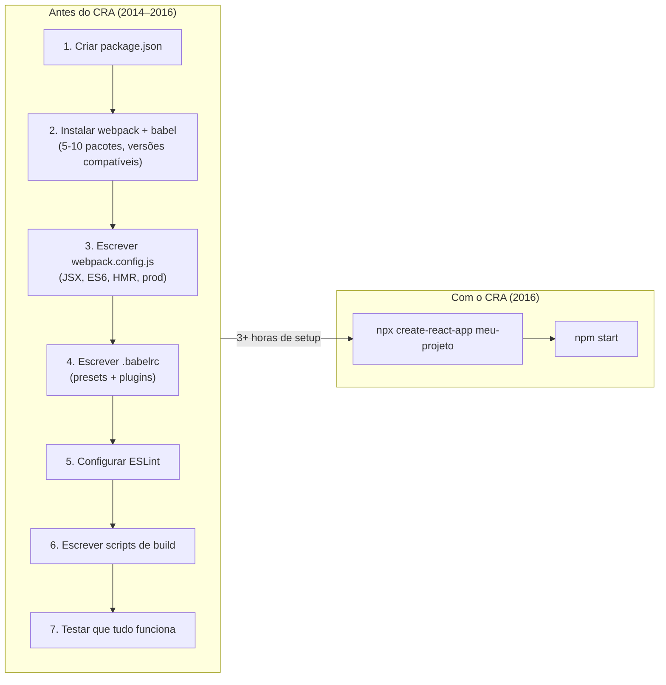
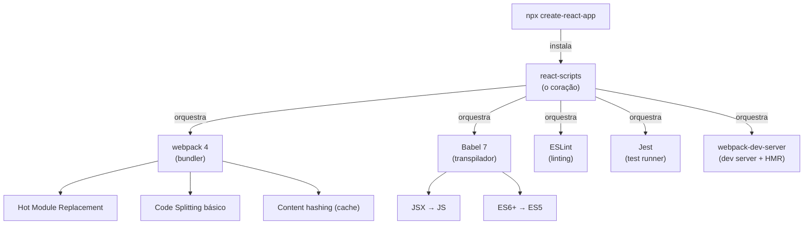
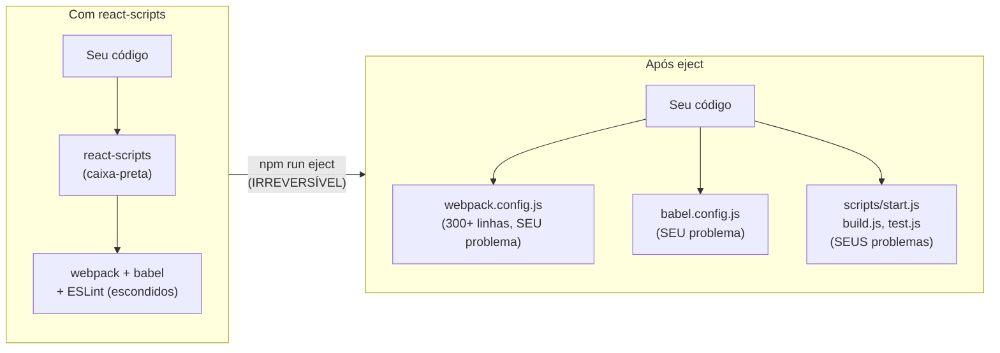
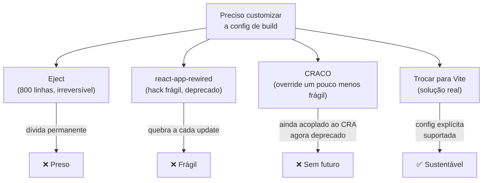
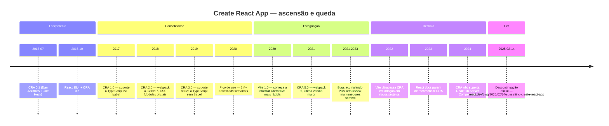
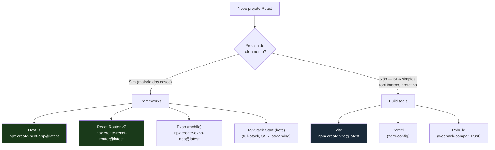
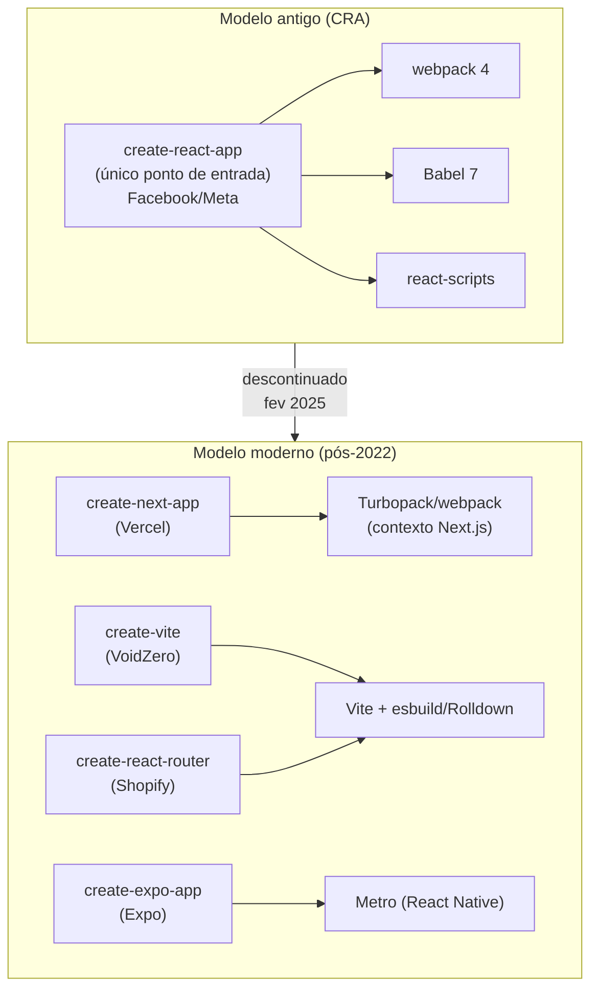
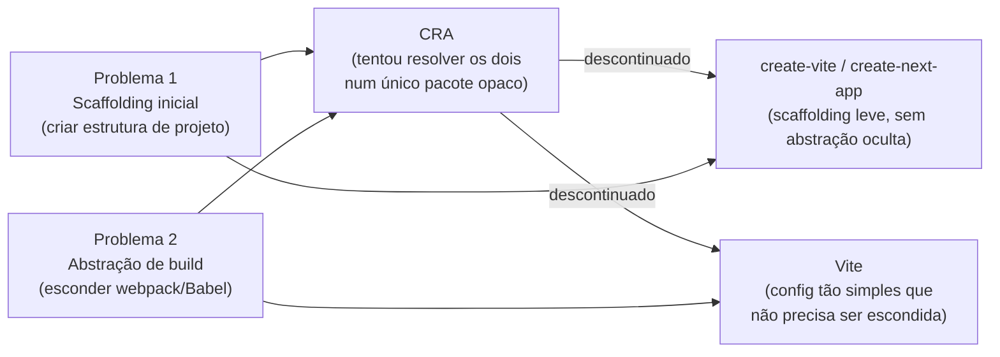

# Create React App e a era dos scaffolders

> [!abstract] TL;DR
> O Create React App nasceu em 2016 para resolver um problema real: configurar webpack + Babel + ESLint do zero era doloroso demais para quem queria só aprender React. Por cinco anos dominou como a porta de entrada do ecossistema. Em 14 de fevereiro de 2025, o time do React o aposentou oficialmente — deprecado para novos projetos, em modo de manutenção. O motivo não foi um bug ou falha pontual: foi uma incompatibilidade estrutural com o que React passou a exigir (SSR, Suspense, Server Components, rotas, data fetching integrado). O sucessor não é uma ferramenta só — é uma escolha: framework completo (`create-next-app`, `create-react-router`) se você precisa de roteamento; Vite via `npm create vite@latest` se você precisa de SPA limpa com controle total. A lição arquitetural: scaffolders opinativos de build morrem quando o ecossistema em volta evolui mais rápido do que eles conseguem absorver.

---

## Um problema específico de 2016

Para entender por que o CRA existiu, você precisa se lembrar de como era iniciar um projeto React em 2016.

Não havia `npm create`. Não havia `vite`. O caminho padrão era criar um `package.json` manualmente, instalar `webpack`, `webpack-dev-server`, `babel-core`, `babel-loader`, `babel-preset-react`, `babel-preset-es2015`, `react`, `react-dom` — e então escrever um `webpack.config.js` que entendia JSX, transpilava ES6, servia com HMR e otimizava para produção. Esse setup envolvia pelo menos cinco a dez pacotes com versões que precisavam ser compatíveis entre si, e nenhuma ferramenta verificava isso por você.

O resultado era uma proliferação de boilerplates: `react-boilerplate`, `react-starter-kit`, `react-redux-starter-kit`, dezenas de repos no GitHub que as pessoas clonavam e adaptavam. Cada um com suas próprias opiniões, versões, estruturas. Começar um projeto novo exigia escolher entre boilerplates desconhecidos ou investir horas configurando do zero.

Em julho de 2016, o time do React — especificamente Dan Abramov e Joe Heck — publicou o Create React App. A proposta era direta:

```bash
npx create-react-app meu-projeto
cd meu-projeto
npm start
```

Três comandos. Sem configuração. Uma aplicação React rodando com HMR no browser.



Internamente, o CRA escondia toda a configuração num pacote chamado `react-scripts`. Era esse pacote que continha o `webpack.config.js`, o `.babelrc`, as regras do ESLint, os scripts de build. A sua aplicação não tinha nada disso — só o código que você escrevia. A complexidade existia, mas estava atrás de um véu.

---

## A anatomia do CRA: o que ele fazia de fato

Entender a estrutura interna do CRA é importante porque ela é a fonte tanto de seu poder quanto de seus limites.



Um projeto CRA recém-criado tinha esta estrutura mínima:

```
meu-projeto/
├── public/
│   └── index.html          ← shell HTML estático
├── src/
│   ├── App.js
│   ├── App.css
│   ├── App.test.js
│   └── index.js            ← entry point
├── package.json
└── .gitignore
```

Repare no que **não** estava ali: nenhum `webpack.config.js`, nenhum `.babelrc`, nenhuma configuração de ESLint. O `package.json` tinha uma dependência só: `react-scripts`. Os scripts disponíveis eram simples:

```json
{
  "scripts": {
    "start": "react-scripts start",
    "build": "react-scripts build",
    "test":  "react-scripts test",
    "eject": "react-scripts eject"
  }
}
```

`start` iniciava o dev server em `localhost:3000`. `build` gerava um bundle otimizado em `build/`. `test` rodava Jest em modo watch. E `eject` — esse último comando merece uma seção própria.

---

## O eject: a dívida escondida

O `eject` era a escotilha de emergência do CRA. Ao rodar `npm run eject`, o `react-scripts` copiava toda a configuração interna — o webpack.config.js com centenas de linhas, todos os presets do Babel, todas as regras do ESLint — diretamente para a pasta do seu projeto. A partir daí, você tinha controle total. E o `react-scripts` deixava de existir como abstração.

```bash
# Antes do eject:
package.json tem 1 dependência: react-scripts

# Depois do eject:
package.json tem 40+ dependências
webpack.config.js com ~800 linhas aparece na raiz   ← você é dono disso para sempre
.babelrc aparece
babel.config.js aparece
config/ com múltiplos arquivos aparece
scripts/ com start.js, build.js, test.js aparece
```

O eject era **irreversível**. Uma vez ejetado, você estava responsável por manter toda aquela configuração — e quando `react-scripts` lançava uma nova versão com melhorias, você não recebia automaticamente. Você tinha que fazer o merge à mão.

> [!quote] O custo real
> "By ejecting, you become solely responsible for maintaining 800 lines of highly complex build configuration forever, just because you wanted to add a single path alias." — [sebhastian.com](https://sebhastian.com/create-react-app-eject/)



Esse era o sinal de que havia algo estruturalmente errado. Quando você precisava de controle que o CRA não expunha — adicionar um plugin de webpack, mudar uma opção do Babel, integrar com um bundler diferente — suas opções eram três, todas imperfeitas:

1. **Ejetar** — assumir a dívida de 800 linhas de webpack para sempre.
2. **react-app-rewired ou CRACO** — ferramentas de terceiros que "hackeavam" o `react-scripts` por fora, sobrescrevendo a configuração antes de ela ser usada. Funcionavam enquanto o CRA não mudava internamente; quebravam sem aviso a cada atualização major.
3. **Trocar de ferramenta** — a opção que eventualmente todo mundo tomou.



**O que eram react-app-rewired e CRACO?**

- **`react-app-rewired`** (Tim Arney, 2017): modificava o webpack config do CRA interceptando as chamadas do `react-scripts`. A ideia era criar um arquivo `config-overrides.js` na raiz onde você podia retornar uma versão alterada da configuração. Em manutenção mínima desde CRA 2; oficialmente aposentado com a deprecação do CRA.

O mecanismo era cirúrgico: você trocava `react-scripts` por `react-app-rewired` nos scripts do `package.json`. Em vez de chamar o webpack diretamente, o rewired importava o arquivo de configuração webpack que estava *dentro* de `node_modules/react-scripts/config/webpack.config.js`, passava esse objeto pela função `override` do seu `config-overrides.js`, e só então entregava a versão modificada ao webpack compiler:

```js
// config-overrides.js (seu arquivo)
module.exports = function override(config, env) {
  // config é o webpack.config.js interno do react-scripts
  // modifique e retorne
  return config;
}
```

O ponto exato de fragilidade: o caminho e a estrutura interna do `webpack.config.js` dentro do `node_modules/react-scripts` mudavam a cada versão major do CRA. O rewired dependia de importar esse arquivo diretamente — quando o CRA reestruturava seus internos, a interceptação quebrava silenciosamente ou gerava erros de runtime, sem aviso antecipado.

- **CRACO** (Create React App Configuration Override, 2019): abordagem similar mas com API mais estruturada — um `craco.config.js` com seções para plugins, loaders, e opções do Jest. Mais robusto que o rewired, mas igualmente dependente dos internos do `react-scripts`. Com o CRA deprecado, CRACO entrou no mesmo limbo.

Ambos ilustravam o problema fundamental: quando uma abstração é opaca, as pessoas constroem camadas sobre camadas para obter controle — até que o custo de manutenção supera qualquer benefício.

> [!warning] A dívida de abstração
> Toda abstração tem um custo escondido: quando você precisa sair dela, o custo vira explícito de uma vez só. O eject do CRA era o momento em que a dívida acumulada da abstração se tornava visível — anos de configuração comprimidos num único commit irreversível. Ferramentas bem projetadas permitem escape gradual. O CRA não permitia. O Vite, por contraste, mostra a config desde o primeiro dia — o `vite.config.ts` é legível, incremental e você próprio pode extendê-lo.

---

## Por que o CRA dominou (2016–2021)

Apesar dos limites, o CRA foi genuinamente revolucionário para seu tempo, por razões que vão além da conveniência técnica.

**Padronização do onboarding.** Antes do CRA, cada tutorial de React usava uma pilha diferente. "Como criar um projeto" era uma pergunta com cinquenta respostas. Depois do CRA, a resposta virou uma só. Isso reduziu a fricção cognitiva para quem estava aprendendo.

**Foco no que importa.** Um iniciante em React não precisa entender webpack para aprender React. O CRA tornava possível passar semanas aprendendo componentes, props, estado, ciclo de vida — sem nunca precisar tocar numa configuração de build. Para o ensino, isso era inestimável.

**Boas práticas por padrão.** O CRA vinha com ESLint configurado, com suporte a CSS Modules, com source maps para debugging, com variáveis de ambiente via `.env`. Coisas que um iniciante dificilmente configuraria correto do zero.

**Zero manutenção de setup.** Atualizar `react-scripts` de uma versão para outra trazia melhorias na pilha inteira — webpack mais novo, Babel mais novo — com um único `npm install`.



---

## A obsolescência: por que o CRA envelheceu mal

O CRA foi projetado num momento específico — 2016 — e carreguou as premissas daquele momento como concreto:

- Webpack 4 como bundler
- Babel 7 como transpilador
- Sem SSR (server-side rendering)
- Sem roteamento integrado
- Sem data fetching integrado
- SPA pura como o único modelo de aplicação React

O problema é que o React evoluiu em direções que o CRA nunca acompanhou.

**Velocidade de build.** O webpack 4 com Babel era a combinação mais lenta possível para um projeto médio. Um cold start de dev server levava 15-30 segundos em projetos de tamanho razoável. Quando o Vite apareceu com seu dev server sobre ESM nativo, a comparação era cruel: o Vite iniciava em menos de 500ms, independente do tamanho do projeto. O CRA não conseguia competir — estava preso a uma arquitetura que requeria bundlar tudo antes de servir qualquer coisa.

> [!question] Por que o ESM nativo elimina a necessidade de bundlar antes de servir?
> A nota diz que o Vite usa "ESM nativo" e por isso não precisa bundlar tudo antes de servir — mas não explica o mecanismo. O que muda quando o browser lida diretamente com módulos ESM? Como o dev server sabe quais arquivos servir sem construir um grafo de dependência completo antes? A nota 13 cobre esse mecanismo em detalhe; a diferença de startup (500ms vs 15-30s) tem origem exatamente aí.

**O modelo de aplicação mudou.** React passou a recomendar SSR (renderização no servidor), Server Components, roteamento do lado do servidor, streaming de HTML, e integração de data fetching com Suspense. Todas essas funcionalidades exigiam um servidor — não apenas um bundler. O CRA era fundamentalmente uma ferramenta de SPA client-side; não havia forma de fazer SSR sem saair do ecossistema CRA.

**Falta de manutenção.** A partir de 2021, o repositório do CRA acumulou centenas de issues abertas sem resposta. Pull requests críticos ficavam meses sem review. As dependências internas ficaram desatualizadas. A versão 5.0 (webpack 5, 2021) foi a última versão major — e ficou três anos sem atualização significativa, enquanto o ecossistema ao redor evoluía rapidamente.

> [!info] A perfect storm of incompatibility
> A DevClass citou o time do React usando a expressão "perfect storm of incompatibility" para descrever a situação do CRA: sem mantenedores ativos, com arquitetura incompatível com o React moderno, e com alternativas maduras que resolviam os mesmos problemas com desempenho dramaticamente superior.

**O custo comparativo ficou insustentável.** Em 2022, um projeto novo com Vite iniciava em 300ms vs. 20 segundos no CRA. HMR no Vite era cirúrgico e imediato; no CRA, requeria re-bundlar partes do grafo. Build de produção no Vite era 5-10x mais rápido. Não havia justificativa técnica para escolher CRA em novos projetos.


---

## 14 de fevereiro de 2025: a descontinuação

No dia 14 de fevereiro de 2025, o time do React publicou o post oficial "Sunsetting Create React App" em react.dev. A mensagem central:

> "Today, we're deprecating Create React App for new apps, and encouraging existing apps to migrate to a framework, or to migrate to a build tool like Vite, Parcel, or RSBuild."

O CRA não foi deletado — ele continuaria em modo de manutenção, e uma versão compatível com React 19 foi publicada. Mas qualquer nova instalação via `npx create-react-app` passaria a exibir um aviso de deprecação:

```
create-react-app is deprecated.

You can find a list of up-to-date React frameworks on react.dev
For more info see: react.dev/link/cra

This error message will only be shown once per install.
```

Os motivos listados no post eram precisos e honestos:

1. **Sem mantenedores ativos.** Ninguém do time do React ou da comunidade tinha ownership ativo do repositório.
2. **Limitações estruturais não resolvíveis.** Routing, data fetching, code splitting inteligente, SSR, caching — tudo que aplicações production precisam — exigiria reescrever o CRA do zero.
3. **Alternativas já existiam e eram melhores.** O problema de "como criar um projeto React" tinha múltiplas respostas excelentes em 2025.

O post também adicionou nova documentação: uma página "Build a React App from Scratch" para quem quisesse entender o setup manual — e uma página "Creating a React App" com as recomendações oficiais.

---

## O que o React recomenda em 2026

Com a descontinuação do CRA, o React formalizou sua recomendação em dois caminhos:



### Caminho 1: Framework (recomendação principal)

Se você vai construir uma aplicação com múltiplas páginas, roteamento, autenticação, ou data fetching, o React recomenda usar um **framework**:

```bash
# Next.js — o mais completo, mantido pela Vercel
npx create-next-app@latest

# React Router v7 — Shopify, baseado em Vite internamente
npx create-react-router@latest

# Expo — apps móveis e web nativas
npx create-expo-app@latest
```

A lógica do React: um bom framework faz pelo seu app o que o CRA fazia pelo seu build — esconde complexidade necessária e te deixa focar no produto. A diferença é que frameworks modernos escondem complexidade de *produto* (roteamento, SSR, data fetching), não apenas de build.

### Caminho 2: Build tool direta (para SPA sem framework)

Se você precisa de uma SPA simples — uma ferramenta interna, um protótipo, um app sem roteamento do lado do servidor — a recomendação é usar Vite diretamente:

```bash
# Forma curta — interativo, pergunta framework e variante
npm create vite@latest

# Forma direta — sem perguntas, resultado imediato
npm create vite@latest meu-app -- --template react-ts
```

O `npm create vite@latest` executa o pacote `create-vite`, que oferece templates para todos os frameworks principais:

| Template | Descrição |
|----------|-----------|
| `react` | React com JavaScript |
| `react-ts` | React com TypeScript (mais comum) |
| `react-swc` | React + SWC (transpilação mais rápida) |
| `react-swc-ts` | React + TypeScript + SWC |
| `vue`, `vue-ts` | Vue.js |
| `svelte`, `svelte-ts` | Svelte |
| `vanilla`, `vanilla-ts` | Sem framework |

Um projeto Vite + React + TypeScript gerado tem esta estrutura:

```
meu-app/
├── public/
│   └── vite.svg
├── src/
│   ├── App.tsx
│   ├── App.css
│   ├── main.tsx           ← entry point
│   └── vite-env.d.ts      ← tipos do Vite
├── index.html             ← shell HTML (na raiz, não em public/)
├── vite.config.ts         ← configuração explícita (editável!)
├── tsconfig.json
├── tsconfig.node.json
└── package.json
```

Note a diferença fundamental em relação ao CRA: o `vite.config.ts` está ali, na raiz, disponível para editar. Não é uma caixa-preta. Você pode adicionar plugins, mudar opções, estender o comportamento — sem ejetar, sem pacotes não-oficiais, sem quebrar garantias.

---

## degit: scaffolding sem framework

Antes do `npm create` se consolidar, havia uma abordagem mais simples — e ainda relevante em contextos específicos: o `degit`, criado por Rich Harris (o mesmo autor do Svelte e do Rollup).

```bash
# Clonar qualquer repositório sem o histórico git (só os arquivos)
npx degit user/repo meu-projeto

# Clonar uma branch ou tag específica
npx degit user/repo#minha-branch meu-projeto

# Funciona com GitHub, GitLab, Bitbucket, Sourcehut
npx degit github:user/repo
npx degit gitlab:user/repo
```

A ideia do `degit` é mais primitiva que a do CRA — ele não instala nada, não configura nada, não perguntar sobre frameworks. Ele simplesmente faz um download do snapshot mais recente do repositório (sem o histórico do git), entrega os arquivos e sai. O resultado é uma pasta limpa que você pode usar como ponto de partida para qualquer coisa.

Por que isso é útil?

- Templates muito específicos que não existem nos scaffolders oficiais
- Projetos internos que servem como ponto de partida para outros
- Situações onde você quer copiar uma estrutura mas não manter vínculo com o repositório de origem
- Reprodução rápida de um exemplo de documentação

O `degit` não concorre com `npm create vite@latest` — ele resolve um problema diferente. É como `git clone` sem o histórico e sem o remote configurado. O ecossistema moderno usa os dois: `npm create` para projetos novos com stack conhecida, `degit` para templates personalizados ou menos convencionais.

> [!info] Por que sem histórico?
> Quando você usa `git clone` para copiar um template, carrega consigo todo o histórico de commits do template — centenas de commits que têm zero relevância para o seu projeto novo. O `degit` baixa apenas o tar.gz do snapshot mais recente via API do GitHub/GitLab, resultando num clone instantâneo independente do tamanho do histórico.

---

## A era dos scaffolders: `npm create` como protocolo

Uma mudança que veio junto com a consolidação pós-CRA foi a padronização do protocolo `npm create` (e seu equivalente `npm init`) como forma canônica de scaffold no ecossistema npm.

O protocolo é simples: `npm create foo@latest` é equivalente a `npx create-foo@latest`. Qualquer pacote npm publicado com o nome `create-<algo>` pode ser invocado assim. Isso criou um ecossistema de scaffolders padronizados:

É um comportamento **formal e documentado** do npm. O comando `npm create` é um alias de `npm init`, e ambos mapeiam para `npx` de forma especificada na documentação oficial: `npm init foo` é formalmente equivalente a `npx create-foo`. Qualquer pacote publicado como `create-<nome>` no registry pode ser invocado via `npm create <nome>` — não é convenção de comunidade, é comportamento garantido pelo CLI do npm desde a versão 6. A regra é simétrica e sem edge cases: o npm simplesmente prepende `create-` ao nome antes de chamar o npx.

```bash
npm create vite@latest          # → executa create-vite
npm create next-app@latest      # → executa create-next-app
npm create react-router@latest  # → executa create-react-router
npm create expo-app@latest      # → executa create-expo-app
npm create astro@latest         # → executa create-astro
npm create svelte@latest        # → executa create-svelte
```

Cada um desses scaffolders é mantido pelo time do próprio framework — não por um terceiro tentando consolidar todos em um. Essa é a diferença arquitetural com o CRA: o CRA tentava ser *o scaffolder* do React. O ecossistema moderno tem *vários scaffolders*, cada um especializado e mantido pelo time que conhece a ferramenta.



---

## Migrar mentalmente de CRA para Vite

Se você está em 2026 e ainda lida com um projeto CRA legado — ou precisa explicar a migração numa entrevista — o raciocínio é direto.

O que muda estruturalmente:

| Aspecto | CRA (legado) | Vite |
|---------|-------------|------|
| Entry point HTML | `public/index.html` | `index.html` na raiz |
| Entry point JS | `src/index.js` implícito | referenciado diretamente no HTML |
| Variáveis de ambiente | `REACT_APP_*` | `VITE_*` |
| `process.env.NODE_ENV` | disponível | `import.meta.env.MODE` |
| CSS Modules | suportado | suportado (mesma sintaxe) |
| Assets estáticos | `public/` | `public/` (mesma semântica) |
| Configuração | zero (oculta) | `vite.config.ts` explícito |
| TypeScript | via Babel (sem type-check em build) | via esbuild (strip types) + `tsc` separado |

"Strip types" significa remover as anotações TypeScript do código sem verificar se elas estão corretas. O esbuild lê `: string`, `: User[]`, `interface Foo {}` e simplesmente joga fora — não constrói nenhum grafo de tipos, não verifica compatibilidade, não reporta `Type 'number' is not assignable to type 'string'`. O resultado é JavaScript válido em milissegundos. O `tsc` é o único que faz a verificação real de tipos — analisa o projeto inteiro, resolve importações, e reporta erros semânticos.

Por que o Vite exige `tsc` separado? Porque o esbuild *nunca* vai detectar erros de tipo — se você passar um número onde esperava uma string, o build vai concluir sem reclamar, e o erro aparece só em runtime. O fluxo canônico do Vite é: `tsc --noEmit` (verificação, sem emitir arquivos) + `vite build` (transpilação rápida via esbuild). A vantagem não é "Vite faz mais" — é que a separação permite que o build seja 20-30x mais rápido; o type-check roda em paralelo no CI ou no editor, sem bloquear o bundle.

Vale notar: o CRA com Babel também não fazia type-check em build (Babel também só stripava tipos). O Vite não regride nesse ponto — apenas explicita a separação que o CRA escondia.

A sequência de migração mental é:


O resultado não é apenas mais rápido (dev server inicia em < 500ms vs 15-30s no CRA). É mais transparente: o `vite.config.ts` que você vê é *toda* a configuração de build. Não há mais `react-scripts` escondendo webpack atrás de um véu.

---

## Por que o scaffolder opinativo de build morreu

O CRA não morreu por acaso. É um caso de estudo de um padrão arquitetural que tem prazo de validade.

O scaffolder opinativo de build funciona bem quando:
- A stack subjacente é estável (mesmas versões por anos)
- As necessidades das aplicações são previsíveis (SPA pura, sem SSR)
- A abstração cobre 90%+ dos casos de uso sem customização

Quando a stack muda rápido, as necessidades das aplicações se diversificam, e a abstração começa a vazar, o scaffolder vira um fardo. O CRA passou por esse ponto exato entre 2020 e 2022.

Mas há uma causa mais profunda: **o próprio Vite absorveu o papel do scaffolder de build**.

O CRA resolvia dois problemas distintos que a maioria das pessoas confundia como um só:
1. **Scaffolding** — criar a estrutura inicial do projeto (arquivos, pastas, configurações padrão)
2. **Build abstraction** — esconder a complexidade do webpack/Babel atrás de uma interface simples

O Vite resolveu o problema 2 de forma muito mais elegante: o `vite.config.ts` é simples o suficiente para ser mantido diretamente, sem necessidade de caixa-preta. E o `create-vite` resolveu o problema 1 como um scaffolder leve que não tenta esconder nada — apenas cria os arquivos iniciais e deixa você no controle.

Quando você tem um bundler que é simples o suficiente para não precisar ser escondido, o scaffolder opinativo perde sua razão de existir.

> [!tip] A lição para entrevistas
> Quando alguém perguntar "por que o Create React App foi descontinuado?", a resposta tem duas camadas:
> - **Técnica:** estava preso ao webpack 4 + Babel (lentos), sem SSR, sem suporte a Server Components, sem mantenedores.
> - **Arquitetural:** o modelo de "abstração de build como caixa-preta com eject irreversível" é fundamentalmente frágil quando a stack subjacente evolui rápido. Vite é mais rápido E mais transparente — combinou velocidade com abertura, tornando o wrapper desnecessário.



---

## A fronteira com webpack e Vite

Esta nota toca em dois vizinhos próximos que têm notas próprias:

**[[11 - webpack - o veterano]]** — O webpack foi o coração do CRA por toda a sua vida. O CRA usava webpack 4 (depois 5 na versão 5.0) via `react-scripts`. A caixa-preta do CRA era essencialmente um `webpack.config.js` de 300 linhas que você nunca via. Quando o webpack tornou-se lento demais e o Vite ofereceu uma alternativa mais rápida, o CRA perdeu sua vantagem principal. A nota 11 explora em profundidade o modelo mental do webpack (entry/output/loaders/plugins), por que dominou, e por que ainda tem 35M de downloads semanais em 2026 mesmo com alternativas mais rápidas.

**[[13 - Vite a fundo]]** — A história de por que o Vite tornou o CRA obsoleto é apenas o início. O Vite tem uma arquitetura própria elegante — dois motores separados para dev (esbuild) e produção (Rollup → Rolldown), sistema de plugins baseado no Rollup, e o modelo de ESM nativo que elimina a necessidade de bundle durante o desenvolvimento. A nota 13 cobre tudo isso em detalhe.

> [!note] Fronteira React como domínio
> O CRA existia para criar projetos React, mas o conteúdo desta nota é sobre tooling — não sobre React em si. Componentes, hooks, context, Server Components, o modelo mental do React — isso pertence a [[03-Dominios/Tecnologia/React/index|React]].

---

## Como explicar em inglês

Create React App launched in 2016 to solve a real problem: bootstrapping a React project required manually configuring webpack, Babel, and ESLint — a process that took hours and produced different results in every tutorial. CRA wrapped all that complexity inside a single `react-scripts` package and gave developers a zero-config starting point. It dominated React onboarding for five years because it let beginners focus on learning React instead of wrestling with build tooling.

The fatal flaw was the abstraction model: configuration was hidden inside a black box, and the escape hatch — `eject` — was irreversible, spitting out 300 lines of webpack config in a single commit you'd now have to maintain forever. When Vite appeared in 2020 with a dev server that started in milliseconds over native ESM — compared to CRA's 15-30 second cold starts — the performance gap became impossible to ignore. Meanwhile, CRA's webpack 4 + Babel core couldn't support Server Components or SSR without a full rewrite, and no one was around to do it: the project had no active maintainers by 2022.

On February 14, 2025, the React team officially deprecated CRA for new apps. Their recommendation is now two-tiered: use a framework (Next.js, React Router v7, Expo) when your app needs routing, and use a build tool directly (Vite via `npm create vite@latest`) for a simple SPA. The scaffolder-as-build-abstraction pattern died because Vite's config is simple enough not to need hiding — when the underlying tool is transparent enough to maintain directly, the opinionated wrapper becomes dead weight.

### Vocabulário-chave

| Português | English |
|-----------|---------|
| scaffolder / gerador de projeto | scaffolder / project scaffolder |
| configuração zero | zero-config setup |
| caixa-preta | black box |
| abstração de build | build abstraction |
| dívida de abstração | abstraction debt |
| ejetar / eject | eject |
| descontinuação / aposentadoria | deprecation / sunsetting |
| modo de manutenção | maintenance mode |
| renderização no servidor | server-side rendering (SSR) |
| componentes de servidor | server components |
| start a frio / inicialização | cold start |
| ferramentas de build | build tools |
| projeto inicial / ponto de partida | boilerplate / starter |
| template de projeto | project template |
| framework opinativo | opinionated framework |
| tempo de startup do dev server | dev server startup time |
| bundler subjacente | underlying bundler |

---

## Lacunas e tópicos a explorar

> [!question] Dúvidas de leitura
> - **Migração CRA → Vite em projeto real:** quais os pontos de fricção que a tabela de diferenças não captura? CSS-in-JS, lazy imports absolutos, proxy de API — há gotchas práticos documentados?
> - **RSBuild como alternativa compatível:** o Rspack/RSBuild oferece compatibilidade quase direta com a config do webpack 5; seria uma rota de migração menos traumática para projetos CRA legados grandes?
> - **Nx e projetos CRA em monorepo:** há projetos que migraram de CRA para Nx sem trocar o bundler — como isso se relaciona com a deprecação?

---

## Referências

- [Sunsetting Create React App](https://react.dev/blog/2025/02/14/sunsetting-create-react-app) — react.dev, 14 fev 2025. Post oficial do time do React declarando a deprecação do CRA para novos projetos.
- [GitHub: Rich-Harris/degit](https://github.com/Rich-Harris/degit) — Repositório oficial do degit, criado por Rich Harris.
- [Should you eject your Create React App?](https://sebhastian.com/create-react-app-eject/) — sebhastian.com. Análise dos trade-offs do eject, incluindo a estimativa das ~800 linhas de webpack config.
- [react-app-rewired](https://github.com/timarney/react-app-rewired) — GitHub, Tim Arney. Ferramenta de override sem eject; em manutenção mínima desde CRA 2.
- [CRACO — Docs](https://craco.js.org/docs/) — Site oficial do CRACO (Create React App Configuration Override).
- [npm-compare: craco vs customize-cra vs react-app-rewired](https://npm-compare.com/craco,customize-cra,react-app-rewired) — Comparativo de downloads e manutenção das alternativas ao eject.
- [Vite: Getting Started](https://vitejs.dev/guide/) — Documentação oficial do Vite, incluindo templates via `npm create vite@latest`.
- [npm-init — npm Docs](https://docs.npmjs.com/cli/v11/commands/npm-init/) — Documentação oficial do `npm init`/`npm create`; especifica formalmente que `npm init foo` mapeia para `npx create-foo`.
- [Navigating TypeScript Transpilers: tsc, esbuild, and swc](https://leapcell.io/blog/navigating-typescript-transpilers-a-guide-to-tsc-esbuild-and-swc) — Leapcell. Comparativo das abordagens de strip-only vs type-checking; contexto para a separação esbuild + tsc no Vite.

---

## Veja também

- [[02 - A evolução do tooling JS - de script ao bundler moderno]] — o arco histórico completo de `<script>` ao Rust; o CRA aparece como ponto de inflexão entre a era webpack e a era Vite
- [[11 - webpack - o veterano]] — o bundler que foi o coração do CRA; por que dominou, por que perde espaço, onde ainda importa
- [[13 - Vite a fundo]] — o substituto do CRA para SPAs; dois motores, config explícita, ESM nativo em dev
- [[03-Dominios/Tecnologia/React/index|React]] — o domínio React em si: componentes, hooks, Server Components, o modelo mental
