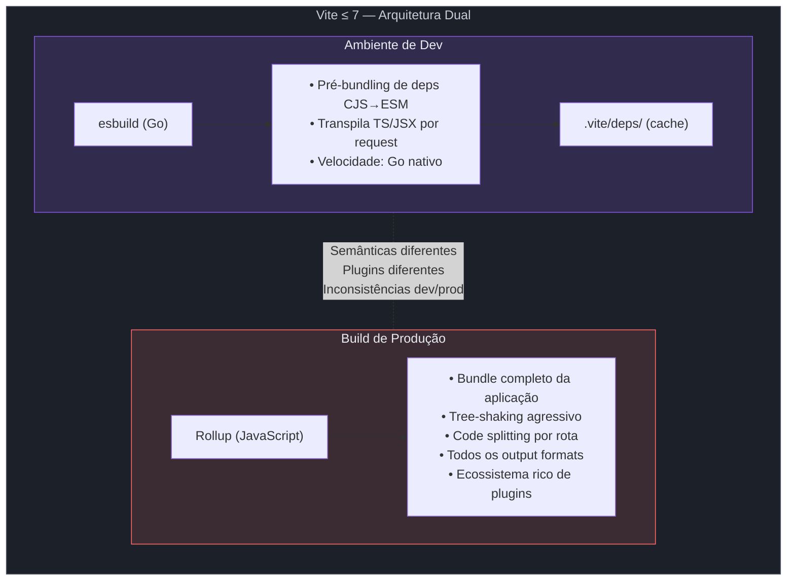
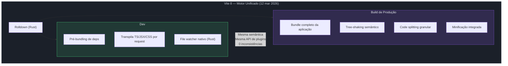
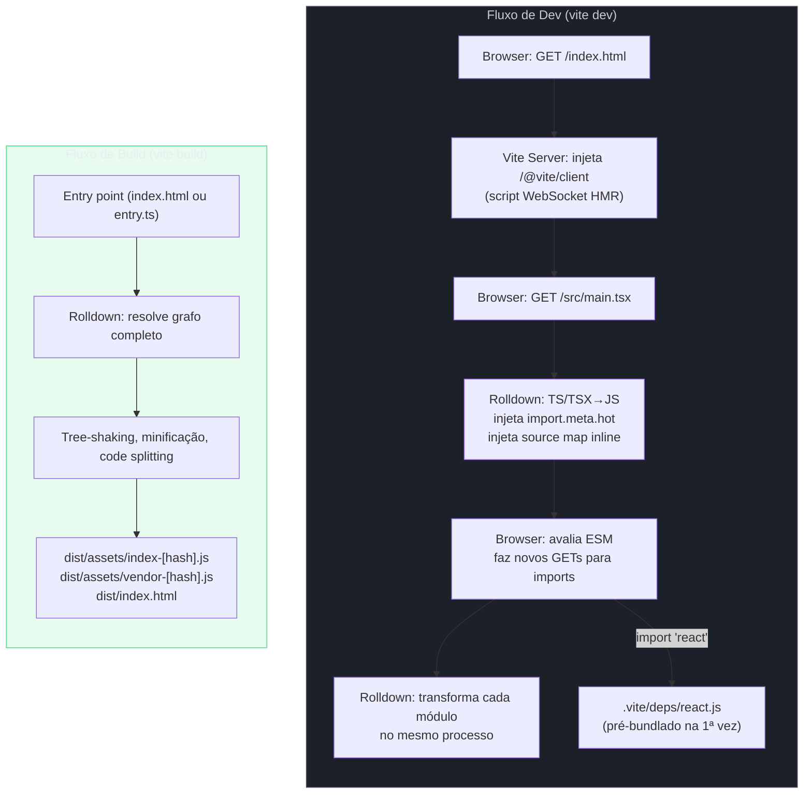
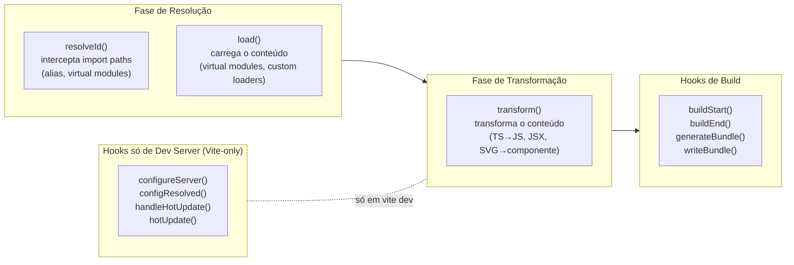
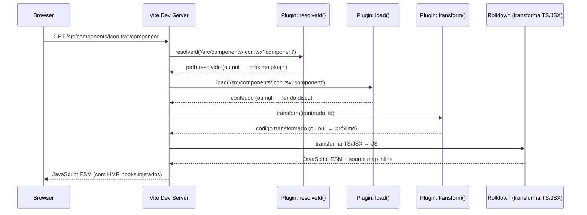
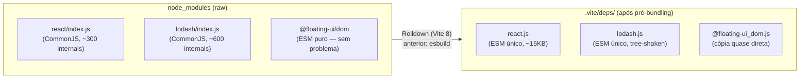
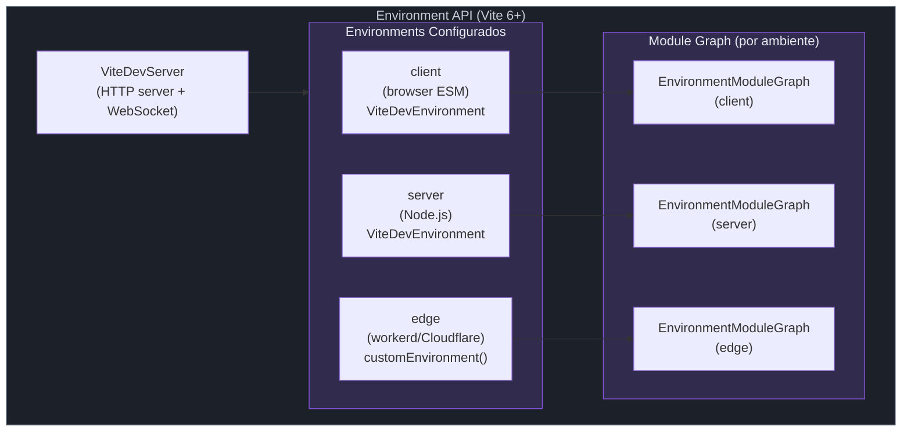
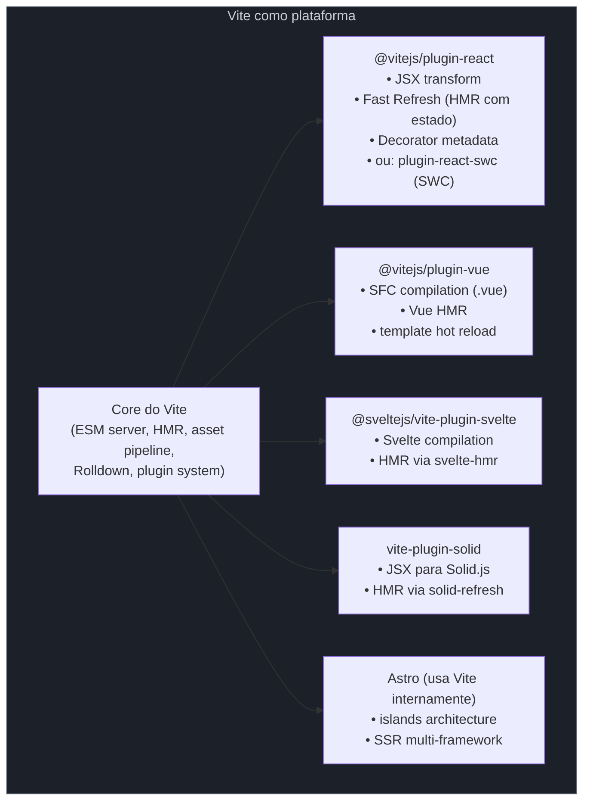
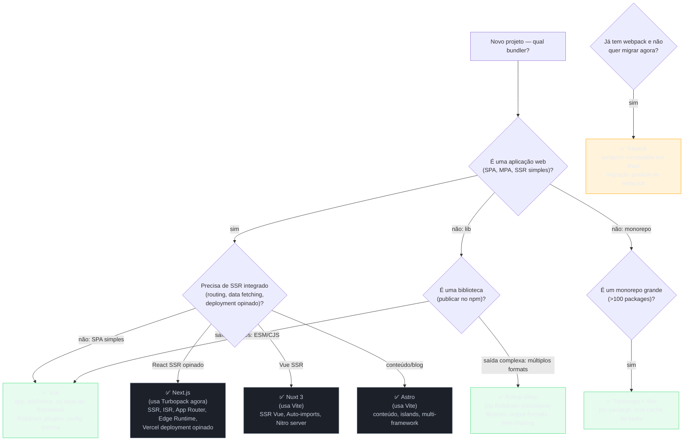

# Vite a fundo

> [!abstract] TL;DR
> O Vite resolve o problema central do tooling moderno — o gap entre o que você escreve (TS, JSX, ESM, CSS moderno) e o que roda no browser — com uma aposta arquitetural diferente dos predecessores: **em dev, não bundla nada da sua aplicação**; serve ESM nativo ao browser e transforma arquivos sob demanda. Em produção, bundla agressivamente. Até o Vite 7, isso exigia **dois motores** com estratégias opostas: esbuild (Go) no dev para velocidade bruta, Rollup (JS) no build para otimizações completas. O **Vite 8** (março de 2026) unificou tudo no **Rolldown** — um bundler em Rust desenvolvido pela VoidZero que entrega 10–30x de speedup e elimina a classe inteira de inconsistências dev/prod. O sistema de **plugins** é compatível com Rollup e funciona nos dois ambientes. A **Environment API** (estabilizando) formaliza múltiplos alvos (browser, Node, edge/Cloudflare Workers) num único pipeline. O HMR, o fluxo de assets e o tratamento de `import.meta.env` — veja a nota [[09 - Dev server e HMR]] para o modelo conceitual; aqui o foco é a arquitetura, a configuração e as decisões de quando usar.

---

## O problema que o Vite resolve

Todo projeto frontend vive numa tensão fundamental: você escreve em TypeScript, com JSX, importando CSS Modules, usando aliases de path, consumindo pacotes npm publicados como CommonJS — e o browser não entende nada disso diretamente. O browser fala JavaScript puro, ESM nativo, `<link>` para CSS separado. O tooling existe para fechar esse gap.

A aposta histórica do webpack foi: resolva tudo de uma vez, num bundle único. O processo de build era o coração — você esperava o webpack terminar antes de ver qualquer resultado. Em 2015, quando os projetos tinham algumas dezenas de módulos, isso era aceitável. Em 2021, com projetos de centenas ou milhares de módulos, um cold start de trinta segundos e um HMR de cinco segundos se tornaram custo real de desenvolvimento.

O Vite, criado por Evan You em 2021, partiu de uma observação diferente: **browsers modernos já entendem ESM**. Se o browser consegue fazer `import { useState } from './hooks.js'` diretamente, por que bundlar durante o desenvolvimento? A resposta do Vite foi: não precisa. E essa escolha muda a arquitetura de tudo.

> [!note] Relação com a nota 09
> A nota [[09 - Dev server e HMR]] cobre o modelo de dev server em detalhe — ESM sob demanda, ciclo de HMR, source maps, a transição esbuild→Rolldown. Esta nota parte desse modelo já compreendido e mergulha na arquitetura interna, no sistema de plugins, na config e nas decisões arquiteturais de uso.

---

## Arquitetura: o problema dos dois motores (e a solução)

### Por que dois motores existiram

Durante o Vite 1 ao 7, a arquitetura tinha uma divisão que qualquer dev que trabalhava com o Vite eventualmente descobria:



> [!info] Leitura do diagrama
> Os dois lados não eram meramente "o mesmo algoritmo em velocidades diferentes". Eram ferramentas distintas, escritas em linguagens distintas, com comportamentos ligeiramente distintos. Um plugin Rollup podia não funcionar em dev porque o esbuild não o suportava. Um bug que aparecia em prod podia não aparecer em dev — e vice-versa. Essa era a principal dor da arquitetura dual.

A razão para a escolha original fazia sentido: o Rollup, escrito em JavaScript, era simplesmente lento demais para transformar arquivos individualmente no hot path do dev. O esbuild resolvia o problema de velocidade, mas com outra linguagem, outra API, outro ecossistema. A VoidZero foi fundada por Evan You em 2024 precisamente para resolver essa dicotomia com uma ferramenta nova.

### A virada: Rolldown e o Vite 8

O **Rolldown** é um bundler escrito em Rust com API compatível com Rollup. Ele foi desenvolvido com um objetivo específico: ser rápido o suficiente para substituir o esbuild no hot path do dev e completo o suficiente para substituir o Rollup no build de produção — com a **mesma API de plugins para os dois**.



> [!info] Leitura do diagrama
> Um motor, duas responsabilidades. O Rolldown executa no mesmo processo, com a mesma semântica, para dev e build. A classe de bugs "funciona em dev mas quebra em prod" desaparece estruturalmente — porque agora é o mesmo código executando nos dois ambientes.

> [!tip] Linha do tempo para contextualizar em entrevistas
> | Período | Marco |
> |---------|-------|
> | 2021 | Vite 1 — ESM nativo + esbuild para dev |
> | 2022–2023 | Vite 3/4 — ecossistema explode; padrão de fato para SPA |
> | 2024 | VoidZero fundada; Rolldown anunciado como projeto open-source |
> | Jan 2026 | Rolldown 1.0 RC — API estabilizada |
> | Mar 2026 | **Vite 8 estável** — Rolldown como motor padrão |
> | Mai 2026 | **Rolldown 1.0 estável** — versionamento semântico garantido |

### Números reais do Rolldown vs Rollup

Em benchmarks e em projetos reais reportados após a migração para Vite 8:

| Empresa / Projeto | Tempo antes | Tempo depois | Redução |
|---|---|---|---|
| Linear | 46s | 6s | **87%** |
| Beehiiv | — | — | **64%** |
| Ramp | — | — | **57%** |
| Mercedes-Benz.io | — | — | **38%** |

A razão é estrutural: Rust executa em velocidade nativa, sem GC, sem overhead de V8. E o Rolldown usa paralelismo por padrão — o grafo de módulos é resolvido em threads paralelas.

---

## Como o Vite funciona por dentro

O Vite é, na sua essência, um **servidor HTTP especializado** que entende o grafo de módulos da sua aplicação. No build de produção, ele invoca o Rolldown para produzir artefatos otimizados. Em dev, serve módulos sob demanda.



> [!info] Leitura do diagrama
> Em dev, o Vite nunca constrói um bundle da sua aplicação — ele transforma cada módulo individualmente no momento em que o browser o pede, e o browser mesmo faz a resolução de imports. Em build, o Rolldown recebe o entry point e percorre o grafo inteiro, produzindo artefatos otimizados com hashes para cache-busting.

---

## A `vite.config.ts` — exemplo trabalhado e comentado

Uma config real de um projeto React com múltiplos ambientes, aliases, múltiplos chunks e otimizações comentadas:

```ts
// vite.config.ts — projeto React + TypeScript (Vite 8)
import { defineConfig, loadEnv } from 'vite'
import react from '@vitejs/plugin-react'
import { visualizer } from 'rollup-plugin-visualizer'
import tsconfigPaths from 'vite-tsconfig-paths'
import path from 'node:path'

// defineConfig() fornece tipagem completa — não é obrigatório, mas dá autocompletar
export default defineConfig(({ command, mode }) => {
  // command === 'serve' em dev, 'build' em produção
  // mode === 'development' | 'production' | custom (--mode staging)
  const env = loadEnv(mode, process.cwd(), '')
  // loadEnv carrega .env, .env.local, .env.[mode], .env.[mode].local
  // o terceiro argumento '' inclui variáveis sem prefixo VITE_
  // ATENÇÃO: sem o prefixo VITE_, a variável NÃO é exposta ao cliente

  return {
    // ─── Plugins ────────────────────────────────────────────────────────
    plugins: [
      // Plugin oficial React — ativa Fast Refresh (HMR com estado preservado)
      // Internamente usa @babel/plugin-transform-react-jsx-source em dev
      // e o compilador novo do React (RC em 2026) se disponível
      react({
        // babel: { plugins: ['@emotion/babel-plugin'] }  // se usar emotion
      }),

      // Resolve aliases do tsconfig.paths automaticamente
      // sem isso, '@/components/Button' não resolveria sem duplicar no resolve.alias
      tsconfigPaths(),

      // Gera stats.html visualizando o bundle após build
      // só ativo em 'analyze' mode: `vite build --mode analyze`
      mode === 'analyze' && visualizer({
        open: true,
        gzipSize: true,
        brotliSize: true,
        filename: 'dist/stats.html',
      }),
    ].filter(Boolean),  // remove false/undefined da lista

    // ─── Resolução de módulos ────────────────────────────────────────────
    resolve: {
      alias: {
        // Aliases manuais (alternativa ao tsconfigPaths se não usar tsconfig.paths)
        '@': path.resolve(__dirname, 'src'),
        '@ui': path.resolve(__dirname, 'src/components/ui'),
      },
      // resolve.tsconfigPaths: true  // Vite 8 — suporte nativo a tsconfig paths
      // elimina a necessidade do plugin vite-tsconfig-paths em casos simples
    },

    // ─── CSS ────────────────────────────────────────────────────────────
    css: {
      // Vite 6+: LightningCSS é o processador padrão para transformações básicas
      // (prefixes, nesting nativo, color-mix, etc.) — escrito em Rust, muito mais rápido
      // que PostCSS para operações comuns. Para plugins PostCSS avançados (Tailwind v3):
      // postcss: { plugins: [tailwindcss(), autoprefixer()] }
      // Tailwind v4 já não precisa de PostCSS — usa seu próprio plugin Vite.

      // Para configurar LightningCSS explicitamente (Vite 6+):
      // lightningcss: {
      //   targets: browserslistToTargets(browserslist('>= 0.25%')),
      //   drafts: { customMedia: true },  // media queries customizadas (draft)
      // },
      // transformer: 'lightningcss',  // ou 'postcss' para forçar PostCSS

      modules: {
        // Convenção de naming para CSS Modules: .module.css → classe local por padrão
        localsConvention: 'camelCase',
      },
    },

    // ─── Servidor de Dev ─────────────────────────────────────────────────
    server: {
      port: 5173,
      strictPort: true,     // falha se 5173 estiver ocupada (em vez de usar 5174)
      open: false,           // não abrir browser automaticamente
      proxy: {
        // Redireciona /api/* para o backend em dev (evita CORS)
        '/api': {
          target: env.VITE_API_URL || 'http://localhost:3001',
          changeOrigin: true,
          rewrite: (path) => path.replace(/^\/api/, ''),
        },
      },
      // hmr: { overlay: false }  // desabilita overlay de erro (se um framework tem o próprio)
      sourcemapIgnoreList: (sourcePath) =>
        sourcePath.includes('node_modules'),  // não mostrar source de deps no DevTools
    },

    // ─── Preview (vite preview) ──────────────────────────────────────────
    preview: {
      port: 4173,
      // Simula o servidor estático de produção localmente
      // útil para testar o dist/ antes do deploy
    },

    // ─── Build de Produção ───────────────────────────────────────────────
    build: {
      target: 'es2020',      // browserslist ou ES target explícito
      // target: ['chrome87', 'firefox78', 'safari14', 'edge88']  // formato alternativo

      outDir: 'dist',
      emptyOutDir: true,

      sourcemap: 'hidden',   // gera .map sem referenciar no bundle — para Sentry/Datadog
      // sourcemap: true,    // referenciado — usuário pode ver source
      // sourcemap: false,   // sem source map (padrão se não configurado)

      minify: 'rolldown',    // Vite 8: Rolldown faz a minificação internamente
      // minify: 'esbuild',  // alternativa (mais testada, resultado similar)
      // minify: 'terser',   // mais configurável, mas mais lento

      // Rollup/Rolldown options — passados direto para o bundler
      rollupOptions: {
        output: {
          // Estratégia de chunking: separa vendor de app
          manualChunks: (id) => {
            if (id.includes('node_modules')) {
              // libs React em chunk separado — cacheado pelo browser entre deploys
              if (id.includes('react') || id.includes('react-dom')) {
                return 'react-vendor'
              }
              // outras deps em vendor genérico
              return 'vendor'
            }
            // seu código vai no chunk principal (index)
          },

          // Nomenclatura dos assets com hash de conteúdo (cache-busting)
          chunkFileNames: 'assets/[name]-[hash].js',
          entryFileNames: 'assets/[name]-[hash].js',
          assetFileNames: 'assets/[name]-[hash][extname]',
        },
      },

      // Alerta se um chunk passar de 500KB (antes de gzip)
      chunkSizeWarningLimit: 500,
    },

    // ─── Otimizações de dependências (pré-bundling) ──────────────────────
    optimizeDeps: {
      // Forçar inclusão de deps que o Rolldown não detecta automaticamente
      // (importadas dinamicamente, via URL, ou condicionais)
      include: [
        'lodash-es',
        // 'alguma-lib/dist/index.cjs',  // forçar pré-bundle de CJS não detectado
      ],
      // Excluir libs que quebram no pré-bundling (raras — geralmente Wasm ou Node-only)
      exclude: ['@mapbox/node-pre-gyp'],
    },

    // ─── Variáveis de ambiente ────────────────────────────────────────────
    // Todas as variáveis com prefixo VITE_ são expostas ao cliente via import.meta.env
    // (substituição estática em build-time, não runtime)
    define: {
      // Injeção manual de constantes de build — substituídas literalmente no bundle
      __APP_VERSION__: JSON.stringify(process.env.npm_package_version),
      __BUILD_DATE__: JSON.stringify(new Date().toISOString()),
    },

    // ─── SSR (quando usando Vite como base de framework SSR) ─────────────
    // ssr: {
    //   noExternal: ['alguma-lib-esm-pura'],  // força bundle (não externaliza)
    //   external: ['node:fs', 'node:path'],   // garante externalização
    // },

    // ─── Environment API (Vite 6+, estabilizando em 2026) ───────────────
    // environments: {
    //   client: { /* padrão */ },
    //   server: { resolve: { conditions: ['node'] } },
    //   edge: { resolve: { noExternal: true } },  // Cloudflare Workers
    // },
  }
})
```

> [!tip] `command` e `mode` na config
> A função `({ command, mode })` é o padrão quando você precisa de configuração condicional. `command === 'serve'` em dev, `'build'` em produção. `mode` vem de `--mode` no CLI ou de `NODE_ENV`. Isso permite configurações como "ativar o visualizer só em mode=analyze" sem duplicar o arquivo de config.

---

## O sistema de plugins

O aspecto mais estratégico do Vite é que ele **não é um bundler vertical** — é uma plataforma de plugins. O ecossistema Rollup (que existia desde 2015) foi integralmente reaproveitado. Qualquer plugin Rollup compatível com a API de hooks funciona no Vite com zero modificações para a maioria dos casos.

A minoria que pode falhar são casos específicos do Rolldown ou do contexto de dev server:

- **`moduleParsed`**: esse hook do Rollup não funciona no contexto do dev server do Vite — ele só roda no build de produção, porque em dev o Vite não constrói um bundle completo.
- **Hooks paralelos vs. sequenciais**: hooks que o Rollup executa em paralelo são executados sequencialmente pelo Rolldown. Plugins que dependem da semântica de paralelismo do Rollup podem ter comportamento diferente.
- **Output formats não suportados**: Rolldown não suporta `format: 'system'` e `format: 'amd'`. Plugins que configuram esses formatos falham em build.
- **APIs internas do Rollup**: plugins que usam `this.parse()` para análise de AST ou acessam internals do Rollup (não a API pública) podem ter comportamentos diferentes no Rolldown — que implementa a API pública mas não os internals.
- **Comentários no `renderChunk`**: o Rolldown remove comentários antes do hook `renderChunk` (o Rollup os remove depois). Plugins de transformação que dependem de comentários no código ainda presente nesse hook podem não funcionar.

Em resumo: plugins que usam apenas os hooks canônicos (`resolveId`, `load`, `transform`, `generateBundle`) funcionam sem modificação. Os que exploram comportamentos específicos do Rollup — paralelismo, hooks raros, internals — precisam ser testados após migrar para Vite 8.

### Anatomia de um plugin Vite

Um plugin Vite é um objeto (ou uma função que retorna um objeto) com hooks que o Vite invoca em momentos específicos do pipeline:



> [!info] Leitura do diagrama
> Os hooks de resolução e transformação funcionam tanto em dev quanto em build — são Rollup-compatíveis. Os hooks de servidor só existem em dev e permitem que plugins configurem o servidor HTTP, escutem HMR, ou adicionem middlewares.

### Um plugin real: SVG como componente React

```ts
// plugins/svgr.ts — transforma import de .svg em componente React
import type { Plugin } from 'vite'
import { transform } from '@svgr/core'
import fs from 'node:fs/promises'

export function svgrPlugin(): Plugin {
  return {
    name: 'vite-plugin-svgr',  // nome único, aparece em mensagens de erro

    // enforce: 'pre' | 'post' — ordem relativa a outros plugins
    // 'pre': roda antes dos plugins do core do Vite
    // 'post': roda depois
    // sem enforce: roda no meio (padrão para plugins de usuário)

    async load(id) {
      // id é o path resolvido do módulo — inclui a query string do import
      // Quando o código escreve: import Logo from './logo.svg?component'
      // o Vite resolve o path completo e mantém o ?component como parte do id.
      // Isso é intencional: a query string é o que diferencia dois imports do mesmo arquivo
      // com tratamentos diferentes. O browser não vê esse id — quem faz a requisição ao
      // dev server usa a URL, mas o pipeline de plugins usa o id resolvido com a query.
      // ATENÇÃO: no hook transform(), a query string é normalmente removida do id —
      // apenas em load() o id inclui a query completa (quando vem do resolveId).
      if (!id.endsWith('.svg?component')) return null
      // retornar null → continua para o próximo plugin
      // retornar string → usa esse conteúdo como o módulo

      const svgPath = id.replace('?component', '')
      const svgContent = await fs.readFile(svgPath, 'utf-8')

      // Converte SVG em componente React via SVGR
      const jsCode = await transform(svgContent, {
        plugins: ['@svgr/plugin-jsx'],
        jsx: { runtime: 'automatic' },  // JSX transform (React 17+)
      })

      return jsCode
      // o código retornado passa pelo hook transform() a seguir
    },

    transform(code, id) {
      // transform é chamado para cada módulo com o código carregado
      // aqui poderíamos pós-processar o JSX gerado pelo SVGR
      // mas o @vitejs/plugin-react vai processar JSX → JS depois
      return null  // null → não transforma, passa adiante
    },

    // Hook Vite-only: reagir a HMR quando um SVG muda
    handleHotUpdate({ file, server }) {
      if (file.endsWith('.svg')) {
        // Invalida todos os módulos que importaram esse SVG como componente
        const modules = server.moduleGraph.getModulesByFile(file)
        if (modules) {
          return [...modules]  // retornar módulos invalida e aciona HMR
        }
      }
    },
  }
}

// uso em vite.config.ts:
// plugins: [react(), svgrPlugin()]

// uso no componente:
// import Logo from './logo.svg?component'
// <Logo className="header-logo" />
```

> [!tip] A query string `?component` como padrão
> O Vite trata a query string do import como parte da identidade do módulo. `import './logo.svg'` e `import './logo.svg?component'` são dois módulos diferentes com handlers diferentes. Isso é o que permite importar o mesmo SVG como URL string em alguns lugares e como componente React em outros.

### O hook `configureServer`: middlewares no dev server

```ts
// plugin que adiciona um endpoint de mock em dev
export function mockApiPlugin(): Plugin {
  return {
    name: 'vite-plugin-mock-api',
    // Vite-only: configura o servidor HTTP de dev
    configureServer(server) {
      // server.middlewares é um Connect/Express-compatible middleware stack
      server.middlewares.use('/api/mock', (req, res) => {
        res.setHeader('Content-Type', 'application/json')
        res.end(JSON.stringify({ status: 'mocked', timestamp: Date.now() }))
      })
    },
  }
}
```

### Ciclo completo de um request de plugin em dev



> [!info] Leitura do diagrama
> O pipeline de um request percorre todos os plugins registrados antes de chegar ao Rolldown para a transformação TS/JSX. Cada plugin pode interceptar em qualquer etapa — resolver para um caminho diferente, fornecer conteúdo customizado, ou transformar o código. O primeiro plugin que retorna um valor não-nulo "ganha" aquele hook.

### Plugins oficiais e ecossistema

| Plugin | Para quê | Pacote |
|---|---|---|
| `@vitejs/plugin-react` | React Fast Refresh + JSX | oficial |
| `@vitejs/plugin-react-swc` | idem mas usa SWC em vez de Babel | oficial |
| `@vitejs/plugin-vue` | Vue 3 SFC + HMR | oficial |
| `@vitejs/plugin-svelte` | Svelte + HMR | oficial |
| `vite-plugin-pwa` | Service Worker + Web App Manifest | comunidade |
| `unplugin-icons` | 100k+ ícones como componentes | comunidade |
| `vite-tsconfig-paths` | resolve aliases do tsconfig.paths | comunidade |
| `rollup-plugin-visualizer` | visualiza tamanho do bundle | comunidade |
| `vite-plugin-checker` | type-check em paralelo no dev | comunidade |

> [!note] O ponto de inflexão do ecossistema
> O Vite ultrapassou 93 mil domínios ativos detectados em 2026, com 92% de satisfação no State of JavaScript 2025 e 70%+ de adoção entre devs que iniciaram projetos novos em 2025. SvelteKit, Nuxt, Astro, Remix e Qwik City usam Vite como bundler base. O ecosistema de plugins explodiu após 2022 justamente pela compatibilidade com Rollup — não foi necessário reescrever nada, só adicionar hooks de servidor.

---

## `import.meta.env` e variáveis de ambiente

O Vite expõe variáveis de ambiente ao cliente através do objeto `import.meta.env`, que é **substituído estaticamente em build-time** — não existe em runtime como `process.env`. A chave de segurança: apenas variáveis com prefixo `VITE_` são expostas ao bundle do cliente.

```ts
// .env.local (nunca commitado)
VITE_API_URL=https://api.dev.meuapp.com
DATABASE_URL=postgres://...   // SEM prefixo VITE_ — nunca vai pro bundle

// no código:
const apiUrl = import.meta.env.VITE_API_URL
// em build, isso é substituído literalmente por:
// const apiUrl = "https://api.dev.meuapp.com"

// variáveis built-in (sempre disponíveis):
import.meta.env.MODE        // 'development' | 'production' | custom
import.meta.env.BASE_URL    // valor do config `base` (ex: '/' ou '/app/')
import.meta.env.DEV         // true em dev
import.meta.env.PROD        // true em build
import.meta.env.SSR         // true quando rodando no servidor (SSR)
```

```ts
// Tipagem: augmente ImportMetaEnv para autocompletar
// src/vite-env.d.ts (criado pelo create-vite automaticamente)
/// <reference types="vite/client" />

interface ImportMetaEnv {
  readonly VITE_API_URL: string
  readonly VITE_FEATURE_FLAGS: string
  // adicione aqui todas as suas variáveis VITE_
}

interface ImportMeta {
  readonly env: ImportMetaEnv
}
```

> [!warning] `import.meta.env` não é `process.env`
> Uma armadilha clássica: em projetos que migraram do webpack ou CRA, o código usava `process.env.REACT_APP_*`. O Vite não polyfill `process.env` por padrão. Se você precisar de compatibilidade (para libs de terceiros que usam `process.env`), adicione ao `define` na config: `define: { 'process.env': {} }`. Mas o padrão correto é migrar para `import.meta.env`.

### Glob imports: descoberta dinâmica de arquivos

Uma feature menos conhecida mas poderosa: o Vite resolve `import.meta.glob()` em build-time, gerando um mapa de módulos para todos os arquivos que casam com o padrão:

```ts
// Importa todos os componentes de uma pasta como módulos lazy
const pages = import.meta.glob('./pages/**/*.tsx')
// Em build-time, isso vira algo como:
// const pages = {
//   './pages/Home.tsx': () => import('./pages/Home.tsx'),
//   './pages/About.tsx': () => import('./pages/About.tsx'),
// }

// Modo eager: importa tudo de uma vez (não lazy)
const icons = import.meta.glob('./icons/**/*.svg', { eager: true })

// Com query: importa SVGs como componentes React via plugin
const svgComponents = import.meta.glob('./icons/**/*.svg', {
  query: '?component',
  eager: true,
})

// Uso típico: router dinâmico
const router = Object.entries(pages).map(([path, loader]) => ({
  path: path.replace('./pages', '').replace('.tsx', ''),
  component: React.lazy(loader as () => Promise<{ default: React.ComponentType }>),
}))
```

> [!tip] Glob imports e tree-shaking
> No modo eager, todos os módulos são importados e incluídos no bundle. No modo lazy (padrão), cada módulo vira um chunk separado que o browser só baixa quando necessário. Para um router com dezenas de páginas, o modo lazy é essencial para não enviar todo o app no primeiro load.

---

## Dependency optimization: o pré-bundling em detalhe

O pré-bundling é uma das peças mais importantes da arquitetura Vite que fica invisível na experiência cotidiana — até quebrar. Entender como funciona é essencial para diagnosticar problemas de inicialização lenta, CJS incompatível, ou módulos que "somem" do grafo.

### O que é e por que existe

O browser não entende CommonJS. Ele também trava se um `import 'react'` gera 300 requisições HTTP separadas (o React é composto de muitos módulos internos). O pré-bundling resolve os dois problemas de uma vez: converte pacotes CJS em ESM e agrupa os internos num único arquivo.



> [!info] Leitura do diagrama
> O pré-bundling acontece apenas uma vez (ou quando as deps mudam) e o resultado fica em `.vite/deps/`. Em dev, quando o browser faz `import 'react'`, o Vite serve `/.vite/deps/react.js` — um ESM único — em vez de deixar o browser resolver centenas de arquivos internos do React.

### Quando o cache invalida

O Vite invalida o cache de `.vite/deps/` automaticamente quando detecta mudanças em:

- `package.json` (versão de dep mudou)
- `package-lock.json`, `pnpm-lock.yaml` ou `yarn.lock` (lockfile mudou)
- `vite.config.ts` (configuração mudou — afeta `optimizeDeps`)
- `node_modules/.package-lock.json` (npm mudou o registro interno)

Quando o cache invalida, o Vite refaz o pré-bundling na próxima inicialização. Você vê o log `Pre-bundling dependencies...` e uma lista de pacotes. Se estiver em CI ou em containers onde o cache não persiste, isso acontece em toda execução — configurar `--force` explicitamente ou montar `.vite/deps/` num volume resolve.

> [!tip] Cache manual
> Para forçar re-pré-bundling sem reiniciar: `vite --force`. Para pular: defina `optimizeDeps.disabled: true` (raramente necessário — só se o pré-bundling estiver causando problema em um pacote específico e você quiser isolar).

### Deps que precisam de inclusão explícita

O Rolldown (e antes o esbuild) detecta automaticamente quais deps precisam de pré-bundling fazendo scan estático dos imports. Mas há casos em que o scan não alcança:

```ts
// Caso 1: import dinâmico condicional — o scan estático não vê
const chartLib = await import(useWebGL ? 'd3' : 'chart.js')

// Caso 2: import via variável de string — impossível de resolver estaticamente
const mod = await import(moduleName)

// Caso 3: lib que o Vite não inclui na varredura inicial
// (ex: deep inside node_modules de outra lib)
```

Para esses casos, `optimizeDeps.include` garante que a dep seja pré-bundlada mesmo sem ser detectada:

> [!warning] O que acontece quando uma dep CJS não é pré-bundlada
> O sintoma mais comum é um erro no console do browser:
> ```
> The requested module '/node_modules/.pnpm/alguma-lib@1.2.3/node_modules/alguma-lib/index.js'
> does not provide an export named 'default'
> ```
> O motivo: o Vite serve o arquivo CJS diretamente ao browser, mas o browser entende apenas ESM. Um `module.exports = { ... }` não é uma exportação ESM válida — o browser tenta interpretar `module` como identificador de variável e falha. Às vezes o erro é mais genérico ("Failed to fetch module"), mas a causa é a mesma: arquivo CJS sem conversão ESM sendo servido num contexto que exige ESM. O diagnóstico é direto: se o import funciona em build (onde o Rolldown bundla tudo) mas falha em dev, a dep CJS não foi pré-bundlada. Solução: adicionar em `optimizeDeps.include`.

```ts
optimizeDeps: {
  include: [
    'd3',
    'chart.js',
    // Notação de sub-path para sub-exports específicos:
    'some-lib > nested-dep',  // nested-dep como dep de some-lib
  ],
}
```

### Diferença Rolldown vs esbuild no pré-bundling

Com Vite 8, o Rolldown assumiu o pré-bundling antes feito pelo esbuild. A diferença mais prática:

| Aspecto | esbuild (Vite ≤ 7) | Rolldown (Vite 8) |
|---|---|---|
| Linguagem | Go | Rust |
| CJS detection | Heurísticas simples | Análise semântica mais profunda |
| `package.json` exports | Parcial | Completo (todos os `exports` fields) |
| Velocidade | Muito rápido | Comparável ou superior |
| Consistência com build prod | Parcial (motor diferente) | Total (mesmo motor) |

A análise semântica mais profunda do Rolldown significa que ele detecta mais casos de CJS implícito — o que pode mudar quais pacotes entram em `optimizeDeps.include` automaticamente. Após migrar para Vite 8, verifique se houve regressões na inicialização.

---

## Módulos virtuais: pattern central de plugins

Um padrão menos documentado mas que aparece em quase todo plugin sério: **módulos virtuais** — módulos que o Vite "inventa" sob demanda, sem arquivo físico correspondente.

```ts
// plugin que expõe configuração de rota como módulo virtual
export function routeConfigPlugin(routes: RouteConfig[]): Plugin {
  const VIRTUAL_ID = 'virtual:route-config'
  const RESOLVED_VIRTUAL_ID = '\0virtual:route-config'
  // Convenção: prefixo '\0' marca módulos virtuais
  // Evita que outros plugins tentem processar o mesmo ID

> [!question] O prefixo `\0` é só convenção ou há enforcement do Vite?
> O Vite trata o `\0` de duas formas concretas: (1) módulos com `\0` no ID não são resolvidos pelo sistema de arquivos — o core pula a resolução de disco; (2) em dev, a URL gerada para o browser usa uma codificação especial (`/@id/__x00__...`) porque `\0` não é um caractere válido em URLs. Isso é enforcement parcial: o core conhece o prefixo. Mas não há uma barreira que impeça um plugin mal-escrito de processar qualquer ID — é uma convenção com suporte ativo do core, não uma sandbox isolada. A segurança real vem de que plugins bem-escritos checam o ID antes de agir, e o `\0` sinaliza "esse módulo não existe no disco".

  return {
    name: 'vite-plugin-route-config',

    resolveId(id) {
      if (id === VIRTUAL_ID) {
        // Diz ao Vite: esse import existe, e o ID resolvido é este
        return RESOLVED_VIRTUAL_ID
      }
    },

    load(id) {
      if (id === RESOLVED_VIRTUAL_ID) {
        // Retorna o conteúdo do módulo gerado dinamicamente
        return `
          export const routes = ${JSON.stringify(routes)};
          export const routeCount = ${routes.length};
        `
      }
    },
  }
}

// uso no app:
// import { routes } from 'virtual:route-config'
// Nenhum arquivo routes.ts precisa existir
```

> [!tip] O prefixo `\0` como convenção
> O `\0` (null byte) no ID resolvido é uma convenção do Rollup (e portanto do Vite) para indicar "esse módulo é virtual — não tente carregar do disco". Sem ele, outros plugins que tentam processar todos os módulos podem entrar em conflito com o módulo virtual.

Módulos virtuais são a base de como ferramentas como Vite PWA, UnoCSS, e plugins de rota automática (como os do SvelteKit e Nuxt) funcionam — eles geram código em runtime baseado na configuração, sem criar arquivos temporários.

---

## SSR e a Environment API

### SSR clássico no Vite

O Vite tem suporte nativo a SSR desde o Vite 2. O modelo básico é dois entry points: um para o cliente (`entry-client.tsx`) e um para o servidor (`entry-server.tsx`). Em dev, o Vite serve o servidor via `ssrLoadModule()`, que funciona como o dev server normal mas no contexto do Node:

```ts
// server.ts — servidor Express + Vite SSR em dev
import express from 'express'
import { createServer as createViteServer } from 'vite'

const app = express()

if (process.env.NODE_ENV !== 'production') {
  const vite = await createViteServer({
    server: { middlewareMode: true },
    appType: 'custom',  // não injeta HTML automaticamente
  })

  // Vite como middleware — intercepta requests e serve transformados
  app.use(vite.middlewares)

  app.get('*', async (req, res) => {
    const url = req.originalUrl

    // Carrega o módulo do servidor via Vite (com HMR e source maps)
    const { render } = await vite.ssrLoadModule('/src/entry-server.tsx')

    // Aplica transformações do Vite no HTML (injeta scripts, etc.)
    let html = await vite.transformIndexHtml(url, template)

    // Renderiza o app no servidor
    const appHtml = await render(url)

    // Substitui o placeholder pelo HTML renderizado
    res.send(html.replace('<!--SSR_HTML-->', appHtml))
  })
}
```

```ts
// entry-server.tsx — renderiza para string no servidor
import { renderToString } from 'react-dom/server'
import { App } from './App'

export async function render(url: string) {
  // StaticRouter para SSR (react-router-dom/server)
  return renderToString(<App url={url} />)
}
```

```ts
// entry-client.tsx — hidrata no browser
import { hydrateRoot } from 'react-dom/client'
import { App } from './App'

hydrateRoot(document.getElementById('root')!, <App />)
```

### O problema que a Environment API resolve

O modelo de SSR acima tem uma limitação: assume exatamente dois ambientes — cliente e servidor. Mas aplicações modernas precisam de mais granularidade:

- Um **browser** que executa React
- Um **servidor Node.js** que faz SSR
- Um **edge server** (Cloudflare Workers) que executa lógica de middleware
- Um **worker de background** com restrições de runtime diferentes

Antes da Environment API, o Vite não tinha um modelo formal para isso. Plugins como o Cloudflare Workers plugin tinham que fazer gambiarras para simular o ambiente `workerd` em dev. O Vite 6 introduziu a **Environment API** para resolver isso:



> [!info] Leitura do diagrama
> Cada environment tem seu próprio grafo de módulos, suas próprias condições de resolução, e seu próprio runtime. O server compartilha o mesmo processo HTTP mas isola os módulos. O edge pode executar num processo separado que simula as restrições do Cloudflare Workers.

```ts
// vite.config.ts com múltiplos environments
export default defineConfig({
  environments: {
    // client é o ambiente padrão — configuração do browser
    client: {
      // padrão: não precisa declarar para a maioria dos projetos
    },

    // SSR no Node.js
    server: {
      resolve: {
        // condições de export do package.json a considerar
        conditions: ['node', 'import', 'module'],
      },
    },

    // Edge (Cloudflare Workers)
    edge: {
      resolve: {
        // Cloudflare Workers não suporta node_modules nativos
        // noExternal: true força o Vite a bundlar tudo
        noExternal: true,
        conditions: ['worker', 'browser', 'module', 'import'],
      },
    },
  },

  // plugins podem usar environment.name para comportamento condicional
  plugins: [
    {
      name: 'env-aware-plugin',
      transform(code, id, options) {
        // options.ssr ainda funciona para backward compat (client vs não-client)
        // mas o novo modelo usa this.environment?.name
        // Em Vite 6+, this.environment é parte do PluginContext — sem cast necessário:
        const envName = this.environment?.name ?? 'client'
        // Se você ver (this as any) em código de exemplo mais antigo, é porque foi escrito
        // antes dos tipos serem atualizados. A partir do Vite 6 estável, this.environment
        // está tipado no PluginContext. Em versões de transição (Vite 6 beta / RC),
        // o cast as any era necessário porque a propriedade existia em runtime mas ainda
        // não havia entrado na definição de tipo do @types — o código funcionava, mas o
        // TypeScript reclamava em tempo de compilação.

        if (envName === 'edge') {
          // transformações específicas para edge runtime
        }

        return null
      },
    },
  ],
})
```

> [!note] Status da Environment API em 2026
> A Environment API foi introduzida no Vite 6 (late 2024) e está em fase de estabilização em 2026. O roadmap do Vite 8 lista "Stabilize Environment API" como objetivo próximo. A API é retrocompatível — projetos que não usam múltiplos environments não precisam mudar nada. Mas plugins que usavam a propriedade top-level `ssr` vão migrar gradualmente para o novo modelo.

---

## Assets: como o Vite trata imagens, SVG e outros arquivos

O Vite tem tratamento integrado de assets com comportamento inteligente baseado em tamanho:

```ts
// Importar uma imagem → URL do asset (com hash em prod)
import logoUrl from './logo.png'
// logoUrl === '/assets/logo-a1b2c3d4.png' em produção
// logoUrl === '/src/logo.png' em dev (sem hash)

// Assets abaixo de 4KB (padrão) são inlined como base64
// configurável via build.assetsInlineLimit
import tinyIcon from './icon-16x16.png'
// pode ser: 'data:image/png;base64,iVBORw0KGgo...'

// Importar como URL explicitamente (ignora inlining)
import svgUrl from './sprite.svg?url'

// Importar como string raw
import svgContent from './sprite.svg?raw'

// Importar como Worker
import MyWorker from './worker.ts?worker'
const worker = new MyWorker()

// Importar como URL de Worker (para uso manual)
import workerUrl from './worker.ts?worker&url'
```

```ts
// vite.config.ts — ajustar threshold de inlining
export default defineConfig({
  build: {
    // Assets menores que X bytes são inlined como base64
    // 0 = nunca inline
    // Infinity = sempre inline (ruim para assets grandes)
    assetsInlineLimit: 4096,  // 4KB (padrão)

    // Pasta para assets dentro do outDir
    assetsDir: 'assets',

    // Copiar arquivos de public/ sem processamento
    // public/ → dist/ diretamente (sem hash, sem transformação)
  },

  // Arquivos na pasta public/ são servidos como-estão
  // útil para robots.txt, favicon.ico, arquivos .well-known
  publicDir: 'public',  // padrão
})
```

> [!tip] `public/` vs `src/assets/`
> A distinção importa: arquivos em `public/` são copiados sem processamento — sem hash, sem otimização. Referenciados via URL absoluta: ``. Arquivos em `src/` (ou qualquer lugar importado via JS) passam pelo pipeline do Vite: recebem hash, podem ser inline-ados, passam por plugins. Para assets que precisam de URL estável (Open Graph, PWA manifest), use `public/`. Para assets que o React ou Vue referenciam via import, use `src/assets/`.

---

## Framework-agnostic: React, Vue e Svelte no mesmo modelo

Uma das apostas do Vite é ser um bundler de plataforma, não um bundler de framework. A consequência: trocar de framework num projeto Vite significa trocar um plugin, não toda a configuração.



> [!info] Leitura do diagrama
> O core do Vite não sabe nada sobre React, Vue ou Svelte. Os plugins encapsulam todo o conhecimento framework-específico: como compilar SFCs, como registrar hooks de HMR para componentes específicos, quais arquivos precisam de transformação especial. Isso é o que torna possível usar React e Vue no mesmo monorepo com o mesmo Vite.

### `@vitejs/plugin-react` vs `@vitejs/plugin-react-swc`

```ts
// Opção 1: plugin-react (usa Babel internamente)
// Vantagem: compatível com todos os plugins Babel existentes
// (emotion, styled-components, relay, etc.)
import react from '@vitejs/plugin-react'

plugins: [
  react({
    // plugins Babel customizados (ex: para @emotion/react)
    babel: {
      plugins: ['@emotion/babel-plugin'],
    },
  })
]

// Opção 2: plugin-react-swc (usa SWC internamente)
// Vantagem: 20x mais rápido que Babel para transformar JSX
// Limitação: plugins Babel não funcionam (exceto os portados para SWC)
import react from '@vitejs/plugin-react-swc'

plugins: [
  react({
    // plugins SWC (lista menor que Babel, mas crescendo)
    // plugins: [['@swc/plugin-emotion', {}]],
  })
]
```

> [!tip] Quando usar SWC vs Babel
> Para a maioria dos projetos novos em 2026, use `plugin-react-swc`. A diferença de velocidade no HMR é perceptível em projetos grandes. Só use `plugin-react` (Babel) se você depende de plugins Babel sem equivalente em SWC — principalmente alguns metaframeworks e bibliotecas de CSS-in-JS antigas.

---

## Quando usar Vite — e quando não usar

O Vite é uma excelente escolha para a maioria dos projetos, mas não é a resposta certa para todos:



> [!info] Leitura do diagrama
> O Vite não compete com Next.js — o Next.js usa um bundler diferente (Turbopack) mas a separação é de camada: Next.js é um **framework full-stack opinado**; o Vite é uma **plataforma de bundling**. Frameworks como Nuxt e Astro constroem **sobre** o Vite. Quando você quer o controle da camada de bundling sem as opiniões de um framework, o Vite é a escolha.

> [!note] Vite como base de framework
> SvelteKit, Nuxt 3, Astro, Remix (via Vite preset), e Qwik City usam o Vite como bundler base. Isso significa que aprender Vite a fundo é aprender a base de múltiplos frameworks populares. A frase "o Vite virou a infraestrutura do ecossistema JS" não é exagerada — é literalmente o que aconteceu entre 2022 e 2026.

### Bibliotecas com Vite: modo `lib`

O Vite tem um modo específico para publicar bibliotecas npm:

```ts
// vite.config.ts para uma library (não uma app)
import { defineConfig } from 'vite'
import react from '@vitejs/plugin-react'
import { resolve } from 'node:path'

export default defineConfig({
  plugins: [react()],

  build: {
    // Modo library
    lib: {
      entry: resolve(__dirname, 'src/index.ts'),
      name: 'MyLib',          // nome global (para UMD/IIFE)
      fileName: 'my-lib',     // nome base dos arquivos de saída
      formats: ['es', 'cjs'], // output formats
      // 'es': ESM (para bundlers modernos)
      // 'cjs': CommonJS (para Node e bundlers antigos)
      // 'umd': Universal Module Definition
      // 'iife': Immediately Invoked (para <script> tag)
    },

    rollupOptions: {
      // Externaliza dependências que o consumidor vai ter
      // SEM isso, React seria incluído no bundle da lib → conflito de versões
      external: ['react', 'react-dom', 'react/jsx-runtime'],
      output: {
        // Nomes globais para UMD/IIFE
        globals: {
          react: 'React',
          'react-dom': 'ReactDOM',
        },
      },
    },
  },
})
```

> [!warning] `external` em bibliotecas é obrigatório
> Se você não externalizar `react` e `react-dom` na sua lib, o bundle vai incluir uma cópia do React. Quem instalar sua lib vai ter **dois Reacts** no projeto — e o React vai reclamar que não pode ter múltiplas instâncias. Sempre externalize peerDependencies.

### Gerando declarações TypeScript com `vite-plugin-dts`

O Vite em modo `lib` **não** gera arquivos `.d.ts` por padrão. Para uma biblioteca TypeScript profissional, você precisa de declarações de tipo — sem elas, consumidores não têm autocomplete nem checagem de tipos. O plugin `vite-plugin-dts` resolve isso:

```ts
// vite.config.ts para lib com tipos
import { defineConfig } from 'vite'
import dts from 'vite-plugin-dts'

export default defineConfig({
  plugins: [
    dts({
      // Gera .d.ts na mesma pasta do build
      outDir: 'dist',
      // Inclui apenas src/ (exclui testes, stories)
      include: ['src'],
      // Elimina comentários internos dos .d.ts
      cleanVueFileName: false,
      // Consolida tudo em um único arquivo de declaração (opcional)
      // rollupTypes: true,
    }),
  ],

  build: {
    lib: {
      entry: 'src/index.ts',
      formats: ['es', 'cjs'],
    },
    rollupOptions: {
      external: ['react', 'react-dom'],
    },
  },
})
```

E no `package.json` da lib, os campos de export devem apontar para os arquivos corretos:

```json
{
  "main": "./dist/my-lib.cjs",
  "module": "./dist/my-lib.js",
  "types": "./dist/index.d.ts",
  "exports": {
    ".": {
      "import": { "types": "./dist/index.d.ts", "default": "./dist/my-lib.js" },
      "require": { "types": "./dist/index.d.ts", "default": "./dist/my-lib.cjs" }
    }
  }
}
```

> [!tip] `exports` com `types` primeiro
> A ordem dos campos no `exports` importa para o TypeScript: o campo `types` deve vir antes de `default`. O TypeScript 5.x resolve condições na ordem declarada e para no primeiro match. Colocar `default` antes de `types` faz o TypeScript ignorar as declarações.

### `resolve.conditions` e package exports

Quando o Vite (ou Rolldown) resolve um import, ele consulta o campo `exports` do `package.json` da dependência. As "conditions" definem qual variante do pacote usar:

```ts
// vite.config.ts
resolve: {
  conditions: [
    'browser',    // variante para browser (padrão para client)
    'module',     // ESM explícito (alguns pacotes expõem 'module')
    'import',     // import() — ESM
    'default',    // fallback
  ],
  // Para SSR/Node: adicionar 'node' antes de 'browser'
  // O servidor node-ssr usa: ['node', 'import', 'module', 'default']
}
```

Isso explica por que a mesma lib pode se comportar diferente em dev, build e SSR — as conditions ativas são diferentes em cada ambiente. Um pacote que exporta `{ "browser": "dist/browser.js", "node": "dist/node.js" }` usa o arquivo errado em SSR se `browser` vier antes de `node` nas conditions.

```json
// package.json de uma lib com múltiplos alvos
{
  "exports": {
    ".": {
      "node": "./dist/server.cjs",      // Node.js
      "browser": "./dist/browser.js",   // browser/bundlers
      "worker": "./dist/worker.js",     // Cloudflare Workers
      "default": "./dist/browser.js"    // fallback
    }
  }
}
```

> [!note] Relação com a Environment API
> A Environment API usa `resolve.conditions` por ambiente: o ambiente `client` usa conditions de browser, o `server` usa conditions de node, o `edge` usa conditions de worker. Antes da Environment API, isso era configurado globalmente e causava problemas em projetos com múltiplos alvos.

---

## Como explicar em inglês

Vite is a frontend build tool that separates the development and production concerns more explicitly than traditional bundlers. In development, it acts as an HTTP server that serves your source files as native ES Modules directly to the browser, transforming each file on demand — stripping TypeScript, compiling JSX — without bundling anything. Dependencies are pre-bundled once into single ES Modules cached in `.vite/deps/`. This model means startup time stays constant regardless of project size, because nothing is processed until the browser requests it.

For production, Vite uses Rolldown — a Rust-based bundler with a Rollup-compatible plugin API — to produce optimized, tree-shaken, code-split bundles. Since Vite 8 (March 2026), Rolldown also handles the development pre-bundling, replacing the previous dual-engine setup of esbuild for dev and Rollup for production. The unified engine eliminates the class of dev/prod inconsistencies that the dual setup could introduce.

Vite's plugin system is compatible with Rollup plugins, which means the large existing Rollup ecosystem works out of the box. Plugins can hook into module resolution, transformation, and server-specific lifecycle events like HMR updates. Framework integrations like `@vitejs/plugin-react` plug into this system to add React Fast Refresh, JSX transforms, and React-specific HMR behavior.

The Environment API, stabilizing in 2026, formalizes multiple deployment targets — browser, Node SSR, edge runtimes like Cloudflare Workers — as first-class environments, each with its own module graph and runtime configuration.

### Vocabulário-chave

| Português | English |
|---|---|
| dois motores | dual engine setup |
| motor unificado | unified bundler engine |
| pré-bundling de dependências | dependency pre-bundling |
| resolução de módulos | module resolution |
| transformação sob demanda | on-demand file transformation |
| plugin de framework | framework plugin / integration |
| gancho de plugin | plugin hook |
| módulo virtual | virtual module |
| variável de ambiente em build-time | build-time environment variable |
| modo biblioteca | library mode |
| ambiente de dev / build | dev environment / build environment |
| compatibilidade com Rollup | Rollup-compatible API |
| external de dependência | externalizing a dependency |
| inline de assets | asset inlining |
| hash de conteúdo | content hash |
| backend de SSR | SSR entry point |
| hidratação | hydration |
| ambiente de borda | edge environment / edge runtime |

---

## Armadilhas comuns

**Usar `process.env` em vez de `import.meta.env`.** O Vite não polyfill `process.env`. Se você migrou código de webpack/CRA ou usa libs que dependem de `process.env`, adicione `define: { 'process.env': {} }` na config — mas migre o código próprio para `import.meta.env.VITE_*`.

**Não usar prefixo `VITE_` e estranhar que a variável é `undefined` no browser.** Somente variáveis com prefixo `VITE_` são expostas ao bundle do cliente. As demais ficam no processo Node do servidor de build — intencionalmente, para não vazar secrets.

**Não externalizar peerDeps em modo `lib`.** Sem `external: ['react', 'react-dom']`, a lib bundla o React. O consumidor acaba com duas cópias, e o React faz o processo explodir com "two Reacts".

**Esperar que todos os plugins Rollup funcionem sem testar.** A maioria funciona, mas plugins que usam APIs específicas do Rollup (como `this.parse()` para análise de AST) podem ter comportamentos diferentes no Rolldown. Teste após migrar para Vite 8.

**Colocar arquivos que precisam de URL estável em `src/assets/` em vez de `public/`.** O Vite adiciona hashes a tudo em `src/`. Se você precisa que `/robots.txt` ou `/og-image.png` vivam numa URL fixa, eles vão para `public/` — sem processamento, sem hash.

**Ignorar o warning de chunk muito grande.** O aviso `chunk exceeded limit of 500 kB` não é cosmético — significa que o browser vai baixar 500KB de JavaScript antes de renderizar qualquer coisa. Investigue com o `rollup-plugin-visualizer` e use `manualChunks` para separar vendor de app.

**Assumir que `import.meta.glob` é eager por padrão.** O padrão é lazy — retorna funções que retornam Promises. Se você iterar sobre o resultado e chamar `Object.values(pages)`, você vai ter um array de funções, não de módulos. Para módulos imediatos, passe `{ eager: true }`.

**Migrar para Vite 8 sem verificar `optimizeDeps.include`.** O Rolldown é mais agressivo que o esbuild na detecção de CJS. Algumas libs que o esbuild detectava automaticamente para pré-bundling podem precisar de listagem explícita em `optimizeDeps.include` com Rolldown. Verifique o log de inicialização.

**Usar LightningCSS e Tailwind v3 ao mesmo tempo sem configurar PostCSS explicitamente.** A partir do Vite 6, o LightningCSS é o transformer padrão. Tailwind v3 funciona via PostCSS — se você não declarar `css.transformer: 'postcss'` (ou configurar `postcss` explicitamente), o Tailwind pode não processar os arquivos CSS. Tailwind v4 resolve isso com um plugin Vite próprio que não precisa de PostCSS.

**Esquecer o `\0` (null byte) no ID resolvido de módulos virtuais.** Sem o prefixo `\0`, outros plugins que varreram todos os módulos (como plugins de análise ou source maps) tentam processar o módulo virtual como se fosse um arquivo em disco — e falham ou geram warnings.

**Usar `ssr.noExternal: true` desnecessariamente.** Em SSR, externalizar dependências (padrão) é mais rápido — o Node carrega os módulos diretamente. `noExternal` força o bundling, o que pode resolver problemas de transformação de ESM puro, mas aumenta o tempo de build e pode criar problemas de duplicação.

---

## Veja também

- [[09 - Dev server e HMR]] — o modelo conceitual de como o Vite serve ESM em dev, o ciclo completo de HMR, source maps e a troca esbuild→Rolldown; esta nota pressupõe esse entendimento
- [[14 - Rollup, esbuild e Rolldown]] — as três ferramentas que o Vite usa (ou usou) como motor: Rollup como bundler de referência, esbuild como motor Go, Rolldown como sucessor unificado em Rust; aqui cobrimos como o Vite os usa, lá a fundo de cada um
- [[15 - Turbopack, Rspack e a corrida Rust-Go]] — os competidores: Turbopack (Next.js) e Rspack (webpack-compat); a corrida por performance nativa no ecossistema JS
- [[12 - Create React App e a era dos scaffolders]] — o que havia antes do Vite, por que o CRA foi descontinuado em 2025 e o Vite virou o scaffolder padrão para projetos React
- [[17 - Otimização de bundle]] — técnicas avançadas de code splitting, tree-shaking e análise de bundle; complementa a seção de `manualChunks` e o uso do visualizer
- [[06 - ESM e CJS e o sistema de módulos]] — a base que explica por que o pré-bundling CJS→ESM existe e o que são `exports` conditions no package.json

---

## Referências

- Vite 8 release blog (mar 2026): https://vite.dev/blog/announcing-vite8
- Rolldown 1.0 stable (mai 2026): https://rolldown.rs/blog/rolldown-1-0
- VoidZero — empresa fundada por Evan You (2024): https://voidzero.dev/posts/announcing-voidzero-inc
- Environment API RFC e docs: https://vite.dev/guide/api-environment
- Vite Plugin Guide (hooks, virtual modules): https://vite.dev/guide/api-plugin
- LightningCSS em Vite: https://vite.dev/guide/features#lightningcss
- `vite-plugin-dts` — geração de declarações TypeScript: https://github.com/qmhc/vite-plugin-dts
- State of JavaScript 2025 — seção Bundlers: https://2025.stateofjs.com/en-US/other-tools/#bundlers
- Benchmark Rolldown vs Rollup (Linear, Ramp, Beehiiv): https://vite.dev/blog/announcing-vite8#performance
- Vite Plugin API — hooks, virtual modules, \0 convention: https://vite.dev/guide/api-plugin
- Vite Environment API for Plugins — this.environment e PluginContext: https://vite.dev/guide/api-environment-plugins
- Vite Migration from v7 — breaking changes do Rolldown: https://vite.dev/guide/migration
- Vite Dependency Pre-Bundling — comportamento com CJS não detectado: https://vite.dev/guide/dep-pre-bundling
