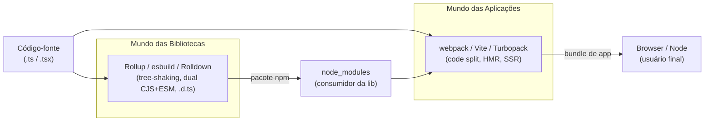
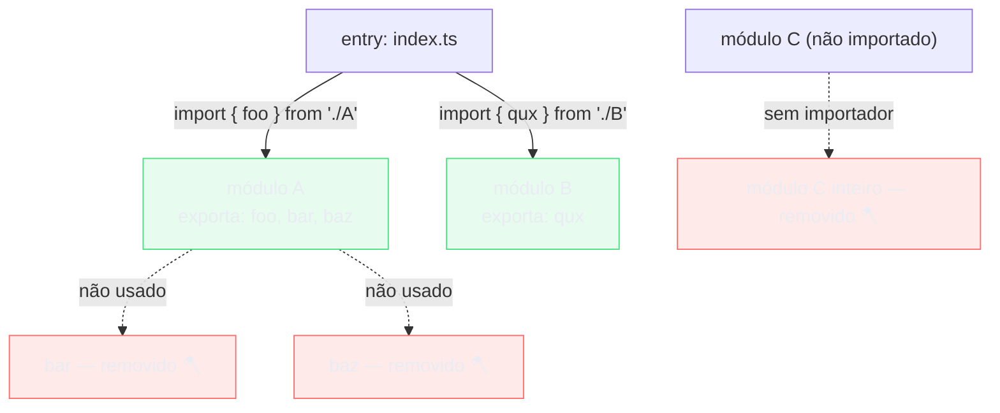
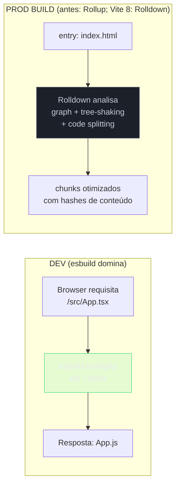
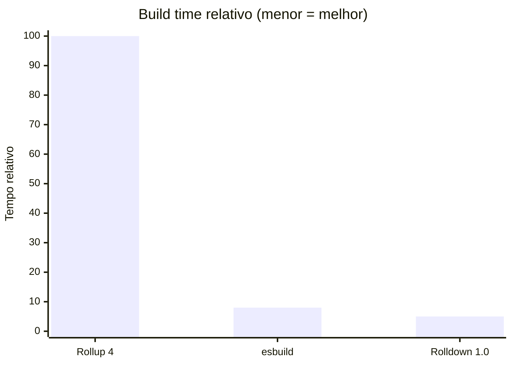
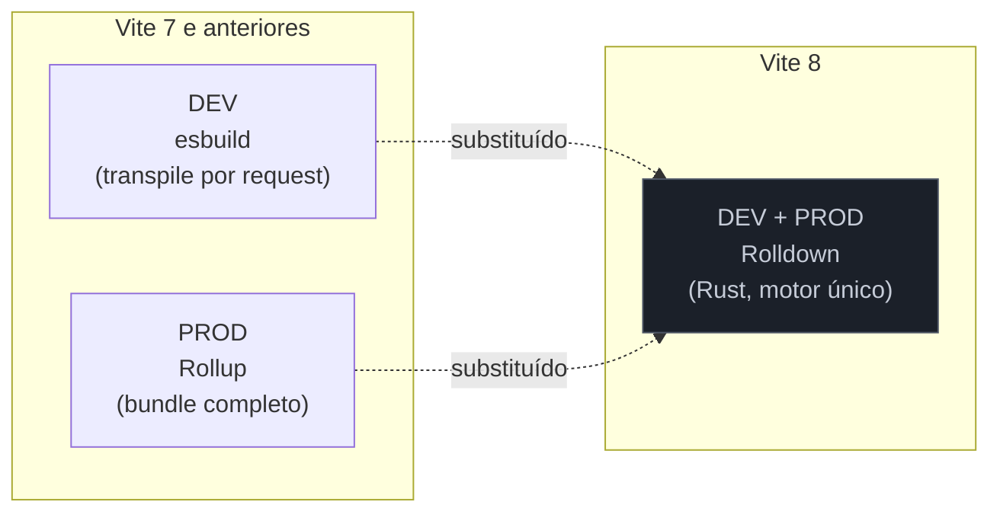
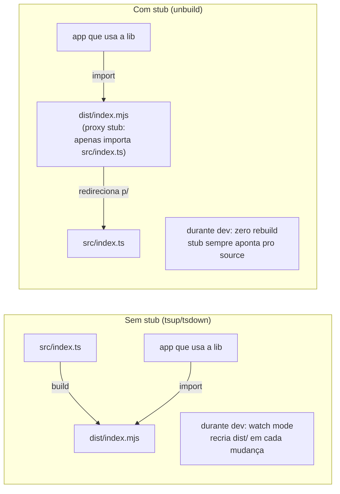
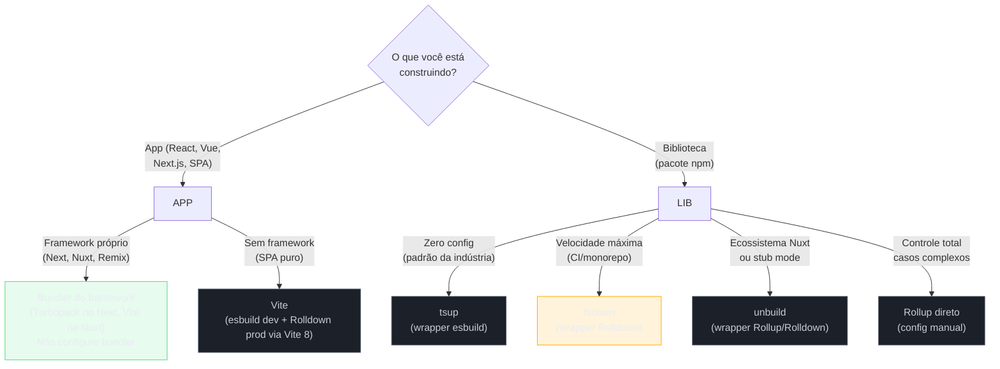
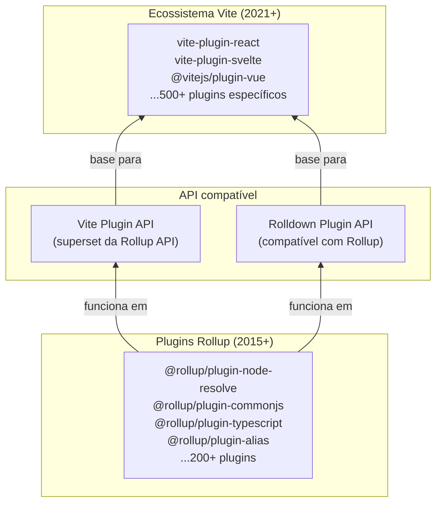
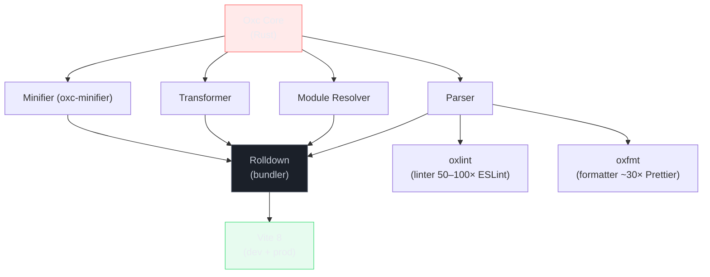

# Rollup, esbuild e Rolldown

> [!abstract] TL;DR
> Três ferramentas definem o nível mais profundo do ecossistema de bundling JS/TS: **Rollup** (2015, JavaScript) é o padrão consolidado para publicar bibliotecas — ESM/CJS/UMD/IIFE em um config, tree-shaking nativo, base de plugin que o Vite herdou. **esbuild** (2020, Go, Evan Wallace) é o motor de velocidade — transpila e bundla 10–100× mais rápido que Rollup, mas tem limitações pra build final de libs (sem `.d.ts`, sem decorators legados). **Rolldown** (2026, Rust, VoidZero/Evan You) é o futuro chegando — Rollup reescrito em Rust com API compatível, 10–30× mais rápido, e agora o motor único do Vite 8. Para libs TypeScript, **tsup** (wrapper de esbuild) e **tsdown** (wrapper de Rolldown) abstraem a complexidade e entregam ESM + CJS + `.d.ts` com zero config. A decisão por bundle formato vem da pergunta: você está publicando uma biblioteca ou construindo uma aplicação?

---

## O problema que cada um resolve

Para entender por que existem três ferramentas neste espaço — e por que não é excesso de escolha, mas diferença real de propósito — é preciso separar dois mundos distintos do bundling.

O **mundo das aplicações** quer um bundle final que nunca será importado por outro projeto: você gera `main.js` de 400KB, o usuário faz download e pronto. Aqui o que importa é code splitting (rota por rota), hot reload rápido no dev, e compatibilidade com browsers. webpack, Vite, Parcel e Turbopack vivem aqui.

O **mundo das bibliotecas** quer o oposto: você publica um pacote npm que *outras pessoas vão importar*. O bundle precisa ser pequeno, tree-shakable (para que quem usa pague só pelo que usa), exportado em múltiplos formatos (ESM pra bundlers modernos, CJS pra Node legado, IIFE pra `<script>` direto), e com declarações TypeScript `.d.ts` para que o editor do consumidor entenda os tipos.

Rollup nasceu para resolver o segundo mundo. esbuild veio depois com velocidade como obsessão. Rolldown chegou para unificar os dois com performance nativa.



> [!note] A fronteira não é absoluta
> Vite usa Rollup (e agora Rolldown) para o build de produção mesmo sendo uma ferramenta de app — bundlers de library têm excelente tree-shaking que apps também precisam. O que muda são as prioridades: apps querem code splitting automático e dev server; libs querem múltiplos output formats e preservação de módulos.

---

## Rollup: o padrão para publicar bibliotecas

Rollup foi criado por Rich Harris em 2015 — o mesmo Rich Harris que criou Svelte. A motivação era um problema que o webpack da época não resolvia bem: **tree-shaking de verdade via ES modules**.

A intuição é simples: se você usa `import { format } from 'date-fns'`, você não quer o `date-fns` inteiro no bundle — quer apenas a função `format`. Mas isso só é possível se a biblioteca for escrita com `export` estáticos, porque imports estáticos formam um grafo analisável estaticamente. O CommonJS (`require`) é dinâmico e não permite essa análise — o bundler não sabe o que vai ser usado até o runtime.

Rollup foi o primeiro bundler a explorar ESM com essa intenção: construir o grafo de importações, identificar o que é realmente usado, e emitir apenas o necessário.

Em 2026, o Rollup 4 continua sendo o padrão da indústria para publicar bibliotecas JavaScript, com a versão mais recente (4.60.x) em desenvolvimento ativo. A razão não é só histórica — é funcional: o ecossistema de plugins, o controle granular sobre output formats e a maturidade do tree-shaking não têm equivalente.

### Output formats: por que múltiplos formatos importam

Uma biblioteca bem publicada em 2026 precisa ser consumível em cenários diferentes:

- **ESM** (`"type": "module"`, `.mjs`): para bundlers modernos (Vite, Rollup, esbuild) e Node.js 12+. Permite tree-shaking pelo consumidor.
- **CJS** (`"type": "commonjs"`, `.cjs`): para Node.js legado, Jest sem transformação, scripts `require()`.
- **UMD** (Universal Module Definition): para uso em `<script>` sem bundler, com fallback para CommonJS e AMD. Cada vez mais raro, mas ainda necessário pra CDN.
- **IIFE** (Immediately Invoked Function Expression): para `<script>` direto no browser, sem bundler, sem `export`.

**Exports condicionais** são o mecanismo pelo qual o Node.js e os bundlers modernos escolhem automaticamente qual arquivo da lib carregar, dependendo de como a importação acontece. Quando você escreve `import { format } from 'minha-lib'` num módulo ESM, o Node.js lê o campo `"exports"` do `package.json` e seleciona a entrada `"import"`. Quando um `require('minha-lib')` antigo é chamado, a entrada `"require"` é selecionada. O campo `"types"` é lido pelo TypeScript Language Server para encontrar as declarações de tipo.

Sem o campo `"exports"`, o Node.js usa `"main"` como fallback único — o que significa que `require()` e `import` recebem o mesmo arquivo, frequentemente causando erros em contextos ESM puro. Com `"exports"`, você descreve o mapa completo de pontos de entrada da lib: qual arquivo para ESM, qual para CJS, qual para tipos, e quais sub-caminhos são públicos (qualquer sub-caminho não listado em `"exports"` é automaticamente privado).

O `package.json` moderno de uma lib usa **exports condicionais** para apontar para o formato correto:

```json
{
  "name": "minha-lib",
  "version": "1.0.0",
  "type": "module",
  "main": "./dist/index.cjs",
  "module": "./dist/index.mjs",
  "exports": {
    ".": {
      "import": "./dist/index.mjs",
      "require": "./dist/index.cjs",
      "types": "./dist/index.d.ts"
    }
  },
  "files": ["dist"]
}
```

O Rollup gera todos esses formatos a partir de um único config, num único comando.

### Tree-shaking: o mecanismo que justifica o Rollup

**Tree-shaking** é o processo de eliminar código que existe no grafo de módulos mas nunca é acessado. A metáfora é uma árvore: você sacode e as folhas mortas (código não usado) caem.

O mecanismo depende de três condições:

1. **ES modules estáticos**: `import`/`export` resolvidos em parse time, antes de executar. `require()` dinâmico quebra a análise.
2. **Marcação de side effects**: o Rollup precisa saber que uma função pode ser removida com segurança. Se um módulo tem efeitos colaterais (modifica globals, registra listeners), o bundler precisa preservá-lo mesmo que nenhum export seja importado.
3. **`sideEffects: false` no `package.json`**: sinaliza ao bundler que nenhum arquivo do pacote tem side effects — pode remover o que não for importado.

Um **side effect de módulo** é qualquer código que executa algo além de definir e exportar símbolos — código que tem efeito no ambiente global quando o módulo é importado, mesmo que nenhum export seja usado.

Exemplos concretos de side effects:

```js
// ❌ Side effect: modifica o prototype global
Array.prototype.last = function() { return this[this.length - 1] }

// ❌ Side effect: registra um service worker
navigator.serviceWorker.register('/sw.js')

// ❌ Side effect: adiciona estilos ao DOM
const style = document.createElement('style')
document.head.appendChild(style)

// ❌ Side effect: logs no console (efeito observável)
console.log('lib carregada')

// ✅ Sem side effect: só define e exporta
export function formatDate(date) { return date.toISOString() }
```

O Rollup é **conservador por padrão**: se um arquivo pode ter side effects (e sem `sideEffects: false`, o Rollup assume que pode), ele preserva o módulo inteiro mesmo que nenhum export seja utilizado. Isso garante que efeitos colaterais como registro de providers ou polyfills não sejam acidentalmente removidos.

Com `"sideEffects": false` no `package.json`, você está prometendo que nenhum arquivo do pacote tem side effects — o Rollup pode então remover módulos inteiros que não têm exports utilizados.



> [!warning] O que quebra o tree-shaking
> Classes com métodos decorados (decorators legados) são frequentemente tratadas como side-effectful, porque decorators modificam o prototype em runtime. Código que usa `eval()`, `with`, ou `require()` dinâmico também é opaco para o analisador. A nota [[17 - Otimização de bundle]] cobre esses padrões em profundidade — aqui o ponto é que o Rollup é o mais conservador e correto na análise, mas não é mágico: garbage in, garbage out.

### Config de Rollup para uma lib: exemplo trabalhado

Vamos publicar uma lib de utilidades de data — `date-utils` — em ESM, CJS e com tipos TypeScript.

```ts
// src/index.ts — o que a lib exporta
export { formatDate } from './format'
export { parseDate } from './parse'
export { diffDays } from './diff'
// src/format.ts, src/parse.ts, src/diff.ts — implementações omitidas
```

```js
// rollup.config.js
import typescript from '@rollup/plugin-typescript'
import resolve from '@rollup/plugin-node-resolve'
import commonjs from '@rollup/plugin-commonjs'
import terser from '@rollup/plugin-terser'

/** @type {import('rollup').RollupOptions} */
export default {
  input: 'src/index.ts',       // entry único

  output: [
    {
      file: 'dist/index.mjs',
      format: 'es',            // ES modules — tree-shakable pelo consumidor
      sourcemap: true,
    },
    {
      file: 'dist/index.cjs',
      format: 'cjs',           // CommonJS — Node legado e Jest
      exports: 'named',        // evita default export misturado com named
      sourcemap: true,
    },
    {
      file: 'dist/index.umd.js',
      format: 'umd',
      name: 'DateUtils',       // nome do global no browser
      globals: {},             // sem peerDeps aqui: lib é autocontida
      plugins: [terser()],     // minificar só o UMD (pra CDN)
    },
  ],

  plugins: [
    resolve(),                 // resolve node_modules
    commonjs(),                // converte deps CJS p/ ESM interno
    typescript({
      tsconfig: './tsconfig.build.json',
      declaration: true,       // emite .d.ts
      declarationDir: 'dist',
    }),
  ],

  // Dependências externas NÃO entram no bundle
  // (o consumidor já as tem no node_modules)
  external: ['date-fns'],
}
```

```json
// tsconfig.build.json — separado do tsconfig.json de dev
{
  "extends": "./tsconfig.json",
  "compilerOptions": {
    "declaration": true,
    "declarationDir": "dist",
    "emitDeclarationOnly": false,
    "rootDir": "src",
    "outDir": "dist"
  },
  "include": ["src"]
}
```

```json
// package.json — exports mapeados
{
  "name": "date-utils",
  "version": "1.0.0",
  "type": "module",
  "exports": {
    ".": {
      "import": "./dist/index.mjs",
      "require": "./dist/index.cjs",
      "types": "./dist/index.d.ts"
    }
  },
  "main": "./dist/index.cjs",
  "module": "./dist/index.mjs",
  "types": "./dist/index.d.ts",
  "sideEffects": false,
  "scripts": {
    "build": "rollup -c",
    "typecheck": "tsc --noEmit"
  },
  "devDependencies": {
    "rollup": "^4.60.0",
    "@rollup/plugin-typescript": "^12.0.0",
    "@rollup/plugin-node-resolve": "^16.0.0",
    "@rollup/plugin-commonjs": "^28.0.0",
    "@rollup/plugin-terser": "^0.4.4",
    "typescript": "^5.8.0"
  },
  "peerDependencies": {
    "date-fns": ">=3.0.0"
  }
}
```

Ao rodar `npm run build`, o Rollup:

1. Lê `src/index.ts` e traça o grafo de módulos
2. Aplica tree-shaking (remove exports não re-exportados)
3. Transpila TypeScript via `@rollup/plugin-typescript` (que chama tsc internamente)
4. Emite três arquivos de output + arquivos `.d.ts`

O resultado: `date-utils` pode ser importada em qualquer ambiente, e bundlers que a consumem podem fazer tree-shaking de `formatDate` sem incluir `diffDays` se não usar.

---

## esbuild: Go, velocidade e o motor do Vite

**esbuild** surgiu em 2020 como um experimento de Evan Wallace, então CTO da Figma, para responder uma pergunta simples: *o que acontece se você implementar um bundler em Go, aproveitando paralelismo real e sem GC pesado?*

A resposta foi um choque: 10–100× mais rápido que qualquer alternativa JavaScript. Um benchmark canônico (bundle de `three.js`) que levava 41 segundos no webpack 4 com Babel levava 0,37 segundos no esbuild. A diferença vem de três fatores:

1. **Go compila para binário nativo** — sem JIT warm-up, sem overhead do Node.js. O GC do Go é leve e de baixa latência, mas o ponto mais importante é que o processo inteiro é nativo: sem a camada V8, sem parsing do próprio runtime JS antes de começar o trabalho. Em builds grandes que processam milhares de módulos, o overhead de cada alocação e coleta de lixo do V8 se acumula — o GC do JavaScript é otimizado para processos de longa duração, não para rajadas intensas de curta duração como um build.
2. **Paralelismo real** — Go usa goroutines que aproveitam múltiplos cores; Node.js é single-threaded por design (workers têm overhead de serialização).
3. **Parsing e geração em um único passe** — esbuild foi desenhado para nunca materializar uma AST completa quando não precisa.

Em 2026, esbuild está na versão **0.25.x** — deliberadamente abaixo de `1.0`. Evan Wallace tem sido explícito: a ferramenta está estável e amplamente usada, mas a API ainda pode mudar antes da `1.0`. A maioria dos usuários não nota porque consome via Vite, tsup ou outras abstrações que absorvem mudanças de API.

### O que esbuild faz — e o que não faz

esbuild é simultaneamente transpilador e bundler. Para a maioria dos casos práticos, isso significa:

```bash
# Transpilar TypeScript para ESM moderno
esbuild src/index.ts --bundle --format=esm --outfile=dist/index.js

# Transpilar + minificar + source map
esbuild src/index.ts --bundle --minify --sourcemap --outfile=dist/index.js

# Build de lib: múltiplos formatos (dois comandos separados)
esbuild src/index.ts --bundle --format=cjs --outfile=dist/index.cjs
esbuild src/index.ts --bundle --format=esm --outfile=dist/index.mjs
```

O que esbuild **não faz** e que é importante entender:

| Funcionalidade | esbuild | Rollup |
|---|---|---|
| **Type checking** | Não (apaga tipos sem checar) | Não (via plugin tsc) |
| **Emite `.d.ts`** | Não | Sim (via plugin typescript) |
| **Decorators legados** (NestJS, TypeORM) | Suporte limitado | Sim (via babel plugin) |
| **Plugins externos ricos** | Ecossistema menor | Ecossistema maduro |
| **`preserveModules`** | Não nativo | Sim (essencial pra libs atômicas) |
| **Code splitting por rota** | Básico | Avançado |

A ausência de `.d.ts` é a limitação mais importante para libs TypeScript: você precisa rodar `tsc --emitDeclarationOnly` separado, ou usar tsup (que faz isso por você).

### O papel do esbuild no Vite

O Vite usa esbuild em **dois momentos distintos** no seu pipeline:



No dev server, cada arquivo TypeScript ou JSX é transpilado individualmente por esbuild quando o browser o requisita — sem bundle, sem grafo completo, sem espera. É por isso que o Vite inicia em milissegundos.

Na build de produção (Vite 7 e anteriores), o Rollup assumia: construía o grafo completo, fazia tree-shaking, gerava code splitting por rota. Isso era mais lento que o dev, mas produzia bundles mais otimizados.

O Vite 8 (março de 2026) mudou essa divisão: Rolldown agora faz os dois papéis — e é 10–30× mais rápido que Rollup nas builds de produção.

---

## Rolldown: o futuro que chegou

**Rolldown** é a aposta mais importante do ecossistema JS/TS dos últimos anos. O projeto surgiu dentro da **VoidZero**, a empresa de tooling criada por Evan You (autor do Vue e do Vite) com foco em unificar e acelerar o ecossistema.

A premissa: o Vite tinha um problema arquitetural. Dois motores diferentes (esbuild e Rollup) com APIs diferentes, comportamentos ligeiramente diferentes de resolução de módulos, e impossibilidade de algumas otimizações que só funcionam quando um único bundler controla dev e prod. Rolldown nasceu para ser **Rollup reescrito em Rust**, aproveitando o **Oxc** (também da VoidZero) como parser e minificador.

### Linha do tempo

- **2023**: Evan You anuncia o projeto Rolldown publicamente
- **2024**: primeiros benchmarks públicos, API compatível com Rollup documentada
- **Março de 2026**: **Vite 8** lança com Rolldown como bundler padrão (substituindo Rollup e parcialmente esbuild)
- **Maio de 2026**: **Rolldown 1.0 stable** — API semântica versionada, `^1.0.0` com compatibilidade garantida

### O que "compatível com Rollup" significa na prática

A promessa da equipe Rolldown é que plugins Rollup funcionam sem modificação — na maioria dos casos. A API de plugins segue o mesmo modelo de hooks (`buildStart`, `resolveId`, `load`, `transform`, `generateBundle`), e a configuração `rollup.config.js` funciona como base para `rolldown.config.js`.

```js
// rolldown.config.js — praticamente idêntico ao rollup.config.js
import { defineConfig } from 'rolldown'

export default defineConfig({
  input: 'src/index.ts',
  output: {
    dir: 'dist',
    format: 'esm',
  },
  // plugins Rollup funcionam aqui
})
```

Há diferenças — alguns hooks avançados do Rollup ainda não estão implementados, e comportamentos de edge cases podem divergir — mas a compatibilidade prática é alta o suficiente para que a maioria dos projetos Vite tenha migrado sem tocar nos plugins.

### Performance: os números reais



- **Rolldown vs Rollup**: 10–30× mais rápido em builds frias; a vantagem cresce com o projeto
- **Rolldown vs esbuild**: na mesma faixa de velocidade — ambos são "rápidos o suficiente para você não esperar"
- **Casos reais**: Linear reduziu builds de 46s para 6s; Beehiiv reportou -64% em tempo de CI

A diferença de velocidade entre esbuild e Rolldown é menor que a diferença entre ambos e Rollup/webpack — ambos entram na categoria "nativo".

### Rolldown como motor único do Vite 8

Com o Vite 8, a arquitetura de dois motores acabou:



O benefício vai além da velocidade: com um único motor, configurações de `resolve`, `alias`, e plugins se aplicam identicamente em dev e prod. Um bug que aparecia só em prod (porque Rollup resolvia diferente do esbuild) simplesmente não existe mais. E otimizações como barrel file inlining — que precisam do grafo completo — agora podem acontecer mesmo durante o dev.

> [!info] E o esbuild no Vite 8?
> O esbuild não desapareceu do Vite 8 — ainda é usado para **pré-bundling de dependências** (o processo que converte node_modules de CJS para ESM na primeira vez que você inicia o dev server). A razão: esse passo específico não precisa de compatibilidade de plugins; precisa de velocidade pura. O esbuild continua imbatível aí.

---

## tsup e tsdown: quando você não quer escrever config

Rollup config para libs TypeScript tem um padrão repetitivo: sempre ESM + CJS + `.d.ts` + sourcemaps + external de peerDeps. Isso levou a dois wrappers de alto nível.

### tsup: o padrão da indústria

**tsup** (criado por egoist) é o wrapper de esbuild para publicar libs TypeScript. Zero config: `tsup src/index.ts --format esm,cjs --dts` gera os três artefatos necessários com um comando.

```ts
// tsup.config.ts
import { defineConfig } from 'tsup'

export default defineConfig({
  entry: ['src/index.ts'],
  format: ['esm', 'cjs'],       // gera ambos os formatos
  dts: true,                     // roda tsc em paralelo pra gerar .d.ts
  sourcemap: true,
  clean: true,                   // limpa dist/ antes
  splitting: false,              // sem code splitting (lib, não app)
  treeshake: true,

  // dependências externas não entram no bundle
  external: ['react', 'react-dom'],

  // esbuild options passadas diretamente
  esbuildOptions(options) {
    options.target = 'ES2020'
  },
})
```

```bash
# O suficiente para a maioria das libs
npx tsup src/index.ts --format esm,cjs --dts --sourcemap

# Watch mode: <100ms por rebuild
npx tsup --watch
```

tsup está em ~6 milhões de downloads semanais em junho de 2026 — é o padrão de facto para "como eu publico um pacote TypeScript". O motivo é pragmático: toda documentação de "como criar uma lib TypeScript" usa tsup como exemplo. A inércia de tutorial é poderosa.

### tsdown: o challenger Rolldown

**tsdown** é o equivalente de tsup para Rolldown — a aposta na próxima geração. Criado pela equipe VoidZero, tem API quase idêntica ao tsup (migration é trocar o import), mas usa Rolldown internamente para builds 3–5× mais rápidas.

```ts
// tsdown.config.ts — quase idêntico ao tsup.config.ts
import { defineConfig } from 'tsdown'

export default defineConfig({
  entry: ['src/index.ts'],
  format: ['esm', 'cjs'],
  dts: true,
  sourcemap: true,
  clean: true,
})
```

Em maio de 2026, tsdown está em ~500K downloads semanais — crescendo rápido, mas ainda consolidando. A recomendação pragmática: tsup se você quer a coisa mais documentada do internet; tsdown se você está num monorepo onde cada segundo de CI importa.

### unbuild: a alternativa do ecossistema Nuxt

**unbuild** (do ecossistema UnJS, usado por Nuxt, Nitro, h3) resolve o problema de um ângulo diferente: o **stub mode**.

```ts
// build.config.ts — unbuild
import { defineBuildConfig } from 'unbuild'

export default defineBuildConfig({
  entries: ['src/index'],
  declaration: true,
  rollup: {
    emitCJS: true,              // gera CJS além do ESM
  },
})
```

Stub mode é o diferencial: em vez de um build real, `unbuild --stub` cria arquivos proxy que apontam diretamente para o código TypeScript. Quando você desenvolve um monorepo com `lib-a` sendo dependência de `app-b`, não precisa rodar `tsup --watch` — o stub faz `app-b` ler o source diretamente. O preço: o Node precisa de `tsx` ou suporte nativo a TypeScript para executar esses stubs.

O stub gerado pelo unbuild é um arquivo `.mjs` que contém apenas um `import()` dinâmico apontando para o `.ts` de origem — algo como `export * from '../src/index.ts'`. O Node.js não entende `.ts` nativamente, então o ambiente de execução precisa interceptar essa importação e transpilar on-the-fly.

Na prática, isso é configurado de uma de duas formas:

```bash
# Opção 1: tsx como loader (mais comum em monorepos 2024+)
# O package.json do workspace root adiciona tsx como executor
node --import tsx src/main.ts

# Opção 2: variável de ambiente NODE_OPTIONS
NODE_OPTIONS='--import tsx' pnpm dev

# Opção 3: Node.js 22.6+ tem suporte nativo a TypeScript com flag
node --experimental-strip-types src/main.ts
```

Em monorepos gerenciados por Turborepo ou pnpm workspaces, o padrão típico é ter `tsx` instalado na raiz e configurar `NODE_OPTIONS=--import tsx` no `.env` ou no script de dev. O stub do unbuild pressupõe esse ambiente — é por isso que está mais associado ao ecossistema Nuxt/UnJS, onde essa configuração já está estabelecida. Para projetos que não usam tsx, o stub mode não funciona sem ajuste inicial.



**Quando usar cada um em 2026:**

| Cenário | Recomendação |
|---|---|
| Nova lib TypeScript, máximo de tutoriais disponíveis | tsup |
| Monorepo grande, CI é gargalo | tsdown |
| Ecossistema Nuxt/Nitro/UnJS | unbuild |
| Necessita de stub mode pra DX local | unbuild |
| Config complexa de output formats, máximo controle | Rollup direto |

---

## App vs lib: a decisão central

Antes de escolher qualquer ferramenta desse espaço, a pergunta que determina o caminho é: *o que você está construindo?*



A confusão mais comum é tentar usar Rollup (ou tsup) para construir uma aplicação. Você vai perder code splitting automático, HMR, assets pipeline, e todas as otimizações que Vite/webpack fazem para apps. A segunda confusão é usar Vite para publicar uma lib — o Vite tem um [library mode](https://vite.dev/guide/build.html#library-mode) que funciona, mas é um atalho, não a ferramenta principal.

---

## A genealogia de plugins: por que o ecossistema Rollup importa

Uma dimensão frequentemente subestimada: o Vite herdou o ecossistema de plugins do Rollup. Isso não é trivial — significa que plugins de Rollup criados antes do Vite existir funcionam dentro do Vite com zero ou mínimas modificações.



A API de plugins do Vite é um superset da API do Rollup: hooks universais (`resolveId`, `load`, `transform`) funcionam igual em ambos; hooks específicos do Vite (`configureServer`, `handleHotUpdate`) não têm equivalente no Rollup. Quando o Rolldown promete "compatível com Rollup", ele herda esse ecossistema inteiro.

Isso significa que a escolha de Rolldown como motor do Vite 8 não foi só uma decisão de performance — foi uma decisão de ecossistema. A alternativa (reescrever em esbuild puro) teria abandonado todos os plugins Rollup.

---

## Como explicar em inglês

**Rollup** is a module bundler focused on library distribution. Its core strengths are native ES module tree-shaking and multi-format output: you write `export` statements, Rollup builds the dependency graph, eliminates unused exports, and emits ESM, CJS, UMD, and IIFE bundles from a single config. The Vite plugin ecosystem is built on the Rollup plugin API.

**esbuild** is a bundler and transpiler written in Go that is 10–100× faster than JavaScript-based alternatives. It achieves this through native code execution, true parallelism via goroutines, and a single-pass architecture. The key limitation: esbuild strips TypeScript types without checking them, and does not emit `.d.ts` declaration files. Vite uses esbuild for per-file transpilation in the dev server (sub-10ms per file), while production bundling previously used Rollup.

**Rolldown** is Rollup rewritten in Rust, created by the VoidZero team (Evan You et al.) to unify Vite's two-bundler architecture. It reached `1.0 stable` in May 2026 and ships as the default bundler in Vite 8. Rolldown is 10–30× faster than Rollup and on par with esbuild, while maintaining Rollup plugin compatibility. The `rolldown.config.js` API mirrors `rollup.config.js`.

**tsup** is a zero-config wrapper around esbuild for publishing TypeScript libraries. `tsup src/index.ts --format esm,cjs --dts` is all you need to produce a dual-format package with declaration files.

**tsdown** is the tsup equivalent built on Rolldown, offering 3–5× faster builds with near-identical configuration.

**Library mode vs. app mode**: bundlers like Rollup, tsup, and tsdown target library distribution — they optimize for tree-shakeability, multiple output formats, and minimal footprint. App bundlers (Vite, webpack, Turbopack) target final delivery to users — they optimize for code splitting, hot module replacement, and asset pipelines.

**Dead code elimination** is the technical term for tree-shaking. It requires statically analyzable ES module imports — `require()` cannot be statically analyzed, breaking the elimination.

### Vocabulário-chave

| Português | Inglês |
|---|---|
| Publicar uma biblioteca | Publish a library / release a package |
| Formatos de saída | Output formats |
| Módulo ES nativo | Native ES module / ESM |
| Eliminação de código morto | Dead code elimination / tree-shaking |
| Efeito colateral (de módulo) | Side effect |
| Grafo de dependências | Dependency graph |
| Empacotamento | Bundling |
| Motor de bundle | Bundler engine |
| Declarações de tipo | Type declarations / `.d.ts` files |
| Reescrita em Rust | Rewrite in Rust / Rust port |
| Compatibilidade de API | API compatibility |
| Modo de desenvolvimento | Dev mode / development server |
| Build de produção | Production build |
| Wrappers de alto nível | High-level wrappers / zero-config tools |
| Divisão de código | Code splitting |

---

## O sistema de plugin hooks: como o Rollup (e o Rolldown) funciona por dentro

Entender a API de plugins é o que separa alguém que *usa* o Rollup de alguém que *domina* o ecossistema. Cada transformação que o Rollup aplica — resolver caminhos, carregar arquivos, transpilar TypeScript, gerar sourcemaps — acontece através de hooks. Um plugin é, essencialmente, um objeto que implementa um subconjunto desses hooks.

### As duas fases e seus hooks

O pipeline do Rollup é dividido em duas fases distintas:

```mermaid
flowchart LR
    classDef ok fill:#4ADE8021,stroke:#4ADE80,color:#E9ECF2
    classDef neutro fill:#1B2029,stroke:#4E5666,color:#C6CCD8
    classDef destaque fill:#FFAA0024,stroke:#FFAA00,color:#E9ECF2
    subgraph "Fase de Build (input)"
        BS["buildStart\n(inicializa o build)"]
        RI["resolveId\n(resolve caminhos de import)"]
        L["load\n(carrega conteúdo do módulo)"]
        T["transform\n(transpila/modifica código)"]
        MP["moduleParsed\n(módulo totalmente parseado)"]
        BE["buildEnd\n(grafo completo)"]
        BS --> RI --> L --> T --> MP --> BE
    end

    subgraph "Fase de Output (geração)"
        OO["outputOptions\n(modifica opções de output)"]
        RS["renderStart\n(início da geração)"]
        AH["augmentChunkHash\n(modifica hash do chunk)"]
        RC["renderChunk\n(transforma código do chunk)"]
        GB["generateBundle\n(manipula todos os assets)"]
        WB["writeBundle\n(após escrita em disco)"]
        OO --> RS --> AH --> RC --> GB --> WB
    end

    BE --> OO

    class BS ok
    class GB neutro
    class RC destaque
```



**Hooks da fase de build** — executam enquanto o grafo de módulos é construído:

| Hook | Quando executa | Para que serve |
|---|---|---|
| `buildStart` | Início do build | Inicializar estado do plugin, ler config externa |
| `resolveId` | Para cada `import` encontrado | Mapear paths virtuais, aliased modules, externais |
| `load` | Para cada módulo resolvido | Carregar conteúdo virtual (sem arquivo físico) |
| `transform` | Para cada módulo carregado | Transpilar (TypeScript→JS, JSX→JS, SVG→componente) |
| `moduleParsed` | Módulo totalmente parseado | Inspecionar AST, coletar metadados de exports |
| `buildEnd` | Grafo completo | Limpar recursos, reportar erros |

**Hooks da fase de output** — executam enquanto os chunks são gerados:

| Hook | Quando executa | Para que serve |
|---|---|---|
| `outputOptions` | Início da fase de output | Modificar opções de output de forma encadeada |
| `renderStart` | Antes da renderização | Preparar estrutura de output |
| `augmentChunkHash` | Para cada chunk | Adicionar entropy ao hash (ex: forçar cache bust) |
| `renderChunk` | Para cada chunk gerado | Pós-processar código (adicionar banner, minificar) |
| `generateBundle` | Todos os chunks prontos | Adicionar/remover/modificar assets; emitir arquivos extras |
| `writeBundle` | Após escrita em disco | Notificações pós-build, copiar arquivos, CI hooks |
| `closeBundle` | Após bundle fechado | Limpar recursos de longa duração |

### Exemplo trabalhado: plugin de banner

Um uso clássico de `renderChunk` é injetar um comentário de licença no topo de cada arquivo gerado:

```js
// rollup-plugin-license-banner.js
export function licenseBanner(options = {}) {
  const banner = options.banner ?? `/*! ${options.name} — MIT License */`

  return {
    name: 'license-banner',

    // renderChunk é chamado APÓS tree-shaking e code splitting
    // recebe o código final do chunk, não o módulo individual
    renderChunk(code, chunk, outputOptions) {
      // chunk.fileName: nome do arquivo de saída (ex: 'index.mjs')
      // chunk.exports: exports públicos desse chunk
      // outputOptions.format: 'esm' | 'cjs' | 'umd' | 'iife'

      // Só adiciona banner em chunks de entry, não em chunks internos
      if (!chunk.isEntry) return null   // null = "não modifica"

      return {
        code: `${banner}\n${code}`,
        map: null,  // null = "sem sourcemap modification"
      }
    },
  }
}
```

```js
// rollup.config.js
import { licenseBanner } from './rollup-plugin-license-banner.js'

export default {
  input: 'src/index.ts',
  output: { format: 'esm', file: 'dist/index.mjs' },
  plugins: [licenseBanner({ name: 'date-utils v1.0.0' })],
}
```

### Exemplo trabalhado: plugin de módulo virtual

`resolveId` + `load` permitem criar módulos que não existem em disco — útil para injetar configuração em build time:

```js
// rollup-plugin-build-info.js
// Injeta um módulo virtual com informações do build
export function buildInfo() {
  const VIRTUAL_ID = 'virtual:build-info'
  const RESOLVED_ID = '\0virtual:build-info'  // \0 = convenção "virtual"

  return {
    name: 'build-info',

    resolveId(source) {
      // source = o string do import: "virtual:build-info"
      if (source === VIRTUAL_ID) return RESOLVED_ID
      return null  // null = "deixa outro plugin ou o padrão resolver"
    },

    load(id) {
      if (id === RESOLVED_ID) {
        return `
          export const BUILD_TIME = '${new Date().toISOString()}'
          export const BUILD_HASH = '${Math.random().toString(36).slice(2)}'
          export const VERSION = '${process.env.npm_package_version}'
        `
      }
      return null
    },
  }
}
```

```ts
// src/utils.ts — consome o módulo virtual
import { BUILD_TIME, VERSION } from 'virtual:build-info'

export function getVersion() {
  return `${VERSION} (built at ${BUILD_TIME})`
}
```

Esse padrão é usado extensivamente no ecossistema Vite — `import.meta.env`, módulos de tema, configs de ambiente — todos são módulos virtuais injetados via plugin.

### Hook filters no Rolldown: eficiência por design

O Rolldown introduziu um mecanismo que o Rollup original não tem: **hook filters**. Como o Rolldown é escrito em Rust e os plugins são JavaScript, cada vez que um hook de plugin é chamado há uma transição Rust→JS com overhead de serialização. Para plugins que só processam alguns tipos de arquivo (por exemplo, um plugin de `.svg`), esse overhead é pago desnecessariamente para cada `.ts`, `.js`, `.css` que passa pelo pipeline.

> [!question] O que exatamente é serializado na transição Rust→JS por chamada de hook?
> O Rolldown serializa o código-fonte? O AST? Apenas metadados (id, moduleType)? E qual é a ordem de grandeza do custo — microssegundos por arquivo? Isso determinaria quando hook filters valem o esforço de declarar vs. ter uma verificação interna (`if (!id.endsWith('.svg')) return`).

Hook filters permitem que o plugin declare antecipadamente quais arquivos lhe interessam:

```js
// Plugin de SVG com hook filter (específico Rolldown/Vite)
export function svgPlugin() {
  return {
    name: 'svg-transform',

    transform: {
      // filter: Rolldown não invoca o JS handler se o arquivo não bater
      filter: {
        id: /\.svg$/,           // só arquivos .svg
        code: /^<svg/,          // e cujo conteúdo começa com <svg
      },
      handler(code, id) {
        // Só chegam aqui arquivos que passaram no filtro
        return {
          code: `export default \`${code}\``,
          map: null,
        }
      },
    },
  }
}
```

> [!info] Hook filters são opcionais e backward-compatible
> Um plugin Rollup que não declara filtros funciona no Rolldown — apenas sem a otimização. É uma feature de performance, não uma breaking change. Plugins que processam muitos arquivos ganham mais com filtros; plugins que já têm verificação interna (`if (!id.endsWith('.svg')) return`) ganham menos, pois evitavam o processamento de qualquer forma.

---

## Trade-offs sênior: quando usar o quê

A resposta "depende" é o começo, não o fim. Um engenheiro sênior sabe articular *de que* depende.

### Rollup direto: quando vale a complexidade

Use Rollup com config manual quando você precisa de controle que wrappers não expõem:

- **`preserveModules: true`** — emite cada módulo como arquivo separado, mantendo a estrutura de pastas. Essencial para libs que publicam sub-caminhos (`import { Button } from 'ui/Button'` em vez de `import { Button } from 'ui'`).
- **Múltiplas entradas com cross-chunk sharing** — se sua lib tem `input: ['src/core.ts', 'src/react.ts', 'src/vue.ts']`, o Rollup automaticamente faz chunk splitting dos módulos compartilhados entre entradas. tsup e tsdown suportam múltiplas entradas, mas com menos controle sobre o sharing.
- **Plugins altamente customizados** com `generateBundle` que manipulam o `bundle` objeto diretamente — mover arquivos, renomear chunks, injetar meta-assets.
- **UMD/IIFE para CDN** com `globals` mapeando peerDeps para variáveis globais — ainda é o caso de uso mais robusto do Rollup.

### esbuild direto: quando faz sentido em 2026

esbuild sozinho (sem tsup/tsdown) ainda tem casos:

- **Pipelines de CI que precisam de transpilação pura, sem bundle** — `esbuild src/**/*.ts --outdir=dist` transpila toda uma árvore TypeScript para JavaScript preservando a estrutura de arquivos, sem resolver imports. Mais rápido que `tsc` para esse caso específico.
- **Build tools e CLIs de desenvolvimento** onde os types serão gerados separadamente por `tsc --emitDeclarationOnly`.
- **Projetos que não usam decorators legados** (NestJS, TypeORM, Angular legado) — se o projeto é TypeScript moderno sem `experimentalDecorators`, esbuild não tem limitações práticas.

> [!warning] O problema de esbuild com decorators é estrutural
> `emitDecoratorMetadata` — o mecanismo que permite que frameworks como NestJS e TypeORM injetem tipos em runtime via `Reflect.metadata` — depende do sistema de tipos do TypeScript. esbuild apaga os tipos sem analisá-los, então simplesmente não tem como implementar esse recurso. A solução prática: usar `tsup` (que contorna via `tsc --emitDeclarationOnly`) ou `swc-loader` quando decorators são necessários. Veja o issue [#3045 do esbuild](https://github.com/evanw/esbuild/issues/3045) para o estado atual.

### Rolldown/tsdown: quando migrar faz sentido agora

Migrar de tsup para tsdown hoje faz sentido quando:

- **CI leva mais de 30s de build de libs** — a diferença 3–5× de Rolldown sobre esbuild (em builds maiores) se torna relevante.
- **Monorepo com dezenas de pacotes** — cada pacote individual pode não ganhar muito, mas o custo acumulado de builds paralelas é reduzido.
- **Você já usa Vite 8** — padronizar o bundler entre dev server e publicação de libs elimina edge cases de divergência.

O risco de migrar hoje: Rolldown 1.0 tem compatibilidade alta mas não perfeita. Plugins que usam `renderChunk` com acesso ao AST via `this.parse()`, ou que dependem de comportamento específico de `moduleParsed` retornando AST detalhado, podem precisar de ajustes. O issue [#819 do repositório Rolldown](https://github.com/rolldown/rolldown/issues/819) rastreia o status de compatibilidade de plugins populares.


---

## Novidades: o que mudou em 2026

### Rolldown 1.0 GA — 7 de maio de 2026

O Rolldown 1.0 estável foi lançado em 7 de maio de 2026, marcando a primeira versão com semântica de versionamento garantida (`^1.0.0` com backward compatibility). O lançamento coincidiu com o Vite 8 consolidado como bundler único. As principais garantias do 1.0:

- **API semântica versionada**: nomes de opções, tipos, e assinaturas de hooks de plugin ficam backward-compatible dentro da série 1.x
- **Rollup Plugin Compat rastreado publicamente**: o time mantém o issue #819 com status de cada plugin popular do ecossistema
- **Hook filters estáveis**: a API de filtros (`filter.id`, `filter.code`, `filter.moduleType`) é parte da API pública

### VoidZero → Cloudflare (4 de junho de 2026)

Em 4 de junho de 2026, a Cloudflare adquiriu a VoidZero — a empresa fundada por Evan You que mantinha Rolldown, Oxc, Vite e Vitest. A aquisição trouxe preocupações iniciais sobre vendor lock-in, mas a equipe publicou compromissos públicos: todos os projetos continuam MIT-licensed, Evan You e o time continuam liderando o desenvolvimento, e o roadmap permanece orientado à comunidade. Na prática, o efeito imediato foi **mais funding para desenvolvimento full-time**, não mudança de direção.

> [!info] Por que a Cloudflare quer isso?
> A Cloudflare opera Workers (runtime JS/WASM na edge) e Pages (hosting de apps Vite/Next). Ter o ecossistema de tooling mais rápido do mundo alinhado com sua infra é uma vantagem competitiva direta. O interesse é real, não filantropia.

### Oxc: o motor compartilhado

O **Oxc** (criado pela VoidZero) é a base que une toda a stack: um único parser Rust, um único resolver de módulos, e um único transformer compartilhados por Rolldown, oxlint (linter 50–100× mais rápido que ESLint) e oxfmt (formatter ~30× mais rápido que Prettier). Isso significa que ferramentas diferentes no pipeline — bundler, linter, formatter — não reparsam o mesmo arquivo várias vezes. É a mesma aposta que o Rust toolchain fez: compartilhar primitivos em vez de replicar.



### tsdown v0.x → consolidação em 2026

tsdown saiu de zero para ~500K downloads semanais em menos de 12 meses. A API é quase idêntica ao tsup, mas a postura estratégica difere: tsdown é **ESM-first por padrão** (não precisa de configuração explícita para extensões corretas em output ESM), enquanto tsup é CJS-first histórico com suporte a ESM "que às vezes tem buracos". Para novas libs que não precisam de compatibilidade CJS legada, tsdown entrega output mais correto com zero config.

---

## Armadilhas comuns

> [!warning] Armadilha 1: usar esbuild pra lib e esquecer o `.d.ts`
> esbuild não emite arquivos de declaração TypeScript. Se você publicar uma lib no npm usando esbuild diretamente sem rodar `tsc --emitDeclarationOnly`, quem instalar seu pacote não terá autocompletar nem verificação de tipos no editor. A solução: use tsup (que roda tsc automaticamente com `--dts`) ou adicione um step separado de `tsc --emitDeclarationOnly --outDir dist`.

> [!warning] Armadilha 2: confundir "Rollup/tsup para lib" com "Vite para lib"
> O Vite tem um Library Mode (`build.lib`) que usa Rollup internamente — funciona, mas é uma feature secundária do Vite, não o caso de uso principal. Para libs sérias, use Rollup, tsup, tsdown ou unbuild diretamente. O Vite Library Mode tem limitações de config e um subset das opções do Rollup completo.

> [!warning] Armadilha 3: `sideEffects: false` sem verificar
> Colocar `"sideEffects": false` no `package.json` sem auditar o código pode fazer bundlers removerem código que parece "não usado" mas tem efeitos colaterais reais (registrar providers, extender prototypes, CSS imports). Verifique cada arquivo antes de marcar como sem side effects; use um array para listar exceções: `"sideEffects": ["./src/styles.css"]`.

> [!warning] Armadilha 4: esquecer de marcar dependências como `external`
> Se você esquecer de listar `react` como `external` no Rollup/tsup, ele entra no bundle da lib. Quem instalar sua lib vai ter duas cópias do React no bundle — e o React vai reclamar com "Invalid hook call" em runtime porque hooks não funcionam com instâncias duplicadas. Toda dep do campo `peerDependencies` do seu `package.json` deve ser `external` no bundler.

> [!warning] Armadilha 5: Rolldown ainda não é Rollup 100%
> Rolldown 1.0 tem compatibilidade alta com plugins Rollup, mas não perfeita. Alguns hooks de plugin avançados (`renderChunk` com mutações complexas, `moduleParsed` com acesso ao AST) podem se comportar diferente. Antes de migrar uma lib crítica de Rollup para Rolldown/tsdown, rode o build nos dois e compare outputs com um diff.

> [!warning] Armadilha 6: assumir que `preserveModules` é o padrão
> Por padrão, o Rollup (e o tsup) empacotam tudo em um único arquivo por formato. Para libs onde cada módulo deve ser importável individualmente (`import { format } from 'date-utils/format'`), ative `preserveModules: true` — isso mantém a estrutura de arquivos original no output. Sem isso, imports de sub-caminhos não funcionam.

---

## Veja também

- [[13 - Vite a fundo]] — como o Vite orquestra esbuild (dev) e Rolldown (prod Vite 8); plugin system baseado em Rollup; configuração de `build.rollupOptions`
- [[15 - Turbopack, Rspack e a corrida Rust-Go]] — outros bundlers escritos em Rust/Go (Turbopack, Rspack) que miram aplicações, não libs; por que o ecossistema migrou de linguagem
- [[17 - Otimização de bundle]] — tree-shaking a fundo: o que impede eliminação de código morto, `@__PURE__`, `sideEffects`, análise de bundle com rollup-plugin-visualizer e bundlephobia
- [[08 - Transpilação e targets]] — esbuild como transpilador puro (sem bundle); como Rollup, esbuild e tsc se dividem as responsabilidades de transpilação, type-check e emissão de `.d.ts`
- [[07 - O grafo de módulos e o que é bundling]] — fundamentos do grafo de módulos que todos esses bundlers constroem; por que a estrutura do grafo determina o que pode ser tree-shaken
- [[16 - Linting, formatting e git hooks]] — oxlint e oxfmt como parte da stack Oxc/VoidZero; como o ecossistema Rust está unificando parser e linter no mesmo core

---

## Referências

- [Announcing Rolldown 1.0 — VoidZero](https://voidzero.dev/posts/announcing-rolldown-1-0) — API semântica versionada, compatibilidade Rollup, motor do Vite 8; maio 2026
- [Rolldown Plugin API — rolldown.rs](https://rolldown.rs/apis/plugin-api) — documentação oficial de hooks, filtros e interface de plugin
- [Rollup Plugin Compat Status — issue #819](https://github.com/rolldown/rolldown/issues/819) — rastreamento público de compatibilidade de plugins populares com Rolldown
- [Plugin Development — rollupjs.org](https://rollupjs.org/plugin-development/) — documentação oficial dos hooks do Rollup (buildStart, resolveId, load, transform, renderChunk, generateBundle)
- [VoidZero is Joining Cloudflare — VoidZero](https://voidzero.dev/posts/voidzero-cloudflare) — aquisição de 4 de junho de 2026; compromissos MIT open-source; junho 2026
- [What is Oxc — oxc.rs](https://oxc.rs/docs/guide/what-is-oxc) — parser, resolver, transformer, linter e minifier compartilhados
- [tsup vs tsdown vs unbuild 2026 — PkgPulse](https://www.pkgpulse.com/guides/tsup-vs-tsdown-vs-unbuild-typescript-library-bundling-2026) — downloads semanais, stub mode, quando usar cada um
- [Rolldown and Vite 8: What Changed — certificates.dev](https://certificates.dev/blog/rolldown-and-vite-8-what-changed) — a transição técnica de dois motores para um
- [esbuild does not support method decorators in class expressions — issue #3045](https://github.com/evanw/esbuild/issues/3045) — limitação estrutural de decorators no esbuild
- [Vite 8.0 — vite.dev](https://vite.dev/blog/announcing-vite8) — Rolldown como bundler único, março 2026
- [Announcing Rolldown-Vite — VoidZero](https://voidzero.dev/posts/announcing-rolldown-vite) — detalhes técnicos da integração Rolldown no Vite
