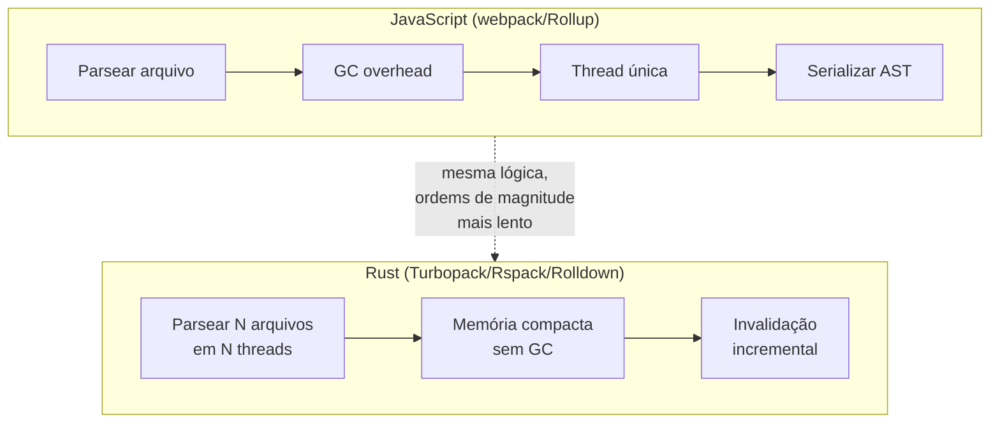
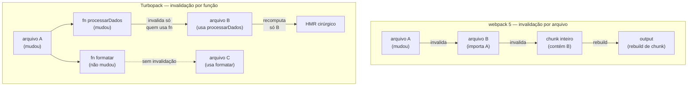
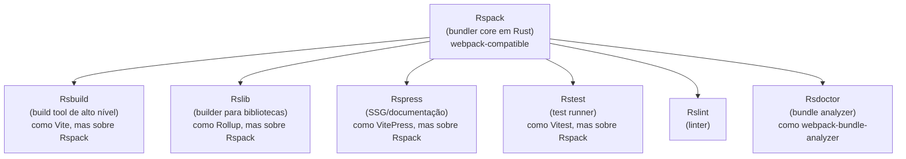
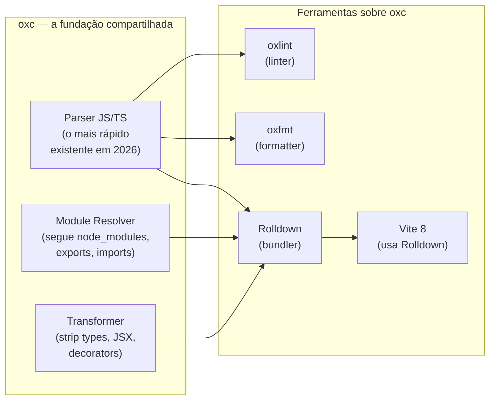
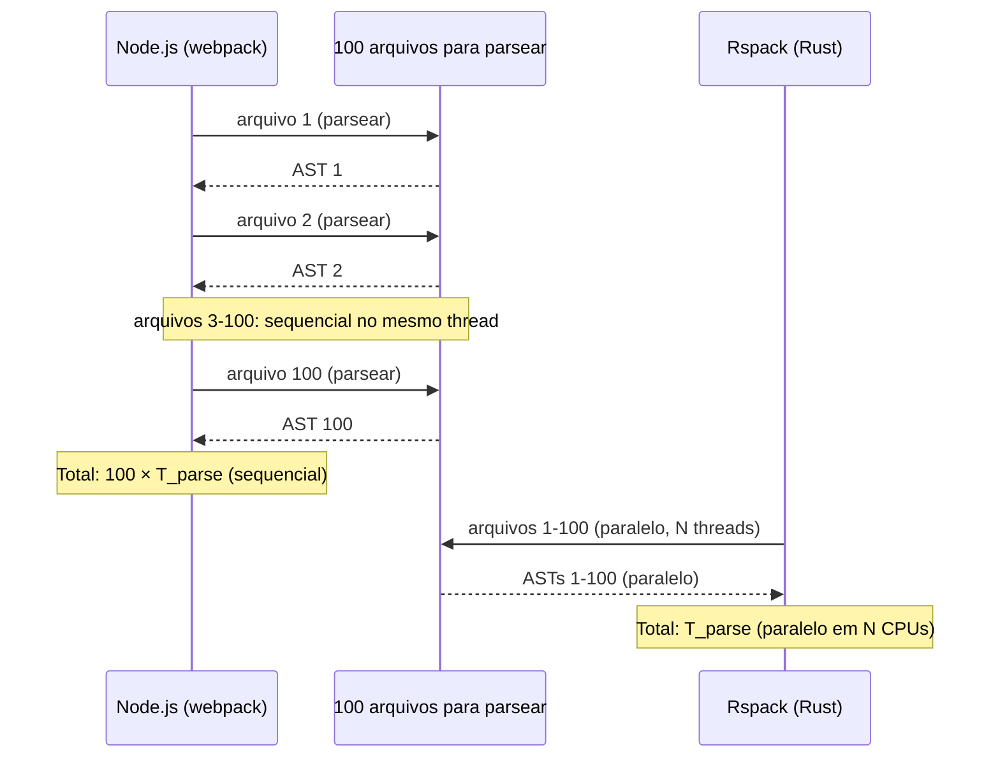
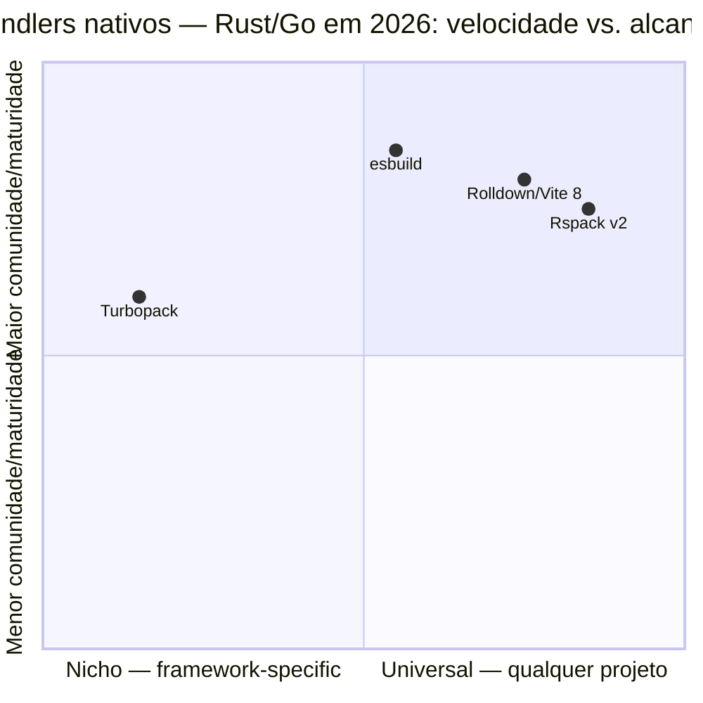
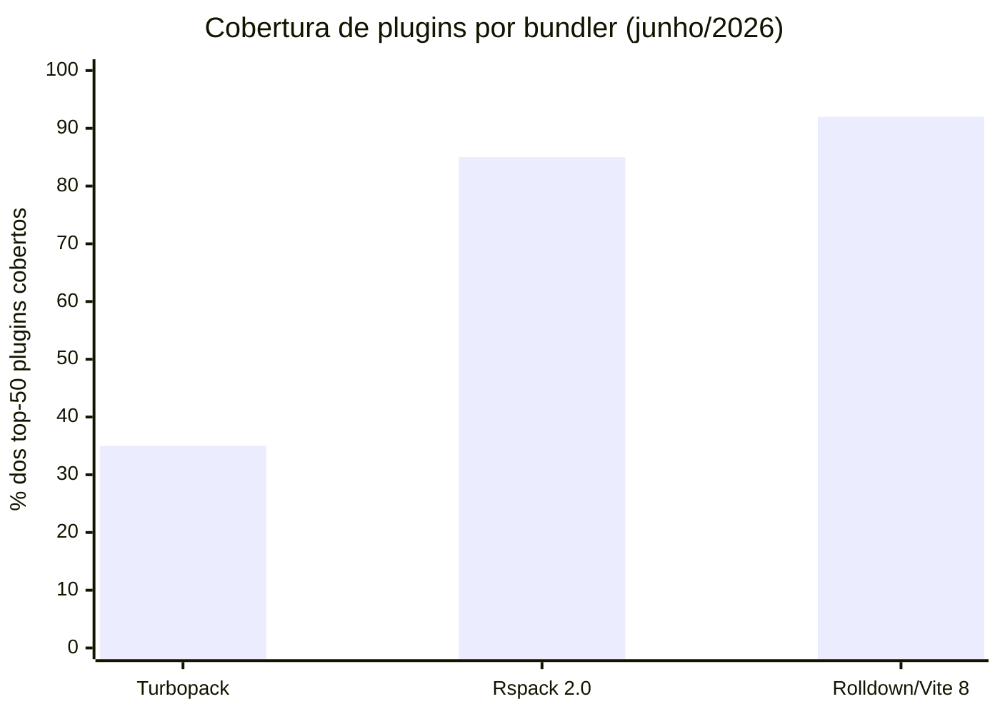
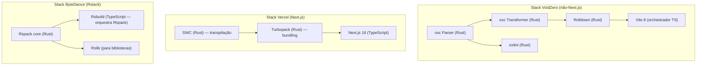

# Turbopack, Rspack e a corrida Rust-Go

> [!abstract] TL;DR
> Em algum momento entre 2022 e 2026, o ecossistema JS acordou para um fato desconfortável: JavaScript não consegue compilar JavaScript rápido o suficiente para projetos enterprise. A resposta foi reescrever as ferramentas em Rust e Go — não por modismo, mas porque CPU-bound code em linguagem compilada é ordens de magnitude mais rápido. O resultado são três apostas distintas: **Turbopack** (Vercel, embutido no Next.js, arquitetura de computação em grafo incremental), **Rspack** (ByteDance, drop-in do webpack em Rust), e o ecossistema **oxc/Rolldown/Vite 8** (VoidZero, toolchain unificado). Cada um com estratégia diferente, todos com o mesmo objetivo: tornar o build de 60 segundos uma memória.

---

## O problema que não era de algoritmo

Imagine que você tem um webpack building uma aplicação medium-large — digamos, 2.000 arquivos TypeScript, 500 de CSS-Modules, um monte de SVGs importados. O build de produção leva 3 minutos. O dev start levava 45 segundos antes do Vite existir. E cada vez que você salva um arquivo, o HMR demora 800ms a 3 segundos para propagar.

Agora suponha que alguém pergunta: "Qual algoritmo do webpack está errado? Como otimizar?" E a resposta honesta é: *nenhum algoritmo específico está errado*. O webpack tem estruturas de dados razoáveis, lógica correta de tree-shaking, invalidação de cache razoável. O problema é mais profundo.

**JavaScript é uma linguagem interpretada/JIT-compilada projetada para ser dinâmica**, não para executar compilação pesada. O V8 é excepcional, mas tem limites: não tem controle fino de threads (Node.js é single-threaded por padrão, worker_threads existe mas é caro de usar), não tem acesso direto a memória sem alocações de GC, e cada operação de parse de AST é uma cadeia de alocações em heap gerenciado. Para tarefas simples, isso é irrelevante. Para analisar um grafo de 5.000 módulos em paralelo, é um gargalo estrutural.

> [!info] O que torna tooling CPU-bound
> Bundling envolve: parsear código (AST), resolver imports (I/O + busca em estruturas de dados), transformar código (visitor patterns sobre AST), gerar output (serialização), computar hashes (criptografia). Dessas 5 etapas, as 4 primeiras são intensamente CPU-bound e se beneficiam imensamente de paralelismo real e acesso a memória eficiente. Rust e Go oferecem os dois; JavaScript não oferece nenhum dos dois de forma ergonômica.

A migração para Rust/Go não foi apenas "reescrever o mesmo algoritmo em outra linguagem". Foi uma mudança de paradigma de design — porque quando você tem threads reais e memória sem GC, você pode fazer coisas que eram impraticáveis antes:

1. **Parsear múltiplos arquivos em paralelo real** (não via worker_threads caros, mas via threads nativas compartilhando memória).
2. **Manter o grafo de módulos em estruturas compactas** sem overhead de GC pressure.
3. **Recomputar incrementalmente** apenas os nós do grafo que mudaram, com granularidade de função — não de arquivo.



---

## Turbopack — a aposta da Vercel em computação em grafo

O Turbopack foi anunciado na Next.js Conf de outubro de 2022, pelo mesmo time que criou o webpack: **Tobias Kopps**, o criador original do webpack, passou a trabalhar para a Vercel e liderou a reescrita do zero em Rust. A promessa inicial era ambiciosa: "700x mais rápido que webpack, 10x mais rápido que Vite".

Os benchmarks foram contestados (comparavam configurações desfavoráveis para o webpack), mas a tecnologia era genuína. Em **outubro de 2025**, com o lançamento do **Next.js 16**, o Turbopack se tornou o bundler padrão para desenvolvimento e produção em projetos Next.js, tendo passado todos os **8.302 testes de integração** do framework. Em junho de 2026, a versão estável em produção é **Next.js 16.2.7**.

### A inovação central: computação em grafo com incrementalidade fina

A diferença arquitetural do Turbopack não é simplesmente "é em Rust". É o modelo de execução. O Turbopack usa um sistema chamado **Turbo Engine** — um motor de computação em grafo que rastreia dependências não apenas entre arquivos, mas entre **funções individuais e saídas computadas**.

> [!note] Turbo Engine: memoização como princípio de design
> O Turbo Engine é inspirado na ideia de **reactive computation** — o mesmo princípio por trás de sistemas como Salsa (usado no rust-analyzer), Adapton e Incremental (Jane Street). A premissa: toda computação é uma função pura `f(inputs) → output`. Se os inputs não mudaram, o output é válido e pode ser reutilizado — sem recomputar. O Turbo Engine aplica isso recursivamente no grafo de módulos: cada nó (arquivo, função, chunk) é uma célula reativa. Quando um input muda, apenas as células que dependem *diretamente* desse input são marcadas como inválidas. As demais permanecem válidas indefinidamente — mesmo entre reinicializações do dev server, desde que o Next.js 16.1+ com persistent cache (File System Cache) esteja habilitado.
> Fonte: [Turbopack architecture — Vercel blog](https://vercel.com/blog/turbopack-moving-past-webpack) (2022)

Pense assim: quando você muda uma linha num arquivo, o webpack 5 precisa reanalisar esse arquivo, qualquer arquivo que o importe, e potencialmente invalidar chunks inteiros. O Turbo Engine rastreia dependências em granularidade mais fina. Se você mudou uma função que só é usada por um componente folha, apenas aquele componente é recomputado — e apenas as partes do bundle que dependem dele.

A resposta é: **on-the-fly, durante a primeira execução**. Não há passagem de análise estática separada antes do build. O Turbo Engine funciona assim: cada operação do bundler é anotada com `#[turbo_tasks::function]` em Rust. Quando uma função é executada pela primeira vez, o engine registra automaticamente cada `Vc` (Value Container — a unidade de valor cacheável) que ela acessa ou aguarda. Esses acessos se tornam as arestas do grafo de dependências. Na primeira execução de um projeto, o grafo é construído progressivamente à medida que o build acontece. Nas execuções subsequentes — ou quando um arquivo muda —, o engine já tem o grafo e sabe exatamente quais nós invalidar sem reprocessar o resto.

Em termos concretos: quando o Turbopack processa `utils.ts` pela primeira vez, ele executa a análise de `calcularDesconto` e `formatarMoeda` e registra quem as acessou. Se `ProductCard.tsx` acessou o nó de `calcularDesconto`, essa aresta existe no grafo. Se você mudar `calcularDesconto` depois, o engine consulta o grafo e invalida exatamente `ProductCard.tsx` — sem reanalizar `utils.ts` inteiro nem consultar `CheckoutSummary.tsx`.
Fonte: [Inside Turbopack: Building Faster by Building Less — nextjs.org](https://nextjs.org/blog/turbopack-incremental-computation) (2025); [Turbopack incremental computation docs — turbo.build](https://turbo.build/pack/docs/incremental-computation)



Esse modelo é inspirado em sistemas de *reactive computation* e *memoization de grafos* — a ideia de que qualquer saída computada pode ser cacheada e só é recalculada quando suas entradas diretas mudam. Para HMR em aplicações grandes, isso é transformador: ao invés de invalidação em cascata, você tem atualizações cirúrgicas.

#### Function-level caching: o que significa na prática

"Granularidade de função" soa abstrato. Veja um exemplo concreto:

```typescript
// utils.ts
export function calcularDesconto(preco: number, pct: number) {
  return preco * (1 - pct / 100);
}

export function formatarMoeda(valor: number) {
  return valor.toLocaleString('pt-BR', { style: 'currency', currency: 'BRL' });
}
```

```typescript
// ProductCard.tsx — usa só calcularDesconto
import { calcularDesconto } from './utils';

// CheckoutSummary.tsx — usa só formatarMoeda
import { formatarMoeda } from './utils';
```

No **webpack 5**: você muda `calcularDesconto` → `utils.ts` é reprocessado inteiro → qualquer chunk que contenha `utils.ts` é invalidado → `CheckoutSummary.tsx` (que só usa `formatarMoeda`, que não mudou) também é reprocessado.

No **Turbo Engine**: o nó `calcularDesconto` é invalidado → `ProductCard.tsx` é reprocessado → `CheckoutSummary.tsx` permanece válido, porque sua dependência (`formatarMoeda`) não mudou. O HMR entrega apenas o update de `ProductCard`.

Isso escala dramaticamente em aplicações enterprise com centenas de funções utilitárias compartilhadas entre dezenas de componentes. Em vez de "invalida o módulo inteiro", você tem "invalida exatamente o que mudou".

### O que o Turbopack não é (ainda)

Um ponto importante de honestidade: **em junho de 2026, o Turbopack é fundamentalmente um bundler do Next.js**, não uma ferramenta universal.

Você não pode usar `turbopack` como bundler standalone da mesma forma que usa webpack, Vite ou Rspack. Não há CLI independente, não há API pública estável para projetos não-Next.js, não há ecossistema de plugins equivalente ao webpack. A promessa de ser um "bundler universal" existe nos planos da Vercel, mas o foco atual é tornar o Next.js rápido — e ele consegue isso muito bem.

```bash
# Turbopack no Next.js 16 — é o padrão, não precisa configurar
npx create-next-app@latest meu-projeto

# Verificar que está usando Turbopack
cat next.config.js
# Em Next.js 16, turbopack é ativado por padrão

# Se precisar voltar ao webpack (casos legados)
# next.config.js
/** @type {import('next').NextConfig} */
const nextConfig = {
  bundler: 'webpack', // opt-out explícito
};
export default nextConfig;
```

> [!warning] Turbopack e plugins webpack
> O Turbopack tem seu próprio modelo de plugins — incompatível com o ecossistema de plugins webpack. Se seu projeto Next.js depende de plugins webpack customizados (webpack-bundle-analyzer customizado, plugins de obfuscação, etc.), a migração exige adaptação. Para a maioria dos casos de uso do Next.js (TypeScript, CSS Modules, SVG, fontes), o Turbopack tem suporte nativo.

### Desempenho real do Turbopack (Next.js 16)

| Métrica | webpack (Next.js 15) | Turbopack (Next.js 16) | Melhoria |
|---------|---------------------|------------------------|----------|
| Dev server startup | ~5-8s | ~400ms | ~15x |
| HMR (componente folha) | ~500ms | ~30ms | ~16x |
| Build de produção (app médio) | ~60-90s | ~12-18s | ~5x |
| File System Caching (rebuild) | manual | automático (Next.js 16.1) | qualitativo |

*Números aproximados — variam imensamente por tamanho e configuração do projeto.*

---

## Rspack — o drop-in do webpack em Rust

Se o Turbopack é a aposta de construir algo novo e melhor, o **Rspack** é a aposta de construir algo novo que parece exatamente com o antigo. Desenvolvido pelo **Infrastructure team da ByteDance** (a empresa do TikTok), o Rspack nasceu de uma dor real: ByteDance tinha **milhares de projetos internos baseados em webpack**, com décadas acumuladas de configurações, loaders customizados e plugins proprietários. Uma migração para Vite ou Turbopack exigiria reescrever tudo.

A pergunta que motivou o Rspack foi diferente: *e se você pudesse manter sua config webpack e simplesmente fazer o bundler ser 10x mais rápido?*

### A proposta webpack-compatible

O Rspack implementa a **webpack API** em Rust. Não toda a API — mas o suficiente para que a maioria dos projetos webpack funcione sem mudança:

```javascript
// webpack.config.js — funciona sem modificação no Rspack
const path = require('path');
const HtmlWebpackPlugin = require('html-webpack-plugin');
const MiniCssExtractPlugin = require('mini-css-extract-plugin');

module.exports = {
  entry: './src/index.tsx',
  output: {
    path: path.resolve(__dirname, 'dist'),
    filename: '[name].[contenthash].js',
    clean: true,
  },
  resolve: {
    extensions: ['.tsx', '.ts', '.js'],
  },
  module: {
    rules: [
      {
        test: /\.(ts|tsx)$/,
        use: 'builtin:swc-loader',  // equivalente ao ts-loader, mas embutido
        exclude: /node_modules/,
      },
      {
        test: /\.css$/,
        use: [MiniCssExtractPlugin.loader, 'css-loader'],
      },
    ],
  },
  plugins: [
    new HtmlWebpackPlugin({ template: './public/index.html' }),
    new MiniCssExtractPlugin({ filename: '[name].[contenthash].css' }),
  ],
};
```

A única mudança no exemplo acima é `builtin:swc-loader` em vez de `babel-loader` ou `ts-loader`. O Rspack tem o SWC embutido, então transpilação TypeScript e JSX vem de graça, sem instalar loaders adicionais.

Para a migração, o processo é geralmente:

```bash
# 1. Trocar a dependência
npm remove webpack webpack-cli webpack-dev-server
npm install @rspack/core @rspack/cli --save-dev

# 2. Atualizar scripts no package.json
# "build": "rspack build"
# "dev": "rspack dev"

# 3. Renomear (opcional — Rspack lê webpack.config.js)
mv webpack.config.js rspack.config.js

# 4. Ajustes menores de configuração (se necessário)
# Em rspack.config.js: troca "webpack" por "@rspack/core" nos requires
```

### O ecossistema Rstack

ByteDance não parou no bundler. Eles construíram um ecossistema completo ao redor do Rspack, chamado **Rstack**:



**Rsbuild** é a ferramenta mais relevante do Rstack para a maioria dos projetos. Ele fica acima do Rspack como o Vite fica acima do Rolldown: você configura o Rsbuild, não o Rspack diretamente. O Rsbuild fornece uma DX moderna (TypeScript nativo, CSS Modules, HMR, dev server) sem exigir que você escreva uma config Rspack do zero.

```javascript
// rsbuild.config.ts — experiência Vite-like sobre Rspack
import { defineConfig } from '@rsbuild/core';
import { pluginReact } from '@rsbuild/plugin-react';

export default defineConfig({
  plugins: [pluginReact()],
  html: {
    template: './public/index.html',
  },
  output: {
    distPath: {
      root: 'dist',
    },
  },
  // zero configuração adicional — TypeScript, CSS, assets: tudo incluso
});
```

### Status do Rspack em 2026

Em **abril de 2026**, o Rspack lançou a **versão 2.0**, chegando a **5 milhões de downloads semanais** no npm (de 100.000 em agosto de 2024 — crescimento de 50x em menos de 2 anos). A versão 2.0 trouxe:

- **~10% de melhoria de performance** sobre o 1.7 (builds sem cache: 3.6s → 3.1s num benchmark representativo).
- **Cache persistente** que reduz builds subsequentes em ~50%.
- **Dependências drasticamente reduzidas**: o `@rspack/dev-server` passou de 192 dependências para 1; `@rspack/cli` para zero dependências.
- **Tree-shaking de CommonJS** — análise estática capaz de fazer dead code elimination em módulos CJS (algo que o Rollup/webpack fazem só em ESM).
- **Suporte experimental a React Server Components** (alinhando com Next.js patterns).
- **ESM puro** em todos os pacotes core do Rspack.

A compatibilidade com webpack é de ~85% dos 50 plugins mais baixados. Para o uso típico (TypeScript, React/Vue, CSS Modules, assets), a cobertura é praticamente 100%.

A ponte é o **NAPI-RS** — uma biblioteca que compila código Rust como um addon binário para Node.js (um arquivo `.node`). O processo funciona assim: o Rspack compila seu core Rust para um módulo nativo Node.js. Quando você executa `rspack build`, o Node.js carrega esse módulo nativo, repassa a configuração (incluindo seus plugins JS) para o core Rust, e o Rspack orquestra a compilação. Quando um hook de plugin precisa ser chamado (ex: `compiler.hooks.emit`), o core Rust faz uma chamada de volta (callback) para o JS via NAPI-RS — e o plugin JavaScript executa normalmente no V8, com acesso ao objeto `compiler` que o Rspack expõe.

O overhead da travessia Rust↔JS existe, mas é marginal na prática. Plugins JS são chamados em hooks bem definidos (início/fim de fase, processamento de asset), não dentro dos loops críticos de parse/transform onde o Rust opera. O hot path do bundling — parsear arquivos, resolver imports, transformar TypeScript — é 100% Rust, sem cruzar a fronteira JS. Um plugin que registra hooks de compilação e manipula assets cruza a fronteira algumas dezenas de vezes por build, enquanto o Rust processa milhares de módulos sem sair do Rust. O ganho de 5-10x permanece mesmo com plugins JS.
Fonte: [Plugin Architecture — deepwiki.com/web-infra-dev/rspack](https://deepwiki.com/web-infra-dev/rspack/4.1-compiler-and-compilation); [Implementing webpack in Rust with NAPI-RS — dev.to](https://dev.to/paradeto/implementing-webpack-from-scratch-but-in-rust-3-using-napi-rs-to-create-nodejs-addons-347h)

---

## oxc — o toolchain unificado em Rust

Enquanto Turbopack e Rspack são bundlers (ferramentas de empacotamento), o **oxc** (JavaScript Oxidation Compiler) tem uma ambição diferente: ser a **camada de baixo nível que alimenta todo o resto**.

Criado pela comunidade open-source e adotado pela **VoidZero** (a empresa que Evan You fundou para sustentar o desenvolvimento do Vite/Rolldown), o oxc é uma coleção de ferramentas de alto desempenho em Rust que compartilham um único parser e resolver:



A chave é que **parser, resolver e transformer são compartilhados**. Quando o oxlint analisa um arquivo, ele usa o mesmo parser que o Rolldown usa ao bundlar. Quando você roda o formatter, não há segunda passagem de parsing. Isso elimina redundância e garante que todas as ferramentas concordam sobre como o código é estruturado — sem discrepâncias silenciosas entre "como o linter lê" e "como o bundler lê".

> [!question] "Sem segunda passagem de parsing" funciona quando oxlint e Rolldown rodam em momentos diferentes do pipeline?
> Num workflow real, o lint corre em CI e o bundle corre no build — processos separados. Como o parser "compartilhado" evita o double-parsing nesses cenários? Ou o benefício só vale quando as ferramentas rodam dentro do mesmo processo (ex: Vite dev server)?

### oxlint — 50-100x mais rápido que ESLint

O componente mais maduro do oxc é o **oxlint** (v1.0 estável desde 2025). O número que mais impressiona:

| Ferramenta | Tempo em projeto com ~2000 arquivos TS |
|------------|----------------------------------------|
| ESLint 9 | 12,4 segundos |
| oxlint | 0,13 segundos |
| Diferença | **~95x mais rápido** |

Em CI/CD, isso é a diferença entre um job de lint que bloqueia o pipeline por 2 minutos e um que termina em 10 segundos. Em monorepos grandes (10.000+ arquivos), o oxlint pode completar o lint em menos tempo do que o ESLint levaria para inicializar.

```bash
# oxlint — CLI direto, zero configuração
npx oxlint@latest src/

# com configuração (oxlint.json)
npx oxlint@latest --config oxlint.json src/

# integração com CI
# Maio 2026: oxlint agora suporta "agent output mode"
# para integração com LLMs e ferramentas de IA
npx oxlint@latest --format json src/ | jq '.diagnostics'
```

> [!note] oxlint não substitui ESLint completamente (ainda)
> Em junho de 2026, o oxlint implementa as regras mais comuns do ESLint (incluindo react, import, unicorn), mas não tem extensibilidade via plugins JS da mesma forma que o ESLint. Se você tem regras customizadas escritas em JavaScript para o ESLint, você não pode portá-las para o oxlint diretamente. A abordagem recomendada é usar oxlint para as regras de lint "padrão" (muito mais rápido) e manter ESLint só para as regras customizadas — duas ferramentas em sequência, cada uma fazendo o que faz melhor. Veja [[16 - Linting, formatting e git hooks]] para detalhes.

### Rolldown — o motor de produção do Vite

O **Rolldown** é o bundler do ecossistema VoidZero. Escrito em Rust, com API compatível com o Rollup, ele foi projetado para substituir o Rollup como motor de produção do Vite. Em **maio de 2026**, com o Vite 8, a migração está completa:

| Versão Vite | Motor dev | Motor produção |
|-------------|-----------|----------------|
| Vite 5 | esbuild (pre-bundling) + ESM nativo | Rollup (JS) |
| Vite 6-7 | esbuild (pre-bundling) + ESM nativo | Rollup (JS) + Rolldown experimental |
| **Vite 8** | **Rolldown (Rust)** | **Rolldown (Rust)** |

O Rolldown elimina a inconsistência entre dev e prod que era um ponto fraco histórico do Vite. Com um único motor para os dois modos, o comportamento de produção e desenvolvimento é idêntico — builds que passam em dev sempre passam em prod.

A separação foi uma decisão pragmática com duas forças em direções opostas. Em **desenvolvimento**, o esbuild era ordens de magnitude mais rápido para pré-bundlar dependências (`node_modules`) e transformar código TypeScript/JSX — ideal para o ciclo de edição-salva-HMR. Em **produção**, o Rollup tinha um ecossistema de plugins maduro e uma API de hooks (`renderChunk`, `generateBundle`, `resolveId`) que o ecossistema inteiro havia adotado. A API de plugins do Vite foi construída *sobre* a API do Rollup — e essa compatibilidade com o ecossistema foi um dos fatores centrais do sucesso do Vite.

O que impedia usar só esbuild ou só Rollup: o esbuild não implementava a API de plugins do Rollup (sistemas incompatíveis), e o Rollup em JavaScript era lento demais para o ciclo de dev. Juntar os dois exigia um motor que fosse rápido como o esbuild *e* implementasse a API do Rollup — o que só foi possível com o Rolldown em Rust. O Rolldown foi projetado desde o início para ser compatível com a API do Rollup e nativo o suficiente para substituir o esbuild no dev. Por isso a unificação só veio com o Vite 8.
Fonte: [Why does Vite use both Rollup and esbuild? — github.com/vitejs/vite/discussions](https://github.com/vitejs/vite/discussions/7622); [Rolldown and Vite 8: What Changed — certificates.dev](https://certificates.dev/blog/rolldown-and-vite-8-what-changed)

Performance real reportada por empresas que migraram para Vite 8/Rolldown:

| Empresa | Antes (Rollup) | Depois (Rolldown) | Melhoria |
|---------|---------------|-------------------|----------|
| Linear | 46s | 6s | 87% |
| Ramp | baseline | -57% | 57% |
| Beehiiv | baseline | -64% | 64% |

---

## A tese central: por que JS tooling migrou para Rust/Go

Essa é a pergunta que vai cair em entrevista. Não é "Rust é melhor que JS" como julgamento de valor — é uma questão de adequação da ferramenta ao problema.

### 1. JavaScript é single-threaded por design

O event loop do Node.js foi projetado para I/O assíncrono de alta concorrência, não para paralelismo CPU-bound. Workers existem, mas têm overhead de serialização e inicialização que os torna caros para tarefas de curta duração. Rust e Go têm threads nativas que compartilham memória — você pode parsear 100 arquivos em 100 threads ao mesmo tempo, com overhead mínimo de coordenação.



### 2. Pressão de GC em operações de alto throughput

O Garbage Collector do V8 é excelente para workloads de servidor long-running ou UI responsiva. Mas durante um build, você está alocando e descartando milhões de objetos em curto espaço de tempo (nós de AST, strings de código transformado, etc.). O GC precisa interromper a execução periódicamente para coletar esse lixo. Em Rust, a memória é liberada deterministicamente no final do escopo — sem pausas, sem overhead de runtime.

### 3. Representação compacta de AST

Uma AST JavaScript representada em objetos V8 tem overhead de pointers, type tags e shape-maps que o V8 usa para otimização JIT. Uma AST em Rust pode ser representada como um `Vec<Node>` compacto em memória linear, com indices em vez de pointers. O resultado é melhor localidade de cache — que, em CPUs modernas, é frequentemente o fator determinante de performance.

### 4. A oportunidade de design do zero

Reescrever em Rust não é só "mesmo algoritmo, outra linguagem". É a oportunidade de redesenhar sem carregar compatibilidade histórica. O webpack 5 tem décadas de decisões de API que não podem ser revertidas. O Turbopack pode adotar incrementalidade fina desde o design inicial. O Rspack pode embutir o SWC como motor de transpilação, eliminando um processo extra. O oxc pode compartilhar um único parser entre linter, formatter e bundler.

> [!info] Por que Go e não Rust para o esbuild?
> esbuild (escrito em Go) antecedeu a era Rust e provou o conceito: ferramentas de sistemas compiladas batiam JavaScript por 10-100x. Go é mais simples de escrever que Rust (sem lifetime, sem borrow checker) e compilação é mais rápida. O trade-off é que Go tem GC — mais simples que o GC do V8, mas ainda presente. Rust elimina o GC completamente. Em 2026, os projetos mais novos (Rolldown, Rspack, Turbopack) escolhem Rust; esbuild continua em Go e continua sendo extremamente rápido. A diferença em uso prático é marginal. Ver [[14 - Rollup, esbuild e Rolldown]] para esbuild em detalhe.

---

## Comparando as três apostas em 2026



| Critério | Turbopack | Rspack 2.0 | Rolldown/Vite 8 |
|----------|-----------|------------|-----------------|
| **Linguagem** | Rust | Rust | Rust |
| **Compatibilidade** | API própria | webpack-compatible | Rollup-compatible |
| **Melhor para** | Projetos Next.js | Migração de webpack | Apps novos (não Next.js) |
| **Foco de inovação** | Incrementalidade fina | Drop-in, ecosystem fit | Unificação dev/prod |
| **Maturidade (jun/2026)** | Estável (Next.js 16) | Estável (v2.0) | Estável (Vite 8) |
| **Standalone use** | Não | Sim | Sim |
| **Downloads/semana** | N/A (embutido no Next.js) | ~5M | (via Vite) |
| **Plugin ecosystem** | API própria em dev | 85% dos webpack plugins | Rollup plugins |

---

## Trade-offs sênior: o que os benchmarks não contam

Escolher um bundler não é só comparar segundos de build. Há dimensões que aparecem 6 meses depois da adoção — e é sobre essas que entrevistadores sênior costumam perguntar.

### Portabilidade de configuração e lock-in

**Turbopack** tem a API mais proprietária dos três. A configuração vive dentro do `next.config.js` e o modelo de plugins do Turbopack é incompatível com webpack. Se você precisar migrar de Next.js para outro framework no futuro, você não leva nada da configuração de build — começa do zero. Para a maioria dos projetos Next.js isso é irrelevante, mas é um risco arquitetural real em grandes organizações que trocam frameworks a cada 3-5 anos.

**Rspack** aposta na portabilidade máxima: você pode levar sua `webpack.config.js` exatamente como está. O risco inverso é que você carrega também todos os padrões de configuração legados do webpack — incluindo os problemáticos (configuração de resolver customizada, loaders encadeados obscuros). A compatibilidade é uma feature e um fardo ao mesmo tempo.

**Rolldown/Vite 8** tem o melhor equilíbrio: API compatível com Rollup (ecossistema estabelecido), mas sem o peso da compatibilidade total com webpack. A desvantagem é que projetos vindos de webpack precisam de uma migração mais cuidadosa — não é drop-in.

### Maturidade do ecossistema de plugins



O número de plugins disponíveis importa quando você está integrando em um monorepo com ferramentas específicas: SVG-as-component, image optimization customizada, module federation, federation para micro-frontends. Turbopack cobre o essencial (TypeScript, CSS Modules, SVG, fontes) mas não tem ecossistema de plugins para casos avançados. Rspack cobre 85% dos webpack plugins. Rolldown herda o ecossistema Rollup (maduro e bem documentado).

### Module Federation — o elefante na sala

**Module Federation** (webpack 5) é um dos recursos mais usados em arquiteturas de micro-frontend enterprise: permite que aplicações separadas carreguem módulos de outras aplicações *em runtime*, sem rebuildar nada. É a peça que mantém muitas empresas em webpack apesar de tudo.

- **Rspack**: implementa Module Federation 2.0 (`@module-federation/rspack`). É a alternativa mais madura para quem vem do webpack MF.
- **Turbopack**: não suporta Module Federation em junho de 2026. Se você usa MF, Turbopack não é uma opção.
- **Rolldown/Vite 8**: suporte via plugin `@originjs/vite-plugin-federation` (Rollup-compatible), mas sem a paridade total com webpack MF 2.0.

Se Module Federation é parte do seu stack, Rspack é hoje o único caminho de migração viável que preserva essa funcionalidade.
Fonte: [Module Federation docs — rspack.dev](https://rspack.dev/guide/features/module-federation) (2026)

### Custo de debug e observabilidade

Ferramentas em Rust produzem erros de build mais difíceis de debugar quando há falha em um loader ou plugin nativo. No webpack, um erro num loader JS tem um stack trace JavaScript compreensível. No Rspack/Turbopack, o erro pode ocorrer em código Rust e a mensagem surfacear com menos contexto.

**Rsdoctor** (ferramenta de diagnóstico do Rstack) mitiga isso para o Rspack: ele expõe um bundle analyzer, timeline de build e diagnóstico de loaders com uma UI visual comparável ao webpack-bundle-analyzer. Para o Turbopack, a ferramenta de diagnóstico está embutida no Next.js dev overlay mas não tem equivalente externo.

> [!warning] Performance em monorepos grandes
> Os benchmarks padrão de Rspack/Turbopack usam projetos de 1.000-10.000 módulos. Em monorepos com 50.000+ módulos (realidade de empresas como ByteDance, Shopify, Meta), o comportamento pode ser diferente. O Rspack foi projetado especificamente para esse scale — a ByteDance testou-o internamente em repositórios com dezenas de milhares de projetos antes de open-sourcear. O Turbopack também foi testado em escala (o Next.js da Vercel tem apps grandes), mas com arquitetura diferente (incremental por sessão de dev). Para produção de escala enterprise, valide com seu próprio projeto antes de comprometer a migração.

---

## Exemplo prático: migrando de webpack para Rspack

Este é o cenário mais concreto para uma entrevista. Você tem um projeto webpack legado e precisa melhorar a performance de build sem reescrever a configuração.

### Antes — webpack 5 com Babel

```bash
# package.json — antes
{
  "devDependencies": {
    "webpack": "^5.91.0",
    "webpack-cli": "^5.1.4",
    "webpack-dev-server": "^5.0.4",
    "babel-loader": "^9.1.3",
    "@babel/core": "^7.24.0",
    "@babel/preset-env": "^7.24.0",
    "@babel/preset-react": "^7.23.3",
    "@babel/preset-typescript": "^7.24.0",
    "css-loader": "^7.1.2",
    "style-loader": "^4.0.0",
    "html-webpack-plugin": "^5.6.0",
    "mini-css-extract-plugin": "^2.9.0"
  }
}
```

```javascript
// webpack.config.js — antes
const path = require('path');
const HtmlWebpackPlugin = require('html-webpack-plugin');
const MiniCssExtractPlugin = require('mini-css-extract-plugin');

module.exports = {
  entry: './src/index.tsx',
  output: {
    path: path.resolve(__dirname, 'dist'),
    filename: '[name].[contenthash].js',
    clean: true,
  },
  resolve: { extensions: ['.tsx', '.ts', '.js'] },
  module: {
    rules: [
      {
        test: /\.(ts|tsx)$/,
        use: {
          loader: 'babel-loader',
          options: {
            presets: [
              '@babel/preset-env',
              '@babel/preset-react',
              '@babel/preset-typescript',
            ],
          },
        },
      },
      {
        test: /\.css$/,
        use: [MiniCssExtractPlugin.loader, 'css-loader'],
      },
    ],
  },
  plugins: [
    new HtmlWebpackPlugin({ template: './public/index.html' }),
    new MiniCssExtractPlugin({ filename: '[name].[contenthash].css' }),
  ],
};
```

### Depois — Rspack com SWC embutido

```bash
# Passo 1: trocar dependências
npm remove webpack webpack-cli webpack-dev-server babel-loader \
  @babel/core @babel/preset-env @babel/preset-react @babel/preset-typescript

npm install @rspack/core @rspack/cli --save-dev
# css-loader, html-webpack-plugin, mini-css-extract-plugin: ficam

# Passo 2: renomear config (opcional — Rspack lê webpack.config.js também)
mv webpack.config.js rspack.config.js

# Passo 3: atualizar scripts
# "build": "rspack build",
# "dev": "rspack dev",
# "start": "rspack dev"
```

```javascript
// rspack.config.js — depois (mínimas mudanças)
const path = require('path');
const HtmlWebpackPlugin = require('html-webpack-plugin'); // funciona sem mudança
const { CssExtractRspackPlugin } = require('@rspack/core'); // equivalente do MiniCssExtractPlugin

module.exports = {
  entry: './src/index.tsx',
  output: {
    path: path.resolve(__dirname, 'dist'),
    filename: '[name].[contenthash].js',
    clean: true,
  },
  resolve: { extensions: ['.tsx', '.ts', '.js'] },
  module: {
    rules: [
      {
        test: /\.(ts|tsx)$/,
        loader: 'builtin:swc-loader', // SWC embutido — sem instalar nada
        options: {
          jsc: {
            parser: {
              syntax: 'typescript',
              tsx: true,
            },
            transform: {
              react: { runtime: 'automatic' },
            },
          },
        },
      },
      {
        test: /\.css$/,
        use: [CssExtractRspackPlugin.loader, 'css-loader'],
      },
    ],
  },
  plugins: [
    new HtmlWebpackPlugin({ template: './public/index.html' }),
    new CssExtractRspackPlugin({ filename: '[name].[contenthash].css' }),
  ],
};
```

O que mudou:
- `babel-loader` → `builtin:swc-loader` (embutido, sem instalação separada)
- `MiniCssExtractPlugin` → `CssExtractRspackPlugin` (equivalente no core do Rspack)
- Tudo mais ficou igual

O que você ganha: 5-10x mais velocidade no build, sem reescrever nenhuma lógica de bundling.

> [!tip] Rsbuild como alternativa à migração direta
> Se seu projeto webpack tem configuração complexa e você quer uma DX mais moderna, considere migrar para **Rsbuild** em vez de Rspack diretamente. O Rsbuild usa Rspack por baixo, mas fornece uma camada de configuração de alto nível (similar ao Vite) que elimina muito do boilerplate do webpack. Veja a [documentação de migração webpack→Rsbuild](https://rsbuild.rs/guide/migration/webpack).

---

## O que ainda não está maduro

Honestidade é parte do rigor técnico. Em junho de 2026, há limitações reais:

**Turbopack:**
- Plugin API própria, sem compatibilidade com plugins webpack ou Vite.
- Uso prático limitado ao Next.js — sem CLI standalone para projetos gerais.
- Documentação de API de plugins ainda em construção.

**Rspack:**
- ~15% dos plugins webpack mais usados ainda não são compatíveis (principalmente os mais complexos/obscuros).
- Loaders escritos em C++ (via node-gyp) podem ter problemas — o Rspack usa seu próprio binding nativo.
- HMR para edge cases menos comuns pode ter comportamento diferente do webpack.

**oxc/Rolldown/Vite 8:**
- oxlint não tem sistema de plugins em JavaScript — regras customizadas precisam ser escritas em Rust ou mantidas no ESLint separado.
- Rolldown 1.0 ainda tem alguns comportamentos diferentes do Rollup em edge cases de output (em revisão ativa).
- A unificação Vite 8 é recente — algumas integrações (plugins de terceiros que assumem esbuild no dev) podem precisar de atualização.

> [!warning] Quando NÃO usar bundlers em Rust ainda
> - Projetos que dependem de plugins webpack altamente customizados (Turbopack e Rspack podem não cobrir).
> - Projetos que usam loaders webpack com código nativo (C++ addons).
> - Ambientes corporativos com auditoria de segurança rigorosa onde binários Rust pré-compilados precisam de aprovação.
> - Projetos muito pequenos: para um projeto de 10 arquivos, a diferença entre 2s e 200ms de build não importa.

---

## Como a corrida Rust-Go conecta com o resto do ecossistema

A nota [[08 - Transpilação e targets]] mostra que SWC (Rust) e esbuild (Go) já substituíram Babel como transpiladores padrão. A nota [[14 - Rollup, esbuild e Rolldown]] aprofunda o esbuild e o Rolldown. O que esta nota acrescenta é a camada de bundler: como Turbopack e Rspack levam a mesma filosofia de "linguagem nativa = velocidade" para o problema de empacotamento completo.

O padrão emergente é uma stack em camadas onde cada camada é Rust/Go:



A camada de orchestração (Vite, Next.js, Rsbuild) ainda é TypeScript — ela gerencia configuração, dev server, plugins de alto nível. O hot path (parse, transform, bundle, lint) é Rust. Essa divisão é deliberada: Rust para o que precisa ser rápido, TypeScript para o que precisa ser extensível.

Isso conecta com o que você viu em [[03-Dominios/Ciência/Compiladores e Linguagens/index|Compiladores e Linguagens]]: a escolha entre linguagens compiladas e interpretadas para uma tarefa específica é sempre sobre trade-offs de performance vs. ergonomia de desenvolvimento. Aqui, o ecossistema JS fez uma escolha consciente: ergonomia (TS/JS) para a camada de plugin/config, performance (Rust) para o core.

---

## Como explicar em inglês

The JavaScript tooling ecosystem migrated to Rust and Go because bundling is fundamentally CPU-bound work — parsing ASTs, resolving module graphs, transforming code — and JavaScript's single-threaded model with GC overhead is structurally ill-suited for that. Rewriting in Rust allows true parallelism (native threads sharing memory), deterministic memory management (no GC pauses), and compact data structures with better cache locality.

There are three main players in the "native bundlers" space as of 2026. **Turbopack** (Vercel, Rust) is built into Next.js 16 as the default bundler, with a fine-grained incremental computation model — it tracks dependencies at the function level, not the file level, enabling surgical HMR invalidation. It's fast and stable for Next.js projects, but it's not a standalone tool yet.

**Rspack** (ByteDance, Rust) takes a different approach: drop-in webpack compatibility. You keep your `webpack.config.js`, swap the package, and get 5-10x faster builds. The tradeoff is that Rspack has to carry webpack's API surface, which constrains design choices. Rspack 2.0 (April 2026) hit 5M weekly downloads. The broader **Rstack** ecosystem adds Rsbuild (a Vite-like experience on top of Rspack), Rslib (for libraries), and Rspress (docs).

**oxc** (Rust, VoidZero) is the lowest-level player: a collection of JS tools (parser, linter, formatter, transformer) sharing a single parse pass, designed as the foundation for Rolldown and Vite 8. Rolldown is Rollup's Rust replacement as Vite's production bundler — Vite 8 completed the migration in May 2026, unifying dev and prod under a single Rust engine.

### Vocabulário-chave

| Português | English |
|-----------|---------|
| corrida de armamentos / disputa | arms race / tooling race |
| bundler em linguagem nativa | native-language bundler |
| computação em grafo incremental | incremental graph computation |
| invalidação fina / granular | fine-grained invalidation |
| compatibilidade drop-in | drop-in compatibility |
| pressão de GC | GC pressure |
| paralelismo real de threads | true thread-level parallelism |
| memória gerenciada | managed memory |
| memória sem GC | GC-free memory (ownership model) |
| toolchain unificado | unified toolchain |
| substituição como motor | drop-in engine replacement |
| parser compartilhado | shared parser |
| linting com velocidade nativa | native-speed linting |
| migração de webpack | webpack migration / webpack drop-in |
| tempo de build | build time |
| tempo de startup do dev server | dev server startup time |

---

## Armadilhas comuns

**"Turbopack vai substituir webpack para todo mundo."**
Não em 2026. O Turbopack é um bundler do Next.js. Se seu projeto não usa Next.js, o Turbopack não está disponível para você hoje. A confusão surge porque a Vercel anunciou Turbopack como "webpack successor" — o que é verdade *dentro* do ecossistema Next.js, não para o ecossistema geral.

**"Rspack é 23x mais rápido que webpack — vou ter uma migração fácil."**
O número de 23x vem de benchmark controlado (app de referência com configuração equivalente). Em projetos reais com plugins customizados, a speedup é menor (tipicamente 5-10x), e a migração pode exigir substituir plugins incompatíveis. Teste em staging antes de migrar produção.

**"oxlint substitui ESLint completamente."**
Ainda não, em junho de 2026. Para regras padrão (ESLint recommended, react, import), o oxlint cobre bem. Para regras customizadas escritas em JS, você continua precisando do ESLint. A abordagem pragmática é usar ambos em pipeline — oxlint primeiro (para os 90% dos erros comuns, muito mais rápido) e ESLint depois (para regras customizadas).

**"Rolldown já é a mesma coisa que Rollup — pode trocar 1:1."**
Quase. O Rolldown tem API compatível com Rollup, mas alguns edge cases de output ainda divergem (documentados no changelog do Rolldown 1.0). Para a maioria dos projetos e plugins populares, a migração é transparente. Para libs que fazem uso intenso de APIs internas do Rollup, teste antes de assumir paridade.

**"Vite 8 com Rolldown vai ser incompatível com meus plugins Vite."**
Plugins Vite bem escritos (que seguem a API do hook system do Vite) continuam funcionando em Vite 8. O que pode mudar é o comportamento de plugins que assumem internals do esbuild no dev mode (ex: plugins que usam `esbuildOptions` diretamente). A migração tipicamente exige atualizar esses plugins, não o código do projeto.

---

## Novidades relevantes (junho 2026)

> [!info] Estado atual das ferramentas — referências primárias

**Turbopack / Next.js 16**
- Next.js 16 lançado em outubro de 2025 com Turbopack como bundler padrão em dev e produção. A versão estável de referência em junho/2026 é **Next.js 16.2.7**.
- Next.js 16.1 introduziu **File System Cache** (persistent cache): o Turbopack persiste o grafo de computação no disco entre reinicializações do dev server — cold starts passam de ~400ms para ~100ms em projetos com cache aquecido.
- Fonte: [Next.js 16 release — nextjs.org](https://nextjs.org/blog/next-16) (outubro 2025); [Next.js changelog — github.com/vercel/next.js](https://github.com/vercel/next.js/releases)

**Rspack 2.0**
- Lançado em **abril de 2026**. Crescimento de 100K para 5M downloads semanais em menos de 2 anos.
- Principais mudanças: ~10% de melhoria de performance, cache persistente (50% em builds subsequentes), zero dependências no CLI, tree-shaking de CommonJS, ESM puro em todos os pacotes core.
- Fonte: [Rspack 2.0 announcement — rspack.dev](https://rspack.dev/blog/announcing-rspack-2-0) (abril 2026)

**Vite 8 / Rolldown**
- Lançado em **maio de 2026**. Rolldown como motor único de dev e produção.
- Elimina a inconsistência histórica esbuild (dev) vs Rollup (prod). Empresas reportam 57-87% de redução em build time.
- Fonte: [Vite 8 release — vitejs.dev](https://vitejs.dev/blog/announcing-vite8) (maio 2026); [Rolldown blog — rolldown.rs](https://rolldown.rs/blog)

**oxlint 1.0**
- Lançado como estável em 2025. ~95x mais rápido que ESLint em projetos com ~2.000 arquivos TypeScript.
- Junho 2026: suporte a "agent output mode" para integração com ferramentas de IA.
- Fonte: [oxlint docs — oxc.rs](https://oxc.rs/docs/guide/usage/linter.html)

**Bun 1.2 (contexto relevante)**
- Lançado em janeiro de 2026. Bun inclui bundler próprio (`bun build`) escrito em Zig — uma quarta linguagem nativa entrando no espaço. Não é drop-in do webpack nem do Vite, mas compete no espaço de projetos greenfield que priorizam simplicidade máxima.
- Veja [[20 - Bun como runtime e toolkit all-in-one]] para detalhe.
- Fonte: [Bun 1.2 release — bun.sh](https://bun.sh/blog/bun-v1.2) (janeiro 2026)

---

## Lacunas e questões em aberto

Honestidade é parte do rigor técnico — não só sobre o que já existe, mas sobre o que ainda falta.

**Turbopack standalone: quando?**
A Vercel mencionou repetidamente que o Turbopack seria uma ferramenta standalone (não apenas para Next.js). Em junho de 2026, ainda não há CLI independente, API pública estável ou documentação de plugins para uso fora do Next.js. Não há data pública confirmada para isso acontecer. O risco é que o Turbopack se torne o "motor de build do Next.js" permanentemente — excelente para o ecossistema Vercel, mas irrelevante para quem usa outro framework.

**Module Federation no Turbopack: ausência intencional ou gap temporário?**
A Vercel não comunicou publicamente um roadmap para Module Federation no Turbopack. Para arquiteturas de micro-frontend que dependem de MF, o Turbopack não é uma opção hoje — e não há clareza sobre se isso mudará.

**oxlint e regras customizadas em Rust: barreira de entrada**
Para times que precisam de regras de lint específicas do domínio (ex: "não use esta função deprecated interna"), o ESLint permite escrever a regra em JavaScript em 30 minutos. No oxlint, isso exige escrever em Rust — barreira significativamente maior. A equipe oxc está trabalhando em uma API de plugins WASM que permitiria regras em linguagens arbitrárias compiladas para WASM, mas em junho de 2026 isso ainda é experimental.

**Rolldown e output formats avançados**
O Rolldown 1.0 tem divergências documentadas do Rollup em edge cases de output: comportamento de `banner`/`footer` em chunks, alguns padrões de `renderChunk`, e interações com plugins que manipulam o grafo de módulos diretamente. Para 95% dos projetos não afeta — mas para bibliotecas que publicam múltiplos formatos (CJS + ESM + UMD com polyfills customizados), vale testar em ambiente isolado antes de migrar.

**A corrida não acabou**
O espaço de bundlers nativos em Rust/Go ainda está em movimento rápido. Ferramentas como **Farm** (Rust, compatibilidade parcial com Vite), **Mako** (bytedance interno, focado em Ant Design ecosystem) e o próprio Bun bundler continuam evoluindo. Em 2-3 anos, o quadrante de "universal + maduro" pode ter mais competidores consolidados. Decisões de tooling tomadas hoje para projetos com horizonte de 3-5 anos devem considerar essa volatilidade.

---

## Veja também

- [[11 - webpack - o veterano]] — a fundação que Rspack imita; loaders, plugins, o modelo que dominou uma década
- [[14 - Rollup, esbuild e Rolldown]] — esbuild (Go), Rollup (JS), Rolldown (Rust) em detalhe
- [[13 - Vite a fundo]] — como Vite 8 usa Rolldown + oxc; o modelo ESM-first e o papel dos plugins
- [[08 - Transpilação e targets]] — SWC e esbuild como transpiladores (a camada abaixo dos bundlers)
- [[16 - Linting, formatting e git hooks]] — oxlint + ESLint em pipeline; quando usar cada um
- [[17 - Otimização de bundle]] — tree-shaking, code splitting, como Turbopack/Rspack/Rolldown melhoram o output final
- [[20 - Bun como runtime e toolkit all-in-one]] — Bun bundler (Zig): quarta linguagem nativa no espaço, foco em projetos greenfield
- [[21 - Monorepos - workspaces, Turborepo, Nx e changesets]] — como bundlers nativos se comportam em monorepos grandes (Turborepo usa Turbo Engine por baixo)
- [[09 - Dev server e HMR]] — fundamentos de HMR; como o Turbopack eleva o modelo com invalidação fina
- [[03-Dominios/Ciência/Compiladores e Linguagens/index|Compiladores e Linguagens]] — por que linguagens compiladas batem interpretadas em CPU-bound tasks

---

## Referências

- Vercel Engineering: [Introducing Turbopack — Moving Past Webpack](https://vercel.com/blog/turbopack-moving-past-webpack) (outubro 2022)
- Vercel Engineering: [Next.js 16 release notes](https://nextjs.org/blog/next-16) (outubro 2025)
- Rspack team: [Announcing Rspack 2.0](https://rspack.dev/blog/announcing-rspack-2-0) (abril 2026)
- VoidZero / Evan You: [Vite 8 announcement](https://vitejs.dev/blog/announcing-vite8) (maio 2026)
- Rolldown team: [Rolldown architecture](https://rolldown.rs/blog) (2025-2026)
- oxc team: [oxlint documentation](https://oxc.rs/docs/guide/usage/linter.html) (2026)
- Rspack docs: [Module Federation 2.0 for Rspack](https://rspack.dev/guide/features/module-federation) (2026)
- Oven (Bun): [Bun 1.2 release](https://bun.sh/blog/bun-v1.2) (janeiro 2026)
- Rsbuild docs: [Migrating from webpack to Rsbuild](https://rsbuild.rs/guide/migration/webpack) (2026)
- Nicholas C. Zakas: [ESLint performance comparisons with oxlint](https://eslint.org/blog/) (2025)
- Next.js Engineering: [Inside Turbopack: Building Faster by Building Less](https://nextjs.org/blog/turbopack-incremental-computation) (2025)
- Turbo.build docs: [Turbopack incremental computation](https://turbo.build/pack/docs/incremental-computation) (2026)
- DeepWiki: [Plugin Architecture — web-infra-dev/rspack](https://deepwiki.com/web-infra-dev/rspack/4.1-compiler-and-compilation) (2026)
- Dev.to: [Implementing webpack in Rust with NAPI-RS](https://dev.to/paradeto/implementing-webpack-from-scratch-but-in-rust-3-using-napi-rs-to-create-nodejs-addons-347h) (2024)
- Vite GitHub Discussions: [Why does Vite use both Rollup and esbuild?](https://github.com/vitejs/vite/discussions/7622) (2022)
- Certificates.dev: [Rolldown and Vite 8: What Changed](https://certificates.dev/blog/rolldown-and-vite-8-what-changed) (2026)
