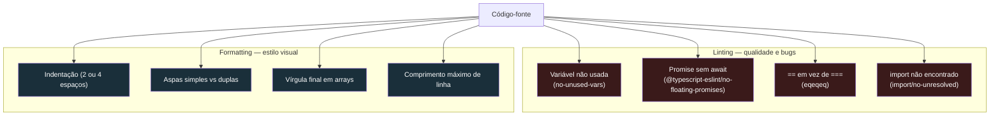
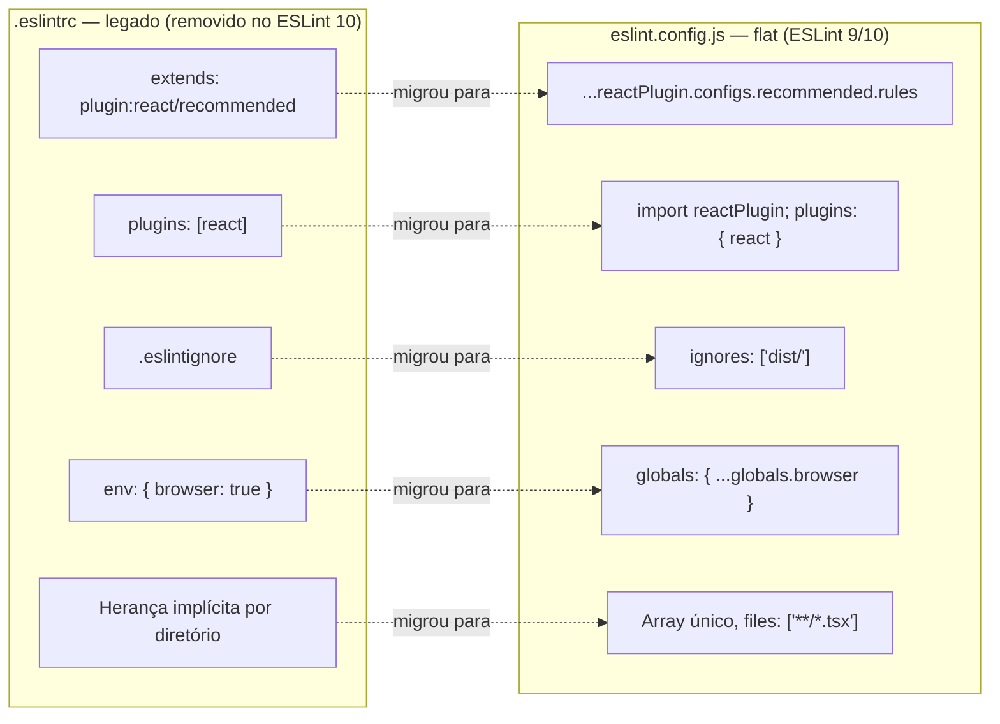
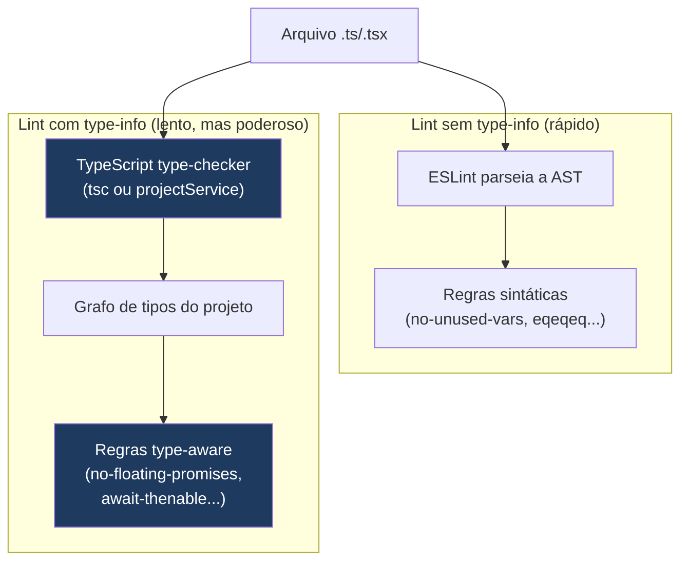
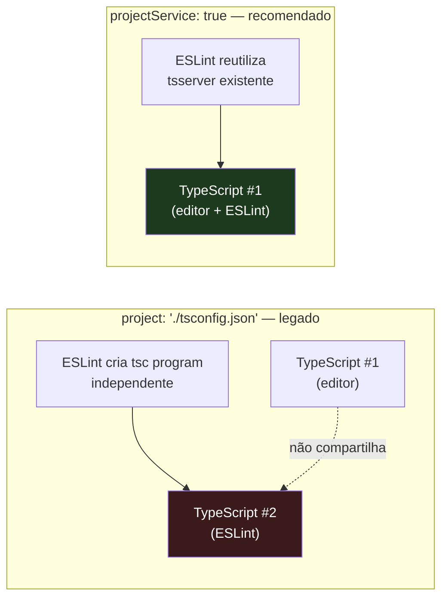
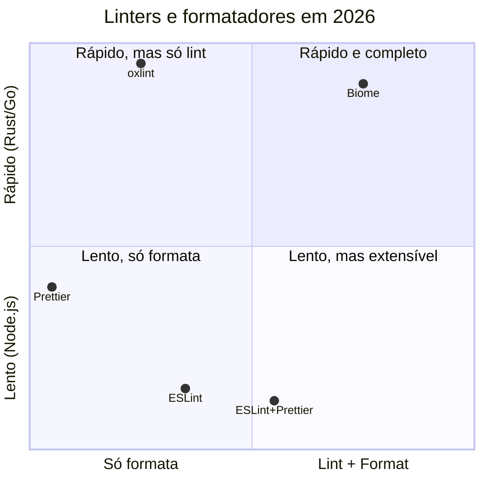
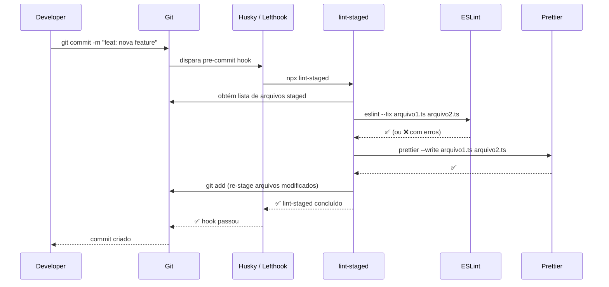
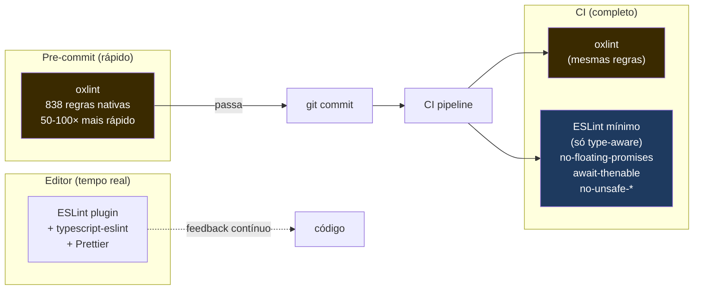
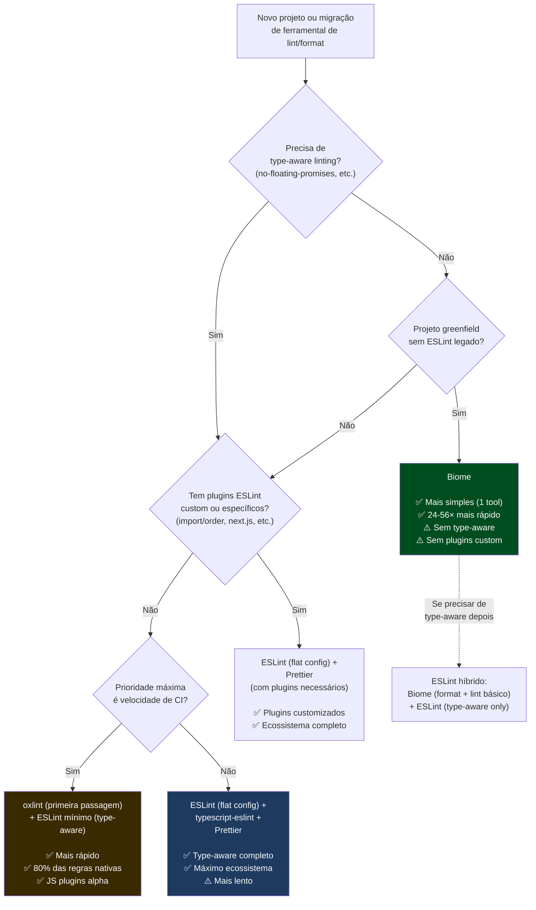

# Linting, formatting e git hooks

> [!abstract] TL;DR
> **Linting** detecta problemas de qualidade e bugs potenciais no código — variáveis não usadas, `await` esquecido numa Promise, acesso a propriedades que não existem no tipo. **Formatting** cuida de espaços, vírgulas, comprimento de linha, aspas — estilo visual. São problemas diferentes e merecem ferramentas diferentes. Em 2026 o panorama é esse: **ESLint 10** (com flat config `eslint.config.js`, `.eslintrc` removido definitivamente) é o linter estabelecido, plugável e com ecossistema extenso; **typescript-eslint** adiciona regras que usam o type-checker do TypeScript e detectam bugs que um linter puro jamais encontraria; **Prettier** é o formatador opinativo que encerra guerras de estilo; **Biome** (Rust) unifica lint+format num binário único 20–56× mais rápido e está em 491 regras; **oxlint** (Rust, do projeto oxc) linta 50–100× mais rápido que ESLint e acaba de lançar JS plugins alpha. Para garantir que nada desse esforço bypass em produção, **Husky + lint-staged** (ou lefthook como alternativa Go) rodam apenas nos arquivos staged no pre-commit — e o CI repete as mesmas checagens como gate incontornável.

---

## O problema que não é um problema: linting ≠ formatting

Antes de qualquer ferramenta, é preciso entender por que a distinção importa — e por que confundir os dois cria atritos desnecessários.

**Linting** é análise estática com intenção semântica. O linter lê o código, constrói uma representação interna (geralmente uma AST — Árvore Sintática Abstrata), e aplica regras que detectam padrões problemáticos: uma variável declarada mas nunca lida, um `async function` que nunca usa `await`, um `catch (err)` que silencia o erro, uma comparação `==` que pode ter coerção surpreendente. Algumas regras são autofix — o linter pode corrigir sozinho. Outras exigem intervenção humana porque a correção depende de intenção.

**Formatting** é transformação puramente sintática. O formatador lê o código, o redesenha segundo regras de estilo, e reescreve. Ele não sabe e não liga para o que o código faz — só cuida de indentação, comprimento de linha, vírgulas finais, aspas simples vs duplas, espaço antes de chave, quebra de linha em arrays longos. Não há bug que um formatador possa detectar ou corrigir. O benefício é eliminar ruído em code reviews ("usa aspas duplas aqui!") e manter consistência entre IDEs e desenvolvedores.

A confusão vem de uma época em que ESLint incluía dezenas de regras de formatação (`indent`, `max-len`, `quotes`, `semi`). Quando o Prettier surgiu em 2017, a postura recomendada passou a ser: **ESLint para qualidade, Prettier para estilo — e desative do ESLint todas as regras que conflitam com Prettier**. O pacote `eslint-config-prettier` faz exatamente isso: desliga as regras de formatação do ESLint para que as duas ferramentas não briguem.

Hoje, em 2026, esse consenso se solidificou de formas diferentes: o Biome baniu da sua lista de regras de lint tudo que é formatação (ficando no formatador separado), e o oxlint também não inclui regras puramente estilísticas. A separação é parte do design, não uma recomendação opcional.



---

## ESLint 10: o flat config que finalmente chegou

O ESLint existe desde 2013. Por mais de uma década, a configuração era feita via `.eslintrc` — um arquivo JSON, YAML ou JS que definia regras, plugins e extensões por convenção de nome. O problema: o sistema era hierárquico (arquivos `.eslintrc` em subdiretórios herdavam do pai), opaco (plugins eram strings `"react"` que o ESLint resolvia sozinho), e cheio de casos especiais (`overrides`, `env`, `extends` com `plugin:` prefix).

O **flat config** foi introduzido como experimental no ESLint 8, tornou-se padrão no ESLint 9, e no **ESLint 10 (fevereiro de 2026) o `.eslintrc` foi removido definitivamente**. Se você ainda tem um arquivo `.eslintrc.*` no projeto, o ESLint 10 o ignora completamente.

O novo arquivo é `eslint.config.js` (ou `.mjs` para ESM explícito). O formato é um **array de objetos de configuração**. Sem herança implícita, sem strings mágicas — cada objeto declara explicitamente o que afeta, que plugins usa, e que regras aplica.

```js
// eslint.config.js — setup completo para projeto TypeScript + React
import js from "@eslint/js";
import tseslint from "typescript-eslint";
import reactPlugin from "eslint-plugin-react";
import reactHooksPlugin from "eslint-plugin-react-hooks";
import globals from "globals";
import prettierConfig from "eslint-config-prettier";

export default tseslint.config(
  // 1. Ignores globais — deve vir primeiro, sem outras chaves no objeto
  {
    ignores: ["node_modules/", "dist/", ".next/", "coverage/", "*.min.js"],
  },

  // 2. Base ESLint recomendado — regras core do JS
  js.configs.recommended,

  // 3. Globals de ambiente — substitui o antigo "env"
  {
    languageOptions: {
      globals: {
        ...globals.browser, // window, document, fetch…
        ...globals.node,    // process, __dirname…
        ...globals.es2022,  // structuredClone, Object.hasOwn…
      },
    },
  },

  // 4. TypeScript — arquivos .ts e .tsx
  {
    files: ["**/*.ts", "**/*.tsx"],
    extends: [
      ...tseslint.configs.recommended,       // regras básicas TS
      ...tseslint.configs.recommendedTypeChecked, // regras type-aware
    ],
    languageOptions: {
      parserOptions: {
        projectService: true,              // usa o tsserver, mais rápido que project: true
        tsconfigRootDir: import.meta.dirname,
      },
    },
    rules: {
      "@typescript-eslint/no-unused-vars": ["error", { argsIgnorePattern: "^_" }],
      "@typescript-eslint/no-explicit-any": "warn",
      // regra type-aware: detecta Promise sem await ou .catch()
      "@typescript-eslint/no-floating-promises": "error",
      // regra type-aware: detecta await em valor não-Promise
      "@typescript-eslint/await-thenable": "error",
    },
  },

  // 5. React — arquivos JSX/TSX
  {
    files: ["**/*.jsx", "**/*.tsx"],
    plugins: {
      react: reactPlugin,
      "react-hooks": reactHooksPlugin,
    },
    settings: {
      react: { version: "detect" }, // detecta versão automaticamente
    },
    rules: {
      ...reactPlugin.configs.recommended.rules,
      ...reactHooksPlugin.configs.recommended.rules,
      "react/react-in-jsx-scope": "off", // desnecessário com React 17+ JSX transform
      "react/prop-types": "off",          // TypeScript cobre isso
    },
  },

  // 6. Prettier — deve ser o ÚLTIMO: desliga regras de formatação do ESLint
  prettierConfig,
);
```

> [!note] `tseslint.config()` não é obrigatório, mas é tipado
> O wrapper `tseslint.config()` fornece TypeScript types para o array de configuração, habilitando autocomplete no editor. Você pode exportar um array puro sem ele — o comportamento é equivalente. Com ele, erros de configuração aparecem em tempo de edição, não em runtime.

O que mudou em relação ao `.eslintrc` que você precisa saber para a entrevista:

| Conceito | `.eslintrc` (legacy) | `eslint.config.js` (flat) |
|---|---|---|
| Plugins | `"plugins": ["react"]` (string) | `import reactPlugin from 'eslint-plugin-react'` + `plugins: { react: reactPlugin }` |
| Extends | `"extends": ["plugin:react/recommended"]` | `...reactPlugin.configs.recommended.rules` |
| Ignores | `.eslintignore` (arquivo separado) | `ignores: ["dist/"]` dentro do config |
| Variáveis globais | `"env": { "browser": true }` | `languageOptions: { globals: { ...globals.browser } }` |
| Herança por diretório | Automática (`.eslintrc` pai → filho) | Explícita: um único array, `files` controla escopo |
| Cascading | Múltiplos `.eslintrc` aninhados | Array plano, ordem importa, sem arquivos filhos |



---

## typescript-eslint e type-aware linting: o salto de potência

O ESLint por si só só enxerga sintaxe. Ele vê `const result = fetchUser(id)` e não tem como saber se `fetchUser` retorna uma Promise. Para isso existe o **typescript-eslint** — um projeto que integra o type-checker do TypeScript ao ESLint, permitindo regras que consultam informações de tipo em tempo de lint.

Isso é poderoso de maneiras concretas. Considere:

```ts
// Este código não tem erro de sintaxe — e vai rodar
// Mas está errado: a Promise não tem await, então o resultado é ignorado
async function carregarDados() {
  fetchEsquecido(); // fetchEsquecido() retorna Promise<void>
  return processarDados();
}
```

O ESLint puro não detecta nada aqui. O `@typescript-eslint/no-floating-promises` detecta, porque ele sabe que `fetchEsquecido()` retorna uma Promise — e uma Promise que não é `await`ada, nem `.then()`ada, nem retornada, é um bug latente que pode causar race condition ou erro silencioso.

Outras regras type-aware valiosas:

- `@typescript-eslint/await-thenable` — detecta `await` em valor que não é Promise (provavelmente um bug de refactor)
- `@typescript-eslint/no-unsafe-assignment` / `no-unsafe-call` — detecta uso de `any` sem typecast explícito
- `@typescript-eslint/no-unnecessary-type-assertion` — remove `as Type` redundantes
- `@typescript-eslint/restrict-template-expressions` — detecta `${objeto}` que seria `[object Object]` em produção
- `@typescript-eslint/prefer-nullish-coalescing` — sugere `??` em vez de `||` quando adequado

O custo é real: regras type-aware exigem que o TypeScript leia e analise o projeto antes do ESLint começar. Para projetos pequenos, são segundos. Para projetos grandes com muitos arquivos, pode passar de um minuto. A opção moderna é `projectService: true` (em vez de `project: './tsconfig.json'`), que reutiliza o tsserver já rodando no editor e é significativamente mais rápido.



O preset `tseslint.configs.recommendedTypeChecked` ativa apenas as regras type-aware consideradas seguras para a maioria dos projetos. O `strictTypeChecked` adiciona mais regras que podem gerar falsos positivos em codebases que usam `any` intencionalmente em pontos de integração.

---

## ESLint em projetos grandes: performance e diagnóstico

Uma queixa comum em codebases maiores é que o ESLint fica lento — e desenvolvedores começam a desativar regras ou pular o lint por impaciência. Antes de remover regras, existem ferramentas de diagnóstico que identificam *o que* está demorando.

### `TIMING=1`: identificando regras lentas

A variável de ambiente `TIMING=1` faz o ESLint imprimir o tempo gasto por regra ao final da execução:

```bash
TIMING=1 npx eslint src/
```

Output (exemplo):
```
Rule                                  | Time (ms) | Relative
:-------------------------------------|----------:|--------:
@typescript-eslint/no-unsafe-member-access |   1203.2 |    42.1%
@typescript-eslint/no-floating-promises    |    823.4 |    28.8%
import/no-cycle                            |    412.1 |    14.4%
@typescript-eslint/await-thenable          |    198.6 |     6.9%
```

Regras type-aware (`@typescript-eslint/*`) e regras de análise de grafo (`import/no-cycle`) são as candidatas número um a lentidão. `import/no-cycle` especialmente tem custo O(n²) sobre o grafo de módulos — desativá-la em CI pode ser necessário em monorepos.

### `--cache`: incremental entre execuções

O flag `--cache` salva o resultado do lint por arquivo num arquivo `.eslintcache`. Nas execuções seguintes, arquivos não modificados são pulados:

```bash
npx eslint src/ --cache --cache-location .eslintcache
```

O `.eslintcache` **não deve ser commitado** (adicione ao `.gitignore`), mas pode ser preservado entre runs de CI usando cache de dependências (GitHub Actions: `actions/cache` com a chave baseada no hash do `package-lock.json`).

```yaml
# .github/workflows/quality.yml — cache do ESLint entre runs de CI
- name: Cache ESLint
  uses: actions/cache@v4
  with:
    path: .eslintcache
    key: eslint-${{ hashFiles('package-lock.json', 'eslint.config.js') }}
```

### `@eslint/config-inspector`: depurando o que está ativo

Uma adição recente ao ecossistema ESLint é o `@eslint/config-inspector` — um servidor web local que mostra visualmente quais regras estão ativas para cada arquivo:

```bash
npx @eslint/config-inspector
```

Abre em `http://localhost:7777`. Você digita o caminho de um arquivo (ex.: `src/components/Button.tsx`) e ele lista todas as regras que se aplicam, de onde vieram (qual objeto no array), e qual valor (`error`, `warn`, `off`). Indispensável para depurar um flat config complexo com múltiplos plugins.

### `projectService` vs `project`: qual usar?

| Opção | Comportamento | Quando usar |
|---|---|---|
| `project: './tsconfig.json'` | ESLint cria um programa TypeScript independente. Lento em monorepos. | Projetos menores sem tsserver rodando |
| `project: true` | ESLint infere o tsconfig.json mais próximo do arquivo lintado. | Monorepos com múltiplos tsconfigs |
| `projectService: true` | Reutiliza o tsserver já rodando (mesmos arquivos que o editor abre). Mais rápido para edição interativa. | Padrão recomendado desde typescript-eslint v7 |
| `projectService: { defaultProject: 'tsconfig.json' }` | Igual ao anterior, mas com fallback explícito para arquivos fora de qualquer tsconfig. | Projetos com arquivos soltos na raiz |

O `projectService: true` é a opção correta para novos projetos desde typescript-eslint v7 (2024). O `project: './tsconfig.json'` ainda funciona mas cria um segundo servidor TypeScript paralelo ao do editor — desnecessário e mais lento.



---

## Prettier: o formatador que encerra a discussão

O Prettier existe desde 2017 com uma proposta deliberadamente radical: **não há nada para configurar**. Ele tem um conjunto fixo de opções (largura de linha, aspas, vírgulas finais — um punhado) e para todo o resto toma a decisão sozinho. Você não escolhe se prefere espaço antes de chave, ou como quebrar arrays longos — o Prettier decide.

Essa falta de flexibilidade é a vantagem. Quando o formatador tem uma única resposta correta para cada situação, code reviews ficam livres de comentários de estilo. Novos membros da equipe não precisam memorizar guia de estilo. IDEs diferentes produzem o mesmo output.

A integração com o ESLint é via `eslint-config-prettier` (como mostrado no exemplo acima) — um preset que desativa todas as regras do ESLint que conflitam com o Prettier. Com isso, o ESLint cuida de qualidade, o Prettier cuida de estilo, e eles não se contradizem.

```json
// .prettierrc — todas as opções que existem (as demais são fixas)
{
  "semi": false,              // sem ponto-e-vírgula (depende do gosto da equipe)
  "singleQuote": true,        // aspas simples
  "trailingComma": "all",     // vírgula final em todos os contextos
  "printWidth": 100,          // largura máxima da linha
  "tabWidth": 2,              // 2 espaços de indentação
  "arrowParens": "always",    // (x) => x em vez de x => x
  "bracketSpacing": true,     // { foo } em vez de {foo}
  "endOfLine": "lf"           // line ending Unix (importante em equipes mistas win/mac)
}
```

> [!tip] O Prettier não é opcional numa equipe
> Sem um formatador unificado, cada desenvolvedor formata de acordo com as configurações do seu editor. Git blame vira uma névoa de mudanças de estilo misturadas com mudanças reais. Prettier transformou a discussão de "qual style guide adotar" em "instalar Prettier". O único debate restante é a configuração do `.prettierrc` — e mesmo essa, uma vez definida, não é mais tocada.

---

## Biome: lint + format em Rust, uma ferramenta

O **Biome** nasceu como um fork do Rome Tools em 2023 e alcançou v1.0 em setembro daquele ano. Em 2026, está na versão 2.4+ com 491 regras de lint implementadas em Rust. É a aposta mais sólida de "substituir ESLint e Prettier por uma ferramenta só".

O motor é um binário Rust que roda fora do Node.js: sem overhead de inicialização do V8, sem carregamento de plugins via `require`, sem single-thread do event loop. O Biome processa arquivos em paralelo com async I/O (Tokio), e aplica todas as regras em uma única passagem pela AST. Benchmarks reais mostram 24–56× de speedup sobre ESLint+Prettier para codebases médias.

```json
// biome.json — configuração única que substitui .eslintrc + .prettierrc
{
  "$schema": "https://biomejs.dev/schemas/2.4.0/schema.json",
  "vcs": {
    "enabled": true,
    "clientKind": "git",
    "useIgnoreFile": true   // lê .gitignore
  },
  "files": {
    "ignore": ["node_modules", "dist", ".next", "coverage"]
  },
  "formatter": {
    "enabled": true,
    "indentStyle": "space",
    "indentWidth": 2,
    "lineWidth": 100
  },
  "linter": {
    "enabled": true,
    "rules": {
      "recommended": true,              // conjunto recomendado de regras
      "correctness": {
        "noUnusedVariables": "error",
        "useExhaustiveDependencies": "error"  // equivale a react-hooks/exhaustive-deps
      },
      "suspicious": {
        "noExplicitAny": "warn"
      },
      "style": {
        "noNonNullAssertion": "warn",
        "useTemplate": "error"          // prefere template literals a concatenação
      }
    }
  },
  "javascript": {
    "formatter": {
      "quoteStyle": "single",
      "trailingCommas": "all",
      "semicolons": "asNeeded"
    }
  }
}
```

O comando central é `biome check --write` — linta, formata e ordena imports em um único passe. No pré-commit com lint-staged:

```json
// package.json — usando Biome no lint-staged
{
  "lint-staged": {
    "*.{ts,tsx,js,jsx,json,css}": "biome check --write --no-errors-on-unmatched"
  }
}
```

> [!warning] Biome não tem type-aware linting (ainda)
> A ausência de regras type-aware é a maior limitação do Biome em 2026. Regras como `no-floating-promises` e `await-thenable` dependem do TypeScript language service — e o Biome não integra com o tsc. O roadmap prevê isso para "late 2026", mas sem data craved. Para projetos TypeScript que dependem dessas regras, a abordagem híbrida — Biome como formatter + ESLint mínimo para type-aware — é a saída mais pragmática.

> [!info] Biome também não tem plugins customizados
> Não existe ainda um API de plugin para Biome. Se a equipe tem regras customizadas (regras de naming convention específicas, regras de domínio, restrições de import entre camadas), ESLint ainda é a única opção.

### Biome 2.x: o que mudou em 2025-2026

O Biome 2.0 foi lançado em maio de 2025 com mudanças que afetam a configuração existente:

- **Assistants (antes "actions")**: a API de code actions foi renomeada e estabilizada. Regras de lint agora declaram explicitamente se têm fix automático seguro (`safefix`) ou potencialmente destrutivo (`unsafefix`).
- **Domínios de regras expandidos**: além de `correctness`, `suspicious`, `style` e `performance`, surgiram novos grupos como `nursery` (regras em incubação) e `a11y` (acessibilidade).
- **Configuração de projeto multi-arquivo**: `biome.json` passou a suportar `extends` para composição de configs em monorepos, aproximando-se do flat config do ESLint em expressividade.
- **CSS e GraphQL stabis**: suporte a lint e format de CSS e GraphQL saiu do experimental.
- **CLI `biome migrate`**: ferramenta para migrar de ESLint + Prettier para Biome com mapeamento automático de regras equivalentes.

```bash
# Migração de ESLint + Prettier para Biome (Biome 2.x)
npx @biomejs/biome migrate eslint --write  # lê eslint.config.js, gera biome.json
npx @biomejs/biome migrate prettier --write # lê .prettierrc, ajusta biome.json
```

O `biome migrate` é ponto de partida, não solução completa — regras sem equivalente no Biome são listadas num relatório para decisão manual.

---

## oxlint: o linter Rust que compete com ESLint

O **oxlint** é o linter do projeto **oxc** (JavaScript Oxidation Compiler) — uma toolchain completa em Rust que inclui parser, linter, transformer e bundler (em desenvolvimento). O foco do oxlint é ser o linter JavaScript mais rápido possível: benchmarks do projeto mostram 50–100× de speedup sobre ESLint, e ~2× sobre o Biome.

O diferencial de 2026 é o **JS plugins alpha** (março de 2026): uma API compatível com ESLint v9+ que permite usar plugins ESLint existentes dentro do oxlint. Segundo o projeto, 80% dos usuários de ESLint podem migrar e ter os plugins funcionando "out of the box". Com 838 regras nativas em Rust e a capacidade de rodar plugins JS para as demais, o oxlint passou de "linter alternativo" para "substituto viável".

```bash
# Instalação
npm install --save-dev oxlint

# Rodar sobre o projeto
npx oxlint src/

# Com plugin ESLint (via JS plugins alpha)
npx oxlint --import-plugin src/

# Configuração mínima
# .oxlintrc.json
{
  "plugins": ["react", "react-hooks"],
  "rules": {
    "no-unused-vars": "error",
    "react-hooks/rules-of-hooks": "error",
    "react-hooks/exhaustive-deps": "warn"
  }
}
```

> [!info] oxlint complementa, não necessariamente substitui
> O padrão emergente em 2026 é usar oxlint como a primeira passagem rápida (descartando os 90% de erros óbvios em milissegundos) e ESLint apenas para type-aware rules ou regras que o oxlint ainda não cobre. A própria documentação do oxlint sugere essa composição.



---

## Git hooks: garantindo qualidade no commit

Todo o setup de lint e format não vale nada se os desenvolvedores esquecem de rodar antes de commitar. É aí que entram os **git hooks** — scripts que o Git executa automaticamente em momentos específicos do ciclo de vida: antes do commit (`pre-commit`), antes do push (`pre-push`), antes do merge-msg, etc.

O hook mais comum é o `pre-commit`. O problema: rodar ESLint sobre o projeto inteiro antes de cada commit pode levar 30–60 segundos em um codebase médio. Isso é inaceitável — desenvolvedores começam a usar `git commit --no-verify` para pular o hook.

A solução é o **lint-staged**: em vez de lintar tudo, linta apenas os arquivos que estão **staged** (na área de staging do Git — os que vão entrar no commit). Um arquivo que você não tocou não tem por que ser relintado. Isso reduz o tempo de 30 segundos para 1–5 segundos na maioria dos casos.

### Setup canônico: Husky + lint-staged

**Husky** é o gerenciador de hooks mais popular para Node.js (~5M downloads/semana). Na versão 9, hooks são arquivos shell simples em `.husky/` — sem formato especial, sem YAML, sem aprender nova sintaxe.

```bash
# Instalação
npm install --save-dev husky lint-staged

# Configura: adiciona "prepare": "husky" no package.json e cria .husky/
npx husky init
```

```bash
# .husky/pre-commit — arquivo shell criado pelo `husky init`
npx lint-staged
```

```json
// package.json — scripts e config do lint-staged
{
  "scripts": {
    "prepare": "husky",           // roda em `npm install` — instala os hooks automaticamente
    "lint": "eslint src/",
    "format": "prettier --check src/",
    "typecheck": "tsc --noEmit"
  },
  "lint-staged": {
    // Arquivos TS/JS: lint + format
    "*.{ts,tsx,js,jsx}": [
      "eslint --fix --max-warnings 0",  // falha se tiver qualquer warning
      "prettier --write"
    ],
    // Outros arquivos: só format
    "*.{json,md,css,yml,yaml}": [
      "prettier --write"
    ]
  }
}
```

O `"prepare": "husky"` é a chave: quando um novo desenvolvedor clona o repositório e roda `npm install`, o Husky instala os hooks automaticamente. Nenhuma etapa manual, nenhuma documentação extra.

### Alternativa: lefthook (Go, paralelo, monorepo-first)

O **lefthook** é um binário Go que substitui tanto o Husky quanto o lint-staged em um único arquivo YAML. Sua vantagem principal é a **execução paralela de comandos no mesmo hook** — Husky executa comandos sequencialmente, lefthook os paraleliza:

```yaml
# lefthook.yml — substitui .husky/ + lint-staged config
pre-commit:
  parallel: true        # executa todos os comandos em paralelo
  commands:
    lint:
      glob: "*.{ts,tsx,js,jsx}"
      run: npx eslint --fix {staged_files}
      stage_fixed: true    # re-adiciona ao stage arquivos modificados pelo fix
    format:
      glob: "*.{ts,tsx,js,jsx,json,css,md}"
      run: npx prettier --write {staged_files}
      stage_fixed: true
    typecheck:
      run: npx tsc --noEmit   # roda sobre o projeto inteiro, não staged files

pre-push:
  commands:
    tests:
      run: npm test
```

O `stage_fixed: true` é o equivalente do lint-staged auto-adicionando arquivos fixados pelo `--fix` — uma feature que o lint-staged tem por padrão mas que no Husky puro exige script extra.

### Além do pre-commit: outros hooks úteis

O hook `pre-commit` é o mais usado, mas existem outros pontos no ciclo Git que valem a atenção:

```bash
# .husky/commit-msg — valida o formato da mensagem de commit
# (requer commitlint ou script manual)
npx --no -- commitlint --edit "$1"
```

```bash
# .husky/pre-push — roda testes antes de enviar ao remote
npm test
```

```js
// commitlint.config.js — convencional commits
export default {
  extends: ['@commitlint/config-conventional'],
  // prefixos aceitos: feat, fix, docs, style, refactor, test, chore, ci, build
  rules: {
    'scope-enum': [2, 'always', ['api', 'ui', 'auth', 'ci']],
  },
};
```

O `commit-msg` hook com commitlint é particularmente útil em equipes que usam Conventional Commits para gerar changelogs automaticamente (ferramentas como `semantic-release` ou `changesets` consomem esse histórico padronizado).

> [!tip] Pre-push vs pre-commit: onde colocar os testes
> Rodar toda a suite de testes no `pre-commit` é muito lento — vai irritar o desenvolvedor e ele vai usar `--no-verify`. O padrão prático é: **pre-commit** para lint + format rápidos (segundos); **pre-push** para testes de unidade; CI para testes de integração e e2e. Cada nível tem custo de feedback diferente.

### Configs compartilhadas: pacotes npm de eslint config

Em organizações com múltiplos repositórios, duplicar o `eslint.config.js` em cada repo é um anti-padrão. A solução é publicar um pacote npm interno com a configuração base:

```js
// Pacote: @minha-org/eslint-config/index.js
import js from "@eslint/js";
import tseslint from "typescript-eslint";
import prettierConfig from "eslint-config-prettier";

export const base = tseslint.config(
  js.configs.recommended,
  ...tseslint.configs.recommendedTypeChecked,
  prettierConfig,
);
```

```js
// eslint.config.js no projeto consumidor
import { base } from "@minha-org/eslint-config";

export default [
  ...base,
  // regras específicas do projeto por cima
  {
    files: ["**/*.ts"],
    rules: {
      "@typescript-eslint/no-explicit-any": "error", // mais estrito que o base
    },
  },
];
```

Isso centraliza upgrades de versão e mudanças de política. Quando a organização migra de ESLint 9 para 10 ou ativa uma nova regra, basta atualizar o pacote compartilhado e os projetos absorvem via bump de versão.



> [!warning] Hooks locais podem ser pulados com `--no-verify`
> `git commit --no-verify` pula todos os hooks locais. Por isso, o CI é a gate definitiva — as mesmas checagens precisam rodar no CI como etapas obrigatórias que ninguém pode pular. Hooks locais são feedback rápido para o desenvolvedor; CI é a segurança que protege a branch.

---

## Setup completo: ESLint flat config + Prettier + lint-staged + Husky

Este é o setup canônico de 2026 para um projeto TypeScript + React. Cada peça tem um papel claro e não redundante:

```bash
# Instalação de todas as dependências
npm install --save-dev \
  eslint \
  typescript-eslint \
  eslint-plugin-react \
  eslint-plugin-react-hooks \
  globals \
  eslint-config-prettier \
  prettier \
  husky \
  lint-staged
```

```js
// eslint.config.js — o arquivo central de lint
import js from "@eslint/js";
import tseslint from "typescript-eslint";
import reactPlugin from "eslint-plugin-react";
import reactHooksPlugin from "eslint-plugin-react-hooks";
import globals from "globals";
import prettierConfig from "eslint-config-prettier";

export default tseslint.config(
  // Ignores: arquivos/pastas que o ESLint nunca deve tocar
  { ignores: ["dist/", ".next/", "coverage/", "node_modules/"] },

  // Base JS
  js.configs.recommended,

  // Globals do ambiente
  {
    languageOptions: {
      globals: { ...globals.browser, ...globals.node, ...globals.es2022 },
    },
  },

  // TypeScript com type-aware linting
  {
    files: ["**/*.{ts,tsx}"],
    extends: [
      ...tseslint.configs.recommended,
      ...tseslint.configs.recommendedTypeChecked,
    ],
    languageOptions: {
      parserOptions: {
        projectService: true,
        tsconfigRootDir: import.meta.dirname,
      },
    },
    rules: {
      "@typescript-eslint/no-unused-vars": ["error", { argsIgnorePattern: "^_" }],
      "@typescript-eslint/no-floating-promises": "error",
      "@typescript-eslint/await-thenable": "error",
      "@typescript-eslint/no-explicit-any": "warn",
    },
  },

  // React
  {
    files: ["**/*.{jsx,tsx}"],
    plugins: { react: reactPlugin, "react-hooks": reactHooksPlugin },
    settings: { react: { version: "detect" } },
    rules: {
      ...reactPlugin.configs.recommended.rules,
      ...reactHooksPlugin.configs.recommended.rules,
      "react/react-in-jsx-scope": "off",
      "react/prop-types": "off",
    },
  },

  // Prettier por último — desativa regras de formatação do ESLint
  prettierConfig,
);
```

```json
// .prettierrc
{
  "semi": false,
  "singleQuote": true,
  "trailingComma": "all",
  "printWidth": 100,
  "tabWidth": 2,
  "arrowParens": "always",
  "endOfLine": "lf"
}
```

```json
// package.json — scripts + lint-staged + prepare
{
  "scripts": {
    "prepare": "husky",
    "lint": "eslint src/",
    "lint:fix": "eslint src/ --fix",
    "format": "prettier --write src/",
    "typecheck": "tsc --noEmit",
    "check": "npm run typecheck && npm run lint"
  },
  "lint-staged": {
    "*.{ts,tsx,js,jsx}": [
      "eslint --fix --max-warnings 0",
      "prettier --write"
    ],
    "*.{json,md,css,yml}": [
      "prettier --write"
    ]
  }
}
```

```bash
# .husky/pre-commit
npx lint-staged
```

O fluxo de trabalho resultante: desenvolvedor salva um arquivo → o editor aplica Prettier on-save → na hora do `git commit`, Husky dispara lint-staged → ESLint roda só sobre os arquivos staged, reporta erros e aplica fixes automáticos, Prettier formata → se tudo passar, o commit é criado. Se ESLint encontrar um erro não-autofixável (como uma `no-floating-promises`), o commit é bloqueado e o desenvolvedor vê o erro no terminal antes que o código chegue ao repositório.

---

## O papel do CI: a gate que ninguém pula

Hooks locais são convenientes, mas não são suficientes por si sós. Qualquer desenvolvedor pode fazer `git commit --no-verify`. A pipeline de CI é a garantia real.

```yaml
# .github/workflows/quality.yml — etapas de qualidade no CI
name: Quality

on: [push, pull_request]

jobs:
  quality:
    runs-on: ubuntu-latest
    steps:
      - uses: actions/checkout@v4

      - uses: actions/setup-node@v4
        with:
          node-version: "22"
          cache: "npm"

      - run: npm ci

      # 1. Type-check — tsc sem emitir arquivos
      - name: Typecheck
        run: npx tsc --noEmit

      # 2. Lint — sem warnings permitidos
      - name: Lint
        run: npx eslint src/ --max-warnings 0

      # 3. Format check — verifica sem modificar
      - name: Format
        run: npx prettier --check src/

      # (opcional) 4. Build — garante que o build produção passa
      - name: Build
        run: npm run build
```

As três etapas são independentes e poderiam rodar em paralelo com jobs separados para economizar tempo. O ponto crucial é que **typecheck, lint e format check são etapas distintas** — uma falha em qualquer uma bloqueia o merge.

> [!info] `--max-warnings 0`
> O flag `--max-warnings 0` faz o ESLint falhar se houver qualquer warning, não só errors. Isso é deliberado: warnings que nunca viram errors acabam acumulando e sendo ignorados. Forçar `0 warnings` mantém a lista de regras honesta — se você não vai enforçar uma regra como error, remova-a do config.

---

## Trade-offs para decisão sênior

Aqui é onde a discussão fica mais interessante — e mais honesta. Ferramentas de qualidade de código têm custos reais que precisam ser balanceados.

### O custo real do type-aware linting

Type-aware linting é poderoso, mas tem um preço:

| Aspecto | Custo | Mitigação |
|---|---|---|
| Tempo de inicialização | TypeScript precisa construir o programa completo antes do lint. Em projetos grandes, 30–90s. | `projectService: true` + `--cache` |
| Consumo de memória | O tsserver pode usar 500MB+ em monorepos grandes | Project references para dividir o grafo |
| Falsos positivos | Regras como `no-unsafe-*` disparam em pontos de integração com `any` intencional | Configurar `strictTypeChecked` só onde faz sentido |
| Manutenção de config | `tsconfigRootDir` + `projectService` exige atenção em mudanças de estrutura | Testes do `eslint.config.js` com `@eslint/config-inspector` |

A pergunta que um sênior faz antes de ativar `recommendedTypeChecked`: "Qual bug real essa regra teria capturado no nosso histórico?" Se a resposta for "raramente", o custo de performance talvez não valha.

### Quando Biome faz mais sentido que ESLint

Existe um perfil de projeto onde Biome é claramente a escolha certa:

- **Frontend puro sem integração com backends tipados**: tipos são para o editor, não para lint de runtime behavior
- **Time pequeno que vai manter uma ferramenta, não duas**: menos para configurar, atualizar e documentar
- **CI com orçamento de tempo apertado**: 3–5s de lint vs 45s é uma diferença que acumula em centenas de PRs por mês
- **Ausência de regras de domínio customizadas**: se o projeto não tem `no-import-from-layer-x`, não precisa do API de plugin do ESLint

O problema de Biome não é "ser pior que ESLint" — é ser *diferente* de um jeito que pode surpreender equipes que assumiram paridade.

### Estratégia híbrida: oxlint + ESLint mínimo

A estratégia que mais cresce em times de alta performance em 2026:



O raciocínio: o desenvolvedor recebe feedback de tipo no editor (IDE com ESLint + typescript-eslint). O pre-commit roda apenas oxlint — rápido o suficiente para ser tolerado. O CI roda oxlint + ESLint mínimo como gate definitivo. Ninguém espera 60 segundos em nenhum ponto do fluxo.

### Comparativo honesto das ferramentas em 2026

| Critério | ESLint+Prettier | Biome 2.x | oxlint | lefthook |
|---|---|---|---|---|
| Type-aware linting | ✅ Completo | ❌ Não tem | ❌ Não tem | N/A (hook runner) |
| Plugins customizados | ✅ Extensível | ❌ Não tem | ⚠️ JS plugins alpha | N/A |
| Velocidade | ⚠️ Lento | ✅ 24-56× mais rápido | ✅ 50-100× mais rápido | ✅ Paralelo |
| Configuração | ⚠️ Verbosa | ✅ Um arquivo | ✅ Simples | ✅ YAML |
| Ecossistema | ✅ Maduro | ⚠️ Em crescimento | ⚠️ Em crescimento | ✅ Drop-in |
| Monorepo | ⚠️ Exige cuidado | ✅ `extends` nativo | ✅ Simples | ✅ Nativo |
| Formatação | Via Prettier | ✅ Integrado | ❌ Só linting | N/A |
| Maturidade (2026) | ✅ Estável 13 anos | ⚠️ 3 anos | ⚠️ 2 anos | ✅ Estável |

---

## Decision tree: ESLint+Prettier vs Biome vs oxlint em 2026

A escolha não é óbvia porque as ferramentas estão em momentos diferentes de maturidade:



Em resumo: projetos TypeScript sérios com preocupação com bugs async/await ainda precisam do ESLint com typescript-eslint. Projetos que querem simplicidade máxima e não dependem de type-aware linting podem migrar para Biome. oxlint como drop-in para a maioria das regras ESLint + complemento para type-aware é a aposta de alta performance para grandes codebases.

---

## Como explicar em inglês

**Linting** is static analysis that looks for code quality issues and potential bugs — unused variables, floating promises, unsafe type coercions. The linter understands the structure of your code and flags patterns that are likely wrong or problematic.

**Formatting** is purely cosmetic: indentation, line breaks, trailing commas, quote style. A formatter doesn't know or care what your code does — it just makes it look consistent. Prettier is the dominant formatter in the JS ecosystem precisely because it's opinionated: there's one right answer for each formatting decision, which eliminates style debates entirely.

**ESLint flat config** is the new configuration format (mandatory since ESLint 10, February 2026) that replaces the old `.eslintrc` files. Instead of implicit inheritance through nested config files, you export a single flat array from `eslint.config.js`, where each object explicitly declares the files it applies to, which plugins it imports, and which rules it enables.

**Type-aware linting** is what happens when ESLint gets access to TypeScript's type information. Rules like `no-floating-promises` can only work if the linter knows that a function returns a `Promise` — syntax analysis alone can't tell. The cost is performance: TypeScript has to analyze the entire project before linting can begin. `parserOptions.projectService: true` is the modern way to enable this while reusing the already-running tsserver.

**Git hooks** are scripts that Git runs at specific points in the workflow — most commonly before a commit (`pre-commit`). **lint-staged** filters the hook to only run on staged files, keeping the feedback loop fast. **Husky** manages the hooks in a Node.js-friendly way. The combination is the industry standard setup. **CI must always repeat the same checks** — local hooks can be bypassed with `--no-verify`, so CI is the authoritative gate.

**Biome** is a Rust-based tool that combines linting and formatting in a single binary, 24-56x faster than ESLint+Prettier. Its current limitation is the absence of type-aware rules. **oxlint** (from the oxc project) is the fastest JavaScript linter available in 2026 (50-100x faster than ESLint), now with a JS plugins API compatible with ESLint v9, enabling most existing ESLint plugins to work inside oxlint.

### Vocabulário-chave

| Português | Inglês |
|---|---|
| Linter / ferramenta de lint | Linter / linting tool |
| Análise estática | Static analysis |
| Formatador | Formatter / code formatter |
| Regra de lint | Lint rule |
| Lint type-aware (com info de tipo) | Type-aware linting / typed linting |
| Configuração flat (ESLint 10) | Flat config |
| Plugin do ESLint | ESLint plugin |
| Estender configuração | Extending config / config inheritance |
| Arquivos em stage | Staged files |
| Hook de pre-commit | Pre-commit hook |
| Pular hooks com --no-verify | Bypassing hooks with --no-verify |
| Gate de qualidade no CI | CI quality gate |
| Promise sem tratamento | Floating promise |
| Fix automático | Autofix / auto-fixable rule |
| Formatação opinativa | Opinionated formatting |

---

## Armadilhas comuns

> [!warning] Armadilha 1: ESLint 10 não lê `.eslintrc` — e não avisa claramente
> Se você tem um `.eslintrc.json` e atualiza para ESLint 10, ele não lê o arquivo e não emite erro. Parece que está tudo certo, mas nenhuma regra está sendo aplicada. A migração para `eslint.config.js` é obrigatória. Use o `@eslint/migrate-config` para converter automaticamente, mas revise o output — especialmente para plugins.

> [!warning] Armadilha 2: type-aware linting sem `tsconfigRootDir`
> `projectService: true` ou `project: true` sem `tsconfigRootDir: import.meta.dirname` resulta em `Cannot read file 'tsconfig.json'` em muitos setups porque o ESLint resolve o caminho a partir do diretório de trabalho (`cwd`), não do arquivo de config. Sempre inclua os dois.

> [!warning] Armadilha 3: `eslint-config-prettier` depois do plugin de React
> A ordem no array do flat config importa. O `eslint-config-prettier` (ou `prettierConfig` importado) **deve ser o último objeto** no array — ele desativa regras conflitantes de todos os plugins anteriores. Se ele vier antes do plugin React, as regras de formatação do React não serão desativadas corretamente.

> [!warning] Armadilha 4: lint-staged com `--fix` sem re-stage
> Quando o ESLint faz autofix de um arquivo staged, o arquivo modificado não volta automaticamente para o stage — a mudança fica como unstaged. O lint-staged cuida disso por padrão (re-adiciona ao stage), mas se você montar um hook manualmente sem lint-staged, precisa fazer `git add` depois do `--fix` ou o commit vai incluir a versão sem o fix.

> [!warning] Armadilha 5: Biome e type-aware linting — a lacuna silenciosa
> Se você migrar para Biome esperando ter toda a cobertura do typescript-eslint, vai ter uma surpresa: não existe `no-floating-promises` no Biome. Bugs de Promise não tratada chegarão em produção sem aviso. A limitação não é explícita no diff de regras — você precisa verificar ativamente quais regras type-aware do typescript-eslint você usa antes de migrar.

> [!warning] Armadilha 6: confiar só nos hooks locais sem CI
> Hooks pre-commit são feedback local para o desenvolvedor, não garantia de qualidade. Um `git commit --no-verify` os pula sem rastro. Um ambiente de CI mal configurado que não replica as mesmas checagens significa que código mal formado ou com erros de lint pode entrar na branch principal. Hooks locais e CI são complementares, não substitutos.

---

## Veja também

- [[08 - Transpilação e targets]] — o que acontece com o código *antes* do lint: como TypeScript é transformado para JS, o papel do tsc, esbuild e SWC
- [[23 - Build em produção, CI e determinismo]] — CI em profundidade: cache, artefatos, source maps em produção; lint e typecheck como etapas do pipeline de build; caching de `.eslintcache` no GitHub Actions
- [[15 - Turbopack, Rspack e a corrida Rust-Go]] — o contexto maior da migração de ferramentas JS para Rust/Go, onde Biome e oxlint se encaixam
- [[21 - Monorepos - workspaces, Turborepo, Nx e changesets]] — configs compartilhadas de ESLint em monorepos, onde publicar o pacote `@org/eslint-config`, como Turborepo cacheia o lint entre pacotes
- [[03 - Package managers - npm, pnpm, yarn e Bun]] — publicar pacotes de config interno, workspaces e como `prepare` do Husky se comporta em diferentes package managers
- [[03-Dominios/Tecnologia/TypeScript/index|TypeScript]] — type-aware linting pressupõe um tsconfig bem configurado; project references e performance do tsc são abordados na trilha TypeScript

---

## Referências

- **ESLint 10 release (fevereiro 2026)**: flat config obrigatório, `.eslintrc` removido — [eslint.org/blog/2026/02/eslint-v10.0.0-released](https://eslint.org/blog/2026/02/eslint-v10.0.0-released/)
- **ESLint 10 Flat Config Migration Guide 2026** (PkgPulse) — estrutura do array, migração de plugins, globals: [pkgpulse.com/guides/eslint-10-flat-config-migration-guide-2026](https://www.pkgpulse.com/guides/eslint-10-flat-config-migration-guide-2026)
- **typescript-eslint: Typed Linting** — `projectService: true`, custo de performance, configuração: [typescript-eslint.io/getting-started/typed-linting](https://typescript-eslint.io/getting-started/typed-linting/)
- **typescript-eslint: `projectService`** — comparação com `project: true`, defaults, monorepo: [typescript-eslint.io/packages/parser/#projectservice](https://typescript-eslint.io/packages/parser/#projectservice)
- **ESLint Performance Profiling** — `TIMING=1`, `--cache`, diagnóstico de regras lentas: [eslint.org/docs/latest/extend/custom-rules#performance-testing](https://eslint.org/docs/latest/extend/custom-rules#performance-testing)
- **`@eslint/config-inspector`** — UI visual para depurar flat config: [github.com/eslint/config-inspector](https://github.com/eslint/config-inspector)
- **Biome 2.0 release (maio 2025)** — Assistants API, CSS/GraphQL stable, multi-arquivo extends: [biomejs.dev/blog/biome-v2](https://biomejs.dev/blog/biome-v2/)
- **Biome `migrate` CLI** — migração de ESLint + Prettier para Biome: [biomejs.dev/guides/migrate-eslint-prettier](https://biomejs.dev/guides/migrate-eslint-prettier/)
- **Biome vs ESLint+Prettier 2026** (PkgPulse) — benchmarks reais, limitações, quando usar: [pkgpulse.com/guides/biome-vs-eslint-prettier-linting-2026](https://www.pkgpulse.com/guides/biome-vs-eslint-prettier-linting-2026)
- **Oxlint JS Plugins Alpha** (março 2026) — API compatível com ESLint v9, 838 regras nativas: [oxc.rs/blog/2026-03-11-oxlint-js-plugins-alpha](https://oxc.rs/blog/2026-03-11-oxlint-js-plugins-alpha)
- **Husky vs Lefthook vs Lint-staged 2026** (PkgPulse) — comparação, configs concretas, casos de uso: [pkgpulse.com/guides/husky-vs-lefthook-vs-lint-staged-git-hooks-nodejs-2026](https://www.pkgpulse.com/guides/husky-vs-lefthook-vs-lint-staged-git-hooks-nodejs-2026)
- **OXC vs ESLint vs Biome: JavaScript Linting in 2026** (PkgPulse): [pkgpulse.com/guides/oxc-vs-eslint-vs-biome-javascript-linting-2026](https://www.pkgpulse.com/guides/oxc-vs-eslint-vs-biome-javascript-linting-2026)
- **Commitlint** — validação de mensagem de commit com Conventional Commits: [commitlint.js.org](https://commitlint.js.org/)
- **Lefthook docs** — `stage_fixed`, `parallel`, monorepo support: [lefthook.dev/docs](https://lefthook.dev/docs/)
