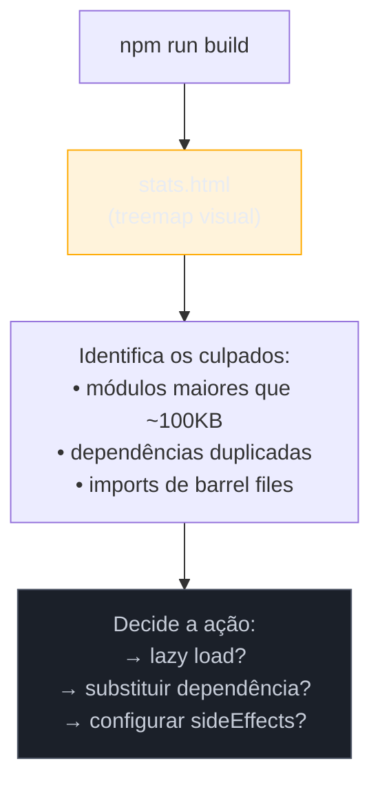
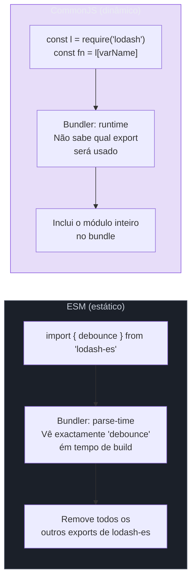
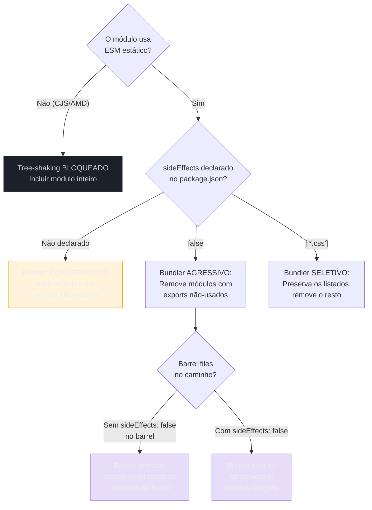
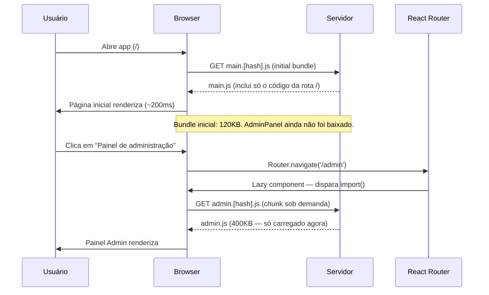
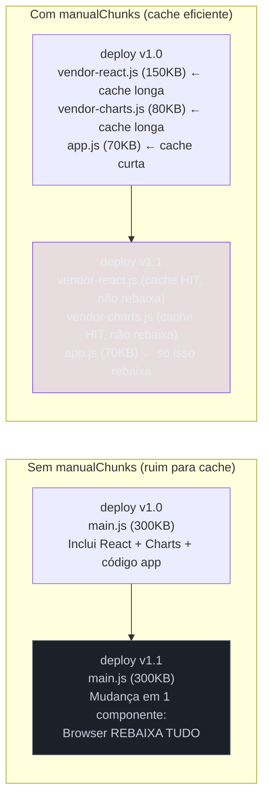
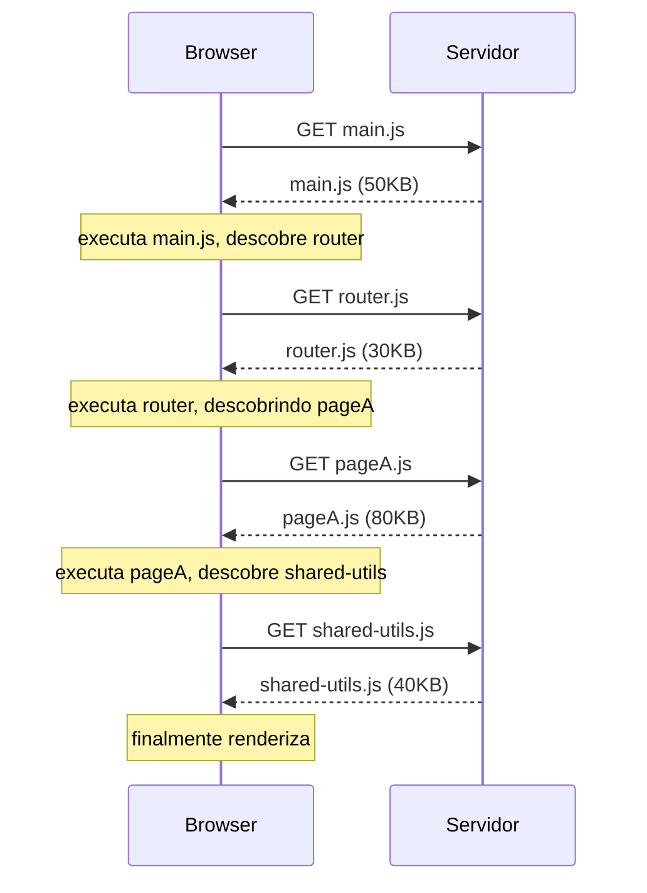
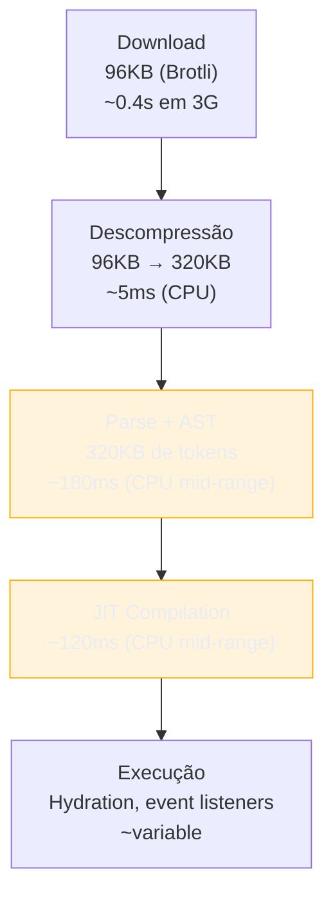
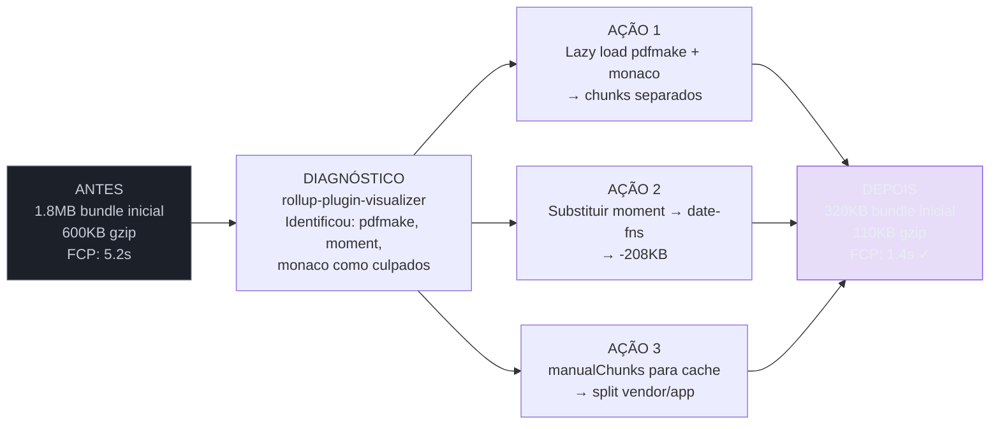

# Otimização de bundle

> [!abstract] TL;DR
> Um bundle inchado mata a performance antes do primeiro `fetch`. As técnicas para combatê-lo se dividem em três frentes: **remover** o que nunca vai ser executado (tree-shaking), **dividir** o que vai ser executado em fatias menores carregadas sob demanda (code splitting + lazy loading), e **comprimir** o que sobra (minificação). Diagnóstico vem antes de tudo: bundle analysis revela os culpados antes que você tente otimizar no escuro. A soma dessas técnicas não é acidente — elas se encaixam num ciclo de feedback que vai de `analyze → split → lazy → tree-shake → minify → measure` de volta ao início. Conhecer os *impedimentos* de cada técnica é tão importante quanto saber aplicá-la: `sideEffects` mal configurado anula o tree-shaking, barrel files silenciosamente inflam o bundle, e dividir em chunks demais pode ser pior do que não dividir.

---

## O problema: o bundle que ninguém diagnosticou

Tem um padrão que acontece em quase todo projeto React que atinge os 6-12 meses de vida: a aplicação fica lenta e ninguém sabe exatamente por quê. O Lighthouse acusa FCP de 4 segundos. A culpa recai em "muitas dependências" ou "o bundle cresceu". Mas cresceu *onde*? Quem? Quando?

O bundle é uma caixa preta até você abri-la.

Em 2026, um bundle de produção típico de um app React com roteamento, charts, e i18n tende a ficar entre 800KB e 2MB após minificação e Gzip. O problema não é o número absoluto — é que 60-70% desse volume costuma ser código que o usuário da home page **nunca vai executar** naquela sessão. Chart.js inteiro para uma dashboard que 5% dos usuários visita. Moment.js com todos os locales para um app que só usa pt-BR. Lodash completo por um `_.debounce`.

Esta nota ensina a diagnosticar esse problema e resolvê-lo sistematicamente.

> [!info] A relação com o grafo de módulos
> Toda técnica desta nota opera sobre o grafo de módulos descrito na [[07 - O grafo de módulos e o que é bundling]]. Tree-shaking poda nós não-alcançáveis. Code splitting fragmenta o grafo em subgrafos. Minificação comprime os nós que sobram. Entender o grafo é pré-requisito para entender o que essas técnicas fazem.

---

## Diagnóstico: o passo zero que a maioria pula

Regra de ouro: **nunca otimize sem medir primeiro**. Sem diagnóstico, você passa horas lazy-loadando componentes que somam 3KB e ignora uma dependência de 400KB no bundle inicial.

### rollup-plugin-visualizer

Para projetos com Vite (ou qualquer bundler baseado em Rollup), o `rollup-plugin-visualizer` é a ferramenta de eleição:

```bash
npm install --save-dev rollup-plugin-visualizer
```

```js
// vite.config.js
import { defineConfig } from 'vite'
import { visualizer } from 'rollup-plugin-visualizer'

export default defineConfig({
  plugins: [
    visualizer({
      open: true,           // abre o relatório no browser após o build
      gzipSize: true,       // mostra o tamanho Gzip de cada módulo
      brotliSize: true,     // também mostra Brotli (compressão mais eficiente)
      template: 'treemap',  // outros: 'sunburst', 'network', 'flamegraph'
      filename: 'dist/stats.html'
    })
  ]
})
```

O resultado é um treemap interativo onde cada retângulo representa um módulo — a área é proporcional ao tamanho. Você vê imediatamente quando `date-fns` ocupa 30% do bundle ou quando `react-quill` puxa `quill` inteiro.



> [!note] Leitura do diagrama
> O ciclo diagnóstico não é linear — depois da ação, você roda o build de novo e reanalisa. O visualizer é a lupa; as técnicas a seguir são o bisturi.

### source-map-explorer

Alternativa popular, agnóstica de bundler. Funciona a partir dos source maps gerados por qualquer ferramenta:

```bash
npm install --save-dev source-map-explorer

# gera os source maps no build
npm run build -- --sourcemap

# analisa
npx source-map-explorer dist/assets/*.js
```

A diferença do `rollup-plugin-visualizer`: o `source-map-explorer` usa os source maps para mapear bytes do bundle de volta para os arquivos de origem — mais preciso para entender exatamente qual linha de código cada módulo ocupa no bundle final.

### webpack-bundle-analyzer

Para projetos com webpack, o `webpack-bundle-analyzer` é o equivalente:

```js
// webpack.config.js
const BundleAnalyzerPlugin = require('webpack-bundle-analyzer').BundleAnalyzerPlugin;

module.exports = {
  plugins: [
    new BundleAnalyzerPlugin({
      analyzerMode: 'static',  // gera HTML; 'server' abre um servidor local
      openAnalyzer: true
    })
  ]
}
```

> [!tip] O que procurar no visualizer
> Três padrões de problema saltam imediatamente no treemap:
> 1. **Bloco gigante de terceiro**: `moment`, `lodash`, `chart.js`, `pdf-lib` — dependências que trazem muito mais do que você usa.
> 2. **Módulo repetido**: se você vê `react` duas vezes em chunks diferentes, há deduplicação faltando.
> 3. **Barrel file inchado**: um `index.js` que aparece grande e carrega dezenas de módulos — o sinal clássico de barrel file impedindo tree-shaking.

---

## Tree-shaking: eliminando código morto

Tree-shaking é o nome dado no ecossistema JS para **Dead Code Elimination** (DCE) no nível de módulos — o mesmo conceito que compiladores tradicionais aplicam à IR (ver [[03-Dominios/Ciência/Compiladores e Linguagens/12 - Otimização]]). O bundler analisa o grafo de módulos, identifica exportações que nunca são importadas por nenhum entry point, e as remove do output.

O nome vem da metáfora da árvore: agita-se a árvore de dependências, e o código morto cai como folhas secas.

### Por que tree-shaking exige ESM

Tree-shaking só funciona com módulos **ESM estáticos**. A razão é técnica e inegociável:

```js
// ESM — estático, analisável em tempo de build
import { debounce } from 'lodash-es'

// CommonJS — dinâmico, impossível de analisar estaticamente
const lodash = require('lodash')
const debounce = lodash['deb' + 'ounce']  // string construída em runtime!
```

Em ESM, `import` e `export` são declarações de linguagem analisadas em tempo de *parse*, antes da execução. O bundler vê o grafo completo de imports/exports sem executar o código. Em CommonJS, `require` é uma chamada de função avaliada em runtime — o bundler não sabe o que `lodash['deb' + 'ounce']` é até o código rodar.



> [!note] Leitura do diagrama
> A diferença fundamental é *quando* a análise acontece. ESM é analisável em tempo de build (análise estática). CJS é resolvido em runtime, tornando a análise estática conservadoramente impossível.

### O campo `sideEffects` no package.json

Tree-shaking tem um problema sutil: o bundler não sabe, por padrão, se importar um módulo sem usar seus exports vai ter efeitos colaterais. Considere:

```js
// polyfill.js — tem side effect ao ser importado
Array.prototype.flatMap = Array.prototype.flatMap || function(...) { ... }

// theme.js — importa CSS, side effect real
import './theme.css'
export const colors = { primary: '#007bff' }
```

Se o bundler eliminar `polyfill.js` porque nenhum export é usado, ele quebra o runtime. Se eliminar `theme.css` porque não é um export JS, o visual do app quebra.

O bundler só age quando o arquivo **é alcançado pelo grafo de módulos** — ou seja, quando algum módulo da aplicação (direta ou indiretamente) faz `import './polyfill.js'`. Se nenhum módulo importar o arquivo, o bundler simplesmente não o inclui; não há nada a preservar. O comportamento conservador entra quando o arquivo *foi importado* mas nenhum de seus exports foi utilizado: sem `sideEffects: false`, o bundler presume que o simples ato de importar o arquivo já pode ter produzido efeitos colaterais (como o monkey-patch de `Array.prototype`), e por isso mantém o arquivo no bundle.

O campo `sideEffects` no `package.json` resolve isso explicitamente:

```json
// package.json — "confio que nenhum módulo tem side effects"
{
  "name": "minha-lib",
  "sideEffects": false
}
```

```json
// package.json — "esses arquivos específicos têm side effects"
{
  "name": "minha-lib",
  "sideEffects": [
    "./src/polyfills.js",
    "**/*.css"
  ]
}
```

O que isso faz: quando `sideEffects: false`, o bundler sabe que pode remover qualquer módulo do pacote cujos exports não são utilizados, sem medo de perder efeitos colaterais. Sem essa declaração, o bundler é conservador e inclui módulos que *poderiam* ter side effects.

> [!warning] sideEffects não é um `#__PURE__` global
> `sideEffects: false` diz ao bundler: "se **nenhum** export deste módulo é usado, o módulo inteiro pode ser removido". É uma declaração sobre *módulos*, não sobre *chamadas de função individuais*. Módulos com exports *usados* sempre são incluídos, independentemente de `sideEffects`.

### O que impede tree-shaking — os seis inimigos

Saber o que impede tree-shaking é mais valioso do que saber que ele existe:

**1. CommonJS no módulo ou nas dependências**

Nem sempre controlável: dependências que publicam só CJS não podem ser tree-shaken. A solução é buscar alternativas ESM (`lodash-es` em vez de `lodash`) ou usar `sideEffects: false` quando o bundler suporta análise de CJS limitada.

**2. Babel transformando ESM em CJS**

Clássico e silencioso. O Babel com `@babel/preset-env` transforma `import`/`export` em `require`/`module.exports` por padrão — o que desfaz tree-shaking antes do bundler ter chance de fazer o trabalho:

```json
// .babelrc — correto para tree-shaking
{
  "presets": [
    ["@babel/preset-env", {
      "modules": false   // ← crucial: não transformar módulos
    }]
  ]
}
```

**3. Barrel files sem `sideEffects: false`**

Barrel files (arquivos `index.js` que reexportam tudo) são o inimigo silencioso mais comum:

```js
// src/components/index.js — barrel file
export { Button } from './Button'
export { Modal } from './Modal'
export { Table } from './Table'
export { Chart } from './Chart'  // 400KB sozinho!
```

Quando você importa `import { Button } from './components'`, o bundler precisa decidir se pode eliminar `Modal`, `Table` e `Chart`. Se o pacote não tem `sideEffects: false`, o bundler presume que importar `index.js` pode ter side effects e inclui tudo.

A solução é dupla: adicionar `sideEffects: false` ao `package.json` **e** preferir imports diretos em projetos grandes:

```js
// Em vez de (barrel — pode travar tree-shaking):
import { Button } from './components'

// Prefira (import direto — garante tree-shaking):
import { Button } from './components/Button'
```

**4. Re-exports de objetos inteiros**

```js
// ❌ Não tree-shakeable: default export de objeto
export default {
  add, subtract, multiply, divide, round, truncate, ...
}

// ✅ Tree-shakeable: named exports individuais
export { add, subtract, multiply, divide }
```

Quando você exporta um objeto, o bundler não consegue saber quais propriedades do objeto serão acessadas — o objeto inteiro vai para o bundle.

**5. Higher-Order Components e chamadas de factory (React)**

Um padrão específico que confunde bundlers:

```js
// ❌ O bundler não sabe se withAppProvider() tem side effects
const EnhancedButton = withAppProvider()(Button)

// ✅ Anotação PURE: "confie que esta chamada não tem side effects"
const EnhancedButton = /*#__PURE__*/ withAppProvider()(Button)
```

A anotação `/*#__PURE__*/` (ou `/*@__PURE__*/`) diz ao minificador (geralmente terser) que aquela chamada de função não tem side effects — pode ser removida se o resultado não for usado.

Na prática, a responsabilidade é dividida em três camadas:

- **O compilador** (Babel/SWC/TypeScript) anota automaticamente expressões que ele *sabe* serem puras: chamadas de `React.createElement`, `jsx()`, e instanciações de class components compiladas. Por isso, código JSX comum raramente precisa de anotação manual.
- **O desenvolvedor da lib** é quem deve anotar funções de factory e HOCs que a lib expõe — porque só ele sabe se `withAppProvider()` registra listeners, modifica estado global, ou apenas decora o componente.
- **O desenvolvedor da aplicação** anota no próprio código quando usa um HOC de terceiros sem anotação e quer garantir remoção caso o resultado não seja utilizado.

O caso de `withAppProvider()(Button)` escapa do compilador porque não é JSX — é uma chamada de função genérica. O compilador não tem como inferir se ela tem side effects. A anotação `/*#__PURE__*/` é a forma explícita de dizer: *"prometo que esta chamada não tem side effects e o resultado pode ser descartado sem consequências"*.

**6. Dynamic `require()` e imports condicionais**

```js
// ❌ Bundler não pode analisar — inclui o módulo inteiro
const plugin = require(`./plugins/${pluginName}`)

// ✅ Dynamic import com magic comment (Webpack/Vite) — cria chunk
const plugin = await import(
  /* webpackChunkName: "plugin-[request]" */
  `./plugins/${pluginName}`
)
```



> [!note] Leitura do diagrama
> A decisão de tree-shaking passa por dois filtros: o formato do módulo (ESM obrigatório) e a declaração de side effects. Barrel files criam um terceiro filtro que só é superado com `sideEffects: false` explícito na cadeia de reexports.

### Anotações de pureza — além do `/*#__PURE__*/`

Além do `/*#__PURE__*/` por chamada de função, a Webpack 5.107.0+ (maio 2025) adicionou `/*#__NO_SIDE_EFFECTS__*/` no nível de módulo — uma alternativa programática ao `sideEffects` no `package.json`:

```js
// lib/utils.js — anotação inline, sem precisar do package.json
/*#__NO_SIDE_EFFECTS__*/

export function formatDate(date) { /* ... */ }
export function parseISO(str) { /* ... */ }
```

A diferença de `sideEffects: false` no `package.json`: a anotação inline funciona por arquivo, é versionável com o código, e funciona mesmo sem controle do `package.json` da lib (ex: libs de terceiros wrappeadas internamente).

> [!info] Estado 2026: suporte parcial
> `/*#__NO_SIDE_EFFECTS__*/` é suportado pelo Webpack 5.107+ e pelo Rolldown (o substituto do Rollup, usado no Vite 6+). O Rollup clássico e o esbuild ainda não suportam — verificar a documentação do bundler antes de depender da anotação.

### Limite fundamental: closures capturam tudo

Há um caso que nenhum bundler resolve sem heurísticas agressivas: funções que retornam closures. O bundler não pode saber qual propriedade do closure é acessada externamente:

```js
// lib.js
export function createStore(initialState) {
  let state = initialState
  return {
    getState: () => state,
    setState: (s) => { state = s },
    subscribe: (fn) => { /* ... */ }
  }
}
```

Se você usa só `createStore(x).getState()`, o bundler não pode eliminar `setState` e `subscribe` do bundle — porque eles estão embutidos no objeto retornado e o bundler não rastreia uso de propriedades de objetos locais a menos que use análise de escape (cara computacionalmente). Esse é um limite real do tree-shaking atual; a solução é expor cada função separadamente como named export.

---

## Code splitting: dividindo o grafo em chunks inteligentes

Se tree-shaking elimina código que *nunca* é usado, code splitting adia o código que *ainda não* é usado. São estratégias complementares, não alternativas.

O ponto de entrada para code splitting é o `import()` dinâmico — uma expressão que retorna uma Promise e sinaliza ao bundler que aquele módulo deve ir para um chunk separado:

```js
// main.js — bundle inicial pequeno
import { renderHome } from './pages/Home'

renderHome()

// O código da página Admin só é carregado se o usuário for admin
// e clicar em "Painel de administração"
document.getElementById('admin-link').addEventListener('click', async () => {
  const { AdminPanel } = await import('./pages/AdminPanel')
  new AdminPanel(document.getElementById('root'))
})
```

O bundler vê esse `import()` e cria um chunk separado: `AdminPanel.[hash].js`. Esse arquivo não é enviado ao browser no carregamento inicial — só quando o evento é disparado.

### O ciclo completo de uma requisição lazy



> [!note] Leitura do diagrama
> O usuário que só usa a home page nunca baixa os 400KB do AdminPanel. Só quem navega para `/admin` paga esse custo — e no momento certo. O bundle inicial permanece pequeno, e o FCP (First Contentful Paint) não é penalizado pelo código que não é necessário agora.

### Code splitting por rota em React (o padrão mais comum)

React.lazy + Suspense é o mecanismo nativo para lazy loading de componentes. Combinado com um router, produz code splitting por rota automaticamente:

```jsx
import { lazy, Suspense } from 'react'
import { createBrowserRouter, RouterProvider } from 'react-router-dom'

// Cada import() cria um chunk separado no build
const Home     = lazy(() => import('./pages/Home'))
const About    = lazy(() => import('./pages/About'))
const Admin    = lazy(() => import('./pages/Admin'))
const Checkout = lazy(() => import('./pages/Checkout'))

const router = createBrowserRouter([
  {
    path: '/',
    element: (
      // Suspense renderiza o fallback enquanto o chunk carrega
      <Suspense fallback={<div>Carregando...</div>}>
        <Home />
      </Suspense>
    )
  },
  { path: '/about',    element: <Suspense fallback={<Spinner />}><About /></Suspense> },
  { path: '/admin',    element: <Suspense fallback={<Spinner />}><Admin /></Suspense> },
  { path: '/checkout', element: <Suspense fallback={<Spinner />}><Checkout /></Suspense> },
])

export default function App() {
  return <RouterProvider router={router} />
}
```

O Vite (via Rollup) detecta esses `import()` e cria chunks automáticos:

```
dist/
  assets/
    main-BkxSgIJ7.js       ← bundle inicial (router + shell)
    Home-CqD8Xwkl.js       ← chunk da rota /
    About-DmE9Yxno.js      ← chunk da rota /about
    Admin-EvF0Zpqr.js      ← chunk da rota /admin
    Checkout-FaG1Aqus.js   ← chunk da rota /checkout
```

### Chunks compartilhados: o problema da duplicação

Sem configuração, cada chunk pode incluir suas próprias cópias de módulos compartilhados. Se `Home` e `Admin` ambos usam `date-fns`, sem chunk compartilhado, `date-fns` vai aparecer em ambos os arquivos.

Sim, exatamente. Quando não há chunk compartilhado, o bundler emite uma cópia completa de `date-fns` dentro de cada chunk que o utiliza — dois arquivos separados no disco, dois downloads distintos, e dois ciclos de parse+compilação se o usuário navegar pelas duas rotas na mesma sessão. O browser não deduplica automaticamente: cada arquivo é uma unidade independente de cache. É por isso que chunks compartilhados não são apenas uma economia de bytes no servidor — eles evitam que o browser processe o mesmo módulo duas vezes.

O `manualChunks` no Vite resolve isso:

```js
// vite.config.js
export default {
  build: {
    rollupOptions: {
      output: {
        manualChunks: {
          // Vendor chunk: deps que mudam raramente
          // → ficam em cache por semanas
          'vendor-react': ['react', 'react-dom', 'react-router-dom'],
          
          // Deps grandes separadas para cache granular
          'vendor-charts': ['chart.js', 'react-chartjs-2'],
          'vendor-editor': ['@tiptap/react', '@tiptap/starter-kit'],
          
          // Utilitários: mudam mais, cache mais curto
          'vendor-utils': ['date-fns', 'zod', 'axios'],
        }
      }
    }
  }
}
```

A lógica de cache por trás disso:



> [!note] Leitura do diagrama
> A separação vendor/app não reduz o total de bytes baixados na primeira visita. O ganho está nas visitas subsequentes e após deployments: o browser usa o chunk de vendor em cache e só rebaixa o código de aplicação que mudou.

### Preloading: antecipando chunks que serão necessários

Após o code splitting, a UX pode degradar se o usuário precisar esperar o chunk carregar após uma interação. Para rotas previsíveis, você pode *prefetching* ou *preloading*:

```jsx
// React Router v6.4+ — prefetch automático em hover
<Link to="/admin" prefetch="intent">
  Painel Admin
</Link>

// Ou manualmente com import() antecipado
function prefetchAdmin() {
  // Dispara o download sem esperar o resultado
  import('./pages/Admin')
}

// Prefetch quando o mouse passa sobre o link
<button
  onMouseEnter={prefetchAdmin}
  onClick={() => navigate('/admin')}
>
  Painel Admin
</button>
```

#### Magic comments: `webpackPrefetch` e `webpackPreload`

O Webpack (e Vite via plugin) suporta *magic comments* dentro do `import()` para controlar como o browser trata o chunk:

```js
// webpackPrefetch: true — baixa durante idle time (baixa prioridade)
// O browser adiciona <link rel="prefetch"> automaticamente
const AdminPanel = lazy(() =>
  import(/* webpackChunkName: "admin", webpackPrefetch: true */ './pages/Admin')
)

// webpackPreload: true — carrega junto com o chunk pai (alta prioridade)
// Análogo a <link rel="preload"> — use com cautela
const HeroBanner = lazy(() =>
  import(/* webpackChunkName: "hero", webpackPreload: true */ './components/HeroBanner')
)
```

A distinção é importante:

| Magic comment | Quando dispara | Prioridade | Uso ideal |
|---------------|----------------|------------|-----------|
| `webpackPrefetch` | Após a página carregar (idle) | Baixa | Rotas que o usuário *provavelmente* vai visitar |
| `webpackPreload` | Junto com o chunk pai | Alta | Recursos que o chunk pai *certamente* precisa logo |

> [!warning] `webpackPreload` mal usado piora a performance
> Preload com alta prioridade compete com recursos críticos (CSS, fontes, imagens LCP). Use só para recursos que o chunk corrente genuinamente precisa em < 1s. Prefetch é a opção mais segura para a maioria dos casos.

#### `<link rel="modulepreload">` — o nativo do browser

O HTML permite declarar preload de módulos ES diretamente, sem depender de bundler:

```html
<!-- No <head> — o browser baixa e parseia o chunk antes de precisar dele -->
<link rel="modulepreload" href="/assets/vendor-react-BkxSgIJ7.js" />
<link rel="modulepreload" href="/assets/Home-CqD8Xwkl.js" />
```

O Vite gera essas tags automaticamente para todos os chunks do bundle inicial. Para chunks lazy, a geração é opcional via `build.modulePreload`. A diferença de `rel="preload"` para `rel="modulepreload"`: o segundo parseia e compila o módulo JS antecipadamente (não só baixa), e também pré-carrega as dependências do módulo declarado.

#### O problema do chunk waterfall

Code splitting ingênuo cria um problema em cascata: para renderizar a página A, o browser precisa de `main.js` → que importa `router.js` → que lazy-carrega `pageA.js` → que descobre que precisa de `shared-utils.js`. Cada chunk só é descoberto quando o anterior termina de executar.



> [!note] Leitura do diagrama
> Cada requisição é sequencial porque o browser não sabe do próximo chunk até executar o anterior. Quatro round-trips sequenciais numa conexão com 50ms de latência = +200ms só de overhead de descoberta, antes de qualquer byte de código ser executado.

**Solução**: o Vite 5+ resolve isso automaticamente gerando tags `<link rel="modulepreload">` para todas as dependências transitivas de cada entry point — o browser baixa toda a árvore de dependências em paralelo, eliminando o waterfall.

> [!question] O `modulepreload` automático do Vite elimina o waterfall de dependências transitivas — e o `webpackPrefetch` / `prefetchAdmin()` manual antecipa chunks de *outras rotas* que o usuário *provavelmente* vai visitar. São eixos perpendiculares: um resolve o carregamento interno do chunk atual, o outro resolve a descoberta antecipada de chunks futuros. Vale aprofundar quando e como as duas estratégias interagem em SPAs complexas com muitas rotas aninhadas.

Para casos manuais, você pode usar `import.meta.glob` com `{ eager: false }` e `prefetch` explícito:

```js
// Pré-carrega todas as rotas antecipadamente após idle
if ('requestIdleCallback' in window) {
  requestIdleCallback(() => {
    import('./pages/About')
    import('./pages/Checkout')
  })
}
```

---

## Minificação: comprimindo o que sobra

Depois de remover (tree-shaking) e dividir (code splitting), o que resta no bundle ainda pode ser comprimido. Minificação é o processo de reduzir o tamanho do código JavaScript sem alterar sua semântica — exatamente a definição de otimização correta do mundo de compiladores.

Um minificador de JS tipicamente faz:

1. **Remoção de whitespace e comentários** — a parte mais simples
2. **Renaming (mangling)** — renomear variáveis e funções para nomes curtos (`userName` → `a`, `fetchUserById` → `b`)
3. **Dead code elimination local** — remover `if (false) { ... }`, variáveis não usadas dentro de funções
4. **Constant folding** — avaliar `1000 * 60 * 60` para `3600000` em tempo de build
5. **Inlining de funções pequenas** — substituir chamadas por corpos de funções de 1-2 linhas
6. **Simplificação de expressões** — `!!x` → `Boolean(x)` → `!x ? false : true` → resultado simplificado

### Os três minificadores: terser, esbuild, swc

O ecossistema 2026 converge em três ferramentas, com trade-offs distintos:

| Ferramenta | Velocidade | Compressão | Uso típico |
|-----------|-----------|-----------|------------|
| **Terser** | Lenta (215ms–3s por lib grande) | Melhor (gold standard) | Usado como fallback quando compressão é crítica |
| **esbuild** | Muito rápida (18-40ms) | Boa (~56% minzipped) | Padrão do Vite em dev; opção de build prod |
| **SWC** | Rápida (18-72ms) | Quase igual ao terser (~58%) | Next.js, Rspack, builds CI onde velocidade importa |
| **oxc-minify** | Ultrarrápida (3-14ms) | Competitiva (~57%) | Emergente, Rolldown/oxc ecosystem |

Benchmark concreto (react@18.2.0, abril 2026):
- Terser: 57.8% compressão, 215ms
- SWC: 58.1% compressão, 18ms (12x mais rápido, compressão levemente melhor)
- esbuild: 56.4% compressão, 23ms (9x mais rápido, 1.4% a mais de bytes)
- oxc-minify: 57.2% compressão, 3ms (70x mais rápido que terser)

Na prática:
- **Vite** usa esbuild para minificação por padrão, com opção de trocar para terser via `build.minifier: 'terser'`
- **Next.js** migrou de terser para SWC (SWC minifier é o padrão desde Next.js 13)
- **Rspack** usa seu próprio minifier baseado em SWC

```js
// vite.config.js — escolhendo o minificador
export default {
  build: {
    minify: 'esbuild',   // padrão: mais rápido
    // minify: 'terser', // alternativa: máxima compressão
    // minify: false,    // desabilitar (nunca em prod)

    // Quando usar terser, opções de mangling
    terserOptions: {
      compress: {
        drop_console: true,    // remove console.log em prod
        drop_debugger: true,
        pure_funcs: ['console.log', 'console.info'],
      },
      mangle: {
        properties: false,    // renomear nomes de propriedades (arriscado!)
      }
    }
  }
}
```

> [!warning] Mangling de propriedades é arriscado
> Por padrão, minificadores renomeiam *variáveis locais* mas não *nomes de propriedades* (como `user.firstName`). Renomear propriedades (`mangle.properties: true` no terser) pode quebrar código que acessa propriedades por string (`obj['firstName']`), serialização JSON, ou APIs externas que esperam nomes específicos. Use só com testes extensivos e denylist explícita.

### Mangling em prática

```js
// Antes da minificação
export function calculateTotalPrice(cartItems, taxRate, discountCode) {
  const subtotal = cartItems.reduce((sum, item) => sum + item.price * item.quantity, 0)
  const discount = discountCode === 'SAVE10' ? subtotal * 0.1 : 0
  const taxAmount = (subtotal - discount) * taxRate
  return subtotal - discount + taxAmount
}

// Após minificação com mangling (terser/SWC)
export function calculateTotalPrice(a,b,c){
  const d=a.reduce((e,f)=>e+f.price*f.quantity,0)
  const g=c==='SAVE10'?d*.1:0
  return d-g+(d-g)*b
}
```

O código é semanticamente idêntico, mas os nomes das variáveis locais encurtaram drasticamente. Em bundles grandes, o impacto acumulado chega a 20-30% de redução adicional sobre a remoção de whitespace.

---

## Compressão: Gzip vs. Brotli e o que acontece no servidor

Minificação reduz o código JavaScript. Compressão reduz o que é enviado pelo fio. São etapas complementares: minificação opera antes do build, compressão opera no momento da transferência HTTP.

O browser anuncia quais algoritmos suporta via header `Accept-Encoding`:

```
Accept-Encoding: gzip, deflate, br, zstd
```

O servidor escolhe o melhor disponível e responde com `Content-Encoding: br` (Brotli) ou `Content-Encoding: gzip`.

### Gzip vs. Brotli: trade-offs concretos

| Algoritmo | Ratio (JS típico) | Velocidade compressão | Suporte browser | Caso de uso |
|-----------|------------------|-----------------------|-----------------|-------------|
| Gzip (nível 6) | ~65-70% de redução | Rápida | 100% | Compatibilidade máxima, compressão dinâmica |
| Gzip (nível 9) | ~67-72% de redução | Lenta (3-5x nível 6) | 100% | Assets estáticos pré-comprimidos |
| Brotli (nível 6) | ~72-78% de redução | Moderada | 96%+ | Padrão para assets estáticos |
| Brotli (nível 11) | ~74-80% de redução | Muito lenta (40-60x Gzip) | 96%+ | Pré-compressão offline (vale a pena em CI) |
| Zstd | ~70-75% de redução | Muito rápida | Chrome 123+, FF 126+ | Emergente — ainda sem suporte Safari |

Na prática, para JS minificado (que já é relativamente incompressível por ter pouca redundância), Brotli nível 6 oferece ~8-12% a menos de bytes que Gzip nível 6 com custo de servidor aceitável.

> [!tip] Pré-compressão em build time vs. compressão dinâmica
> Compressão dinâmica no servidor (nginx, caddy, cloudflare) é rápida mas usa Brotli em nível baixo (4-6) para não bloquear o response. Pré-compressão em build time — gerando `.js.br` e `.js.gz` — permite usar Brotli nível 11 sem impacto de latência. O servidor serve o arquivo pré-comprimido diretamente.

### Pré-compressão com Vite

```bash
npm install --save-dev vite-plugin-compression2
```

```js
// vite.config.js
import { defineConfig } from 'vite'
import { compression } from 'vite-plugin-compression2'

export default defineConfig({
  plugins: [
    // Gera .js.br (Brotli nível 11) para todos os assets > 10KB
    compression({
      algorithm: 'brotliCompress',
      exclude: [/\.(br|gz)$/],
      threshold: 10240,  // 10KB — não comprime arquivos pequenos (overhead)
    }),
    // Também gera .js.gz como fallback para servidores sem Brotli
    compression({
      algorithm: 'gzip',
      exclude: [/\.(br|gz)$/],
    }),
  ]
})
```

Configuração correspondente no nginx para servir arquivos pré-comprimidos:

```nginx
# nginx.conf
server {
  # Tenta servir .br → .gz → original (nessa ordem de preferência)
  gzip_static on;
  brotli_static on;  # requer módulo ngx_brotli

  location /assets/ {
    expires 1y;                         # cache longo para assets com hash
    add_header Cache-Control "public, immutable";
    add_header Vary "Accept-Encoding";  # importante: instrui CDNs e proxies
  }
}
```

> [!info] Por que `Vary: Accept-Encoding` importa
> Sem esse header, um proxy ou CDN pode cachear a versão Brotli e servir para um cliente que declarou só suportar Gzip — quebrando a descompressão. `Vary: Accept-Encoding` instrui intermediários a manter versões separadas por encoding.

### O custo real de JS comprimido: parse ≠ download

Um conceito que confunde até engenheiros sênior: **o tamanho que o browser baixa não é o tamanho que ele processa**.

```
arquivo original:   500KB (o que o engine parseia e compila)
   ↓ minificação
arquivo minificado: 320KB (ainda é o que o engine processa)
   ↓ compressão Brotli nível 6
transferência:       96KB (o que o browser baixa)
```

O browser baixa 96KB, mas ao descomprimir e executar, trabalha com 320KB de JS. Em CPUs lentas (dispositivos de entrada, 1-2 GHz single-core), o custo dominante de um bundle grande é **parse + compilação JIT**, não download. Isso explica por que Lighthouse e web.dev medem o *tamanho do arquivo original* para alertas de "Reduce unused JavaScript", não o tamanho comprimido.



> [!note] Leitura do diagrama
> O download é a menor fração do custo total em redes modernas (4G+). Parse e compilação dominam — e não são afetados por Brotli. A única solução para o custo de parse é **ter menos JS**: tree-shaking + code splitting, não apenas melhor compressão.

---

## Orçamento de performance e Core Web Vitals

Bundle analysis e otimizações não têm sentido sem uma métrica de sucesso. **Performance budget** é um limite declarativo: "o bundle inicial não pode passar de X KB".

A relação com Core Web Vitals é direta:

- **LCP (Largest Contentful Paint)**: se o bundle inicial é grande e bloqueia o render, o LCP sobe. O browser não renderiza antes de parsear e executar o JS crítico.
- **INP (Interaction to Next Paint)** — substituiu o FID em 2024: se o usuário interage antes do JS terminar de executar (hydration), a interação não responde. Bundle menor = hydration mais rápida.
- **CLS (Cumulative Layout Shift)**: indiretamente afetado quando lazy-loaded content entra na página e empurra elementos existentes.

### Definindo um performance budget

```js
// package.json — usando size-limit para CI
{
  "size-limit": [
    {
      "path": "dist/assets/main-*.js",
      "limit": "150 KB",   // gzipped
      "import": "*"
    },
    {
      "path": "dist/assets/vendor-react-*.js",
      "limit": "50 KB"
    }
  ]
}
```

```bash
# CI pipeline — falha o build se o budget estourar
npx size-limit
```

Alvos práticos (2026, Gzip):
- Bundle inicial (JS crítico): idealmente < 150KB, aceitável < 250KB
- Tempo de parse em mobile médio (~4x CPU throttling): < 3 segundos
- Cada rota lazy: idealmente < 100KB, aceitável < 200KB

> [!info] Parse time vs. tamanho de download
> 1MB de JS comprimido com Brotli pode ser 300KB no download, mas continua sendo 1MB para parsear e compilar no browser. Em dispositivos móveis de entrada (CPU single-core a 1GHz), parsear 1MB de JS pode levar 3-5 segundos. O tamanho pós-Gzip que o DevTools mostra é o custo de rede; o tamanho antes da compressão é o custo de CPU. Ambos importam.

---

## Estado 2026: Rolldown, Vite 6 e oxc-minify

O ecossistema de bundling está em transição acelerada em 2026. Três movimentos afetam diretamente otimização de bundle:

### Rolldown como motor do Vite 6

O Vite 6 (lançado novembro 2024, estável em 2025) migrou para o **Rolldown** como bundler interno, substituindo o Rollup para builds de produção. O Rolldown é uma reimplementação do Rollup em Rust — com API compatível, mas velocidade de build até 10-20x maior em projetos grandes.

O impacto na otimização de bundle:
- **Mesma semântica de tree-shaking** do Rollup (ESM estático, `sideEffects`), mas mais rápida
- **`manualChunks`** funciona identicamente — código de configuração não muda
- **Suporte a `/*#__NO_SIDE_EFFECTS__*/`** (o Rollup clássico não suportava)
- **`rollup-plugin-visualizer`** ainda funciona via compatibilidade de plugin API

> [!info] Rolldown em 2026 — fonte
> O Rolldown foi integrado ao Vite como dependência interna a partir da versão 6.1+. O Vite 6 usa Rolldown para prod builds e mantém Rollup como opção de fallback. Fonte: Vite docs (https://vite.dev/guide/rolldown), junho 2026.

### `oxc-minify` como alternativa emergente

O **oxc-minify** é o minificador do ecossistema `oxc` (Rust), integrado ao Rolldown. Nos benchmarks de abril 2026:

- **3ms** em `react@18.2.0` (vs 215ms do Terser — 70x mais rápido)
- **57.2% de compressão** (vs 57.8% do Terser — diferença desprezível)
- **Integrado automaticamente** quando Rolldown é usado como bundler

Na prática, para projetos Vite 6+, `oxc-minify` passa a ser o padrão de fato sem configuração adicional. Para projetos Webpack ou Rollup clássico, a opção continua sendo SWC ou Terser.

```js
// vite.config.js — Vite 6+ com Rolldown
// oxc-minify é o padrão; para usar terser explicitamente:
export default defineConfig({
  build: {
    minify: 'terser',  // opt-in em terser (máxima compressão, mais lento)
    // minify: true,   // padrão: oxc-minify via Rolldown
  }
})
```

### Consequência para análise de bundle

Com Rolldown, o `rollup-plugin-visualizer` continua funcionando (API de plugin compatível). Mas surgiu o **Rsbuild bundle analyzer** — integrado ao Rspack/Rsbuild — que oferece visualização similar sem precisar de plugin externo. Para projetos Vite 6+, `rollup-plugin-visualizer` ainda é a escolha principal.

---

## Exemplo trabalhado: diagnosticar e otimizar um bundle inchado

Cenário concreto: um app React com Vite que começou como projeto de prova de conceito e cresceu para 1.8MB de bundle inicial (gzipped: 600KB). O Lighthouse acusa FCP de 5.2 segundos em mobile.

### Passo 1: abrir o visualizer

```bash
npm install --save-dev rollup-plugin-visualizer
# adicionar ao vite.config.js e rodar:
npm run build
```

O treemap revela:
- `pdfmake`: 450KB (usado numa única tela de relatório)
- `moment` com todos os locales: 220KB (só pt-BR é usado)
- `@monaco-editor/react`: 180KB (editor de código usado por 2% dos usuários)
- `react` + `react-dom`: 145KB (inevitável)
- Código da aplicação: 280KB

Total: 1.8MB. O código da aplicação é só 15% do problema.

### Passo 2: lazy load das partes pesadas

```jsx
// Antes: importação estática — sempre no bundle inicial
import { PDFViewer } from './components/PDFViewer'
import { MonacoEditor } from './components/MonacoEditor'

// Depois: lazy — só carregam quando necessário
const PDFViewer    = lazy(() => import('./components/PDFViewer'))
const MonacoEditor = lazy(() => import('./components/MonacoEditor'))

// PDFViewer só é montado na rota /relatorios
// MonacoEditor só é montado na rota /editor
```

**Impacto**: bundle inicial cai de 1.8MB para ~850KB. `pdfmake` e `monaco-editor` viram chunks separados.

### Passo 3: substituir moment por date-fns (tree-shakeable)

```bash
npm uninstall moment
npm install date-fns
```

```js
// Antes (moment — não tree-shakeable, locales pesados)
import moment from 'moment'
moment.locale('pt-BR')
const formatted = moment(date).format('DD/MM/YYYY')

// Depois (date-fns — tree-shakeable, ESM, locale seletivo)
import { format } from 'date-fns'
import { ptBR } from 'date-fns/locale'
const formatted = format(date, 'dd/MM/yyyy', { locale: ptBR })
```

**Impacto**: 220KB → ~12KB (só a função `format` e o locale pt-BR entram no bundle).

### Passo 4: configurar manualChunks para cache eficiente

```js
// vite.config.js
export default {
  build: {
    rollupOptions: {
      output: {
        manualChunks: {
          'vendor-react': ['react', 'react-dom', 'react-router-dom'],
          'vendor-ui': ['@radix-ui/react-dialog', '@radix-ui/react-dropdown-menu'],
        }
      }
    }
  }
}
```

### Passo 5: medir novamente

```
Bundle inicial (antes): 1.8MB / gzip 600KB / FCP 5.2s
Bundle inicial (depois): 320KB / gzip 110KB / FCP 1.4s
```



> [!note] Leitura do diagrama
> O ciclo diagnóstico-ação-medição é iterativo. Neste exemplo, três ações independentes resolveram o problema sem conflito entre si. Na prática, priorize pelas vitórias maiores primeiro (lazy load das deps gigantes tem mais impacto que ajustar manualChunks).

---

## Como explicar em inglês

**Bundle optimization** is the set of techniques used to reduce the size and improve the load performance of JavaScript bundles. The three main strategies work at different stages: **tree-shaking** removes code that is never referenced by any entry point (dead code elimination at module level), **code splitting** breaks the bundle into multiple chunks loaded on demand via dynamic `import()`, and **minification** compresses what remains by removing whitespace, renaming local variables (mangling), and evaluating constant expressions.

Tree-shaking relies on **ES modules** because their `import`/`export` syntax is statically analyzable at build time — unlike CommonJS `require()`, which is a runtime function call. The **`sideEffects` field in package.json** tells bundlers which files are safe to remove even if their exports are unused. Without it, bundlers are conservative and may include entire modules unnecessarily. Common **tree-shaking blockers** include CommonJS dependencies, Babel transforming ESM to CJS, barrel files without `sideEffects: false`, and object default exports.

**Code splitting** is implemented via the dynamic `import()` expression, which signals the bundler to emit the target module as a separate chunk. Frameworks like React provide `React.lazy()` + `Suspense` as a higher-level API. **`manualChunks`** (Rollup/Vite) or `SplitChunksPlugin` (webpack) allow explicit control over chunk grouping for better cache performance — vendor code that changes rarely should live in its own chunk so browser caches survive application deployments.

**Minifiers** in 2026 offer different trade-offs: **Terser** achieves the best compression but is slow (used by webpack by default for decades); **esbuild** is 9x faster with ~1-2% larger output (Vite's default); **SWC** achieves near-Terser compression at near-esbuild speed (Next.js default since v13). **oxc-minify** is emerging as the fastest option in the Rust/oxc ecosystem.

The diagnostic workflow always precedes optimization: **rollup-plugin-visualizer** (Vite/Rollup) and **webpack-bundle-analyzer** (webpack) produce treemap visualizations showing which modules consume the most bytes, enabling targeted optimization rather than guesswork.

### Vocabulário-chave

| Português | English |
|-----------|---------|
| Otimização de bundle | Bundle optimization |
| Agitação de árvore | Tree-shaking |
| Eliminação de código morto | Dead code elimination (DCE) |
| Efeitos colaterais | Side effects |
| Anotação de pureza | Pure annotation (`/*#__PURE__*/`) |
| Arquivo barrel | Barrel file / index file / re-export file |
| Divisão de código | Code splitting |
| Carregamento tardio / sob demanda | Lazy loading |
| Importação dinâmica | Dynamic import |
| Fragmento / pedaço | Chunk |
| Chunk inicial | Initial chunk |
| Chunk de fornecedores | Vendor chunk |
| Fragmentos compartilhados | Shared chunks |
| Pré-busca | Prefetch |
| Pré-carregamento | Preload |
| Minificação | Minification |
| Renomeação / obfuscação de nomes | Mangling |
| Dobramento de constantes | Constant folding |
| Orçamento de performance | Performance budget |
| Análise de bundle | Bundle analysis |
| Mapa de fonte | Source map |
| Peso de parse | Parse cost / parse time |
| Compressão | Compression (Gzip / Brotli) |
| Conteúdo maior pintado primeiro | Largest Contentful Paint (LCP) |
| Latência de interação | Interaction to Next Paint (INP) |

---

## Armadilhas comuns

> [!bug] Tree-shaking não funcionando — bundle ainda inclui lodash inteiro
> Causa mais comum: você importa `import _ from 'lodash'` (não ESM) ou usa `require('lodash')`. Solução: migrar para `lodash-es` que publica ESM: `import { debounce } from 'lodash-es'`. Verifique também se o Babel está transformando módulos: `"modules": false` é obrigatório.

> [!bug] `sideEffects: false` quebrou o CSS da lib
> Ao marcar um pacote como `sideEffects: false`, o bundler remove arquivos CSS importados como side effect. Corrija declarando os CSS no array: `"sideEffects": ["**/*.css", "**/*.scss"]`. Sempre listar explicitamente arquivos que têm side effects reais.

> [!bug] Code splitting criou 50 chunks pequenos e ficou mais lento
> HTTP/2 lida bem com muitos arquivos em paralelo, mas cada chunk ainda tem overhead de parse e execução separados, e há limites práticos de conexão simultânea. Chunks muito pequenos (< 10KB) geralmente deveriam ser mesclados. Use `build.chunkSizeWarningLimit` do Vite como guia, e revise a estratégia de `manualChunks`.

> [!bug] "Failed to fetch dynamically imported module" em produção após deploy
> Clássico de deploy que apaga chunks antigos. Um usuário que tinha a versão anterior aberta tenta carregar um chunk pela URL antiga — que não existe mais. Solução: ao capturar o evento `vite:preloadError`, recarregar a página (forçar o usuário a pegar a versão nova) ou usar versionamento de URL (CDN com retenção de versões antigas por N dias).

```js
// Handling preload errors (Vite 5+)
window.addEventListener('vite:preloadError', (event) => {
  event.preventDefault()       // não lançar o erro
  window.location.reload()     // recarrega para pegar o novo deploy
})
```

> [!bug] Mangling quebrou integração com API externa
> Ao habilitar `mangle.properties: true` no Terser, nomes de propriedades que são enviados para APIs externas (ex: `{ userId: 123 }` serializado como JSON) podem ser renomeados para `{ a: 123 }`. O servidor espera `userId`. Sempre use denylist explícita para nomes de propriedades que cruzam fronteiras de serialização.

> [!bug] Bundle analysis mostra tamanho diferente do que o usuário recebe
> O visualizer mostra tamanho pré-compressão. O browser recebe Gzip ou Brotli (60-70% menor). Para ver o tamanho real do download, configure `gzipSize: true` e `brotliSize: true` no `rollup-plugin-visualizer`, ou use o painel Network do DevTools com "Disable cache" marcado.

---

## Veja também

- [[07 - O grafo de módulos e o que é bundling]] — fundamento: o que é o grafo que tree-shaking poda e code splitting fragmenta
- [[06 - ESM e CJS e o sistema de módulos]] — por que ESM é pré-requisito de tree-shaking; a semântica de import/export estático
- [[14 - Rollup, esbuild e Rolldown]] — ferramentas específicas de bundling: como Rollup implementa tree-shaking; esbuild como motor de minificação; Rolldown como substituto Rust
- [[23 - Build em produção, CI e determinismo]] — como bundle analysis e performance budget entram no pipeline de CI
- [[03-Dominios/Ciência/Redes e Protocolos/08 - Caching HTTP|Caching HTTP]] — cache-control headers e estratégia de cache longa para vendor chunks; `immutable` e fingerprinting de assets
- [[03-Dominios/Ciência/Redes e Protocolos/07 - A evolução do HTTP|A evolução do HTTP]] — HTTP/2 multiplexing (por que múltiplos chunks em paralelo é viável); HTTP/3 e impacto em estratégia de chunking

---

> [!info] Lastro
> 1. webpack — "Tree Shaking" (documentação oficial). Cobre `sideEffects`, `usedExports`, `/*#__PURE__*/`, `/*#__NO_SIDE_EFFECTS__*/` (Webpack 5.107.0+). Disponível em: https://webpack.js.org/guides/tree-shaking/
> 2. privatenumber — "minification-benchmarks" (GitHub, atualizado abril 2026). Benchmarks comparando terser 5.46.1, esbuild 0.27.4, @swc/core 1.15.21, oxc-minify em múltiplas libs reais. Disponível em: https://github.com/privatenumber/minification-benchmarks
> 3. PkgPulse — "esbuild vs SWC in 2026: Bundler vs Transformer" (2026). Comparação de uso real e trade-offs de velocidade × compressão dos dois ecossistemas. Disponível em: https://www.pkgpulse.com/guides/esbuild-vs-swc-2026
> 4. Smashing Magazine — "Tree-Shaking: A Reference Guide" (2021, atemporal para os fundamentos). Análise profunda dos mecanismos que bloqueiam tree-shaking: CJS, barrel files, HOCs, object exports. Disponível em: https://www.smashingmagazine.com/2021/05/tree-shaking-reference-guide/
> 5. Soledad Penadés — "Use manual chunks with Vite to facilitate dependency caching" (2025). Guia prático de `manualChunks` e estratégia de cache vendor/app. Disponível em: https://soledadpenades.com/posts/2025/use-manual-chunks-with-vite-to-facilitate-dependency-caching/
> 6. btd/rollup-plugin-visualizer (GitHub). Documentação dos modos de visualização (treemap, sunburst, flamegraph) e integração com Vite. Disponível em: https://github.com/btd/rollup-plugin-visualizer
> 7. Shehzad Ahmed — "Optimizing Your React Vite Application: A Guide to Reducing Bundle Size" (Medium, 2025). Caso prático de diagnóstico e otimização com Vite + React. Disponível em: https://shaxadd.medium.com/optimizing-your-react-vite-application-a-guide-to-reducing-bundle-size-6b7e93891c62
> 8. Vite — "Rolldown" (documentação oficial, 2026). Explica a integração do Rolldown no Vite 6 como substituto do Rollup em builds de produção, API de plugin compatível e ganhos de velocidade. Disponível em: https://vite.dev/guide/rolldown
> 9. web.dev — "Reduce JavaScript payloads with code splitting" (Google, 2019, atualizado 2023). Fundamentos de `import()` dinâmico, `React.lazy`, prefetch vs preload, e impacto em Core Web Vitals. Disponível em: https://web.dev/articles/reduce-javascript-payloads-with-code-splitting
> 10. MDN Web Docs — `<link rel="modulepreload">` (2024). Especificação do comportamento de modulepreload: pré-parse, pré-compilação e carregamento de dependências transitivas. Disponível em: https://developer.mozilla.org/en-US/docs/Web/HTML/Attributes/rel/modulepreload
> 11. Addy Osmani — "The Cost of JavaScript in 2019" (v8.dev). Análise seminal do custo de parse + compilação JS em dispositivos móveis; base para entender por que tamanho pré-compressão é o custo de CPU. Disponível em: https://v8.dev/blog/cost-of-javascript-2019
