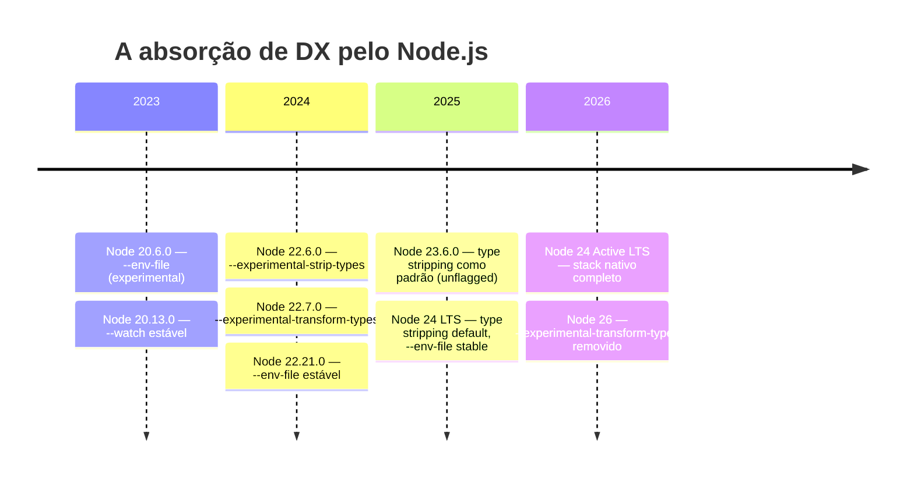
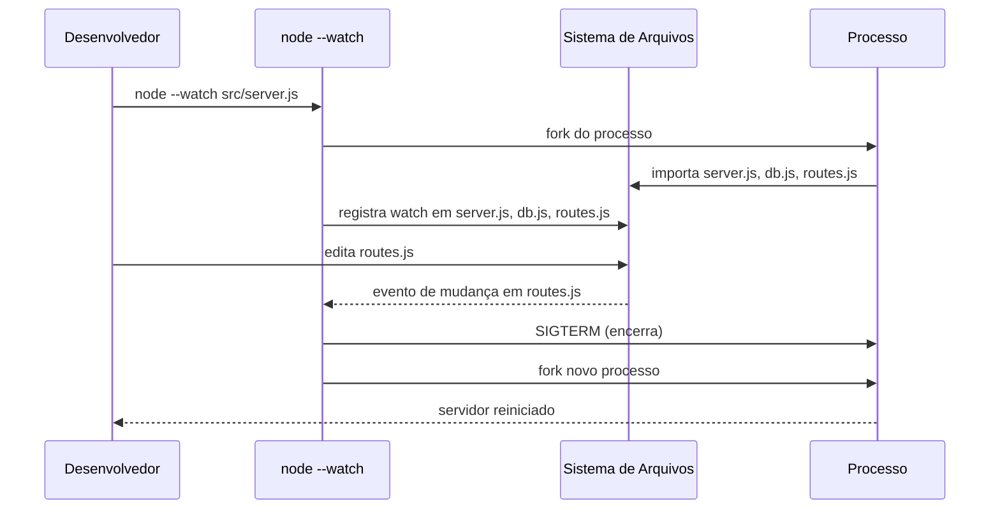
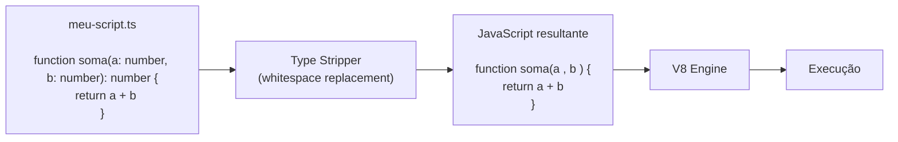
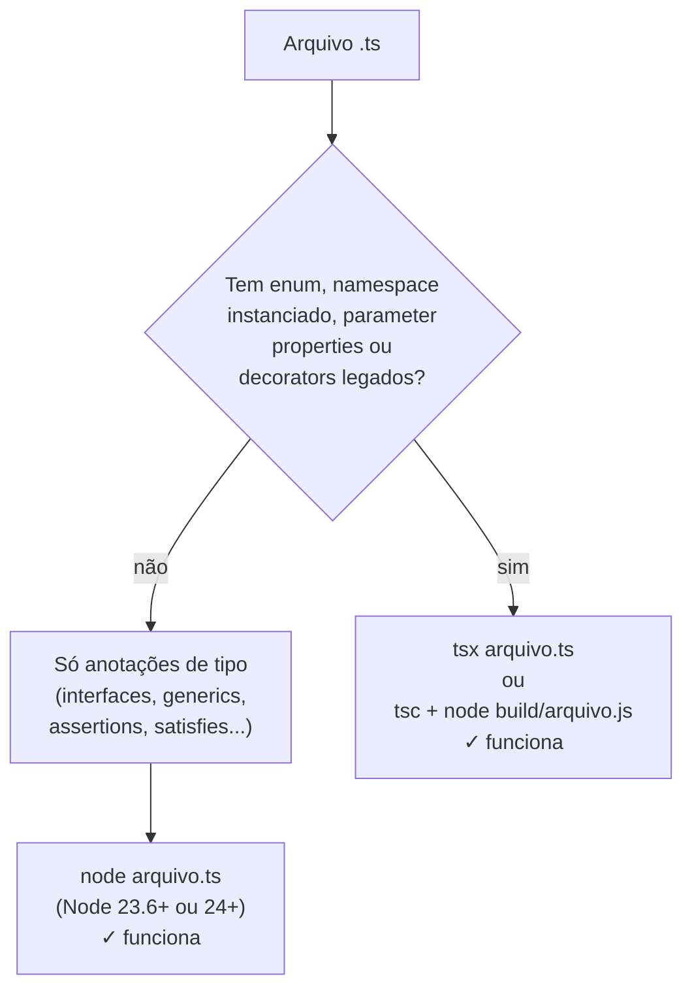
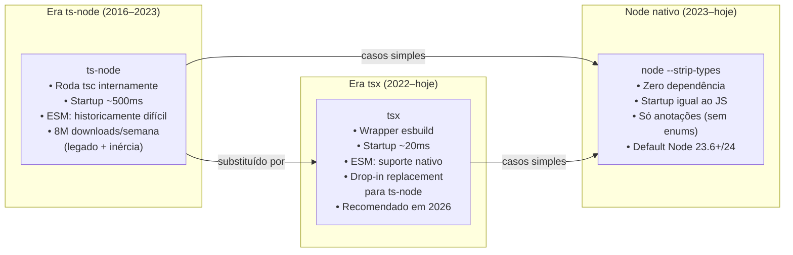
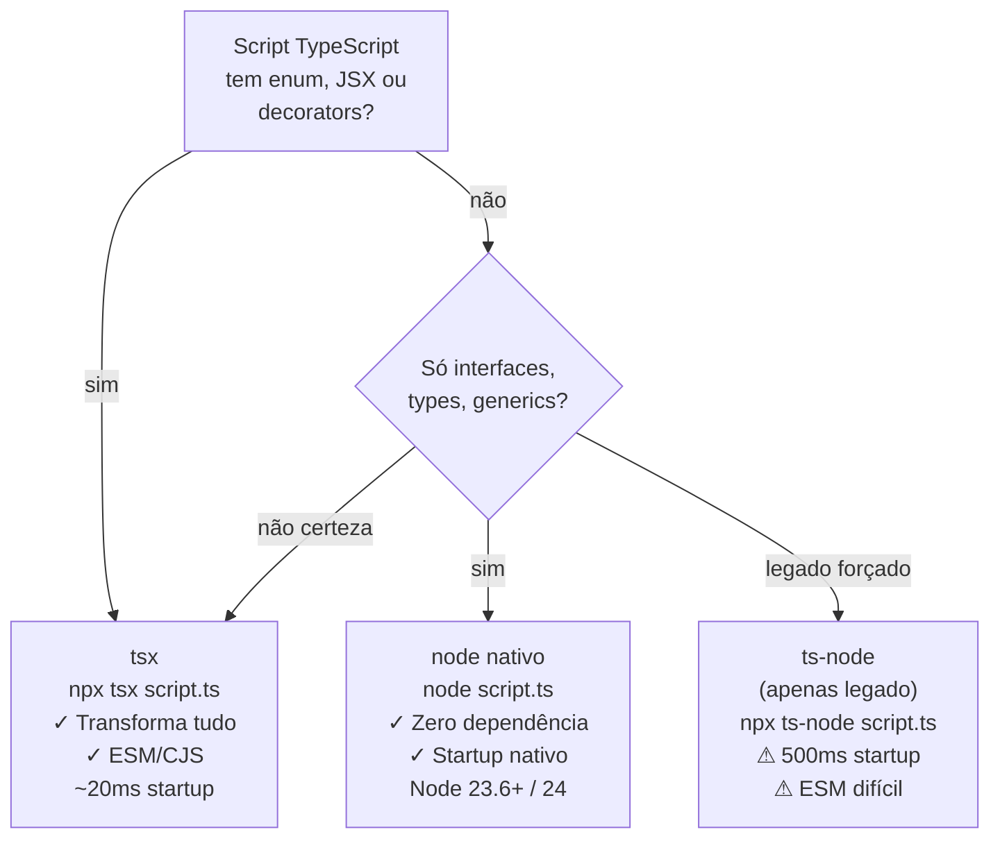
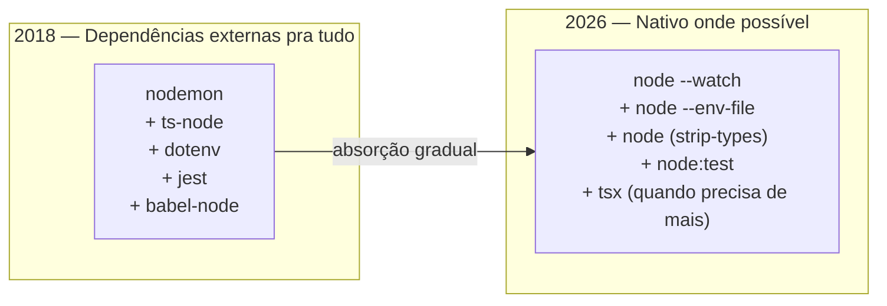
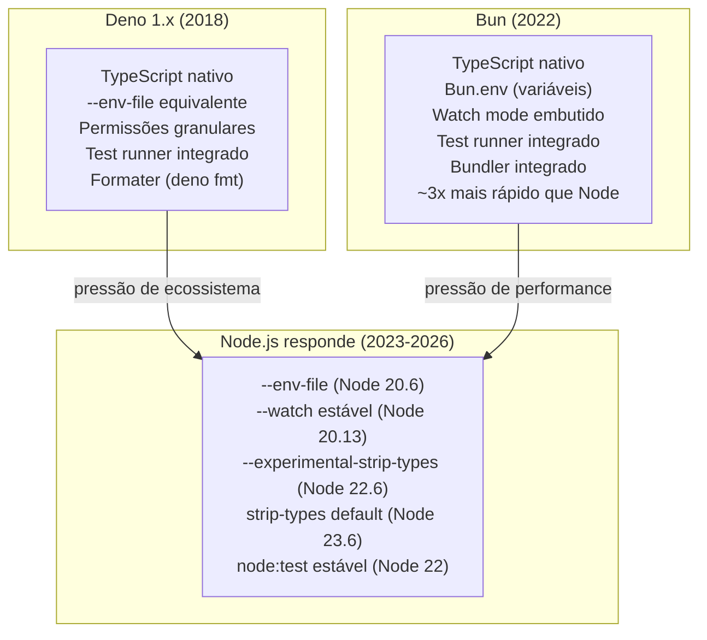

# O runtime como ferramenta de DX

> [!abstract] TL;DR
> Durante anos, rodar TypeScript no Node exigia uma cadeia de ferramentas fora do runtime: `ts-node` pra executar, `nodemon` pra reiniciar, `dotenv` pra carregar variáveis. Em 2026 o Node absorveu as três funções. `--watch` substitui o nodemon para a maioria dos casos; `--env-file` elimina a dependência de dotenv; e o **type stripping nativo** (padrão desde Node 23.6, estável no Node 24) deixa você rodar arquivos `.ts` diretamente — sem compilar, sem instalar nada. Entenda o que cada flag faz, o que ela **não** faz, e quando `tsx` ainda vale mais do que confiar no runtime puro.

---

## O problema que o tooling externo resolve — e resolve mal

Existe um gap entre o que você escreve e o que o Node consegue executar. O gap clássico é o TypeScript: o Node só entende JavaScript, então `.ts` precisa virar `.js` antes de rodar. Mas há outros atritos menores que somam:

- Você muda um arquivo e precisa matar e reiniciar o servidor manualmente.
- Você precisa carregar variáveis de ambiente de um `.env` sem commitar credenciais.
- Você quer rodar um script utilitário escrito em TypeScript sem criar um pipeline de build só pra isso.

A solução da comunidade foi instalar ferramentas externas pra cada um: `nodemon` pra watch, `dotenv` pra env files, `ts-node` (ou `tsx`) pra TypeScript. Funciona — mas são três dependências, três configurações e três fontes de quebra potencial.

A tendência de 2024-2026 é diferente: **o runtime absorve a responsabilidade**. Não porque as ferramentas externas eram ruins, mas porque a plataforma amadureceu o suficiente pra cobrir os 90% mais comuns sem dependência adicional.



Cada linha desse timeline representa uma dependência que você pode não precisar mais instalar.

---

## `--watch`: o nodemon que vem no box

O `nodemon` nasceu de uma dor real: toda vez que você salva um arquivo, precisa reiniciar o servidor Node manualmente. O nodemon resolveu isso monitorando o sistema de arquivos e reiniciando o processo automaticamente. Funcionou tão bem que se tornou onipresente — qualquer tutorial de Node de 2015 a 2023 começa com `npm install -g nodemon`.

A flag `--watch` do Node.js entrou em modo experimental no Node 18.11.0 e se tornou **estável no Node 20.13.0**. O princípio é idêntico ao nodemon: quando um arquivo importado pelo processo muda, o Node reinicia automaticamente.

```bash
# Antes: dependência externa, configuração separada
npm install --save-dev nodemon
# nodemon.json ou package.json "scripts": { "dev": "nodemon src/server.js" }
nodemon src/server.js

# Depois: zero dependência, zero configuração
node --watch src/server.js

# Com TypeScript (usando tsx, ver adiante):
node --watch --import tsx src/server.ts
```

O mecanismo é mais simples do que parece: o Node monitora todos os arquivos que foram `import`ados ou `require`d durante a execução. Quando qualquer um deles muda no disco, o processo é encerrado e reiniciado com os mesmos argumentos.



### `--watch-path`: watch sem seguir imports

Às vezes você quer observar um diretório inteiro — inclusive arquivos que o processo não importa diretamente, como templates HTML ou arquivos de configuração carregados por leitura de arquivo (`fs.readFile`). Para isso existe `--watch-path`:

```bash
# Observa o diretório src/ inteiro
node --watch-path=./src src/server.js

# Múltiplos caminhos
node --watch-path=./src --watch-path=./templates src/server.js
```

> [!warning] `--watch-path` desativa o rastreamento automático de imports
> Quando você usa `--watch-path`, o Node **para de rastrear** os módulos importados automaticamente. Você assume o controle total de quais caminhos observar. Se esquecer de listar um arquivo que muda, o processo não reinicia. É uma troca explícita: cobertura manual em vez de descoberta automática.

> [!warning] `--watch-path` só funciona em macOS e Windows
> O `--watch-path` depende de APIs de watch nativas do SO (`kqueue` no macOS, `ReadDirectoryChangesW` no Windows) e **não está disponível no Linux**. No Linux, use `--watch` sem path (rastreamento por import) ou recorra ao nodemon para casos avançados.

### O que `--watch` não faz (que o nodemon faz)

O nodemon acumulou uma década de features opcionais. O `--watch` nativo não tem:

- **Delay configurável** antes de reiniciar (debounce).
- **Extensões customizáveis** (`--ext ts,json,env`).
- **Padrões de ignore** granulares (`.gitignore`-style).
- **Execução de script de pré/pós-restart**.
- **Restart manual via `rs`** digitado no terminal.

Para scripts simples e servidores de desenvolvimento, `--watch` é suficiente. Para projetos com muitas extensões, templates ou configuração por arquivo externo, nodemon ainda é a escolha mais confortável.

---

## `--env-file`: o dotenv que vem no box

O `dotenv` foi um dos pacotes mais instalados da história do npm. Ele resolve um problema universal: você quer guardar configuração sensível (URLs de banco, secrets de API) fora do código, num arquivo `.env` que vai no `.gitignore`. O `dotenv` carregava esse arquivo e populava `process.env`.

O Node.js 20.6.0 trouxe a flag `--env-file` que faz exatamente o mesmo. O flag ficou estável em duas versões: **Node 22.21.0 e Node 24.10.0** (os dois LTS ativos em 2026).

```bash
# Antes: dependência de dotenv, require no topo do código
# require('dotenv').config()
# Ou dotenv/config no import:
node -r dotenv/config src/app.js

# Depois: flag nativa, zero dependência, zero código
node --env-file=.env src/app.js

# Múltiplos arquivos (o último tem precedência)
node --env-file=.env --env-file=.env.local src/app.js

# Variante silenciosa: não falha se o arquivo não existir
# (landed em Node 22.9.0)
node --env-file-if-exists=.env.local --env-file=.env src/app.js
```

O padrão de uso com múltiplos arquivos segue a convenção de frameworks modernos (Next.js, Vite):

```bash
# Hierarquia de precedência (mais específico sobrescreve o mais geral)
node --env-file=.env \
     --env-file=.env.local \
     --env-file=.env.development.local \
     src/app.js
```

### O que `--env-file` não faz (que o dotenv faz)

Há duas limitações importantes que fazem o `dotenv` (com `dotenv-expand`) ainda ser necessário em alguns projetos:

**1. Sem expansão de variáveis (`${VAR}`):**

```bash
# .env com expansão — funciona com dotenv-expand, FALHA com --env-file
BASE_URL=https://api.exemplo.com
API_ENDPOINT=${BASE_URL}/v1   # --env-file vai ler literalmente "${BASE_URL}/v1"
```

**2. Sem cascata de arquivos automática:**

O dotenv com `dotenv-flow` ou configurado pelo framework faz a cascata `.env` → `.env.local` → `.env.development` automaticamente. Com `--env-file`, você declara explicitamente cada arquivo na linha de comando. É mais verboso, mas mais previsível — sem "de onde veio esse valor?".

> [!tip] Regra de decisão simples
> Se o seu `.env` não usa `${VAR}` e você não precisa de cascata automática, `--env-file` é suficiente. Se você usa expansão de variáveis (comum em projetos com URLs compostas ou conexões de banco parameterizadas), mantenha `dotenv-expand`. Para scripts e utilitários, a flag nativa é sempre a escolha mais simples.

---

## Type stripping nativo: rodando TypeScript sem compilar

Esta é a mudança mais significativa dos últimos anos na DX do ecossistema Node. Entender o que ela faz — e o que ela deliberadamente não faz — é fundamental para não ser pego de surpresa.

### O que acontece quando você roda um `.ts` com Node 23.6+

A partir do Node 23.6.0, o type stripping é **ativado por padrão** para arquivos `.ts` e `.tsx`. Você não precisa de nenhuma flag:

```bash
# Node 23.6+ e Node 24+: funciona diretamente
node meu-script.ts

# Antes de 23.6: precisava de flag explícita
node --experimental-strip-types meu-script.ts
```

O mecanismo é deliberadamente simples: o Node lê o arquivo `.ts`, substitui cada anotação de tipo por **espaços em branco** (whitespace), e executa o JavaScript resultante. Por que espaços e não remoção? Para preservar os números de linha e colunas nas stack traces — um erro na linha 42 do `.ts` ainda aparece como linha 42.



O resultado é um TypeScript "sem os tipos" que o V8 executa normalmente. **Nenhum tipo é checado. Nenhum erro de tipo é reportado.** O Node não conhece nem se importa com a semântica dos tipos — eles são literalmente apagados antes do código chegar ao engine.

### O que o type stripping executa

Praticamente toda sintaxe TypeScript que é **apenas anotação** funciona:

```ts
// Tudo isso roda com node meu-arquivo.ts no Node 24:

// Tipos e interfaces (apagados completamente)
type ID = string | number;
interface Usuario {
  id: ID;
  nome: string;
}

// Anotações de tipo em variáveis, parâmetros, retorno
const id: ID = 42;
function buscarUsuario(id: ID): Promise<Usuario> {
  return fetch(`/api/users/${id}`).then(r => r.json());
}

// Generics
function identidade<T>(valor: T): T {
  return valor;
}

// Type assertions e satisfies
const config = { porta: 3000 } satisfies { porta: number };
const raw = JSON.parse(texto) as Record<string, unknown>;

// Non-null assertion
const elemento = document.getElementById("app")!;
```

### O que o type stripping NÃO consegue executar (sem flag extra)

Aqui está o ponto crítico: algumas construções TypeScript **geram código JavaScript**. Não são anotações — são sintaxe que o TypeScript inventou e que produz lógica real em runtime. O type stripping não pode simplesmente apagar essas — ele precisaria transformá-las, o que é uma operação diferente.

```ts
// FALHA com node puro (type stripping): enums geram código JavaScript
enum Direcao {
  Norte,
  Sul,
  Leste,
  Oeste
}
// TypeScript compila isso para:
// var Direcao;
// (function (Direcao) {
//   Direcao[Direcao["Norte"] = 0] = "Norte";
//   ...
// })(Direcao || (Direcao = {}));
// Isso não é uma anotação — é lógica de runtime.

// FALHA: namespaces instanciados (namespace com código)
namespace Matematica {
  export function somar(a: number, b: number) { return a + b; }
}

// FALHA: parameter properties no constructor (sintaxe TS que gera atribuição)
class Servico {
  constructor(
    private readonly db: Database,  // isso gera this.db = db no JS
    public nome: string              // isso gera this.nome = nome
  ) {}
}

// FALHA: decorators legados (experimentalDecorators: true)
// (NestJS, TypeORM, Angular pré-standalone usam isso)
@Injectable()
class MeuServico {}
```

> [!warning] O destino de `--experimental-transform-types`
> O Node 22.7 introduziu `--experimental-transform-types` para lidar com exatamente esses casos — enums, namespaces, parameter properties. O Node 26 **removeu essa flag** inteiramente. O motivo: a equipe do Node entendeu que a responsabilidade de transformar sintaxe TS complexa pertence a ferramentas dedicadas (tsx, tsc, swc), não ao runtime. Se você tem enums ou decorators legados, use `tsx` ou compile com `tsc`/`swc` antes de rodar.



### Verificando o tipo de arquivo e `.mts`/`.cts`

O type stripping se comporta de forma diferente dependendo do contexto de módulo:

```bash
# .ts — interpretado como ESM se "type": "module" no package.json
# ou como CJS caso contrário (padrão)
node arquivo.ts

# .mts — sempre ESM (equivalente a .mjs)
node arquivo.mts

# .cts — sempre CJS (equivalente a .cjs)
node arquivo.cts
```

> [!info] TypeScript com `"type": "module"` e imports
> Se o `package.json` tem `"type": "module"`, os imports relativos em `.ts` **precisam incluir a extensão `.js`** (não `.ts`), porque é o que o TypeScript especificou como regra de resolução para ESM. Parece estranho, mas é o padrão que o Node e o tsc seguem. O tsx tem um modo que resolve isso automaticamente — mais um motivo para usá-lo quando ESM puro é crítico.

```ts
// No modo ESM nativo com TypeScript, imports ficam assim:
import { buscarUsuario } from './usuarios.js'; // .js mesmo sendo .ts no disco
```

---

## tsx: o wrapper que vai além do stripping

O `tsx` (TypeScript eXecute) é um wrapper fino em torno do **esbuild** que permite rodar TypeScript com transformação completa, não só stripping. Criado por Hiroki Osame (`@hirokiosame`), é hoje a ferramenta recomendada para rodar TypeScript em Node quando o runtime nativo não é suficiente.

```bash
# Instalação
npm install --save-dev tsx

# Uso básico
npx tsx script.ts
# ou com global install:
tsx script.ts

# Com watch (reinicio automático)
tsx watch script.ts

# Como loader do Node (--import)
node --import tsx/esm src/server.ts
```

O motivo pelo qual o tsx existe — e vai continuar existindo mesmo com o stripping nativo do Node — é a transformação completa:

| Recurso | `node` (strip) | `tsx` |
|---------|:--------------:|:-----:|
| Anotações de tipo | ✓ | ✓ |
| Enums | ✗ | ✓ |
| Namespaces instanciados | ✗ | ✓ |
| Parameter properties | ✗ | ✓ |
| Decorators (legacy e TC39) | ✗* | ✓ |
| JSX/TSX | ✗ | ✓ |
| Transpilação de target (downlevel) | ✗ | ✓ |
| Path aliases (`tsconfig.paths`) | ✗ | ✓ |
| Checagem de tipos | ✗ | ✗ |

*Node 26 removeu `--experimental-transform-types`; decorators TC39 Stage 3 funcionavam antes disso.

O tsx não checa tipos — essa responsabilidade fica com `tsc --noEmit`, rodado separadamente (em CI, em pre-commit, ou no editor). O tsx só transforma e executa. Esse design intencional o torna 25× mais rápido que o `ts-node` clássico no startup.

### tsx vs ts-node: o estado em 2026

O `ts-node` foi por anos a única opção séria para rodar TypeScript no Node. Hoje está em declínio:



O ts-node ainda tem ~8 milhões de downloads semanais — mas esse número reflete inércia e ferramentas existentes que dependem dele (jest com ts-jest, frameworks mais antigos), não projetos novos. Para novos projetos, a recomendação em 2026 é clara: não use ts-node.

---

## Rodando um script TypeScript de 3 formas: o exemplo real

Imagine um script utilitário que migra dados de banco — uma tarefa pontual que você quer rodar em desenvolvimento sem criar um pipeline de build:

```ts
// scripts/migrar-usuarios.ts
import { readFileSync } from 'fs';
import { Pool } from 'pg';

enum StatusMigracao {
  Pendente = 'pendente',
  Concluido = 'concluido',
  Erro = 'erro',
}

interface UsuarioLegado {
  id: number;
  email: string;
  nome_completo: string;
}

async function migrar(): Promise<void> {
  const pool = new Pool({ connectionString: process.env.DATABASE_URL });
  const dados = JSON.parse(
    readFileSync('./dados/usuarios-legados.json', 'utf-8')
  ) as UsuarioLegado[];

  let status: StatusMigracao = StatusMigracao.Pendente;

  for (const usuario of dados) {
    try {
      await pool.query(
        'INSERT INTO usuarios (email, nome) VALUES ($1, $2) ON CONFLICT DO NOTHING',
        [usuario.email, usuario.nome_completo]
      );
    } catch (err) {
      status = StatusMigracao.Erro;
      console.error(`Falha ao migrar ${usuario.email}:`, err);
    }
  }

  status = StatusMigracao.Concluido;
  console.log(`Migração: ${status}`);
  await pool.end();
}

migrar();
```

**Forma 1: `tsx` (recomendado — suporta enum)**

```bash
npx tsx --env-file=.env scripts/migrar-usuarios.ts
```

Funciona completamente. O enum `StatusMigracao` é transformado pelo esbuild antes de chegar ao Node. O `--env-file` carrega o `DATABASE_URL`. Startup em ~20ms.

**Forma 2: `node` nativo (falha com enum)**

```bash
node --env-file=.env scripts/migrar-usuarios.ts
# SyntaxError: The requested module does not provide an export named 'StatusMigracao'
# (ou similar — o enum gera código, não pode ser stripped)
```

Se você remover o enum do script (substituindo por um objeto constante ou um tipo union), aí funciona:

```ts
// Sem enum — compatível com node nativo
const STATUS_MIGRACAO = {
  Pendente: 'pendente',
  Concluido: 'concluido',
  Erro: 'erro',
} as const;
type StatusMigracao = typeof STATUS_MIGRACAO[keyof typeof STATUS_MIGRACAO];
```

**Forma 3: `ts-node` (funciona, mas lento)**

```bash
npx ts-node --require dotenv/config scripts/migrar-usuarios.ts
# Funciona, mas: startup ~500ms, requer dotenv manual, mais config
```

Roda, mas é 25× mais lento no startup e exige mais boilerplate. Para um script pontual não é catastrófico, mas para um servidor dev que reinicia dezenas de vezes por hora, a diferença acumula.



---

## Node 24/25 e o estado atual do type stripping (2026)

> [!info] Novidade — Node 24 e além
> O Node 24 se tornou a **Active LTS** em outubro de 2024 e permanece como a linha recomendada para produção em 2026. Algumas mudanças relevantes para DX que solidificam o que foi discutido acima:
>
> - **Node 24**: type stripping é estável e ativado por padrão; `--env-file` estável desde 22.21 e backportado; `node:test` com cobertura de código integrada.
> - **Node 22.21.0** (LTS Jod, abril 2025): `--env-file` sai de experimental — o flag final de estabilização.
> - **Node 26** (current em 2026): remove `--experimental-transform-types` conforme anunciado; enums/namespaces definitivamente fora do escopo do runtime nativo. Também eleva o requisito mínimo de V8 e inclui suporte inicial a `import.meta.url` em CJS via flag.
>
> Fontes: [Node.js blog — v24 release](https://nodejs.org/en/blog/release/v24.0.0), [Node.js Changelog v22.21.0](https://github.com/nodejs/node/blob/main/CHANGELOG.md), [Node.js — type stripping tracking issue](https://github.com/nodejs/node/issues/53987)

### A flag `--experimental-require-module` e o futuro do CJS/ESM

Um detalhe que aparece pouco nos tutoriais mas importa em 2026: o Node 22 introduziu `--experimental-require-module`, que permite `require()` de módulos ESM sincrônica (sem `await import()`). No Node 24 isso ainda está em experimentação, mas representa a direção de convergência do CJS e ESM — a barreira histórica de "não dá pra dar `require` em ESM" começa a cair.

Para projetos TypeScript que usam `tsx` ou `node` nativo, o impacto prático em 2026 é pequeno. O que importa saber: se você vê `ERR_REQUIRE_ESM` num projeto Node 22+, verifique se `--experimental-require-module` pode resolver sem reescrever os imports.

---

## `--run`: o script runner que simplifica scripts de package.json

Uma adição menos conhecida do Node 22 é a flag `--run`, que executa scripts definidos no `package.json` **sem precisar do `npm run`**:

```bash
# Antes: npm run build, yarn build, pnpm build
npm run build

# Com node --run (Node 22+):
node --run build
node --run dev
node --run test
```

A diferença prática parece pequena, mas há um motivo para existir: `node --run` é mais rápido que `npm run` porque pula a inicialização do npm (que carrega o resolver de workspace, verifica o lockfile etc.). Em pipelines de CI onde cada milissegundo conta e o script em questão é simples, isso pode ser relevante.

Mais importante: `node --run` não tem todas as features do `npm run` (sem `pre`/`post` scripts, sem `--` para passar args adicionais da mesma forma). Para casos simples, é uma alternativa limpa. Para scripts complexos com lifecycle hooks, fique com o gerenciador de pacotes.

```bash
# FUNCIONA com node --run
node --run build          # roda "build": "tsc --project tsconfig.build.json"
node --run lint           # roda "lint": "eslint src --ext .ts"

# NÃO funciona (pre/post hooks ignorados)
# "prebuild": "node -e \"console.log('pre')\""  — silenciosamente ignorado
```

> [!info] Fonte
> `node --run` foi introduzido no Node.js 22.3.0 (experimental) e segue experimental no Node 24. Documentação oficial: [Node.js CLI flags — --run](https://nodejs.org/api/cli.html#--run).

---

## A tendência: "menos tooling, mais runtime"

O que aconteceu com `--watch`, `--env-file` e type stripping é parte de uma tendência maior. O Deno e o Bun apontaram o caminho: runtimes com TypeScript nativo, env files embutidos, test runner integrado. O Node.js está respondendo.



A pergunta que vale fazer antes de instalar qualquer ferramenta de dev é: **o Node já faz isso?** Frequentemente a resposta mudou de "não" para "sim" nos últimos dois anos.

Isso não significa que ferramentas externas vão desaparecer. O tsx ainda tem razão de existir para enums e transformações complexas. O nodemon ainda ganha em projetos com configuração avançada de watch. O dotenv ainda é necessário quando você precisa de expansão de variáveis. A diferença é que o caso de uso simples — o mais comum — agora tem resposta nativa.

### O que o Deno e o Bun ensinaram ao Node

O Deno (Ryan Dahl, 2018) e o Bun (Jarred Sumner, 2022) não foram apenas runtimes alternativos — foram **experimentos de DX** que testaram o que acontece quando você coloca TypeScript, env files, test runner e formater dentro do runtime desde o dia 1.

O Node observou e aprendeu. Não copiou mecanicamente — cada feature nativa do Node passou por processo de RFC e design de compatibilidade retroativa — mas o vetor ficou claro: **menos dependências de `devDependencies`, mais capacidade nativa**.



A lição sênior aqui: nem Deno nem Bun "venceram" — o Node absorveu as ideias boas enquanto mantinha compatibilidade retroativa com o ecossistema npm de 2 milhões de pacotes. É um padrão clássico de plataforma madura respondendo à inovação de challengers.

> [!tip] Trade-off sênior: nativo vs. ferramenta dedicada
> A escolha entre "usar o que o Node oferece" e "usar a ferramenta especializada" raramente é técnica pura — é uma decisão de manutenibilidade. Ferramentas nativas têm zero dependências e zero custo de upgrade, mas têm menos features. Ferramentas dedicadas têm releases próprias e podem quebrar em upgrades de Node. Para equipes pequenas com infraestrutura simples, nativo é quase sempre a escolha. Para projetos com monorepo complexo, aliases de path, ou grandes bases de código TypeScript com enums espalhados, tsx + tsc continua sendo a combinação mais robusta.

---

## Como explicar em inglês

> "Node.js has been quietly absorbing DX responsibilities that used to require external tools. In 2026, three things stand out.
>
> First, **`--watch`** replaced nodemon for most use cases. Stable since Node 20.13, it monitors all imported files and restarts the process automatically when any of them changes. It's simpler than nodemon but lacks advanced configuration — no debounce, no glob ignores, no manual restart command. For a dev server, it's usually enough.
>
> Second, **`--env-file`** replaced dotenv for simple cases. Stable in Node 22.21 and 24.10, it loads a `.env` file and populates `process.env` with zero dependencies. The caveat: no variable expansion — `${VAR}` references aren't resolved. If you need that, dotenv-expand is still the answer.
>
> Third, and most interesting, **native type stripping**. Since Node 23.6, type annotations are stripped by default when you run a `.ts` file — no compilation step, no extra flags. But this only works for erasable syntax: interfaces, type aliases, generics, assertions. Enums, namespaces with code, and parameter properties in constructors generate actual JavaScript and can't be stripped. For those, `tsx` — which wraps esbuild — is the right tool.
>
> The practical rule in 2026: start with native Node flags. If you hit an enum or decorator, reach for `tsx`. Avoid `ts-node` on new projects — it's 25x slower at startup, ESM support is painful, and `tsx` is a drop-in replacement."

### Vocabulário-chave

| Português | English |
|-----------|---------|
| Experiência do desenvolvedor | Developer Experience (DX) |
| Reinicialização automática | Auto-restart / hot reload |
| Apagamento de tipos | Type stripping |
| Ferramenta de sintaxe TypeScript que gera código | TypeScript syntax that emits JavaScript |
| Variáveis de ambiente | Environment variables |
| Expansão de variáveis | Variable expansion / variable interpolation |
| Wrapper em torno de esbuild | esbuild wrapper |
| Inicialização do processo | Process startup |
| Tempo de startup | Startup time / cold start |
| Verificação de tipos (separada) | Type checking (separate pass) |
| Arquivo de ambiente | Environment file / `.env` file |
| Recurso apagável (TypeScript) | Erasable syntax |
| Recurso gerador de código | Code-emitting syntax |

---

## Armadilhas comuns

> [!bug] Enums quebrando silenciosamente com node nativo
> O erro mais frequente ao migrar de tsx para node nativo: o script tem um enum TS e o Node 24 lança `SyntaxError` ou comportamento estranho. O type stripping não pode lidar com enums porque eles geram código JavaScript (o pattern `(function(Enum) { ... })(Enum || (Enum = {}))`). Solução: substituir enums por `const` objects com `as const` ou manter `tsx` pra esse arquivo.

> [!bug] `--watch-path` não funciona no Linux
> O `--watch-path` depende de APIs nativas de macOS e Windows. No Linux, usar `--watch-path` silenciosamente não faz nada ou lança erro dependendo da versão. Se o CI roda Linux, teste a flag lá antes de assumir que funciona. Alternativa: `--watch` puro (rastreia imports automaticamente) ou nodemon.

> [!bug] `--env-file` com `${VAR}` não faz o esperado
> Um `.env` herdado de um projeto que usava `dotenv-expand` pode ter referências como `API_URL=${BASE_URL}/v1`. O `--env-file` nativo lê isso **literalmente** — o valor de `API_URL` será a string `"${BASE_URL}/v1"`, não a URL expandida. O bug é silencioso: `process.env.API_URL` tem um valor, mas é o errado. Audite o `.env` antes de trocar dotenv por `--env-file`.

> [!bug] tsx não checa tipos — e isso pode enganar
> `tsx script.ts` executa mesmo com erros de tipo graves. Um `string` passado como `number` não gera erro em runtime se o JavaScript subjacente funcionar (e muitas vezes funciona, por coerção). Projetos que trocaram `ts-node` por `tsx` sem adicionar `tsc --noEmit` no CI ficaram sem checagem de tipos. Adicione `tsc --noEmit` como passo separado em CI ou em pre-push hook.

> [!bug] Imports com extensão `.js` no ESM + TypeScript
> No modo ESM com TypeScript, o padrão exige que imports relativos usem `.js` mesmo quando o arquivo no disco é `.ts`. Isso pega muita gente:
> ```ts
> import { algo } from './utils'; // ✗ — Node ESM não resolve sem extensão
> import { algo } from './utils.js'; // ✓ — correto (mesmo que o arquivo seja utils.ts)
> ```
> O tsx resolve isso automaticamente via path rewriting; o node nativo não. Com `tsc`, a config `"moduleResolution": "bundler"` ou `"node16"` aplica a regra correta.

> [!bug] `ts-node` e ESM: dor histórica
> Se você está mantendo um projeto que usa `ts-node` com `"type": "module"`, provavelmente já encontrou o labirinto de `esm: true` no `tsconfig`, `--esm` na linha de comando, e arquivos `.mts`. O ts-node nunca resolveu ESM de forma limpa. A migração para tsx leva geralmente 5 minutos e resolve todos esses problemas de uma vez.

---

## Lacunas conhecidas

> [!question] Pontos que merecem aprofundamento
> - **Checagem de tipos em CI com `tsc --noEmit`**: a nota menciona a necessidade mas não detalha como integrar ao pipeline (pre-push hook, GitHub Actions step, `turbo` task). Isso cabe em [[23 - Build em produção, CI e determinismo]].
> - **tsx com path aliases**: `tsconfig.paths` funciona no tsx, mas o comportamento em resolução de módulos no Node ESM tem nuances. Não detalhado aqui.
> - **Deno 2.x e compatibilidade npm**: Deno 2 (out 2024) adicionou compatibilidade quase total com npm, incluindo `node_modules`. Isso muda o argumento "ecossistema npm = Node" que justifica permanecer no Node. Nota [[20 - Bun como runtime e toolkit all-in-one]] pode cobrir parte disso.
> - **`node --loader` vs `--import`**: a API de hooks de loader do Node mudou bastante entre Node 16 e Node 22. A nota menciona `--import tsx/esm` mas não explica por que `--import` substituiu `--loader` para a maioria dos casos.
> - **Performance de startup em scripts de CI**: tsx em ~20ms vs `tsc` em ~500ms+ tem impacto em pipelines com muitos scripts pequenos. Um benchmark comparativo seria útil.

---

## Veja também

- [[04 - Gerenciando versões de Node]] — como garantir que todos usam o Node 23.6+ ou 24 onde type stripping está disponível; versão como contrato de equipe.
- [[08 - Transpilação e targets]] — quando o stripping não é suficiente e você precisa de transformação real: downleveling, polyfills, targets de browser; o papel do esbuild, swc e tsc.
- [[19 - Test runner nativo (node-test) e o cenário de testes]] — `node:test`, o test runner integrado que completa o stack nativo do Node junto com `--watch` e `--env-file`.
- [[20 - Bun como runtime e toolkit all-in-one]] — o runtime alternativo que tem TypeScript nativo, env files, watch mode e test runner desde o dia 1; como o Bun influenciou o Node a absorver essas features.
- [[23 - Build em produção, CI e determinismo]] — como integrar `tsc --noEmit` (checagem de tipos separada) em pipelines de CI ao lado do tsx.
- [[03-Dominios/Tecnologia/Node/index|Node]] — runtime, event loop, APIs nativas: o que muda entre versões e por que a versão do Node importa pra DX.
- [[03-Dominios/Tecnologia/TypeScript/index|TypeScript]] — a linguagem que gerou a necessidade de type stripping; enums, decorators e o que o TypeScript compila vs o que é apenas anotação.
- [[03-Dominios/Tecnologia/TypeScript/19 - Enums, const objects e modelagem de constantes|19 - Enums, const objects e modelagem de constantes]] — por que enums geram código JavaScript e const objects com `as const` são a alternativa compatível com o type stripping nativo.

---

## Referências

- [Node.js v24.0.0 Release](https://nodejs.org/en/blog/release/v24.0.0) — anúncio oficial do Node 24, incluindo confirmação de type stripping como padrão e `--env-file` estável.
- [Node.js — Type Stripping (nodejs.org)](https://nodejs.org/en/learn/typescript/run-natively) — documentação oficial sobre como rodar TypeScript nativamente no Node.
- [Node.js CLI flags reference — `--env-file`](https://nodejs.org/api/cli.html#--env-fileconfig) — referência completa da flag, incluindo `--env-file-if-exists`.
- [Node.js CLI flags reference — `--watch`](https://nodejs.org/api/cli.html#--watch) — documentação de `--watch` e `--watch-path`, incluindo limitações por plataforma.
- [Node.js CLI flags reference — `--run`](https://nodejs.org/api/cli.html#--run) — documentação da flag de script runner.
- [tsx — TypeScript Execute (npm)](https://www.npmjs.com/package/tsx) — página do pacote tsx com exemplos de uso como loader (`--import tsx/esm`) e substituto direto do ts-node.
- [GitHub — nodejs/node Issue #53987: tracking type stripping](https://github.com/nodejs/node/issues/53987) — issue de rastreamento das decisões de design do type stripping, incluindo a decisão de não incluir enums.
- [Node.js v22.21.0 Changelog](https://github.com/nodejs/node/blob/main/doc/changelogs/CHANGELOG_V22.md#22.21.0) — entrada que marca `--env-file` como estável.
- [Deno 2.0 Release](https://deno.com/blog/v2) — anúncio do Deno 2 com compatibilidade npm; contexto para comparação com Node.
- [Bun 1.0 Release](https://bun.sh/blog/bun-v1.0) — post original do lançamento do Bun, detalhando TypeScript nativo, `Bun.env` e test runner integrado.
