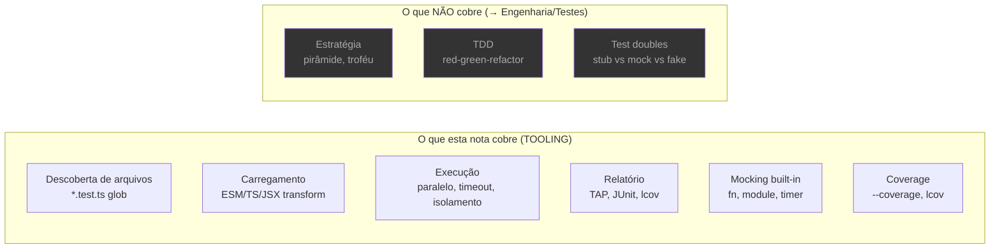
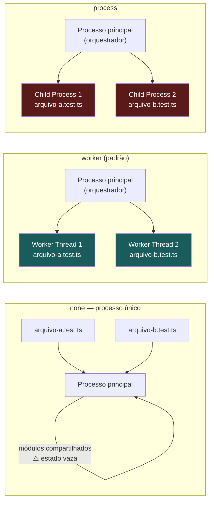
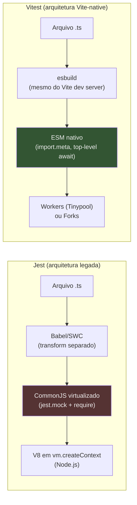
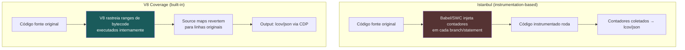
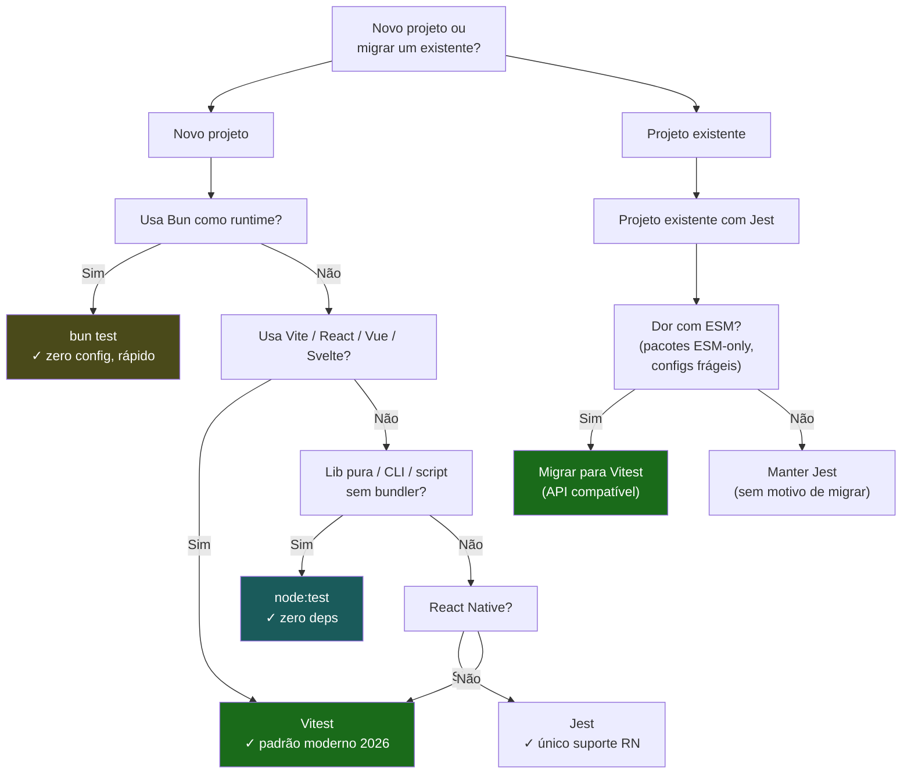

# Test runner nativo (`node:test`) e o cenário de testes

> [!abstract] TL;DR
> O Node.js 20 estabilizou um test runner embutido — `node:test` — que roda com `node --test`, sem instalar nada. Para projetos que não usam Vite, ele resolve 80% das necessidades com zero dependência. Para projetos Vite, o Vitest é o padrão moderno de facto: ESM/TS-native, API compatível com Jest, 2–8× mais rápido em watch mode, 96% de retenção no State of JS 2024. O Jest, veterano que definiu a DX de testes JS, convive mal com ESM (ainda experimental em 2026) e perde terreno consistentemente. O Bun test existe como quarta opção para quem já usa Bun como runtime: startups de 0.08s, mas ecossistema de plugins mais estreito. A regra prática: **lib pura sem deps de build → `node:test`; app Vite/React/Vue → Vitest; legado Jest → mantenha até migrar; app Bun → `bun test`**.

---

## O problema que um test runner resolve

Antes de comparar as ferramentas, vale deixar claro o que um test runner *de fato* faz — porque há uma confusão frequente entre "framework de teste" e "test runner".

Um **test runner** é a ferramenta de infraestrutura que:

1. **Descobre** os arquivos de teste (glob de `*.test.ts`, `*.spec.js`, etc.)
2. **Carrega** esses arquivos no runtime (com o módulo correto: ESM, CJS, TS com transform)
3. **Executa** os testes em paralelo ou em sequência, com timeout e isolamento
4. **Coleta resultados** e os formata como relatório (terminal, TAP, JUnit, lcov)
5. **Fornece** mocking, coverage e watch mode

A *estratégia* de testes — o que testar, qual proporção de unitários vs. integração, como escrever mocks sem acoplar à implementação — vive em [[03-Dominios/Engenharia/Testes/index|Testes]]. Esta nota é sobre a **ferramenta**: as escolhas técnicas de cada runner, onde cada um brilha, e por que o ecossistema está migrando.



---

## `node:test` — o runner que já veio na caixa

### História e maturidade

O módulo `node:test` chegou em caráter experimental no Node.js 18 (abril/2022) e se tornou **estável (Stability: 2)** no Node.js 20 (abril/2023). Isso significa algo concreto: a API não vai quebrar entre versões LTS, já está em produção em milhares de projetos, e o time do Node.js a trata com o mesmo cuidado que `fs` ou `http`.

O Node.js 24 (LTS desde outubro/2025) adicionou global setup/teardown e controle de isolamento. O Node.js 26 (versão atual de desenvolvimento) adicionou test tags (`--experimental-test-tag-filter`) e randomização de ordem (`--test-randomize`). A trajetória é de amadurecimento consistente — cada release fecha uma lacuna que antes obrigava a buscar uma biblioteca externa.

### A anatomia de um teste com `node:test`

```ts
// math.test.ts — roda com: node --test math.test.ts
import { describe, it, before, afterEach, mock } from 'node:test';
import assert from 'node:assert/strict';

// describe agrupa; it (ou test) define um caso
describe('calculadora', () => {
  // Lifecycle hooks — before/after/beforeEach/afterEach
  before(() => {
    // roda uma vez antes de todos os testes do describe
  });

  afterEach(() => {
    // limpa mocks após cada teste
    mock.restoreAll();
  });

  it('soma dois números', () => {
    assert.equal(2 + 2, 4);
  });

  it.skip('subtração ainda não implementada', () => {
    // marcado como skip — aparece no relatório mas não falha
  });

  it.todo('divisão por zero deve lançar', () => {
    // marcado como todo — executado, mas não falha a suíte
  });
});
```

```bash
# Descoberta automática — encontra *.test.{js,ts,mjs} na árvore
node --test

# Arquivo específico
node --test math.test.ts

# Com coverage (flag experimental, mas funcional)
node --test --experimental-test-coverage

# Com reporter alternativo (junit para CI, tap para pipes)
node --test --test-reporter=junit --test-reporter-destination=output/results.xml

# Watch mode (ainda experimental no Node 24/26)
node --test --watch
```

> [!info] `node:assert` vs `expect()`
> O `node:test` usa `node:assert` para asserções — não tem o estilo `expect(x).toBe(y)` que o Jest popularizou. Isso é a maior diferença ergonômica. O `assert.strictEqual(a, b)` é mais verboso mas semanticamente idêntico. A partir do Node 22, `t.assert.snapshot()` adicionou snapshot testing ao estilo Jest diretamente na API de contexto.

> [!tip] Context API — o argumento `t` que muda tudo
> Cada `it` e `describe` recebe um argumento `t` (o contexto do teste) que expõe asserções, sub-testes, mocks locais e diagnóstico:
> ```ts
> it('contexto explícito', (t) => {
>   t.assert.equal(2 + 2, 4);          // asserção via contexto (rastreia origem no relatório)
>   t.diagnostic('cálculo verificado'); // mensagem diagnóstica no output TAP
>
>   // Sub-testes — agrupamento inline sem describe
>   t.test('sub-caso edge', (t2) => {
>     t2.assert.throws(() => divide(0, 0));
>   });
> });
> ```
> O `t.mock` restrito ao contexto é especialmente útil: o mock é restaurado automaticamente ao final do teste sem chamar `mock.restoreAll()` no hook `afterEach`. Em suítes grandes, isso elimina uma classe inteira de vazamentos de mock entre testes.

### Mocking nativo

O sistema de mocks do `node:test` chegou estável no Node 20 e cobre os casos mais comuns:

```ts
import { describe, it, mock } from 'node:test';
import assert from 'node:assert/strict';

describe('mocking', () => {
  it('espia uma função', () => {
    // mock.fn cria uma função espionada
    const add = mock.fn((a: number, b: number) => a + b);

    assert.equal(add(3, 4), 7);
    assert.equal(add.mock.callCount(), 1);           // quantas vezes foi chamada
    assert.deepEqual(add.mock.calls[0].arguments, [3, 4]); // args da 1ª chamada
  });

  it('mocka um método de objeto', () => {
    const obj = { greet: (name: string) => `Hello, ${name}` };

    // mock.method substitui o método e permite restaurar depois
    mock.method(obj, 'greet', (name: string) => `Mocked, ${name}`);

    assert.equal(obj.greet('Alice'), 'Mocked, Alice');
  });

  it('mocka um módulo ESM', async () => {
    // mock.module intercepta imports — precisa ser chamado ANTES do import
    mock.module('./math.ts', {
      namedExports: { add: mock.fn(() => 42) },
    });

    const { add } = await import('./math.ts');
    assert.equal(add(1, 1), 42); // retorna 42, não 2
  });
});
```

### Coverage nativo

```bash
# Gera relatório de coverage no terminal
node --test --experimental-test-coverage

# Saída típica:
# ┌───────────────┬──────────┬──────────┬──────────┐
# │ File          │ % Stmts  │ % Branch │ % Funcs  │
# ├───────────────┼──────────┼──────────┼──────────┤
# │ math.ts       │ 100      │ 100      │ 100      │
# └───────────────┴──────────┴──────────┴──────────┘

# Para exportar lcov (integração com Codecov, SonarQube)
node --test --experimental-test-coverage \
     --test-reporter=lcov \
     --test-reporter-destination=coverage/lcov.info
```

> [!warning] `--experimental-test-coverage` em 2026
> A flag ainda carrega o prefixo `--experimental-` mesmo no Node 26. Isso não significa instabilidade do runner — significa que o *formato do relatório e as opções de configuração* podem mudar. Para uso em CI produtivo, combine com um threshold manual ou use `c8` como pós-processador do output lcov se precisar de thresholds `--branches=80`.

### Isolamento de testes: `--test-isolation`

Por padrão, o `node:test` executa cada arquivo de teste em um **worker thread** separado (Node.js 22+). Isso significa que arquivos não compartilham estado global — `global`, módulos cached via `require`, variáveis de módulo. Para desabilitar o isolamento (útil quando os arquivos precisam compartilhar um servidor de teste já iniciado):

```bash
# Sem isolamento — todos os arquivos rodam no mesmo processo
node --test --test-isolation=none

# Com isolamento por worker thread (padrão Node 22+)
node --test --test-isolation=worker

# Com isolamento por processo filho (fork — custo maior, isolamento total)
node --test --test-isolation=process
```



O trade-off: `worker` é mais rápido (menos overhead de fork), mas módulos com estado singleton podem vazar se o worker for reusado. `process` é mais caro, mas o isolamento é absoluto — cada arquivo começa em um processo limpo.

### Parallelismo em CI: `--test-shard`

O Node 22 introduziu `--test-shard=x/y`, que divide a suíte em `y` partes e executa a `x`-ésima. Usado em pipelines de CI para paralelizar across machines:

```bash
# Matrix CI — 4 máquinas, cada uma roda 1/4 dos testes
# Máquina 1:
node --test --test-shard=1/4

# Máquina 2:
node --test --test-shard=2/4

# ... e assim por diante
```

Isso replica o que `jest --shard` e `vitest --shard` oferecem — importante para suítes grandes onde o CI demora mais de alguns minutos.

### Quando `node:test` é a escolha certa

O caso de uso principal do `node:test` é preciso: **você quer testar código Node.js puro sem adicionar uma dependência de dev ao projeto**. Isso aparece em:

- Bibliotecas que querem zero dependências de dev (ou próximo disso)
- Scripts utilitários e CLIs internos
- Aprendizado e prototipagem rápida
- Ambientes onde instalar npm packages é restrito (sistemas embedded, lambdas com size budget rígido)
- Código que vai rodar no Node.js e que não usa Vite, React, ou qualquer bundler

O que ainda falta, em comparação com Vitest: sem transform nativo de TypeScript (você precisa passar o arquivo por `tsx` ou `ts-node` — ou usar `--experimental-strip-types` do Node 22+ para strip básico), sem modo browser, sem UI interativa de testes, sem integração com plugins do Vite.

---

## Vitest — o padrão moderno

### O que torna o Vitest diferente

O Vitest foi criado pelo time do Vite (Anthony Fu) com uma premissa clara: se seu projeto já usa o Vite, por que testar com uma ferramenta que não entende a sua config do Vite? O resultado é um runner que compartilha o mesmo pipeline de transformação do Vite — os mesmos aliases, os mesmos plugins, o mesmo entendimento de `import.meta.env`.

**Versão atual:** Vitest 4.x (lançado em outubro/2025). O Vitest 4 estabilizou o modo browser e adicionou visual regression testing (`toMatchScreenshot`).

> [!info] Vitest 3 → 4: o que mudou de relevante (fonte: [changelog oficial Vitest](https://github.com/vitest-dev/vitest/releases))
> - **Vitest 3 (jan/2025):** `--reporter=verbose` tornou-se o padrão em modo interativo; `pool: 'vmThreads'` foi removido (substituído por `pool: 'threads'` com `isolate: true`); `globalSetup` passou a ter acesso ao `provide()`/`inject()` para compartilhar estado entre arquivos; `.toMatchInlineSnapshot()` ganhou suporte a template strings ES2024.
> - **Vitest 4 (out/2025):** browser mode saiu de experimental (suporte a Playwright e WebdriverIO como providers); `toMatchScreenshot()` para visual regression; `--test-timeout` global configurável; melhorias de performance de ~20% no modo `threads` via reuso de workers.

### Pool modes do Vitest: `threads`, `forks`, `vmThreads` (histórico)

O Vitest tem três modos de execução configuráveis via `pool` no config:

```ts
// vitest.config.ts
export default defineConfig({
  test: {
    // 'threads'  — worker threads (padrão Vitest 4). Isolamento via módulos clonados.
    // 'forks'    — processos filhos (Node child_process). Isolamento total, mais lento.
    // 'vmThreads'— worker threads + vm.Module (removido no Vitest 3; era frágil)
    pool: 'threads',

    // Dentro de 'threads', controla se módulos são re-importados entre arquivos
    poolOptions: {
      threads: {
        isolate: true, // padrão; false = 3x mais rápido, mas vaza singletons entre arquivos
      },
    },
  },
});
```

A escolha prática: para testes que manipulam `process.env` ou singletons de módulo (ex.: clientes de banco de dados, conexões WebSocket), `isolate: true` é obrigatório. Para testes puros de lógica sem side-effects de módulo, `isolate: false` com `pool: 'threads'` dá o melhor throughput.

Mas há algo mais fundamental: o Vitest foi desenhado para ESM e TypeScript de verdade, não como afterthought.



Esse diagrama explica por que o Jest tem problemas com ESM: ele converte tudo para CJS internamente antes de executar, o que quebra com pacotes ESM-only (como `p-limit@5+`, `chalk@5+`, `node-fetch@3+`). O Vitest simplesmente não faz essa conversão — ESM é o formato nativo.

### Configuração e compatibilidade com Jest

Um dos maiores trunfos do Vitest é a **compatibilidade de API com Jest**. Para a maioria dos projetos, migrar Jest → Vitest é:

```bash
# 1. Remover Jest
pnpm remove jest @types/jest babel-jest jest-environment-jsdom

# 2. Instalar Vitest
pnpm add -D vitest @vitest/coverage-v8

# 3. Substituir "jest" por "vitest" nos imports dos testes
# (na maioria dos casos, não precisa — o Vitest injetará globals se configurado)

# 4. Adicionar vitest.config.ts (ou ajustar vite.config.ts)
```

```ts
// vitest.config.ts
import { defineConfig } from 'vitest/config';

export default defineConfig({
  test: {
    // Injeta globals (describe, it, expect) — compatibilidade com Jest sem imports
    globals: true,

    // jsdom para testes de componente React/Vue; 'node' para backend puro
    environment: 'jsdom',

    // Setup file executado antes de cada arquivo de teste
    setupFiles: ['./src/test/setup.ts'],

    // Coverage com V8 (nativo) ou istanbul
    coverage: {
      provider: 'v8',
      reporter: ['text', 'lcov'],
      thresholds: {
        branches: 80,
        functions: 80,
        lines: 80,
      },
    },
  },
});
```

```ts
// Um teste Vitest — a mesma API do Jest
import { describe, it, expect, vi, beforeEach } from 'vitest';
// Com globals: true no config, esses imports são opcionais

describe('calculadora', () => {
  beforeEach(() => {
    vi.restoreAllMocks(); // vi = o mock do Vitest (equivalente a jest)
  });

  it('soma dois números', () => {
    expect(2 + 2).toBe(4);
  });

  it('mocka uma função', () => {
    const add = vi.fn((a: number, b: number) => a + b);
    expect(add(3, 4)).toBe(7);
    expect(add).toHaveBeenCalledTimes(1);
    expect(add).toHaveBeenCalledWith(3, 4);
  });

  it('mocka um módulo', async () => {
    vi.mock('./math.ts', () => ({
      add: vi.fn(() => 42),
    }));

    const { add } = await import('./math.ts');
    expect(add(1, 1)).toBe(42);
  });
});
```

```bash
# Rodar testes
pnpm vitest run          # modo CI (uma vez, sem watch)
pnpm vitest              # modo desenvolvimento (watch automático)
pnpm vitest --coverage   # com coverage

# UI interativa (http://localhost:51204)
pnpm vitest --ui
```

### `vitest --shard` e paralelismo em CI

O Vitest também suporta sharding para CI paralelo, com a mesma semântica do `node:test`:

```bash
# CI matrix: 3 jobs, cada um roda 1/3 dos arquivos de teste
# Job 1:
vitest run --shard=1/3

# Job 2:
vitest run --shard=2/3

# Job 3:
vitest run --shard=3/3
```

O shard é determinístico (baseado na ordem de descoberta de arquivos), então o mesmo arquivo sempre cai no mesmo shard — a menos que você adicione novos arquivos. Combina com `--reporter=junit` para agregar resultados no CI.

### O Vitest em números (2026)

Os dados de 2025–2026 pintam um quadro claro da virada:

- **Downloads npm (maio/2026):** Vitest ~45,1M/semana vs. Jest ~44,8M — o Vitest passou o Jest em volume absoluto (fonte: [npm trends, maio 2026](https://npmtrends.com/jest-vs-vitest))
- **State of JS 2024:** Vitest com 96% de retenção (maior de qualquer ferramenta de teste JS), Jest com ~74% (fonte: [stateofjs.com/2024/testing](https://stateofjs.com/en-US/2024/#testing))
- **Angular 21 (out/2025):** adotou Vitest como runner padrão, substituindo o Karma definitivamente (fonte: [angular.dev/guide/testing](https://angular.dev/guide/testing))
- **Nuxt e SvelteKit:** recomendam Vitest para projetos novos há vários anos
- **Speed gap vs Jest:** 2,1× mais rápido em cold run (500 testes: 7,4s vs 15,6s); 8,5× mais rápido em watch mode (340ms vs 2.890ms); 27% menos memória

> [!tip] O watch mode é onde a DX do Vitest brilha mais
> Em desenvolvimento ativo, o watch mode do Vitest re-executa apenas os testes afetados pela mudança (HMR de testes). Alterar uma função matemática → só os testes daquele arquivo rodam em 340ms. No Jest, o mesmo cenário leva ~2,9s. Ao longo de um dia de trabalho, essa diferença é sensível.

### Quando Vitest é a escolha certa

A regra é simples: **se o projeto usa Vite, use Vitest**. A config do Vite já existe, o Vitest a lê, nada precisa ser duplicado. Além disso:

- Qualquer projeto React, Vue, Svelte ou Solid (que tipicamente usa Vite)
- Projetos TypeScript novos que querem primeiro-classe (sem babel/ts-jest)
- Migrações de Jest onde os testes existentes são padrão (a compatibilidade de API é alta)
- Projetos que precisam testar componentes em browser real (Vitest 4 com browser mode estável)

A única lacuna relevante: **React Native**. O Vitest não tem suporte a React Native — lá, o Jest ainda é a única opção viável.

---

## Jest — o veterano e seu momento de transição

### O que o Jest estabeleceu

O Jest foi criado pelo Facebook (Meta) e lançado em 2014. Durante os anos 2016–2022, era praticamente sinônimo de "testes em JavaScript": API ergonômica, snapshots, mocking poderoso, zero config para projetos CRA. O ecossistema cresceu em torno dele — `@testing-library`, `jest-dom`, `ts-jest`, `babel-jest`, `jest-environment-jsdom` — e essa massa de integrações ainda é a base de milhões de projetos.

**Versão atual:** Jest 30.x (2025). O Jest 30 trouxe melhorias de performance e continuou iterando em ESM, mas sem resolver o problema estrutural.

### O problema estrutural com ESM

O modelo interno do Jest foi desenhado para CommonJS. Ele opera usando `vm.createContext` e um sistema de módulos próprio que intercepta `require()`. Quando o mundo JS migrou para ESM como formato padrão (e especialmente quando pacotes começaram a publicar só ESM — `p-limit`, `chalk`, `node-fetch`, `execa`, `got`, `uuid`), o Jest se viu num dilema arquitetural.

A solução existe mas é pesada:

```json
// package.json — configuração mínima para Jest com ESM
{
  "scripts": {
    "test": "NODE_OPTIONS='--experimental-vm-modules' jest"
  },
  "jest": {
    "extensionsToTreatAsEsm": [".ts"],
    "moduleNameMapper": {
      "^(\\.{1,2}/.*)\\.js$": "$1"
    },
    "transform": {
      "^.+\\.tsx?$": ["ts-jest", { "useESM": true }]
    }
  }
}
```

O problema: `--experimental-vm-modules` é uma flag experimental do Node.js. Em 2026, ela ainda está sob esse status. `jest.mock()` síncrono não funciona com módulos ESM — você precisa usar `jest.unstable_mockModule()` (note o prefixo `unstable_`) com `await import()` dinâmico. A documentação oficial do Jest mantém uma página separada apenas para ESM — um sinal de que é um caminho de segunda classe.

```ts
// Mocking de ESM no Jest — compare com o Vitest
// Jest (ESM) — verboso e assíncrono
jest.unstable_mockModule('./math.ts', () => ({
  add: jest.fn(() => 42),
}));

// Precisa ser dinâmico porque o mock é registrado em tempo de execução
const { add } = await import('./math.ts');
expect(add(1, 1)).toBe(42);
```

```ts
// Vitest — síncrono, ergonômico
vi.mock('./math.ts', () => ({
  add: vi.fn(() => 42),
}));

const { add } = await import('./math.ts'); // o hoisting do vi.mock cuida disso
expect(add(1, 1)).toBe(42);
```

### Quando manter o Jest

O Jest não é uma ferramenta morta — é uma ferramenta estável com casos de uso específicos onde permanece a melhor (ou única) opção:

- **React Native:** o Vitest não suporta. O Jest é o runner oficial do React Native e provavelmente permanecerá assim.
- **Projetos legados grandes com Jest configurado:** migração tem custo real. Se o projeto roda, os testes passam, e não há dor de ESM, não há razão para migrar só porque "Vitest é mais moderno".
- **Ecossistemas específicos** que têm integrações Jest profundas (serializers customizados, matchers proprietários) onde a compatibilidade do Vitest não foi verificada.

> [!warning] Não comece projetos novos com Jest em 2026
> A recomendação do ecossistema convergiu: projetos *novos* devem usar Vitest (com Vite) ou `node:test` (sem bundler). Escolher Jest em um projeto verde hoje significa herdar os problemas de ESM, a lentidão de watch mode, e a necessidade de configurar transform desde o início — sem ganho equivalente.

---

## Coverage em profundidade: V8, istanbul e c8

O coverage de código é uma das áreas onde os runners divergem mais na forma como funcionam internamente — e isso tem impacto prático em CI.

### Dois motores de instrumentação

Existem dois mecanismos para coletar coverage em Node.js:



**Istanbul** (usado pelo `@vitest/coverage-istanbul` e historicamente pelo Jest com `babel-jest`) injeta contadores no AST do código antes de executar. Vantagem: preciso ao nível de statement, suporta bem TypeScript após transform. Desvantagem: transforma o código — o que você testa não é exatamente o que roda.

**V8 Coverage** (usado pelo `@vitest/coverage-v8`, `node --experimental-test-coverage`, e `bun test --coverage`) usa o profiler nativo do V8 via CDP (Chrome DevTools Protocol). O código roda sem instrumentação; o V8 registra quais ranges de bytecode foram executados. Vantagem: o código executado é idêntico ao código de produção. Desvantagem: source maps precisam ser precisos para mapear bytecode→TypeScript original — em alguns cenários de transform complexo, linhas podem ficar mal atribuídas.

### c8 como pós-processador

Antes de o Vitest existir, o `c8` era a forma padrão de usar V8 coverage com qualquer runner:

```bash
# c8 envolve o comando e coleta V8 coverage
pnpm add -D c8

# Uso com node:test
c8 node --test

# Uso com qualquer script
c8 node src/server.js

# Thresholds — falha se coverage < mínimo
c8 --branches 80 --functions 90 --lines 85 node --test

# Formato de relatório
c8 --reporter=lcov --reporter=text node --test
```

O `c8` ainda é útil com `node:test` quando você precisa de thresholds precisos — a flag `--experimental-test-coverage` do Node não expõe thresholds configuráveis nativamente até o Node 26.

> [!question] Qual escolher: V8 ou Istanbul?
> Se você usa Vitest, comece com `@vitest/coverage-v8` (zero overhead de instrumentação, mais próximo do comportamento real). Se perceber que relatórios de branch coverage estão imprecisos em código TypeScript complexo (condicionals em tipos, narrowing), troque para `@vitest/coverage-istanbul`. Para node:test em CI com thresholds, use `c8` como wrapper. (Fonte: [vitest.dev/guide/coverage](https://vitest.dev/guide/coverage))

---

## Bun test — a quarta opção

### O modelo do Bun

O Bun shipped seu próprio test runner desde a versão 0.6 (2023), e em 2026 é um runner maduro com API compatível com Jest/Vitest. A proposta é simples: se você já usa o Bun como runtime, use o `bun test`. Você não instala nada extra, não configura transform, não gerencia `ts-jest`.

```bash
# Nenhuma instalação necessária se você já usa Bun
bun test

# Arquivo específico
bun test math.test.ts

# Watch mode
bun test --watch

# Coverage
bun test --coverage

# Filtro por nome (regex)
bun test --test-name-pattern "soma"
```

```ts
// Um teste com bun test — API idêntica ao Jest/Vitest
import { describe, it, expect, mock, beforeEach } from 'bun:test';

describe('calculadora', () => {
  beforeEach(() => {
    mock.restore(); // equivalente ao vi.restoreAllMocks()
  });

  it('soma dois números', () => {
    expect(2 + 2).toBe(4);
  });

  it('mocka uma função', () => {
    const add = mock((a: number, b: number) => a + b);
    expect(add(3, 4)).toBe(7);
    expect(add).toHaveBeenCalledWith(3, 4);
  });
});
```

### Velocidade do `bun test`

O `bun test` é genuinamente mais rápido que os concorrentes, especialmente no startup:

| Runner | Startup (suite vazia) | 200 arquivos, 1500 testes |
|---|---|---|
| Jest (SWC) | ~1,2s | 40–50s |
| Vitest | ~0,9s | 10–15s |
| `bun test` | **~0,08s** | 3–6s |

O startup de 0,08s é perceptível em projetos com muitos arquivos pequenos ou em fluxos de TDD onde você re-executa testes a cada mudança. A diferença entre 1,2s e 0,08s parece pequena em números absolutos, mas é 15× — o que você sente como "instantâneo" vs. "tem uma pausa".

### Limitações relevantes

O `bun test` tem o ecossistema mais estreito dos quatro:

- **DOM/jsdom:** o suporte a testes de componente React com `@testing-library/react` existe mas não é tão testado batalha quanto no Jest ou Vitest
- **Plugins e serializers Jest customizados:** a compatibilidade é "ampla mas não total" — plugins obscuros podem não funcionar
- **Módulos com addons nativos C++:** o Bun tem comportamento diferente do Node.js para N-API em alguns casos
- **Ecossistema:** menos materiais, menos exemplos, menos respostas no Stack Overflow

Bun test é a escolha certa quando: (a) o projeto já usa Bun como runtime, (b) os testes são majoritariamente lógica pura e APIs de backend, e (c) velocidade de feedback é crítica.

---

## O mesmo teste nos quatro runners

Para tornar concreto a portabilidade de API, o mesmo teste unitário escrito para cada runner:

```ts
// ── math.ts — o código sob teste ────────────────────────────────────────
export function add(a: number, b: number): number {
  return a + b;
}

export function divide(a: number, b: number): number {
  if (b === 0) throw new Error('Division by zero');
  return a / b;
}
```

```ts
// ── node:test ────────────────────────────────────────────────────────────
// math.node.test.ts
// rodar com: node --test math.node.test.ts
import { describe, it } from 'node:test';
import assert from 'node:assert/strict';
import { add, divide } from './math.ts';

describe('math', () => {
  it('add: soma dois números', () => {
    assert.equal(add(2, 3), 5);
  });

  it('divide: lança em divisão por zero', () => {
    assert.throws(
      () => divide(10, 0),
      { message: 'Division by zero' }
    );
  });
});
```

```ts
// ── Vitest ───────────────────────────────────────────────────────────────
// math.vitest.test.ts
// rodar com: vitest run math.vitest.test.ts
import { describe, it, expect } from 'vitest';
import { add, divide } from './math.ts';

describe('math', () => {
  it('add: soma dois números', () => {
    expect(add(2, 3)).toBe(5);
  });

  it('divide: lança em divisão por zero', () => {
    expect(() => divide(10, 0)).toThrow('Division by zero');
  });
});
```

```ts
// ── Jest ─────────────────────────────────────────────────────────────────
// math.jest.test.ts
// A API é idêntica ao Vitest — apenas a infraestrutura de carregamento difere
// rodar com: jest math.jest.test.ts
describe('math', () => {
  it('add: soma dois números', () => {
    expect(add(2, 3)).toBe(5);
  });

  it('divide: lança em divisão por zero', () => {
    expect(() => divide(10, 0)).toThrow('Division by zero');
  });
});
```

```ts
// ── bun test ─────────────────────────────────────────────────────────────
// math.bun.test.ts
// rodar com: bun test math.bun.test.ts
import { describe, it, expect } from 'bun:test';
import { add, divide } from './math.ts';

describe('math', () => {
  it('add: soma dois números', () => {
    expect(add(2, 3)).toBe(5);
  });

  it('divide: lança em divisão por zero', () => {
    expect(() => divide(10, 0)).toThrow('Division by zero');
  });
});
```

> [!example] O que muda e o que não muda entre runners
> A lógica do teste — o `describe/it/expect` — é praticamente idêntica em Vitest, Jest e bun test. A migração Jest → Vitest raramente exige reescrever os testes em si; o trabalho está na config e nos mocks complexos. O `node:test` diverge na API de asserção (`assert.*` em vez de `expect()`) e no estilo de mock (`mock.fn()` em vez de `vi.fn()`), mas a estrutura de `describe/it` é a mesma.

---

## Mapa de decisão: qual runner escolher



---

## Tabela comparativa (2026)

| Dimensão | `node:test` | Vitest 4 | Jest 30 | bun test |
|---|---|---|---|---|
| **Instalação** | zero deps | `vitest` | `jest` + transform | zero deps |
| **ESM suporte** | nativo | nativo | experimental ⚠️ | nativo |
| **TypeScript** | via `--experimental-strip-types` ou tsx | nativo (esbuild) | via ts-jest/SWC | nativo |
| **API de asserção** | `assert.*` | `expect()` Jest-compat | `expect()` | `expect()` Jest-compat |
| **Mocking** | `mock.fn/method/module` | `vi.fn/mock/spyOn` | `jest.fn/mock/spyOn` | `mock()` Jest-compat |
| **Coverage** | `--experimental-test-coverage` (ou c8) | `@vitest/coverage-v8` ou istanbul | `--coverage` (istanbul) | `--coverage` (V8) |
| **Watch mode** | experimental | estável, HMR | estável | estável |
| **Snapshot testing** | a partir Node 22 | ✓ | ✓ | ✓ |
| **Test sharding (CI)** | `--test-shard=x/y` (Node 22+) | `--shard=x/y` | `--shard=x/y` | ✗ |
| **Isolamento** | `--test-isolation=worker/process/none` | `pool: threads/forks` | `--runInBand` | por processo |
| **Browser testing** | ✗ | ✓ (modo browser estável Vitest 4) | via jsdom | ✗ |
| **React Native** | ✗ | ✗ | ✓ | ✗ |
| **Startup** | ~0,5s | ~0,9s | ~1,2s | ~0,08s |
| **State of JS 2024 retenção** | — | 96% | 74% | — |
| **Melhor para** | libs sem deps | apps Vite, tudo novo | RN, legado | apps Bun |

---

## Como explicar em inglês

A **test runner** is the infrastructure tool that discovers test files, loads them into the runtime (with the correct module format and TypeScript transform), executes tests in parallel or sequence, and reports results. It's distinct from testing strategy — what to test, how many unit vs. integration tests — which is a design concern.

In the Node.js ecosystem, there are four main options in 2026:

**`node:test`** is the built-in test runner, stable since Node.js 20. It ships with Node.js itself — zero installation needed. You run tests with `node --test`. It provides `describe/it`, built-in mocking (`mock.fn`, `mock.method`, `mock.module`), and experimental coverage (`--experimental-test-coverage`). The trade-off: assertions use `node:assert` style rather than `expect()`, and there's no browser mode or native TypeScript transform. Best for pure Node.js libraries and scripts with zero dev dependency appetite.

**Vitest** is the de facto modern standard for projects using Vite. It shares Vite's configuration, uses esbuild for native ESM and TypeScript support, and has a Jest-compatible API (`expect()`, `vi.fn()`, `vi.mock()`). In May 2026, Vitest surpassed Jest in weekly npm downloads (~45M vs ~44M). State of JS 2024 gave it 96% retention — the highest of any JavaScript testing tool. It's 2–8x faster than Jest, especially in watch mode. Angular 21 adopted Vitest as its default runner in late 2025.

**Jest** is the veteran that defined the JavaScript testing DX. It remains the only viable test runner for React Native. The architectural problem: Jest was built for CommonJS and internally converts all modules to CJS before execution. ESM support in Jest 30 is still gated behind `--experimental-vm-modules` and `jest.unstable_mockModule()`. For new projects, Jest is no longer the recommendation.

**Bun test** ships with the Bun runtime. Startup time: 0.08 seconds — 15x faster than Jest. Jest-compatible API, native TypeScript, native ESM. Best for projects already running on Bun (pure backend logic, CLIs, libraries). Weakest for complex component testing suites.

### Vocabulário-chave

| Português | Inglês |
|---|---|
| test runner / executor de testes | test runner |
| suite de testes | test suite |
| função espiada / espião | spy / spy function |
| mockagem de módulo | module mocking |
| cobertura de código | code coverage |
| modo de observação | watch mode |
| relatório de resultados | test reporter |
| asserção | assertion |
| snapshot | snapshot |
| variáveis globais de teste | test globals (`describe`, `it`, `expect`) |
| isolamento de teste | test isolation |
| hoisting de mock | mock hoisting |
| transform / transpilação | transform / transpile |

---

## Armadilhas comuns

> [!warning] Armadilha 1: esquecer que `node:test` não transforma TypeScript por padrão
> `node --test math.test.ts` falha se o arquivo for TypeScript — o Node.js não sabe o que fazer com anotações de tipo. Você tem duas saídas: (a) `node --experimental-strip-types --test math.test.ts` (Node 22+, strip básico, sem decorators ou `emitDecoratorMetadata`); ou (b) rodar via `tsx --test math.test.ts` (o `tsx` usa esbuild para transform completo). A confusão vem de ver `node:test` nos docs sem perceber que é uma API, não um CLI que entende TS.

> [!warning] Armadilha 2: `vi.mock()` parece síncrono mas é hoisted
> O Vitest (e o Jest) hosam chamadas `vi.mock()` para o topo do arquivo em tempo de compilação. Isso significa que o mock é aplicado *antes* do `import` no topo do arquivo, mesmo que o `vi.mock()` apareça depois no código. A armadilha: tenter definir variáveis fora do `vi.mock()` e usá-las dentro (sem a fábrica de factory) falha com "Cannot access before initialization". Solução: usar `vi.hoisted()` para definir variáveis que precisam existir no momento do mock.

> [!warning] Armadilha 3: Jest e pacotes ESM-only quebram silenciosamente
> Se seu projeto usa Jest e você instala um pacote que publicou apenas ESM (`chalk@5`, `p-limit@5`, `execa@8`, `node-fetch@3`), o `require()` que o Jest usa internamente vai falhar com `ERR_REQUIRE_ESM`. A mensagem de erro não é óbvia. A solução mais limpa não é configurar Jest para ESM — é migrar para Vitest.

> [!warning] Armadilha 4: `--experimental-test-coverage` muda comportamento entre versões do Node
> O Node 20, 22, 24 e 26 têm variações no output do `--experimental-test-coverage`. Se você usa esse output em CI (para threshold ou parse), teste explicitamente na versão de Node que o CI usa. Alternativa mais estável: use o coverage do Vitest com `@vitest/coverage-v8` — API e output estáveis e versionados.

> [!warning] Armadilha 5: confundir test runner com framework de asserção
> Iniciantes às vezes confundem "testo com Jest" com "uso o `expect()` do Jest". Na verdade, você pode usar `node:test` como runner e `@std/assert` (Deno standard lib) ou qualquer lib de asserção — o runner só precisa que o teste lance uma exceção para marcar falha. O Vitest exporta `expect` da `@vitest/expect` (que é separada do runner). Esse desacoplamento permite, por exemplo, usar `node:test` com a sintaxe `expect()` do Chai.

> [!warning] Armadilha 6: `bun test` e Jest compatibility não é 100%
> O `bun test` cobre a API central do Jest mas não garante plugins, serializers ou matchers customizados. Antes de migrar um projeto Jest grande para `bun test`, rode a suite completa e verifique se há `Cannot find module 'jest-*'` ou comportamentos diferentes em edge cases de mock.

---

## Veja também

- [[18 - O runtime como ferramenta de DX]] — `node --watch`, `--env-file`, `--experimental-strip-types`; o contexto de como o Node.js virou uma ferramenta de DX ativa que dispensa tsx/ts-node para muitos casos
- [[13 - Vite a fundo]] — o motor do Vitest: como o esbuild + Rollup do Vite se torna o pipeline de transform dos testes
- [[20 - Bun como runtime e toolkit all-in-one]] — o Bun além do test runner: runtime, bundler, package manager integrados
- [[23 - Build em produção, CI e determinismo]] — onde sharding de testes se encaixa no pipeline CI: determinismo, cache de artefatos e paralelismo de jobs
- [[03-Dominios/Tecnologia/Tooling e Build/17 - Otimização de bundle|17 - Otimização de bundle]] — tree shaking e code splitting impactam o que coverage realmente mede em projetos com bundler
- [[03-Dominios/Engenharia/Testes/index|Testes]] — estratégia, pirâmide, TDD, test doubles — o que esta nota deliberadamente não cobre; o ângulo aqui é a ferramenta, não a filosofia
- [[03-Dominios/Engenharia/Testes/12 - Coverage e mutation testing|12 - Coverage e mutation testing]] — profundidade sobre o que coverage mede (e não mede): line vs branch vs mutation; complementar à seção de coverage desta nota

---

## Referências

- [Node.js docs — `node:test` (stable)](https://nodejs.org/api/test.html) — documentação oficial, inclui context API, mock.module, sharding, isolation
- [Node.js 22 changelog — test isolation e sharding](https://nodejs.org/en/blog/release/v22.0.0) — `--test-isolation`, `--test-shard`, `--test-randomize` adicionados
- [Vitest docs — coverage](https://vitest.dev/guide/coverage) — V8 vs istanbul, thresholds, providers
- [Vitest GitHub releases — changelog 3.x e 4.x](https://github.com/vitest-dev/vitest/releases) — pool modes, browser mode GA, vmThreads deprecation
- [State of JS 2024 — Testing](https://stateofjs.com/en-US/2024/#testing) — dados de retenção e satisfação por ferramenta
- [npm trends: jest vs vitest](https://npmtrends.com/jest-vs-vitest) — downloads semanais históricos
- [Angular 21 migration guide](https://angular.dev/guide/testing) — adoção do Vitest como runner padrão
- [c8 — V8 coverage as CLI](https://github.com/bcoe/c8) — pós-processador de V8 coverage para uso com node:test e thresholds
