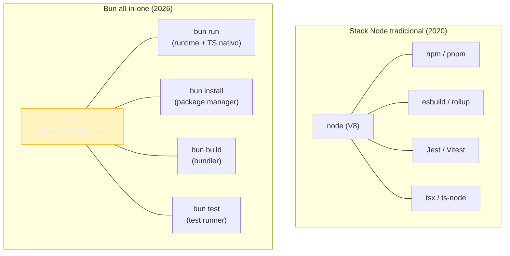
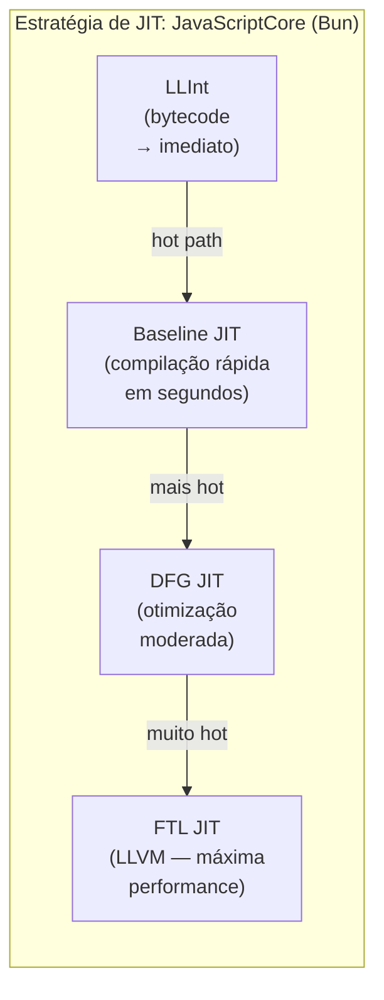
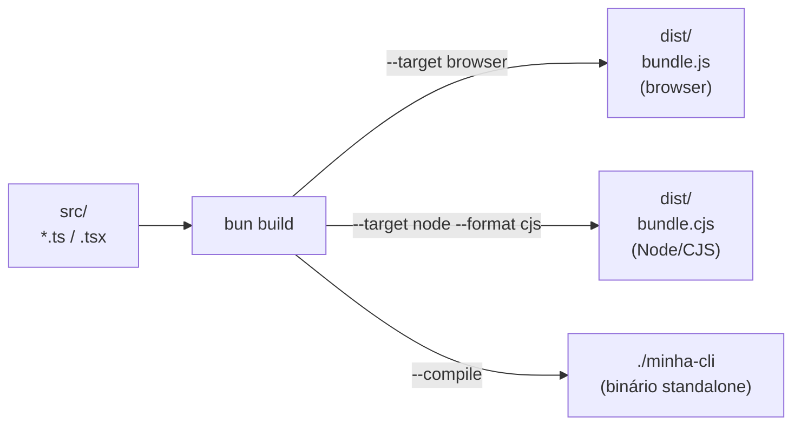
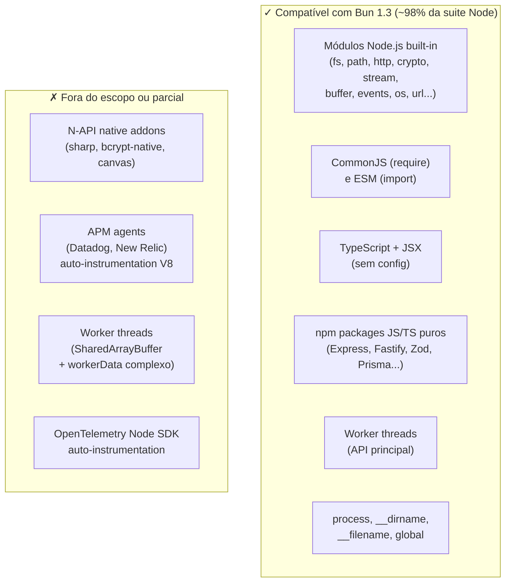
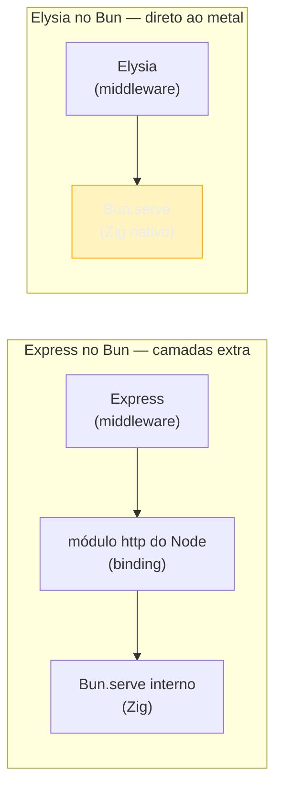
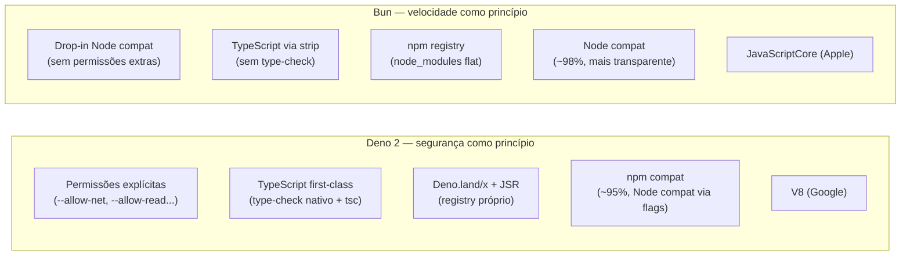
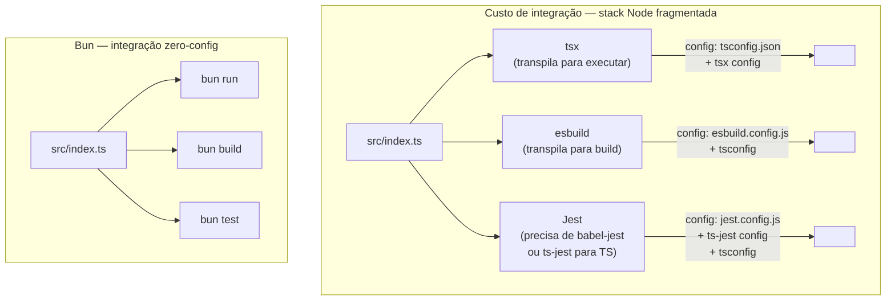
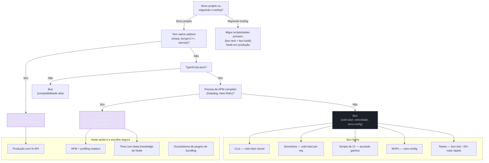

# Bun como runtime e toolkit all-in-one

> [!abstract] TL;DR
> Bun é uma aposta radical: em vez de compor runtime + package manager + bundler + test runner de fornecedores diferentes, uma única ferramenta escrita em Zig cobre tudo. O motor é o JavaScriptCore (o mesmo do Safari), não o V8 do Node — o que entrega cold starts de ~8ms contra ~45ms do Node e 2–4× mais throughput em benchmarks de HTTP puro. Em 2026, a compatibilidade com Node chegou a ~98% da suite oficial, mas N-API (addons nativos C++) segue fora do escopo. O caso de uso natural é greenfield TypeScript puro, CLIs, serverless e CI-heavy; produção madura em Node, APM completo ou addons nativos justificam ficar no Node. Deno 2 é a alternativa, com ênfase em segurança e suporte mais formal a TypeScript, mas velocidade inferior. A tensão central: **toolkit unificado** (Bun) vs **ferramentas especializadas componíveis** (Node + npm + esbuild + Jest).

---

## A aposta de uma ferramenta pra tudo

Existe um momento na carreira de todo dev JS em que alguém abre o `package.json` de um projeto saudável e conta as devDependencies de tooling: `esbuild`, `vitest`, `tsx`, `rollup`, `@types/node`, `eslint`, `prettier`… dez, quinze pacotes apenas para que o código possa ser escrito, executado, testado e distribuído. Cada um deles é excelente no que faz. Mas o conjunto é uma torre de Babel silenciosa — configurações em formatos diferentes, versões que podem conflitar, bugs que surgem na interseção de dois deles.

O Bun surgiu em 2021 como uma resposta direta a esse problema. A proposta de Jarred Sumner (fundador da Oven, a empresa por trás do Bun) era simples ao nível da audácia: reescrever toda a camada de tooling do zero, em Zig — uma linguagem de sistemas com controle fino de memória, sem garbage collector e com compilação nativa — e fazê-la *rápida de verdade*. Não 10% mais rápida. Dez vezes mais rápida onde for possível.

O resultado é uma ferramenta com quatro papéis distintos que compartilham o mesmo binário:

Por que Zig — e não C, Rust ou Go? A resposta está no que Zig *elimina*: garbage collector e alocações ocultas. Linguagens como Go e Java pausam o programa periodicamente para liberar memória — o famoso "stop-the-world". Zig não tem GC: memória é alocada e liberada de forma explícita e determinística, sem pausas. Rust tem o mesmo princípio, mas exige um sistema de propriedade de memória (borrow checker) com complexidade considerável. Zig faz a mesma coisa com menos cerimônia: "sem alocação oculta" é uma garantia do compilador, não uma convenção. O resultado prático para o Bun é que ao iniciar, o binário não precisa inicializar um runtime de GC, não há janela de aquecimento — daí o cold start de ~8ms.

1. **Runtime** — executa JavaScript e TypeScript nativamente (sem `tsc` separado)
2. **Package manager** — `bun install`, `bun add`, `bun remove` (já visto na [[03 - Package managers - npm, pnpm, yarn e Bun]])
3. **Bundler** — `bun build` para output de browser, Node, ou executáveis standalone
4. **Test runner** — `bun test` com API compatível com Jest



> [!info] Bun como package manager: nota irmã
> O `bun install` e o modelo de `node_modules` flat foram cobertos em detalhe na [[03 - Package managers - npm, pnpm, yarn e Bun]]. Esta nota foca nos outros três papéis: runtime, bundler e test runner — e na pergunta central de quando Bun substitui Node.

---

## O motor: JavaScriptCore vs V8

O Node.js usa o V8 — o motor JavaScript do Chrome, desenvolvido pelo Google. É excelente, maduro, tem dois JITs (TurboFan e Maglev) e é a referência de performance para workloads de longa duração.

O Bun usa o **JavaScriptCore** (JSC) — o motor do Safari, desenvolvido pela Apple. A diferença não é apenas de logotipo: os dois engines fazem apostas diferentes no trade-off *startup vs throughput de pico*.

Pense assim: o V8 é como um coureur de fundo que aquece devagar mas sustenta o ritmo por horas. O JSC é como um velocista — explode nos primeiros metros (startup) e vai aprofundando a otimização enquanto corre. Para workloads efêmeras (CLI, serverless, CI), o velocista ganha; para processos de longa duração com JIT aquecido, a diferença diminui.

O V8 tem uma estratégia de JIT mais agressiva para workloads de longa duração. O JSC tem uma estratégia em camadas — `LLInt` (bytecode interpretado), `Baseline JIT`, `DFG` (*Data Flow Graph*) e `FTL` (*Faster Than Light*, baseado em LLVM) — que prioriza compilar rápido logo no início e ir aprofundando a otimização conforme o código roda. O resultado prático:

| Métrica | Node.js 22 (V8) | Bun 1.3 (JSC) |
|---|---|---|
| Cold start | ~45ms | ~8ms |
| HTTP throughput (raw) | ~14.000 req/s | ~52.000 req/s |
| Throughput (workload real) | baseline | +20–40% |
| Compatibilidade Node | N/A | ~98% da suite oficial |

> [!warning] Sobre benchmarks de runtime
> Os ~52.000 req/s vs ~14.000 req/s são benchmarks de HTTP puro — servidor minimal, sem middleware, sem banco, sem serialização. Com uma workload realista (auth + query via ORM + JSON + log estruturado), a diferença cai para 20–40%. Ainda relevante, mas muito longe do "4x mais rápido" que os títulos prometem.

O cold start, por outro lado, é consistente: Bun inicia em ~8ms, Node em ~45ms. Para CLIs, serverless (funções que "acordam" a cada requisição), e scripts de CI que rodam milhares de vezes por dia, essa diferença é real e acumulada.



---

## TypeScript nativo: sem configuração, sem tsc, sem tsx

A primeira coisa que impressiona quem migra do Node para o Bun é poder fazer isso:

```bash
# Node.js — exige tsx, ts-node, ou compilar antes
node src/index.ts  # erro: unknown file extension ".ts"

# Bun — funciona diretamente
bun run src/index.ts  # funciona imediatamente
bun src/index.ts      # atalho equivalente
```

O Bun transpila TypeScript em memória antes de executar — sem `tsconfig.json` obrigatório, sem passo de build, sem `--loader ts`. Ele usa o próprio parser Zig para fazer *type stripping*: remove as anotações TypeScript e executa o JavaScript resultante com JavaScriptCore.

Isso tem uma implicação importante que confunde alguns: o Bun **não faz type-checking**. Ele ignora tipos — interpreta TypeScript como JavaScript anotado e descarta as anotações. Se você tem um erro de tipo, o Bun não avisa. Para type-checking, você ainda precisa do `tsc --noEmit` separado (geralmente no script `typecheck` do `package.json` e no CI).

```typescript
// src/index.ts
interface User {
  id: number;
  name: string;
}

// Erro de tipo: falta 'name'
const user: User = { id: 1 }; // TypeScript reclamaria

// O Bun executa sem reclamar — ignora o tipo
console.log(user.id); // 1 (funciona em runtime, mas é inseguro)
```

```bash
# O workflow correto com Bun em projetos TypeScript sérios:
bun run src/index.ts  # execução rápida sem type-check
bun typecheck         # roda "tsc --noEmit" via script no package.json
```

```json
// package.json — scripts recomendados
{
  "scripts": {
    "dev": "bun run --watch src/index.ts",
    "typecheck": "tsc --noEmit",
    "build": "bun build src/index.ts --outdir dist",
    "test": "bun test"
  }
}
```

O `--watch` do Bun reinicia o processo quando qualquer arquivo muda — equivalente ao `node --watch` da [[18 - O runtime como ferramenta de DX]], mas com cold start mais baixo.

---

## APIs nativas: Bun.serve, Bun.file, SQLite embutido e mais

O Bun não é apenas um runtime que roda JavaScript mais rápido. Ele vem com um conjunto de APIs nativas — implementadas em Zig — que substituem pacotes de terceiros com desempenho substancialmente maior.

As três mais importantes para o dia a dia são `Bun.serve`, `Bun.file` e `bun:sqlite`. Mas o ecossistema de APIs built-in é mais amplo: inclui `Bun.password`, `Bun.spawn`, variáveis de ambiente inline, e WebSocket nativo.

**Por que "sem marshaling" importa?** Marshaling é a conversão de dados entre representações de memória incompatíveis — no caso do N-API, é a tradução que acontece cada vez que JavaScript chama código nativo (C/C++): os tipos JS precisam ser convertidos para tipos C, executados, e o resultado convertido de volta. Toda essa tradução tem custo de CPU. O `better-sqlite3` (driver SQLite para Node) funciona exatamente assim: código JS → N-API → C. No Bun, o driver SQLite é escrito em Zig e roda no mesmo processo que o runtime — sem fronteira de linguagem para cruzar, sem conversão. O dado vai de Zig para JS diretamente, pelo mesmo heap. Daí o 3–6× de vantagem em benchmarks.

### Bun.serve — servidor HTTP nativo

Em vez de `express`, `fastify` ou mesmo `http` do Node, o Bun oferece `Bun.serve()` — um servidor HTTP implementado diretamente em Zig, sem a camada de binding JS→C++ que o Node usa.

```typescript
// servidor HTTP mínimo com Bun.serve
const server = Bun.serve({
  port: 3000,
  fetch(req: Request): Response {
    const url = new URL(req.url);

    if (url.pathname === "/health") {
      return Response.json({ status: "ok", timestamp: Date.now() });
    }

    if (url.pathname === "/echo" && req.method === "POST") {
      // req é a Web API Request — padrão WinterTC/WinterCG
      return new Response(req.body, {
        headers: { "content-type": req.headers.get("content-type") ?? "text/plain" },
      });
    }

    return new Response("Not found", { status: 404 });
  },
});

console.log(`Ouvindo em ${server.url}`); // http://localhost:3000
```

> [!tip] API baseada em Web Standards
> O Bun.serve usa a `Request`/`Response` da Web API — os mesmos tipos que o browser e o Service Worker usam. Isso é intencional: o Bun adota os padrões WinterTC (antes WinterCG), o consórcio de padronização de runtimes server-side JS. O mesmo código que roda em Bun.serve pode rodar em Cloudflare Workers, Deno.serve e outros runtimes compatíveis — com zero adaptação.

O `Bun.serve` suporta WebSocket nativo, TLS (HTTPS sem dependências), rotas estáticas, e a partir do 1.3 recebeu suporte a HTTP/3 e ETag automático para rotas estáticas.

### Bun.file — leitura de arquivos lazy

`Bun.file()` retorna um objeto `BunFile` — um wrapper lazy sobre um arquivo em disco que só lê o conteúdo quando você pede, e no formato que você precisa.

```typescript
// Bun.file — lazy, só lê quando necessário
const arquivo = Bun.file("dados.json"); // ainda não leu nada

// Lê como texto
const texto = await arquivo.text();

// Lê como JSON (parse embutido)
const dados = await arquivo.json<{ users: User[] }>();

// Lê como ArrayBuffer (para binários)
const buffer = await arquivo.arrayBuffer();

// Metadados sem ler o conteúdo
console.log(arquivo.size);    // tamanho em bytes
console.log(arquivo.type);    // MIME type inferido

// Resposta HTTP com arquivo — eficiente: usa sendfile(2) internamente
Bun.serve({
  fetch(req) {
    return new Response(Bun.file("public/index.html"));
  }
});
```

O detalhe de performance: quando você passa um `BunFile` diretamente para uma `Response`, o Bun usa `sendfile(2)` — a syscall do Linux que transfere bytes do disco para o socket sem passar pelo espaço de usuário. É o máximo de eficiência possível para servir arquivos estáticos.

### bun:sqlite — SQLite embutido sem dependências

O Bun vem com um driver SQLite escrito em Zig — não um binding para a biblioteca `sqlite3` do sistema, mas uma implementação própria que evita o overhead de marshaling que addons N-API têm.

```typescript
import { Database } from "bun:sqlite";

// Abre (ou cria) o banco — zero dependências extras
const db = new Database("meu.db");

// Criação de tabela
db.exec(`
  CREATE TABLE IF NOT EXISTS usuarios (
    id INTEGER PRIMARY KEY AUTOINCREMENT,
    nome TEXT NOT NULL,
    email TEXT UNIQUE NOT NULL,
    criado_em TEXT DEFAULT (datetime('now'))
  )
`);

// Prepared statements — reutilizáveis e seguros contra SQL injection
const inserir = db.prepare("INSERT INTO usuarios (nome, email) VALUES ($nome, $email)");
const buscar = db.prepare("SELECT * FROM usuarios WHERE email = $email");

// Inserção — parâmetros nomeados com $
inserir.run({ $nome: "Alice", $email: "alice@exemplo.com" });

// Query — retorna objeto tipado
const usuario = buscar.get({ $email: "alice@exemplo.com" }) as {
  id: number;
  nome: string;
  email: string;
  criado_em: string;
} | null;

// Transação — atômica, muito mais rápida que N inserts individuais
const inserirLote = db.transaction((usuarios: Array<{ nome: string; email: string }>) => {
  for (const u of usuarios) {
    inserir.run({ $nome: u.nome, $email: u.email });
  }
});

inserirLote([
  { nome: "Bob", email: "bob@exemplo.com" },
  { nome: "Carol", email: "carol@exemplo.com" },
]);

db.close();
```

Benchmarks do bun:sqlite mostram 3–6× mais rápido que `better-sqlite3` (o melhor driver SQLite para Node) em leituras, e 4–6× mais rápido em inserções em lote com WAL mode — porque evita inteiramente o N-API marshaling. Para projetos que precisam de persistência local sem querer lidar com um banco de dados separado (CLIs, scripts de ETL, testes de integração), o bun:sqlite é uma escolha natural.

### Bun.serve com WebSocket nativo

O `Bun.serve` não é só HTTP — ele suporta WebSocket de forma nativa, sem pacotes extras como `ws` ou `socket.io`.

```typescript
// WebSocket server nativo — sem dependências
const server = Bun.serve<{ username: string }>({
  port: 3000,

  fetch(req, server) {
    const url = new URL(req.url);

    // Upgrade da conexão HTTP → WebSocket
    if (url.pathname === "/chat") {
      const username = url.searchParams.get("user") ?? "anônimo";
      // upgrade retorna undefined se bem-sucedido, Response se falhar
      const upgraded = server.upgrade(req, { data: { username } });
      return upgraded ?? new Response("Upgrade esperado", { status: 426 });
    }

    return new Response("Use /chat com WebSocket", { status: 404 });
  },

  websocket: {
    // Chamado quando uma mensagem chega
    message(ws, mensagem) {
      // ws.data tem o tipo genérico { username: string }
      console.log(`[${ws.data.username}]: ${mensagem}`);
      // broadcast para todos os clientes conectados
      server.publish("sala-geral", `${ws.data.username}: ${mensagem}`);
    },

    open(ws) {
      ws.subscribe("sala-geral"); // inscreve no canal de broadcast
      server.publish("sala-geral", `${ws.data.username} entrou`);
    },

    close(ws) {
      server.publish("sala-geral", `${ws.data.username} saiu`);
    },
  },
});
```

> [!tip] WebSocket sem biblioteca de terceiros
> O Bun implementa a especificação RFC 6455 nativamente em Zig. O sistema de pub/sub via `server.publish()` e `ws.subscribe()` é built-in — sem precisar de Redis ou qualquer broker externo para broadcast local. Para chat de sala única ou notificações em tempo real em um único processo, é suficiente.

### Bun.password — bcrypt e Argon2 nativos

Uma das adições práticas que evita instalar `bcrypt` (que exige N-API compilado):

```typescript
// Hashing de senha — suporta bcrypt e argon2id
const hash = await Bun.password.hash("minha-senha", {
  algorithm: "argon2id", // ou "bcrypt"
  // argon2id: padrão recomendado (resistente a GPU e side-channel)
  memoryCost: 4,   // em KiB (4 = 4096 KiB = 4 MB)
  timeCost: 3,     // iterações
});

// Verificação — compara sem timing attack
const valida = await Bun.password.verify("minha-senha", hash);
console.log(valida); // true

// bcrypt — parâmetro de cost (rounds)
const hashBcrypt = await Bun.password.hash("senha", {
  algorithm: "bcrypt",
  cost: 12,        // 2^12 rounds (padrão seguro)
});
```

> [!info] Argon2id vs bcrypt
> Argon2id ganhou o Password Hashing Competition em 2015 e é a recomendação atual do OWASP. É resistente a ataques de GPU (memory-hard) e side-channel (hybrid). bcrypt ainda é muito usado e seguro, mas não é memory-hard. Em projetos novos, prefira `argon2id`.

### Bun.spawn — subprocessos nativos

Em vez de `child_process` do Node (que funciona via N-API), o Bun tem `Bun.spawn`:

```typescript
// Executa um subprocesso
const proc = Bun.spawn(["git", "log", "--oneline", "-5"], {
  cwd: "./meu-repo",        // diretório de trabalho
  stdout: "pipe",           // captura stdout
  stderr: "pipe",
  env: {
    ...process.env,
    GIT_AUTHOR_NAME: "Bot",
  },
});

// Lê a saída como texto
const saida = await new Response(proc.stdout).text();
const exitCode = await proc.exited; // aguarda encerramento

console.log(saida);      // os 5 commits
console.log(exitCode);   // 0 se sucesso

// Atalho para capturar stdout como string
const { stdout } = await Bun.spawn(["ls", "-la"]).exited;
```

### Bun.env e dotenv nativo

O Bun carrega automaticamente o arquivo `.env` presente na raiz do projeto — sem precisar instalar `dotenv`:

```bash
# .env na raiz do projeto
DATABASE_URL=postgres://localhost:5432/meudb
API_KEY=secret-key-aqui
DEBUG=true
```

```typescript
// Acesso via process.env — funciona igual ao Node
console.log(process.env.DATABASE_URL); // "postgres://localhost:5432/meudb"

// Ou via Bun.env — alias direto
console.log(Bun.env.API_KEY);          // "secret-key-aqui"
```

```bash
# Arquivo .env específico com --env-file
bun run --env-file=.env.production src/server.ts
```

> [!tip] Sem `dotenv` no Bun
> Em projetos Node você instala `dotenv` e chama `require('dotenv').config()` ou usa `--require dotenv/config`. No Bun, o `.env` é carregado automaticamente. Se você migrar do Node, pode remover o `dotenv` como dependência — o comportamento é equivalente.

---

## O bundler: `bun build`

O `bun build` é o bundler nativo do Bun — construído sobre o mesmo parser e linker Zig que alimenta o runtime. Ele não é baseado em esbuild, Rollup ou webpack: é um bundler proprietário.

### Casos de uso principais

```bash
# Bundle para browser (ESM)
bun build src/index.ts --outdir dist --target browser
# → dist/index.js (bundle otimizado, TS transpilado)

# Bundle para Node.js (CJS ou ESM)
bun build src/cli.ts --outdir dist --target node --format cjs

# Bundle para Bun (com APIs nativas preservadas)
bun build src/server.ts --outdir dist --target bun

# Standalone executable — binário que não precisa de Bun instalado
bun build src/cli.ts --outfile minha-cli --compile
# → ./minha-cli (binário standalone, inclui JSC e código bundlado)

# Minificação
bun build src/index.ts --outdir dist --minify

# Source maps
bun build src/index.ts --outdir dist --sourcemap=external
```

O `--compile` merece destaque: ele gera um executável independente que inclui o runtime Bun embutido. Um TypeScript → um binário de ~90MB que roda em qualquer máquina Linux/macOS/Windows sem precisar do Bun instalado. Equivalente ao `pkg` do Node, mas com o bundler integrado ao invés de ser uma ferramenta separada.

Os ~90MB não são do seu código — são do runtime inteiro do Bun embutido: o JavaScriptCore (motor da Apple), o linker Zig, o parser TypeScript e as APIs nativas. O seu TypeScript ocupa alguns KBs; o restante é o runtime que garante que o executável rode em qualquer máquina sem Bun instalado. Para comparação: um SEA do Node (`node --experimental-sea-config`) produz arquivos de ~82MB pela mesma razão — inclui o binário do Node (V8 + libs). O Bun é ~8MB maior porque o JavaScriptCore pesa um pouco mais que o V8 nessa configuração. O `--compile` do Bun tem a vantagem de ser um único comando vs o processo multi-etapa do SEA — detalhes em [[22 - Single Executable Apps (SEA) e empacotamento]].



**O que o `bun build` não faz (em 2026):** tree-shaking ainda é menos agressivo que o Rollup em edge cases com side-effects; o ecosystem de plugins é menor que o do Vite/webpack; e para projetos frontend complexos com code-splitting avançado, lazy loading por rota e integração com frameworks, **o Vite ainda é a escolha mais madura** (veja [[13 - Vite a fundo]]). O `bun build` brilha em output Node/Bun, CLIs, e quando você quer o mínimo de configuração.

> [!tip] Zero-config frontend no Bun 1.3
> O Bun 1.3 introduziu um dev server zero-config: `bun index.html` lê o HTML, faz bundling automático do JS/TS/CSS referenciado, e sobe um servidor com HMR e React Fast Refresh. Para projetos simples, é uma alternativa ao `vite dev` sem nenhum arquivo de config.

---

## O test runner: `bun test`

O `bun test` é um test runner com API compatível com Jest — mesmo que Vitest, mas integrado ao binário do Bun.

```typescript
// src/__tests__/calculadora.test.ts
import { describe, it, expect, beforeEach, mock } from "bun:test";

// Função a testar
function calcularDesconto(preco: number, percentual: number): number {
  if (percentual < 0 || percentual > 100) throw new Error("Percentual inválido");
  return preco * (1 - percentual / 100);
}

describe("calcularDesconto", () => {
  it("aplica desconto corretamente", () => {
    expect(calcularDesconto(100, 20)).toBe(80);
    expect(calcularDesconto(200, 50)).toBe(100);
  });

  it("retorna preço cheio com desconto zero", () => {
    expect(calcularDesconto(99.90, 0)).toBe(99.90);
  });

  it("lança erro para percentual inválido", () => {
    expect(() => calcularDesconto(100, -1)).toThrow("Percentual inválido");
    expect(() => calcularDesconto(100, 101)).toThrow("Percentual inválido");
  });
});

// Mocks — API compatível com Jest
describe("mock de função", () => {
  it("registra chamadas", () => {
    const fn = mock((x: number) => x * 2);
    fn(5);
    fn(10);

    expect(fn).toHaveBeenCalledTimes(2);
    expect(fn).toHaveBeenCalledWith(10);
    expect(fn.mock.results[0].value).toBe(10);
  });
});
```

```bash
# Rodar todos os testes
bun test

# Watch mode — re-roda ao salvar
bun test --watch

# Filtrar por nome
bun test --test-name-pattern "calcularDesconto"

# Filtrar por arquivo
bun test src/__tests__/calculadora.test.ts

# Com cobertura (experimental em 2026)
bun test --coverage
```

A velocidade é o diferencial: o `bun test` é citado como ~20× mais rápido que o Jest em suites com muitos testes — principalmente porque não precisa transformar TypeScript antes de rodar (o Bun já faz isso nativamente) e porque o overhead por-teste é menor.

O que o `bun test` **não implementa** completamente em 2026: `jest.mock()` com factory functions complexas, alguns matchers do Jest como `toMatchSnapshot()` (snapshots funcionam, mas com restrições), e alguns padrões de mock de módulos ESM. Para projetos que dependem de mocking pesado ou do ecossistema de plugins do Jest, o **Vitest** (veja [[19 - Test runner nativo (node-test) e o cenário de testes]]) pode ser a escolha mais segura.

---

## Compatibilidade com Node: o que funciona e o que quebra

A pergunta mais comum sobre o Bun é: "posso simplesmente trocar `node` por `bun` no meu projeto existente?" A resposta honesta em 2026 é: *provavelmente sim*, mas com asteriscos importantes.

### O que funciona



O núcleo do problema com N-API é estrutural: os addons nativos são compilados contra as APIs internas do V8. O Bun usa JavaScriptCore. São dois motores diferentes com estruturas de memória internas incompatíveis. Não existe shim que resolva isso — seria necessário recompilar o addon contra as APIs do JSC, o que praticamente nenhum pacote faz.

### Teste rápido de compatibilidade

```bash
# Forma mais rápida de testar se seu projeto roda no Bun:
bun install          # instala deps (compatível com package.json existente)
bun run src/index.ts # tenta rodar

# Se usar ts-node ou tsx, remova — o Bun não precisa
# package.json antes:
#   "dev": "tsx watch src/index.ts"
# package.json depois:
#   "dev": "bun run --watch src/index.ts"
```

> [!example] Migração pontual de scripts de CI
> Uma estratégia de adoção incremental que funciona bem: manter o Node em produção, mas substituir o Bun em scripts e testes. `bun test` em vez de `jest` reduz o tempo de CI sem tocar no runtime de produção. `bun build` em vez de `tsc && esbuild` para o step de build. Você captura os ganhos de tooling sem assumir o risco de incompatibilidade em produção.

---

## Bun 1.2 e o bun.lock JSONC — novidade de 2025

> [!info] Fonte: [Bun 1.2 Release Notes](https://bun.sh/blog/bun-v1.2) — Janeiro 2025

O Bun 1.2 (lançado em janeiro de 2025) foi um release significativo com mudanças que impactam diretamente projetos em produção:

### bun.lock: de binário para JSONC legível

Antes do 1.2, o lockfile do Bun (`bun.lockb`) era **binário** — rápido de ler, mas ilegível para humanos e diff tools. Isso criava atrito em code review: `git diff` mostrava bytes, não mudanças de dependências.

O Bun 1.2 introduziu um novo lockfile padrão: `bun.lock`, em formato **JSONC** (JSON with Comments). É legível, diff-amigável, e mantém a compatibilidade com o `package.json` existente.

```bash
# Gera o novo lockfile JSONC (padrão no Bun 1.2+)
bun install
# → cria bun.lock (JSONC, legível)

# Para forçar o formato binário legado
bun install --frozen-lockfile  # não muda o lockfile existente
```

```jsonc
// bun.lock (trecho) — formato JSONC, legível no git diff
{
  "lockfileVersion": 0,
  "packages": {
    "zod@3.22.4": {
      "resolved": "https://registry.npmjs.org/zod/-/zod-3.22.4.tgz",
      "integrity": "sha512-...",
      "dependencies": {}
    }
  }
}
```

> [!warning] Migração do bun.lockb para bun.lock
> Se seu projeto usa `bun.lockb` (binário), rode `bun install` com Bun 1.2+ para regenerar o lockfile no formato JSONC. Adicione `bun.lockb` ao `.gitignore` e comite o novo `bun.lock`. Não mantenha os dois — causará conflito.

### Outros destaques do Bun 1.2

- **`bun.lock` JSONC** — lockfile legível (detalhe acima)
- **`bun publish`** — publicação de pacotes npm sem precisar do `npm publish`; suporta registros privados
- **`bun pm pack`** — equivalente ao `npm pack` para inspecionar o tarball antes de publicar
- **S3 nativo** — `Bun.s3` como API built-in para leitura/escrita em buckets S3 (sem `@aws-sdk/client-s3`)
- **Postgres built-in** — `bun:postgres` como módulo nativo para PostgreSQL, similar ao `bun:sqlite` (sem `pg` ou `postgres` como dep)
- **Node.js ~98% compat** — suite oficial de compatibilidade alcançou 98% neste release
- **`bun:crypto`** — bindings para operações criptográficas nativas sem overhead N-API

```typescript
// Exemplo: S3 nativo no Bun 1.2
import { s3 } from "bun";

const arquivo = s3("meu-bucket/dados.json", {
  region: "us-east-1",
  // credenciais via AWS_ACCESS_KEY_ID, AWS_SECRET_ACCESS_KEY, ou IAM role
});

// Lê como JSON — lazy, igual ao Bun.file
const dados = await arquivo.json();

// Escreve
await arquivo.write(JSON.stringify({ atualizado: Date.now() }));

// Serve diretamente como Response (sem baixar pro servidor)
Bun.serve({
  fetch() {
    return new Response(arquivo); // stream direto do S3
  },
});
```

### Bun 1.3: dev server zero-config e mais

O Bun 1.3 (lançado em 2025) adicionou:

- **Dev server zero-config** — `bun index.html` sobe um servidor com HMR e React Fast Refresh sem nenhum arquivo de configuração (alternativa ao `vite dev`)
- **HTTP/3 no Bun.serve** — suporte nativo a QUIC/HTTP3 (experimental)
- **ETag automático** para rotas estáticas
- **`bun:postgres`** estabilizado (saiu de experimental)
- **`bun test --coverage`** melhorado — relatórios compatíveis com Istanbul (lcov)

> [!info] Fonte: [Bun 1.3 Release Notes](https://bun.sh/blog/bun-v1.3) — 2025

---

## Elysia.js: o framework web nativo do Bun

Assim como o Node tem Express, Fastify e Hono, o Bun tem seu próprio framework de destaque construído especificamente para explorar as APIs nativas: **Elysia.js**.

Elysia foi construído sobre `Bun.serve` e usa um sistema de validação de tipos em runtime (com Zod-like) chamado TypeBox, que ao mesmo tempo gera os tipos TypeScript e valida os dados em runtime — sem duplicar a definição.

```typescript
import { Elysia, t } from "elysia";

const app = new Elysia()
  .get("/", () => "Hello Elysia")
  .post(
    "/usuarios",
    ({ body }) => ({
      criado: true,
      nome: body.nome,
    }),
    {
      body: t.Object({
        nome: t.String({ minLength: 2 }),
        email: t.String({ format: "email" }),
      }),
    }
  )
  // Grupos de rotas com prefixo
  .group("/api/v1", (app) =>
    app
      .get("/health", () => ({ status: "ok" }))
      .get("/version", () => ({ version: "1.0.0" }))
  )
  // Plugin de autenticação (exemplo)
  .derive(({ headers }) => ({
    user: headers.authorization ? { id: 1, role: "admin" } : null,
  }))
  .guard(
    { beforeHandle: ({ user }) => !user && new Response("Não autorizado", { status: 401 }) },
    (app) => app.get("/me", ({ user }) => user)
  )
  .listen(3000);

console.log(`Rodando em ${app.server?.url}`);
```

> [!tip] Por que Elysia e não Express no Bun?
> O Express funciona no Bun (compatibilidade ~98%), mas usa `http` do Node via binding — não aproveita o `Bun.serve` nativo. O Elysia usa `Bun.serve` diretamente, resultando em throughput 2–3× maior que Express no mesmo código. Em benchmarks públicos, Elysia é frequentemente o framework Node/Bun mais rápido (às vezes superando Fastify).



**Quando escolher Elysia sobre Bun.serve puro:**
- Projeto com múltiplas rotas e validação de entrada
- Quando você quer type-safety end-to-end (Elysia gera tipos de runtime e compile-time juntos)
- Quando quer um ecossistema de plugins (auth, swagger, cors já disponíveis)

**Quando ficar no Bun.serve puro:**
- Microserviços com poucas rotas (o overhead do framework não compensa)
- Quando o código precisa rodar em múltiplos runtimes (WinterTC: Cloudflare Workers, Deno)
- Quando você quer zero dependências além do Bun

---

## Comparação: Bun vs Deno 2

Quando alguém questiona "por que não simplesmente usar Deno?", a comparação vale ser feita explicitamente, porque as duas ferramentas fazem apostas filosóficas diferentes.



| Aspecto | Deno 2 | Bun 1.3 |
|---|---|---|
| Cold start | ~28ms | ~8ms |
| HTTP throughput | ~29.000 req/s | ~52.000 req/s |
| Filosofia de segurança | Permissões explícitas (sandbox por padrão) | Mesmas permissões do Node (sem sandbox) |
| Type-check nativo | Sim (integrado ao runtime) | Não (só strip) |
| Node compat | ~95% | ~98% |
| Registry | npm + JSR (próprio) | npm |
| Respaldo corporativo | Deno Land Inc. | Anthropic (adquiriu em nov/2025) |

**Quando Deno 2 faz mais sentido que Bun:**
- Ambientes onde segurança por princípio importa: o modelo de permissões do Deno — você explicitamente autoriza o que o processo pode fazer (`--allow-net=api.exemplo.com`) — é genuinamente mais seguro para scripts que você não controla completamente ou para ambientes multi-tenant.
- Projetos que querem type-checking automático durante o desenvolvimento (o `deno check` roda `tsc` nativamente, o Bun não).
- Times que preferem a filosofia de imports por URL (padrão do JSR/Deno) e querem evitar `node_modules`.

**Quando Bun faz mais sentido:**
- Máxima compatibilidade com o ecossistema npm existente.
- Cold start mínimo para CLIs e serverless.
- Projetos que querem o toolkit unificado (runtime + pm + bundler + test) sem pagar o custo de aprender o modelo do Deno.

---

## A tensão central: toolkit unificado vs ferramentas componíveis

Existe um debate legítimo por trás da escolha entre Bun e a stack tradicional do Node. Não é só sobre velocidade.

A filosofia Unix histórica diz: faça uma coisa, faça bem, componha com outros. O npm, o esbuild, o Vitest e o tsx são exemplos disso — cada um resolveu um problema específico melhor do que qualquer ferramenta anterior. Você combina os melhores de cada categoria.

O Bun apostou no oposto: **integração como vantagem**. Quando o runtime, o bundler e o test runner compartilham o mesmo parser, o mesmo sistema de módulos e a mesma engine TypeScript, não há overhead de conversão entre eles. Um plugin que estende o bundler pode ser usado no runtime também (`Bun.plugin()`). O test runner não precisa de um transformador separado porque o runtime já transpila TypeScript. O lockfile binário é rápido de ler porque foi projetado para o instalador, não como um formato genérico.



O contra-argumento legítimo: ferramentas especializadas chegam mais longe. O Vitest tem integração com Vite, hot reload de testes, UI visual, cobertura madura — coisas que o `bun test` ainda não tem. O Rollup tem tree-shaking com análise estática mais profunda. O pnpm tem strict isolation que o Bun (com flat hoisting) não tem. A composabilidade permite que cada peça seja substituída pela melhor da categoria sem refazer tudo.

**A resposta prática** depende da fase do projeto:
- **Novo projeto, time pequeno, TypeScript puro:** Bun reduz atrito e oferece velocity.
- **Projeto crescendo, com necessidades específicas de bundling ou testing:** o ecossistema de ferramentas especializadas tem mais profundidade.
- **Projeto legado em Node:** migração incremental (começar pelos scripts e testes) é mais segura do que migração completa.

---

## O mesmo projeto pequeno: Bun vs stack Node

Para tornar concreto, compare o setup de um servidor HTTP simples com SQLite — um caso de uso real para um MVP ou microserviço interno.

```bash
# ── Stack Node tradicional ──────────────────────────────────────────────────

# 1. Inicializar e instalar deps
npm init -y
npm install better-sqlite3 express
npm install -D typescript ts-node @types/express @types/node esbuild

# 2. Configuração necessária
# tsconfig.json — obrigatório
# .npmrc ou jsconfig — opcional
# package.json scripts — manual

# Número de arquivos de config: 2+ (tsconfig + scripts manuais)
# Tempo de install (deps + devDeps): ~13-20s
# Para executar: npx ts-node src/server.ts (ou tsx)
# Para testar: jest (+ jest.config.js + ts-jest ou babel-jest)
# Para build: tsc + esbuild separados

# ── Bun ────────────────────────────────────────────────────────────────────

# 1. Inicializar — sem instalar nada de tooling
bun init

# 2. Sem deps de tooling — sqlite e http são built-in
# (se quiser express, instala; se preferir Bun.serve, zero deps extras)

# Número de arquivos de config: 0 (tsconfig opcional)
# Tempo de install: ~0.8s (só se adicionar deps de produto)
# Para executar: bun src/server.ts
# Para testar: bun test (zero config)
# Para build: bun build src/server.ts --target bun
```

O código do servidor com Bun — sem nenhuma dependência além das built-in:

```typescript
// src/server.ts — zero dependências externas
import { Database } from "bun:sqlite";

// Inicialização do banco
const db = new Database(":memory:"); // banco em memória para o exemplo
db.exec(`CREATE TABLE tarefas (id INTEGER PRIMARY KEY AUTOINCREMENT, titulo TEXT, feita INTEGER DEFAULT 0)`);

// Servidor HTTP com Bun.serve + Request/Response da Web API
const server = Bun.serve({
  port: 3000,
  async fetch(req: Request): Promise<Response> {
    const url = new URL(req.url);

    // GET /tarefas
    if (url.pathname === "/tarefas" && req.method === "GET") {
      const tarefas = db.query("SELECT * FROM tarefas").all();
      return Response.json(tarefas);
    }

    // POST /tarefas
    if (url.pathname === "/tarefas" && req.method === "POST") {
      const { titulo } = await req.json() as { titulo: string };
      const stmt = db.prepare("INSERT INTO tarefas (titulo) VALUES ($titulo) RETURNING *");
      const nova = stmt.get({ $titulo: titulo });
      return Response.json(nova, { status: 201 });
    }

    // PATCH /tarefas/:id/feita
    const match = url.pathname.match(/^\/tarefas\/(\d+)\/feita$/);
    if (match && req.method === "PATCH") {
      const id = parseInt(match[1]);
      db.prepare("UPDATE tarefas SET feita = 1 WHERE id = $id").run({ $id: id });
      const tarefa = db.query("SELECT * FROM tarefas WHERE id = ?").get(id);
      return tarefa ? Response.json(tarefa) : new Response("Não encontrado", { status: 404 });
    }

    return new Response("Não encontrado", { status: 404 });
  },
});

console.log(`API rodando em ${server.url}`);
```

```bash
# Rodar sem compilar, sem config, sem deps
bun src/server.ts

# Testar
curl http://localhost:3000/tarefas
curl -X POST http://localhost:3000/tarefas -H "content-type: application/json" -d '{"titulo":"Aprender Bun"}'
```

---

## Quando usar Bun, quando usar Node



### A perspectiva de 2026

O que mudou com a aquisição pela Anthropic (novembro de 2025) é principalmente o risco de abandono.

O Bun sempre foi MIT open-source, mas como projeto independente da Oven (startup pequena), havia legítima preocupação com sustentabilidade. A aquisição pela Anthropic (anunciada em dezembro de 2025) muda esse cálculo: o Claude Code — que atingiu US$1B de receita anual recorrente em novembro de 2025 — é distribuído como um executável Bun para milhões de usuários. O Bun tornou-se infra crítica da Anthropic, não um experimento de startup.

A questão do cold start para um CLI merece precisão: diferentemente de um servidor de longa duração, um CLI como o Claude Code é invocado muitas vezes ao dia (cada chamada no terminal é um processo separado) e é instalado via binário compilado com `bun build --compile`. O cold start de ~8ms é relevante na **experiência de instalação e no tempo de resposta da primeira invocação** — não no modelo de execução contínua. Para uso interativo prolongado (sessões abertas), o ganho de startup é menos perceptível; para uso em scripts e CI que invocam o CLI repetidamente, o acúmulo é real.

O que ainda falta em 2026:
- **Política LTS formal** — o Node.js tem ciclos de LTS documentados (18 meses de manutenção ativa); o Bun tem releases frequentes mas sem garantia de longo prazo por versão
- **`bun test` coverage madura** — a cobertura de código está funcional mas experimental
- **Tree-shaking competitivo com Rollup** para bibliotecas com exports complexos
- **APM de primeira classe** — Datadog e New Relic precisam de suporte nativo ao JSC

> [!info] Bun e a ausência de LTS
> Node.js: versões LTS com 30 meses de suporte garantido, datas de EOL publicadas. Bun: sem política LTS documentada em 2026. Se você precisa travar uma versão major de runtime por anos (compliance, SLA, auditoria), o Node é a escolha segura por enquanto.

---

## Como explicar em inglês

Bun is an all-in-one JavaScript toolkit: a runtime, package manager, bundler, and test runner packaged into a single binary written in Zig. Instead of the Node.js engine (V8), Bun uses **JavaScriptCore** — Safari's JS engine — which prioritizes fast startup (around 8ms cold start vs 45ms for Node) and higher initial throughput through a tiered JIT compilation strategy.

The key selling points in an interview context:

**Runtime:** Bun runs TypeScript natively by stripping type annotations before execution — no `tsc`, no `ts-node`, no `tsx`. It does *not* type-check; for that you still need `tsc --noEmit`. Bun provides native Web APIs (`Request`, `Response`, `fetch`, `WebSocket`) aligned with the WinterTC standards for interoperability across server-side JS runtimes.

**Built-in APIs:** `Bun.serve()` is a native HTTP server using Web-standard `Request`/`Response`, with built-in WebSocket (pub/sub via `server.publish()`); `Bun.file()` is a lazy file reader that uses `sendfile(2)` when serving files; `bun:sqlite` is a built-in SQLite driver 3–6× faster than `better-sqlite3` because it avoids N-API marshaling. Other notable built-ins: `Bun.password` (bcrypt/Argon2id hashing without native addons), `Bun.spawn` (subprocess management), `Bun.env` (dotenv auto-loaded), and from Bun 1.2: `bun:postgres` (PostgreSQL driver) and `Bun.s3` (S3 client).

**Bundler (`bun build`):** Outputs browser bundles, Node/CJS bundles, or standalone executables (`--compile`) that bundle the Bun runtime. Less mature than Vite for complex frontend projects.

**Test runner (`bun test`):** Jest-compatible API, ~20× faster than Jest because TypeScript transpilation is built-in. Doesn't cover 100% of Jest's mock API surface.

**Node.js compatibility:** ~98% of the official Node.js test suite passes. The main gap is **N-API native addons** — packages compiled against V8 internals (like `sharp`, native `bcrypt`, `canvas`) won't work because Bun uses JavaScriptCore, not V8.

**When to choose Bun:** greenfield TypeScript projects, CLIs (cold start matters), serverless functions, CI scripts where speed accumulates, and any context where native addons aren't needed.

**When to stick with Node:** legacy production services with N-API deps, APM agents that instrument V8 internals (Datadog, New Relic auto-instrumentation), and environments that require a formal LTS policy.

**Deno comparison:** Deno 2 made the opposite bet — security first (explicit permissions model), TypeScript type-checking built-in, own registry (JSR). Bun prioritizes Node compatibility and raw speed. Both are production-ready in 2026; choose Deno for security-sensitive sandboxed scripts, Bun for drop-in Node replacement with better performance.

**Bun 1.2 key changes (January 2025):** `bun.lock` JSONC lockfile (human-readable, diff-friendly, replaces binary `bun.lockb`); `bun publish` for npm publishing; native S3 client (`Bun.s3`); native PostgreSQL driver (`bun:postgres`).

**Framework ecosystem:** Elysia.js is the idiomatic Bun-first web framework — built on `Bun.serve`, uses TypeBox for runtime+compile-time type safety, 2–3× faster than Express on the same Bun runtime because it talks directly to native APIs instead of going through Node's `http` module layer.

### Vocabulário-chave

| Português | Inglês |
|---|---|
| motor JavaScript | JavaScript engine |
| tempo de inicialização a frio | cold start / cold start time |
| toolkit unificado | all-in-one toolkit |
| compilação JIT em camadas | tiered JIT compilation |
| addon nativo | native addon |
| remoção de tipos | type stripping |
| executável standalone | standalone executable |
| driver de banco embutido | built-in database driver |
| servidor de desenvolvimento | dev server |
| compatibilidade retroativa | backward compatibility |
| sandboxing / isolamento | sandboxing |
| empacotamento | bundling |
| divisão de código | code splitting |
| cobertura de testes | code coverage |
| suite de testes | test suite |
| arquivo de bloqueio | lockfile |
| arquivo de bloqueio legível | human-readable lockfile |
| hash de senha | password hashing |
| subprocesso | subprocess / child process |
| variáveis de ambiente | environment variables |
| driver de banco nativo | built-in database driver |
| framework web nativo | native web framework |
| cliente S3 | S3 client |
| pub/sub | publish/subscribe |

---

## Armadilhas comuns

> [!warning] Armadilha 1: confundir "roda TypeScript" com "valida TypeScript"
> O Bun transpila TypeScript por stripping — remove as anotações e executa o JS. Erros de tipo não impedem a execução. Se você vem do `ts-node` (que também não faz type-check por padrão) isso é familiar. Mas se vem do `tsc --watch`, vai sentir a ausência. Adicione `"typecheck": "tsc --noEmit"` no `package.json` e rode-o em CI.

> [!warning] Armadilha 2: assumir que N-API funciona
> Qualquer pacote que usa `node-gyp` para compilar addons nativos (canvas, sharp, bcrypt via versão nativa, algumas bibliotecas de crypto) não vai funcionar. `bun install` instala sem reclamar — o erro aparece só em runtime. Verifique se seus pacotes têm versões pure-JS antes de migrar.

> [!warning] Armadilha 3: `bun test` não é Jest completo
> A API de mocks do `bun:test` cobre os casos mais comuns (mock de funções, spy, mock manual), mas não implementa `jest.mock()` com factory de módulo completa, alguns matchers de snapshot, e `jest.spyOn()` em alguns cenários de ESM. Se sua suite depende desses recursos avançados, valide antes de assumir compatibilidade total.

> [!warning] Armadilha 4: confundir performance em benchmark vs produção
> "Bun é 4× mais rápido que Node" é um benchmark de HTTP puro. Com auth + ORM + JSON + log, o ganho real é 20–40%. Ainda significativo, mas não compare o número do benchmark com a workload de produção.

> [!warning] Armadilha 5: usar Bun.serve sem conhecer o modelo de erros
> O `Bun.serve` não tem um handler de erro global por padrão — erros dentro do `fetch()` que não são capturados derrubam a requisição silenciosamente. Sempre envolva o corpo do `fetch()` em try/catch e retorne uma `Response` de erro explícita. Frameworks como Elysia.js (construído sobre o Bun) lidam com isso automaticamente.

> [!warning] Armadilha 6: não ter política LTS implica risco de upgrade
> O Bun lança novas versões frequentemente e pode ter breaking changes entre minors. Para produção, pregue a versão no Dockerfile ou no `engines` do `package.json` e monitore as release notes antes de atualizar.

> [!warning] Armadilha 7: manter bun.lockb e bun.lock ao mesmo tempo
> O Bun 1.2+ usa `bun.lock` (JSONC) por padrão. Se você tem um projeto antigo com `bun.lockb` (binário), pode acabar com os dois no repositório após um `bun install`. Isso causa comportamento indefinido. Migre: rode `bun install` com Bun 1.2+, verifique que `bun.lock` foi criado, adicione `bun.lockb` ao `.gitignore`, comite só o JSONC. Em CI, use `--frozen-lockfile` para não regenerar.

> [!warning] Armadilha 8: bun:postgres vs bun:sqlite — sintaxe de parâmetros diferente
> O `bun:sqlite` usa `$nome` como placeholder nomeado. O `bun:postgres` usa `$1, $2...` como placeholders posicionais (igual ao `postgres.js` e ao driver nativo `pg`). Se você migra entre os dois, adapte as queries — erros de runtime aparecem apenas quando a query é executada, não na compilação.

---

## Referências

- [Bun.sh — documentação oficial](https://bun.sh/docs) — referência de todas as APIs, guias de migração e configuração
- [Bun 1.2 Release Notes](https://bun.sh/blog/bun-v1.2) — lockfile JSONC, S3 nativo, bun:postgres, bun publish — Janeiro 2025
- [Bun 1.3 Release Notes](https://bun.sh/blog/bun-v1.3) — dev server zero-config, HTTP/3 experimental — 2025
- [Bun Node.js compatibility](https://bun.sh/docs/runtime/nodejs-apis) — lista atualizada do que é e não é suportado
- [JavaScriptCore — Apple Open Source](https://webkit.org/blog/tag/javascriptcore/) — internals do motor JSC (LLInt, DFG, FTL)
- [Elysia.js — documentação oficial](https://elysiajs.com/introduction.html) — framework web nativo do Bun
- [WinterTC — Server-side JS runtimes interoperability](https://wintercg.org/) — padrão Request/Response para Bun, Deno, Cloudflare Workers
- [OWASP — Password Storage Cheat Sheet](https://cheatsheetseries.owasp.org/cheatsheets/Password_Storage_Cheat_Sheet.html) — recomendações Argon2id vs bcrypt
- [Bun GitHub — Node.js test suite compat tracker](https://github.com/oven-sh/bun/issues/1844) — acompanhamento dos ~98% de compatibilidade
- [Bun Single-file executable — documentação oficial](https://bun.com/docs/bundler/executables) — `--compile`, tamanho do executável (~90MB), runtime embutido
- [Anthropic acquires Bun — press release](https://www.anthropic.com/news/anthropic-acquires-bun-as-claude-code-reaches-usd1b-milestone) — aquisição dezembro/2025, Claude Code como caso de uso central
- [Bun is joining Anthropic — Bun Blog](https://bun.com/blog/bun-joins-anthropic) — perspectiva da equipe do Bun sobre a aquisição
- [Why Zig When There is Already C++, D, and Rust?](https://ziglang.org/learn/why_zig_rust_d_cpp/) — fundamentos de design do Zig: sem GC, sem alocações ocultas
- [Node.js N-API — documentação oficial](https://nodejs.org/api/n-api.html) — interface estável C para addons nativos; overhead de marshaling

---

## Veja também

- [[03 - Package managers - npm, pnpm, yarn e Bun]] — o Bun como `bun install`: velocidade, flat hoisting, lockfile JSONC (1.2+), comparação com npm/pnpm
- [[18 - O runtime como ferramenta de DX]] — `--watch`, `--env-file`, TypeScript nativo no Node (strip types), tsx/ts-node — a história do lado Node que o Bun complementa
- [[19 - Test runner nativo (node-test) e o cenário de testes]] — `node:test` vs `bun test` vs Vitest: qual test runner pra qual projeto
- [[22 - Single Executable Apps (SEA) e empacotamento]] — `bun build --compile` vs `node --experimental-sea-config`: executáveis standalone comparados
- [[14 - Rollup, esbuild e Rolldown]] — bundlers especializados que o `bun build` ainda não supera em tree-shaking avançado e library output
- [[13 - Vite a fundo]] — quando Vite ainda é a escolha mais madura para frontend complexo vs `bun build`
- [[03-Dominios/Tecnologia/Node/index|Node]] — runtime, event loop, arquitetura do Node.js — base conceitual que o Bun expande e desafia
