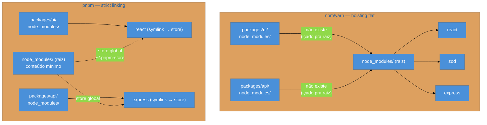
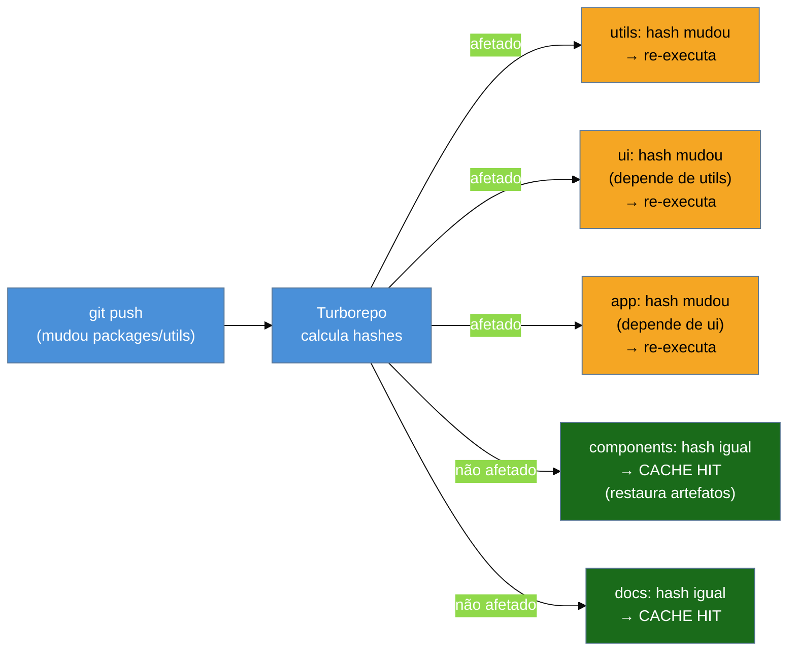
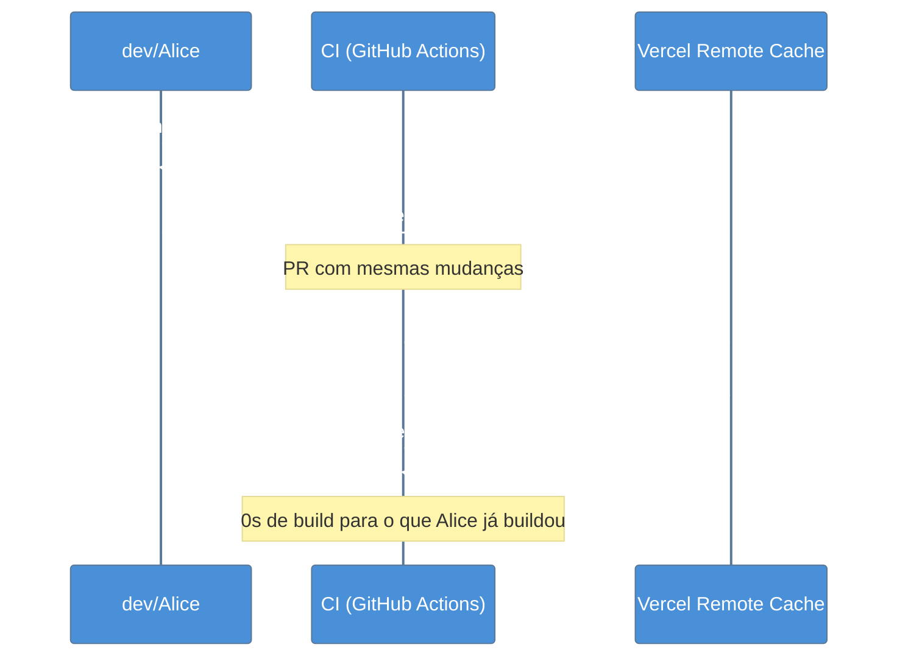
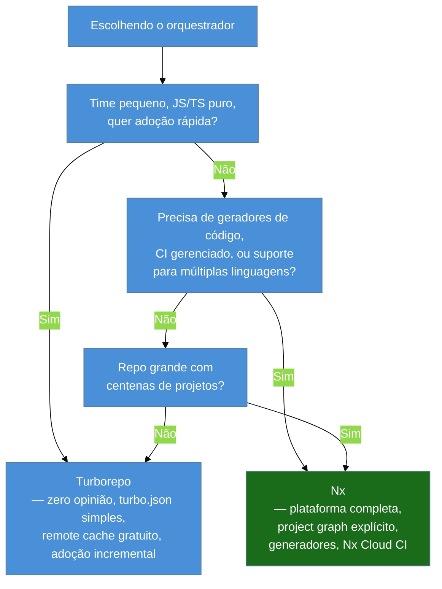
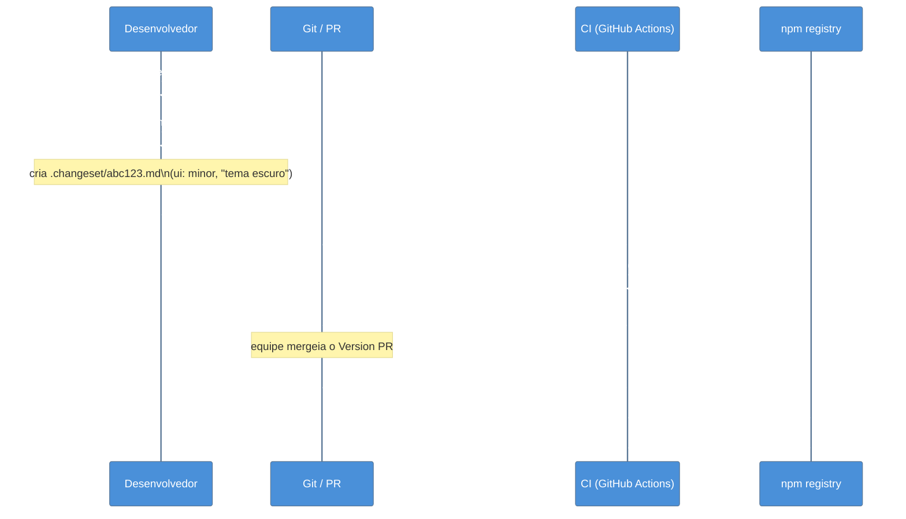

# Monorepos: workspaces, Turborepo, Nx e changesets

> [!abstract] TL;DR
> Monorepo = um único repositório Git para vários pacotes ou apps que se relacionam. O problema não é guardar código junto — é executar, cachear e versionar esse código com eficiência. Workspaces (npm/pnpm/yarn) resolvem o "morar junto"; Turborepo 2.10 e Nx 23 resolvem "correr rápido" via grafos de dependências + cache local/remoto; changesets 2.x resolvem o release de bibliotecas com semver independente por pacote. Lerna ainda existe (Nx o ressuscitou em 2022), mas novos projetos não têm motivo para escolhê-lo. A armadilha mais comum: montar o monorepo sem orquestrador e descobrir que o CI roda tudo toda vez — o que destrói o ganho que levou ao monorepo.

---

## O problema que o monorepo resolve

Imagine que você mantém três pacotes no mesmo produto: `@empresa/ui`, `@empresa/utils` e `@empresa/app`. Em três repositórios separados — o modelo polyrepo — você tem:

1. Abriu uma issue no `ui`. Para testá-la com `app`, você publica uma versão `alpha` do `ui` no npm, atualiza a dependência em `app`, reinstala, testa. Dez minutos para um ciclo de feedback.
2. Um refactor no `utils` quebra `ui` e `app`. Você só descobre quando o CI dos três repos roda em sequência — ou pior, depois do deploy.
3. Cada repo tem seu próprio `.eslintrc`, `tsconfig.json`, `jest.config.js`. Config drift começa devagar e viaja no piloto automático por meses.

A raiz do problema é que esses pacotes **não são realmente independentes**. Eles têm fronteiras artificiais que geram atrito real.

O monorepo remove essa fronteira artificial: os pacotes moram juntos, podem se importar diretamente (sem publicar), e mudanças atômicas que tocam múltiplos pacotes ficam em um único commit. O código de `app` importa `@empresa/ui` não pela versão npm, mas pelo caminho do workspace — e a alteração no `ui` aparece imediatamente no `app`, sem ciclo de publish.

Mas colocar código junto não é suficiente. Sem orquestração inteligente, o monorepo traz um problema novo: **escala de execução**. Se você tem 40 pacotes e qualquer mudança re-roda todos os testes, você não ganhou nada — você só centralizou a lentidão.

É aí que entram os orquestradores.

---

## Workspaces: o alicerce

Workspaces são a funcionalidade dos package managers que "entendem" que há múltiplos pacotes dentro do mesmo repositório. Eles resolvem duas coisas:

1. **Hoisting de dependências** — pacotes compartilhados são instalados uma vez, não N vezes.
2. **Symlinks locais** — quando `app` declara `"@empresa/ui": "workspace:*"`, o package manager cria um symlink de `node_modules/@empresa/ui` para a pasta local `packages/ui`, sem publicar no npm.

### pnpm workspaces (recomendado em 2026)

O pnpm é a escolha dominante para monorepos em 2026 por três razões: o protocolo `workspace:`, o strict linking que evita dependências fantasmas, e a velocidade de instalação.

```yaml
# pnpm-workspace.yaml — fica na raiz do repositório
# Define quais pastas contêm pacotes do workspace
packages:
  - 'apps/*'      # aplicações (não publicadas no npm)
  - 'packages/*'  # bibliotecas internas (podem ser publicadas)
  - 'tools/*'     # utilitários de desenvolvimento interno
```

```json
// packages/ui/package.json
{
  "name": "@empresa/ui",
  "version": "1.0.0",
  "exports": {
    ".": "./src/index.ts"   // TypeScript direto, sem pré-build necessário
  }
}
```

```json
// apps/web/package.json
{
  "name": "@empresa/web",
  "dependencies": {
    "@empresa/ui": "workspace:*",     // sempre usa a versão local
    "@empresa/utils": "workspace:^"   // usa local se compatível com semver
  }
}
```

```bash
# Instalar deps de todos os pacotes de uma vez
pnpm install

# Rodar script em um pacote específico
pnpm --filter @empresa/ui build

# Rodar script em todos os pacotes que dependem de @empresa/ui
pnpm --filter ...@empresa/ui test

# Adicionar dep a um pacote específico
pnpm --filter @empresa/web add zod
```

> [!info] O protocolo `workspace:`
> `workspace:*` significa "use exatamente a versão local — não publique uma versão de npm aqui". Quando você roda `pnpm publish` ou o changesets version, o `workspace:*` é substituído pela versão concreta (`^1.0.0`). Isso garante que o lock interno não "vaze" para npm. O `workspace:^` usa o semver para decidir se a versão local é compatível — útil quando você quer poder publicar pacotes com versões diferentes.

### npm workspaces e yarn workspaces

npm e yarn também suportam workspaces, mas com diferenças relevantes:

```json
// package.json na raiz (npm ou yarn) — em vez do pnpm-workspace.yaml
{
  "workspaces": [
    "apps/*",
    "packages/*"
  ]
}
```

A diferença crítica: npm e yarn usam hoisting flat — todas as dependências dos pacotes são içadas para `node_modules` da raiz. Isso pode criar situações onde um pacote usa uma dependência que não declarou explicitamente, apenas porque outro pacote a instalou. O pnpm usa strict linking por padrão: cada pacote só enxerga o que declarou, o que evita esse tipo de bug fantasma.



---

## O problema da escala: por que workspaces não bastam

Workspaces resolvem o problema de convivência. Mas não resolvem o problema de execução eficiente.

Imagine o monorepo com 40 pacotes. Você muda 3 linhas em `packages/utils`. Com só workspaces e scripts no `package.json`:

```bash
# O que você provavelmente roda no CI:
pnpm -r build   # builda todos os 40 pacotes
pnpm -r test    # testa todos os 40 pacotes
```

Dois problemas imediatos:

1. **Você reconstruiu pacotes que não mudaram** — perda de tempo pura.
2. **Você não respeitou a ordem de dependência** — `app` pode tentar buildar antes de `ui` terminar.

Os orquestradores — Turborepo e Nx — resolvem os dois problemas com a mesma ideia: **o grafo de dependências como schedule de execução + cache de artefatos**.

---

## Turborepo: orquestração por caching

Turborepo (Vercel, open-source MIT) é a abordagem minimalista: você descreve o que suas tasks precisam e produzem; ele descobre a ordem e o que pode ser cacheado. Em junho de 2026, está na versão **2.10**.

### O modelo mental: hash → cache hit/miss

Para cada task de cada pacote, o Turborepo calcula um **hash** a partir de:
- Conteúdo dos arquivos de entrada (`inputs`)
- Versão das dependências
- Variáveis de ambiente declaradas
- Configuração da task

Se o hash bateu com uma execução anterior (local em `.turbo/` ou remoto), ele **restaura os artefatos** sem executar nada. Se não bateu, executa e armazena.



### Configurando o `turbo.json`

```json
// turbo.json — fica na raiz do repositório
{
  "$schema": "https://turbo.build/schema.json",

  // Variáveis de ambiente que afetam TODOS os tasks
  "globalDependencies": [".env.*"],

  "tasks": {
    // build: depende do build dos pacotes que este importa (^build)
    "build": {
      "dependsOn": ["^build"],
      "outputs": ["dist/**", ".next/**", "!.next/cache/**"]
      // inputs: padrão = todos os arquivos git-tracked do pacote
    },

    // test: depende do build local (não precisa que deps já testaram)
    "test": {
      "dependsOn": ["build"],
      "outputs": ["coverage/**"],
      // inputs explícitos = só re-testa se src/ ou testes mudaram
      "inputs": ["src/**/*.ts", "src/**/*.tsx", "test/**/*.ts", "vitest.config.ts"]
    },

    // lint: sem dependências de outros pacotes, sem outputs cacheáveis
    "lint": {
      "outputs": []
    },

    // typecheck: sem dependências, sem outputs
    "typecheck": {
      "outputs": []
    },

    // dev: nunca cacheado, roda em paralelo como processo persistente
    "dev": {
      "cache": false,
      "persistent": true
    }
  }
}
```

> [!tip] O que `^build` significa
> O prefixo `^` em `dependsOn` significa "o mesmo task, mas nos pacotes que eu importo". `"dependsOn": ["^build"]` lê-se: "antes de rodar o meu `build`, certifique-se de que o `build` de todas as minhas dependências já rodou". Sem o `^`, seria uma dependência dentro do mesmo pacote.

```bash
# Rodar build de tudo (respeitando a ordem de dependência)
turbo build

# Rodar apenas o que mudou desde o último commit na main
turbo build --affected

# Filtrar por pacote específico (e seus dependentes)
turbo build --filter=@empresa/app...

# Ver o pipeline sem executar
turbo build --dry-run

# Cache remoto: conectar ao Vercel Remote Cache (gratuito em todos os planos)
turbo login
turbo link
```

### Remote Cache: o multiplicador

O cache local em `.turbo/` já economiza tempo na sua máquina. O Remote Cache — gratuito no Vercel desde 2024 — compartilha esse cache com toda a equipe e com o CI.



O Turborepo 2.9 (março/2026) anunciou ganhos de até **96% de velocidade** em repositórios grandes com cache quente. Não é exagero: se 35 de 40 pacotes não mudaram, literalmente 35/40 do trabalho é restaurado do cache.

> [!warning] Turborepo não cuida do versionamento
> O Turborepo orquestra *execução* de tasks. Ele não sabe nada sobre semver, changelogs ou publicação de pacotes no npm. Para isso, você precisa de changesets (ou Lerna). São camadas complementares, não substitutas.

---

## Nx: a plataforma completa

Nx (Nrwl/Nrwl) é uma aposta diferente da do Turborepo. Em vez de "faça uma coisa bem", o Nx é uma plataforma: orquestrador de tasks, gerador de código, CI gerenciado, e em 2026, uma plataforma de IA para monorepos. Versão atual: **Nx 23** (junho de 2026).

### Diferença conceitual: project graph explícito

O Turborepo infere dependências dos `package.json`. O Nx constrói um **project graph** a partir do código — ele analisa os imports estáticos para entender quais pacotes dependem de quais. Isso permite executar apenas os projetos *affected* por uma mudança com mais precisão.

```bash
# Instalar o Nx em um monorepo existente
npx nx@latest init

# Ver o project graph visualmente
npx nx graph

# Rodar build apenas nos pacotes afetados pela mudança (vs main)
npx nx affected -t build

# Rodar testes em paralelo, limitando a 4 workers
npx nx run-many -t test --parallel=4

# Gerar um novo pacote usando o gerador do Nx
npx nx generate @nx/react:library minha-lib --directory=packages/minha-lib
```

```json
// project.json (por pacote, alternativa ao package.json scripts no Nx)
{
  "name": "@empresa/ui",
  "targets": {
    "build": {
      "executor": "@nx/vite:build",
      "outputs": ["{workspaceRoot}/dist/packages/ui"],
      "options": {
        "outputPath": "dist/packages/ui",
        "tsConfig": "packages/ui/tsconfig.lib.json"
      }
    },
    "test": {
      "executor": "@nx/vitest:vitest",
      "outputs": ["{workspaceRoot}/coverage/packages/ui"],
      "options": {
        "passWithNoTests": true
      }
    },
    "lint": {
      "executor": "@nx/eslint:lint",
      "outputs": ["{options.outputFile}"]
    }
  }
}
```

> [!info] `nx.json`: a configuração central
> Assim como o Turborepo tem o `turbo.json`, o Nx tem o `nx.json` para configurações globais: qual runner usar, defaults de cache, configuração do Nx Cloud.

### Turborepo vs Nx: quando usar cada um



| Aspecto | Turborepo 2.10 | Nx 23 |
|---------|---------------|-------|
| Configuração inicial | `turbo.json` minimalista | `nx.json` + `project.json` por pacote |
| Grafo de dependências | Inferido do `package.json` | Analisado dos imports no código |
| Geradores de código | Não inclui | Sim (scaffolding de libs, apps, componentes) |
| CI gerenciado | Vercel Remote Cache (grátis) | Nx Cloud (plano gratuito + pago) |
| Suporte polyglot | JS/TS | JS/TS + Java/Maven + .NET + Go + Python |
| Curva de adoção | Baixa | Média-alta |
| Filosofia | "faça uma coisa bem" | Plataforma full-stack de desenvolvimento |
| Backing | Vercel | Nrwl (empresa independente) |

> [!tip] Adoção incremental do Turborepo
> Um dos pontos fortes do Turborepo 2.x é que você pode adicioná-lo a um monorepo existente com workspaces sem mudar nada — apenas instala `turbo`, cria o `turbo.json` e começa a usar. O Nx tem mais opiniões sobre estrutura e é mais invasivo na adoção.

---

## Changesets: versionamento e release de pacotes

Workspaces e orquestradores cuidam do desenvolvimento. Mas quando você quer **publicar pacotes no npm**, precisa responder: qual versão cada pacote recebe? Quem gera o CHANGELOG? Quem decide que uma mudança em `utils` exige bump de major em `ui`?

Changesets (versão estável atual: **2.x**, o `@changesets/cli` 2.31.0) é a resposta padrão de 2026 para essa pergunta.

### O modelo mental: intenções antes de versões

A ideia central do changesets é separar **quando você descreve uma mudança** de **quando você versiona e publica**.

Quando um dev faz uma mudança que será publicada, ele roda:

```bash
pnpm changeset
# ou
npx changeset
```

O CLI faz perguntas interativas:
1. Quais pacotes essa mudança afeta?
2. Qual tipo de bump para cada um? (patch / minor / major)
3. Descreva a mudança em linguagem humana.

O resultado é um arquivo `.md` na pasta `.changeset/`:

```markdown
<!-- .changeset/nome-aleatório.md — gerado automaticamente pelo CLI -->
---
"@empresa/ui": minor
"@empresa/utils": patch
---

Adiciona suporte a tema escuro no componente Button.

O `utils/formatDate` recebeu um fix no timezone handling para UTC.
```

Esses arquivos de intenção ficam no Git, junto com o código. Quando chega a hora do release:

```bash
# Aplica todos os changesets: bumpa versões e gera CHANGELOGs
pnpm changeset version

# Publica os pacotes que tiveram bump no npm
pnpm changeset publish
```



### Configuração do `.changeset/config.json`

```json
// .changeset/config.json
{
  "$schema": "https://unpkg.com/@changesets/config@3.0.0/schema.json",

  // Branches consideradas "release" — changeset version roda aqui
  "changelog": "@changesets/cli/changelog",

  // Onde ficam os artefatos de changeset
  "commit": false,

  // Pacotes que sempre versionam juntos (versão sincronizada)
  // útil para @empresa/ui e @empresa/ui-react que são codependentes
  "linked": [["@empresa/ui", "@empresa/ui-react"]],

  // "local" = não tenta resolver no registry npm (padrão para monorepos)
  "access": "public",

  // Quando um pacote muda, bumpa os que dependem dele com patch
  "updateInternalDependencies": "patch",

  // Pacotes que nunca serão publicados (apps, ferramentas internas)
  "ignore": ["@empresa/web", "@empresa/docs-site"]
}
```

```yaml
# .github/workflows/release.yml — fluxo automatizado com Changesets Action
name: Release

on:
  push:
    branches: [main]

jobs:
  release:
    runs-on: ubuntu-latest
    steps:
      - uses: actions/checkout@v4
      - uses: pnpm/action-setup@v4
        with: { version: 10 }
      - uses: actions/setup-node@v4
        with: { node-version: 22, cache: pnpm }

      - run: pnpm install --frozen-lockfile

      - name: Create Release PR or Publish
        uses: changesets/action@v1
        with:
          # Roda 'changeset version' para atualizar as versões
          version: pnpm changeset version
          # Roda 'changeset publish' quando o Version PR é mergeado
          publish: pnpm changeset publish
        env:
          GITHUB_TOKEN: ${{ secrets.GITHUB_TOKEN }}
          NPM_TOKEN: ${{ secrets.NPM_TOKEN }}
```

> [!question]- Por que não usar `semantic-release` em vez de changesets?
> `semantic-release` analisa **mensagens de commit** (Conventional Commits) para inferir o tipo de bump — totalmente automático, mas sem intervenção humana. Changesets exige que o dev declare explicitamente o impacto da mudança. A vantagem do changesets em monorepos: você consegue bumps diferentes por pacote dentro do mesmo commit, e a descrição humana fica no CHANGELOG, não inferida de uma mensagem de commit. `semantic-release` tem plugins para monorepo, mas a experiência é mais acidentada.

---

## O estado do Lerna em 2026

O Lerna foi a ferramenta que inventou o monorepo JS como conceito, em 2015. No pico, era a única forma séria de gerenciar múltiplos pacotes em um repositório. Mas em 2022 chegou ao limite: os mantenedores originais abandonaram o projeto, e um issue aberto perguntava "está morto?".

A Nrwl (empresa por trás do Nx) **adotou o Lerna** e o ressuscitou. O Lerna v7+ usa o Nx como motor de caching e task execution por baixo dos panos. Tecnicamente, se você usa Lerna moderno, está usando Nx — você só não percebe.

```bash
# Lerna hoje: versioning + Nx como engine
npx lerna version    # = changeset version, mas com Conventional Commits
npx lerna publish    # publica pacotes versionados
npx lerna run build  # usa Nx internamente para cache e paralelismo
```

**Quando ainda faz sentido usar Lerna em 2026:**
- Projetos **legados que já usam Lerna** — atualizar para v7+ e ganhar o Nx por baixo é praticamente sem atrito
- Times que preferem o modelo de versionamento com Conventional Commits em vez do modelo declarativo do changesets
- Projetos open-source com histórico de changelogs já em formato Lerna

**Quando NÃO começar com Lerna em 2026:**
- Novos projetos — prefira pnpm workspaces + Turborepo + changesets (stack mais leve) ou pnpm workspaces + Nx (stack mais completa)
- Times que querem controle explícito do semver bump — changesets é mais legível nesse aspecto

---

## Por que monorepo? (e quando NÃO usar)

Discutido os três problemas centrais que o monorepo resolve:

### Quando monorepo faz sentido

**1. Código fortemente acoplado por design**
`@empresa/ui`, `@empresa/design-tokens` e `@empresa/app` não são projetos independentes. São partes de um produto. Fronteira artificial = atrito artificial.

**2. Refactors atômicos cross-package**
Renomear uma API em `utils` e atualizar todos os consumidores em um único PR, com um único CI verde, é muito mais seguro do que coordenar PRs em três repos.

**3. Compartilhar config de qualidade**
`tsconfig.base.json`, `.eslintrc.js`, `prettier.config.js` na raiz. Todos os pacotes herdam. Drift de configuração torna-se opt-in, não a norma.

**4. Visibilidade do impacto**
Quando você muda `utils`, o CI mostra quais testes de `ui` e `app` quebraram. Em polyrepo, você descobre no próximo release.

### Quando NÃO usar monorepo

> [!warning] Sinais de que polyrepo é a escolha certa
> **Projetos realmente independentes**: se dois serviços nunca compartilham código e têm times distintos com ritmos de deploy diferentes, o monorepo só adiciona complexidade de CI sem vantagem.
>
> **Restrições de segurança e acesso**: em ambientes onde times diferentes não podem ver o código uns dos outros, polyrepo é a arquitetura natural.
>
> **Stack heterogênea sem orquestrador**: Python + Go + JS sem Nx polyglot = monorepo sem tooling adequado. Você ganha a dor sem o benefício.
>
> **Time sem cultura de CI eficiente**: monorepo sem cache inteligente (Turborepo ou Nx) significa CI que roda tudo toda vez. Para repos com 50+ pacotes, isso é 40 minutos de CI para mudar um comentário.

> [!warning] O anti-padrão "monorepo sem orquestrador"
> O erro mais comum: migrar para monorepo com workspaces, mas sem Turborepo ou Nx. Resultado: `pnpm -r build` que testa todos os 40 pacotes em sequência, sem cache, sem paralelismo inteligente. O CI fica mais lento do que polyrepo, e a equipe culpa "o monorepo". O problema não é o monorepo — é a ausência do orquestrador.

---

## Um monorepo completo do zero

Para tornar concreto, um setup mínimo mas production-ready com pnpm + Turborepo + changesets:

```
meu-monorepo/
├── apps/
│   └── web/               # Next.js app (não publicado no npm)
│       ├── package.json
│       └── src/
├── packages/
│   ├── ui/                # biblioteca de componentes (@empresa/ui)
│   │   ├── package.json
│   │   └── src/
│   └── utils/             # utilitários (@empresa/utils)
│       ├── package.json
│       └── src/
├── .changeset/
│   └── config.json
├── pnpm-workspace.yaml
├── turbo.json
├── package.json           # root — apenas scripts e devDeps de tooling
└── tsconfig.base.json     # tsconfig compartilhado
```

```json
// package.json (raiz) — sem name/version, apenas scripts
{
  "private": true,
  "scripts": {
    "build": "turbo build",
    "test": "turbo test",
    "lint": "turbo lint",
    "typecheck": "turbo typecheck",
    "dev": "turbo dev --parallel",
    "changeset": "changeset",
    "version-packages": "changeset version",
    "release": "turbo build && changeset publish"
  },
  "devDependencies": {
    "turbo": "^2.10.0",
    "@changesets/cli": "^2.31.0",
    "typescript": "^5.5.0"
  }
}
```

```json
// tsconfig.base.json (raiz) — herdado por todos os pacotes
{
  "compilerOptions": {
    "target": "ES2022",
    "module": "ESNext",
    "moduleResolution": "Bundler",
    "strict": true,
    "skipLibCheck": true,
    "declaration": true,
    "declarationMap": true,
    "sourceMap": true
  }
}
```

```json
// packages/ui/package.json
{
  "name": "@empresa/ui",
  "version": "0.1.0",
  "license": "MIT",
  "main": "./src/index.ts",
  "exports": {
    ".": "./src/index.ts"
  },
  "scripts": {
    "build": "tsc --project tsconfig.json",
    "test": "vitest run",
    "lint": "eslint src/",
    "typecheck": "tsc --noEmit"
  },
  "dependencies": {
    "@empresa/utils": "workspace:*"
  },
  "devDependencies": {
    "typescript": "^5.5.0",
    "vitest": "^2.0.0"
  }
}
```

```bash
# Setup inicial completo
mkdir meu-monorepo && cd meu-monorepo
git init
pnpm init

# Criar estrutura de pastas
mkdir -p apps/web packages/ui/src packages/utils/src

# Instalar turbo e changesets na raiz
pnpm add -Dw turbo @changesets/cli

# Inicializar changesets
pnpm changeset init

# Verificar se o pipeline está correto
turbo build --dry-run

# Conectar ao Vercel Remote Cache (opcional, gratuito)
turbo login && turbo link
```

---

## Armadilhas comuns

> [!warning] Armadilha 1: `workspace:*` vaza para o npm
> Se você publicar um pacote com `"@empresa/utils": "workspace:*"` no `package.json`, qualquer consumer do npm vai tentar resolver `workspace:*` e falhar. O changeset version automaticamente substitui por versões concretas antes de publicar — mas só se você usar o `changeset publish`. Publicar manualmente com `npm publish` não faz essa substituição.

> [!warning] Armadilha 2: `outputs` errado no `turbo.json` → cache miss eterno
> Se o seu `build` gera artefatos em `dist/` mas você declarou `"outputs": []`, o Turborepo não salva nada — e na próxima rodada, mesmo que o hash bata, não há nada para restaurar. Verifique com `turbo build --dry-run=json` quais outputs estão sendo capturados.

> [!warning] Armadilha 3: instalar deps na raiz quando deveriam estar no pacote
> Em monorepos pnpm, `pnpm add zod` na raiz instala no root `package.json`. Se só `packages/ui` usa `zod`, o correto é `pnpm --filter @empresa/ui add zod`. Instalar tudo na raiz re-introduz o problema de deps implícitas que o pnpm strict linking previne.

> [!warning] Armadilha 4: `dev` com `cache: false` esquecido em produção
> O task `dev` nunca deve ser cacheado (`"cache": false, "persistent": true`). Se por erro você cachear o `dev`, o Turborepo vai restaurar um processo que não está rodando. Seja explícito no `turbo.json` sobre quais tasks são persistentes.

> [!warning] Armadilha 5: changesets sem o `ignore` configurado
> Por padrão, o changesets tenta versionar e publicar **todos** os pacotes do workspace. Apps (`apps/web`) e ferramentas internas não devem ir ao npm. Configure `"ignore"` no `.changeset/config.json` para excluí-los — caso contrário, o `changeset publish` vai tentar publicar sua aplicação Next.js no npm.

---

## Como explicar em inglês

In a monorepo, multiple packages or applications live in the same Git repository. The key challenge isn't storing code together — it's **executing tasks efficiently at scale**. Workspaces (pnpm, npm, or yarn) handle the dependency graph locally: the `workspace:` protocol creates symlinks between packages so `app` can import `@company/ui` directly from disk without publishing to npm.

Workspaces alone don't solve execution efficiency. That's where orchestrators like **Turborepo** and **Nx** come in. Both work by hashing task inputs — source files, dependencies, env vars — and caching the outputs. If the hash matches a previous run, the tool replays the output without executing anything. Turborepo 2.10 is the minimalist approach: you write a `turbo.json` describing what each task depends on and what it produces, and Turborepo handles scheduling and caching. Nx 23 is the platform approach: it builds an explicit project graph from imports, provides code generators, and integrates CI orchestration.

For **versioning and releasing packages**, changesets is the standard tool. Developers declare their intent — "this change bumps `@company/ui` by minor and `@company/utils` by patch" — as small markdown files committed alongside the code. When you're ready to release, `changeset version` bumps all the `package.json` versions and generates changelogs; `changeset publish` publishes to npm. The key design choice: intent is declared at the time of the change, not inferred later from commit messages.

**Lerna** still exists — Nrwl (the Nx company) rescued it from abandonment in 2022 and rebuilt it on top of Nx. Modern Lerna v7+ is essentially Nx with Conventional Commits-based versioning. New projects should prefer the pnpm + Turborepo + changesets stack for lightweight setups, or pnpm + Nx for complex ones.

The most common mistake: setting up a monorepo with workspaces but without an orchestrator. That leaves you running `pnpm -r build` sequentially across all packages on every CI run — slower than a polyrepo, not faster.

### Vocabulário-chave

| Português | Inglês |
|-----------|--------|
| Monorepo | Monorepo |
| Repo múltiplo | Polyrepo / multi-repo |
| Espaço de trabalho | Workspace |
| Grafo de dependências | Dependency graph / project graph |
| Acerto de cache | Cache hit |
| Falha de cache | Cache miss |
| Artefatos de build | Build artifacts / build outputs |
| Versionamento semântico por pacote | Per-package semantic versioning |
| Cache remoto | Remote cache |
| Orquestrador de tasks | Task orchestrator / build orchestrator |
| Pacotes afetados | Affected packages |
| Protocolo de workspace | Workspace protocol (`workspace:`) |
| Bump de versão | Version bump |
| Mudança incremental declarada | Changeset |
| Gerador de código | Code generator |

---

## O que vem a seguir

O monorepo cuida de como você organiza e executa o código internamente. A próxima fronteira é o que acontece quando esse código sai do monorepo para o mundo — builds de produção otimizados, CI determinístico, e a diferença entre um build que funciona na sua máquina e um que funciona em produção há seis meses.

- [[23 - Build em produção, CI e determinismo]] — como garantir que o build do CI é idêntico ao da máquina local, cache de CI, lockfiles estritos e o que torna um build realmente reproducível
- [[05 - Semver e o grafo de dependências]] — a teoria por trás das decisões de bump que o changesets formaliza; por que `^1.0.0` é diferente de `~1.0.0` e o que acontece quando o grafo conflita
- [[03 - Package managers - npm, pnpm, yarn e Bun]] — o protocolo `workspace:`, hoisting e strict linking em detalhes — o fundamento sobre o qual os workspaces aqui descritos operam
- [[index|trilha Tooling e Build]] — visão geral da trilha

---

## Fontes

- **Turborepo** — [*turborepo.dev/blog*](https://turborepo.dev/blog) — changelog oficial; v2.10 (jun/2026) e v2.9 com ganhos de 96% de velocidade
- **Vercel** — [*Vercel Remote Cache is now free*](https://turborepo.dev/blog/free-vercel-remote-cache) — anúncio de remote cache gratuito em todos os planos
- **Nx** — [*Nx Changelog*](https://nx.dev/changelog) — histórico oficial; Nx 23 lançado junho/2026 com agentic migrations
- **Nx** — [*Nx 2026 Roadmap*](https://nx.dev/blog/nx-2026-roadmap) — direção estratégica do projeto
- **Nx** — [*Lerna is dead — Long Live Lerna*](https://nx.dev/blog/lerna-is-dead-long-live-lerna) — contexto histórico da adoção do Lerna pela Nrwl
- **changesets** — [*github.com/changesets/changesets*](https://github.com/changesets/changesets) — repositório oficial; versão estável 2.31.0
- **pnpm** — [*pnpm.io/workspaces*](https://pnpm.io/workspaces) — documentação oficial do workspace protocol
- **Vercel Academy** — [*Changesets for Versioning*](https://vercel.com/academy/production-monorepos/changesets-versioning) — guia prático de changesets em monorepos de produção
