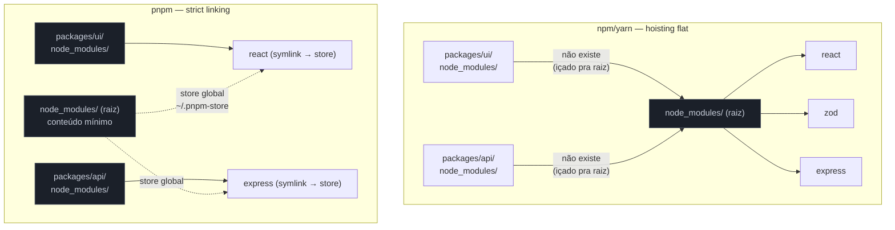
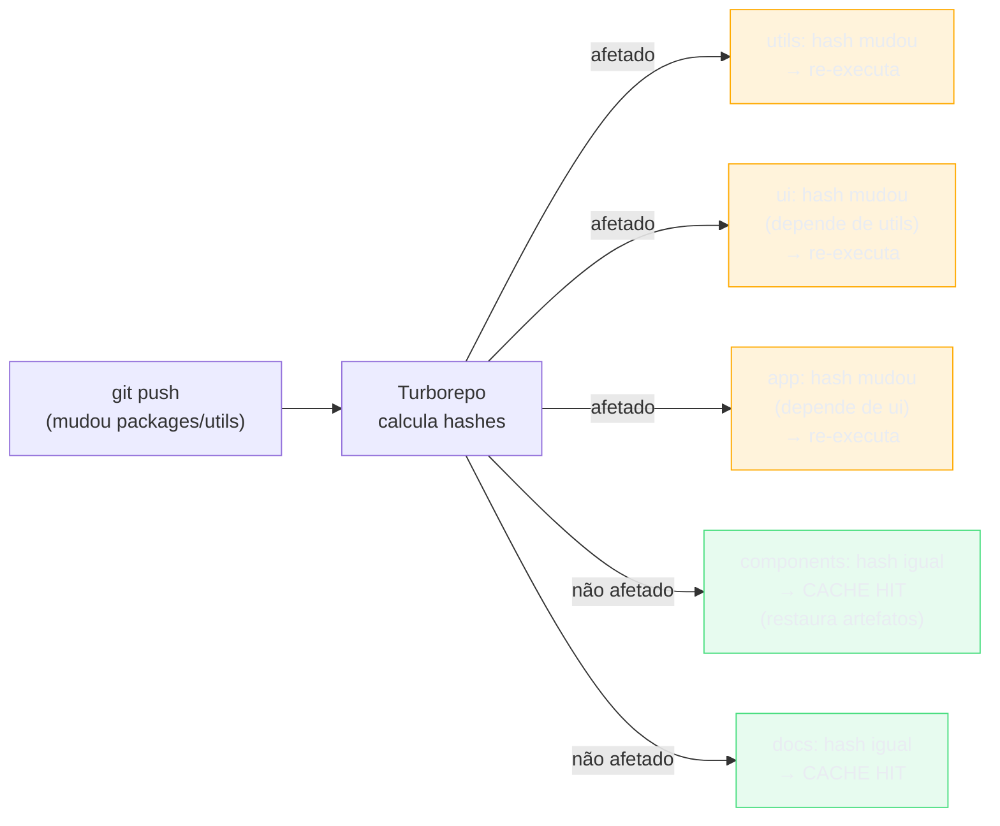
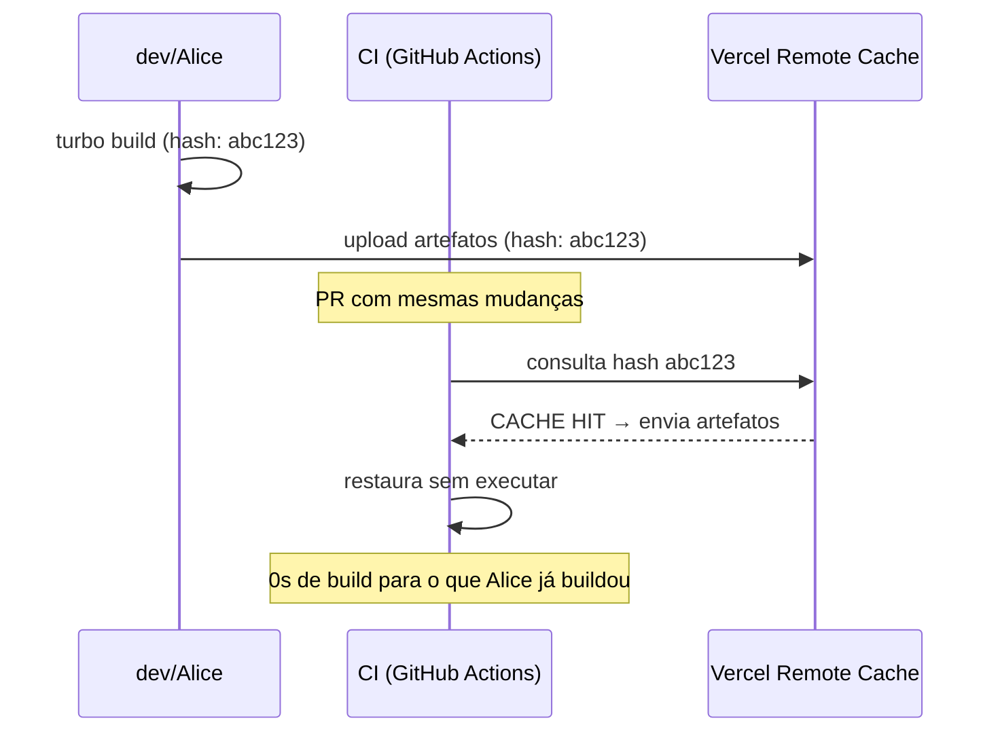
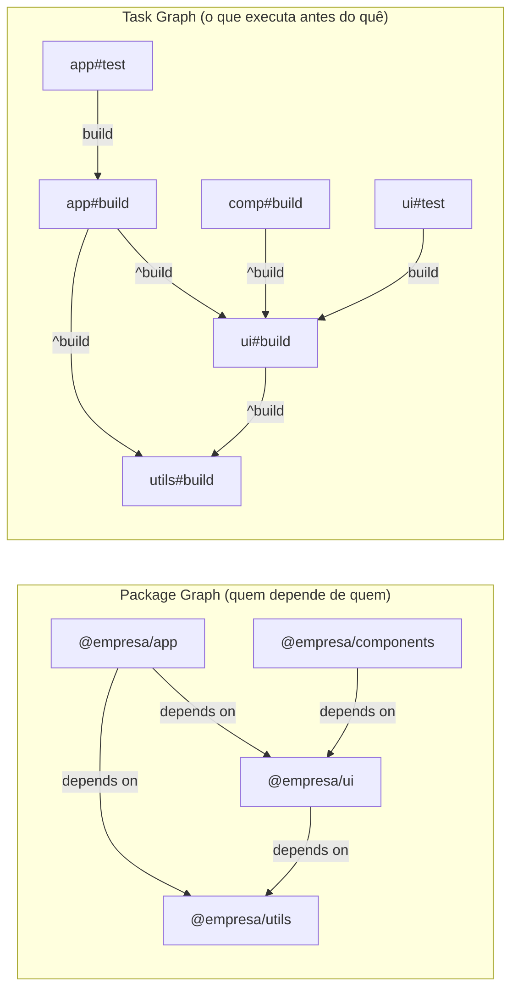
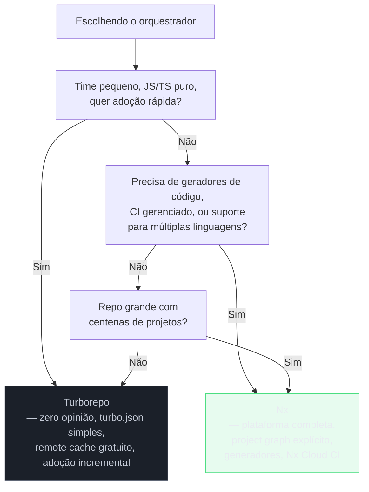
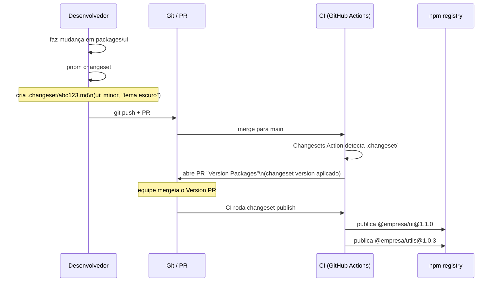
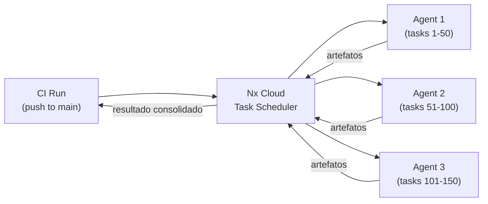

# Monorepos: workspaces, Turborepo, Nx e changesets

> [!abstract] TL;DR
> Monorepo = um único repositório Git para vários pacotes ou apps que se relacionam. O problema não é guardar código junto — é executar, cachear e versionar esse código com eficiência. Workspaces (npm/pnpm/yarn) resolvem o "morar junto"; Turborepo 2.10 e Nx 23 resolvem "correr rápido" via grafos de dependências + cache local/remoto; changesets 2.x resolvem o release de bibliotecas com semver independente por pacote. Lerna ainda existe (Nx o ressuscitou em 2022), mas novos projetos não têm motivo para escolhê-lo. A armadilha mais comum: montar o monorepo sem orquestrador e descobrir que o CI roda tudo toda vez — o que destrói o ganho que levou ao monorepo.

---

## O problema que o monorepo resolve

Imagine que você mantém três pacotes no mesmo produto: `@empresa/ui`, `@empresa/utils` e `@empresa/app`. Em três repositórios separados — o modelo polyrepo — você tem:

1. Abriu uma issue no `ui`. Para testá-la com `app`, você publica uma versão `alpha` do `ui` no npm, atualiza a dependência em `app`, reinstala, testa. Dez minutos para um ciclo de feedback.
2. Um refactor no `utils` quebra `ui` e `app`. Você só descobre quando o CI dos três repos roda em sequência — ou pior, depois do deploy.
3. Cada repo tem seu próprio `.eslintrc`, `tsconfig.json`, `jest.config.js`. Config drift começa devagar e viaja no piloto automático por meses.

A raiz do problema é que esses pacotes **não são realmente independentes**. Eles têm fronteiras artificiais que geram atrito real.

O monorepo remove essa fronteira artificial: os pacotes moram juntos, podem se importar diretamente (sem publicar), e mudanças atômicas que tocam múltiplos pacotes ficam em um único commit. O código de `app` importa `@empresa/ui` não pela versão npm, mas pelo caminho do workspace — e a alteração no `ui` aparece imediatamente no `app`, sem ciclo de publish.

Mas colocar código junto não é suficiente. Sem orquestração inteligente, o monorepo traz um problema novo: **escala de execução**. Se você tem 40 pacotes e qualquer mudança re-roda todos os testes, você não ganhou nada — você só centralizou a lentidão.

É aí que entram os orquestradores.

---

## Workspaces: o alicerce

Workspaces são a funcionalidade dos package managers que "entendem" que há múltiplos pacotes dentro do mesmo repositório. Eles resolvem duas coisas:

1. **Hoisting de dependências** — pacotes compartilhados são instalados uma vez, não N vezes.
2. **Symlinks locais** — quando `app` declara `"@empresa/ui": "workspace:*"`, o package manager cria um symlink de `node_modules/@empresa/ui` para a pasta local `packages/ui`, sem publicar no npm.

### pnpm workspaces (recomendado em 2026)

O pnpm é a escolha dominante para monorepos em 2026 por três razões: o protocolo `workspace:`, o strict linking que evita dependências fantasmas, e a velocidade de instalação.

```yaml
# pnpm-workspace.yaml — fica na raiz do repositório
# Define quais pastas contêm pacotes do workspace
packages:
  - 'apps/*'      # aplicações (não publicadas no npm)
  - 'packages/*'  # bibliotecas internas (podem ser publicadas)
  - 'tools/*'     # utilitários de desenvolvimento interno
```

```json
// packages/ui/package.json
{
  "name": "@empresa/ui",
  "version": "1.0.0",
  "exports": {
    ".": "./src/index.ts"   // TypeScript direto, sem pré-build necessário
  }
}
```

```json
// apps/web/package.json
{
  "name": "@empresa/web",
  "dependencies": {
    "@empresa/ui": "workspace:*",     // sempre usa a versão local
    "@empresa/utils": "workspace:^"   // usa local se compatível com semver
  }
}
```

```bash
# Instalar deps de todos os pacotes de uma vez
pnpm install

# Rodar script em um pacote específico
pnpm --filter @empresa/ui build

# Rodar script em todos os pacotes que dependem de @empresa/ui
pnpm --filter ...@empresa/ui test

# Adicionar dep a um pacote específico
pnpm --filter @empresa/web add zod
```

> [!info] O protocolo `workspace:`
> `workspace:*` significa "use exatamente a versão local — não publique uma versão de npm aqui". Quando você roda `pnpm publish` ou o changesets version, o `workspace:*` é substituído pela versão concreta (`^1.0.0`). Isso garante que o lock interno não "vaze" para npm. O `workspace:^` usa o semver para decidir se a versão local é compatível — útil quando você quer poder publicar pacotes com versões diferentes.

### O protocolo `catalog:` — versões centralizadas (pnpm 9.5+)

Se o `workspace:` resolve o problema de referências locais entre pacotes, o `catalog:` resolve um problema diferente: **versões inconsistentes de dependências externas entre pacotes do workspace**.

Imagine um monorepo com 12 pacotes, todos usando `react`. Sem catalog, cada `package.json` declara `"react": "^18.3.1"` de forma independente. Com o tempo, um pacote atualiza para `^19.0.0` e outro não. Você tem duas versões de React no lockfile — e bugs de "funciona na máquina X mas não na Y" que levam horas para depurar.

O `catalog:` centraliza a versão num único lugar:

```yaml
# pnpm-workspace.yaml — com suporte a catalogs (pnpm 9.5+)
packages:
  - 'apps/*'
  - 'packages/*'

# Catálogo default: referenciado como "catalog:" nos package.json
catalog:
  react: ^18.3.1
  react-dom: ^18.3.1
  typescript: ^5.5.0
  zod: ^3.23.8

# Catálogos nomeados: referenciados como "catalog:nome"
catalogs:
  dev-tooling:
    vitest: ^2.0.0
    eslint: ^9.0.0
    "@typescript-eslint/parser": ^8.0.0
```

```json
// packages/ui/package.json — usando catalog:
{
  "name": "@empresa/ui",
  "dependencies": {
    "react": "catalog:",          // usa o catálogo default
    "react-dom": "catalog:",
    "zod": "catalog:"
  },
  "devDependencies": {
    "vitest": "catalog:dev-tooling",   // usa catálogo nomeado
    "eslint": "catalog:dev-tooling"
  }
}
```

Quando você rodar `pnpm publish` ou o changeset publish, `catalog:` é substituído pela versão concreta do catálogo — exatamente como o `workspace:*`. O consumer do npm nunca vê o `catalog:`.

> [!tip] `catalogMode` (pnpm 10.12.1+)
> Com `catalogMode: strict` no `pnpm-workspace.yaml`, o pnpm bloqueia qualquer instalação que não seja via catálogo para deps que já constam no catalog. Isso torna a consistência uma propriedade estrutural do repo, não uma convenção de time.

**Por que isso é trade-off sênior:** o catalog elimina conflitos de versão, mas cria acoplamento entre pacotes no horário da atualização — um bump no catálogo afeta todos os pacotes simultaneamente. Em repos muito grandes, isso pode ser desejável (garantia de consistência) ou problemático (todos os testes rodam quando você atualiza uma devDep). O Nx 22 adicionou suporte nativo ao catálogo, reconhecendo as entradas `catalog:` na análise do project graph.

### npm workspaces e yarn workspaces

npm e yarn também suportam workspaces, mas com diferenças relevantes:

```json
// package.json na raiz (npm ou yarn) — em vez do pnpm-workspace.yaml
{
  "workspaces": [
    "apps/*",
    "packages/*"
  ]
}
```

A diferença crítica: npm e yarn usam hoisting flat — todas as dependências dos pacotes são içadas para `node_modules` da raiz. Isso pode criar situações onde um pacote usa uma dependência que não declarou explicitamente, apenas porque outro pacote a instalou. O pnpm usa strict linking por padrão: cada pacote só enxerga o que declarou, o que evita esse tipo de bug fantasma.



---

## O problema da escala: por que workspaces não bastam

Workspaces resolvem o problema de convivência. Mas não resolvem o problema de execução eficiente.

Imagine o monorepo com 40 pacotes. Você muda 3 linhas em `packages/utils`. Com só workspaces e scripts no `package.json`:

```bash
# O que você provavelmente roda no CI:
pnpm -r build   # builda todos os 40 pacotes
pnpm -r test    # testa todos os 40 pacotes
```

Dois problemas imediatos:

1. **Você reconstruiu pacotes que não mudaram** — perda de tempo pura.
2. **Você não respeitou a ordem de dependência** — `app` pode tentar buildar antes de `ui` terminar.

Os orquestradores — Turborepo e Nx — resolvem os dois problemas com a mesma ideia: **o grafo de dependências como schedule de execução + cache de artefatos**.

---

## Turborepo: orquestração por caching

Turborepo (Vercel, open-source MIT) é a abordagem minimalista: você descreve o que suas tasks precisam e produzem; ele descobre a ordem e o que pode ser cacheado. Em junho de 2026, está na versão **2.10**.

### O modelo mental: hash → cache hit/miss

Para cada task de cada pacote, o Turborepo calcula um **hash** a partir de:
- Conteúdo dos arquivos de entrada (`inputs`)
- Versão das dependências
- Variáveis de ambiente declaradas
- Configuração da task

Se o hash bateu com uma execução anterior (local em `.turbo/` ou remoto), ele **restaura os artefatos** sem executar nada. Se não bateu, executa e armazena.



### Configurando o `turbo.json`

```json
// turbo.json — fica na raiz do repositório
{
  "$schema": "https://turbo.build/schema.json",

  // Variáveis de ambiente que afetam TODOS os tasks
  "globalDependencies": [".env.*"],

  "tasks": {
    // build: depende do build dos pacotes que este importa (^build)
    "build": {
      "dependsOn": ["^build"],
      "outputs": ["dist/**", ".next/**", "!.next/cache/**"]
      // inputs: padrão = todos os arquivos git-tracked do pacote
    },

    // test: depende do build local (não precisa que deps já testaram)
    "test": {
      "dependsOn": ["build"],
      "outputs": ["coverage/**"],
      // inputs explícitos = só re-testa se src/ ou testes mudaram
      "inputs": ["src/**/*.ts", "src/**/*.tsx", "test/**/*.ts", "vitest.config.ts"]
    },

    // lint: sem dependências de outros pacotes, sem outputs cacheáveis
    "lint": {
      "outputs": []
    },

    // typecheck: sem dependências, sem outputs
    "typecheck": {
      "outputs": []
    },

    // dev: nunca cacheado, roda em paralelo como processo persistente
    "dev": {
      "cache": false,
      "persistent": true
    }
  }
}
```

> [!tip] O que `^build` significa
> O prefixo `^` em `dependsOn` significa "o mesmo task, mas nos pacotes que eu importo". `"dependsOn": ["^build"]` lê-se: "antes de rodar o meu `build`, certifique-se de que o `build` de todas as minhas dependências já rodou". Sem o `^`, seria uma dependência dentro do mesmo pacote.

```bash
# Rodar build de tudo (respeitando a ordem de dependência)
turbo build

# Rodar apenas o que mudou desde o último commit na main
turbo build --affected

# Filtrar por pacote específico (e seus dependentes)
turbo build --filter=@empresa/app...

# Ver o pipeline sem executar
turbo build --dry-run

# Cache remoto: conectar ao Vercel Remote Cache (gratuito em todos os planos)
turbo login
turbo link
```

### Remote Cache: o multiplicador

O cache local em `.turbo/` já economiza tempo na sua máquina. O Remote Cache — gratuito no Vercel desde 2024 — compartilha esse cache com toda a equipe e com o CI.



O Turborepo 2.9 (março/2026) anunciou ganhos de até **96% de velocidade** em repositórios grandes com cache quente. Não é exagero: se 35 de 40 pacotes não mudaram, literalmente 35/40 do trabalho é restaurado do cache.

> [!warning] Turborepo não cuida do versionamento
> O Turborepo orquestra *execução* de tasks. Ele não sabe nada sobre semver, changelogs ou publicação de pacotes no npm. Para isso, você precisa de changesets (ou Lerna). São camadas complementares, não substitutas.

### Turborepo 2.9: o que mudou (março/2026)

O salto de qualidade da versão 2.9 vai além das métricas de 96% de velocidade — ele muda o que é possível fazer com o Turborepo:

#### `turbo query` — GraphQL para o seu monorepo (agora estável)

O `turbo query` expõe o grafo interno do Turborepo via GraphQL, tornando perguntas sobre o monorepo respondíveis em shell:

```bash
# Quais pacotes e tasks seriam afetados pela mudança atual?
turbo query affected

# Saída: JSON estruturado — ideal para alimentar pipelines de CI dinâmicos
# {
#   "packages": ["@empresa/ui", "@empresa/app"],
#   "tasks": ["@empresa/ui#build", "@empresa/ui#test", "@empresa/app#build"]
# }

# Listar todos os pacotes com suas dependências e tasks
turbo query ls

# Filtrar por pacotes que dependem de @empresa/utils
turbo query ls --filter=...@empresa/utils
```

O `turbo query affected` é o substituto do `turbo-ignore` (agora deprecado). Em vez de um script que decide binariamente "roda ou não roda o CI", você gera JSON preciso de quais pacotes e tasks foram afetados, e usa isso para construir matrizes dinâmicas no GitHub Actions ou similar.

```yaml
# GitHub Actions com matriz dinâmica gerada pelo turbo query
jobs:
  query:
    outputs:
      packages: ${{ steps.affected.outputs.packages }}
    steps:
      - id: affected
        run: echo "packages=$(turbo query affected --format=json | jq -c '.packages')" >> $GITHUB_OUTPUT

  test:
    needs: query
    strategy:
      matrix:
        package: ${{ fromJson(needs.query.outputs.packages) }}
    steps:
      - run: pnpm --filter ${{ matrix.package }} test
```

#### Dependências circulares entre pacotes agora são permitidas

Antes do 2.9, qualquer ciclo no grafo de pacotes (`A → B → A`) bloqueava o Turborepo completamente. Isso impedia adoção incremental em monorepos legados.

A distinção conceitual que o 2.9 formaliza: **grafo de pacotes** pode ter ciclos; **grafo de tasks** nunca pode (tarefas em ciclo seriam executadas indefinidamente). O Turborepo agora valida o grafo de *tasks*, não o de *pacotes* — o que é matematicamente correto. Ciclos de pacote são um code smell arquitetural, mas não impedem mais a adoção do Turborepo.

A distinção é estrutural: o `^build` percorre as arestas do **task graph**, não do package graph. Quando `A` e `B` têm um ciclo de pacote entre si, o Turborepo não cria automaticamente arestas de dependência de task entre `A#build` e `B#build` — o `^build` só gera aresta de task se a dependência de pacote for acíclica. Pacotes em ciclo são tratados como um componente fortemente conectado (Tarjan's algorithm detecta o ciclo no package graph), e as tasks desse componente podem rodar em qualquer ordem entre si, já que não há como estabelecer precedência. O resultado prático: `A#build` e `B#build` rodam em paralelo, sem dependência entre si, e ambos dependem de tudo que está *fora* do ciclo. O Turborepo ainda exige que o task graph resultante seja DAG — ciclo de pacote deixa de ser bloqueante porque não se propaga para o task graph.

#### OpenTelemetry e logs estruturados (experimental)

```bash
# Enviar métricas de build para qualquer backend OTLP (Grafana, Datadog, Honeycomb)
TURBO_EXPERIMENTAL_OTEL=true turbo build

# Log estruturado JSON: cada linha tem timestamp, source, level, message
turbo build --json

# Log estruturado em disco (mantém saída normal no terminal)
turbo build --log-file=.turbo/build.log
```

> [!info] Por que OpenTelemetry importa em monorepos grandes
> Com 40+ pacotes, "o CI demorou 8 minutos hoje" não é diagnóstico suficiente. O OTel permite instrumentar qual task específica regrediu, qual pacote tem o maior cache miss rate, e onde o gargalo real está — com dashboards dos mesmos sistemas que você já usa para produção.

### O modelo mental: task graph ≠ package graph

A distinção entre grafo de pacotes e grafo de tasks é o ponto onde a maioria dos devs trava ao debugar comportamentos inesperados do Turborepo:



O package graph é derivado dos `dependencies` nos `package.json`. O task graph é derivado do `dependsOn` no `turbo.json`. São dois grafos separados — um erro no `dependsOn` não muda quem depende de quem, só muda a ordem de execução. Entender isso é fundamental para debugar quando uma task roda na ordem errada.

---

## Nx: a plataforma completa

Nx (Nrwl/Nrwl) é uma aposta diferente da do Turborepo. Em vez de "faça uma coisa bem", o Nx é uma plataforma: orquestrador de tasks, gerador de código, CI gerenciado, e em 2026, uma plataforma de IA para monorepos. Versão atual: **Nx 23** (junho de 2026).

### Diferença conceitual: project graph explícito

O Turborepo infere dependências dos `package.json`. O Nx constrói um **project graph** a partir do código — ele analisa os imports estáticos para entender quais pacotes dependem de quais. Isso permite executar apenas os projetos *affected* por uma mudança com mais precisão.

> [!question]- Quando análise de imports é mais precisa que `package.json` na prática?
> O package.json diz "ui depende de utils" — binário. O Nx vai além: analisa quais arquivos de `ui` importam quais arquivos de `utils`. Se você mudou `utils/formatDate.ts` e `ui` só importa `utils/validators.ts`, o Nx pode excluir `ui` do affected; o Turborepo (que opera no nível do pacote, não do arquivo) considera `ui` afetado por qualquer mudança em `utils`. A granularidade intra-pacote é o cenário onde a diferença aparece. Nx também captura dependências implícitas (arquivos carregados via File System API, globs dinâmicos) que não são visíveis em `package.json` nem em imports — mas essas precisam ser declaradas manualmente via `implicitDependencies` no `project.json`.

```bash
# Instalar o Nx em um monorepo existente
npx nx@latest init

# Ver o project graph visualmente
npx nx graph

# Rodar build apenas nos pacotes afetados pela mudança (vs main)
npx nx affected -t build

# Rodar testes em paralelo, limitando a 4 workers
npx nx run-many -t test --parallel=4

# Gerar um novo pacote usando o gerador do Nx
npx nx generate @nx/react:library minha-lib --directory=packages/minha-lib
```

```json
// project.json (por pacote, alternativa ao package.json scripts no Nx)
{
  "name": "@empresa/ui",
  "targets": {
    "build": {
      "executor": "@nx/vite:build",
      "outputs": ["{workspaceRoot}/dist/packages/ui"],
      "options": {
        "outputPath": "dist/packages/ui",
        "tsConfig": "packages/ui/tsconfig.lib.json"
      }
    },
    "test": {
      "executor": "@nx/vitest:vitest",
      "outputs": ["{workspaceRoot}/coverage/packages/ui"],
      "options": {
        "passWithNoTests": true
      }
    },
    "lint": {
      "executor": "@nx/eslint:lint",
      "outputs": ["{options.outputFile}"]
    }
  }
}
```

> [!info] `nx.json`: a configuração central
> Assim como o Turborepo tem o `turbo.json`, o Nx tem o `nx.json` para configurações globais: qual runner usar, defaults de cache, configuração do Nx Cloud.

### Nx 21/22/23: o que cada versão trouxe de relevante

**Nx 21 (maio/2025)** — Continuous Tasks e Terminal UI

A feature mais impactante do Nx 21 é `continuous: true` para tasks de longa duração:

```json
// project.json — dev server como dependência de outras tasks
{
  "targets": {
    "dev": {
      "continuous": true    // não bloqueia dependentes ao iniciar
    },
    "e2e": {
      "dependsOn": ["dev"], // espera o dev server subir, mas não bloqueia
      "continuous": false
    }
  }
}
```

Antes do Nx 21, você precisava de scripts externos (concurrently, wait-on) para iniciar um dev server e rodar E2E contra ele. Agora o Nx orquestra isso nativamente, detectando quando o servidor está pronto antes de disparar os testes.

O Terminal UI do Nx 21 oferece navegação interativa nos logs de tasks paralelas (setas ou Vim-keys), tornando debugging de monorepos com 10+ tasks simultâneas muito mais prático. Não disponível no Windows (usa pseudo-TTY Unix).

**Nx 22 (outubro/2025)** — Self-Healing CI e pnpm Catalog

```bash
# Self-healing CI: o Nx Cloud analisa testes falhando e sugere fixes
# disponível para GitHub (GitLab em beta)
# você pode aceitar o fix diretamente para o PR, sem baixar localmente

# Nx Graph reescrito para suportar repos de qualquer tamanho
# modo composite por padrão — não trava em repos com 500+ projetos
npx nx graph --affected    # visualiza apenas o que mudou
```

Nx 22 também adicionou suporte ao protocolo `catalog:` do pnpm, reconhecendo entradas de catálogo na análise do project graph. Antes, `"react": "catalog:"` aparecia como dependência não-resolvível para o Nx.

**Nx 23 (junho/2026)** — Agentic Migrations e 4x Faster Agents

```bash
# Migrar para Nx 23: o agente cuida de partes não-determinísticas
npx nx migrate latest

# Quando uma migration tem instruções para agente (não apenas script),
# o Nx abre um AI agent automaticamente para aplicar as mudanças
# Ex: @nx/storybook migração para Storybook 10 (mudanças de config não-triviais)
```

O Nx 23 é a versão onde IA começa a fazer parte do workflow de migração, não só do scaffolding. Migrations de frameworks complexos (Storybook 10, Nuxt major versions) agora incluem instruções para agente — partes que scripts determinísticos não conseguem capturar porque dependem do contexto específico do projeto.

Nx Agents (distribuição de tasks no Nx Cloud) ficaram 4x mais rápidos com algoritmos de distribuição otimizados e 30% mais baratos. Em repos com 100+ tasks, isso é a diferença entre CI de 12 minutos e CI de 3 minutos.

### Module boundaries: o trade-off que separa sênior de staff

Um dos recursos mais subutilizados do Nx em produção é o `@nx/eslint:enforce-module-boundaries`. Sem ele, qualquer pacote pode importar qualquer outro, e o monorepo vira uma "big ball of mud" distribuída:

```json
// .eslintrc.json — configuração de module boundaries
{
  "rules": {
    "@nx/enforce-module-boundaries": ["error", {
      "enforceBuildableLibDependency": true,
      "depConstraints": [
        {
          // apps só podem importar libs marcadas como "app-facing"
          "sourceTag": "scope:app",
          "onlyDependOnLibsWithTags": ["scope:shared", "scope:feature", "scope:ui"]
        },
        {
          // libs de feature não podem importar outras features (evita acoplamento circular)
          "sourceTag": "type:feature",
          "notDependOnLibsWithTags": ["type:feature"]
        },
        {
          // libs de UI não importam lógica de negócio
          "sourceTag": "type:ui",
          "notDependOnLibsWithTags": ["type:data-access", "type:feature"]
        }
      ]
    }]
  }
}
```

```json
// project.json de uma lib de UI — tags definem as regras aplicáveis
{
  "name": "@empresa/ui",
  "tags": ["scope:shared", "type:ui"]
}
```

> [!question]- Por que module boundaries são um problema de staff, não de sênior?
> Sênior configura o ESLint e as tags. Staff decide a *taxonomia* — quais dimensões de tags usar (scope, type, domain, layer?), como modelar a fronteira entre feature e shared, e como evitar que as regras fiquem tão restritivas que bloqueiam o trabalho real. É uma decisão de design de sistema, não de configuração.

Sem boundaries, a promessa do monorepo se degrada: eventualmente, todo pacote importa todo pacote, o grafo de dependências vira uma estrela (ou uma bola), e o `nx affected` afeta quase tudo em toda mudança — anulando o benefício do orquestrador.

**Alternativa ao Nx para boundary enforcement:** `eslint-plugin-boundaries` funciona em qualquer projeto (Turborepo incluso), sem precisar do Nx. É menos integrado mas mais portável.

### Turborepo vs Nx: quando usar cada um



| Aspecto | Turborepo 2.10 | Nx 23 |
|---------|---------------|-------|
| Configuração inicial | `turbo.json` minimalista | `nx.json` + `project.json` por pacote |
| Grafo de dependências | Inferido do `package.json` | Analisado dos imports no código |
| Geradores de código | Não inclui | Sim (scaffolding de libs, apps, componentes) |
| CI gerenciado | Vercel Remote Cache (grátis) | Nx Cloud (plano gratuito + pago) |
| Suporte polyglot | JS/TS | JS/TS + Java/Maven + .NET + Go + Python |
| Curva de adoção | Baixa | Média-alta |
| Filosofia | "faça uma coisa bem" | Plataforma full-stack de desenvolvimento |
| Backing | Vercel | Nrwl (empresa independente) |

> [!tip] Adoção incremental do Turborepo
> Um dos pontos fortes do Turborepo 2.x é que você pode adicioná-lo a um monorepo existente com workspaces sem mudar nada — apenas instala `turbo`, cria o `turbo.json` e começa a usar. O Nx tem mais opiniões sobre estrutura e é mais invasivo na adoção.

---

## Changesets: versionamento e release de pacotes

Workspaces e orquestradores cuidam do desenvolvimento. Mas quando você quer **publicar pacotes no npm**, precisa responder: qual versão cada pacote recebe? Quem gera o CHANGELOG? Quem decide que uma mudança em `utils` exige bump de major em `ui`?

Changesets (versão estável atual: **2.x**, o `@changesets/cli` 2.31.0) é a resposta padrão de 2026 para essa pergunta.

### O modelo mental: intenções antes de versões

A ideia central do changesets é separar **quando você descreve uma mudança** de **quando você versiona e publica**.

Quando um dev faz uma mudança que será publicada, ele roda:

```bash
pnpm changeset
# ou
npx changeset
```

O CLI faz perguntas interativas:
1. Quais pacotes essa mudança afeta?
2. Qual tipo de bump para cada um? (patch / minor / major)
3. Descreva a mudança em linguagem humana.

O resultado é um arquivo `.md` na pasta `.changeset/`:

```markdown
<!-- .changeset/nome-aleatório.md — gerado automaticamente pelo CLI -->
---
"@empresa/ui": minor
"@empresa/utils": patch
---

Adiciona suporte a tema escuro no componente Button.

O `utils/formatDate` recebeu um fix no timezone handling para UTC.
```

Esses arquivos de intenção ficam no Git, junto com o código. Quando chega a hora do release:

```bash
# Aplica todos os changesets: bumpa versões e gera CHANGELOGs
pnpm changeset version

# Publica os pacotes que tiveram bump no npm
pnpm changeset publish
```



### Configuração do `.changeset/config.json`

```json
// .changeset/config.json
{
  "$schema": "https://unpkg.com/@changesets/config@3.0.0/schema.json",

  // Branches consideradas "release" — changeset version roda aqui
  "changelog": "@changesets/cli/changelog",

  // Onde ficam os artefatos de changeset
  "commit": false,

  // Pacotes que sempre versionam juntos (versão sincronizada)
  // útil para @empresa/ui e @empresa/ui-react que são codependentes
  "linked": [["@empresa/ui", "@empresa/ui-react"]],

  // "local" = não tenta resolver no registry npm (padrão para monorepos)
  "access": "public",

  // Quando um pacote muda, bumpa os que dependem dele com patch
  "updateInternalDependencies": "patch",

  // Pacotes que nunca serão publicados (apps, ferramentas internas)
  "ignore": ["@empresa/web", "@empresa/docs-site"]
}
```

```yaml
# .github/workflows/release.yml — fluxo automatizado com Changesets Action
name: Release

on:
  push:
    branches: [main]

jobs:
  release:
    runs-on: ubuntu-latest
    steps:
      - uses: actions/checkout@v4
      - uses: pnpm/action-setup@v4
        with: { version: 10 }
      - uses: actions/setup-node@v4
        with: { node-version: 22, cache: pnpm }

      - run: pnpm install --frozen-lockfile

      - name: Create Release PR or Publish
        uses: changesets/action@v1
        with:
          # Roda 'changeset version' para atualizar as versões
          version: pnpm changeset version
          # Roda 'changeset publish' quando o Version PR é mergeado
          publish: pnpm changeset publish
        env:
          GITHUB_TOKEN: ${{ secrets.GITHUB_TOKEN }}
          NPM_TOKEN: ${{ secrets.NPM_TOKEN }}
```

> [!question]- Por que não usar `semantic-release` em vez de changesets?
> `semantic-release` analisa **mensagens de commit** (Conventional Commits) para inferir o tipo de bump — totalmente automático, mas sem intervenção humana. Changesets exige que o dev declare explicitamente o impacto da mudança. A vantagem do changesets em monorepos: você consegue bumps diferentes por pacote dentro do mesmo commit, e a descrição humana fica no CHANGELOG, não inferida de uma mensagem de commit. `semantic-release` tem plugins para monorepo, mas a experiência é mais acidentada.

### Trade-offs avançados: `linked`, `fixed` e snapshot releases

O `.changeset/config.json` tem três modos de versionamento coordenado que merecem atenção sênior:

```json
// .changeset/config.json — modos de versionamento
{
  // linked: pacotes no grupo mantêm a MESMA versão maior/menor,
  // mas podem ter patches independentes.
  // Ex: ui@2.3.1 e ui-react@2.3.1 sempre sincronizados.
  "linked": [["@empresa/ui", "@empresa/ui-react", "@empresa/ui-vue"]],

  // fixed: todos os pacotes no grupo SEMPRE bump juntos para a mesma versão,
  // mesmo se só um mudou. Comportamento estilo "lerna fixed mode".
  // Útil para suites que os consumers instalam em conjunto (ex: babel plugins).
  "fixed": [["@babel/core", "@babel/parser", "@babel/traverse"]]
}
```

A distinção entre `linked` e `fixed` é sutil mas crítica:
- **`linked`**: se `ui` recebe minor e `ui-react` não mudou, `ui-react` fica na versão anterior — mas quando `ui-react` for bumpar, não pode ir abaixo da versão do grupo.
- **`fixed`**: se qualquer pacote do grupo muda, todos bumpar para a mesma versão. Nenhum fica para trás.

A regra que o `changeset version` aplica para `linked` é: cada pacote do grupo com changeset vai para `max(versão atual do grupo) + bump`. Então se `ui` foi para `1.2.0` e `ui-react` ainda está em `1.1.0`, no próximo changeset de `ui-react` (digamos, um `patch`), ela vai diretamente para `1.2.1` — pulando `1.1.1` e `1.2.0` sem gerar versões intermediárias. O CHANGELOG de `ui-react` registra apenas o bump com changeset real; as versões "puladas" não existem nem no npm nem no CHANGELOG. Pacotes *sem* changeset no ciclo não são publicados, então `ui-react@1.1.0` e `ui@1.2.0` coexistem no npm por tempo indeterminado — o `linked` só entra em ação quando `ui-react` recebe um changeset novo.

**Quando `fixed` é a escolha certa:** bibliotecas que os consumers instalam em conjunto e onde versões diferentes entre si causam bugs de peer dependency. Pensa no ecossistema Babel: instalar `@babel/core@7.26` com `@babel/parser@7.24` vai quebrar. O `fixed` garante que isso nunca aconteça no monorepo.

**O problema do `fixed` em escala:** em um monorepo com 20 pacotes em `fixed`, qualquer mudança em qualquer pacote bumpa todos os 20. Se você tem consumidores que usam apenas `@empresa/utils` e não a `@empresa/ui`, eles vão receber bumps desnecessários com notas de changelog que não os afetam. A maioria dos monorepos de produto usa `linked` (ou nenhum dos dois); `fixed` é para ecossistemas de plugin/toolchain.

#### Snapshot releases para PRs de feature

```bash
# Publicar uma versão de snapshot para testar antes do release oficial
# Ex: @empresa/ui@0.1.0-pr-42-20260625120000
pnpm changeset version --snapshot pr-42
pnpm changeset publish --tag pr-42 --no-git-tag
```

Snapshot releases resolvem o problema de "como eu testo esta lib em produção antes de publicar a versão oficial?". Em vez de um alpha/beta manual, o CI gera versões de snapshot automáticas por PR, com timestamp no nome, publicadas com uma tag npm específica. Consumers de teste podem instalar `@empresa/ui@pr-42` sem perturbar a versão `latest`.

> [!warning] Armadilha sutil: `updateInternalDependencies` e breaking changes
> Com `"updateInternalDependencies": "patch"`, quando `utils` recebe um major bump (breaking change), o `ui` (que depende de `utils`) recebe apenas um patch bump automático — o que é tecnicamente incorreto: `ui` também mudou de comportamento porque sua dependência mudou de major. Em bibliotecas publicadas, isso pode enganar consumers que usam semver para decidir quando atualizar. A alternativa mais conservadora é `"updateInternalDependencies": "minor"` para monorepos com bibliotecas externas.

---

## O estado do Lerna em 2026

O Lerna foi a ferramenta que inventou o monorepo JS como conceito, em 2015. No pico, era a única forma séria de gerenciar múltiplos pacotes em um repositório. Mas em 2022 chegou ao limite: os mantenedores originais abandonaram o projeto, e um issue aberto perguntava "está morto?".

A Nrwl (empresa por trás do Nx) **adotou o Lerna** e o ressuscitou. O Lerna v7+ usa o Nx como motor de caching e task execution por baixo dos panos. Tecnicamente, se você usa Lerna moderno, está usando Nx — você só não percebe.

```bash
# Lerna hoje: versioning + Nx como engine
npx lerna version    # = changeset version, mas com Conventional Commits
npx lerna publish    # publica pacotes versionados
npx lerna run build  # usa Nx internamente para cache e paralelismo
```

**Quando ainda faz sentido usar Lerna em 2026:**
- Projetos **legados que já usam Lerna** — atualizar para v7+ e ganhar o Nx por baixo é praticamente sem atrito
- Times que preferem o modelo de versionamento com Conventional Commits em vez do modelo declarativo do changesets
- Projetos open-source com histórico de changelogs já em formato Lerna

**Quando NÃO começar com Lerna em 2026:**
- Novos projetos — prefira pnpm workspaces + Turborepo + changesets (stack mais leve) ou pnpm workspaces + Nx (stack mais completa)
- Times que querem controle explícito do semver bump — changesets é mais legível nesse aspecto

---

## Por que monorepo? (e quando NÃO usar)

Discutido os três problemas centrais que o monorepo resolve:

### Quando monorepo faz sentido

**1. Código fortemente acoplado por design** `@empresa/ui`, `@empresa/design-tokens` e `@empresa/app` não são projetos independentes. São partes de um produto. Fronteira artificial = atrito artificial.

**2. Refactors atômicos cross-package** Renomear uma API em `utils` e atualizar todos os consumidores em um único PR, com um único CI verde, é muito mais seguro do que coordenar PRs em três repos.

**3. Compartilhar config de qualidade** `tsconfig.base.json`, `.eslintrc.js`, `prettier.config.js` na raiz. Todos os pacotes herdam. Drift de configuração torna-se opt-in, não a norma.

**4. Visibilidade do impacto** Quando você muda `utils`, o CI mostra quais testes de `ui` e `app` quebraram. Em polyrepo, você descobre no próximo release.

### Quando NÃO usar monorepo

> [!warning] Sinais de que polyrepo é a escolha certa
> **Projetos realmente independentes**: se dois serviços nunca compartilham código e têm times distintos com ritmos de deploy diferentes, o monorepo só adiciona complexidade de CI sem vantagem.
>
> **Restrições de segurança e acesso**: em ambientes onde times diferentes não podem ver o código uns dos outros, polyrepo é a arquitetura natural.
>
> **Stack heterogênea sem orquestrador**: Python + Go + JS sem Nx polyglot = monorepo sem tooling adequado. Você ganha a dor sem o benefício.
>
> **Time sem cultura de CI eficiente**: monorepo sem cache inteligente (Turborepo ou Nx) significa CI que roda tudo toda vez. Para repos com 50+ pacotes, isso é 40 minutos de CI para mudar um comentário.

> [!warning] O anti-padrão "monorepo sem orquestrador"
> O erro mais comum: migrar para monorepo com workspaces, mas sem Turborepo ou Nx. Resultado: `pnpm -r build` que testa todos os 40 pacotes em sequência, sem cache, sem paralelismo inteligente. O CI fica mais lento do que polyrepo, e a equipe culpa "o monorepo". O problema não é o monorepo — é a ausência do orquestrador.

---

## Um monorepo completo do zero

Para tornar concreto, um setup mínimo mas production-ready com pnpm + Turborepo + changesets:

```
meu-monorepo/
├── apps/
│   └── web/               # Next.js app (não publicado no npm)
│       ├── package.json
│       └── src/
├── packages/
│   ├── ui/                # biblioteca de componentes (@empresa/ui)
│   │   ├── package.json
│   │   └── src/
│   └── utils/             # utilitários (@empresa/utils)
│       ├── package.json
│       └── src/
├── .changeset/
│   └── config.json
├── pnpm-workspace.yaml
├── turbo.json
├── package.json           # root — apenas scripts e devDeps de tooling
└── tsconfig.base.json     # tsconfig compartilhado
```

```json
// package.json (raiz) — sem name/version, apenas scripts
{
  "private": true,
  "scripts": {
    "build": "turbo build",
    "test": "turbo test",
    "lint": "turbo lint",
    "typecheck": "turbo typecheck",
    "dev": "turbo dev --parallel",
    "changeset": "changeset",
    "version-packages": "changeset version",
    "release": "turbo build && changeset publish"
  },
  "devDependencies": {
    "turbo": "^2.10.0",
    "@changesets/cli": "^2.31.0",
    "typescript": "^5.5.0"
  }
}
```

```json
// tsconfig.base.json (raiz) — herdado por todos os pacotes
{
  "compilerOptions": {
    "target": "ES2022",
    "module": "ESNext",
    "moduleResolution": "Bundler",
    "strict": true,
    "skipLibCheck": true,
    "declaration": true,
    "declarationMap": true,
    "sourceMap": true
  }
}
```

```json
// packages/ui/package.json
{
  "name": "@empresa/ui",
  "version": "0.1.0",
  "license": "MIT",
  "main": "./src/index.ts",
  "exports": {
    ".": "./src/index.ts"
  },
  "scripts": {
    "build": "tsc --project tsconfig.json",
    "test": "vitest run",
    "lint": "eslint src/",
    "typecheck": "tsc --noEmit"
  },
  "dependencies": {
    "@empresa/utils": "workspace:*"
  },
  "devDependencies": {
    "typescript": "^5.5.0",
    "vitest": "^2.0.0"
  }
}
```

```bash
# Setup inicial completo
mkdir meu-monorepo && cd meu-monorepo
git init
pnpm init

# Criar estrutura de pastas
mkdir -p apps/web packages/ui/src packages/utils/src

# Instalar turbo e changesets na raiz
pnpm add -Dw turbo @changesets/cli

# Inicializar changesets
pnpm changeset init

# Verificar se o pipeline está correto
turbo build --dry-run

# Conectar ao Vercel Remote Cache (opcional, gratuito)
turbo login && turbo link
```

---

## Trade-offs de produção: o que separa sênior de staff

Esta seção mapeia decisões que não têm resposta certa — só trade-offs bem compreendidos.

### Cache remoto: Vercel vs self-hosted

```
Vercel Remote Cache (gratuito):
  ✓ Zero configuração
  ✓ Funciona para qualquer CI
  ✗ Dados de build fora da sua infraestrutura
  ✗ Dependência de serviço externo (downtime = CI sem cache)

Self-hosted (artisan-server ou S3):
  ✓ Controle total sobre dados e uptime
  ✓ Necessário para compliance (HIPAA, SOC2, dados sensíveis no código)
  ✗ Manutenção do servidor de cache
  ✗ Configuração mais complexa
```

```bash
# Self-hosted com S3 (turbo.json)
# TURBO_API, TURBO_TOKEN, TURBO_TEAM são variáveis de ambiente no CI
turbo build --api="https://seu-cache-server.empresa.com"
```

Para empresas com requisitos de compliance, o remote cache na Vercel não é opção. Self-hosted é obrigatório. Turborepo é agnóstico ao backend de cache — qualquer servidor que implemente a API HTTP de cache funciona.

### Nx Cloud vs self-hosted Nx

O Nx Cloud oferece task distribution (DTE — Distributed Task Execution) além de cache remoto: ele divide as tasks de um CI run entre múltiplos agentes paralelos. Em repos com 200+ tasks, isso é a diferença entre CI de 30 minutos e CI de 4 minutos.



O Turborepo não tem equivalente nativo ao DTE — paralelismo no Turborepo é local (um máquina, múltiplos cores). Nx Cloud distribui em máquinas distintas. Isso é o principal diferenciador do Nx para repos grandes.

O mecanismo é um scheduler centralizado com estado de conclusão por task: o main job envia o task graph completo ao Nx Cloud antes de qualquer execução começar. O Scheduler conhece todas as arestas de dependência e mantém um registro de quais tasks já completaram. Ele só libera uma task para um agente quando *todos* os pré-requisitos daquela task marcaram conclusão no registro central. Os artefatos (outputs de build) são enviados ao remote cache ao término de cada task; quando o Agente 2 recebe `app#build`, os outputs de `ui#build` já estão no cache e ele os baixa antes de executar. Não há poll — o Scheduler usa um modelo push: quando `ui#build` conclui, o Scheduler reavalia quais tasks no grafo ficaram "prontas" e as distribui imediatamente.

### Quando NÃO cachear

Nem toda task deve ser cacheada, e a decisão errada tem consequências sutis:

| Task | Deve cachear? | Por quê |
|------|---------------|---------|
| `build` | Sim | Saída determinística dos mesmos inputs |
| `test` (unitário) | Sim | Determinístico com inputs declarados |
| `test` (E2E) | Raramente | Depende de rede, browser state, dados externos |
| `lint` | Sim (com cuidado) | Cuidado com regras que lêem dados externos |
| `dev` | Nunca | Processo persistente — não há artefato a cachear |
| `deploy` | Nunca | Side effect — rodar duas vezes é diferente de uma |
| `db:migrate` | Nunca | Side effect com estado persistente |

> [!warning] O perigo do `outputs` errado para tasks com side effects
> Se você cachear uma task de deploy por engano (declarando `outputs` incorretamente), o Turborepo vai "restaurar" o cache sem rodar o deploy — e o CI vai reportar sucesso sem ter deployado nada. Tasks com side effects devem sempre ter `"cache": false` explícito.

### Monorepo com múltiplos frameworks: o problema do peer dependency

Em um monorepo de produto típico, você tem `apps/web` (Next.js) e `apps/mobile` (React Native). Ambos usam `react`, mas em versões diferentes:

```json
// apps/web precisa de React 19 (Next.js 15)
// apps/mobile precisa de React 18 (React Native ainda não suporta 19)
```

O pnpm strict linking resolve isso: cada app vê a versão que declarou no próprio `package.json`, não a versão hoistada da raiz. Com npm ou yarn flat hoisting, você tem um conflito: só uma versão pode ir para `node_modules` da raiz — e a "perdedora" pode quebrar.

Este é o cenário onde pnpm strict linking não é preferência estética — é requisito arquitetural. E é o cenário onde o `catalog:` não se aplica: você explicitamente quer versões diferentes para apps diferentes.

### O custo oculto do monorepo: tempo de CI vs tempo de desenvolvedora

O benefício do monorepo é mais visível no CI. O custo oculto é no `git clone`: um monorepo maduro com 5 anos de história pode ter gigabytes de dados, e `git clone` completo demora minutos em uma rede corporativa. Soluções:

```bash
# Shallow clone: apenas o commit mais recente
git clone --depth=1 <url>

# Sparse checkout: apenas as pastas necessárias (Git 2.25+)
git sparse-checkout init --cone
git sparse-checkout set apps/web packages/ui packages/utils
```

Sparse checkout é a solução correta para times grandes: cada dev clona apenas os pacotes com que trabalha. O CI faz clone completo (ou shallow). O trade-off: comandos que precisam de histórico completo (`git blame`, `git log --follow`) ficam mais lentos ou precisam de `git fetch --unshallow`.

## Armadilhas comuns

> [!warning] Armadilha 1: `workspace:*` vaza para o npm
> Se você publicar um pacote com `"@empresa/utils": "workspace:*"` no `package.json`, qualquer consumer do npm vai tentar resolver `workspace:*` e falhar. O changeset version automaticamente substitui por versões concretas antes de publicar — mas só se você usar o `changeset publish`. Publicar manualmente com `npm publish` não faz essa substituição.

> [!warning] Armadilha 2: `outputs` errado no `turbo.json` → cache miss eterno
> Se o seu `build` gera artefatos em `dist/` mas você declarou `"outputs": []`, o Turborepo não salva nada — e na próxima rodada, mesmo que o hash bata, não há nada para restaurar. Verifique com `turbo build --dry-run=json` quais outputs estão sendo capturados.

> [!warning] Armadilha 3: instalar deps na raiz quando deveriam estar no pacote
> Em monorepos pnpm, `pnpm add zod` na raiz instala no root `package.json`. Se só `packages/ui` usa `zod`, o correto é `pnpm --filter @empresa/ui add zod`. Instalar tudo na raiz re-introduz o problema de deps implícitas que o pnpm strict linking previne.

> [!warning] Armadilha 4: `dev` com `cache: false` esquecido em produção
> O task `dev` nunca deve ser cacheado (`"cache": false, "persistent": true`). Se por erro você cachear o `dev`, o Turborepo vai restaurar um processo que não está rodando. Seja explícito no `turbo.json` sobre quais tasks são persistentes.

> [!warning] Armadilha 5: changesets sem o `ignore` configurado
> Por padrão, o changesets tenta versionar e publicar **todos** os pacotes do workspace. Apps (`apps/web`) e ferramentas internas não devem ir ao npm. Configure `"ignore"` no `.changeset/config.json` para excluí-los — caso contrário, o `changeset publish` vai tentar publicar sua aplicação Next.js no npm.

---

## Como explicar em inglês

In a monorepo, multiple packages or applications live in the same Git repository. The key challenge isn't storing code together — it's **executing tasks efficiently at scale**. Workspaces (pnpm, npm, or yarn) handle the dependency graph locally: the `workspace:` protocol creates symlinks between packages so `app` can import `@company/ui` directly from disk without publishing to npm.

Workspaces alone don't solve execution efficiency. That's where orchestrators like **Turborepo** and **Nx** come in. Both work by hashing task inputs — source files, dependencies, env vars — and caching the outputs. If the hash matches a previous run, the tool replays the output without executing anything. Turborepo 2.9 is the minimalist approach: you write a `turbo.json` describing what each task depends on and what it produces, and Turborepo handles scheduling and caching. In 2.9, `turbo query` graduated to stable — it exposes your monorepo structure as a GraphQL API, letting you ask "which packages are affected by this change?" and get back structured JSON you can use to build dynamic CI matrices. Nx 23 is the platform approach: it builds an explicit project graph from imports, provides code generators, and integrates CI orchestration — including Agentic Migrations that use an AI agent to handle the parts of framework upgrades that deterministic scripts can't.

For **versioning and releasing packages**, changesets is the standard tool. Developers declare their intent — "this change bumps `@company/ui` by minor and `@company/utils` by patch" — as small markdown files committed alongside the code. When you're ready to release, `changeset version` bumps all the `package.json` versions and generates changelogs; `changeset publish` publishes to npm. The key design choice: intent is declared at the time of the change, not inferred later from commit messages.

**Lerna** still exists — Nrwl (the Nx company) rescued it from abandonment in 2022 and rebuilt it on top of Nx. Modern Lerna v7+ is essentially Nx with Conventional Commits-based versioning. New projects should prefer the pnpm + Turborepo + changesets stack for lightweight setups, or pnpm + Nx for complex ones.

The most common mistake: setting up a monorepo with workspaces but without an orchestrator. That leaves you running `pnpm -r build` sequentially across all packages on every CI run — slower than a polyrepo, not faster.

### Vocabulário-chave

| Português | Inglês |
|-----------|--------|
| Monorepo | Monorepo |
| Repo múltiplo | Polyrepo / multi-repo |
| Espaço de trabalho | Workspace |
| Grafo de dependências | Dependency graph / project graph |
| Acerto de cache | Cache hit |
| Falha de cache | Cache miss |
| Artefatos de build | Build artifacts / build outputs |
| Versionamento semântico por pacote | Per-package semantic versioning |
| Cache remoto | Remote cache |
| Orquestrador de tasks | Task orchestrator / build orchestrator |
| Pacotes afetados | Affected packages |
| Protocolo de workspace | Workspace protocol (`workspace:`) |
| Bump de versão | Version bump |
| Mudança incremental declarada | Changeset |
| Gerador de código | Code generator |
| Catálogo de dependências | Dependency catalog |
| Protocolo de catálogo | Catalog protocol (`catalog:`) |
| Grafo de tasks | Task graph |
| Grafo de pacotes | Package graph |
| Execução distribuída de tasks | Distributed task execution (DTE) |
| Boundary de módulo | Module boundary |
| Restrição de dependência | Dependency constraint |
| Clone superficial | Shallow clone |
| Checkout esparso | Sparse checkout |
| Release de snapshot | Snapshot release |
| Pacotes vinculados | Linked packages |
| Rastreabilidade de build | Build provenance |

---

## Mídia

- [Turborepo in 2 Minutes](https://www.youtube.com/watch?v=YX5yoApjI3M) — Vercel (canal oficial); visão geral do modelo de cache e task graph; bom ponto de partida para explicar em entrevista
- [Monorepos with Turborepo](https://www.youtube.com/watch?v=9iU_IE6vnJ8) — Theo (t3.gg); perspectiva prática de quem usa em produção; cobre armadilhas de `outputs` e cache miss
- [Nx in 100 Seconds](https://www.youtube.com/watch?v=d1B5Ts5e84s) — Fireship; resumo visual do project graph e affected
- [Everything You Need to Know About Monorepos](https://www.youtube.com/watch?v=9iU_IE6vnJ8) — Jack Herrington; compara Turborepo e Nx com exemplos reais; bom para calibrar quando usar cada um
- [pnpm Workspaces Deep Dive](https://www.youtube.com/watch?v=2cW7aQ7CQcA) — tutorial de setup de monorepo com pnpm passo a passo; cobre `workspace:` e estrutura de pastas

---

## O que vem a seguir

O monorepo cuida de como você organiza e executa o código internamente. A próxima fronteira é o que acontece quando esse código sai do monorepo para o mundo — builds de produção otimizados, CI determinístico, e a diferença entre um build que funciona na sua máquina e um que funciona em produção há seis meses.

- [[23 - Build em produção, CI e determinismo]] — como garantir que o build do CI é idêntico ao da máquina local, cache de CI, lockfiles estritos e o que torna um build realmente reproducível
- [[05 - Semver e o grafo de dependências]] — a teoria por trás das decisões de bump que o changesets formaliza; por que `^1.0.0` é diferente de `~1.0.0` e o que acontece quando o grafo conflita
- [[03 - Package managers - npm, pnpm, yarn e Bun]] — o protocolo `workspace:`, hoisting e strict linking em detalhes — o fundamento sobre o qual os workspaces aqui descritos operam
- [[index|trilha Tooling e Build]] — visão geral da trilha

---

## Veja também

- [[15 - Turbopack, Rspack e a corrida Rust-Go]] — orquestradores de build em Rust que competem com o pipeline descrito aqui; Turbopack como substituto do webpack no Next.js
- [[16 - Linting, formatting e git hooks]] — onde moram os ESLint rules de module boundaries e a configuração de pre-commit que garante que cada pacote siga as convenções do monorepo
- [[17 - Otimização de bundle]] — o que acontece depois que o orquestrador termina: tree shaking, code splitting e análise de artefatos por pacote
- [[24 - Supply chain e segurança de dependências]] — workspaces centralizados são superfícies de ataque únicas; como auditar o lockfile do monorepo
- [[25 - IA no tooling e build]] — Nx 23 agentic migrations e como ferramentas de IA estão sendo integradas nos orquestradores de monorepo

---

## Referências

- **Turborepo** — [*turborepo.dev/blog*](https://turborepo.dev/blog) — changelog oficial; v2.9 (mar/2026) com 96% de melhoria em Time to First Task, turbo query estável, OpenTelemetry e suporte a dependências circulares
- **Turborepo 2.9** — [*turborepo.dev/blog/2-9*](https://turborepo.dev/blog/2-9) — release notes completas: turbo query, OTel, structured logging, future flags para 3.0
- **Vercel** — [*Vercel Remote Cache is now free*](https://turborepo.dev/blog/free-vercel-remote-cache) — anúncio de remote cache gratuito em todos os planos
- **Nx 21** — [*nx.dev/blog/nx-21-release*](https://nx.dev/blog/nx-21-release) — Continuous Tasks, Terminal UI, @nx/gradle 59.6% mais rápido; lançado maio/2025
- **Nx 22** — [*nx.dev/blog/nx-22-release*](https://nx.dev/blog/nx-22-release) — Self-Healing CI, Nx Graph reescrito, suporte a pnpm catalog, Maven e .NET; lançado outubro/2025
- **Nx 23** — [*nx.dev/blog/nx-23-release*](https://nx.dev/blog/nx-23-release) — Agentic Migrations, Nx Agents 4x mais rápidos (30% mais baratos), .NET GA; lançado junho/2026
- **Nx** — [*Nx 2026 Roadmap*](https://nx.dev/blog/nx-2026-roadmap) — direção estratégica: autonomia de agentes, performance, polyglot
- **Nx** — [*Lerna is dead — Long Live Lerna*](https://nx.dev/blog/lerna-is-dead-long-live-lerna) — contexto histórico da adoção do Lerna pela Nrwl
- **Nx** — [*Enforcing Module Boundaries*](https://nx.dev/docs/features/enforce-module-boundaries) — documentação do @nx/enforce-module-boundaries com depConstraints
- **changesets** — [*github.com/changesets/changesets*](https://github.com/changesets/changesets) — repositório oficial; versão estável 2.31.0
- **pnpm** — [*pnpm.io/workspaces*](https://pnpm.io/workspaces) — documentação oficial do workspace protocol
- **pnpm** — [*pnpm.io/catalogs*](https://pnpm.io/catalogs) — documentação do catalog protocol (pnpm 9.5+); catalogMode strict/prefer/manual (10.12.1+)
- **socket.dev** — [*pnpm 9.5 Introduces Catalogs*](https://socket.dev/blog/pnpm-9-5-introduces-catalogs-shareable-dependency-version-specifiers) — análise do lançamento do catalog:
- **Vercel Academy** — [*Changesets for Versioning*](https://vercel.com/academy/production-monorepos/changesets-versioning) — guia prático de changesets em monorepos de produção
- **changesets** — [*linked-packages.md*](https://github.com/changesets/changesets/blob/main/docs/linked-packages.md) — especificação do comportamento de `linked`: "versioned to the highest current version in the set + highest bump type from changesets in the set"
- **Nx** — [*Distribute Task Execution (Nx Agents)*](https://nx.dev/docs/features/ci-features/distribute-task-execution) — documentação do DTE: Scheduler envia task graph, agentes executam tasks em ordem de pré-requisito, artefatos passam pelo remote cache
- **Nx** — [*Parallelization and Distribution*](https://nx.dev/concepts/more-concepts/illustrated-dte) — diagrama do mecanismo de push do Scheduler (task liberada apenas após todos os pré-requisitos concluídos)
- **Nx** — [*Disable Graph Links from Source Files*](https://nx.dev/recipes/tips-n-tricks/analyze-source-files) — `analyzeSourceFiles: true` (default); diferença entre análise de imports e package.json na precisão do affected
- **Turborepo** — [*Package and Task Graphs*](https://turborepo.dev/docs/core-concepts/package-and-task-graph) — separação conceitual dos dois grafos; Tarjan's algorithm para detecção de ciclo no task graph
