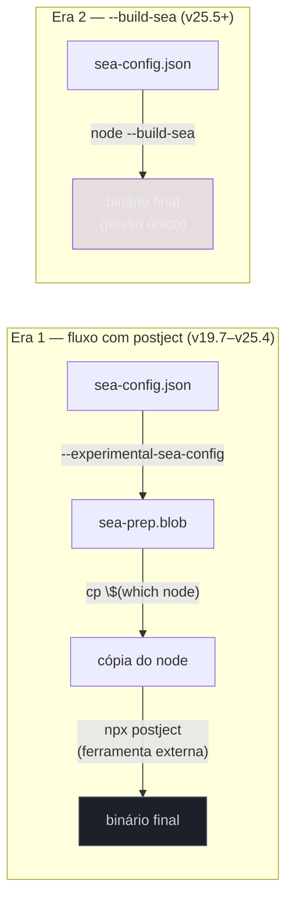
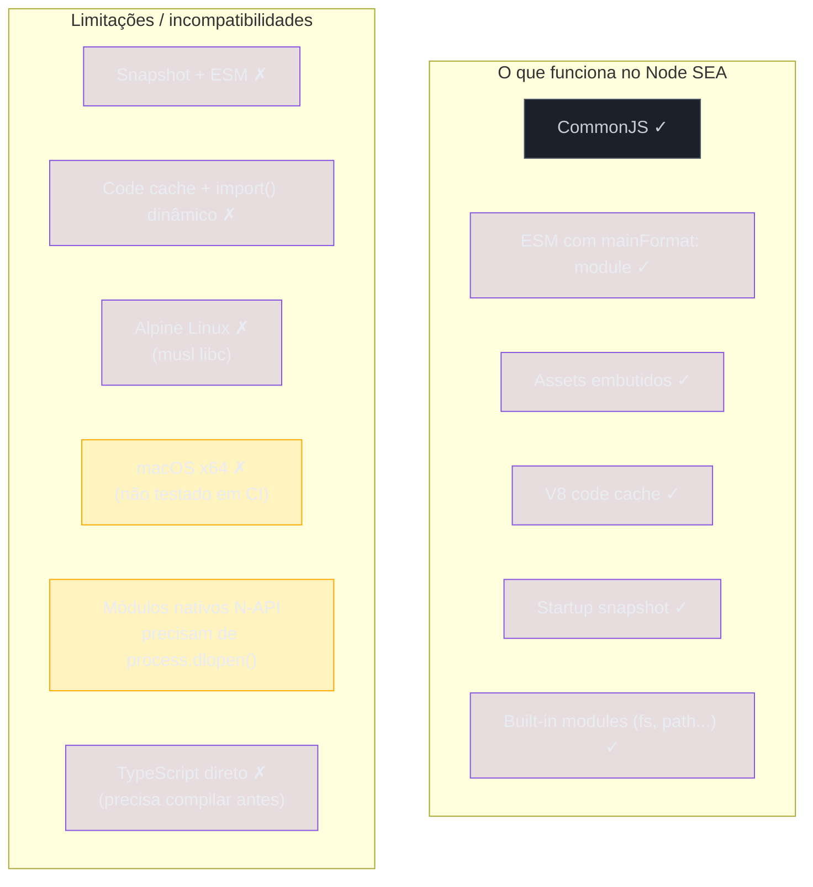
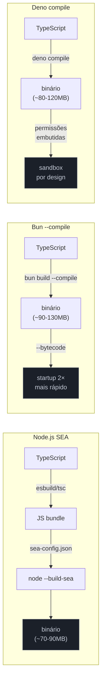
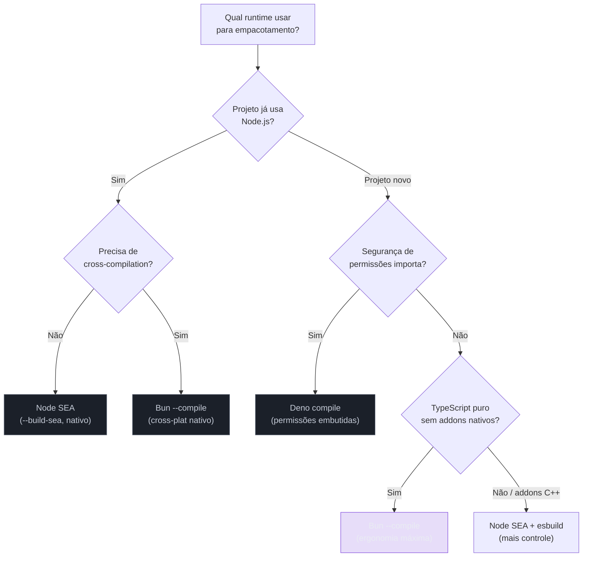
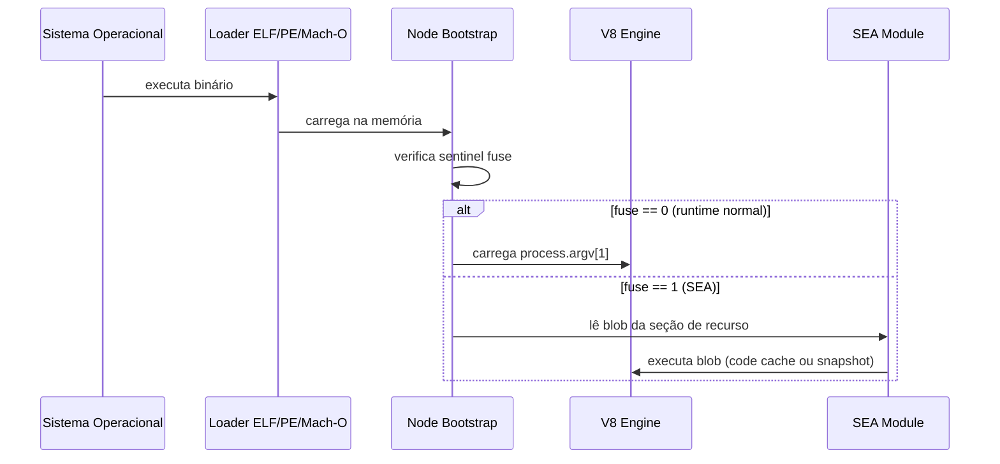
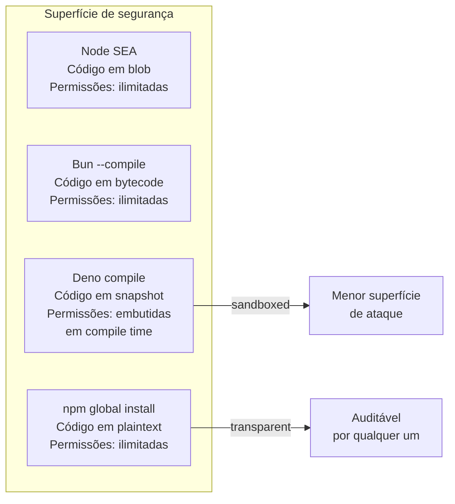

# Single Executable Apps (SEA) e empacotamento

> [!abstract] TL;DR
> Empacotar um app JS/TS num binário único significa que o usuário final executa um arquivo só, sem precisar instalar Node, Bun ou Deno. O Node.js tem suporte nativo desde v19.7 (stability 1.1 — desenvolvimento ativo): gera um blob com `sea-config.json`, injeta no binário com `--build-sea` (Node 25.5+, antigo fluxo usava `postject`). O `pkg` da Vercel foi descontinuado em janeiro de 2024; o fork ativo é `@yao-pkg/pkg`. O Bun oferece `bun build --compile` com cross-compilation nativa e flag `--bytecode` que dobra o startup. O Deno tem `deno compile` desde v1.6, maduro e estável em 2026. Os trade-offs são constantes: o binário carrega o runtime inteiro (~90-130 MB), módulos nativos (N-API) exigem tratamento especial, e assets precisam ser embutidos explicitamente. O caso de uso natural é CLIs distribuídas, scripts internos e ferramentas onde instalar um runtime não é opção.
>
> **Node 24/25 (2026):** o `--build-sea` substituiu `postject` como mecanismo oficial; o SEA ganhou suporte a ESM como `mainFormat`, e a limitação de Alpine (musl libc) ainda persiste na série 22/24 mas foi mitigada com LIEF em 25.x. Deno 2.x compilou para binários menores (~60-90 MB vs ~100 MB na série 1.x). Bun 1.2.x estabilizou a API de cross-compilation e reduziu o overhead de size com compressão LZ4 do snapshot.

---

## O problema: "instala o Node primeiro"

Imagine que você escreveu uma CLI interna para o time de DevOps — uma ferramenta que audita configurações de infraestrutura, gera relatórios e notifica o Slack. Ela funciona perfeitamente no seu ambiente. Agora você precisa distribuir para outros 30 engenheiros da empresa.

O fluxo naïve exige que cada um instale o Node.js, rode `npm install -g sua-cli`, e mantenha a versão certa do runtime sincronizada. Para equipes grandes, isso vira um problema de coordenação. Para ferramentas distribuídas externamente — pense em uma CLI de produto open-source — pedir que o usuário instale um runtime é uma barreira real de adoção.

A solução é empacotar tudo — código, dependências e o próprio runtime — num único binário. O usuário baixa, dá permissão de execução, roda. Sem Node, sem npm, sem `package.json`. É o modelo que Go e Rust sempre ofereceram nativamente, e que o ecossistema JS foi construindo ao longo dos anos.

Existem três caminhos em 2026: o SEA nativo do Node.js, o `bun build --compile`, e o `deno compile`. Cada um tem filosofia e trade-offs diferentes.

---

## O ecossistema antes do SEA nativo: `pkg` e `nexe`

Antes de o Node ter qualquer suporte nativo, dois projetos dominavam esse espaço.

O **`nexe`** foi um dos primeiros (2016), e ainda existe, mas o desenvolvimento é lento e o suporte a versões modernas do Node é inconsistente. Para a maioria dos casos de uso, não é a escolha em 2026.

O **`pkg`** da Vercel foi durante anos o padrão de mercado. Ele compilava o código, resolvia o grafo de dependências, e empacotava junto com um binário pré-compilado do Node. Era poderoso — suportava targets múltiplos, assets embutidos, e tinha boa documentação.

**Janeiro de 2024: o `pkg` foi oficialmente descontinuado.** A Vercel arquivou o repositório, citando que o Node.js nativo (v21+) passou a ter suporte a single executable applications, tornando uma ferramenta externa menos necessária. O último release foi a 5.8.1.

> [!warning] `pkg` ainda aparece em tutoriais antigos
> Se você busca "empacotar Node.js executável" e encontra tutoriais com `vercel/pkg`, verifique a data. O repositório está arquivado. Para projetos novos, use o SEA nativo do Node ou `bun build --compile`. Se precisar absolutamente de `pkg`, o fork mantido pela comunidade é `@yao-pkg/pkg` no npm.

O que a descontinuação do `pkg` sinalizou foi importante: a comunidade convergiu para as soluções nativas de cada runtime. Não mais uma ferramenta de terceiros fazendo mágica com binários do Node — agora cada runtime empacota a si mesmo.

---

## Node.js SEA: o caminho nativo

### História e status atual

O suporte a Single Executable Applications no Node.js chegou oficialmente na v19.7.0 (fevereiro de 2023), também retroportado para v18.16.0. Em 2026, o status é **stability 1.1 — Active development**: funciona para produção, mas a API pode mudar entre versões. Não é `stable` (2) ainda, mas está em uso real em ferramentas de produção.

O processo passou por duas eras:

**Era 1 (v19.7 – v25.4): fluxo com `postject`**

```bash
# 1. Gerar o blob
node --experimental-sea-config sea-config.json
# → cria sea-prep.blob

# 2. Copiar o binário do Node
cp $(which node) ./minha-cli

# 3. Injetar o blob com postject (ferramenta externa)
npx postject minha-cli NODE_SEA_BLOB sea-prep.blob \
  --sentinel-fuse NODE_SEA_FUSE_fce680ab2cc467b6e072b8b5df1996b2

# 4. Assinar (macOS / Windows)
codesign --sign - ./minha-cli           # macOS
signtool sign /fd SHA256 minha-cli.exe  # Windows

# 5. Executar
./minha-cli
```

O `postject` era uma ferramenta separada que injetava um blob de dados como uma seção de recurso no binário ELF (Linux), PE (Windows) ou Mach-O (macOS). Funcionava, mas era um passo extra com dependência externa.

> [!warning] O blob é vinculado à versão exata do Node que o gerou
> O `cp $(which node)` copia **o binário do Node presente naquela máquina** — e o blob gerado com `--experimental-sea-config` só é compatível com essa versão específica. Se o CI usa Node 22 e o dev local usa Node 24, os binários resultantes são diferentes e não intercambiáveis. Isso é intencional: o blob inclui referências ao layout interno de memória do V8 daquela versão.
>
> Na prática, isso significa que cross-compilation no SEA nativo não é possível no fluxo da Era 1 — você precisa rodar o build em cada plataforma-alvo. O CI matrix (um runner por OS) é a solução padrão, e a escolha de versão do Node deve ser fixada no `setup-node@v4` com `node-version: '22'` (ou a versão exata do LTS escolhido). Quem quer cross-compilation sem matrix usa Bun.

**Era 2 (v25.5+, janeiro de 2026): `--build-sea`**

O Node 25.5 trouxe uma mudança significativa de UX: a injeção foi movida para dentro do core do Node. O fluxo agora é:

```bash
# 1. Gerar o executável em um único comando
node --build-sea sea-config.json
# → cria o binário diretamente (sem postject)

# 2. Assinar se necessário (macOS / Windows)
codesign --sign - ./minha-cli
```

A diferença: o `postject` usava WebAssembly para manipular o binário. O `--build-sea` usa LIEF (Library to Instrument Executable Formats), uma biblioteca C++ de manipulação de binários, incorporada ao Node. O overhead no tamanho do executável Node foi de ~5 MB — considerado aceitável.



### A configuração: `sea-config.json`

O `sea-config.json` é o único arquivo de configuração necessário. Veja um exemplo comentado:

```json
{
  "main": "dist/cli.js",
  "output": "minha-cli",
  "mainFormat": "commonjs",
  "useSnapshot": false,
  "useCodeCache": true,
  "disableExperimentalSEAWarning": true,
  "execArgv": ["--no-warnings", "--max-old-space-size=512"],
  "assets": {
    "templates/relatorio.html": "src/templates/relatorio.html",
    "config/defaults.json": "src/config/defaults.json"
  }
}
```

| Campo | O que faz |
|---|---|
| `main` | Arquivo JS de entrada (deve existir — o SEA não roda TypeScript diretamente) |
| `output` | Nome do binário gerado |
| `mainFormat` | `"commonjs"` ou `"module"` (ESM funciona desde Node 22+) |
| `useSnapshot` | V8 startup snapshot — executa o script em build time para acelerar o startup; **incompatível com ESM** |
| `useCodeCache` | Compila o script em build time; **incompatível com `import()` dinâmico** |
| `assets` | Arquivos a embutir no binário, acessíveis via `require('node:sea')` |

> [!warning] O SEA não transpila TypeScript
> O `main` deve apontar para JavaScript compilado — não TypeScript. Você precisa rodar `tsc` ou `esbuild` antes de gerar o SEA. O fluxo completo é: TypeScript → bundle JS → `sea-config.json` → `node --build-sea`.

### Acessando assets embutidos

```javascript
// src/cli.js — acessando assets embutidos com node:sea
const { getAsset, getAssetKeys, isSea } = require('node:sea');

// Verifica se está rodando como SEA
if (isSea()) {
  console.log('Rodando como executável standalone');
}

// Lista todos os assets embutidos
const keys = getAssetKeys(); // ['templates/relatorio.html', 'config/defaults.json']

// Lê um asset como string
const templateHtml = getAsset('templates/relatorio.html', 'utf8');

// Lê um asset como ArrayBuffer (para binários)
const configBuffer = getAsset('config/defaults.json');

// Lê como Blob (útil para passar adiante)
const { getAssetAsBlob } = require('node:sea');
const configBlob = getAssetAsBlob('config/defaults.json', { type: 'application/json' });
```

### Exemplo completo: uma CLI simples com SEA

```bash
# Estrutura do projeto
# src/cli.ts   — TypeScript de entrada
# tsconfig.json
# sea-config.json

# Passo 1: instalar dependências de build
npm install -D typescript esbuild

# Passo 2: compilar TypeScript para um único JS (bundle)
npx esbuild src/cli.ts \
  --bundle \
  --platform=node \
  --target=node22 \
  --format=cjs \
  --outfile=dist/cli.js

# Passo 3: gerar o executável SEA
node --build-sea sea-config.json
# → cria ./minha-cli (ou minha-cli.exe no Windows)

# Passo 4 (macOS): assinar ad-hoc
codesign --sign - ./minha-cli

# Passo 5: testar
./minha-cli --help
```

```json
// sea-config.json — configuração mínima
{
  "main": "dist/cli.js",
  "output": "minha-cli",
  "useCodeCache": true,
  "disableExperimentalSEAWarning": true
}
```

### Limitações do SEA nativo



> [!warning] Módulos nativos (N-API) no SEA
> Addons nativos (.node files, compilados com `node-gyp`) não podem ser embutidos diretamente como módulos — eles precisam estar em disco ou ser carregados via `process.dlopen()` após extração. Se sua CLI depende de `sharp`, `bcrypt` nativo, ou `canvas`, o SEA complica o deployment. Considere versões pure-JS dos pacotes ou Bun/Deno que têm abordagens diferentes.

---

## Bun: `bun build --compile`

O Bun tem a abordagem mais ergonômica para empacotamento standalone. Um único comando faz tudo:

```bash
# Compilar TypeScript direto para binário standalone
bun build src/cli.ts --compile --outfile minha-cli

# Com otimizações de produção recomendadas
bun build src/cli.ts \
  --compile \
  --minify \
  --bytecode \
  --sourcemap=external \
  --outfile minha-cli
```

O `--bytecode` é especialmente interessante: ele compila o JavaScript para bytecode JavaScriptCore em build time, o que **dobra a velocidade de startup** do executável. Para CLIs onde latência de inicialização é perceptível (~8ms → ~4ms), é uma flag que vale sempre usar.

### Cross-compilation nativa

Uma vantagem significativa do Bun sobre o Node SEA: compilação cruzada sem precisar de uma máquina do sistema-alvo.

```bash
# No macOS ARM64, compilar para Linux x64
bun build src/cli.ts --compile \
  --target=bun-linux-x64 \
  --outfile minha-cli-linux-x64

# Para Windows ARM64
bun build src/cli.ts --compile \
  --target=bun-windows-arm64 \
  --outfile minha-cli-windows-arm64.exe

# Targets disponíveis em 2026:
# bun-linux-x64, bun-linux-x64-baseline, bun-linux-arm64
# bun-linux-x64-musl (Alpine), bun-linux-arm64-musl
# bun-windows-x64, bun-windows-arm64
# bun-darwin-x64, bun-darwin-arm64
```

O Node SEA não tem cross-compilation nativa — você precisa rodar em cada plataforma-alvo ou usar CI matrix.

### Embutindo assets no Bun

```typescript
// Sintaxe com import attributes — embutido no binário
import configTemplate from "./templates/config.json" with { type: "file" };
import iconPng from "./assets/icon.png" with { type: "file" };

// Em runtime, o import retorna um path interno ao binário — NÃO extrai para tmpdir
// O Bun usa um filesystem virtual interno chamado "$bunfs"
console.log(configTemplate); // "$bunfs/root/templates/config-a1b2c3d4.json"

// SQLite embutido — o banco pode ser embutido no binário
import dbPath from "./data/seed.db" with { type: "file", embed: "true" };
```

O ponto crítico: o Bun **não extrai assets para um diretório temporário em disco**. Em vez disso, usa um filesystem virtual interno (`$bunfs`) — o path retornado pelo import é um path virtual que o Bun sabe resolver internamente em memória. Para um banco SQLite de 50 MB embutido, o custo de "extração" é zero; a leitura acontece direto do binário. A limitação é que APIs que exigem um path de disco real (como `fs.open()` ou SQLite via `better-sqlite3`) recebem o path `$bunfs/...` — alguns drivers aceitam, outros não. Para SQLite embutido o padrão mais confiável é usar o driver nativo do Bun (`bun:sqlite`), que entende o path virtual.

```bash
# Ver os assets embutidos em runtime
# Bun.embeddedFiles retorna os arquivos (exceto código-fonte)
```

> [!warning] Tamanho do binário — ainda está crescendo
> O Bun admite explicitamente na documentação que "o binário ainda é muito grande e precisamos diminuí-lo". Um executável compilado com `bun build --compile` carrega o runtime Bun completo — aproximadamente 80-130 MB dependendo da plataforma e da versão. Comparar com Go (3-10 MB) ou Rust (3-8 MB) é inevitável. O `--minify` e `--bytecode` ajudam no startup mas não reduzem o tamanho do runtime embutido.

### Pipeline completo com Bun

```bash
# ─── Pipeline de distribuição multi-plataforma ─────────────────────────────

# Compilar para todas as plataformas em paralelo
bun build src/cli.ts --compile --minify --bytecode \
  --target=bun-linux-x64   --outfile dist/minha-cli-linux-x64 &
bun build src/cli.ts --compile --minify --bytecode \
  --target=bun-darwin-arm64 --outfile dist/minha-cli-darwin-arm64 &
bun build src/cli.ts --compile --minify --bytecode \
  --target=bun-windows-x64 --outfile dist/minha-cli-windows-x64.exe &
wait

# Verificar tamanhos
ls -lh dist/
# minha-cli-linux-x64       ~92MB
# minha-cli-darwin-arm64    ~88MB
# minha-cli-windows-x64.exe ~97MB

# Empacotar para distribuição
tar czf minha-cli-linux-x64.tar.gz -C dist minha-cli-linux-x64
zip dist/minha-cli-windows.zip dist/minha-cli-windows-x64.exe
```

---

## Deno: `deno compile`

O Deno tem suporte a compilação standalone desde v1.6 (dezembro de 2020) — o mais antigo dos três runtimes nessa feature. Em 2026, é a opção mais madura do ponto de vista de estabilidade e documentação.

```bash
# Compilar para o sistema atual
deno compile --allow-net --allow-read src/cli.ts
# → cria ./cli (ou cli.exe no Windows)

# Com output customizado
deno compile --output minha-cli src/cli.ts

# Cross-compilation
deno compile --target x86_64-unknown-linux-gnu \
  --output minha-cli-linux src/cli.ts

# Targets disponíveis:
# x86_64-unknown-linux-gnu
# aarch64-unknown-linux-gnu
# x86_64-pc-windows-msvc
# x86_64-apple-darwin
# aarch64-apple-darwin

# Com minificação e menos dependências externas
deno compile --bundle --minify --output minha-cli src/cli.ts
```

Uma característica única do Deno: as **permissões são embutidas no binário**. Quando você compila, especifica o que o executável pode fazer:

```bash
# Executável que só pode ler arquivos e fazer chamadas HTTP para um domínio específico
deno compile \
  --allow-read=/etc/config \
  --allow-net=api.minha-empresa.com \
  --output minha-cli \
  src/cli.ts
```

Isso é interessante do ponto de vista de segurança para distribuição: o usuário final executa um binário que não pode fazer mais do que o especificado em build time. Para ferramentas corporativas com requisitos de compliance, esse modelo de permissões é um argumento real.



---

## Comparação: Node SEA vs Bun vs Deno



| Aspecto | Node SEA | Bun `--compile` | Deno `compile` |
|---|---|---|---|
| Maturidade | Stability 1.1 (active dev) | Produção, ativo | Estável, mais antigo |
| TypeScript direto | Não (precisa compilar) | Sim | Sim |
| Cross-compilation | Não nativa | Sim (todos os targets) | Sim (targets principais) |
| Permissões embutidas | Não | Não | Sim |
| Startup snapshot | Sim (`useSnapshot`) | `--bytecode` (2×) | Não |
| Assets embutidos | Sim (`assets` no config) | Sim (import attributes) | Sim (embutido) |
| Módulos nativos | Via `process.dlopen()` | Via `.node` embutido | Limitado |
| Tamanho binário | ~70-90 MB | ~90-130 MB | ~80-120 MB |
| Alpine Linux | Não | Sim (musl variant) | Sim |
| Ecossistema | npm completo | npm completo | npm + JSR |

---

## Quando vale empacotar (e quando não vale)

### Casos onde empacotamento faz sentido

**CLIs de distribuição externa.** Uma ferramenta open-source que desenvolvedores instalam em suas máquinas. Pedir `npm install -g` é razoável para devs; pedir para um usuário de marketing que vai usar uma CLI de relatórios instalar Node é uma barreira real. Binários resolvem isso.

**Scripts internos de operações.** Ferramentas de DevOps distribuídas para máquinas de produção, containers mínimos, ou sistemas legados onde você não controla qual versão de Node (se alguma) está instalada.

**Ambientes com restrições de instalação.** Alguns ambientes corporativos bloqueiam `npm install` ou não têm acesso à internet. Um binário copiado por SCP passa onde um `npm install` falha.

**Proteção parcial de código-fonte.** O SEA e o `bun build --compile` embutem o código numa forma que não é trivialmente legível. Não é ofuscação séria — o código pode ser extraído por quem sabe o que está fazendo — mas impede leitura casual.

### Casos onde empacotamento complica mais do que ajuda

**Aplicações servidor com deploy em container.** Se você já tem um `Dockerfile`, empacotar para SEA adiciona complexidade sem benefício. O container já isola o runtime.

**Ferramentas com módulos nativos pesados.** Se seu projeto usa `sharp`, `canvas`, ou drivers nativos de banco que compilam com `node-gyp`, o empacotamento fica complicado. Esses módulos esperam estar em disco, com arquivos auxiliares. Embutir e extrair em runtime é possível mas trabalhoso.

**Equipes que já controlam o ambiente de execução.** Se todos os desenvolvedores têm Node instalado e você tem um orquestrador que gerencia versões (como mise/fnm — ver [[04 - Gerenciando versões de Node]]), o overhead de empacotar não tem contrapartida.

> [!warning] Tamanho não é opcional — é uma decisão de distribuição
> Um binário standalone de 100 MB é grande para um download, mas pequeno para um container de produção. A mesma CLI pode ser distribuída como binário para dev boxes e como container (sem SEA) para produção. Não existe resposta única — depende de quem vai usar e de onde.

---

## Armadilhas comuns

> [!warning] Armadilha 1: esquecer de compilar TypeScript antes do SEA nativo
> O `sea-config.json` aponta para JavaScript, não TypeScript. Se você apontar para um `.ts`, o Node vai reclamar do tipo de arquivo. O pipeline correto é: `tsc`/`esbuild` → `.js` → `--build-sea`. O Bun e Deno fazem essa transpilação automaticamente.

> [!warning] Armadilha 2: `require()` dentro do SEA não encontra `node_modules`
> Por padrão, o módulo loader do SEA só resolve built-ins do Node. Para carregar módulos de terceiros, você precisa bundlar tudo num único arquivo antes (com esbuild, por exemplo). O `bun build --compile` faz isso automaticamente; o SEA nativo exige que você faça o bundle separado.

> [!warning] Armadilha 3: `__filename` e `__dirname` se comportam diferente
> Dentro de um SEA, `__filename` é igual a `process.execPath` (o caminho do próprio binário) e `__dirname` é o diretório onde o binário está. Se seu código usa `__dirname` para encontrar arquivos relativos ao projeto (como configs ou templates), eles não estarão lá — precisam ser embutidos como assets.

> [!warning] Armadilha 4: Alpine Linux quebra o Node SEA
> Containers Alpine usam musl libc em vez de glibc. O Node SEA (com LIEF) não é suportado em Alpine. Se seu pipeline de CI roda em Alpine (comum com images `node:alpine`), o `node --build-sea` vai falhar. Use images `node:slim` (Debian) para a etapa de build do SEA. O Bun tem variante `musl` explícita que funciona em Alpine.

> [!warning] Armadilha 5: snapshot V8 não funciona com ESM
> O `useSnapshot: true` no `sea-config.json` — que pré-executa o módulo em build time para acelerar o startup — é incompatível com `mainFormat: "module"`. Se seu código usa ESM (`import`/`export`), ou não usa snapshot, ou migra para CJS na saída do bundler.

---

## Profundidade técnica: o que acontece por dentro do SEA

### A anatomia do blob e do sentinel fuse

Quando o Node gera um SEA, o código do usuário — depois de bundlado — é serializado como um blob e embutido no binário do Node como uma seção de recurso do formato executável da plataforma:

- **Linux (ELF):** seção `.note` — exige `readelf -n` para inspecionar
- **Windows (PE/COFF):** recurso do tipo `RT_RCDATA` com nome `NODE_SEA_BLOB`
- **macOS (Mach-O):** seção `__TEXT,__node_sea` no segment correspondente

O **sentinel fuse** (`NODE_SEA_FUSE_fce680ab2cc467b6e072b8b5df1996b2`) é um marcador de 40 bytes que existe no binário do Node vanilla com o bit de fuse desligado. Ao injetar o blob (tanto via `postject` quanto via `--build-sea`), o bit é ligado. Quando o Node inicia, ele verifica esse fuse antes de carregar o V8 — se estiver ligado, redireciona o bootstrap para o blob embutido ao invés de `process.argv[1]`. Isso é o que permite o mesmo binário do Node funcionar como SEA ou como runtime normal.



### V8 startup snapshot vs. code cache: a diferença que importa

São dois mecanismos diferentes e frequentemente confundidos:

**Code cache (`useCodeCache: true`):** o V8 compila o script em tempo de build (parse + bytecode compilation) e grava o resultado. Em runtime, o V8 pula a fase de compilação e executa o bytecode diretamente. Ganho típico: 20-40% de redução no startup. **Restrição:** incompatível com `import()` dinâmico, pois o grafo de módulos não é completamente conhecido em build time.

**V8 startup snapshot (`useSnapshot: true`):** vai além. Executa o módulo principal em build time, grava o estado completo do heap V8 (objetos, closures, protótipos inicializados) como snapshot. Em runtime, o heap é restaurado diretamente — o código não é nem re-executado. Ganho típico: 60-80% de redução no startup para apps que fazem muito trabalho de inicialização (parsing de config, construção de árvores de objetos). **Restrições severas:** incompatível com ESM, com código que usa `Date.now()` ou `Math.random()` na inicialização, com timers, e com qualquer side effect que dependa do ambiente de execução.

O ambiente de execução durante a geração do snapshot é **deliberadamente restrito**: `require()` e `import` só conseguem carregar módulos built-in do Node (como `path`, `fs`, `os`). Tentativas de carregar módulos de `node_modules` via `require()` simples falham — é preciso criar um require customizado via `module.createRequire()`. Acesso à rede não é bloqueado pelo Node, mas qualquer resultado de chamada HTTP feita no `init` fica congelado no snapshot — o que raramente é o que você quer. A regra prática é: **o código no topo do módulo deve ser puro — sem I/O, sem rede, sem randomicidade, sem timestamps**. Tudo isso deve ser movido para dentro das funções que rodam sob demanda, após o startup.

```
┌─────────────────────────────────────────────────────────────┐
│  Hierarquia de velocidade de startup                        │
├────────────────────┬────────────┬────────────────────────── │
│ Configuração       │ Startup    │ Limitações                │
├────────────────────┼────────────┼────────────────────────── │
│ Sem otimização     │ ~35ms      │ nenhuma                   │
│ useCodeCache       │ ~22ms      │ sem import() dinâmico     │
│ useSnapshot        │ ~8ms       │ sem ESM, sem side effects │
│ Bun --bytecode     │ ~4ms       │ JavaScriptCore only       │
└────────────────────┴────────────┴────────────────────────── ┘
(valores típicos para uma CLI simples; variam com o tamanho do app)
```

### Módulos nativos (N-API): o problema que não some

Addons nativos (`.node` files compilados com `node-gyp`) são shared libraries do sistema operacional. Eles não podem ser embutidos no blob do SEA como arquivos de dados — o sistema operacional precisa carregá-los via `dlopen`/`LoadLibrary`, e isso exige um path em disco.

A estratégia padrão para SEAs com addons nativos é extrair os `.node` files para um diretório temporário em runtime e carregá-los com `process.dlopen()`:

```javascript
// Estratégia de extração de addon nativo dentro de um SEA
const { getAsset } = require('node:sea');
const os = require('node:os');
const path = require('node:path');
const fs = require('node:fs');

function loadNativeAddon(addonName) {
  // Extrai o .node para um temp dir
  const addonBuffer = getAsset(`addons/${addonName}.node`);
  const tempPath = path.join(os.tmpdir(), `sea-addon-${process.pid}-${addonName}.node`);
  fs.writeFileSync(tempPath, Buffer.from(addonBuffer));

  // Carrega dinamicamente
  const addon = {};
  process.dlopen(addon, tempPath);

  // Limpa ao sair (opcional — o OS limpa no exit de qualquer forma)
  process.on('exit', () => {
    try { fs.unlinkSync(tempPath); } catch {}
  });

  return addon.exports;
}

// Uso
const sharp = loadNativeAddon('sharp');
```

> [!warning] Extração de `.node` files para `tmpdir` tem implicações de segurança
> Em ambientes com proteções de execução em `/tmp` (noexec mount), a extração vai falhar silenciosamente ou com erro de permissão. Em ambientes corporativos com hardening de sistema, sempre verifique se `/tmp` é executável. A alternativa é extrair para o mesmo diretório do binário (`path.dirname(process.execPath)`), mas isso pode falhar se o diretório for read-only (como `/usr/local/bin`).

O Bun tem uma abordagem diferente: ele suporta embutir arquivos `.node` diretamente no binário e usa um mecanismo interno para extraí-los automaticamente em runtime, sem que o código do usuário precise fazer nada. Essa é uma das vantagens práticas do Bun para apps com addons nativos.

### Code signing: o que realmente acontece

Assinar o binário SEA é obrigatório no macOS (sem assinatura, o Gatekeeper bloqueia) e fortemente recomendado no Windows (sem assinatura, o SmartScreen alerta). Mas assinar um SEA tem uma pegadinha: você modifica o binário (injetando o blob) *depois* de ter obtido o binário do Node, que já vem assinado pela equipe do Node.js. Ao modificar, a assinatura original é invalidada.

O fluxo correto é diferente dependendo da era:

**Era 1 (postject):** como o `postject` é uma ferramenta externa que manipula o binário diretamente, ele não sabe lidar com a assinatura existente. Por isso o `codesign --remove-signature` era obrigatório *antes* da injeção — o binário copiado do Node ainda carrega a assinatura da equipe do Node.js, e o `postject` falhava ou corromperia a seção assinada sem a remoção prévia.

**Era 2 (`--build-sea`, Node 25.5+):** o `--build-sea` usa LIEF internamente e **remove a assinatura automaticamente** antes de injetar o blob. O passo `codesign --remove-signature` não é mais necessário para a injeção. Você ainda precisa re-assinar o binário final com sua identidade de desenvolvedor (Apple ou Windows), mas isso é para distribuição — não para viabilizar a injeção.

```bash
# Era 2 — fluxo completo com --build-sea (Node 25.5+)

# 1. Gerar o executável (remoção de assinatura anterior é automática)
node --build-sea sea-config.json

# 2. Re-assinar com sua identidade de desenvolvedor
# Ad-hoc (sem conta de desenvolvedor Apple — local only):
codesign --sign - ./minha-cli

# Com certificado Developer ID (distribuição via Gatekeeper):
codesign --sign "Developer ID Application: Nome Sobrenome (TEAM_ID)" \
  --entitlements entitlements.plist \
  --options runtime \
  ./minha-cli

# 3. Notarizar para distribuição pública (macOS 10.15+)
xcrun notarytool submit ./minha-cli.zip \
  --apple-id "seu@email.com" \
  --password "app-specific-password" \
  --team-id TEAM_ID \
  --wait
```

No Windows, o processo é análogo com `signtool.exe` da Windows SDK. Sem um certificado EV (Extended Validation), o SmartScreen vai exibir aviso mesmo com a assinatura — o sistema de reputação da Microsoft leva tempo para reconhecer novos certificados.

---

## Profundidade: distribuição cross-platform de verdade

A ergonomia de empacotar é uma coisa; distribuir para múltiplas plataformas é outra. O que os projetos maduros fazem:

### GitHub Releases + goreleaser-style para Node/Bun

O padrão de distribuição de CLIs em Go (goreleaser) pode ser replicado para SEAs:

```yaml
# .github/workflows/release.yml
name: Release
on:
  push:
    tags: ['v*']

jobs:
  build:
    strategy:
      matrix:
        include:
          # Node SEA — precisa de cada plataforma
          - os: ubuntu-latest
            target: linux-x64
            binary: minha-cli-linux-x64
          - os: macos-14
            target: darwin-arm64
            binary: minha-cli-darwin-arm64
          - os: windows-latest
            target: win32-x64
            binary: minha-cli-windows-x64.exe

    runs-on: ${{ matrix.os }}
    steps:
      - uses: actions/checkout@v4
      - uses: actions/setup-node@v4
        with: { node-version: '22' }
      - run: npm ci && npm run build:sea
      - uses: actions/upload-artifact@v4
        with:
          name: ${{ matrix.binary }}
          path: ${{ matrix.binary }}

  # Bun — um job só basta para todos os targets
  build-bun:
    runs-on: ubuntu-latest
    steps:
      - uses: actions/checkout@v4
      - uses: oven-sh/setup-bun@v2
      - run: |
          bun build src/cli.ts --compile --minify --bytecode \
            --target=bun-linux-x64    --outfile dist/minha-cli-linux-x64
          bun build src/cli.ts --compile --minify --bytecode \
            --target=bun-darwin-arm64 --outfile dist/minha-cli-darwin-arm64
          bun build src/cli.ts --compile --minify --bytecode \
            --target=bun-windows-x64 --outfile dist/minha-cli-windows.exe

  release:
    needs: [build, build-bun]
    runs-on: ubuntu-latest
    steps:
      - uses: actions/download-artifact@v4
      - uses: softprops/action-gh-release@v2
        with:
          files: |
            minha-cli-linux-x64
            minha-cli-darwin-arm64
            minha-cli-windows-x64.exe
```

**O assimetria de CI é real:** o Node SEA exige matriz de CI (um runner por plataforma); o Bun compila tudo de um runner Linux. Para projetos com budget limitado de CI, essa diferença de 3 jobs vs 1 job importa.

### Distribuição via shell script (o padrão curl | sh)

```bash
#!/bin/sh
# install.sh — detector de plataforma para download do binário correto
set -e

REPO="minha-org/minha-cli"
VERSION="${1:-latest}"

OS=$(uname -s | tr '[:upper:]' '[:lower:]')
ARCH=$(uname -m)

case "$ARCH" in
  x86_64) ARCH="x64" ;;
  aarch64|arm64) ARCH="arm64" ;;
  *) echo "Arquitetura $ARCH não suportada" && exit 1 ;;
esac

if [ "$OS" = "darwin" ]; then
  BINARY="minha-cli-darwin-${ARCH}"
elif [ "$OS" = "linux" ]; then
  BINARY="minha-cli-linux-${ARCH}"
else
  echo "Windows: baixe o .exe em https://github.com/$REPO/releases"
  exit 1
fi

BASE_URL="https://github.com/$REPO/releases/download/$VERSION"
curl -fsSL "$BASE_URL/$BINARY" -o /usr/local/bin/minha-cli
chmod +x /usr/local/bin/minha-cli
echo "Instalado: $(minha-cli --version)"
```

Esse padrão é o que ferramentas como Bun, Deno, mise e fnm usam em seus próprios instaladores. A vantagem: o usuário roda um curl, o script detecta a plataforma, baixa o binário certo. Zero dependências de runtime.

---

## Novidade: estado do SEA em Node 24/25 e Deno 2.x (2026)

### Node 24 (abril 2025) e 25 (outubro 2025)

**Node 24** não trouxe mudanças arquiteturais no SEA, mas estabilizou o suporte a `mainFormat: "module"` (ESM) — que estava documentado mas com bugs em 22/23. A grande ressalva: `useSnapshot` com ESM ainda é incompatível e provavelmente continuará sendo, porque snapshots V8 exigem um grafo de módulos estático conhecido em build time, o que ESM com `import()` dinâmico viola por design.

**Node 25.5 (janeiro 2026):** mudança de maior impacto — eliminação do `postject`. O `--build-sea` passou a ser o único mecanismo suportado. O `postject` ainda funciona como ferramenta externa (o npm package não foi removido), mas a documentação oficial o marcou como legado. A transição para LIEF resolveu um problema histórico: o `postject` usava WebAssembly internamente para manipular binários, o que causava falhas intermitentes em ambientes com políticas de segurança que bloqueavam a execução de WASM em child processes.

> [!info] Fonte: Node.js CHANGELOG v25.5.0
> A PR #57038 adicionou o `--build-sea` e marcou o fluxo `postject` como legado. A PR anterior #56463 adicionou o LIEF como dependência. Ambas são de Janeiro de 2026. [Node.js v25.5.0 Changelog](https://nodejs.org/en/blog/release/v25.5.0)

**Node 24 LTS (out/2025)** é a versão de suporte longo da série 24 — ainda usa `postject` como mecanismo padrão nos docs, pois `--build-sea` chegou no 25.5. Para projetos em produção que usam LTS e querem o novo fluxo, a recomendação prática é: use `postject` em 22/24, use `--build-sea` em 25+.

### Deno 2.x: binários menores e `deno compile` mais poderoso

O Deno 2.0 (lançado em outubro de 2024) trouxe mudanças significativas no `deno compile`:

- **Binários menores:** a série 2.x reduziu o tamanho do runtime embutido de ~100 MB para ~60-90 MB com compressão LZ4 do snapshot V8. O Deno embedda o runtime Rust (Tokio + V8) + Deno APIs, mas passou a excluir partes do runtime que não são usadas pela aplicação (dead code elimination do lado do runtime, não só do JS do usuário).
- **Suporte a npm completo no `deno compile`:** no Deno 1.x, `deno compile` com pacotes npm era experimental e frequentemente quebrava. No Deno 2.x, a compatibilidade npm é estável — você pode compilar apps que usam pacotes npm normais (via `npm:` specifiers) para um binário standalone.
- **Workers embutidos:** `deno compile` agora suporta `new Worker()` com módulos embutidos no binário — antes, os workers tentavam carregar arquivos do disco (que não existiriam no binário distribuído).

> [!info] Fonte: Deno 2.0 release notes
> [Deno 2.0 é estável](https://deno.com/blog/v2.0) — outubro de 2024. Compatibilidade npm e `deno compile` melhorado documentados em [Deno compile reference](https://docs.deno.com/runtime/reference/cli/compile/).

### Bun 1.2.x: cross-compilation estabilizada

O Bun 1.2 (fevereiro de 2025) estabilizou a API de cross-compilation e adicionou:

- **Target `bun-linux-x64-musl` e `bun-linux-arm64-musl`:** Alpine Linux finalmente suportado, ao contrário do Node SEA.
- **`--windows-icon` e `--windows-hide-console`:** flags para customização do executável Windows (ícone personalizado, supressão da janela de console para apps GUI-like).
- **Redução de tamanho:** compressão do snapshot JavaScriptCore com LZ4 + remoção de partes não usadas do runtime, levando o binário de ~130 MB para ~80-100 MB nos benchmarks típicos.

> [!info] Fonte: Bun 1.2 release blog
> [Bun 1.2](https://bun.sh/blog/bun-v1.2) — fevereiro de 2025. Documentação de `--compile` em [bun.sh/docs/bundler/executables](https://bun.sh/docs/bundler/executables).

---

## Trade-offs sênior: o que a entrevista quer ouvir

Em entrevistas de nível sênior, as perguntas sobre SEA costumam ser sobre trade-offs de arquitetura, não sobre sintaxe. O que saber responder:

### "Por que não usar SEA para tudo?"

**Tamanho por instância vs. overhead de instalação de runtime:**

Um container Docker com Node 22 slim é ~150 MB de imagem base. Um SEA é ~80-100 MB por binário. Se você tem 10 CLIs internas, com containers você compartilha a layer do Node entre todas; com SEA cada CLI carrega seu próprio runtime. Para distribuição interna via containers, o overhead de layer sharing do Docker frequentemente torna os containers mais econômicos que SEAs por instância.

A math muda quando o target é desenvolvimento local ou máquinas sem Docker — lá, o SEA é quase sempre menor em overhead total (vs. "instala Node, instala npm, instala pacotes globais").

### "Como você gerencia atualizações de segurança no runtime embutido?"

Esse é o ponto de atrito principal. Quando sai um CVE no Node (ex: vulnerabilidade no HTTP parser), apps distribuídas como containers se atualizam trocando a imagem base. Apps distribuídas como SEA precisam:

1. O desenvolvedor recompila o SEA com a nova versão do Node
2. Publica um novo release
3. Os usuários atualizam manualmente (ou via mecanismo de auto-update que você precisou implementar)

Não existe equivalente automático ao `docker pull`. Para CLIs internas, isso é geralmente aceitável. Para ferramentas de terceiros distribuídas externamente, você precisa de um mecanismo de auto-update (similar ao que o VS Code, Bun e Deno fazem internamente).

### "Como lidar com startup time em CLIs que chamam código pesado?"

A cadeia de otimização de startup para um SEA Node, do mais simples ao mais agressivo:

```
1. useCodeCache: true         → pula compilação JS (mais simples, seguro)
2. useSnapshot: true          → pré-executa inicialização (requer CJS, sem side effects)
3. Lazy loading de módulos    → `require()` só quando necessário, não no topo
4. Tree shaking no bundle     → esbuild/rollup remove código morto antes do SEA
5. Minimizar trabalho no init → defer parsing de config, argparse, etc.
```

Um erro comum: usar `useSnapshot` em código que chama `Date.now()` ou acessa variáveis de ambiente no módulo top-level. O snapshot é gerado em build time, então esses valores ficam congelados no snapshot — a CLI sempre vai mostrar a data do build, não de execução.

### "Qual é a superfície de segurança de um SEA vs. um npm package?"

Um SEA tem o código embutido em bytecode/blob — não é trivialmente legível. Um npm package tem `node_modules` em plaintext. Para proteção de propriedade intelectual, o SEA é melhor, mas:

1. O blob pode ser extraído do binário com ferramentas como `readelf` (Linux) ou Resource Hacker (Windows)
2. O bytecode V8 pode ser decompilado parcialmente — não é proteção séria
3. Se o adversário tem acesso ao binário e motivação, o código pode ser recuperado

O modelo de segurança do Deno (permissões embutidas no binário) é diferente: o binário não pode fazer mais do que foi especificado em build time, independentemente de como é explorado. Isso é relevante para ferramentas corporativas onde você quer garantir que a CLI nunca vai exfiltrar dados para endpoints não autorizados.



---

## Como explicar em inglês

Single Executable Applications let you distribute a JavaScript or TypeScript CLI as a self-contained binary — no Node, Bun, or Deno installation required on the target machine.

In Node.js, the native SEA feature (stability 1.1, added in v19.7) works by compiling your script, embedding it as a blob into a copy of the Node binary, and injecting it via the new `--build-sea` flag (Node 25.5+) or the older `postject` tool. The `sea-config.json` file controls the entry point, assets to embed, and startup optimization options like V8 snapshots and code cache.

`vercel/pkg` — historically the most popular packaging tool — was officially deprecated in January 2024, as Node's native SEA made it redundant. The community fork is `@yao-pkg/pkg`.

Bun's `--compile` flag (`bun build ./cli.ts --compile --outfile my-cli`) is arguably the smoothest experience: TypeScript is bundled and compiled directly, cross-compilation targets are built-in (`--target=bun-linux-x64` on a Mac), and the `--bytecode` flag pre-compiles to JavaScriptCore bytecode for 2× startup speed.

Deno's `deno compile` is the most mature — available since v1.6 — and has a security-centric twist: permissions are embedded at compile time, so the binary cannot do more than what was explicitly granted during the build.

Key trade-offs in interviews: all three runtimes produce binaries of 80-130 MB because they embed the full runtime. Native addons (N-API, `.node` files) require special handling — they can't simply be bundled. Assets (config files, templates, images) must be explicitly embedded or will be missing in the packaged binary.

| Português | Inglês |
|---|---|
| executável standalone | standalone executable / self-contained binary |
| empacotamento | packaging / bundling into an executable |
| injeção de blob | blob injection |
| módulo nativo / addon nativo | native addon / N-API module |
| asset embutido | embedded asset |
| compilação cruzada | cross-compilation |
| tempo de inicialização | startup time / cold start |
| assinatura de código | code signing |
| cache de código V8 | V8 code cache |
| snapshot de inicialização | startup snapshot |

---

## O que vem a seguir

Empacotar um binário resolve *onde* o app roda. A próxima dimensão é *como* ele é construído de forma reproduzível — o mesmo input, o mesmo output, em qualquer máquina. Isso é o território de builds determinísticos, CI e gestão de artefatos, que a nota seguinte cobre.

- [[23 - Build em produção, CI e determinismo]] — lockfiles, cache de build, pipelines reproduzíveis; inclui estratégias de CI matrix para SEA multi-plataforma
- [[20 - Bun como runtime e toolkit all-in-one]] — `bun build --compile` no contexto do toolkit all-in-one; bundler, runtime e test runner num só binário
- [[04 - Gerenciando versões de Node]] — nvm/fnm/Volta/mise; quando o controle de versão de runtime é suficiente e o empacotamento é desnecessário
- [[18 - O runtime como ferramenta de DX]] — `--watch`, `--env-file`, TypeScript nativo; o runtime como ferramenta antes de chegar ao empacotamento
- [[14 - Rollup, esbuild e Rolldown]] — bundlers que preparam o JS para o SEA; `esbuild --bundle --platform=node` é o passo que antecede o `node --build-sea`
- [[08 - Transpilação e targets]] — targets de compilação TypeScript → JavaScript; o `--target=node22` no esbuild mapeia para o motor V8 da versão alvo
- [[17 - Otimização de bundle]] — tree shaking e code splitting; técnicas que reduzem o tamanho do JS antes de embutir no SEA
- [[24 - Supply chain e segurança de dependências]] — auditoria de dependências; addons nativos N-API são surface de ataque relevante em SEAs
- [[index|trilha Tooling e Build]] — visão geral da trilha

---

## Veja também

- [[14 - Rollup, esbuild e Rolldown]] — o bundler que transforma TypeScript em CJS/ESM antes do SEA
- [[20 - Bun como runtime e toolkit all-in-one]] — cross-compilation e `--bytecode` no contexto amplo do Bun
- [[23 - Build em produção, CI e determinismo]] — CI matrix para builds cross-platform
- [[24 - Supply chain e segurança de dependências]] — riscos de addons nativos no pipeline de empacotamento

---

## Referências

- **Node.js Core Docs** — [*Single executable applications*](https://nodejs.org/api/single-executable-applications.html) — documentação oficial, referência para status, API `node:sea`, flags e limitações
- **Joyee Cheung** — [*Improving Single Executable Application Building for Node.js*](https://joyeecheung.github.io/blog/2026/01/26/improving-single-executable-application-building-for-node-js/) — post detalhado sobre o `--build-sea` (Node 25.5), histórico de `postject` e migração para LIEF
- **Node.js v25.5.0 Changelog** — [*nodejs.org/en/blog/release/v25.5.0*](https://nodejs.org/en/blog/release/v25.5.0) — PRs #57038 e #56463: introdução do `--build-sea` e LIEF como dependência oficial
- **Bun Docs** — [*Single-file executable*](https://bun.sh/docs/bundler/executables) — documentação oficial do `bun build --compile`, cross-compilation, assets, `--bytecode`, targets musl
- **Bun 1.2 release blog** — [*bun.sh/blog/bun-v1.2*](https://bun.sh/blog/bun-v1.2) — Alpine Linux support, redução de tamanho de binário, `--windows-icon`
- **Deno Docs** — [*deno compile*](https://docs.deno.com/runtime/reference/cli/compile/) — referência do `deno compile`, permissões embutidas, targets, Workers embutidos
- **Deno 2.0 release blog** — [*deno.com/blog/v2.0*](https://deno.com/blog/v2.0) — compatibilidade npm estável, binários menores, melhorias no `deno compile`
- **Vercel/pkg GitHub** — [*vercel/pkg (archived)*](https://github.com/vercel/pkg) — repositório arquivado, nota de descontinuação oficial (janeiro 2024)
- **@yao-pkg/pkg** — [*npmjs.com/package/@yao-pkg/pkg*](https://www.npmjs.com/package/@yao-pkg/pkg) — fork ativo mantido pela comunidade
- **LIEF project** — [*lief.re*](https://lief.re/) — Library to Instrument Executable Formats; base da manipulação de binários no `--build-sea`
