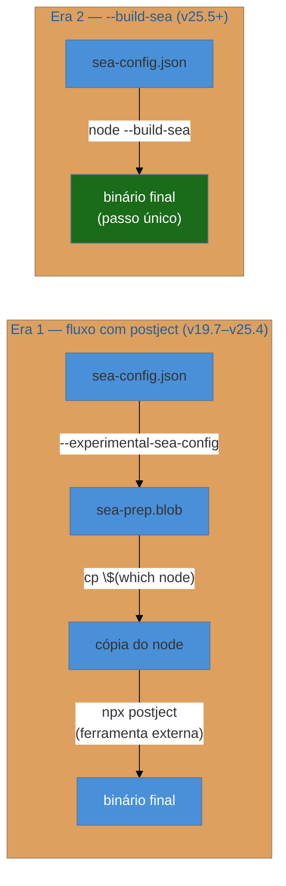
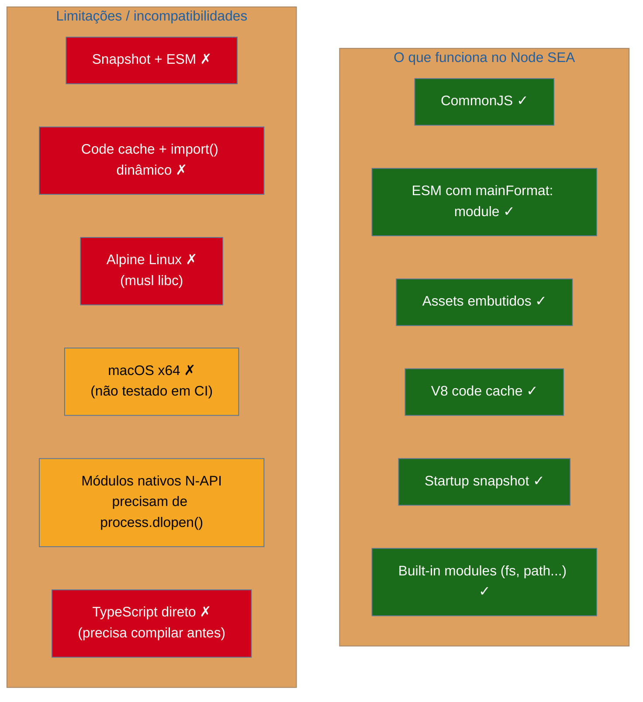
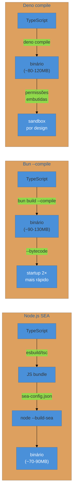
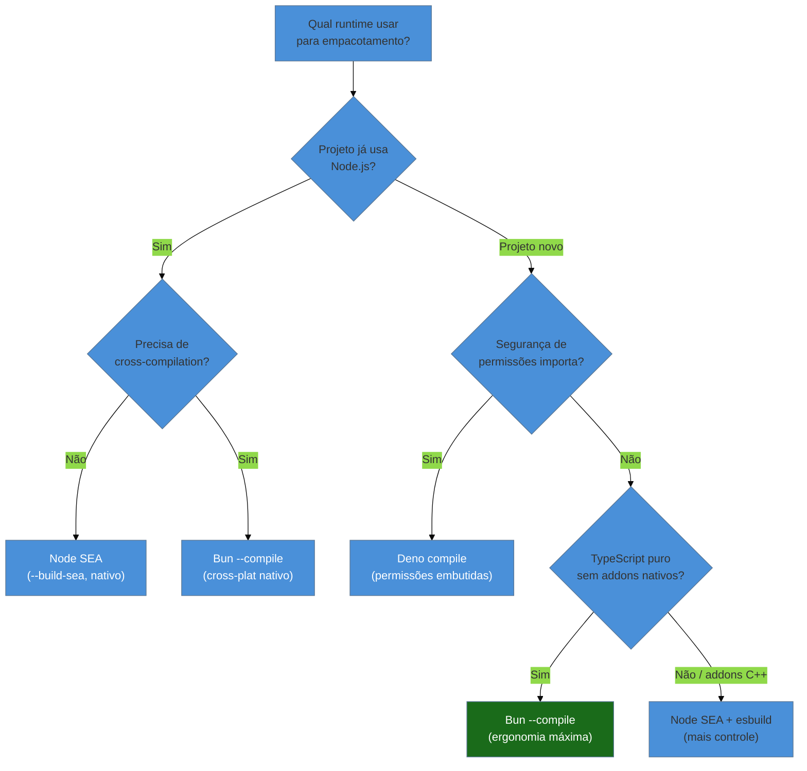

# Single Executable Apps (SEA) e empacotamento

> [!abstract] TL;DR
> Empacotar um app JS/TS num binário único significa que o usuário final executa um arquivo só, sem precisar instalar Node, Bun ou Deno. O Node.js tem suporte nativo desde v19.7 (stability 1.1 — desenvolvimento ativo): gera um blob com `sea-config.json`, injeta no binário com `--build-sea` (Node 25.5+, antigo fluxo usava `postject`). O `pkg` da Vercel foi descontinuado em janeiro de 2024; o fork ativo é `@yao-pkg/pkg`. O Bun oferece `bun build --compile` com cross-compilation nativa e flag `--bytecode` que dobra o startup. O Deno tem `deno compile` desde v1.6, maduro e estável em 2026. Os trade-offs são constantes: o binário carrega o runtime inteiro (~90-130 MB), módulos nativos (N-API) exigem tratamento especial, e assets precisam ser embutidos explicitamente. O caso de uso natural é CLIs distribuídas, scripts internos e ferramentas onde instalar um runtime não é opção.

---

## O problema: "instala o Node primeiro"

Imagine que você escreveu uma CLI interna para o time de DevOps — uma ferramenta que audita configurações de infraestrutura, gera relatórios e notifica o Slack. Ela funciona perfeitamente no seu ambiente. Agora você precisa distribuir para outros 30 engenheiros da empresa.

O fluxo naïve exige que cada um instale o Node.js, rode `npm install -g sua-cli`, e mantenha a versão certa do runtime sincronizada. Para equipes grandes, isso vira um problema de coordenação. Para ferramentas distribuídas externamente — pense em uma CLI de produto open-source — pedir que o usuário instale um runtime é uma barreira real de adoção.

A solução é empacotar tudo — código, dependências e o próprio runtime — num único binário. O usuário baixa, dá permissão de execução, roda. Sem Node, sem npm, sem `package.json`. É o modelo que Go e Rust sempre ofereceram nativamente, e que o ecossistema JS foi construindo ao longo dos anos.

Existem três caminhos em 2026: o SEA nativo do Node.js, o `bun build --compile`, e o `deno compile`. Cada um tem filosofia e trade-offs diferentes.

---

## O ecossistema antes do SEA nativo: `pkg` e `nexe`

Antes de o Node ter qualquer suporte nativo, dois projetos dominavam esse espaço.

O **`nexe`** foi um dos primeiros (2016), e ainda existe, mas o desenvolvimento é lento e o suporte a versões modernas do Node é inconsistente. Para a maioria dos casos de uso, não é a escolha em 2026.

O **`pkg`** da Vercel foi durante anos o padrão de mercado. Ele compilava o código, resolvia o grafo de dependências, e empacotava junto com um binário pré-compilado do Node. Era poderoso — suportava targets múltiplos, assets embutidos, e tinha boa documentação.

**Janeiro de 2024: o `pkg` foi oficialmente descontinuado.** A Vercel arquivou o repositório, citando que o Node.js nativo (v21+) passou a ter suporte a single executable applications, tornando uma ferramenta externa menos necessária. O último release foi a 5.8.1.

> [!warning] `pkg` ainda aparece em tutoriais antigos
> Se você busca "empacotar Node.js executável" e encontra tutoriais com `vercel/pkg`, verifique a data. O repositório está arquivado. Para projetos novos, use o SEA nativo do Node ou `bun build --compile`. Se precisar absolutamente de `pkg`, o fork mantido pela comunidade é `@yao-pkg/pkg` no npm.

O que a descontinuação do `pkg` sinalizou foi importante: a comunidade convergiu para as soluções nativas de cada runtime. Não mais uma ferramenta de terceiros fazendo mágica com binários do Node — agora cada runtime empacota a si mesmo.

---

## Node.js SEA: o caminho nativo

### História e status atual

O suporte a Single Executable Applications no Node.js chegou oficialmente na v19.7.0 (fevereiro de 2023), também retroportado para v18.16.0. Em 2026, o status é **stability 1.1 — Active development**: funciona para produção, mas a API pode mudar entre versões. Não é `stable` (2) ainda, mas está em uso real em ferramentas de produção.

O processo passou por duas eras:

**Era 1 (v19.7 – v25.4): fluxo com `postject`**

```bash
# 1. Gerar o blob
node --experimental-sea-config sea-config.json
# → cria sea-prep.blob

# 2. Copiar o binário do Node
cp $(which node) ./minha-cli

# 3. Injetar o blob com postject (ferramenta externa)
npx postject minha-cli NODE_SEA_BLOB sea-prep.blob \
  --sentinel-fuse NODE_SEA_FUSE_fce680ab2cc467b6e072b8b5df1996b2

# 4. Assinar (macOS / Windows)
codesign --sign - ./minha-cli           # macOS
signtool sign /fd SHA256 minha-cli.exe  # Windows

# 5. Executar
./minha-cli
```

O `postject` era uma ferramenta separada que injetava um blob de dados como uma seção de recurso no binário ELF (Linux), PE (Windows) ou Mach-O (macOS). Funcionava, mas era um passo extra com dependência externa.

**Era 2 (v25.5+, janeiro de 2026): `--build-sea`**

O Node 25.5 trouxe uma mudança significativa de UX: a injeção foi movida para dentro do core do Node. O fluxo agora é:

```bash
# 1. Gerar o executável em um único comando
node --build-sea sea-config.json
# → cria o binário diretamente (sem postject)

# 2. Assinar se necessário (macOS / Windows)
codesign --sign - ./minha-cli
```

A diferença: o `postject` usava WebAssembly para manipular o binário. O `--build-sea` usa LIEF (Library to Instrument Executable Formats), uma biblioteca C++ de manipulação de binários, incorporada ao Node. O overhead no tamanho do executável Node foi de ~5 MB — considerado aceitável.



### A configuração: `sea-config.json`

O `sea-config.json` é o único arquivo de configuração necessário. Veja um exemplo comentado:

```json
{
  "main": "dist/cli.js",
  "output": "minha-cli",
  "mainFormat": "commonjs",
  "useSnapshot": false,
  "useCodeCache": true,
  "disableExperimentalSEAWarning": true,
  "execArgv": ["--no-warnings", "--max-old-space-size=512"],
  "assets": {
    "templates/relatorio.html": "src/templates/relatorio.html",
    "config/defaults.json": "src/config/defaults.json"
  }
}
```

| Campo | O que faz |
|---|---|
| `main` | Arquivo JS de entrada (deve existir — o SEA não roda TypeScript diretamente) |
| `output` | Nome do binário gerado |
| `mainFormat` | `"commonjs"` ou `"module"` (ESM funciona desde Node 22+) |
| `useSnapshot` | V8 startup snapshot — executa o script em build time para acelerar o startup; **incompatível com ESM** |
| `useCodeCache` | Compila o script em build time; **incompatível com `import()` dinâmico** |
| `assets` | Arquivos a embutir no binário, acessíveis via `require('node:sea')` |

> [!warning] O SEA não transpila TypeScript
> O `main` deve apontar para JavaScript compilado — não TypeScript. Você precisa rodar `tsc` ou `esbuild` antes de gerar o SEA. O fluxo completo é: TypeScript → bundle JS → `sea-config.json` → `node --build-sea`.

### Acessando assets embutidos

```javascript
// src/cli.js — acessando assets embutidos com node:sea
const { getAsset, getAssetKeys, isSea } = require('node:sea');

// Verifica se está rodando como SEA
if (isSea()) {
  console.log('Rodando como executável standalone');
}

// Lista todos os assets embutidos
const keys = getAssetKeys(); // ['templates/relatorio.html', 'config/defaults.json']

// Lê um asset como string
const templateHtml = getAsset('templates/relatorio.html', 'utf8');

// Lê um asset como ArrayBuffer (para binários)
const configBuffer = getAsset('config/defaults.json');

// Lê como Blob (útil para passar adiante)
const { getAssetAsBlob } = require('node:sea');
const configBlob = getAssetAsBlob('config/defaults.json', { type: 'application/json' });
```

### Exemplo completo: uma CLI simples com SEA

```bash
# Estrutura do projeto
# src/cli.ts   — TypeScript de entrada
# tsconfig.json
# sea-config.json

# Passo 1: instalar dependências de build
npm install -D typescript esbuild

# Passo 2: compilar TypeScript para um único JS (bundle)
npx esbuild src/cli.ts \
  --bundle \
  --platform=node \
  --target=node22 \
  --format=cjs \
  --outfile=dist/cli.js

# Passo 3: gerar o executável SEA
node --build-sea sea-config.json
# → cria ./minha-cli (ou minha-cli.exe no Windows)

# Passo 4 (macOS): assinar ad-hoc
codesign --sign - ./minha-cli

# Passo 5: testar
./minha-cli --help
```

```json
// sea-config.json — configuração mínima
{
  "main": "dist/cli.js",
  "output": "minha-cli",
  "useCodeCache": true,
  "disableExperimentalSEAWarning": true
}
```

### Limitações do SEA nativo



> [!warning] Módulos nativos (N-API) no SEA
> Addons nativos (.node files, compilados com `node-gyp`) não podem ser embutidos diretamente como módulos — eles precisam estar em disco ou ser carregados via `process.dlopen()` após extração. Se sua CLI depende de `sharp`, `bcrypt` nativo, ou `canvas`, o SEA complica o deployment. Considere versões pure-JS dos pacotes ou Bun/Deno que têm abordagens diferentes.

---

## Bun: `bun build --compile`

O Bun tem a abordagem mais ergonômica para empacotamento standalone. Um único comando faz tudo:

```bash
# Compilar TypeScript direto para binário standalone
bun build src/cli.ts --compile --outfile minha-cli

# Com otimizações de produção recomendadas
bun build src/cli.ts \
  --compile \
  --minify \
  --bytecode \
  --sourcemap=external \
  --outfile minha-cli
```

O `--bytecode` é especialmente interessante: ele compila o JavaScript para bytecode JavaScriptCore em build time, o que **dobra a velocidade de startup** do executável. Para CLIs onde latência de inicialização é perceptível (~8ms → ~4ms), é uma flag que vale sempre usar.

### Cross-compilation nativa

Uma vantagem significativa do Bun sobre o Node SEA: compilação cruzada sem precisar de uma máquina do sistema-alvo.

```bash
# No macOS ARM64, compilar para Linux x64
bun build src/cli.ts --compile \
  --target=bun-linux-x64 \
  --outfile minha-cli-linux-x64

# Para Windows ARM64
bun build src/cli.ts --compile \
  --target=bun-windows-arm64 \
  --outfile minha-cli-windows-arm64.exe

# Targets disponíveis em 2026:
# bun-linux-x64, bun-linux-x64-baseline, bun-linux-arm64
# bun-linux-x64-musl (Alpine), bun-linux-arm64-musl
# bun-windows-x64, bun-windows-arm64
# bun-darwin-x64, bun-darwin-arm64
```

O Node SEA não tem cross-compilation nativa — você precisa rodar em cada plataforma-alvo ou usar CI matrix.

### Embutindo assets no Bun

```typescript
// Sintaxe com import attributes — embutido no binário
import configTemplate from "./templates/config.json" with { type: "file" };
import iconPng from "./assets/icon.png" with { type: "file" };

// Em runtime, o import retorna o path do arquivo temporário extraído
// ou o blob embutido dependendo do contexto
console.log(configTemplate); // path para o arquivo extraído

// SQLite embutido — o banco pode ser embutido no binário
import dbPath from "./data/seed.db" with { type: "file", embed: "true" };
```

```bash
# Ver os assets embutidos em runtime
# Bun.embeddedFiles retorna os arquivos (exceto código-fonte)
```

> [!warning] Tamanho do binário — ainda está crescendo
> O Bun admite explicitamente na documentação que "o binário ainda é muito grande e precisamos diminuí-lo". Um executável compilado com `bun build --compile` carrega o runtime Bun completo — aproximadamente 80-130 MB dependendo da plataforma e da versão. Comparar com Go (3-10 MB) ou Rust (3-8 MB) é inevitável. O `--minify` e `--bytecode` ajudam no startup mas não reduzem o tamanho do runtime embutido.

### Pipeline completo com Bun

```bash
# ─── Pipeline de distribuição multi-plataforma ─────────────────────────────

# Compilar para todas as plataformas em paralelo
bun build src/cli.ts --compile --minify --bytecode \
  --target=bun-linux-x64   --outfile dist/minha-cli-linux-x64 &
bun build src/cli.ts --compile --minify --bytecode \
  --target=bun-darwin-arm64 --outfile dist/minha-cli-darwin-arm64 &
bun build src/cli.ts --compile --minify --bytecode \
  --target=bun-windows-x64 --outfile dist/minha-cli-windows-x64.exe &
wait

# Verificar tamanhos
ls -lh dist/
# minha-cli-linux-x64       ~92MB
# minha-cli-darwin-arm64    ~88MB
# minha-cli-windows-x64.exe ~97MB

# Empacotar para distribuição
tar czf minha-cli-linux-x64.tar.gz -C dist minha-cli-linux-x64
zip dist/minha-cli-windows.zip dist/minha-cli-windows-x64.exe
```

---

## Deno: `deno compile`

O Deno tem suporte a compilação standalone desde v1.6 (dezembro de 2020) — o mais antigo dos três runtimes nessa feature. Em 2026, é a opção mais madura do ponto de vista de estabilidade e documentação.

```bash
# Compilar para o sistema atual
deno compile --allow-net --allow-read src/cli.ts
# → cria ./cli (ou cli.exe no Windows)

# Com output customizado
deno compile --output minha-cli src/cli.ts

# Cross-compilation
deno compile --target x86_64-unknown-linux-gnu \
  --output minha-cli-linux src/cli.ts

# Targets disponíveis:
# x86_64-unknown-linux-gnu
# aarch64-unknown-linux-gnu
# x86_64-pc-windows-msvc
# x86_64-apple-darwin
# aarch64-apple-darwin

# Com minificação e menos dependências externas
deno compile --bundle --minify --output minha-cli src/cli.ts
```

Uma característica única do Deno: as **permissões são embutidas no binário**. Quando você compila, especifica o que o executável pode fazer:

```bash
# Executável que só pode ler arquivos e fazer chamadas HTTP para um domínio específico
deno compile \
  --allow-read=/etc/config \
  --allow-net=api.minha-empresa.com \
  --output minha-cli \
  src/cli.ts
```

Isso é interessante do ponto de vista de segurança para distribuição: o usuário final executa um binário que não pode fazer mais do que o especificado em build time. Para ferramentas corporativas com requisitos de compliance, esse modelo de permissões é um argumento real.



---

## Comparação: Node SEA vs Bun vs Deno



| Aspecto | Node SEA | Bun `--compile` | Deno `compile` |
|---|---|---|---|
| Maturidade | Stability 1.1 (active dev) | Produção, ativo | Estável, mais antigo |
| TypeScript direto | Não (precisa compilar) | Sim | Sim |
| Cross-compilation | Não nativa | Sim (todos os targets) | Sim (targets principais) |
| Permissões embutidas | Não | Não | Sim |
| Startup snapshot | Sim (`useSnapshot`) | `--bytecode` (2×) | Não |
| Assets embutidos | Sim (`assets` no config) | Sim (import attributes) | Sim (embutido) |
| Módulos nativos | Via `process.dlopen()` | Via `.node` embutido | Limitado |
| Tamanho binário | ~70-90 MB | ~90-130 MB | ~80-120 MB |
| Alpine Linux | Não | Sim (musl variant) | Sim |
| Ecossistema | npm completo | npm completo | npm + JSR |

---

## Quando vale empacotar (e quando não vale)

### Casos onde empacotamento faz sentido

**CLIs de distribuição externa.** Uma ferramenta open-source que desenvolvedores instalam em suas máquinas. Pedir `npm install -g` é razoável para devs; pedir para um usuário de marketing que vai usar uma CLI de relatórios instalar Node é uma barreira real. Binários resolvem isso.

**Scripts internos de operações.** Ferramentas de DevOps distribuídas para máquinas de produção, containers mínimos, ou sistemas legados onde você não controla qual versão de Node (se alguma) está instalada.

**Ambientes com restrições de instalação.** Alguns ambientes corporativos bloqueiam `npm install` ou não têm acesso à internet. Um binário copiado por SCP passa onde um `npm install` falha.

**Proteção parcial de código-fonte.** O SEA e o `bun build --compile` embutem o código numa forma que não é trivialmente legível. Não é ofuscação séria — o código pode ser extraído por quem sabe o que está fazendo — mas impede leitura casual.

### Casos onde empacotamento complica mais do que ajuda

**Aplicações servidor com deploy em container.** Se você já tem um `Dockerfile`, empacotar para SEA adiciona complexidade sem benefício. O container já isola o runtime.

**Ferramentas com módulos nativos pesados.** Se seu projeto usa `sharp`, `canvas`, ou drivers nativos de banco que compilam com `node-gyp`, o empacotamento fica complicado. Esses módulos esperam estar em disco, com arquivos auxiliares. Embutir e extrair em runtime é possível mas trabalhoso.

**Equipes que já controlam o ambiente de execução.** Se todos os desenvolvedores têm Node instalado e você tem um orquestrador que gerencia versões (como mise/fnm — ver [[04 - Gerenciando versões de Node]]), o overhead de empacotar não tem contrapartida.

> [!warning] Tamanho não é opcional — é uma decisão de distribuição
> Um binário standalone de 100 MB é grande para um download, mas pequeno para um container de produção. A mesma CLI pode ser distribuída como binário para dev boxes e como container (sem SEA) para produção. Não existe resposta única — depende de quem vai usar e de onde.

---

## Armadilhas comuns

> [!warning] Armadilha 1: esquecer de compilar TypeScript antes do SEA nativo
> O `sea-config.json` aponta para JavaScript, não TypeScript. Se você apontar para um `.ts`, o Node vai reclamar do tipo de arquivo. O pipeline correto é: `tsc`/`esbuild` → `.js` → `--build-sea`. O Bun e Deno fazem essa transpilação automaticamente.

> [!warning] Armadilha 2: `require()` dentro do SEA não encontra `node_modules`
> Por padrão, o módulo loader do SEA só resolve built-ins do Node. Para carregar módulos de terceiros, você precisa bundlar tudo num único arquivo antes (com esbuild, por exemplo). O `bun build --compile` faz isso automaticamente; o SEA nativo exige que você faça o bundle separado.

> [!warning] Armadilha 3: `__filename` e `__dirname` se comportam diferente
> Dentro de um SEA, `__filename` é igual a `process.execPath` (o caminho do próprio binário) e `__dirname` é o diretório onde o binário está. Se seu código usa `__dirname` para encontrar arquivos relativos ao projeto (como configs ou templates), eles não estarão lá — precisam ser embutidos como assets.

> [!warning] Armadilha 4: Alpine Linux quebra o Node SEA
> Containers Alpine usam musl libc em vez de glibc. O Node SEA (com LIEF) não é suportado em Alpine. Se seu pipeline de CI roda em Alpine (comum com images `node:alpine`), o `node --build-sea` vai falhar. Use images `node:slim` (Debian) para a etapa de build do SEA. O Bun tem variante `musl` explícita que funciona em Alpine.

> [!warning] Armadilha 5: snapshot V8 não funciona com ESM
> O `useSnapshot: true` no `sea-config.json` — que pré-executa o módulo em build time para acelerar o startup — é incompatível com `mainFormat: "module"`. Se seu código usa ESM (`import`/`export`), ou não usa snapshot, ou migra para CJS na saída do bundler.

---

## Como explicar em inglês

Single Executable Applications let you distribute a JavaScript or TypeScript CLI as a self-contained binary — no Node, Bun, or Deno installation required on the target machine.

In Node.js, the native SEA feature (stability 1.1, added in v19.7) works by compiling your script, embedding it as a blob into a copy of the Node binary, and injecting it via the new `--build-sea` flag (Node 25.5+) or the older `postject` tool. The `sea-config.json` file controls the entry point, assets to embed, and startup optimization options like V8 snapshots and code cache.

`vercel/pkg` — historically the most popular packaging tool — was officially deprecated in January 2024, as Node's native SEA made it redundant. The community fork is `@yao-pkg/pkg`.

Bun's `--compile` flag (`bun build ./cli.ts --compile --outfile my-cli`) is arguably the smoothest experience: TypeScript is bundled and compiled directly, cross-compilation targets are built-in (`--target=bun-linux-x64` on a Mac), and the `--bytecode` flag pre-compiles to JavaScriptCore bytecode for 2× startup speed.

Deno's `deno compile` is the most mature — available since v1.6 — and has a security-centric twist: permissions are embedded at compile time, so the binary cannot do more than what was explicitly granted during the build.

Key trade-offs in interviews: all three runtimes produce binaries of 80-130 MB because they embed the full runtime. Native addons (N-API, `.node` files) require special handling — they can't simply be bundled. Assets (config files, templates, images) must be explicitly embedded or will be missing in the packaged binary.

| Português | Inglês |
|---|---|
| executável standalone | standalone executable / self-contained binary |
| empacotamento | packaging / bundling into an executable |
| injeção de blob | blob injection |
| módulo nativo / addon nativo | native addon / N-API module |
| asset embutido | embedded asset |
| compilação cruzada | cross-compilation |
| tempo de inicialização | startup time / cold start |
| assinatura de código | code signing |
| cache de código V8 | V8 code cache |
| snapshot de inicialização | startup snapshot |

---

## O que vem a seguir

Empacotar um binário resolve *onde* o app roda. A próxima dimensão é *como* ele é construído de forma reproduzível — o mesmo input, o mesmo output, em qualquer máquina. Isso é o território de builds determinísticos, CI e gestão de artefatos, que a nota seguinte cobre.

- [[23 - Build em produção, CI e determinismo]] — lockfiles, cache de build, pipelines reproduzíveis
- [[20 - Bun como runtime e toolkit all-in-one]] — `bun build --compile` no contexto do toolkit all-in-one; bundler, runtime e test runner num só binário
- [[04 - Gerenciando versões de Node]] — nvm/fnm/Volta/mise; quando o controle de versão de runtime é suficiente e o empacotamento é desnecessário
- [[18 - O runtime como ferramenta de DX]] — `--watch`, `--env-file`, TypeScript nativo; o runtime como ferramenta antes de chegar ao empacotamento
- [[index|trilha Tooling e Build]] — visão geral da trilha

---

## Fontes

- **Node.js Core Docs** — [*Single executable applications*](https://nodejs.org/api/single-executable-applications.html) — documentação oficial, referência para status, API `node:sea`, flags e limitações
- **Joyee Cheung** — [*Improving Single Executable Application Building for Node.js*](https://joyeecheung.github.io/blog/2026/01/26/improving-single-executable-application-building-for-node-js/) — post detalhado sobre o `--build-sea` (Node 25.5) e o histórico de `postject`
- **Bun Docs** — [*Single-file executable*](https://bun.com/docs/bundler/executables) — documentação oficial do `bun build --compile`, cross-compilation, assets, `--bytecode`
- **Deno Docs** — [*deno compile*](https://docs.deno.com/runtime/reference/cli/compile/) — referência do `deno compile`, permissões embutidas, targets
- **Vercel/pkg GitHub** — [*vercel/pkg (archived)*](https://github.com/vercel/pkg) — repositório arquivado, nota de descontinuação oficial
