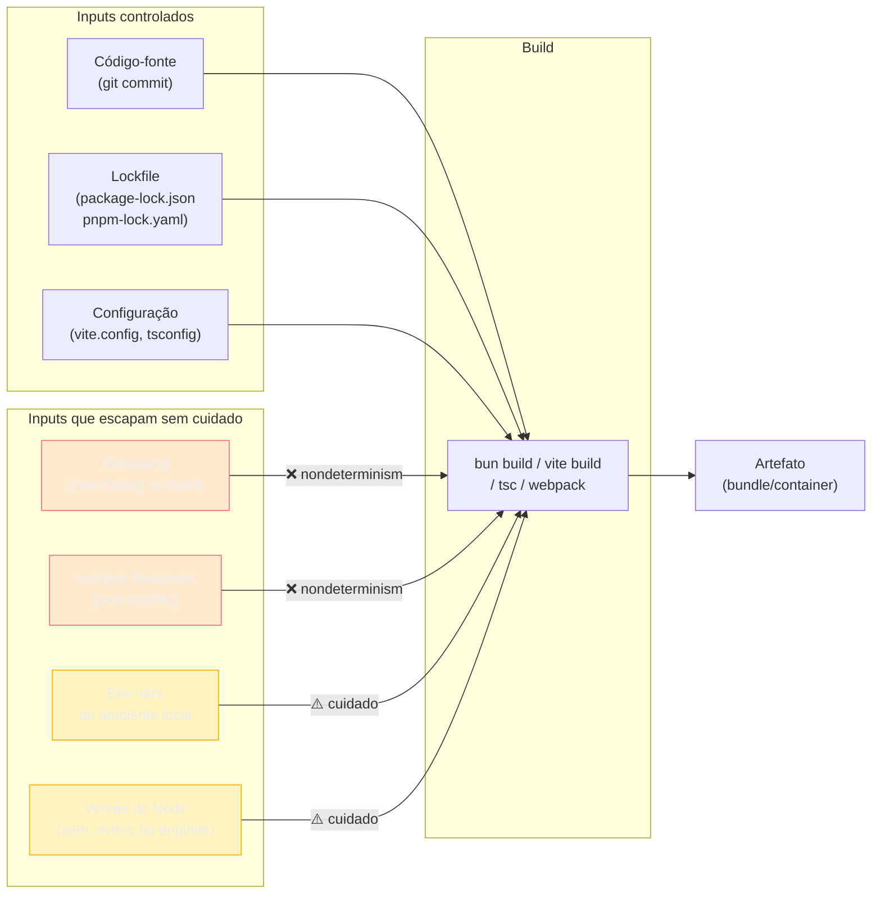
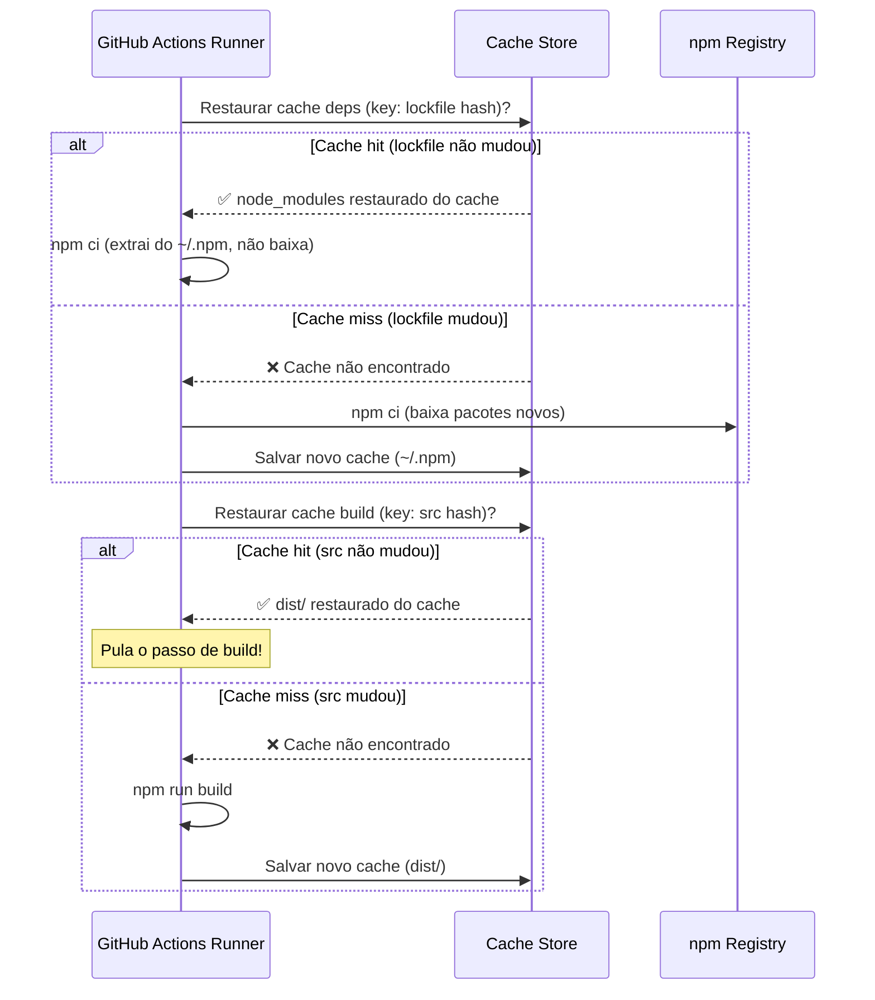
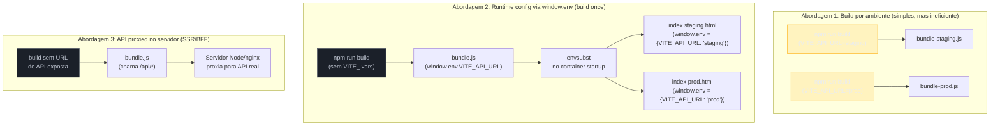
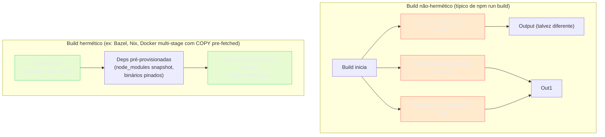
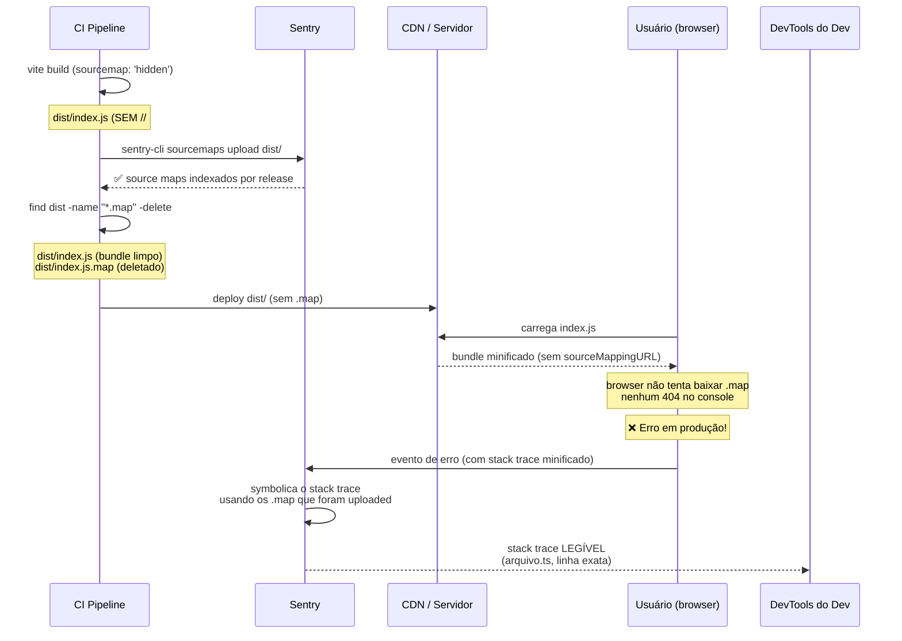

# Build em produção, CI e determinismo

> [!abstract] TL;DR
> Um build "que funcionou ontem" pode produzir um binário diferente hoje — por causa de timestamps, versões flutuantes de dependências ou variáveis de ambiente implícitas. **Determinismo** é a garantia de que código + inputs idênticos sempre geram o mesmo artefato. Em CI, isso se traduz em quatro camadas: (1) travar dependências com lockfile + `npm ci`/`pnpm install --frozen-lockfile`; (2) fazer cache inteligente por chave — sem cache ou com cache ruim, CI é o gargalo mais visível; (3) separar o que entra no bundle em build-time (Vite `import.meta.env`) do que entra em runtime, para **build once, deploy many**; (4) — a fronteira sênior — garantir **hermeticidade** (build sem acesso à rede) e **provenance verificável** (SLSA + SBOM) para artefatos que precisam de auditoria de supply chain. Source maps fecham o ciclo: `sourcemap: 'hidden'` + upload pro Sentry antes do deploy. Cache poisoning é o risco que o próprio cache introduz — `restore-keys` relaxa as garantias; para jobs críticos, instale do zero.

---

## O problema que você ainda vai encontrar

Você faz um deploy numa sexta à noite. Tudo testa no CI. O job de build passa. Na segunda-feira, alguém reabre o mesmo branch depois de uma semana de férias, roda `npm install` localmente, e alguma coisa está quebrada — mas no CI passou porque o CI rodou na sexta.

Esse é o "funciona na minha máquina" evoluído: **funciona no CI de terça, quebra no CI de segunda**. Ou pior: funciona no build que você mandou pra staging, mas o build de produção que veio dez minutos depois é diferente porque uma dependência transitiva lançou um patch.

Esse problema tem um nome: **não-determinismo de build**. E tem solução — não perfeita, mas muito melhor do que não fazer nada.

Para entender o que está em jogo, pense assim: um build é uma função. Ela recebe código-fonte + dependências + configuração + ambiente e produz um artefato (bundle, container, executável). Se algum desses inputs varia entre duas execuções, o output varia. A questão é: quais inputs você controla, e quais você deixa escapar?



---

## Lockfiles: a âncora do determinismo

O lockfile é o contrato de que toda instalação de dependências vai resultar exatamente nos mesmos pacotes — mesmas versões, mesmo grafo de resolução, mesmo hash de conteúdo. A nota [[05 - Semver e o grafo de dependências]] cobre o mecanismo de resolução em detalhe; aqui o foco é o que fazer com o lockfile em CI.

A primeira regra é simples e frequentemente ignorada: **o lockfile precisa estar no controle de versão**. Todo projeto que tem um `package.json` deveria ter seu lockfile (`package-lock.json`, `pnpm-lock.yaml` ou `bun.lockb`) no git. Sem isso, cada `npm install` resolve as deps de novo — e pode pegar versões diferentes dependendo do dia.

A segunda regra é o `npm ci`:

```bash
# ❌ npm install em CI — pode atualizar o lockfile, resolve deps de novo
npm install

# ✅ npm ci em CI — instala exatamente o que está no lockfile, falha se divergir
npm ci

# ✅ pnpm equivalente
pnpm install --frozen-lockfile

# ✅ yarn equivalente
yarn install --immutable
```

O que `npm ci` faz de diferente:

1. **Remove `node_modules` antes de instalar** — não há estado remanescente de installs anteriores.
2. **Não atualiza o lockfile** — se `package.json` e `package-lock.json` divergirem, o comando falha com erro. Isso é feature, não bug: é sua rede de segurança contra "alguém rodou `npm install` localmente e não commitou o lockfile atualizado".
3. **Pula a resolução de versão** — como o lockfile já tem as versões resolvidas, o npm só precisa baixar e instalar. Em ambientes com cache quente, é 2–3× mais rápido que `npm install`.

> [!question]- Por que `npm ci` falha quando package.json e lockfile divergem?
> Porque divergência significa que alguém adicionou uma dependência no `package.json` (ou mudou uma versão) sem atualizar o lockfile. Se o CI simplesmente resolvesse e seguisse em frente, você teria uma instalação diferente da que qualquer dev local vai ter — e ninguém vai saber disso até o próximo "funciona na minha máquina". Falhar cedo, falhar alto é o comportamento correto aqui.

O `.npmrc` pode reforçar esse comportamento para toda a equipe:

```ini
# .npmrc — commite esse arquivo junto com o package.json
# Garante que npm ci é usado por todas as ferramentas que leem este arquivo

# Para npm ≥ 7: exige lockfile version 2 (compatível com npm 7+)
lockfile-version=3

# engine-strict: falha se a versão do Node não bater com o campo "engines" do package.json
engine-strict=true
```

> [!question]- `engine-strict` acrescenta algo se `setup-node` já fixa a versão do Node?
> Sim — e os dois mecanismos operam em camadas diferentes. O `actions/setup-node` garante que o runner use a versão correta do Node antes de qualquer npm command. O `engine-strict=true` no `.npmrc` faz o próprio `npm ci` verificar, durante a instalação, se a versão ativa satisfaz o campo `engines` do `package.json` — e falhar se não satisfizer. Isso pega dois casos que o `setup-node` sozinho não cobre: (1) um dev que ignora o `.nvmrc` e roda `npm ci` localmente com a versão errada; (2) outro runner (ex: self-hosted, Dockerfile de dev) que não usa `actions/setup-node`. Em suma: `setup-node` é a garantia de CI, `engine-strict` é a rede de segurança universal — os dois coexistem sem conflito, e quando a versão bate (o caso normal no CI), `engine-strict` adiciona zero overhead.

```json
// package.json — cravar a versão do Node esperada
{
  "engines": {
    "node": ">=22.0.0"
  }
}
```

---

## Cache de build em CI: o gargalo mais caro

Sem cache, cada push ao repositório dispara: baixar todas as dependências do zero + compilar/transpilar todo o código. Em um projeto médio com 500 dependências e 50 mil linhas de TypeScript, isso pode levar 4–8 minutos de CI para cada PR. Multiplique por 20 devs fazendo 10 pushes por dia e você tem um gargalo sério.

A solução é cache em camadas. No GitHub Actions, a action `actions/setup-node` tem cache integrado — mas entender o que ela está cacheando (e o que não está) faz toda a diferença.

```yaml
# .github/workflows/build.yml — pipeline completo com cache
name: Build e Testes

on:
  push:
    branches: [main, develop]
  pull_request:

jobs:
  build:
    runs-on: ubuntu-latest

    steps:
      # 1. Checkout do código
      - name: Checkout
        uses: actions/checkout@v4

      # 2. Setup do Node com cache de dependências integrado
      #    O `cache: 'npm'` usa package-lock.json como cache key.
      #    Se o lockfile não mudou, restaura node_modules do cache.
      #    Suporte: 'npm', 'yarn', 'pnpm'
      - name: Setup Node.js
        uses: actions/setup-node@v4
        with:
          node-version: '22'
          cache: 'npm'
          # Para pnpm: cache: 'pnpm'
          # Para yarn: cache: 'yarn'

      # 3. Instala com frozen lockfile — determinístico
      - name: Instalar dependências
        run: npm ci

      # 4. Build — com cache do output de build
      #    Usa hash dos arquivos de src como chave de cache.
      #    Se src/ não mudou, restaura dist/ do cache.
      - name: Cache de build output
        uses: actions/cache@v4
        with:
          path: dist/
          # Cache key = SO + hash de todos os arquivos de source
          key: build-${{ runner.os }}-${{ hashFiles('src/**/*', 'vite.config.*', 'tsconfig.json') }}
          restore-keys: |
            build-${{ runner.os }}-

      # 5. Build condicional — só roda se o cache de build não foi restaurado
      - name: Build
        run: npm run build

      # 6. Testes
      - name: Testes
        run: npm test

      # 7. Upload do artefato — disponibiliza o bundle para jobs posteriores
      #    (ex: job de deploy que roda depois)
      - name: Upload artefato de build
        uses: actions/upload-artifact@v4
        with:
          name: dist-${{ github.sha }}
          path: dist/
          retention-days: 7
```

> [!info] O que `actions/setup-node` cacheia, exatamente?
> O `setup-node` com `cache: 'npm'` cacheia o **store global do npm** (o cache de download de pacotes — em `~/.npm`), não o `node_modules` do projeto. Isso significa que `npm ci` ainda vai reconstruir `node_modules` a cada job, mas não vai baixar os arquivos `.tgz` de novo — apenas os extrai do cache local. Para pnpm, o mesmo vale: ele cacheia o pnpm store (`~/.local/share/pnpm/store`). Isso é mais eficiente que cachear `node_modules` diretamente porque o store é compartilhado entre versões do Node.

### A chave de cache certa importa

O segredo do cache eficiente está na `key`. Se a key é muito ampla (ex: só o nome do branch), o cache nunca invalida e você pode restaurar um cache stale. Se é muito estreita (ex: hash de todo o repositório), o cache nunca reutiliza e você pagou pelo armazenamento sem ganho.

A lógica ideal para `node_modules`:

```yaml
# Chave primária: SO + hash do lockfile
# O lockfile muda só quando deps mudam — exatamente quando o cache deve invalidar
key: deps-${{ runner.os }}-node22-${{ hashFiles('**/package-lock.json') }}

# Fallback: se não tem cache exato, restaura o mais recente
restore-keys: |
  deps-${{ runner.os }}-node22-
  deps-${{ runner.os }}-
```

Para output de build (a pasta `dist/`):

```yaml
# Chave: hash de source + configurações que afetam o output
key: build-${{ runner.os }}-${{ hashFiles('src/**', 'public/**', 'vite.config.*', 'tsconfig.json', 'package.json') }}
```



---

## Artefatos: build uma vez, use em vários jobs

Em pipelines mais complexos, você tem um job de `build` e vários jobs dependentes: um que roda testes de integração, um que faz análise de bundle, um que faz deploy em staging. O erro comum é cada job reconstruir o projeto do zero.

A solução é o padrão **upload/download de artefato**: o job de build produz o artefato e faz upload; os outros jobs baixam o artefato e usam diretamente.

```yaml
jobs:
  build:
    runs-on: ubuntu-latest
    steps:
      - uses: actions/checkout@v4
      - uses: actions/setup-node@v4
        with: { node-version: '22', cache: 'npm' }
      - run: npm ci
      - run: npm run build
      # Artefato identificado pelo SHA do commit — garante rastreabilidade
      - uses: actions/upload-artifact@v4
        with:
          name: dist-${{ github.sha }}
          path: dist/

  test-e2e:
    needs: build  # Só roda depois do build
    runs-on: ubuntu-latest
    steps:
      - uses: actions/checkout@v4
      - uses: actions/download-artifact@v4
        with:
          name: dist-${{ github.sha }}  # Baixa o mesmo artefato
          path: dist/
      - run: npm run test:e2e  # Usa o dist/ que veio do build

  deploy-staging:
    needs: [build, test-e2e]  # Só depois do build E dos testes
    if: github.ref == 'refs/heads/develop'
    runs-on: ubuntu-latest
    steps:
      - uses: actions/download-artifact@v4
        with:
          name: dist-${{ github.sha }}
          path: dist/
      - run: ./scripts/deploy.sh staging
```

Esse padrão garante que **todos os jobs usam exatamente o mesmo artefato** — não uma reconstrução que pode ter saído diferente.

---

## Build once, deploy many: o dilema de variáveis de ambiente

Aqui está uma das tensões mais práticas do build frontend moderno: o Vite (e outros bundlers) substitui `import.meta.env.VITE_*` **em tempo de build**, não em runtime. Isso significa que o valor de `VITE_API_URL` fica literalmente gravado no bundle gerado.

```typescript
// src/api.ts — código-fonte
const baseUrl = import.meta.env.VITE_API_URL;

// dist/assets/index-abc123.js — após o build com VITE_API_URL=https://api.staging.com
const baseUrl = "https://api.staging.com"; // hardcoded no bundle!
```

O problema: se você quer fazer **um único build** que sirva staging, produção e qualquer outro ambiente, você não pode ter a URL de API gravada no bundle em tempo de build. Você precisaria recompilar para cada ambiente — o que derrota o propósito de builds determinísticos e lentos.

Há três abordagens, cada uma com trade-offs:



**Abordagem 1 — Build por ambiente:** a mais simples. Você cria um build separado para cada ambiente, usando variáveis `VITE_*` diferentes. Funciona, é fácil de entender, mas você perde o benefício de "testar exatamente o que vai pra produção" — staging testou um bundle diferente do que vai pra prod.

**Abordagem 2 — `window.env` via `envsubst`:** o bundle usa `window.env.VITE_API_URL` em vez de o valor hardcoded. O `index.html` tem um placeholder `"${VITE_API_URL}"`. No startup do container, um script roda `envsubst` e substitui o placeholder pelo valor real da variável de ambiente do container. Você tem um único bundle; só o HTML muda por ambiente. Esta é a abordagem **build once, deploy many** de verdade.

O mecanismo que torna isso possível é um plugin Vite — como o [`vite-plugin-runtime-env`](https://github.com/micha149/vite-plugin-runtime-env). O plugin intercepta o build e faz duas coisas: (1) reescreve automaticamente todas as ocorrências de `import.meta.env.VITE_*` no bundle gerado para `window.env.VITE_*`; (2) injeta no `index.html` um bloco `<script>` com os placeholders que o `envsubst` vai substituir. O código TypeScript que você escreve não muda — você continua usando `import.meta.env.VITE_API_URL` normalmente; o plugin faz a reescrita durante o bundle. O resultado é que o bundle é estático e cacheável, e apenas o HTML varia por ambiente.

```typescript
// vite.config.ts — habilitando runtime env
import { defineConfig } from 'vite';
import runtimeEnv from 'vite-plugin-runtime-env';

export default defineConfig({
  plugins: [runtimeEnv()],
  // Não inclua VITE_API_URL nas env vars de build — deixe vazio ou use placeholder
});
```

```html
<!-- index.html gerado pelo plugin — placeholder para envsubst -->
<script>
  window.env = {
    VITE_API_URL: "${VITE_API_URL}"  // substituído no startup do container
  };
</script>
```

```bash
# entrypoint.sh do container — roda antes de nginx/node servir o app
envsubst < /usr/share/nginx/html/index.html > /tmp/index.html
cp /tmp/index.html /usr/share/nginx/html/index.html
```

**Abordagem 3 — Sem variáveis de API no cliente:** o frontend só chama `/api/*` (relativo ao próprio domínio); um servidor na borda (nginx, BFF Node) proxia para a API real. Nenhuma URL de API fica no bundle. Mais robusto, mais complexo.

> [!warning] O que NÃO colocar em variáveis VITE_*
> Todo valor prefixado com `VITE_` é **injetado no bundle e fica visível no source do cliente** — qualquer pessoa pode ver via DevTools ou no bundle minificado. Nunca coloque: API keys privadas, client secrets de OAuth, tokens de serviço, senhas de banco. Essas coisas vivem em variáveis **sem** o prefixo `VITE_` (que o Vite não expõe) ou — melhor ainda — nunca chegam ao cliente.

### Build-time vs runtime: a distinção que importa

| Variável | Onde vive | Quem pode ver | Exemplo |
|---|---|---|---|
| `VITE_API_URL` | Bundle (gravada em build) | Todo usuário final | `https://api.prod.com` |
| `VITE_FEATURE_FLAG` | Bundle | Todo usuário final | `"true"` |
| `DATABASE_URL` | Servidor (nunca no bundle) | Só o processo Node | `postgres://...` |
| `STRIPE_SECRET_KEY` | Servidor | Só o processo Node | `sk_live_...` |
| `PORT` | Runtime do servidor | Só o processo | `3000` |

---

## Por que determinismo importa além do "funciona na minha máquina"

Há três razões mais profundas pelas quais determinismo é importante, e todas aparecem em entrevistas sênior:

**1. Cache hits dependem de determinismo.** O sistema de cache de CI usa hashes de artefatos para decidir se precisa reconstruir. Se dois builds do mesmo commit geram artefatos diferentes (por causa de timestamps ou algum não-determinismo), o cache nunca funciona — cada job reconstrói tudo. Empresas com CI pesado perdem horas de máquina por semana por builds não-determinísticos.

**2. Debugging de produção depende de determinismo.** Quando um erro acontece em produção e você precisa investigar, você precisa saber *exatamente* qual artefato está rodando. Se builds não são determinísticos, você não tem garantia de que re-criar o build de dois dias atrás vai produzir o mesmo bundle que está em prod agora. Source maps (que veremos a seguir) só funcionam corretamente se o bundle em prod e o bundle de onde os source maps foram gerados são o mesmo.

**3. Segurança de supply chain.** Um build não-determinístico é mais difícil de auditar. Se você não consegue re-criar exatamente o artefato que está em produção a partir do código-fonte, você tem menos garantias sobre o que está rodando. A iniciativa reproducible-builds.org existe exatamente por isso — e ferramentas como o OSS Rebuild do Google (lançado em 2025) verificam builds de pacotes npm contra re-criações independentes.

### `SOURCE_DATE_EPOCH`: padronizando timestamps

Uma das fontes mais comuns de não-determinismo é **timestamps de arquivo**. Ferramentas como `esbuild`, `webpack` e alguns geradores de documentação incluem timestamps no output por padrão.

A solução é a variável de ambiente `SOURCE_DATE_EPOCH` — um padrão da iniciativa reproducible-builds.org que instrui ferramentas compatíveis a usar um timestamp fixo (o timestamp do último commit git, por exemplo) em vez do `Date.now()` do momento do build:

```bash
# Define SOURCE_DATE_EPOCH como o timestamp do último commit git
export SOURCE_DATE_EPOCH=$(git log -1 --pretty=%ct)

# Ou um valor fixo para máximo determinismo
export SOURCE_DATE_EPOCH=1700000000

npm run build  # ferramentas compatíveis usam esse timestamp
```

```yaml
# Em GitHub Actions
- name: Build determinístico
  env:
    SOURCE_DATE_EPOCH: ${{ github.event.head_commit.timestamp }}
  run: npm run build
```

Nem todas as ferramentas do ecossistema JS respeitam `SOURCE_DATE_EPOCH` ainda (o esbuild não tem suporte nativo; webpack e alguns plugins sim). Mas é a direção certa — e sinaliza que você pensa em builds de forma séria.

---

## Hermetic builds: isolamento total como propriedade de segurança

"Determinístico" e "hermético" são frequentemente confundidos em entrevistas — e a distinção importa.

**Determinístico** significa: mesmos inputs → mesmo output. Você pode ter um build determinístico que ainda acessa a rede durante a execução (baixa uma tool, consulta uma API de licenças) — desde que o resultado seja sempre idêntico.

**Hermético** significa: o build **não acessa nenhum recurso externo** durante sua execução. Ele opera em sandbox total, com todas as dependências provisionadas antes do início. Se qualquer coisa está faltando, o build falha — não improvisa.



### Por que hermeticidade é importante para segurança — não só para determinismo

Um build que acessa a rede pode ser **interceptado**. Um atacante com acesso ao DNS da rede do runner, ou que comprometeu um CDN de ferramentas, pode substituir o que seu build baixa. Um build hermético elimina esse vetor — se o conteúdo está em sandbox, não há rede para interceptar.

O projeto Bazel do Google, adotado em larga escala para builds C++/Java, foi projetado com hermeticidade como propriedade central. Para o ecossistema JS, a abordagem mais próxima é um Dockerfile **multi-stage** onde a fase de instalação de dependências é executada em uma camada separada e o resultado (node_modules snapshottado) é copiado para a fase de build — sem acesso à internet nesta segunda fase:

> [!warning] Multi-stage não garante isolamento de rede por padrão — precisa de `--network=none`
> Por padrão, o Docker não bloqueia acesso à rede em nenhum stage. Omitir `npm install` no Stage 2 é uma convenção arquitetural, não um enforcement. Se qualquer script do Stage 2 fizer `curl` ou `wget`, vai funcionar — e você não vai saber. Para isolamento real, passe `--network=none` no comando de build, ou por stage via `RUN --network=none`:
>
> ```bash
> # Isola o build inteiro da rede
> docker build --network=none -t meu-app .
>
> # Ou por stage (BuildKit) — isola só o Stage 2
> # No Dockerfile: RUN --network=none npm run build
> ```
>
> No GitHub Actions, o runner tem acesso à internet por padrão; adicionar `--network=none` ao step de `docker build` é o que transforma a convenção em garantia. Aceite que para o típico deploy de SPA em CDN, a convenção é suficiente — o risco é baixo quando o Stage 2 genuinamente não precisa de rede. Para artefatos de produção crítica com requisitos de auditoria, `--network=none` é o enforcement correto.

```dockerfile
# Dockerfile multi-stage com build hermético
# Stage 1: dependências (acessa rede, mas isolado e cacheável por layer)
FROM node:22.13.0-alpine3.21@sha256:abc123... AS deps
WORKDIR /app
COPY package.json package-lock.json ./
RUN npm ci --ignore-scripts  # instala deps; --ignore-scripts reduz surface de ataque

# Stage 2: build (sem acesso à rede — usa deps do stage anterior)
FROM node:22.13.0-alpine3.21@sha256:abc123... AS builder
WORKDIR /app
COPY --from=deps /app/node_modules ./node_modules  # copia do stage deps
COPY . .
RUN npm run build  # sem npm install aqui — tudo que o build precisa já está em /app

# Stage 3: runtime (imagem mínima)
FROM nginx:1.27-alpine
COPY --from=builder /app/dist /usr/share/nginx/html
```

A nota [[03 - Package managers - npm, pnpm, yarn e Bun]] cobre `--ignore-scripts` em detalhe: é um dos vetores mais ignorados em auditorias — scripts de install rodam código arbitrário no seu runner.

### Trade-offs de hermeticidade

| | Build tradicional (`npm run build`) | Build hermético (multi-stage) |
|---|---|---|
| Velocidade de setup | Rápido — npm ci resolve a partir do cache | Mais lento — Docker build + layer caching |
| Segurança | Moderada — depende de lockfile | Alta — superficie de ataque eliminada |
| Complexidade | Baixa | Média-alta (Dockerfile, layer strategy) |
| Reprodutibilidade | Boa (com lockfile) | Excelente (layers são conteúdo-addressable) |
| Adequado para | Apps web, bibliotecas | Produção crítica, imagens de container |

> [!question]- Em qual cenário vale a pena ir para build hermético completo?
> Quando você publica pacotes npm (seu artefato é consumido por outros), quando o pipeline de CI tem acesso a credenciais de produção e você quer minimizar risco de comprometimento, ou quando um auditor de segurança precisa verificar o que foi compilado. Para a maioria das SPAs que apenas fazem deploy em CDN, lockfile + `npm ci` + pinagem do runner são suficientes.

---

## Provenance, SBOM e SLSA: a fronteira sênior de 2025–2026

Esta é a área que separa quem "faz CI" de quem "pensa em supply chain como propriedade de segurança". O tema se tornou central depois dos ataques à SolarWinds (2020) e XZ Utils (2024), que mostraram que o artefato compilado pode ser diferente do que o código-fonte sugere.

### O que é SLSA (Supply-chain Levels for Software Artifacts)

SLSA (pronunciado "salsa") é um framework de segurança criado pelo Google e formalizado pela OpenSSF (Open Source Security Foundation) que define **quatro níveis de garantia** sobre como um artefato foi produzido. Não é uma ferramenta — é uma especificação de requisitos que ferramentas implementam.

```
SLSA Nível 1: Provenance existe e está documentada (automatizada)
SLSA Nível 2: Provenance é gerada pelo serviço de build (não pelo dev)
SLSA Nível 3: Build roda em ambiente isolado; fonte verificável
SLSA Nível 4: Build hermético; dois builds independentes produzem o mesmo hash
```

Para JavaScript, o que isso significa na prática:

- **Nível 1:** GitHub Actions gera automaticamente um attestation assinado quando você usa `actions/attest-build-provenance`. O attestation diz: "este artefato foi produzido neste workflow, a partir deste commit, nesta hora."
- **Nível 2:** O runner do GitHub (não o seu código) assina o attestation com a chave do GitHub. Você não pode forjar isso localmente.
- **Nível 3:** O job roda em um runner efêmero, sem estado anterior, e o código-fonte foi verificado via `actions/checkout` com commit SHA pinado.

```yaml
# GitHub Actions — gerando provenance SLSA Level 2 automaticamente
jobs:
  build:
    runs-on: ubuntu-latest
    permissions:
      id-token: write   # necessário para assinar o attestation
      contents: read
      attestations: write
    steps:
      - uses: actions/checkout@v4

      - uses: actions/setup-node@v4
        with: { node-version: '22', cache: 'npm' }

      - run: npm ci && npm run build

      # Gera o attestation de provenance assinado pelo GitHub
      - name: Gerar provenance attestation
        uses: actions/attest-build-provenance@v2
        with:
          subject-path: dist/  # o artefato a ser atestado
          # Gera um attestation no formato SLSA que qualquer um pode verificar via:
          # gh attestation verify dist/index.js --repo minha-org/meu-repo
```

O attestation gerado é um JSON assinado (usando Sigstore/cosign por baixo) que qualquer pessoa pode verificar independentemente. Isso é o que significa "provenance verificável" na prática.

> [!question]- Por que um attestation gerado numa fork não é válido para o repositório original?
> O mecanismo é OIDC + Sigstore. Quando o runner executa `actions/attest-build-provenance`, ele requisita ao GitHub um OIDC token efêmero — um JWT assinado pelo GitHub que inclui claims como `repository` (`owner/repo`), `workflow`, `ref` e `sha`. Esse token é enviado ao Fulcio (CA do Sigstore), que emite um certificado X.509 de curta duração vinculado exatamente àquelas claims. O attestation é assinado com esse certificado, e o par (attestation + certificado) é registrado no Rekor, o transparency log público do Sigstore. A chave privada nunca sai do runner — ela é gerada efêmeramente e o certificado expira em minutos. Uma fork em `attacker/myrepo` receberia um OIDC token com `repository: attacker/myrepo` — um attestation verificável como "gerado nessa fork", mas que falha ao verificar contra `owner/myrepo`. O `gh attestation verify dist/index.js --repo owner/myrepo` rejeita porque o certificado no attestation vincula a fork, não o repo original. O que ainda é vulnerável: um mantenedor com write access ao repo original pode gerar um attestation legítimo com código adulterado — SLSA Nível 3+ mitiga isso exigindo runners efêmeros e fonte verificável por commit SHA.

### O que é um SBOM (Software Bill of Materials)

SBOM é o inventário completo de tudo que compõe seu artefato: cada biblioteca, versão, licença e hash de conteúdo. Pense em um SBOM como o `package-lock.json`, mas mais formal, padronizado e incluindo dependências transitivas que não aparecem no `package.json` diretamente.

Os formatos padrão de SBOM são:
- **SPDX** — padrão ISO/IEC 5962:2021, suportado por ferramentas de compliance e governos
- **CycloneDX** — padrão OWASP, mais voltado para security analysis

```bash
# Gerando SBOM com syft (ferramenta open-source da Anchore)
# Instalar: curl -sSfL https://raw.githubusercontent.com/anchore/syft/main/install.sh | sh

# SBOM do código-fonte (antes do build)
syft dir:. -o cyclonedx-json=sbom-source.json

# SBOM do container (depois do build)
syft your-org/your-image:latest -o spdx-json=sbom-container.json

# SBOM do node_modules diretamente (útil para auditar deps transitivas)
syft dir:node_modules -o cyclonedx-json=sbom-deps.json
```

```yaml
# Integrado ao pipeline de CI
- name: Gerar SBOM
  run: |
    curl -sSfL https://raw.githubusercontent.com/anchore/syft/main/install.sh | sh -s -- -b /usr/local/bin
    syft dir:dist -o cyclonedx-json=sbom.json

- name: Upload SBOM como artefato
  uses: actions/upload-artifact@v4
  with:
    name: sbom-${{ github.sha }}
    path: sbom.json
    retention-days: 90  # manter por 3 meses para auditoria
```

> [!info] Por que SBOM está virando requisito em 2025–2026
> O Executive Order 14028 dos EUA (2021) exige SBOMs de todos os fornecedores de software do governo federal americano. A EU Cyber Resilience Act (CRA), que entra em vigor progressivamente até 2027, vai impor requisitos similares para produtos digitais no mercado europeu. Para times que vendem software para clientes enterprise ou governamentais, gerar SBOM está deixando de ser "good practice" e virando requisito contratual. Fonte: [CISA SBOM Resources](https://www.cisa.gov/sbom) e [EU CRA overview, 2024](https://digital-strategy.ec.europa.eu/en/policies/cyber-resilience-act)

### Content addressing: o que garante que o artefato é o que deveria ser

Content addressing é o mecanismo fundamental por trás de todo o resto: em vez de identificar arquivos por nome e localização, você os identifica pelo **hash do seu conteúdo**. Se o conteúdo mudar, o hash muda — e você sabe que algo foi alterado.

O `package-lock.json` já usa content addressing: cada entrada tem um campo `integrity` com o hash SHA-512 do tarball do pacote. Quando você roda `npm ci`, o npm verifica esse hash antes de usar o pacote — se o hash não bater, o install falha.

```json
// Trecho de package-lock.json — content addressing em ação
{
  "node_modules/lodash": {
    "version": "4.17.21",
    "resolved": "https://registry.npmjs.org/lodash/-/lodash-4.17.21.tgz",
    "integrity": "sha512-v2kDEe57lecTulaDIuNTPy3Ry4gLGJ6Z1O3vE1krgXZNrsQ+LFTGHVxVjcXPs17LhbZVGedAJv8XZ1tvj5FvSg=="
    //           ^^ SHA-512 do conteúdo do .tgz — qualquer alteração muda esse hash
  }
}
```

Para Docker, o equivalente é usar o **digest da imagem** em vez da tag:

```dockerfile
# ❌ Tag é mutável — node:22-alpine pode apontar para conteúdos diferentes ao longo do tempo
FROM node:22-alpine

# ✅ Digest é imutável — este hash identifica exatamente esta imagem, para sempre
FROM node:22.13.0-alpine3.21@sha256:4a5b3c8d9e1f2a7b6c4d8e9f0a1b2c3d4e5f6a7b8c9d0e1f2a3b4c5d6e7f8a9b
```

O digest pode ser obtido com:
```bash
docker pull node:22-alpine
docker inspect node:22-alpine --format='{{index .RepoDigests 0}}'
# node@sha256:4a5b3c...
```

---

## Source maps em produção: a faca de dois gumes

Source maps resolvem um problema real: código minificado em produção é ilegível. Um stack trace como `at f.t.n (index-a1b2c3.js:1:94821)` não diz nada. Com source maps, o Sentry (ou qualquer error tracker) consegue mostrar a linha exata do seu TypeScript original.

O problema é que source maps são, literalmente, seu código-fonte completo — incluindo comentários, nomes de variáveis internas, lógica de negócio. Se você servir os `.map` publicamente, qualquer pessoa pode abrir o DevTools e ler seu fonte.

A solução é o padrão de **hidden source maps**:

```typescript
// vite.config.ts — configuração de source maps para produção
import { defineConfig } from 'vite';

export default defineConfig({
  build: {
    // 'hidden': gera os .map mas NÃO adiciona o comentário
    // //# sourceMappingURL=index.js.map no bundle
    // Sem o comentário, o browser não tenta carregar o .map
    // O Sentry ainda consegue fazer a associação no servidor
    sourcemap: 'hidden',

    // Alternativas:
    // sourcemap: true    → gera .map E adiciona o comentário (expose público)
    // sourcemap: false   → não gera .map (não dá pra debugar prod)
    // sourcemap: 'inline' → embute o .map no bundle (bundle gigante, fonte exposto)
  }
});
```

> [!warning] `sourcemap: true` em produção expõe seu código-fonte
> Com `sourcemap: true`, o bundle contém `//# sourceMappingURL=index.js.map` — e o browser vai tentar carregar esse arquivo. Se ele estiver público (e normalmente está, no mesmo servidor que serve o bundle), qualquer pessoa que abrir o DevTools consegue ler seu código TypeScript original, com nomes de variáveis, comentários e toda a lógica de negócio. Use sempre `'hidden'` em produção.

### Uploading para o Sentry

Com `sourcemap: 'hidden'`, os arquivos `.map` existem localmente mas não ficam públicos. O passo seguinte é fazer upload deles pro Sentry antes de deletá-los:

```yaml
# .github/workflows/deploy.yml — pipeline de build + upload de source maps
jobs:
  build-and-deploy:
    runs-on: ubuntu-latest
    steps:
      - uses: actions/checkout@v4
      - uses: actions/setup-node@v4
        with: { node-version: '22', cache: 'npm' }

      - run: npm ci

      # Build com source maps hidden
      - name: Build
        run: npm run build
        env:
          VITE_API_URL: ${{ secrets.PROD_API_URL }}  # ← de GitHub Secrets, não hardcoded

      # Upload dos source maps para o Sentry
      # Precisa do SENTRY_AUTH_TOKEN em GitHub Secrets
      - name: Upload source maps para Sentry
        uses: getsentry/action-release@v1
        env:
          SENTRY_AUTH_TOKEN: ${{ secrets.SENTRY_AUTH_TOKEN }}
          SENTRY_ORG: minha-org
          SENTRY_PROJECT: meu-app
        with:
          environment: production
          sourcemaps: ./dist

      # Deleta os .map do dist ANTES do deploy
      # (alternativa ao hidden: true — garante que mesmo se o server servir tudo, .map não existe)
      - name: Remover source maps do artefato de deploy
        run: find ./dist -name "*.map" -delete

      # Deploy do dist/ — sem os .map
      - name: Deploy
        run: ./scripts/deploy.sh production
```

O fluxo completo em diagrama:



---

## Matrizes de build: testando em múltiplas dimensões

Build matrix é o recurso do GitHub Actions que deixa você testar em combinações de Node.js × sistema operacional × flags de build em paralelo, sem duplicar o YAML.

```yaml
jobs:
  test:
    name: "Testes Node ${{ matrix.node }} / ${{ matrix.os }}"
    runs-on: ${{ matrix.os }}

    strategy:
      # fail-fast: false → se Node 22 no Windows falha, Node 24 no Linux continua
      # Sem isso, o primeiro failure cancela todos os outros jobs
      fail-fast: false

      matrix:
        node: ['20', '22', '24']  # LTS atual, LTS anterior, next
        os: [ubuntu-latest, windows-latest, macos-latest]

        # Exclusões: Node 20 no macOS não é prioritário para este projeto
        exclude:
          - os: macos-latest
            node: '20'

        # Inclusões: um job extra com configuração especial
        include:
          - os: ubuntu-latest
            node: '22'
            coverage: true  # só esse job roda com cobertura

    steps:
      - uses: actions/checkout@v4
      - uses: actions/setup-node@v4
        with:
          node-version: ${{ matrix.node }}
          cache: 'npm'
      - run: npm ci
      - name: Testes
        run: |
          if [ "${{ matrix.coverage }}" = "true" ]; then
            npm run test:coverage
          else
            npm test
          fi
```

Na prática, matrix builds são mais úteis para **bibliotecas** (que precisam garantir compatibilidade com múltiplas versões do Node) do que para **aplicações** (onde você controla a versão em produção e pode testar só nela).

> [!info] Dimensionando a matrix com cuidado
> Uma matrix 3 nodes × 3 OS = 9 jobs paralelos. Para projetos com muitos deps de compilação (native addons, por exemplo), cada job pode levar 5–10 minutos. 9 × 10 min = 90 minutos de runner time por push. GitHub Actions cobra por minuto de runner (Windows e macOS têm multiplicadores). Uma matrix desnecessariamente grande pode ser 10× mais cara que o necessário.

---

## Secrets no build: o risco que ninguém fala

Variáveis de ambiente de CI (SENTRY_AUTH_TOKEN, API keys de third parties) são secrets legítimos. O risco específico de build é diferente do risco de runtime: **secrets que são passados como variáveis de ambiente no `vite build` podem acabar dentro do bundle se você não tomar cuidado**.

O Vite só injeta no bundle variáveis prefixadas com `VITE_`. Mas há formas de vazar secrets mesmo assim:

```typescript
// ❌ Isso não vaza — Vite não injeta process.env sem VITE_
const key = process.env.STRIPE_SECRET_KEY; // undefined no browser

// ❌ Mas isso pode vazar se você usou um plugin que injeta process.env completo
// (ex: webpack DefinePlugin mal configurado)
const key = process.env.STRIPE_SECRET_KEY; // "sk_live_..." no bundle!

// ✅ Correto — só prefixados com VITE_ são injetados
const publicKey = import.meta.env.VITE_STRIPE_PUBLIC_KEY; // ok, isso é público
```

> [!warning] Auditando o bundle por secrets vazados
> Uma prática de segurança que vale implementar no CI: rodar `grep` no bundle final procurando por padrões de secrets conhecidos (prefixos de API keys, tokens longos). A tool `trufflehog` ou `detect-secrets` pode ser integrada como step de CI para alertar antes do deploy se um secret acabou no bundle. Ver [[24 - Supply chain e segurança de dependências]] para a perspectiva mais ampla de supply chain.

```yaml
# Step de auditoria de secrets no bundle
- name: Verificar secrets no bundle
  run: |
    # Verifica se algum padrão de secret comum vazou no bundle
    if grep -r "sk_live_\|sk_test_\|AKIA\|-----BEGIN" dist/ 2>/dev/null; then
      echo "❌ Possível secret encontrado no bundle!"
      exit 1
    fi
    echo "✅ Nenhum secret óbvio encontrado no bundle"
```

---

## Cache poisoning: o risco que o cache introduz

Cache é um otimização poderosa — mas introduz um novo vetor de ataque: **cache poisoning**. A ideia é simples: se você consegue injetar conteúdo malicioso no cache de CI, o próximo job que restaurar esse cache vai executar código comprometido sem saber.

Isso não é teórico. Em 2023, um paper de pesquisa da ETH Zürich documentou vulnerabilidades de cache poisoning em GitHub Actions que permitiam que um atacante com acesso de write ao repositório (ou via fork + PR) injetasse conteúdo malicioso no cache compartilhado entre branches.

### Como o cache poisoning funciona em GitHub Actions

O sistema de cache do GitHub Actions tem regras de acesso por branch:

```
Branch main pode ler caches de: main, branches que passaram por main
Branch de feature pode ler caches de: main (o branch base)
PR de fork NÃO pode ler caches do repositório original (proteção do GH)
PR interno (mesma org) PODE ler caches — esse é o vetor de risco
```

O ataque clássico:
1. Atacante cria um branch interno e faz um PR
2. PR roda CI, que restaura o cache de `main` (a restore-key encontra um cache compatível)
3. O job modifica o `node_modules` cacheado (injetando um script malicioso em um pacote)
4. O job salva o cache com uma nova chave que vai ser encontrada por `main`
5. Próximos jobs de `main` restauram o cache envenenado

### Mitigações práticas

```yaml
# 1. Use chaves de cache com hash do lockfile — garante que só um lockfile idêntico restaura o cache
key: deps-${{ runner.os }}-${{ hashFiles('**/package-lock.json') }}
# A chave inclui o hash do lockfile; um atacante que mudou o lockfile tem uma chave diferente

# 2. Para trabalhos críticos de segurança, nunca restaure do cache — instale do zero
- name: Install (sem cache, para job de security audit)
  run: npm ci
  # sem actions/cache aqui — instala diretamente do registry

# 3. Verifique integridade após restaurar o cache
- name: Verificar integridade do cache de dependências
  run: npm ci --ignore-scripts  # re-verifica hashes mesmo com cache restaurado
```

> [!warning] O `restore-keys` é o vetor mais perigoso
> A diretiva `restore-keys` existe para restaurar um cache "próximo o suficiente" quando a chave exata não existe. Mas ela relaxa as garantias: você pode restaurar um `node_modules` que corresponde a um lockfile *diferente* do atual. Para dependências de builds de produção, pense duas vezes antes de usar `restore-keys` — o risco de restaurar um estado inconsistente (ou envenenado) supera o benefício de velocidade.

### Remote cache: o nível seguinte

Para monorepos e times maiores, o cache local do GitHub Actions tem um limite de 10GB por repositório e não é compartilhado entre repositórios diferentes. A solução é **remote cache**: um servidor de cache externo que armazena os outputs de build e é acessível por todos os runners.

O [[21 - Monorepos - workspaces, Turborepo, Nx e changesets]] cobre Turborepo Remote Cache em detalhe. Mas o mecanismo é: Turborepo (ou Nx) faz hash de cada task (inputs + configuração), verifica se o hash existe no remote cache (self-hosted ou Vercel), e se sim, baixa o output diretamente em vez de executar a task.

```bash
# Turborepo com remote cache habilitado
TURBO_TOKEN=<token> TURBO_TEAM=<team> turbo build
# Se o cache hit: "cache hit, replaying output" — zero tempo de build
# Se o cache miss: executa, então faz upload do resultado pro cache remoto
```

A diferença de velocidade pode ser dramática: um monorepo com 50 packages que levaria 20 minutos para buildar pode levar 30 segundos se tudo estiver no remote cache. Mas a responsabilidade de segurança aumenta: o servidor de remote cache passa a ser um ponto crítico de confiança — um servidor comprometido pode servir outputs de build adulterados.

---

## Armadilhas comuns

> [!warning] Armadilha 1: commitar `node_modules` em vez do lockfile
> Parece óbvio, mas acontece especialmente em Docker ou projetos antigos. `node_modules` no git não garante determinismo (não é portátil entre SOs), aumenta massivamente o tamanho do repo, e não rastreia as versões exatas dos pacotes transitivos. A solução é gitignore `node_modules` e commitar o lockfile.

> [!warning] Armadilha 2: usar `npm install` em Dockerfile
> Um Dockerfile de produção que usa `npm install` em vez de `npm ci` e não trava a versão do Node pode gerar imagens diferentes em builds diferentes — especialmente se você usa a tag `node:22-alpine` sem fixar o digest. Use `npm ci`, fixe a versão do Node (`FROM node:22.13.0-alpine3.21` com digest), e inclua o lockfile no contexto de build.

> [!warning] Armadilha 3: cache de CI com chave muito ampla
> Usar `key: node_modules-${{ runner.os }}` sem incluir o hash do lockfile faz o cache nunca invalidar — você pode estar instalando versões antigas de dependências mesmo depois de atualizar o lockfile. A chave sempre deve incluir `${{ hashFiles('**/package-lock.json') }}` (ou o equivalente do seu package manager).

> [!warning] Armadilha 4: source maps inline em produção
> `sourcemap: 'inline'` embute o source map no próprio bundle como um data URL base64. O bundle fica 3–5× maior, carrega mais lento, **e expõe todo o código-fonte** a qualquer pessoa que base64-decode o bundle. Nunca use `'inline'` em produção.

> [!warning] Armadilha 5: VITE_ vars com valores diferentes entre ambientes de teste e produção
> O problema mais sutil do build-time: você testou com `VITE_API_URL=https://api.staging.com`, o bundle passou em todos os testes, mas em produção o valor é diferente. O test não testou o que vai pra prod. A mitigação é o padrão de runtime config (Abordagem 2), ou pelo menos garantir que o pipeline de produção usa o mesmo build que o de staging — não reconstrói.

---

## Como explicar em inglês

In a senior interview, you might be asked: *"How do you ensure build reproducibility in your CI pipeline?"*

A strong answer covers three layers. First, **lockfile discipline**: always commit `package-lock.json` or `pnpm-lock.yaml`, and use `npm ci` (or `pnpm install --frozen-lockfile`) in CI — never `npm install`. This ensures the exact same dependency graph is resolved every time. If `package.json` and the lockfile diverge, `npm ci` fails loudly, which is the correct behavior.

Second, **layered CI caching**: cache the package manager's download store (not `node_modules` directly), keyed on the lockfile hash. Layer that with a build output cache keyed on source file hashes. This means you only rebuild when source actually changes — not on every push. Use `actions/upload-artifact` to share the same build artifact across jobs rather than rebuilding per job.

Third, **build-time vs runtime environment separation**: Vite bakes `VITE_*` variables into the bundle at build time. For a *build once, deploy many* pipeline, either use a runtime config pattern (rewriting `import.meta.env.*` to `window.env.*` and injecting values via `envsubst` at container startup), or accept that you'll build once per environment. Sensitive values should never be `VITE_*` prefixed — they'd be visible in the browser.

For source maps: use `sourcemap: 'hidden'` in Vite so maps are generated but the `//# sourceMappingURL` comment is omitted. Upload maps to Sentry via `sentry-cli` before deleting them from the deploy artifact. This gives you readable stack traces in your error tracker without exposing source code publicly.

If you're asked about supply chain security specifically: distinguish between **deterministic** (same inputs → same output) and **hermetic** (no external network access during build). A hermetic build, ideally using multi-stage Docker with pre-fetched dependencies, eliminates the network interception vector entirely. For artifacts that need to be audited — especially in enterprise or government contexts — SLSA Level 2 provenance attestations (generated automatically by `actions/attest-build-provenance`) and CycloneDX/SPDX SBOMs are becoming standard requirements under mandates like the US EO 14028 and EU Cyber Resilience Act.

On cache: understand that `restore-keys` relaxes the guarantee that the cache matches the current lockfile. For security-sensitive jobs, install from scratch rather than restoring cache. For monorepos, remote cache (Turborepo, Nx) shares build outputs across runners but creates a new trust boundary — a compromised cache server can serve tampered outputs.

| Português | Inglês |
|---|---|
| build determinístico | deterministic build / reproducible build |
| build hermético | hermetic build |
| lockfile | lockfile (sem tradução) |
| cache de dependências | dependency cache |
| envenenamento de cache | cache poisoning |
| cache remoto | remote cache |
| artefato de build | build artifact |
| variável de ambiente | environment variable |
| build-time vs runtime | build-time vs runtime |
| source map oculto | hidden source map |
| upload de source map | source map upload |
| matriz de build | build matrix |
| pipeline de CI | CI pipeline / CI workflow |
| secrets no build | build secrets / secrets leaking into bundle |
| hash de artefato | artifact hash / content hash |
| proveniência de build | build provenance |
| lista de materiais de software | Software Bill of Materials (SBOM) |
| endereçamento por conteúdo | content addressing |
| atestação | attestation |

---

## Resumo em uma frase

Build determinístico em CI é a prática de garantir que código + lockfile + configuração idênticos sempre geram o mesmo artefato — e que esse artefato percorre todos os ambientes sem ser reconstruído, com cache inteligente por camada e source maps uploaded antes do deploy.

---

## O que vem a seguir

Com o pipeline de build sólido — determinístico, hermético, com provenance verificável e artefatos auditáveis — a próxima camada de risco é o que você está colocando no bundle: as dependências em si. De onde vieram? São confiáveis? Há vulnerabilidades conhecidas? Alguém pode ter comprometido o pacote?

- [[24 - Supply chain e segurança de dependências]] — a segurança das dependências em si: provenance npm, SBOMs, npm audit automático, typosquatting e proteção contra supply chain attacks; continua diretamente daqui
- [[21 - Monorepos - workspaces, Turborepo, Nx e changesets]] — caching de tasks em monorepo (Turborepo remote cache) é a extensão natural do cache de CI para projetos multi-pacote; o remote cache discutido nesta nota vive aqui
- [[17 - Otimização de bundle]] — o que fazer com o artefato depois que ele é determinístico: tree-shaking, code splitting, análise de tamanho
- [[05 - Semver e o grafo de dependências]] — o mecanismo por trás do lockfile: como o npm resolve versões e por que o lockfile é a âncora do determinismo; o campo `integrity` (content addressing) discutido nesta nota vem de lá
- [[03 - Package managers - npm, pnpm, yarn e Bun]] — `--ignore-scripts` como vetor de ataque: scripts de install rodados no seu runner durante `npm ci`
- [[13 - Vite a fundo]] — o mecanismo de `import.meta.env`, VITE_ prefix e build-time replacement em detalhe; o que permite (e o que impede) o padrão build once, deploy many
- [[index|trilha Tooling e Build]] — visão geral da trilha

---

## Fontes

- **GitHub Docs** — [Dependency caching reference](https://docs.github.com/en/actions/reference/workflows-and-actions/dependency-caching) — documentação oficial do GitHub Actions sobre cache de dependências
- **actions/setup-node** — [README e advanced-usage.md](https://github.com/actions/setup-node) — parâmetros de cache integrado, suporte a npm/yarn/pnpm
- **Sentry Docs** — [Source Maps for JavaScript](https://docs.sentry.io/platforms/javascript/sourcemaps/) — upload via sentry-cli, hidden source maps, troubleshooting
- **Sentry Forum** — [Sourcemaps, hidden sourcemaps and #sourceMappingURL](https://forum.sentry.io/t/sourcemaps-hidden-sourcemaps-and-sourcemappingurl/906) — explicação do mecanismo de hidden vs public source maps
- **Vite Docs** — [Env Variables and Modes](https://vite.dev/guide/env-and-mode) — import.meta.env, VITE_ prefix, build-time replacement
- **SIMPL Engineering Blog** — [Runtime ENV Config for Vite: Build Once, Deploy Anywhere](https://engineering.simpl.de/post/runtime-env-config-part1/) — padrão window.env + envsubst
- **reproducible-builds.org** — [SOURCE_DATE_EPOCH specification](https://reproducible-builds.org/specs/source-date-epoch/) — padrão de timestamp fixo para builds reprodutíveis
- **Andrew Nesbitt** — [Reproducible Builds in Language Package Managers](https://nesbitt.io/2026/02/24/reproducible-builds-in-language-package-managers.html) — estudo de 2026 sobre determinismo entre ecossistemas (npm, PyPI, etc.)
- **Polar Signals Blog** — [Reproducible Builds with Next.js: A Practical Guide](https://www.polarsignals.com/blog/posts/2025/07/23/reproducible-builds-with-next-js-a-practical-guide) — exemplos práticos de builds reprodutíveis com Next.js/webpack
- **OpenSSF** — [SLSA Framework](https://slsa.dev/) — especificação oficial dos quatro níveis de garantia de supply chain; includes getting started para GitHub Actions
- **GitHub Docs** — [Generating build provenance attestations](https://docs.github.com/en/actions/security-guides/using-artifact-attestations-to-establish-provenance-for-builds) — `actions/attest-build-provenance`, verificação com `gh attestation verify`
- **Anchore** — [Syft: SBOM generator](https://github.com/anchore/syft) — ferramenta open-source para gerar SBOMs em SPDX e CycloneDX a partir de diretórios, containers e imagens
- **CISA** — [SBOM Resources](https://www.cisa.gov/sbom) — recursos oficiais sobre SBOMs, incluindo frameworks e requisitos para fornecedores do governo americano
- **Adnan Khan (2023)** — [GitHub Actions Cache Poisoning](https://adnanthekhan.com/2024/05/06/the-unpatchable-cache-poisoning-in-github-actions/) — pesquisa detalhando o mecanismo de cache poisoning em GitHub Actions e como explorar restore-keys
- **Turborepo Docs** — [Remote Caching](https://turbo.build/repo/docs/core-concepts/remote-caching) — configuração de remote cache self-hosted e Vercel, modelo de confiança e cache keys
- **Sigstore / cosign** — [Sigstore Overview](https://www.sigstore.dev/) — infraestrutura de assinatura transparente usada por baixo do `actions/attest-build-provenance` e de toda a cadeia SLSA
- **Google OSS Rebuild** — [OSS Rebuild Project](https://github.com/google/oss-rebuild) — ferramenta do Google que re-cria builds de pacotes npm/PyPI/etc. independentemente e compara hashes; lançada em 2025
- **micha149/vite-plugin-runtime-env** — [GitHub](https://github.com/micha149/vite-plugin-runtime-env) — plugin Vite que reescreve `import.meta.env.VITE_*` para `window.env.VITE_*` no bundle e injeta placeholders no `index.html` para `envsubst`; habilita o padrão build once, deploy many sem alterar o código TypeScript
- **Docker Docs** — [None network driver](https://docs.docker.com/engine/network/drivers/none/) — documentação oficial do flag `--network=none` para isolamento total de rede em containers; aplicável por stage em BuildKit via `RUN --network=none`
- **Sigstore Blog** — [cosign Verification of npm Provenance, GitHub Artifact Attestations](https://blog.sigstore.dev/cosign-verify-bundles/) — explica o mecanismo OIDC + Fulcio + Rekor por trás dos attestations do GitHub Actions e como o certificado vincula o attestation ao repositório de origem, impedindo forjamento por forks
