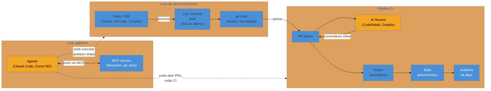
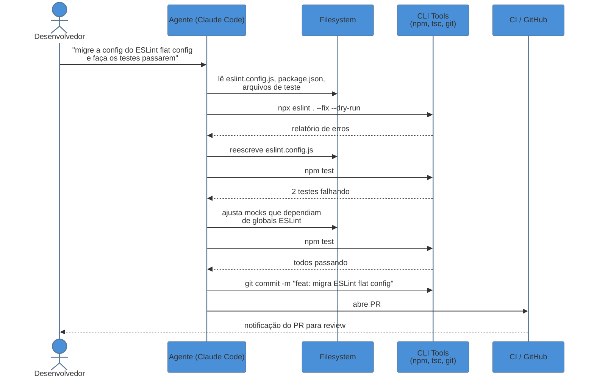
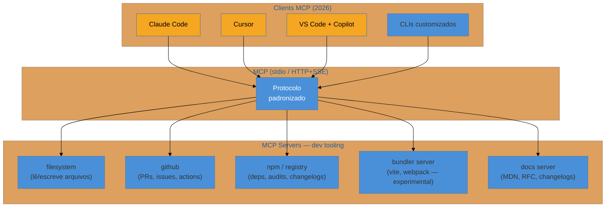
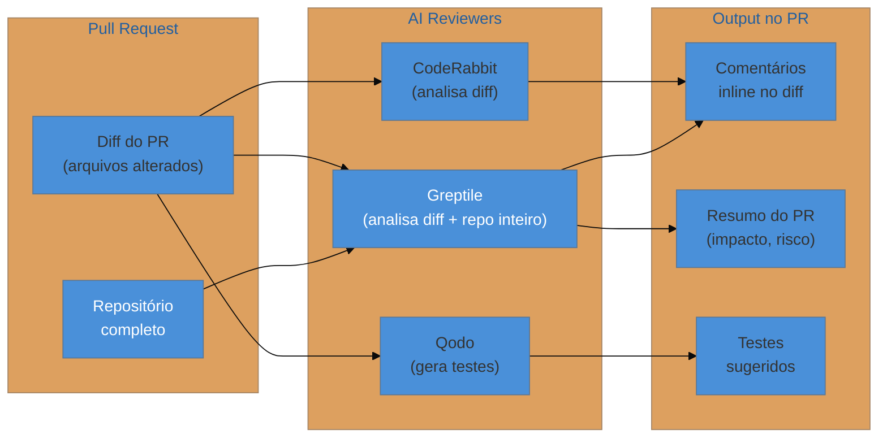
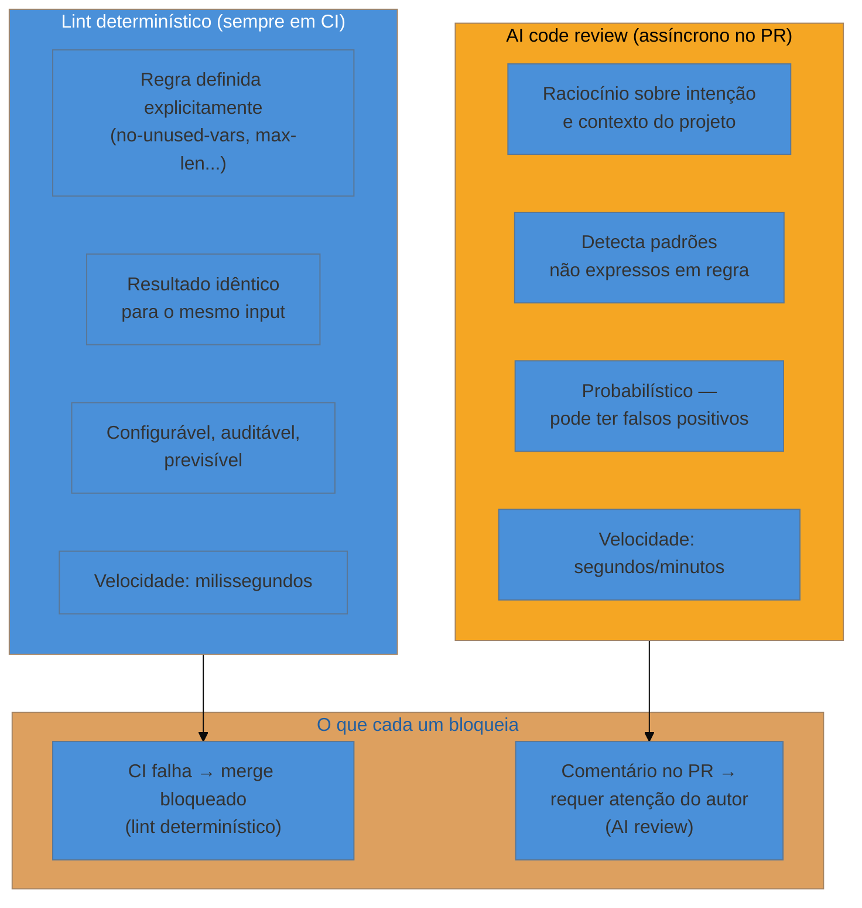

# IA no tooling e build

> [!abstract] TL;DR
> IA entrou no tooling em 2024–2026 por três portas simultâneas: **review de PR** (CodeRabbit, Greptile), **agentes de codificação** (Claude Code, Cursor) que executam tarefas no repositório inteiro, e **MCP** — o protocolo que conecta qualquer LLM a qualquer ferramenta de dev. O que NÃO muda: lockfiles continuam determinísticos, CI ainda é a última barreira de contelúdo, e alucinação de dependência é o novo "NPM typosquatting" que você precisa conhecer. O risco de hype é real — IA acelera um bom pipeline, mas não substitui engenharia de build disciplinada. Em 2026, times maduros usam IA como copiloto do tooling, não como piloto automático.

---

## O momento em que o tooling ganhou memória

Pense em como um pipeline de build sempre funcionou: você escreve uma regra no `eslint.config.js`, o CI roda, falha, você ajusta. Determinístico, auditável, sem surpresa. O computador executa exatamente o que você descreveu — sem interpretação, sem inferência.

Então algo mudou. A partir de 2024, os modelos de linguagem ficaram bons o suficiente para ler um repositório inteiro, entender intenção, e executar ações — não só sugerir. Um agente pode ler o log de erro do webpack, abrir o arquivo de configuração, propor a mudança certa, rodar o build de novo, e checar se funcionou. Sem você digitar nada.

Isso não é mais autocompletar. É tooling com capacidade de raciocinar sobre o projeto.

A questão não é mais "será que IA vai entrar no tooling?" — já entrou. A questão é: *onde ela agrega valor, onde ela introduz risco, e o que o seu pipeline determinístico precisa continuar garantindo sem delegar à IA*.

---

## Onde a IA se encaixa no pipeline

Antes de entrar em cada ferramenta, vale mapear visualmente onde a IA pode (e não pode) intervir.



A distinção cromática importa: azul são os estágios que devem permanecer determinísticos e auditáveis — onde a saída é a mesma dado o mesmo input. Âmbar é onde a IA opera: review, sugestões, execução de tarefas de alto nível. Os dois convivem, mas não são intercambiáveis.

---

## Agentes de codificação como parte do toolchain

A pergunta clássica sobre Claude Code, Cursor, Copilot ou Aider é "qual IDE é melhor?" — mas essa é a pergunta errada. A questão mais interessante em 2026 é: **quando o agente de codificação vira uma ferramenta do toolchain, não só do desenvolvedor?**

Cursor ou Claude Code são, na prática, um processo que pode:

- Ler o filesystem inteiro do repositório
- Executar comandos (`npm run build`, `tsc --noEmit`, `git diff`)
- Editar arquivos, criar branches, abrir PRs
- Iterar até um critério ser satisfeito ("faça o build passar")

Isso é fundamentalmente diferente de autocompletar código. É um processo com acesso ao mesmo toolchain que o desenvolvedor tem — e com capacidade de raciocinar sobre o resultado.



O fluxo acima não é hipotético — é o que Claude Code faz em modo `-p` (não-interativo) ou via rotinas agendadas. O agente itera sobre o problema usando o toolchain exatamente como um dev faria no terminal.

> [!warning] O agente não substitui o entendimento do toolchain
> Um agente que tenta migrar a configuração do webpack para Vite sem você entender as diferenças entre os dois vai iterar no escuro — e pode produzir uma configuração que "passa no build" mas que tem comportamento incorreto em produção (ex: code splitting quebrando lazy routes, polyfills faltando para browsers-alvo). Agentes amplificam competência. Não a substituem.

### Claude Code vs Cursor: filosofia diferente, uso complementar

Em 2026, a maioria dos times maduros usa os dois com papéis distintos:

| Dimensão | Cursor | Claude Code |
|---|---|---|
| **Filosofia** | IDE-first — você dirige, IA assiste | Agent-first — IA dirige, você revisa |
| **Granularidade** | Linha a linha (autocomplete, edição inline) | Tarefa a tarefa (objetivo → execução) |
| **Contexto** | Arquivo aberto + workspace | Repositório inteiro (até 1M tokens) |
| **Melhor para** | Edição contínua no fluxo de dev | Tarefas isoladas, migração, debugging pesado |
| **No toolchain** | Extensão de IDE; menos headless | Roda em CI/CD, agendado, headless |

---

## MCP: o protocolo que conecta IA ao tooling

O Model Context Protocol (MCP) é o padrão que explica por que "IA no tooling" virou infraestrutura em 2026, não só feature de IDE.

> [!info] MCP em detalhe
> O protocolo, os primitivos (tools, resources, prompts) e a arquitetura cliente-servidor estão documentados com profundidade em [[03-Dominios/Tecnologia/IA/MCP/01 - O que é MCP e por que importa|O que é MCP e por que importa]]. Esta seção foca no uso específico dentro do loop de dev e build.

A ideia central: em vez de cada agente de codificação ter integrações proprietárias com cada ferramenta (GitHub, npm, bundler, banco, docs), um MCP *server* expõe ferramentas padronizadas que qualquer cliente MCP pode usar. Resultado: você configura uma vez, qualquer agente usa.

Para o tooling, isso tem uma implicação direta. Imagine que você quer que o agente possa:

1. Ler o output do bundler
2. Consultar o histórico de dependências
3. Abrir issues no GitHub quando encontrar um bug

Você não precisa escrever integrações customizadas para cada agente. Você cria (ou usa) MCP servers para cada um desses recursos, e qualquer agente MCP-compatível (Claude Code, Cursor, VS Code Copilot) os usa.

### Exemplo: MCP server no loop de build

Abaixo, um exemplo concreto de como adicionar um MCP server de filesystem ao Claude Code para permitir que o agente acesse e manipule arquivos de configuração do projeto:

```json
// .claude/settings.json — exemplo de MCP server configurado
{
  "mcpServers": {
    "filesystem": {
      "command": "npx",
      "args": [
        "-y",
        "@modelcontextprotocol/server-filesystem",
        "/home/user/projeto"
      ]
    },
    "github": {
      "command": "npx",
      "args": ["-y", "@modelcontextprotocol/server-github"],
      "env": {
        "GITHUB_PERSONAL_ACCESS_TOKEN": "<token>"
      }
    }
  }
}
```

Com essa configuração, o agente pode:
- Ler e escrever arquivos do projeto via `filesystem` server
- Listar PRs, criar issues, comentar em código via `github` server

O ecossistema de MCP servers para dev tooling cresceu rapidamente: em meados de 2026, o GitHub lista mais de 13.000 servers, e a categoria de ferramentas de desenvolvimento (git, bundlers, linters, CIs) é uma das mais populares.



> [!question]- Preciso criar meu próprio MCP server para o build do meu projeto?
> Não necessariamente. Para os casos mais comuns (filesystem, git, GitHub, npm registry), existem servers oficiais e da comunidade prontos para usar. Um MCP server customizado faz sentido quando você tem um sistema proprietário — um dashboard de build interno, um registry privado, ou uma ferramenta de CI específica da empresa — que você quer que o agente entenda como contexto. Para começar, os servers oficiais do SDK do MCP cobrem 80% dos casos.

---

## IA em code review: o que funciona e o que ainda falha

A integração mais madura de IA no pipeline em 2026 é o review automatizado de PR. Ferramentas como **CodeRabbit**, **Greptile**, e **Qodo** funcionam como revisores assíncronos: quando um PR é aberto, elas analisam o diff e postam comentários.

### Como eles diferem

A diferença arquitetural importa para entender o que cada ferramenta consegue fazer:

**CodeRabbit** — revisa o diff do PR em isolamento. Muito bom em detectar problemas locais: loops sem break, null não tratado, inconsistência de nomenclatura, imports não utilizados, edge cases óbvios. Não indexa o repositório inteiro, então não detecta *quebras de contrato cross-arquivo* (ex: você renomeia uma função que é usada em 15 outros arquivos — o CodeRabbit vê só os arquivos no diff).

**Greptile** — indexa o repositório inteiro como grafo de dependências. Revisa o diff *no contexto de todo o codebase*. Detecta regressions arquiteturais, mudanças que quebram contratos implícitos em outros módulos, e padrões inconsistentes com o restante do projeto. Em benchmarks independentes de 2026, taxa de detecção de bugs de 82% vs 44% do CodeRabbit — mas gera mais comentários "falso positivo" que precisam de triagem.

**Qodo** — foco em testes: analisa o código e propõe testes unitários que cobrem os casos identificados no review.



### O que review por IA não substitui

> [!warning] Review de IA é complementar, não substituto
> Review por IA é bom em detectar sintomas: padrão errado, null não tratado, teste faltando. É ruim em avaliar *intenção*: se a mudança resolve o problema certo, se o trade-off de performance vale para esse contexto, se a abstrações introduzida vai envelhecer bem. Isso exige conhecimento do domínio e do histórico do projeto — que só o time tem. Use IA para elevar o nível mínimo do review, não para eliminar o review humano.

---

## Migração assistida por IA e codemods

Codemods — scripts que aplicam transformações sintáticas a código em escala — existem desde o `jscodeshift` do Facebook (2015). O que mudou em 2026 é que você pode *descrever a transformação em linguagem natural* e ferramentas como **Codemod.com** ou agentes de codificação geram o script automaticamente.

**O fluxo prático** para uma migração de webpack para Vite em um projeto real:

```
1. Você pede ao agente:
   "Analise o webpack.config.js e mapeie as equivalências para vite.config.ts"

2. O agente lê a config, lista as diferenças:
   - require() vs import()
   - webpack.DefinePlugin → vite.define
   - publicPath → base
   - file-loader → asset modules integrados
   - html-webpack-plugin → plugin Vite nativo

3. Agente gera vite.config.ts inicial com comentários explicando cada mapeamento

4. Agente roda: vite build && vite preview
   → detecta erros (ex: process.env não disponível no cliente)
   → ajusta import.meta.env

5. Agente roda testes, detecta falhas por mudança de resolve
   → corrige paths no tsconfig

6. Você revisa o diff final, entende cada mudança, aceita ou refina
```

Esse fluxo não é "IA faz a migração". É "IA faz o trabalho mecânico de mapeamento e iteração, você valida o raciocínio e as bordas". A distinção importa: migrações complexas têm edge cases que o agente vai errar (module federation, SSR config, plugins proprietários), e esses erros só aparecem em produção se você não entender o que foi gerado.

> [!warning] Alucinação de dependências: o risco novo
> Um agente que sugere `vite-plugin-meu-plugin` pode estar alucinando — o pacote pode não existir, ou pode ser um pacote legítimo que foi abandonado em 2023. Em migrações assistidas por IA, **sempre confirme que cada dependência sugerida existe no npm com downloads ativos**, especialmente plugins de bundler. Veja [[24 - Supply chain e segurança de dependências]] para o contexto completo de riscos de supply chain.

---

## Lint por IA vs lint determinístico

Existe uma confusão frequente sobre o papel da IA em relação às ferramentas de lint tradicionais. Elas não competem — resolvem problemas diferentes.

**ESLint, Biome, oxlint** — regras determinísticas, definidas explicitamente, que rodam em microsegundos e produzem o mesmo resultado sempre. Você sabe exatamente por que uma regra falhou, pode configurar, desligar, criar exceções. Fundamentais para CI.

**AI code review (CodeRabbit, Greptile)** — raciocínio probabilístico sobre o *significado* do código. Detecta padrões que nenhuma regra estática capturaria: "este if/else poderia ser simplificado com early return dado o contexto desta função", ou "essa mudança parece inconsistente com o padrão de tratamento de erro nas outras rotas do módulo".



A regra prática: lint determinístico bloqueia o merge. Review por IA informa a decisão do merge. Nunca inverta isso — um sistema onde IA bloqueia o merge com base em raciocínio probabilístico vai criar ruído e frustração no time.

Veja [[16 - Linting, formatting e git hooks]] para o setup completo do lint determinístico, que permanece a base mesmo com IA no pipeline.

---

## O que NÃO muda: o que o tooling determinístico continua garantindo

Depois de ver onde a IA agrega, é igualmente importante nomear o que ela não substitui — porque esse é o ponto onde o hype de 2025–2026 mais induz erro.

**Lockfiles são ainda mais críticos, não menos.** Um agente que sugere atualizar uma dependência pode fazer isso com uma versão que introduz breaking change ou vulnerabilidade. O lockfile é o contrato imutável que garante que o que rodou no CI é o que vai para produção. Nunca delegar a geração ou modificação de lockfile à IA sem revisão.

**CI é a última barreira, não o agente.** Agentes cometem erros — às vezes passam no build local mas têm problemas em ambiente limpo, ou deixam código que falha em browsers menos comuns. CI garante o ambiente limpo, os testes de regressão, e a auditoria de segurança. Isso é determinístico por design.

**Reprodutibilidade > velocidade.** Se o agente gera um build mais rápido mas que produz output diferente dependendo de quando é executado (race condition em paralelismo, timestamp embutido, ordem de resolução não-determinística), isso é pior do que um build lento e determinístico. O agente pode ajudar a diagnosticar flakiness — mas não pode ser a causa dela.

```mermaid
%%{init: {"theme": "base", "themeVariables": {"primaryColor": "#4A90D9"}}}%%
graph LR
    subgraph PERMANENTE["O que o tooling determinístico sempre garante"]
        P1["Lockfile\n(mesma dep, sempre)"]
        P2["CI limpo\n(ambiente reprodutível)"]
        P3["Build determinístico\n(mesmo input → mesmo output)"]
        P4["Auditoria de segurança\n(npm audit, Dependabot)"]
        P5["Type-checking\n(tsc --noEmit)"]
    end

    subgraph IA_ZONA["Onde IA ajuda (mas não substitui)"]
        I1["Review de PR\n(complementa, não bloqueia)"]
        I2["Migração assistida\n(mecânico + iteração)"]
        I3["Diagnóstico de build\n(lê logs, sugere fixes)"]
        I4["Codegen de config\n(ponto de partida, não final)"]
    end

    PERMANENTE -->|"base não negociável"| IA_ZONA

    style PERMANENTE fill:#4A90D9,color:#fff
    style IA_ZONA fill:#F5A623,color:#000
```



---

## Casos práticos

### Caso 1: Agente diagnosticando um build flaky no CI

Imagine um cenário real: o build de produção falha em 1 de cada 10 execuções no CI com um erro de timeout em um plugin Vite de imagens. O erro não se reproduz localmente.

Com um agente de codificação configurado com acesso ao filesystem e ao histórico de CI:

```bash
# Você descreve o problema:
claude "o build falha intermitentemente no CI com timeout no vite-plugin-imagemin.
Os logs estão em .ci/last-failure.log. Analise e proponha solução."

# O agente:
# 1. Lê .ci/last-failure.log
# 2. Lê vite.config.ts e as opções do plugin
# 3. Identifica que o plugin usa workers sem timeout configurado
# 4. Lê a documentação do plugin via MCP docs server
# 5. Propõe: adicionar timeout: 30000 e fallback gracioso
# 6. Edita vite.config.ts
# 7. Sugere teste de reprodução local: CI=true vite build
```

O que o agente fez aqui é trabalho mecânico de diagnóstico: leu logs, cruzou com config, consultou docs. Um dev sênior chegaria à mesma conclusão — mas levaria 30–60 minutos de investigação. O agente leva 2 minutos.

O que o agente *não fez*: garantir que a solução é a certa para o contexto (talvez o timeout alto seja sinal de que o plugin está processando imagens demais e a solução real é compressão em CI-separate-step). Essa decisão arquitetural fica com você.

---

### Caso 2: Review de migração ESLint flat config

Em 2024, o ESLint migrou para "flat config" (eslint.config.js), descontinuando o formato `.eslintrc`. Muitos projetos em 2026 ainda usam o formato antigo.

Com CodeRabbit configurado no repositório:

```markdown
<!-- PR: "migra ESLint para flat config" -->
<!-- CodeRabbit comenta automaticamente: -->

**CodeRabbit**: A migração de `.eslintrc.json` para `eslint.config.js` parece correta para
as regras principais. Observações:

1. `env: { browser: true }` do `.eslintrc` equivale a `globals` do `eslint-globals` package
   na flat config — não está mapeado na sua migração.
2. `ignorePatterns` virou `ignores` no flat config — mas você manteve `ignorePatterns` no
   arquivo novo, que será ignorado silenciosamente.
3. A rule `import/order` que você desativou nos arquivos de teste continua ativa na flat config
   porque o array de override não foi portado corretamente.
```

Esse tipo de revisão detecta erros sutis de mapeamento de config que um dev distraído (ou um agente que fez a migração mecanicamente) pode deixar passar. O CodeRabbit não entende o *porquê* da migração, mas entende a *semântica* do diff.

---

## Armadilhas comuns

> [!warning] Armadilha 1: confiar no agente para gerar lockfile
> Agentes de codificação podem sugerir `npm install <pacote>` como parte de uma solução. Se você executa isso sem revisar, o lockfile muda — potencialmente resolvendo versões diferentes das que estavam fixadas. Sempre revise mudanças no `package-lock.json` ou `pnpm-lock.yaml` com o mesmo cuidado que revisaria código.

> [!warning] Armadilha 2: usar AI review como gate de CI
> Ferramentas de AI review são probabilísticas e têm latência (segundos a minutos). Usá-las como bloqueadoras obrigatórias de merge cria ruído, falsos positivos, e frustração. O papel correto é "reviewer assíncrono que informa a decisão humana".

> [!warning] Armadilha 3: alucinação de MCP servers
> Ao pedir ao agente para configurar um MCP server para uma ferramenta específica, ele pode sugerir um server que não existe ou está desatualizado. Sempre confirme o package no npm com downloads ativos antes de adicionar ao settings. Exemplo: `@modelcontextprotocol/server-webpack` pode não existir — verifique.

> [!warning] Armadilha 4: migração assistida sem entender o output
> Um agente pode fazer a migração de webpack para Vite e o build "passar". Mas Module Federation, SSR config, e plugins proprietários têm semânticas radicalmente diferentes entre os dois. Se você não entende o que foi gerado, vai descobrir os bugs em produção, não no review.

> [!warning] Armadilha 5: delegar type-checking ao agente
> Agentes como Claude Code rodam `tsc --noEmit` como ferramenta, mas podem parar de iterar antes de resolver todos os erros de tipo se o prompt não for preciso. `tsc --noEmit` deve ser uma etapa obrigatória e bloqueante no CI — não uma etapa "o agente vai rodar se achar necessário".

---

## Como explicar em inglês

In 2026, AI has entered the build toolchain through three main channels: **AI code review bots** that comment on PRs (CodeRabbit, Greptile), **agentic coding tools** that can read the whole repo, run shell commands, and iterate autonomously (Claude Code, Cursor background agents), and **MCP** — the Model Context Protocol — which standardizes how any LLM connects to any dev tool.

The key distinction worth articulating in an interview: AI accelerates the *reasoning* parts of tooling — diagnosing a flaky build, mapping migration equivalences, spotting subtle anti-patterns across a diff — but does not replace *deterministic* tooling. Lockfiles, reproducible CI environments, and type-checking must remain deterministic and auditable. AI operates in parallel, not as a replacement.

On MCP specifically: it solves the N×M integration problem. Before MCP, each agentic tool (Claude Code, Cursor, Copilot) had to build its own integration with each dev tool. MCP creates a standard: you expose a dev tool as an MCP server once, and every MCP-compatible client can use it. In 2026, the ecosystem has 13,000+ servers on GitHub, and major CI/CD vendors are adding MCP support.

On AI code review: the architectural difference between tools like CodeRabbit (diff-only) and Greptile (whole-repo indexing) matters. Diff-only tools catch local issues; repo-aware tools catch cross-file regressions. Neither replaces human review of *intent and trade-offs*.

The honest 2026 take: AI is a force multiplier for a competent engineer who understands the toolchain. It's a liability for someone who doesn't — because the errors it makes are subtle and confident.

### Vocabulário-chave

| Português | Inglês |
|---|---|
| agente de codificação | coding agent / agentic coding tool |
| review de PR por IA | AI-powered PR review |
| codemod assistido | AI-assisted codemod |
| protocolo de contexto de modelo | Model Context Protocol (MCP) |
| ferramental determinístico | deterministic tooling |
| alucinação de dependência | dependency hallucination |
| pipeline de integração contínua | CI/CD pipeline |
| loop agêntico | agentic loop |
| server MCP | MCP server |
| revisão inline | inline review comment |
| configuração flat | flat config |
| build reprodutível | reproducible build |

---

## O que vem a seguir

Com IA no tooling, a pergunta natural é: onde isso tudo converge? A próxima nota fecha a trilha com um decision tree — qual ferramenta para qual problema, o que o mercado de entrevistas pergunta sobre tooling em 2026, e para onde o ecossistema aponta.

- [[index|trilha Tooling e Build]] — visão geral das 3 fases e onde esta nota se encaixa
- [[16 - Linting, formatting e git hooks]] — o lint determinístico que continua sendo a base: ESLint, Biome, oxlint, Husky
- [[24 - Supply chain e segurança de dependências]] — alucinação de deps encontra supply chain: o risco combinado de IA + dependências maliciosas
- [[03-Dominios/Tecnologia/IA/Agentes de Codificação/05 - Claude Code — terminal-first agent|Claude Code — terminal-first agent]] — o agente usado como exemplo nesta nota em profundidade
- [[03-Dominios/Tecnologia/IA/MCP/01 - O que é MCP e por que importa|O que é MCP e por que importa]] — o protocolo que conecta IA ao tooling, com os três primitivos (tools, resources, prompts)
- [[03-Dominios/Tecnologia/IA/Anatomia de Agents/02 - O loop ReAct e native tool use|O loop ReAct e native tool use]] — a mecânica do loop agêntico que explica como agentes de codificação iteram
- [[03-Dominios/Tecnologia/IA/Agentes de Codificação/16 - O loop agentic — plan, act, observe|O loop agentic — plan, act, observe]] — plan/act/observe aplicado a tarefas de dev

---

## Resumo em uma frase

IA entrou no tooling como copiloto — acelera diagnóstico, migração e review, mas o pipeline determinístico (lockfiles, CI, type-check) continua sendo o que garante que o que você entrega é o que você testou.

---

## Fontes

- **WorkOS** — [*Everything your team needs to know about MCP in 2026*](https://workos.com/blog/everything-your-team-needs-to-know-about-mcp-in-2026) — visão geral de adoção e ecossistema MCP em 2026
- **Greptile** — [*Best Code Review Tools 2026: AI Code Review Tools Compared*](https://www.greptile.com/content-library/best-ai-code-review-tools) — benchmark comparativo de ferramentas de AI review com taxas de detecção
- **The New Stack** — [*Cursor, Claude Code, and Codex are merging into one AI coding stack nobody planned*](https://thenewstack.io/ai-coding-tool-stack/) — convergência dos agentes de codificação em 2026
- **Codemod.com** — [*From Mocha to Vitest migration*](https://codemod.com/blog/mocha-to-vitest-migration) — exemplo de migração assistida por codemod com IA
- **PkgPulse** — [*Webpack to Vite Migration: Large Codebases 2026*](https://www.pkgpulse.com/blog/webpack-to-vite-migration-large-codebases-2026) — contexto de migração em projetos grandes com dados do Vite 8 / Rolldown
- **Builder.io** — [*Claude Code vs Cursor: What to Choose in 2026*](https://www.builder.io/blog/cursor-vs-claude-code) — comparativo de filosofia e uso dos dois agentes líderes
