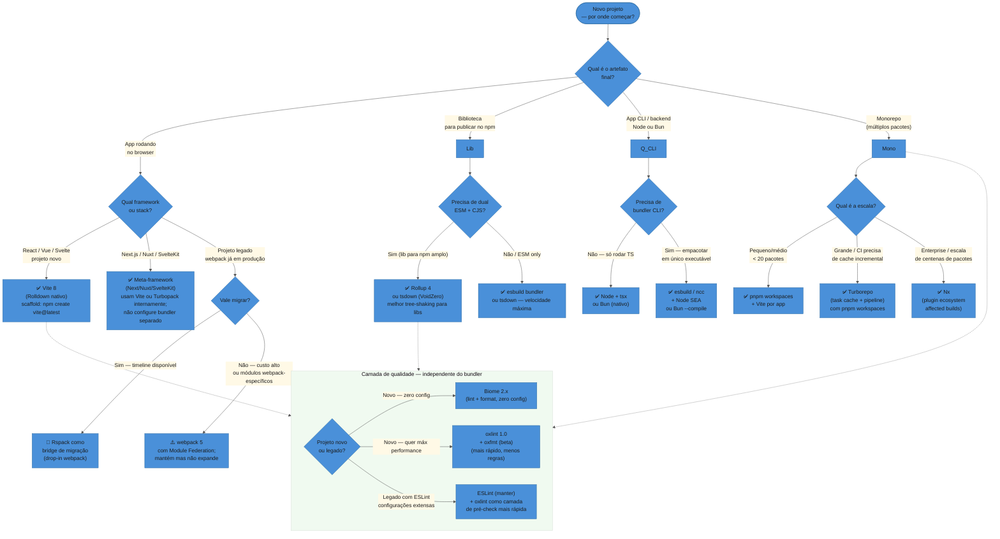
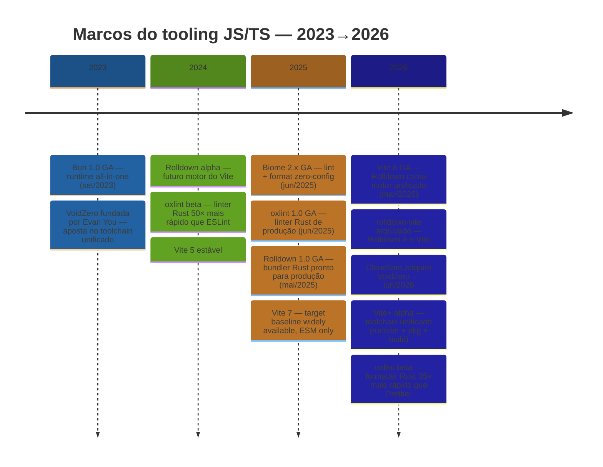
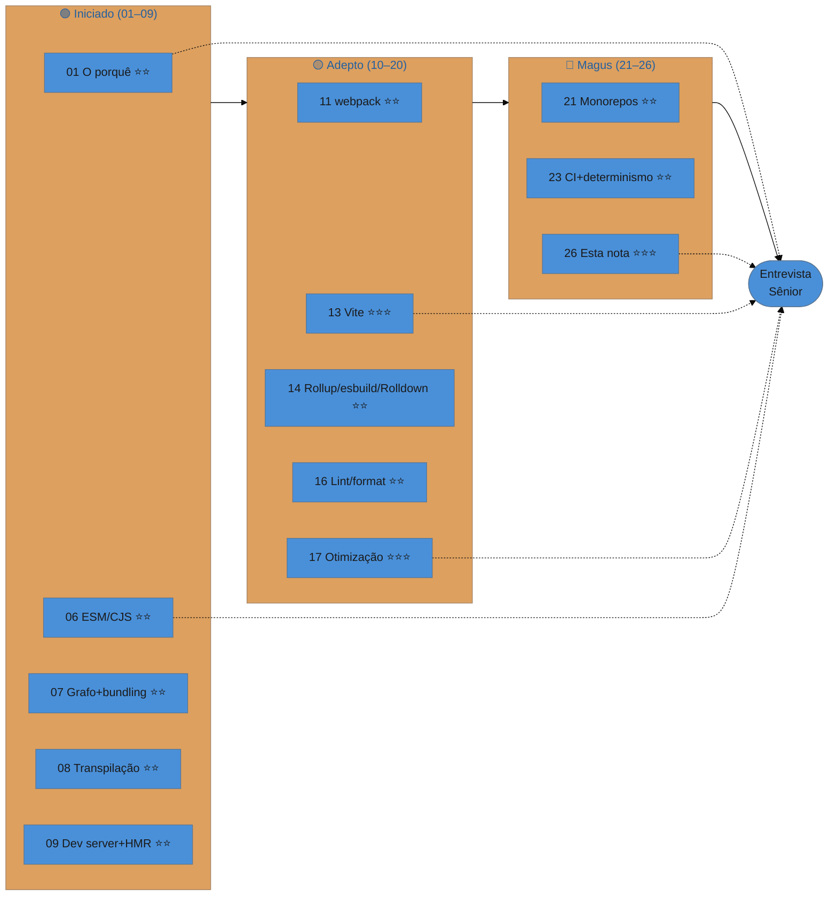
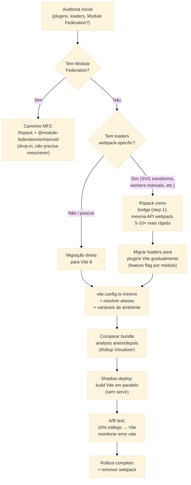

# Decision tree, futuro e entrevista

> [!abstract] TL;DR
> O ecossistema de tooling JS/TS está em um ponto de inflexão: o modelo "muitas ferramentas especializadas" está cedendo para "poucos toolchains unificados em Rust". Vite 8 + Rolldown (produção, março/2026) unificou dev e prod num único motor. Biome 2.x e oxlint 1.0 (junho/2025) tornam lint + format uma decisão binária. Bun consolidou sua posição como all-in-one. E a Cloudflare adquiriu a VoidZero em junho/2026, apostando que o futuro do tooling é inseparável do runtime da web. Para entrevistas seniores, o que importa não é decorar flags — é articular o *porquê* de cada escolha, em inglês, com raciocínio de trade-offs.

Esta é a nota CAPSTONE da trilha. As 25 notas anteriores carregam o lastro; aqui costuramos tudo em três entregáveis concretos: (1) uma árvore de decisão para escolher a ferramenta certa por tipo de projeto, (2) um mapa do futuro do ecossistema com o que já aconteceu em 2026, e (3) um bloco de entrevista com perguntas reais, respostas-modelo e vocabulário técnico em inglês.

---

## 1. A tese da trilha

Tooling existe porque há um gap entre o que você escreve (ESM, TypeScript, JSX, CSS moderno, dependências externas) e o que roda (JavaScript compatível, otimizado, empacotado, entregue). O pipeline `resolver → transpilar → empacotar → otimizar → servir` é a espinha da trilha, e cada ferramenta que estudamos vive em algum ponto desse eixo.

A trajetória histórica — de [[01 - Por que tooling e build existem|scripts inline]] a [[02 - A evolução do tooling JS - de script ao bundler moderno|task runners]] a [[11 - webpack - o veterano|bundlers]] a [[13 - Vite a fundo|dev servers com ESM nativo]] — não é nostalgia: é o mapa de decisão. Entender por que cada geração nasceu explica quando cada ferramenta ainda faz sentido.

A tese central que um sênior precisa articular:

> **Ferramenta de build certa é aquela que fecha o seu gap específico com o menor custo de manutenção. Velocidade importa; corretude importa mais; a curva de evolução da equipe importa tanto quanto os dois.**

---

## 2. Árvore de decisão — que ferramenta pra que projeto

O diagrama abaixo responde a pergunta "por onde começar" dado o tipo de projeto. Não é prescritivo no nível de configuração — é a árvore de entrada para chegar à ferramenta certa antes de ler a doc.



> [!info] Leitura do diagrama
> As setas sólidas são decisões de bundler/framework. As setas tracejadas lembram que a camada de qualidade (lint/format) é ortogonal — você escolhe Biome, oxlint ou ESLint independentemente do bundler escolhido acima.

### Quando cada ferramenta ganha

| Cenário | Ferramenta | Motivo principal |
|---|---|---|
| SPA novo (React/Vue/Svelte) | Vite 8 | HMR em ESM nativo, Rolldown unificado, ecossistema maduro |
| Meta-framework (Next/Nuxt) | bundler interno | Next usa Turbopack; Nuxt usa Vite; não configure manualmente |
| Lib para npm | Rollup 4 / tsdown | Tree-shaking superior; dual ESM+CJS sem gambiarras |
| Migração de webpack legado | Rspack | Drop-in replacement; não quebra plugins webpack |
| Monorepo médio | pnpm + Turborepo | Cache incremental simples, curva baixa |
| Monorepo enterprise | Nx | Affected builds, grafo de dependências, plugin ecosystem |
| CLI / script Node | tsx ou Bun | Zero config; Bun roda TS nativo sem transpilação |
| Qualidade greenfield | Biome 2.x | Zero config, zero deps externas, lint + format em um |

---

## 3. O futuro do ecossistema — o que já aconteceu em 2026

### 3.1 Linha do tempo consolidada



### 3.2 Vite 8 + Rolldown — o fim da dualidade dev/prod

O problema histórico do Vite era ter **dois motores**: esbuild no dev server (rápido, ESM nativo) e Rollup na produção (mais lento, mas com melhor tree-shaking e plugin ecosystem). Essa dualidade causava bugs reais — comportamentos diferentes de resolução de módulos, tree-shaking, e circular deps entre dev e prod.

Vite 8 (março/2026) resolveu isso: **Rolldown é o motor único**. O dev server e o build de produção usam o mesmo grafo de módulos, as mesmas regras de resolução, os mesmos plugins. A classe inteira de "funciona no dev, quebra em prod" desapareceu.

O ganho de performance: builds de produção 4–20× mais rápidos que Rollup. Rolldown é na faixa de performance do esbuild, mas com a compatibilidade de plugins do Rollup.

Referência: [[14 - Rollup, esbuild e Rolldown]].

### 3.3 A corrida Rust/Go e o toolchain unificado

A tendência de reescrever ferramentas JS em Rust ou Go — que estudamos em [[15 - Turbopack, Rspack e a corrida Rust-Go]] — atingiu maturidade em 2026. O padrão emergente não é mais "ferramenta isolada em Rust" mas **toolchain unificado**:

**VoidZero / Vite+**: o binário `vp` combina Vite 8 + Vitest + oxlint + oxfmt + Rolldown + tsdown em um único zero-config entrypoint com task runner nativo (Vite Task), caching integrado e suporte a monorepo. A aquisição pela Cloudflare (junho/2026) colocou muscle financeiro atrás do projeto, com compromisso público de manter MIT e vendor-agnostic. Performance reportada: oxlint 50–100× mais rápido que ESLint; oxfmt até 30× mais rápido que Prettier. Fonte: [VoidZero — Announcing Vite+](https://voidzero.dev/posts/announcing-vite-plus).

**OXC (oxc-project)**: a ambição é um toolchain completo — parser, linter, formatter, minifier, transformer — todos em Rust, todos integrados. Em 2026: oxlint 1.0 (produção), oxfmt beta, minifier e transformer em progresso. A vantagem arquitetural: quando todos os componentes compartilham o mesmo AST Rust, elimina-se a serialização/desserialização entre etapas — o parser produz um AST que o linter, formatter e bundler consomem diretamente.

**Bun**: continua sua aposta de ser tudo — runtime, package manager, test runner, bundler, e runtime TypeScript nativo. Na versão 1.3.x (2026): production-grade, usado em produção por projetos reais.

> [!question]- Por que a unificação importa para além da performance?
> Pense em como um time de arquitetos trabalha quando cada um usa um sistema de medidas diferente — metros, polegadas, palmos. O prédio pode ficar em pé, mas na junção das partes surgem erros que nenhum arquiteto individualmente cometeu. É exatamente isso que acontece quando parser, linter, formatter, bundler e test runner têm implementações independentes do mesmo JavaScript. Cada um tem sua interpretação do AST, do escopo de variáveis, da resolução de módulos. Bugs surgem na *interface* entre ferramentas, não dentro delas. A unificação resolve o problema na raiz: um único AST, uma única interpretação, zero interface bugs. Biome, OXC, Rolldown e Vite+ estão todos caminhando nessa direção — e a convergência acelerou em 2026.

> [!info] Vite+ em uma linha
> `npm create vite-plus@latest` → projeto com Vite + Vitest + oxlint + oxfmt + Rolldown configurados e integrados. Zero decisões de tooling para um projeto novo greenfield em 2026.

### 3.4 Biome e oxlint — o fim do duopólio ESLint + Prettier

Em 2025–2026, a pergunta deixou de ser "ESLint ou Prettier?" e passou a ser "Biome ou oxlint?". Os dois são Rust, os dois são ordens de magnitude mais rápidos. A diferença prática:

| Critério | Biome 2.x | oxlint 1.0 + oxfmt (beta) | ESLint + Prettier |
|---|---|---|---|
| Performance (lint) | Muito rápido | 2× mais rápido que Biome | Linha de base |
| Performance (format) | Muito rápido | 3× mais rápido que Biome, 35× que Prettier | Linha de base |
| Regras de lint | ~200 | ~500 mas selecionadas | +1000 (via plugins) |
| Plugin ecosystem | Crescendo | JS plugins alpha (2026) | Maduro e vasto |
| Config necessária | Zero | Zero | Alta (sem preset) |
| Dependências | Zero | Zero | Múltiplas |
| Maturidade | GA desde 2024 | GA 1.0 jun/2025 | Maturíssimo |
| Quando usar | Greenfield, DX máxima | Greenfield, velocidade máxima; ou como camada sobre ESLint | Legado, plugins críticos |

Referência: [[16 - Linting, formatting e git hooks]].

### 3.5 IA no tooling — o que mudou

[[25 - IA no tooling e build]] é a nota dedicada; aqui o resumo executivo para entrevista:

A IA entrou no tooling em três camadas:

1. **Geração de configuração**: `vite.config.ts`, `.eslintrc`, `tsconfig.json` são rotineiramente gerados por LLMs — o dev precisa entender o que gerou, não como digitar.
2. **Análise de bundle**: ferramentas como Cursor IDE e plugins de IA visualizam bundle analyzer e sugerem lazy loading / code splitting automaticamente.
3. **Codemod automatizado**: migrar de CRA para Vite, de CommonJS para ESM, de Prettier para Biome — LLMs geram os scripts de migração. O dev valida; não precisa mais escrever do zero.

Para entrevistas: o senior não defende "IA é boa" ou "IA é ruim" — ele articula em que partes do pipeline a IA já tem alta confiabilidade (config, boilerplate, migrate scripts) e onde ainda precisa de revisão crítica (configuração de otimização, análise de bundle de produção, decisões de trade-off).

---

## 4. Comparativos rápidos para entrevista

### npm vs pnpm vs Bun (package manager)

| | npm | pnpm | Bun |
|---|---|---|---|
| Modelo de armazenamento | flat node_modules | content-addressable store + hard links | Cache similar ao pnpm |
| Velocidade | Linha de base | 2–3× npm | 4–10× npm |
| Disk usage | Alto (duplica deps) | Baixo (hard links) | Baixo |
| Monorepo workspaces | ✅ | ✅ (melhor isolamento) | ✅ |
| Phantom deps | Sim (flat) | Não (strict) | Não |
| Quando usar | Default simples | Monorepos, strictness | Projetos Bun-first, CLIs |

Referência: [[03 - Package managers - npm, pnpm, yarn e Bun]].

### Vite vs webpack (a pergunta garantida de entrevista)

| | Vite 8 | webpack 5 |
|---|---|---|
| Dev server | ESM nativo — módulos servidos pelo browser, sem bundle | Bundle incremental + HMR |
| HMR | ~87ms mediana | ~2.1s mediana (2026) |
| Build produção | Rolldown (Rust, unificado) | webpack + loaders |
| Plugin ecosystem | Rolldown-compat + Vite plugins | Vasto (loaders/plugins maduros) |
| Module Federation | Plugin disponível (maturing) | MF v1 e v2 — mais maduro |
| Config complexity | Baixa | Alta |
| Quando usar | Projetos novos, praticamente tudo | Legado, Module Federation complexo |

### ESM vs CJS — a distinção que aparece toda entrevista

```
CJS: require() — síncrono, runtime, opaco para bundler
ESM: import   — estático, compile-time, analisável para tree-shaking

Tree-shaking só funciona com ESM — o bundler precisa saber em
compile time quais exports são usados. CJS é caixa preta.

Interop em 2026: funciona, mas tem custo. pnpm com
node_modules legado = CJS. Libs modernas: "exports" no
package.json com dual ESM+CJS.
```

Referência: [[06 - ESM e CJS e o sistema de módulos]].

---

## 5. Perguntas de entrevista — respostas-modelo

### "Explique a diferença entre dev server e build de produção no Vite."

Em dev, o Vite serve os módulos diretamente via ESM nativo — o browser faz os imports, o servidor não empacota nada. Isso é o que torna o HMR tão rápido: apenas o módulo alterado é revalidado. Em produção, o Vite usa Rolldown (desde a versão 8) para empacotar tudo: aplica tree-shaking, code splitting, minificação, e gera assets com hash para cache de longa duração. A arquitetura é intencionalmente diferente nos dois modos porque os objetivos são opostos — dev quer feedback instantâneo; produção quer tamanho mínimo e entrega otimizada.

**Frase EN:** *"In dev, Vite serves raw ES modules — the browser handles the imports, so there's nothing to bundle. In production, Rolldown kicks in: it resolves the full module graph, applies tree-shaking, code splitting, and minification. Vite 8 unified both modes under Rolldown, which eliminated an entire class of dev/prod divergence bugs."*

> [!question]- O trade-off oculto do ESM nativo no dev — cold start em apps grandes
> ESM nativo é imbatível em HMR: 87ms de mediana vs 2.1s do webpack em apps com 50k linhas. Mas há um trade-off que aparece em apps muito grandes (centenas de módulos): o cold start. Quando você abre o browser pela primeira vez, o servidor precisa servir cada módulo individualmente — e o browser faz centenas de requisições HTTP. Em apps pequenas e médias, isso é imperceptível. Em apps com 1000+ módulos, o primeiro carregamento pode ser mais lento que no webpack, que entrega tudo bundlado. O Turbopack (Vercel/Next.js) tomou a decisão oposta: usa bundling incremental mesmo no dev, evitando o cold start às custas de HMR ligeiramente mais lento. Para entrevistas: articular esse trade-off é o que distingue quem entende a arquitetura de quem decorou que "Vite é mais rápido".

---

### "O que é tree-shaking e por que ele exige ESM?"

Tree-shaking é a eliminação de código não usado (dead code) durante o bundle. Para funcionar, o bundler precisa analisar estaticamente quais exports são consumidos antes de executar qualquer código. ESM permite isso porque os `import` e `export` são declarações estáticas — o bundler sabe o grafo completo em tempo de compilação. CommonJS é dinâmico (`require(someVariable)`), então o bundler não pode determinar em compile time quais partes são usadas — precisa incluir tudo.

**Frase EN:** *"Tree-shaking requires ESM because ESM imports are static declarations — the bundler knows the complete dependency graph at compile time without executing anything. CommonJS uses dynamic `require()` calls, so the bundler can't statically determine what's used and has to include everything."*

Referência: [[17 - Otimização de bundle]].

---

### "Quando você usaria webpack em 2026?"

Para projetos novos: praticamente nunca. Vite tem DX superior, performance melhor, e o plugin ecosystem madurou. Mas webpack ainda ganha em dois cenários concretos: (1) **Module Federation complexo** — quando você tem micro-frontends em produção com compartilhamento de dependências em runtime, a implementação madura do MF v2 do webpack ainda é mais robusta; (2) **migração de legado** — bases de código grandes com loaders webpack específicos (imagens, SVG com transforms, workers configurados a mão) levam tempo para migrar. Nesses casos, Rspack (drop-in replacement em Rust) é o caminho de menor risco: mesma API, 5–10× mais rápido.

**Frase EN:** *"Webpack is the right choice when you have Module Federation at scale — it has the most mature MF implementation. And for large legacy codebases, Rspack is the pragmatic bridge: drop-in webpack API, Rust performance, no plugin rewrites. But for new projects, there's no good reason not to use Vite 8."*

---

### "Por que pnpm em monorepo em vez de npm?"

pnpm resolve o problema de **phantom dependencies** — quando você usa um pacote que está no node_modules mas que não está no seu package.json, só porque outro pacote o instalou como dependência transitiva. npm (com flat node_modules) faz isso silenciosamente; pnpm cria uma estrutura com symlinks onde cada pacote só acessa o que declarou explicitamente. Em monorepos, isso é crítico: sem o isolamento do pnpm, pacotes do workspace podem silenciosamente depender uns dos outros sem declarar. O segundo motivo é espaço: pnpm usa um content-addressable store global com hard links — a mesma versão de uma dep é armazenada uma vez, não uma vez por pacote.

**Frase EN:** *"pnpm solves phantom dependencies — in a flat node_modules layout, you can `require` a package that's not in your package.json because it's a transitive dep of something else. pnpm uses a strict symlink structure so each package can only access what it explicitly declared. For monorepos, that strictness is essential. The disk savings from the global store are a bonus."*

---

### "O que é HMR e como funciona no Vite?"

HMR (Hot Module Replacement) é a atualização de um módulo no browser sem recarregar a página inteira, preservando o estado da aplicação. No Vite, o dev server mantém uma conexão WebSocket com o browser. Quando um arquivo muda, o servidor invalida apenas aquele módulo e seus dependentes diretos no grafo, e envia uma mensagem ao browser com o módulo atualizado. O browser recebe o novo módulo via ESM dinâmico e o framework (React, Vue) aplica a atualização sem perder o estado. A velocidade vem do escopo: o Vite nunca rebundla a aplicação inteira — só revalida o subgrafo afetado.

**Frase EN:** *"HMR works through a WebSocket connection between the dev server and the browser. When a file changes, Vite invalidates just that module and its direct dependents in the module graph, sends the updated module to the browser, and the framework applies the change without a full reload. It's fast because the scope is narrow — never the full app, only the affected subgraph."*

Referência: [[09 - Dev server e HMR]].

---

### "O que é code splitting e quando você o usa?"

Code splitting é dividir o bundle final em múltiplos chunks que são carregados sob demanda, em vez de um único bundle gigante que o browser precisa baixar e parsear inteiro antes de renderizar qualquer coisa. O caso de uso principal é roteamento: cada rota recebe seu próprio chunk, carregado apenas quando o usuário navega até ela. O segundo caso é componentes pesados que não aparecem na tela imediatamente (modais, dashboards avançados, editores rich text). Em Vite/Rolldown, code splitting automático já é aplicado para imports dinâmicos (`import()`); o desenvolvedor controla manualmente via `React.lazy` ou `defineAsyncComponent` no Vue.

**Frase EN:** *"Code splitting divides the bundle into chunks loaded on demand. The browser only downloads what's needed for the initial route, then lazily fetches the rest. I use dynamic imports (`await import('./HeavyComponent')`) at route boundaries and for components that aren't on the critical rendering path. Rolldown/Vite handles the chunk graph automatically — I just mark the split points."*

---

### "O que é o pipeline de tooling e onde cada ferramenta se encaixa?"

```
Código fonte
    ↓ [resolver] — onde está cada módulo? (Node resolution, exports, conditions)
    ↓ [transpilar] — TS→JS, JSX→JS, ESNext→ES compatível (esbuild/SWC/Babel)
    ↓ [empacotar] — une os módulos num grafo (Rolldown/webpack/Rollup)
    ↓ [otimizar] — tree-shaking, minify, split, hash (Rolldown/Terser)
    ↓ [servir] — CDN/servidor/filesystem
```

Cada fase tem ferramentas especializadas, mas os bundlers modernos (Vite/webpack) integram todas. Entender as fases separadamente permite diagnosticar onde um problema está: se imports quebram é o resolver; se o output tem código legado inesperado é o target da transpilação; se o bundle está grande é tree-shaking ou code splitting.

Referência: [[01 - Por que tooling e build existem]], [[07 - O grafo de módulos e o que é bundling]], [[08 - Transpilação e targets]].

---

## 6. Como explicar em inglês

Parágrafos-modelo calibrados para entrevista. Primeira pessoa, postura técnica — não relato de projeto.

> Modern JavaScript tooling solves a fundamental gap: what you write — TypeScript, ESM, JSX, modern CSS, third-party dependencies — and what runs in production — optimized, bundled, compatible JavaScript — are very different things. The entire build pipeline exists to close that gap. Understanding each stage — resolve, transpile, bundle, optimize, serve — is what lets me diagnose problems precisely instead of just rerunning the build and hoping.

> I default to Vite 8 for new browser-targeted projects. The key insight is that its dev server and production build now share the same engine — Rolldown — which eliminates an entire class of bugs that came from dev using esbuild and prod using Rollup. Different module resolution rules meant code that worked in dev silently broke in production. Vite 8 solved that structurally.

> For libraries published to npm, I reach for Rollup or tsdown rather than Vite. Libs need dual ESM and CJS output with precise control over what's bundled versus externalized. Rollup's tree-shaking is purpose-built for that use case — you want the consumer's bundler, not yours, to do the final dead-code elimination.

> In monorepos, the question is usually "do I need task orchestration or just workspaces?" For most teams, pnpm workspaces plus Turborepo is the right answer — pnpm gives strict dependency isolation, Turbo adds build caching with a simple pipeline definition. Nx makes sense at enterprise scale when you need affected-only builds across hundreds of packages and a richer plugin model.

> On linting and formatting: I've moved to Biome for new projects. It's lint and format in one binary, zero configuration, zero external dependencies, and it's orders of magnitude faster than ESLint plus Prettier. For existing projects where ESLint has extensive custom rules, I keep ESLint and layer oxlint on top as a fast pre-check — it catches the common issues instantly, and ESLint handles the project-specific rules.

> The most important thing I've learned about build tooling is that configuration complexity is a cost, not a feature. The ideal is a tool that works correctly with zero config and lets you opt into complexity when your use case genuinely requires it. That's the direction the ecosystem has moved — Vite, Biome, Bun, Rolldown are all designed around that principle.

> When it comes to system design questions around CI build performance, my frame is always: measure first, parallelize second, cache third. The common mistake is adding caching before you understand which steps are actually slow. Once you have visibility, parallelize the independent steps — typecheck, lint, and test can usually run concurrently. Then add remote caching — in a monorepo, Turborepo's remote cache with affected-only task runs is the biggest single lever. Only after those do you look at replacing tools — switching from Jest to Vitest, or from ESLint to oxlint, gives real wins but requires migration effort.

> On module federation in 2026: MF2 changed the picture significantly. It's no longer a webpack-exclusive concern — the `@module-federation/enhanced` package works across webpack, Rspack, Vite, and Rollup with a unified runtime. For teams doing micro-frontends, MF2 on Rspack is the pragmatic path: you get webpack API compatibility, Rust-level build performance, and MF2's type-sharing and manifest-based host discovery.

---

## 7. Vocabulário-chave PT→EN consolidado

| Português | English |
|---|---|
| pipeline de build | build pipeline |
| empacotador / bundler | bundler |
| grafo de módulos | module graph |
| resolução de módulos | module resolution |
| transpilação | transpilation / transpiling |
| downleveling | downleveling |
| árvore de dependências | dependency tree |
| agitação de árvore | tree-shaking |
| divisão de código | code splitting |
| carregamento sob demanda | lazy loading / on-demand loading |
| substituição de módulo quente | hot module replacement (HMR) |
| servidor de desenvolvimento | dev server |
| minificação | minification / minifying |
| mapa de fonte | source map |
| rastreamento de conteúdo | content hashing |
| cache de longa duração | long-term caching |
| efeito colateral | side effect |
| dependência fantasma | phantom dependency |
| gerenciador de pacotes | package manager |
| armazenamento de conteúdo endereçável | content-addressable store |
| hard link | hard link |
| versão de semântica | semantic versioning / semver |
| arquivo de travamento | lockfile |
| escopo | scope / workspace |
| espaço de trabalho | workspace |
| monorepo | monorepo |
| orquestração de tarefas | task orchestration |
| build incremental | incremental build |
| build afetado | affected build |
| cacheamento de tarefas | task caching |
| execução única de aplicativo | single executable application (SEA) |
| ferramenta de qualidade | quality tooling |
| lintagem | linting |
| formatação | formatting |
| hook de git | git hook |
| alvo de compilação | compilation target |
| polyfill | polyfill |
| shim | shim |
| compilação cruzada | cross-compilation |
| camada de compatibilidade | compatibility shim / compat layer |
| resolução de módulos | module resolution |
| mapa de exportações | exports map |
| condição de exportação | export condition |
| dependência transitiva | transitive dependency |
| dependência par | peer dependency |
| dependência aninhada | nested dependency |
| empacotamento de executável | executable bundling |
| análise estática | static analysis |
| árvore de chamadas | call tree |
| grafo de dependências | dependency graph |
| arquivo de manifesto | manifest file |
| linha de base amplamente disponível | widely available baseline |
| efeito colateral de importação | import side effect |
| declaração de tipo | type declaration / .d.ts |
| inferência de tipo | type inference |
| modo estrito | strict mode |
| registro de pacotes | package registry |
| assinatura de proveniência | provenance attestation |
| lista de materiais de software | software bill of materials (SBOM) |
| build distribuído | distributed build |
| build afetado | affected build |
| grafo de tarefas | task graph |
| cache de artefato | artifact cache |
| paralelismo de tarefas | task parallelism |

---

## 8. Red flags e green flags na entrevista

### Red flags — o que sinaliza nível júnior/pleno em papel sênior

- **"Vite é mais rápido que webpack"** sem explicar por quê — a resposta rasa. O entrevistador quer ouvir: "Vite serve ESM nativo no dev, então o browser faz os imports e não há bundle no dev server — o HMR revalida só o módulo alterado, não a aplicação inteira."
- **Confundir transpilação com bundling** — "o Babel empacota o código" está errado. Babel transforma; o bundler empacota. São etapas diferentes do pipeline. Ver [[08 - Transpilação e targets]].
- **"Tree-shaking remove código desnecessário"** sem mencionar ESM — tree-shaking é análise estática de grafo de importações; só funciona com ESM estático. Libs que usam CJS não podem ter tree-shaking aplicado.
- **"pnpm é mais rápido que npm"** sem explicar o modelo de armazenamento — a velocidade é consequência do content-addressable store com hard links; o benefício real para monorepos é o isolamento de phantom dependencies.
- **Não saber o que é code splitting** — ou saber a definição mas não saber como aplicar (dynamic import, React.lazy, route-based splitting).
- **"Não uso monorepo porque é complicado"** sem alternativa — sênior articula quando monorepo vale o custo e quando não vale.
- **Não ter opinião sobre lint/format** — em 2026, "eu uso ESLint com a config padrão" sem saber Biome ou oxlint sinaliza que não acompanhou o ecossistema.

### Green flags — o que impressiona

- **Articular o pipeline completo** — resolver → transpilar → empacotar → otimizar → servir, e encaixar cada ferramenta na fase certa.
- **Explicar por que Vite tem dois modos** e o que Vite 8 resolveu ao unificá-los — mostra que você entende o problema, não só a solução.
- **Mencionar phantom dependencies** ao explicar pnpm — mostra que você pensa em corretude, não só em performance.
- **Citar Module Federation ao falar de webpack** — sinaliza que você conhece o caso de uso legítimo, não só o legado.
- **Distinguir Rolldown de Rollup de esbuild** — são três ferramentas diferentes com trade-offs diferentes; confundir as três é red flag; articulá-las é green flag.
- **Ter opinião fundamentada sobre Biome vs oxlint** — não é "uma é melhor"; é "Biome tem mais regras e melhor DX; oxlint é mais rápido e tem JS plugin API chegando — para legados com ESLint, oxlint como camada é o caminho."
- **Falar sobre supply chain** — `npm audit`, lockfiles, provenance, SBOM. Ver [[24 - Supply chain e segurança de dependências]]. Mostra que você pensa em produção, não só em DX.
- **Mencionar determinismo no CI** — builds determinísticos, lockfiles commitados, pinning de versões, reproducible builds. Ver [[23 - Build em produção, CI e determinismo]].
- **Citar tsdown para bibliotecas** — saber que existe uma camada acima do Rolldown, otimizada para autores de biblioteca, com geração de DTS nativa, é um sinal de atualização do ecossistema.
- **Saber quando NÃO usar Vite** — em apps com milhares de módulos onde o cold start importa mais que o HMR, Turbopack ou bundling incremental pode ser melhor escolha. Saber a exceção é tão importante quanto saber a regra.
- **Articular Module Federation 2.0** — não só "webpack tem MF"; saber que MF2 funciona em Vite, Rspack e webpack via `@module-federation/enhanced`, e que type sharing automático é o diferencial da versão 2.

---

## 9. Mapa de revisão da trilha — as 26 notas

Para revisar antes de uma call: leia o TL;DR de cada nota, começando pelas notas com ⭐ da sua fase de deficiência.

### Fase Iniciado — o porquê e as fundações

| Nota | O que cobre | Peso entrevista |
|---|---|---|
| [[01 - Por que tooling e build existem]] | O gap source↔runtime; o pipeline completo; por que tooling existe | ⭐⭐ |
| [[02 - A evolução do tooling JS - de script ao bundler moderno]] | A narrativa histórica: por que cada geração de ferramenta nasceu | ⭐ |
| [[03 - Package managers - npm, pnpm, yarn e Bun]] | node_modules, content-addressable store, phantom deps, workspaces | ⭐⭐ |
| [[04 - Gerenciando versões de Node]] | nvm/fnm/Volta/mise, corepack, engines no package.json | — |
| [[05 - Semver e o grafo de dependências]] | semver ranges, lockfiles, resolução de conflitos, peer deps | ⭐ |
| [[06 - ESM e CJS e o sistema de módulos]] | A dualidade ESM/CJS, exports map, interop, por que ESM é necessário | ⭐⭐ |
| [[07 - O grafo de módulos e o que é bundling]] | Como o bundler constrói o grafo; chunks; o que bundling realmente faz | ⭐⭐ |
| [[08 - Transpilação e targets]] | Babel vs SWC vs esbuild vs tsc; browserslist; polyfills vs shims | ⭐⭐ |
| [[09 - Dev server e HMR]] | Dev vs prod; ESM nativo no Vite; como HMR funciona | ⭐⭐ |

### Fase Adepto — as ferramentas

| Nota | O que cobre | Peso entrevista |
|---|---|---|
| [[10 - Ferramentas legadas - Grunt, Gulp, Bower, Browserify e RequireJS]] | O que eram, por que morreram; contexto histórico | — |
| [[11 - webpack - o veterano]] | entry/output/loaders/plugins/resolver; Module Federation | ⭐⭐ |
| [[12 - Create React App e a era dos scaffolders]] | CRA sunset 2025; o problema dos scaffolders opinativos | ⭐ |
| [[13 - Vite a fundo]] | O padrão moderno; dois modos; plugins; Rolldown; Vite 8 | ⭐⭐⭐ |
| [[14 - Rollup, esbuild e Rolldown]] | Bundlers de baixo nível; quando cada um; a diferença entre os três | ⭐⭐ |
| [[15 - Turbopack, Rspack e a corrida Rust-Go]] | Bundlers nativos; por que Rust/Go; Rspack como bridge de migração | ⭐ |
| [[16 - Linting, formatting e git hooks]] | ESLint/Biome/oxlint; Prettier; Husky/lint-staged; a nova paisagem | ⭐⭐ |
| [[17 - Otimização de bundle]] | Tree-shaking, code splitting, lazy loading, sideEffects, bundle analyzer | ⭐⭐⭐ |
| [[18 - O runtime como ferramenta de DX]] | --watch, --env-file, tsx, TS nativo no Node 23+, tsx vs ts-node | ⭐ |
| [[19 - Test runner nativo (node-test) e o cenário de testes]] | node:test, Vitest, Jest, Bun test; quando cada um | ⭐ |
| [[20 - Bun como runtime e toolkit all-in-one]] | O toolkit unificado; quando Bun ganha; compatibilidade Node | ⭐ |

### Fase Magus — escala, produção, futuro

| Nota | O que cobre | Peso entrevista |
|---|---|---|
| [[21 - Monorepos - workspaces, Turborepo, Nx e changesets]] | Workspaces; Turborepo task cache; Nx affected builds; changesets | ⭐⭐ |
| [[22 - Single Executable Apps (SEA) e empacotamento]] | Node SEA; Bun --compile; casos de uso para CLIs distribuídas | — |
| [[23 - Build em produção, CI e determinismo]] | Builds determinísticos; lockfiles; cache no CI; reproducible builds | ⭐⭐ |
| [[24 - Supply chain e segurança de dependências]] | npm audit; SBOM; provenance; CVEs em deps; pinning vs ranges | ⭐ |
| [[25 - IA no tooling e build]] | IA gerando config; codemod automatizado; análise de bundle por IA | ⭐ |
| 26 — esta nota | Decision tree; futuro do ecossistema; bloco de entrevista | ⭐⭐⭐ |



**Roteiro de revisão rápida (30 min antes da call):**

1. [[01 - Por que tooling e build existem|01]] — o pipeline completo. A resposta para "explique o processo de build".
2. [[06 - ESM e CJS e o sistema de módulos|06]] — a distinção ESM/CJS. Aparece em toda pergunta de tree-shaking.
3. [[07 - O grafo de módulos e o que é bundling|07]] — o que bundling realmente faz.
4. [[09 - Dev server e HMR|09]] — como o Vite funciona no dev.
5. [[13 - Vite a fundo|13]] — o padrão moderno, o porquê do Rolldown.
6. [[17 - Otimização de bundle|17]] — tree-shaking, code splitting, lazy loading.
7. [[21 - Monorepos - workspaces, Turborepo, Nx e changesets|21]] — quando monorepo e como.
8. Esta nota — frases em inglês da seção 6 + vocabulário da seção 7.

---

## 10. Armadilhas de entrevista consolidadas

> [!warning] "Vite é mais rápido porque usa ESM"
> **O que acontece:** resposta incompleta que parece correta.
> **Por quê:** ESM nativo explica a velocidade no **dev server** — o browser faz os imports, não há bundle. No **build de produção**, o Vite usa Rolldown e faz bundle sim — ESM nativo em produção seria ineficiente (muitas requisições HTTP). Saber os dois modos é o que distingue quem entende de quem repete.
> **Como evitar:** sempre distinguir dev server (ESM nativo) de build de produção (Rolldown/bundle).

> [!warning] "Usar sempre pnpm porque é mais rápido"
> **O que acontece:** recomendação correta mas por motivo superficial.
> **Por quê:** a vantagem real do pnpm em monorepos não é velocidade — é o isolamento. pnpm impede phantom dependencies estruturalmente. npm flat permite que você use uma lib sem declarar ela, e o bug aparece meses depois numa máquina limpa.
> **Como evitar:** ao recomendar pnpm, mencionar isolamento de dependências como motivo principal.

> [!warning] "Tree-shaking remove código morto"
> **O que acontece:** definição correta mas incompleta.
> **Por quê:** tree-shaking é análise estática do grafo de **ESM exports/imports**. Requer que a lib seja marcada com `"sideEffects": false` no package.json. E requer ESM — CommonJS é opaco para análise estática. Muitas libs que parecem tree-shakeable não são porque distribuem CJS.
> **Como evitar:** sempre mencionar os três requisitos: ESM, sideEffects false, e que o bundler precisa de análise estática.

> [!warning] "Não preciso saber webpack — uso Vite"
> **O que acontece:** pode surgir em vagas que mencionam manutenção de legado ou Module Federation.
> **Por quê:** Vite é a escolha certa para projetos novos. Mas entender webpack — entry, loaders, plugins, Module Federation — ainda aparece em entrevistas de empresas com código legado. E Module Federation v2 tem casos de uso genuínos para micro-frontends que Vite ainda não cobre com a mesma maturidade.
> **Como evitar:** ter o "quando webpack faz sentido" preparado: MF em produção, legado, migração via Rspack.

---

## 11. Perguntas de system design — tooling em escala

System design de tooling aparece em entrevistas Staff e Principal. Diferente das perguntas de conceito (seção 5), aqui o entrevistador quer ver como você projeta um sistema inteiro, não responde uma questão pontual.

### "Projete o pipeline de build de uma aplicação com 500 mil linhas de código TypeScript em monorepo."

**Como estruturar a resposta (5 minutos):**

```
1. Clarificação (1 min)
   - Quantos pacotes no monorepo? Apps ou libs?
   - Alvos: browser, Node, ambos?
   - Time size e frequência de deploy?
   - Constraint de latência de CI?

2. Decisões de estrutura (2 min)
   - Package manager: pnpm (isolamento de phantom deps)
   - Task runner: Turborepo (cache incremental de tarefas, afetados por mudança)
   - Bundler: Vite 8 por app browser; tsdown para libs npm-bound
   - Lint/format: Biome (zero config, zero deps, um binário)

3. Estratégia de cache (1 min)
   - Turborepo remote cache (Vercel ou self-hosted)
   - Artifact caching no CI: só rebuilda o que mudou no grafo de deps
   - Content hashing nos assets de produção

4. Trade-offs explícitos (1 min)
   - Nx vs Turborepo: Nx tem plugin ecosystem mais rico e affected builds granulares;
     Turborepo tem curva menor e performance similar para <50 pacotes
   - Rolldown vs Rollup para libs: Rolldown é mais rápido;
     Rollup tem mais casos de edge documentados para dual ESM+CJS exótico
```

**Frase EN de abertura:** *"Before choosing tools, I'd clarify the shape of the monorepo — number of packages, deploy cadence, and whether CI latency is a hard constraint. For a repo at this scale, the central architectural decision is task orchestration with remote caching, not which bundler to use."*

---

### "Como você garantiria determinismo de build em CI?"

Determinismo de build significa: mesma entrada → mesma saída, em qualquer máquina, em qualquer momento. Um build não determinístico é um bug esperando para aparecer em produção às 2h da manhã.

**As quatro camadas de determinismo:**

1. **Lockfile commitado e respeitado** — `package-lock.json`, `pnpm-lock.yaml` ou `bun.lockb` no repositório. CI roda `pnpm install --frozen-lockfile`, não `pnpm install`. Diferença: `--frozen-lockfile` falha se o lockfile está desatualizado em vez de atualizá-lo silenciosamente.

2. **Versão fixa de Node/runtime** — `.nvmrc`, `.node-version` ou `engines` no `package.json`, reforçado com `volta` ou `mise` no CI. Runtime diferente pode mudar output do `node:crypto`, comportamento do `--experimental-vm-modules`, etc.

3. **Sem timestamps e sem IDs randômicos nos assets** — bundlers modernos usam content hashing por padrão; confirmar que plugins customizados não injetam `Date.now()` ou `Math.random()` em nomes de arquivo.

4. **Cache de CI parametrizado pela chave correta** — a chave de cache do GitHub Actions / GitLab CI deve incluir o hash do lockfile, não só o branch. Se o lockfile muda, o cache invalida. Se não, você reusa um `node_modules` de uma versão anterior e a build parece passar, mas o runtime é diferente do declarado.

> [!tip] O teste do determinismo
> Se você pode fazer `git checkout <sha>` em qualquer máquina e `pnpm build` produz byte-a-byte o mesmo output que a build original, você tem determinismo real. Se não, você tem builds que "geralmente funcionam".

Referência: [[23 - Build em produção, CI e determinismo]].

---

### "Como você migraria um projeto de webpack para Vite sem quebrar produção?"

A resposta sênior não é "trocar o `webpack.config.js` por `vite.config.ts`". É um processo em etapas que minimiza risco:



**O que frequentemente quebra na migração:**
- **`require()` dinâmico** — Vite ESM não suporta `require()` em runtime; precisa converter para `import()` dinâmico ou usar `createRequire`.
- **Aliases de path** — `@/` funcionando em webpack com `resolve.alias`; em Vite precisa de `resolve.alias` equivalente e confirmar que o `tsconfig.json` `paths` bate.
- **Variáveis de ambiente** — webpack usa `process.env.X`; Vite usa `import.meta.env.X`. Frequentemente há shim necessário.
- **Workers** — `new Worker(new URL('./worker.js', import.meta.url))` é ESM; webpack tinha sintaxe diferente.

**Frase EN:** *"I'd start by auditing webpack-specific plugins and loaders. If there's Module Federation, Rspack is the bridge — same API, Rust performance, and MF2 support. For direct migration, the critical items are dynamic require calls, environment variable syntax (process.env vs import.meta.env), and Worker instantiation patterns."*

---

### "Como você diagnosticaria um bundle de produção que cresceu 40% depois de uma sprint?"

Esta é uma pergunta de debugging de build, mas sêniors a abordam sistematicamente:

```
1. Quantificar: bundle analyzer (Rollup Visualizer, webpack-bundle-analyzer)
   → visualiza o grafo de chunks; identifica os maiores módulos

2. Hipóteses por categoria:
   (a) Dep nova ou actualizada com peso inesperado?
       → git diff package.json; verificar tamanho da nova dep no bundlephobia.com
   (b) Tree-shaking falhou?
       → checar se a lib tem "sideEffects: false" no package.json
       → checar se é CJS (não tree-shakeable) ou ESM
   (c) Importação barrel file?
       → import { Button } from 'ui-lib' que importa o pacote inteiro; usar import direto
   (d) Code splitting quebrado?
       → um chunk que deveria ser lazy-loaded entrou no bundle principal
       → verificar se import() dinâmico foi convertido acidentalmente para estático

3. Validar: buildar antes do commit que causou o crescimento
   → comparar chunk sizes; isolar o delta

4. Instrumentar para o futuro: bundlesize ou size-limit no CI
   → pull request falha se bundle passar de X KB
```

**Frase EN:** *"My first step is always to open the bundle visualizer and look at the module graph. Growth almost always falls into four buckets: a new dependency that wasn't tree-shaken, a barrel import that pulled in more than intended, a dynamic import that got inlined, or a code path that bypassed code splitting. I'd then instrument CI with size-limit to catch regressions automatically."*

Referência: [[17 - Otimização de bundle]].

---

## 12. Cenários avançados de entrevista

### Cenário: "Você assumiu um projeto com 8 minutos de CI. O que você faz?"

Este é o tipo de pergunta open-ended que separa sênior de pleno. Resposta estruturada em camadas:

**Camada 1 — Diagnóstico (antes de otimizar, medir):**
- Onde o tempo vai? `time` por etapa: install, typecheck, lint, test, build.
- Quanto é paralelo e quanto é sequencial? Jobs paralelos no CI têm overhead de startup; etapas sequenciais são o gargalo real.

**Camada 2 — Vitórias rápidas (sem mudança de arquitetura):**
- Cache do `node_modules` parametrizado pelo hash do lockfile.
- Rodar lint, typecheck e test em paralelo (jobs separados).
- Substituir Jest por Vitest ou Bun test — Vitest em projetos modernos é 3–10× mais rápido que Jest por usar esbuild para transpilação.
- Substituir tsc para typecheck por `tsc --noEmit` sem build, ou usar `ts-blank-space`/`oxc-transform` para transpilação.

**Camada 3 — Otimização estrutural:**
- Em monorepo: Turborepo remote cache — só rebuilda pacotes com mudança no grafo.
- Afected-only tests: rodar apenas testes dos pacotes afetados pelo diff.
- Build de produção: Rolldown/Vite 8 é 4–20× mais rápido que Rollup puro.

**Camada 4 — Arquitetura (investimento maior):**
- Separar typecheck de build — são processos diferentes com objetivos diferentes.
- Considerar distributed test execution (sharding nativo do Vitest, ou via TestOps).
- Docker layer caching para builds que empacotam contêineres.

**Frase EN:** *"Eight minutes tells me something is sequential that shouldn't be — probably install, typecheck, lint, and tests running in order on one machine. I'd parallelize aggressively first, add lockfile-keyed cache for node_modules, and switch to Vitest if still on Jest. In a monorepo, Turborepo remote cache with affected-only runs is usually the biggest single improvement."*

---

### Cenário: "O que você faria diferente se tivesse que fazer o projeto atual de zero, do ponto de vista de tooling?"

Esta é uma pergunta de reflexão estratégica. O entrevistador quer ver:
1. Que você aprendeu com decisões passadas
2. Que você conhece o ecossistema atual
3. Que você articula trade-offs, não só moda

**Estrutura de resposta (sem inventar projeto específico):**

> *"If I were starting fresh with the current ecosystem, I'd lean on convention over configuration from the start. Vite 8 as the dev and build engine — the Rolldown unification means I don't have to maintain separate dev and prod configurations. pnpm workspaces for dependency management with strict isolation from day one — phantom dependencies are much harder to eliminate than to prevent. Biome for lint and format — one binary, zero config, zero CI dependency on Node version for tooling. And I'd set up size-limit in CI from the first PR, not after the bundle becomes a problem."*

> *"The thing I'd do differently is not treat tooling as a one-time setup. Config files rot. Deps drift. The teams that win are the ones that have a quarterly tooling hygiene check — update deps, run the audit, re-evaluate whether the tool still fits the use case."*

---

### tsdown — o bundler elegante para bibliotecas

[[14 - Rollup, esbuild e Rolldown]] introduz os motores. `tsdown` é a camada de DX acima deles, otimizada para autores de biblioteca.

| Aspecto | tsdown | Rollup 4 | esbuild |
|---|---|---|---|
| Baseado em | Rolldown (Rust) | Rollup (JS) | Go |
| Velocidade | ~Rolldown (muito rápido) | Mais lento | Muito rápido |
| DTS geração | Nativa via isolatedDeclarations | Plugin `rollup-plugin-dts` | Não nativo |
| Dual ESM+CJS | Automático | Manual com config | Manual |
| Parte do ecossistema | VoidZero / Vite+ | Standalone | Standalone |
| Config mínima | Zero (auto-detect entry) | Média | Alta para libs |

tsdown é o que `vite lib mode` usará internamente a partir do Vite 8+, e faz parte do toolchain `vp` (Vite+). Para libs novas com TypeScript, é a escolha com menor custo de manutenção em 2026.

Fonte: [tsdown.dev](https://tsdown.dev/) — documentação oficial.

---

### Module Federation 2.0 — o mapa real em 2026

A nota da árvore de decisão (seção 2) menciona Module Federation; aqui o detalhe que aparece em perguntas avançadas.

**O que MF 2.0 adicionou (estável desde abril/2026):**

| Recurso | MF 1.x (webpack) | MF 2.0 (@module-federation/enhanced) |
|---|---|---|
| Suporte a bundlers | webpack only | webpack, Rspack, Vite, Rollup |
| TypeScript types | Manual (sem sharing) | Type sharing automático entre remotes |
| Host discovery | Estático (URL hardcoded) | Manifest-based (dynamic runtime discovery) |
| Runtime | webpack runtime | Runtime unificado cross-bundler |
| Maturidade | Produção (anos) | Estável desde abr/2026 |

**Quando a resposta é ainda webpack + MF1:**
Equipes com MF1 em produção por anos, com comportamento documentado e testado. Migrar para MF2 é válido, mas o risco de regressão em produção às vezes não justifica. Rspack + MF2 é o caminho de menor risco: drop-in API, build muito mais rápido.

**Quando é MF2 novo projeto:**
Sempre. MF2 é tecnicamente superior em todos os aspectos e funciona cross-bundler.

Fonte: [InfoQ — Module Federation 2.0 Reaches Stable Release](https://www.infoq.com/news/2026/04/module-federation-2-stable/).

---

## O que vem a seguir

Tooling e Build como disciplina para aqui. O próximo horizonte natural é a aplicação do tooling dentro de frameworks:

- [[03-Dominios/Tecnologia/React/index|React]] — como Vite, Next.js, Turbopack e bundlers se encaixam no ciclo de vida React; RSC e o modelo de bundling do React 19.
- [[03-Dominios/Tecnologia/Node/index|Node]] — Node como runtime de produção (não de DX); SEA, performance do runtime, deploy.
- [[03-Dominios/Tecnologia/TypeScript/27 - TypeScript em entrevista|capstone de TypeScript]] — a trilha irmã; TypeScript e tooling são inseparáveis na prática; o capstone de TS tem o mesmo formato que esta nota.

---

## Veja também

### Notas da trilha (confirmadas via ls)

- [[index|trilha Tooling e Build]] — o índice completo da trilha com 26 notas
- [[Biblioteca de Tooling e Build]] — recursos externos curados

**Fundações (Iniciado):**
- [[01 - Por que tooling e build existem]] — o pipeline completo; a nota que abre a trilha
- [[02 - A evolução do tooling JS - de script ao bundler moderno]] — narrativa histórica; contexto de cada geração
- [[03 - Package managers - npm, pnpm, yarn e Bun]] — phantom deps, content-addressable store, workspaces
- [[04 - Gerenciando versões de Node]] — nvm/fnm/Volta/mise, corepack, engines
- [[05 - Semver e o grafo de dependências]] — semver ranges, lockfiles, resolução de conflitos
- [[06 - ESM e CJS e o sistema de módulos]] — a dualidade que funda tree-shaking
- [[07 - O grafo de módulos e o que é bundling]] — como bundlers constroem o grafo
- [[08 - Transpilação e targets]] — Babel/SWC/esbuild; browserslist; polyfills
- [[09 - Dev server e HMR]] — ESM nativo no dev; WebSocket; invalidação de grafo

**Ferramentas (Adepto):**
- [[10 - Ferramentas legadas - Grunt, Gulp, Bower, Browserify e RequireJS]] — contexto histórico; por que morreram
- [[11 - webpack - o veterano]] — entry/output/loaders/plugins; Module Federation
- [[12 - Create React App e a era dos scaffolders]] — CRA sunset; o problema dos scaffolders
- [[13 - Vite a fundo]] — o padrão moderno; Rolldown; Vite 8
- [[14 - Rollup, esbuild e Rolldown]] — bundlers de baixo nível; trade-offs entre os três
- [[15 - Turbopack, Rspack e a corrida Rust-Go]] — bundlers nativos; Rspack como bridge
- [[16 - Linting, formatting e git hooks]] — Biome/oxlint; Husky/lint-staged; nova paisagem
- [[17 - Otimização de bundle]] — tree-shaking, code splitting, lazy loading, sideEffects
- [[18 - O runtime como ferramenta de DX]] — tsx; --watch; TS nativo no Node 23+
- [[19 - Test runner nativo (node-test) e o cenário de testes]] — Vitest vs Jest vs node:test
- [[20 - Bun como runtime e toolkit all-in-one]] — all-in-one; compatibilidade Node

**Escala e Produção (Magus):**
- [[21 - Monorepos - workspaces, Turborepo, Nx e changesets]] — task cache; affected builds; changesets
- [[22 - Single Executable Apps (SEA) e empacotamento]] — Node SEA; Bun --compile; CLIs distribuídas
- [[23 - Build em produção, CI e determinismo]] — builds determinísticos; lockfiles; cache no CI
- [[24 - Supply chain e segurança de dependências]] — npm audit; SBOM; provenance; CVEs
- [[25 - IA no tooling e build]] — IA gerando config; codemod; análise de bundle por IA

**Trilha irmã:**
- [[03-Dominios/Tecnologia/TypeScript/27 - TypeScript em entrevista|capstone de TypeScript]] — formato idêntico ao desta nota; TypeScript e tooling são inseparáveis

---

## Referências

- **Vite team** — [*Vite 8.0 is out!*](https://vite.dev/blog/announcing-vite8) — anúncio oficial do Vite 8 com Rolldown como motor unificado (março/2026)
- **VoidZero** — [*Announcing Rolldown 1.0*](https://voidzero.dev/posts/announcing-rolldown-1-0) — Rolldown 1.0 GA, maio/2025
- **VoidZero** — [*Announcing Vite+*](https://voidzero.dev/posts/announcing-vite-plus) — toolchain unificado GA: Vite + Vitest + oxlint + oxfmt + Rolldown + tsdown (maio/2026; alpha desde março/2026)
- **VoidZero** — [*Announcing Vite+ Alpha*](https://voidzero.dev/posts/announcing-vite-plus-alpha) — anúncio original alpha do toolchain unificado (março/2026)
- **VoidZero** — [*Tales from the Void: March 2026 Recap*](https://voidzero.dev/posts/whats-new-mar-2026) — changelog março/2026 incluindo Vite 8, tsdown e Vite+
- **Cloudflare** — [*Cloudflare Acquires VoidZero*](https://www.cloudflare.com/press/press-releases/2026/cloudflare-acquires-voidzero-to-build-the-future-of-the-ai-native-web/) — aquisição da VoidZero, junho/2026, compromisso MIT open source
- **tsdown.dev** — [*The Elegant Bundler for Libraries*](https://tsdown.dev/) — documentação oficial do tsdown; powered by Rolldown
- **InfoQ** — [*Module Federation 2.0 Reaches Stable Release*](https://www.infoq.com/news/2026/04/module-federation-2-stable/) — MF2 estável abril/2026; cross-bundler (webpack, Rspack, Vite, Rollup)
- **pkgpulse** — [*Biome vs ESLint vs Oxlint 2026*](https://www.pkgpulse.com/guides/biome-vs-eslint-vs-oxlint-2026) — comparativo prático dos três linters em 2026
- **pkgpulse** — [*Module Federation 2.0: webpack vs Rspack vs Vite 2026*](https://www.pkgpulse.com/guides/module-federation-2-webpack-rspack-vite-micro-frontends-2026) — guia de micro-frontends com MF2
- **techinterview.org** — [*Frontend Build Tools: Vite, Turbopack, and the Modern Pipeline*](https://www.techinterview.org/post/3233475109/frontend-build-tools-vite-turbopack-2026/) — perguntas de entrevista de build tools para 2026
- **techinterview.net** — [*Vite vs esbuild vs Webpack: Architecture Guide 2026*](https://www.techinterview.net/blog/vite-vs-esbuild-vs-webpack-architectural-guide) — comparativo arquitetural para candidatos Staff/Principal
- **oxc.rs** — [*What is Oxc?*](https://oxc.rs/docs/guide/what-is-oxc) — documentação do projeto OXC; roadmap parser, linter, formatter, minifier, transformer em Rust

> [!info] Lastro
> Esta nota é o CAPSTONE da trilha Tooling e Build (nota 26/26). As seções técnicas sintetizam as notas 01–25, que carregam o lastro técnico de cada afirmação. Os parágrafos em inglês da seção 6 são postura técnica genérica — NÃO são relatos de projetos, clientes ou experiências específicas do autor. Os dados sobre Vite 8, Rolldown, Biome, oxlint e VoidZero são baseados em fontes primárias (anúncios oficiais) de 2025–2026 listadas na seção Fontes.

---

**Tooling em uma frase:** o pipeline de build existe para fechar o gap entre o que você escreve e o que roda — e entender cada etapa desse pipeline é o que separa quem configura ferramentas de quem as entende.
