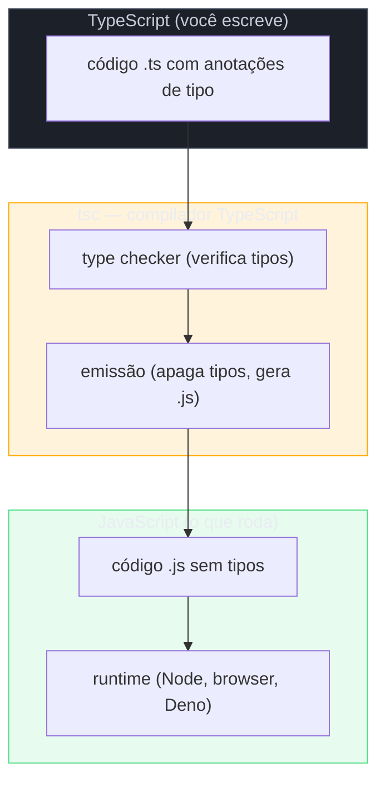
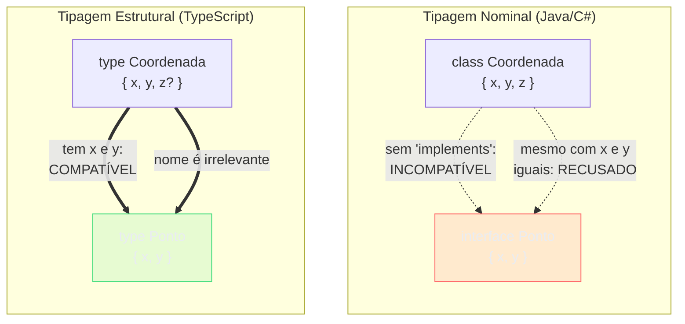

```mermaid
flowchart LR
    classDef falha fill:#FF6B6B24,stroke:#FF6B6B,color:#E9ECF2
    classDef ok fill:#4ADE8021,stroke:#4ADE80,color:#E9ECF2
    subgraph LIT["Objeto literal direto"]
        L1["renderizar(&#123; x:1, y:2, z:3 &#125;)"]
        L2["Excess property check\nativa do literal"]
        L3["ERRO: z não existe\nem Ponto"]
        L1 --> L2 --> L3
        class L3 falha
    end

    subgraph VAR["Via variável"]
        V1["const c: Coordenada = &#123; x:1, y:2, z:3 &#125;\nrenderizar(c)"]
        V2["Structural check\nnormal"]
        V3["OK: Coordenada\ntem x e y"]
        V1 --> V2 --> V3
        class V3 ok
    end
```

# O que é TypeScript: gradual, estrutural, apagado

> [!abstract] TL;DR
> TypeScript é uma **camada de tipos** colada sobre o JavaScript: o compilador `tsc` verifica os tipos e emite JS puro — os tipos somem completamente em runtime. Três propriedades explicam quase toda decisão de design e quase toda armadilha: é **gradual** (você adota aos poucos, `any` é a válvula de escape), **estrutural** (compatibilidade por forma, não por nome — o que diferencia de Java/C#) e **apagado** (zero custo em runtime, mas nenhuma garantia do tipo sobrevive à fronteira de execução). Se você entender essas três palavras, entenderá 80% do que acontece nos erros de tipo que vai encontrar na carreira.

---
## Por que tipos importam — e por que JavaScript precisava deles

Pense num projeto JavaScript médio de 2012: uma `app.js` com quinhentas linhas, algumas funções expostas globalmente, nenhuma documentação. Você pega uma função assim:

```js
function calcularFrete(pedido, opcao) {
  // ...
}
```

Qual é o tipo de `pedido`? Tem `itens`? Tem `enderecoEntrega`? E `opcao` — é uma string `"express"` ou um objeto `{ tipo: "express", prazo: 2 }`? Não tem como saber sem ler o corpo da função inteiro, rastrear todos os chamadores, torcer pra não ter [[Dicionário de Ciência da Computação#monkey-patching|monkey-patching]]. E se você passar o parâmetro errado? O bug só aparece quando aquela linha específica roda em produção, num edge case, às 2h da manhã.

Esse é o custo de trabalhar sem tipos num codebase grande: o cérebro precisa fazer o trabalho que um compilador poderia fazer por você. Você memoriza contratos implícitos. Você tem medo de renomear um campo porque não sabe onde mais ele é usado. Cada refactor é uma aposta.

Tipos não provam que sua lógica de negócio está correta — mas provam que você nunca vai pedir `.toUpperCase()` num número, nunca vai acessar `pedido.itens` quando `pedido` for `undefined`, nunca vai passar os argumentos na ordem errada. É verificação formal pelo preço de uma anotação. Para um codebase com múltiplos devs, isso é o tipo de garantia que vale ouro.

> [!tip] A frase que resume o valor
> Tipos são **documentação que o compilador garante que está atualizada**. Um comentário mente quando o código muda. Um tipo não pode mentir — ou o compilador acusa, ou ele está correto.

Essa era a aposta do TypeScript quando a Microsoft o lançou em 2012, guiado por Anders Hejlsberg — o mesmo engenheiro por trás do C# e do Turbo Pascal. A aposta valeu: em 2026, TypeScript é a linguagem mais usada no GitHub.

---
## TypeScript como camada — o modelo mental fundamental

Antes de ir às três propriedades, precisa fixar o modelo arquitetural. TypeScript **não** é uma linguagem que substitui JavaScript. É uma **camada** adicionada sobre ele. Pense assim:



> [!note] Leitura do diagrama
> Você escreve `.ts`. O `tsc` faz duas coisas em sequência: primeiro **verifica** os tipos (a função type-checker, que pode falhar com erros), depois **emite** o JavaScript correspondente sem nenhuma anotação de tipo. O resultado rodando na engine é JavaScript puro — o TypeScript já cumpriu seu papel antes disso.

Isso tem uma consequência que parece óbvia mas muda tudo: **o runtime não sabe nada sobre seus tipos**. A engine JavaScript, seja o V8 no Node, seja o SpiderMonkey no Firefox, nunca viu seus tipos. Eles existiram apenas durante a compilação, para checar que você não cometeu erros estruturais, e desapareceram. Esse é o terceiro pilar — *apagado* — e vamos voltar a ele.

O diagrama também responde uma pergunta comum: "mas o TypeScript é uma linguagem de programação ou um transpilador?" É os dois, e a separação importa. Como linguagem, TypeScript tem sintaxe própria para anotações, interfaces, enums, generics. Como transpilador, ele **emite JavaScript** — e qualquer runtime que aceita JavaScript aceita o output do TypeScript sem saber que houve um passo adicional.

---

## A primeira propriedade: gradual

Quando o TypeScript foi criado, o mundo JS tinha uma realidade: dezenas de milhões de linhas de JavaScript legado existindo em codebases reais. Não era opção dizer "reescreva tudo tipado de uma vez". A solução foi a **tipagem gradual** — o TypeScript aceita código sem anotações, e você migra no seu ritmo.

O mecanismo central é o tipo `any`. Quando o TypeScript não consegue inferir o tipo de algo, ou quando você explicitamente não quer anotar, ele usa `any`. Um valor com tipo `any` é **compatível com tudo** — pode ser atribuído a qualquer tipo, pode ter qualquer operação chamada sobre ele. O type-checker simplesmente para de checar aquele valor.

```ts
// Começando sem tipos — TypeScript aceita
function calcularFrete(pedido: any, opcao: any): any {
  return pedido.itens.length * opcao.taxa; // sem checagem aqui
}

// Migrando progressivamente
interface Pedido {
  itens: Item[];
  enderecoEntrega: Endereco;
}

interface OpcaoFrete {
  tipo: "standard" | "express";
  taxa: number;
  prazoDias: number;
}

// Agora o compilador verifica tudo
function calcularFreteSeguro(pedido: Pedido, opcao: OpcaoFrete): number {
  return pedido.itens.length * opcao.taxa;
}
```

O `any` é uma **válvula de escape consciente**. Ele diz: "aqui eu sei mais do que o compilador, confie em mim". O problema é que essa confiança pode ser misplaced — e quando é, o erro vira runtime, exatamente o que você queria evitar.

> [!warning] `any` é a droga do TypeScript
> Usar `any` resolve o erro de compilação imediatamente. Mas faz você abrir mão da proteção exatamente no ponto onde mais precisava dela. Uma codebase cheia de `any` é um JavaScript com cerimonial extra. A migração gradual é saudável; o `any` permanente é uma dívida técnica. Nas notas [[04 - any, unknown e never]] você verá como `unknown` oferece um caminho mais seguro: aceita tudo como entrada, mas força você a verificar antes de usar.

A gradualidade também explica por que você pode usar arquivos `.js` e `.ts` no mesmo projeto. Com `allowJs: true` no `tsconfig`, os arquivos JS entram na compilação — e os tipos fluem entre eles na medida do possível. É uma estratégia de migração real, não um compromisso: você migra arquivo a arquivo, função a função, conforme o time tem tempo e confiança.

---

## A segunda propriedade: estrutural

Esta é a propriedade que mais confunde quem vem de Java ou C#, e é a que mais diferencia o TypeScript na prática.

Em Java, quando você escreve `void print(Ponto p)`, o método aceita **exatamente** um `Ponto` — ou uma subclasse que explicitamente declarou `extends Ponto` ou `implements Ponto`. Não importa que outro objeto tenha os mesmos campos `x` e `y`; se não declarou a herança, é incompatível. Isso é **tipagem nominal**: o nome (ou a declaração explícita de parentesco) é o que determina compatibilidade.

O TypeScript funciona diferente. Ele usa **tipagem estrutural**: dois tipos são compatíveis se têm a mesma forma — os mesmos campos e métodos com os tipos certos. O nome é irrelevante.

```ts
type Ponto = { x: number; y: number };
type Coordenada = { x: number; y: number; z?: number };

function renderizar(p: Ponto): void {
  console.log(`(${p.x}, ${p.y})`);
}

const c: Coordenada = { x: 10, y: 20 };
renderizar(c); // OK — Coordenada tem pelo menos x e y
```

O `tsc` aceitou `Coordenada` onde esperava `Ponto` porque `Coordenada` tem `x: number` e `y: number`. O `z` opcional não interfere — a função não vai usar, e não quebra o contrato. Em Java, esse código seria um erro de compilação sem um `implements` explícito.



> [!note] Leitura do diagrama
> À esquerda: Java recusa a atribuição porque `Coordenada` não declarou parentesco com `Ponto`, mesmo tendo os campos certos. À direita: TypeScript aceita porque a forma casa — `Coordenada` tem pelo menos os campos que `Ponto` exige. O nome dos tipos é decorativo.

Por que essa escolha? Porque JavaScript já funcionava assim em prática — era duck typing dinâmico ("se anda como pato e grasna como pato, é um pato"). O TypeScript trouxe esse duck typing para o nível de compilação: agora o compilador verifica que o "pato" tem os métodos certos antes de você chamar `.grasnar()`. A alternativa nominal teria criado uma fricção enorme com as convenções JS já estabelecidas — você teria que anotar explicitamente todos os relacionamentos que antes eram implícitos.

Para a teoria por trás dessa distinção — por que sistemas nominais e estruturais existem, quais garantias cada um oferece, onde o TypeScript se posiciona no mapa de sistemas de tipos — veja [[03-Dominios/Ciência/Paradigmas/13 - Sistemas de tipos|Sistemas de tipos]].

### Subtipos e o princípio de substituição

O structural typing tem uma consequência que vale gravar: um tipo com **mais campos** é compatível com um tipo com **menos campos**, mas não o contrário.

```ts
type Ponto = { x: number; y: number };
type Ponto3D = { x: number; y: number; z: number };

// Ponto3D é um subtipo de Ponto — tem tudo que Ponto tem, mais z
function renderizar(p: Ponto): void { /* usa só x e y */ }

const p3: Ponto3D = { x: 1, y: 2, z: 3 };
renderizar(p3); // OK — p3 tem pelo menos o que renderizar precisa

// Mas o contrário não funciona
const p2: Ponto = { x: 1, y: 2 };
// const p3b: Ponto3D = p2; // ERRO — p2 não tem z
```

Isso é o **Princípio da Substituição de Liskov** acontecendo no nível do type-checker: um `Ponto3D` pode ser usado em qualquer lugar que aceita `Ponto` porque satisfaz todos os requisitos — tem `x` e `y`. Mas o `Ponto` não pode fingir ser um `Ponto3D` porque não tem `z`.

### Excess property checking — a exceção aparente

Agora tem uma pegadinha que confunde muita gente. Experimente passar um objeto literal diretamente:

```ts
renderizar({ x: 1, y: 2, z: 3 }); // ERRO: 'z' is not assignable to type 'Ponto'
```

Espera — acabamos de ver que `Ponto3D` (com `z`) é compatível com `Ponto`. Por que o literal `{ x: 1, y: 2, z: 3 }` dá erro?

A resposta é o **excess property checking** (verificação de propriedades extras) — uma verificação *adicional* que o TypeScript aplica especificamente quando você passa um **objeto literal** diretamente. A lógica é: se você está escrevendo um literal na hora, nada mais faz sentido que aquele campo existir. O `z` provavelmente é um typo, ou você está passando o objeto errado. O TypeScript é mais estrito aqui como proteção contra erros comuns de digitação.

```ts
// Literal direto → excess property check → ERRO
renderizar({ x: 1, y: 2, z: 3 });

// Via variável tipada → structural check → OK
const c: Coordenada = { x: 1, y: 2, z: 3 };
renderizar(c); // OK — structural typing normal
```



> [!note] Leitura do diagrama
> Quando você passa um literal diretamente, o TypeScript aplica uma verificação extra: nenhum campo além dos declarados. Quando você passa via variável, entra o structural typing padrão: basta ter os campos mínimos exigidos. Mesmo objeto, resultado diferente — a diferença está no contexto da expressão.

> [!tip] Por que existe essa assimetria?
> Pense no caso real: `renderizar({ x: 1, y: 2, coordZ: 3 })`. Se você não fosse pego aqui, `coordZ` seria silenciosamente ignorado — e você ficaria sem entender por que `z` não aparece no output. O excess property check existe para pegar esse typo na hora que ele é mais provável. Quando você atribui a uma variável tipada primeiro, você demonstrou intenção consciente.

---

## A terceira propriedade: apagado

Voltemos ao diagrama lá em cima. O `tsc` verifica os tipos e emite JavaScript. O que sobra no JavaScript? Absolutamente nada dos tipos.

```ts
// Você escreve em TypeScript
interface Usuario {
  id: number;
  nome: string;
  ativo: boolean;
}

function saudar(u: Usuario): string {
  return `Olá, ${u.nome}`;
}

const admin: Usuario = { id: 1, nome: "Ana", ativo: true };
console.log(saudar(admin));
```

```js
// O tsc emite este JavaScript
function saudar(u) {
  return `Olá, ${u.nome}`;
}

const admin = { id: 1, nome: "Ana", ativo: true };
console.log(saudar(admin));
```

A `interface Usuario` sumiu. A anotação `: string` do retorno sumiu. O `: Usuario` da declaração de `admin` sumiu. O JavaScript resultante é limpo, sem rastro de tipagem. Isso é o **type erasure** — apagamento de tipos — e tem implicações profundas.

> [!warning] A consequência mais importante do type erasure
> **Tipos TypeScript não existem em runtime.** Isso significa que você não pode escrever `if (x instanceof MeuTipo)` onde `MeuTipo` é uma `interface` — ela não existe no JavaScript gerado. Você não pode inspecionar os campos de um tipo em runtime. Você não pode usar `typeof` para distinguir entre dois tipos com a mesma estrutura de primitivos. O compilador verificou que tudo estava correto em tempo de compilação — mas em runtime, você está sozinho com o JavaScript puro.

Essa é a origem da necessidade de "parse, don't validate" — o tema da nota [[23 - A fronteira type↔runtime - parse, don't validate]]. Quando dados chegam de fora do sistema (uma API externa, um `localStorage`, um formulário), eles chegam como JavaScript puro. O TypeScript pode ter dito que `response.data` é do tipo `Usuario`, mas **só porque você falou para ele assim com um type assertion ou com inferência de um `fetch`**. Se a API mudar e começar a mandar `nome` como `name`, o TypeScript vai aceitar alegremente — mas o runtime vai quebrar porque `u.nome` vai ser `undefined`.

```ts
// PERIGO: tsc aceita, mas runtime pode quebrar
const response = await fetch("/api/usuario/1");
const u = await response.json() as Usuario; // type assertion — você assumiu
console.log(u.nome.toUpperCase()); // e se a API mandar 'name' em vez de 'nome'?
```

```ts
// SEGURO: valide na fronteira
const data = await response.json();
// Zod, por exemplo, valida E infere o tipo
const u = UsuarioSchema.parse(data); // lança se a forma não bater
console.log(u.nome.toUpperCase()); // aqui o TypeScript E o runtime concordam
```

O apagamento também tem um lado positivo: **zero custo em runtime**. Ao contrário de sistemas como Java com reflexão de tipos ou C# com generics reificados, o TypeScript não carrega metadados de tipo em memória durante a execução. O bundle final é JavaScript puro, sem nenhuma biblioteca de tipos no runtime, sem overhead de checagem. A verificação aconteceu antes de você entregar o código — e depois disso, é JS performance-pura.

---

## O compilador na prática: tsc como type-checker

O `tsc` raramente compila seu projeto inteiro em builds modernas — esbuild, swc e Vite fazem isso muito mais rápido. O papel do `tsc` hoje é quase exclusivamente o de **type-checker**: verificar que os tipos estão corretos. Você pode confirmar isso na CLI:

```bash
# Só verifica os tipos, não emite nenhum arquivo
tsc --noEmit

# Verifica com watchmode — roda a cada mudança
tsc --noEmit --watch
```

O `tsconfig.json` controla o comportamento do type-checker. A flag mais importante para segurança é `strict: true`, que habilita um conjunto de verificações que capturam as classes de erros mais comuns:

```json
{
  "compilerOptions": {
    "strict": true,
    "target": "ES2022",
    "module": "NodeNext"
  }
}
```

Com `strict: true`, o TypeScript ativa `strictNullChecks` (a flag que impede você de passar `null | undefined` onde um valor sólido é esperado), `noImplicitAny` (que força você a anotar quando o TypeScript não consegue inferir), e mais algumas outras. Um projeto sem `strict: true` está abrindo mão de boa parte da proteção que o TypeScript oferece.

A interação entre `tsc` como type-checker e outras ferramentas de build é tema de tooling — que vive em Tooling e Build. O que importa aqui é o modelo mental: o `tsc` é o inspetor. Passe por ele antes de entregar.

---

## As três propriedades juntas: onde tudo se conecta

Vamos juntar os três pilares num cenário real. Você tem um formulário de cadastro que manda dados para uma API:

```ts
// GRADUAL — você pode começar aqui, sem tipos, e migrar
function enviarCadastro(dados: any) {
  return fetch("/api/usuarios", {
    method: "POST",
    body: JSON.stringify(dados),
  });
}

// ESTRUTURAL — você define a forma, o compilador verifica
interface DadosCadastro {
  nome: string;
  email: string;
  senha: string;
}

function enviarCadastroSeguro(dados: DadosCadastro): Promise<Response> {
  return fetch("/api/usuarios", {
    method: "POST",
    body: JSON.stringify(dados),
  });
}

// APAGADO — em runtime, a função gerada é idêntica à do JS puro
// function enviarCadastroSeguro(dados) {
//   return fetch("/api/usuarios", { ... });
// }

// Uso: structural typing em ação
const formData = {
  nome: "Ana Silva",
  email: "ana@example.com",
  senha: "segura123",
  aceitouTermos: true, // campo extra — dependendo do contexto, pode ou não dar erro
};

// Se passado diretamente como literal: excess property check, erro
// enviarCadastroSeguro({ nome: "Ana", email: "ana@...", senha: "123", aceitouTermos: true });

// Via variável: structural check, OK — tem pelo menos os campos exigidos
enviarCadastroSeguro(formData); // OK
```

O trio completo: você começou com `any` (gradual), definiu uma forma e o TypeScript validou por estrutura (estrutural), e o código de rede que será executado no browser não carrega nenhum vestígio de `DadosCadastro` (apagado).

---

## Como explicar em inglês

TypeScript is a **statically typed superset of JavaScript** developed by Microsoft. The compiler, `tsc`, acts as a type-checker that validates your code and then **erases all type information** before emitting plain JavaScript — so there is zero runtime overhead and no type metadata at execution time. Its three core properties explain nearly every design decision: it is **gradual** (you can annotate as much or as little as you want, with `any` as an escape hatch for incremental adoption), **structural** (type compatibility is determined by shape, not by declared name — so any object with the right fields satisfies an interface, unlike Java or C# which require explicit `implements`), and **erased** (types exist only at compile time, which means runtime boundaries like API responses or user input require explicit validation, since the runtime has no knowledge of your TypeScript types).

### Vocabulário-chave

| Português | English |
|-----------|---------|
| compilador de tipos | type-checker |
| superset tipado | typed superset |
| apagamento de tipos | type erasure |
| tipagem gradual | gradual typing |
| tipagem estrutural | structural typing |
| tipagem nominal | nominal typing |
| compatibilidade por forma | shape-based compatibility |
| verificação de propriedades extras | excess property checking |
| válvula de escape | escape hatch |
| anotação de tipo | type annotation |
| inferência de tipos | type inference |
| fronteira de runtime | runtime boundary |
| emitir JavaScript | emit JavaScript |
| modo estrito | strict mode |
| subtipo | subtype |
| duck typing tipado | typed duck typing |

---

## Veja também

- [[02 - Tipos primitivos, literais e inferência]] — os tipos que você usa no dia a dia e como o compilador infere sem anotação
- [[04 - any, unknown e never]] — aprofunda a válvula de escape (`any`), a alternativa segura (`unknown`) e o tipo do impossível (`never`)
- [[06 - Objetos - interface vs type]] — as duas formas de definir formas e quando escolher cada uma; excess property checking detalhado
- [[09 - Type narrowing e type guards]] — como o compilador "aprende" o tipo concreto dentro de condicionais
- [[23 - A fronteira type↔runtime - parse, don't validate]] — o que acontece quando tipos apagados encontram dados externos
- [[03-Dominios/Tecnologia/JavaScript/JavaScript Fundamentals|JavaScript Fundamentals]] — a base que o TypeScript pressupõe: closures, protótipos, async, coerção
- [[03-Dominios/Ciência/Paradigmas/13 - Sistemas de tipos|Sistemas de tipos]] — a teoria por trás de nominal×estrutural, estático×dinâmico, tipagem gradual
- [[03-Dominios/Ciência/Paradigmas/index|Paradigmas]] — contexto mais amplo de onde sistemas de tipos se encaixam
