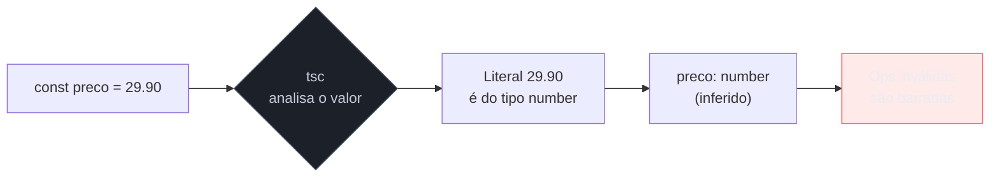
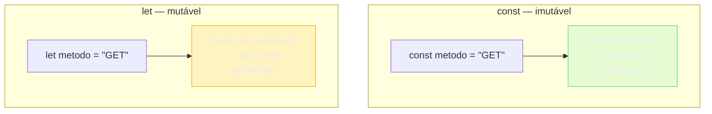
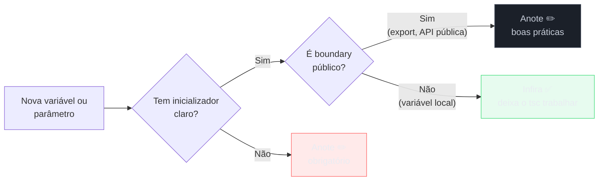
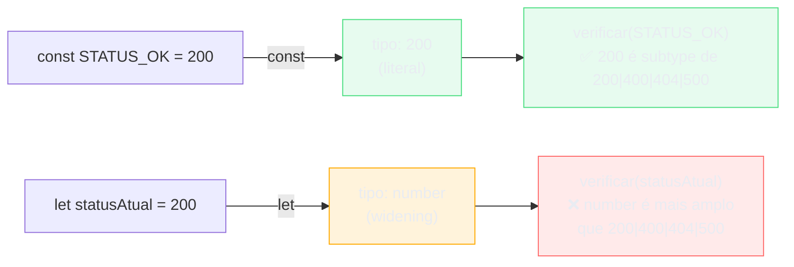

# Tipos primitivos, literais e inferência

> [!abstract] TL;DR
> TypeScript tem sete tipos primitivos herdados do JavaScript mais um sistema de tipos *literais* que permite expressar "exatamente este valor". A grande aposta idiomática é a **inferência**: deixar o compilador deduzir o tipo em vez de anotar tudo. Entender quando anotar e quando não anotar — e o que acontece com literais quando você usa `let` em vez de `const` — é a base do TypeScript eficaz.

---

## O que existe no fundo de tudo

Antes de qualquer objeto, qualquer array, qualquer abstração, existe um conjunto pequeno de valores que o JavaScript (e, por herança, o TypeScript) considera atômicos. Não se divide um número em partes menores — ele é um número. Não se "desmontar" uma string — ela é uma string. Esses são os **tipos primitivos**.

São sete:

| Tipo | Exemplo | O que representa |
|------|---------|------------------|
| `string` | `"Maria"`, `'Maria'`, `` `Maria` `` | Texto Unicode |
| `number` | `42`, `3.14`, `-7`, `NaN`, `Infinity` | Número de ponto flutuante IEEE 754 de 64 bits |
| `boolean` | `true`, `false` | Verdadeiro ou falso |
| `bigint` | `42n`, `9007199254740993n` | Inteiro de precisão arbitrária |
| `symbol` | `Symbol('id')` | Identificador único e não coercível |
| `null` | `null` | Ausência intencional de valor |
| `undefined` | `undefined` | Valor ainda não atribuído |

Se você conhece [[03-Dominios/Tecnologia/JavaScript/JavaScript Fundamentals|JavaScript Fundamentals]], essa lista é familiar. O que o TypeScript adiciona não é nenhum tipo novo — é a capacidade de **declarar explicitamente** qual tipo uma variável carrega, e de **verificar** isso antes de rodar o código.

```ts
let nome: string = "Maria";
let idade: number = 30;
let ativo: boolean = true;
let big: bigint = 42n;
let sym: symbol = Symbol("id");
let nada: null = null;
let indefinido: undefined = undefined;
```

Cada linha acima tem uma anotação de tipo após os dois-pontos. Mas aqui está a questão: você raramente precisa escrever isso. O TypeScript já sabe.

---

## Inferência: o compilador como leitor de contexto

Vamos fazer um experimento mental. Você escreve numa folha de papel:

> `x = 42`

Eu te pergunto: "Qual o tipo de `x`?" Você responde imediatamente: número. Não precisa de rótulo. O valor já carrega a informação.

O TypeScript pensa da mesma forma. Quando você escreve:

```ts
const preco = 29.90;
```

O compilador vê o literal `29.90` e deduz que `preco` é do tipo `number`. Não há nada para anotar. A inferência foi feita.

Isso se chama **inferência de tipos** (type inference), e é o coração do uso idiomático do TypeScript. Em vez de você declarar o tipo de cada variável, o compilador **rastreia o fluxo do código** e mantém um tipo associado a cada expressão.



> [!tip] Por que inferência importa mais do que parece
> A inferência não é um atalho de digitação. Ela é a razão pela qual o TypeScript pode ser **gradual**: você começa num arquivo JavaScript puro, renomeia para `.ts`, e já tem *alguma* segurança sem escrever uma única anotação. As anotações são adicionadas onde fazem falta — nos boundaries, nos contratos públicos, nos pontos de incerteza.

### O que o tsc realmente deduz

Quando você passa o mouse sobre uma variável no VSCode (ou roda `tsc --noEmit` observando os erros), está vendo a inferência em ação. O compilador não infere apenas primitivos:

```ts
const usuario = {
  nome: "Ana",
  idade: 28,
  ativo: true
};
// tipo inferido: { nome: string; idade: number; ativo: boolean }

const ids = [1, 2, 3];
// tipo inferido: number[]

const mistura = [1, "dois", true];
// tipo inferido: (string | number | boolean)[]
```

O TypeScript olha os valores, deduz o tipo mais específico que os cobre, e mantém esse tipo ao longo do programa. Se você tentar atribuir algo incompatível depois, o erro aparece antes de rodar.

---

## Tipos literais: o valor como tipo

Aqui está algo que Java e C# não fazem, mas que muda completamente a expressividade do sistema.

No TypeScript, qualquer valor literal pode ser um **tipo**. Não `string` — mas especificamente `"GET"`. Não `number` — mas especificamente `200`.

```ts
let metodo: "GET" = "GET";
// ✅ OK

metodo = "POST";
// ❌ Erro: Type '"POST"' is not assignable to type '"GET"'
```

Por que isso é poderoso? Porque permite expressar restrições que `string` não consegue:

```ts
type MetodoHTTP = "GET" | "POST" | "PUT" | "DELETE" | "PATCH";

function request(url: string, metodo: MetodoHTTP): void {
  // implementação
}

request("/usuarios", "GET");    // ✅
request("/usuarios", "BUSCAR"); // ❌ Erro: '"BUSCAR"' não pertence a MetodoHTTP
```

Com `string`, qualquer texto passaria. Com `MetodoHTTP`, só os cinco valores fazem sentido para a API HTTP. A restrição está no tipo — o compilador a verifica gratuitamente em cada chamada.

Literais funcionam para todos os primitivos:

```ts
type Status = 200 | 201 | 400 | 404 | 500; // number literal
type Bit = 0 | 1;                            // idem
type Ligado = true;                          // boolean literal
```

> [!example] Literal types em entrevista
> Quando perguntado "como você tiparia um parâmetro que só aceita 'asc' ou 'desc'?", a resposta é:
> ```ts
> function ordenar<T>(itens: T[], direcao: "asc" | "desc"): T[] { ... }
> ```
> Não `string` (muito largo), não um `enum` (gera código em runtime). Uma union de literais: zero overhead, máxima expressividade.

---

## `let` vs `const`: o efeito na inferência

Esta é a parte que pega muita gente de surpresa, e ela tem uma lógica impecável quando você pensa bem.

Quando você usa `const`:

```ts
const metodo = "GET";
// tipo: "GET"  (literal type)
```

O compilador sabe que `metodo` **nunca vai mudar**. É uma constante. Então ele infere o tipo mais específico possível: o literal `"GET"`, não a string genérica `string`.

Quando você usa `let`:

```ts
let metodo = "GET";
// tipo: string  (não o literal!)
```

O compilador sabe que `let` permite reatribuição. Você pode fazer `metodo = "POST"` mais tarde. Então ele infere o tipo mais **amplo** que cobre todos os possíveis valores futuros: `string`.



Esse comportamento tem um nome: **widening**. O TypeScript "alarga" o tipo do literal para o tipo primitivo correspondente quando a variável pode mudar.

```ts
const x = "olá";  // tipo: "olá"
let   y = "olá";  // tipo: string

// x só aceita "olá"
// y aceita qualquer string
```

### Por que widening existe

Sem widening, `let` seria inutilizável:

```ts
let contador = 0; // se fosse tipo: 0
contador = 1;     // ❌ Erro: 1 não é atribuível a 0
contador++;       // ❌ Erro: resultado seria 1, não 0
```

Widening é a decisão pragmática: variáveis mutáveis recebem o tipo primitivo, não o literal. Constantes recebem o literal.

---

## O problema do widening em objetos

O widening silencioso é fácil de ignorar em primitivos, mas tem uma armadilha em objetos:

```ts
const config = {
  metodo: "GET",
  timeout: 5000
};
// tipo inferido: { metodo: string; timeout: number }
// ← NÃO é { metodo: "GET"; timeout: 5000 }
```

Mesmo sendo `const`, as **propriedades** do objeto são mutáveis:

```ts
config.metodo = "POST"; // ✅ O objeto é constante, mas a propriedade não
```

Então o TypeScript infere `string` para `metodo`, não `"GET"`. Se você precisar do literal, precisa sinalizar imutabilidade profunda. Para isso existe `as const` — mas essa conversa pertence à [[03 - Arrays, tuplas e as const]], que explora o mecanismo em detalhe.

Por ora, o que importa saber é: **`as const` na ponta é o que converte propriedades de objeto de `string` para literais**.

```ts
const config = {
  metodo: "GET",
  timeout: 5000
} as const;
// tipo: { readonly metodo: "GET"; readonly timeout: 5000 }
```

---

## Quando anotar, quando não anotar

A inferência funciona bem em muitos casos, mas há situações em que a anotação explícita é a escolha certa — às vezes obrigatória.

### Deixe o TypeScript inferir quando...

**Variáveis locais com inicializador claro:**

```ts
// ✅ Desnecessário anotar — o compilador já sabe
const nome: string = "Ana";   // redundante
const nome = "Ana";            // idiomático
```

**Retorno de funções simples:**

```ts
// ✅ O compilador infere number
function somar(a: number, b: number) {
  return a + b;
}
```

**Callbacks com tipos inferidos pelo contexto:**

```ts
const numeros = [1, 2, 3];

// ✅ O tsc sabe que n é number pelo tipo de numeros
numeros.map(n => n * 2);
```

Esse último caso tem um nome: **tipagem contextual** (contextual typing). O TypeScript olha o tipo de `numeros` (que é `number[]`), vê que `.map` recebe um `(value: number) => U`, e infere que `n` é `number` no callback. Você não precisa escrever nada.

### Anote explicitamente quando...

**Parâmetros de funções** — o TypeScript não consegue inferir o que você pretende receber:

```ts
// ❌ Erro: 'a' implicitly has an 'any' type
function somar(a, b) { return a + b; }

// ✅
function somar(a: number, b: number): number { return a + b; }
```

**Retornos de funções públicas/exportadas** — documenta o contrato e evita surpresas se a implementação mudar:

```ts
// ✅ Boa prática em APIs públicas
export function buscarUsuario(id: string): Promise<Usuario | null> {
  // ...
}
```

**Variáveis sem inicializador (declaração separada da atribuição):**

```ts
let usuario: Usuario | null;  // ✅ necessário — sem valor inicial, o tipo é unknown
// ... lógica ...
usuario = await buscar(id);
```

**Quando o tipo inferido for muito amplo e você precisar restringir:**

```ts
// O TypeScript infere string[], mas você quer o literal
const metodos: Array<"GET" | "POST"> = ["GET", "POST"];
```



> [!warning] Antipadrão: anotar tudo
> Existe uma armadilha de quem vem de Java/C#: anotar cada variável, cada retorno de função utilitária, cada callback. Isso não é mais seguro — o tipo declarado pode divergir da implementação, criando uma *falsa* documentação. Deixar o TypeScript inferir é mais seguro porque o tipo é sempre **derivado do código real**.
>
> ```ts
> // ❌ Antipadrão — redundante e frágil
> const ids: number[] = [1, 2, 3].map((x: number): number => x * 2);
>
> // ✅ Idiomático — o TypeScript sabe tudo isso
> const ids = [1, 2, 3].map(x => x * 2);
> ```

---

## null e undefined: a fronteira crítica

Dois primitivos merecem atenção especial porque representam "ausência de valor" — e são a fonte de incontáveis bugs em JavaScript.

`null` é ausência **intencional**: o desenvolvedor atribuiu null para dizer "não tem valor aqui". `undefined` é ausência **não inicializada**: a variável foi declarada mas nenhum valor foi atribuído.

```ts
let a: string | null = null;      // ausência intencional
let b: string | undefined;        // b ainda não tem valor (undefined implícito)
let c: string | undefined = undefined; // explícito, equivalente
```

Sem `strictNullChecks` (a flag de configuração que cobre isso), ambos vazam em qualquer tipo: você poderia passar `null` onde `string` era esperado. Com `strictNullChecks` ativado — que é parte de `strict: true` — o compilador os trata como tipos distintos e exige que você os trate explicitamente.

> [!note] Fronteira com a nota 05
> O tratamento sistemático de `null` e `undefined` — optional chaining, nullish coalescing, `?` em propriedades, `strictNullChecks` — é o tema central de [[05 - strictNullChecks - null, undefined e optional]]. Aqui basta saber que ambos existem como tipos primitivos separados.

---

## bigint e symbol: quando você precisa deles

`bigint` é para inteiros além do limite de `Number.MAX_SAFE_INTEGER` (2⁵³ - 1). Precisa de sufixo `n`:

```ts
const populacaoMundial: bigint = 8_100_000_000n;

// Atenção: bigint e number não se misturam
const resultado = populacaoMundial + 1;   // ❌ Erro de tipo
const resultado = populacaoMundial + 1n;  // ✅
```

`symbol` cria identificadores únicos. Nenhum `Symbol()` é igual a outro, mesmo com a mesma string:

```ts
const id1 = Symbol("id");
const id2 = Symbol("id");

id1 === id2; // false — sempre false

// Uso típico: chaves de objeto sem colisão
const CACHE_KEY = Symbol("cache");
obj[CACHE_KEY] = { expira: Date.now() + 3600000 };
```

Na prática, `bigint` aparece em contextos financeiros de alta precisão ou identificadores de banco de dados grandes, e `symbol` aparece em metaprogramação e bibliotecas. Para o dia a dia e para entrevistas, os cinco tipos mais importantes são `string`, `number`, `boolean`, `null` e `undefined`.

---

## Um exemplo completo: inferência em cascata

Vamos ver a inferência funcionando ao longo de uma função real, passo a passo.

```ts
// ✅ Nenhuma anotação aqui — observe o que o compilador deduz

function calcularDesconto(preco: number, porcentagem: number) {
  //                       ↑ anotado    ↑ anotado
  //  sem anotação de retorno — o tsc vai inferir

  const fator = porcentagem / 100;
  //    ↑ tipo: number (inferido de number / number)

  const desconto = preco * fator;
  //    ↑ tipo: number (inferido de number * number)

  const precoFinal = preco - desconto;
  //    ↑ tipo: number

  return precoFinal;
  //     ↑ tipo: number
}
// tipo de calcularDesconto: (preco: number, porcentagem: number) => number
// ← inferido completamente pelo tsc
```

O TypeScript rastreia cada operação e mantém o tipo da expressão resultante. `number / number` é `number`. `number * number` é `number`. `number - number` é `number`. O tipo de retorno da função é deduzido como `number` sem você escrever uma única anotação de retorno.

Agora um exemplo com tipos literais e o efeito de `const`:

```ts
const STATUS_OK = 200;
//    tipo: 200 (literal) — const preserva o literal

let statusAtual = 200;
//  tipo: number (widening) — let alarga para o primitivo

function verificar(status: 200 | 400 | 404 | 500): string {
  if (status === 200) return "Sucesso";
  if (status === 400) return "Requisição inválida";
  if (status === 404) return "Não encontrado";
  return "Erro de servidor";
}

verificar(STATUS_OK);    // ✅ STATUS_OK é 200 (literal) — aceito
verificar(statusAtual);  // ❌ statusAtual é number — muito amplo para o parâmetro
verificar(200);          // ✅ literal direto — sempre aceito
```



---

## A ponta do `as const` e o que vem depois

Você já viu que `const` preserva literais em variáveis primitivas, mas não em propriedades de objeto. A solução completa é `as const`, que força imutabilidade profunda e preserva todos os literais:

```ts
const METODOS = ["GET", "POST", "PUT", "DELETE"] as const;
// tipo: readonly ["GET", "POST", "PUT", "DELETE"]
// ← não string[], mas exatamente esses quatro literais, em ordem
```

Este é o ponto de entrada para arrays tipados com literais, tuplas e um padrão poderoso para derivar tipos de constantes em runtime. A nota [[03 - Arrays, tuplas e as const]] aprofunda tudo isso.

> [!note] `any`, `unknown` e `never` ficam fora desta nota
> Esses três tipos especiais têm papel diferente dos primitivos — eles não representam valores comuns, mas posições no sistema de tipos (tudo, coisa-que-precisa-de-verificação, impossível). A [[04 - any, unknown e never]] os trata com o cuidado que merecem.

---

## Como explicar em inglês

O tema desta nota aparece com frequência em entrevistas internacionais. Abaixo, frases e vocabulário para discuti-lo com precisão.

**Framing da inferência:**
> "TypeScript's type inference means I rarely need to annotate local variables — the compiler tracks the type of every expression and propagates it through the program. I annotate function parameters (because the compiler can't infer intent), public API return types (for explicit contracts), and variables without initializers."

**Sobre literal types:**
> "Literal types let me express 'exactly this value' as a type. Instead of accepting any `string`, I can type a parameter as `'GET' | 'POST' | 'PUT' | 'DELETE'` and the compiler rejects anything outside that set. No runtime overhead — the union is erased to plain JavaScript."

**Sobre `let` vs `const` e widening:**
> "When you use `const`, TypeScript infers the narrowest possible type — the literal. With `let`, it widens to the primitive type because the variable might be reassigned. That's why `const method = 'GET'` has type `'GET'`, but `let method = 'GET'` has type `string`. If you need the literal type on a `let`, you can annotate it explicitly."

**Sobre quando anotar:**
> "My rule: infer locally, annotate at boundaries. Function parameters always need annotations. Public exported functions benefit from explicit return types — it documents the contract and prevents accidental changes. For internal helpers and local variables, the compiler knows better than a redundant annotation."

### Vocabulário-chave

| Português | English |
|-----------|---------|
| tipos primitivos | primitive types |
| inferência de tipos | type inference |
| tipo literal | literal type |
| alargamento de tipo | type widening |
| estreitamento de tipo | type narrowing |
| tipagem contextual | contextual typing |
| constante | constant (`const`) |
| variável mutável | mutable variable (`let`) |
| anotar / anotação | annotate / annotation |
| fronteira / boundary | boundary |
| precisão arbitrária | arbitrary precision |
| imutabilidade profunda | deep immutability |

---

## Veja também

- [[01 - O que é TypeScript - gradual, estrutural, apagado]] — por que o sistema de tipos do TS funciona assim
- [[03 - Arrays, tuplas e as const]] — `as const` em profundidade e literais em arrays
- [[04 - any, unknown e never]] — os três tipos especiais fora do conjunto dos primitivos
- [[07 - Union e intersection types]] — como combinar tipos literais em unions expressivas
- [[03-Dominios/Tecnologia/JavaScript/JavaScript Fundamentals|JavaScript Fundamentals]] — base da linguagem que o TS pressupõe
