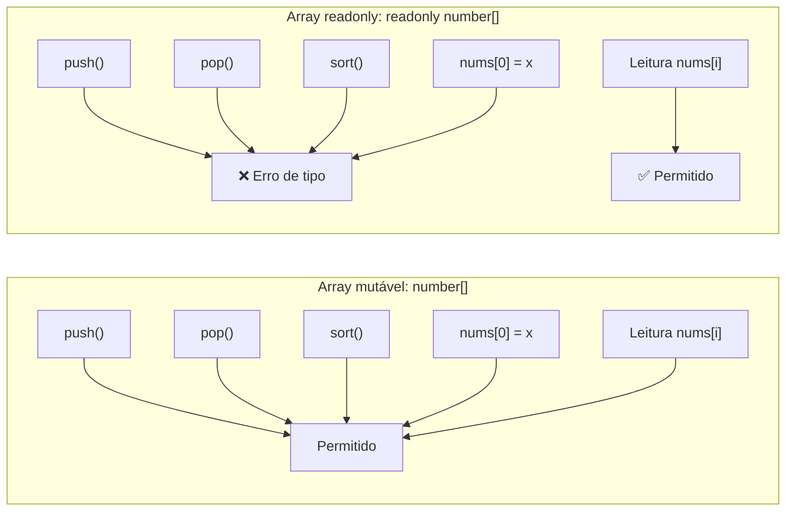
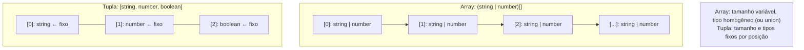
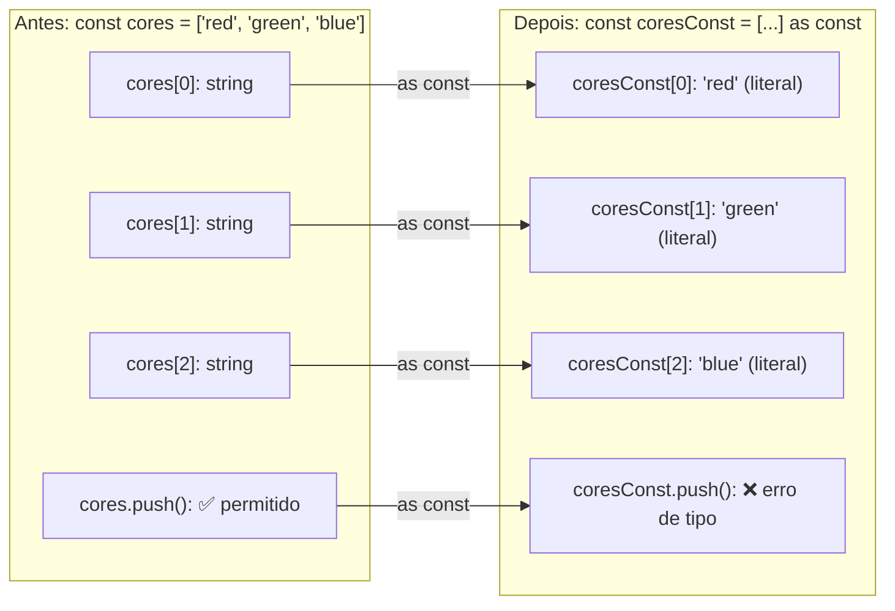
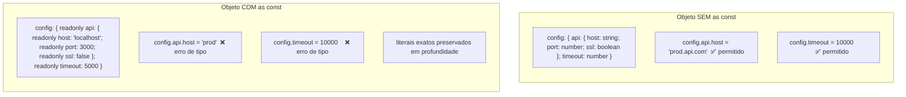

# Arrays, tuplas e `as const`

> [!abstract] TL;DR
> Arrays em TypeScript são listas homogêneas de tamanho variável; tuplas são sequências de tamanho e tipos fixos — um contrato posicional. `as const` é o operador que transforma qualquer literal em seu tipo mais estreito e imutável possível: arrays viram `readonly` com tipos literais, objetos ficam totalmente congelados. O padrão `as const` + `typeof` + indexed access é a base para derivar tipos vivos a partir de dados — evitando duplicação entre valor e tipo.

---

## O problema que arrays e tuplas resolvem

Antes de entrar na sintaxe, vale perguntar: por que o TypeScript distingue arrays de tuplas? Em JavaScript puro, ambos são `Array` — a diferença é puramente semântica (convenção do programador). O TypeScript transformou essa convenção em uma **garantia verificável pelo compilador**.

Pense assim: um array é uma **lista aberta** — você não sabe quantos elementos ela terá, mas sabe que todos são do mesmo tipo. Uma tupla é um **protocolo posicional** — você sabe exatamente quantos elementos existem e qual é o tipo de cada posição, como um registro com índices numéricos em vez de nomes.

Essa distinção importa muito quando você define APIs: uma função que retorna `[string, number]` está prometendo "o primeiro elemento é sempre o nome, o segundo é sempre a idade" — e o TypeScript vai cobrar essa promessa.

---

## Arrays: `T[]` vs `Array<T>`

O TypeScript oferece duas sintaxes para o mesmo conceito, e as duas são equivalentes:

```ts
// Sintaxe "postfix" — mais comum, mais curta
let numeros: number[] = [1, 2, 3];

// Sintaxe genérica — mais explícita sobre o que está acontecendo
let nomes: Array<string> = ['Ana', 'Bia', 'Carlos'];

// Ambas descrevem a mesma coisa: lista mutável de elementos do tipo T
```

Na prática, a convenção da comunidade prefere `T[]` para tipos simples e `Array<T>` quando o tipo `T` já é composto (e.g., `Array<string | null>` fica mais legível que `(string | null)[]`).

> [!tip] `T[]` é açúcar sintático
> `number[]` é açúcar para `Array<number>`. O TypeScript as trata de forma idêntica — `Array` é uma interface genérica da lib padrão. Em tipos complexos como `(string | number)[]`, os parênteses são necessários para deixar claro que o `[]` se aplica a toda a union, não só ao `number`.

### O que o compilador sabe sobre um array

Quando você declara `let numeros: number[]`, o TypeScript sabe que:
1. Qualquer elemento lido de `numeros[i]` será `number` (ou `number | undefined` com `noUncheckedIndexedAccess`)
2. Qualquer valor passado para `numeros.push()` ou `numeros[i] =` deve ser `number`
3. O tamanho do array é desconhecido em tempo de compilação — `numeros.length` é `number`, não um literal

O ponto 3 é sutil mas importante: o TypeScript **não rastreia o tamanho de arrays mutáveis**. Só tuplas têm tamanho fixo no sistema de tipos.

---

## `readonly T[]` e `ReadonlyArray<T>`: imutabilidade no nível de tipo

Um array declarado como mutável (`number[]`) pode ter elementos adicionados, removidos ou substituídos. Isso é conveniente, mas às vezes você quer garantir que um array não será modificado — especialmente em APIs públicas ou ao passar dados para funções.

```ts
// Array mutável — qualquer um pode modificar
function processarNumeros(nums: number[]): void {
  nums.push(999); // TypeScript permite, mas é um efeito colateral surpreendente
}

// Array readonly — compilador proíbe modificações
function processarNumerosSeguro(nums: readonly number[]): void {
  // nums.push(999);  // ERRO: Property 'push' does not exist on type 'readonly number[]'
  // nums[0] = 0;     // ERRO: Index signature in type 'readonly number[]' only permits reading
  console.log(nums.length); // leitura: permitida
}
```

As duas formas de escrever `readonly` são equivalentes:

```ts
let a: readonly number[] = [1, 2, 3];
let b: ReadonlyArray<number> = [1, 2, 3];
// a e b têm o mesmo tipo
```

Qual usar? `readonly T[]` é mais curto; `ReadonlyArray<T>` é mais explícito. Adote uma convenção no projeto.



> [!warning] `readonly` no tipo ≠ `Object.freeze()` em runtime
> `readonly number[]` é uma garantia **apenas do compilador** — o JavaScript em runtime não sabe nada sobre isso. Se você passar o array para código JS puro (sem tipos), ele pode ser modificado sem que o TypeScript reclame. `readonly` previne modificações acidentais dentro do TypeScript; `Object.freeze()` seria necessário para garantia em runtime. Felizmente, na grande maioria dos casos, o que importa é a segurança em tempo de desenvolvimento — e aí `readonly` é suficiente.

---

## Tuplas: o contrato posicional

Uma tupla em TypeScript é uma **lista de tamanho fixo onde cada posição tem um tipo específico**. A sintaxe usa colchetes com os tipos listados:

```ts
// Tupla simples: posição 0 é string, posição 1 é number
let usuario: [string, number] = ['Maria', 30];

// Tipos diferentes por posição
const coordenada: [number, number, number] = [10.5, -23.4, 900];

// Acesso tipado: o TypeScript sabe o tipo de cada posição
const nome: string = usuario[0];  // string — OK
const idade: number = usuario[1]; // number — OK
// const x: string = usuario[1];  // ERRO: Type 'number' is not assignable to type 'string'
```

Compare com `(string | number)[]` — array de união — que seria uma lista aberta onde cada elemento pode ser string OU number, mas sem garantia posicional:

```ts
// Array de union: TypeScript não sabe a posição
let misturado: (string | number)[] = ['Maria', 30, 'Ana', 25];
const primeiro = misturado[0]; // tipo: string | number — ambíguo
```

### Tuplas com labels (nomes de posição)

TypeScript 4.0 introduziu labels em tuplas — nomes que documentam o que cada posição representa, sem mudar o tipo subjacente:

```ts
// Sem labels — o que é o segundo elemento?
type Par = [string, number];

// Com labels — autocomplementar e mensagens de erro ficam muito mais claros
type UsuarioTupla = [nome: string, idade: number];

// Labels melhoram a leitura em assinaturas de função
function criarPar(nome: string, idade: number): [nome: string, idade: number] {
  return [nome, idade];
}
```

Labels são puramente documentação — não criam propriedades nomeadas nem mudam como você acessa os elementos (ainda é `[0]` e `[1]`).

### Tuplas com elementos opcionais

Uma posição pode ser marcada como opcional com `?`:

```ts
type ComOpcional = [string, number?];

const completo: ComOpcional = ['Maria', 30]; // OK
const semIdade: ComOpcional = ['Maria'];      // também OK

// O tipo de [1] é 'number | undefined'
const idade = semIdade[1]; // number | undefined
```

> [!note] Elementos opcionais só no final
> Posições opcionais devem vir depois de todas as posições obrigatórias. `[string?, number]` é inválido — como o compilador saberia qual elemento foi omitido?

### Tuplas com rest elements

Você pode ter um segmento variável dentro de uma tupla usando `...T[]`:

```ts
// Começa com string fixa, seguida de qualquer quantidade de numbers
type Dados = [string, ...number[]];

const s1: Dados = ['Maria'];          // OK — zero numbers
const s2: Dados = ['Maria', 1, 2, 3]; // OK — três numbers
// const s3: Dados = [1, 'Maria'];    // ERRO — primeiro deve ser string

// Rest no meio também é possível
type Entidades = [string, ...boolean[], number];
// ['label', true, false, true, 42] — válido
```

Isso é especialmente útil para tipar funções que usam o padrão de arguments variável:

```ts
// React hooks retornam tuplas — [estado, setter]
function useState<T>(inicial: T): [T, (valor: T) => void] {
  let estado = inicial;
  const setter = (v: T) => { estado = v; };
  return [estado, setter];
}

const [count, setCount] = useState(0); // count: number, setCount: (v: number) => void
```



---

## O problema do widening — revisitando a nota anterior

Na [[02 - Tipos primitivos, literais e inferência]], vimos que o TypeScript tem um comportamento chamado **widening**: quando você declara `let x = 'red'`, o tipo inferido é `string` (amplo), não `'red'` (literal). Isso porque `let` implica mutabilidade — o valor pode mudar, então faz sentido o tipo aceitar qualquer string.

O mesmo widening acontece com arrays e objetos:

```ts
// Inferência sem as const: TypeScript "alarga" os tipos
let cores = ['red', 'green', 'blue'];
// tipo inferido: string[]  ← não mantém os literais

const ponto = { x: 10, y: 20 };
// tipo inferido: { x: number; y: number }  ← não mantém os literais 10 e 20
```

Por que o TypeScript faz isso? Porque `let cores` é mutável — você pode fazer `cores[0] = 'purple'`. O compilador amplia para `string[]` pois não pode saber que você nunca vai modificar os elementos.

Mas e se você **quiser** que o compilador saiba que `cores` sempre terá exatamente esses três valores literais? É aí que `as const` entra.

---

## `as const`: a declaração de imutabilidade

`as const` é um operador de asserção de tipo que diz ao TypeScript: *"trate este valor como se fosse a constante mais específica possível, e nunca permita mutação"*. O efeito é triplo:

1. **Estreitamento máximo**: literais mantêm seus tipos exatos (`'red'` em vez de `string`, `10` em vez de `number`)
2. **Readonly em profundidade**: arrays viram `readonly`, propriedades de objetos viram `readonly`
3. **Congelamento de estrutura**: o TypeScript passa a entender que a estrutura não vai mudar

### `as const` em literais simples

```ts
let x = 'hello' as const;
// tipo: 'hello'  ← literal, não string

let n = 42 as const;
// tipo: 42  ← literal, não number
```

Em literais simples, `as const` funciona como declarar uma constante do tipo literal — útil quando você quer passar um literal para uma função que espera um tipo específico.

### `as const` em arrays

Aqui é onde a mágica começa:

```ts
// Sem as const: widening para string[]
const cores = ['red', 'green', 'blue'];
// tipo: string[]
// cores.push('purple')  // permitido pelo compilador

// Com as const: mantém literais + readonly
const coresConst = ['red', 'green', 'blue'] as const;
// tipo: readonly ['red', 'green', 'blue']
// coresConst.push('purple')  // ERRO: Property 'push' does not exist on type 'readonly [...]'
// coresConst[0] = 'purple'   // ERRO: Cannot assign to '0' because it is a read-only property
```

O array vira uma **tupla readonly** com os literais preservados. Cada posição tem um tipo literal exato.



### `as const` em objetos

Para objetos, o efeito é profundo — todas as propriedades viram `readonly` e todos os valores viram literais:

```ts
// Sem as const
const ponto = { x: 10, y: 20 };
// tipo: { x: number; y: number }
// ponto.x = 99;  // permitido

// Com as const
const pontoConst = { x: 10, y: 20 } as const;
// tipo: { readonly x: 10; readonly y: 20 }
// pontoConst.x = 99;  // ERRO: Cannot assign to 'x' because it is a read-only property
```

Para objetos aninhados, o `as const` é **recursivo** — toda a árvore de propriedades fica readonly com tipos literais:

```ts
const config = {
  api: {
    host: 'localhost',
    port: 3000,
    ssl: false
  },
  timeout: 5000
} as const;

// tipo: {
//   readonly api: {
//     readonly host: 'localhost';
//     readonly port: 3000;
//     readonly ssl: false;
//   };
//   readonly timeout: 5000;
// }
```



---

## O padrão killer: `as const` + `typeof` + indexed access

Agora chegamos ao coração do por que `as const` é tão importante para código TypeScript moderno. O padrão que você vai usar constantemente é:

```
dado as const → typeof dado → acesso indexado → tipo derivado
```

### Derivando union de array

```ts
const ROLES = ['admin', 'user', 'guest'] as const;
// tipo: readonly ['admin', 'user', 'guest']

// typeof ROLES = readonly ['admin', 'user', 'guest']
// typeof ROLES[number] = 'admin' | 'user' | 'guest'

type Role = typeof ROLES[number];
// tipo: 'admin' | 'user' | 'guest'

function setRole(role: Role): void {
  console.log(`Definindo role: ${role}`);
}

setRole('admin');   // OK
setRole('user');    // OK
// setRole('superuser'); // ERRO: Argument of type '"superuser"' is not assignable to parameter of type 'Role'
```

O que acontece aqui:
- `typeof ROLES` captura o tipo do array `readonly ['admin', 'user', 'guest']`
- `[number]` é um **indexed access type** — "qual é o tipo quando acesso com qualquer índice numérico?"
- Para uma tupla readonly, isso retorna a union de todos os tipos das posições

A grande vantagem: `ROLES` e `Role` estão **sincronizados automaticamente**. Se você adicionar `'moderator'` ao array, o tipo `Role` automaticamente inclui `'moderator'`. Zero duplicação.

> [!example] Antes e depois — a dor da duplicação manual
>
> **Antes (duplicação manual)**:
> ```ts
> const ROLES = ['admin', 'user', 'guest'];
> type Role = 'admin' | 'user' | 'guest'; // ← duplicado manualmente
> // Se esquecer de sincronizar os dois, você tem um bug silencioso
> ```
>
> **Depois (fonte única de verdade)**:
> ```ts
> const ROLES = ['admin', 'user', 'guest'] as const;
> type Role = typeof ROLES[number]; // ← derivado, sempre sincronizado
> ```

### Derivando tipos de objetos de configuração

```ts
const HTTP_STATUS = {
  OK: 200,
  CREATED: 201,
  BAD_REQUEST: 400,
  UNAUTHORIZED: 401,
  NOT_FOUND: 404,
  INTERNAL_SERVER_ERROR: 500
} as const;

// Derivar o tipo dos valores (os status codes como literais)
type HttpStatusCode = typeof HTTP_STATUS[keyof typeof HTTP_STATUS];
// tipo: 200 | 201 | 400 | 401 | 404 | 500

// Derivar o tipo das chaves
type HttpStatusKey = keyof typeof HTTP_STATUS;
// tipo: 'OK' | 'CREATED' | 'BAD_REQUEST' | 'UNAUTHORIZED' | 'NOT_FOUND' | 'INTERNAL_SERVER_ERROR'

function responder(status: HttpStatusCode): void {
  console.log(`HTTP ${status}`);
}

responder(HTTP_STATUS.OK);     // OK
responder(200);                // OK — 200 é do tipo HttpStatusCode
// responder(418);            // ERRO — 418 não está na union
```

A [[15 - keyof, typeof e indexed access types]] explora `keyof` e `typeof` a fundo, incluindo usos avançados com generics. Aqui, o que importa é o padrão: `as const` congela o objeto, `typeof` captura o tipo frozen, e `keyof typeof` extrai as chaves como union de literais.

---

## Casos de uso reais

### Caso 1: Configuração de rotas tipada

```ts
// Define as rotas válidas da aplicação como constante
const ROUTES = {
  home: '/',
  login: '/login',
  dashboard: '/dashboard',
  profile: '/profile/:id',
  settings: '/settings'
} as const;

type RoutePath = typeof ROUTES[keyof typeof ROUTES];
// '/' | '/login' | '/dashboard' | '/profile/:id' | '/settings'

function navigate(path: RoutePath): void {
  window.location.href = path;
}

navigate(ROUTES.dashboard);   // OK — '/dashboard'
navigate('/dashboard');       // OK — literal compatível
// navigate('/sobre');        // ERRO — não está nas rotas definidas
```

### Caso 2: Estados de uma máquina de estados

```ts
// Tupla para representar transições válidas
const TRANSITIONS = [
  ['idle', 'loading'],
  ['loading', 'success'],
  ['loading', 'error'],
  ['success', 'idle'],
  ['error', 'idle']
] as const;

type Transition = typeof TRANSITIONS[number];
// ['idle', 'loading'] | ['loading', 'success'] | ['loading', 'error'] | ...

type FromState = Transition[0];
// 'idle' | 'loading' | 'success' | 'error'

type ToState = Transition[1];
// 'loading' | 'success' | 'error' | 'idle'
```

### Caso 3: Validação de configuração de ambiente

```ts
const ENVS = ['development', 'staging', 'production'] as const;
type Environment = typeof ENVS[number];

function validateEnv(): Environment {
  const env = process.env.NODE_ENV;
  // Verifica se o valor do ambiente está na lista de valores válidos
  if (!ENVS.includes(env as Environment)) {
    throw new Error(`Ambiente inválido: ${env}. Esperado: ${ENVS.join(', ')}`);
  }
  return env as Environment;
}
```

---

## `as const` vs `Object.freeze()` — diferença crucial

Uma confusão comum é achar que `as const` tem efeito em runtime. Não tem.

```ts
const config = { timeout: 5000 } as const;

// Em tempo de compilação: config.timeout = 9999 gera erro de tipo
// Em runtime (JavaScript): config.timeout = 9999 funciona silenciosamente!

// Para garantia em runtime, você precisaria de:
const configFrozen = Object.freeze({ timeout: 5000 });
// Mas Object.freeze() não é recursivo — objetos aninhados ainda são mutáveis
```

| | `as const` | `Object.freeze()` |
|---|---|---|
| Efeito em compilação | ✅ Readonly, tipos literais | ❌ Nenhum sem anotação |
| Efeito em runtime | ❌ Nenhum | ✅ Previne modificações |
| Recursivo | ✅ Sim (todo o objeto) | ❌ Não (só o nível raiz) |
| Custo de performance | ✅ Zero | Pequeno overhead |

Na prática, `as const` é suficiente para a grande maioria dos casos — você quer a garantia estática durante o desenvolvimento, não necessariamente em runtime.

> [!warning] `as const` não protege de código externo
> Se você passar um objeto com `as const` para uma função sem tipo, ou para código JavaScript puro, ele pode ser modificado. `as const` é um contrato entre você e o compilador TypeScript — não com o runtime JavaScript.

---

## A armadilha clássica: esquecer `as const` e perder os literais

Este é um dos erros mais frequentes com `as const`. Observe:

```ts
// SEM as const — bugão silencioso
const PERMISSOES = ['ler', 'escrever', 'deletar'];
// tipo: string[] — literais perdidos!

function verificar(permissao: 'ler' | 'escrever' | 'deletar'): void {
  // ...
}

// Para usar, precisa de type assertion manual — cheiro ruim
verificar(PERMISSOES[0] as 'ler' | 'escrever' | 'deletar');

// COM as const — correto
const PERMISSOES_CONST = ['ler', 'escrever', 'deletar'] as const;
type Permissao = typeof PERMISSOES_CONST[number];

verificar(PERMISSOES_CONST[0]); // OK — tipo já é 'ler' | 'escrever' | 'deletar'
```

O padrão correto elimina type assertions manuais e mantém o sistema de tipos coeso.

---

## Juntando tudo: um exemplo completo

```ts
// Definição central: um objeto de configuração de permissões por role
const PERMISSOES_POR_ROLE = {
  admin:     ['ler', 'escrever', 'deletar', 'administrar'] as const,
  moderador: ['ler', 'escrever'] as const,
  visitante: ['ler'] as const
} as const;

// Tipos derivados — sem duplicação manual
type Role = keyof typeof PERMISSOES_POR_ROLE;
// 'admin' | 'moderador' | 'visitante'

type PermissoesDe<R extends Role> = typeof PERMISSOES_POR_ROLE[R][number];
// Para Role = 'admin':    'ler' | 'escrever' | 'deletar' | 'administrar'
// Para Role = 'moderador': 'ler' | 'escrever'
// Para Role = 'visitante': 'ler'

// Função que usa os tipos derivados
function podeFazer<R extends Role>(
  role: R,
  acao: PermissoesDe<R>
): boolean {
  return (PERMISSOES_POR_ROLE[role] as readonly string[]).includes(acao);
}

podeFazer('admin', 'administrar');    // OK
podeFazer('moderador', 'escrever');   // OK
// podeFazer('visitante', 'deletar'); // ERRO de tipo em compile time!
// podeFazer('admin', 'viajar');      // ERRO — 'viajar' não é permissão válida
```

A [[15 - keyof, typeof e indexed access types]] vai mostrar como estender esses padrões para casos ainda mais avançados, incluindo mapeamento sobre as chaves para criar tipos derivados complexos. E a [[19 - Enums, const objects e modelagem de constantes]] vai comparar esse padrão com enums e discutir quando usar cada abordagem em modelagem de domínio.

---

## Como explicar em inglês

Em entrevistas internacionais, esses conceitos aparecem em perguntas sobre type safety, design de APIs e como o TypeScript difere do JavaScript. Algumas frases para ter na ponta da língua:

*"TypeScript distinguishes between arrays and tuples: an array is a homogeneous, open-ended list, while a tuple is a fixed-length sequence with a specific type per position — essentially a positional contract enforced by the compiler."*

*"The `as const` assertion tells TypeScript to infer the most specific type possible and treat the value as deeply immutable. For arrays, this means the literals are preserved and the array becomes readonly. For objects, every property becomes readonly and every value becomes a literal type."*

*"The pattern I use constantly is `as const` combined with `typeof` and indexed access to derive types from values — so the source of truth lives in the data, not duplicated in a manual type annotation. If I add a new role to the array, the union type updates automatically."*

*"An important distinction: `as const` is a compile-time-only guarantee. It affects what TypeScript allows, not what JavaScript enforces at runtime. If you need runtime immutability, you'd use `Object.freeze()`, but that's rarely necessary."*

*"Tuple labels are a TypeScript 4.0 feature — they're purely for documentation and IDE support, improving autocomplete and error messages. They don't create named properties or change how you access elements."*

### Vocabulário-chave

| Português | English |
|-----------|---------|
| array tipado | typed array |
| array readonly / somente leitura | readonly array |
| tupla | tuple |
| posição / índice | position / index |
| elemento com label / nomeado | labeled tuple element |
| elemento opcional | optional element |
| elemento rest | rest element |
| asserção de const | const assertion |
| alargamento de tipo | type widening |
| estreitamento de tipo | type narrowing |
| tipo literal | literal type |
| tipo derivado | derived type |
| acesso indexado | indexed access |
| fonte única de verdade | single source of truth |
| union derivada | derived union |
| imutabilidade no nível de tipo | type-level immutability |
| congelamento profundo | deep freeze |
| inferência de tipo | type inference |

---

## Veja também

- [[02 - Tipos primitivos, literais e inferência]] — widening/narrowing de literais que `as const` controla
- [[07 - Union e intersection types]] — as unions que você deriva com `typeof ARRAY[number]`
- [[15 - keyof, typeof e indexed access types]] — aprofundamento de `keyof`, `typeof` e `T[K]` usados aqui
- [[19 - Enums, const objects e modelagem de constantes]] — `as const` object como substituto de enum: o padrão completo de modelagem de domínio
