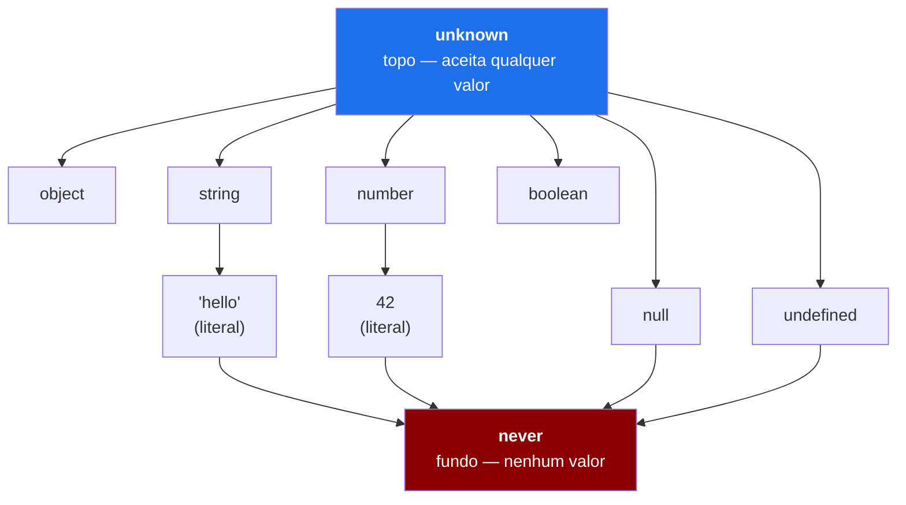
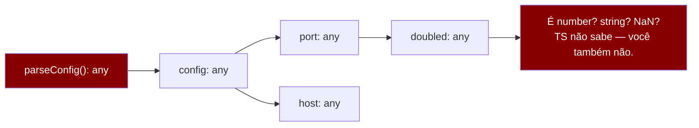
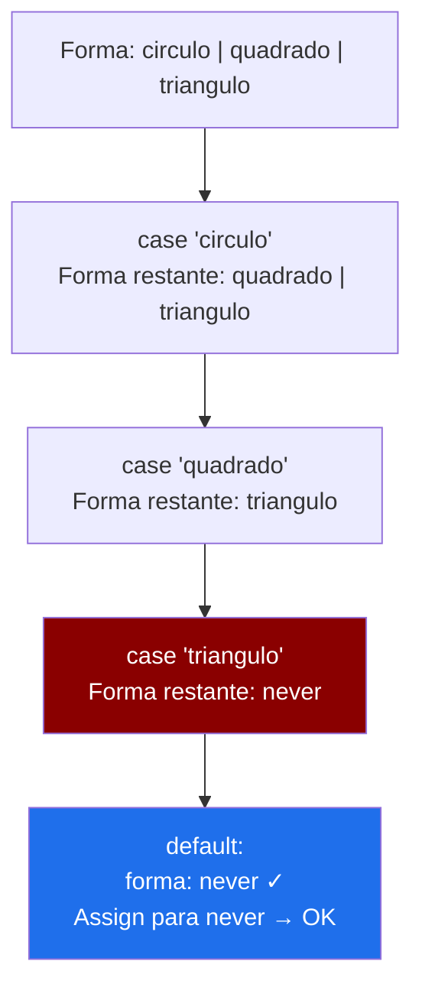
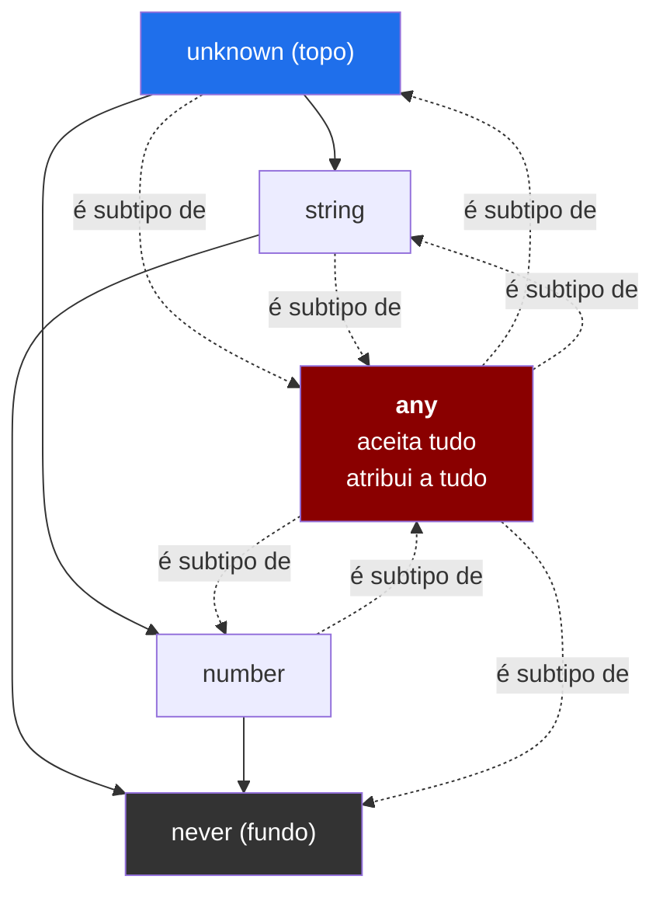

# any, unknown e never

> [!abstract] TL;DR
> `any` desliga o type-checker e é contagioso — um único ponto pode corromper toda a cadeia de tipos. `unknown` é o "any seguro": aceita qualquer valor, mas exige que você prove o tipo antes de operar. `never` é o tipo vazio — nenhum valor o habita, o que o torna a ferramenta perfeita para detectar estados impossíveis. Os três são pontos estratégicos no **reticulado de tipos** do TypeScript: `unknown` no topo, `never` no fundo, `any` como um buraco que quebra a estrutura. Entender isso é entender onde o TS preserva — e onde deliberadamente abre mão — da **soundness**.

---

## O reticulado de tipos — um mapa antes de entrar no labirinto

Todo sistema de tipos formal vive num **reticulado** (lattice): uma hierarquia parcialmente ordenada onde tipos mais gerais ficam no topo e tipos mais específicos ficam no fundo. A relação de ordem é a subtipagem — `A` é subtipo de `B` se todo valor do tipo `A` também é um valor válido do tipo `B`.

No TypeScript, esse reticulado tem dois extremos bem definidos:



> [!note] Leitura do diagrama
> As arestas significam "é supertipo de". `unknown` está no topo porque todo tipo do TS é subtipo dele — qualquer valor pode ser atribuído a `unknown`. `never` está no fundo porque é subtipo de todo tipo — mas como nenhum valor o habita, nada pode ser atribuído a ele (exceto `never` ele mesmo).

Esse mapa é o contexto. `any` não aparece no diagrama porque ele não é um tipo no reticulado — é uma **exceção ao reticulado**. Ele fura a hierarquia nos dois sentidos, e é exatamente isso que o torna perigoso.

---

## `any` — o buraco no sistema

Imagine que você coloca uma caixa numa esteira de triagem de pacotes. Cada caixa tem uma etiqueta dizendo o que contém. O sistema lê a etiqueta, decide o caminho correto, detecta se você tentou colocar explosivos onde deveria ir fruta. Agora imagine uma caixa com uma etiqueta que diz *"não inspecione, confie em mim"*. O sistema deixa passar sem verificar nada.

`any` é essa etiqueta.

Quando você anota uma variável como `any`, o TypeScript simplesmente para de raciocinar sobre ela. Não há inferência, não há verificação, não há proteção:

```ts
let x: any = "hello";

// Tudo isso compila sem erro — NENHUM deles é seguro em runtime:
x.toFixed(2);          // string não tem toFixed
x.nonExistentMethod(); // método inventado
x();                   // string não é função
x[999].deep.nested;    // acesso encadeado sem checar nada
```

Até aqui parece apenas "perigoso mas isolado". O problema real é a **contaminação**: `any` é infeccioso. Ele se propaga silenciosamente para tudo que toca:

```ts
function parseConfig(json: string): any {  // retorna any
    return JSON.parse(json);               // JSON.parse retorna any
}

const config = parseConfig('{"port": 3000}');
// config é any — a partir daqui, TUDO derivado dela também é any:
const port = config.port;              // port: any
const doubled = port * 2;             // doubled: any
const msg = `Rodando na porta ${doubled}`; // msg: string (voltou!)
```

No trecho acima, `port` e `doubled` viraram `any` silenciosamente. Se `port` viesse como `"3000"` (string) em vez de `3000` (number), `doubled` seria `NaN` — e o TypeScript não diria nada. Você descobriria isso em runtime, exatamente o tipo de erro que o TS existe para prevenir.

> [!warning] O incidente clássico
> Esse é um padrão real de bug. Uma função helper antiga retorna `any`. Ao longo do tempo, esse `any` vaza para dezenas de lugares. Um campo é renomeado no backend. Zero erros de compilação. A aplicação quebra em runtime. A solução é substituir o `any` por `unknown` + validação — e quando você faz isso, o compilador encontra todos os lugares que assumiam o shape errado. Cada um deles era um bug dormindo.



### Quando `any` é legítimo

`any` existe por uma razão: o TypeScript é um sistema de **tipagem gradual** (ver nota [[01 - O que é TypeScript - gradual, estrutural, apagado]]). Você pode adotar TS incrementalmente num projeto JS existente sem anotar tudo de uma vez. `any` é a válvula de escape que torna isso possível. Casos legítimos:

- Migrações incrementais de JS para TS (zona temporária de trabalho)
- `catch (e)` em código pre-`useUnknownInCatchVariables`
- Integrações com código JS legado sem tipos, antes de escrever `.d.ts`

Em todos esses casos, o objetivo é **eliminar o `any` eventualmente**, não vivê-lo.

---

## `unknown` — o topo do reticulado, com responsabilidade

Se `any` é a caixa "não inspecione", `unknown` é a caixa "pode ser qualquer coisa — mas você tem que abrir antes de usar".

`unknown` é o **topo do reticulado de tipos**: todo tipo é subtipo dele, então qualquer valor pode ser atribuído a uma variável `unknown`. Até aqui é igual ao `any`. A diferença vem na direção contrária: você **não pode atribuir `unknown` a outro tipo sem narrowing**, e **não pode operar sobre ele sem provar o tipo primeiro**.

```ts
let valor: unknown = "hello";

// Atribuição para unknown: sempre OK (é o topo — tudo cabe)
valor = 42;
valor = { nome: "Maria" };
valor = null;

// Operar sobre unknown: ERRO até você provar o tipo
valor.toUpperCase();       // ERRO: Object is of type 'unknown'
valor.toFixed(2);          // ERRO
const tamanho = valor.length; // ERRO

// Com narrowing: OK
if (typeof valor === "string") {
    valor.toUpperCase();   // OK — TS sabe que é string aqui
}
if (typeof valor === "number") {
    valor.toFixed(2);      // OK — TS sabe que é number aqui
}
```

O compilador age como um porteiro rigoroso: *"Pode entrar qualquer um, mas para sair com permissões, me mostre o documento."*

### O padrão `unknown` nos boundaries

O uso mais importante de `unknown` é nos **boundaries** — os pontos onde dados chegam de fora do sistema de tipos: resposta de API, `JSON.parse`, input de formulário, variáveis de ambiente, `catch`. Nesses pontos, você genuinamente não sabe o tipo em tempo de compilação. A resposta correta é `unknown` + validação:

```ts
// Ruim: JSON.parse retorna any, vazamento garantido
function carregarConfigRuim(json: string) {
    return JSON.parse(json); // any — começa a infecção
}

// Bom: unknown + type guard explícito
interface Config {
    host: string;
    port: number;
}

function isConfig(valor: unknown): valor is Config {
    return (
        typeof valor === "object" &&
        valor !== null &&
        "host" in valor &&
        "port" in valor &&
        typeof (valor as any).host === "string" &&
        typeof (valor as any).port === "number"
    );
}

function carregarConfig(json: string): Config {
    const parsed: unknown = JSON.parse(json);
    if (!isConfig(parsed)) {
        throw new Error("JSON não é uma Config válida");
    }
    return parsed; // aqui TS sabe que é Config
}
```

> [!tip] `unknown` em `catch` com `strict`
> Com `useUnknownInCatchVariables: true` (parte de `strict: true` desde TS 4.4), o parâmetro `e` num bloco `catch` é tipado como `unknown`, não `any`. Isso força você a verificar antes de usar `e.message`. É a decisão certa: você realmente não sabe o que foi jogado.
> ```ts
> try {
>     await fetch("/api");
> } catch (e: unknown) {
>     // e.message  // ERRO — unknown
>     if (e instanceof Error) {
>         console.error(e.message); // OK — narrowed para Error
>     }
> }
> ```

---

## `never` — o fundo do reticulado

Se `unknown` é "pode ser qualquer coisa", `never` é o oposto absoluto: **nenhum valor habita o tipo `never`**. É o conjunto vazio da teoria dos tipos.

Por que um tipo sem valores seria útil? Precisamente porque ele aparece em dois contextos onde o TypeScript precisa expressar que algo é **impossível**:

### 1. Funções que nunca retornam

Uma função que sempre lança ou roda para sempre nunca produz um valor de retorno. O tipo `never` captura isso com precisão:

```ts
function falhar(mensagem: string): never {
    throw new Error(mensagem);
}

function loopEterno(): never {
    while (true) {
        // processa eventos, nunca para
    }
}

// never em union é neutro — some da union:
type T = string | never; // string
```

A razão `never` desaparecer de unions é matemática: `A ∪ ∅ = A`. O conjunto vazio não contribui para a união.

### 2. Branches impossíveis — e o papel em exhaustiveness

O caso mais poderoso de `never` é como **detector de exaustividade**. Depois de todos os ramos possíveis de uma union discriminada terem sido tratados, o tipo que sobra é `never`. Se não sobra nada, a checagem é exaustiva. Se sobra alguma coisa, o compilador reclama:

```ts
type Forma =
    | { tipo: "circulo"; raio: number }
    | { tipo: "quadrado"; lado: number }
    | { tipo: "triangulo"; base: number; altura: number };

function area(forma: Forma): number {
    switch (forma.tipo) {
        case "circulo":
            return Math.PI * forma.raio ** 2;
        case "quadrado":
            return forma.lado ** 2;
        case "triangulo":
            return (forma.base * forma.altura) / 2;
        default:
            // Se chegamos aqui, forma deveria ser never.
            // Se não for, alguém adicionou um novo tipo e esqueceu este switch.
            const impossivel: never = forma; // ERRO se Forma tiver case não coberto
            return impossivel;
    }
}
```

Esse padrão — atribuir o valor restante a `never` no `default` — é chamado de **exhaustiveness check**. Se alguém adicionar `{ tipo: "hexagono"; lados: number }` ao tipo `Forma` sem atualizar este switch, o TypeScript gritará exatamente nesta linha, não silenciosamente em runtime. A nota [[08 - Discriminated unions e exhaustiveness]] aprofunda esse padrão e suas variações.



> [!note] Leitura do diagrama
> A cada `case` coberto, o tipo de `forma` fica mais estreito — o ramo coberto é removido da union. Quando todos os ramos são cobertos, resta `never`. A atribuição `const impossivel: never = forma` só compila quando `forma` realmente é `never`. Se um case falta, `forma` tem um tipo concreto, e a atribuição falha — o compilador detecta o buraco.

---

## Soundness — e onde o TypeScript deliberadamente fura

Até aqui falamos de tipos como se fossem uma garantia absoluta. Mas o TypeScript faz uma escolha deliberada de design: ele **não é um sistema de tipos sound**.

**Soundness** significa que se o compilador aceita um programa, ele é garantidamente livre de erros de tipo em runtime. Haskell, Rust e OCaml buscam isso. TypeScript, não.

Por quê? Porque o TypeScript precisa ser compatível com JavaScript — uma linguagem sem tipos, com coerções implícitas, com `any` como legado, com APIs (como `Object.keys`) que retornam `string[]` em vez de `(keyof T)[]` por razões históricas. Forçar soundness total tornaria impossível ou impraticável tipar código JS real.

Então o TypeScript faz um acordo: ele é **praticamente sound** — a grande maioria dos usos é segura — mas tem buracos conhecidos e documentados:

```ts
// Buraco 1: any fura tudo (já vimos)
const x: any = "não sou number";
const n: number = x; // compila, runtime: n é string

// Buraco 2: type assertion sem verificação
const valor: unknown = "uma string";
const num = valor as number; // compila, runtime: string

// Buraco 3: index access sem noUncheckedIndexedAccess
const arr = [1, 2, 3];
const item = arr[999]; // tipo: number; runtime: undefined

// Buraco 4: variance de arrays — covariância não é sound
const nums: number[] = [1, 2, 3];
const vals: unknown[] = nums; // OK em TS; em Haskell, não
vals[0] = "surpresa";         // runtime: corrompe o array
```

> [!warning] `any` como buraco explícito de soundness
> O diagrama abaixo mostra como `any` se comporta fora do reticulado: ele é simultaneamente supertipo e subtipo de tudo. Essa propriedade é matematicamente inconsistente — nenhum tipo pode ser ao mesmo tempo mais geral e mais específico que qualquer outro. É o preço da compatibilidade gradual.



> [!note] Leitura do diagrama
> As linhas sólidas são o reticulado normal. As linhas tracejadas mostram o `any` furando em todos os sentidos — todo tipo flui para ele e ele flui para todo tipo. Isso é soundness quebrada: `never` (tipo vazio) "cabe" em `any`, o que é uma contradição.

Para a teoria formal de soundness — e por que linguagens como Haskell a perseguem de forma diferente — ver [[03-Dominios/Ciência/Paradigmas/13 - Sistemas de tipos|Sistemas de tipos]].

---

## Comparando os três lado a lado

```ts
// ============ any ============
// Aceita tudo, permite tudo, não verifica nada.
let a: any = "hello";
a.toFixed(2);   // compila. runtime: TypeError
a = 42;
a = { x: 1 };
const num: number = a; // compila. a pode ser qualquer coisa.

// ============ unknown ============
// Aceita tudo, mas exige narrowing antes de operar.
let u: unknown = "hello";
// u.toUpperCase();       // ERRO — unknown
if (typeof u === "string") {
    u.toUpperCase();       // OK — narrowed
}
// const str: string = u; // ERRO — not assignable without assertion/narrowing

// ============ never ============
// Nunca ocorre. Tipo vazio. Compatível com tudo (pois nada habita never).
function erro(msg: string): never {
    throw new Error(msg);
}
type Impossivel = string & number; // never — interseção impossível
type T = string | never;           // string — never some da union
```

| Propriedade | `any` | `unknown` | `never` |
|---|---|---|---|
| Aceita qualquer valor | ✅ | ✅ | ❌ (nenhum valor) |
| Permite operações sem narrowing | ✅ (sem checagem) | ❌ | N/A |
| Atribuível a qualquer tipo | ✅ (fura tudo) | ❌ (só `any`/`unknown`) | ✅ (é subtipo de tudo) |
| Desliga o type-checker | ✅ | ❌ | ❌ |
| Posição no reticulado | Fora (buraco) | Topo | Fundo |
| Uso correto | Migração gradual | Input não confiável | Impossível / exaustividade |

---

## O padrão prático: `unknown` nos boundaries, `never` nas bordas

Juntando tudo, dois padrões emergem como os mais valiosos no dia a dia:

### Padrão 1: `unknown` + type guard nos boundaries

Toda vez que dados chegam de fora do sistema de tipos — API, JSON, `catch`, `localStorage` — receba-os como `unknown` e valide antes de usar. Na nota [[23 - A fronteira type↔runtime - parse, don't validate]], esse padrão ganha um nome formal e integração com bibliotecas como Zod.

```ts
// Boundary: leitura de API externa
async function buscarUsuario(id: string): Promise<User> {
    const resposta = await fetch(`/api/users/${id}`);
    const dados: unknown = await resposta.json(); // unknown, não any

    if (!isUser(dados)) {
        throw new Error(`Formato inválido: ${JSON.stringify(dados)}`);
    }
    return dados; // narrowed para User
}

function isUser(valor: unknown): valor is User {
    return (
        typeof valor === "object" &&
        valor !== null &&
        typeof (valor as Record<string, unknown>).id === "string" &&
        typeof (valor as Record<string, unknown>).nome === "string"
    );
}
```

### Padrão 2: `never` como sentinela de exaustividade

Use `never` no `default` de switches sobre unions discriminadas. Quando um novo estado é adicionado à union, o switch perde a atribuição para `never` e o compilador aponta o buraco. Detalhe completo em [[08 - Discriminated unions e exhaustiveness]].

```ts
function assertNever(valor: never, mensagem?: string): never {
    throw new Error(mensagem ?? `Valor inesperado: ${JSON.stringify(valor)}`);
}

// Nos switches:
switch (evento.tipo) {
    case "criado": return tratar criação;
    case "atualizado": return tratar atualização;
    case "removido": return tratar remoção;
    default:
        return assertNever(evento, `Tipo desconhecido: ${(evento as any).tipo}`);
}
```

> [!example] Type guards e narrowing são o elo
> `unknown` + type guard é um par inseparável. Você recebe `unknown`, e usa type guards (`typeof`, `instanceof`, `in`, ou funções `x is T`) para ensinar o TS o tipo real. A nota [[09 - Type narrowing e type guards]] cobre esse vocabulário por inteiro — todos os mecanismos que o compilador aceita como "prova".

---

## Como explicar em inglês

TypeScript's type system has a **type lattice** with `unknown` at the top and `never` at the bottom. `unknown` is the "safe any" — it accepts any value, just like `any`, but doesn't let you do anything with it until you prove the type through narrowing. `never` is the empty type — no value can inhabit it, which makes it useful for impossible states and exhaustiveness checks.

`any` is the escape hatch that breaks the lattice entirely. It's both a supertype and a subtype of everything, which is mathematically inconsistent. TypeScript allows it because it's a gradual type system — you can adopt types incrementally. But `any` is contagious: a single `any` in a function return type infects every value derived from it.

The practical rule: at system boundaries — API responses, `JSON.parse`, environment variables, `catch` blocks — use `unknown` and narrow before using. In switch statements over discriminated unions, assign the `default` branch to `never` to get compile-time exhaustiveness checking. And treat `any` as a temporary escape valve, not a permanent solution.

TypeScript is deliberately not sound — it trades theoretical guarantees for compatibility with JavaScript. That's the explicit bargain of gradual typing. The team has documented specific unsound points (`any`, type assertions, array covariance) and chose pragmatism over purity.

### Vocabulário-chave

| Português | Inglês |
|---|---|
| reticulado de tipos | type lattice |
| topo do reticulado | top type |
| fundo do reticulado | bottom type |
| soundness | soundness / type soundness |
| tipagem gradual | gradual typing |
| estreitamento de tipo | type narrowing |
| proteção de tipo | type guard |
| buraco no sistema de tipos | hole in the type system |
| checagem exaustiva | exhaustiveness check / exhaustiveness checking |
| tipo vazio | empty type / uninhabited type |
| tipo contagioso | contagious / infectious type |
| fronteira do sistema | system boundary |
| asserção de tipo | type assertion |
| tipo impossível | impossible type |
| eliminar em runtime | erased at runtime |

---

## Veja também

- [[01 - O que é TypeScript - gradual, estrutural, apagado]] — a decisão de ser gradual é a razão do `any` existir
- [[08 - Discriminated unions e exhaustiveness]] — onde `never` brilha como sentinela de exaustividade
- [[09 - Type narrowing e type guards]] — o vocabulário completo para converter `unknown` em tipos concretos
- [[23 - A fronteira type↔runtime - parse, don't validate]] — o padrão formal para tratar `unknown` nos boundaries com Zod e similares
- [[03-Dominios/Ciência/Paradigmas/13 - Sistemas de tipos|Sistemas de tipos]] — teoria de soundness, reticulados formais e tipagem gradual no nível acadêmico
