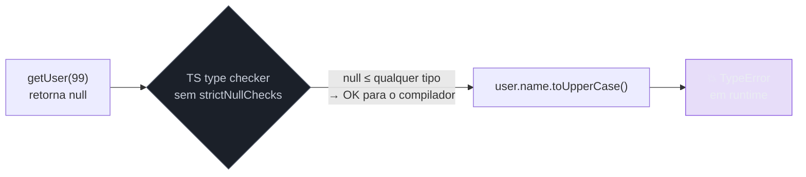
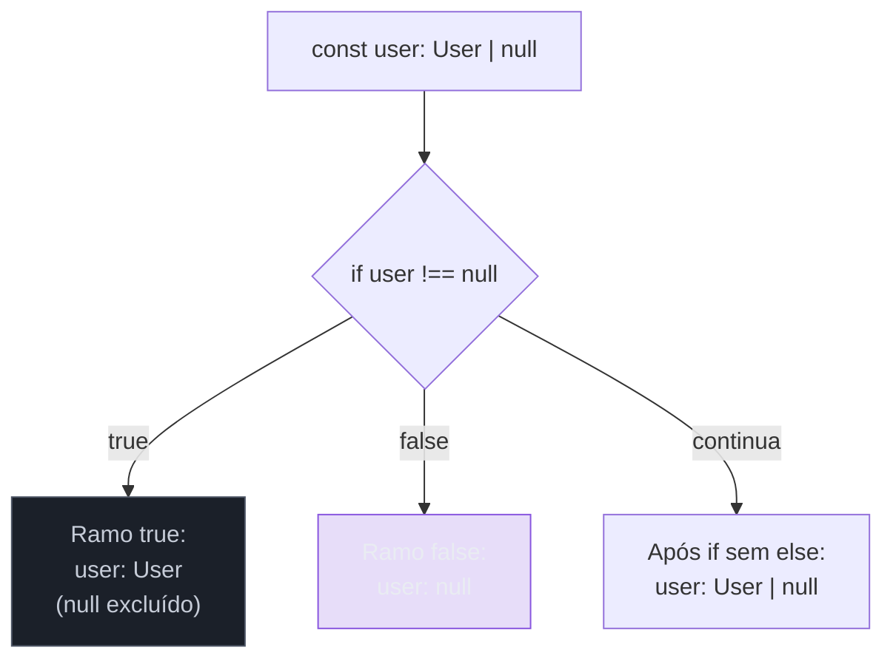
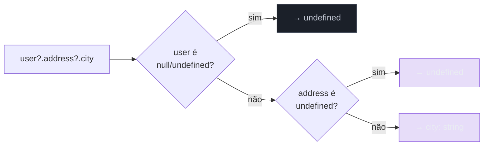
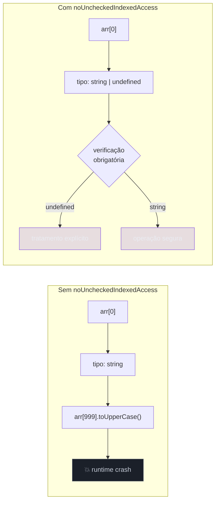
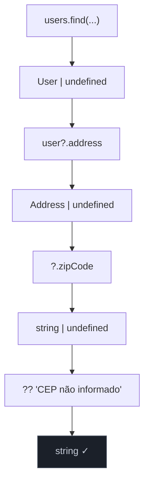

# strictNullChecks: null, undefined e optional

> [!abstract] TL;DR
> Sem `strictNullChecks`, `null` e `undefined` são valores legítimos de *qualquer* tipo — uma variável `string` pode ser `null` sem o TypeScript reclamar, e o bug só aparece em runtime. Com a flag ligada, `null` e `undefined` saem do clube geral e viram tipos explícitos: uma `string` é apenas string. Se você quer permitir ausência, precisa declarar `string | null` — e o compilador te força a tratar os dois casos antes de usar o valor. `noUncheckedIndexedAccess` estende a mesma lógica para acesso por índice em arrays e records; `exactOptionalPropertyTypes` refina a semântica de propriedades opcionais. Juntas, essas três flags eliminam a principal fonte de crashes de runtime em JavaScript.

---

## O erro de um bilhão de dólares

Em 1965, Tony Hoare inventou o `null` em ALGOL W. Décadas depois, em 2009, ele pediu desculpa publicamente numa conferência da Microsoft Research. Chamou a decisão de "o erro de um bilhão de dólares" — uma estimativa conservadora dos prejuízos causados por crashes, falhas de segurança e bugs silenciosos ao longo dos anos.

O problema não é o conceito de "ausência de valor". A ausência é um estado legítimo do mundo. O problema é a implementação clássica: tornar `null` um habitante silencioso de *todo e qualquer tipo*. Quando `null` pode ser qualquer coisa, você nunca sabe, olhando para o tipo, se um valor pode estar ausente ou não. A contagem de `null` vira um detalhe de documentação — e documentação mente.

JavaScript herdou isso com um bônus: tem *dois* valores de ausência. `null` e `undefined` são coisas diferentes na linguagem, com comportamentos levemente distintos. Para os propósitos desta nota, pense assim:

- `undefined` — a variável existe mas não foi inicializada; ou o argumento não foi passado; ou o acesso a um índice inexistente num array retornou sem encontrar nada.
- `null` — uma ausência *deliberada*, atribuída explicitamente pelo programador.

A distinção importa em design de API, mas o problema que `strictNullChecks` resolve é o mesmo nos dois casos: sem a flag, os dois são invisíveis ao type checker.

---

## O mundo sem strictNullChecks

Deixa eu mostrar como o TypeScript se comporta sem a flag — e por que é assustador.

```ts
// tsconfig.json: "strictNullChecks": false  (ou strict: false)

function getUser(id: number): { name: string; email: string } {
  if (id === 42) return { name: "Maria", email: "maria@exemplo.com" };
  return null; // TS aceita sem reclamar
}

const user = getUser(99);
console.log(user.name.toUpperCase()); // TypeError: Cannot read properties of null
```

Repare no que aconteceu. O tipo de retorno diz `{ name: string; email: string }`. O TypeScript acreditou nisso — afinal, você prometeu. Mas a função retorna `null` quando `id` não é 42, e o compilador engoliu porque, sem `strictNullChecks`, `null` é subtype de qualquer tipo. Você tem um contrato assinado que mente.

O diagrama abaixo ilustra onde o bug passa:



Agora com a flag ligada:

```ts
// tsconfig.json: "strictNullChecks": true  (ativado por "strict": true)

function getUser(id: number): { name: string; email: string } {
  if (id === 42) return { name: "Maria", email: "maria@exemplo.com" };
  return null; // ERRO: Type 'null' is not assignable to type '{ name: string; email: string }'
}
```

O compilador recusa. Para aceitar o retorno `null`, você precisa declarar que ele é possível:

```ts
function getUser(id: number): { name: string; email: string } | null {
  if (id === 42) return { name: "Maria", email: "maria@exemplo.com" };
  return null; // OK — null está no tipo de retorno
}
```

Agora o tipo *é a documentação*. Quem chamar `getUser` sabe, sem ler o corpo da função, que pode receber `null` — e o compilador vai cobrar o tratamento:

```ts
const user = getUser(99);
console.log(user.name); // ERRO: Object is possibly 'null'

// O compilador só libera se você tratar:
if (user !== null) {
  console.log(user.name); // OK — narrowed para { name: string; email: string }
}
```

---

## Como o TS estreita (narra) o tipo

O mecanismo que torna tudo isso útil é o **control flow analysis** — o compilador rastreia o fluxo do código e sabe, em cada ponto, o que a análise dos checks anteriores implica sobre o tipo.



Esse estreitamento acontece com vários padrões:

```ts
type User = { name: string; age: number };

function process(user: User | null | undefined) {
  // 1. Igualdade estrita
  if (user === null || user === undefined) {
    return; // user é null | undefined aqui
  }
  // user é User aqui — TS excluiu null e undefined

  // 2. Operador de igualdade loose (== null cobre null E undefined)
  if (user == null) {
    return;
  }
  // user é User aqui (== null == undefined ambos excluídos)

  // 3. Truthiness (cuidado: 0, "", false também são falsy!)
  if (!user) return;
  // user é User — mas aqui seria perigoso se User pudesse ser 0 ou ""

  console.log(user.name.toUpperCase()); // seguro
}
```

> [!warning] Armadilha do truthiness check
> `if (!value)` narrow corretamente para objetos (objetos são sempre truthy), mas é perigoso para strings, numbers e booleans — um string vazio `""` ou número `0` também são falsy. Para `string | null`, prefira `value !== null && value !== undefined` ou `value != null`.

---

## Optional chaining `?.` e nullish coalescing `??` na ótica do tipo

Optional chaining não é açúcar sintático aleatório — ele tem semântica de tipo precisa. O operador `?.` retorna o resultado da operação se o valor não é `null`/`undefined`, e retorna `undefined` caso contrário.

```ts
type User = {
  name: string;
  address?: {
    street: string;
    city: string;
  };
};

function getCity(user: User | null): string | undefined {
  return user?.address?.city;
  // tipo inferido: string | undefined
  // porque: user pode ser null → undefined
  //         user.address pode ser undefined → undefined
  //         user.address.city é string → string
  // resultado: string | undefined
}
```

O TS resolve o tipo resultante do `?.` estaticamente: ele sabe que cada passo que pode ser `null`/`undefined` transforma o resultado final em `| undefined`. Veja o diagrama:



O nullish coalescing `??` fornece um valor padrão apenas quando o operando esquerdo é `null` ou `undefined` (diferente de `||`, que responde a qualquer falsy):

```ts
function getCityName(user: User | null): string {
  return user?.address?.city ?? "Cidade desconhecida";
  // string | undefined  ??  string  →  string
  // O ?? elimina o undefined do tipo
}
```

Repare: o tipo de retorno agora é `string`, não `string | undefined`. O `??` com um valor padrão que não é `null`/`undefined` elimina `null`/`undefined` do tipo resultante — o TS sabe disso estaticamente.

> [!tip] `??` vs `||` — qual usar com null/undefined?
> Use `??` quando quiser substituir *apenas* `null`/`undefined`. Use `||` quando quiser substituir qualquer falsy. Exemplo prático: `count ?? 0` mantém `count = 0` intacto; `count || 0` substitui `count = 0` também — possível bug silencioso.

---

## Propriedade opcional `?:` vs `| undefined` explícito

Aqui mora uma distinção que a maioria das pessoas aprende tarde e que custa caro em code reviews.

Em TypeScript, existe uma diferença semântica entre:

```ts
interface A {
  x?: string; // propriedade opcional: pode estar ausente OU ser undefined
}

interface B {
  x: string | undefined; // propriedade obrigatória: deve estar presente, mas pode ser undefined
}
```

A diferença está no que o `in` operator e o `Object.keys` veem:

```ts
const a: A = {}; // OK — x está ausente
const b: B = {}; // ERRO — x é obrigatório (deve estar na chave, mesmo que undefined)
const b2: B = { x: undefined }; // OK — x está presente com valor undefined

console.log("x" in a); // false — chave não existe no objeto
console.log("x" in b2); // true — chave existe, valor é undefined
```

Quando você itera, faz spread ou usa `JSON.stringify`, a diferença importa:

```ts
JSON.stringify({ x: undefined }); // "{}"       — undefined some
JSON.stringify({});               // "{}"       — sem chave, idem
// Ok, nesse caso JSON.stringify nivela. Mas Object.keys não:

Object.keys({ x: undefined }); // ["x"]
Object.keys({});               // []
```

---

## exactOptionalPropertyTypes — refinando a semântica

Sem `exactOptionalPropertyTypes`, a distinção acima é academicamente interessante mas praticamente invisível para o compilador. Com a flag, o TS *faz cumprir* a diferença:

```ts
// tsconfig: "exactOptionalPropertyTypes": true

interface Config {
  timeout?: number; // opcional: ausente ou presente com number
}

// Sem a flag: ambos compilam
// Com a flag:
const c1: Config = {};                // OK — timeout ausente
const c2: Config = { timeout: 5000 }; // OK — timeout presente com number
const c3: Config = { timeout: undefined }; // ERRO com exactOptionalPropertyTypes!
// Type 'undefined' is not assignable to type 'number'
// porque timeout?: number significa "number ou ausente", não "number ou undefined"
```

Isso muda como você precisa pensar em updates parciais. Um padrão comum é usar `Partial<T>` para patches:

```ts
function updateConfig(base: Config, patch: Partial<Config>): Config {
  return { ...base, ...patch };
}

// Com exactOptionalPropertyTypes ativo, Partial<Config> é:
// { timeout?: number }
// NÃO: { timeout?: number | undefined }
// então:
updateConfig({ timeout: 5000 }, { timeout: undefined }); // ERRO — undefined não é number
updateConfig({ timeout: 5000 }, {});                      // OK — timeout simplesmente ausente no patch
```

> [!note] Compatibilidade com libs externas
> `exactOptionalPropertyTypes` pode gerar atrito com libs que usam `undefined` como "sem valor" (lodash, express, react-hook-form). A flag é certa semanticamente, mas espere ter de adicionar `| undefined` em alguns tipos de terceiros ou usar `satisfies` como válvula de escape. A dor é temporária e vale.

---

## noUncheckedIndexedAccess — o null da coleção

Imagine um array de strings. Você acessa `arr[0]`. Qual é o tipo?

Sem `noUncheckedIndexedAccess`: `string`. O compilador assume que o índice é válido.  
Com a flag: `string | undefined`. O compilador reconhece que o índice pode estar fora dos limites.

```ts
// tsconfig: "noUncheckedIndexedAccess": true

const nomes = ["Ana", "Bruno", "Carla"];

const primeiro = nomes[0];        // tipo: string | undefined
const quarto = nomes[3];          // tipo: string | undefined (e de fato é undefined)

console.log(primeiro.toUpperCase()); // ERRO: Object is possibly 'undefined'

// Precisa verificar:
if (primeiro !== undefined) {
  console.log(primeiro.toUpperCase()); // OK — narrowed para string
}

// Ou usar optional chaining:
console.log(primeiro?.toUpperCase()); // OK — retorna string | undefined
```

A mesma lógica se aplica a `Record<string, T>` (index signature):

```ts
const scores: Record<string, number> = { Ana: 95, Bruno: 87 };

const anaScore = scores["Ana"];       // tipo: number | undefined (com a flag)
const xpto = scores["nao-existe"];   // tipo: number | undefined — correto!

// Sem a flag: scores["nao-existe"] seria number — tipo mentiroso
```



> [!tip] Iteração segura com noUncheckedIndexedAccess
> `for...of` é seguro porque itera apenas sobre elementos existentes — cada elemento tem o tipo esperado, sem `| undefined`. O problema é o acesso por índice numérico arbitrário. Prefira `for...of`, `forEach`, `map`, `filter` sobre acesso por índice quando possível.

---

## O non-null assertion operator `!` — o poder e o perigo

O operador `!` é uma declaração ao compilador: "confie em mim, esse valor não é null nem undefined". O TS aceita e estreita o tipo:

```ts
const input = document.getElementById("meu-input"); // HTMLElement | null
input!.focus(); // você promete que input não é null

// equivale a dizer ao compilador:
// "eu sei que getElementById pode retornar null, mas aqui não vai"
```

O `!` deve ser a última opção — use quando *você sabe* com certeza que o valor existe e verificar seria código morto:

```ts
// Cenário legítimo: ambiente controlado em testes
const container = document.getElementById("root")!;
// Se #root não existe, o app todo quebrou de outras formas antes

// Cenário perigoso: otimismo não fundamentado
const user = users.find(u => u.id === id)!;
// E se id nunca bater? O ! vai explodir em runtime
```

> [!warning] `!` é dívida técnica silenciosa
> Cada `!` no código é uma promessa sem garantia. Se a promessa quebrar em alguma refatoração futura, o erro vai aparecer em runtime, não em compilação. Prefira sempre o narrowing explícito. O `!` é aceitável em código de bootstrap/inicialização onde a ausência do elemento significa falha total do ambiente.

---

## Unindo tudo: um exemplo real

Considere uma função que busca o e-mail de contato de um usuário, que pode não ter endereço cadastrado:

```ts
interface Address {
  street: string;
  city: string;
  zipCode?: string; // CEP é opcional
}

interface User {
  id: number;
  name: string;
  email: string;
  address?: Address; // endereço é opcional
}

const users: User[] = [
  { id: 1, name: "Ana", email: "ana@ex.com" },
  { id: 2, name: "Bruno", email: "bruno@ex.com", address: { street: "Rua A", city: "SP" } },
];

// Com todas as flags ligadas:
function getCepDoUsuario(id: number): string {
  const user = users.find(u => u.id === id); // User | undefined (noUncheckedIndexedAccess)
  // find() retorna T | undefined — isso não é a flag, é o tipo built-in
  // mas com noUncheckedIndexedAccess, users[0] também seria User | undefined

  const cep = user?.address?.zipCode; // string | undefined

  return cep ?? "CEP não informado"; // string (undefined eliminado pelo ??)
}

getCepDoUsuario(1); // "CEP não informado" — user sem endereço
getCepDoUsuario(2); // "CEP não informado" — endereço sem CEP
getCepDoUsuario(99); // "CEP não informado" — user não encontrado
```

O diagrama de fluxo do tipo através da função:



Cada `?` no caminho da propriedade acrescenta `| undefined` ao tipo parcial. O `??` no final "limpa" o `| undefined` fornecendo um fallback que nunca é `null`/`undefined`. O retorno final é `string` — sem exceção possível.

---

## Como as flags se relacionam com `strict: true`

`strict: true` no `tsconfig.json` é um guarda-chuva que ativa um conjunto de flags — e `strictNullChecks` está dentro dele. Mas `noUncheckedIndexedAccess` e `exactOptionalPropertyTypes` **não estão** dentro de `strict: true`. Você precisa ativá-las manualmente:

```json
{
  "compilerOptions": {
    "strict": true,
    "noUncheckedIndexedAccess": true,
    "exactOptionalPropertyTypes": true
  }
}
```

O tour completo de todas as flags, o que cada uma protege e as configurações recomendadas por ambiente (biblioteca vs app vs monorepo) estão em [[20 - tsconfig e strict mode a fundo]].

> [!note] Por que essas duas ficaram de fora do `strict`?
> Porque quebram mais código existente. `noUncheckedIndexedAccess` em particular produz muitos `| undefined` em código legado que acessa arrays por índice — o esforço de migração foi considerado alto demais para incluir no bundle padrão. O time do TS adotou uma postura conservadora: `strict` vai para novos projetos facilmente; as flags extras são opt-in para quem quer o nível máximo.

---

## Como explicar em inglês

> "Before `strictNullChecks`, TypeScript had the same billion-dollar mistake as most languages: `null` and `undefined` were valid values of every type, so a variable typed as `string` could silently be `null`, and the only way to discover that was a runtime crash.
>
> With `strictNullChecks` — which is part of `strict: true` — `null` and `undefined` are their own explicit types. If a function can return `null`, the return type must say `string | null`. The compiler then forces you to handle both cases before using the value, using control flow analysis to narrow the type inside conditional branches.
>
> Optional chaining `?.` and nullish coalescing `??` are the idiomatic tools for working with nullable values. The TS compiler understands their type semantics: `?.` short-circuits to `undefined`, and `??` eliminates `null | undefined` when given a non-nullable fallback.
>
> There are two extra flags I always add on top of `strict`. `noUncheckedIndexedAccess` makes array indexing honest: `arr[0]` is `string | undefined`, not `string`, because TypeScript can't guarantee the index is in bounds. `exactOptionalPropertyTypes` tightens optional properties: `x?: string` means `string or absent`, not `string or undefined` — the distinction matters for serialization and Object.keys behavior.
>
> The non-null assertion operator `!` tells the compiler to trust you. It's a last resort — every `!` is a promise without a guarantee. I treat it as technical debt and prefer explicit narrowing."

### Vocabulário-chave

| Português | English |
|---|---|
| verificação de nulo/indefinido | null check |
| checagem de nulos estrita | strict null checks |
| valor ausente / ausência | absent value / absence |
| tipo nulável | nullable type |
| encadeamento opcional | optional chaining |
| coalescência nula | nullish coalescing |
| estreitamento de tipo | type narrowing |
| propriedade opcional | optional property |
| asserção não-nula | non-null assertion |
| acesso por índice não verificado | unchecked indexed access |
| tipos opcionais exatos | exact optional property types |
| valor padrão | default / fallback value |
| crash em tempo de execução | runtime crash |

---

## Veja também

- [[04 - any, unknown e never]] — `unknown` é o parceiro natural de `strictNullChecks`: quando o tipo é incerto, use `unknown` em vez de `any` e faça narrowing.
- [[09 - Type narrowing e type guards]] — o mecanismo completo de como o TS estreita tipos via control flow, `typeof`, `instanceof`, `in`, type predicates e assertion functions.
- [[20 - tsconfig e strict mode a fundo]] — tour completo de todas as flags `strict` e as flags extras; configurações recomendadas por tipo de projeto.
- [[03-Dominios/Tecnologia/JavaScript/JavaScript Fundamentals|JavaScript Fundamentals]] — a origem de `null` e `undefined` em JS: por que existem dois valores de ausência, `typeof null === "object"` e outros comportamentos da linguagem base.
