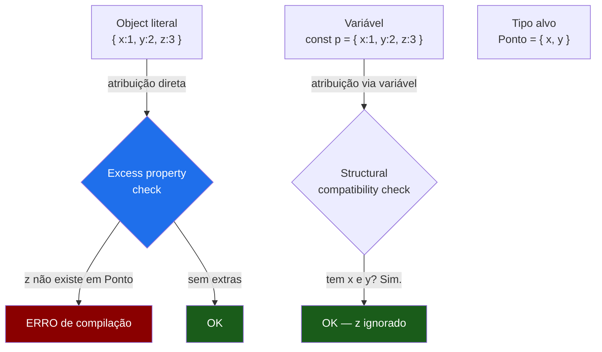
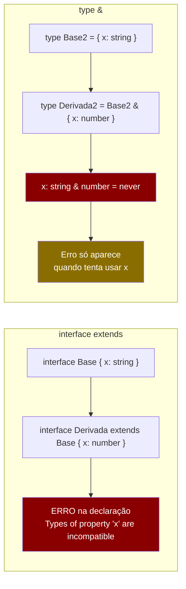
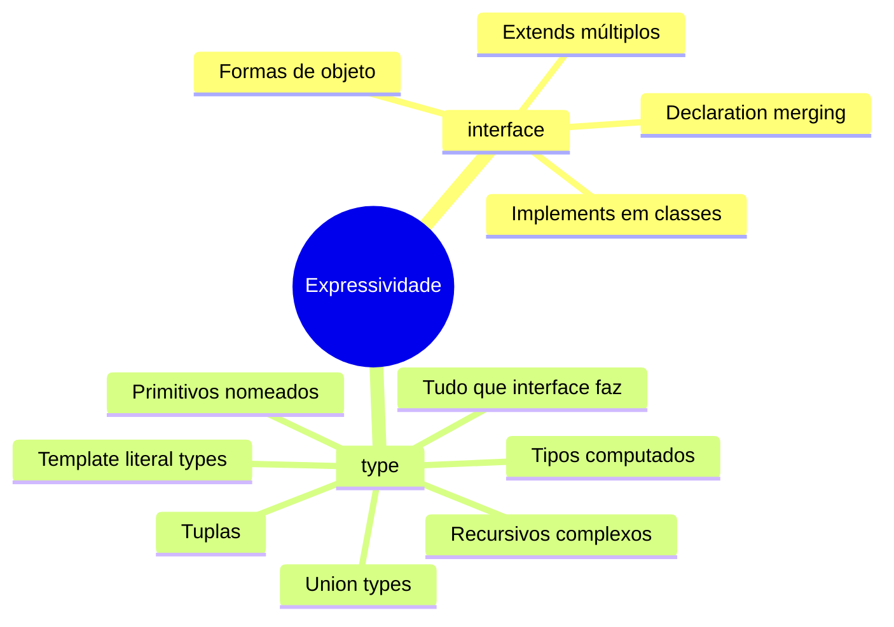
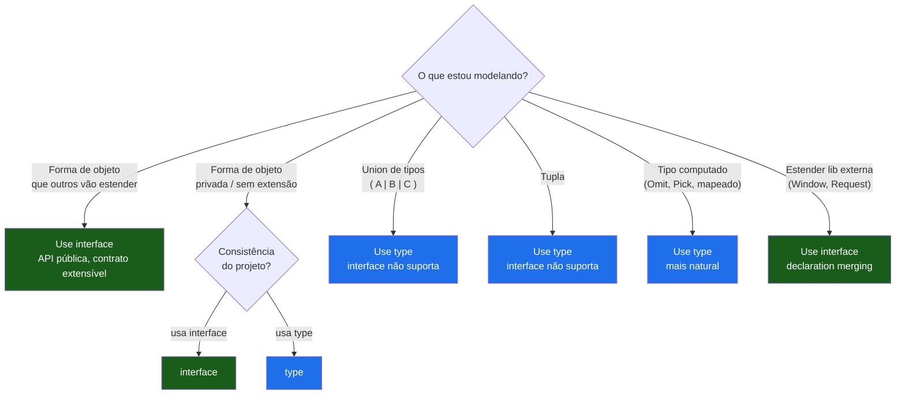

# Objetos: interface vs type

> [!abstract] TL;DR
> Tanto `interface` quanto `type` descrevem a forma de um objeto — e para 90% dos casos do dia a dia, são intercambiáveis. Mas há diferenças reais: `interface` suporta **declaration merging** (você pode reabrir e estender depois da definição) e `extends` que resulta em erros mais legíveis. `type` é mais expressivo: suporta unions, tuplas, tipos computados e template literals — formas que `interface` simplesmente não consegue expressar. A regra prática que sobrevive a entrevistas: **`interface` para formas de objeto extensíveis e APIs públicas; `type` para unions, tuplas e tipos derivados de computação**. O veredito honesto: escolha um, seja consistente, e conheça as diferenças quando importam.

---

## A pergunta que todo entrevistador faz

"Qual a diferença entre `interface` e `type` em TypeScript?"

É uma das perguntas mais frequentes em entrevistas de frontend e fullstack com TypeScript. E a armadilha é que a resposta superficial — "são quase iguais" — não impressiona ninguém, enquanto a resposta excessivamente técnica ("declaration merging, variance, structural equivalence...") soa como decoreba sem compreensão.

A resposta que demonstra sênior parte de um entendimento estrutural: **ambos vivem no mundo dos tipos, ambos somem em runtime, e ambos descrevem a forma de um objeto.** As diferenças são reais, mas contextuais. Vamos construir esse entendimento do zero.

---

## Descrevendo objetos — a base comum

O TypeScript é um sistema de tipos estrutural: o que importa não é o nome do tipo, mas a **forma** — quais propriedades existem e qual o tipo de cada uma. Tanto `interface` quanto `type` são formas de nomear uma forma.

```ts
// As duas definições abaixo são estruturalmente equivalentes.
// O TypeScript não distingue entre elas ao checar assignability.

interface Usuario {
    id: string;
    nome: string;
    email: string;
}

type UsuarioType = {
    id: string;
    nome: string;
    email: string;
};

// Ambas funcionam de forma idêntica como anotação de parâmetro:
function saudar(u: Usuario): string {
    return `Olá, ${u.nome}`;
}

function saudarComType(u: UsuarioType): string {
    return `Olá, ${u.nome}`;
}

// E as duas são intercambiáveis em atribuição — duck typing estrutural:
const u: Usuario = { id: "1", nome: "Maria", email: "m@ex.com" };
saudarComType(u); // OK — mesma forma, não importa o nome
```

> [!note] Por que são intercambiáveis
> No sistema estrutural do TypeScript, dois tipos são compatíveis se têm as mesmas propriedades com os mesmos tipos — independente de como foram declarados. Isso vem do conceito de duck typing formal: "se anda como pato e grasna como pato, é um pato". Para a teoria por trás disso, ver [[03-Dominios/Ciência/Paradigmas/13 - Sistemas de tipos|Sistemas de tipos]].

---

## Modificadores de propriedade: `?`, `readonly` e index signatures

Antes de entrar nas diferenças entre `interface` e `type`, vale cobrir os modificadores que ambos suportam — porque eles aparecem muito em código real.

### `?` — propriedade opcional

```ts
interface Produto {
    id: string;
    nome: string;
    descricao?: string;   // pode ou não existir
    preco: number;
}

// descricao pode ser omitida:
const p: Produto = { id: "1", nome: "Café", preco: 12.9 }; // OK

// Mas se presente, tem que ser string — não undefined explícito com strictNullChecks:
const p2: Produto = { id: "2", nome: "Chá", descricao: undefined, preco: 8.5 };
// ^ OK com strictNullChecks padrão; com exactOptionalPropertyTypes: true, dá erro
```

> [!tip] `?` vs `| undefined`
> `descricao?: string` e `descricao: string | undefined` parecem iguais, mas com `exactOptionalPropertyTypes: true` (flag do `strict` na nota [[20 - tsconfig e strict mode a fundo]]) a distinção fica real: `?` permite omitir a chave; `| undefined` exige a chave presente com valor `undefined`. Na maioria dos projetos sem essa flag, são equivalentes — mas é bom saber a diferença.

### `readonly` — propriedade imutável

```ts
interface Config {
    readonly host: string;  // não pode ser reatribuída após criação
    readonly port: number;
    timeout?: number;
}

const cfg: Config = { host: "localhost", port: 3000 };
cfg.host = "outro"; // ERRO: Cannot assign to 'host' because it is a read-only property
```

`readonly` é verificado em tempo de compilação — em runtime é JavaScript normal, e uma `as any` passa por cima. Mas como ferramenta de prevenção de bugs, é muito útil para objetos de configuração, resultados de queries que não devem ser mutados, e Value Objects.

### Index signatures — dicionários tipados

Quando você não sabe as chaves em tempo de compilação, mas sabe o tipo dos valores:

```ts
interface Dicionario {
    [chave: string]: string;  // qualquer chave string → valor string
}

interface Contadores {
    [evento: string]: number;
    total: number;            // propriedades nomeadas devem ser compatíveis com o index
}

const d: Dicionario = {};
d["nome"] = "Maria";  // OK
d["idade"] = 42;      // ERRO: number não é string

const c: Contadores = { total: 0 };
c["cliques"] = 5;     // OK
c["paginas"] = 3;     // OK
```

> [!warning] Index signature e `noUncheckedIndexedAccess`
> Sem a flag `noUncheckedIndexedAccess`, `c["qualquerCoisa"]` retorna `number` — mesmo que a chave não exista, TypeScript assume o valor está lá. Com a flag habilitada, retorna `number | undefined`, forçando você a checar. É um dos buracos clássicos de soundness do TS.

---

## Excess property checking — a armadilha do literal

Há um comportamento sutil que confunde iniciantes: o TypeScript é mais rígido com **object literals** do que com variáveis.

```ts
interface Ponto {
    x: number;
    y: number;
}

// Passando variável: OK — structural typing normal
const p = { x: 1, y: 2, z: 3 };
const ponto: Ponto = p;          // OK — tem x e y, z extra é ignorado

// Passando literal diretamente: ERRO — excess property check
const pontoErro: Ponto = { x: 1, y: 2, z: 3 };
// ERRO: Object literal may only specify known properties,
//       and 'z' does not exist in type 'Ponto'
```

O TypeScript usa excess property checking em três situações: atribuição direta de literal, passagem de literal como argumento de função, e retorno de literal em função com tipo anotado.

```ts
function moverPara(p: Ponto): void { /* ... */ }

moverPara({ x: 1, y: 2 });           // OK
moverPara({ x: 1, y: 2, z: 3 });    // ERRO — excess property em literal

const destino = { x: 1, y: 2, z: 3 };
moverPara(destino);                   // OK — via variável, sem excess check
```



> [!note] Por que esse comportamento existe?
> Quando você passa um literal diretamente, é muito provável que a propriedade extra seja um typo (você quis dizer `id` mas escreveu `di`). Mas quando passa via variável, o objeto pode intencionalmente ter propriedades extras — e structural typing deve prevalecer. A distinção captura o bug mais comum sem quebrar a flexibilidade estrutural.

---

## As diferenças reais: `extends` vs `&`

Aqui começa a divergência prática. Ambos permitem composição, mas de formas diferentes.

### `interface extends` — herança declarativa

```ts
interface Entidade {
    id: string;
    criadoEm: Date;
}

interface Produto extends Entidade {
    nome: string;
    preco: number;
}

// Produto tem: id, criadoEm, nome, preco
const cafe: Produto = {
    id: "p001",
    criadoEm: new Date(),
    nome: "Café Especial",
    preco: 42.9,
};

// Uma interface pode estender múltiplas:
interface ProdutoComEstoque extends Produto, { quantidade: number } {
    localizacao?: string;
}
```

### `type` com intersection (`&`) — composição por álgebra

```ts
type Entidade = {
    id: string;
    criadoEm: Date;
};

type Produto = Entidade & {
    nome: string;
    preco: number;
};

// Funciona — a forma resultante é idêntica
const cafe: Produto = {
    id: "p001",
    criadoEm: new Date(),
    nome: "Café Especial",
    preco: 42.9,
};
```

**A diferença que importa em prática:** quando há **conflito de propriedades**, o comportamento difere.

```ts
// Com interface extends — conflito vira erro imediato de declaração:
interface Base { x: string }
interface Derivada extends Base { x: number } // ERRO em declaração!
// Interface 'Derivada' incorrectly extends interface 'Base'.
//   Types of property 'x' are incompatible.

// Com type & — conflito é resolvido na hora: x vira never
type Base2 = { x: string };
type Derivada2 = Base2 & { x: number };
// x: string & number → x: never
// Erro só aparece quando você tenta usar x — e pode ser silencioso

const d: Derivada2 = { x: ??? }; // x: never — impossível de satisfazer
```

> [!warning] `&` com conflito é silencioso até o uso
> Com intersection, propriedades conflitantes viram `never` sem aviso na declaração. Isso pode ser difícil de debugar. A `interface extends` detecta o conflito na própria declaração. Quando você sabe que está estendendo um contrato formal, `extends` dá feedback mais rápido.



### Uma interface pode estender um type (e vice-versa)

O TypeScript não força consistência de sintaxe — você pode misturar livremente:

```ts
type Nomeavel = { nome: string };
type Ativo = { ativo: boolean };

// Interface estendendo type aliases:
interface Funcionario extends Nomeavel, Ativo {
    cargo: string;
    salario: number;
}

// Type usando intersection com interface:
interface Auditavel { atualizadoEm: Date }
type FuncionarioCompleto = Funcionario & Auditavel;
```

---

## O que `type` pode fazer e `interface` não pode

Esta é a diferença mais importante para entrevistas. `type` é mais expressivo porque pode nomear **qualquer tipo**, não só formas de objetos:

```ts
// 1. Union types — interface não consegue
type Status = "ativo" | "inativo" | "pendente";
type IdOuNome = string | number;
type Resultado<T> =
    | { ok: true; valor: T }
    | { ok: false; erro: string };

// 2. Tuplas — interface não consegue
type Coordenada = [number, number];
type Range = [inicio: number, fim: number]; // tupla nomeada (TS 4.0+)

// 3. Tipos computados com utility types — mais natural com type
type UsuarioPublico = Omit<Usuario, "senha" | "tokenRefresh">;
type CamposObrigatorios = Required<Pick<Produto, "nome" | "preco">>;

// 4. Template literal types — interface não consegue
type EventName = `on${Capitalize<string>}`;
type CSSProperty = `${string}-${string}`;

// 5. Primitivos nomeados (branding) — interface não consegue
type UserId = string & { readonly _brand: "UserId" };
type Email = string & { readonly _brand: "Email" };

// 6. Tipos recursivos computados — mais natural com type
type JsonValue =
    | string
    | number
    | boolean
    | null
    | JsonValue[]
    | { [key: string]: JsonValue };
```



---

## Declaration merging — a superpotência da `interface`

Este é o superpoder exclusivo de `interface`: você pode declarar a mesma interface múltiplas vezes, e o TypeScript funde todas as declarações numa só.

```ts
// Arquivo lib.ts
interface Config {
    timeout: number;
}

// Arquivo plugins.ts — mesma interface, nova declaração
interface Config {
    retry: boolean;
}

// Em qualquer arquivo que importa ambos, Config tem:
// timeout: number AND retry: boolean
const cfg: Config = { timeout: 5000, retry: true }; // OK
```

O caso de uso clássico é **estender tipos de bibliotecas** sem modificar o código delas:

```ts
// Estender o tipo global Window:
declare global {
    interface Window {
        analytics: AnalyticsClient;
        featureFlags: Record<string, boolean>;
    }
}
window.analytics.track("page_view"); // OK — TS sabe que existe

// Estender o Request do Express:
declare module "express" {
    interface Request {
        usuario?: UsuarioAutenticado;
    }
}

// Em qualquer handler:
app.get("/perfil", (req, res) => {
    if (req.usuario) {           // TS sabe do campo
        res.json(req.usuario);
    }
});
```

> [!note] Type não faz merging
> Se você declarar o mesmo `type` duas vezes, o TypeScript dá erro imediato: `Duplicate identifier`. Isso é intencional — `type` é um alias determinístico, não uma declaração aberta. Quando você precisa de merging, `interface` é a única opção.

O declaration merging a fundo — incluindo merging de namespaces, módulos e a fronteira com `.d.ts` — fica na nota [[22 - Declaration files (.d.ts) e o ecossistema de tipos]].

---

## Exemplo trabalhado: construindo uma API de domínio

Vamos ver os dois trabalhando juntos num exemplo realista. Imagine que você está modelando um domínio de pedidos de e-commerce:

```ts
// ─── Entidades base: interface (formas de objeto, extensíveis) ───────────────

interface Entidade {
    readonly id: string;
    readonly criadoEm: Date;
    readonly atualizadoEm: Date;
}

interface Produto extends Entidade {
    nome: string;
    preco: number;
    estoque: number;
    categoria?: string;
}

interface Cliente extends Entidade {
    nome: string;
    email: string;
    telefone?: string;
}

// ─── Estados do domínio: type (union — interface não consegue) ───────────────

type StatusPedido =
    | "aguardando_pagamento"
    | "pago"
    | "em_separacao"
    | "enviado"
    | "entregue"
    | "cancelado";

// ─── Pedido como objeto com estado: interface ────────────────────────────────

interface ItemPedido {
    produto: Produto;
    quantidade: number;
    precoUnitario: number;   // snapshot — pode diferir do produto.preco atual
}

interface Pedido extends Entidade {
    cliente: Cliente;
    itens: readonly ItemPedido[];   // readonly: não muta a lista após criação
    status: StatusPedido;
    total: number;
    enderecoEntrega: Endereco;
    rastreamento?: string;
}

// ─── Resultado de operações: type (union discriminada) ───────────────────────

type ResultadoCriacao<T> =
    | { sucesso: true; entidade: T }
    | { sucesso: false; codigo: "VALIDACAO" | "CONFLITO" | "INTERNO"; mensagem: string };

// ─── Tipos derivados: type (computados via utility types) ────────────────────

type PedidoPublico = Omit<Pedido, "enderecoEntrega"> & {
    enderecoResumido: string;   // só cidade/estado, sem endereço completo
};

type DadosAtualizacao = Pick<Pedido, "rastreamento" | "status">;

// ─── Uso na prática ──────────────────────────────────────────────────────────

async function criarPedido(
    clienteId: string,
    itens: Array<{ produtoId: string; quantidade: number }>
): Promise<ResultadoCriacao<Pedido>> {
    // validações...
    return { sucesso: true, entidade: pedidoCriado };
}

async function atualizarStatus(
    pedidoId: string,
    dados: DadosAtualizacao
): Promise<Pedido> {
    // ...
}
```

> [!example] Lendo o exemplo
> Note o padrão que emergiu naturalmente: `interface` para as **entidades do domínio** (Produto, Cliente, Pedido, ItemPedido) — objetos com identidade que podem ser estendidos. `type` para **estados** (StatusPedido), **resultados de operações** (ResultadoCriacao — union discriminada), e **tipos derivados** (PedidoPublico, DadosAtualizacao — computados via utility types). Não há uma regra religiosa aqui. Há coerência: se você precisa de union, use `type`. Se você quer declaração aberta que plugins possam estender, use `interface`.

---

## O veredito: são realmente intercambiáveis?

Para objetos simples sem extensão futura e sem casos de union/tupla, sim — são intercambiáveis e a escolha é preferência de estilo. Mas as **diferenças reais importam em contextos específicos**:

| Característica | `interface` | `type` |
|---|---|---|
| Formas de objeto | ✅ | ✅ |
| Union types (`\|`) | ❌ | ✅ |
| Tuplas | ❌ | ✅ |
| Template literal types | ❌ | ✅ |
| Tipos computados (utility types) | Indiretamente | ✅ Natural |
| Declaration merging | ✅ | ❌ |
| `extends` com erro cedo | ✅ | ❌ (& silencioso) |
| Implementável por classe | ✅ | ✅ (se for objeto) |
| Recursão simples | ✅ | ✅ |
| Mensagem de erro mais clara | ✅ (geralmente) | Varia |

**A regra que sobrevive:**

> **`interface` para formas de objeto extensíveis e APIs públicas de bibliotecas; `type` para unions, tuplas, tipos computados e tudo que não é "simplesmente um objeto".**

Isso não é dogma — é heurística. O que importa em equipes reais é **consistência**: escolha um padrão, documente, e use as diferenças reais (merging, union) como critério de decisão.



---

## Armadilhas comuns

**1. Usar `interface` para union — e ficar travado**

```ts
// Não funciona — interface não suporta union:
interface Resultado {
    | { ok: true; valor: string }    // Erro de sintaxe
    | { ok: false; erro: string }
}

// Use type:
type Resultado =
    | { ok: true; valor: string }
    | { ok: false; erro: string };
```

**2. Conflito silencioso com intersection**

```ts
type A = { id: string };
type B = { id: number };
type AB = A & B;   // id: never — compila! Mas AB é inutilizável
const ab: AB = { id: ??? }; // impossível satisfazer
```

Use `interface extends` quando quiser detectar conflitos cedo.

**3. Esquecer que `readonly` não é runtime**

```ts
interface Imutavel { readonly itens: string[] }
const obj: Imutavel = { itens: ["a"] };
obj.itens = ["b"];       // ERRO — protegido pelo TS
obj.itens.push("c");     // OK — readonly protege a referência, não o conteúdo
(obj as any).itens = []; // OK em runtime — apenas compile-time
```

Para imutabilidade profunda, veja `ReadonlyArray<T>` e `Readonly<T>`.

**4. Index signature engolindo propriedades tipadas**

```ts
interface Errado {
    [chave: string]: string | number; // demasiado amplo
    nome: string;   // OK — compatível com string | number
    ativo: boolean; // ERRO — boolean não é string | number
}

// Solução: separar o dicionário do objeto tipado
interface Correto {
    nome: string;
    ativo: boolean;
    metadata: Record<string, string | number>; // dicionário isolado
}
```

**5. Esperar que `type` faça merging**

```ts
type Config = { timeout: number };
type Config = { retry: boolean }; // ERRO: Duplicate identifier 'Config'
// Só interface faz merging — type é alias determinístico
```

---

## Como explicar em inglês

Both `interface` and `type` can describe object shapes in TypeScript, and for simple objects, they're largely interchangeable. The real differences come down to three things.

First, **expressiveness**: `type` can represent unions, tuples, template literal types, and computed types — things `interface` simply can't express. If you need `"active" | "inactive" | "pending"`, you need `type`.

Second, **declaration merging**: `interface` is an open declaration — you can reopen it and add properties later, even across files. This is how you extend third-party types like `Window` or `express.Request`. `type` is a closed alias — redeclaring it is an error.

Third, **error timing on extension conflicts**: when extending with `interface extends`, property conflicts are caught at the declaration site. With `type &` intersection, conflicting properties silently become `never` and the error only surfaces when you try to use the property.

The practical rule: use `interface` for object shapes that represent public APIs, contracts, or anything other code will extend. Use `type` for unions, tuples, computed types, and type aliases that don't need to be reopened. When in doubt, pick one and be consistent — the real skill is knowing when the differences actually matter.

### Vocabulário-chave

| Português | Inglês |
|---|---|
| interface | interface |
| alias de tipo | type alias |
| forma de objeto | object shape |
| propriedade opcional | optional property |
| propriedade somente leitura | readonly property |
| assinatura de índice | index signature |
| fusão de declarações | declaration merging |
| interseção de tipos | intersection type / type intersection |
| verificação de propriedade excedente | excess property checking |
| tipo computado | computed type |
| contrato extensível | extensible contract |
| declaração aberta | open declaration |
| alias determinístico | closed alias / deterministic alias |
| tipo impossível | impossible type / never type |

---

## Veja também

- [[07 - Union e intersection types]] — aprofunda `|` e `&`; todos os cenários de narrowing de union; perigos de intersection além do conflito de propriedades
- [[16 - Mapped types e key remapping]] — tipos que iteram sobre as chaves de um objeto; o próximo nível de expressividade além de `interface` e `type` básicos
- [[22 - Declaration files (.d.ts) e o ecossistema de tipos]] — declaration merging a fundo; como estender tipos de bibliotecas via `.d.ts`; `declare global` e `declare module`
- [[03-Dominios/Ciência/Paradigmas/13 - Sistemas de tipos|Sistemas de tipos]] — tipagem estrutural vs nominal como conceito formal; por que TypeScript escolheu duck typing
