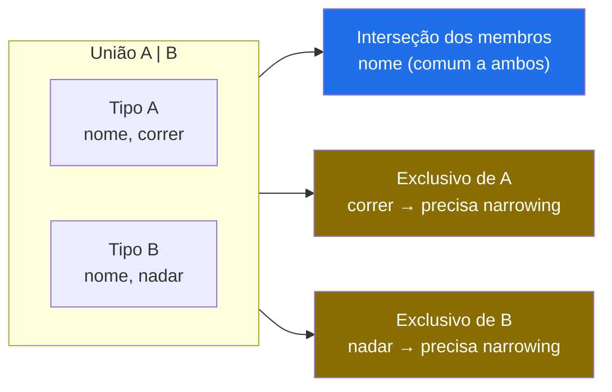
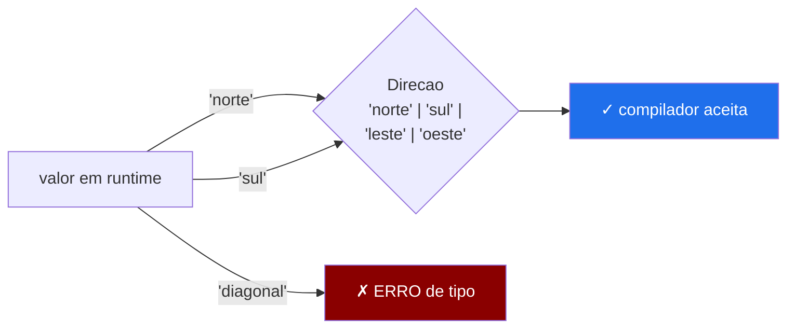
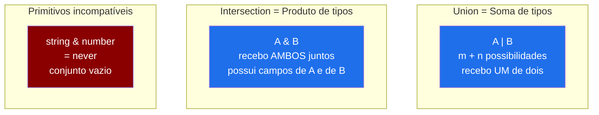
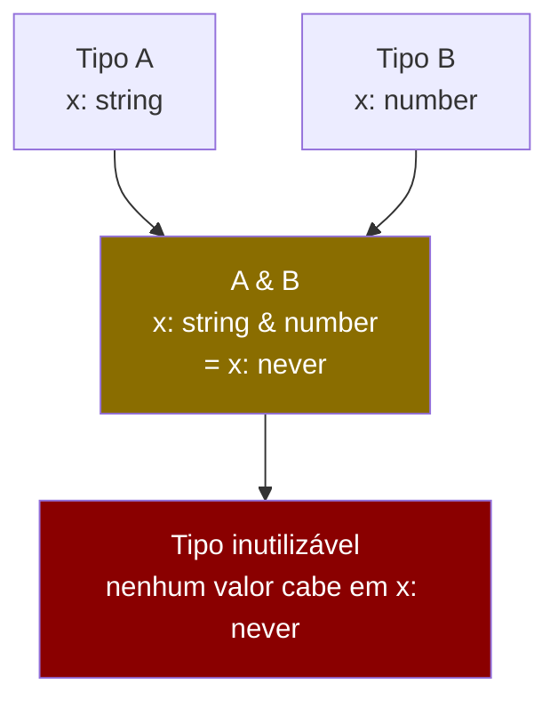

# Union e intersection types

> [!abstract] TL;DR
> Union (`|`) diz "um valor que é A **ou** B"; intersection (`&`) diz "um valor que é A **e** B ao mesmo tempo". Essa distinção tem raiz na álgebra: union é **soma** de tipos (você recebe um de dois), intersection é **produto** (você recebe os dois juntos). Em objetos, `&` combina propriedades e funciona bem — mas `&` de primitivos incompatíveis colapsa para `never`, o tipo vazio. Com uma union nas mãos, o TypeScript só deixa você acessar o que é **comum a todos os membros** — qualquer coisa exclusiva de um ramo exige narrowing, o tema da nota seguinte.

---

## O problema que esses operadores resolvem

Você está modelando um sistema de identificadores. Um ID pode vir da API como string ou como número — dependendo do endpoint. Em Java, você criaria uma classe-base `Id` com subclasses `StringId` e `NumberId`, ou usaria `Object` e perderia toda segurança. Em TypeScript, um único operador resolve:

```ts
type ID = string | number;
```

Agora imagine que você precisa de um tipo que tenha as propriedades de `User` **e** de `Timestamped` ao mesmo tempo — não um ou outro, os dois:

```ts
type Timestamped = { createdAt: Date; updatedAt: Date };
type User        = { id: number; name: string; email: string };

type UserRecord = User & Timestamped;
// UserRecord tem: id, name, email, createdAt, updatedAt
```

Dois problemas, dois operadores. Cada um com semântica precisa. Vamos entender o porquê de cada um funcionar do jeito que funciona.

---

## Union types — a soma de possibilidades

### O que é e o que não é

Uma **union** `A | B` representa um valor que pode ser do tipo `A` ou do tipo `B` — mas só um de cada vez em runtime. O TypeScript precisa raciocinar sobre isso em tempo de compilação.

```ts
type Resultado = string | number | boolean;

let r: Resultado;
r = "sucesso";   // OK
r = 42;          // OK
r = true;        // OK
r = null;        // ERRO — null não faz parte da union
```

A pergunta central que o TypeScript faz quando você tem uma union é: **"o que posso fazer com esse valor sem saber qual dos membros ele é?"** A resposta: apenas o que for comum a todos os membros.

```ts
type A = { nome: string; correr: () => void };
type B = { nome: string; nadar: () => void  };

type AB = A | B;

function processar(entidade: AB) {
    console.log(entidade.nome);    // OK — nome existe em A e em B
    entidade.correr();             // ERRO — B não tem correr
    entidade.nadar();              // ERRO — A não tem nadar
}
```

Esse comportamento não é limitação arbitrária — é **corretude**. Se o compilador deixasse você chamar `correr()` sem saber se o valor é `A` ou `B`, haveria erro em runtime sempre que o valor fosse `B`. O TypeScript se recusa a criar esse risco silenciosamente.



> [!note] Leitura do diagrama
> Sem narrowing, você só navega pela parte azul — o que é **comum** a todos os membros da union. As partes amarelas (exclusivas de cada membro) ficam bloqueadas até você provar ao compilador qual membro está em jogo. Isso é exatamente o que a nota [[09 - Type narrowing e type guards]] ensina.

### A motivação para o narrowing

O estado atual do valor só pode ser descoberto em runtime. O TypeScript fornece mecanismos (`typeof`, `instanceof`, `in`, propriedades discriminantes) que ele analisa no fluxo de controle para restringir o tipo:

```ts
type ID = string | number;

function formatarID(id: ID): string {
    // Aqui: id é string | number
    // id.toUpperCase()  ← ERRO: number não tem toUpperCase
    // id.toFixed(2)     ← ERRO: string não tem toFixed

    if (typeof id === "string") {
        // Aqui: id é string
        return id.toUpperCase();
    }
    // Aqui: id é number (TS eliminou string pelo if acima)
    return id.toFixed(2);
}
```

A nota [[09 - Type narrowing e type guards]] cobre todo o vocabulário: `typeof`, `instanceof`, `in`, funções `x is T`, assertion functions. Aqui basta saber que o narrowing é **obrigatório** para acessar o que é exclusivo de cada membro.

---

## Union de literais — o enum leve

Uma union não precisa ser de tipos complexos. Uma das aplicações mais úteis é a **union de literais**: valores exatos que um campo pode assumir.

```ts
type Direcao   = "norte" | "sul" | "leste" | "oeste";
type StatusHTTP = 200 | 201 | 400 | 401 | 403 | 404 | 500;
type Booleano  = true | false; // isso é exatamente o tipo boolean nativo
```

Isso funciona como um enum leve — sem gerar código JavaScript, apenas como anotação de tipo. O compilador valida as atribuições:

```ts
let dir: Direcao = "norte";   // OK
dir = "diagonal";              // ERRO — 'diagonal' is not assignable to type 'Direcao'
```



A union de literais tem vantagens claras sobre `enum`: não gera código, é tree-shakeable, funciona diretamente com autocomplete da IDE, e compõe naturalmente com outros tipos. A nota [[19 - Enums, const objects e modelagem de constantes]] aprofunda essa comparação e mostra o padrão `as const` object — a forma canônica recomendada quando você precisa também de uma referência pelo nome (como `Status.Active`).

---

## A álgebra por trás dos operadores

O nome "union" e "intersection" não é metáfora — vem diretamente da **teoria dos conjuntos** e da **álgebra de tipos**.

Pense em cada tipo como um conjunto de valores possíveis:
- `string` é o conjunto de todas as strings
- `number` é o conjunto de todos os números

Então:
- `string | number` é a **união** dos dois conjuntos — valores que pertencem a string **ou** a number
- `string & number` é a **interseção** dos dois conjuntos — valores que pertencem a string **e** a number simultaneamente

Essa interseção, no caso de primitivos, é o conjunto **vazio** — nenhum valor é simultaneamente string e number. E o conjunto vazio na álgebra de tipos tem um nome: `never`.

```ts
type Impossivel = string & number; // never
```

Na teoria de [[03-Dominios/Ciência/Paradigmas/10 - Tipos algébricos, pattern matching e erros sem exceção|Tipos algébricos]], union corresponde ao **tipo soma** (sum type / tagged union) e intersection ao **tipo produto** (product type). A analogia é matemática: se `A` tem `m` valores e `B` tem `n` valores, `A | B` tem `m + n` possibilidades (soma), enquanto `A & B` em objetos produz um tipo com os campos de ambos — o que equivale ao produto cartesiano de propriedades.



Essa intuição de soma/produto guia o design: quando você quer "A ou B", use `|`. Quando quer "A e B juntos", use `&` — mas entre objetos, não entre primitivos.

---

## Intersection types — compondo objetos

### O caso feliz: juntar propriedades

Intersection entre tipos de objeto funciona bem e é idiomático em TypeScript. O resultado é um tipo que tem **todas as propriedades de todos os membros**:

```ts
type Nomeado = { nome: string };
type Idadado = { idade: number };
type Ativo   = { ativo: boolean };

type Pessoa = Nomeado & Idadado & Ativo;
// Pessoa tem: nome, idade, ativo

const p: Pessoa = {
    nome: "Maria",
    idade: 30,
    ativo: true,
    // Não pode omitir nenhum — todos são obrigatórios
};
```

Um padrão frequente é usar intersection para compor tipos de mixin — adicionar capacidades ortogonais:

```ts
type Entidade = {
    id: string;
    criadoEm: Date;
    atualizadoEm: Date;
};

type Produto = {
    nome: string;
    preco: number;
    estoque: number;
};

type ProdutoPersistido = Produto & Entidade;
// ProdutoPersistido: id, criadoEm, atualizadoEm, nome, preco, estoque
```

Esse padrão é especialmente útil em funções genéricas que aceitam um objeto e retornam uma versão enriquecida:

```ts
function adicionarMetadados<T extends object>(
    obj: T,
    metadados: { id: string; criadoEm: Date }
): T & { id: string; criadoEm: Date } {
    return { ...obj, ...metadados };
}

const produto  = { nome: "Teclado", preco: 200 };
const persistido = adicionarMetadados(produto, { id: "abc", criadoEm: new Date() });
// persistido: { nome: string; preco: number; id: string; criadoEm: Date }
```

### O caso perigoso: conflito de propriedades

Quando dois tipos de objeto têm uma propriedade com o **mesmo nome mas tipos incompatíveis**, a intersection não falha na definição — ela resolve a propriedade conflitante como `never`:

```ts
type A = { x: string };
type B = { x: number };
type C = A & B;
// C.x é string & number = never

const c: C = { x: "hello" }; // ERRO — 'string' is not assignable to type 'never'
const c2: C = { x: 42 };     // ERRO — 'number' is not assignable to type 'never'
// Não existe valor que satisfaça C!
```

O tipo `C` é tecnicamente válido como definição, mas nenhum valor pode ser atribuído a ele — qualquer tentativa de preencher `x` falha porque `never` não aceita valores. Na prática, `C` é um tipo inutilizável.



> [!warning] Conflito silencioso
> O TypeScript não emite erro quando você *define* `type C = A & B`. O erro só aparece quando você tenta *usar* `C`. Isso pode causar surpresa: você define o tipo, ele parece aceitável, e só descobre o problema na hora de instanciar. Sempre que usar `&` entre tipos que você não controla totalmente, verifique se há sobreposição de propriedades com tipos incompatíveis.

A mesma armadilha acontece com propriedades opcionais de tipos diferentes:

```ts
type Config1 = { timeout?: number };
type Config2 = { timeout?: string };   // alguma lib externa
type Config  = Config1 & Config2;
// timeout?: number & string = timeout?: never
```

---

## Intersection de primitivos — o `never` imediato

Com primitivos, não há propriedades para combinar — só os valores em si. E como nenhum valor primitivo pode ser dois tipos ao mesmo tempo, o resultado é sempre `never`:

```ts
type N1 = string & number;   // never
type N2 = number & boolean;  // never
type N3 = null & undefined;  // never
type N4 = string & string;   // string (interseção de igual consigo mesmo)
```

O único caso onde `&` de primitivos não vira `never` imediatamente é com literal types que se sobrepõem:

```ts
type L1 = "a" | "b" | "c";
type L2 = "b" | "c" | "d";
type L3 = L1 & L2;  // "b" | "c" — a interseção dos conjuntos de literais
```

Isso é matematicamente correto: `L3` são os valores que pertencem a `L1` **e** a `L2` ao mesmo tempo. Útil para restringir unions:

```ts
type Permissoes    = "ler" | "escrever" | "deletar" | "admin";
type PermissoesAPI = "ler" | "escrever" | "deletar";

// PermissoesSeguras = apenas o que é permitido na API E está nas Permissoes
type PermissoesSeguras = Permissoes & PermissoesAPI; // "ler" | "escrever" | "deletar"
```

---

## Casos práticos completos

### Caso 1 — Tipando uma função polimórfica

```ts
type Entrada = string | number | Date;

function paraString(entrada: Entrada): string {
    // Sem narrowing, só o que é comum: nada útil
    // Com narrowing, cada ramo trata o seu tipo:
    if (typeof entrada === "string") {
        return entrada.trim();               // string narrowed
    }
    if (typeof entrada === "number") {
        return entrada.toLocaleString("pt-BR"); // number narrowed
    }
    // Aqui: TS sabe que só pode ser Date
    return entrada.toLocaleDateString("pt-BR"); // Date narrowed
}

paraString("  olá  ");         // "olá"
paraString(1234567.89);         // "1.234.567,89"
paraString(new Date("2026-06-23")); // "23/06/2026"
```

### Caso 2 — Compondo tipos de repositório

```ts
type BaseEntity = {
    id: string;
    criadoEm: Date;
    atualizadoEm: Date;
    deletadoEm: Date | null;
};

type Produto = {
    nome: string;
    preco: number;
    categoriaId: string;
};

// Produto como ele sai do banco de dados
type ProdutoEntity = Produto & BaseEntity;

// Produto como ele chega no payload de criação (sem os campos da base)
type CriarProdutoDTO = Omit<ProdutoEntity, keyof BaseEntity>;
// { nome: string; preco: number; categoriaId: string }
```

### Caso 3 — Union de estados de UI

```ts
// Modelar o ciclo de vida de uma requisição
type IdleState    = { status: "idle" };
type LoadingState = { status: "loading" };
type SuccessState<T> = { status: "success"; data: T };
type ErrorState   = { status: "error"; mensagem: string; codigo: number };

type FetchState<T> =
    | IdleState
    | LoadingState
    | SuccessState<T>
    | ErrorState;

// Sem narrowing: só status é acessível (comum a todos)
function logEstado<T>(state: FetchState<T>): void {
    console.log(state.status);   // OK
    // console.log(state.data);  // ERRO — só SuccessState tem data
}

// Com narrowing via discriminant: cada ramo tem acesso total
function renderizar<T>(state: FetchState<T>): string {
    switch (state.status) {
        case "idle":    return "Aguardando...";
        case "loading": return "Carregando...";
        case "success": return `Dados: ${JSON.stringify(state.data)}`;
        case "error":   return `Erro ${state.codigo}: ${state.mensagem}`;
        // O TypeScript sabe que cobrimos todos os casos — sem default necessário
    }
}
```

> [!tip] A propriedade discriminante
> No exemplo acima, `status` é a **propriedade discriminante**: um campo com tipo literal único em cada membro da union. É justamente isso que permite ao switch cobrir exaustivamente os casos sem precisar de um `default`. Esse padrão — a union discriminada — é tão central que tem nota própria: [[08 - Discriminated unions e exhaustiveness]].

---

## O que vem a seguir: discriminated unions e narrowing

Esta nota cobriu o fundamento: `|` para "ou", `&` para "e", a álgebra por trás, as limitações sem narrowing, e os perigos de intersection.

Mas a pergunta que ficou no ar em vários exemplos é: **como dou acesso às propriedades exclusivas de cada membro?** A resposta tem dois ângulos:

- **[[08 - Discriminated unions e exhaustiveness]]** — o padrão de adicionar uma propriedade discriminante (como `status` ou `tipo`) que identifica de forma única cada membro. Com ela, switches se tornam exaustivos e o compilador garante que você não esqueceu nenhum caso.

- **[[09 - Type narrowing e type guards]]** — o vocabulário completo de narrowing: `typeof`, `instanceof`, `in`, funções `x is T`, assertion functions, e como o TypeScript rastreia o tipo ao longo do fluxo de controle.

Os três — union/intersection, discriminated unions, narrowing — formam um trio inseparável. Esta nota deu o chão; as próximas sobem o edifício.

---

## Como explicar em inglês

TypeScript's **union types** (`|`) represent a value that can be one of several types — but only one at a time at runtime. The compiler enforces that you can only access what's **common to all members** without narrowing. If you have `A | B` and `A` has a method that `B` doesn't, you can't call it until you prove to the compiler which branch you're in.

**Intersection types** (`&`) go the opposite direction: they combine types, producing a value that satisfies all members simultaneously. For object types, this merges their properties — the result must have every field from every operand. For primitives, intersection collapses to `never` because no value can be both `string` and `number` at the same time.

The algebra behind these operators maps directly to set theory: union is set union (values belonging to A **or** B), intersection is set intersection (values belonging to A **and** B). In the type theory literature, union types are **sum types** and intersections of objects behave like **product types**.

The key insight for interviews: with a plain union, you're restricted to the **common interface** — the overlap of all members. To access type-specific properties, you need narrowing. That's by design: it prevents runtime errors that would occur if you tried to call a method that only exists on one branch of the union.

Union of literals (`"a" | "b" | "c"`) is TypeScript's idiomatic alternative to enums — zero runtime overhead, works with autocompletion, composes naturally with other types.

### Vocabulário-chave

| Português | Inglês |
|---|---|
| união de tipos | union type |
| interseção de tipos | intersection type |
| membro de uma union | union member |
| propriedade comum | common property / shared member |
| estreitamento de tipo | type narrowing |
| tipo soma | sum type |
| tipo produto | product type |
| literais de union | union of literals |
| interseção impossível | impossible intersection |
| tipo vazio | empty type / `never` |
| propriedade conflitante | conflicting property |
| tipo de objeto | object type |
| tipo composto | composite type |
| operador de union | union operator |
| operador de interseção | intersection operator |

---

## Armadilhas comuns

**1. Acessar propriedade exclusiva sem narrowing**

```ts
type Gato = { miar: () => void };
type Cao  = { latir: () => void };

function falar(animal: Gato | Cao) {
    animal.miar();  // ERRO — Cao não tem miar
    // Solução: narrowing via 'in' ou discriminant
    if ("miar" in animal) {
        animal.miar(); // OK
    }
}
```

**2. Intersection de objetos com campos conflitantes**

```ts
// Vem de duas libs diferentes — mesmo nome, tipos diferentes
type ConfigA = { debug: boolean };
type ConfigB = { debug: string };

type Config = ConfigA & ConfigB;
// Config.debug é boolean & string = never
// Nenhum valor satisfaz Config.debug
```

**3. Union muito ampla — perda de informação**

```ts
// Ruim: informação demais perdida na union
type Resposta = string | number | boolean | object | null | undefined;
// Na prática equivale a unknown — você não sabe nada sobre o valor

// Melhor: union específica com discriminant
type RespostaAPI =
    | { ok: true;  dados: unknown }
    | { ok: false; erro: string; codigo: number };
```

**4. Confundir `|` e `&` em funções**

```ts
// Parâmetro com union: função aceita A OU B
function aceitar(x: string | number) { }

// Parâmetro com intersection: função exige A E B simultaneamente
function exigir(x: string & { length: 3 }) { }
// x deve ser string de exatamente 3 chars

// Retorno com intersection: função retorna A E B juntos
function enriquecer(nome: string): string & { __brand: "Nome" } {
    return nome as string & { __brand: "Nome" };
}
```

**5. `&` de primitivos achar que funciona**

```ts
type Bugado = number & string; // never — sem erro na definição
let x: Bugado = 42;            // ERRO só aqui — nunca vai compilar
// O erro deveria ter sido "detectado" na definição, mas TS deixa passar
```

**6. Union com `null`/`undefined` sem `strictNullChecks`**

Sem `strictNullChecks`, `null` e `undefined` são subtipos de qualquer tipo — então `string | null` seria apenas `string`. Com `strict: true` (recomendado), eles ficam separados e a union é explícita. Sempre use `strictNullChecks`.

---

## Veja também

- [[04 - any, unknown e never]] — `never` é o resultado de interseções impossíveis; `unknown` é o oposto de `never` no reticulado
- [[08 - Discriminated unions e exhaustiveness]] — o passo seguinte: adicionar um discriminant para fazer switches exaustivos sobre unions
- [[09 - Type narrowing e type guards]] — como acessar propriedades exclusivas de membros de uma union
- [[19 - Enums, const objects e modelagem de constantes]] — union de literais como alternativa ao `enum`; quando usar `as const` object
- [[03-Dominios/Ciência/Paradigmas/10 - Tipos algébricos, pattern matching e erros sem exceção|Tipos algébricos]] — a teoria por trás de tipos soma e produto; como ML, Haskell e Rust modelam o mesmo conceito
