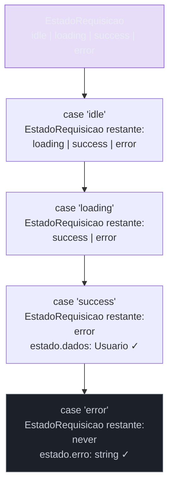
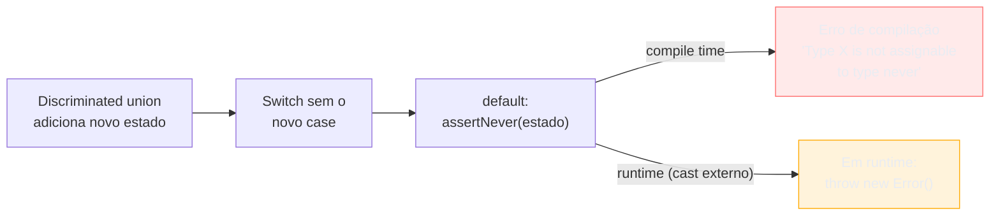
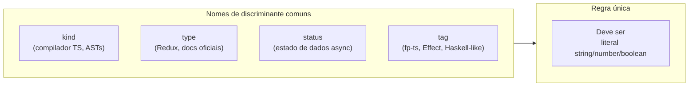

# Discriminated unions e exhaustiveness

> [!abstract] TL;DR
> Uma **discriminated union** (union discriminada, ou tagged union) é uma união de tipos onde cada membro carrega uma propriedade literal única — o **discriminante** — que o TypeScript usa para saber exatamente em qual membro você está operando. O truque é simples: em vez de flags booleanas soltas (`isLoading`, `hasError`, `hasData`) que podem coexistir em estados impossíveis, você modela cada estado como um objeto distinto com uma tag literal (`status: "loading"`, `status: "error"`, `status: "success"`). O compilador then faz **exhaustiveness checking** — ele grita quando você adiciona um novo estado e esquece de tratar em algum switch. É o princípio "making impossible states unrepresentable" no nível do dia a dia.

---

## O problema que queremos resolver

Imagine que você precisa modelar uma requisição HTTP assíncrona num componente. A tentação inicial é usar flags booleanas soltas:

```ts
interface EstadoRequisicaoRuim {
    carregando: boolean;
    erro: string | null;
    dados: Usuario | null;
}
```

Parece razoável. Mas essa modelagem permite estados que não fazem sentido algum no mundo real:

```ts
// Todos esses são válidos pelo tipo — e todos são impossíveis na realidade:
const estado1: EstadoRequisicaoRuim = { carregando: true,  erro: "falhou", dados: null };
const estado2: EstadoRequisicaoRuim = { carregando: false, erro: "falhou", dados: { id: "1", nome: "Ana" } };
const estado3: EstadoRequisicaoRuim = { carregando: true,  erro: null,    dados: { id: "1", nome: "Ana" } };
```

`estado1` diz que ainda está carregando, mas já tem um erro. `estado2` diz que não está carregando, mas tem erro e dados ao mesmo tempo. `estado3` diz que ainda está carregando e já tem dados. Nenhum desses é possível em runtime — mas o TypeScript os aceita silenciosamente.

O resultado? Código cheio de guards defensivos:

```ts
function renderizar(estado: EstadoRequisicaoRuim) {
    if (estado.carregando && !estado.erro && !estado.dados) {
        return "Carregando...";
    }
    if (!estado.carregando && estado.erro && !estado.dados) {
        return `Erro: ${estado.erro}`;
    }
    if (!estado.carregando && !estado.erro && estado.dados) {
        return `Olá, ${estado.dados.nome}`;
    }
    // E o que retornamos nos estados impossíveis?
    // Você esqueceu de considerar: carregando=true E erro="x"
    return "???"; // bug dormindo
}
```

Esse é o antipadrão clássico de **representação de estados via flags booleanas**. A falha é estrutural: o tipo permite o impossível.

---

## A solução: tagged unions

A ideia central é usar a própria estrutura de tipos para tornar os estados impossíveis irrepresentáveis. Cada estado vira um objeto separado com uma propriedade literal diferente — o **discriminante** (ou tag):

```ts
type EstadoRequisicao =
    | { status: "idle" }
    | { status: "loading" }
    | { status: "success"; dados: Usuario }
    | { status: "error"; erro: string };
```

Repare no que mudou:

1. `status` é o **discriminante** — uma propriedade que existe em todos os membros, mas com valores literais distintos (`"idle"`, `"loading"`, `"success"`, `"error"`).
2. Cada membro tem exatamente as propriedades que fazem sentido para aquele estado. `dados` só existe em `"success"`. `erro` só existe em `"error"`. Não faz sentido nem perguntar `state.dados` num estado de `"error"`.
3. É impossível criar um estado com `status: "loading"` e `dados: usuario` ao mesmo tempo — o tipo simplesmente não tem essa forma.

Agora o código de renderização fica trivial:

```ts
function renderizar(estado: EstadoRequisicao): string {
    switch (estado.status) {
        case "idle":
            return "Aguardando...";
        case "loading":
            return "Carregando...";
        case "success":
            // Aqui, TS sabe que estado tem a forma { status: "success"; dados: Usuario }
            return `Olá, ${estado.dados.nome}`; // OK — dados existe e é Usuario
        case "error":
            // Aqui, TS sabe que estado tem a forma { status: "error"; erro: string }
            return `Erro: ${estado.erro}`; // OK — erro existe e é string
    }
}
```

Cada `case` restringe o tipo de `estado` — isso é o narrowing pelo discriminante. Dentro do `case "success"`, o TypeScript sabe que `dados` existe e tem o tipo `Usuario`. Dentro do `case "error"`, sabe que `erro` existe e é `string`. Acessar `estado.dados` no case `"error"` seria erro de compilação.



> [!note] Leitura do diagrama
> A cada `case` coberto, o conjunto de tipos possíveis fica menor. Depois do último `case`, o tipo restante é `never` — o TypeScript sabe que não existe nenhum valor possível que chegaria ali. É exatamente essa propriedade que vamos usar para checagem exaustiva.

---

## Exhaustiveness checking — o compilador como sentinela

A propriedade mais poderosa das discriminated unions não é o narrowing (que já é valioso por si só). É a possibilidade de fazer o **compilador detectar automaticamente quando você esquecer de tratar um caso**.

O truque usa o tipo `never` (ver [[04 - any, unknown e never]]): depois de todos os `case`s cobertos, o tipo restante é `never`. Se você atribuir o valor restante a uma variável do tipo `never`, o TypeScript valida que o valor é realmente `never`. Se um case foi esquecido, o valor não é `never` — e a atribuição falha, gerando um erro de compilação.

```ts
type EstadoRequisicao =
    | { status: "idle" }
    | { status: "loading" }
    | { status: "success"; dados: Usuario }
    | { status: "error"; erro: string };

function renderizar(estado: EstadoRequisicao): string {
    switch (estado.status) {
        case "idle":    return "Aguardando...";
        case "loading": return "Carregando...";
        case "success": return `Olá, ${estado.dados.nome}`;
        // Deliberadamente faltando "error"
        default:
            // Aqui, estado deveria ser never — mas é { status: "error"; erro: string }
            const _exhaustivo: never = estado; // ERRO de compilação!
            return _exhaustivo;
    }
}
```

O erro é claro: `Type '{ status: "error"; erro: string }' is not assignable to type 'never'`. O compilador está dizendo: *"Você acha que chegou num estado impossível, mas na verdade chegou num estado que você simplesmente esqueceu de tratar."*

Agora adicione um novo estado à union:

```ts
type EstadoRequisicao =
    | { status: "idle" }
    | { status: "loading" }
    | { status: "success"; dados: Usuario }
    | { status: "error"; erro: string }
    | { status: "retrying"; tentativa: number }; // NOVO
```

Instantaneamente, todos os switches que têm o padrão `const _exhaustivo: never = estado` vão gerar erro de compilação. Você sabe exatamente onde precisa adicionar tratamento. Zero erros silenciosos.

### O helper `assertNever`

É prática comum extrair o padrão de exhaustiveness num helper reutilizável:

```ts
// Helper canônico de exhaustiveness
function assertNever(valor: never, mensagem?: string): never {
    throw new Error(mensagem ?? `Estado inesperado: ${JSON.stringify(valor)}`);
}

function renderizar(estado: EstadoRequisicao): string {
    switch (estado.status) {
        case "idle":     return "Aguardando...";
        case "loading":  return "Carregando...";
        case "success":  return `Olá, ${estado.dados.nome}`;
        case "error":    return `Erro: ${estado.erro}`;
        default:
            return assertNever(estado); // Erro de compilação se algum case faltar
                                        // Erro de runtime se de alguma forma passar (proteção dupla)
    }
}
```

A vantagem do helper: em vez de uma atribuição silenciosa a `never`, você lança uma exceção informativa em runtime. Isso é proteção em dois níveis: o compilador barra na build; se por alguma razão (cast externo, deserialização malformada) um estado inválido chegar, você tem uma mensagem clara em vez de comportamento undefined.



---

## Exemplo completo: máquina de estados de fetch

Juntando tudo num exemplo realista — a máquina de estados de uma requisição HTTP:

```ts
interface Usuario {
    id: string;
    nome: string;
    email: string;
}

// 1. Modelagem — estados mutuamente exclusivos
type EstadoFetch<T> =
    | { status: "idle" }
    | { status: "loading"; url: string }
    | { status: "success"; dados: T; carregadoEm: Date }
    | { status: "error"; erro: Error; tentativas: number };

// 2. Transições válidas — explícitas e tipadas
type AcaoFetch<T> =
    | { tipo: "INICIAR"; url: string }
    | { tipo: "SUCESSO"; dados: T }
    | { tipo: "FALHA"; erro: Error }
    | { tipo: "RESETAR" };

// 3. Reducer — cada case sabe exatamente o que tem disponível
function reducerFetch<T>(
    estado: EstadoFetch<T>,
    acao: AcaoFetch<T>
): EstadoFetch<T> {
    switch (acao.tipo) {
        case "INICIAR":
            return { status: "loading", url: acao.url };

        case "SUCESSO":
            // Só faz sentido se estava loading — mas o tipo não impede
            // (isso vai para nota 24 — design avançado com branded types)
            return {
                status: "success",
                dados: acao.dados,
                carregadoEm: new Date(),
            };

        case "FALHA":
            // Quantas tentativas foram feitas? Dependemos do estado atual
            const tentativas =
                estado.status === "error" ? estado.tentativas + 1 : 1;
            return { status: "error", erro: acao.erro, tentativas };

        case "RESETAR":
            return { status: "idle" };

        default:
            return assertNever(acao); // Exhaustiveness check na ação também
    }
}

// 4. Renderização — sem defensividade, sem estados impossíveis
function renderizarEstado(estado: EstadoFetch<Usuario>): string {
    switch (estado.status) {
        case "idle":
            return "Pronto para buscar.";

        case "loading":
            // estado.url está disponível — e é só o que existe neste estado
            return `Buscando ${estado.url}...`;

        case "success":
            // estado.dados é Usuario — TS garante
            // estado.carregadoEm é Date — TS garante
            return [
                `Usuário: ${estado.dados.nome}`,
                `Email: ${estado.dados.email}`,
                `Carregado em: ${estado.carregadoEm.toLocaleTimeString()}`,
            ].join("\n");

        case "error":
            // estado.erro é Error, estado.tentativas é number
            return `Erro após ${estado.tentativas} tentativa(s): ${estado.erro.message}`;

        default:
            return assertNever(estado);
    }
}

function assertNever(valor: never, mensagem?: string): never {
    throw new Error(mensagem ?? `Estado inesperado: ${JSON.stringify(valor)}`);
}
```

> [!example] O que esse código demonstra
> Repare nas seções 3 e 4: zero comentários defensivos, zero verificações `if (estado.dados !== null)`, zero asserções manuais. O TypeScript sabe, em cada `case`, exatamente quais campos existem e qual o tipo deles. O modelo tornou o impossível inexprimível.

---

## O discriminante: requisitos e escolhas

Nem toda propriedade serve como discriminante. O TypeScript exige que a propriedade discriminante seja um **tipo literal** (string literal, number literal, boolean literal, `null`, `undefined`) — nunca `string` amplo nem `number` amplo.

```ts
// FUNCIONA: literais string
type EventoA =
    | { tipo: "clique"; x: number; y: number }
    | { tipo: "teclado"; tecla: string }
    | { tipo: "scroll"; delta: number };

// FUNCIONA: literais number
type PrioridadeB =
    | { nivel: 1; descricao: "baixo" }
    | { nivel: 2; descricao: "medio" }
    | { nivel: 3; descricao: "alto" };

// NÃO FUNCIONA como discriminante: tipo amplo
type EventoC =
    | { tipo: string; payload: unknown }; // string amplo — não discrimina nada
```

Na prática, usar `string` amplo como discriminante não gera erro, mas o TypeScript não consegue estreitar com base nele — você perde todo o benefício. Use sempre literais.

**Nomes comuns para o discriminante:**

- `kind` — convenção popular no código TypeScript da Microsoft (o próprio compilador usa)
- `type` — convenção do Redux e da documentação oficial do TS
- `status` — comum em estados de requisição/formulário
- `tag` — inspiração em linguagens funcionais (Haskell, OCaml)
- `_tag` — convenção do ecosystem fp-ts/Effect

A escolha é estética. O que importa é consistência dentro de um domínio.



---

## Múltiplos discriminantes

Uma union pode ter mais de um campo com tipos literais — e o TypeScript consegue usar qualquer um deles para narrowing. O que importa é que os membros sejam **mutuamente exclusivos** com base nos literais:

```ts
// AST simplificada de uma linguagem de expressões
type Expressao =
    | { kind: "numero";     valor: number }
    | { kind: "string";     valor: string }
    | { kind: "booleano";   valor: boolean }
    | { kind: "variavel";   nome: string }
    | { kind: "binaria";    operador: "+" | "-" | "*" | "/"; esquerda: Expressao; direita: Expressao }
    | { kind: "chamada";    funcao: string; argumentos: Expressao[] }
    | { kind: "condicional"; condicao: Expressao; entao: Expressao; senao: Expressao };

function avaliar(expr: Expressao): number | string | boolean {
    switch (expr.kind) {
        case "numero":   return expr.valor;       // valor: number
        case "string":   return expr.valor;       // valor: string
        case "booleano": return expr.valor;       // valor: boolean
        case "variavel": throw new Error(`Variável ${expr.nome} não resolvida`);
        case "binaria":
            const esq = avaliar(expr.esquerda) as number;
            const dir = avaliar(expr.direita) as number;
            switch (expr.operador) {
                case "+": return esq + dir;
                case "-": return esq - dir;
                case "*": return esq * dir;
                case "/": return esq / dir;
                default:  return assertNever(expr.operador);
            }
        case "chamada":
            throw new Error(`Funções não implementadas: ${expr.funcao}`);
        case "condicional":
            return avaliar(expr.condicao) ? avaliar(expr.entao) : avaliar(expr.senao);
        default:
            return assertNever(expr);
    }
}
```

Repare no switch aninhado em `"binaria"`: `expr.operador` é `"+" | "-" | "*" | "/"` — uma union de literais, e `assertNever` garante exhaustiveness ali também.

---

## Discriminated unions vs. hierarquia de classes

Quem vem de Java/C# tem a tentação de modelar o mesmo padrão com classes e herança:

```ts
// Estilo Java: classes abstratas com herança
abstract class EstadoFetch {
    abstract tipo: string;
}
class EstadoIdle extends EstadoFetch { tipo = "idle" as const; }
class EstadoLoading extends EstadoFetch {
    tipo = "loading" as const;
    constructor(public url: string) { super(); }
}
// ...

// Discriminated union equivalente:
type EstadoFetch =
    | { tipo: "idle" }
    | { tipo: "loading"; url: string }
    // ...
```

Em TypeScript, a union de objetos literais geralmente é **preferível** à hierarquia de classes para estado:

| Critério | Classes com herança | Discriminated union |
|---|---|---|
| Instanciação | `new EstadoLoading(url)` | `{ tipo: "loading", url }` |
| Serialização (JSON) | Requer `toJSON()` + reviver | Funciona direto |
| Imutabilidade | Requer disciplina manual | Facilmente readonly |
| Narrowing | `instanceof` (rígido) | Discriminante literal (flexível) |
| Extensibilidade | Aberta (subclasses) | Fechada (add ao type) |
| Uso em React state | Problemas com closures stale | Simples com `useState` |

A union é fechada — você não pode adicionar um membro fora da declaração do tipo, mas o compilador te avisa quando adiciona um novo e esquece de tratá-lo. Essa é a troca: menos extensibilidade, mais segurança estática.

---

## Como explicar em inglês

A **discriminated union** (also called a tagged union or algebraic sum type) is a pattern where each member of a union type carries a literal property — the **discriminant** — that uniquely identifies it. The TypeScript compiler uses this discriminant to **narrow** the type inside each branch: in a `switch` on `state.status`, the `"success"` case gives you full access to `state.data` while the `"error"` case gives you `state.error` — and accessing the wrong field is a compile-time error.

The key insight is **making impossible states unrepresentable**. Instead of loose boolean flags (`isLoading`, `hasError`, `hasData`) that can be simultaneously true in impossible combinations, you model each state as a separate object with only the fields that make sense for that state.

**Exhaustiveness checking** is the second superpower: by assigning the remaining value to `never` in the `default` branch — either directly or through an `assertNever` helper — you make the compiler error whenever a new variant is added to the union but not handled in a switch. The type system becomes a compile-time checklist.

This is the everyday version of "making impossible states unrepresentable" — a phrase from Richard Feldman's talk and the elm/Haskell functional community, but fully applicable in TypeScript without any advanced type machinery.

### Vocabulário-chave

| Português | Inglês |
|---|---|
| união discriminada | discriminated union / tagged union |
| propriedade discriminante | discriminant property / tag field |
| verificação exaustiva | exhaustiveness check / exhaustiveness checking |
| estado impossível | impossible state |
| tornar estados impossíveis irrepresentáveis | make impossible states unrepresentable |
| estreitamento de tipo | type narrowing |
| máquina de estados | state machine |
| tipo soma | sum type / algebraic sum type |
| helper de exaustividade | exhaustiveness helper |
| ramos de switch | switch branches / switch cases |

---

## Armadilhas comuns

> [!warning] Armadilha 1: discriminante amplo (não literal)
> Usar `tipo: string` em vez de `tipo: "loading" | "success"` faz o TypeScript não conseguir estreitar. Sempre use tipos literais no discriminante.
> ```ts
> // Ruim — type não discrimina
> type EstadoRuim = { type: string; dados?: unknown; erro?: string };
>
> // Bom — cada literal é um estado distinto
> type EstadoBom =
>   | { type: "success"; dados: unknown }
>   | { type: "error"; erro: string };
> ```

> [!warning] Armadilha 2: esquecer o `assertNever` no default
> Um switch sem exhaustiveness check não gera erro quando você adiciona um novo caso. O bug só aparece em runtime.
> ```ts
> // Silenciosamente incompleto — não gera erro ao adicionar "retrying"
> switch (estado.status) {
>     case "idle":    return "...";
>     case "loading": return "...";
>     default:        return "Estado desconhecido"; // mascarando o bug
> }
>
> // Com exhaustiveness — gera erro de compilação ao adicionar "retrying"
> switch (estado.status) {
>     case "idle":    return "...";
>     case "loading": return "...";
>     default:        return assertNever(estado);
> }
> ```

> [!warning] Armadilha 3: union com propriedade opcional vs. discriminante
> Propriedades opcionais não servem como discriminante. O TypeScript não consegue usar `prop?` para estreitar, porque `undefined` não é um literal discriminante confiável.
> ```ts
> // Ruim — opcional não discrimina de forma confiável
> type Evento = { dados?: string; erro?: string };
>
> // Bom — discriminante literal explícito
> type Evento = { tipo: "dados"; valor: string } | { tipo: "erro"; mensagem: string };
> ```

> [!warning] Armadilha 4: achar que discriminated union é só para status de fetch
> O padrão se aplica a qualquer "ou" exclusivo: nós de uma AST, tipos de evento num sistema de mensageria, variantes de um comando CLI, nós de um form builder. Se você tem um "ou" onde cada variante carrega dados diferentes, considere tagged union.

---

## Veja também

- [[04 - any, unknown e never]] — onde `never` é introduzido; a base matemática do exhaustiveness check
- [[07 - Union e intersection types]] — fundamentos de `|` e como unions funcionam antes do discriminante
- [[09 - Type narrowing e type guards]] — os mecanismos que o compilador usa para estreitar após o discriminante
- [[24 - Type-driven design - branded types, Result e estados impossíveis]] — o design avançado: branded types, Result/Either, impossible states além do dia a dia
- [[03-Dominios/Ciência/Paradigmas/10 - Tipos algébricos, pattern matching e erros sem exceção|Tipos algébricos]] — a teoria por trás das sum types e product types; onde discriminated union mora na álgebra de tipos
