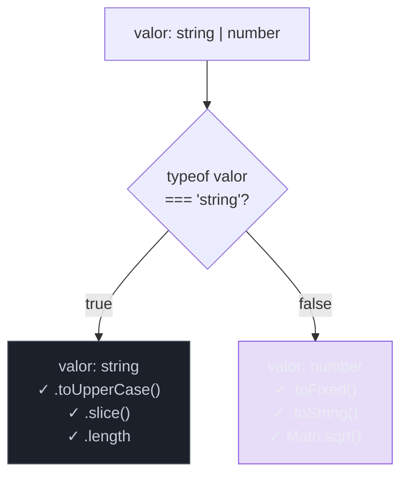
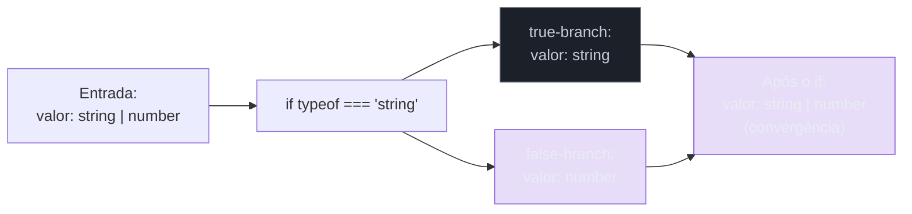
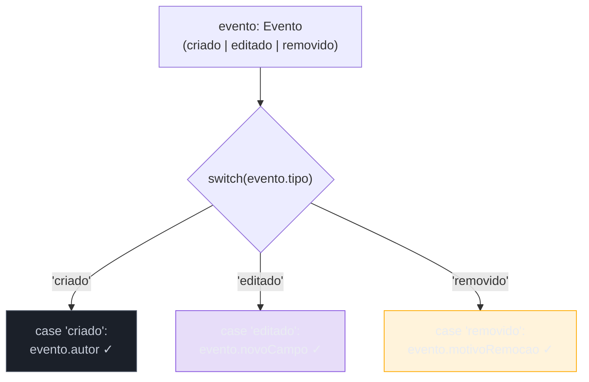
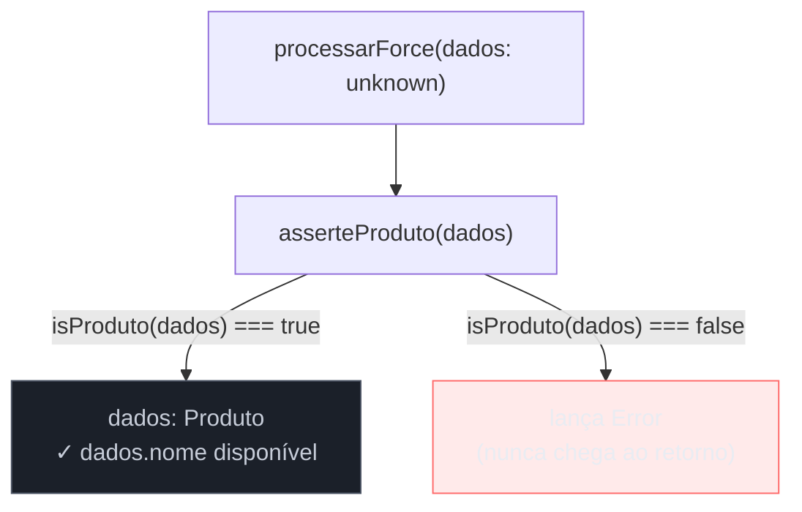
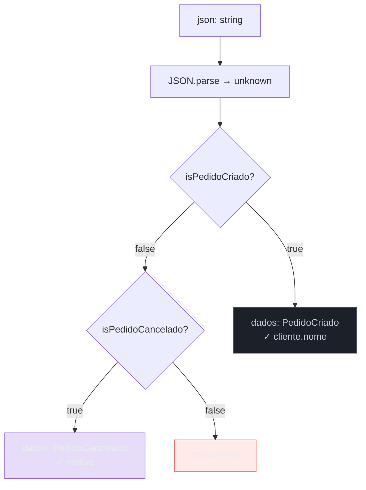

# Type narrowing e type guards

> [!abstract] TL;DR
> TypeScript não adivinha tipos — ele os deduz a partir do fluxo de controle do seu código. Quando você escreve `if (typeof x === 'string')`, o compilador registra esse fato e restringe o tipo de `x` para `string` dentro do bloco. Isso é **control flow analysis** (CFA): a arte de o compilador seguir seus `if`s, `switch`es e retornos antecipados para saber, em cada ponto do código, o tipo mais específico que pode ser atribuído a cada variável. Os **type guards** são as expressões que o CFA entende como "prova de tipo" — desde primitivos com `typeof` e classes com `instanceof`, até propriedades com `in`, tags discriminantes, e funções customizadas com `param is T`. Este capítulo constrói o vocabulário completo, mostra quando cada guard é o certo, expõe o que quebra o narrowing silenciosamente, e termina com um exemplo trabalhado: processar um `unknown` chegando de uma API até um tipo totalmente seguro.

---

## O problema: você tem um tipo amplo e precisa de um específico

Unions e `unknown` são boas práticas de modelagem — a nota [[04 - any, unknown e never]] mostra por quê `unknown` é o tipo correto para dados de fora do sistema. Mas em algum momento você precisa *usar* esses dados. E para usar, você precisa provar ao compilador o tipo concreto.

Considere a função mais simples possível:

```ts
function formatar(valor: string | number): string {
    // ERRO — Property 'toUpperCase' does not exist on type 'string | number'
    return valor.toUpperCase();
}
```

O TypeScript reclama porque `number` não tem `toUpperCase`. A união de tipos significa "pode ser qualquer um dos dois" — e o compilador não permite que você trate como se fosse apenas o primeiro. Para usar métodos específicos de `string`, você precisa *provar* que `valor` é `string` naquele ponto.

Isso é narrowing: **estreitar um tipo amplo para um tipo mais específico**, de forma que o compilador saiba — com certeza — o que pode ser chamado.



> [!note] Leitura do diagrama
> A cada ramo, o tipo de `valor` fica mais específico. O compilador *rastreia* qual ramo você está e aplica o tipo correspondente. Fora dos ramos, `valor` continua sendo `string | number`.

---

## Control flow analysis — o mecanismo por baixo

O TypeScript não aplica narrowing por mágica. Ele implementa uma análise estática chamada **control flow analysis** (CFA): o compilador percorre o grafo de fluxo de controle do seu programa e, a cada ponto, mantém um conjunto de tipos possíveis para cada variável.

Imagine que o CFA é um detetive que segue seu código linha por linha, anotando o que sabe sobre cada variável:

- Antes do `if`: "valor pode ser string OU number"
- Dentro do `if (typeof valor === 'string')`: "valor SÓ pode ser string"
- No `else`: "valor SÓ pode ser number" (porque o true-branch foi descartado)
- Depois do `if`: "valor pode ser string OU number" de novo (convergência dos ramos)



O CFA entende não só `if/else`, mas também `switch`, early return, `throw`, operadores `&&` e `||`, e até `?.` (optional chaining). Cada um dessas estruturas pode estreitar tipos — se o compilador consegue provar que uma condição é verdadeira ou falsa em determinado ponto, ele aplica o narrowing.

```ts
// Early return estreita o restante da função
function processar(usuario: User | null): string {
    if (!usuario) return "usuário ausente"; // early return

    // Aqui: usuario é User, não User | null
    return usuario.nome.toUpperCase();
}

// && estreita inline
function nomeMaiusculo(usuario: User | null) {
    return usuario && usuario.nome.toUpperCase(); // string | null
}
```

---

## Os guards embutidos — o vocabulário básico

TypeScript entende um conjunto fixo de expressões como "prova de tipo". Cada uma ativa o CFA de forma diferente.

### `typeof` — primitivos

`typeof` é um operador JavaScript que retorna uma string descrevendo o tipo primitivo de um valor em runtime. O TypeScript reconhece as comparações com `typeof` como type guards:

```ts
function processar(valor: string | number | boolean | null | undefined): string {
    if (typeof valor === "string") {
        return valor.toUpperCase(); // valor: string
    }
    if (typeof valor === "number") {
        return valor.toFixed(2);    // valor: number
    }
    if (typeof valor === "boolean") {
        return valor ? "sim" : "não"; // valor: boolean
    }
    // Aqui: valor é null | undefined
    return "vazio";
}
```

> [!warning] A armadilha histórica do `typeof null`
> Em JavaScript (e portanto TypeScript), `typeof null === "object"` — um bug histórico da linguagem que não pode ser corrigido por retrocompatibilidade. Se sua union inclui `null`, `typeof valor === "object"` NÃO descarta `null`. Sempre cheque `valor !== null` explicitamente, ou use `instanceof` para objetos.
>
> ```ts
> // ARMADILHA: null passa por "object"
> function ler(x: MyObj | null) {
>     if (typeof x === "object") {
>         x.metodo(); // ERRO — x ainda pode ser null aqui
>     }
>     if (typeof x === "object" && x !== null) {
>         x.metodo(); // OK — null descartado
>     }
> }
> ```

Os valores que `typeof` retorna: `"string"`, `"number"`, `"bigint"`, `"boolean"`, `"symbol"`, `"undefined"`, `"object"` (inclui null e arrays), `"function"`. Primitivos simples são seguros; objetos exigem cuidado.

### `instanceof` — classes e hierarquias

`instanceof` verifica se um valor foi criado por um construtor específico — e mais importante, se ele está na cadeia de protótipos. O TypeScript usa `instanceof` para estreitar para o tipo da classe:

```ts
class ApiError extends Error {
    constructor(
        public readonly statusCode: number,
        mensagem: string
    ) {
        super(mensagem);
        this.name = "ApiError";
    }
}

class ValidationError extends Error {
    constructor(public readonly campo: string, mensagem: string) {
        super(mensagem);
        this.name = "ValidationError";
    }
}

function tratar(erro: unknown): string {
    if (erro instanceof ApiError) {
        // erro: ApiError — statusCode disponível
        return `HTTP ${erro.statusCode}: ${erro.message}`;
    }
    if (erro instanceof ValidationError) {
        // erro: ValidationError — campo disponível
        return `Campo inválido: ${erro.campo}`;
    }
    if (erro instanceof Error) {
        // erro: Error — só message e stack
        return `Erro: ${erro.message}`;
    }
    return String(erro);
}
```

> [!note] `instanceof` e herança
> `instanceof` responde à cadeia de protótipos. `apiError instanceof Error` é `true` porque `ApiError extends Error`. O narrowing seguirá a hierarquia: depois de `instanceof ApiError`, o tipo é `ApiError`; depois de `instanceof Error` (sem o `ApiError` branch antes), o tipo é `Error`.

`instanceof` tem limitações: só funciona com construtores (classes). Não serve para interfaces (que não existem em runtime — são apagadas) nem para objetos literais sem classe. Para esses casos, use `in` ou custom type guards.

### Operador `in` — presença de propriedade

O operador `in` verifica se um objeto possui uma propriedade com determinado nome. Útil quando os tipos são interfaces ou objetos sem classe — pois `instanceof` não serviria:

```ts
interface Gato {
    miar: () => void;
    ronronar: () => void;
}

interface Cachorro {
    latir: () => void;
    abanarRabo: () => void;
}

type Animal = Gato | Cachorro;

function falar(animal: Animal): void {
    if ("miar" in animal) {
        // animal: Gato — miar e ronronar disponíveis
        animal.miar();
    } else {
        // animal: Cachorro — latir e abanarRabo disponíveis
        animal.latir();
    }
}
```

O `in` também funciona quando uma propriedade está presente em apenas um dos tipos da union. O TypeScript sabe: "se essa propriedade existe, o valor só pode ser desse tipo".

> [!warning] `in` com undefined — armadilha sutil
> Se ambos os tipos da union podem ter a propriedade (um com valor, um como `optional`), o `in` não é suficiente para distingui-los:
> ```ts
> type A = { x: string };
> type B = { x?: string; y: number }; // x é opcional em B
>
> function f(v: A | B) {
>     if ("x" in v) {
>         // v: A | B — ambos podem ter x! Não foi estreitado.
>     }
> }
> ```
> Nesse caso, use checagem de `undefined`: `if (v.x !== undefined)` — ou reprojete para discriminated union (nota [[08 - Discriminated unions e exhaustiveness]]).

### Propriedade discriminante — tag literal

Quando tipos de uma union compartilham uma propriedade com valores literais distintos (a "tag"), o TypeScript usa a checagem dessa propriedade como narrowing altamente preciso. Isso é o núcleo das **discriminated unions** (aprofundado na nota [[08 - Discriminated unions e exhaustiveness]]):

```ts
type Evento =
    | { tipo: "criado";    id: string; autor: string }
    | { tipo: "editado";   id: string; novoCampo: string }
    | { tipo: "removido";  id: string; motivoRemocao: string };

function processar(evento: Evento): string {
    switch (evento.tipo) {
        case "criado":
            // evento: { tipo: "criado"; id: string; autor: string }
            return `Criado por ${evento.autor}`;
        case "editado":
            // evento: { tipo: "editado"; id: string; novoCampo: string }
            return `Campo alterado: ${evento.novoCampo}`;
        case "removido":
            // evento: { tipo: "removido"; id: string; motivoRemocao: string }
            return `Removido: ${evento.motivoRemocao}`;
    }
}
```



A propriedade discriminante deve ser:
- Presente em **todos** os tipos da union
- Com valor **literal** (não `string` genérico — tem que ser `"criado"`, não só `string`)
- **Distinta** entre os tipos (dois tipos com o mesmo valor literal na tag não criam narrowing útil)

### Truthiness e igualdade — os mais simples

Checagens de veracidade e igualdade direta também são type guards. São os menos falados, mas os mais comuns no código real:

```ts
// Truthiness — descarta null, undefined, 0, "", false
function processar(nome: string | null | undefined): string {
    if (nome) {
        // nome: string (null e undefined são falsy)
        return nome.toUpperCase();
    }
    return "anônimo";
}

// Igualdade direta — literal narrowing
function verificar(codigo: string | number) {
    if (codigo === 0) {
        // codigo: number (0 só é number)
        return "zero";
    }
    if (codigo === "ok") {
        // codigo: "ok" (literal type)
        return "sucesso";
    }
    // codigo: string | number (nenhum literal matched)
    return String(codigo);
}

// Null checks explícitos
function usar(config: Config | null) {
    if (config !== null) {
        // config: Config
        config.host.toLowerCase();
    }
}
```

> [!warning] Truthiness não é equivalente a `!== null && !== undefined`
> `if (valor)` descarta `null`, `undefined`, `0`, `""`, `false`, `NaN`. Para checar apenas nulidade, prefira `valor != null` (double equals — descarta null E undefined) ou verificações explícitas. Strings vazias e zero são válidos em muitos domínios.

---

## Custom type guards — quando os embutidos não bastam

Os guards embutidos — `typeof`, `instanceof`, `in`, discriminant — cobrem a maioria dos casos. Mas às vezes a lógica de verificação é mais complexa: você precisa checar múltiplas propriedades, validar formatos, ou a estrutura vem de um JSON arbitrário.

Para isso, o TypeScript permite que você escreva uma **função type guard** com a assinatura especial `param is T`:

```ts
interface Produto {
    id: string;
    nome: string;
    preco: number;
}

// A assinatura "valor is Produto" é o type predicate
function isProduto(valor: unknown): valor is Produto {
    return (
        typeof valor === "object" &&
        valor !== null &&
        typeof (valor as Record<string, unknown>).id === "string" &&
        typeof (valor as Record<string, unknown>).nome === "string" &&
        typeof (valor as Record<string, unknown>).preco === "number"
    );
}

// Usando o type guard:
function exibir(dados: unknown): void {
    if (isProduto(dados)) {
        // dados: Produto — todas as propriedades disponíveis
        console.log(`${dados.nome}: R$ ${dados.preco.toFixed(2)}`);
    } else {
        console.log("Dados inválidos");
    }
}
```

O `valor is Produto` após `: ` no retorno da função é chamado de **type predicate**. Ele diz ao TypeScript: "se esta função retornar `true`, então `valor` tem o tipo `Produto`." O TypeScript confia nessa promessa — é você quem garante que o predicado é correto.

### Quando escrever um custom type guard

Use um custom guard quando:

1. **A verificação é complexa** — múltiplas propriedades, validações aninhadas
2. **O tipo vem de fora** — `unknown` de API, `JSON.parse`, `catch`, `localStorage`
3. **A lógica precisa ser reutilizada** — você checa `isProduto` em vários lugares
4. **Os guards embutidos não chegam lá** — interfaces (sem `instanceof`), objetos sem tag discriminante

```ts
// Reutilizável — checa em varios contextos
const produtos = dados.filter(isProduto); // inferido como Produto[]

// Pode compor
function isCatalogo(v: unknown): v is { produtos: Produto[] } {
    return (
        typeof v === "object" &&
        v !== null &&
        Array.isArray((v as any).produtos) &&
        (v as any).produtos.every(isProduto) // reutiliza o guard
    );
}
```

> [!warning] Custom type guards são promessas sem verificação automática
> O TypeScript **não verifica** se a implementação do seu type guard é correta. Você pode escrever `function isString(x: unknown): x is string { return true; }` — compila sem erro, mas mente para o compilador. A responsabilidade da implementação correta é inteiramente sua. Esse é o tradeoff: mais poder expressivo, mais responsabilidade manual.

---

## Assertion functions — provar e lançar em uma operação

Custom type guards retornam `boolean`. Mas há um padrão comum em que você quer: "se não for do tipo esperado, lance uma exceção — caso contrário, continue como se fosse". Para isso, TS 3.7+ introduziu as **assertion functions** com `asserts`:

```ts
// asserts x is T — se a função retornar (sem lançar), x é T
function asserteProduto(x: unknown): asserts x is Produto {
    if (!isProduto(x)) {
        throw new Error(`Esperava Produto, recebeu: ${JSON.stringify(x)}`);
    }
}

// asserts x — versão para checar apenas que x não é null/undefined
function asserteDefinido<T>(x: T | null | undefined): asserts x is T {
    if (x == null) {
        throw new Error("Valor obrigatório é null ou undefined");
    }
}
```

A diferença em relação ao type guard normal:

```ts
// Com type guard (boolean): você escolhe o que fazer com o resultado
function processar(dados: unknown): string {
    if (isProduto(dados)) {
        return dados.nome; // narrowed para Produto dentro do if
    }
    return "não é produto";
}

// Com assertion function: ela lança ou garante o tipo
function processarForce(dados: unknown): string {
    asserteProduto(dados); // lança se não for Produto
    return dados.nome;     // após a assertiva: dados é Produto aqui
}
```



Assertion functions são especialmente úteis em:
- Funções de inicialização que validam config obrigatória
- Helpers de teste (`assertIsError(e)` — valida que o catch pegou um Error)
- Pipeline de processamento onde cada etapa garante o estado do dado

---

## Non-null assertion `!` — e seus perigos

Antes de terminar os mecanismos, é necessário falar sobre `!` — o operador que mais engana desenvolvedores.

O sufixo `!` é uma **non-null assertion**: você está dizendo ao TypeScript "confie em mim, este valor não é `null` nem `undefined`". O compilador acredita em você e remove esses tipos da union:

```ts
// Sem !: user é User | undefined
const user = users.find(u => u.id === id);
user.nome; // ERRO — user pode ser undefined

// Com !: você promete que find() nunca retorna undefined aqui
const user = users.find(u => u.id === id)!;
user.nome; // OK — TypeScript não verifica em runtime
```

O `!` é tentador porque é curto. E é perigoso exatamente por isso: ele **não adiciona nenhuma verificação em runtime**. É puro açúcar de compile time. Se `find()` retornar `undefined` (porque o usuário não existe), você vai ter um `TypeError: Cannot read properties of undefined` em runtime — sem nenhum aviso do compilador.

```ts
// Exemplos de uso PROBLEMÁTICO de !:
const botao = document.querySelector(".btn-submit")!; // E se o elemento não existir no DOM?
const config = process.env.DATABASE_URL!;             // E se a env não estiver setada?
const resultado = cache.get(chave)!;                  // E se o cache não tiver a chave?

// Versões SEGURAS:
const botao = document.querySelector(".btn-submit");
if (!botao) throw new Error("Botão .btn-submit não encontrado no DOM");
botao.addEventListener("click", handler);

const dbUrl = process.env.DATABASE_URL;
if (!dbUrl) throw new Error("DATABASE_URL não configurada");
// dbUrl: string aqui (undefined removido pelo narrowing)
```

> [!danger] A regra do `!`
> Use `!` somente quando você tem **certeza estrutural** de que o valor não pode ser nulo — e quando o narrowing explícito seria código desnecessariamente verboso em contexto obviamente seguro. Exemplos aceitáveis: `regex.exec(str)![1]` depois de verificar que a regex tem o grupo capturado; `el.parentElement!` quando o elemento garantidamente tem pai na estrutura do DOM. Em todos os outros casos, prefira narrowing explícito.

---

## O que quebra o narrowing silenciosamente

Três situações apagam o narrowing — silenciosamente, sem erro de compilação na hora errada:

**Reatribuição** — após estreitar, se a variável for reatribuída dentro do mesmo bloco, o tipo é atualizado. O compilador rastreia corretamente; o problema é que você esperava manter o tipo anterior:

```ts
let v: string | number = obterValor();
if (typeof v === "string") {
    v.toUpperCase(); // OK — v: string
    v = 42;
    v.toUpperCase(); // ERRO — v agora é number
}
```

**Closures — o caso mais traiçoeiro** — o narrowing **não atravessa closures**. O compilador não pode garantir que a variável ainda tem o tipo estreitado quando a closure eventualmente rodar:

```ts
function processar(valor: string | number) {
    if (typeof valor === "string") {
        const later = () => {
            valor.toUpperCase(); // ERRO — dentro da closure: string | number
        };
        later();
    }
}

// Solução: capture em const antes de cruzar o boundary
function processar(valor: string | number) {
    if (typeof valor === "string") {
        const v = valor; // const: o tipo não pode mudar
        const later = () => { v.toUpperCase(); }; // OK — v: string sempre
        later();
    }
}
```

**Acesso indireto — propriedades em closures** — estreitar `form.nome !== null` não protege dentro de uma closure: outro código pode ter mudado `form.nome` entre o narrowing e a execução da closure. Mesma solução: copie para `const` local antes:

```ts
function validar(form: { nome: string | null }) {
    const nome = form.nome;          // captura o valor agora
    if (nome !== null) {
        setTimeout(() => {
            nome.toUpperCase();      // OK — const local
        }, 0);
    }
}
```

A regra unificadora: **sempre que o narrowing precisar cruzar um boundary assíncrono ou de closure, capture em `const` local antes.**

---

## Exemplo trabalhado: do `unknown` ao tipo seguro

Vamos juntar tudo num exemplo realista: uma API retorna eventos de um e-commerce; precisamos ir de `unknown` até um tipo discriminado e seguro.

```ts
type EventoPedido =
    | { tipo: "pedido_criado";   pedidoId: string; cliente: { nome: string; email: string } }
    | { tipo: "pedido_cancelado"; pedidoId: string; motivo: string };

// Custom guard: verifica a estrutura do PedidoCriado
function isPedidoCriado(x: unknown): x is Extract<EventoPedido, { tipo: "pedido_criado" }> {
    if (typeof x !== "object" || x === null) return false;
    const obj = x as Record<string, unknown>;
    return (
        obj.tipo === "pedido_criado" &&
        typeof obj.pedidoId === "string" &&
        typeof obj.cliente === "object" && obj.cliente !== null &&
        typeof (obj.cliente as any).nome === "string"
    );
}

function isPedidoCancelado(x: unknown): x is Extract<EventoPedido, { tipo: "pedido_cancelado" }> {
    if (typeof x !== "object" || x === null) return false;
    const obj = x as Record<string, unknown>;
    return obj.tipo === "pedido_cancelado" &&
           typeof obj.pedidoId === "string" &&
           typeof obj.motivo === "string";
}

// Passo 1: JSON.parse retorna any — forçamos unknown
// Passo 2: guards sequenciais estreitam para o tipo concreto
// Passo 3: switch com discriminant — CFA aplica o narrowing final
function parsearEvento(json: string): string {
    const dados: unknown = JSON.parse(json); // any → unknown

    if (isPedidoCriado(dados)) {
        // dados: { tipo: "pedido_criado"; pedidoId: string; cliente: ... }
        return `Criado para ${dados.cliente.nome}`;
    }
    if (isPedidoCancelado(dados)) {
        // dados: { tipo: "pedido_cancelado"; pedidoId: string; motivo: string }
        return `Cancelado: ${dados.motivo}`;
    }

    const tipo = typeof dados === "object" && dados !== null
        ? (dados as any).tipo ?? "sem tipo" : "não é objeto";
    throw new Error(`Evento desconhecido: tipo=${tipo}`);
}
```



Cada passo tem um propósito: `unknown` forçado impede o vazamento do `any`; guards sequenciais verificam a estrutura; o throw final garante que nenhum dado malformado passa silenciosamente.

> [!tip] Zod faz isso automaticamente
> O padrão acima — `unknown` + custom guards — é poderoso mas verboso. A nota [[23 - A fronteira type↔runtime - parse, don't validate]] mostra como bibliotecas como Zod codificam esse mesmo padrão de forma declarativa, gerando o type guard e a mensagem de erro automaticamente a partir do schema. O princípio é idêntico; o trabalho manual é substituído por um DSL.

---

## Como explicar em inglês

TypeScript's **control flow analysis** (CFA) tracks the possible types of each variable at every point in the code. As the compiler follows `if/else`, `switch`, early returns, and `throw`, it narrows down the union of possible types. This is called **type narrowing** — taking a broad type like `string | number` and proving to the compiler that, at a specific point, it can only be `string`.

The expressions the CFA understands as "type proofs" are called **type guards**. The built-in ones: `typeof` for primitives (with the infamous `typeof null === "object"` caveat), `instanceof` for class instances, the `in` operator for property presence, discriminant properties in discriminated unions, and truthiness/equality checks.

When built-in guards aren't expressive enough, you write a **user-defined type guard**: a function returning `param is T`. The compiler trusts the predicate — you're responsible for correctness. For the "validate or throw" pattern, TypeScript 3.7 introduced **assertion functions** (`asserts x is T`): after such a function returns, the compiler narrows the type.

The non-null assertion `!` is not a guard — it's an escape hatch that tells the compiler "trust me, this isn't null," with no runtime check. It's the escape valve that loses the property the type system is supposed to give you.

Narrowing breaks silently in closures (the compiler can't know when the closure runs), after reassignment, and with indirect property access on mutable objects. The fix is always the same: capture the narrowed value in a `const` before crossing the closure boundary.

### Vocabulário-chave

| Português | Inglês |
|---|---|
| estreitamento de tipo | type narrowing |
| análise de fluxo de controle | control flow analysis (CFA) |
| proteção de tipo | type guard |
| proteção embutida | built-in type guard |
| proteção personalizada | user-defined type guard / custom type guard |
| predicado de tipo | type predicate |
| função de assertiva | assertion function |
| asserção não-nula | non-null assertion |
| propriedade discriminante | discriminant property |
| convergência de ramos | branch convergence |
| capturar por referência | capture by reference |
| tipo estreitado | narrowed type |
| verificação de veracidade | truthiness check |
| operador de presença | `in` operator |

---

## Armadilhas comuns

**1. Usar `!` no lugar de narrowing real** — O sufixo `!` é o atalho mais tentador e mais perigoso. Não adiciona checagem em runtime. Se você está certo, o código funciona; se errou, o TypeScript não vai avisar — o crash vem em runtime.

**2. `typeof null === "object"`** — Todo dev TypeScript cedo ou tarde escreve `if (typeof x === "object")` pensando que descartou `null`. Não descartou. Sempre adicione `&& x !== null` quando o tipo inclui `null`.

**3. Narrowing que some em closures** — Fazer narrowing antes de uma closure e assumir que vale dentro dela. Capturar em `const` local resolve.

**4. `in` com propriedades opcionais em ambos os lados** — Se `"x" in v` mas `x` é opcional nos dois tipos da union, o `in` não estreita. Use checagem de `undefined` ou reprojete como discriminated union.

**5. Custom type guard que mente** — `function isString(x: unknown): x is string { return typeof x === "number"; }` — compila, mas mente. O compilador não verifica a implementação. Bugs aqui são invisíveis até o runtime.

**6. Assertion function sem o `asserts` na assinatura** — Se você esquecer o `asserts`, a função compila, mas o TS não faz o narrowing após a chamada. Você pensou que estava usando assertion function, mas estava usando uma função normal que retorna `void`.

**7. `instanceof` com interfaces** — Interfaces não existem em runtime — são apagadas. `x instanceof MinhaInterface` é um erro de compilação. Use `in`, custom type guards ou converta para classes se precisar de `instanceof`.

---

## Veja também

- [[04 - any, unknown e never]] — por que `unknown` é o tipo correto para dados não confiáveis, e como ele força narrowing antes de operar
- [[08 - Discriminated unions e exhaustiveness]] — o padrão de tag discriminante levado ao extremo: modelar estados com checagem exaustiva no `switch`
- [[23 - A fronteira type↔runtime - parse, don't validate]] — o padrão formal para `unknown` + validation nos boundaries, com Zod substituindo os custom guards manuais
- [[03-Dominios/Ciência/Paradigmas/13 - Sistemas de tipos|Sistemas de tipos]] — CFA é uma forma de análise estática; a teoria por trás de como type checkers raciocinam sobre fluxo de controle
