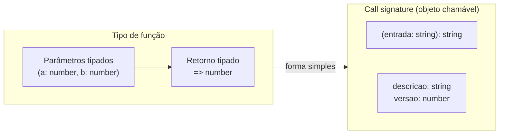
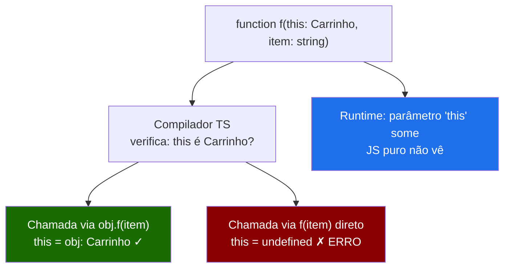
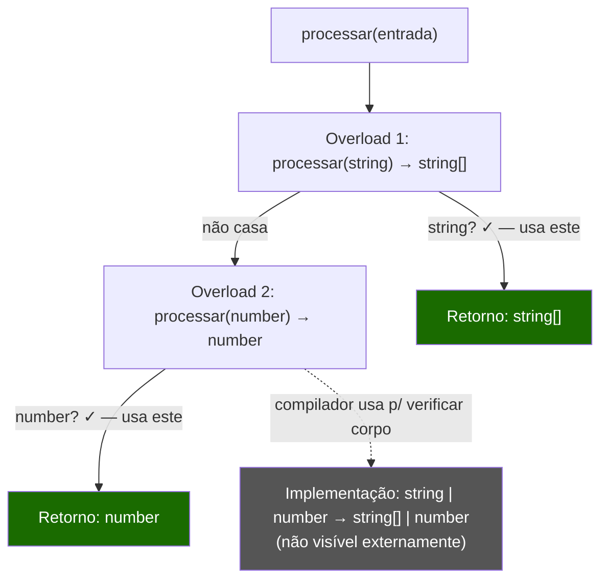
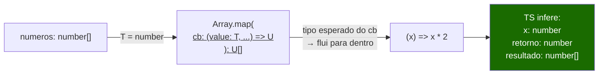

# Tipando funções: assinaturas, overloads, contextual typing

> [!abstract] TL;DR
> Funções são o centro de gravidade do TypeScript: quase tudo que acontece no código passa por uma assinatura de função. O TS tipa parâmetros e retornos, infere quando possível, aceita parâmetros opcionais e rest, e oferece **overloads** para modelar funções que se comportam diferente conforme o tipo da entrada. O recurso mais sutil — e poderoso — é o **contextual typing**: o compilador flui informação de tipo *do contexto para dentro* do callback, eliminando anotações redundantes. Dominar esses mecanismos é dominar metade da fluência em TypeScript de dia a dia.

---

## Por onde começa: a assinatura básica

Em JavaScript, uma função é apenas um valor que pode ser chamado. Em TypeScript, esse valor ganha uma **assinatura** — uma declaração de quais tipos entram e qual tipo sai. Pense na assinatura como um contrato: quem chama a função promete entregar os tipos certos; a função promete devolver o tipo declarado.

A forma mais direta é anotar parâmetros e retorno diretamente na declaração:

```ts
// Forma mais explícita: tipos nos parâmetros + tipo de retorno
function somar(a: number, b: number): number {
    return a + b;
}

// Arrow function — mesma ideia, sintaxe diferente
const multiplicar = (a: number, b: number): number => a * b;
```

O tipo de retorno à direita dos parênteses (`: number`) é opcional quando o TS consegue inferir — e na maioria das vezes ele consegue. Então por que anotar o retorno explicitamente?

Há dois motivos práticos. Primeiro, **documentação de intenção**: você declara o contrato antes de escrever o corpo, e o compilador garante que o corpo honra esse contrato — em vez de apenas aceitar o que saiu. Segundo, **proteção contra regressão**: se você refatorar o corpo e mudar o tipo de retorno sem querer, o TS te avisará imediatamente. Para funções exportadas e de API pública, anotar o retorno é boa prática.

```ts
// Sem anotação de retorno — TS infere "string | number"
// Pode não ser o que você queria:
function normalizar(valor: string | number) {
    if (typeof valor === "string") return valor.trim();
    return valor.toFixed(2); // TS infere: string | string — string. OK aqui.
    // Mas e se alguém adicionar um branch que retorna boolean por engano?
}

// Com anotação — o compilador valida seu contrato:
function normalizarSeguro(valor: string | number): string {
    if (typeof valor === "string") return valor.trim();
    return valor.toFixed(2);
    // return true; // ERRO — boolean não é string
}
```

> [!tip] Regra prática: anote o retorno quando a função é pública ou complexa
> Funções internas, lambdas curtas e callbacks quase sempre dispensam a anotação de retorno — o TS infere sem problema. Mas funções exportadas de um módulo, métodos de classe e qualquer coisa que faça parte da API de um serviço merecem retorno explícito. Isso evita que uma refatoração interna mude silenciosamente o contrato externo.

---

## Parâmetros opcionais, com default e rest

Toda função do dia a dia lida com parâmetros que nem sempre chegam. O TS tem três mecanismos para isso, e eles não são intercambiáveis.

### Parâmetro opcional com `?`

Um parâmetro marcado com `?` pode ser omitido. Dentro da função, seu tipo é `T | undefined` — o TS obriga você a lidar com a possibilidade de que ele não veio:

```ts
function cumprimentar(nome: string, titulo?: string): string {
    // titulo: string | undefined aqui dentro
    if (titulo) {
        return `Olá, ${titulo} ${nome}!`;
    }
    return `Olá, ${nome}!`;
}

cumprimentar("Maria");              // OK — titulo omitido
cumprimentar("Maria", "Dra.");      // OK
// cumprimentar("Maria", undefined, "extra"); // ERRO — parâmetro a mais
```

### Parâmetro com valor default

Um parâmetro com default é inferido como `T` (não `T | undefined`) dentro da função — o compilador sabe que sempre haverá um valor:

```ts
function criarId(prefixo: string, separador: string = "-"): string {
    // separador: string aqui (nunca undefined, o TS sabe)
    return `${prefixo}${separador}${Date.now()}`;
}

criarId("usr");           // "usr-1234567890"
criarId("usr", "_");      // "usr_1234567890"
criarId("usr", undefined); // OK — undefined ativa o default
```

> [!note] `?` vs `= valor` — a diferença semântica
> `?` significa "pode ser omitido, e se omitido chegará como `undefined`". `= valor` significa "pode ser omitido, e se omitido o default entra". A diferença importa no tipo interno: com `?`, você tem `T | undefined`; com default, você tem `T`. Prefira default quando faz sentido semântico — ele elimina o narrowing desnecessário.

### Parâmetros rest tipados

O operador rest (`...`) coleta os argumentos restantes num array. Em TS, você anota o tipo dos elementos do array:

```ts
function somar(...numeros: number[]): number {
    return numeros.reduce((acc, n) => acc + n, 0);
}

somar(1, 2, 3, 4, 5); // 15

// Rest de tipos específicos — tupla rest (TS 4.0+)
function log(nivel: "info" | "error", ...partes: [string, ...unknown[]]): void {
    console[nivel](partes.join(" "));
}
```

A tupla rest `[string, ...unknown[]]` garante que o primeiro elemento seja uma string — um padrão útil para funções que constroem mensagens ou templates.

---

## Tipos de função e call signatures

Uma função em TS também tem um **tipo** — uma forma que descreve como ela pode ser chamada. Isso é importante quando você precisa armazenar funções em variáveis, passá-las como parâmetros ou retorná-las de outras funções.

### Notação de tipo de função

A forma mais compacta é a **notação arrow** de tipo:

```ts
// Tipo de uma função que recebe dois números e retorna número
type Operacao = (a: number, b: number) => number;

const somar: Operacao = (a, b) => a + b;      // OK
const multiplicar: Operacao = (a, b) => a * b; // OK
// const errada: Operacao = (a) => "oi"; // ERRO — retorno errado

// Passando como parâmetro:
function aplicar(fn: Operacao, x: number, y: number): number {
    return fn(x, y);
}

aplicar(somar, 3, 4);       // 7
aplicar(multiplicar, 3, 4); // 12
```

### Call signatures em interfaces e object types

Quando uma função também carrega propriedades (pattern menos comum, mas real em bibliotecas como Express), você precisa de uma **call signature** dentro de um object type:

```ts
// Call signature — define que o objeto é chamável E tem propriedades
interface FuncaoComMetadata {
    (entrada: string): string;  // call signature
    descricao: string;          // propriedade normal
    versao: number;
}

const transformar: FuncaoComMetadata = (s) => s.toUpperCase();
transformar.descricao = "Converte para maiúsculas";
transformar.versao = 1;

transformar("hello"); // "HELLO"
console.log(transformar.descricao); // "Converte para maiúsculas"
```



> [!note] Leitura do diagrama
> A notação arrow (`(a: number) => string`) é a forma simples de tipar funções. A call signature dentro de um object type é necessária quando a função também carrega propriedades. Na prática, a notação arrow cobre 95% dos casos.

---

## `void` vs `undefined` em retornos

Essa distinção é pequena mas frequentemente confunde. Em TS, `void` e `undefined` como tipos de retorno têm significados diferentes.

**`undefined`** significa que a função literalmente retorna `undefined`:

```ts
function retornaUndefined(): undefined {
    return undefined;
    // return; // também OK
    // return "algo"; // ERRO
}
```

**`void`** significa que o valor de retorno não deve ser usado — a função pode tecnicamente retornar algo, mas quem chama não deve se importar com isso:

```ts
function registrar(msg: string): void {
    console.log(msg);
    // não precisa de return — TS não reclama
}

// A distinção importa em callbacks:
const arr = [1, 2, 3];

// forEach espera um callback do tipo (value: number) => void
// Isso é intencional: void permite callbacks que retornam algo
arr.forEach((n) => n * 2); // OK — retorna number, mas void ignora
```

> [!warning] `void` não é o mesmo que "não retorna nada"
> A semântica de `void` é "o retorno não importa", não "não há retorno". Isso é deliberado: permite que você passe uma função com retorno concreto (`(n: number) => number`) onde se espera `void`. Se o tipo fosse `undefined`, `arr.forEach((n) => n * 2)` seria um erro, porque a callback retorna `number`, não `undefined`. A flexibilidade de `void` é intencional.

| Tipo de retorno | Significado | Obriga `return undefined`? | Aceita retorno com valor? |
|---|---|---|---|
| `void` | Retorno não será usado | Não | Sim (mas o valor é descartado) |
| `undefined` | Deve retornar `undefined` | Sim | Não |
| `never` | Não retorna (lança ou loop infinito) | N/A | Não |

---

## Tipando `this` em funções

JavaScript tem uma relação complicada com `this`. TypeScript permite que você declare explicitamente o tipo de `this` que uma função espera — como um **parâmetro fantasma** (fake parameter) que não aparece na chamada:

```ts
interface Carrinho {
    itens: string[];
    adicionar(this: Carrinho, item: string): void;
}

const carrinho: Carrinho = {
    itens: [],
    adicionar(this: Carrinho, item: string) {
        this.itens.push(item); // TS sabe que this é Carrinho
    },
};

carrinho.adicionar("notebook"); // OK

// Extraindo e chamando fora do contexto:
const fn = carrinho.adicionar;
// fn("notebook"); // ERRO — this seria undefined ou window aqui
```

O parâmetro `this` some completamente em runtime (é tipo-erased como todo o resto do TS). Mas em tempo de compilação, ele obriga o compilador a verificar que a função está sendo chamada com o `this` correto. Isso é especialmente útil em event handlers e código de classe.



---

## Function overloads — quando uma union não basta

Agora chegamos ao recurso mais mal-compreendido do sistema de tipos de funções: **overloads**. A ideia é simples — uma função pode ter comportamentos diferentes dependendo dos tipos dos argumentos — mas a implementação em TS tem uma peculiaridade importante.

Imagine uma função `processar` que aceita `string` e retorna `string[]`, ou aceita `number` e retorna `number`. Com union, você tentaria:

```ts
// Tentativa com union — não funciona como esperado:
function processar(entrada: string | number): string[] | number {
    if (typeof entrada === "string") return entrada.split(",");
    return entrada * 2;
}

const resultado = processar("a,b,c"); // tipo: string[] | number — TS não sabe qual!
resultado.length; // ERRO — length pode não existir em number
```

O problema: quando a entrada é `string`, o retorno *deveria* ser `string[]`, mas TS vê `string[] | number` em todos os casos. A correlação entre entrada e saída se perdeu.

**Overloads resolvem exatamente isso.** Você escreve múltiplas **assinaturas de overload** (sem corpo), seguidas de uma **assinatura de implementação** (com corpo) que deve ser compatível com todas:

```ts
// Assinaturas de overload — contratos específicos:
function processar(entrada: string): string[];
function processar(entrada: number): number;

// Assinatura de implementação — nunca chamada diretamente:
function processar(entrada: string | number): string[] | number {
    if (typeof entrada === "string") return entrada.split(",");
    return entrada * 2;
}

// Agora o TS sabe a correlação:
const partes = processar("a,b,c"); // tipo: string[]
partes.length;                      // OK — TS sabe que é string[]

const dobro = processar(42);       // tipo: number
dobro.toFixed(2);                   // OK — TS sabe que é number
```

### Como o TypeScript resolve overloads

O mecanismo é simples: o compilador percorre as assinaturas de overload **de cima para baixo** e usa a primeira que casa com os argumentos fornecidos. A assinatura de implementação nunca é visível externamente — ela só existe para que o corpo da função compile.



> [!important] A assinatura de implementação é invisível
> Este é o ponto que mais confunde iniciantes. A assinatura de implementação (`string | number → string[] | number`) não é uma terceira opção de overload — ela só existe para que o TS compile o corpo. Quem chama `processar` só enxerga as assinaturas de overload declaradas. Se você passar `string | number` direto, o TS procura uma assinatura que aceite exatamente isso — e não acha, porque nenhuma das duas aceita a union:
> ```ts
> declare function processar(s: string): string[];
> declare function processar(n: number): number;
>
> const entrada: string | number = Math.random() > 0.5 ? "a" : 1;
> processar(entrada); // ERRO — nenhum overload aceita string | number
> ```

### Exemplo trabalhado: formatarValor

Vamos ver um exemplo real que você usaria num projeto: uma função utilitária que formata um valor diferente dependendo do tipo de entrada.

```ts
// Caso de uso: formatar valores para exibição em UI
// string → sanitiza e capitaliza
// number → formata como moeda BRL
// Date → formata como data legível

function formatarValor(valor: string): string;
function formatarValor(valor: number): string;
function formatarValor(valor: Date): string;
function formatarValor(valor: string | number | Date): string {
    if (typeof valor === "string") {
        return valor.trim().charAt(0).toUpperCase() + valor.trim().slice(1);
    }
    if (typeof valor === "number") {
        return valor.toLocaleString("pt-BR", {
            style: "currency",
            currency: "BRL",
        });
    }
    // valor é Date aqui
    return valor.toLocaleDateString("pt-BR", {
        day: "2-digit",
        month: "2-digit",
        year: "numeric",
    });
}

const nome = formatarValor("  maria ");  // "Maria"
const preco = formatarValor(1234.5);     // "R$ 1.234,50"
const data = formatarValor(new Date());  // "23/06/2026"

// Todos retornam string — TS sabe isso para cada variante:
nome.toUpperCase();   // OK
preco.split(",");     // OK
data.includes("/");   // OK
```

### Overload vs union vs generic — quando usar cada um

Overloads são poderosos mas têm custo: são mais difíceis de ler e manter. Antes de ir para overload, avalie as alternativas:

```ts
// QUANDO union simples basta (entrada e saída do mesmo tipo):
function identidade(x: string | number): string | number {
    return x;
}
// Aqui union funciona — não há correlação para preservar.

// QUANDO generic basta (comportamento uniforme, tipo preservado):
function primeiro<T>(arr: T[]): T | undefined {
    return arr[0];
}
// primeiro([1, 2, 3]) → number | undefined
// primeiro(["a", "b"]) → string | undefined
// Genérico preserva o tipo sem overload. (Ver nota 11.)

// QUANDO overload é necessário (comportamento diferente por tipo):
function processar(s: string): string[];
function processar(n: number): number;
// Aqui: string → string[] e number → number são comportamentos diferentes.
// Nem union nem generic expressam essa correlação.
```

> [!tip] Regra de ouro para overloads
> Use overload quando o **tipo de retorno depende do tipo de entrada de forma não-uniforme**. Se o retorno muda junto com a entrada de forma previsível (sempre o mesmo "shape"), um generic provavelmente resolve mais elegantemente. Se o comportamento muda estruturalmente (array de um lado, number do outro), overload é a ferramenta certa.

---

## Contextual typing — o TS fluindo do contexto pro callback

Contextual typing é um dos recursos mais suaves e mais úteis do TypeScript, e um dos mais fáceis de passar batido. A ideia: quando você passa uma função como argumento para outra função, o TS pode **inferir os tipos dos parâmetros do callback** a partir do tipo esperado pelo contexto — sem que você precise anotar nada.

O exemplo mais familiar é `Array.prototype.map`:

```ts
const numeros = [1, 2, 3, 4, 5];

// Sem contextual typing, você precisaria anotar x:
const dobrados = numeros.map((x: number) => x * 2); // redundante

// Com contextual typing, TS sabe que x é number:
const dobrados2 = numeros.map((x) => x * 2); // x inferido como number
//                                  ^ TS sabe: x é number, map retorna number[]
```

Como isso funciona? O método `map` no TS está tipado assim (simplificado):

```ts
// Na lib do TypeScript (Array<T>):
map<U>(callbackfn: (value: T, index: number, array: T[]) => U): U[];
```

Quando você chama `numeros.map(...)`, o TS já sabe que `T = number` (do tipo de `numeros`). Então o parâmetro `callbackfn` tem tipo `(value: number, index: number, array: number[]) => U`. O TS usa esse tipo esperado para inferir os tipos dos parâmetros do seu callback.

### Visualizando o fluxo



> [!note] Leitura do diagrama
> O tipo flui da esquerda para a direita, mas a inferência flui de fora para dentro do callback. O TS sabe o tipo de `numeros`, usa isso para resolver `T`, e então usa o tipo esperado do parâmetro `callbackfn` para inferir os tipos dentro do seu callback. Você não anotou nada — o contexto fez o trabalho.

### Contextual typing além de arrays

O mesmo mecanismo aparece em qualquer situação onde o tipo esperado é conhecido:

```ts
// Em event listeners (browser):
document.addEventListener("click", (evento) => {
    // evento é MouseEvent — inferido pelo contextual typing
    console.log(evento.clientX, evento.clientY);
    // evento.clientX: number — sem anotar nada!
});

// Em Promise.then:
fetch("/api/dados")
    .then((response) => {
        // response é Response — inferido
        return response.json();
    })
    .then((dados) => {
        // dados é any aqui — json() retorna Promise<any>
        // Use unknown + type guard em código sério (ver nota 04)
    });

// Em sort com comparador:
const usuarios = [{ nome: "Maria", idade: 30 }, { nome: "João", idade: 25 }];
usuarios.sort((a, b) => {
    // a e b são { nome: string; idade: number } — inferidos
    return a.idade - b.idade;
});

// Em setTimeout com callback:
const delay = (ms: number, fn: () => void): Promise<void> =>
    new Promise((resolve) =>
        setTimeout(() => {
            fn();
            resolve();
        }, ms)
    );

delay(1000, () => {
    // callback inferido como () => void — sem anotar
    console.log("feito");
});
```

### O limite do contextual typing

O contextual typing só funciona quando o **tipo do parâmetro do callback é conhecido**. Se você extrair o callback para uma variável separada, o contexto se perde:

```ts
// Funciona — contexto presente:
[1, 2, 3].map((x) => x * 2); // x: number

// Não funciona — contexto perdido:
const dobrar = (x) => x * 2; // x: any — TS não sabe
[1, 2, 3].map(dobrar); // OK para o map, mas dobrar foi tipado com any

// Solução: anotar a variável com o tipo esperado:
const dobrar2: (x: number) => number = (x) => x * 2; // x: number
// Ou deixar o TS inferir quando usar diretamente:
const dobrar3 = (x: number) => x * 2; // anota x explicitamente
```

---

## A armadilha da bivariância de callbacks

Este é o ponto mais sutil desta nota, e uma fonte real de bugs difíceis de rastrear. Em TypeScript (e em JavaScript em geral), callbacks passados como parâmetros de função são verificados de forma **bivariant** — ou seja, tanto contravariância quanto covariância são aceitas.

O que isso significa na prática? Compare dois tipos de callback:

```ts
type OnString = (s: string) => void;
type OnStringOrNumber = (s: string | number) => void;

// Contravariância "pura" (correto teoricamente):
// Uma função que aceita string|number pode ser usada onde se espera OnString
// porque ela aceita *mais* — string é um subtipo de string|number.

// Mas TS permite o inverso também (covariância — não é safe):
declare function registrarHandler(handler: OnStringOrNumber): void;

function handleApenas String(s: string): void {
    console.log(s.toUpperCase()); // assume que s é string!
}

// Isso COMPILA em TS, mas é inseguro:
// Se registrarHandler chamar handler(42), a função vai explodir em runtime
// porque 42.toUpperCase() não existe
```

A razão histórica: JavaScript não tem interfaces nominais. Forçar contravariância estrita tornaria muitos padrões reais (especialmente em React e DOM APIs) incompatíveis. O TS optou por bivarância como compromisso pragmático.

```ts
// Caso prático mais comum — a armadilha do forEach vs map:
const numeros = [1, 2, 3];

// forEach espera (value: number) => void
// Você passa uma função que espera apenas um subconjunto dos argumentos:
numeros.forEach((n) => console.log(n));        // OK — usa só o primeiro arg
numeros.forEach((n, i) => console.log(n, i));  // OK — usa os dois
numeros.forEach((n, i, arr) => {});             // OK — ignora arr

// O problema real com bivariância:
type Handler<T> = (valor: T) => void;

function executar(handler: Handler<string | number>) {
    handler(42); // pode chamar com number
}

// Esta função assume string — será chamada com number:
function processarString(s: string) {
    s.toUpperCase(); // TypeError em runtime se s for 42
}

executar(processarString); // TS COMPILA — mas é inseguro!
```

> [!warning] Como se proteger da bivariância
> A flag `strictFunctionTypes: true` (inclusa em `strict: true`) ativa checagem covariante/contravariante para tipos de função em **posição de parâmetro** — mas apenas para a notação de tipo arrow (`(x: T) => U`), não para call signatures em interfaces. Se você usa interfaces com call signatures, a bivariância ainda se aplica. Para código crítico com callbacks, prefira a notação arrow de tipo e ative `strict`.

---

## Generics em funções — a ponte para a nota 11

Às vezes a solução para uma função polimórfica não é overload nem union, mas um **parâmetro de tipo** — um generic. A nota [[11 - Generics - funções e constraints]] cobre isso em profundidade, mas é útil ver a fronteira aqui:

```ts
// Com overload: retornos diferentes por tipo de entrada (heterogêneo)
function wrap(valor: string): { tipo: "texto"; valor: string };
function wrap(valor: number): { tipo: "numero"; valor: number };
function wrap(valor: string | number) {
    if (typeof valor === "string") return { tipo: "texto" as const, valor };
    return { tipo: "numero" as const, valor };
}

// Com generic: mesmo "shape" de retorno, tipo preservado (homogêneo)
function embalar<T>(valor: T): { conteudo: T } {
    return { conteudo: valor };
}

embalar("hello");  // { conteudo: string }
embalar(42);       // { conteudo: number }
embalar([1, 2]);   // { conteudo: number[] }
```

A escolha entre overload e generic reflete a estrutura do problema: quando o comportamento é **uniforme** mas o tipo varia, use generic. Quando o comportamento é **diferente** para tipos diferentes, use overload. Generics com constraints (`<T extends string>`) e inferência avançada são o tema da nota 11.

---

## Como explicar em inglês

TypeScript's function typing covers the full spectrum from simple parameter annotations to sophisticated overload signatures. At the basic level, you annotate parameters and return types explicitly, or let TypeScript infer the return type from the function body. The distinction between `void` and `undefined` as return types is subtle: `void` means "the return value won't be used" — it's intentionally permissive for callbacks — while `undefined` means "this function literally returns undefined."

**Function overloads** let you describe functions with different behavior depending on input types. You write multiple overload signatures (without bodies), then a single implementation signature that must be compatible with all of them. The overload signatures are what callers see; the implementation signature is internal to the type-checker. Overloads are the right tool when the return type varies non-uniformly with the input type — when string input produces `string[]` while number input produces `number`. If the behavior is uniform (same shape for any type), generics are usually cleaner.

**Contextual typing** is TypeScript inferring the types of callback parameters from the context in which the callback is used. When you write `arr.map(x => x * 2)`, TypeScript already knows the element type of `arr`, so it infers `x`'s type without annotation. The type flows from the outside context into the callback. This only works when the callback is passed inline — if you extract it to a variable first, the context is lost and you need explicit annotations.

The **bivariance** trap: TypeScript historically checks callback types bivarianty for compatibility with JavaScript patterns. `strictFunctionTypes` partially fixes this for arrow-style function types, but not for call signatures in interfaces.

### Vocabulário-chave

| Português | Inglês |
|---|---|
| assinatura de função | function signature |
| tipo de retorno | return type |
| parâmetro opcional | optional parameter |
| parâmetro com default | default parameter |
| parâmetro rest | rest parameter |
| tipo de função | function type |
| assinatura de chamada | call signature |
| sobrecarga de função | function overload |
| assinatura de implementação | implementation signature |
| assinatura de overload | overload signature |
| tipagem contextual | contextual typing |
| bivariância | bivariance |
| contravariância | contravariance |
| covariância | covariance |
| tipo fantasma (`this`) | fake parameter (`this` parameter) |

---

## Armadilhas comuns

**1. Chamar a implementação com union quando só overloads são expostos.**
A assinatura de implementação é invisível para quem chama. Se você tem `f(string): A` e `f(number): B`, `f(string | number)` é um erro — nenhuma das assinaturas aceita a union. Você precisa fazer o narrowing antes de chamar, ou adicionar um terceiro overload explícito.

**2. Colocar o overload mais amplo primeiro.**
O TS percorre os overloads em ordem. Se o primeiro aceita `any`, todos os chamadas batem nele e os outros ficam inacessíveis. Sempre ordene do mais específico para o mais amplo.

```ts
// Errado — o primeiro overload engole tudo:
function parse(s: any): any;
function parse(s: string): number;
// Nunca chegará no segundo overload
```

**3. Confundir `void` com "sem efeito".**
Uma callback tipada como `() => void` pode retornar valores — o TS aceita isso. Se você precisa garantir que a callback *não* retorna nada (raro), use `() => undefined`.

**4. Perder o contextual typing ao extrair callbacks.**
Quando você escreve `const fn = (x) => x * 2` e depois passa para `arr.map(fn)`, o `x` já foi resolvido como `any` no momento da declaração. Anote o parâmetro explicitamente ou informe o tipo da variável.

**5. Ignorar `this` e quebrar em runtime.**
Extrair um método de classe e chamá-lo diretamente perde o `this`. Anotar `this` no parâmetro faz o TS detectar isso em compile time — mas só se você usar a anotação.

**6. Bivariância em callbacks críticos.**
Se sua callback recebe um tipo mais específico do que o esperado pela função de ordem superior, o TS pode aceitar em compile time mas explodir em runtime. Ative `strict: true` e prefira notação arrow de tipo.

---

## Veja também

- [[07 - Union e intersection types]] — unions são a alternativa mais simples a overloads; entender a diferença importa
- [[09 - Type narrowing e type guards]] — o narrowing que você faz dentro do corpo do overload e dentro de callbacks com `unknown`
- [[11 - Generics - funções e constraints]] — quando overload é excessivo e um parâmetro de tipo resolve de forma mais elegante
- [[03-Dominios/Tecnologia/JavaScript/JavaScript Fundamentals|JavaScript Fundamentals]] — closures, `this` e o modelo de funções em JS que o TS tipifica
