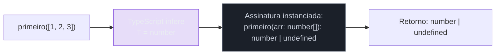
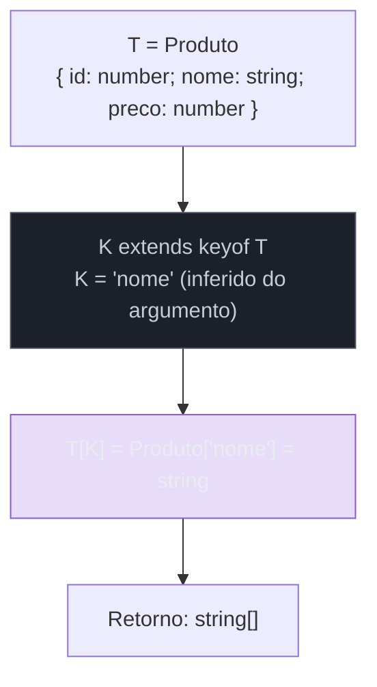
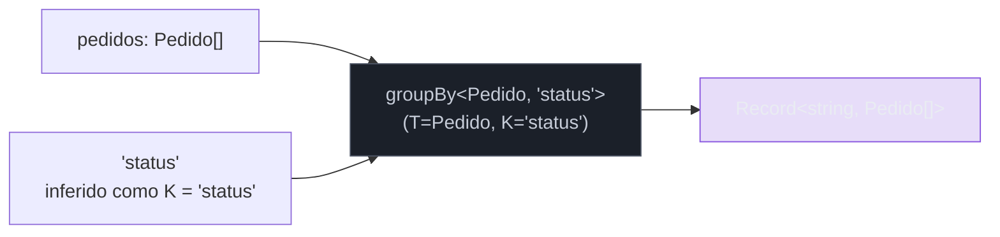
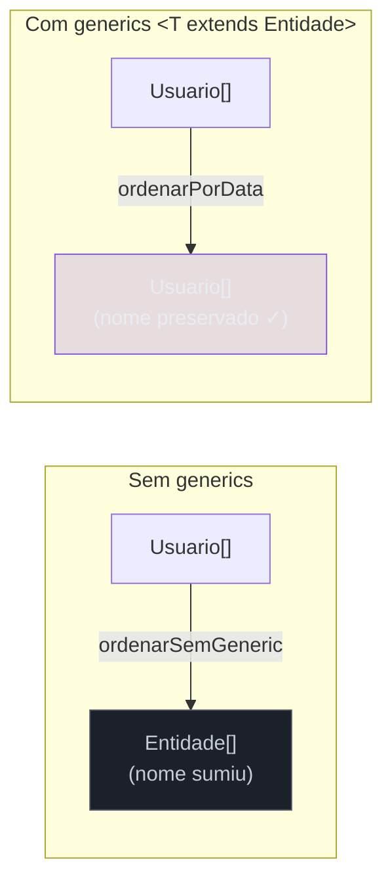

# Generics — funções e constraints

> [!abstract] TL;DR
> Generics são o mecanismo que permite escrever uma função ou tipo **uma vez** e fazê-la funcionar com qualquer tipo concreto — sem jogar fora as relações entre entrada e saída. A diferença crucial em relação a `any`: quando você diz `<T>`, o TypeScript lembra que "o que entra como T e o que sai como T são a mesma coisa". Com `any`, essa memória se perde. Constraints com `extends` refinam isso: `<T extends { id: number }>` aceita qualquer coisa que **tenha pelo menos** um campo `id: number` — structural typing aplicado ao nível do type parameter. E o melhor: na maioria dos casos, você não escreve `<T>` explícito na chamada — o compilador **infere** T a partir dos argumentos.

---

## Por que não `any`?

Antes de entender o que generics resolvem, vale ver o problema que eles substituem.

Imagine que você precisa de uma função que retorna o primeiro elemento de um array. A tentação rápida:

```ts
// Versão com any — perde a relação entre entrada e saída
function primeiro(arr: any[]): any {
    return arr[0];
}

const n = primeiro([1, 2, 3]);     // n: any — não number!
const s = primeiro(["a", "b"]);    // s: any — não string!

// O compilador não vai gritar aqui — e deveria:
const tamanho = n.toUpperCase();   // runtime error: n.toUpperCase is not a function
```

O `any` é um buraco no sistema de tipos (ver [[04 - any, unknown e never]]). Ele aceita qualquer coisa e retorna qualquer coisa — mas "qualquer coisa" significa que a relação entre entrada e saída some. Você perde autocomplete, perde verificação de tipos no retorno, e perde a capacidade do compilador de detectar erros.

O problema específico aqui é que o **tipo da saída depende do tipo da entrada**. Se entrou `number[]`, deve sair `number`. Se entrou `string[]`, deve sair `string`. Isso é exatamente o que generics modelam:

```ts
// Versão genérica — preserva a relação
function primeiro<T>(arr: T[]): T | undefined {
    return arr[0];
}

const n = primeiro([1, 2, 3]);     // n: number | undefined ✓
const s = primeiro(["a", "b"]);    // s: string | undefined ✓

// Agora o compilador grita:
// n.toUpperCase();  // Erro: Property 'toUpperCase' does not exist on type 'number'
```

`T` é um **type parameter** — uma variável no nível de tipos. Quando o TypeScript processa `primeiro([1, 2, 3])`, ele vê que `arr` é `number[]`, conclui que `T = number`, e substitui `T` em todo o restante da assinatura: o retorno vira `number | undefined`.



---

## Inferência de type arguments — o usuário raramente escreve `<T>` explícito

A maioria dos desenvolvedores que vê `<T>` pela primeira vez acha que vai ter que escrever isso nas chamadas. Na prática, quase nunca:

```ts
// Você PODE ser explícito — mas raramente precisa:
const a = primeiro<number>([1, 2, 3]);   // explícito: T = number

// O compilador infere a partir do argumento — forma normal:
const b = primeiro([1, 2, 3]);           // T inferido como number
const c = primeiro(["x", "y"]);          // T inferido como string
const d = primeiro([true, false]);        // T inferido como boolean
```

A inferência de type arguments funciona porque o TypeScript resolve `T` unificando o tipo do argumento com o tipo esperado pelo parâmetro. Isso é análogo à inferência de Hindley-Milner (ver [[03-Dominios/Ciência/Compiladores e Linguagens/10 - Análise semântica e checagem de tipos|Análise semântica]]) — mas aplicada de forma pragmática, não globalmente.

> [!tip] Quando escrever `<T>` explícito na chamada
> Há dois casos em que você precisa: (1) quando o TypeScript não consegue inferir porque não há argumentos suficientes (`create<string>()` onde `create<T = string>()` tem default, mas você quer sobrescrever); (2) quando você quer **fixar** T a um tipo mais restrito do que o TypeScript inferiria — por exemplo, ao passar um array vazio: `primeiro<number>([])` garante que o retorno seja `number | undefined`, não `never | undefined`.

Há também um caso sutil: quando o TypeScript **widening** ao inferir. Literais em arrays tendem a ser alargados para seus tipos base:

```ts
const arr = [1, 2, 3];  // inferido como number[], não [1, 2, 3]
primeiro(arr);           // T = number — OK

// Se quiser manter os literais, use as const na origem:
const tupla = [1, 2, 3] as const; // readonly [1, 2, 3]
// Mas aí você precisa de outra abordagem (ver nota 03 — Arrays, tuplas e as const)
```

---

## Multiple type parameters — modelando relações entre tipos

Generics com múltiplos type parameters permitem expressar **relações** entre os tipos de entradas e saídas diferentes. O exemplo clássico é `pair`:

```ts
function pair<A, B>(a: A, b: B): [A, B] {
    return [a, b];
}

const p1 = pair("Maria", 30);    // [string, number]
const p2 = pair(true, [1, 2]);   // [boolean, number[]]
```

Cada type parameter é inferido independentemente — `A` do primeiro argumento, `B` do segundo. A relação que estamos modelando: "o primeiro elemento da tupla tem o mesmo tipo que o primeiro argumento, e o segundo tem o mesmo tipo que o segundo argumento."

Isso fica mais interessante em funções utilitárias reais. Considere `pluck` — extrair um array de valores de uma propriedade de um array de objetos:

```ts
// Versão sem generics — perde tudo
function pluckSimples(arr: any[], key: string): any[] {
    return arr.map(obj => obj[key]);
}

// Versão genérica — preserva os tipos e as relações
function pluck<T, K extends keyof T>(arr: T[], key: K): T[K][] {
    return arr.map(obj => obj[key]);
}
```

Aqui há duas relações sendo modeladas:
1. `T` é o tipo dos objetos no array
2. `K extends keyof T` garante que `key` seja uma chave válida de `T`
3. O retorno `T[K][]` é um array do tipo do valor naquela chave

```ts
interface Produto {
    id: number;
    nome: string;
    preco: number;
}

const produtos: Produto[] = [
    { id: 1, nome: "Teclado", preco: 150 },
    { id: 2, nome: "Mouse",   preco: 80  },
];

const ids    = pluck(produtos, "id");    // number[]   ✓
const nomes  = pluck(produtos, "nome");  // string[]   ✓
const precos = pluck(produtos, "preco"); // number[]   ✓

// pluck(produtos, "peso"); // Erro: Argument of type '"peso"' is not assignable
//                          // to parameter of type 'keyof Produto'
```

> [!example] Isso é `keyof` + `T[K]` num relance
> `keyof T` produz a union `"id" | "nome" | "preco"`. `T[K]` é indexed access type — "o tipo do valor na chave K de T". Ambos são cobertos em profundidade na nota [[15 - keyof, typeof e indexed access types]]. Aqui eles aparecem naturalmente como parte dos constraints.



---

## Constraints com `extends` — refinando o que `T` pode ser

Um type parameter sem constraint aceita qualquer tipo — o que às vezes é exatamente o que você quer. Mas muitas vezes você precisa que o tipo **garanta uma estrutura mínima** para poder operar sobre ele. É isso que `extends` faz em contexto de generics.

> [!note] `extends` aqui não é herança
> Em generics, `extends` significa "é assignable a" ou "satisfaz a estrutura de" — não herança de classe. `T extends { length: number }` aceita qualquer tipo que tenha pelo menos o campo `length: number`, seja string, array, `{ length: number, nome: string }`, ou qualquer outra coisa. É structural typing na veia.

```ts
// Sem constraint — T pode ser qualquer coisa, incluindo number
function comprimento<T>(value: T): number {
    return value.length;  // ERRO: Property 'length' does not exist on type 'T'
}

// Com constraint — T deve ter pelo menos length: number
function comprimento<T extends { length: number }>(value: T): number {
    return value.length;  // OK — o constraint garante que length existe
}

comprimento("hello");         // T = string         — string tem length ✓
comprimento([1, 2, 3]);       // T = number[]       — array tem length ✓
comprimento({ length: 5 });   // T = { length: 5 }  — objeto literal ✓
// comprimento(42);            // Erro: number não tem length
```

O constraint faz duas coisas simultâneas:
1. **Restringe** quais tipos podem ser passados como `T` — o compilador rejeita na chamada se o tipo não satisfizer o constraint
2. **Expande** o que você pode fazer com `T` dentro da função — campos/métodos garantidos pelo constraint ficam disponíveis


---

## Exemplo trabalhado: `groupBy`

Generics com constraints brilham em utilitários de transformação de dados. Vamos construir `groupBy` — agrupar um array de objetos por uma chave:

```ts
// groupBy<T, K extends keyof T>:
// - arr: array de objetos do tipo T
// - key: uma chave de T cujo valor é string ou number (para ser uma chave de objeto)
// - retorna: um Record onde cada chave é um valor possível de T[K], e cada valor é T[]

function groupBy<T, K extends keyof T>(
    arr: T[],
    key: K
): Record<string, T[]> {
    return arr.reduce<Record<string, T[]>>((acc, item) => {
        // item[key] pode ser qualquer T[K]; coercimos para string como chave do mapa
        const groupKey = String(item[key]);
        if (!acc[groupKey]) {
            acc[groupKey] = [];
        }
        acc[groupKey].push(item);
        return acc;
    }, {});
}
```

Usando:

```ts
interface Pedido {
    id: number;
    status: "pendente" | "enviado" | "entregue";
    cliente: string;
    valor: number;
}

const pedidos: Pedido[] = [
    { id: 1, status: "pendente",  cliente: "Ana",    valor: 150 },
    { id: 2, status: "enviado",   cliente: "Bruno",  valor: 80  },
    { id: 3, status: "entregue",  cliente: "Ana",    valor: 200 },
    { id: 4, status: "pendente",  cliente: "Carla",  valor: 50  },
    { id: 5, status: "enviado",   cliente: "Bruno",  valor: 120 },
];

const porStatus  = groupBy(pedidos, "status");
// {
//   pendente: [Pedido#1, Pedido#4],
//   enviado:  [Pedido#2, Pedido#5],
//   entregue: [Pedido#3]
// }

const porCliente = groupBy(pedidos, "cliente");
// { Ana: [...], Bruno: [...], Carla: [...] }

// groupBy(pedidos, "valor"); — OK, mas a chave vira string ("150", "80", ...)
// groupBy(pedidos, "peso"); — ERRO: "peso" não é keyof Pedido
```

> [!note] `Record<string, T[]>` vs tipagem mais precisa
> O retorno `Record<string, T[]>` é pragmático — captura bem o shape mas não infere automaticamente quais são as chaves possíveis (ex.: `"pendente" | "enviado" | "entregue"`). Fazer isso mais preciso exigiria `Record<T[K] extends string | number ? T[K] : never, T[]>` — que cruza para conditional types (nota [[13 - Conditional types]]). Aqui, a versão pragmática resolve 95% dos casos.



---

## Inferência guiada por constraint — o compilador "resolve" K a partir do uso

Um detalhe sutil, mas poderoso: quando você tem `K extends keyof T`, o TypeScript não infere `K` e depois valida o constraint — ele **co-infere** ambos simultaneamente. Isso significa que passar a chave errada é detectado na chamada, não em runtime:

```ts
// pluck inferindo K a partir do segundo argumento:
pluck(produtos, "nome");
//              ^^^^^^
//              TypeScript infere K = "nome"
//              valida: "nome" extends keyof Produto? Sim → OK
//              resolve retorno: Produto["nome"] = string

pluck(produtos, "peso");
//              ^^^^^^
//              TypeScript infere K = "peso"
//              valida: "peso" extends keyof Produto? NÃO → ERRO aqui
```

Esse comportamento — inferir e validar o constraint na mesma passada — é o que torna generics com constraints tão seguros. O erro aparece exatamente onde está o problema: no ponto da chamada, com uma mensagem que diz qual valor violou qual constraint.

> [!warning] Constraints não são verificados dentro do tipo, só na fronteira
> Dentro da função, o TypeScript sabe apenas o que o constraint garante — não o tipo concreto. `T extends { length: number }` garante acesso a `.length`, mas dentro da função `T` ainda é genérico. Você não pode, por exemplo, chamar `arr.sort()` sendo `arr: T extends any[]` — o constraint garante a estrutura mínima, não a identidade do tipo.

---

## Constraints com tipos de interface e interseção

Constraints podem ser qualquer tipo, incluindo interfaces, interseções e unions:

```ts
// Constraint de interface
interface Entidade {
    id: number;
    criadoEm: Date;
}

// T deve ser uma Entidade — garante id e criadoEm
function ordenarPorData<T extends Entidade>(items: T[]): T[] {
    return [...items].sort(
        (a, b) => a.criadoEm.getTime() - b.criadoEm.getTime()
    );
}

// Funciona com qualquer tipo que extends Entidade:
interface Usuario extends Entidade { nome: string }
interface Produto extends Entidade { preco: number }

const usuarios: Usuario[] = [/* ... */];
const produtos: Produto[] = [/* ... */];

const usuariosOrdenados = ordenarPorData(usuarios); // Usuario[] ✓
const produtosOrdenados = ordenarPorData(produtos); // Produto[] ✓
```

Repare: `ordenarPorData` retorna `T[]` — não `Entidade[]`. O tipo concreto não é perdido. Se você passa `Usuario[]`, recebe `Usuario[]` de volta — com todos os campos de `Usuario` disponíveis no resultado. Isso é a diferença entre usar generics e usar a interface base diretamente no parâmetro.

```ts
// Sem generics — perde o tipo concreto
function ordenarSemGeneric(items: Entidade[]): Entidade[] {
    return [...items].sort(
        (a, b) => a.criadoEm.getTime() - b.criadoEm.getTime()
    );
}

const resultado = ordenarSemGeneric(usuarios);
// resultado: Entidade[] — o campo `nome` sumiu!
// resultado[0].nome; // Erro: 'nome' does not exist on type 'Entidade'
```

Essa é a propriedade mais valiosa de generics em funções utilitárias: eles passam o tipo concreto de ponta a ponta sem perda.



---

## Múltiplos constraints e interseção

É possível combinar múltiplos constraints com interseção (`&`), ou simplesmente incluir vários campos no objeto do constraint:

```ts
// Forma 1: objeto inline com múltiplos campos
function processarItem<T extends { id: string; ativo: boolean }>(
    item: T
): string {
    if (!item.ativo) return `${item.id} inativo`;
    return item.id;
}

// Forma 2: interseção de interfaces
interface ComId   { id: string }
interface ComNome { nome: string }

function apresentar<T extends ComId & ComNome>(item: T): string {
    return `${item.id}: ${item.nome}`;
}
```

Em entrevistas, é comum ver a pergunta "qual a diferença entre `<T extends A & B>` e duas overloads separadas?". A resposta: o constraint interseccionado exige que **um único valor** satisfaça ambas as interfaces simultaneamente — não que você escolha uma ou outra.

---

## A fronteira com a nota 12

Esta nota cobre funções genéricas e constraints — o núcleo do dia a dia. Há mais duas dimensões de generics que ficam na nota seguinte ([[12 - Generics - defaults, classes e interfaces genéricas]]):

- **Default type parameters** (`<T = string>`) — quando o chamador não fornece T, o que o TypeScript usa
- **Classes genéricas** — `class Stack<T>`, instanciação, e por que o type parameter vive na instância
- **Interfaces genéricas** — `interface Repository<T, ID>` e como estender uma interface genérica com tipo concreto
- **Variância na prática** — quando `T[]` é covariante e quando isso importa

A divisão não é arbitrária: funções genéricas e constraints são o padrão de 80% do código. Defaults, classes e interfaces aparecem principalmente em arquitetura (repositórios, serviços, componentes React — que aliás ficam na trilha React).

---

## Como explicar em inglês

**Generics** are TypeScript's mechanism for writing functions and types that work over *multiple* types while preserving the **relationships** between them. The key distinction from `any` is that generics maintain those relationships: a function typed as `<T>(arr: T[]): T` tells the compiler "the output type is the same as the element type of the input array" — whereas `(arr: any[]): any` loses that relationship entirely.

**Type inference** means callers rarely need to write the `<T>` explicitly — the compiler resolves `T` from the argument types. When you write `first([1, 2, 3])`, TypeScript infers `T = number` and gives you back `number | undefined`.

**Constraints** (`extends`) restrict what `T` can be while expanding what you can *do* with `T` inside the function. `<T extends { id: number }>` accepts any type that has at least an `id: number` field — this is **structural typing at the type parameter level**. It rejects callers that pass the wrong shape, and it unlocks access to `.id` inside the function body.

Multiple type parameters (`<T, K extends keyof T>`) model **relationships between types** across different inputs and outputs — as in `pluck(arr, key): T[K][]` where the return type is directly derived from which key you name.

### Vocabulário-chave

| Português | Inglês |
|---|---|
| tipo parametrizado | generic type / parameterized type |
| parâmetro de tipo | type parameter |
| argumento de tipo | type argument |
| inferência de argumento de tipo | type argument inference |
| constraint de tipo | type constraint |
| forma mínima garantida | guaranteed minimum shape |
| sistema de tipos estrutural | structural type system |
| tipo concreto | concrete type |
| instanciar um genérico | instantiate a generic |
| tipo indexado | indexed access type |
| chave de tipo | keyof |

---

## Armadilhas comuns

> [!warning] Armadilha 1: usar `any` "por preguiça" quando generics são a solução
> `function wrap(value: any): { value: any }` compila, mas perde a relação. `function wrap<T>(value: T): { value: T }` é trivialmente mais segura e igualmente simples de escrever. Se você vê `any` num retorno que "depende do argumento", generics são a resposta.

> [!warning] Armadilha 2: confundir constraint com tipo do parâmetro
> `<T extends string>` não significa que `T` é `string` — significa que `T` é algo assignable a `string`. Na prática, `T` pode ser um literal como `"loading"`. Se você quiser exatamente `string`, não use genérico: use `string` direto.
> ```ts
> function tag<T extends string>(value: T): { tag: T } {
>     return { tag: value };
> }
> const r = tag("loading"); // r: { tag: "loading" } — T = "loading", não string
> ```

> [!warning] Armadilha 3: esquecer que constraint garante estrutura mínima, não identidade
> `<T extends any[]>` garante que `T` é um array — mas dentro da função, `T` ainda é genérico. Você não pode chamar métodos que dependem do tipo do elemento sem constraints adicionais.
> ```ts
> function somarArray<T extends number[]>(arr: T): number {
>     return arr.reduce((a, b) => a + b, 0); // OK: T extends number[]
> }
>
> // Mas isso não funciona:
> function somarGenerico<T extends any[]>(arr: T): number {
>     return arr.reduce((a, b) => a + b, 0);
>     // Erro: T[number] pode não ser number — o constraint é any[]
> }
> ```

> [!warning] Armadilha 4: múltiplos type params que deveriam ser um só
> Se dois type params são sempre iguais na prática, você não precisa de dois:
> ```ts
> // Redundante — A e B sempre serão o mesmo
> function identidade<A, B extends A>(a: A, b: B): A { return a; }
>
> // Mais simples e equivalente para o caso comum:
> function identidade<T>(a: T, b: T): T { return a; }
> ```

> [!warning] Armadilha 5: inferência falha com arrays vazios
> `primeiro([])` infere `T = never` — array de never. O resultado é `never | undefined`, não `undefined`. Se você precisa de `T` concreto com array vazio, passe explícito: `primeiro<string>([])`.

---

## Veja também

- [[04 - any, unknown e never]] — por que `any` é o problema que generics resolvem; `never` como bottom type
- [[12 - Generics - defaults, classes e interfaces genéricas]] — continuação: `<T = string>`, classes genéricas, interfaces genéricas, variância
- [[13 - Conditional types]] — tipos condicionais que operam *sobre* type parameters
- [[18 - Utility types - e como reconstruí-los]] — `Partial`, `Pick`, `Omit` são todos genéricos por baixo; reconstruí-los consolida tudo desta nota
- [[03-Dominios/Ciência/Compiladores e Linguagens/10 - Análise semântica e checagem de tipos|Análise semântica]] — a teoria de inferência de tipos (Hindley-Milner) que fundamenta a inferência de T
