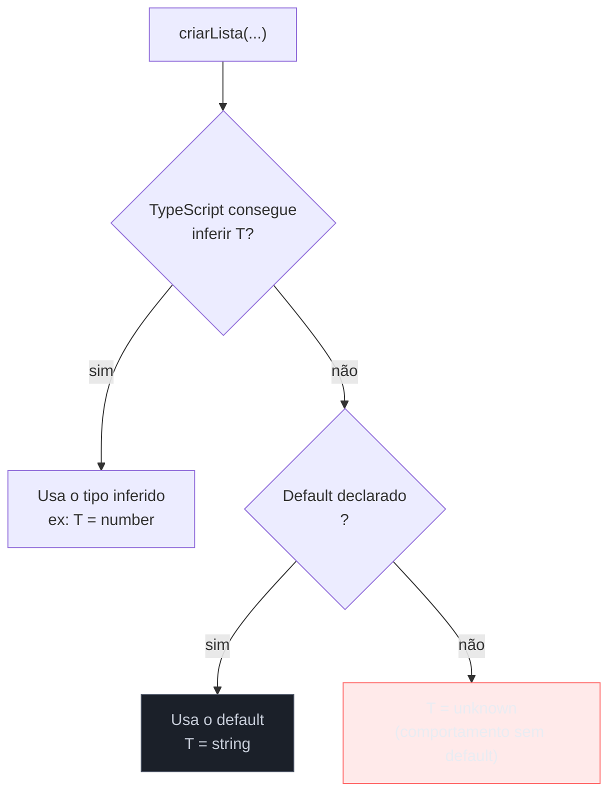
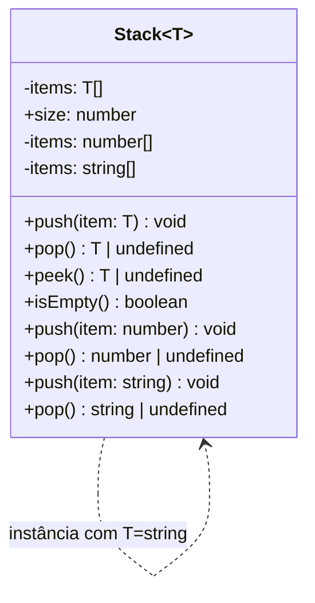
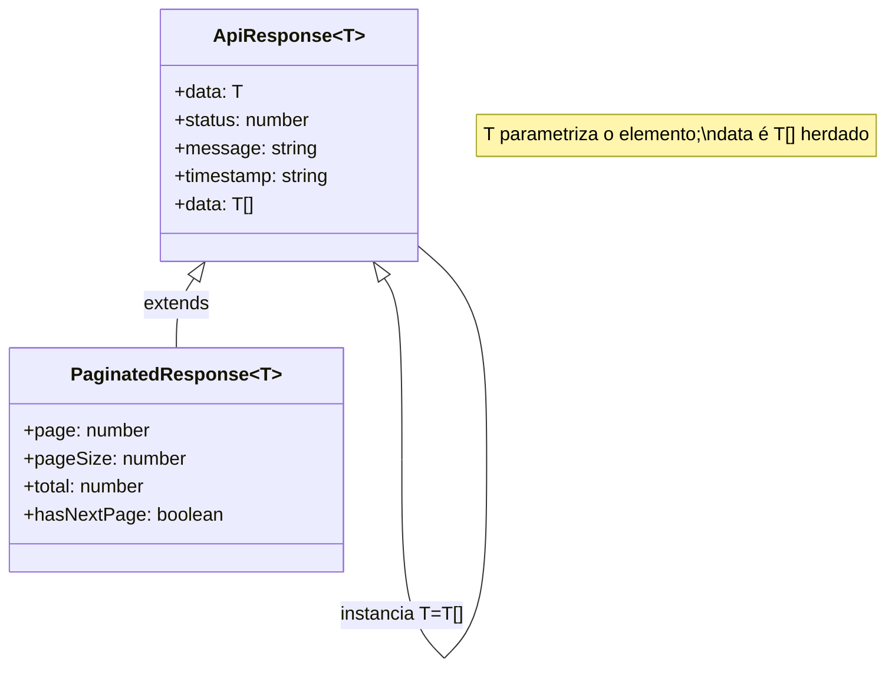
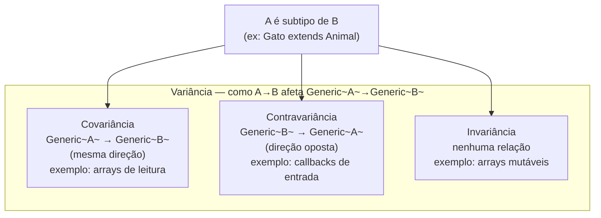
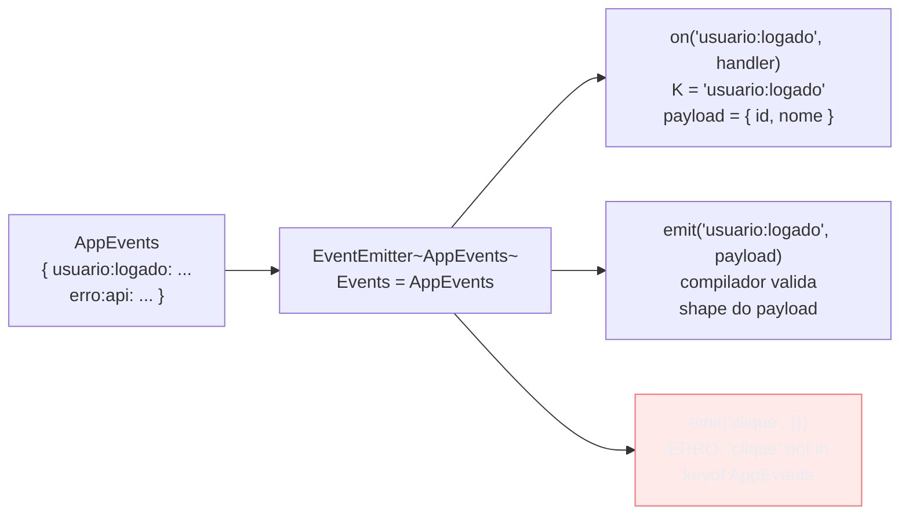

# Generics — defaults, classes e interfaces genéricas

> [!abstract] TL;DR
> Esta nota continua de [[11 - Generics - funções e constraints]] e expande o vocabulário de generics em três direções: **default type parameters** (`<T = string>`) que evitam verbosidade sem sacrificar segurança; **classes genéricas** que encapsulam estado tipado (o exemplo canônico é `Stack<T>`, mas o mais revelador é um container `Result<T, E>`); e **interfaces genéricas** que definem contratos reutilizáveis como `Repository<T>` e `ApiResponse<T>`. No caminho, a nota toca em **variância** — por que arrays são covariantes e callbacks são contravariantes — e em como combinar **constraints com defaults** para APIs mais ergonômicas. O fio condutor: generics são sobre **postergação de comprometimento** — você escreve a lógica uma vez e o compilador instancia os tipos nos pontos de uso.

---

## O que você já sabe (e o que falta)

A nota [[11 - Generics - funções e constraints]] cobriu o essencial: funções genéricas, type parameters como variáveis de tipo, constraints com `extends`, e a inferência automática que dispensa anotar `<number>` explicitamente na maioria das chamadas. Se generics ainda parecem novidade, volte lá antes de continuar.

Aqui o foco muda de **funções** para **estruturas**: tipos com parâmetros que persistem ao longo do ciclo de vida de um objeto, default params que deixam a API mais confortável, e a questão mais sutil que generics levantam — como tipos se relacionam quando parametrizados por outros tipos (o problema de variância).

---

## Default type parameters — o `= Tipo` que libera o chamador

Imagine uma função utilitária de factory que cria listas. Você quer que, por padrão, a lista seja de strings (o caso mais comum), mas continue flexível para outros tipos quando necessário.

```ts
// Sem default: o chamador sempre precisa ser explícito
function criarLista<T>(items?: T[]): T[] {
    return items ?? [];
}
criarLista();          // T = unknown — não é o que queremos
criarLista<string>();  // precisa ser explícito

// Com default: o chamador é liberado no caso comum
function criarLista<T = string>(items?: T[]): T[] {
    return items ?? [];
}
criarLista();                     // T = string (inferido do default)
criarLista(["a", "b"]);           // T = string (inferido dos itens)
criarLista([1, 2, 3]);            // T = number (inferido dos itens)
criarLista<boolean>([true]);      // T = boolean (explícito — override)
```

O default só entra em cena quando o TypeScript **não consegue inferir** o type parameter. Se você passa `[1, 2, 3]`, ele infere `number` e ignora o default. Se não passa nada, recorre ao default. É análogo a um parâmetro de função com valor padrão — só ativo na ausência de argumento.



### Defaults combinados com constraints

O padrão mais poderoso é combinar `extends` com `=`. O default precisa satisfazer a constraint — o TypeScript não aceita um default que viola o contrato:

```ts
interface Entidade {
    id: string;
    criadoEm: Date;
}

interface Usuario extends Entidade {
    nome: string;
    email: string;
}

// T deve ser Entidade, e por padrão é Usuario (o caso mais comum na app)
class Repositorio<T extends Entidade = Usuario> {
    private items: Map<string, T> = new Map();

    salvar(item: T): void {
        this.items.set(item.id, item);
    }

    buscar(id: string): T | undefined {
        return this.items.get(id);
    }
}

// O caso comum: Repositorio<Usuario> sem precisar escrever Usuario
const repoUsuarios = new Repositorio();
repoUsuarios.salvar({ id: "1", criadoEm: new Date(), nome: "Ana", email: "ana@ex.com" });

// Caso específico: sobrescreve o default
interface Produto extends Entidade { preco: number; nome: string; }
const repoProdutos = new Repositorio<Produto>();
```

> [!tip] Quando usar defaults
> Defaults de tipo brilham em **bibliotecas e frameworks** onde há um tipo "raiz" mais comum que os demais. Em código de aplicação, prefira ser explícito — o default pode esconder a intenção. A pergunta é: "o default é óbvio para quem lê a instanciação?"

---

## Classes genéricas — estado tipado que persiste

Uma classe genérica é uma **fábrica de classes**. Você escreve `Stack<T>` uma vez e o compilador cria instâncias distintas para `Stack<number>`, `Stack<string>`, `Stack<Usuario>` — cada uma com verificações de tipo independentes.

```ts
class Stack<T> {
    private items: T[] = [];

    push(item: T): void {
        this.items.push(item);
    }

    pop(): T | undefined {
        return this.items.pop();
    }

    peek(): T | undefined {
        return this.items[this.items.length - 1];
    }

    get size(): number {
        return this.items.length;
    }

    isEmpty(): boolean {
        return this.items.length === 0;
    }
}

const pilhaNum = new Stack<number>();
pilhaNum.push(1);
pilhaNum.push(2);
pilhaNum.push("três"); // ERRO: Argument of type 'string' is not assignable to parameter of type 'number'

const pilhaStr = new Stack<string>();
pilhaStr.push("primeiro");
const topo = pilhaStr.peek(); // topo: string | undefined — TypeScript sabe o tipo
```

A diferença crítica entre uma classe genérica e uma função genérica é que o type parameter `T` **persiste** em toda a instância. Quando você faz `new Stack<number>()`, todas as chamadas de `push`, `pop` e `peek` naquela instância são amarradas a `number`. Não é necessário repetir `<number>` em cada método — o compilador lembra do comprometimento feito na instanciação.



### Generic methods dentro de classes

Uma classe genérica pode ter **métodos com seus próprios type parameters adicionais**, independentes do parâmetro da classe:

```ts
class Coleção<T> {
    private items: T[];

    constructor(items: T[]) {
        this.items = [...items];
    }

    // Método com seu próprio type parameter U — independente de T
    mapear<U>(fn: (item: T) => U): Coleção<U> {
        return new Coleção(this.items.map(fn));
    }

    // Método que usa o T da classe
    filtrar(predicado: (item: T) => boolean): Coleção<T> {
        return new Coleção(this.items.filter(predicado));
    }

    toArray(): T[] {
        return [...this.items];
    }
}

const numeros = new Coleção([1, 2, 3, 4, 5]);

// mapear usa seu próprio U = string
const strings = numeros
    .filtrar(n => n % 2 === 0)      // Coleção<number>
    .mapear(n => n.toString());     // Coleção<string> — U = string inferido de toString()

console.log(strings.toArray()); // ["2", "4"]
```

O compilador infere `U = string` porque `n.toString()` retorna `string`. Note que `filtrar` mantém `T = number` (é um método da classe), enquanto `mapear` introduz `U` para permitir a transformação de tipo.

---

## Um container real: Result&lt;T, E&gt;

O exemplo mais revelador de classe genérica com **dois** type parameters é o container `Result<T, E>`, que representa ou um sucesso com valor `T` ou uma falha com erro `E`. (Esta nota mostra a mecânica — o design pattern completo de type-driven design vai em [[24 - Type-driven design - branded types, Result e estados impossíveis]].)

```ts
// Representação como classe genérica selada com dois type params
class Result<T, E extends Error = Error> {
    private constructor(
        private readonly _value: T | null,
        private readonly _error: E | null
    ) {}

    // Factory methods tipados: o compilador infere T e E
    static ok<T, E extends Error = Error>(value: T): Result<T, E> {
        return new Result<T, E>(value, null);
    }

    static fail<T, E extends Error>(error: E): Result<T, E> {
        return new Result<T, E>(null, error);
    }

    get isOk(): boolean {
        return this._error === null;
    }

    // Unwrap seguro — só disponível quando isOk
    unwrap(): T {
        if (this._error !== null) {
            throw new Error(`Tentativa de unwrap em Result com erro: ${this._error.message}`);
        }
        return this._value as T; // cast seguro: se error é null, value é T
    }

    // mapear transforma T → U mantendo E
    map<U>(fn: (value: T) => U): Result<U, E> {
        if (this._error !== null) {
            return Result.fail<U, E>(this._error);
        }
        return Result.ok<U, E>(fn(this._value as T));
    }

    // flatMap para encadeamento
    flatMap<U>(fn: (value: T) => Result<U, E>): Result<U, E> {
        if (this._error !== null) {
            return Result.fail<U, E>(this._error);
        }
        return fn(this._value as T);
    }
}

// Uso — ergonomia limpa com inferência
function dividir(a: number, b: number): Result<number, RangeError> {
    if (b === 0) {
        return Result.fail(new RangeError("Divisão por zero"));
    }
    return Result.ok(a / b);
}

const resultado = dividir(10, 2)
    .map(n => n * 3)          // Result<number, RangeError>
    .map(n => n.toFixed(2));  // Result<string, RangeError>

if (resultado.isOk) {
    console.log(resultado.unwrap()); // "15.00"
}
```

> [!note] E o default em E extends Error = Error
> `E extends Error = Error` combina constraint e default: `E` deve ser um subtipo de `Error`, e se não informado, é o próprio `Error`. Isso significa que `Result.ok(42)` infere `Result<number, Error>` — o tipo de erro mais amplo — enquanto `dividir()` é explícito com `RangeError`.

---

## Interfaces genéricas — contratos que escalam

Interfaces genéricas definem **contratos para tipos parametrizados**. Enquanto uma interface comum descreve a forma de um objeto específico, uma interface genérica descreve a forma de uma família de objetos.

### Repository&lt;T&gt; — o padrão canônico

```ts
interface Repository<T, ID = string> {
    findById(id: ID): Promise<T | null>;
    findAll(): Promise<T[]>;
    save(entity: T): Promise<T>;
    delete(id: ID): Promise<void>;
}

// Implementação concreta: preenche os type params
class UserRepository implements Repository<Usuario, string> {
    private db: Map<string, Usuario> = new Map();

    async findById(id: string): Promise<Usuario | null> {
        return this.db.get(id) ?? null;
    }

    async findAll(): Promise<Usuario[]> {
        return Array.from(this.db.values());
    }

    async save(entity: Usuario): Promise<Usuario> {
        this.db.set(entity.id, entity);
        return entity;
    }

    async delete(id: string): Promise<void> {
        this.db.delete(id);
    }

    // Método específico do domínio — além do contrato genérico
    async findByEmail(email: string): Promise<Usuario | null> {
        return Array.from(this.db.values()).find(u => u.email === email) ?? null;
    }
}
```

O `ID = string` é um default: `UserRepository implements Repository<Usuario>` funciona sem o segundo argumento. Mas `ProductRepository implements Repository<Produto, number>` pode usar um ID numérico.

### ApiResponse&lt;T&gt; — envelope de resposta tipado

Uma interface genérica muito comum em projetos reais é o envelope de resposta da API:

```ts
interface ApiResponse<T> {
    data: T;
    status: number;
    message: string;
    timestamp: string;
}

interface PaginatedResponse<T> extends ApiResponse<T[]> {
    page: number;
    pageSize: number;
    total: number;
    hasNextPage: boolean;
}

// Uso
async function fetchUsuario(id: string): Promise<ApiResponse<Usuario>> {
    const resp = await fetch(`/api/users/${id}`);
    return resp.json() as Promise<ApiResponse<Usuario>>;
}

async function listarUsuarios(page: number): Promise<PaginatedResponse<Usuario>> {
    const resp = await fetch(`/api/users?page=${page}`);
    return resp.json() as Promise<PaginatedResponse<Usuario>>;
}
```

`PaginatedResponse<T>` estende `ApiResponse<T[]>` — uma interface genérica pode estender outra, passando adiante o type parameter ou instanciando-o.



### Interfaces genéricas como assinaturas de função

Uma interface genérica pode descrever uma **assinatura de função** — útil para tipar funções de ordem superior:

```ts
// Interface que descreve uma função transformadora
interface Transformer<In, Out> {
    (input: In): Out;
}

// Interface que descreve um comparador
interface Comparator<T> {
    (a: T, b: T): number; // negativo: a < b; 0: iguais; positivo: a > b
}

function ordenar<T>(items: T[], comparar: Comparator<T>): T[] {
    return [...items].sort(comparar);
}

const compararNomes: Comparator<Usuario> = (a, b) =>
    a.nome.localeCompare(b.nome);

const usuarios: Usuario[] = [/* ... */];
const ordenados = ordenar(usuarios, compararNomes); // T = Usuario inferido
```

---

## Variância na prática — onde o compilador morde

Variância é a pergunta: "se `A` é subtipo de `B`, `GenericType<A>` é subtipo de `GenericType<B>`?" A resposta depende de **como** o type parameter é usado. Em teoria de tipos, isso se chama covariância e contravariância. Na prática do TypeScript, você encontra a mordida em dois lugares.



### Covariância — arrays (e o problema de segurança)

No TypeScript, arrays mutáveis são **tecnicamente** tratados como covariantes — `string[]` é atribuível a `unknown[]`. Isso é útil, mas tem uma falha sutil:

```ts
class Animal { nome: string = ""; }
class Gato extends Animal { miar(): void { console.log("Miau"); } }

const gatos: Gato[] = [new Gato()];
const animais: Animal[] = gatos; // TypeScript aceita — covariância de array
animais.push(new Animal());      // PERIGO: Animal sem miar() foi inserido em Gato[]!
gatos[1].miar();                 // ERRO EM RUNTIME: miar is not a function
```

O TypeScript permite essa atribuição porque arrays mutáveis covariantes são mais práticos no dia a dia. Para evitar o problema, use `readonly`:

```ts
function processarAnimais(animais: readonly Animal[]): void {
    // Não pode push — readonly impede modificação
    animais.forEach(a => console.log(a.nome));
}

processarAnimais(gatos); // OK e seguro — só leitura
```

### Contravariância — callbacks invertem a relação

O caso mais contraintuitivo: **callbacks de entrada são contravariantes**. Se você tem uma função que aceita `Animal`, ela pode ser usada onde se espera uma função que aceita `Gato` (o subtipo), mas não o contrário:

```ts
type Handler<T> = (item: T) => void;

const handleAnimal: Handler<Animal> = (a) => console.log(a.nome); // só usa Animal
const handleGato: Handler<Gato>     = (g) => g.miar();           // usa Gato.miar()

// Handler<Animal> é atribuível a Handler<Gato>?
// Sim — se posso tratar qualquer Animal, posso tratar Gato (Gato é Animal)
const h1: Handler<Gato> = handleAnimal; // OK — contravariância

// Handler<Gato> é atribuível a Handler<Animal>?
// Não — não posso tratar Animal genérico chamando miar() que só Gato tem
const h2: Handler<Animal> = handleGato; // ERRO de compilação
```

A lógica: o handler vai receber um `Gato`. Se ele só precisa de `Animal` para funcionar, perfeito — `Gato` tem tudo que `Animal` tem. Mas se ele usa `miar()` (que é específico de `Gato`), não pode ser chamado com um `Animal` genérico.

> [!info] Strictness de função no TypeScript
> A partir do TypeScript 2.6, a flag `--strictFunctionTypes` (incluída no `strict: true`) ativa a verificação contravariante de parâmetros de função. Sem ela, o TypeScript era mais permissivo — um bug histórico de design. Com ela, o exemplo acima gera erro de compilação corretamente.

---

## Exemplo trabalhado: EventEmitter genérico tipado

Juntando tudo — interface genérica, classe genérica, default param e variância — em um `EventEmitter<Events>` que tipa os eventos e seus payloads:

```ts
// Mapa de eventos: chave = nome do evento, valor = tipo do payload
type EventMap = Record<string, unknown>;

// Interface do emitter — genérica sobre o mapa de eventos
interface TypedEventEmitter<Events extends EventMap> {
    on<K extends keyof Events>(event: K, handler: (payload: Events[K]) => void): void;
    off<K extends keyof Events>(event: K, handler: (payload: Events[K]) => void): void;
    emit<K extends keyof Events>(event: K, payload: Events[K]): void;
}

// Implementação
class EventEmitter<Events extends EventMap = Record<string, unknown>>
    implements TypedEventEmitter<Events>
{
    private handlers = new Map<keyof Events, Set<Function>>();

    on<K extends keyof Events>(event: K, handler: (payload: Events[K]) => void): void {
        if (!this.handlers.has(event)) {
            this.handlers.set(event, new Set());
        }
        this.handlers.get(event)!.add(handler);
    }

    off<K extends keyof Events>(event: K, handler: (payload: Events[K]) => void): void {
        this.handlers.get(event)?.delete(handler);
    }

    emit<K extends keyof Events>(event: K, payload: Events[K]): void {
        this.handlers.get(event)?.forEach(h => h(payload));
    }
}

// Definição dos eventos da aplicação
interface AppEvents {
    "usuario:logado":     { id: string; nome: string };
    "usuario:deslogado":  { id: string };
    "erro:api":           { codigo: number; mensagem: string };
    "navegacao":          { rota: string; params: Record<string, string> };
}

// Instância tipada — Events = AppEvents
const emitter = new EventEmitter<AppEvents>();

// Tudo tipado: o compilador sabe o shape de cada payload
emitter.on("usuario:logado", ({ id, nome }) => {
    console.log(`${nome} (${id}) entrou`);
});

emitter.emit("usuario:logado", { id: "42", nome: "Ana" }); // OK
emitter.emit("usuario:logado", { id: "42" });              // ERRO: faltou nome
emitter.emit("clique", {});                                 // ERRO: "clique" não está em AppEvents

// on com evento errado também gera erro
emitter.on("usuario:logado", ({ codigo }) => {});          // ERRO: codigo não existe neste evento
```



O `K extends keyof Events` nos métodos é um **generic method dentro de classe genérica** — K é inferido do nome do evento em cada chamada, e `Events[K]` é o tipo do payload correspondente. O compilador faz o casamento automaticamente.

---

## Como explicar em inglês

Generic classes and interfaces bring type parameters to **object lifetime**, not just function calls. When you instantiate `new Stack<number>()`, the type argument `T = number` is locked in for the entire instance — every `push`, `pop`, and `peek` call on that instance is checked against `number`. This contrasts with generic functions, where each call site independently infers its own type arguments.

**Default type parameters** (`<T = string>`) work like default function arguments: the compiler falls back to them only when it cannot infer the type from usage context. They're most useful in library code where one type is clearly the dominant use case.

**Variance** describes how subtype relationships propagate through generic types. Arrays in TypeScript are **covariant** — `Dog[]` is assignable to `Animal[]` — which is convenient but technically unsound for mutable arrays. Function parameters are **contravariant** under `--strictFunctionTypes`: a `Handler<Animal>` is assignable to `Handler<Dog>`, but not vice versa. The intuition: if a handler can handle any `Animal`, it can certainly handle a `Dog`; but a handler that requires `Dog`-specific methods cannot handle a generic `Animal`.

**Generic interfaces** define contracts for families of types. The `Repository<T, ID>` pattern is idiomatic TypeScript — you declare the shape once, and each concrete implementation fills in the type parameters. The interface can also describe function signatures, making it reusable for higher-order functions.

### Vocabulário-chave

| Português | Inglês |
|---|---|
| tipo padrão genérico | default type parameter |
| parâmetro de tipo | type parameter / type argument |
| classe genérica | generic class |
| interface genérica | generic interface |
| instanciar um genérico | instantiate a generic |
| variância | variance |
| covariância | covariance |
| contravariância | contravariance |
| invariância | invariance |
| constraint com padrão | bounded default (`T extends X = Y`) |
| método genérico em classe | generic method in a generic class |
| inferência de tipo em instância | type argument inference at instantiation |

---

## Armadilhas comuns

> [!warning] Armadilha 1: confundir default com constraint
> `<T = string>` e `<T extends string>` parecem similares mas são opostos: default define o *fallback* quando T não é inferido; constraint define o *limite superior* do que T pode ser. Você pode combinar os dois: `<T extends string = string>` (T deve ser subtipo de string, e se não informado é string).
> ```ts
> // Default: T pode ser qualquer coisa, mas o fallback é string
> function foo<T = string>(x?: T): T[] { return x ? [x] : []; }
> foo(42);     // T = number — válido
> foo();       // T = string — usa default
>
> // Constraint: T DEVE ser string ou subtipo
> function bar<T extends string>(x: T): T { return x; }
> bar(42);     // ERRO: number não satisfaz extends string
> ```

> [!warning] Armadilha 2: arrays mutáveis covariantes — a falha silenciosa
> TypeScript aceita `Animal[] = gatos` mesmo sendo potencialmente inseguro. Se você precisa de segurança de leitura cruzada, use `readonly T[]` — o compilador impede inserções que violam o tipo do array original.

> [!warning] Armadilha 3: esquecer que static members não têm acesso ao T da classe
> Métodos estáticos de uma classe genérica não podem usar o T da instância. Eles precisam declarar seus próprios type params.
> ```ts
> class Container<T> {
>     static criar<U>(valor: U): Container<U> { // OK: U é param do método estático
>         return new Container(valor);
>     }
>     // static criar(valor: T): Container<T> {} // ERRO: T não existe no contexto estático
>
>     constructor(public valor: T) {}
> }
> ```

> [!warning] Armadilha 4: interface genérica vs. implementação — incompatibilidade de shape
> Ao implementar uma interface genérica, você deve satisfazer todos os métodos com os tipos exatos (incluindo os genéricos). Uma incompatibilidade de shape só aparece em compile time — leia os erros com atenção, pois mensagens de tipo aninhado podem ficar longas.

---

## Veja também

- [[11 - Generics - funções e constraints]] — base de generics: funções, inferência e constraints básicas
- [[13 - Conditional types]] — tipos condicionais que fazem branching no nível de tipos, dependendo de relações entre T e outros tipos
- [[24 - Type-driven design - branded types, Result e estados impossíveis]] — onde o container `Result<T, E>` vira design pattern de domínio e a variância importa para APIs públicas
- [[03-Dominios/Engenharia/Design de Software/Orientação a Objetos/index|Orientação a Objetos]] — os princípios de OO (herança, polimorfismo, contratos via interface) que as classes genéricas estendem ao nível de tipos
