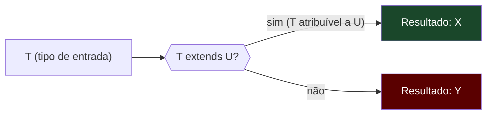
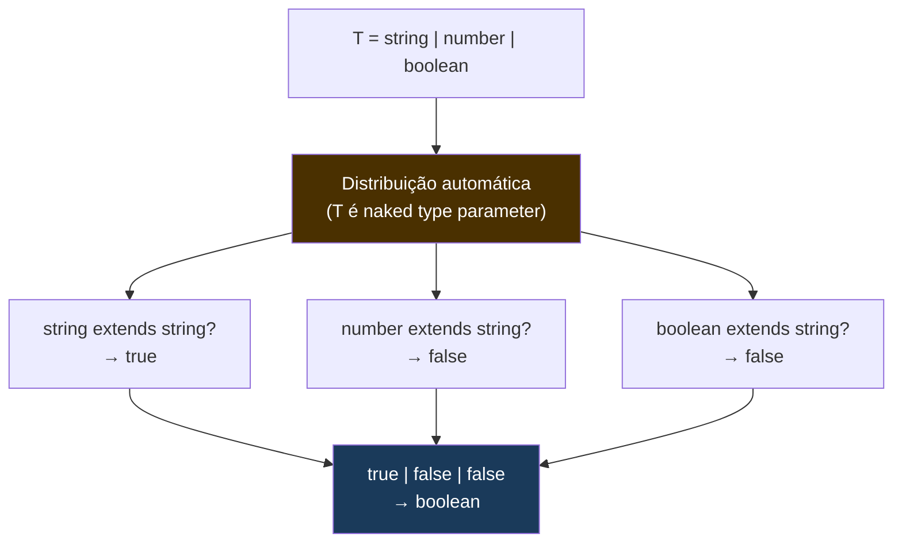
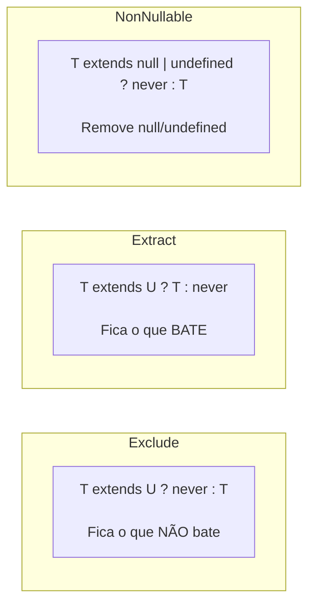
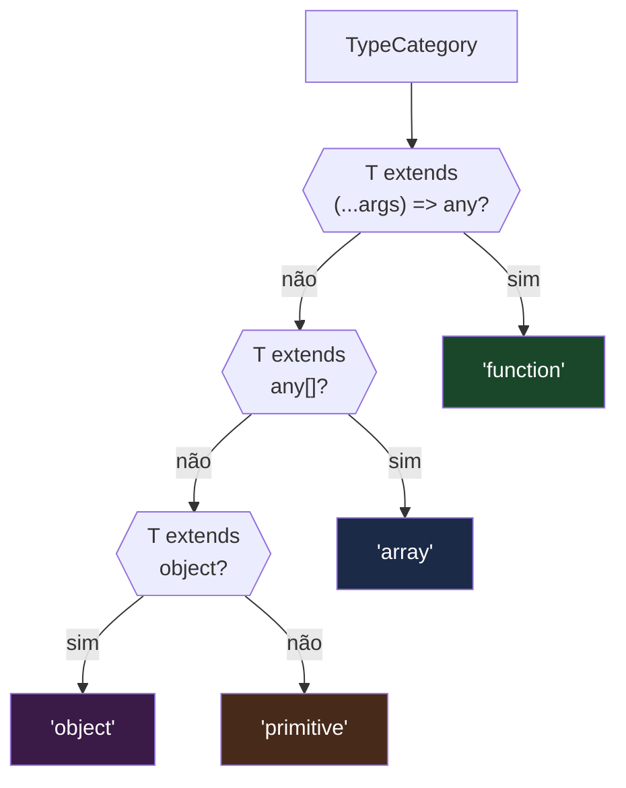
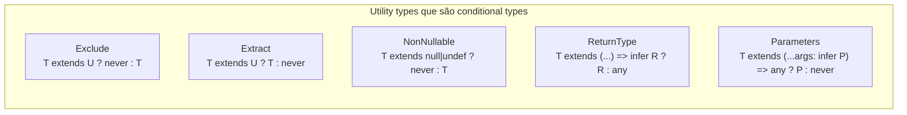

# Conditional types

> [!abstract] TL;DR
> Um **conditional type** é um tipo que depende de outro tipo — a sintaxe é `T extends U ? X : Y`, e ela funciona exatamente como um if/else, mas no nível dos tipos, em tempo de compilação. O TypeScript avalia a condição e resolve para `X` ou `Y` dependendo se `T` é atribuível a `U`. A armadilha que pega todo mundo é a **distribuição**: quando `T` é uma union, o TypeScript distribui a condicional sobre cada membro da union separadamente — `(A | B) extends U ? X : Y` vira `(A extends U ? X : Y) | (B extends U ? X : Y)`. Isso habilita padrões poderosos como `Exclude` e `Extract`, mas também produz resultados contraintuitivos até você internalizar a regra. E quando quiser suprimir a distribuição, basta embrulhar: `[T] extends [U]`.

---

## O ternário que vive nos tipos

Todo programador conhece o operador ternário: `condition ? valueA : valueB`. Você avalia uma condição em tempo de execução e escolhe um valor com base nela.

Conditional types são exatamente isso — só que a condição é avaliada em tempo de compilação, o resultado é um tipo (não um valor), e a "condição" é uma pergunta sobre a estrutura de tipos: *"T é atribuível a U?"*

```ts
type IsString<T> = T extends string ? true : false;

type A = IsString<"hello">;   // true
type B = IsString<42>;        // false
type C = IsString<string>;    // true
type D = IsString<string | number>;  // boolean  ← surpresa? volto aqui
```

A leitura de `T extends U ? X : Y` é: *"Se T for atribuível a U, o tipo resultante é X; senão, é Y."* Note que `extends` aqui não significa herança de classe — significa a mesma coisa que significa em constraints de generics (nota [[11 - Generics - funções e constraints]]): compatibilidade estrutural. `string extends string | number` é verdadeiro porque todo `string` é atribuível a `string | number`.



Mas conditional types se tornam realmente interessantes quando `T` é um parâmetro de tipo genérico — porque aí o TypeScript não conhece `T` na hora em que você escreve o tipo. Ele adia a avaliação para quando o tipo for instanciado:

```ts
// Em contexto genérico, a avaliação é ADIADA
type Wrap<T> = T extends string ? { value: string } : { value: T };

type W1 = Wrap<string>;  // { value: string }
type W2 = Wrap<number>;  // { value: number }
type W3 = Wrap<boolean>; // { value: boolean }
```

Quando `T` é um tipo concreto, o TypeScript resolve na hora. Quando é um parâmetro genérico livre, o tipo permanece na forma `T extends U ? X : Y` até que `T` seja substituído por um tipo concreto.

---

## O comportamento que confunde todo mundo: distributive conditional types

Aqui mora o susto que pega até devs experientes.

Quando você aplica um conditional type a uma **union**, e o tipo que está sendo testado é um **parâmetro de tipo genérico nu** (ou seja, não embrulhado em `[]` nem em outro tipo), o TypeScript **distribui** a condicional sobre cada membro da union separadamente, e reúne os resultados numa nova union.

Formalmente: `(A | B | C) extends U ? X : Y` se comporta como `(A extends U ? X : Y) | (B extends U ? X : Y) | (C extends U ? X : Y)`.

```ts
type ToArray<T> = T extends any ? T[] : never;

// O que você talvez esperasse:
// ToArray<string | number> → (string | number)[]

// O que você realmente recebe:
type Mixed = ToArray<string | number>;
//   ↳ (string extends any ? string[] : never) | (number extends any ? number[] : never)
//   ↳ string[] | number[]
// Não é (string | number)[]!
```

Esse comportamento não é um bug — é uma feature deliberada que torna possível implementar `Exclude`, `Extract`, `NonNullable` e vários outros utility types.



A regra de ouro da distribuição:

> A distribuição ocorre quando **todas** essas condições são verdadeiras:
> 1. O conditional type é genérico — `type Foo<T> = T extends ...`
> 2. O tipo sendo testado é um **naked type parameter** — `T` diretamente, não `T[]`, não `{ a: T }`, não `[T]`
> 3. O tipo concreto passado é uma **union**

Quando as três condições se combinam, a distribuição acontece automaticamente.

---

## Padrões clássicos habilitados pela distribuição

### `Exclude` — remover membros de uma union

`Exclude<T, U>` remove de `T` todos os membros que são atribuíveis a `U`. A implementação usa exatamente a distribuição:

```ts
// Como o TypeScript implementa Exclude internamente
type Exclude<T, U> = T extends U ? never : T;

// Funcionamento passo a passo:
type Resultado = Exclude<"a" | "b" | "c", "a" | "b">;
// Distribuição:
// ("a" extends "a" | "b" ? never : "a")   → never
// ("b" extends "a" | "b" ? never : "b")   → never
// ("c" extends "a" | "b" ? never : "c")   → "c"
// Reunir: never | never | "c"  → "c"

type SemAeB = Exclude<"a" | "b" | "c", "a" | "b">;  // "c"
type SemNumero = Exclude<string | number | boolean, number>;  // string | boolean
```

O truque está em `never`: numa union, `never` desaparece. `string | never` é apenas `string`. Então o padrão `T extends U ? never : T` filtra: os membros que atendem à condição viram `never` (somem), os que não atendem retornam `T` (ficam). O `never` é a *tesoura* que poda a union.

### `NonNullable` — remover null e undefined

```ts
// Implementação interna
type NonNullable<T> = T extends null | undefined ? never : T;

type SemNull = NonNullable<string | null | undefined | number>;
// → string | number
```

### `Extract` — manter só o que bate

```ts
// Implementação interna — o inverso de Exclude
type Extract<T, U> = T extends U ? T : never;

type ApenasStrings = Extract<string | number | boolean, string | number>;
// → string | number
```



---

## Suprimindo a distribuição: `[T] extends [U]`

Às vezes você quer perguntar sobre a union como um todo — não distribuir sobre seus membros. O TypeScript tem uma saída simples: **embrulhar ambos os lados em tupla de um elemento**.

```ts
// COM distribuição (naked T)
type IsNever<T> = T extends never ? true : false;

type R1 = IsNever<never>;  // never  ← WAT?
// Quando T = never, a union vazia distribui para never — sem nenhum membro para avaliar

// SEM distribuição (T embrulhado)
type IsNeverSafe<T> = [T] extends [never] ? true : false;

type R2 = IsNeverSafe<never>;   // true  ← correto
type R3 = IsNeverSafe<string>;  // false ← correto
```

O caso do `IsNever` com distribuição é particularmente traiçoeiro: `never` é a union vazia (zero membros), então quando você distribui sobre `never`, não há membro algum para avaliar — o resultado é `never`, não `true`. Embrulhar em tupla suprime a distribuição e torna a pergunta "a union inteira é assignable a never?" — aí você recebe `true`.

```ts
// Outro caso: testar se T é exatamente string (não uma union)
type IsExactlyString<T> = [T] extends [string]
    ? [string] extends [T]
        ? true
        : false
    : false;

type E1 = IsExactlyString<string>;          // true
type E2 = IsExactlyString<"literal">;       // false  — "literal" extends string, mas string não extends "literal"
type E3 = IsExactlyString<string | number>; // false
```

A intuição: `[T] extends [U]` é uma pergunta sobre a **identidade** do tipo, não sobre seus membros individuais.

---

## Exemplo trabalhado: `Flatten` e `IsArray`

Vamos construir dois tipos condicionais úteis do zero para consolidar o raciocínio.

### `Flatten` — extrair o elemento de um array, ou retornar o tipo intacto

```ts
// Se T é um array de alguma coisa, retorna essa coisa; senão, retorna T
type Flatten<T> = T extends Array<infer E> ? E : T;

type F1 = Flatten<string[]>;          // string
type F2 = Flatten<number[]>;          // number
type F3 = Flatten<string>;            // string  — não é array, retorna intacto
type F4 = Flatten<(string | number)[]>; // string | number

// Note: infer será explorado na nota 14 — aqui só observe o padrão
```

O `infer E` é a parte que extrai o tipo do elemento do array. É como perguntar: *"Se T for `Array<algo>`, qual é esse algo?"* Quando a condição bate, `E` é ligado ao tipo do elemento, e `E` pode ser usado no ramo "então". Isso é uma prévia da nota [[14 - infer e extração de tipos]] — o próximo passo natural após entender condicionais.

### `IsArray` — booleano em nível de tipo

```ts
type IsArray<T> = T extends readonly any[] ? true : false;

type I1 = IsArray<string[]>;          // true
type I2 = IsArray<readonly number[]>; // true  — readonly array também é array
type I3 = IsArray<string>;            // false
type I4 = IsArray<[string, number]>;  // true  — tupla também é array

// Com union — observe a distribuição:
type I5 = IsArray<string | number[]>;
// → (string extends readonly any[] ? true : false) | (number[] extends readonly any[] ? true : false)
// → false | true
// → boolean
```

`I5` virar `boolean` é a distribuição em ação: quando a union tem membros que passam e membros que não passam na condição, você recebe `true | false`, que simplifica para `boolean`. Isso geralmente indica que a pergunta "é array?" não tem resposta única para aquele tipo — o que faz sentido, porque `string | number[]` pode ser qualquer um dos dois em runtime.

### `NonNullish` — versão mais estrita de NonNullable

```ts
// Remove null, undefined, e também "" e 0 (valores falsy de tipo)
// (apenas null e undefined — os únicos que o TypeScript modela como tipos distintos)
type NonNullish<T> = T extends null | undefined ? never : T;

// Variante que também remove literais falsy conhecidos:
type StrictNonFalsy<T> = T extends null | undefined | false | 0 | "" ? never : T;

type S1 = StrictNonFalsy<string | null | 0 | false>;  // string
type S2 = StrictNonFalsy<number | undefined | "">;     // number
```

---

## Condicionais aninhadas

Você pode aninhar condicionais para cobrir múltiplas possibilidades — é o equivalente de um `if/else if/else` no nível de tipos.

```ts
// Classificar um tipo em uma de três categorias
type Classify<T> =
    T extends string ? "string"  :
    T extends number ? "number"  :
    T extends boolean ? "boolean" :
    "outro";

type C1 = Classify<string>;   // "string"
type C2 = Classify<42>;       // "number"
type C3 = Classify<boolean>;  // "boolean"
type C4 = Classify<object>;   // "outro"

// Mais útil: classificar tipos de função vs. array vs. objeto vs. primitivo
type TypeCategory<T> =
    T extends (...args: any[]) => any ? "function" :
    T extends any[]                   ? "array"    :
    T extends object                  ? "object"   :
    "primitive";

type TC1 = TypeCategory<() => void>;  // "function"
type TC2 = TypeCategory<string[]>;    // "array"
type TC3 = TypeCategory<{ a: 1 }>;   // "object"
type TC4 = TypeCategory<string>;      // "primitive"
```

> [!warning] Ordem importa
> Em condicionais aninhadas, as verificações mais específicas devem vir primeiro. `T extends object` captura funções, arrays e objetos — se vier antes de `T extends (...args: any[]) => any`, as funções cairiam em "object". A mesma lógica de um `if/else if` em código normal: do mais específico para o mais geral.



---

## Um uso real: `PromiseValue`

No dia a dia, conditional types aparecem em utility types que operam sobre funções e promessas. Aqui um exemplo antes de `infer` ser introduzido formalmente — apenas para mostrar o padrão:

```ts
// Extrair o tipo resolvido de uma Promise (versão simples, sem recursão)
type PromiseValue<T> = T extends Promise<infer V> ? V : T;

type P1 = PromiseValue<Promise<string>>;          // string
type P2 = PromiseValue<Promise<User>>;            // User
type P3 = PromiseValue<string>;                   // string (não é Promise, retorna T)

// Aplicação prática: tipar o resultado de uma função async sem chamar ela
async function fetchUser(id: string): Promise<User> {
    return fetch(`/api/users/${id}`).then(r => r.json());
}

// Sem conditional type, você precisaria declarar User manualmente
// Com conditional type, você deriva do tipo da função:
type FetchResult = PromiseValue<ReturnType<typeof fetchUser>>;  // User
```

> [!tip] `infer` é o próximo passo
> O `infer V` dentro do conditional type é o operador que "captura" um tipo de dentro de outro. Ele aparece aqui como prévia — a nota [[14 - infer e extração de tipos]] explora em profundidade como usar `infer` para extrair tipos de funções, arrays, promises, e como reconstruir `ReturnType`, `Parameters` e `Awaited` do zero. Conditional types sem `infer` já são úteis; com `infer`, eles se tornam uma ferramenta completa de introspecção de tipos.

---

## A conexão com utility types prontos

Muitos dos utility types que você já usa são conditional types por baixo do capô. A nota [[18 - Utility types - e como reconstruí-los]] vai implementar todos do zero — mas já é útil reconhecer o padrão agora:

```ts
// Esses são os tipos EXATOS definidos na lib do TypeScript:
type Exclude<T, U>     = T extends U ? never : T;
type Extract<T, U>     = T extends U ? T : never;
type NonNullable<T>    = T extends null | undefined ? never : T;

// ReturnType usa infer — prévia da nota 14:
type ReturnType<T extends (...args: any) => any>
    = T extends (...args: any) => infer R ? R : any;

// Parameters também:
type Parameters<T extends (...args: any) => any>
    = T extends (...args: infer P) => any ? P : never;
```

Quando você escreve `Exclude<Status, "error">`, o TypeScript está distribuindo um conditional type sobre os membros de `Status` e filtrando os que batem em `"error"`. Não há mágica — apenas a mecânica que vimos aqui.



---

## Como explicar em inglês

A **conditional type** in TypeScript is a type that depends on another type, using the syntax `T extends U ? X : Y`. Think of it as a compile-time ternary: if `T` is assignable to `U`, the resulting type is `X`; otherwise it's `Y`. The check is structural — `extends` here means assignability, not class inheritance.

The behavior that trips everyone up is **distributivity**: when you apply a conditional type to a union type, and the checked type is a naked type parameter, TypeScript distributes the conditional over each member of the union separately and reunites the results. `(A | B) extends U ? X : Y` expands to `(A extends U ? X : Y) | (B extends U ? X : Y)`. This is how `Exclude<T, U>` works: it distributes `T extends U ? never : T` over each union member, and members that match become `never` — which collapses out of unions, effectively filtering them out.

When you want to test the union as a whole — not distribute — you wrap both sides in a one-element tuple: `[T] extends [U]`. This is the canonical pattern for `IsNever<T>`, which doesn't work correctly without the wrapping.

The practical upshot: conditional types let you write types that branch based on the shape of their inputs. Combined with `infer` (next note), they become the foundation of type-level introspection.

### Vocabulário-chave

| Português | Inglês |
|---|---|
| tipo condicional | conditional type |
| distribuição automática | distributive conditional type / distribution |
| parâmetro de tipo nu | naked type parameter |
| suprimir distribuição | suppress distribution / non-distributive conditional |
| tipo atribuível a | type assignable to |
| ramificação em nível de tipo | type-level branching |
| avaliação adiada | deferred evaluation |
| instanciação do tipo | type instantiation |
| extrair tipo de | infer (type from) / extract type from |
| filtrar union | filter a union |

---

## Armadilhas comuns

> [!warning] Armadilha 1: `IsNever<never>` retorna `never` com distribuição
> Quando `T = never` e você usa distribuição (`T extends never ? true : false`), o resultado é `never`, não `true`. A union vazia (`never`) não tem membros para distribuir — o mapeamento resulta em `never`. Solução: sempre use `[T] extends [never]` para testar `never`.
> ```ts
> // Errado
> type IsNever<T>    = T extends never ? true : false;
> type R1 = IsNever<never>;     // never  ← errado
>
> // Correto
> type IsNeverSafe<T> = [T] extends [never] ? true : false;
> type R2 = IsNeverSafe<never>; // true   ← correto
> ```

> [!warning] Armadilha 2: distribuição inesperada com `IsString` e union
> `IsString<string | number>` retorna `boolean`, não `false`. Porque distribui: `string extends string` → `true`, `number extends string` → `false`. Resultado: `true | false` → `boolean`. Se você quer testar se a union inteira é string, use `[T] extends [string]`.
> ```ts
> type IsString<T> = T extends string ? true : false;
> type R = IsString<string | number>;  // boolean  — surpreende
>
> type IsAllString<T> = [T] extends [string] ? true : false;
> type R2 = IsAllString<string | number>;  // false  — correto
> ```

> [!warning] Armadilha 3: condicionais sobre tipos genéricos em classes permanecem não-resolvidas
> Dentro de um corpo de classe ou função genérica, um conditional type sobre um parâmetro de tipo livre não é resolvido — ele permanece na forma `T extends U ? X : Y`. Você não pode fazer `if (resultado === true)` em runtime para um valor de tipo condicional. Tipos vivem no compile time; condicionais apenas mudam o tipo, não produzem valores.
> ```ts
> function processar<T>(valor: T): T extends string ? string[] : number[] {
>     // ERRO: não dá pra implementar assim
>     // O tipo de retorno é condicional, mas em runtime você precisa de um valor concreto
>     if (typeof valor === "string") {
>         return (valor as string).split("") as any; // precisa de `as any` ou overloads
>     }
>     return [42] as any;
> }
> ```
> Quando você precisa implementar uma função com retorno condicional, use overloads de assinatura (nota [[10 - Tipando funções - assinaturas, overloads, contextual typing]]) ou `as`.

> [!warning] Armadilha 4: ordem das verificações em condicionais aninhadas
> Verificar `T extends object` antes de `T extends (...args: any[]) => any` captura funções em "object" — porque funções são objetos em JavaScript, e o TypeScript respeita essa relação. Sempre coloque as verificações mais específicas primeiro.

> [!warning] Armadilha 5: confundir `extends` condicional com `extends` de constraint
> Em `type Foo<T extends string>`, o `extends` é uma constraint — `T` deve ser atribuível a `string` na hora de usar `Foo`. Em `T extends string ? X : Y`, o `extends` é uma pergunta — "T é atribuível a string?" sem rejeitar tipos que não são. São usos distintos da mesma palavra-chave.

---

## Veja também

- [[11 - Generics - funções e constraints]] — `extends` em constraints vs. `extends` em condicionais; a nota pressuposta aqui
- [[14 - infer e extração de tipos]] — o próximo passo natural: `infer` dentro de condicionais para extrair tipos de funções, arrays e promises
- [[18 - Utility types - e como reconstruí-los]] — onde `Exclude`, `Extract`, `NonNullable`, `ReturnType` e `Parameters` são reconstruídos do zero a partir de mapped + conditional types
- [[03-Dominios/Ciência/Compiladores e Linguagens/01 - O que é um compilador e o pipeline de tradução|Compiladores e tradução]] — o TypeScript avalia condicionais em tempo de compilação (fase semântica); entender o pipeline de compilação contextualiza por que tipos somem em runtime
