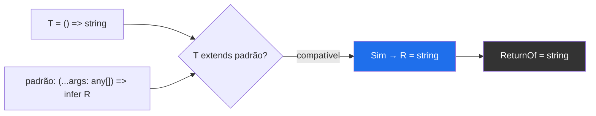
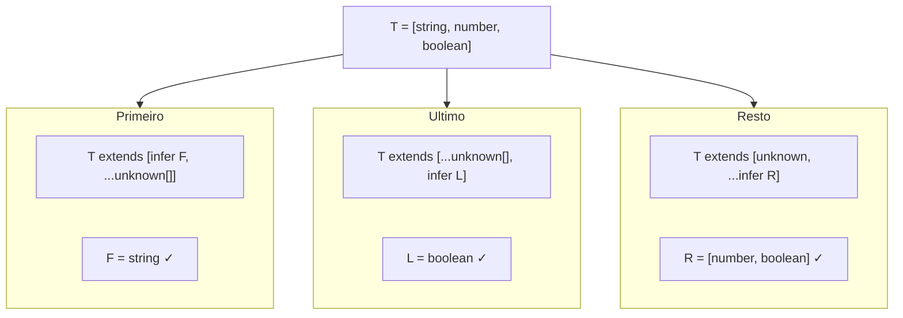
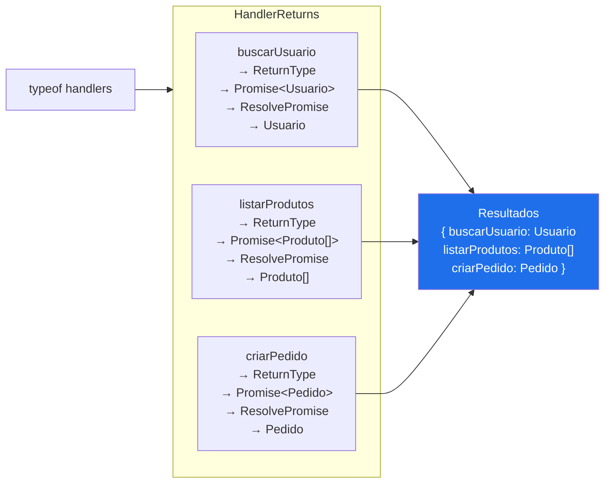

# infer e extração de tipos

> [!abstract] TL;DR
> `infer` é o mecanismo de **captura de variáveis de tipo** dentro de conditional types. Onde um conditional type pergunta "esse tipo satisfaz esse padrão?", `infer` complementa: "e, se satisfaz, qual é essa parte específica do padrão?" O resultado é uma variável de tipo disponível no branch `true`. Com isso você consegue desmontar qualquer tipo composto — funções, arrays, tuplas, promises, objetos — e extrair só a parte que importa. É o pattern matching do sistema de tipos do TypeScript.

---

## O que é pattern matching no nível de tipos

Na nota [[13 - Conditional types]] você viu que `T extends U ? A : B` é essencialmente uma pergunta: "o tipo `T` é compatível com a forma `U`?" O TypeScript responde `A` ou `B` dependendo da resposta.

O problema é que você sabe que `T` "cabe" em `U`, mas não tem acesso às partes de `U` que variaram para acomodar `T`. Por exemplo: se `T` é uma função, você sabe que `T extends Function` é verdade, mas como extrair o tipo de retorno dessa função?

`infer` resolve exatamente isso. Dentro do padrão `U`, você coloca `infer X` no lugar de qualquer sub-tipo que queira capturar. Se `T` é compatível com o padrão, `X` recebe exatamente o sub-tipo que "preencheu" aquela posição.

```ts
// Pergunta sem infer: "T é uma função?"
type IsFn<T> = T extends (...args: any[]) => any ? true : false;

// Pergunta com infer: "T é uma função? Se sim, qual é o tipo de retorno?"
type ReturnOf<T> = T extends (...args: any[]) => infer R ? R : never;
//                                               ^^^^^^
//                                               Captura o tipo de retorno em R
```

O `infer R` só é válido dentro de um conditional type. Você não pode escrever `infer R` solto — ele é uma instrução ao compilador: "quando você for checar se `T extends (...args: any[]) => ?`, capture o que vai onde está o `?` e chame de `R`".



---

## Extraindo tipos de funções

### Tipo de retorno

O caso de uso mais clássico: dado o tipo de uma função, qual é o tipo que ela retorna?

```ts
type ReturnOf<T> = T extends (...args: any[]) => infer R ? R : never;

// Exemplos
type R1 = ReturnOf<() => string>;              // string
type R2 = ReturnOf<(x: number) => boolean>;    // boolean
type R3 = ReturnOf<() => Promise<User>>;       // Promise<User> — não resolve a Promise
type R4 = ReturnOf<typeof JSON.parse>;         // any
type R5 = ReturnOf<string>;                    // never — string não é função
```

> [!note] Esse tipo já existe na stdlib
> `ReturnType<T>` da biblioteca padrão do TypeScript faz exatamente isso. A definição interna é quase idêntica ao nosso `ReturnOf`. Construir do zero é o melhor jeito de entender como funciona antes de ver o atalho pronto — ver [[18 - Utility types - e como reconstruí-los]].

### Parâmetros da função

Agora o outro lado: extrair os tipos dos parâmetros como tupla.

```ts
type ParamsOf<T> = T extends (...args: infer P) => any ? P : never;
//                                         ^^^^^^
//                                         Captura a tupla de parâmetros em P

type P1 = ParamsOf<(a: string, b: number) => void>;   // [a: string, b: number]
type P2 = ParamsOf<() => void>;                        // []
type P3 = ParamsOf<(id: number, options?: { timeout: number }) => Promise<User>>;
//        [id: number, options?: { timeout: number } | undefined]
```

O `...args: infer P` captura todos os parâmetros como uma tupla nomeada. Isso é poderoso porque você pode então acessar partes específicas com indexed access:

```ts
// Extrair só o primeiro parâmetro
type FirstParam<T> = T extends (first: infer F, ...rest: any[]) => any ? F : never;

type F1 = FirstParam<(id: string, name: string) => void>; // string
type F2 = FirstParam<(e: MouseEvent) => void>;             // MouseEvent
```

### Exemplo real: criar um decorator de logging genérico

```ts
// Queremos logar chamadas de qualquer função sem perder a tipagem
type AnyFunction = (...args: any[]) => any;

type ParamsOf<T extends AnyFunction> = T extends (...args: infer P) => any ? P : never;
type ReturnOf<T extends AnyFunction> = T extends (...args: any[]) => infer R ? R : never;

function withLogging<T extends AnyFunction>(
    fn: T,
    nome: string
): (...args: ParamsOf<T>) => ReturnOf<T> {
    return (...args: ParamsOf<T>) => {
        console.log(`[${nome}] chamando com`, args);
        const resultado = fn(...args);
        console.log(`[${nome}] retornou`, resultado);
        return resultado;
    };
}

function calcularDesconto(preco: number, percentual: number): number {
    return preco * (1 - percentual / 100);
}

const calcComLog = withLogging(calcularDesconto, "calcularDesconto");
// tipo: (preco: number, percentual: number) => number — idêntico ao original
const desconto = calcComLog(100, 20); // number — sem perder a tipagem
```

O compilador infere `T = typeof calcularDesconto`, depois resolve `ParamsOf<T>` como `[preco: number, percentual: number]` e `ReturnOf<T>` como `number`. O wrapper tem assinatura idêntica à função original — tudo na compile time.

---

## Extraindo tipos de arrays e tuplas

### Elemento de array

```ts
type ElementoDeArray<T> = T extends (infer E)[] ? E : never;
//                                   ^^^^^^
//                                   Captura o tipo do elemento em E

type E1 = ElementoDeArray<string[]>;           // string
type E2 = ElementoDeArray<number[]>;           // number
type E3 = ElementoDeArray<Array<boolean>>;     // boolean
type E4 = ElementoDeArray<(string | number)[]>; // string | number
type E5 = ElementoDeArray<string>;             // never — string não é array
```

Há uma versão mais robusta que funciona também com `ReadonlyArray`:

```ts
type Elemento<T> = T extends readonly (infer E)[] ? E : never;

type E6 = Elemento<readonly string[]>;      // string
type E7 = Elemento<Readonly<number[]>>;     // number
type E8 = Elemento<[string, number]>;       // string | number — tupla vira union!
```

> [!tip] Tuplas são arrays — com um detalhe
> `[string, number]` é compatível com `readonly (infer E)[]`, e o TypeScript infere `E = string | number`. Quando o padrão é genérico o suficiente, perde-se a informação posicional. Para extrair elementos em posições específicas, use indexed access: `T[0]`, `T[1]`. Use `infer` quando quiser o tipo de "qualquer elemento", não de um elemento específico.

### Primeiro e último elemento de tupla

Com infer em posição específica dentro de uma tupla:

```ts
// Primeiro elemento
type Primeiro<T extends readonly unknown[]> =
    T extends readonly [infer F, ...unknown[]] ? F : never;

// Último elemento  
type Ultimo<T extends readonly unknown[]> =
    T extends readonly [...unknown[], infer L] ? L : never;

// Tupla sem o primeiro elemento (tail)
type Resto<T extends readonly unknown[]> =
    T extends readonly [unknown, ...infer R] ? R : [];

type P = Primeiro<[string, number, boolean]>;  // string
type L = Ultimo<[string, number, boolean]>;    // boolean
type R = Resto<[string, number, boolean]>;     // [number, boolean]
type P2 = Primeiro<[]>;                        // never
```



---

## Extraindo o valor de uma Promise

Promises são o caso de uso mais frequente de `infer` no dia a dia — especialmente ao lidar com funções assíncronas.

### `Awaited` básico: um nível

```ts
// Remove um nível de Promise
type AwaitedOnce<T> = T extends Promise<infer U> ? U : T;

type A1 = AwaitedOnce<Promise<string>>;          // string
type A2 = AwaitedOnce<Promise<User>>;            // User
type A3 = AwaitedOnce<Promise<Promise<number>>>; // Promise<number> — só um nível
type A4 = AwaitedOnce<string>;                   // string — passa direto
```

### `Awaited` recursivo: todos os níveis

Promises aninhadas (`Promise<Promise<T>>`) precisam de recursão:

```ts
// Remove todos os níveis de Promise (recursivo)
type Awaited<T> = T extends Promise<infer U> ? Awaited<U> : T;

type A5 = Awaited<Promise<string>>;                    // string
type A6 = Awaited<Promise<Promise<number>>>;           // number
type A7 = Awaited<Promise<Promise<Promise<boolean>>>>; // boolean
type A8 = Awaited<string>;                             // string — não é Promise
```

> [!warning] Recursão de tipos tem limite
> TypeScript tem um limite de profundidade para tipos recursivos (em torno de 100 níveis). Para o caso de `Awaited`, não é problema na prática — ninguém aninha 100 Promises. Mas para outros tipos recursivos mais ambiciosos, fique atento: o compilador emite `Type instantiation is excessively deep`. Isso é tema da nota [[25 - TypeScript em escala - performance do compilador e project references]].

O `Awaited<T>` exato da stdlib do TypeScript é um pouco mais sofisticado — ele também lida com objetos "thenable" (que têm método `.then` mas não são `Promise` nativa), porque a especificação do `await` do JavaScript funciona com qualquer thenable:

```ts
// Versão simplificada do Awaited da stdlib (TS 4.5+)
type Awaited<T> =
    T extends null | undefined
        ? T
        : T extends object & { then(onfulfilled: infer F, ...args: infer _): any }
            ? F extends (value: infer V, ...args: infer _) => any
                ? Awaited<V>
                : never
            : T;
```

Para fins práticos, a versão com `Promise<infer U>` cobre 99% dos casos.

---

## Múltiplos `infer` no mesmo padrão

Você não está limitado a um único `infer` — pode capturar várias partes ao mesmo tempo.

```ts
// Extrair tipo de entrada e saída de uma função
type IoTypes<T> = T extends (...args: infer P) => infer R
    ? { params: P; return: R }
    : never;

type IO = IoTypes<(nome: string, idade: number) => Promise<User>>;
// { params: [nome: string, idade: number]; return: Promise<User> }

// Extrair primeiro e segundo elementos de uma tupla em uma tacada
type PrimeiroDois<T> = T extends [infer A, infer B, ...unknown[]]
    ? { primeiro: A; segundo: B }
    : never;

type PD = PrimeiroDois<[string, number, boolean, Date]>;
// { primeiro: string; segundo: number }
```

### Dois `infer` no mesmo nome: interseção

Um caso curioso: se você colocar o mesmo nome `infer X` em posições contravariantes (posições de parâmetro de função), o TypeScript resolve para a **interseção** dos tipos capturados — não para a union. Isso raramente é o que você quer, mas é bom entender:

```ts
// Covariante (posição de retorno) → union
type UnionDeRetornos<T> =
    T extends { a: () => infer R; b: () => infer R } ? R : never;

type UR = UnionDeRetornos<{ a: () => string; b: () => number }>;
// string | number

// Contravariante (posição de parâmetro) → intersecção
type InterseccaoDeFuncoes<T> =
    T extends { a: (x: infer P) => void; b: (x: infer P) => void } ? P : never;

type IF = InterseccaoDeFuncoes<{ a: (x: string) => void; b: (x: number) => void }>;
// string & number → never (porque string e number são incompatíveis)
```

Isso deriva diretamente da teoria de variância: posições covariantes produzem union, contravariantes produzem intersecção. Para extrair informação de múltiplas fontes numa union, use `infer` em posição covariante (retorno, não parâmetro).

---

## `infer ... extends`: refinar a captura (TS 4.7+)

No TypeScript 4.7, foi adicionada a sintaxe `infer X extends Constraint`, que restringe o que pode ser capturado e elimina a necessidade de um segundo conditional type para refinar.

```ts
// Sem infer extends — precisa refinar depois
type PrimeiroElementoAntigo<T> =
    T extends [infer F, ...unknown[]]
        ? F extends string  // segundo conditional para refinar
            ? F
            : never
        : never;

// Com infer extends — direto ao ponto
type PrimeiroElemento<T> =
    T extends [infer F extends string, ...unknown[]] ? F : never;
//                          ^^^^^^^^
//                          só captura se o primeiro elemento for string

type PE1 = PrimeiroElemento<[string, number]>;   // string
type PE2 = PrimeiroElemento<["hello", number]>;  // "hello" (literal!)
type PE3 = PrimeiroElemento<[number, string]>;   // never — primeiro não é string
```

`infer X extends Y` faz duas coisas ao mesmo tempo:
1. Captura o tipo na variável `X`
2. Checa se `X extends Y` — se não for, o conditional inteiro resolve para `never`

Isso também é útil para extrair retornos de tipos específicos:

```ts
// Só extrai retorno se for uma string (útil com template literals)
type RetornoString<T> =
    T extends (...args: any[]) => infer R extends string ? R : never;

type RS1 = RetornoString<() => "hello">;          // "hello"
type RS2 = RetornoString<() => string>;            // string
type RS3 = RetornoString<() => number>;            // never
```

---

## Exemplo trabalhado: um extrator real

Vamos construir algo útil do zero: um tipo que extrai as informações de um "handler" assíncrono, como os que você vê em rotas de API (Express, Fastify, tRPC).

**Problema:** dado um objeto com handlers assíncronos, quero extrair um mapa de cada nome de handler para o tipo que sua Promise resolve.

```ts
// Tipos auxiliares
type AnyAsyncFn = (...args: any[]) => Promise<any>;

// Extrai o tipo que a Promise resolve
type ResolvePromise<T> = T extends Promise<infer U> ? U : T;

// Extrai o tipo resolvido do retorno de uma função assíncrona
type AsyncReturnType<T extends AnyAsyncFn> = ResolvePromise<ReturnType<T>>;

// Para um objeto de handlers, mapeia cada chave ao tipo resolvido
type HandlerReturns<T extends Record<string, AnyAsyncFn>> = {
    [K in keyof T]: AsyncReturnType<T[K]>;
};

// --- Uso real ---

interface Usuario { id: string; nome: string; email: string }
interface Produto { id: string; nome: string; preco: number }
interface Pedido { id: string; usuarioId: string; itens: string[] }

const handlers = {
    buscarUsuario: async (id: string): Promise<Usuario> => {
        // ... fetch
        return { id, nome: "Maria", email: "maria@ex.com" };
    },
    listarProdutos: async (): Promise<Produto[]> => {
        return [];
    },
    criarPedido: async (usuarioId: string, itens: string[]): Promise<Pedido> => {
        return { id: "1", usuarioId, itens };
    },
};

// HandlerReturns extrai o tipo resolvido de cada handler:
type Resultados = HandlerReturns<typeof handlers>;
// {
//   buscarUsuario: Usuario;
//   listarProdutos: Produto[];
//   criarPedido: Pedido;
// }
```

Agora podemos usar `Resultados` para tipar qualquer coisa que consuma os retornos desses handlers — um cache, um store, um layer de serialização — sem precisar duplicar as anotações de tipo.



---

## Reconstruindo os utility types da stdlib

Agora que você entende `infer` de dentro pra fora, vale ver como os utility types da biblioteca padrão são implementados — e perceber que não há magia.

```ts
// ReturnType<T> — exatamente como está na lib
type ReturnType<T extends (...args: any) => any> =
    T extends (...args: any) => infer R ? R : any;

// Parameters<T>
type Parameters<T extends (...args: any) => any> =
    T extends (...args: infer P) => any ? P : never;

// Awaited<T> — versão simplificada
type Awaited<T> = T extends Promise<infer U> ? Awaited<U> : T;

// ConstructorParameters<T> — parâmetros do constructor
type ConstructorParameters<T extends abstract new (...args: any) => any> =
    T extends abstract new (...args: infer P) => any ? P : never;

// InstanceType<T> — tipo da instância de uma classe
type InstanceType<T extends abstract new (...args: any) => any> =
    T extends abstract new (...args: any) => infer R ? R : any;
```

Note o `abstract new (...args: any) => any` — esse é o padrão para capturar o tipo de qualquer construtor (incluindo classes abstratas). `infer R` captura o tipo da instância.

> [!tip] A nota [[18 - Utility types - e como reconstruí-los]] reconstrói todos esses do zero, incluindo os que usam mapped types. Esta nota foca nos que dependem de `infer`.

---

## Recursão com `infer` (com cautela)

`infer` dentro de conditional types recursivos é poderoso — e potencialmente caro para o compilador. Um exemplo controlado: achatar um array aninhado de qualquer profundidade.

```ts
// FlatArray<T, Depth> — versão simplificada do Array.prototype.flat tipado
type FlatArray<T, D extends number> =
    D extends 0
        ? T
        : T extends ReadonlyArray<infer Item>
            ? FlatArray<Item, [-1, 0, 1, 2, 3, 4, 5, 6, 7, 8, 9, 10][D]>
            : T;

// Exemplo de uso
type Nested = FlatArray<number[][][], 2>; // number
type Semi = FlatArray<string[][], 1>;      // string
```

O truque com `[-1, 0, 1, 2, 3, 4, 5, 6, 7, 8, 9, 10][D]` é uma forma de decrementar `D` (um número literal) sem aritmética de tipos — você faz um indexed access numa tupla onde o índice é o valor atual de `D`.

Esse padrão — `infer` + recursão — é a fronteira com performance do compilador. Se a recursão for muito profunda ou aplicada a tipos muito grandes, o TypeScript emite erro de profundidade. A regra prática: recursão é OK para profundidades limitadas e conhecidas (achatamento de 2-3 níveis, `Awaited` sobre Promises reais). Evite recursão sobre tipos de input aberto. A nota [[25 - TypeScript em escala - performance do compilador e project references]] cobre as métricas concretas.

---

## Como explicar em inglês

The `infer` keyword is TypeScript's mechanism for **type-level pattern matching**. It only works inside conditional types — `T extends SomePattern<infer X> ? use X here : fallback` — and tells the compiler: "when you check whether `T` matches this pattern, capture whatever fills the `infer X` position into the type variable `X`."

The classic use case is extracting the return type of a function: `T extends (...args: any[]) => infer R ? R : never`. This is literally how `ReturnType<T>` is implemented in the standard library. The same pattern works for function parameters (`...args: infer P`), promise values (`Promise<infer U>`), array elements (`(infer E)[]`), and tuple positions (`[infer First, ...rest]`).

The key mental model: `infer` does for types what destructuring does for values at runtime. You're not just asking "does this type fit?", you're simultaneously asking "and if it does, what's the piece I care about?"

TypeScript 4.7 added `infer X extends Constraint`, which lets you both capture a type and filter it in one step — useful when you only want the captured type if it satisfies an additional constraint.

### Vocabulário-chave

| Português | Inglês |
|---|---|
| captura de variável de tipo | type variable capture |
| extração de tipos | type extraction / type inference |
| pattern matching de tipos | type-level pattern matching |
| tipo de retorno | return type |
| parâmetros da função | function parameters |
| tipo do elemento | element type |
| tipo resolvido da promise | awaited type / unwrapped promise type |
| tipo recursivo | recursive type |
| tipo condicional | conditional type |
| variável de tipo inferida | inferred type variable |
| inferência no ramo verdadeiro | inference in the true branch |
| restrição de captura | infer constraint (`infer X extends Y`) |

---

## Armadilhas comuns

> [!warning] Armadilha 1: `infer` fora de conditional type
> `infer` só é válido dentro do "pattern" de um conditional type — na parte `T extends Padrão`. Usá-lo em outro contexto é erro de compilação.
> ```ts
> // ERRO: 'infer' declarations are only permitted in the 'extends' clause of a conditional type
> type Errado<T> = infer R;
>
> // CORRETO
> type Correto<T> = T extends Promise<infer R> ? R : never;
> ```

> [!warning] Armadilha 2: `infer` com union distributiva
> Quando `T` é uma union, conditional types são aplicados a cada membro separadamente (distributividade). Isso afeta o resultado de `infer`:
> ```ts
> type ReturnOf<T> = T extends (...args: any[]) => infer R ? R : never;
>
> // T é uma union de dois tipos de função
> type Fn = (() => string) | (() => number);
> type R = ReturnOf<Fn>;
> // string | number — distribuiu sobre cada membro, depois fez union dos resultados
>
> // Para evitar distributividade, encapsule T em tupla:
> type ReturnOfExact<T> = [T] extends [(...args: any[]) => infer R] ? R : never;
> type R2 = ReturnOfExact<Fn>;
> // string | number (neste caso o resultado é o mesmo, mas o mecanismo é diferente)
> ```

> [!warning] Armadilha 3: `infer` em posição contravariante produz intersecção
> Quando o mesmo nome `infer X` aparece em múltiplas posições de parâmetro (contravariante), o TypeScript infere a intersecção — não a union. Isso pode surpreender:
> ```ts
> type Contravar<T> = T extends {
>     a: (x: infer P) => void;
>     b: (x: infer P) => void;
> } ? P : never;
>
> type C = Contravar<{ a: (x: string) => void; b: (x: number) => void }>;
> // string & number → never (não string | number como você pode esperar)
> ```

> [!warning] Armadilha 4: tipos de retorno `any` "contaminam" a inferência
> Se a função tem retorno `any` (como `JSON.parse`), `infer R` captura `any`. Isso é correto pelo sistema de tipos, mas pode mascarar problemas:
> ```ts
> type R = ReturnType<typeof JSON.parse>; // any — sem segurança
> // Solução: use Zod ou valide o resultado, não contorne com type assertion
> ```

> [!warning] Armadilha 5: confundir `Awaited` da stdlib com uma versão ingênua
> A versão ingênua `T extends Promise<infer U> ? U : T` só funciona com `Promise` nativa. A stdlib lida com thenables (objetos com `.then`). Na prática, isso raramente importa — mas se você criar a sua versão, saiba que ela não cobre 100% dos casos de `await` do JavaScript.

---

## Veja também

- [[13 - Conditional types]] — a base que `infer` requer: conditional types, distributividade, padrões comuns
- [[18 - Utility types - e como reconstruí-los]] — reconstrói `ReturnType`, `Parameters`, `Awaited` e todos os outros; `infer` está no coração de vários deles
- [[25 - TypeScript em escala - performance do compilador e project references]] — quando `infer` + recursão começa a custar: profundidade de instanciação, `--diagnostics`, project references
