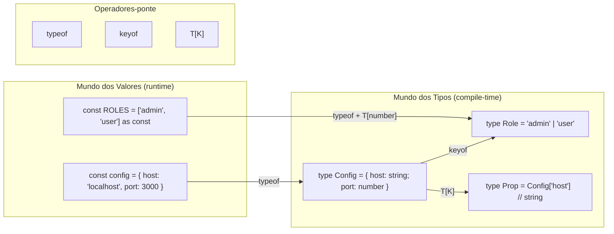
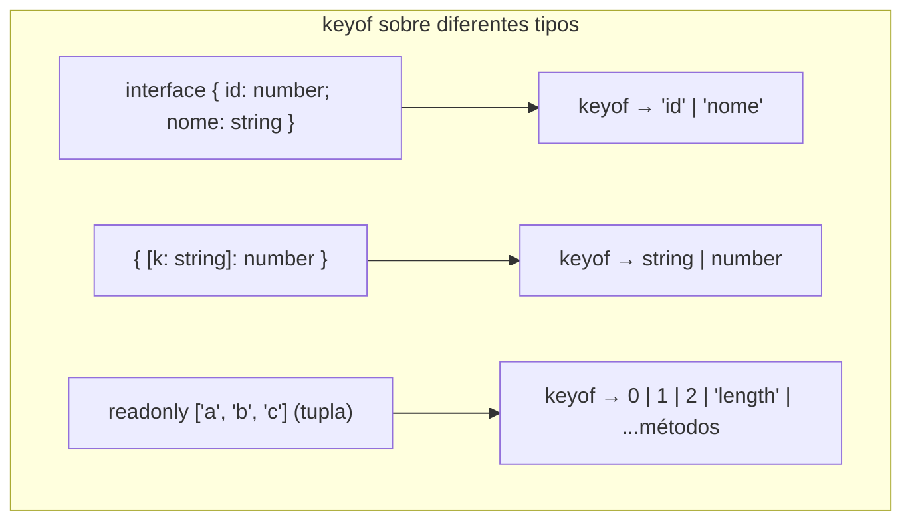
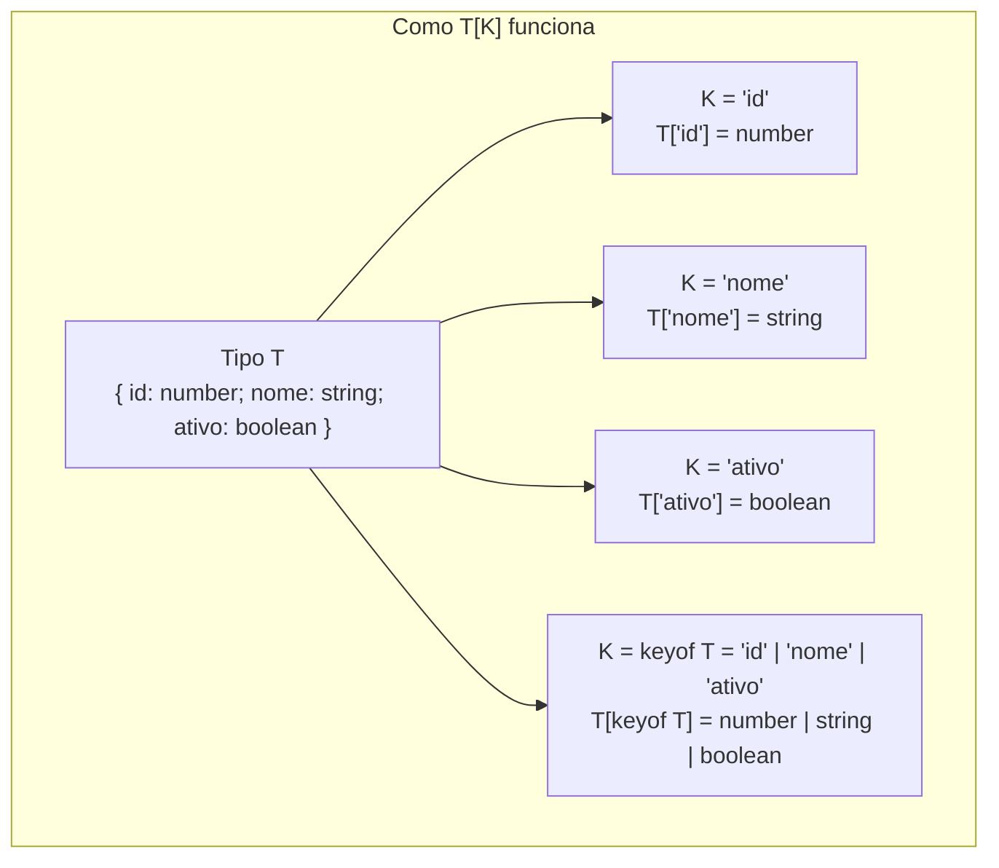
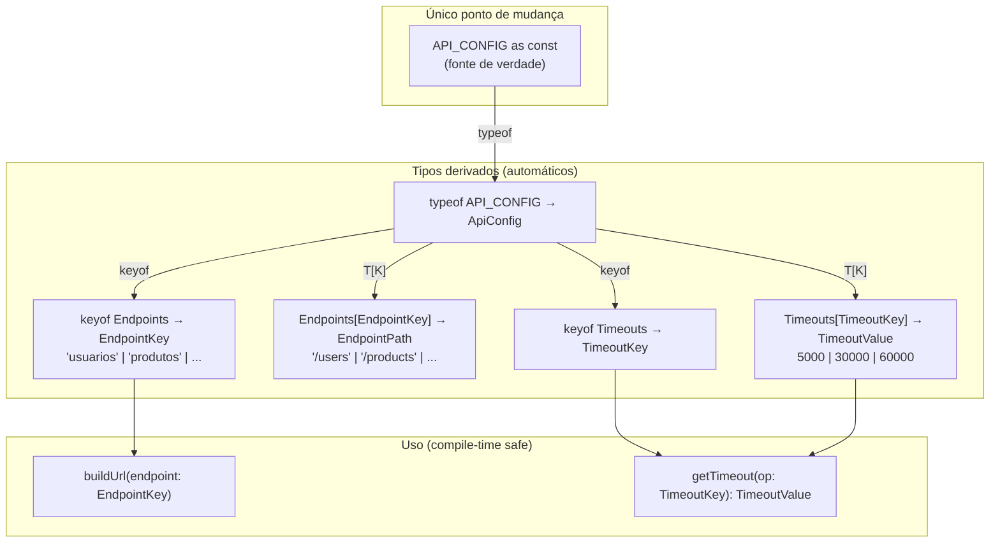

# `keyof`, `typeof` e indexed access types

> [!abstract] TL;DR
> `typeof` no nível de tipos captura o tipo de um valor — de uma variável, função ou objeto `as const` — sem você precisar escrevê-lo à mão. `keyof` transforma as chaves de um tipo em uma union de literais de string. Indexed access types (`T[K]`) extraem o tipo de uma propriedade específica, ou — quando `K` é uma union — a union dos tipos de todas as propriedades em `K`. Juntos, esses três operadores fecham o circuito que a nota [[03 - Arrays, tuplas e as const]] abriu: `as const` + `typeof` + `keyof` + `T[K]` formam a base de toda derivação de tipos a partir de dados reais — sem duplicação, sem dessincronia.

---

## O problema: dois mundos que precisam se falar

TypeScript vive numa dualidade permanente. Há o mundo dos **valores** — variáveis, objetos, funções, dados que existem em runtime e que o JavaScript vê. E há o mundo dos **tipos** — anotações, interfaces, aliases, que o compilador apaga antes de gerar o JS.

Em Java ou C#, essa separação é rígida por design. Em TypeScript, ela é permeável — e é exatamente essa permeabilidade que torna o sistema de tipos tão expressivo. Os três operadores desta nota são as pontes que cruzam essa fronteira:

```
Mundo dos Valores          Mundo dos Tipos
─────────────────          ───────────────
const config = { ... }  ──typeof──►  type Config = { ... }
interface User { ... }  ◄──keyof──►  type UserKey = 'id' | 'name' | ...
type User; key: K       ──T[K]──►    type do valor em User[K]
```

Sem essas pontes, você seria forçado a escrever o mesmo conhecimento duas vezes — uma vez no dado, outra na anotação de tipo — e torceria para nunca esquecer de atualizar os dois.



> [!info] Leitura do diagrama
> `typeof` atravessa da esquerda para a direita: pega um valor e devolve seu tipo. `keyof` opera inteiramente no mundo dos tipos. `T[K]` também: recebe um tipo e uma chave (ou union de chaves) e devolve o tipo da propriedade correspondente.

---

## `typeof` no nível de tipos: capturar sem repetir

O `typeof` tem dois significados em TypeScript, e confundi-los é uma armadilha recorrente. Em **expressões** (código que roda), `typeof` é o operador JavaScript de sempre — retorna uma string como `'string'`, `'number'`, `'object'`. Em **posições de tipo** (depois de `type X =`, `function f(): `, etc.), `typeof` é o operador de tipo do TypeScript — captura o tipo estático de um valor.

```ts
// typeof em expressão — JavaScript puro, retorna string em runtime
const x = 42;
console.log(typeof x); // 'number' (string, em runtime)

// typeof em posição de tipo — TypeScript, captura o tipo estático
type TipoDeX = typeof x; // number (tipo, em compile-time)
```

O compilador distingue os dois contextos automaticamente. Quando você escreve `type T = typeof algo`, você está no mundo dos tipos. Quando escreve `if (typeof algo === 'string')`, você está no mundo das expressões. Nunca há ambiguidade — a posição determina o significado.

### Capturar o tipo de um objeto simples

```ts
// Sem typeof: você escreve o tipo à mão e fica dependente de manter dois artefatos sincronizados
const defaultConfig = {
  host: 'localhost',
  port: 3000,
  ssl: false,
};

// Opção 1 — tipo manual (frágil: pode desincronizar)
type Config = {
  host: string;
  port: number;
  ssl: boolean;
};

// Opção 2 — tipo derivado com typeof (robusto: sempre sincronizado)
type Config = typeof defaultConfig;
// { host: string; port: number; ssl: boolean }
```

Agora, se você adicionar uma propriedade a `defaultConfig`, `Config` se atualiza automaticamente. A fonte de verdade é o valor — o tipo é uma consequência dele.

### Capturar o tipo de uma função

`typeof` funciona igualmente bem com funções, capturando a assinatura completa:

```ts
function criarUsuario(nome: string, idade: number) {
  return { id: Math.random(), nome, idade, criadoEm: new Date() };
}

type CriarUsuarioFn = typeof criarUsuario;
// (nome: string, idade: number) => { id: number; nome: string; idade: number; criadoEm: Date }

// Extrair só o tipo de retorno (usando utility type ReturnType — nota 18)
type Usuario = ReturnType<typeof criarUsuario>;
// { id: number; nome: string; idade: number; criadoEm: Date }
```

Isso é especialmente valioso em código legado sem anotações explícitas: você pode derivar tipos de funções existentes em vez de duplicá-los.

### `typeof` + `as const`: a combinação canônica

Como a nota [[03 - Arrays, tuplas e as const]] estabeleceu, `as const` congela literais. `typeof` então captura o tipo congelado — com todos os literais preservados:

```ts
const ENDPOINTS = {
  users:   '/api/users',
  posts:   '/api/posts',
  profile: '/api/profile',
} as const;

// Sem as const: typeof ENDPOINTS = { users: string; posts: string; profile: string }
// Com as const:
type Endpoints = typeof ENDPOINTS;
// {
//   readonly users:   '/api/users';
//   readonly posts:   '/api/posts';
//   readonly profile: '/api/profile';
// }
```

A diferença é fundamental: sem `as const`, os valores são ampliados para `string` e você perde a precisão dos literais. Com `as const`, `typeof` captura `'/api/users'` — e não só `string`. Esse detalhe é o que permite validação precisa em compile-time.

---

## `keyof`: a union das chaves

`keyof T` produz uma union dos tipos das chaves públicas de `T`. Para a maioria dos objetos, as chaves são strings — então `keyof T` vira uma union de string literals. Mas para arrays, `keyof` inclui os índices numéricos e os métodos do prototype, o que raramente é o que você quer.

```ts
interface Usuario {
  id:     number;
  nome:   string;
  email:  string;
  ativo:  boolean;
}

type ChavesDeUsuario = keyof Usuario;
// 'id' | 'nome' | 'email' | 'ativo'
```

A union resultante é exaustiva: se você adicionar uma propriedade a `Usuario`, `ChavesDeUsuario` automaticamente a inclui. Não há forma de a union ficar defasada — ela é calculada pelo compilador a cada verificação de tipo.

### O getter genérico: o exemplo canônico de `keyof`

O caso de uso mais didático de `keyof` é a função de leitura segura de propriedades:

```ts
// Sem keyof: você precisa de type assertion ou aceita any
function get(obj: any, key: string): any {
  return obj[key]; // sem garantia nenhuma
}

// Com keyof + generic: totalmente seguro
function get<T, K extends keyof T>(obj: T, key: K): T[K] {
  return obj[key]; // T[K] — o compilador sabe o tipo exato do retorno
}

const usuario: Usuario = { id: 1, nome: 'Maria', email: 'maria@exemplo.com', ativo: true };

const nome  = get(usuario, 'nome');   // tipo inferido: string
const id    = get(usuario, 'id');     // tipo inferido: number
// const x  = get(usuario, 'senha'); // ERRO: '"senha"' não é keyof Usuario
```

Observe `T[K]` no tipo de retorno — esse é um indexed access type, que veremos logo. A combinação `K extends keyof T` é o padrão que aparece em dezenas de utility types da stdlib do TypeScript.

### `keyof` em tipos com index signatures

Quando um tipo tem uma index signature, `keyof` inclui o tipo da chave:

```ts
type Registro = {
  [chave: string]: number;
};

type ChavesDeRegistro = keyof Registro; // string | number
// (number é incluído porque JavaScript converte índices numéricos para string)

type RegistroMisto = {
  nome:   string;
  [chave: string]: string; // requer que todas as propriedades sejam string
};

type ChavesMistas = keyof RegistroMisto; // string | number
```

Esse comportamento pode surpreender. Para a maioria dos casos com objetos estruturados (não dicionários), você não vai encontrar index signatures — mas é bom saber o que esperar quando elas aparecem.



> [!warning] `keyof` em arrays e tuplas raramente é o que você quer
> `keyof string[]` retorna os índices numéricos como strings **mais** todos os métodos do prototype de Array (`'push'`, `'pop'`, `'map'`...). Para extrair a union dos valores de uma tupla, use `T[number]` — não `keyof T`. Veja a seção de indexed access types abaixo.

---

## Indexed access types: `T[K]`

Indexed access types — também chamados de *lookup types* — extraem o tipo de uma ou mais propriedades de outro tipo. A sintaxe é idêntica ao acesso de propriedade em JavaScript, mas opera inteiramente no nível de tipos:

```ts
interface Pedido {
  id:        number;
  produto:   string;
  quantidade: number;
  status:    'pendente' | 'enviado' | 'entregue';
  endereco: {
    rua:    string;
    cidade: string;
    cep:    string;
  };
}

// Extraindo tipos de propriedades individuais
type IdDoPedido       = Pedido['id'];        // number
type StatusDoPedido   = Pedido['status'];    // 'pendente' | 'enviado' | 'entregue'
type EnderecoDoPedido = Pedido['endereco'];  // { rua: string; cidade: string; cep: string }

// Acesso aninhado
type CidadeDoPedido = Pedido['endereco']['cidade']; // string
```

O argumento entre colchetes (`K`) deve ser um tipo literal, uma union de tipos literais, ou um `keyof T` — nunca um valor em runtime.

### `T[keyof T]`: a union de todos os valores

Quando você usa `keyof T` como argumento de indexed access, você extrai a union dos tipos de **todas** as propriedades:

```ts
interface Dimensoes {
  largura:  number;
  altura:   number;
  profundidade: number;
}

type ValorDeDimensao = Dimensoes[keyof Dimensoes]; // number | number | number → number

// Mais interessante com tipos heterogêneos:
interface Configuracao {
  host:    string;
  porta:   number;
  ssl:     boolean;
  timeout: number;
}

type ValorDeConfig = Configuracao[keyof Configuracao];
// string | number | boolean
```

Esse padrão aparece frequentemente quando você quer "qualquer valor válido deste tipo":

```ts
// Função que aceita qualquer chave de Configuracao e retorna o tipo correto
function lerConfig<K extends keyof Configuracao>(chave: K): Configuracao[K] {
  return configuracaoGlobal[chave]; // tipo de retorno varia por chave
}

const host    = lerConfig('host');    // string
const porta   = lerConfig('porta');   // number
const ssl     = lerConfig('ssl');     // boolean
```

### `T[number]`: extraindo de arrays e tuplas

Para arrays, `T[number]` extrai o tipo do elemento. Para tuplas com `as const`, extrai a union de todos os literais — o padrão que a nota [[03 - Arrays, tuplas e as const]] introduziu:

```ts
// Array comum
type NumericArray = number[];
type Elemento = NumericArray[number]; // number

// Tupla com as const — a mágica
const PERMISSOES = ['ler', 'escrever', 'deletar', 'administrar'] as const;
// tipo: readonly ['ler', 'escrever', 'deletar', 'administrar']

type Permissao = typeof PERMISSOES[number];
// 'ler' | 'escrever' | 'deletar' | 'administrar'

// Tupla heterogênea — union inclui todos os tipos diferentes
type Misto = [string, number, boolean];
type ElementoMisto = Misto[number]; // string | number | boolean
```

O mecanismo é direto: `T[number]` pergunta "qual é o tipo quando acesso com qualquer índice numérico?". Em uma tupla `readonly ['a', 'b', 'c']`, acessar com qualquer número pode retornar `'a'`, `'b'` ou `'c'` — logo a union `'a' | 'b' | 'c'`.



> [!info] Leitura do diagrama
> `T[K]` distribui sobre unions: quando `K` é `'id' | 'nome'`, o resultado é `T['id'] | T['nome']` — a union dos tipos das propriedades listadas. Essa distributividade é o que torna `T[keyof T]` tão poderoso.

---

## O trio completo: `as const` + `typeof` + `keyof`/`T[K]`

Agora o padrão fechado. A nota [[03 - Arrays, tuplas e as const]] mostrou o início — `as const` congela. Esta nota fecha o circuito com os operadores que extraem tipos do objeto congelado. Vejamos o exemplo-mestre:

### Caso: objeto de configuração de API real

Imagine um serviço com múltiplos ambientes e endpoints. Você quer:
1. Uma fonte única de verdade (o objeto de configuração)
2. Tipos derivados automaticamente — sem duplicação manual
3. Funções que só aceitam valores válidos, verificado em compile-time

```ts
// 1. Fonte única de verdade — o dado é o chefe
const API_CONFIG = {
  baseUrl: 'https://api.exemplo.com',
  versao:  'v2',
  endpoints: {
    usuarios:  '/users',
    produtos:  '/products',
    pedidos:   '/orders',
    relatorios: '/reports',
  },
  timeouts: {
    padrao:    5_000,
    upload:   30_000,
    relatorio: 60_000,
  },
} as const;

// 2. Tipos derivados — nenhuma duplicação
type ApiConfig       = typeof API_CONFIG;
type Endpoints       = typeof API_CONFIG['endpoints'];
type EndpointKey     = keyof Endpoints;
// 'usuarios' | 'produtos' | 'pedidos' | 'relatorios'

type EndpointPath    = Endpoints[EndpointKey];
// '/users' | '/products' | '/orders' | '/reports'

type TimeoutKey      = keyof typeof API_CONFIG['timeouts'];
// 'padrao' | 'upload' | 'relatorio'

type TimeoutValue    = typeof API_CONFIG['timeouts'][TimeoutKey];
// 5000 | 30000 | 60000

// 3. Funções com tipos derivados — totalmente seguros
function buildUrl(endpoint: EndpointKey): string {
  return `${API_CONFIG.baseUrl}/${API_CONFIG.versao}${API_CONFIG.endpoints[endpoint]}`;
}

function getTimeout(operacao: TimeoutKey): TimeoutValue {
  return API_CONFIG.timeouts[operacao];
}

// Uso: o compilador guia o desenvolvedor
const url     = buildUrl('usuarios');  // OK → 'https://api.exemplo.com/v2/users'
const timeout = getTimeout('upload');  // OK → 30000 (tipo: 5000 | 30000 | 60000)

// buildUrl('pagamentos');   // ERRO: '"pagamentos"' not assignable to 'EndpointKey'
// getTimeout('leitura');    // ERRO: '"leitura"' not assignable to 'TimeoutKey'
```

O que acontece quando o time adiciona um novo endpoint? Você edita `API_CONFIG` — e `EndpointKey`, `EndpointPath` e a validação em `buildUrl` se atualizam automaticamente. Zero lugares para esquecer de atualizar.



> [!info] Leitura do diagrama
> `API_CONFIG` é o único lugar para editar. Os tipos fluem dele para baixo via `typeof`, `keyof` e `T[K]`. As funções consomem os tipos derivados. Adicionar `'pagamentos'` ao objeto de endpoints propaga automaticamente para `EndpointKey` — o compilador invalida qualquer chamada a `buildUrl` com um valor que não existe mais.

### Caso: sistema de permissões role-based

```ts
const PERMISSOES_POR_ROLE = {
  admin:     ['ler', 'escrever', 'deletar', 'administrar'] as const,
  moderador: ['ler', 'escrever', 'moderar'] as const,
  usuario:   ['ler'] as const,
} as const;

// Tipos derivados do objeto aninhado
type Role          = keyof typeof PERMISSOES_POR_ROLE;
// 'admin' | 'moderador' | 'usuario'

// Tipo condicional por role — cada role tem suas permissões específicas
type PermissoesDe<R extends Role> =
  typeof PERMISSOES_POR_ROLE[R][number];

// Tipos concretos por role
type PermissoesAdmin     = PermissoesDe<'admin'>;
// 'ler' | 'escrever' | 'deletar' | 'administrar'

type PermissoesModerador = PermissoesDe<'moderador'>;
// 'ler' | 'escrever' | 'moderar'

type PermissoesUsuario   = PermissoesDe<'usuario'>;
// 'ler'

// O tipo de retorno varia por role — totalmente inferido
function podeFazer<R extends Role>(
  role: R,
  acao: PermissoesDe<R>
): boolean {
  return (PERMISSOES_POR_ROLE[role] as readonly string[]).includes(acao);
}

podeFazer('admin', 'deletar');       // OK
podeFazer('moderador', 'moderar');   // OK
// podeFazer('usuario', 'escrever'); // ERRO de tipo em compile-time!
// podeFazer('admin', 'viajar');     // ERRO — 'viajar' não é permissão válida
```

Observe `typeof PERMISSOES_POR_ROLE[R][number]` — é indexed access aninhado. Primeiro `[R]` seleciona o array do role específico, depois `[number]` extrai a union dos literais do array.

---

## A base que mapped types usam

É hora de revelar o porquê de `keyof` e `T[K]` aparecerem tanto em código TypeScript avançado: eles são a gramática fundamental sobre a qual **mapped types** são construídos.

Um mapped type itera sobre `keyof T` e aplica uma transformação a cada propriedade. O resultado de cada propriedade usa `T[K]` para preservar o tipo original:

```ts
// Partial<T> — como o TypeScript o implementa internamente
type Partial<T> = {
  [K in keyof T]?: T[K];
  //  ↑             ↑
  //  itera sobre   tipo da propriedade original
  //  as chaves
};

// Readonly<T> — similar
type Readonly<T> = {
  readonly [K in keyof T]: T[K];
};

// Record<K, V> — constrói um objeto com chaves K e valores V
type Record<K extends keyof any, V> = {
  [P in K]: V;
};
```

Sem `keyof` e sem `T[K]`, mapped types não existiriam — e sem mapped types, todos os utility types (`Partial`, `Required`, `Pick`, `Omit`, `Record`) precisariam ser primitivos especiais hardcoded na linguagem, não derivações do sistema de tipos. Essa é a profundidade do design do TypeScript: um punhado de primitivos ortogonais que compõem.

A nota [[16 - Mapped types e key remapping]] explora essa composição. A nota [[18 - Utility types - e como reconstruí-los]] mostra como cada utility type da stdlib é escrito internamente — e agora você já tem os blocos de base para entendê-los.

---

## Como explicar em inglês

Em entrevistas internacionais, esses operadores aparecem em perguntas sobre type-level programming, generics avançados e como TypeScript difere de linguagens com tipagem nominal. Algumas frases para ter na ponta da língua:

*"TypeScript has two worlds: the value world, which exists at runtime, and the type world, which only exists at compile time. `typeof`, `keyof`, and indexed access types are the bridges between them — they let you derive types from values so you never duplicate knowledge."*

*"The `typeof` operator in type position captures the static type of any value — a variable, a function, or an `as const` object. It's how you avoid writing a type annotation manually when the value already contains all the information the compiler needs."*

*"The `keyof` operator produces a union of the string (or number) literal types of all public keys of a type. The canonical use case is constraining a function parameter to only valid property names — `K extends keyof T` is how you write a type-safe property getter."*

*"Indexed access types, written as `T[K]`, extract the type of a property — like a lookup in the type world. When `K` is a union, the result is the union of types at each key. `T[keyof T]` gives you the union of all value types; `T[number]` on a tuple gives you the union of all element types."*

*"The pattern I reach for constantly is `as const` + `typeof` + `keyof` + indexed access to derive types from data objects. The data is the single source of truth; the types flow from it automatically. If I add a new key to the object, all the dependent types update for free."*

*"`keyof` and `T[K]` are the primitives that mapped types are built on. `Partial<T>`, `Readonly<T>`, `Pick<T, K>` — they all iterate `keyof T` and look up `T[K]`. Understanding these two operators lets you read and write utility types from scratch."*

### Vocabulário-chave

| Português | English |
|-----------|---------|
| operador de tipo | type operator |
| capturar o tipo de | get the type of / infer the type of |
| tipo de nível de valor | value-level type |
| extração de tipo | type extraction |
| acesso indexado (a tipos) | indexed access type / lookup type |
| chaves de um tipo | keys of a type |
| union das chaves | key union |
| tipo derivado | derived type |
| fonte única de verdade | single source of truth |
| mundo dos tipos | type world / compile-time world |
| mundo dos valores | value world / runtime world |
| operador-ponte | bridge operator |
| union de literais | string literal union |
| permissão pelo compilador | compile-time enforcement |
| getter tipado | typed getter |
| propagar automaticamente | propagate automatically |
| utilitário de tipo | utility type |
| tipo mapeado | mapped type |

---

## Armadilhas comuns

### 1. Confundir `typeof` em expressão com `typeof` em tipo

```ts
const x = 42;

// ERRADO: tentar usar o typeof de expressão em posição de tipo
type T = typeof x === 'number'; // ERRO — isso não é sintaxe de tipo válida

// CORRETO: typeof em posição de tipo
type T = typeof x; // number

// CORRETO: typeof em expressão (runtime)
if (typeof x === 'number') { /* ... */ }
```

O contexto determina o significado. Em posição de tipo, `typeof x` extrai o tipo estático. Em expressão, retorna uma string em runtime. Nunca os dois ao mesmo tempo.

### 2. Usar `keyof` em array esperando os índices

```ts
const cores = ['vermelho', 'verde', 'azul'] as const;

// ERRADO: keyof em array não dá o que parece
type Chaves = keyof typeof cores;
// 0 | 1 | 2 | 'length' | 'push' | 'pop' | ... (todos os membros de Array!)

// CORRETO: use T[number] para a union dos valores
type Cor = typeof cores[number];
// 'vermelho' | 'verde' | 'azul'
```

`keyof` num array retorna os índices numéricos **mais** todos os métodos do prototype. Use `T[number]` quando você quer a union dos valores de uma tupla/array.

### 3. Esquecer o `as const` e perder os literais

```ts
const STATUS = {
  ativo:   'active',
  inativo: 'inactive',
  pendente: 'pending',
}; // SEM as const

type StatusValue = typeof STATUS[keyof typeof STATUS];
// string — os literais foram ampliados!

// CORRETO
const STATUS = {
  ativo:   'active',
  inativo: 'inactive',
  pendente: 'pending',
} as const;

type StatusValue = typeof STATUS[keyof typeof STATUS];
// 'active' | 'inactive' | 'pending'
```

Sem `as const`, os valores do objeto são inferidos como `string`, não como literais. `typeof` captura o que está lá — se os literais foram ampliados antes, `typeof` vai capturar o tipo ampliado.

### 4. Tentar usar `keyof` em valores, não em tipos

```ts
const usuario = { id: 1, nome: 'Maria' };

// ERRADO: keyof opera em tipos, não em valores
type K = keyof usuario; // ERRO — usuario é um valor, não um tipo

// CORRETO: primeiro typeof para trazer ao mundo dos tipos
type K = keyof typeof usuario; // 'id' | 'nome'
```

`keyof` sempre recebe um tipo. Se você tem um valor, passe por `typeof` primeiro.

### 5. Index signature pode engolir `keyof`

```ts
interface Dicionario {
  especial: number;
  [chave: string]: number; // index signature
}

type Chaves = keyof Dicionario;
// string | number — não 'especial' | string
// O index signature domina o resultado
```

Quando um tipo tem index signature, `keyof` retorna o tipo da chave do index (geralmente `string | number`), não as chaves literais das propriedades nomeadas. Se você precisa das chaves literais, evite index signatures ou extraia manualmente.

---

## Veja também

- [[03 - Arrays, tuplas e as const]] — `as const` e o início do padrão `typeof ARRAY[number]`; esta nota fecha o que aquela abriu
- [[16 - Mapped types e key remapping]] — usa `keyof T` e `T[K]` para mapear sobre as chaves de um tipo e transformar cada propriedade
- [[18 - Utility types - e como reconstruí-los]] — `Partial`, `Pick`, `Omit`, `Record` etc., todos construídos sobre `keyof` e `T[K]`
