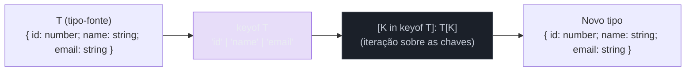
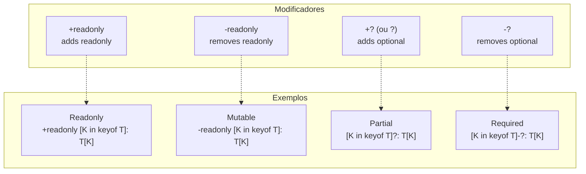
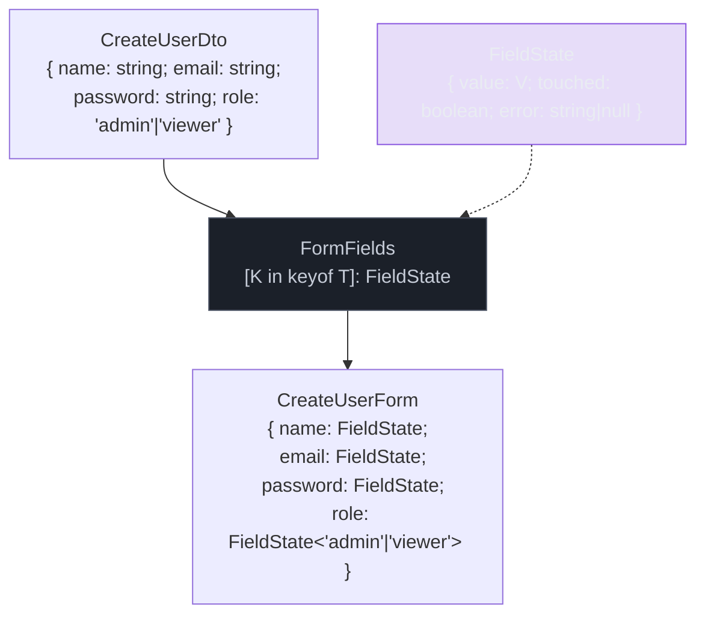
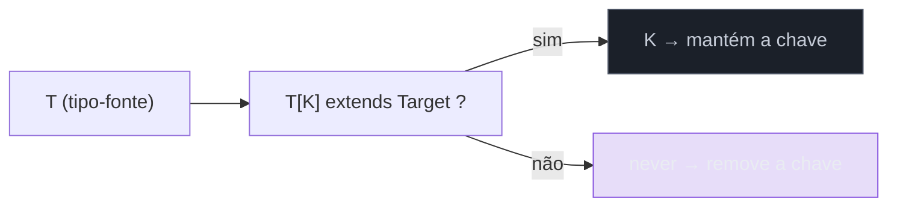
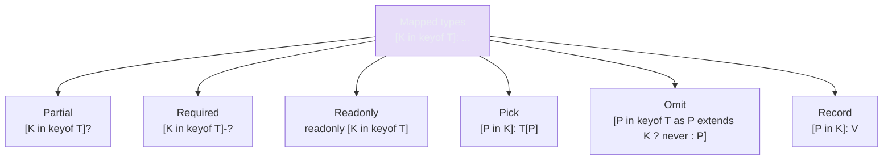

# Mapped types e key remapping

> [!abstract] TL;DR
> Um **mapped type** é um tipo que itera sobre as chaves de outro tipo para construir um novo — a sintaxe é `{ [K in keyof T]: ... }`. Pense nele como um `Array.map`, só que operando sobre chaves de tipos em vez de valores de arrays. Com modificadores `readonly` e `?` (e os operadores `+`/`-` para adicionar ou remover), você controla mutabilidade e opcionalidade em bloco. Com **key remapping** (TypeScript 4.1+), a cláusula `as` permite renomear ou filtrar chaves dinamicamente — o que abre a porta para gerar APIs inteiras (getters, setters, eventos) diretamente a partir de um tipo-fonte. Mapped types são a espinha dorsal de quase todos os utility types da stdlib: `Partial`, `Required`, `Readonly`, `Pick`, `Omit` e `Record` são todos mapped types por baixo do capô.

---

## O problema que mapped types resolvem

Suponha que você tem um tipo `User` com cinco propriedades e precisa de uma versão onde todas são opcionais (para um formulário de edição), uma versão onde todas são somente-leitura (para um objeto congelado no estado), e uma versão onde todas retornam `string | null` (para linhas de banco de dados com NULLs).

Sem mapped types, você duplicaria a estrutura três vezes. Se `User` ganhar uma nova propriedade, você atualiza em quatro lugares — e eventualmente esquece um. Esse tipo de coupling é exatamente o que TypeScript existe para eliminar.

A solução é iterar sobre as chaves de `User` programaticamente e derivar a variante:

```ts
interface User {
    id: number;
    name: string;
    email: string;
    role: "admin" | "viewer";
    active: boolean;
}

// Versão opcional — derivada de User, sem duplicação
type UserUpdate = {
    [K in keyof User]?: User[K];
};
// { id?: number; name?: string; email?: string; role?: "admin"|"viewer"; active?: boolean }

// Se User ganhar uma nova propriedade, UserUpdate ganha também. Automaticamente.
```

A sintaxe `[K in keyof T]` funciona como um `for...of` sobre as chaves: `K` percorre cada membro da union `keyof T`, e para cada iteração você declara o tipo do valor correspondente. Isso pressupõe que você já entende `keyof` e indexed access (`T[K]`) — se não, leia primeiro a nota [[15 - keyof, typeof e indexed access types]].



---

## Modificadores: `readonly` e `?` com `+` e `-`

Mapped types aceitam dois modificadores que alteram a natureza das propriedades geradas: `readonly` (para tornar somente-leitura) e `?` (para tornar opcional). Por padrão, adicionar o modificador sem prefixo é equivalente a prefixar com `+`.

```ts
// Adicionar readonly e ? (versão explícita com +)
type Immutable<T> = {
    +readonly [K in keyof T]+?: T[K];
};

// Versão abreviada — equivalente:
type ImmutableShort<T> = {
    readonly [K in keyof T]?: T[K];
};
```

Mais interessante é o operador de **remoção** com `-`. Ele remove o modificador, mesmo que o tipo original o tenha. Isso é exatamente o que `Required` e a versão mutável de `Readonly` fazem:

```ts
// Remove a opcionalidade de todas as propriedades
type Required<T> = {
    [K in keyof T]-?: T[K];
};

// Remove o readonly de todas as propriedades
type Mutable<T> = {
    -readonly [K in keyof T]: T[K];
};

// Demonstração:
interface Config {
    readonly host: string;
    readonly port?: number;
}

type MutableConfig = Mutable<Config>;
// { host: string; port?: number }   — o readonly sumiu, o ? permaneceu

type FullConfig = Required<Mutable<Config>>;
// { host: string; port: number }    — readonly e ? ambos removidos
```

> [!info] Por que `-?` existe
> Em TypeScript, `T | undefined` e `T?` não são exatamente a mesma coisa com `strictNullChecks` e `exactOptionalPropertyTypes`. A propriedade opcional `?` significa que a chave pode ser omitida inteiramente — diferente de `| undefined` que exige a chave presente com valor `undefined`. O `-?` remove a opcionalidade estrutural, não apenas adiciona `| undefined`.



---

## Transformar os valores: `Nullable<T>`, `Getters<T>`, `Stringify<T>`

Até aqui mudamos os modificadores mas mantivemos `T[K]` como valor. A parte direita do mapped type pode ser qualquer expressão de tipo — não precisa ser `T[K]`. Isso permite transformar os **valores** enquanto itera sobre as **chaves**.

```ts
// Tornar todos os valores nullable
type Nullable<T> = {
    [K in keyof T]: T[K] | null;
};

type NullableUser = Nullable<User>;
// { id: number | null; name: string | null; email: string | null; ... }

// Transformar todos os valores em string (útil para serialização de formulário)
type Stringified<T> = {
    [K in keyof T]: string;
};

type FormData = Stringified<User>;
// { id: string; name: string; email: string; role: string; active: string }
```

Um padrão clássico em APIs de objetos é gerar getters para cada propriedade. Sem key remapping (TS < 4.1) isso não era possível — você conseguia transformar os valores mas não as chaves. Com template literal types conseguimos nomear os getters dinamicamente:

```ts
// Gerar um tipo com getter para cada propriedade
type Getters<T> = {
    [K in keyof T as `get${Capitalize<string & K>}`]: () => T[K];
};

type UserGetters = Getters<User>;
/*
{
    getId:     () => number;
    getName:   () => string;
    getEmail:  () => string;
    getRole:   () => "admin" | "viewer";
    getActive: () => boolean;
}
*/
```

O `string & K` é uma interseção necessária porque `K` é do tipo `string | number | symbol` (pois `keyof` pode incluir índices numéricos e símbolos), mas `Capitalize` aceita apenas `string`. A interseção estreita `K` para o tipo `string`, o que satisfaz a constraint do `Capitalize` e ainda mantém o literal da chave original. Isso vai ser aprofundado na nota [[17 - Template literal types]].

---

## Key remapping com `as` (TypeScript 4.1+)

Antes do TypeScript 4.1, o `[K in keyof T]` iterava sobre as chaves e você não podia renomeá-las. A cláusula `as` mudou isso: ela permite mapear cada chave `K` para um novo nome — ou para `never`, o que efetivamente remove a chave do resultado.

A sintaxe é: `[K in keyof T as <expressão de novo nome>]: ...`

```ts
// Renomear chaves adicionando prefixo
type Prefixed<T, Prefix extends string> = {
    [K in keyof T as `${Prefix}_${string & K}`]: T[K];
};

type PrefixedUser = Prefixed<User, "user">;
// { user_id: number; user_name: string; user_email: string; ... }

// Renomear com Capitalize — mais legível
type Prefixed2<T, Prefix extends string> = {
    [K in keyof T as `${Prefix}${Capitalize<string & K>}`]: T[K];
};

type PrefixedUser2 = Prefixed2<User, "user">;
// { userId: number; userName: string; userEmail: string; ... }
```

### Filtrar chaves com `as … ? K : never`

Quando o `as` resolve para `never`, a chave é removida do tipo resultante. Esse é o mecanismo de **filtragem por tipo de valor**:

```ts
// Manter apenas as propriedades cujo valor é string
type StringProperties<T> = {
    [K in keyof T as T[K] extends string ? K : never]: T[K];
};

type UserStringProps = StringProperties<User>;
// { name: string; email: string; role: "admin" | "viewer" }
// id (number), active (boolean) foram removidos

// Remover uma chave específica — implementação manual de Omit
type OmitKey<T, Key extends keyof T> = {
    [K in keyof T as K extends Key ? never : K]: T[K];
};

type UserWithoutId = OmitKey<User, "id">;
// { name: string; email: string; role: "admin" | "viewer"; active: boolean }
```

Essa é a forma mais limpa de filtrar um tipo — e o que o utility type `Omit` faz internamente (com um detalhe de implementação histórico que a nota [[18 - Utility types - e como reconstruí-los]] vai dissecar).

### Gerar getters e setters juntos

Combinando key remapping com um union de mapped types, você consegue gerar ambas as direções de acesso a partir de um tipo-fonte:

```ts
// Gerar getters + setters para cada propriedade
type Accessors<T> = {
    [K in keyof T as `get${Capitalize<string & K>}`]: () => T[K];
} & {
    [K in keyof T as `set${Capitalize<string & K>}`]: (value: T[K]) => void;
};

type UserAccessors = Accessors<Pick<User, "name" | "email">>;
/*
{
    getName:   () => string;
    getEmail:  () => string;
    setName:   (value: string) => void;
    setEmail:  (value: string) => void;
}
*/
```

Dois mapped types com key remapping diferentes, intersectados com `&`. O TypeScript mescla os dois objetos num único tipo com todas as propriedades.

---

## Exemplo trabalhado real: `FormFields<T>`

Imagine que você tem um modelo de domínio e precisa de um tipo que descreva um formulário correspondente — onde cada campo tem um valor (string vindo do input), um estado de toque (touched) e um erro (error). Esse padrão aparece toda vez que você tipa um form handler manualmente:

```ts
// Modelo de domínio
interface CreateUserDto {
    name: string;
    email: string;
    password: string;
    role: "admin" | "viewer";
}

// Tipo de um campo de formulário individual
interface FieldState<V> {
    value: V;
    touched: boolean;
    error: string | null;
}

// Derivar o estado do formulário a partir do DTO — sem duplicar as chaves
type FormFields<T> = {
    [K in keyof T]: FieldState<T[K]>;
};

type CreateUserForm = FormFields<CreateUserDto>;
/*
{
    name:     FieldState<string>;
    email:    FieldState<string>;
    password: FieldState<string>;
    role:     FieldState<"admin" | "viewer">;
}
*/

// Função que inicializa o formulário a partir dos valores iniciais
function initForm<T extends Record<string, unknown>>(
    initial: T
): FormFields<T> {
    return Object.fromEntries(
        Object.keys(initial).map((key) => [
            key,
            { value: initial[key], touched: false, error: null },
        ])
    ) as FormFields<T>;
}

const form = initForm({
    name: "",
    email: "",
    password: "",
    role: "viewer" as const,
});
// form.name.value → string
// form.name.touched → boolean
// form.name.error → string | null
// form.role.value → "admin" | "viewer"  (literal preservado!)
```

O que torna esse exemplo poderoso: se `CreateUserDto` ganhar uma propriedade `phone`, `CreateUserForm` ganha `phone: FieldState<string>` automaticamente. Zero manutenção manual, zero risco de dessincronia.



---

## Combinar com conditional types para filtrar por valor

O padrão mais avançado une key remapping com conditional types (nota [[13 - Conditional types]]) para filtrar chaves baseado no tipo do valor — sem listar as chaves explicitamente:

```ts
// Extrair apenas as chaves cujo valor é assignable a um tipo-alvo
type KeysOfType<T, Target> = {
    [K in keyof T as T[K] extends Target ? K : never]: T[K];
};

// Uso:
type StringKeys   = KeysOfType<User, string>;   // { name: string; email: string; role: "admin"|"viewer" }
type NumberKeys   = KeysOfType<User, number>;   // { id: number }
type BooleanKeys  = KeysOfType<User, boolean>;  // { active: boolean }

// Variante: retornar só as chaves (sem os valores)
type KeysOf<T, Target> = keyof KeysOfType<T, Target>;

type StringKeyNames = KeysOf<User, string>;   // "name" | "email" | "role"
```

Esse padrão aparece em bibliotecas como `react-hook-form` e `zod` para derivar tipos de erro, tipos de validação e tipos de valor de campos a partir de um schema-fonte.



---

## Iterar sobre uma union arbitrária com `in`

`keyof T` não é a única fonte de iteração. Você pode iterar sobre qualquer union de string literals com `[K in UnionType]`. Isso é como `Record` é implementado internamente:

```ts
// Record<K, V>: mapeia uma union de chaves para valores do tipo V
type Record<K extends keyof any, V> = {
    [P in K]: V;
};

// Exemplo de uso direto de union:
type HttpMethod = "GET" | "POST" | "PUT" | "DELETE" | "PATCH";

type RouteHandlers = {
    [Method in HttpMethod]: (path: string) => Promise<Response>;
};
// { GET: ...; POST: ...; PUT: ...; DELETE: ...; PATCH: ... }

// Combinando com objetos reais:
const handlers: RouteHandlers = {
    GET:    async (path) => fetch(path),
    POST:   async (path) => fetch(path, { method: "POST" }),
    PUT:    async (path) => fetch(path, { method: "PUT" }),
    DELETE: async (path) => fetch(path, { method: "DELETE" }),
    PATCH:  async (path) => fetch(path, { method: "PATCH" }),
};
```

A diferença entre `[K in keyof T]` e `[K in UnionType]` é o que você está iterando: no primeiro caso, as chaves de um tipo existente; no segundo, os membros de uma union que você controla. Mapped types sobre unions arbitrárias são especialmente úteis para enums e constantes modeladas com `as const`.

---

## A conexão com os utility types da stdlib

Mapped types são a tecnologia que sustenta os utility types prontos. Quando você chama `Partial<T>`, não há mágica embutida no compilador — é um mapped type como os que você escreve:

```ts
// Como o TypeScript define cada utility type internamente:

type Partial<T>  = { [K in keyof T]?: T[K] };
type Required<T> = { [K in keyof T]-?: T[K] };
type Readonly<T> = { readonly [K in keyof T]: T[K] };

type Pick<T, K extends keyof T>  = { [P in K]: T[P] };
type Omit<T, K extends keyof T>  = { [P in keyof T as P extends K ? never : P]: T[P] };
type Record<K extends keyof any, T> = { [P in K]: T };
```

A nota [[18 - Utility types - e como reconstruí-los]] reconstrói todos esses do zero — e adiciona `Parameters`, `ReturnType`, `NonNullable` e outros que combinam mapped com conditional types. Entender mapped types aqui é o pré-requisito para aquela nota fazer sentido.



---

## Como explicar em inglês

A **mapped type** in TypeScript is a type that iterates over the keys of another type to construct a new one — `{ [K in keyof T]: ... }`. Think of it as `Array.map` for types: for each key `K` in `T`, you declare what the corresponding value type should be. This lets you derive variant types (optional, readonly, nullable, etc.) from a single source without duplication.

The `+` and `-` operators before `readonly` and `?` modifiers let you **add or remove** those modifiers: `-?` makes all properties required (used by `Required<T>`), `-readonly` makes them mutable. Without a prefix, adding `readonly` or `?` is the same as prefixing with `+`.

**Key remapping** (TypeScript 4.1+) adds an `as` clause after the key variable: `[K in keyof T as <new key expression>]: ...`. This lets you rename keys — typically with template literal types — or filter them out by mapping to `never`. When the `as` expression evaluates to `never`, that key is dropped from the resulting type. This is how you generate getter/setter APIs from a model type, how `Omit` works under the hood, and how you can filter object types to only keys whose values match a target type.

Mapped types are the backbone of nearly every utility type in TypeScript's standard library: `Partial`, `Required`, `Readonly`, `Pick`, `Omit`, and `Record` are all mapped types.

### Vocabulário-chave

| Português | Inglês |
|---|---|
| tipo mapeado | mapped type |
| iterar sobre as chaves | iterate over the keys / map over keys |
| remapeamento de chaves | key remapping |
| modificador de propriedade | property modifier |
| remover modificador | strip modifier / remove modifier (`-?`, `-readonly`) |
| filtrar chaves | filter keys / exclude keys |
| renomear chaves | remap / rename keys |
| chaves derivadas | derived keys |
| valor da propriedade | property value type |
| iterar sobre union | iterate over a union |
| tipo-fonte | source type |

---

## Armadilhas comuns

> [!warning] Armadilha 1: esquecer `string & K` com `Capitalize`
> `Capitalize` aceita apenas `string`, mas `K` em `keyof T` é `string | number | symbol`. Se você escrever `Capitalize<K>` diretamente, TypeScript vai reclamar. A interseção `string & K` resolve: estreita `K` para `string`, preservando o literal da chave.
> ```ts
> // Errado — erro de tipo
> type Getters<T> = { [K in keyof T as `get${Capitalize<K>}`]: () => T[K] };
>
> // Correto — string & K estreita para string literal
> type Getters<T> = { [K in keyof T as `get${Capitalize<string & K>}`]: () => T[K] };
> ```

> [!warning] Armadilha 2: mapped type não preserva excesso de opcionalidade
> Quando você aplica um mapped type a um tipo com propriedades opcionais, a opcionalidade pode ser perdida ou transformada dependendo do modificador. Use `-?` para forçar requerido ou `?` para forçar opcional. Sem modificador explícito, o mapped type **herda** a opcionalidade original.
> ```ts
> interface Foo { a: string; b?: number }
>
> type Copy<T>     = { [K in keyof T]: T[K] };       // { a: string; b?: number }  — herda
> type AllReq<T>   = { [K in keyof T]-?: T[K] };     // { a: string; b: number }   — força requerido
> type AllOpt<T>   = { [K in keyof T]?: T[K] };      // { a?: string; b?: number } — força opcional
> ```

> [!warning] Armadilha 3: `Omit` sobre tipos de índice pode surpreender
> A implementação canônica de `Omit` usa key remapping com `as P extends K ? never : P`. Mas em versões antigas da lib (TypeScript < 4.1), `Omit` usava `Pick<T, Exclude<keyof T, K>>` — que não preserva a distribuição correta com índice signatures e tipos condicionais. Se você implementar `Omit` do zero, use a versão com key remapping.

> [!warning] Armadilha 4: mapped type sobre union distribui por padrão
> `{ [K in keyof (A | B)]: ... }` não é a mesma coisa que union de mapped types. `keyof (A | B)` retorna apenas as chaves que `A` e `B` têm em comum — é interseção de chaves. Se você quer mapear sobre cada membro da union separadamente, use distributividade com generics e conditional types (nota [[13 - Conditional types]]).
> ```ts
> type A = { x: number; y: number };
> type B = { y: number; z: string };
>
> // keyof (A | B) = "y" — só a interseção das chaves!
> type Bad  = { [K in keyof (A | B)]: string };   // { y: string }
>
> // Para distribuir sobre cada membro:
> type DistMap<T> = T extends any ? { [K in keyof T]: string } : never;
> type Good = DistMap<A | B>;  // { x: string; y: string } | { y: string; z: string }
> ```

> [!warning] Armadilha 5: usar `in` com tipos não-string em key remapping
> Key remapping funciona sobre string literals. Se a union de chaves inclui `number` ou `symbol`, template literal types sobre eles podem se comportar de forma inesperada. `string & K` e `Extract<K, string>` são as ferramentas para garantir que você só está manipulando chaves string.

---

## Veja também

- [[15 - keyof, typeof e indexed access types]] — `keyof T` e `T[K]` são os pré-requisitos diretos; mapped types os consomem
- [[13 - Conditional types]] — combinar `T[K] extends Foo ? K : never` no key remapping é o padrão mais poderoso de filtragem
- [[17 - Template literal types]] — `Capitalize`, backtick types e a forma de gerar nomes de chaves dinamicamente; a ponte natural deste tópico
- [[18 - Utility types - e como reconstruí-los]] — onde `Partial`, `Required`, `Readonly`, `Pick`, `Omit`, `Record` são reconstituídos do zero a partir de mapped types
