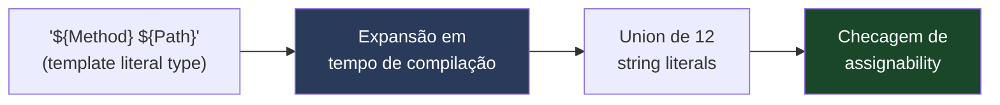
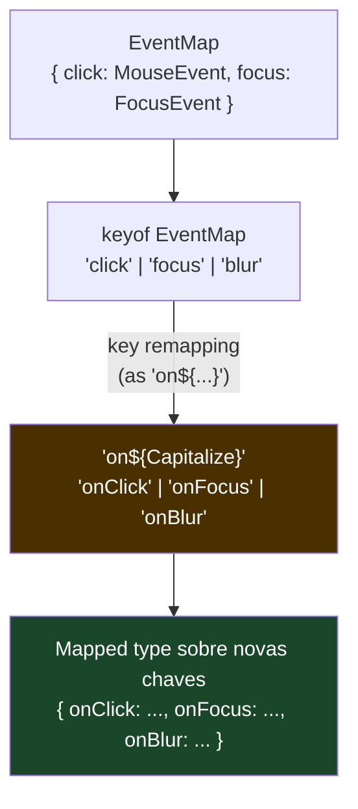
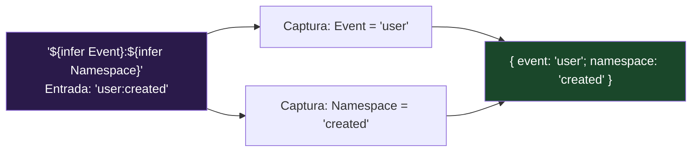
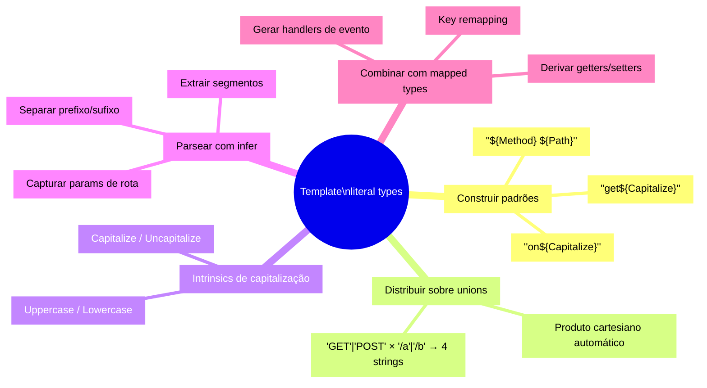

# Template literal types

> [!abstract] TL;DR
> **Template literal types** transportam a sintaxe das template strings do JavaScript para o nível dos tipos — `` `${Method} ${Path}` `` no mundo dos valores vira um tipo que aceita apenas strings com aquele formato. O poder real aparece quando você combina template literals com unions: `` `${'GET'|'POST'} /users` `` expande automaticamente para `"GET /users" | "POST /users"`. Junto com os intrinsics `Uppercase`/`Lowercase`/`Capitalize`/`Uncapitalize` e com `infer` dentro do template, você consegue parsear, transformar e derivar strings inteiramente em tempo de compilação — rotas tipadas, chaves de evento, unidades CSS — sem custo de runtime algum.

---

## Strings que o TypeScript entende

No JavaScript, você usa template strings para montar texto em runtime:

```ts
const method = "GET";
const path = "/users";
const msg = `${method} ${path}`; // "GET /users" — valor, em runtime
```

Template literal types fazem a mesma coisa, mas no mundo dos tipos, em tempo de compilação:

```ts
type Method = "GET" | "POST" | "PUT" | "DELETE";
type Path   = "/users" | "/posts" | "/comments";

// O TypeScript expande o produto cartesiano das unions
type Endpoint = `${Method} ${Path}`;
// "GET /users" | "GET /posts" | "GET /comments"
// | "POST /users" | "POST /posts" | "POST /comments"
// | "PUT /users"  | ... (12 combinações no total)
```

Esse é o giro fundamental: a sintaxe `` `${X}` `` dentro de um `type` não monta uma string — ela declara um **padrão de string** que o TypeScript usa para verificar assignability. Qualquer literal que não corresponder ao padrão é rejeitado em compile time.

```ts
function call(endpoint: Endpoint, body?: unknown) { /* ... */ }

call("GET /users");    // ✅
call("GET /nada");     // ❌ Type '"GET /nada"' is not assignable to type 'Endpoint'
call("get /users");    // ❌ Minúsculo não combina com "GET"
```

A lógica de matching é estrutural e literal: o TypeScript avalia se a string concreta satisfaz o padrão do template. Não há regex em runtime — a checagem some junto com todos os tipos após a compilação.



> [!tip] Padrão aberto com `string`
> Você pode usar `string` (ou `number`, `bigint`, `boolean`) dentro do template para aceitar qualquer valor daquele tipo — sem enumerate-los. `` type Route = `/users/${string}` `` aceita `"/users/123"`, `"/users/abc"`, qualquer coisa após `/users/`. Útil quando o segmento é dinâmico.

---

## Os intrinsics: transformação de capitalização

O TypeScript embute quatro tipos utilitários para manipular capitalização de strings no nível dos tipos. São chamados de **intrinsics** porque são implementados pelo próprio compilador em Go/TypeScript — você não consegue recriá-los com os outros recursos da linguagem:

| Intrinsic | Efeito | Exemplo |
|---|---|---|
| `Uppercase<S>` | Converte para MAIÚSCULAS | `Uppercase<"hello">` → `"HELLO"` |
| `Lowercase<S>` | Converte para minúsculas | `Lowercase<"HELLO">` → `"hello"` |
| `Capitalize<S>` | Primeira letra maiúscula | `Capitalize<"hello">` → `"Hello"` |
| `Uncapitalize<S>` | Primeira letra minúscula | `Uncapitalize<"Hello">` → `"hello"` |

```ts
type U = Uppercase<"hello">;      // "HELLO"
type L = Lowercase<"WORLD">;      // "world"
type C = Capitalize<"click">;     // "Click"
type NC = Uncapitalize<"Click">; // "click"

// Combinados com generics e unions:
type Shout<T extends string> = Uppercase<T>;

type Shouting = Shout<"hello" | "world">; // "HELLO" | "WORLD"
// A distribuição sobre unions funciona automaticamente (mesma regra dos conditional types)
```

O caso de uso clássico dos intrinsics é derivar nomes de handlers de evento a partir dos nomes dos eventos — o padrão `on${Capitalize<K>}` que aparece em toda biblioteca de UI:

```ts
type EventName = "click" | "focus" | "blur" | "change";

// Derivar automaticamente os nomes dos handlers
type Handler<E extends string> = `on${Capitalize<E>}`;

type ClickHandler  = Handler<"click">;  // "onClick"
type FocusHandler  = Handler<"focus">;  // "onFocus"
type AllHandlers   = Handler<EventName>; // "onClick" | "onFocus" | "onBlur" | "onChange"
```

Isso é exatamente o que bibliotecas como React fazem internamente para tipar os `on*` props dos elementos DOM.

---

## Combinando com mapped types: derivar chaves de objetos

O poder dos template literal types se multiplica quando combinados com mapped types (nota [[16 - Mapped types e key remapping]]). Você pode transformar as chaves de um tipo para seguir uma convenção de nomenclatura:

```ts
// Dado um objeto de eventos, gerar o tipo dos handlers correspondentes
type EventMap = {
    click: MouseEvent;
    focus: FocusEvent;
    blur:  FocusEvent;
};

// Mapped type + template literal: derivar as chaves "onClick" | "onFocus" | "onBlur"
type Handlers<T extends Record<string, Event>> = {
    [K in keyof T as `on${Capitalize<string & K>}`]: (event: T[K]) => void;
};

type ComponentHandlers = Handlers<EventMap>;
// {
//   onClick:  (event: MouseEvent) => void;
//   onFocus:  (event: FocusEvent) => void;
//   onBlur:   (event: FocusEvent) => void;
// }
```

O `string & K` é necessário porque `keyof T` pode incluir `symbol` e `number`, e `Capitalize` só aceita `string`. A intersecção `string & K` estreita o tipo para strings.



Outro padrão comum é derivar getters e setters de um tipo de modelo:

```ts
type Model = {
    name: string;
    age:  number;
};

// Gerar { getName: () => string; getAge: () => number }
type Getters<T> = {
    [K in keyof T as `get${Capitalize<string & K>}`]: () => T[K];
};

// Gerar { setName: (v: string) => void; setAge: (v: number) => void }
type Setters<T> = {
    [K in keyof T as `set${Capitalize<string & K>}`]: (value: T[K]) => void;
};

type ModelAPI = Getters<Model> & Setters<Model>;
// {
//   getName: () => string;
//   getAge:  () => number;
//   setName: (value: string) => void;
//   setAge:  (value: number) => void;
// }
```

---

## `infer` dentro de template literals: parsear strings no nível de tipo

Assim como `infer` extrai tipos de generics e condicionais (nota [[14 - infer e extração de tipos]]), você pode usar `infer` dentro de um template literal type para "capturar" segmentos de uma string. Isso permite parsear strings estruturadas inteiramente em compile time.

```ts
// Extrair o segmento de ID de uma rota como "/users/123"
type ExtractId<T extends string> =
    T extends `/users/${infer Id}` ? Id : never;

type Id1 = ExtractId<"/users/42">;     // "42"
type Id2 = ExtractId<"/users/abc">;    // "abc"
type Id3 = ExtractId<"/posts/1">;      // never — não bate com o padrão
```

O `infer Id` age como uma "captura" — se a string `T` bater com o padrão `` `/users/${infer Id}` ``, o TypeScript liga `Id` ao que quer que esteja nessa posição. É exatamente o mesmo mecanismo do `infer` em conditional types, só que o padrão agora é um template de string.

```ts
// Parsear um formato "evento:namespace" como "user:created"
type ParseEvent<T extends string> =
    T extends `${infer Event}:${infer Namespace}`
        ? { event: Event; namespace: Namespace }
        : { event: T; namespace: never };

type P1 = ParseEvent<"user:created">;
// { event: "user"; namespace: "created" }

type P2 = ParseEvent<"click">;
// { event: "click"; namespace: never }  — sem namespace

// Extrair método e caminho de "GET /users"
type ParseEndpoint<T extends string> =
    T extends `${infer M} ${infer P}` ? { method: M; path: P } : never;

type E1 = ParseEndpoint<"GET /users">;
// { method: "GET"; path: "/users" }

type E2 = ParseEndpoint<"DELETE /posts/1">;
// { method: "DELETE"; path: "/posts/1" }
```



---

## Exemplo trabalhado: rotas tipadas com parâmetros dinâmicos

Vamos construir um sistema de rotas tipadas que valida endpoints com parâmetros nomeados — do tipo `/users/:id/posts/:postId` — e extrai o tipo dos parâmetros automaticamente.

```ts
// Passo 1: extrair os nomes dos parâmetros de uma string de rota
// "/users/:id/posts/:postId" → "id" | "postId"
type ExtractRouteParams<T extends string> =
    T extends `${infer _Before}:${infer Param}/${infer Rest}`
        ? Param | ExtractRouteParams<`/${Rest}`>
    : T extends `${infer _Before}:${infer Param}`
        ? Param
        : never;

type Params1 = ExtractRouteParams<"/users/:id">;
// "id"

type Params2 = ExtractRouteParams<"/users/:id/posts/:postId">;
// "id" | "postId"

type Params3 = ExtractRouteParams<"/health">;
// never  — sem parâmetros

// Passo 2: construir o objeto de parâmetros a partir dos nomes extraídos
type RouteParams<T extends string> = Record<ExtractRouteParams<T>, string>;

type UserParams     = RouteParams<"/users/:id">;
// { id: string }

type PostParams     = RouteParams<"/users/:id/posts/:postId">;
// { id: string; postId: string }

// Passo 3: tipar a função de navegação que recebe a rota e os parâmetros corretos
function navigate<T extends string>(
    route: T,
    params: RouteParams<T>
): string {
    // Substitui ":param" pelos valores concretos em runtime
    return Object.entries(params).reduce(
        (path, [key, value]) => path.replace(`:${key}`, value as string),
        route
    );
}

// Uso — TypeScript conhece os parâmetros exigidos por cada rota:
navigate("/users/:id", { id: "42" });              // ✅ "/users/42"
navigate("/users/:id/posts/:postId", {             // ✅
    id: "42",
    postId: "7"
});

// navigate("/users/:id", { userId: "42" });        // ❌ "id" esperado, não "userId"
// navigate("/health", {});                         // ✅ sem parâmetros (RouteParams<"/health"> = Record<never, string> = {})
```

> [!note] Tipos recursivos e profundidade
> `ExtractRouteParams` é recursivo — ela chama a si mesma para processar o restante da rota após cada parâmetro. O TypeScript suporta tipos condicionais recursivos, mas com limite de profundidade. Para rotas reais (raramente mais de 4-5 segmentos), funciona perfeitamente. A nota [[25 - TypeScript em escala - performance do compilador e project references]] discute quando a recursão e a explosão combinatória começam a impactar a performance do compilador.

---

## Padrão: unidades CSS tipadas

Um uso elegante e prático de template literal types é tipar strings de unidades CSS, garantindo que você não passe `"red"` onde esperava `"16px"`:

```ts
type CSSUnit = "px" | "em" | "rem" | "vw" | "vh" | "%" | "fr";

// Aceita qualquer número seguido de uma unidade CSS válida
type CSSLength = `${number}${CSSUnit}`;

function setWidth(width: CSSLength): void {
    document.body.style.width = width;
}

setWidth("100px");   // ✅
setWidth("1.5rem");  // ✅
setWidth("50%");     // ✅
// setWidth("100");      // ❌ sem unidade
// setWidth("100abc");   // ❌ unidade inválida
// setWidth("red");      // ❌ não é um comprimento

// Tipos de cor CSS com canal alpha opcional
type HexDigit = "0"|"1"|"2"|"3"|"4"|"5"|"6"|"7"|"8"|"9"|"a"|"b"|"c"|"d"|"e"|"f";
// (isso fica combinatorialmente caro — veja a nota 25; prefira string para cores)

// Approach mais sustentável para cores:
type CSSColor = `#${string}` | `rgb(${string})` | `hsl(${string})`;
```

> [!warning] Atenção ao produto cartesiano
> `` `${A}${B}` `` onde `A` tem `m` membros e `B` tem `n` membros gera `m × n` strings. Três unions de 10 membros cada produzem 1000 tipos. O TypeScript tem um limite interno (atualmente ~100.000 membros) e avisa com erro quando você ultrapassa. Discutido em detalhe na nota [[25 - TypeScript em escala - performance do compilador e project references]].

---

## Diagrama geral: o que você pode fazer com template literal types



---

## Como explicar em inglês

**Template literal types** bring JavaScript's template string syntax into the type system. Instead of building a string value at runtime, you declare a *string pattern* at compile time: `` `${Method} ${Path}` `` becomes a type that only accepts strings matching that shape. When the interpolated slots are unions, TypeScript automatically expands the Cartesian product — `` `${'GET'|'POST'} /users` `` resolves to `"GET /users" | "POST /users"`.

The four **string intrinsics** — `Uppercase`, `Lowercase`, `Capitalize`, `Uncapitalize` — are compiler-level utilities for transforming the case of string literal types. They're the foundation of the `on${Capitalize<K>}` pattern used throughout UI libraries.

The advanced usage is combining template literals with **`infer`**: you can pattern-match against a string structure and *capture* sub-strings as new type variables. `T extends \`${infer Event}:${infer Namespace}\`` splits the string at the colon — entirely at compile time. Combined with **key remapping in mapped types** (`as \`get${Capitalize<K>}\``), you can derive entire APIs from a data model's key names.

The main gotcha is combinatorial explosion: every union slot multiplies the total number of string variants. Three unions of 10 members each yield 1,000 types — performance degrades before you hit TypeScript's internal cap.

### Vocabulário-chave

| Português | Inglês |
|---|---|
| tipo literal de template | template literal type |
| intrinsic de capitalização | string intrinsic / case-manipulation intrinsic |
| produto cartesiano de unions | Cartesian product of union types |
| derivar chaves | derive / remap keys |
| parsear string em nível de tipo | parse a string at the type level |
| capturar segmento com infer | capture a segment with `infer` |
| parâmetro de rota tipado | typed route parameter |
| explosão combinatória | combinatorial explosion / type instantiation depth |
| remapear chave | key remapping (`as` clause in mapped type) |

---

## Armadilhas comuns

> [!warning] Armadilha 1: explosão combinatória silenciosa
> `` `${A}${B}${C}` `` onde cada union tem 10 membros produz 1.000 tipos. O TypeScript aceita até certo limite e depois emite "Expression produces a union type that is too complex to represent". Solução: use `string` genérico nos slots que não precisam ser enumerados, e mova a validação combinatória para runtime (Zod/Valibot) ou para um estágio de geração de código.
> ```ts
> // Perigoso com unions grandes:
> type AllCSSShorthands = `${Property}-${Modifier}-${Variant}`;
> // seguro: use string nos slots irrestritos
> type SafeCSS = `${string}px` | `${string}rem`; // ✅
> ```

> [!warning] Armadilha 2: `string & K` ao usar intrinsics com keyof
> `keyof T` produz `string | number | symbol`. Os intrinsics de capitalização aceitam apenas `string`. Sem `string & K`, o TypeScript rejeita o tipo com erro sobre `number | symbol` não ser atribuível a `string`. Sempre filtre: `Capitalize<string & K>`.
> ```ts
> // ❌ Erro: Type 'string | number | symbol' is not assignable to type 'string'
> type Bad<T> = { [K in keyof T as `get${Capitalize<K>}`]: T[K] };
>
> // ✅ Correto:
> type Good<T> = { [K in keyof T as `get${Capitalize<string & K>}`]: T[K] };
> ```

> [!warning] Armadilha 3: `infer` em template literal captura de forma gananciosa
> Quando há dois `infer` em sequência sem delimitador literal entre eles, o TypeScript não consegue determinar a fronteira — o primeiro `infer` captura tudo. Você precisa de um delimitador literal (como `/`, `:`, `-`) entre os segmentos capturados.
> ```ts
> // Ambíguo: onde termina A e começa B?
> type Bad<T extends string> = T extends `${infer A}${infer B}` ? [A, B] : never;
> type R = Bad<"abc">; // ["", "abc"] — A captura vazio, B captura tudo
>
> // Correto: delimitador literal entre capturas
> type Good<T extends string> = T extends `${infer A}:${infer B}` ? [A, B] : never;
> type R2 = Good<"user:created">; // ["user", "created"] ✅
> ```

> [!warning] Armadilha 4: template literal types não validam formato em runtime
> `` type Email = `${string}@${string}.${string}` `` parece validar emails, mas é uma ilusão — o tipo aceita `"a@b.c"` e `"@."` igualmente. Em runtime, não há checagem. Use bibliotecas de validação (Zod, Valibot) para garantias de runtime; use template literal types para contratos de API e geração de chaves, não para validação de dados de usuário.

> [!warning] Armadilha 5: esquecer que os intrinsics são literais, não regex
> `Capitalize<string>` retorna `string`, não `Capitalize<string>`. Só funciona com string literals concretas. Se o tipo de entrada for `string` (sem literal), o resultado também é `string` — nenhuma transformação visível.
> ```ts
> type C1 = Capitalize<"hello">; // "Hello" ✅
> type C2 = Capitalize<string>;  // string — sem efeito observável
> ```

---

## Veja também

- [[16 - Mapped types e key remapping]] — key remapping com `as` é onde template literal types brilham mais: derivar `onClick` de `click`, `getName` de `name`
- [[14 - infer e extração de tipos]] — `infer` dentro de template literals segue a mesma mecânica de `infer` em conditional types; leia esta nota antes de parsear strings no nível de tipo
- [[25 - TypeScript em escala - performance do compilador e project references]] — quando a combinatória de template literals começa a tornar o compilador lento e como mitigar
- [[03-Dominios/Ciência/Compiladores e Linguagens/01 - O que é um compilador e o pipeline de tradução|O que é um compilador e o pipeline de tradução]] — template literal types são avaliados na fase semântica do compilador TS; entender que tudo some após esse estágio contextualiza por que não há custo de runtime
