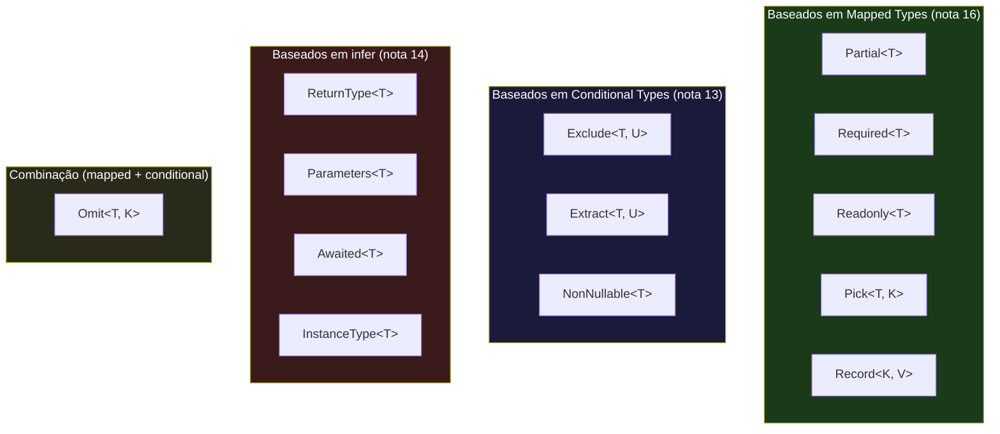
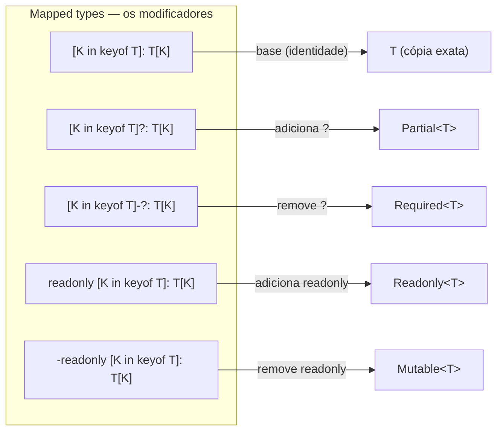
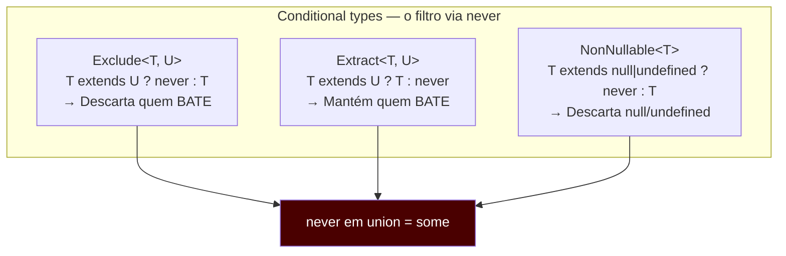
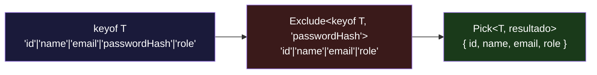
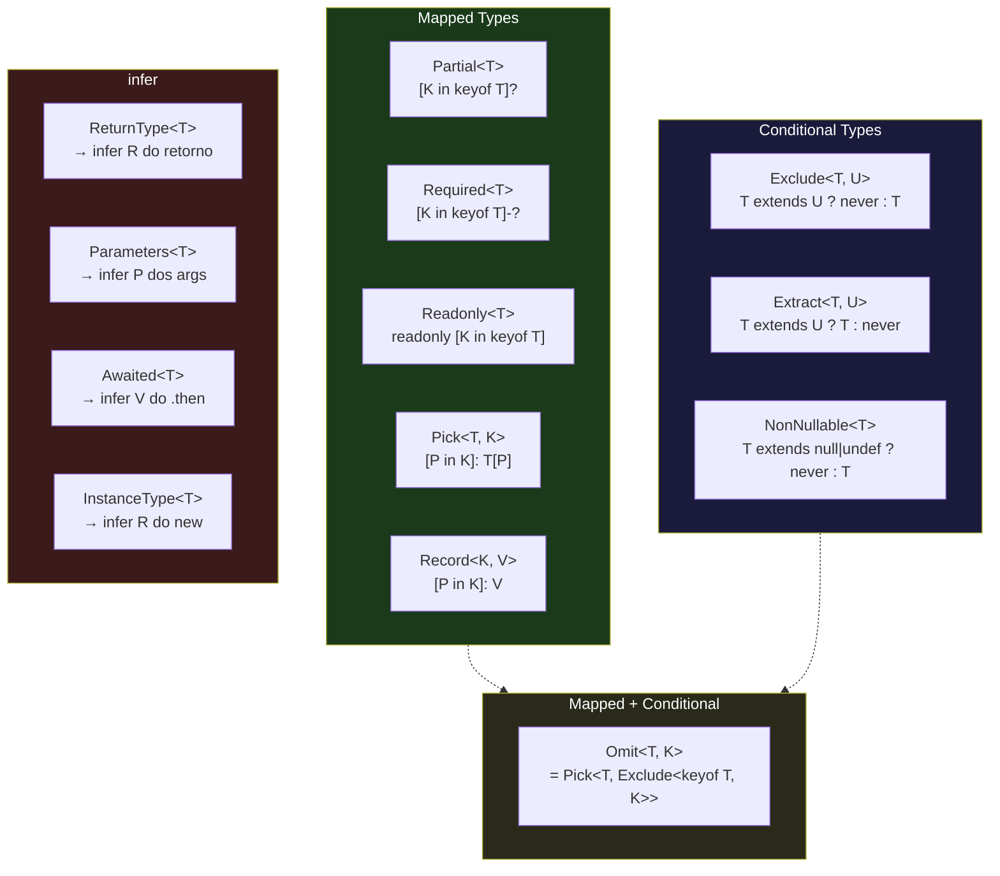
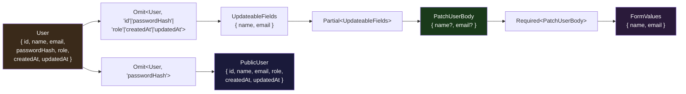

# Utility types — e como reconstruí-los

> [!abstract] TL;DR
> O TypeScript embute uma biblioteca de utility types — `Partial`, `Required`, `Readonly`, `Pick`, `Omit`, `Record`, `Exclude`, `Extract`, `NonNullable`, `ReturnType`, `Parameters`, `Awaited`, `InstanceType` — que são atalhos de vocabulário, não mágica do compilador. Por baixo, cada um usa os mesmos blocos que você já aprendeu nas notas anteriores: mapped types com modificadores `?` e `readonly`, conditional types com distribuição sobre unions, e `infer` para extrair tipos de dentro de outros tipos. Esta nota reconstrói todos eles do zero e mostra como combiná-los para modelar casos reais — PATCH bodies, form state, DTOs derivados de entidades de domínio.

---

## Por que reconstruir o que já existe pronto?

Quando você vê `Partial<User>` num projeto, a tentação é tratá-lo como uma caixa preta — "faz todos os campos opcionais, pronto". E em uso cotidiano, tudo bem.

Mas entrevistas pedem mais. "Como você implementaria `Omit`?" "Por que `Exclude<T, U>` usa `never`?" "Qual é a diferença entre `Parameters` e `ConstructorParameters`?" São perguntas que testam se você entende o *mecanismo*, não apenas o nome.

Há também uma razão prática: os utility types prontos não cobrem tudo. Cedo ou tarde você vai precisar de um `DeepPartial`, um `PickByValue`, um `ReadonlyDeep`. Quem sabe reconstruir `Partial` sabe escrever `DeepPartial`. Quem trata utility types como caixas pretas fica preso no vocabulário padrão.

A boa notícia: todos os utility types da lib padrão cabem em três famílias, cada uma usando um mecanismo que você já viu:



`Omit` é o único que combina duas famílias — e por isso é o mais interessante de reconstruir.

---

## Família 1: Mapped types — transformar a forma de T

Mapped types percorrem as chaves de um tipo e transformam cada uma. A sintaxe `{ [K in keyof T]: T[K] }` itera sobre `keyof T` e define o tipo de cada campo. Modificadores `?` (opcionalidade) e `readonly` podem ser adicionados ou removidos com `+` e `-`.

### `Partial<T>` — tornar todos os campos opcionais

O caso de uso clássico: um objeto de *update* onde você envia apenas os campos que mudaram.

```ts
// Implementação interna — exatamente isso
type Partial<T> = {
    [K in keyof T]?: T[K];
};

// O `?` antes de `:` adiciona `| undefined` e marca a chave como opcional
// Equivalente a escrever `K?: T[K] | undefined`

interface User {
    id: number;
    name: string;
    email: string;
    role: "admin" | "user";
}

type UserPatch = Partial<User>;
// {
//   id?: number | undefined;
//   name?: string | undefined;
//   email?: string | undefined;
//   role?: "admin" | "user" | undefined;
// }

// Uso real: corpo de um PATCH
async function updateUser(id: string, data: Partial<User>): Promise<User> {
    // data pode ter qualquer subconjunto dos campos — incluindo nenhum
    return api.patch(`/users/${id}`, data);
}
```

> [!tip] `Partial` não é profundo
> `Partial<T>` deixa apenas o nível externo opcional. Se `User` tem um campo `address: { street: string; city: string }`, o campo `address` vira opcional, mas *dentro* de `address`, `street` e `city` continuam obrigatórios. Para profundidade recursiva você precisa de um `DeepPartial` — veremos ao final da nota.

### `Required<T>` — tornar todos os campos obrigatórios

O inverso: o modificador `-?` remove a opcionalidade.

```ts
// Implementação interna
type Required<T> = {
    [K in keyof T]-?: T[K];
};

// O `-?` remove o `?` (e junto com ele o `| undefined` implícito)

// Uso: validação depois de um PATCH — garantir que o objeto está completo
type FullUser = Required<Partial<User>>;
// Equivalente a User — todos os campos voltam a ser obrigatórios

// Mais útil com tipos que têm campos opcionais por natureza:
interface Config {
    host?: string;
    port?: number;
    timeout?: number;
}

type ResolvedConfig = Required<Config>;
// { host: string; port: number; timeout: number }
// — o tipo do objeto depois de aplicar os defaults
```

### `Readonly<T>` — tornar todos os campos imutáveis

```ts
// Implementação interna
type Readonly<T> = {
    readonly [K in keyof T]: T[K];
};

// Para remover readonly de um tipo existente:
type Mutable<T> = {
    -readonly [K in keyof T]: T[K];
};

interface Point {
    x: number;
    y: number;
}

const origin: Readonly<Point> = { x: 0, y: 0 };
// origin.x = 1;  // ERRO: cannot assign to 'x' — é readonly

// Uso típico: estado imutável em Redux ou useReducer
type AppState = Readonly<{
    users: ReadonlyArray<User>;
    loading: boolean;
    error: string | null;
}>;
```

> [!info] `Readonly` é superficial também
> Assim como `Partial`, `Readonly` afeta apenas o nível externo. Arrays e objetos aninhados precisam de `ReadonlyArray<T>` ou `Readonly<>` aplicado recursivamente.

### `Pick<T, K>` — selecionar um subconjunto de chaves

```ts
// Implementação interna
type Pick<T, K extends keyof T> = {
    [P in K]: T[P];
};

// K extends keyof T garante que só chaves válidas de T podem ser selecionadas
// O mapeamento itera sobre K (não sobre keyof T inteiro)

type UserPreview = Pick<User, "id" | "name">;
// { id: number; name: string }

// Uso real: projeção de API — retornar só o que o cliente precisa
type UserListItem = Pick<User, "id" | "name" | "role">;

// Pick em nested key — não funciona automaticamente para campos aninhados
// Mas para o nível externo, é exato
```

### `Record<K, V>` — criar um dicionário tipado

```ts
// Implementação interna
type Record<K extends keyof any, T> = {
    [P in K]: T;
};

// K extends keyof any significa que K pode ser string, number ou symbol
// O mapeamento é sobre K, não sobre um tipo existente T

type RoleCapabilities = Record<"admin" | "user" | "guest", string[]>;
// { admin: string[]; user: string[]; guest: string[] }

// Record com string key — útil para dicionários dinâmicos
type Cache = Record<string, User>;
// { [key: string]: User }

// Uso real: mapa de configuração por ambiente
type EnvConfig = Record<"development" | "staging" | "production", {
    apiUrl: string;
    debug: boolean;
}>;

const config: EnvConfig = {
    development: { apiUrl: "http://localhost:3000", debug: true },
    staging:     { apiUrl: "https://staging.api.com", debug: false },
    production:  { apiUrl: "https://api.com", debug: false },
};
// config.staging.apiUrl  ← tipado, com autocomplete
```



---

## Família 2: Conditional types — filtrar unions

Esses utility types usam a distribuição automática de conditional types sobre unions. O truque em todos eles é `never`: numa union, `never` desaparece. `string | never` é apenas `string`. Então o padrão `T extends U ? never : T` funciona como filtro: membros que atendem à condição são descartados (viram `never`), os que não atendem ficam.

Se você não lembra da distribuição, releia a nota [[13 - Conditional types]] — é o pré-requisito desta seção.

### `Exclude<T, U>` — remover membros de uma union

```ts
// Implementação interna
type Exclude<T, U> = T extends U ? never : T;

// Leitura: para cada membro de T (distribuição!),
// se ele for atribuível a U → descarta (never)
// se não for                → mantém (T)

type Status = "active" | "inactive" | "pending" | "deleted";

type ActiveStatus = Exclude<Status, "deleted" | "inactive">;
// → "active" | "pending"

// Passo a passo da distribuição:
// "active"   extends "deleted" | "inactive"? NÃO → "active"
// "inactive" extends "deleted" | "inactive"? SIM → never
// "pending"  extends "deleted" | "inactive"? NÃO → "pending"
// "deleted"  extends "deleted" | "inactive"? SIM → never
// Reunindo: "active" | never | "pending" | never → "active" | "pending"

// Uso real: tipar eventos de negócio excluindo estados inválidos
type ValidTransition = Exclude<Status, "deleted">;
```

### `Extract<T, U>` — manter só o que bate

```ts
// Implementação interna — o inverso de Exclude
type Extract<T, U> = T extends U ? T : never;

// Mantém os membros de T que são atribuíveis a U

type Primitives = string | number | boolean | object | symbol;

type JsonPrimitives = Extract<Primitives, string | number | boolean>;
// → string | number | boolean
// (object e symbol não são válidos em JSON)

// Uso real: extrair uma categoria de tipos de uma union ampla
type StringOrNumber = Extract<string | number | boolean | null, string | number>;
// → string | number
```

### `NonNullable<T>` — remover null e undefined

```ts
// Implementação interna
type NonNullable<T> = T extends null | undefined ? never : T;

// Atenção: em TypeScript 5.x, a implementação real usa intersecção:
// type NonNullable<T> = T & {};
// O efeito prático é o mesmo, mas a intersecção com {} é mais eficiente para o checker

type MaybeUser = User | null | undefined;
type DefinitelyUser = NonNullable<MaybeUser>;
// → User

// Uso real: depois de verificar que um valor não é nulo, você pode precisar
// extrair o tipo limpo para outro alias
type ApiResponse<T> = { data: T | null; error: string | null };
type SuccessData<R> = NonNullable<R extends ApiResponse<infer D> ? D : never>;
```



---

## Família 3: infer — introspecção de tipos de funções e promessas

`infer` é o operador que extrai um tipo de dentro de outro dentro de um conditional type. A nota [[14 - infer e extração de tipos]] cobre o mecanismo em profundidade; aqui nos concentramos nos utility types que dependem dele.

A ideia: `T extends (...args: infer P) => infer R ? ... : ...` diz ao TypeScript "se `T` for uma função, me dê o tipo dos parâmetros em `P` e o tipo do retorno em `R`". O `infer` captura e nomeia uma parte do tipo para que você possa usá-la no ramo verdadeiro.

### `ReturnType<T>` — extrair o tipo de retorno de uma função

```ts
// Implementação interna
type ReturnType<T extends (...args: any) => any> =
    T extends (...args: any) => infer R ? R : any;

// T deve ser uma função (constraint via extends)
// Se T é uma função → captura o tipo de retorno em R e retorna R
// Se não é (impossível pelo constraint, mas o ternário precisa de dois ramos) → any

function createUser(name: string, age: number): User {
    return { id: Math.random(), name, email: `${name}@example.com`, role: "user" };
}

type CreatedUser = ReturnType<typeof createUser>;
// → User

// Uso real: derivar o tipo de retorno sem importar o tipo explicitamente
// (útil quando a função é complexa ou o tipo não é exportado)
async function fetchUser(id: string) {
    const response = await fetch(`/api/users/${id}`);
    return response.json() as Promise<User>;
}

// ReturnType de uma função async retorna Promise<T>
type FetchReturn = ReturnType<typeof fetchUser>;
// → Promise<User>

// Para extrair User sem o Promise, combine com Awaited:
type UnwrappedUser = Awaited<ReturnType<typeof fetchUser>>;
// → User
```

### `Parameters<T>` — extrair os parâmetros de uma função

```ts
// Implementação interna
type Parameters<T extends (...args: any) => any> =
    T extends (...args: infer P) => any ? P : never;

// P captura a tupla de parâmetros — nunca um único tipo

function updateUser(id: string, data: Partial<User>, options?: { silent: boolean }): Promise<User> {
    return Promise.resolve({} as User);
}

type UpdateParams = Parameters<typeof updateUser>;
// → [id: string, data: Partial<User>, options?: { silent: boolean } | undefined]
// Tupla nomeada com 3 elementos

// Uso real: repassar parâmetros de uma função para outra (wrapper)
function withLogging<T extends (...args: any) => any>(fn: T) {
    return (...args: Parameters<T>): ReturnType<T> => {
        console.log("chamando com", args);
        return fn(...args);
    };
}
```

### `Awaited<T>` — desembrulhar Promise (recursivamente)

```ts
// Implementação interna — recursiva para promises aninhadas
type Awaited<T> =
    T extends null | undefined ? T :
    T extends object & { then(onfulfilled: infer F, ...args: any): any }
        ? F extends ((value: infer V, ...args: any) => any)
            ? Awaited<V>   // recursão: desembrulha Promise<Promise<T>>
            : never
        : T;

// A implementação real verifica .then (thenable), não Promise diretamente
// Isso funciona com qualquer thenable, não apenas Promise nativa

type A1 = Awaited<Promise<string>>;           // string
type A2 = Awaited<Promise<Promise<number>>>; // number  — recursão desembrulha
type A3 = Awaited<string>;                    // string  — não é thenable, retorna T

// Uso real: tipar o resultado de uma função async
type ApiResult = Awaited<ReturnType<typeof fetchUser>>;
// → User  (sem o Promise wrapper)

// Em código de formulário: derivar o tipo do dado que vem do servidor
async function loadFormData(id: string) {
    return { name: "Maria", email: "maria@ex.com", role: "admin" as const };
}
type FormData = Awaited<ReturnType<typeof loadFormData>>;
// → { name: string; email: string; role: "admin" }
```

### `InstanceType<T>` — extrair o tipo de instância de uma classe

```ts
// Implementação interna
type InstanceType<T extends abstract new (...args: any) => any> =
    T extends abstract new (...args: any) => infer R ? R : any;

// `new (...args: any) => any` é o tipo de um constructor
// infer R captura o tipo da instância que o constructor produz

class Database {
    connect() { return { status: "connected" }; }
    query(sql: string) { return Promise.resolve([]); }
}

type DBInstance = InstanceType<typeof Database>;
// → Database  (o tipo da instância, não da classe)

// Por que isso é útil? Quando você tem uma referência à classe, não à instância:
function createInstance<T extends new (...args: any) => any>(
    ctor: T,
    ...args: ConstructorParameters<T>
): InstanceType<T> {
    return new ctor(...args);
}

// ConstructorParameters é análogo a Parameters, mas para constructors
type DBArgs = ConstructorParameters<typeof Database>;
// → []  (Database não tem parâmetros no constructor)
```

---

## O caso especial: `Omit<T, K>` — Pick + Exclude

`Omit` não pertence a nenhuma das três famílias isoladamente — ele combina as duas primeiras.

```ts
// Implementação interna
type Omit<T, K extends keyof any> = Pick<T, Exclude<keyof T, K>>;

// Decomposto:
// 1. `keyof T`          → todas as chaves de T
// 2. `Exclude<keyof T, K>` → chaves de T que NÃO estão em K
// 3. `Pick<T, ...>`     → seleciona só essas chaves restantes

interface User {
    id: number;
    name: string;
    email: string;
    passwordHash: string;
    role: "admin" | "user";
}

type PublicUser = Omit<User, "passwordHash">;
// { id: number; name: string; email: string; role: "admin" | "user" }

// Passo a passo:
// keyof User = "id" | "name" | "email" | "passwordHash" | "role"
// Exclude<keyof User, "passwordHash"> = "id" | "name" | "email" | "role"
// Pick<User, "id" | "name" | "email" | "role"> = { id: number; name: string; ... }

// Versus Pick: Omit é mais seguro quando você quer "tudo exceto K"
// porque adicionar campos a User os inclui automaticamente no Omit
// mas você precisa adicioná-los manualmente ao Pick
type UserViaOmit = Omit<User, "passwordHash">;   // automaticamente inclui novos campos
type UserViaPick = Pick<User, "id" | "name" | "email" | "role">;  // precisa de atualização manual
```



---

## Mapa completo: utility types e seus mecanismos



---

## Exemplo trabalhado: modelando um endpoint PATCH

Aqui está o cenário que consolida tudo: você tem uma entidade de domínio `User`, precisa definir o tipo do corpo de uma requisição `PATCH /users/:id` (campos opcionais, mas id e role não podem ser atualizados pelo cliente), e quer derivar o tipo do formulário de edição no frontend.

```ts
// ---- domínio ----
interface User {
    id: number;
    name: string;
    email: string;
    passwordHash: string;
    role: "admin" | "user";
    createdAt: Date;
    updatedAt: Date;
}

// ---- campos que o cliente pode atualizar ----
// Omit campos do servidor: id, passwordHash, role, timestamps
type UpdateableFields = Omit<User, "id" | "passwordHash" | "role" | "createdAt" | "updatedAt">;
// → { name: string; email: string }

// ---- corpo do PATCH: todos os campos updateáveis são opcionais ----
type PatchUserBody = Partial<UpdateableFields>;
// → { name?: string; email?: string }

// ---- resposta da API: usuário sem passwordHash ----
type PublicUser = Omit<User, "passwordHash">;

// ---- função do endpoint ----
async function patchUser(id: number, body: PatchUserBody): Promise<PublicUser> {
    // body pode ter qualquer subconjunto de { name, email }
    // O compilador garante que id/role/passwordHash nunca chegam aqui
    return api.patch(`/users/${id}`, body);
}

// ---- form state no frontend ----
// O formulário começa com os valores atuais (todos presentes)
// mas durante edição mantém só os campos que o usuário pode editar
type FormValues = Required<PatchUserBody>;
// → { name: string; email: string }
// Todos obrigatórios — é o estado inicial do form antes de qualquer edição

// ---- derivar o tipo do retorno sem importar explicitamente ----
type PatchResult = Awaited<ReturnType<typeof patchUser>>;
// → PublicUser
```

Note o que aconteceu: `PublicUser` e `PatchUserBody` foram derivados de `User` — não foram escritos à mão. Se você adicionar `bio: string` a `User`, `UpdateableFields` e `PatchUserBody` a absorvem automaticamente. O tipo vive em um único lugar e propaga por derivação.



---

## Construindo seus próprios utility types

Saber reconstruir os que existem é o pré-requisito para escrever os que não existem.

### `DeepPartial<T>` — profundidade recursiva

```ts
// Partial recursivo: torna opcionais todos os campos em todos os níveis
type DeepPartial<T> = T extends object
    ? { [K in keyof T]?: DeepPartial<T[K]> }
    : T;

interface Address {
    street: string;
    city: string;
    country: string;
}

interface FullUser {
    name: string;
    address: Address;
}

type PartialUser = DeepPartial<FullUser>;
// { name?: string; address?: { street?: string; city?: string; country?: string } }

// O `T extends object` distingue objetos de primitivos:
// — primitivos retornam T intacto
// — objetos são mapeados recursivamente
```

### `PickByValue<T, V>` — selecionar campos pelo tipo do valor

```ts
// Seleciona as chaves de T cujos valores são atribuíveis a V
type PickByValue<T, V> = {
    [K in keyof T as T[K] extends V ? K : never]: T[K];
};

// Usa key remapping (nota 16): `as T[K] extends V ? K : never`
// mantém a chave se o valor bate, descarta (never) se não bate

interface Mixed {
    id: number;
    name: string;
    active: boolean;
    score: number;
    label: string;
}

type StringFields = PickByValue<Mixed, string>;
// → { name: string; label: string }

type NumberFields = PickByValue<Mixed, number>;
// → { id: number; score: number }
```

### `Nullable<T>` — adicionar null a todos os campos

```ts
type Nullable<T> = { [K in keyof T]: T[K] | null };

// Para form state onde campos podem ser "não preenchido ainda"
type NullableFormValues = Nullable<FormValues>;
// → { name: string | null; email: string | null }

// Combinando: form state inicial com null (antes do usuário digitar)
const initialState: NullableFormValues = { name: null, email: null };
```

---

## Como explicar em inglês

TypeScript ships a set of **utility types** — `Partial`, `Required`, `Readonly`, `Pick`, `Omit`, `Record`, `Exclude`, `Extract`, `NonNullable`, `ReturnType`, `Parameters`, `Awaited`, `InstanceType` — that are vocabulary shortcuts, not compiler magic. Each one is implemented using the same building blocks you already know.

The mapped-type family transforms an object's shape: `Partial` adds `?` to every key, `Required` removes it, `Readonly` adds `readonly`, `Pick` iterates over a subset of keys, `Record` builds a new dictionary from scratch.

The conditional-type family filters union members using distributivity: `Exclude<T, U>` distributes `T extends U ? never : T` over each member and uses the fact that `never` dissolves in unions to filter them out. `Extract` is the inverse. `NonNullable` removes `null` and `undefined` by the same mechanism.

The `infer` family performs type-level introspection: `ReturnType` captures the return type of a function, `Parameters` captures the parameter tuple, `Awaited` recursively unwraps a `Promise`.

`Omit` is the interesting one because it combines two families: `Omit<T, K>` is literally `Pick<T, Exclude<keyof T, K>>`.

The practical upshot: derive types from your domain type rather than writing them by hand. `Partial<User>` for a PATCH body, `Omit<User, "passwordHash">` for a public response DTO, `Awaited<ReturnType<typeof fetch>>` to get the resolved type without re-typing it.

### Vocabulário-chave

| Português | Inglês |
|---|---|
| tipo utilitário | utility type |
| tipo parcial / campos opcionais | partial type / optional fields |
| tipo somente leitura | readonly type |
| selecionar campos | pick fields |
| omitir / excluir campos | omit / exclude fields |
| dicionário tipado | typed dictionary / typed record |
| extrair tipo de retorno | extract return type |
| extrair parâmetros | extract parameters |
| desembrulhar Promise | unwrap / await a Promise |
| tipo de instância | instance type |
| derivar tipo de | derive a type from |
| DTO | DTO (Data Transfer Object) |
| corpo de PATCH | PATCH body / partial update payload |
| filtragem de union | union filtering |
| nunca desaparece em union | never dissolves in unions |

---

## Armadilhas comuns

> [!warning] Armadilha 1: `Partial` não é profundo
> `Partial<{ address: { street: string } }>` torna `address` opcional mas `street` permanece obrigatório dentro do objeto aninhado. Se você passar `{ address: {} }`, o TypeScript aceita em `Partial` mas recusaria se `address` tivesse campos obrigatórios acessados. Use `DeepPartial` quando precisar de profundidade.
> ```ts
> type Shallow = Partial<{ address: { street: string } }>;
> // { address?: { street: string } }  ← street ainda é obrigatório!
> ```

> [!warning] Armadilha 2: `Omit` não é type-safe para distribuição sobre unions
> `Omit<A | B, "key">` não é o mesmo que `Omit<A, "key"> | Omit<B, "key">`. O `Omit` padrão não distribui sobre unions de objetos. Se você precisar de distribuição, use um `DistributiveOmit`:
> ```ts
> // Problema:
> type AB = { a: string; shared: number } | { b: string; shared: number };
> type OmittedWrong = Omit<AB, "shared">;
> // → {} — porque `keyof (A | B)` só inclui chaves comuns a AMBOS
>
> // Solução: conditional type distributivo
> type DistributiveOmit<T, K extends keyof any> =
>     T extends any ? Omit<T, K> : never;
>
> type OmittedRight = DistributiveOmit<AB, "shared">;
> // → { a: string } | { b: string }  ← correto
> ```

> [!warning] Armadilha 3: `ReturnType` de função async retorna `Promise<T>`, não `T`
> `ReturnType<typeof asyncFn>` dá `Promise<User>`, não `User`. Para obter `User`, combine: `Awaited<ReturnType<typeof asyncFn>>`. Esta é a combinação mais comum com `Awaited`.

> [!warning] Armadilha 4: `Record<string, T>` vs index signature
> `Record<string, T>` e `{ [key: string]: T }` são funcionalmente equivalentes, mas `Record` é mais legível e mais explícito sobre a intenção. Com `noUncheckedIndexedAccess` ativado, `Record<string, T>[key]` retorna `T | undefined` — o que é correto. Não use `Record` para tipos com chaves fixas conhecidas — use um object type literal ou `Pick`/interface.

> [!warning] Armadilha 5: usar `Partial` onde `Required` + defaults seria melhor
> Em funções de configuração, a convenção é aceitar `Partial<Config>` e preencher defaults internamente. Mas o tipo de retorno deve ser `Required<Config>` (ou `Config` se todos os campos já são opcionais por design). Usar `Partial<Config>` como retorno é um sinal de que você não decidiu quais campos são realmente obrigatórios.
> ```ts
> // Ruim: retorna Partial — quem recebe não sabe o que está presente
> function configure(opts: Partial<Config>): Partial<Config> { ... }
>
> // Bom: aceita Partial, retorna com defaults aplicados
> function configure(opts: Partial<Config>): Required<Config> {
>     return { host: "localhost", port: 3000, timeout: 5000, ...opts };
> }
> ```

> [!warning] Armadilha 6: `Parameters` retorna tupla, não array
> `Parameters<typeof fn>` é uma **tupla nomeada**, não `any[]`. Cada posição tem o tipo correto. Quando você usa spread com `...args: Parameters<T>`, você está repassando a tupla completa — o TypeScript verifica cada posição individualmente.

---

## Veja também

- [[13 - Conditional types]] — distribuição sobre unions e o mecanismo de `never` como filtro; pré-requisito para a família Exclude/Extract
- [[14 - infer e extração de tipos]] — o `infer` que alimenta ReturnType, Parameters, Awaited e InstanceType
- [[16 - Mapped types e key remapping]] — os modificadores `?`, `-?`, `readonly`, `-readonly` e o `as` de key remapping que habilitam Pick, Partial, Required e PickByValue
- [[06 - Objetos - interface vs type]] — a base: quando usar interface vs type alias para os tipos que você vai transformar com utility types
