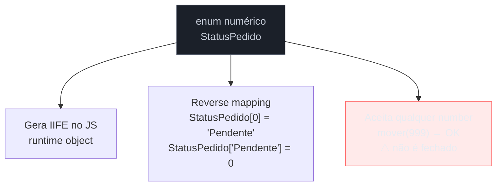
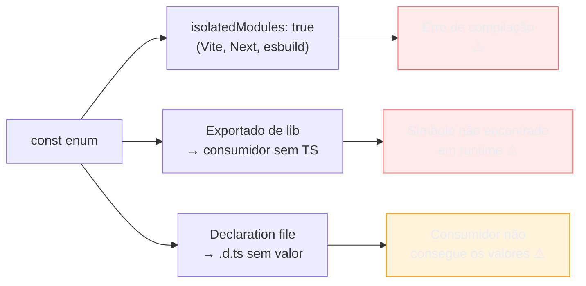
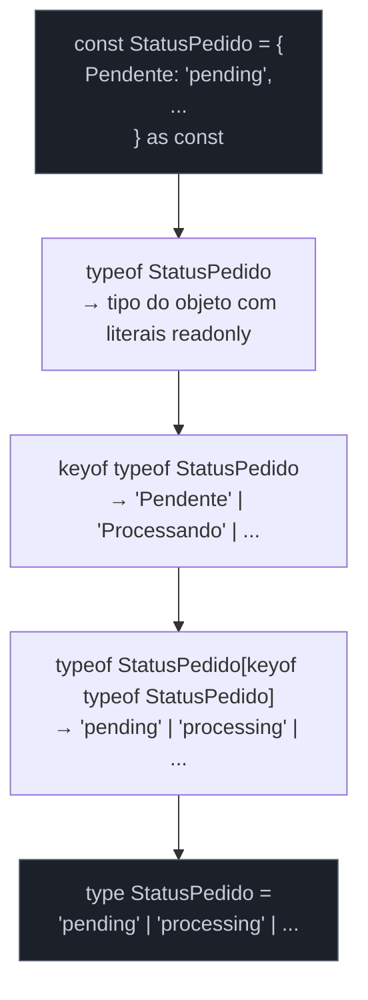

# Enums, const objects e modelagem de constantes

> [!abstract] TL;DR
> Toda aplicação precisa de um conjunto fechado de constantes — os status de um pedido, as roles de um usuário, os tipos de evento de um sistema. A pergunta é: como modelar isso em TypeScript? O `enum` parece a resposta natural, mas carrega problemas sérios: gera código em runtime, não é tree-shakeable, cria comportamentos estranhos com reverse mapping e não é 100% type-safe. A alternativa recomendada para código novo combina duas ideias que você já conhece das notas 02, 03 e 15: **union de literais** para o tipo (leve, apagado em runtime, totalmente type-safe) e **`as const` object** para o valor (objeto congelado que serve tanto como lookup quanto como fonte da union). O padrão sênior une os dois: um objeto `as const` com `typeof` + indexed access para derivar a union automaticamente — você nunca repete as strings, o conjunto permanece fechado, e o compilador garante exaustividade nos switches.

---

## A pergunta que esta nota responde

Imagine que você precisa modelar os status de um pedido num sistema de e-commerce: `"pending"`, `"processing"`, `"shipped"`, `"delivered"`, `"cancelled"`. Você tem pelo menos quatro abordagens em TypeScript:

1. `enum` numérico — o padrão do C#/Java que parece familiar
2. `enum` de strings — ligeiramente melhor, mas ainda problemático
3. `const enum` — otimização que introduz armadilhas novas
4. Union de literais + `as const` object — o padrão da comunidade TypeScript madura

A diferença não é estética. Ela afeta o bundle final, a segurança de tipos, a experiência de debugging e a compatibilidade com ferramentas. Vamos desmontar cada uma.

---

## O `enum` numérico e seus problemas

O `enum` é uma das poucas features do TypeScript que gera código em JavaScript — ele **não é apagado** em runtime como os tipos. Quando você escreve:

```ts
enum StatusPedido {
    Pendente,
    Processando,
    Enviado,
    Entregue,
    Cancelado,
}
```

O TypeScript gera o seguinte JavaScript:

```js
var StatusPedido;
(function (StatusPedido) {
    StatusPedido[StatusPedido["Pendente"]   = 0] = "Pendente";
    StatusPedido[StatusPedido["Processando"] = 1] = "Processando";
    StatusPedido[StatusPedido["Enviado"]    = 2] = "Enviado";
    StatusPedido[StatusPedido["Entregue"]   = 3] = "Entregue";
    StatusPedido[StatusPedido["Cancelado"]  = 4] = "Cancelado";
})(StatusPedido || (StatusPedido = {}));
```

Esse IIFE não é pequeno e não desaparece. Mas o problema mais sutil está no **reverse mapping**: o objeto gerado mapeia em _dois sentidos_ — de nome para número (`StatusPedido.Pendente === 0`) **e** de número para nome (`StatusPedido[0] === "Pendente"`). Isso cria uma armadilha imediata:

```ts
enum StatusPedido {
    Pendente,
    Processando,
    Enviado,
    Entregue,
    Cancelado,
}

// Parece razoável — verificar se é um status válido
function ehStatusValido(valor: number): valor is StatusPedido {
    return valor in StatusPedido;
}

// Mas isso retorna true para NÚMEROS que são nomes de membros também:
console.log(ehStatusValido(0));          // true — Pendente
console.log(ehStatusValido(1));          // true — Processando
// StatusPedido[0] === "Pendente" e StatusPedido["Pendente"] === 0
// O objeto tem CHAVES numéricas E de string — verificar com `in` é enganoso
```

Mas o problema mais grave é a type-safety — ou a falta dela. Enums numéricos **aceitam qualquer número** onde o tipo é esperado:

```ts
enum Direcao {
    Norte = 0,
    Sul   = 1,
    Leste = 2,
    Oeste = 3,
}

function mover(d: Direcao) {
    console.log(d);
}

mover(Direcao.Norte);   // OK
mover(42);              // TAMBÉM OK — TS aceita! Enum numérico não é fechado.
mover(999);             // TAMBÉM OK — o buraco existe
```

Isso viola a garantia fundamental que você espera de uma constante tipada: que apenas os valores declarados sejam aceitos. Enums numéricos simplesmente não oferecem isso.



---

## O `enum` de strings — melhor, mas ainda problemático

A variante de string corrige alguns problemas:

```ts
enum StatusPedido {
    Pendente    = "pending",
    Processando = "processing",
    Enviado     = "shipped",
    Entregue    = "delivered",
    Cancelado   = "cancelled",
}
```

O JavaScript gerado ainda existe — ainda é um IIFE no bundle. Mas agora:

- Não há reverse mapping (strings não criam mapeamento bidirecional)
- O type é fechado: só `StatusPedido.Pendente`, `StatusPedido.Processando` etc. são aceitos — você não pode passar `"qualquer-string"` diretamente

```ts
function processarPedido(status: StatusPedido) {
    // ...
}

processarPedido(StatusPedido.Pendente);   // OK
processarPedido("pending");               // ERRO — string não é StatusPedido
```

Parece ótimo, mas esse fechamento cria um problema diferente: **você não consegue usar strings literais onde o tipo é esperado**. Se você recebeu `"pending"` da API (o que inevitavelmente acontece), precisa fazer um cast ou usar `StatusPedido.Pendente`. Isso cria fricção desnecessária no boundary type↔runtime.

Além disso, o código ainda está no bundle. Não é tree-shakeable: se você importar `StatusPedido` mas usar apenas `StatusPedido.Pendente`, o bundler não sabe que pode eliminar o resto — o IIFE inteiro fica.

---

## `const enum` — a otimização que introduz armadilhas piores

O `const enum` parece resolver o problema do runtime:

```ts
const enum StatusPedido {
    Pendente    = "pending",
    Processando = "processing",
    Enviado     = "shipped",
}

function processar(status: StatusPedido) {
    if (status === StatusPedido.Pendente) {
        // O compilador substitui StatusPedido.Pendente por "pending" inline
        // O objeto StatusPedido desaparece do JS gerado
    }
}
```

O TypeScript apaga o objeto e substitui os usos por valores literais inline. Zero overhead de runtime. Parece perfeito. Mas existem armadilhas sérias:

**Armadilha 1 — isolatedModules:** ferramentas modernas (esbuild, swc, Vite, Babel) transpilam cada arquivo independentemente, sem checar outros arquivos. `const enum` requer acesso cross-file para inlining, o que é incompatível. Com `"isolatedModules": true` (o default em projetos Vite/Next), `const enum` gera erro.

**Armadilha 2 — bibliotecas:** se você exporta um `const enum` de uma biblioteca, consumidores que não usam o mesmo compilador TS não verão o inline — verão um símbolo inexistente. O TypeScript docs recomenda explicitamente evitar `const enum` em APIs públicas.

**Armadilha 3 — declaration files:** `.d.ts` gerado de `const enum` não inclui o valor — ele se torna `declare const enum`, e consumidores sem acesso ao código-fonte não conseguem os valores.



A recomendação da comunidade (e do TypeScript team) é evitar `const enum` exceto em cenários muito controlados (código não-público, sem ferramentas alternativas).

---

## Union de literais — a abordagem leve

A forma mais simples e idiomática de modelar um conjunto fechado em TypeScript moderno é a union de literais (que você conhece da nota [[07 - Union e intersection types]]):

```ts
type StatusPedido = "pending" | "processing" | "shipped" | "delivered" | "cancelled";

function processarPedido(status: StatusPedido): void {
    switch (status) {
        case "pending":
            console.log("Aguardando pagamento");
            break;
        case "processing":
            console.log("Em preparação");
            break;
        case "shipped":
            console.log("Enviado");
            break;
        case "delivered":
            console.log("Entregue");
            break;
        case "cancelled":
            console.log("Cancelado");
            break;
    }
}
```

Vantagens claras:

- **Zero overhead:** `type` é apagado em runtime. Não gera nenhum código JS.
- **Type-safe e fechado:** só os literais declarados são aceitos. Passar `"qualquer-coisa"` é erro.
- **Strings literais funcionam diretamente:** `processarPedido("pending")` é válido — sem precisar de `StatusPedido.Pendente`.
- **Tree-shakeable:** não há valor para tree-shake, porque não existe em runtime.
- **Fácil de serializar:** o valor que circula pela API é exatamente a string, sem conversão.

Mas tem uma limitação real: **você não tem um objeto com os valores para usar como constantes no código**. Se você quiser escrever `StatusPedido.Pendente` em vez de `"pending"`, ou iterar sobre todos os valores válidos, a union pura não ajuda. É aqui que entra o `as const` object.

---

## O padrão sênior: `as const` object + `typeof` + indexed access

Este é o padrão que fecha o circuito das notas 03 (`as const`), 15 (`typeof` e indexed access) e esta nota. A ideia é usar um objeto como a **fonte da verdade** e derivar o tipo automaticamente:

```ts
// 1. O objeto é a fonte da verdade — um único lugar para adicionar/remover valores
const StatusPedido = {
    Pendente:    "pending",
    Processando: "processing",
    Enviado:     "shipped",
    Entregue:    "delivered",
    Cancelado:   "cancelled",
} as const;
// Tipo inferido: { readonly Pendente: "pending"; readonly Processando: "processing"; ... }

// 2. Derivar o tipo union automaticamente — typeof + indexed access
type StatusPedido = typeof StatusPedido[keyof typeof StatusPedido];
// Equivale a: "pending" | "processing" | "shipped" | "delivered" | "cancelled"

// 3. Usar — você tem AMBOS: o objeto com valores e o tipo union
function processarPedido(status: StatusPedido): void {
    switch (status) {
        case StatusPedido.Pendente:
            console.log("Aguardando pagamento");
            break;
        case StatusPedido.Enviado:
            console.log("Enviado");
            break;
        // ...
    }
}

// Ambos funcionam — a string literal e a referência ao objeto
processarPedido("pending");                // OK — é StatusPedido
processarPedido(StatusPedido.Processando); // OK — "processing" é StatusPedido
processarPedido("qualquer-coisa");         // ERRO — não é StatusPedido
```

O truque de `typeof StatusPedido[keyof typeof StatusPedido]`:

1. `typeof StatusPedido` — o tipo do objeto: `{ readonly Pendente: "pending"; readonly Processando: "processing"; ... }`
2. `keyof typeof StatusPedido` — as chaves: `"Pendente" | "Processando" | "Enviado" | "Entregue" | "Cancelado"`
3. `typeof StatusPedido[keyof typeof StatusPedido]` — indexed access: os valores correspondentes às chaves, que são os literais de string

Você viu esse mecanismo em detalhe na nota [[15 - keyof, typeof e indexed access types]]. Aqui ele aparece em seu caso de uso mais prático.



---

## Exemplo trabalhado: as três abordagens no mesmo caso real

Vamos comparar as três abordagens principais no mesmo problema: modelar o nível de prioridade de um ticket de suporte (baixo, médio, alto, crítico) com capacidade de:

1. Anotar parâmetros de função
2. Usar como valor no código (ex.: `Prioridade.Alta`)
3. Serializar/deserializar para JSON
4. Checar exaustivamente em switch

```ts
// ─────────────────────────────────────────────────────────────
// ABORDAGEM 1: enum de strings
// ─────────────────────────────────────────────────────────────
enum PrioridadeEnum {
    Baixa   = "low",
    Media   = "medium",
    Alta    = "high",
    Critica = "critical",
}

function escalarEnum(p: PrioridadeEnum): string {
    switch (p) {
        case PrioridadeEnum.Baixa:   return "SLA 72h";
        case PrioridadeEnum.Media:   return "SLA 24h";
        case PrioridadeEnum.Alta:    return "SLA 4h";
        case PrioridadeEnum.Critica: return "SLA 1h";
    }
}

// Problema: string literal não é aceita diretamente
// escalarEnum("low");              // ERRO — precisa ser PrioridadeEnum
escalarEnum(PrioridadeEnum.Baixa);  // OK, mas verboso

// O objeto PrioridadeEnum existe em runtime — bundle inclui o IIFE

// ─────────────────────────────────────────────────────────────
// ABORDAGEM 2: union de literais pura
// ─────────────────────────────────────────────────────────────
type PrioridadeUnion = "low" | "medium" | "high" | "critical";

function escalarUnion(p: PrioridadeUnion): string {
    switch (p) {
        case "low":      return "SLA 72h";
        case "medium":   return "SLA 24h";
        case "high":     return "SLA 4h";
        case "critical": return "SLA 1h";
    }
}

// String literal funciona diretamente — ótimo na boundary
escalarUnion("low");    // OK
escalarUnion("urgent"); // ERRO — não é PrioridadeUnion

// Mas: sem objeto para usar como Prioridade.Alta no código
// Sem forma de iterar sobre todos os valores

// ─────────────────────────────────────────────────────────────
// ABORDAGEM 3: as const object + typeof (padrão sênior)
// ─────────────────────────────────────────────────────────────
const Prioridade = {
    Baixa:   "low",
    Media:   "medium",
    Alta:    "high",
    Critica: "critical",
} as const;

type Prioridade = typeof Prioridade[keyof typeof Prioridade];
// "low" | "medium" | "high" | "critical"

// Helper: todos os valores para validação/iteração
const PRIORIDADES = Object.values(Prioridade);
// readonly ["low", "medium", "high", "critical"]

function ehPrioridade(valor: string): valor is Prioridade {
    return (PRIORIDADES as readonly string[]).includes(valor);
}

function escalar(p: Prioridade): string {
    switch (p) {
        case Prioridade.Baixa:   return "SLA 72h";
        case Prioridade.Media:   return "SLA 24h";
        case Prioridade.Alta:    return "SLA 4h";
        case Prioridade.Critica: return "SLA 1h";
    }
}

// Tudo funciona:
escalar("low");           // OK — string literal aceita
escalar(Prioridade.Alta); // OK — referência ao objeto aceita
escalar("urgent");        // ERRO — não é Prioridade

// Validação em runtime para boundaries (API, form):
const raw = req.body.prioridade; // string
if (ehPrioridade(raw)) {
    escalar(raw); // OK — narrowed para Prioridade
}
```

> [!example] Por que a abordagem 3 vence
> A abordagem 3 oferece o que a union pura não tem (objeto com nomes semânticos, iteração, guard de runtime) e o que o enum não oferece adequadamente (zero runtime no bundle além do objeto, strings literais aceitas diretamente, tree-shakeable, sem reverse mapping, sem IIFE). É o único padrão que satisfaz todos os critérios simultaneamente.

---

## Tabela comparativa honesta


| Critério | enum numérico | enum string | const enum | union pura | as const object |
|---|:---:|:---:|:---:|:---:|:---:|
| Zero código em runtime | ❌ IIFE | ❌ IIFE | ✅* | ✅ | ✅ objeto simples |
| Type-safe (fechado) | ⚠️ aceita number | ✅ | ✅ | ✅ | ✅ |
| Aceita string literal | — | ❌ | ❌ | ✅ | ✅ |
| Uso como `Obj.Valor` | ✅ | ✅ | ✅ | ❌ | ✅ |
| Iteração sobre valores | ⚠️ (com reverso) | ⚠️ | ❌ | ❌ | ✅ `Object.values` |
| Compatível isolatedModules | ✅ | ✅ | ❌ | ✅ | ✅ |
| Serializável direto (JSON) | ❌ (número) | ✅ | — | ✅ | ✅ |
| Tree-shakeable | ❌ | ❌ | ✅* | ✅ | ✅ se unused |

*`const enum` elimina o objeto, mas tem as armadilhas de `isolatedModules` e libs.

---

## Quando `enum` ainda faz sentido

Honestidade primeiro: existem casos onde `enum` (especialmente de string) ainda é razoável.

**Interop com código legado ou gerado:** se você está consumindo uma API que já usa `enum` TypeScript (OpenAPI generators, Prisma enum), pode ser mais prático manter o `enum` do que mapear manualmente para `as const`. Nesse caso, use `enum` de string, não numérico.

**Flags de bits (bitfields):** o único caso onde enum numérico tem vantagem real é modelar permissões como flags OR-áveis. Exemplo:

```ts
enum Permissao {
    Nenhuma  = 0,
    Leitura  = 1 << 0, // 1
    Escrita  = 1 << 1, // 2
    Exec     = 1 << 2, // 4
    Admin    = Leitura | Escrita | Exec, // 7
}

const perms = Permissao.Leitura | Permissao.Escrita; // 3
const temLeitura = (perms & Permissao.Leitura) !== 0; // true
```

Esse padrão é genuinamente mais legível com `enum` numérico do que com alternativas. Mas é raro em TypeScript moderno (JavaScript não tem um tipo inteiro nativo, então bitfields são convenção, não primitiva).

**Ecossistema de equipe:** se o time inteiro já usa `enum` de string consistentemente, a uniformidade pode valer mais que a pureza técnica. O padrão `as const` vence tecnicamente, mas não é uma batalha que vale travar em todo PR de todo projeto.

> [!note] A regra prática
> Em código novo, sem constrangimentos externos: use `as const` object + union derivada. Em código herdado com `enum` de string: converta se fizer sentido (feature flag, refactor planejado); do contrário, mantenha consistente. Nunca use `enum` numérico em código novo.

---

## O padrão com namespace para organização

Quando você tem muitos `as const` objects no mesmo arquivo, pode querer organização. Um padrão comum é usar `namespace` (raramente justificado em geral, mas aqui é aceitável):

```ts
// Alternativa: módulo separado por domínio
// pedido-constants.ts
export const StatusPedido = {
    Pendente:    "pending",
    Processando: "processing",
    Enviado:     "shipped",
    Entregue:    "delivered",
    Cancelado:   "cancelled",
} as const;

export type StatusPedido = typeof StatusPedido[keyof typeof StatusPedido];

export const PrioridadePedido = {
    Baixa:   "low",
    Media:   "medium",
    Alta:    "high",
    Critica: "critical",
} as const;

export type PrioridadePedido = typeof PrioridadePedido[keyof typeof PrioridadePedido];

// Uso no arquivo consumidor:
import { StatusPedido, type StatusPedido as StatusPedidoType } from "./pedido-constants";

// Se quiser o namespace-feel sem namespace real:
import * as PedidoConstants from "./pedido-constants";

PedidoConstants.StatusPedido.Pendente; // "pending"
```

> [!tip] `type` e `value` com o mesmo nome
> Repare que `StatusPedido` aparece duas vezes no exemplo acima — uma como `const` (valor) e outra como `type`. TypeScript permite isso porque tipos e valores vivem em espaços de nome separados. É o "pattern de mesmo nome" que o enum usa implicitamente — você pode replicar com `as const` sem as desvantagens do enum.

---

## Como explicar em inglês

When asked about modeling a closed set of constants in TypeScript, the answer has evolved. The old answer was `enum` — a feature borrowed from C# that generates runtime JavaScript, creates odd behaviors with numeric reverse mapping, and isn't tree-shakeable. For new code, the community consensus is clear: prefer **string literal unions** for types and **`as const` objects** for values.

The senior pattern combines both. You define an object with `as const` to freeze it as a literal type, then derive the union type automatically using `typeof` and indexed access: `type Status = typeof STATUS[keyof typeof STATUS]`. This gives you a namespace-like object (`Status.Pending`) for code, a type union for function signatures, and string literals that work at API boundaries — all without any runtime overhead beyond the plain object.

There are legitimate uses for `string enum`: consuming generated code (Prisma, OpenAPI generators), or interop with existing codebases that already use it consistently. Numeric enum with bit flags is the one case where the pattern is genuinely useful. But `const enum` should be avoided entirely — it breaks with `isolatedModules: true` (the default in Vite and Next.js projects) and creates issues in library code.

### Vocabulário-chave

| Português | Inglês |
|---|---|
| enum numérico | numeric enum |
| enum de strings | string enum |
| enum constante | const enum |
| union de literais | string literal union |
| objeto com `as const` | `as const` object / const assertion object |
| reverse mapping | reverse mapping |
| remoção de código não usado | tree-shaking |
| conjunto fechado de valores | closed set of values |
| overhead em runtime | runtime overhead |
| fronteira tipo↔runtime | type↔runtime boundary |
| módulos isolados | isolated modules |
| inferir a union a partir do objeto | derive the union from the object |

---

## Armadilhas comuns

> [!warning] Armadilha 1: esquecer o `as const` no objeto
> Sem `as const`, o TypeScript infere o tipo do objeto como `{ Pendente: string; ... }` — o tipo dos valores é `string` amplo, não os literais. A union derivada vira `string`, perdendo todo o fechamento.
> ```ts
> // Errado — sem as const
> const Status = {
>     Pendente: "pending",
>     Enviado:  "shipped",
> };
> type Status = typeof Status[keyof typeof Status]; // string — inútil!
>
> // Correto — com as const
> const Status = {
>     Pendente: "pending",
>     Enviado:  "shipped",
> } as const;
> type Status = typeof Status[keyof typeof Status]; // "pending" | "shipped" ✓
> ```

> [!warning] Armadilha 2: usar enum numérico e achar que é fechado
> Um parâmetro tipado como `enum` numérico aceita qualquer `number`. O compilador não impede `mover(999)`. Se você precisa de fechamento real, use string enum ou, melhor, `as const` object.
> ```ts
> enum Nivel { Baixo = 1, Medio = 2, Alto = 3 }
> function configurar(n: Nivel) { }
> configurar(99);  // TypeScript aceita silenciosamente — bug dormindo
> ```

> [!warning] Armadilha 3: `const enum` com ferramentas modernas
> `const enum` gera erro com `"isolatedModules": true`, que é o default em projetos Vite, Next.js e na maioria dos templates modernos. Você descobre isso na primeira build, não no editor.
> ```ts
> // tsconfig.json: "isolatedModules": true
> const enum Cor { Vermelho = "red", Verde = "green" }
> // Erro: 'const' enums can only be used in TypeScript files.
> // (com esbuild/swc que não leem outros arquivos para inlining)
> ```

> [!warning] Armadilha 4: `Object.values` de `as const` perde readonly em runtime
> `Object.values(Status)` retorna `string[]` em runtime — o TypeScript não consegue inferir literais de `Object.values`. Para um guard de runtime, você precisa de um cast explícito:
> ```ts
> const Status = { A: "a", B: "b" } as const;
> type Status = typeof Status[keyof typeof Status];
>
> // Para um type guard:
> const STATUS_VALUES = Object.values(Status) as Status[];
> // ou
> const STATUS_SET = new Set(Object.values(Status));
> function ehStatus(v: string): v is Status {
>     return STATUS_SET.has(v as Status);
> }
> ```

> [!warning] Armadilha 5: confundir o `type` e o `value` com o mesmo nome
> O padrão `const Foo = {...} as const; type Foo = typeof Foo[...]` funciona porque TS mantém espaços de nome separados para tipos e valores. Mas cuidado ao importar — `import { Foo }` importa o valor; `import type { Foo }` importa o tipo. Em alguns contextos você precisa de ambos explicitamente.
> ```ts
> import { StatusPedido } from "./constants";             // valor (objeto)
> import type { StatusPedido } from "./constants";        // tipo (union) — ok em TS 5.5+
> import { StatusPedido, type StatusPedido } from "./constants"; // ambos — padrão recomendado
> ```

---

## Veja também

- [[02 - Tipos primitivos, literais e inferência]] — literal types e widening; a base dos string literals usados na union
- [[03 - Arrays, tuplas e as const]] — `as const` em profundidade; como o compilador infere literais readonly
- [[07 - Union e intersection types]] — o `|` que forma a union; narrowing de union em switches
- [[15 - keyof, typeof e indexed access types]] — `typeof`, `keyof` e `T[K]`; o mecanismo que deriva a union do objeto
- [[03-Dominios/Tecnologia/TypeScript/20 - tsconfig e strict mode a fundo|20 - tsconfig e strict mode a fundo]] — `isolatedModules` e por que `const enum` quebra com ferramentas modernas
