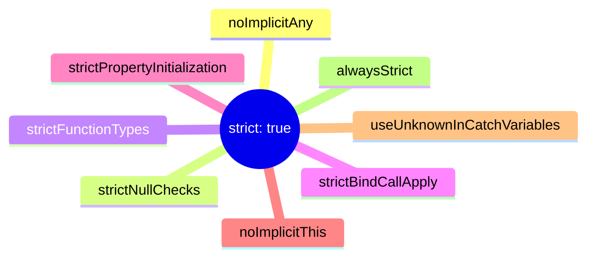
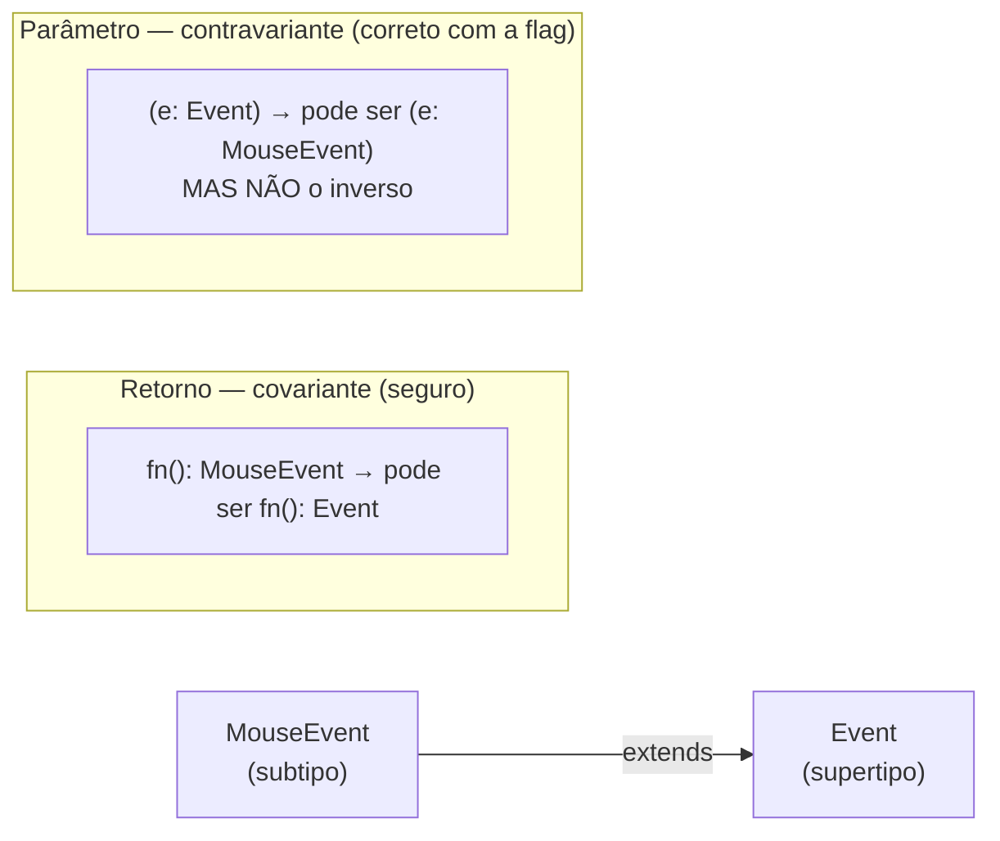
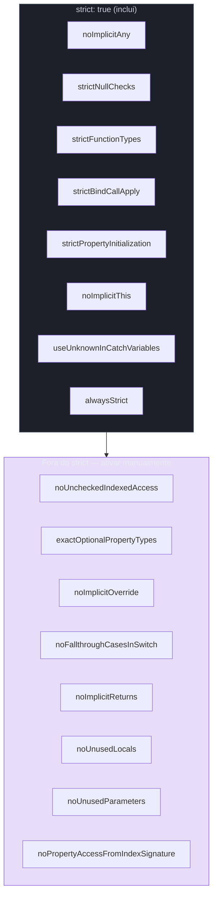
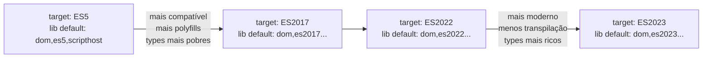
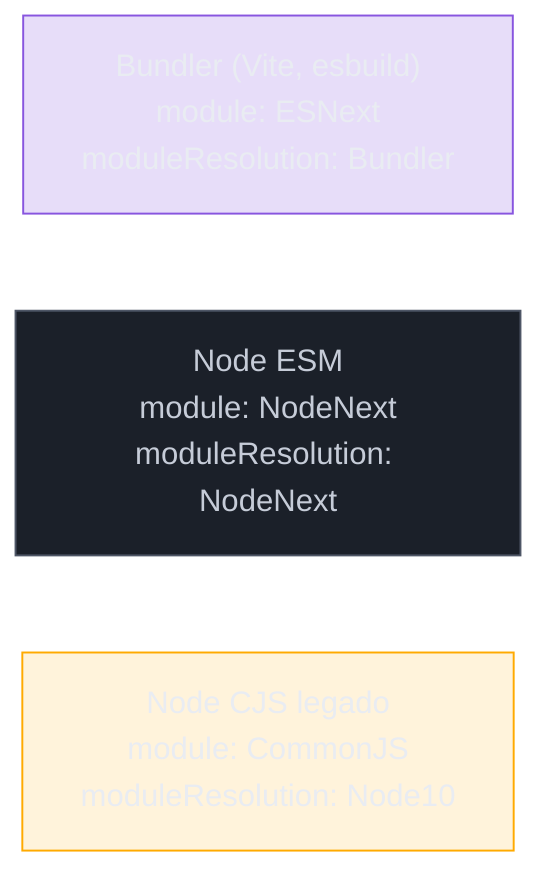

# tsconfig e strict mode a fundo

> [!abstract] TL;DR
> O `tsconfig.json` é o contrato entre você e o compilador TypeScript. `strict: true` não é um botão único — é um guarda-chuva que ativa oito flags individualmente, cada uma protegendo uma classe diferente de bug. Mas `strict: true` sozinho ainda deixa brechas: `noUncheckedIndexedAccess`, `exactOptionalPropertyTypes`, `noImplicitOverride` e outras precisam ser ativadas à parte. As flags `target`, `lib`, `module` e `moduleResolution` afetam quais tipos estão disponíveis e como imports são resolvidos — e escolhê-las erradas produz erros crípticos em runtime mesmo com o type checker satisfeito. A configuração ideal de um projeto novo não é a mais permissiva: é a mais honesta.

---

## O arquivo que governa tudo

Quando o compilador TypeScript processa um `.ts`, ele precisa responder dezenas de perguntas: qual versão de JavaScript você almeja? Quais APIs de runtime existem? Um acesso `arr[0]` pode retornar `undefined`? Uma propriedade `x?: string` pode receber `undefined` explícito? Essas respostas vivem no `tsconfig.json`.

Sem `strict`, o TS opera em modo permissivo — acredita em tudo que você diz e entrega uma experiência próxima ao JS com autocompletar. Com `strict: true` e as flags extras, ele vira um revisor rigoroso. Projetos novos se beneficiam de partir com tudo ligado; projetos existentes precisam migrar gradualmente. Em ambos os casos, entender o que cada flag protege é o que separa decisões conscientes de tentativa e erro.

Esta nota cobre o `tsconfig.json` na ótica de tipos: o que cada flag de `strict` protege, as flags extras que valem ouro, e como `target`/`lib`/`module`/`moduleResolution` afetam o que o type checker sabe. Build, transpilação e bundling ficam em [[03-Dominios/Tecnologia/Tooling e Build/index|Tooling e Build]].

---

## O guarda-chuva `strict: true`

`strict: true` é uma macro — uma declaração de intenção que expande para oito flags concretas. O diagrama abaixo mostra a hierarquia:



Cada uma dessas flags pode ser ligada ou desligada individualmente. Se você ativa `strict: true` e quer desligar apenas uma, basta sobrescrever:

```jsonc
{
  "compilerOptions": {
    "strict": true,
    "strictPropertyInitialization": false // exceção pontual — explique no comentário
  }
}
```

Mas antes de desligar qualquer flag, vale entender o que cada uma protege. Desligar uma flag é como remover um alarme de incêndio porque ele disparou uma vez.

### `noImplicitAny` — o buraco silencioso

Sem essa flag, o TypeScript infere `any` quando não consegue determinar o tipo de um parâmetro ou variável. O `any` implícito é pior que o `any` explícito porque é invisível: você não declarou nada, mas o type checker silenciosamente desativou a checagem naquele ponto.

```ts
// Sem noImplicitAny:
function calcular(x, y) { // x: any, y: any — sem reclamação
  return x + y;
}

calcular("5", 3); // "53" — concatenação de string, não soma
// Nenhum erro de tipo. Nenhum aviso.

// Com noImplicitAny:
function calcular(x, y) {
  // ERRO: Parameter 'x' implicitly has an 'any' type.
  // ERRO: Parameter 'y' implicitly has an 'any' type.
}

// Correto:
function calcular(x: number, y: number): number {
  return x + y;
}
```

A flag força você a ser explícito. Se você realmente quer `any` — talvez em código de interop temporário — declare-o: `x: any`. O `any` explícito é uma decisão consciente documentada no código. O `any` implícito é um esquecimento.

### `strictNullChecks` — o mais impactante

Esta é a flag com maior impacto prático e maior fricção em projetos legados. Sem ela, `null` e `undefined` são subtipos silenciosos de qualquer tipo — uma `string` pode ser `null` e o compilador não liga. Com ela, `null` e `undefined` são tipos próprios que precisam ser declarados explicitamente.

A nota [[05 - strictNullChecks - null, undefined e optional]] cobre este tópico com toda a profundidade que merece — inclui `noUncheckedIndexedAccess`, `exactOptionalPropertyTypes`, `?.`, `??` e o operador `!`. Não vou repetir aqui. O que importa para esta nota é saber que `strictNullChecks` está dentro de `strict: true` e é o alicerce sobre o qual as outras flags constroem.

### `strictFunctionTypes` — contravariância de parâmetros

Esta flag aplica a regra correta de variância: parâmetros de função são verificados de forma *contravariante*. Sem ela, o TS usa bivarância, o que permite atribuições inseguras em callbacks.

```ts
type GenericHandler = (event: Event) => void;

// Com strictFunctionTypes:
const handler: GenericHandler = (event: MouseEvent) => {
  event.clientX; // ERRO — GenericHandler pode receber qualquer Event,
                 // mas MouseEvent.clientX não existe em Event genérico
};

// Seguro (supertipo no parâmetro):
const handler2: GenericHandler = (event: Event) => { // OK
  console.log(event.type);
};
```



> [!note] Exceção: métodos de classe
> `strictFunctionTypes` se aplica a tipos de função em sintaxe arrow. Métodos declarados com sintaxe de método (`method(x: T): void`) continuam bivariant — decisão intencional para não quebrar padrões de OOP comuns.

### `strictBindCallApply` — tipagem de `.bind`, `.call`, `.apply`

Sem essa flag, `.bind()`, `.call()` e `.apply()` retornam `any` e aceitam qualquer coisa como argumentos. Com ela, o type checker verifica os argumentos contra a assinatura original da função:

```ts
function saudar(nome: string, titulo: string): string {
  return `Olá, ${titulo} ${nome}`;
}

// Com strictBindCallApply:
saudar.call(null, "Silva", "Dr.");     // OK
saudar.call(null, "Silva", 42);        // ERRO: Argument of type 'number' is not assignable to 'string'
saudar.call(null, "Silva");            // ERRO: Expected 2 arguments, but got 1

const saudarDr = saudar.bind(null, "Silva"); // tipo: (titulo: string) => string
saudarDr("Dr.");    // OK
saudarDr(42);       // ERRO — 42 não é string
```

É uma flag de baixo impacto em projetos modernos (`.bind`/`.call`/`.apply` são menos usados com arrow functions), mas o custo de ativá-la é zero para código novo e zero falsos positivos.

### `strictPropertyInitialization` — classes sem gaps

Esta flag exige que toda propriedade de classe declarada seja inicializada no construtor ou tenha um tipo que inclua `undefined`:

```ts
// Com strictPropertyInitialization:
class Repositorio {
  private db: Database; // ERRO: Property 'db' has no initializer
                        // and is not definitely assigned in the constructor
  
  constructor() {
    // db não foi inicializado aqui
  }
}

// Corretos:
class RepositorioA {
  private db: Database;
  
  constructor(db: Database) {
    this.db = db; // OK — inicializado no construtor
  }
}

class RepositorioB {
  private db: Database | undefined; // OK — undefined é explícito
}

class RepositorioC {
  private db!: Database; // OK — assertiva definitiva: "confio que será inicializado antes do uso"
}
```

O `!` de assertiva definitiva (`definite assignment assertion`) é o escape hatch. Use quando a inicialização acontece fora do construtor de forma garantida — por exemplo, em frameworks de injeção de dependência que inicializam propriedades via decorators (NestJS, Angular). Não é diferente do non-null assertion `!` em semântica: você promete ao compilador que vai cumprir.

### `noImplicitThis` — o `this` perdido

Em funções regulares (não arrow), `this` tem tipo implícito `any` sem essa flag. Com ela, o TS exige que `this` seja tipado explicitamente, e erros de contexto de chamada são capturados em compilação:

```ts
function formatName(this: { nome: string; sobrenome: string }): string {
  return `${this.nome} ${this.sobrenome}`;
}

formatName.call({ nome: "Maria", sobrenome: "Silva" }); // OK
formatName.call({ nome: "João" });                       // ERRO — falta sobrenome
```

### `useUnknownInCatchVariables` — catch seguro

Adicionada no TypeScript 4.0 e incluída no `strict` a partir do 4.4. Sem ela, a variável em `catch (e)` tem tipo `any`. Com ela, tem tipo `unknown`:

```ts
// Antes (ou sem a flag):
try {
  await fetch(url);
} catch (e) {
  console.log(e.message); // any — sem reclamação, mas pode não ser Error
}

// Com useUnknownInCatchVariables:
try {
  await fetch(url);
} catch (e) {
  // e: unknown
  if (e instanceof Error) {
    console.log(e.message); // OK — narrowed para Error
  } else {
    console.log("Erro desconhecido:", String(e));
  }
}
```

Isso é correto: em JavaScript, qualquer coisa pode ser lançada — `throw "string"`, `throw 42`, `throw { code: 500 }`. Assumir que o que está no `catch` é um `Error` é um bug frequente, e essa flag o captura em compilação.

### `alwaysStrict` — ECMAScript strict mode

Faz o compilador emitir `"use strict"` no topo de cada arquivo JavaScript gerado. Em módulos ESM, `"use strict"` é implícito — mas a flag garante que o output CommonJS também o inclua. Raramente relevante na prática, nunca prejudicial.

---

## Além do strict: as flags que valem ouro

`strict: true` é o piso mínimo. As flags abaixo estão fora do guarda-chuva `strict` — precisam ser ativadas manualmente — mas protegem categorias inteiras de bugs que o `strict` deixa passar.



### `noUncheckedIndexedAccess` — o `| undefined` que faltava

Coberto com profundidade em [[05 - strictNullChecks - null, undefined e optional]]. Em resumo: sem esta flag, `arr[0]` tem tipo `string` mesmo que o array possa estar vazio. Com ela, tem tipo `string | undefined`, forçando verificação antes de usar. O mesmo se aplica a `Record<string, T>` — `scores["chave"]` retorna `T | undefined`, não `T`.

É a flag com maior impacto prático fora do `strict` e, ironicamente, a que mais projetos novos esquecem de ativar.

### `exactOptionalPropertyTypes` — ausência não é `undefined`

Também coberta em [[05 - strictNullChecks - null, undefined e optional]]. A distinção: `x?: string` significa "a chave `x` pode estar ausente do objeto". Sem esta flag, também aceita `x: undefined`. Com ela, `x?: string` aceita apenas `string` ou ausência — não `undefined` explícito.

### `noImplicitOverride` — herança segura

Quando você usa herança de classe, `noImplicitOverride` exige que métodos que sobrescrevem um método da classe pai sejam marcados com a palavra-chave `override`. Isso previne um bug silencioso: a classe pai renomeia um método e a subclasse continua com o método antigo — que agora é um método novo, não uma sobrescrita.

```ts
class Animal {
  move(): void {
    console.log("moving...");
  }
}

// Com noImplicitOverride:
class Dog extends Animal {
  move(): void { // ERRO: This member must have an 'override' modifier
    console.log("running...");
  }
}

class DogCorreto extends Animal {
  override move(): void { // OK — intenção declarada
    console.log("running...");
  }
  
  // Se Animal renomear 'move' para 'locomote':
  // override move(): void { // ERRO — 'move' não existe em Animal
  // }
  // Você descobre em compile time, não em runtime.
}
```

### `noFallthroughCasesInSwitch` — switch sem fall-through acidental

Proíbe `case` que "cai" no próximo sem um `break`, `return` ou `throw` explícito:

```ts
// Com noFallthroughCasesInSwitch:
function processar(status: string): string {
  switch (status) {
    case "ativo":
      console.log("ativo");
      // ERRO: Fallthrough case in switch — falta break/return
    case "inativo":
      return "processado";
    default:
      return "desconhecido";
  }
}

// Correto:
switch (status) {
  case "ativo":
    console.log("ativo");
    return "ativo processado"; // ou break
  case "inativo":
    return "processado";
}
```

O fall-through intencional (quando você quer que dois `case` compartilhem o mesmo bloco) continua possível com `case "a": case "b":` consecutivos sem código entre eles — a flag só bloqueia fall-through com código no meio.

### `noImplicitReturns` — retorno garantido

Exige que toda função que declara um tipo de retorno não-`void` tenha um `return` em todos os caminhos de código. Sem ela, um caminho sem `return` retorna `undefined` silenciosamente:

```ts
// Com noImplicitReturns:
function getLabel(status: "ativo" | "inativo" | "pendente"): string {
  if (status === "ativo") return "Ativo";
  if (status === "inativo") return "Inativo";
  // ERRO: Not all code paths return a value.
  // Falta: 'pendente'
}
```

Esta flag complementa o exhaustiveness checking com discriminated unions — mas captura casos onde você usa `if/else` em vez de `switch`.

### `noUnusedLocals` e `noUnusedParameters`

Variáveis e parâmetros declarados mas nunca usados são sinais de refactoring incompleto. Com essas flags, o compilador os reporta como erros. O escape hatch: prefixe com `_` para sinalizar que o parâmetro é intencional (`_req`, `_event`).

> [!warning] Considere delegar ao ESLint
> Essas flags bloqueiam a compilação, o que pode atrapalhar durante refactorings ativos. Uma alternativa prática: delegar a `@typescript-eslint/no-unused-vars` no ESLint e deixar o `tsc` focado em tipos.

### `noPropertyAccessFromIndexSignature`

Quando um tipo tem uma index signature (`[key: string]: string`), sem essa flag você pode usar dot notation para acessar qualquer chave — inclusive as não declaradas explicitamente. Com ela, apenas propriedades explícitas aceitam dot notation; o resto exige brackets:

```ts
interface Config { [key: string]: string; host: string }
const c: Config = { host: "localhost", port: "3000" };

config.host;    // OK — propriedade explícita
config.port;    // ERRO com a flag — use config["port"]
config["port"]; // OK — bracket torna visível que pode não existir
```

---

## `target`, `lib`, `module`, `moduleResolution` na ótica de tipos

Essas quatro opções parecem ser sobre o output do compilador — e são — mas também afetam profundamente o que o type checker *sabe* sobre o seu código. Ignorá-las pode produzir erros estranhos onde o código parece certo mas o TS reclama de APIs que "não existem".

### `target` — o JavaScript que você gera

`target` especifica para qual versão de ECMAScript o TypeScript compila. Isso afeta dois aspectos:

1. **Quais construtos são desugared:** `async/await` para ES5 vira um gerador polyfillado; para ES2017, fica como está.
2. **Quais tipos estão disponíveis via `lib` padrão:** cada `target` puxa implicitamente uma `lib` padrão correspondente.



Se você define `target: "ES5"` mas usa `Promise` sem importar um polyfill, o TypeScript vai reclamar que `Promise` não existe — porque a lib padrão do ES5 não inclui `Promise`. Você precisa adicionar `"lib": ["ES2015", "DOM"]` explicitamente.

Para projetos novos em Node 18+, `"target": "ES2022"` ou `"ES2023"` é a escolha moderna. Para bibliotecas com suporte a browsers antigos, `"ES2017"` com `lib` customizada.

### `lib` — as APIs que você declara existir

`lib` controla quais APIs globais o TypeScript conhece. Se você usa `structuredClone` (ES2022), `Array.prototype.at` (ES2022), `Object.hasOwn` (ES2022) ou `crypto.randomUUID` (browser API), precisa da `lib` correspondente.

```jsonc
// Projeto frontend com APIs modernas:
{
  "compilerOptions": {
    "target": "ES2022",
    "lib": ["ES2022", "DOM", "DOM.Iterable"]
  }
}

// Projeto Node.js (sem DOM):
{
  "compilerOptions": {
    "target": "ES2022",
    "lib": ["ES2022"]
    // @types/node provê os tipos de Node — não entra em lib
  }
}

// Projeto com Web Workers:
{
  "compilerOptions": {
    "lib": ["ES2022", "WebWorker"]
    // WebWorker e DOM são mutuamente exclusivos como tipo global
  }
}
```

> [!tip] `lib` vs `@types`
> `lib` cobre APIs de linguagem e browser embutidas (`Array`, `Promise`, `fetch`, `document`). `@types/*` cobre tipos de pacotes npm e de Node.js (`@types/node` para `process`, `fs`, `path`). São ortogonais — você pode precisar de ambos.

### `module` — o sistema de módulos do output

`module` controla como o TypeScript escreve os `import`/`require` no JavaScript gerado:

| Valor | Quando usar |
|-------|-------------|
| `CommonJS` | Node.js legado, antes do ESM nativo |
| `ESNext` | Bundlers (Vite, esbuild) que entendem ESM nativo |
| `NodeNext` | Node.js com `"type": "module"` no `package.json` |
| `Bundler` | Bundlers modernos sem extensão obrigatória em imports |

A escolha de `module` afeta tipos: com `NodeNext`, o TypeScript exige extensão `.js` em imports relativos (porque Node ESM exige). Com `Bundler`, extensões são opcionais. Isso não é apenas estético — afeta se `import { foo } from './util'` compila ou não.

### `moduleResolution` — como o TS encontra os tipos

`moduleResolution` controla o algoritmo que o TS usa para resolver onde um `import 'xyz'` aponta:

| Valor | Par com `module` | Semântica |
|-------|-----------------|-----------|
| `Classic` | (legado, evite) | Resolução pré-2015, nunca use |
| `Node10` (padrão antigo) | `CommonJS` | Node.js CJS clássico |
| `Node16` / `NodeNext` | `NodeNext` | Node.js ESM + CJS, com exports map |
| `Bundler` | `ESNext` ou `Bundler` | Segue exports map, ignora extensões |

A armadilha comum: usar `module: "ESNext"` com `moduleResolution: "Node10"` (padrão antigo). O TS aceita imports sem extensão e sem exports map, mas o output quebra em runtime quando o bundler não resolve corretamente. Use sempre pares coerentes:



Resolução de módulos a fundo — exports map, subpath patterns, `paths`, monorepos — é território da nota [[21 - Modules - ESM, CJS e type-only imports]].

---

## `skipLibCheck` e `isolatedModules`

### `skipLibCheck` — praticidade vs. rigor

Com `skipLibCheck: true`, o TypeScript pula a checagem de tipos em arquivos `.d.ts` dentro de `node_modules`. Isso acelera a compilação consideravelmente e evita erros causados por `@types/*` desatualizados ou incompatíveis entre si.

O trade-off é real: você pode usar uma função de biblioteca de forma errada e o erro só aparecer em runtime. Mas na prática, as libs bem mantidas testam seus próprios tipos, e conflitos entre `@types` são mais comuns do que bugs introduzidos por pular a checagem deles.

**Recomendação pragmática:** ative `skipLibCheck: true` em aplicações. Em bibliotecas publicadas que expõem tipos para outros consumirem, considere desativar para garantir que seus tipos são compatíveis com o ecossistema.

```jsonc
// Aplicação: praticidade vence
{ "skipLibCheck": true }

// Biblioteca publicada: rigor vence
{ "skipLibCheck": false }
```

### `isolatedModules` — compatibilidade com transpiladores

Quando você usa esbuild, SWC ou o Node com `--experimental-strip-types` para transpilar TypeScript (em vez do `tsc`), esses transpiladores processam cada arquivo de forma independente — não têm acesso ao grafo de tipos completo. Isso torna certas features do TypeScript impossíveis de transpilar corretamente.

`isolatedModules: true` faz o `tsc` reclamar quando você usa essas features:

```ts
// ERRO com isolatedModules: true:

// 1. Re-exportar apenas tipos sem 'export type'
export { User } from './types'; // ambíguo — User é tipo ou valor?
export type { User } from './types'; // OK — claramente só tipo

// 2. Enums numéricos usados como valor em outro módulo
// (a solução é usar 'const enum' ou union de literais)

// 3. Namespace declarations que mesclam tipos e valores
namespace NS {
  export type Foo = string;
  export const bar = 1;
} // ERRO — namespaces são difíceis de tree-shake por transpiladores
```

Se seu pipeline usa esbuild ou Babel para transpilar (comum em projetos Next.js, Vite, ou Node com `tsx`), ative `isolatedModules: true` para detectar incompatibilidades cedo, em tempo de compilação do type checker, e não em runtime.

---

## A config recomendada: projeto novo em Node.js e frontend

Duas configs prontas-para-usar. Cada flag já foi explicada acima — aqui elas aparecem juntas, no contexto real de uso.

```jsonc
// Node.js moderno (ESM nativo, Node 18+)
{
  "compilerOptions": {
    // Ambiente
    "target": "ES2023",
    "module": "NodeNext",
    "moduleResolution": "NodeNext",
    "lib": ["ES2023"],

    // Strict mode completo + extras
    "strict": true,
    "noUncheckedIndexedAccess": true,        // arr[0]: T | undefined
    "exactOptionalPropertyTypes": true,       // x?: string ≠ x: string | undefined
    "noImplicitOverride": true,               // override explícito em herança
    "noFallthroughCasesInSwitch": true,       // sem fall-through acidental
    "noImplicitReturns": true,                // todos os caminhos retornam
    "noPropertyAccessFromIndexSignature": true,
    "noUnusedLocals": true,
    "noUnusedParameters": true,

    // Praticidade
    "skipLibCheck": true,
    "isolatedModules": true,                  // compatibilidade esbuild/swc/tsx
    "esModuleInterop": true,
    "forceConsistentCasingInFileNames": true,
    "resolveJsonModule": true,

    // Output
    "outDir": "./dist",
    "rootDir": "./src",
    "declaration": true,
    "declarationMap": true,
    "sourceMap": true
  },
  "include": ["src/**/*"],
  "exclude": ["node_modules", "dist", "**/*.test.ts"]
}
```

```jsonc
// Frontend com Vite (bundler resolve módulos)
{
  "compilerOptions": {
    "target": "ES2022",
    "module": "ESNext",
    "moduleResolution": "Bundler",            // Vite resolve; extensões opcionais
    "lib": ["ES2022", "DOM", "DOM.Iterable"],
    "jsx": "react-jsx",

    "strict": true,
    "noUncheckedIndexedAccess": true,
    "exactOptionalPropertyTypes": true,
    "noImplicitOverride": true,
    "noFallthroughCasesInSwitch": true,
    "noImplicitReturns": true,
    "skipLibCheck": true,
    "isolatedModules": true,
    "esModuleInterop": true,
    "forceConsistentCasingInFileNames": true
  },
  "include": ["src"],
  "references": [{ "path": "./tsconfig.node.json" }]
}
```

---

## Armadilhas comuns

**`strict: true` e achar que acabou.** As flags extras (`noUncheckedIndexedAccess`, `exactOptionalPropertyTypes`, etc.) ficam fora do guarda-chuva. Um projeto com só `strict: true` ainda deixa `arr[0]` com tipo `T` e aceita `x: undefined` em propriedades opcionais.

**`target` sem ajustar `lib`.** `target: "ES5"` com `lib` padrão não inclui `Promise`. Se você usa Promises, adicione `"lib": ["ES2015"]` ou mais recente — o erro `Cannot find name 'Promise'` vem daí.

**`module` e `moduleResolution` incompatíveis.** `module: "ESNext"` com `moduleResolution: "Node10"` aceita imports sem extensão em compilação, mas quebra em runtime (Node ESM exige extensões). Use sempre os pares documentados na tabela acima.

**`isolatedModules` descoberto tarde.** Re-exports de tipo sem `export type` explodem em centenas de erros quando você ativa a flag em código existente. Ative desde o início se o transpiler exige.

**`strictPropertyInitialization` com ORMs/DI.** NestJS, Prisma e TypeORM inicializam propriedades fora do construtor. Use `!` de assertiva definitiva nesses casos — mas proliferação de `!` é sinal de que a flag pode estar gerando ruído. Entenda o padrão do framework antes de sair adicionando.

---

## Como explicar em inglês

> "The `tsconfig.json` is the contract between your code and the TypeScript compiler. `strict: true` is a shorthand for eight individual flags — `noImplicitAny`, `strictNullChecks`, `strictFunctionTypes`, `strictBindCallApply`, `strictPropertyInitialization`, `noImplicitThis`, `useUnknownInCatchVariables`, and `alwaysStrict`. Each one catches a specific class of bugs.
>
> But `strict: true` alone still has gaps. I always add `noUncheckedIndexedAccess` — without it, array access returns `T` instead of `T | undefined`, which is a lie. `exactOptionalPropertyTypes` tightens optional properties: `x?: string` means 'absent or string', not 'string or undefined'. `noImplicitOverride` prevents silent bugs when a parent class renames a method. `noFallthroughCasesInSwitch` and `noImplicitReturns` catch logic gaps.
>
> The environment options — `target`, `lib`, `module`, and `moduleResolution` — also affect types, not just output. `target` determines which lib is pulled in by default, so if you target ES5 but use Promises, you need to add ES2015 to `lib` explicitly. `module` and `moduleResolution` must be paired correctly: `NodeNext` with `NodeNext` for Node.js ESM, `Bundler` with `ESNext` for Vite or esbuild.
>
> `skipLibCheck: true` is a practical trade-off for apps — it skips checking `.d.ts` files in `node_modules`, which speeds up compilation and avoids conflicts between `@types` packages. `isolatedModules: true` is a must if you use esbuild or SWC for transpilation — it flags TypeScript features that can't be handled per-file.
>
> My baseline for a new Node.js project: `strict: true` plus `noUncheckedIndexedAccess`, `exactOptionalPropertyTypes`, `noImplicitOverride`, `noFallthroughCasesInSwitch`, `noImplicitReturns`, `skipLibCheck`, `isolatedModules`. This config catches real bugs without blocking development."

### Vocabulário-chave

| Português | English |
|-----------|---------|
| opções do compilador | compiler options |
| modo estrito | strict mode |
| flag de compilador | compiler flag / compiler option |
| verificação de inicialização de propriedade | strict property initialization |
| any implícito | implicit any |
| contravariância de parâmetro | parameter contravariance |
| sobrescrita | override |
| fall-through de switch | switch fallthrough |
| assertiva de atribuição definitiva | definite assignment assertion |
| resolução de módulos | module resolution |
| versão alvo | target version |
| módulos isolados | isolated modules |
| pular checagem de libs | skip lib check |
| mapa de declarações | declaration map |
| exportar apenas tipos | type-only export |

---

## Veja também

- [[05 - strictNullChecks - null, undefined e optional]] — `strictNullChecks`, `noUncheckedIndexedAccess` e `exactOptionalPropertyTypes` em profundidade; `?.`, `??` e o operador `!`.
- [[21 - Modules - ESM, CJS e type-only imports]] — `moduleResolution` a fundo, `export type`, `verbatimModuleSyntax`, resolução em monorepos.
- [[25 - TypeScript em escala - performance do compilador e project references]] — `incremental`, `composite`, `tsBuildInfoFile`, project references para monorepos grandes.
- [[03-Dominios/Tecnologia/Tooling e Build/index|Tooling e Build]] — transpilação (esbuild, SWC, swc-loader), bundling (Vite, webpack, Rollup); o `tsconfig.json` enquanto ferramenta de build e não só type checker.
