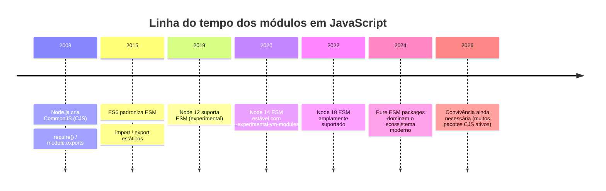
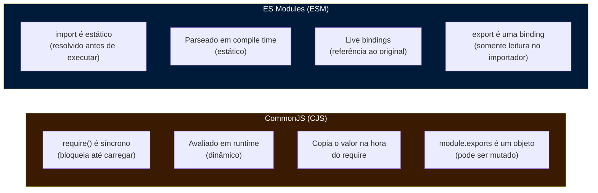
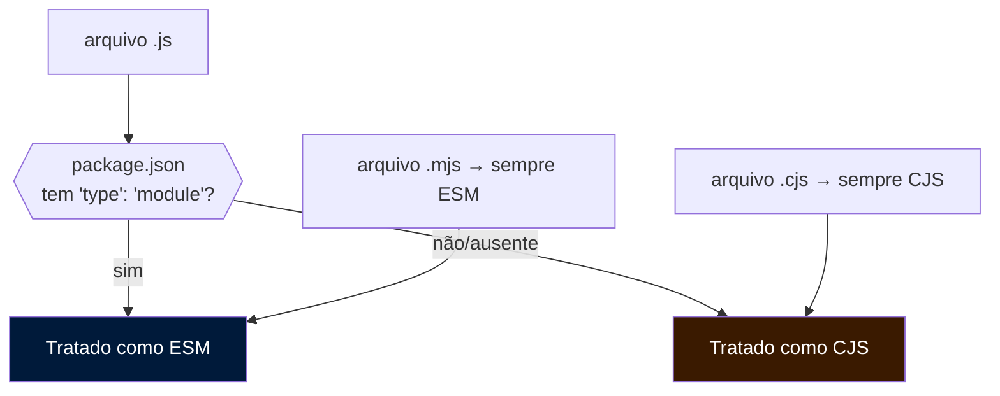
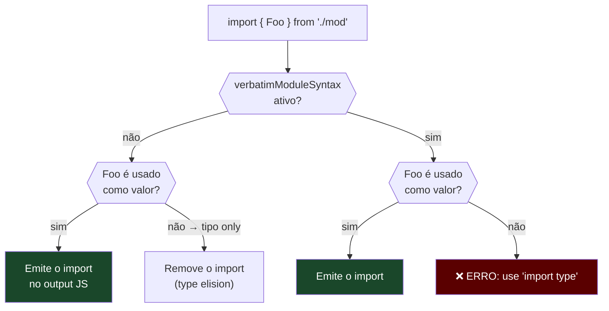
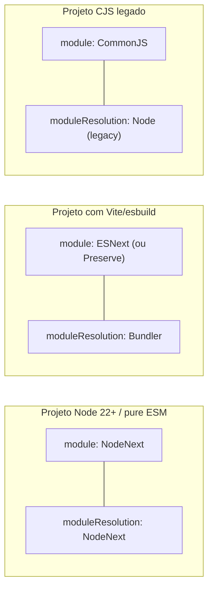
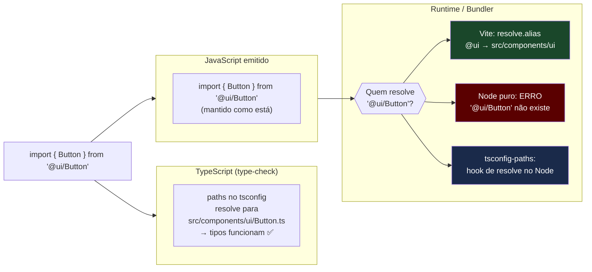
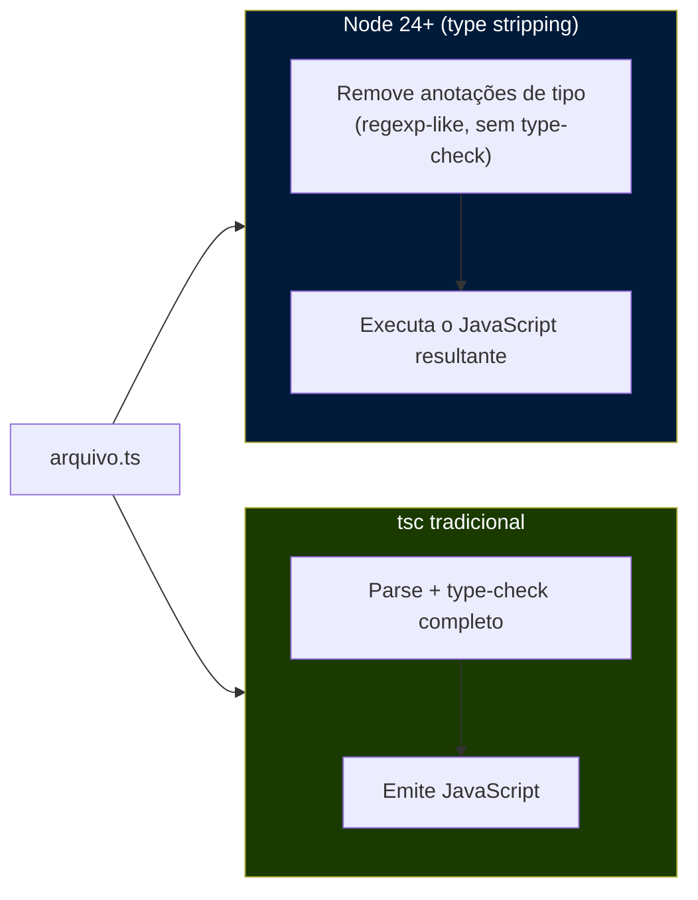

# Modules - ESM, CJS e type-only imports

> [!abstract] TL;DR
> O TypeScript não inventou o problema dos módulos — ele herdou toda a divisão histórica entre **ESM** (o padrão da linguagem, com `import`/`export` estáticos) e **CJS** (o sistema do Node, com `require`/`module.exports`). O que o TS adiciona é uma camada de verificação em cima: a flag `module` diz qual sistema de módulos gerar; `moduleResolution` diz como resolver os caminhos na análise de tipos; `import type`/`export type` garante que imports puramente de tipos sejam apagados sem deixar rastro no output; e `verbatimModuleSyntax` (TS 5.0) tornou tudo isso mais previsível ao exigir que você diga o que quer, sem deixar o compilador adivinhar. A armadilha que queima todo mundo: `paths` no tsconfig faz o *type-checker* encontrar seus aliases — mas quem reescreve os imports no bundle ou no runtime é o **bundler**, não o TS.

---

## A divisão que ainda dói

Imagine que JavaScript teve décadas de vida antes de ter um sistema de módulos oficial. Nesse vácuo, o Node.js criou o próprio sistema em 2009: **CommonJS** (CJS). Simples, síncrono, funciona com `require()` em qualquer ponto do código. Durante anos, o ecossistema npm inteiro foi construído sobre essa base.

Em 2015, o ES2015 (ES6) finalmente padronizou módulos na especificação da linguagem: **ESM** (ECMAScript Modules). Sintaxe diferente (`import`/`export`), semântica diferente (estática, assíncrona, com live bindings), e uma promessa: ser o sistema definitivo tanto no browser quanto no Node.

O problema: o Node só adotou ESM de forma estável no v12 (2019) — dez anos depois do CJS. Nesse interim, o npm acumulou centenas de milhares de pacotes CJS. E quando o Node finalmente suportou ESM, fez isso com regras rígidas que CJS e ESM não podem se misturar livremente.

O TypeScript chegou em 2012, cresceu numa era CJS, e hoje precisa lidar com os dois mundos. Quando você vai configurar um projeto novo em 2026, precisa entender essa história para não tomar as decisões erradas.



---

## As diferenças fundamentais entre ESM e CJS

Antes de ver como o TypeScript lida com os dois, é importante ter clareza sobre o que os distingue — porque as diferenças não são apenas sintáticas.



O ponto mais importante para o TypeScript é que **ESM é estático**. Quando você escreve `import { foo } from './mod'`, o bundler e o runtime sabem, antes de executar qualquer linha de código, que você depende de `foo` em `'./mod'`. Isso permite tree-shaking, análise estática e — crucialmente para o TS — verificação de tipos precisa.

CJS é dinâmico: `require('./mod')` pode aparecer dentro de um `if`, dentro de uma função, pode receber um caminho calculado em runtime. O TypeScript ainda consegue checar isso quando o caminho é literal, mas perde muito poder analítico.

> [!note] Live bindings vs. cópia de valor
> Em CJS, quando você faz `const { counter } = require('./counter')`, você recebe uma **cópia** do valor de `counter` no momento do `require`. Se o módulo exportador mudar `counter` depois, o importador não vê a mudança.
>
> Em ESM, `import { counter } from './counter'` cria um **live binding**: se o módulo exportador atualizar `counter` (via `export let counter = ...`), o importador vê o novo valor. Isso raramente importa na prática do dia a dia, mas é fundamental para entender por que ESM e CJS têm semânticas incompatíveis.

### Como o Node sabe qual sistema usar?

No Node 22+, a regra é:

- Arquivo com extensão `.mjs` → sempre ESM
- Arquivo com extensão `.cjs` → sempre CJS
- Arquivo `.js` → depende do campo `"type"` no `package.json` mais próximo:
  - `"type": "module"` → `.js` é ESM
  - `"type": "commonjs"` (ou ausente) → `.js` é CJS
- Arquivo `.ts` → o TypeScript decide com base em `module` e `moduleResolution` no tsconfig



---

## Como o TypeScript lida com os dois sistemas

O TypeScript não executa código — ele verifica tipos e (quando você usa `tsc`) emite JavaScript. Duas flags no tsconfig controlam como ele trata módulos:

**`module`** — qual sistema de módulos o TypeScript deve *emitir* (ou assumir) no output:
- `"CommonJS"` → o TS emite `require()`/`module.exports`
- `"ESNext"` → o TS emite `import`/`export` sem transformar
- `"NodeNext"` → o TS trata os arquivos conforme a regra do Node (`.mts` → ESM, `.cts` → CJS, `.ts` depende do `package.json`)
- `"Bundler"` → o TS assume que um bundler cuidará da resolução; relaxa certas restrições

**`moduleResolution`** — como o TypeScript *resolve caminhos* na análise de tipos (onde encontrar o arquivo para um dado import):
- `"node"` (legado) → algoritmo antigo do Node CJS; não entende ESM corretamente
- `"node16"`/`"nodenext"` → algoritmo correto para Node moderno (CJS + ESM)
- `"bundler"` → para projetos que usam Vite, esbuild, etc.; mais permissivo com extensões

> [!warning] `module` e `moduleResolution` precisam ser consistentes
> Usar `"module": "NodeNext"` com `"moduleResolution": "node"` (legado) vai gerar comportamentos estranhos e erros que parecem aleatórios. Em projetos Node modernos, pair `"module": "NodeNext"` com `"moduleResolution": "NodeNext"`. Em projetos com bundler, pair `"module": "ESNext"` com `"moduleResolution": "Bundler"`. A nota [[20 - tsconfig e strict mode a fundo]] cobre o efeito dessas flags na análise de tipos em mais detalhe.

### O problema das extensões em projetos ESM com Node

Quando você configura `"moduleResolution": "NodeNext"`, o TypeScript aplica as mesmas regras que o runtime do Node aplica: em ESM, você precisa incluir a extensão no import.

```ts
// ❌ Não funciona em ESM com NodeNext moduleResolution
import { foo } from './utils';

// ✅ Correto: extensão explícita
import { foo } from './utils.js';
```

Mas espera — o arquivo é `utils.ts`, não `utils.js`. Por que escrever `.js`?

Porque quando o TypeScript compila `utils.ts`, o output é `utils.js`. O runtime vai procurar `utils.js`. Então você escreve `.js` no import — e o TypeScript entende que você está se referindo ao arquivo `.ts` correspondente. É contraintuitivo, mas é como o ecossistema funciona:

> Escreva a extensão que o *arquivo emitido* vai ter, não a extensão do arquivo fonte.

```ts
// arquivo: src/utils.ts
export function calcular(x: number) { return x * 2; }

// arquivo: src/main.ts — com moduleResolution: NodeNext
import { calcular } from './utils.js';  // TS encontra utils.ts; runtime vai encontrar utils.js
```

Alternativamente, se você usa um bundler (Vite, esbuild, webpack), use `"moduleResolution": "Bundler"` — aí o bundler cuida da resolução e você não precisa se preocupar com extensões.

---

## `import type` e `export type`: tipos que somem de verdade

O TypeScript tem uma feature que parece menor mas tem implicações profundas: **type-only imports e exports**.

A ideia é simples: em TypeScript, às vezes você importa algo *apenas* para usá-lo como tipo — e nunca como valor em runtime. O tipo desaparece no output JavaScript. Mas se o compilador não sabe que você está importando só para tipos, ele pode ou não emitir o import no output, dependendo de como você usa o símbolo.

```ts
// arquivo: types.ts
export interface User {
    id: string;
    name: string;
}

export function createUser(name: string): User {
    return { id: crypto.randomUUID(), name };
}
```

```ts
// arquivo: service.ts — sem `import type`
import { User, createUser } from './types';

// `User` só é usado como tipo — o compilador vai apagar
// `createUser` é usado como valor — o import precisa existir em runtime

const u: User = createUser('Ana');
```

Nesse caso, o TypeScript é inteligente o suficiente para saber que `User` é só tipo e `createUser` é valor — ele vai emitir o import corretamente. Mas e se você importar `User` de um pacote externo só para usar em anotação de tipo?

```ts
// Aqui o TS pode ou não emitir o import dependendo de configurações e do bundler
import { SomeType } from 'external-lib';

function process(x: SomeType): void { ... }
```

### Por que `import type` existe

A forma explícita resolve três problemas concretos:

**1. Garantia de remoção no output**

```ts
import type { User } from './types';
// Garantido: esse import NUNCA aparece no JavaScript emitido
// Mesmo que seu bundler ou transpilador tenha bugs em type elision
```

**2. Dependências circulares**

Ciclos de dependência são um dos problemas mais chatos em projetos grandes. Se A importa B e B importa A, o Node precisa resolver qual inicializar primeiro — em CJS, isso resulta em objetos parcialmente inicializados; em ESM, é erro.

Com `import type`, você quebra o ciclo *de valor* mantendo o ciclo *de tipo*, que desaparece antes de chegar ao runtime:

```ts
// arquivo: user.ts
import type { Permission } from './permission';  // ciclo de TIPO — sem problema

export interface User {
    permissions: Permission[];
}
```

```ts
// arquivo: permission.ts
import type { User } from './user';  // ciclo de TIPO — sem problema

export interface Permission {
    grantedTo: User;
}
```

Sem `import type`, você teria um ciclo de valor que poderia quebrar em runtime.

**3. `isolatedModules` e transpilação arquivo-a-arquivo**

Quando você usa `"isolatedModules": true` no tsconfig (ou quando usa um transpilador de arquivo único como esbuild, swc ou Babel), cada arquivo é compilado sem ver os outros. O transpilador não pode saber se um símbolo importado é tipo ou valor — ele vê apenas o token.

```ts
// Com isolatedModules — isso pode causar problema
import { User } from './types';  // Transpilador não sabe: é tipo ou valor?

// Seguro — o transpilador sabe com certeza que pode apagar
import type { User } from './types';
```

> [!tip] `isolatedModules` e Vite/esbuild
> Projetos que usam Vite, esbuild ou swc para transpilação devem ter `"isolatedModules": true`. Esses transpiladores não rodam o type-checker completo do TypeScript — eles simplesmente apagam anotações de tipo de cada arquivo independentemente. Se você importa um símbolo que só existe como tipo sem usar `import type`, o transpilador pode gerar um import de runtime desnecessário (ou quebrar em alguns casos). O `isolatedModules: true` faz o TypeScript te avisar quando você não está usando `import type` onde deveria.

### A forma inline: `import { type Foo, Bar }`

TypeScript 4.5 adicionou a sintaxe de type modifier inline, para casos onde você importa tipos e valores do mesmo módulo:

```ts
// Antes do 4.5: dois imports separados
import type { User } from './user';
import { createUser } from './user';

// A partir do 4.5: um import com type modifier inline
import { type User, createUser } from './user';
//        ^^^^— este símbolo é só tipo, será removido
//                  ^^^^^^^^^^— este é valor, permanece
```

O mesmo funciona em exports:

```ts
// Exportar tipo sem incluí-lo no módulo de valor
export type { User };

// Ou inline:
export { type User, createUser };
```

---

## `verbatimModuleSyntax`: acabando com a adivinhação

Antes do TypeScript 5.0, havia uma flag chamada `importsNotUsedAsValues` que tentava controlar como o TS lidava com imports de tipos. Havia também `preserveValueImports`. As duas eram confusas, tinham edge cases e eram difíceis de compor.

Em **TypeScript 5.0**, ambas foram substituídas por uma flag unificada: `verbatimModuleSyntax`.

A regra é direta: **o TypeScript emite exatamente o que você escreveu, sem tentar adivinhar**. Se você usou `import type`, o import é removido. Se usou `import` (sem `type`), o import permanece no output — mesmo que o símbolo só seja usado como tipo.

```ts
// tsconfig: "verbatimModuleSyntax": true

// ❌ ERRO: você importou sem `type`, mas só usa como tipo
// TypeScript vai reclamar: use `import type`
import { User } from './types';
const u: User = getUser();

// ✅ Correto: explícito sobre a intenção
import type { User } from './types';
const u: User = getUser();

// ✅ Também correto: tipo inline
import { type User, createUser } from './user';
const u: User = createUser('Ana');
```



### Por que usar `verbatimModuleSyntax`?

**Previsibilidade.** Com a flag, o output é 1:1 com o que você escreveu, sem surpresas. Se você inspecionar o JavaScript gerado, cada import que você escreveu vai estar lá — exceto os `import type`, que foram removidos conforme prometido.

**Compatibilidade com transpiladores.** esbuild, swc e Babel com `@babel/plugin-transform-typescript` todos trabalham arquivo-a-arquivo e dependem de sintaxe explícita para saber o que remover. `verbatimModuleSyntax` alinha o TypeScript com esse modelo.

**Melhor integração com `isolatedModules`.** Na prática, `verbatimModuleSyntax: true` implica `isolatedModules: true` (e vai além). Se você já usa `isolatedModules`, migrar para `verbatimModuleSyntax` é o próximo passo.

> [!warning] `verbatimModuleSyntax` e CJS
> Se você emite CJS (`"module": "CommonJS"`), `verbatimModuleSyntax` tem um comportamento especial: ela reescreve `import`/`export` para `require`/`module.exports` normalmente (porque o output é CJS), mas ainda exige que você use `import type` para imports puros de tipo. A "verbatim" se aplica à distinção tipo vs. valor, não ao sistema de módulos alvo.

---

## `moduleResolution`: como o TypeScript encontra os tipos

Essa flag determina o algoritmo que o TypeScript usa para resolver um caminho de import até um arquivo de tipos. As opções relevantes em 2026:

| Valor | Quando usar | Comportamento |
|---|---|---|
| `"node"` (legacy) | Nunca em projetos novos | Algoritmo Node CJS antigo; não entende `.mjs`/`.mts` |
| `"node16"` | Projetos Node com suporte 16+ | Suporta CJS e ESM com as regras do Node |
| `"nodenext"` | Projetos Node modernos | Igual ao `node16`, mas atualiza conforme o Node evolui |
| `"bundler"` | Projetos com Vite, esbuild, webpack | Mais permissivo; assume bundler cuidará da resolução |



### O efeito em imports: o que cada resolução aceita

Com `"moduleResolution": "Bundler"`, você pode escrever imports sem extensão e sem `index`:

```ts
// moduleResolution: Bundler — bundler resolve
import { foo } from './utils';          // OK
import { bar } from './components';     // OK (pode ser components/index.ts)
```

Com `"moduleResolution": "NodeNext"`, você precisa ser explícito:

```ts
// moduleResolution: NodeNext — regras do Node ESM
import { foo } from './utils.js';       // ✅ extensão explícita (resolvida como .ts)
import { bar } from './components/index.js'; // ✅ explícito
import { baz } from './components';     // ❌ ERRO: sem extensão não é permitido em ESM Node
```

Essa distinção é a fonte de muita confusão quando você migra um projeto de bundler para Node ou vice-versa.

---

## Path aliases: o que o TypeScript faz (e não faz)

Path aliases são um recurso muito popular para limpar imports relativos profundos:

```ts
// Sem alias — path relativo doloroso
import { Button } from '../../../components/ui/Button';

// Com alias — limpo
import { Button } from '@ui/Button';
```

Você configura isso no tsconfig:

```json
{
  "compilerOptions": {
    "baseUrl": ".",
    "paths": {
      "@/*": ["src/*"],
      "@ui/*": ["src/components/ui/*"],
      "@hooks/*": ["src/hooks/*"]
    }
  }
}
```

O TypeScript vai resolver os aliases durante a **análise de tipos** — quando você passa o cursor em `@ui/Button`, ele encontra o arquivo correto e mostra os tipos. Erros de tipo funcionam. Intellisense funciona.

**Mas o TypeScript não reescreve os imports no output.**

Quando o `tsc` emite JavaScript, ele mantém `@ui/Button` como está. O runtime (Node) ou o bundler precisam saber o que `@ui/Button` significa.



### Como resolver em cada ambiente

**Com Vite:**

```ts
// vite.config.ts
import { defineConfig } from 'vite';
import path from 'path';

export default defineConfig({
    resolve: {
        alias: {
            '@': path.resolve(__dirname, 'src'),
            '@ui': path.resolve(__dirname, 'src/components/ui'),
        }
    }
});
```

**Com esbuild:**

```ts
// ou via plugin
import { build } from 'esbuild';
import { nodeExternalsPlugin } from 'esbuild-node-externals';

build({
    entryPoints: ['src/index.ts'],
    bundle: true,
    plugins: [nodeExternalsPlugin()],
    alias: {
        '@': './src',
        '@ui': './src/components/ui',
    }
});
```

**Com Node.js puro (sem bundler):**

Opção 1 — `tsconfig-paths`: carrega os paths do tsconfig em runtime via hook.

```bash
node -r tsconfig-paths/register dist/main.js
```

Opção 2 — `package.json` `imports` field (Node 12+): importmap nativo do Node.

```json
{
  "imports": {
    "#ui/*": "./dist/components/ui/*.js",
    "#hooks/*": "./dist/hooks/*.js"
  }
}
```

```ts
// No código TypeScript
import { Button } from '#ui/Button';  // prefixo # é a convenção do Node imports
```

> [!tip] O prefixo `#` é a solução nativa
> O campo `imports` do `package.json` com prefixo `#` é suportado nativamente pelo Node sem nenhum pacote extra, e o TypeScript entende isso com `"moduleResolution": "NodeNext"`. É a abordagem mais limpa para projetos Node puros em 2026.

---

## Node 22+ com TypeScript nativo: type stripping

Uma mudança importante que chegou ao Node 22 (e ficou estável no Node 24): suporte nativo a TypeScript via **type stripping**.

A ideia é simples: o Node simplesmente ignora toda a sintaxe de tipo do TypeScript e executa o código. Não há compilação, não há verificação de tipos, não há geração de arquivo JavaScript separado. O Node apenas remove as anotações e executa.

```bash
# Node 22 (experimental)
node --experimental-strip-types app.ts

# Node 24+ (estável)
node app.ts  # funciona diretamente
```

O que funciona com type stripping:

```ts
// ✅ Funciona: anotações de tipo são removidas
function somar(a: number, b: number): number {
    return a + b;
}

// ✅ Funciona: interfaces e type aliases
interface User { id: string; name: string; }
type ID = string;

// ✅ Funciona: generics
function identity<T>(x: T): T { return x; }

// ✅ Funciona: as, satisfies, !
const x = someValue as string;
```

O que **não** funciona (porque gera código, não apenas tipos):

```ts
// ❌ Não funciona: enums geram código JS
enum Direction { Up, Down }

// ❌ Não funciona: namespaces com implementação
namespace Utils { export function foo() {} }

// ❌ Não funciona: decorators experimentais (stage 2 antigo)
// Decorators stage 3 (TC39 padrão) funcionam com --experimental-transform-types

// ❌ Não funciona: parameter properties em construtores
class User {
    constructor(public name: string) {}  // sugar que gera código
}
```



> [!warning] Type stripping não substitui o type-checker
> O Node com type stripping é excelente para rodar scripts rápidos, ferramentas internas e protótipos sem setup de build. Mas ele **não verifica tipos** — se você tiver um erro de tipo, o Node vai ignorar e executar assim mesmo. Para garantias de corretude, você ainda precisa rodar `tsc --noEmit` ou ter uma etapa de type-check separada no CI.
>
> É uma distinção parecida com a do JavaScript em si: você pode escrever JS sem tools, mas em produção você quer linting e testes. Com type stripping, você ganha praticidade; com tsc, você ganha segurança.

---

## Exemplo trabalhado: configurar um projeto ESM real

Vamos montar um projeto Node com TypeScript e ESM do zero, fazendo cada decisão de configuração de forma consciente.

**Estrutura:**

```
meu-projeto/
├── src/
│   ├── index.ts
│   ├── utils/
│   │   └── format.ts
│   └── services/
│       └── api.ts
├── package.json
├── tsconfig.json
└── dist/           (gerado pelo tsc)
```

**`package.json`:**

```json
{
  "name": "meu-projeto",
  "version": "1.0.0",
  "type": "module",
  "main": "./dist/index.js",
  "exports": {
    ".": {
      "import": "./dist/index.js",
      "types": "./dist/index.d.ts"
    }
  },
  "scripts": {
    "build": "tsc",
    "typecheck": "tsc --noEmit",
    "start": "node dist/index.js"
  },
  "devDependencies": {
    "typescript": "^5.5.0"
  }
}
```

**`tsconfig.json`:**

```json
{
  "compilerOptions": {
    "target": "ES2023",
    "module": "NodeNext",
    "moduleResolution": "NodeNext",
    "lib": ["ES2023"],

    "strict": true,
    "verbatimModuleSyntax": true,

    "outDir": "./dist",
    "rootDir": "./src",
    "declaration": true,
    "declarationMap": true,
    "sourceMap": true
  },
  "include": ["src/**/*"]
}
```

**`src/utils/format.ts`:**

```ts
// Sem `type` aqui — a função vai ao runtime
export function formatDate(date: Date): string {
    return date.toISOString().split('T')[0];
}

// Este tipo só existe em compile time — export type deixa isso claro
export type DateString = `${number}-${number}-${number}`;
```

**`src/services/api.ts`:**

```ts
// `verbatimModuleSyntax: true` exige `import type` para imports puramente de tipo
import type { DateString } from '../utils/format.js';

// Este import tem valor (função) — import normal
import { formatDate } from '../utils/format.js';
//                                           ^^— extensão .js mesmo sendo .ts

interface ApiResponse {
    data: unknown;
    timestamp: DateString;
}

export async function fetchData(url: string): Promise<ApiResponse> {
    const res = await fetch(url);
    const data = await res.json() as unknown;
    return {
        data,
        timestamp: formatDate(new Date()) as DateString,
    };
}
```

**`src/index.ts`:**

```ts
import type { } from './services/api.js';  // importar tipo de módulo com side effects zerados
import { fetchData } from './services/api.js';

async function main() {
    const result = await fetchData('https://api.exemplo.com/data');
    console.log(result);
}

main();
```

**O que acontece quando você roda `tsc`:**

```
dist/
├── index.js          ← import { fetchData } from './services/api.js'  (mantido)
├── index.d.ts        ← declarações de tipo
├── utils/
│   ├── format.js     ← export function formatDate(date) { ... }  (tipo removido)
│   └── format.d.ts   ← export declare function formatDate(...); export type DateString = ...
└── services/
    ├── api.js        ← import { formatDate } from '../utils/format.js'
    │                    (import type removido; import de valor mantido)
    └── api.d.ts
```

> [!example] O que `verbatimModuleSyntax` faz aqui
> Em `api.ts`, você escreveu `import type { DateString }` e `import { formatDate }`. No JavaScript emitido (`api.js`), a linha `import type` desapareceu completamente. A linha `import { formatDate }` permanece exatamente como estava. O TypeScript não tentou "ser esperto" — ele emitiu verbatim o que você pediu.

---

## Como explicar em inglês

TypeScript's module system sits on top of the JavaScript module divide between **CommonJS** (the Node.js legacy, `require`/`module.exports`) and **ES Modules** (the language standard, static `import`/`export`). TypeScript adds a type-checking layer over both, controlled by two key tsconfig flags: `module`, which determines what kind of module syntax to emit or assume; and `moduleResolution`, which determines how TypeScript finds the type definitions for a given import path.

**Type-only imports** (`import type { Foo } from './bar'`) guarantee that a symbol is erased before reaching JavaScript runtime — useful for avoiding circular dependencies at the value level and for compatibility with transpilers that process files in isolation (esbuild, swc). **`verbatimModuleSyntax`** (TS 5.0) makes this explicit and predictable: TypeScript emits exactly what you write, without trying to infer whether an import is type-only or not.

**Path aliases** (`paths` in tsconfig) let TypeScript resolve `@ui/Button` to the right type during type-checking, but TypeScript does not rewrite those paths in the emitted output. The bundler (Vite, esbuild) or runtime (via `tsconfig-paths` or Node's `imports` field) is responsible for runtime resolution. This is the single most common misconception about aliases.

**Node 22+ type stripping** runs TypeScript files directly by removing type annotations — no compilation step, no type-checking. Useful for scripts and tooling; does not replace a proper `tsc --noEmit` check for production correctness.

### Vocabulário-chave

| Português | Inglês |
|---|---|
| módulo | module |
| importação estática | static import |
| importação dinâmica | dynamic import |
| importação somente de tipo | type-only import |
| apagamento de tipo | type erasure / type elision |
| resolução de módulo | module resolution |
| alias de caminho | path alias |
| interoperabilidade CJS/ESM | CJS/ESM interop |
| vinculação ao vivo | live binding |
| remoção de tipos (Node) | type stripping |
| dependência circular | circular dependency |
| emitir código | emit (code) |
| verificação sem emissão | type-check-only / `--noEmit` |

---

## Armadilhas comuns

> [!warning] Armadilha 1: `paths` no tsconfig não reescreve imports em runtime
> Essa é a armadilha mais comum com aliases. `@ui/Button` funciona no type-checker mas quebra no runtime porque o TypeScript não reescreve os caminhos no output. Você sempre precisa configurar o bundler (Vite `resolve.alias`, esbuild `alias`) ou usar `tsconfig-paths` para o Node. Se você vê `Cannot find module '@ui/Button'` em runtime, é isso.

> [!warning] Armadilha 2: extensão `.js` em projetos ESM com NodeNext
> Com `"moduleResolution": "NodeNext"`, você precisa escrever `import { foo } from './utils.js'` — mesmo que o arquivo seja `utils.ts`. A extensão reflete o arquivo *emitido*, não o fonte. Esquecer isso resulta em `Module not found` no runtime Node.

> [!warning] Armadilha 3: misturar ESM e CJS sem cuidado
> Com `"type": "module"` no `package.json`, todos os `.js` são ESM. Se você tentar fazer `require()` num módulo ESM, vai receber um erro em runtime (`require is not defined`). E o Node não permite que um arquivo ESM importe de forma síncrona um módulo CJS puro. A mistura é possível mas exige cuidado — `createRequire` para CJS dentro de ESM, e dynamic `import()` é assíncrono.

> [!warning] Armadilha 4: `import type` não é opcional com `verbatimModuleSyntax`
> Com `verbatimModuleSyntax: true`, usar `import { User } from './types'` quando `User` só é usado como tipo causa um erro de compilação. O TypeScript te força a ser explícito. Muitos projetos legados encontram dezenas de ocorrências quando ativam essa flag — o que é bom, porque revela todos os lugares onde a intenção não estava clara.

> [!warning] Armadilha 5: type stripping não faz type-checking
> Rodar `node app.ts` no Node 24 não garante ausência de erros de tipo — o Node apenas remove anotações e executa. Você pode ter um `string` onde espera um `number`, e o Node vai executar feliz. Sempre rode `tsc --noEmit` no CI para garantias reais de corretude.

> [!warning] Armadilha 6: `module: CommonJS` silenciosamente converte `import` para `require`
> Se você usa `"module": "CommonJS"`, o TypeScript converte `import`/`export` para `require`/`module.exports` no output. Isso significa que você pode escrever sintaxe ESM no `.ts` mas emitir CJS — o que parece funcionar mas pode criar bugs sutis de interop quando seu código é consumido por outras libs ESM. Se o projeto é ESM, use `"module": "NodeNext"` ou `"ESNext"`.

---

## Veja também

- [[20 - tsconfig e strict mode a fundo]] — `module`, `target`, `moduleResolution` na ótica do type-checker; flags de strict mode
- [[22 - Declaration files (.d.ts) e o ecossistema de tipos]] — como `.d.ts` se encaixa no sistema de módulos; `exports` map e resolução de tipos de pacotes
- [[03-Dominios/Tecnologia/Tooling e Build/index|Tooling e Build]] — bundling, transpilação, Vite, esbuild, swc: quem de fato reescreve os imports e como configurar aliases em runtime
- [[03-Dominios/Tecnologia/Node/index|Node]] — runtime de módulos no Node, `package.json` `exports`/`imports` field, compatibilidade CJS/ESM em profundidade
