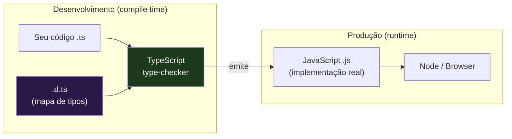
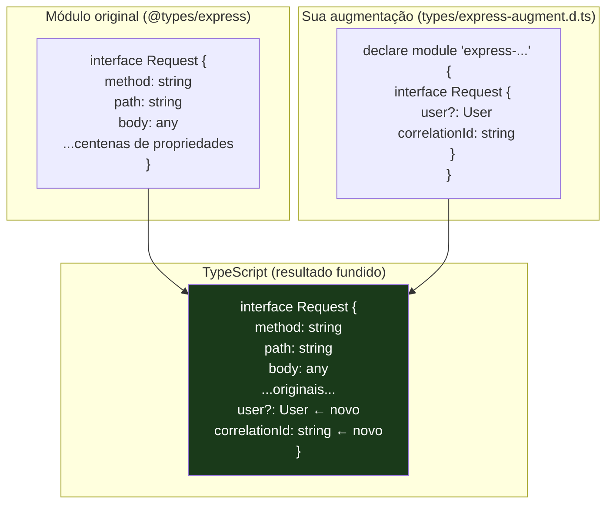
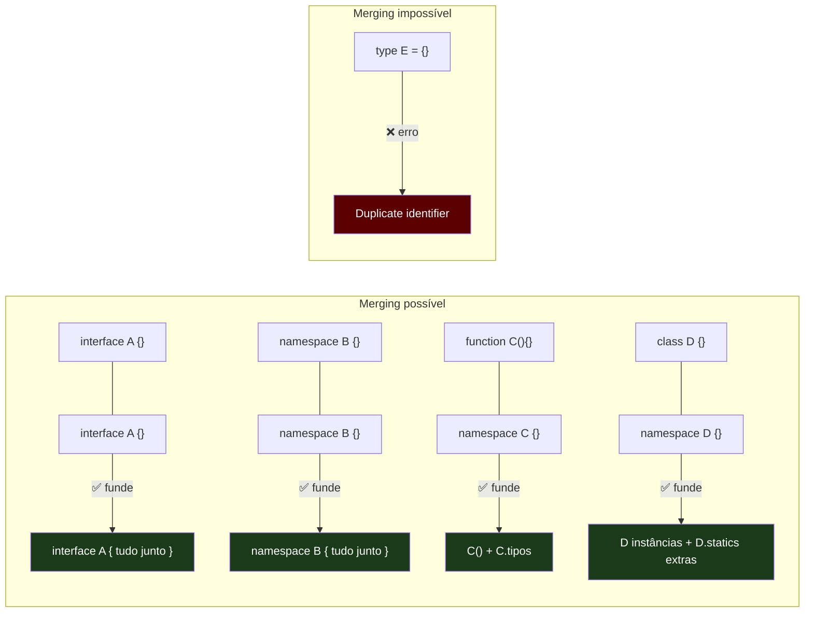
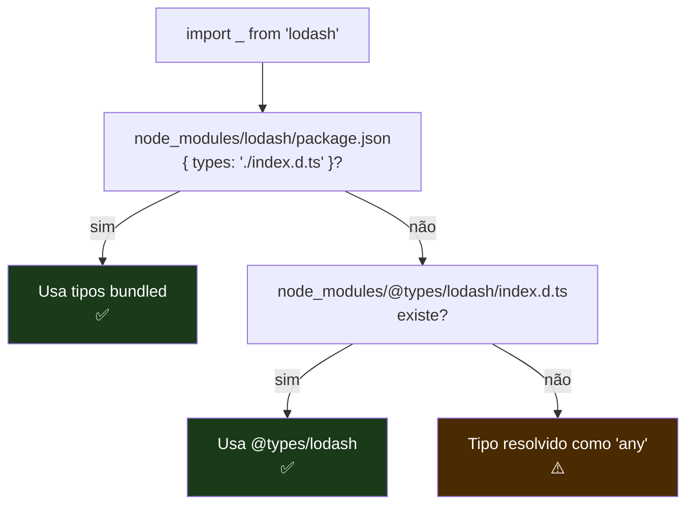
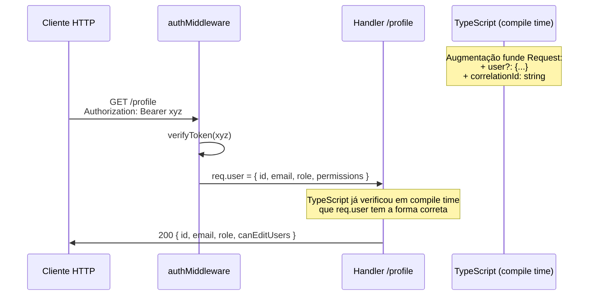
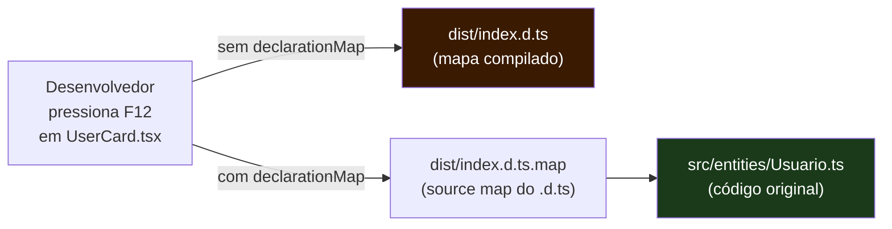

# Declaration files (`.d.ts`) e o ecossistema de tipos

> [!abstract] TL;DR
> Um arquivo `.d.ts` é um **mapa de tipos sem território** — descreve a forma de uma biblioteca JavaScript sem conter nenhuma implementação. Ele é o que permite o TypeScript entender código que não foi escrito em TypeScript. O ecossistema inteiro de tipagem gira em torno dessa abstração: o DefinitelyTyped hospeda milhares de mapas comunitários para bibliotecas JS puras, e você os instala via `@types/*`. Mas além de consumir tipos prontos, você precisa saber **estendê-los** — e é aqui que o **declaration merging** entra como ferramenta cirúrgica: você abre um módulo de terceiros, insere novas propriedades, e o TypeScript funde as declarações como se fossem uma só. Essa é a técnica por trás de `express-session`, de customizar `Window`, de estender `Request` do Express — e é uma das skills que separa o dev TypeScript sênior do pleno.

---

## Por que arquivos de declaração existem

O TypeScript tem um problema de herança: a web toda foi construída em JavaScript. Há décadas de libs, frameworks e utilitários escritos em JS puro — sem tipo algum. Quando o TypeScript surgiu em 2012, precisava conviver com esse ecossistema sem exigir que todo autor de biblioteca reescrevesse seu código.

A solução foi elegante: separar **tipos** de **implementação**. Um arquivo `.d.ts` (declaration file, ou arquivo de declaração) contém apenas tipos — sem `=`, sem corpo de função, sem lógica. Ele diz ao TypeScript *qual é a forma* de um módulo, sem conter *o que ele faz*.

Pense assim: um mapa de cidade não é a cidade. Você não pode morar num mapa, não pode dirigir pelas ruas desenhadas no papel — mas o mapa é suficiente para você navegar. Um `.d.ts` é o mapa do seu código JavaScript: o TypeScript usa o mapa em compile time para verificar seus usos, mas em runtime o JavaScript original é executado, sem o mapa.



O `.d.ts` existe *apenas para o compilador*. Em runtime, ele some. É um artefato de compile time — assim como os tipos em geral no TypeScript (nota [[01 - O que é TypeScript - gradual, estrutural, apagado]]).

Existem três origens possíveis para um `.d.ts`:

1. **Bundled** — a própria biblioteca inclui seus tipos (ex.: `axios`, `zod`, `date-fns` modernas). O `package.json` aponta para o `.d.ts` via campo `types` ou `typings`.
2. **DefinitelyTyped** — a comunidade mantém os tipos separados no repositório `@types/*` (ex.: `@types/lodash`, `@types/node`).
3. **Local** — você escreve o `.d.ts` para uma lib sem tipos, ou usa `declaration: true` no `tsconfig` para que o TypeScript gere automaticamente para o seu próprio código.

---

## Anatomia de um `.d.ts`: declarações sem corpo

A palavra-chave central é `declare`. Ela diz ao TypeScript: "isso existe em runtime, mas não está aqui agora — confie em mim sobre a forma."

```ts
// types/minha-lib.d.ts

// Declarar uma função: assinatura sem corpo
declare function calcular(a: number, b: number): number;

// Declarar uma variável: tipo sem valor
declare const versao: string;

// Declarar uma classe: forma sem implementação
declare class Formatador {
    constructor(locale: string);
    formatar(valor: number): string;
    readonly locale: string;
}

// Declarar uma interface (não precisa de declare — interfaces já são só tipos)
interface Config {
    timeout: number;
    retries: number;
}

// Declarar um enum (gera código JS — em .d.ts, usa declare para não emitir)
declare const enum Direcao {
    Norte = "N",
    Sul = "S",
}
```

A diferença crucial: em um `.ts` normal, `function calcular(a: number, b: number): number { ... }` tem corpo. Em um `.d.ts`, o corpo não existe — e a ausência do corpo é a declaração, não um erro.

Você também pode declarar módulos inteiros:

```ts
// types/legacy-analytics.d.ts

// Descrever um módulo CommonJS sem tipos
declare module 'legacy-analytics' {
    export function track(event: string, props?: Record<string, unknown>): void;
    export function identify(userId: string, traits?: Record<string, unknown>): void;
    export function page(name: string): void;

    export interface AnalyticsConfig {
        writeKey: string;
        debug?: boolean;
    }

    export function init(config: AnalyticsConfig): void;

    // Export default
    const analytics: {
        track: typeof track;
        identify: typeof identify;
        page: typeof page;
        init: typeof init;
    };
    export default analytics;
}
```

Depois de criar esse arquivo e configurar o `tsconfig` para incluí-lo, você passa a ter autocomplete e verificação de tipos para `import analytics from 'legacy-analytics'` — mesmo que a biblioteca seja um `.js` de 2014 sem uma única anotação de tipo.

---

## Declarações ambientes: `declare global` e `declare module`

Há dois sabores especiais de declaração que aparecem com frequência em projetos reais: as declarações **globais** e as **de módulo**.

### `declare global` — injetando no escopo global

O escopo global do browser é o objeto `window`. O do Node é `global`. Às vezes você precisa dizer ao TypeScript que adicionou algo lá — uma propriedade que o runtime injeta em `window`, uma variável que um script de terceiros coloca no global, um polyfill.

```ts
// types/globals.d.ts

// Dentro de um arquivo de módulo (tem import/export),
// precisamos de `declare global {}` para escapar do escopo do módulo
export {};

declare global {
    // Estender Window — ex.: script de analytics injeta isso em runtime
    interface Window {
        dataLayer: Record<string, unknown>[];
        gtag: (...args: unknown[]) => void;
    }

    // Variável injetada pelo servidor (ex.: Next.js com __NEXT_DATA__)
    const __APP_VERSION__: string;
    const __BUILD_DATE__: string;

    // Sobrescrever um tipo global existente (com cuidado!)
    interface Array<T> {
        // Adicionar método utilitário (não recomendado em produção, mas ilustrativo)
        last(): T | undefined;
    }
}
```

> [!warning] `export {}` é obrigatório em arquivos com declarações globais dentro de módulos
> Se o arquivo `.d.ts` não tiver nenhum `import` ou `export`, ele é tratado como **script** (escopo global). Se tiver qualquer `import`/`export`, é tratado como **módulo** (escopo de arquivo). Para emitir declarações globais num arquivo de módulo, você precisa de `declare global {}` — e o `export {}` vazio força o arquivo a ser tratado como módulo.

### `declare module` — augmentação de módulos

Às vezes você não quer declarar um módulo do zero — você quer **adicionar** tipos a um módulo que já tem tipos próprios. Isso é module augmentation, e o `declare module` funciona diferente dependendo do contexto:

- Em arquivo de script (sem imports): cria o módulo do zero
- Em arquivo de módulo (com imports): *adiciona* ao módulo existente (augmentation)

```ts
// types/express-augment.d.ts
import 'express';  // importar ativa o modo augmentation

declare module 'express-serve-static-core' {
    // Interface que o Express usa internamente para tipagem
    interface Request {
        user?: {
            id: string;
            email: string;
            role: 'admin' | 'user' | 'guest';
        };
        correlationId: string;
    }

    interface Response {
        sendSuccess<T>(data: T, statusCode?: number): void;
        sendError(message: string, statusCode?: number): void;
    }
}
```

Depois disso, em qualquer handler Express, `req.user` e `req.correlationId` estão disponíveis com tipos — sem `as any`, sem casting manual.



---

## Declaration merging a fundo

Declaration merging é o mecanismo pelo qual o TypeScript funde múltiplas declarações com o mesmo nome num único tipo. Isso não é um bug — é uma feature deliberada, especialmente projetada para habilitar o padrão de extensão progressiva que vimos acima.

A regra fundamental: **interfaces podem se fundir; `type` aliases não podem**.

```ts
// Duas declarações de interface com o mesmo nome → fundem
interface Usuario {
    id: string;
    nome: string;
}

interface Usuario {
    email: string;
    criadoEm: Date;
}

// TypeScript vê como se fosse uma única interface:
// interface Usuario {
//     id: string;
//     nome: string;
//     email: string;
//     criadoEm: Date;
// }

const u: Usuario = {
    id: '1',
    nome: 'Ana',
    email: 'ana@example.com',
    criadoEm: new Date(),
};
```

Com `type alias`, isso é erro:

```ts
type Produto = { id: string };
// type Produto = { preco: number };  // ERRO: Identificador duplicado 'Produto'
```

O merging de interfaces é especialmente importante porque é o mecanismo exato que o DefinitelyTyped usa para compor tipos de bibliotecas grandes — e que você usa para estendê-los.

### Merging de namespace com interface e função

Declaration merging vai além de interfaces. Você pode fundir um namespace com uma interface, ou um namespace com uma função, para criar padrões de "namespace como companion":

```ts
// Padrão: função + namespace com tipos auxiliares
function criarConexao(url: string): Conexao { /* ... */ return {} as Conexao; }

namespace criarConexao {
    export interface Opcoes {
        timeout: number;
        poolSize: number;
    }
    export type Status = 'conectado' | 'desconectado' | 'erro';
}

// Uso: a função carrega os tipos junto
const opcoes: criarConexao.Opcoes = { timeout: 5000, poolSize: 10 };
```

Esse é o padrão usado por bibliotecas como `styled-components`, `Jest` e `Mocha` — a função é a API pública, o namespace é onde ficam os tipos auxiliares.



Há um link direto com a nota [[06 - Objetos - interface vs type]]: a razão prática de existir `interface` além de `type alias` é exatamente o declaration merging. Você escolhe `interface` quando está definindo algo que outras partes do sistema (incluindo você mesmo, via augmentação) podem precisar estender.

---

## DefinitelyTyped e os pacotes `@types/*`

O DefinitelyTyped (`github.com/DefinitelyTyped/DefinitelyTyped`) é um dos repositórios mais ativos do GitHub — um monorepo com mais de 8.000 pacotes de definições de tipo mantidas pela comunidade. Ele nasceu em 2012, junto com o TypeScript, como resposta ao ecossistema JS que não tinha tipos.

O fluxo é simples:

```bash
# A biblioteca em si
npm install lodash

# Os tipos, em separado (devDependency)
npm install --save-dev @types/lodash
```

O TypeScript resolve automaticamente: quando você `import _ from 'lodash'`, o compilador procura em `node_modules/lodash` pelos campos `types`/`typings` do `package.json`. Se não achar, procura em `node_modules/@types/lodash/index.d.ts`. Se achar lá, usa — sem configuração adicional.



### `skipLibCheck: true` — e quando ativá-lo

Você provavelmente já viu `"skipLibCheck": true` no `tsconfig`. Essa flag diz ao TypeScript para *não verificar os tipos internamente nos arquivos `.d.ts`* dentro de `node_modules`.

Por que isso existe? Porque os tipos de diferentes pacotes às vezes entram em conflito entre si — duas versões diferentes de `@types/react`, um pacote que depende de uma versão antiga de `@types/node`, inconsistências entre o que a lib expõe e o que o DefinitelyTyped declarou. Sem `skipLibCheck`, o TypeScript verificaria *todos* os `.d.ts` de `node_modules`, e qualquer inconsistência interna quebraria seu build — mesmo que seu próprio código estivesse correto.

```ts
// Sem skipLibCheck: TypeScript verifica isso em node_modules/@types/alguma-lib/index.d.ts
// e qualquer erro interno quebra o build do seu projeto

// Com skipLibCheck: só o seu código é verificado
// Erros internos dos @types/* são ignorados
```

O trade-off é real: você ganha velocidade e evita ruído, mas perde a verificação de consistência entre os tipos das suas dependências. Para a maioria dos projetos, `skipLibCheck: true` é a escolha correta. Para monorepos com múltiplos pacotes que compartilham tipos, pode valer a pena desativar para detectar conflitos cedo.

---

## Emitindo `.d.ts` da sua própria lib: `declaration: true`

Quando você escreve uma biblioteca em TypeScript para ser consumida por outros, você quer emitir os tipos junto com o JavaScript compilado. A flag `declaration: true` no `tsconfig` faz exatamente isso:

```json
{
    "compilerOptions": {
        "declaration": true,
        "declarationMap": true,
        "outDir": "./dist",
        "rootDir": "./src"
    }
}
```

Para cada `src/foo.ts`, o compilador emite `dist/foo.js` (o código) e `dist/foo.d.ts` (o mapa de tipos). O `declarationMap: true` emite também `dist/foo.d.ts.map` — um source map que mapeia cada tipo no `.d.ts` de volta para a linha original no `.ts`, permitindo que editores como VS Code abram o arquivo TypeScript original ao invés do `.d.ts` quando você faz "Go to definition".

No `package.json` da biblioteca, você aponta para o `.d.ts`:

```json
{
    "name": "minha-lib",
    "main": "./dist/index.js",
    "module": "./dist/index.esm.js",
    "types": "./dist/index.d.ts",
    "exports": {
        ".": {
            "import": "./dist/index.esm.js",
            "require": "./dist/index.js",
            "types": "./dist/index.d.ts"
        }
    }
}
```

Quando outro projeto faz `npm install minha-lib`, o TypeScript encontra os tipos via o campo `types` do `package.json` — sem precisar de `@types/minha-lib`.

---

## Tipando uma lib JS sem tipos: exemplo trabalhado

Imagine uma biblioteca chamada `chart-primitives` — um pacote de 2016, muito usado, sem tipos. A API dela é:

```js
// O que a lib exporta (JavaScript puro)
const chart = ChartPrimitives.create('#canvas', { width: 800, height: 600 });
chart.setData([10, 20, 30]);
chart.render();
chart.on('click', (point) => console.log(point));
chart.destroy();
```

Você precisa criar `types/chart-primitives.d.ts`:

```ts
// types/chart-primitives.d.ts

declare module 'chart-primitives' {
    // Tipos auxiliares — podem ser exportados
    export interface ChartOptions {
        width: number;
        height: number;
        backgroundColor?: string;
        responsive?: boolean;
    }

    export interface DataPoint {
        x: number;
        y: number;
        label?: string;
    }

    export type ChartEventName = 'click' | 'hover' | 'zoom' | 'pan';

    export interface ClickPayload {
        point: DataPoint;
        index: number;
        nativeEvent: MouseEvent;
    }

    // O objeto Chart retornado por create()
    export interface Chart {
        setData(data: number[] | DataPoint[]): void;
        getData(): DataPoint[];
        render(): void;
        destroy(): void;
        on(event: 'click', handler: (payload: ClickPayload) => void): Chart;
        on(event: 'hover', handler: (point: DataPoint | null) => void): Chart;
        on(event: 'zoom', handler: (scale: number) => void): Chart;
        on(event: 'pan', handler: (delta: { x: number; y: number }) => void): Chart;
        off(event: ChartEventName, handler: Function): Chart;
    }

    // O namespace exportado pela lib
    export interface ChartPrimitivesStatic {
        create(selector: string, options: ChartOptions): Chart;
        version: string;
        defaults: Partial<ChartOptions>;
    }

    // Export principal
    const ChartPrimitives: ChartPrimitivesStatic;
    export default ChartPrimitives;
    export = ChartPrimitives;  // Para suporte a require() também
}
```

E no `tsconfig.json`, garantir que o TypeScript encontre o arquivo:

```json
{
    "compilerOptions": {
        "typeRoots": ["./types", "./node_modules/@types"]
    }
}
```

Ou, alternativamente, em um arquivo `.d.ts` na raiz do projeto ou referenciado via `/// <reference types="..." />`.

---

## Exemplo trabalhado: augmentando um módulo de terceiros de forma type-safe

Esse é o padrão mais prático para o dia a dia: você usa uma lib com tipos, mas quer estendê-la com propriedades que você mesmo injeta em runtime.

O caso real: você escreve um middleware Express que injeta `req.user` e `req.correlationId` em cada request. Sem augmentação, você precisa de `(req as any).user` em todo lugar — o que anula a segurança de tipos exatamente onde você mais precisa dela.

**Passo 1: Criar o arquivo de augmentação**

```ts
// src/types/express.d.ts
import 'express';

// Express usa 'express-serve-static-core' internamente para a interface Request
// A augmentação precisa ir no módulo correto
declare module 'express-serve-static-core' {
    interface Request {
        // user é injetado pelo middleware de autenticação
        // undefined antes do middleware rodar, definido depois
        user?: {
            id: string;
            email: string;
            role: 'admin' | 'user' | 'guest';
            permissions: ReadonlySet<string>;
        };

        // Injetado pelo middleware de correlation ID
        correlationId: string;

        // Injetado pelo middleware de feature flags
        featureFlags: Record<string, boolean>;
    }
}
```

**Passo 2: O middleware que injeta os valores**

```ts
// src/middleware/auth.ts
import { Request, Response, NextFunction } from 'express';
import { verifyToken } from '../auth/jwt';

export async function authMiddleware(
    req: Request,
    res: Response,
    next: NextFunction
): Promise<void> {
    const token = req.headers.authorization?.replace('Bearer ', '');

    if (!token) {
        res.status(401).json({ error: 'Unauthorized' });
        return;
    }

    try {
        const payload = await verifyToken(token);
        // TypeScript sabe que req.user existe com essa forma
        req.user = {
            id: payload.sub,
            email: payload.email,
            role: payload.role,
            permissions: new Set(payload.permissions),
        };
        next();
    } catch {
        res.status(401).json({ error: 'Invalid token' });
    }
}
```

**Passo 3: Handlers com tipos corretos**

```ts
// src/routes/users.ts
import { Router, Request, Response } from 'express';
import { authMiddleware } from '../middleware/auth';

const router = Router();

router.get('/profile', authMiddleware, (req: Request, res: Response) => {
    // req.user está tipado — autocomplete funciona, sem casting
    if (!req.user) {
        // Esse branch é alcançável em teoria (type system não garante ordem de middleware)
        return res.status(401).json({ error: 'Not authenticated' });
    }

    // TypeScript sabe: req.user.id é string, req.user.role é 'admin' | 'user' | 'guest'
    const { id, email, role, permissions } = req.user;

    // permissions é ReadonlySet<string>
    const canEditUsers = permissions.has('users:write');

    res.json({ id, email, role, canEditUsers });
});

router.delete('/users/:userId', authMiddleware, (req: Request, res: Response) => {
    // req.user?.role — TypeScript força o optional access porque user pode ser undefined
    if (req.user?.role !== 'admin') {
        return res.status(403).json({ error: 'Forbidden' });
    }

    const { userId } = req.params;
    // ... lógica de delete
    res.status(204).send();
});
```



**Por que isso é melhor que alternativas comuns:**

```ts
// ❌ Alternativa 1: cast em todo lugar
const user = (req as any).user as { id: string; email: string };
// Sem type-safety, sem autocomplete, erro silencioso se a forma mudar

// ❌ Alternativa 2: variável separada
const user = req.body.user;  // any — ainda inseguro

// ✅ Com augmentação: tipo verificado em compile time, autocomplete funcionando,
// erro imediato se o middleware mudar a forma e os handlers não atualizarem
```

---

## `skipLibCheck` e performance: o trade-off real

Um cenário comum em projetos grandes: você tem `@types/react@18` e `@types/react@17` coexistindo por conflito de dependências. Sem `skipLibCheck`, o TypeScript pode ver dois `namespace React` e reclamar de declarações duplicadas — mesmo que *seu* código não tenha problema algum.

```ts
// Erro que aparece SEM skipLibCheck em conflitos de versão:
// node_modules/@types/react/index.d.ts:2305:5
// error TS2300: Duplicate identifier 'ReactNode'.
// ← vem de uma versão anterior puxada por outra dependência
```

Com `skipLibCheck: true`, o compilador verifica apenas arquivos `.d.ts` *que fazem parte do seu projeto* (os que você escreveu, os em `src/types/`), e pula os de `node_modules`. Isso:

- Resolve conflitos de versão sem você precisar fazer nada
- Acelera o type-check (menos arquivos para verificar)
- Às vezes esconde problemas reais de compatibilidade entre libs

A regra prática: use `skipLibCheck: true` em aplicações. Em *bibliotecas* que você publica, considere desativar periodicamente para validar que seus tipos são compatíveis com as versões de dependências que você declara.

---

## `declarationMap` e "Go to definition" em monorepos

Em monorepos, você frequentemente importa de um pacote irmão:

```ts
// apps/web/src/components/UserCard.tsx
import { Usuario } from '@minha-empresa/domain';
```

Se `@minha-empresa/domain` emitiu apenas `dist/index.d.ts` (sem `declarationMap`), quando você pressiona "Go to Definition" no VS Code, você abre o arquivo `.d.ts` compilado — útil, mas não é o código-fonte original. Com `declarationMap: true`, o VS Code salta direto para `packages/domain/src/entities/Usuario.ts` — o arquivo onde você realmente escreveu o tipo.

```json
// packages/domain/tsconfig.json
{
    "compilerOptions": {
        "declaration": true,
        "declarationMap": true,    // emite .d.ts.map
        "sourceMap": true,         // emite .js.map (para debug de código)
        "outDir": "./dist"
    }
}
```



---

## Como explicar em inglês

A **declaration file** (`.d.ts`) is TypeScript's mechanism for describing the shape of JavaScript code that the compiler can't inspect directly. It contains only type information — no implementations, no runtime code. Think of it as a map: it tells the TypeScript compiler what a module looks like, but in production the actual JavaScript runs without the map.

The ecosystem has two main sources of declaration files: **bundled types**, where the library ships its own `.d.ts` alongside the JavaScript (modern libraries like Axios, Zod, and date-fns do this), and **DefinitelyTyped**, the community-maintained repository at `github.com/DefinitelyTyped/DefinitelyTyped` that publishes types for thousands of JS-only libraries under the `@types/*` namespace.

**Declaration merging** is the mechanism that makes augmentation possible. When TypeScript sees two `interface` declarations with the same name, it merges them into one. This is deliberate design — `type` aliases can't merge, but interfaces can. When you do `declare module 'express-serve-static-core' { interface Request { user?: User } }`, you're extending the existing Request interface rather than replacing it. TypeScript merges your declaration with the original and presents consumers with the unified type.

`skipLibCheck: true` tells the compiler to skip type-checking inside `node_modules/*.d.ts` files. It's a pragmatic trade-off: you avoid noise from version conflicts in your dependencies' types, at the cost of not catching actual incompatibilities between libraries.

When you publish a TypeScript library, `declaration: true` emits `.d.ts` files alongside the compiled JavaScript. Consumers get types automatically, without needing a separate `@types/*` package. Add `declarationMap: true` to also emit source maps for the declaration files, enabling "Go to Definition" to jump to the original TypeScript source in monorepos.

### Vocabulário-chave

| Português | Inglês |
|---|---|
| arquivo de declaração | declaration file |
| declaração ambiente | ambient declaration |
| fusão de declarações | declaration merging |
| augmentação de módulo | module augmentation |
| tipos embutidos | bundled types |
| escopo global | global scope |
| escopo de módulo | module scope |
| pular verificação de libs | skip lib check |
| emitir declarações | emit declarations |
| mapa de declaração | declaration map |
| tipos de terceiros | third-party types |
| instalação de tipos | type installation / `@types` install |
| raiz de tipos | type roots |
| tipo resolvido como `any` | resolves to `any` (implicit any) |
| definição de tipo | type definition |
| polyfill tipado | typed polyfill |

---

## Armadilhas comuns

> [!warning] Armadilha 1: `declare module 'foo'` em arquivo de módulo sem o import
> Se você cria um arquivo `.d.ts` com `declare module 'foo' { ... }` mas o arquivo também tem `import` ou `export`, você está criando um arquivo de módulo — e `declare module` dentro de módulo é **augmentação**, não criação do zero. A lib existente ainda precisa de tipos base. Para criar tipos do zero para uma lib sem tipos, o arquivo `.d.ts` não pode ter imports/exports (deve ser um arquivo de script), ou você precisa do `declare module` sem nenhum import antes dele.
> ```ts
> // ✅ Arquivo de script (sem import/export) — cria o módulo do zero
> declare module 'legacy-lib' {
>     export function doThing(): void;
> }
>
> // ❌ Arquivo de módulo — isso é augmentação, não criação
> import 'something-else'; // isso transforma o arquivo em módulo
> declare module 'legacy-lib' { // agora é augmentação — mas legacy-lib não tem tipos base!
>     export function doThing(): void;
> }
> ```

> [!warning] Armadilha 2: augmentar o módulo errado do Express
> O Express expõe `Request` e `Response` via múltiplos módulos internos. A augmentação de `Request` **não vai funcionar** em `declare module 'express'` — precisa ser em `declare module 'express-serve-static-core'`. Isso porque os tipos do Express delegam as interfaces para o módulo core, e é lá que a fusão acontece. Se você augmentar `express`, as propriedades não aparecem nos handlers.
> ```ts
> // ❌ NÃO funciona
> declare module 'express' {
>     interface Request { user?: User }
> }
>
> // ✅ FUNCIONA
> declare module 'express-serve-static-core' {
>     interface Request { user?: User }
> }
> ```

> [!warning] Armadilha 3: `@types/*` desatualizado em relação à lib
> A lib atualizou a API, mas o `@types/*` correspondente ainda está na versão antiga. O TypeScript compila sem erros, mas em runtime você chama um método que não existe (ou que mudou de assinatura). Isso acontece especialmente com libs que atualizam rápido. Verifique sempre se as versões de `package.json` e `@types/*` são compatíveis. Alguns `@types/*` publicam versões alinhadas: `@types/lodash@4` para `lodash@4`.

> [!warning] Armadilha 4: `typeRoots` substitui, não adiciona
> Ao configurar `"typeRoots": ["./types"]`, você está **substituindo** o `typeRoots` padrão — o que inclui `./node_modules/@types`. Resultado: todos os seus `@types/*` instalados são ignorados. A configuração correta é incluir ambos:
> ```json
> {
>     "compilerOptions": {
>         "typeRoots": ["./types", "./node_modules/@types"]
>     }
> }
> ```
> Ou, preferível, usar `"types"` para especificar quais `@types/*` incluir, e colocar os seus arquivos locais em `src/types/` (que é incluído automaticamente via `include`).

> [!warning] Armadilha 5: `declare global` sem `export {}`
> Em um arquivo `.ts` que tem imports, `declare global {}` funciona. Em um arquivo `.d.ts` sem nenhum `import`, tudo já é global — você não precisa de `declare global`. Se você colocar `declare global {}` num arquivo de script (sem imports), pode receber erros inesperados. E se você esquecer o `export {}` em um arquivo que precisa ser módulo, declarações que deveriam ser locais se tornam globais.

> [!warning] Armadilha 6: `type` alias no lugar de `interface` em código que precisa de merging
> Você cria uma `type ApiResponse<T> = { data: T; error?: string }` e depois descobre que precisa augmentá-la em outro arquivo. Não dá — `type` não funde. Se você antecipa que um tipo precisará ser extendido por outros (pela sua própria lib, pelo usuário da lib, via plugin), use `interface` desde o início.

---

## Veja também

- [[06 - Objetos - interface vs type]] — a razão de `interface` existir além de `type` é o declaration merging; entender a diferença é pré-requisito para augmentação
- [[21 - Modules - ESM, CJS e type-only imports]] — a relação entre sistemas de módulos e como o TypeScript resolve tipos de cada formato; `import type` e o papel de `verbatimModuleSyntax`
- [[03-Dominios/Tecnologia/JavaScript/index|JavaScript]] — a linguagem base que os `.d.ts` descrevem; entender o modelo JS (protótipos, CJS, ESM) ajuda a escrever declarações corretas
- [[03-Dominios/Ciência/Compiladores e Linguagens/01 - O que é um compilador e o pipeline de tradução|Compiladores e tradução]] — os `.d.ts` são artefatos da fase de análise semântica; entender o pipeline de compilação contextualiza por que tipos são apagados em runtime e o que sobra para o `.d.ts` representar
- React (trilha) — augmentar tipos React (`JSX.IntrinsicElements`, `ThemeProviderProps`, hooks customizados) usa o mesmo mecanismo de module augmentation descrito aqui; ver trilha React para os padrões específicos
