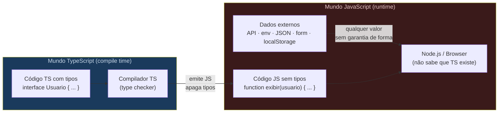
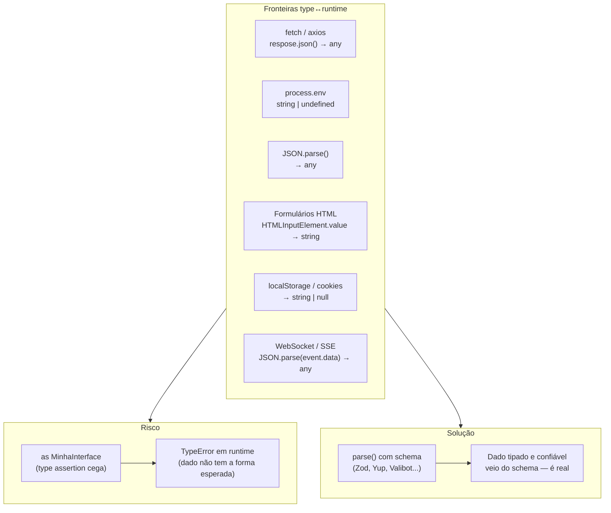
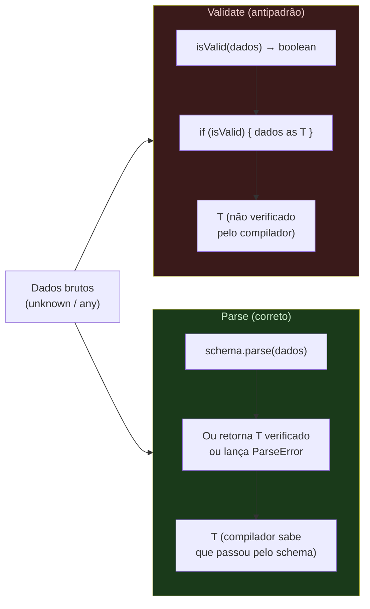
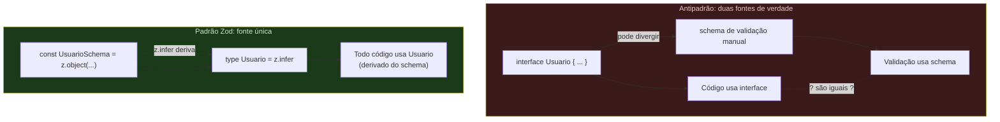
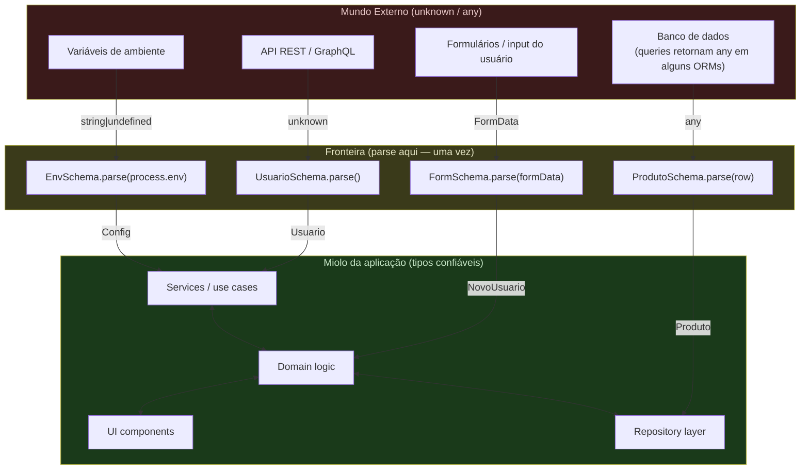
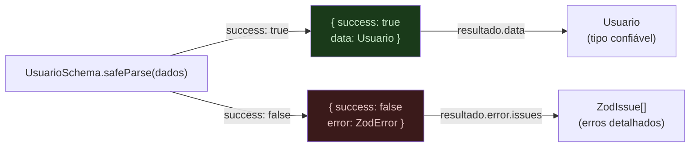

# A fronteira type↔runtime: parse, don't validate

> [!abstract] TL;DR
> O sistema de tipos do TypeScript é uma **ilusão em tempo de execução**: todos os tipos são apagados antes do programa rodar (ver [[01 - O que é TypeScript - gradual, estrutural, apagado]]). Toda fronteira com o mundo externo — resposta de API, `process.env`, `JSON.parse`, formulário HTML, localStorage — entrega `any` ou `unknown` disfarçado de tipo. O antipadrão clássico é usar `as MinhaInterface` (type assertion) para mentir ao compilador; o compilador acredita, mas o runtime não sabe e não se importa. A saída é o princípio **"parse, don't validate"** (Alexis King, 2019): em vez de checar se um valor tem a forma esperada e depois usá-lo como se você soubesse, você *converte* o valor bruto para um tipo confiável numa única operação que falha com erro claro se os dados estiverem errados. Schema validation com Zod implementa esse princípio: o schema é a fonte única de verdade, o tipo TypeScript é *derivado* do schema via `z.infer`, e o `parse()` é a fronteira — tudo que passa por ele é tipado e confiável.

---

## O problema que ninguém conta no tutorial

Quando você começa a aprender TypeScript, parece simples: você anota tipos, o compilador verifica, você tem segurança. Então você escreve algo assim:

```ts
// Parece seguro. Não é.
const response = await fetch('/api/users/42');
const user = await response.json() as Usuario;
console.log(user.nome.toUpperCase()); // Possível TypeError em runtime
```

O compilador não reclamou de nada. Você tem um `Usuario` tipado. O autocomplete funciona. A build passa limpa. E então, em produção, você recebe um `TypeError: Cannot read properties of undefined (reading 'toUpperCase')` porque a API retornou um objeto diferente do esperado — talvez `name` em vez de `nome`, talvez `null`, talvez um erro 500 que retornou HTML.

Esse bug específico tem um nome: **type assertion cega** — o `as Usuario` diz ao compilador "confie em mim, eu sei o que é isso", e o compilador confia. Mas o compilador não tem como verificar: ele não roda o código, não faz a requisição, não vê o que a API realmente mandou. Quem roda é o JavaScript puro — e o JavaScript não tem a menor ideia de que você prometeu que aquilo era um `Usuario`.

O problema raiz é mais profundo do que um `as` mal colocado. É a **natureza do TypeScript**: os tipos existem apenas em tempo de compilação. Em runtime, TypeScript não existe.

---

## Type erasure: a verdade que o compilador esconde

TypeScript compila para JavaScript apagando **todos** os tipos. Não há runtime do TypeScript verificando seus tipos enquanto o programa roda (ver [[01 - O que é TypeScript - gradual, estrutural, apagado]]). O que você chama de "tipo" é uma anotação que o compilador usa para verificar o código e depois descarta.

```ts
// TypeScript (antes da compilação)
interface Usuario {
    id: number;
    nome: string;
    email: string;
}

function exibir(usuario: Usuario): void {
    console.log(usuario.nome);
}

const u: Usuario = { id: 1, nome: "Ana", email: "ana@ex.com" };
exibir(u);
```

```js
// JavaScript (depois da compilação) — os tipos sumiram
function exibir(usuario) {
    console.log(usuario.nome);
}

const u = { id: 1, nome: "Ana", email: "ana@ex.com" };
exibir(u);
```

Não há `interface`. Não há `: Usuario`. Não há verificação de tipo em lugar nenhum. O JavaScript que roda em produção não sabe que `Usuario` existe.

Isso não é bug nem falha de design — é a aposta central do TypeScript: ser um sistema de tipos *gradual* e *apagável*, capaz de coexistir com JavaScript puro sem exigir um runtime próprio. A nota [[01 - O que é TypeScript - gradual, estrutural, apagado]] explica por que essa decisão foi acertada para o ecossistema JS. O que importa aqui é a consequência prática:

> **Todo dado que vem de fora do seu programa chega como `unknown` — mesmo que o TypeScript ache que é outra coisa.**



---

## As fronteiras perigosas

Toda vez que seu código TypeScript recebe dados de fora do próprio programa, você está cruzando a fronteira type↔runtime. As fronteiras mais comuns:

```ts
// 1. fetch — response.json() retorna Promise<any>
const resposta = await fetch('/api/usuarios');
const dados = await resposta.json();
// dados é `any` — TypeScript aceita qualquer coisa que você fizer

// 2. JSON.parse — retorna `any`
const config = JSON.parse(fs.readFileSync('config.json', 'utf-8'));
// config é `any`

// 3. process.env — valores são string | undefined, sem mais garantias
const porta = process.env.PORT;
// TypeScript sabe que é string | undefined, mas não sabe se é um número válido

// 4. localStorage / sessionStorage — retornam string | null
const token = localStorage.getItem('auth_token');
// Pode ser null. Pode ser uma string qualquer, não necessariamente um JWT válido.

// 5. Dados de formulário HTML (sem biblioteca de forms tipados)
const email = (document.getElementById('email') as HTMLInputElement).value;
// string — mas pode ser vazio, malformado, injetado

// 6. Parâmetros de URL / query strings
const id = new URLSearchParams(window.location.search).get('id');
// string | null — não necessariamente um número

// 7. Eventos de WebSocket / SSE
ws.onmessage = (event) => {
    const mensagem = JSON.parse(event.data);
    // any — o servidor pode mandar qualquer coisa
};
```

Em cada um desses casos, o TypeScript não tem como saber o que realmente está chegando. A assinatura de `response.json()` é `Promise<any>`, e `JSON.parse()` retorna `any` — não porque seja preguiça dos criadores da linguagem, mas porque é a resposta honesta: *não sabemos o que está aí*.



---

## O antipadrão: validate and cast

O antipadrão mais comum é o que eu chamo de **"validate and cast"**: você faz algumas checagens manuais e depois usa `as` para tipar o resultado. Parece prudente. É uma armadilha.

```ts
// Antipadrão — validate and cast
interface Usuario {
    id: number;
    nome: string;
    email: string;
}

async function buscarUsuario(id: number): Promise<Usuario> {
    const resposta = await fetch(`/api/usuarios/${id}`);
    const dados = await resposta.json();

    // "Validação" manual parcial
    if (!dados || typeof dados !== 'object') {
        throw new Error('Resposta inválida da API');
    }
    if (typeof dados.nome !== 'string') {
        throw new Error('Campo nome ausente ou inválido');
    }

    // Aqui o programador desiste e usa as
    return dados as Usuario;
    //          ^^^^^^^^^^^ mentira para o compilador
}
```

Problemas:

1. **Incompleto por definição.** Você nunca valida todos os campos — é tedioso demais. Neste exemplo, `id` e `email` não foram validados. Se a API mudar e `email` sumir, o TypeScript não vai reclamar.
2. **O tipo inferido ainda é `any` até o `as`.** O `dados` passou pelas checagens mas continua sendo `any` no modelo de tipos. As checagens que você fez não estreitam o tipo — você está fazendo o trabalho de narrowing à mão e depois jogando fora com o `as`.
3. **Não é reutilizável.** Para cada entidade você escreve código de validação do zero. Não compõe. Não é testável de forma isolada.
4. **Silencioso quando errado.** Se você esquecer um campo, o TypeScript não reclama. O bug fica latente até alguém acessar o campo faltante em produção.

O `as` é fundamentalmente uma instrução ao compilador: **"Para de verificar e acredite em mim."** Às vezes isso é necessário (conversões legítimas, interop com libs sem tipos). Mas no contexto de dados externos, é uma promessa que você não pode honrar — porque você genuinamente não sabe o que vai chegar.

> [!warning] A forma mais perigosa: `as unknown as T`
> Às vezes o TypeScript recusa um `as MinhaInterface` direto porque os tipos são estruturalmente incompatíveis demais. A "solução" que circunvala isso é `dados as unknown as MinhaInterface`. Esse padrão desliga o verificador em duas etapas: primeiro converte para `unknown` (tudo é atribuível a `unknown`), depois para o tipo desejado (tudo é atribuível de `unknown`). É o equivalente a dizer "eu sei que isso é completamente errado mas quero fazer mesmo assim". É um code smell sério — quando você se vê escrevendo isso, é quase sempre porque está escondendo um bug.

---

## O princípio: parse, don't validate

Em 2019, Alexis King publicou o artigo "Parse, Don't Validate" que articulou um princípio que muitos desenvolvedores praticavam intuitivamente mas nunca tinham nomeado.

A distinção parece sutil mas tem consequências profundas:

**Validar** é verificar se um valor satisfaz uma condição e retornar `true` ou `false` (ou jogar exceção). O valor bruto continua sendo o mesmo tipo impreciso — você só tem uma flag booleana que diz "estava ok quando eu verifiquei".

**Parsear (ou "fazer parse")** é converter um valor de tipo impreciso para um tipo mais preciso numa operação que **ou produz o tipo confiável ou falha com erro claro**. O valor de retorno carrega a prova de que passou pela verificação — não como flag separada, mas como o próprio tipo.



A diferença prática: com o padrão "parse", o tipo do valor retornado **já é** `T` — não é `unknown` que você depois castou para `T`. A operação de parse e a produção do tipo confiável são **a mesma operação**. Você não pode ter um `T` sem ter passado pelo parse; o sistema de tipos impõe isso.

Em TypeScript puro, sem bibliotecas, você pode escrever um parser manual:

```ts
interface Usuario {
    id: number;
    nome: string;
    email: string;
}

// Parse manual — produz Usuario ou lança
function parseUsuario(dados: unknown): Usuario {
    if (
        dados !== null &&
        typeof dados === 'object' &&
        'id' in dados && typeof (dados as { id: unknown }).id === 'number' &&
        'nome' in dados && typeof (dados as { nome: unknown }).nome === 'string' &&
        'email' in dados && typeof (dados as { email: unknown }).email === 'string'
    ) {
        return dados as Usuario; // Agora o `as` é legítimo — provamos estruturalmente
    }
    throw new Error(`Dado não é um Usuario válido: ${JSON.stringify(dados)}`);
}
```

Esse código funciona e é correto. O problema: é verboso, não compõe, é fácil de errar, e precisa ser escrito para cada tipo. Para um `Usuario` com 10 campos, 3 campos aninhados e campos opcionais, esse código vira um pesadelo de manutenção.

É por isso que existem bibliotecas de schema validation.

---

## Schema validation: Zod como implementação do princípio

Zod (e alternativas como Valibot, Yup, Arktype, io-ts) implementam o princípio "parse, don't validate" de forma declarativa e composable. A ideia central:

> **O schema é a fonte única de verdade. O tipo TypeScript é derivado do schema — não é declarado à parte.**

Com Zod:

```ts
import { z } from 'zod';

// 1. Declare o schema (fonte de verdade)
const UsuarioSchema = z.object({
    id: z.number().int().positive(),
    nome: z.string().min(1).max(100),
    email: z.string().email(),
    papel: z.enum(['admin', 'usuario', 'visitante']),
    criadoEm: z.coerce.date(),             // coerce: string ISO → Date
    avatar: z.string().url().optional(),   // undefined se ausente
});

// 2. Derive o tipo — uma linha, nunca desatualiza
type Usuario = z.infer<typeof UsuarioSchema>;
// Equivalente a:
// interface Usuario {
//     id: number;
//     nome: string;
//     email: string;
//     papel: 'admin' | 'usuario' | 'visitante';
//     criadoEm: Date;
//     avatar?: string;
// }

// 3. Parse na fronteira — ou Usuario válido ou erro descritivo
const dados: unknown = await response.json();
const usuario = UsuarioSchema.parse(dados);
// usuario é Usuario — tipado, confiável, imutável
```

O `z.infer<typeof UsuarioSchema>` extrai o tipo TypeScript que o schema descreve. Quando você adiciona um campo ao schema, o tipo muda automaticamente — você nunca tem o problema de schema e tipo divergirem. Se você declara o tipo manualmente (`interface`) e depois cria um schema separado, você tem dois artefatos que precisam ser mantidos em sincronia — e vão divergir eventualmente.



---

## Exemplo trabalhado: do fetch cru ao dado tipado

Vamos construir o exemplo completo — do `fetch` raw até o dado tipado circulando seguro pelo interior da aplicação.

### O cenário

Uma aplicação que busca um perfil de usuário de uma API externa. A API pode retornar dados inválidos, o campo pode ter mudado de nome, pode vir `null` onde não esperávamos.

### Passo 1: definir o schema e derivar o tipo

```ts
import { z } from 'zod';

// Schema é a fronteira — declara o contrato esperado
const UsuarioSchema = z.object({
    id: z.number().int().positive(),
    nome: z.string().min(1),
    email: z.string().email(),
    papel: z.enum(['admin', 'editor', 'leitor']).default('leitor'),
    bio: z.string().nullable().optional(), // null ou ausente → undefined
    criadoEm: z.coerce.date(),
});

// Tipo derivado — única fonte de verdade
type Usuario = z.infer<typeof UsuarioSchema>;
```

### Passo 2: a função de parse na fronteira

```ts
// Resultado tipado — não usa exceptions para controle de fluxo
type ResultadoBusca<T> =
    | { ok: true; dados: T }
    | { ok: false; erro: string; detalhes?: unknown };

async function buscarUsuario(id: number): Promise<ResultadoBusca<Usuario>> {
    // Etapa 1: busca HTTP — pode falhar por razões de rede
    let resposta: Response;
    try {
        resposta = await fetch(`/api/usuarios/${id}`, {
            headers: { Accept: 'application/json' },
        });
    } catch (erroRede) {
        return {
            ok: false,
            erro: 'Falha de rede ao buscar usuário',
            detalhes: erroRede,
        };
    }

    // Etapa 2: verificar status HTTP (404, 500, etc.)
    if (!resposta.ok) {
        return {
            ok: false,
            erro: `API retornou status ${resposta.status}`,
        };
    }

    // Etapa 3: parse do body como JSON — pode falhar se a API retornar HTML
    let dadosBrutos: unknown;
    try {
        dadosBrutos = await resposta.json();
    } catch {
        return { ok: false, erro: 'Resposta da API não é JSON válido' };
    }

    // Etapa 4: parse do schema — A FRONTEIRA TYPE↔RUNTIME
    // Aqui: unknown → Usuario (tipado) ou erro descritivo
    const resultado = UsuarioSchema.safeParse(dadosBrutos);

    if (!resultado.success) {
        // resultado.error.issues descreve exatamente o que estava errado
        return {
            ok: false,
            erro: 'Formato de usuário inválido',
            detalhes: resultado.error.issues,
        };
    }

    // resultado.data é Usuario — tipado, verificado, confiável
    return { ok: true, dados: resultado.data };
}
```

### Passo 3: o interior da aplicação trabalha com tipos confiáveis

```ts
// Esta função NUNCA recebe unknown — só Usuario verificado
function exibirPerfil(usuario: Usuario): string {
    // Aqui podemos acessar campos sem verificação — o parse já garantiu
    const linhas = [
        `Nome: ${usuario.nome}`,
        `Email: ${usuario.email}`,
        `Papel: ${usuario.papel}`,
        `Membro desde: ${usuario.criadoEm.toLocaleDateString('pt-BR')}`,
    ];

    // bio é string | null | undefined — TypeScript obriga o tratamento
    if (usuario.bio) {
        linhas.push(`Bio: ${usuario.bio}`);
    }

    return linhas.join('\n');
}

// Ponto de entrada — cruza a fronteira uma vez
async function main() {
    const resultado = await buscarUsuario(42);

    if (!resultado.ok) {
        // Erro tratado explicitamente — não silencioso
        console.error(`Erro: ${resultado.erro}`, resultado.detalhes);
        return;
    }

    // A partir daqui, resultado.dados é Usuario — sem `as`, sem casting
    console.log(exibirPerfil(resultado.dados));
}
```

> [!example] O que esse código demonstra
> Repare no fluxo: `unknown` entra pela fronteira (etapa 4), passa pelo `safeParse`, e `Usuario` tipado sai. A função `exibirPerfil` nunca precisa de guards defensivos — ela pode pressupor que `usuario.email` é uma string válida porque o parse já verificou. O `TypeScript` e o runtime estão **sincronizados** a partir do ponto do parse.

### O que acontece com erros de schema

```ts
// Se a API retornar isso:
const dadosMalformados = {
    id: "não-é-número",    // era para ser number
    // nome ausente          — campo obrigatório
    email: "não-é-email",   // formato inválido
    papel: "superadmin",    // fora do enum
    criadoEm: "data inválida"
};

const resultado = UsuarioSchema.safeParse(dadosMalformados);
// resultado.success === false
// resultado.error.issues:
// [
//   { code: "invalid_type", path: ["id"], message: "Expected number, received string" },
//   { code: "invalid_type", path: ["nome"], message: "Required" },
//   { code: "invalid_string", path: ["email"], message: "Invalid email" },
//   { code: "invalid_enum_value", path: ["papel"], message: "Invalid enum value. Expected 'admin' | 'editor' | 'leitor'" },
//   { code: "invalid_date", path: ["criadoEm"], message: "Invalid date" }
// ]
```

O Zod reporta **todos** os erros de uma vez (não para no primeiro), com o caminho exato do campo e uma mensagem clara. Em ambiente de desenvolvimento e em logs de produção, isso é inestimável para debugar contratos quebrados com APIs externas.

---

## O padrão de boundary (fronteira): parse na entrada, tipos confiáveis no miolo

O design que emerge desse princípio tem um nome: **boundary pattern** (ou padrão de fronteira). A ideia é concentrar todo o código de parse e validação nas bordas da aplicação — os pontos onde dados externos entram — e deixar o miolo da aplicação trabalhar exclusivamente com tipos confiáveis.



O benefício arquitetural: o código no miolo da aplicação pode ser escrito sem verificações defensivas constantes. `usuario.email` é uma string válida — o email foi verificado na fronteira. `config.DATABASE_URL` é uma URL — foi verificada quando o processo iniciou. `produto.preco` é um número positivo — o banco de dados pode ter corrompido os dados, mas se chegou até aqui, passou pelo parse.

### Variáveis de ambiente: o exemplo mais fácil de demonstrar

```ts
import { z } from 'zod';

// Parse de env na inicialização — falha rápido se configuração está errada
const EnvSchema = z.object({
    NODE_ENV: z.enum(['development', 'test', 'production']),
    DATABASE_URL: z.string().url(),
    PORT: z.coerce.number().int().min(1024).max(65535).default(3000),
    JWT_SECRET: z.string().min(32, 'JWT_SECRET precisa ter pelo menos 32 caracteres'),
    REDIS_URL: z.string().url().optional(),
});

// Exporta o tipo e o valor parseado — resto do código usa isso
export type Env = z.infer<typeof EnvSchema>;

// Fail-fast: se process.env não satisfaz o schema, o servidor nem sobe
export const env = EnvSchema.parse(process.env);

// Em qualquer outro arquivo:
import { env } from './config/env';
env.DATABASE_URL; // string (URL válida) — não string | undefined
env.PORT;         // number — não string (process.env sempre é string, z.coerce converte)
```

Esse é o padrão "fail-fast na fronteira": se a configuração está errada, o processo explode imediatamente com uma mensagem clara (`JWT_SECRET precisa ter pelo menos 32 caracteres`) em vez de misteriosamente falhar em algum handler de autenticação às 3 da manhã.

---

## `parse` vs `safeParse`: quando usar cada um

Zod oferece dois modos de operação:

```ts
// parse — lança ZodError se inválido
// Use quando: falha é excepcional, você quer fail-fast
try {
    const usuario = UsuarioSchema.parse(dadosBrutos);
    // usuario é Usuario aqui
} catch (erro) {
    if (erro instanceof z.ZodError) {
        console.error(erro.issues); // erros detalhados
    }
    throw erro;
}

// safeParse — retorna { success: true, data: T } | { success: false, error: ZodError }
// Use quando: falha é esperada (input do usuário, API externa não confiável)
const resultado = UsuarioSchema.safeParse(dadosBrutos);
if (resultado.success) {
    const usuario = resultado.data; // Usuario tipado
} else {
    const erros = resultado.error.issues; // ZodIssue[]
    // Tratar erros de validação como parte do fluxo normal
}
```

**Regra de ouro:**

- `parse` (que lança): use para configuração da aplicação (`process.env`), dados que deveriam sempre ser válidos (vindo do seu próprio banco de dados com schema correto). Falha é bug — um `throw` é apropriado.
- `safeParse` (que retorna discriminated union): use para input de usuário, respostas de APIs externas, dados de terceiros. Falha é evento esperado — deve ser tratado como fluxo normal, não como exceção.

Note que `safeParse` retorna uma **discriminated union** — exatamente o padrão que a nota [[08 - Discriminated unions e exhaustiveness]] cobre. O TypeScript faz narrowing completo: dentro do `if (resultado.success)`, `resultado.data` é `T`; fora, `resultado.error` é `ZodError`.



---

## Composição de schemas: para além do objeto simples

O poder real do Zod está na composição — schemas são valores que se combinam.

```ts
import { z } from 'zod';

// Schemas reutilizáveis (blocos)
const IdSchema = z.number().int().positive();
const EmailSchema = z.string().email().toLowerCase(); // coerce: normaliza
const NomeSchema = z.string().trim().min(1).max(100);
const UrlSchema = z.string().url();
const DateSchema = z.coerce.date();

// Schemas compostos
const EnderecoSchema = z.object({
    rua: NomeSchema,
    cidade: NomeSchema,
    cep: z.string().regex(/^\d{5}-\d{3}$/, 'CEP deve estar no formato XXXXX-XXX'),
    pais: z.string().length(2), // ISO 3166-1 alpha-2
});

const UsuarioBaseSchema = z.object({
    id: IdSchema,
    nome: NomeSchema,
    email: EmailSchema,
    criadoEm: DateSchema,
});

// Extensão — schema derivado do base
const UsuarioComEnderecoSchema = UsuarioBaseSchema.extend({
    endereco: EnderecoSchema.optional(),
});

// Versão parcial (ex: PATCH request)
const AtualizarUsuarioSchema = UsuarioBaseSchema
    .omit({ id: true, criadoEm: true })
    .partial(); // todos os campos se tornam opcionais

type AtualizarUsuario = z.infer<typeof AtualizarUsuarioSchema>;
// { nome?: string; email?: string }

// Arrays de schemas
const ListaUsuariosSchema = z.array(UsuarioBaseSchema);
type ListaUsuarios = z.infer<typeof ListaUsuariosSchema>;

// Resposta paginada — genérico no schema
function criarRespostaPaginada<T extends z.ZodTypeAny>(itemSchema: T) {
    return z.object({
        itens: z.array(itemSchema),
        total: z.number().int().nonnegative(),
        pagina: z.number().int().positive(),
        totalPaginas: z.number().int().nonnegative(),
    });
}

const RespostaUsuariosSchema = criarRespostaPaginada(UsuarioBaseSchema);
type RespostaUsuarios = z.infer<typeof RespostaUsuariosSchema>;
```

A composição é crucial para a manutenção: quando o campo `email` muda de regra de validação, você altera `EmailSchema` em um lugar e todos os schemas que o referenciam herdam a mudança.

---

## O papel do `unknown` nesse ecossistema

A nota [[04 - any, unknown e never]] explica a diferença entre `any` e `unknown`. No contexto de fronteiras type↔runtime, `unknown` é o tipo honesto para "dados externos":

```ts
// any — mente: diz que sabe o tipo, mas não sabe
const dados1: any = await response.json();
dados1.qualquerCoisa.profundo.inexistente; // sem erro de compilação, crash em runtime

// unknown — honesto: admite que não sabe
const dados2: unknown = await response.json();
dados2.nome; // ERRO de compilação — 'nome' não existe em 'unknown'

// Para usar unknown, você precisa de narrowing (manual ou via schema)
if (typeof dados2 === 'object' && dados2 !== null && 'nome' in dados2) {
    // narrowing manual — tedioso para objetos complexos
}

// Ou parse com schema — a abordagem preferida
const usuario = UsuarioSchema.parse(dados2); // unknown → Usuario
```

A relação: `unknown` é o tipo que força você a fazer parse. É como `any` responsável — você admite que não sabe, e antes de usar, você prova que sabe (via narrowing ou schema parse).

Se você está vendo `any` aparecer em pontos de fronteira (tipo de retorno de `response.json()`, parâmetro de callbacks de WebSocket), o sinal é: **este é um ponto onde você precisa de um schema de parse**.

---

## Alternativas ao Zod e quando considerar

O Zod é o mais popular, mas o ecossistema tem opções com trade-offs diferentes:

| Biblioteca | Bundle size | Característica marcante | Quando considerar |
|---|---|---|---|
| **Zod** | ~13kB min+gz | API madura, ecossistema, integração React Hook Form | Padrão em projetos novos |
| **Valibot** | ~1.5kB (tree-shaking agressivo) | Bundle mínimo, API similar | Frontend onde bundle importa muito |
| **Arktype** | ~10kB | Sintaxe de string `"{ id: number, nome: string }"` | Quem prefere concisão |
| **io-ts** | ~4kB | Baseado em fp-ts, `Either` nativo | Projetos já em fp-ts |
| **Yup** | ~12kB | Legado, integração Formik | Projetos que já usam Yup |

A escolha importa menos do que adotar **alguma** solução de schema validation. Um projeto usando Yup de forma consistente é infinitamente melhor do que um projeto com `as` espalhados por todo lugar.

> [!info] Fronteira com o domínio de Validação
> Esta nota cobre o **conceito e o padrão** — por que você precisa de schema validation, o princípio "parse, don't validate", e como Zod implementa isso. A API completa do Zod (refinements, transforms, discriminated union schemas, async validation, custom schemas, integração com React Hook Form) fica no domínio de JavaScript: [[03-Dominios/Tecnologia/JavaScript/Validação/index|Validação]]. Para formulários React tipados com Zod + React Hook Form, ver a trilha React.

---

## Como explicar em inglês

TypeScript's type system operates entirely at compile time — at runtime, all types are erased and you're running plain JavaScript. This means any data crossing your application boundary — API responses, environment variables, `JSON.parse`, form inputs, localStorage — arrives as `unknown` or `any` at runtime, regardless of what TypeScript thinks the type is.

The naive fix is to use **type assertions** (`as MyInterface`), which tells the compiler "trust me, I know what this is." The problem is you don't — you can't know what an external API will send. Type assertions at boundaries are promises you can't keep.

The correct approach is the **"parse, don't validate"** principle (Alexis King, 2019): instead of checking a value against a condition and then casting it, you convert the raw value into a trusted type in a single operation that either succeeds (returning the typed value) or fails with a clear error (throwing or returning a failure result). The type is proof that the parse succeeded — you can't have the type without having gone through the parser.

**Zod** implements this pattern in TypeScript: you declare a schema, derive the TypeScript type from the schema with `z.infer` (single source of truth), and call `schema.parse()` or `schema.safeParse()` at the boundary. Everything that comes out of parse is fully typed and trustworthy — no defensive checks needed in the application core.

The architectural pattern this creates is called the **boundary pattern**: concentrate all parsing at the edges (where external data enters), and let the core of the application work exclusively with trusted types. `safeParse` returns a discriminated union (`{ success: true, data: T } | { success: false, error: ZodError }`) — which TypeScript narrows correctly, making unhandled parse failures a compile-time error.

### Vocabulário-chave

| Português | Inglês |
|---|---|
| apagamento de tipos | type erasure |
| fronteira type↔runtime | type-runtime boundary |
| "parse, não valide" | "parse, don't validate" |
| asserção de tipo | type assertion |
| asserção de tipo cega | blind type assertion |
| parse de schema | schema parsing |
| fonte única de verdade | single source of truth |
| padrão de fronteira | boundary pattern |
| dados externos | external data |
| dado tipado confiável | trusted typed value |
| validação em tempo de execução | runtime validation |
| resultado discriminado | discriminated result |
| erros de parse | parse errors / validation issues |
| fail-fast | fail-fast (sem tradução consagrada) |
| schema de validação | validation schema |

---

## Armadilhas comuns

> [!warning] Armadilha 1: `as T` em dados externos
> O `as` em dados vindos de fora (API, JSON.parse, env) é uma mentira para o compilador. A build passa, a type safety parece intacta, e o bug explode em runtime quando a API mudar.
>
> ```ts
> // Errado — promessa que não pode ser honrada
> const usuario = await response.json() as Usuario;
>
> // Correto — parse verifica e certifica
> const usuario = UsuarioSchema.parse(await response.json());
> ```

> [!warning] Armadilha 2: schema e interface declarados separadamente
> Ter `interface Usuario { ... }` e um schema Zod separado cria dois artefatos que *vão* divergir. Alguém adiciona um campo na interface e esquece de atualizar o schema — ou vice-versa.
>
> ```ts
> // Errado — duas fontes de verdade
> interface Usuario { id: number; nome: string; }
> const UsuarioSchema = z.object({ id: z.number(), nome: z.string() }); // vai desincronizar
>
> // Correto — uma fonte de verdade
> const UsuarioSchema = z.object({ id: z.number(), nome: z.string() });
> type Usuario = z.infer<typeof UsuarioSchema>; // derivado, sempre sincronizado
> ```

> [!warning] Armadilha 3: parsear no meio da aplicação, não na fronteira
> Parsear dados no meio de um service ou componente em vez de na fronteira significa que tipos `unknown` circulam pelo código antes de serem verificados — o código intermediário fica cheio de guards desnecessários.
>
> ```ts
> // Errado — unknown circula pelo código
> async function atualizarPerfil(dadosBrutos: unknown) {
>     // ... muito código com verificações manuais ...
>     const schema = z.object({ ... });
>     const dados = schema.parse(dadosBrutos); // parse no meio
> }
>
> // Correto — parse na fronteira (controller / route handler)
> app.post('/perfil', async (req, res) => {
>     const dados = AtualizarPerfilSchema.parse(req.body); // parse na entrada
>     await perfilService.atualizar(dados); // service recebe tipo confiável
> });
> ```

> [!warning] Armadilha 4: ignorar `safeParse` em favor de try/catch com `parse`
> Usar `try/catch` ao redor de `parse` funciona, mas perde a integração com o sistema de tipos — o bloco `catch` recebe `unknown`. `safeParse` retorna uma discriminated union que o TypeScript narra corretamente.
>
> ```ts
> // Menos idiomático — catch é unknown
> try {
>     const usuario = UsuarioSchema.parse(dados);
>     // ...
> } catch (e) {
>     const erros = (e as z.ZodError).issues; // `as` de novo...
> }
>
> // Mais idiomático — discriminated union, TypeScript narra
> const resultado = UsuarioSchema.safeParse(dados);
> if (!resultado.success) {
>     resultado.error.issues; // ZodIssue[] — tipado sem cast
>     return;
> }
> resultado.data; // Usuario — tipado sem cast
> ```

> [!warning] Armadilha 5: esquecer `z.coerce` para tipos do DOM e processo
> `process.env` sempre retorna `string`. Números em query strings chegam como `string`. Datas de APIs REST chegam como strings ISO. Sem `z.coerce`, o schema rejeita todos esses por tipo errado.
>
> ```ts
> // Vai rejeitar — process.env.PORT é string, não number
> const schema = z.object({ PORT: z.number() });
>
> // Correto — coerce converte "3000" → 3000 antes de validar
> const schema = z.object({ PORT: z.coerce.number().min(1024) });
> ```

> [!warning] Armadilha 6: não parsear na inicialização — parsear depois
> Variáveis de ambiente devem ser parseadas quando o processo inicia, não quando o código que as usa é chamado. Parsear tarde significa descobrir configuração errada na primeira requisição de produção.
>
> ```ts
> // Errado — erro descoberto tarde (pode ser em produção, 3h da manhã)
> export function getDbUrl() {
>     return z.string().url().parse(process.env.DATABASE_URL);
> }
>
> // Correto — falha rápido na inicialização
> export const env = z.object({ DATABASE_URL: z.string().url() }).parse(process.env);
> // Se DATABASE_URL estiver errado, o processo nem sobe
> ```

---

## Veja também

- [[01 - O que é TypeScript - gradual, estrutural, apagado]] — fundamentos do type erasure; por que tipos somem em runtime
- [[04 - any, unknown e never]] — `unknown` como tipo honesto para dados externos; `never` e a relação com narrowing
- [[09 - Type narrowing e type guards]] — narrowing manual de `unknown`; a alternativa ao parse via schema quando não há biblioteca
- [[24 - Type-driven design - branded types, Result e estados impossíveis]] — Result type como alternativa ao try/catch; design avançado com tipos; estados impossíveis além do básico
- [[03-Dominios/Tecnologia/JavaScript/Validação/index|Validação]] — API completa do Zod, Valibot, Yup, Joi; comparações; integração com React Hook Form; async validation; refinements e transforms avançados
