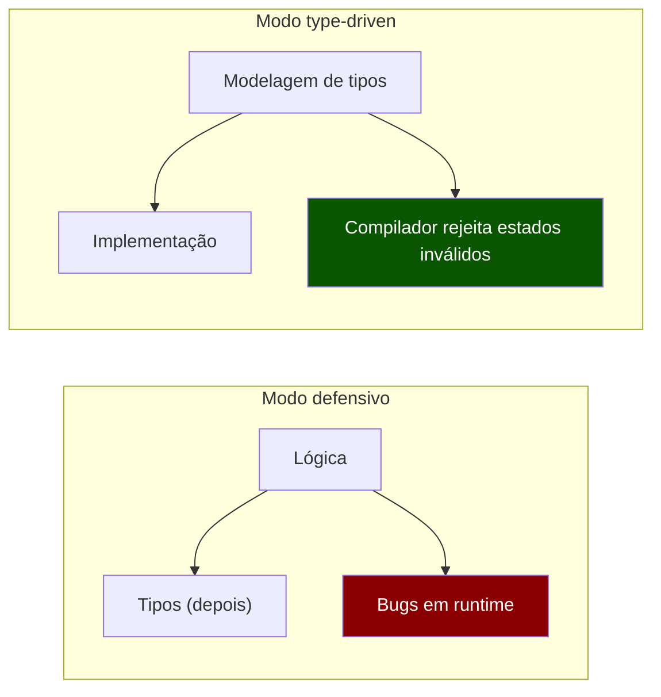
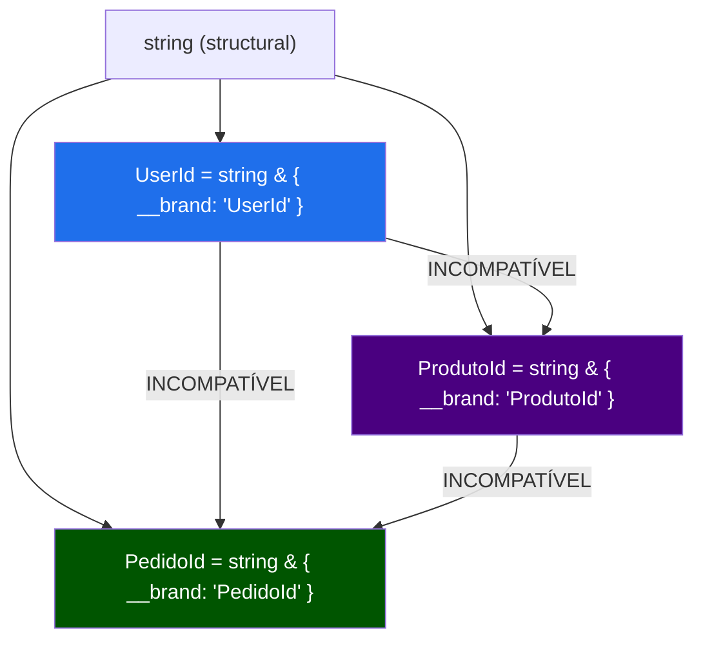
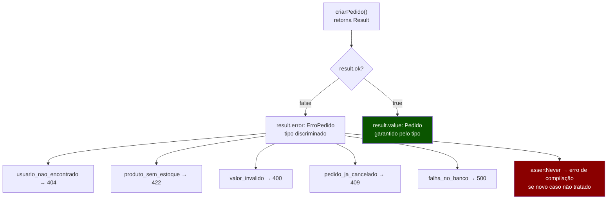
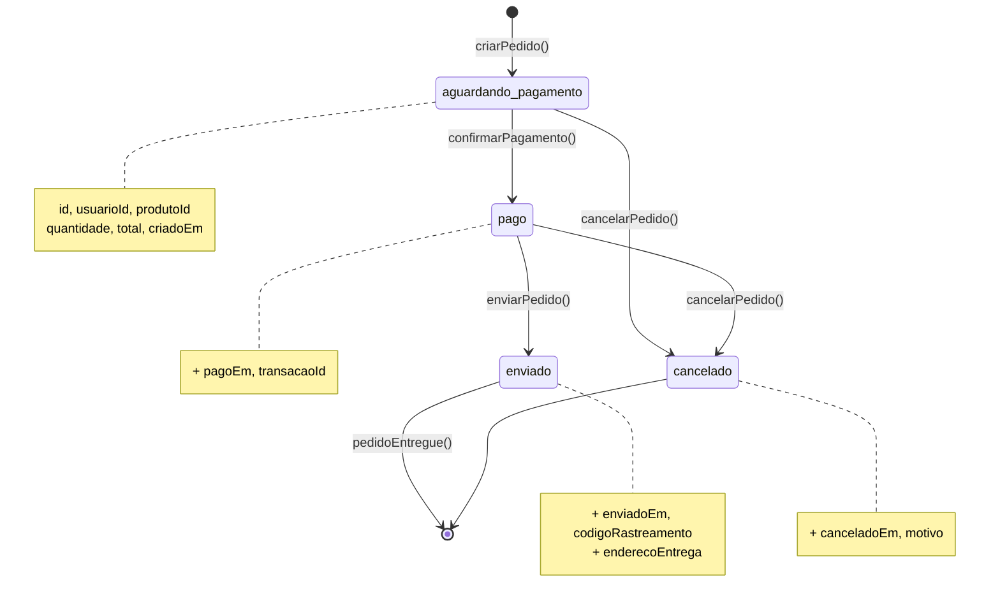
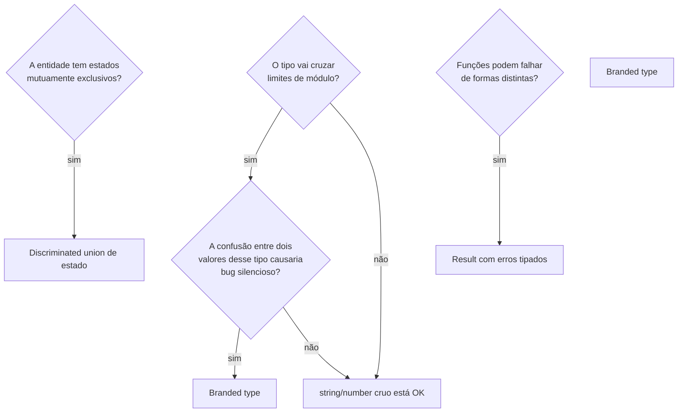

# Type-driven design: branded types, Result e estados impossíveis

> [!abstract] TL;DR
> **Type-driven design** é a disciplina de usar o sistema de tipos como ferramenta de modelagem de domínio — não apenas para documentar código que já existe, mas para tornar bugs estruturalmente impossíveis antes de escrever uma única linha de lógica. O princípio-mestre, popularizado por Scott Wlaschin (F#) e Richard Feldman (Elm), é "make impossible states unrepresentable": se o tipo não permite o estado inválido, o estado inválido nunca existe. Nesta nota, cobrimos três ferramentas concretas para chegar lá: **branded types** (nominal typing sobre structural — `UserId ≠ OrderId` mesmo ambos sendo `string`), **Result/Either** (erros como valores tipados em vez de exceções — erros que o compilador obriga você a tratar), e **modelagem de estado** com discriminated unions num nível de design acima do dia a dia. O fio condutor é um exemplo trabalhado: um sistema de e-commerce stringly-typed que refatoramos peça por peça até o compilador rejeitar categorias inteiras de bugs.

---

## O que significa deixar os tipos modelar o domínio

Existe uma diferença fundamental entre dois modos de usar TypeScript.

No **modo defensivo**, você escreve lógica primeiro e adiciona tipos depois — como etiquetas num armazém já montado. Os tipos descrevem o que o código faz, mas não impedem que ele faça coisas erradas. Uma função `criarPedido(usuarioId: string, produtoId: string)` é "tipada", mas nada impede de passar os IDs na ordem errada. Um catch que esquece de tratar um caso de erro compila limpo. Um estado de "carregando com dados" que é logicamente impossível continua sendo representável.

No **modo de design**, você usa o sistema de tipos como primeira linha de modelagem — antes de escrever lógica. Você pergunta: "quais combinações de valores fazem sentido no meu domínio? Quais são impossíveis?" E modela os tipos de forma que o TypeScript rejeite as combinações impossíveis em tempo de compilação, nunca em runtime.

Scott Wlaschin chama essa abordagem de **Domain Modeling Made Functional**. A frase que ficou famosa é:

> *"Make impossible states unrepresentable."*

Isso não é uma técnica avançada de type-level programming. É uma mudança de perspectiva sobre o que tipos fazem: eles não descrevem o código — eles restringem o espaço de programas possíveis.



TypeScript tem um sistema de tipos suficientemente expressivo para implementar essa abordagem. Não é Haskell — há limitações — mas você chega surpreendentemente longe com as ferramentas que já viu nas notas anteriores. Esta nota mostra onde essas ferramentas convergem.

---

## O exemplo base: um sistema stringly-typed

Vamos começar com código realista e dolorosamente comum. Um sistema de e-commerce onde IDs são apenas strings:

```ts
// O modelo "natural" — simples, familiar, e cheio de armadilhas
interface Usuario {
    id: string;
    nome: string;
    email: string;
}

interface Produto {
    id: string;
    nome: string;
    preco: number; // reais, ou centavos? ninguém sabe
    estoque: number;
}

interface Pedido {
    id: string;
    usuarioId: string;
    produtoId: string;
    quantidade: number;
    status: string; // "pendente"? "aguardando_pagamento"? "cancelado"? quem sabe
    total: number;  // mesmo problema do preco
}

// Funções que trabalham com esses tipos
async function buscarPedidosDoUsuario(usuarioId: string): Promise<Pedido[]> {
    return db.query('SELECT * FROM pedidos WHERE usuario_id = $1', [usuarioId]);
}

async function cancelarPedido(pedidoId: string, usuarioId: string): Promise<void> {
    // Será que pedidoId e usuarioId não foram invertidos na chamada?
    // TypeScript não tem ideia. Você também não terá, em 6 meses.
    await db.execute('UPDATE pedidos SET status = ? WHERE id = ? AND usuario_id = ?',
        ['cancelado', pedidoId, usuarioId]);
}

async function processarPagamento(
    pedidoId: string,
    valor: number, // reais? centavos?
): Promise<boolean> {
    // ...
}
```

Esse código tem múltiplas categorias de bugs estruturais:

1. **IDs intercambiáveis**: `cancelarPedido(usuarioId, pedidoId)` compila e passa os IDs na ordem errada
2. **`status` não restrito**: qualquer string é aceita — erros de digitação são indetectáveis
3. **Unidades ambíguas**: `preco` e `total` em reais ou centavos? O tipo não diz
4. **Erros como exceções**: `buscarPedidosDoUsuario` pode rejeitar (banco fora do ar) e o caller pode esquecer o catch
5. **Estados impossíveis**: um pedido com `status: "enviado"` e `total: 0` é representável

Vamos resolver cada um, em ordem crescente de sofisticação.

---

## Branded types: nominal typing sobre structural

O sistema de tipos do TypeScript é **estrutural**: dois tipos com a mesma forma são compatíveis, mesmo com nomes diferentes. Isso é ótimo para a maioria dos casos — você pode passar um objeto `{ id: string; nome: string }` onde um `Pessoa` é esperado, sem precisar declarar que implementa `Pessoa`. Mas para IDs de domínio, é uma catástrofe: `UserId` e `ProdutoId` são ambos `string`, logo são intercambiáveis — e o TypeScript não reclama.

**Branded types** (tipos marcados) resolvem isso simulando **nominal typing** sobre o structural. A ideia é adicionar uma propriedade fantasma — que existe apenas no nível de tipo, sem custo em runtime — que torna os tipos incompatíveis:

```ts
// O padrão canônico de branded type
type Brand<Base, Tag> = Base & { readonly __brand: Tag };

// IDs do domínio — incompatíveis entre si, mesmo sendo strings
type UserId   = Brand<string, 'UserId'>;
type ProdutoId = Brand<string, 'ProdutoId'>;
type PedidoId  = Brand<string, 'PedidoId'>;
```

A propriedade `__brand` é uma ficção do compilador: ela nunca existe em runtime (o objeto é uma string normal), mas no nível de tipo, `UserId` e `ProdutoId` têm `__brand` diferente — e portanto são tipos distintos. O TypeScript usa isso para impedir a troca acidental.

```ts
// Demonstração do efeito
function buscarPedidosDoUsuario(usuarioId: UserId): Promise<Pedido[]> {
    return db.query('SELECT * FROM pedidos WHERE usuario_id = $1', [usuarioId]);
}

declare const uid: UserId;
declare const pid: PedidoId;

buscarPedidosDoUsuario(uid); // OK
buscarPedidosDoUsuario(pid); // ERRO: Argument of type 'PedidoId' is not assignable to parameter of type 'UserId'.
buscarPedidosDoUsuario("abc-123"); // ERRO: string crua não é UserId
```



> [!note] A propriedade `__brand` nunca existe em runtime
> O TypeScript apaga todos os tipos ao compilar para JavaScript. A propriedade `__brand` é pura ficção de tipo — o objeto em runtime é uma string normal. Zero custo de performance, zero custo de memória. O preço que você paga é na fronteira: precisa "marcar" explicitamente quando cria um valor com tipo branded.

### Construtores de branded types: parse at the boundary

Branded types criam um problema imediato: como você cria um `UserId` a partir de uma `string`? O TypeScript não vai aceitar uma string crua — e é exatamente esse o ponto. A resposta é: **você só cria branded types nos pontos onde validou que o valor é correto**. Isso é o princípio "parse, don't validate" (nota 23) em ação.

```ts
// Opção 1: cast explícito (simples, mas sem validação)
// Use apenas quando a string veio de uma fonte confiável (banco, geração interna)
function asUserId(s: string): UserId {
    return s as UserId;
}

// Opção 2: smart constructor com validação
// Use nos boundaries externos (API, forms, query params)
function parseUserId(raw: unknown): Result<UserId, string> {
    if (typeof raw !== 'string') {
        return err(`UserId deve ser string, recebeu: ${typeof raw}`);
    }
    if (raw.trim() === '') {
        return err('UserId não pode ser vazio');
    }
    // Validação de UUID, se necessário:
    // if (!UUID_REGEX.test(raw)) return err(`UserId inválido: ${raw}`);
    return ok(raw as UserId);
}

// Opção 3: gerador interno (a fonte já garante a validade)
function gerarUserId(): UserId {
    return crypto.randomUUID() as UserId;
}
```

O padrão emerge naturalmente: dentro do domínio, todas as funções trabalham com branded types — `UserId`, `ProdutoId`, `PedidoId`. Nos boundaries externos (rotas HTTP, forms, banco de dados), você "refina" strings cruas para branded types usando smart constructors. Se a refinação falha, você devolve um erro — nunca um valor com tipo errado.

### Branded types para unidades

O problema das unidades ambíguas (`preco` em reais ou centavos?) tem a mesma solução:

```ts
// Unidades — incompatíveis entre si, mesmo sendo numbers
type Centavos = Brand<number, 'Centavos'>;
type Reais    = Brand<number, 'Reais'>;

// Funções de construção explícitas
const centavos = (n: number): Centavos => n as Centavos;
const reais    = (n: number): Reais    => n as Reais;

// Conversão explícita — erros de conversão viram erros de tipo
function centavosParaReais(c: Centavos): Reais {
    return reais(c / 100);
}

function reaisParaCentavos(r: Reais): Centavos {
    return centavos(Math.round(r * 100));
}

// Interface revisada — unidades explícitas no tipo
interface Produto {
    id: ProdutoId;
    nome: string;
    preco: Centavos; // inequívoco
    estoque: number;
}
```

Agora, somar `preco` (Centavos) com `total` (Reais) é erro de compilação. A ambiguidade foi eliminada do vocabulário do tipo.

---

## Result/Either: erros como valores tipados

A segunda grande ferramenta é modelar erros como valores — não como exceções. Funções que podem falhar devolvem `Result<T, E>` em vez de lançar e obrigar o caller a memorizar qual exceção pode chegar.

A estrutura é uma discriminated union (nota 08):

```ts
// O tipo Result — discriminated union sobre 'ok'
type Result<T, E = Error> =
    | { readonly ok: true;  readonly value: T }
    | { readonly ok: false; readonly error: E };

// Construtores — convenção fp-ts/neverthrow
const ok  = <T>(value: T): Result<T, never>  => ({ ok: true,  value });
const err = <E>(error: E): Result<never, E>  => ({ ok: false, error });
```

> [!info] Por que `Result<T, never>` e `Result<never, E>`?
> Os construtores retornam `never` no lado que não usam — `ok` nunca tem um `error`, e `err` nunca tem um `value`. Quando você os combina com `Result<T, E>`, o TypeScript infere o tipo correto. Isso é mais preciso do que retornar `Result<T, E>` com um placeholder.

### Modelando erros de domínio com discriminated union

A parte mais poderosa vem quando o tipo `E` é ele mesmo uma discriminated union de erros de domínio:

```ts
// Erros tipados do domínio de pedidos
type ErroPedido =
    | { tipo: 'usuario_nao_encontrado'; usuarioId: UserId }
    | { tipo: 'produto_sem_estoque';    produtoId: ProdutoId; estoqueAtual: number }
    | { tipo: 'valor_invalido';          valor: Centavos; motivo: string }
    | { tipo: 'pedido_ja_cancelado';     pedidoId: PedidoId }
    | { tipo: 'falha_no_banco';          causa: Error };

// Funções de domínio retornam Result<T, ErroPedido>
async function criarPedido(
    usuarioId: UserId,
    produtoId: ProdutoId,
    quantidade: number,
): Promise<Result<Pedido, ErroPedido>> {
    const usuario = await db.buscarUsuario(usuarioId);
    if (!usuario) {
        return err({ tipo: 'usuario_nao_encontrado', usuarioId });
    }

    const produto = await db.buscarProduto(produtoId);
    if (!produto) {
        return err({ tipo: 'produto_sem_estoque', produtoId: produtoId, estoqueAtual: 0 });
    }

    if (produto.estoque < quantidade) {
        return err({
            tipo: 'produto_sem_estoque',
            produtoId: produto.id,
            estoqueAtual: produto.estoque,
        });
    }

    const total = centavos(produto.preco * quantidade);
    const pedido = await db.inserirPedido({ usuarioId, produtoId, quantidade, total });

    return ok(pedido);
}
```

O caller é **forçado** pelo compilador a lidar com o erro. Não é possível acessar `result.value.id` sem antes verificar `result.ok`. E quando verifica, a discriminated union no erro permite tratamento exaustivo:

```ts
// Handler HTTP — converte Result em resposta HTTP
async function routePostPedido(req: Request, res: Response) {
    const result = await criarPedido(
        req.body.usuarioId as UserId, // vem da session já validada
        req.body.produtoId as ProdutoId,
        req.body.quantidade,
    );

    if (!result.ok) {
        // result.error é ErroPedido — TypeScript sabe exatamente o que é
        switch (result.error.tipo) {
            case 'usuario_nao_encontrado':
                return res.status(404).json({ message: 'Usuário não encontrado' });

            case 'produto_sem_estoque':
                return res.status(422).json({
                    message: 'Produto sem estoque',
                    estoqueAtual: result.error.estoqueAtual, // acessível com segurança
                });

            case 'valor_invalido':
                return res.status(400).json({ message: result.error.motivo });

            case 'pedido_ja_cancelado':
                return res.status(409).json({ message: 'Pedido já foi cancelado' });

            case 'falha_no_banco':
                // Log interno, resposta genérica
                console.error(result.error.causa);
                return res.status(500).json({ message: 'Erro interno' });

            default:
                return assertNever(result.error); // exhaustiveness check
        }
    }

    // Aqui, result.ok === true e result.value é Pedido
    return res.status(201).json(result.value);
}
```

Compare com o equivalente em try/catch: o erro é `unknown` (TS 4.0+) ou `any` (legado), você não sabe quais erros esperar, não tem exhaustiveness check, e esquecer um caso não gera nenhum aviso em tempo de compilação.



### Encadeamento: o pipeline de Result

Na prática, você frequentemente encadeia operações que cada uma pode falhar. A tentação é usar vários `if (!result.ok) return result` aninhados — o que funciona, mas fica verboso. Você pode criar um helper de encadeamento:

```ts
// Encadeamento funcional de Results — semelhante ao 'andThen' de Rust/fp-ts
function andThen<T, U, E>(
    result: Result<T, E>,
    fn: (value: T) => Result<U, E>,
): Result<U, E> {
    return result.ok ? fn(result.value) : result;
}

// Ou a versão async
async function andThenAsync<T, U, E>(
    result: Result<T, E>,
    fn: (value: T) => Promise<Result<U, E>>,
): Promise<Result<U, E>> {
    return result.ok ? fn(result.value) : result;
}

// Pipeline de validação usando encadeamento
async function processarCheckout(
    rawUsuarioId: string,
    rawProdutoId: string,
    rawQuantidade: number,
): Promise<Result<Pedido, ErroPedido>> {
    // Fase 1: parse (nota 23)
    const uidResult = parseUserId(rawUsuarioId);
    if (!uidResult.ok) return err({ tipo: 'usuario_nao_encontrado', usuarioId: '' as UserId });

    const pidResult = parseProdutoId(rawProdutoId);
    if (!pidResult.ok) return err({ tipo: 'produto_sem_estoque', produtoId: '' as ProdutoId, estoqueAtual: 0 });

    // Fase 2: domínio
    return criarPedido(uidResult.value, pidResult.value, rawQuantidade);
}
```

> [!tip] Bibliotecas para Result em TypeScript
> Se você quer um `Result` mais rico (encadeamento fluente, `map`, `flatMap`, `match`), considere:
> - **`neverthrow`** — a mais popular, API fluente, boa integração com TS
> - **`ts-results`** — mais simples, mais próxima do Rust
> - **`fp-ts`** — poderosa mas steep learning curve (ecossistema funcional completo)
>
> Para a maioria dos projetos, implementar `Result` manualmente como acima é suficiente e evita dependências externas.

---

## Modelando estados com discriminated unions: nível de design

Você já viu discriminated unions na nota 08 para modelar estado de fetch. Aqui, subimos um nível: usar o padrão para modelar o **ciclo de vida do domínio** — as transições legítimas de estado de uma entidade.

No exemplo do e-commerce, um `Pedido` passa por estados bem definidos. A modelagem ingênua é um campo `status: string`. O problema: você pode criar um `Pedido` com `status: "enviado"` e `enderecoEntrega: null` — estado impossível no negócio.

A solução é modelar cada estado como um tipo distinto, com exatamente os campos que fazem sentido para aquele estado:

```ts
// Modelagem de estado do pedido como discriminated union de domínio
type Pedido =
    | {
        readonly tipo: 'aguardando_pagamento';
        readonly id: PedidoId;
        readonly usuarioId: UserId;
        readonly produtoId: ProdutoId;
        readonly quantidade: number;
        readonly total: Centavos;
        readonly criadoEm: Date;
        // Sem endereço — ainda não foi pago
    }
    | {
        readonly tipo: 'pago';
        readonly id: PedidoId;
        readonly usuarioId: UserId;
        readonly produtoId: ProdutoId;
        readonly quantidade: number;
        readonly total: Centavos;
        readonly criadoEm: Date;
        readonly pagoEm: Date;        // só existe quando pago
        readonly transacaoId: string; // ID da transação de pagamento
    }
    | {
        readonly tipo: 'enviado';
        readonly id: PedidoId;
        readonly usuarioId: UserId;
        readonly produtoId: ProdutoId;
        readonly quantidade: number;
        readonly total: Centavos;
        readonly criadoEm: Date;
        readonly pagoEm: Date;
        readonly transacaoId: string;
        readonly enviadoEm: Date;       // só existe quando enviado
        readonly codigoRastreamento: string;
        readonly enderecoEntrega: Endereco; // obrigatório ao enviar
    }
    | {
        readonly tipo: 'cancelado';
        readonly id: PedidoId;
        readonly usuarioId: UserId;
        readonly produtoId: ProdutoId;
        readonly quantidade: number;
        readonly total: Centavos;
        readonly criadoEm: Date;
        readonly canceladoEm: Date;   // só existe quando cancelado
        readonly motivo: string;
    };
```



Agora as **funções de transição de estado** expressam quais transições são legítimas:

```ts
// Só um pedido 'aguardando_pagamento' pode ser pago
function confirmarPagamento(
    pedido: Extract<Pedido, { tipo: 'aguardando_pagamento' }>,
    transacaoId: string,
): Extract<Pedido, { tipo: 'pago' }> {
    return {
        ...pedido,
        tipo: 'pago',
        pagoEm: new Date(),
        transacaoId,
    };
}

// Só um pedido 'pago' pode ser enviado
function enviarPedido(
    pedido: Extract<Pedido, { tipo: 'pago' }>,
    codigoRastreamento: string,
    enderecoEntrega: Endereco,
): Extract<Pedido, { tipo: 'enviado' }> {
    return {
        ...pedido,
        tipo: 'enviado',
        enviadoEm: new Date(),
        codigoRastreamento,
        enderecoEntrega,
    };
}

// Só 'aguardando_pagamento' ou 'pago' podem ser cancelados
// (não faz sentido cancelar um pedido já enviado)
type PedidoCancelavel = Extract<Pedido, { tipo: 'aguardando_pagamento' | 'pago' }>;

function cancelarPedido(
    pedido: PedidoCancelavel,
    motivo: string,
): Extract<Pedido, { tipo: 'cancelado' }> {
    return {
        ...pedido,
        tipo: 'cancelado',
        canceladoEm: new Date(),
        motivo,
    };
}
```

Note o uso de `Extract<Pedido, { tipo: '...' }>`: é um conditional type utilitário que filtra os membros da union pelo discriminante. `Extract<Pedido, { tipo: 'pago' }>` retorna apenas o membro `{ tipo: 'pago'; ... }`.

Tentar enviar um pedido que ainda aguarda pagamento é erro de compilação:

```ts
declare const pedidoPendente: Extract<Pedido, { tipo: 'aguardando_pagamento' }>;

enviarPedido(pedidoPendente, "BR123", endereco);
// ERRO: Argument of type '{ tipo: "aguardando_pagamento"; ... }' is not assignable
//       to parameter of type '{ tipo: "pago"; ... }'.
```

A função `enviarPedido` **recusa na compilação** um pedido no estado errado. Não existe runtime check para verificar isso — o próprio tipo garante que só chega quem pode ser enviado.

---

## Juntando tudo: o modelo refatorado

O modelo stringly-typed do início, depois das três refatorações:

```ts
// ANTES (stringly-typed, cheio de armadilhas)
interface PedidoAntigo {
    id: string;
    usuarioId: string;
    produtoId: string;
    quantidade: number;
    status: string;
    total: number;
}

// DEPOIS (type-driven, estados impossíveis eliminados)
type PedidoSeguro =
    | {
        readonly tipo: 'aguardando_pagamento';
        readonly id: PedidoId;      // branded — não troca com UserId
        readonly usuarioId: UserId; // branded — não troca com ProdutoId
        readonly produtoId: ProdutoId;
        readonly quantidade: number;
        readonly total: Centavos;   // branded — não confunde com Reais
        readonly criadoEm: Date;
    }
    | {
        readonly tipo: 'pago';
        readonly id: PedidoId;
        readonly usuarioId: UserId;
        readonly produtoId: ProdutoId;
        readonly quantidade: number;
        readonly total: Centavos;
        readonly criadoEm: Date;
        readonly pagoEm: Date;
        readonly transacaoId: string;
    }
    // ... demais estados
```

O que o compilador agora garante:

- IDs de tipos diferentes não são intercambiáveis (branded types)
- Unidades monetárias não são somadas sem conversão explícita (branded types)
- Erros são tratados explicitamente no call site (Result)
- Novos erros de domínio adicionados ao `ErroPedido` geram erro de compilação em todo switch não atualizado (exhaustiveness)
- Transições de estado inválidas são recusadas na compilação (discriminated union de domínio + Extract)

---

## Type-driven design na prática: quando e quanto

A pergunta prática é: onde aplicar? Modelar tudo com branded types e discriminated unions de domínio completo tem custo — mais verbosidade, mais indireção, mais cerimônia nos boundaries.

A heurística que emerge da prática:



> [!tip] Regra prática de quando usar cada ferramenta
> - **Branded types**: IDs de domínio, unidades com semântica distinta (Centavos vs Reais, Metros vs Pés), tokens de autenticação. Não vale a pena para `string` de uso geral que nunca cruza fronteiras.
> - **Result**: funções que chamam banco, rede, arquivo, parsing de input externo. Não vale a pena para funções puras que não podem falhar.
> - **Discriminated union de estado completo**: entidades com ciclo de vida rico (pedidos, publicações, usuários com status de verificação). Para state simples (loading/success/error), a versão da nota 08 já é suficiente.

A armadilha oposta existe: over-engineering. Uma função utilitária interna que processa uma lista de strings não precisa de branded types. Um helper que nunca falha não precisa de Result. Type-driven design não significa modelar o universo inteiro — significa modelar os pontos onde a confusão causaria dano real.

---

## Como explicar em inglês

**Type-driven design** is the discipline of using the type system as the primary tool for domain modeling — not just for documentation, but to make entire categories of bugs structurally impossible. The guiding principle, coined by Scott Wlaschin in the F# community, is "make impossible states unrepresentable": if the type doesn't allow a state, the state cannot exist at runtime, period.

**Branded types** (also called opaque types or nominal types in other languages) simulate nominal typing over TypeScript's structural type system. A `UserId` and an `OrderId` are both strings at runtime, but at the type level they are incompatible — passing one where the other is expected is a compile-time error. The trick is adding a phantom property (the "brand") that exists only at the type level and is erased at compile time, so there is zero runtime cost.

**Result types** (sometimes called Either types) model errors as values instead of exceptions. A function returning `Result<Order, OrderError>` forces the caller to handle both the success and failure cases explicitly — the compiler won't let you access the value without first checking `result.ok`. When `OrderError` is itself a discriminated union of domain-specific errors, you get exhaustiveness checking across error cases too: add a new error variant and every `switch` that doesn't handle it becomes a compile error.

The combination of these three tools — branded types, Result, and discriminated unions for state — gives you a domain model where the type system enforces the business rules, not just the shape of data.

### Vocabulário-chave

| Português | Inglês |
|---|---|
| design orientado a tipos | type-driven design |
| estados impossíveis irrepresentáveis | make impossible states unrepresentable |
| tipo marcado / tipo nominal | branded type / opaque type / nominal type |
| propriedade fantasma | phantom property |
| tipagem nominal sobre estrutural | nominal typing over structural |
| erro como valor | error as a value |
| smart constructor | smart constructor |
| pipeline de Result | Result pipeline / railway-oriented programming |
| transição de estado | state transition |
| ciclo de vida de entidade | entity lifecycle |
| modelos de domínio | domain models |
| tipo Extract | Extract utility type |
| erro de domínio | domain error |
| boundary (fronteira sistema) | boundary / system boundary |

---

## Armadilhas comuns

> [!warning] Armadilha 1: branded types sem smart constructors
> Declarar `type UserId = Brand<string, 'UserId'>` e depois fazer `const id = someString as UserId` em todo lugar derrota o propósito. O cast `as UserId` é uma promessa ao compilador — se você a faz sem validação, voltou ao mundo do `any` com mais cerimônia. Use smart constructors nos boundaries; só use `as` quando a fonte é confiável (banco de dados, geração interna).

> [!warning] Armadilha 2: Result sem erros tipados
> `Result<T, Error>` (com `Error` genérico) é melhor que exceções, mas você perde o exhaustiveness check nos erros. O valor de `Result` é maior quando `E` é uma discriminated union de domínio — assim o compilador te avisa quando você adiciona um novo erro e esquece de tratar em algum switch.

> [!warning] Armadilha 3: misturar Result e throw na mesma função
> Funções que às vezes retornam `Result` e às vezes lançam exceção são piores que qualquer um dos dois isoladamente — o caller não sabe qual contrato esperar. Escolha um e seja consistente: Result no domínio, exceções nas camadas de infraestrutura (e converta na fronteira).

> [!warning] Armadilha 4: sobrenominalizar tudo
> Criar branded types para cada `string` do sistema gera overhead sem ganho. `nome: string` não precisa de `type NomeUsuario = Brand<string, 'NomeUsuario'>` — a confusão entre nome e outro nome não causaria bug silencioso. Reserve para IDs de domínio e unidades com semântica física.

> [!warning] Armadilha 5: confundir `Extract` com `Pick`
> `Extract<Pedido, { tipo: 'pago' }>` filtra os **membros de uma union** pelo critério. `Pick<Pedido, 'id' | 'total'>` seleciona **campos de um objeto**. São operações completamente diferentes — e a confusão em generics que trabalham com discriminated unions gera erros enigmáticos.

> [!warning] Armadilha 6: modelar a persistência, não o domínio
> A discriminated union do `Pedido` reflete o domínio de negócio. No banco de dados, você provavelmente vai persistir como uma única tabela com coluna `status` e campos anuláveis. Não confunda o modelo de persistência com o modelo de domínio — use um mapper na fronteira. Tentar fazer a union do TypeScript refletir exatamente o schema SQL leva a compromissos que enfraquecem ambos.

---

## Veja também

- [[08 - Discriminated unions e exhaustiveness]] — a fundação: o padrão de tagged union e exhaustiveness checking que esta nota pressupõe e expande
- [[12 - Generics - defaults, classes e interfaces genéricas]] — `Extract<T, U>` e `Result<T, E>` usam generics; a nota 12 cobre variância e defaults que aparecem aqui
- [[23 - A fronteira type↔runtime - parse, don't validate]] — o princípio "parse, don't validate" e os smart constructors de branded types são diretamente ligados; leia em conjunto
- [[03-Dominios/Ciência/Paradigmas/10 - Tipos algébricos, pattern matching e erros sem exceção|Tipos algébricos]] — a teoria por trás: sum types (unions), product types (objetos), Option e Either como conceitos algébricos; onde `Result` mora na matemática de tipos
- [[03-Dominios/Engenharia/Design de Software/index|Design de Software]] — domain modeling, DDD e Value Objects (que branded types implementam no nível de tipo); padrões OO de design que type-driven design complementa
